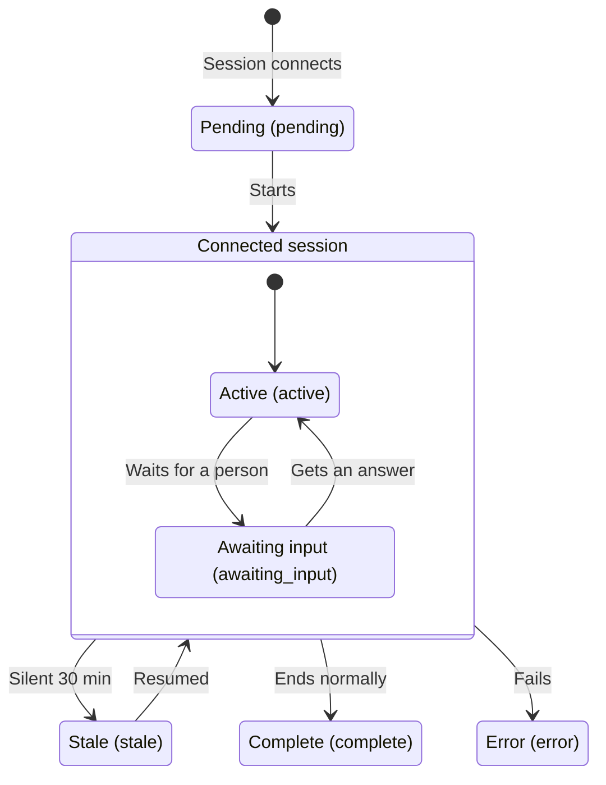

A session is **one agent that is running right now**. The session monitor shows what is going on.

## Reading the monitor

The session list is on the left, and the **activity rail** for the selected session is on the right. Select a row and that session's activity appears on the same screen. A monitor should not make you go to another screen to find out why a session stalled. On a narrow screen, the rail collapses. Open **Details** on the card to see the activity instead. **The detail screen shows the same content as the rail**: **What it did**, **Activity**, collapsed runs, expandable raw payloads, and [Load earlier activity]. You see no less on a narrow screen.

Each session shows the machine it runs on and who owns it, which agent is running (`claude-code` · `codex` · `web` · `other`), and which task it has claimed. A session that connects without declaring its kind appears as `other`. Click the task key to **open the task's detail page**. This works the same everywhere: on the card, in the rail, and in the current task and claim history on the session detail page. Clicking a link inside a card does not select the card.

The card also shows four more things: the **time left on the lease** (it changes color under two minutes, which means the claim is about to be reclaimed), when the last heartbeat arrived, the `+N −M` changes this session has made, and its declared scope (hover to expand it). The lease lasts 30 minutes and uses the **same timer** as the task claim.

**A session waiting for input** shows what it is waiting for. If a question is open, you see its title. Otherwise, it shows that it is waiting for approval. **[Open in inbox ↗]** takes you straight to the matching card in the inbox. **A session with no claimed task** shows the task it last had (**Reclaimed** if its lease ran out). A `stale` session's note also shows the key of the reclaimed task. If there are no sessions at all, **Open the install guide** and **Issue a token** links appear.

The list does not load all at once. If there are more sessions, **[Load more]** appears below the list. Clicking it **appends** the next page below, and the rows you were already looking at stay where they are. The counts in the summary above the list cover the **whole project**, whatever the filter or page. The summary shows the whole picture, and the list shows part of it.

**The state filter and the session open in the rail are kept in the URL.** To show someone a session, share the URL. Reloading the page keeps the same session open. Changing the state filter deselects the session.

### Machines with the plugin on

**`Plugin on: N / M machines`** above the list counts how many machines have the NERV plugin on, out of the machines that opened a Claude Code session in the last 30 days. Click it to expand a list of those machines. Each row shows **On** with the plugin version, or **Off**, along with whose machine it is and when it was last seen. **Machines that are off are listed first.**

- **Each machine's state comes from its most recent session.** A machine where the plugin was turned on and then off shows as off.
- **A machine that is off connected over MCP only, without the plugin.** It can still claim tasks, but without hooks, its sessions leave no activity or branch on this screen. If a session looks unusually empty, check here first. To turn the plugin on, see [Installing the plugin](/help/install).
- **Codex is not counted.** The plugin is for Claude Code, so it is normal for Codex to run without it.
- This check works **from plugin 0.3.2** on. Older versions do not report their version, so they show as off. Update with `/plugin marketplace update`, and the machine shows as on from its next session.

## Statuses

| Status           | Meaning                                                                                                                                       |
| ---------------- | --------------------------------------------------------------------------------------------------------------------------------------------- |
| `pending`        | Getting ready to start                                                                                                                        |
| `active`         | Running                                                                                                                                       |
| `awaiting_input` | **Waiting for a person.** A question is open, or a review request or `critical` downgrade request from this session is waiting for a decision |
| `complete`       | Finished                                                                                                                                      |
| `error`          | Ended in failure                                                                                                                              |
| `stale`          | No response for over 30 minutes                                                                                                               |

`stale` does not mean the session failed. It means its **state is unknown**. The machine may have gone to sleep, the network may have dropped, or the process may have died. There is no way to tell which, so the screen shows only what is confirmed.

The result, however, is certain: **when a session goes `stale`, the task it had claimed is reclaimed and returns to `ready`.** The card shows this too.

## Activity

When you open a session, the rail has **two sections**. The top section shows **what it did** (what it is working on, and whether it is stuck). The bottom section is the **tool log**. They are in this order because, on this screen, which tool ran is not the first thing you want to know.

**The tool log does not record every tool call.** The default hooks send only the **four tools that edit files or run commands**: `Write`, `Edit`, `MultiEdit`, `Bash`. Reads, searches and `nerv_*` tool calls are not recorded. In other words, the log shows what was changed, but not what was looked at.

There are five kinds of activity: `thought` (reasoning), `action` (a tool ran), `elicitation` (asking a person), `response` (an answer), and `error`. The agent's hooks send the activity. Where hooks are unavailable, the agent posts the events itself.

Two things make the log easier to read.

- **Consecutive runs of the same tool are collapsed into one** (`×12`). If a different tool runs in between, it counts as a separate phase and is not merged.
- **Failures are never collapsed.** Each one stays visible on its own. Inside a group, the marker meant to flag a failure would be useless.

Activity loads newest first, one page at a time. If there is earlier activity, **[Load earlier activity]** appears at the top of the list. Clicking it **adds** the older entries above. Keep clicking to go all the way back to the start of a long session.

Expand a row to see the **raw payload** (tool input and response). Only **the session's owner and admins** can see raw payloads. Secrets are masked when they are stored, but masking is never perfect, so access is restricted as well.

Other members see the title, whether it succeeded, the tool name and the **body**. Only the raw payload is hidden. This means **the instructions and stop reasons described below are visible to every project member.**

The **summary strip** at the top shows counts and also works as a filter. Click a number to show only the sessions in that state. **All six states are always shown.** A state with no sessions shows a dimmed `0` (in a project with no sessions at all, a single "No sessions" line appears instead of six zeros). A `0` cannot be clicked, because there are no sessions to filter. If only states with sessions were shown, you could not tell whether there are zero errors or whether the error state does not exist. The positions would also shift from visit to visit, so you would have to look for the one you want each time.

## Instructions and stopping

The **Intervene** section on the card has two buttons: [Send instruction] and [Stop]. **Only the session's owner and admins can use them.** On someone else's session, the buttons are **disabled from the start**, and the reason is shown next to them. That way, you never write out a stop reason only to be refused. An agent token cannot do either. Only a person can.

**Send instruction** asks a running agent to change direction. The instruction does not interrupt the agent right away. It is delivered with the agent's next **heartbeat** to the server. The same instruction is never delivered twice.

**Delivery has one condition.** Only a session **with a claimed task** sends heartbeats. So a session without a claim **does not receive instructions**. This includes a session that is only writing specs, one that has already released its task, and a `stale` session. The input box is still available on these sessions. If nothing happens after you send an instruction, first check whether the session has a claimed task.

Heartbeats do not arrive on a precise timer. The agent checks whether the interval has passed when it calls a tool or moves to the next unit of work, and sends a heartbeat then. So while one long piece of work is running, the heartbeat arrives later. **"Within a minute" is the best case, not the worst case.**

**Stop** does not deliver an instruction. It **reclaims the claim immediately**. The most common reason to click it is that the session has already died and cannot send heartbeats. In that case, waiting for an instruction to be delivered would do nothing.

Stopping takes more than one click. A confirmation dialog opens, and **a reason is required**. While the reason is empty, the confirm button stays disabled. The reason field is **separate from the instruction field**. An instruction you were typing does not become the reason, and if you cancel, the instruction field keeps what you wrote. Press Esc to close the dialog. Enter a reason and confirm, and the claim is released. The task returns to `ready`.

## Questions

An agent raises a question when it cannot decide on its own. There are two urgency levels.

- `blocking` — the agent does not continue until it gets an answer. The session goes to `awaiting_input`.
- `normal` — the agent keeps working while it waits for an answer.

**A session that submits a review request (T2/T3) or a `critical` downgrade request also stops and waits for a decision.** When you decide in the inbox, the session receives the result on its next heartbeat and continues. If it still has other pending items (an unanswered question, or another request without a decision), it keeps waiting.

Questions arrive **as cards in the inbox** (see [Inbox and notifications](/help/inbox)). Once you answer, the session picks up where it left off.
