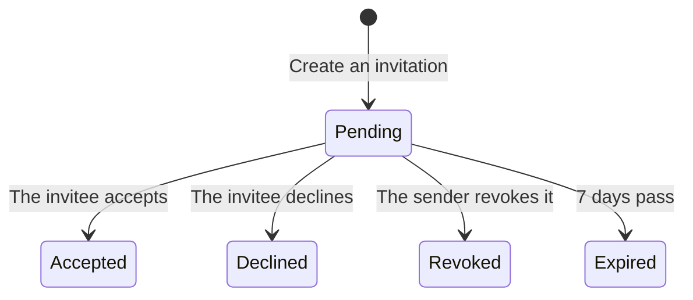

**Settings are grouped by scope.**

- **Organization**: General · Members and roles · Organization tokens
- **Project**: Projects · Gate policy · Integrations (planned for Phase 2, disabled for now)
- **You**: My account · Agent tokens

On a wide screen the list opens under **[Settings]** in the left column; on a narrow screen it runs across the top of the settings screen. The top of the screen shows **which organization's settings** you are in, and [Settings] opens the first item, **General**.

**Switching the organization keeps you in settings.** Switch at the top of the left column while in settings (or the inbox, notifications or help) and the same screen opens for the new organization. Switching from a project screen takes you home, because the new organization does not have that project.

## General (organization)

This is where you rename the organization, delete it, or create a new one.

**This screen works on the organization picked at the top of the left column.** If you belong to more than one, switch there first, then make your change.

Only **organization admins** (people whose organization-wide role is admin) can rename or delete the organization. If you are not one, the note at the top of the screen **names the organization admins to ask**.

- **Rename** — only the name changes. **The slug does not.** Addresses and API paths are built on the slug, so changing it would break every link already shared.
- **Delete the organization** — possible **only while it has no projects**. Deleting cannot be undone, so there is a reversible step in front of it. **Archived projects count too, though.** Projects cannot be deleted from the app, so an organization that ever had a project cannot be deleted from this screen today. In that case [Delete organization] is **disabled**, and the line below it says how many projects (how many archived) are in the way. Do not archive projects just to delete the organization. An empty organization is deleted after one more confirmation.
- **New organization** — **[Create a new organization…]** at the bottom creates another organization. **Anyone** can create one, and whoever creates it becomes its admin. Enter a **first project name** as well and the project is created and opened; leave it empty and the new organization's project list opens with the create form ready. Specs are split between organizations, so if your team already uses one, ask for an invitation instead of creating a new one. **[Manage · new organization]** in the organization menu at the top of the left column opens this screen.

## Projects

This is where you create projects, edit their name and repository, and archive or restore them. It is the first item in the **Project** group of the settings menu, and it lists the projects of the organization picked at the top of the left column.

**Each action needs a different permission.** Only **organization admins** can use [+ New project]. Organization admins and **that project's admins** can edit or archive a project row. A project admin can open only their own project's row; the other rows are locked. If you are not an admin anywhere, [Show archived] is hidden too. [+ New project] is **still shown, disabled,** for anyone who is not an organization admin, and the note at the top of the screen **names the organization admins to ask**.

- **Create a project** — type a name and the address (slug) and key are filled in for you. The address is built from the letters and digits in the name, so **a name without any leaves the address empty, with the reason shown under the field**. Type the address and key yourself in lowercase letters and digits. The key is the short prefix on **task** numbers (`CLV-T-3F92A1`). A spec key is separate: a person chooses it when creating the document. **[Manage · new project]** under the project list in the left column (organization admins) opens this screen with the form **already open**. Once the project is created, **[Open]** in the message at the lower right takes you straight into it.
- **Rename** — only the name changes. **The slug does not.**
- **Repository kind** — chosen in the same [Edit] (`github` by default, or `gitlab`). It sets only the **format of the links**. GitLab puts `/-/` in commit and file addresses, so links do not open unless this is set. **The server never connects to the repository.** For the same reason we do not guess the kind from the domain: a self-hosted address does not tell you which kind it is.
- **Repository URL and default branch** — entered in the project row's [Edit], together with the name. Commits and code paths attached to a task's **evidence** open from this URL (see "Click the evidence" in the [Tasks](/help/tasks) chapter). When it is empty those rows cannot be clicked, and the task screen says so. To remove a wrong URL, **clear the field and save**.
- **Archive a project** — you are **asked once more, in place**, and told how many approvals are waiting in that project (they are hidden for everyone, as below). An archived project leaves the lists but is not deleted, and its address still opens. You can undo it: turn on **Show archived** above the list and click **Restore** on that row.
- An archived project's **notifications and approval cards are hidden**, so nobody keeps waiting on decisions for a project that was put away. They come back when you restore it.
- You cannot create a new project with the same slug. If an archived project uses that slug, the screen tells you. **Restore** it instead of creating a new one.

## Members

The Members and roles screen has two tabs. The first, **Members**, opens by default; the second, **Invitations**, is where you invite people (see "Invitations" below). The numbers next to the tabs are the member count (people) and the number of pending invitations.

The Members tab shows who is here and in what role. A role can be granted across the whole organization or on a single project. When one person holds roles in both, **permissions are the union**.

The table title shows **which organization's members these are**, and the **Applies to** column shows, by project **name**, whether a role is organization-wide or for one project. Turning a role chip on adds the role **in that row's scope**.

**Each person's rows are grouped together.** Name and email appear on the group's first row only; the organization-wide row comes first, then the project rows. On a project row, a **dashed chip marked ↳** is a role the person **already holds organization-wide**. They have that permission in this project too, so it needs no separate grant and cannot be clicked. Change it on the organization-wide row.

Only `admin` can edit members and roles: **organization-wide rows by organization admins only**, and project rows also by that project's admins. Rows you cannot change have their chips locked, and hovering a chip shows why. If you are not an organization admin, the note at the top of the screen **names the organization admins to ask**. **A member's last role cannot be removed with a chip**, because a member with no role can open nothing yet still appears in the list.

**Remove someone who has left with [Remove…].** Organization admins have it at the end of each person's first row. It deletes **all** of that person's memberships and **revokes their active tokens**; clicking it shows how many of each and asks once more. A project admin gets **[Remove from this project]** at the end of their own project's rows, which removes every role on that row. You cannot remove yourself. To undo it, invite them again.

**The organization's last admin cannot be removed.** When only one person holds the organization-wide admin role, that person's admin chip and [Remove…] are locked. An organization with no admin has nobody who can manage memberships, so there is no way to recover it (the server refuses too). Make someone else an organization admin first. **Turning off your own admin chip asks once more**: editing on this screen locks the moment you do, and getting it back takes another admin.

## Invitations

Invitations are sent from the **Invitations** tab of the Members and roles screen. Only an `admin` can send them; every other role sees **[+ Invite] disabled**. **Only organization admins can invite to the whole organization**; a project's admin can invite to that project only.

Click **[+ Invite]**, pick an email, a role and **what it applies to**, and you get an **invitation link**. The form starts by showing **the organization you are inviting into** (switch organizations at the top of the left column), and the scope is either "Whole organization (every project)" or one of that organization's projects, **by name**. Once created, a "who → organization / scope · role" summary appears above the link.

- **The email is sent automatically.** If this server has email sending set up, the invitation link is sent to that address and the screen shows **"Mail sent"**. If not, it shows **"copy it and pass it on"** instead. Using one message for both cases would make one of them wrong, and the invitee would wait for an email that never arrives.
- **The link is shown once, right there.** Whether or not the email went out, the link appears on the same card, and the server cannot produce it again. On a server that cannot send email, use **[Copy link]** and pass it on yourself.
- **Only the invited email address can accept.** If the link reaches someone else, it does not let them in.
- It **expires after 7 days**. Just create a new one.
- It is the **same link** whether or not the person already has an account. Without one, they sign up and come back to the invitation automatically.
- **The Sent invitations list shows when each one was last sent** (**not sent** if it never was). Never sent and sent-but-not-received are different problems; if the screen could not tell them apart, you would end up sending the same invitation several times.
- **You see the invitations within your own reach.** Organization admins see every invitation in the organization; a project's admin sees only invitations to that project.
- Sent one by mistake? **Revoke** it from the list. You are asked once more, and the link stops working at once. Revoking keeps the record, because who invited whom is part of the audit trail.
- Each invitation in the list is **Pending · Accepted · Revoked · Declined · Expired**. **Declined** means the invited person turned it down; you can invite them again.

The invited person sees the invitation as a card on **Home, Getting started and Notifications**, and can accept it right there. **Someone without an account has to sign up and confirm their email before they can accept** (on a server that can send email; the steps are under "Creating an account" in [Getting started](/help/start)).

The card shows **when it expires** ("Expires in 3 days"), and an unwanted invitation can be dismissed with **[Decline]**. You are asked once more, and after declining you need a new invitation to join. **Declining an invitation to a project notifies the person who sent it**; clicking that notification opens the Invitations tab (an organization-wide invitation sends no notification and only shows as **Declined** in the sent list). Accepting an invitation that gives you your first membership opens **Get started**, which shows your role and what to do next.

Opening an invitation link shows **which account you are signed in with**. If you opened it **while signed in as someone else**, **[Sign in with another account]** appears instead of [Join]. It signs you out, and after you sign in again you come back to the link. An invitation that has ended (expired, revoked, declined) or a link that does not exist shows **Ask the person who invited you for a new link** and **[Go to NERV]**.

## My account

It is the first item in the **You** group, and the first line of the menu under your name at the top right.

- **Display name** — the name shown in member lists, cards and activity. Change it and press **[Save]**; every screen picks it up at once. Leading and trailing spaces are trimmed, and it cannot be empty.
- **Email** — shown only. It is your sign-in ID, so it is not changed here.
- **Password** — enter your current password and the new one (twice), then press **[Change password]**. The new password needs at least 8 characters, and you are told before sending if the two do not match. **"Sign out every other device"** is on by default — other browsers and devices are signed out, and the browser you are using stays signed in. A wrong current password is reported right in the form.

An agent token cannot change your name — a person's account is changed by that person. If you **forgot** the password, use "Forgot your password?" on the sign-in screen to get a link by mail and set a new one (see "Forgot your password" in [Getting started](/help/start)).

## Tokens

Issue and revoke **your own** tokens for agents — the list holds yours from every organization you belong to. **The steps from issuing to connecting are in the [Plugin install](/help/install) chapter**, and help opened from this tab goes there. After issuing, a card gives you **three connection steps** (token · plugin install · one setup line) and turns into **"Connected"** the first time the token is used. Scopes start as the **[Recommended]** set. Tokens are **bound to a project**, so none can be issued while the organization has no projects — organization admins see **[Create a project]** in that spot.

**Revoking cannot be undone, so it asks once more** and names the **machine that last used** the token — the agent there is cut off from its next call. Organization admins see who holds which token for which project under **[Organization tokens]** in the organization group, and cut off other people's live tokens there with the same [Revoke] (someone who has left, for example). The table filters by project name and owner. Anyone who is not an organization admin does not see this item.

## Gate policy

Gate policy is **per project**, not one set for the whole organization. **Pick the project you are editing with this tab's project picker**; the title, "Gate policy — project name", says which one it is. It starts on the project you last looked at ("Recent" in the left column). The chosen project stays in the address (`?project=`), so you can pass the link on, and while you are in a project **[Settings]** under it in the left column takes you straight to that project's gate policy.

Gates decide what a spec change has to go through, according to **how risky it is**. Tiers run T0–T3, and the tier follows from the sum of four risk axes: side effects, sensitivity, reversibility and blast radius.

- **Tier boundaries** — the scores at which T1, T2 and T3 begin, in **three fields**. Lower them and more changes pass through a person. They must be whole numbers from 0 with T1 ≤ T2 ≤ T3; otherwise the screen says so below the fields before you save. The summary below redraws, as you type, **each tier's score range and what it requires** (passes automatically · one person approves · two people from different roles approve).
- **Dynamic escalation** — two signals raise the tier by one: **a document's first approved version** (a promise arriving for the first time) and **the same failure reported three times** (an agent that hit the same failure three times and handed it to a person). Both together still raise it by one step — what a signal asks for is that a person looks once. Rollback history is no longer a signal: NERV has no way yet to revert an approved version.

**A new document that establishes requirements goes past a person once.** A newly created spec has no earlier version to revert to and nothing referencing it yet, so it scores low. Left alone, a document that establishes new requirements would be approved without a person ever seeing it. So the first version alone gets the extra step. From the second version on, the score decides.

**Even with the extra step, anything up to T1 still passes automatically.** So a very low-scoring new document — a short one with no requirements, say — is still approved without a person. The extra step only actually summons someone on a document that already scores somewhere.

Turning dynamic escalation off removes this too.

The **when it cannot decide** values below the tab (escalation count and time window) are read-only — they set how many times a person is called when the gate check itself fails, and are not edited from this screen.

**[Save] turns on only when something changed**, and lists the changes above it as before → after. **A save that raises a boundary or turns dynamic escalation off** widens what passes automatically, so it asks once more — from that moment more specs are approved without a person. Picking another project with unsaved changes asks whether to discard them first.

Editing is `admin` only; everyone else sees the current values as they are — anyone should be able to see what is holding them up. The note names that project's admins to ask.
