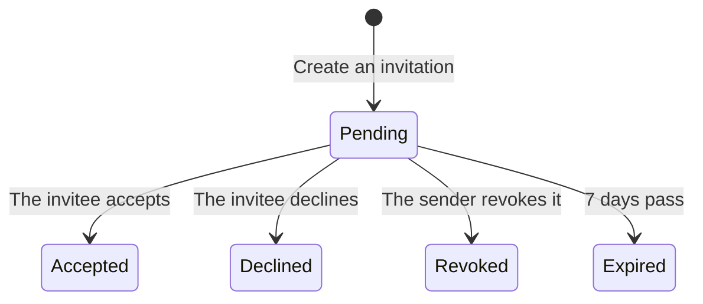

**Settings are grouped by what they apply to.**

- **Organization**: General · Members and roles · Organization tokens
- **Project**: Projects · Gate policy · Integrations (planned for Phase 2, disabled for now)
- **You · all organizations**: My account · Agent tokens

On a wide screen, this list appears under **[Settings]** in the left column. On a narrow screen, it runs across the top of the settings screen. The top of the screen shows **which organization's settings** you are viewing. Clicking [Settings] opens the first item, **General**.

**Switching organizations keeps you in settings.** If you switch organizations at the top of the left column while in settings (or in the inbox, notifications or help), the same screen opens for the new organization. If you switch from a project screen, you go to Home, because the new organization does not have that project.

## General (organization)

This is where you rename the organization, delete it, or create a new one.

**This screen applies to the organization selected at the top of the left column.** If you belong to more than one, switch organizations there first, then make your change.

Only **organization admins** (people whose organization-wide role is admin) can rename or delete the organization. If you are not one, the note at the top of the screen **lists the organization admins you can ask**.

- **Rename** — only the name changes. **The slug does not.** Addresses and API paths are built from the slug, so changing it would break every link that has already been shared.
- **Delete the organization** — possible **only while it has no projects**. Deletion cannot be undone, so a reversible step comes before it. **Archived projects count too, though.** Projects cannot be deleted in the app, so an organization that has ever had a project cannot be deleted from this screen for now. In that case [Delete organization] is **disabled**, and the line below it shows how many projects (and how many of them archived) are blocking deletion. Do not archive projects just to delete the organization. An empty organization is deleted after one more confirmation.
- **New organization** — use **[Create a new organization…]** at the bottom to create another organization. **Anyone** can create one, and whoever creates it becomes its admin. If you also enter a **first project name**, that project is created and opened. If you leave it empty, the new organization's project list opens with the create form already open. Specs are not shared between organizations, so if your team already uses one, ask for an invitation instead of creating a new one. **[Manage or add organizations]** in the organization menu at the top of the left column opens this screen.

## Projects

This is where you create projects, edit their name and repository, and archive or restore them. It is the first item in the **Project** group of the settings menu, and it lists the projects of the organization selected at the top of the left column.

**Each action needs a different permission.** Only **organization admins** can use [+ New project]. Organization admins and **that project's admins** can edit or archive a project row. A project admin can change only their own project's row. The other rows are locked. If you are not an admin anywhere, [Show archived] is hidden as well. Anyone who is not an organization admin **still sees [+ New project], but disabled**, and the note at the top of the screen **lists the organization admins you can ask**.

- **Create a project** — type a name, and the address (slug) and key are filled in for you. The address is built from the Latin letters and digits in the name. **If the name has none, the address field stays empty and the reason appears below it.** In that case, type the address and key yourself, using lowercase letters and digits. The key is the short prefix on **task** numbers (`CLV-T-3F92A1`). A spec key is separate: a person chooses it when creating the document. For organization admins, **[Manage or add projects]** under the project list in the left column opens this screen with the form **already open**. Once the project is created, **[Open]** in the message at the lower right takes you straight into it.
- **Rename** — only the name changes. **The slug does not.**
- **Repository kind** — set it under the same [Edit] (`github` by default, or `gitlab`). It only sets the **link format**. GitLab puts `/-/` in commit and file URLs, so links do not open unless this is set correctly. **The server never connects to the repository.** It also does not guess the kind from the domain, because a self-hosted server's address does not show which kind it is.
- **Repository URL and default branch** — set these together with the name under the project row's [Edit]. Commits and code paths in a task's **evidence** open at this URL (see "Click the evidence" in the [Tasks](/help/tasks) chapter). If it is empty, those rows cannot be clicked, and a note on the task screen explains why. To remove a wrong URL, **clear the field and save**.
- **Archive a project** — you are **asked to confirm in place**, and the confirmation shows how many approvals are pending in that project (they will be hidden for everyone, as described below). An archived project is removed from lists but not deleted, and its URL still opens. You can undo this: turn on **Show archived** above the list, then click **Restore** on that project's row.
- An archived project's **notifications and approval cards are hidden**, so nobody keeps waiting on decisions for an archived project. They come back when you restore it.
- You cannot create a new project with the same slug as an existing one. If an archived project uses that slug, a message about it appears on the screen. **Restore** that project instead of creating a new one.

## Members

The Members and roles screen has two tabs. The first tab, **Members**, opens by default. The second, **Invitations**, is where you invite people (see "Invitations" below). The numbers next to the tabs show the number of members (people) and the number of pending invitations.

The Members tab shows who belongs here and in which role. A role can be granted for the whole organization or for a single project. When one person has roles at both levels, **their permissions are the union of both**.

The table title shows **which organization's members** are listed. The **Applies to** column shows whether each role covers the whole organization or one project, identified by project **name**. Turning on a role chip grants that role **for that row's organization or project**.

**Each person's rows are grouped together.** Their name and email appear only on the first row of the group. The organization-wide row comes first, followed by the project rows. On a project row, a **dashed chip marked ↳** is a role the person **already has organization-wide**. They already have that permission in this project, so it does not need a separate grant and cannot be clicked. To change it, use the organization-wide row.

Only `admin` can edit members and roles. **Only organization admins can change organization-wide rows**, and project rows can also be changed by that project's admins. On rows you cannot change, the chips are locked, and hovering over a chip shows why. If you are not an organization admin, the note at the top of the screen **lists the organization admins you can ask**. **You cannot remove a member's last role with a chip**, because a member with no role cannot open anything but still appears in the list.

**Use [Remove…] for someone who has left.** Organization admins see it at the end of each person's first row. It deletes **all** of that person's memberships and **revokes their active tokens**. When you click it, you see how many of each will be affected and are asked to confirm. Project admins see **[Remove from this project]** at the end of their own project's rows. It removes every role on that row. You cannot remove yourself. To undo a removal, invite the person again.

**The organization's last admin cannot be removed.** When only one person has the organization-wide admin role, that person's admin chip and [Remove…] are locked. An organization with no admin has nobody who can manage memberships, so there is no way to recover it (the server rejects this as well). Make someone else an organization admin first. **Turning off your own admin chip asks you to confirm**, because you lose edit access to this screen immediately and need another admin to get it back.

## Invitations

You send invitations from the **Invitations** tab of the Members and roles screen. Only `admin` can send them. For every other role, **[+ Invite] is disabled**. **Only organization admins can invite people to the whole organization.** A project admin can invite people only to their own project.

Click **[+ Invite]**, enter an email, and choose a role and **what the invitation applies to**. This creates an **invitation link**. The top of the form shows **which organization you are inviting people to** (switch organizations at the top of the left column). For **Applies to**, choose "Whole organization (all projects)" or one of that organization's projects **by name**. After the invitation is created, an "email → organization / scope · role" summary appears above the link.

- **The email is sent automatically.** If email sending is set up on this server, the invitation link is emailed to that address and the screen shows **"Email sent"**. If not, it shows **"Copy it and share it"** instead. If both cases showed the same message, one of them would be wrong, and the invitee could end up waiting for an email that never arrives.
- **The link is shown only once, right there.** Whether or not the email was sent, the link appears on the same card, and the server cannot show it again later. If this server cannot send email, use **[Copy link]** and share the link yourself.
- **Only the invited email address can accept.** If someone else gets the link, they cannot use it to join.
- An invitation **expires after 7 days**. If that happens, create a new one.
- The **link is the same** whether or not the person already has an account. If they do not have one, they sign up and are then returned to the invitation automatically.
- **The Sent invitations list shows when each invitation was last sent** (**not sent** if it never was). An invitation that was never sent and one that was sent but never arrived are different problems. If the screen showed them the same way, you would end up creating the same invitation several times.
- **You see only the invitations you could have sent yourself.** Organization admins see every invitation in the organization. A project admin sees only invitations to their own project.
- Sent one by mistake? **Revoke** it from the list. After you confirm, the link stops working immediately. The record is kept, because who invited whom is part of the audit trail.
- Each invitation in the list has one of these statuses: **Pending · Accepted · Revoked · Declined · Expired**. **Declined** means the invited person turned it down. You can still invite them again.

The invited person sees the invitation as a card on **Home, Get started and Notifications**, and can accept it from there. On a server that can send email, **someone without an account must sign up and confirm their email before they can accept**. The steps are under "Creating an account" in [Getting started](/help/start).

The card shows **when the invitation expires** ("Expires in 3 days"). To dismiss an invitation you do not want, click **[Decline]** and confirm. After declining, you need a new invitation to join. **Declining an invitation to a project notifies the person who sent it.** Clicking that notification opens the Invitations tab. (Declining an organization-wide invitation sends no notification. It only appears as **Declined** in the Sent invitations list.) If accepting an invitation gives you your first membership, **Get started** opens and shows your role and what to do next.

When you open an invitation link, the page shows **which account you are signed in with**. If you opened it **while signed in with a different account**, **[Sign in with another account]** appears instead of [Join]. Clicking it signs you out, and after you sign in again you return to the link. If the invitation has ended (expired, revoked or declined) or the link does not exist, the page shows **"Ask the person who invited you for a new link."** and **[Go to NERV]**.

## My account

This is the first item in the **You · all organizations** group. It is also the first item in the menu that opens when you click your name at the top right.

- **Display name** — the name shown in member lists, cards and activity. After changing it, click **[Save]**. The new name appears on every screen right away. Leading and trailing spaces are removed, and the name cannot be empty.
- **Email** — read-only. It is your sign-in ID, so it cannot be changed.
- **Password** — enter your current password and your new password (twice), then click **[Change password]**. The new password must be at least 8 characters long. If the two new passwords do not match, you are told before anything is sent. **"Sign out all other devices"** is on by default. With it on, other browsers and devices are signed out, and the browser you are using stays signed in. If your current password is wrong, an error appears in the form.

An agent token cannot change your name. Only you can change your own account. If you **forgot** your password, click "Forgot your password?" on the sign-in screen. You will get a link by email where you can set a new one (see "Forgot your password" in [Getting started](/help/start)).

## Tokens

This is where you issue and revoke **your own** tokens for agents. The list includes your tokens from every organization you belong to. **The steps from issuing a token to connecting an agent are in the [Installing the plugin](/help/install) chapter.** Opening help from this screen also takes you there.

After you issue a token, a card shows **three connection steps** in order (token · plugin install · one setup line). The first time the token is used, the card changes to **"Connected"**. Scopes start with the **[Recommended]** set selected. Tokens are **tied to a project**, so you cannot issue one while the organization has no projects. In that case, organization admins see **[Create a project]** in its place.

**Revoking cannot be undone, so you are asked to confirm.** The confirmation shows the **host that last used** the token. Once the token is revoked, agents on that host are disconnected on their next call.

Organization admins can see who has which token for which project under **[Organization tokens]** in the Organization group of the settings menu. They can also revoke other people's active tokens there with the same [Revoke], for example the tokens of someone who has left. The list can be filtered by project name and owner. If you are not an organization admin, this item is hidden.

## Gate policy

Gate policy is set **per project**, not for the whole organization. **Choose the project to edit with the project picker on this screen.** The title, "Gate policy — project name", shows which project it is. The picker starts on the project you viewed last ("Recent" in the left column).

The selected project is kept in the URL (`?project=`), so you can share the link. While you are in a project, clicking **[Settings]** under it in the left column opens that project's gate policy directly.

A gate decides what a spec change must go through, based on **how risky the change is**. Tiers range from T0 to T3. The risk is scored on four axes (side effects · sensitivity · reversibility · blast radius), and the total score sets the tier.

- **Tier boundaries** — enter the scores at which T1, T2 and T3 begin in the **three fields**. The lower the boundaries, the more changes need human review. Values must be whole numbers from 0, with T1 ≤ T2 ≤ T3. If they are not, a message appears below the fields before you save. The summary below the fields shows **each tier's score range and what it requires** (passes automatically · one person approves · two people from different roles approve), and it updates as you type.
- **Dynamic escalation** — two signals raise the tier by one: **a document's first approved version** (a commitment agreed for the first time) and **the same failure reported three times** (an agent hit the same failure three times and handed it to a person). If both apply, the tier still goes up by only one, because one human review is enough. Rollback history is no longer a signal, because NERV cannot yet revert an approved version.

**A new document that sets requirements is reviewed by a person at least once.** A newly created spec has no earlier version to revert to and nothing referencing it yet, so it scores low. Without this rule, a document that sets new requirements could be approved without anyone ever seeing it. So the first version alone is raised one tier. From the second version on, the score alone sets the tier.

**Even with the extra step, anything up to T1 still passes automatically.** So a new document with a very low score (a short document with no requirements, for example) is still approved without a person. The extra step only brings in a person for documents that already have a meaningful score.

Turning dynamic escalation off also turns off this extra step.

The **When it cannot decide** values at the bottom of the screen (escalation count and time window) are read-only. They set how many times the gate may fail to reach a decision within that window before the tier is raised. You cannot change them on this screen.

**[Save] is enabled only when something has changed.** The changes are listed above the button as before → after. **Saving a higher boundary or turning dynamic escalation off** widens what passes automatically, so you are asked to confirm. From that moment, more specs are approved without a person. If you pick another project with unsaved changes, you are first asked whether to discard them.

Only `admin` can edit the gate policy. Everyone else still sees the current values, because anyone should be able to see what is holding up their changes. The note lists that project's admins, so you know whom to ask.
