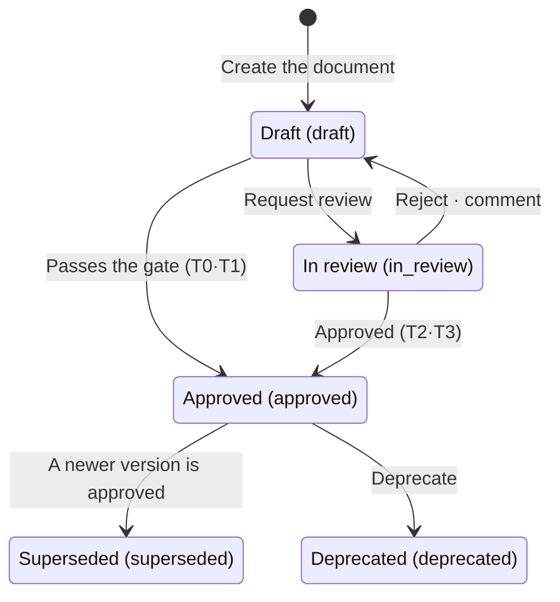
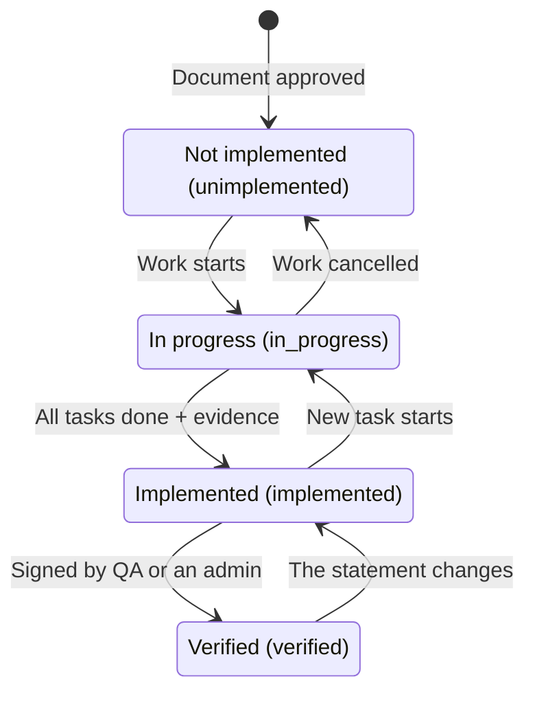

In NERV, **the spec is the reference** for all development. Agents read the spec before they start implementing.

## The tree and the types

The tree on the left shows how your specs are organized. There are six document types, and each type is a different kind of document. When you open a document, **the path of its parent documents** (`Channels › Web chat`) appears at the very top. It shows where the document is, even on a narrow screen with the tree collapsed. Click the path to go to that document.

| Type         | What it contains                             |
| ------------ | -------------------------------------------- |
| `vision`     | What this product is                         |
| `area`       | An area (a group of child documents)         |
| `feature`    | A single feature                             |
| `design`     | Design and screens                           |
| `convention` | A convention (a way things must be done)     |
| `adr`        | A decision record (what was decided and why) |

An `area` can serve only as a group, with no body of its own. For every other type, the body is the document.

## Where you can see all of them

**When you open a document, a spec tree column appears next to the sidebar.** It shows **every document, expanded**. If a list showed only some documents, you could not tell a missing document from a collapsed one. The `141 / 141` at the top of the tree means **visible / total**. When you collapse a branch, the first number drops, so you know that some documents are hidden.

**The top of the spec list shows how many documents are in each status** (draft · in review · approved …). Click a status to open the tree filtered to it, and click it again to clear the filter. Each row in the full tree ends with **the current version · last updated · 💬 open comments**, so you can pick the documents that need work from the rows alone. Only planners and admins can use **[Create baseline]**. For other roles, the button is disabled and the reason is shown.

The **chevron** in front of a branch collapses or expands that branch. Branches above the document you are viewing can be collapsed too. When one of them is collapsed, a **blue dot** appears before its title to show that your document is inside it. When you move to another document, the path to it expands again.

The top row of the tree has three buttons.

- **Target** — go to the document you are viewing. It expands the branches above it and scrolls to its row. It appears only while you are viewing a document.
- **Arrows pointing apart** — expand all. Dimmed when everything is already expanded.
- **Arrows pointing together** — collapse all. It collapses everything down to the roots, even while you are viewing a document. Dimmed when everything is already collapsed.

Collapsed branches are remembered. The tree column next to a document and the spec list screen remember them **separately**.

**The tree column appears only while you are viewing a document.** On the tasks, sessions and reviews screens, that width goes to the page content. Type in **Filter by title or key** at the top of the column to keep only the documents whose title or key matches. (To search document contents, use ⌘K or the search on the spec list.) On a wide screen, **[Hide spec tree]** at the end of the column's top row hides the column, and this browser remembers that. Click the strip at the left edge to show it again. On a narrow screen, the strip opens the tree over the page, and picking a document or pressing `Esc` closes it.

To see all documents, go to **Specs** in the left menu. That screen is the **complete list**. It opens with every document expanded, and you collapse branches yourself. **If a document is not there, it is not in this project.**

Both the tree tab and the table tab show `Showing N of M`. When the two numbers differ, the difference is the number of documents that are collapsed or filtered out by **Filter by title or key**. This screen has no separate tree column, because its tree is the full-screen version of that column.

The **Status** selector above the list shows only the documents in a given status, such as `Draft`, `In review`, or `Draft + In review`. What remains is **the documents in that status and their ancestors**. The ancestors don't match the filter. They remain **to show where each document belongs**, because without its parent you cannot tell where a document fits. A branch with no matching documents drops out entirely. The chosen status **stays in the URL, so a link shows someone else the same list.** The `of M` is the project's total document count and is not affected by the filter.

The **Type** selector next to it works the same way. Choose `Skeleton (vision + area)` to keep only the documents that **define the structure**, so you can see the shape of the tree at a glance. A project with 141 documents has a skeleton of 17. This helps when you decide where a new document belongs. If you set both selectors, only documents that match **both** remain.

Both selectors appear **only on the tree tab**, in the tree's control row next to **Filter by title or key** and the expand/collapse buttons. They disappear when you switch to the table or the relations graph.

## Versions and statuses

Specs are **never overwritten. Each change adds a new version.** Each version has one of five statuses.

- `draft` — not yet the reference for anyone.
- `in_review` — submitted and waiting for a person's decision.
- `approved` — **agents read only versions in this status.**
- `superseded` — a newer version has been approved. This version remains, but it is no longer the reference.
- `deprecated` — no longer in use.



The diagram shows the flow of **a single version**. An approved version is never edited. Instead, you create a new version (a draft) and send it for review. When that version is approved, the previous one becomes **superseded**. Low-tier documents (T0·T1) are approved as soon as you request review, with no approval step (see "Checks and submission" below).

**There are three ways to see a draft.**

1. Pick `Draft` in the **Status** selector above the list. The choice stays in the URL, so you can share the link.
2. **A document that has never been approved** opens on its draft.
3. A document with a new draft on top of an approved version opens on the approved version. In that case, pick the draft in the **Versions** tab of the rail. That list shows every version, whatever its status. Picking one changes the URL to `?v=4`, which you can share as is.

The badge at the top shows the status of the version you are viewing. If you are viewing a `superseded` version, a notice about that appears first, because reading an outdated document as if it were current is the most common mistake. If you open another version with `?v=`, the badge, version, pre-submit check, [Request review] and comments **all reflect that version**. If you are viewing the approved version and a newer draft exists, a banner above the body shows that there is a newer draft, with **[Open vN]** and **[vM→vN changes]** buttons. Links from an agent, approval cards in the Inbox, and a task's source-spec link open **that specific version**.

**The row under the title shows your next step.** A draft shows **[Request review]**. A document in review shows **[Open in the Inbox]**, because the decision is made on that card. An approved version shows **[Create a task]**, which opens a form for creating a task from that version (this also works for documents without requirements). The chips next to it show the **open comment count** and the **requirement count**. Clicking a chip opens that tab in the right rail. **[Hand off to an agent]** takes you to the [Continue in a terminal] card at the bottom of the rail.

## Baselines — reading the set as it was

Specs move ahead of implementation. New versions keep getting approved, document by document, but implementation must work against **a set of approved versions that were consistent with each other at one point in time**. Pinning the version of a single document is not enough, because the documents it references keep changing.

A **baseline** gives that set a name and freezes it.

- Create one with **[Create baseline]** above the list (planners and admins). It captures the latest approved version of every spec at that moment.
- **You cannot change a baseline after creating it.** To change the set, create a new baseline. That way, a given baseline gives the same result whenever you look at it.
- Pick a baseline in the **baseline selector**, and **the list switches to that set**: only the documents in it, at the versions it captured. Documents created after the baseline do not appear (if they did, you might think they were part of the set). The choice stays in the URL and is kept when you open a document, so **anyone you send the link to sees the same set.**
- While a baseline is selected, **the status and type filters are hidden**. Everything in the set is approved, so there is nothing to filter.
- When no baseline is selected, the selector shows **No baseline**. Each document then shows its latest approved version, or **its current version (the draft) if it has never been approved**.
- A badge at the top of the document shows which set you are reading. If the set does not include this document (because it was created later), you see the latest version marked **outside baseline**. You are never shown a different version without notice.
- **You can also change or clear the baseline from the document.** While you read by a baseline, a baseline selector appears at the top of the document. Pick **No baseline** to go back to the latest versions. The same set stays selected when you move to another document from the tree, the table, the graph, a relation row in the rail, or the left sidebar.

Tasks can have a baseline too. The agent working on such a task then reads the surrounding documents at that set's versions.

## Comparing versions

The **Versions** tab in the rail shows the **eight most recent** versions. The number next to the tab name is the total, so for a document with more than eight versions the two numbers differ. You can do two things here.

- **Compare with previous** — one click shows the changes from the version just before.
- **Pick any two** — choose any two versions in the **from** and **to** selects at the top of the comparison view.

While comparing, you see the **changes** instead of the editor. Added or removed requirements come first, and line-by-line body changes follow. That is the order in which reviewers actually check.

**What you see is kept in the URL.** `?v=3` shows version 3 in full (read-only), and `?diff=v2..v3` shows the changes between two versions. Copy the URL and the other person sees the same screen, so there is no need to say "look at the third paragraph". Opening a comparison, switching to another pair, or closing it **keeps the rail tab and the baseline** as they were.

## Attachments

Use the **Attachments** tab in the rail to attach mockups and documents. Drag files in or choose them.

- Nine formats: images `png` · `jpeg` · `gif` · `webp` · `svg`, documents `pdf` · `html` · `txt`, and `zip` archives.
- Size: up to **10MB** per file
- **Agents** put attachments into the body, because the web does not edit the body (see "Who writes the body" below). Images go in as images, and everything else goes in as a **link**.

Attachments are not only for images. Use `html`, `txt` and `zip` to upload **outputs** such as a one-page report, an extracted log, or a bundle of files.

**Deleting an attachment cannot be undone, so you are asked to confirm.** The file is also removed from storage, and if the body uses it, that part of the body breaks.

Attachments belong to the **document, not a version**. Editing the draft leaves them in place, and archiving the document archives them too. If you used an external link instead, its content could change independently of the spec's versions, and you could not later recover "the screen this version describes".

Attachments are also served through the server, so only **members of the project** can open them, even if someone else has the URL.

`html` attachments **open rendered**, so mockups and reports with scripts work. The page opens **isolated**: it cannot access your sign-in or any other NERV screen, and anything that would send what you typed elsewhere (a form submission) is blocked. All other formats, including `svg`, are displayed without scripts.

## Diagrams

A ` ```mermaid ` code block in the body **is displayed as a diagram.** You don't need ASCII art. The syntax is plain [mermaid](https://mermaid.js.org).

- **The diagram is the default**, on approved documents and drafts alike.
- **[Code]** at the top right of the block shows the source, which you can edit there. **[Diagram]** switches back.
- If the syntax is wrong, the code is shown instead, with **a notice that the diagram couldn't be rendered**. You never get an empty spot with neither a diagram nor text.
- **You can zoom in.** Use `−` and `+` at the top right to change the scale, and click the number between them to reset it to 100%. If a diagram is wider than the column, scroll it in place.
- **Full screen** (`⤡`) shows only the diagram, using the whole window. It is not a new tab, so closing it returns you to where you were reading. The scale is kept separately for the body and for full screen.
- The document always stores the code. The diagram and the scale are only ways of viewing it and are not saved in the document.

## Who writes the body

**You don't edit the body on the web.** The web is where you read, decide, and add attachments and comments. Agents write the body.

The [Continue in a terminal] card below the document has the command you need. Copy it and paste it into a terminal, and the agent opens that document and continues writing.

```text
claude "/nerv:spec edit SPC-CWC-007"
```

**Why it works this way.** A web editor has to render markdown _and_ turn the edits back into markdown, and the conversion back was never complete. Some documents, such as ones with a pipe inside a table cell or consecutive block quotes, **could be opened in the editor but not saved** (3 of 22 in our measurement), and the advice at that point was "fix it in the terminal". One method that always works is better than two methods that each work halfway.

What stays on the web is **the work a person does**: requesting review, approving, editing document info (title, parent), archiving and restoring, attachments, and comments.

**In a project with no specs yet**, the spec list shows how to get started: `claude "/nerv:spec new"` to run in a terminal (with a copy button), the **Open the install guide** and **Issue a token** links if no agent is connected yet, and the CLI importer if you already have documents (see "Importing documents" in the [Agents](/help/agents) chapter). The tree in the sidebar shows a one-line link to that screen. Roles that cannot write drafts (viewer) see who writes specs instead of the command.

## Getting around a long document

- **[Contents ▾]** in the metadata row takes you to a section (`##`·`###`). It appears only when a document has two or more sections.
- **Clicking an anchor takes you to its section.** This applies to anchors on pre-submit check findings, anchors on comments, and `#…` links inside the body. A finding that points to a requirement number (`REQ-…`) opens the Requirements tab in the rail.
- Your position is kept in **the `#…` part of the URL**, so you can share it. Both a heading slug (`#3-gameplay`) and a section number (`#3`) work, so a section link such as `…/specs/SUD-AREA-PLAY#3` that an agent puts in the body goes straight to that section.
- Links to other specs inside the body open **within the app** (the page does not reload). External links open in a new tab.
- If the first line of the body is a `# Title` identical to the document title, the Reader view does not show it, so the title does not appear twice. It is still in the Source tab and the original.
- Lines in the Source tab have **line numbers**. The numbers are not copied, and adding `#L120` to the end of the URL takes you to that line.
- When the window is narrow and the rail is below the body, clicking a chip at the top or opening a `?rail=…` URL **scrolls you down to the rail.** You can switch rail tabs with the left and right arrow keys.

## Two ways to look at the body

The **Reader / Source** tabs above the body switch how you view it.

- **Reader** — the rendered view. Tables and links work, and ` ```mermaid ` blocks are displayed as diagrams.
- **Source** — the raw markdown. **[Copy]** at the top right copies all of it. If you select text by dragging to hand it to an agent, the line breaks and indentation get mixed up.

The tab you pick **stays in the URL** (`?body=source`), so a link you send opens the same view.

## Checks and submission

You don't run the checks yourself. They run **automatically** when you open the document, and the results appear in the **Pre-submit check** panel **above** the body. The checkers look for contradictions between documents, broken chains of rationale, and requirements with no task.

If there is even one **Blocking** finding, [Request review] is disabled. The server would refuse the request anyway, so fix the blocking items first. While the button is disabled, **"N blocking pre-submit check findings"** appears next to it, and clicking it takes you to the results.

**Requesting review does not always send the document to a person.** A gate assigns the document a tier. At the low tiers (T0, T1), it becomes `approved` **immediately, with no approval step**, and the screen shows a "passed without approval" notice. A card appears in the Inbox only at T2 and T3 (for tiers, see the [settings](/help/settings) chapter).

When a person does decide, authors cannot approve their own specs. The exception is **when nobody else can approve that document**, because being unable to make any progress in a project you work on alone is worse. Anything approved this way is recorded in the audit log.

**The author, a planner or an admin can request review.** If someone else submits it, that person becomes the requester, but the author still cannot approve it. The server checks all three: the requester, the author, and the owner of the session that wrote it.

Agents also start the next version of an approved document. Running `/nerv:spec edit <key>` opens a new draft on top of the approved version.

## Comments

Comments are attached to **a specific place in the document**, not to the document as a whole. Instead of selecting text, you choose a place under **Choose where to comment** in the comment box. You can choose a heading of the version you are viewing or a requirement number (`REQ-…`). (You type one in only when the document has nothing to choose from.) Once a comment has been addressed, close it as `resolved`.

Each comment shows **who left it (for an agent, which machine and which agent) · when · on which version**. The count next to the tab name and the chip at the top count **open comments only**. To see resolved comments and who resolved them, click **[Show N resolved]** below the list. Comments whose heading has been removed from the body are grouped at the top as comments that **lost their position**. Clicking them goes nowhere, so first check whether the point still applies. If adding or resolving a comment fails (for example, because you lack permission to resolve it), the reason is shown.

Adding a comment requires only **`spec:read`**, so a viewer can raise a point too. Only roles that can write drafts can close (resolve) comments.

Instead of a comment count, the confirmation dialog before submitting shows **how many documents reference this one and how many tasks derive from it**, so you can see first what an approval will affect.

## Requirements

Requirements in a spec body are extracted, and each one tracks its own implementation status: `unimplemented` → `in_progress` → `implemented` → `verified`. Priorities are `must` · `should` · `could`.

**Each requirement is one line in the body.** There is a single format: `- REQ-<prefix>-<number> WHEN <condition> THE SYSTEM SHALL <behaviour>`. The sentence starts with WHEN, WHILE or IF.

```text
- REQ-CWC-031 WHEN a visitor opens the widget for the first time THE SYSTEM SHALL restore the previous conversation
- REQ-CWC-032 WHILE the connection is down THE SYSTEM SHALL queue outgoing messages
- REQ-CWC-033 IF the conversation to restore is older than 30 days THE SYSTEM SHALL start a new one
```

Agents get the number from the server, so nobody numbers requirements by hand. **Requirement rows are created from these lines when the document is approved.** That is why the Requirements tab is empty for a draft that has never been approved. Lines that don't follow the format appear as warnings in the pre-submit check.

**Implementation status** on the project screen shows counts for these statuses. Of its six numbers, the last three matter most.

| Number                    | What it counts                                                                             |
| ------------------------- | ------------------------------------------------------------------------------------------ |
| Requirements              | Every live requirement                                                                     |
| Implemented               | `implemented` or `verified`                                                                |
| Verified                  | `verified`                                                                                 |
| **No evidence**           | Marked `implemented` but with **no evidence at all**                                       |
| **No task**               | Not yet implemented, and **no task has taken it on**                                       |
| **Needs re-verification** | The statement changed after verification, so **the earlier signature no longer covers it** |

**No evidence** means "you said it was done, but there is nothing to show". **No task** means "you wrote it down, but nobody took it on". Reduce the first by attaching evidence, and the second by creating a task and linking it to the requirement (see [Tasks](/help/tasks)). **Needs re-verification** is explained below.

**To find out which requirements they are, look at the document.** The project screen shows only counts. The **Requirements** tab on the right of a spec lists that document's requirements, one per row, with derived-task and evidence counts on each. A row where both are zero is shown in **red**. Below it, **Derived tasks** lists the tasks from this document that are `ready`, `in_progress` or `blocked`. [See all on the board] opens the task board with the same filter.

Requirement rows are created from the body **when a version is approved**. Writing EARS sentences in a draft does not create them, because a draft is not yet a commitment. When a sentence is removed in a later version, the row is not deleted. Instead, **the version that removed it** is recorded.

The default priority is `must`, because an EARS line in the body does not include a priority. Imported requirements are different: if the source states no priority, it is **left empty** (the screen shows "no priority"). Filling in `must` when the source never said so would make it look as if the source had set it.

**People don't set implementation status by hand.** The server derives it from the tasks created from that requirement.

| Status          | When                                                                                     |
| --------------- | ---------------------------------------------------------------------------------------- |
| `unimplemented` | Nothing started and nothing done (every derived task is `backlog`, `ready` or `blocked`) |
| `in_progress`   | At least one is **claimed** or in progress, or some are done but not all                 |
| `implemented`   | All are `done` **and** there is at least one piece of evidence                           |
| `verified`      | `implemented`, with a test record signed by QA or an admin, and no open `critical`       |



**If all tasks are done but there is no evidence, the status stays `in_progress`.** To call it finished, attach something to show. **Verification comes from a test record left by QA or an admin.** Nobody raises the status by hand. When that signature exists, the server marks the requirement `verified`. Once verified, it does not drop when a finding opens. A test record attached by an agent does not count as a signature.

**Status can also go back.** If a claim is released and no task is in progress any more, it returns to `unimplemented`. If a new task starts on an implemented requirement, it returns to `in_progress`. Both reflect where the work currently stands. Evidence whose target no longer exists does not count. Status values that came in through the importer stay as they are until a task is linked to that requirement.

**When the statement changes, the verification is cleared.** A verification signature applies only to the statement as it was when signed. When a new version changes a requirement's statement, the earlier signature does not cover the new one. So `verified` goes back to `implemented`, and the Requirements tab shows **Needs re-verification**. Changes to whitespace or formatting alone (such as bold) do not count.

A person clears this mark. QA or an admin either signs a new test record or, if the earlier test still holds for the changed statement, clicks **[Confirm no impact]** to sign the same test again. You are asked once to confirm what you are signing, and the signature is recorded. A test attached by an agent is not a signature and cannot clear the mark.

The top of the document can also show the badge **A referenced document changed**. It appears when a document this one references has changed since the version you are reading, and it shows **which document** changed. The server determines this; the screen does not guess.

## Relations and backlinks

When you write another document as a **link** in the body, a `references` relation is created **automatically**. A link here means a **Markdown link**: a title in square brackets followed immediately by the URL in parentheses. A spec key typed as plain text in a sentence creates no relation, because only places where a person explicitly marked "this is that document" count. The other relations (`refines` · `depends_on` · `duplicates` · `supersedes`) can only be judged by reading, so a person or an agent declares them.

The **Relations** tab in the right rail shows both kinds. Its sub-tabs split them by direction, because each direction answers a different question.

| Sub-tab        | What it shows                                                      |
| -------------- | ------------------------------------------------------------------ |
| **All**        | Both directions                                                    |
| **Backlinks**  | Documents that **point to this one** (affected when you change it) |
| **References** | Documents **this one points to** (what it depends on)              |

The number next to each sub-tab name is the count for that direction. You can see the count before clicking, so you never need to open an empty tab.

The **relations graph** shows the same relations as a picture. It is the `Relations` tab on the spec list screen. Clicking a node does **not** open that document. Instead, it highlights the node and everything linked to it, and opens a panel on the right with the document's name and its neighbors (backlinks / references). To go to the document, **click its name in the panel.** Click the background or press `Esc` to clear the selection. **The view you are on (tree, table, graph), the graph's center document and the layout number stay in the URL.** If you open a document and come back, the view is as you left it, and if you share the link, the other person sees the same graph. **[View in graph →]** at the top of the **Relations** tab in a document's rail opens the graph centered on that document.

**Color shows the document type, and size shows the backlink count.** The **legend at the bottom left** of the canvas explains both. Vision, feature, design, convention and decision each have their own color. Areas are drawn as pale rectangles instead of circles, so the legend shows them as rectangles too. The legend lists **only the types currently drawn**.

A bigger node means more documents point to it. Keep two things in mind so you don't misread it. The most-referenced documents **stop growing at a certain size** (there is a cap, so a single hub cannot take over the picture). Also, size counts only **what is currently drawn**, so the same document looks smaller in centered view. **For the exact number, click the node** and check the `Backlinks` tab in the panel on the right. The panel header also shows the selected document's color dot and type, so you don't have to look it up in the legend.

**Drag the background to pan**, and scroll to zoom. Dragging inside an area box (the pale rectangle around a group of documents) also pans. To select the box, **click it once**.

**Sibling area boxes never overlap.** So when one box is drawn inside another, it really is a parent-child relationship. You never have to guess whether boxes are nested or just overlapping.

The graph controls are in the **top left of the canvas**: view scope (**Whole project** / **Around this doc**), **Group by area**, [Another layout], and a **`?`** button. The `?` button opens **How to read** (color, size, fading), **Gestures** and the **Fast rendering (WebGL)** switch. Node and edge counts are in the bottom-right corner, and the legend is in the bottom-left corner.

**The same documents and relations always get the same layout.** Reload the page or have someone else open it, and each document is in the same place, so you can learn where things are. A different window size gives a slightly different layout. When an agent only changes a document's content or status, the picture stays as it is; the graph is laid out again only when documents or relations are added or removed.

**[Another layout]** shows a different arrangement, which helps untangle a knot. Each click raises the layout number by one, and the number stays in the URL, so you can share that layout as a link. When the number is not 1, **Layout N** and **[First layout]** appear next to it; [First layout] returns to the default layout.

**You can drag nodes.** Use this to pull apart a crowded spot. The new position is kept only in this view and does not change the document's position in the tree. After you drag a node, **[Undo moves]** appears and puts the nodes back where this layout placed them. Switching center mode or area grouping, or showing another layout, also discards your moves.

The graph is drawn with **WebGL**, so zooming and panning stay smooth. If the picture looks broken, turn off **Fast rendering (WebGL)** under `?`. The page reloads and draws on a regular canvas. Browsers without WebGL support use the regular canvas from the start.

When zoomed out, **document names are hidden.** A hundred labels too small to read would only smudge the picture. Zoom in and the names come back. Area names are shown at any zoom level.

**When two names overlap, only one is shown.** A name covered by another is unreadable anyway, so the one with more backlinks keeps its label. Zooming in does **not** bring the hidden name back, because the text grows with the picture and the overlap stays the same. Instead, use one of three options: **click the node** (a selected document always shows its name, and once the rest fades, its neighbors' names come back), **drag the nodes apart**, or use the **table tab**. The panel on the right also lists the names as text.

## Archiving

**Clicking [Archive] in the Document info window opens a confirmation.** Archiving removes the document from the list and the tree, and the only way back is [Restore] on the document's own page. Esc closes only the confirmation. Press it again to close the Document info window.

Archiving can be **refused**. You can't archive a document that has child documents that are not archived, or a task derived from it that someone has claimed. In that case, the screen lists what is blocking it, and each key takes you to the document or task you need to deal with.

Archiving is **not deletion.** The document disappears from lists and the tree, but it still opens at its URL, and links to it keep working. A spec is the record of what was decided and why. Deleting it would erase that record.

To **see archived documents again**, turn on **Show archived** at the top of the spec list. They reappear in the list marked `Archived`. The setting stays in the URL (`?archived=true`), so a link you share shows the other person the same list.

**You restore a document from its own page.** When you open an archived spec, a banner appears at the top, and planners and admins also see a **Restore** button. If its parent is archived, the restore is refused, and the screen shows the key of the document to restore first.

You **cannot create a document under an archived one**, and you cannot move an existing document under it either. Otherwise that document would appear in no list at all, and even the person who created it could not find it again.
