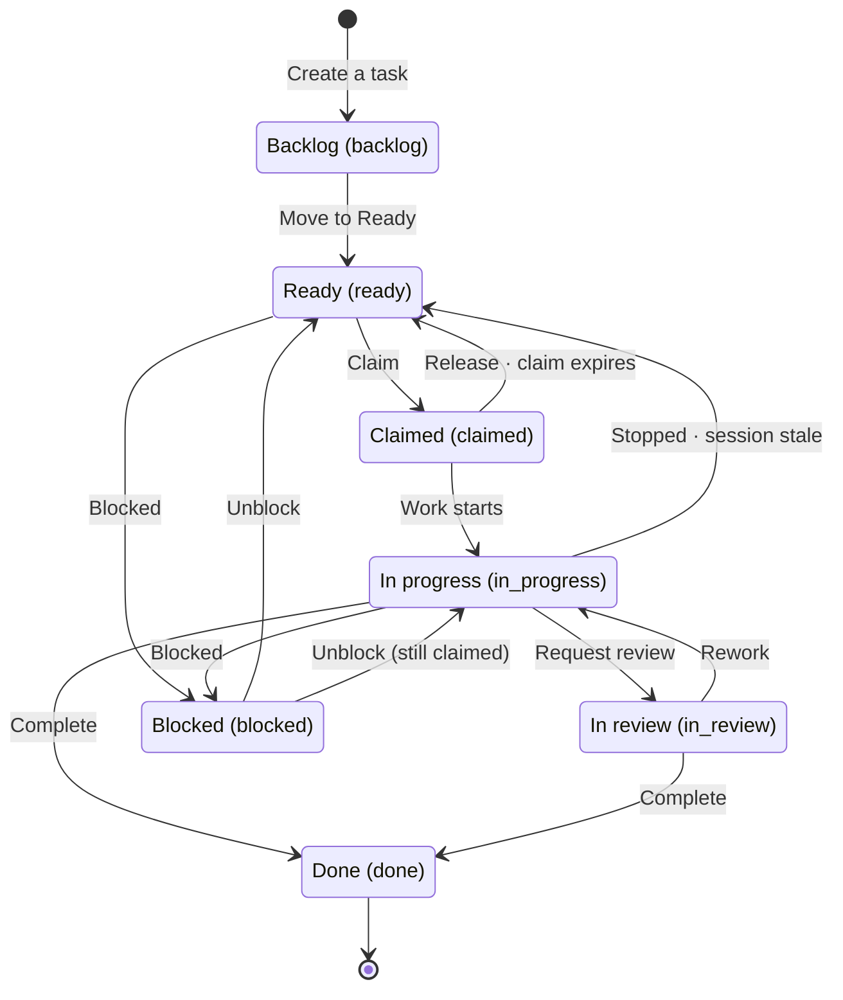

A task is a single piece of work that comes from an approved spec. People and agents work from the same board.

## The board and its lanes

Each lane on the board is a task status.

| Name on screen (value)      | Meaning                             |
| --------------------------- | ----------------------------------- |
| Backlog (`backlog`)         | Not ready to be worked on yet       |
| Ready (`ready`)             | **Can be picked up now**            |
| Claimed (`claimed`)         | Someone has claimed it              |
| In progress (`in_progress`) | Being worked on                     |
| In review (`in_review`)     | Waiting for review (optional)       |
| Done (`done`)               | Finished                            |
| Blocked (`blocked`)         | Stuck (the reason is shown with it) |

The diagram shows only the common paths. Moving a task back (to Ready or Backlog) and the rules for who can do what are covered in the sections below. **Done cannot be undone.**

Screens show each status by its **name**. Board lanes, the task screen, sessions, and a spec's derived-task list all use the same names. The value in parentheses is the identifier that the API, the CLI, and agents use.

**Board cards show whose work it is and who is running it.** The assignee appears only as an initials circle, but hovering over it shows the name, and screen readers read the name aloud. When an agent session is running the task, a small **AI** mark appears. Click it to go to that session. Priority appears as a chip **for P0 and P1 only**, because a chip on every card would no longer stand out. Clicking the source spec key takes you to that spec.

`in_review` is an **optional** step. Use it on a shared board when you want to show which work has been delivered but not yet checked. You can also move a task straight from `in_progress` to `done`. Whether a task can be completed depends on its evidence and spec impact, not on the lanes it passed through.

**You pick a blocked reason from four options**: Waiting for an answer · Broken dependency · Conflicts with the base spec · External factor. There is no free-text reason. If different people describe the same situation in different words, **counts of blocked tasks by reason become inaccurate.** Anything else you want to add goes in a comment or a question.

Board cards and the task screen show the reason **using those four names**. A reason typed as free text before the list existed (before 2026-09-06) is **shown exactly as it was written**. Old reasons are not hidden.

**The screen for a blocked task also shows what would unblock it.** Anything still blocking the task (an open question, an unfinished dependency, a superseded base spec) appears as a link. Once everything is resolved, a **Can be unblocked now** badge appears. The badge does not unblock the task for you. Click **[Unblock]** at the top of the task screen. The task returns to **In progress** if someone has claimed it, and to **Ready** otherwise (or to **Backlog** if the delegation brief is empty). While anything is still blocking the task, the button is disabled and shows why. When the reason is `External factor`, the server cannot evaluate it, so a person checks it and then unblocks the task with **[Check and unblock]**.

**Four kinds of people can move a task to done**: whoever has the active claim on it, the assignee, a planner, or an admin. Agents follow a stricter rule. An agent can move a task to `in progress`, `in review`, or `done` only while **its own claim is still active**. The rejection response includes whether the task can be claimed again, so the agent can decide whether to pick it back up or stop. You cannot move a task into the `claimed` lane by changing its status. The only way in is to claim it.

**Moving a task back to ready is checked too.** The four parts of the delegation brief must be filled in, and every task it depends on must be finished. (If an imported task has "source had no delegation brief" in those fields, they **count as empty**.) If there is an active claim, **release the claim or stop the session first**, and then move the task back to ready or backlog.

**Show backlog is on by default.** A task is always created in `backlog` and moves to `ready` only after the four parts of the delegation brief are filled in. That is why a task you just created appears in the backlog lane. **If you filled in all four parts when you created it, click [Move to ready] on its card.** Creating a task does not put it in the queue. When you press the button, the server checks the four parts and the dependencies, and then queues the task. A card with an incomplete brief shows a **[Fill it in ▸]** button instead. To see only the work that is moving, turn off **Show backlog**. The setting is kept in the URL (`?backlog=0`). The summary strip at the top (**Ready** · **In progress** · **Mine** · **Blocked**) lets you check the state without scanning the whole board.

**Active filters are shown above the board.** Use the **Spec** and **Assignee** filters above the summary strip to narrow down the tasks. If you arrive through a filtered link, such as "Derived tasks → See all on the board" on a spec, the filters show that value. When any filter is set, **Filtered** appears next to them, and the summary counts and the lanes include **only matching tasks**. **[Clear filters]** removes the spec, assignee, and agent filters, and leaves Show backlog and Show archived as they are. Click the **Mine** count in the summary strip to see only tasks assigned to you. All filters are kept in the URL (`?spec=` · `?assignee=`), so you can share the URL as it is.

**Lanes do not load all their cards at once.** A `+` after a lane's count means the lane has more cards. At the bottom of the lane, **+N more** expands the cards that are already loaded, and **Load more** fetches the next batch. This way you can read even a long lane to the end, such as Done with Show archived turned on. **When the Ready lane is empty**, it shows what to do next: **See N blocked** (goes to the Blocked lane) and **Fill in N backlog tasks** (goes to the Backlog lane, and turns on Show backlog if it is off).

## The task screen opens over the board

Clicking a card opens the task **in a sheet on the right side of the board**. The board stays open behind it. Your filters, collapsed lanes, and expanded "+N more" lists stay as they were, and clicking another card behind the sheet switches the sheet to that task. On a narrow screen, the sheet covers the whole screen.

- **Close** the sheet with the **✕** at its top or with `Esc`. The board's filters are kept in the URL, so closing the sheet does not clear them.
- `j` · `k` move to the **next and previous task in the same lane**. The top of the sheet shows your position, such as "2 of 5 in the lane". This is handy when you go through several blocked cards in a row.
- `Esc`, `j`, and `k` do nothing while the cursor is in an input field.
- The task's URL (`/p/…/tasks/CLV-T-…`) stays the same when the task opens in a sheet, so you can share it as a link. Opening that URL shows the sheet with the board behind it.

## The next step is at the top of the task screen

The buttons to the right of the task title **move the task from its current status to the next one**.

| Current status | Button at the top                                                                        |
| -------------- | ---------------------------------------------------------------------------------------- |
| Backlog        | **[Move to ready]** when all four parts are filled in, **[Fill in the brief]** otherwise |
| Ready          | **[Claim]**                                                                              |
| Claimed        | **[Start work]** · [Finish…]                                                             |
| In progress    | **[Request review]** · [Finish…]                                                         |
| In review      | **[Finish…]**                                                                            |
| Blocked        | **[Unblock]** ([Check and unblock] when the server cannot evaluate the reason)           |

**Buttons you cannot use are still shown, but disabled.** Hover over one or move to it with `Tab` to see why (which roles can use it · someone else has claimed the task · something is still blocking it). [Claim] appears only on **Ready** tasks. The exception is a task whose only claim has an expired lease. Clicking [Claim] there reclaims the expired claim and claims the task for you. The button used to appear on backlog and blocked tasks too, but pressing it there was refused.

**The top of the task screen shows both the assignee and the runner.** **Assignee {name}** is the person responsible for the work. **Running on {host} ▸** is the agent session that has claimed the task and is running it now. Click it to go to that session. The assignee and the runner can be different: people set the assignee, while the runner is whoever has the claim.

**The finish form opens when you click [Finish…], or when the task is Claimed, In progress, or In review.** Spec impact **starts with nothing selected**. You have to choose **No spec impact** explicitly too, so [Move to done] stays disabled until you make a choice. If you choose **Has impact**, the button is enabled only after you write which spec should change and how. If no evidence is attached, a notice appears before you press the button, because the done gate requires evidence. To mark a task as blocked, pick a reason in the separate **Mark as blocked** card.

## The four parts of a brief

A task can become `ready` only when these four parts are filled in.

1. **Goal** — what counts as done
2. **Output format** — what has to be delivered (a PR, a document, a patch)
3. **Tools and sources** — what to refer to, and what to use
4. **Boundaries** — what must not be touched

If any part is empty, the task cannot be claimed. **Large work needs one more step.** When four or more tasks come from the same spec version, or the version is graded T3, the work needs **plan approval** before it starts (see [Inbox](/help/inbox)). **The base spec version is not one of the four parts.** If a base version is set, the agent reads that version. Without one, the task can still move to `ready`. Agents are instructed to **ask a question** instead of guessing what goes in an empty part. When work starts from a guess, you only find out the guess was wrong after the work is finished.

**Tasks are created from approved versions.** On a requirement row in a spec, [Create a task from this requirement] opens the new-task form with the source already filled in. If you open the form directly, you can pick the spec, version, and requirement in the form, and **the version list shows approved versions only**. A task created from an unapproved document would be based on content that nobody has agreed to yet. The source is optional. If you set it, that requirement's implementation status follows this task's progress.

**You edit the brief on the task screen.** Click **[Edit]** on the brief card to open the form in place. Empty parts and import placeholders ("source had no delegation brief") are marked with **❌**. In the form, those parts open **blank**, with "Missing from the source (needs to be filled in)" shown in faint text. Only the parts you fill in are saved, and parts you leave blank stay unchanged, so you can edit just the title. After you save, the parts that are still empty are listed by name. A part that already had content cannot be cleared. The **Re-check instructions** badge also has an [Edit] button next to it, because when the base version changes, the instructions need to be read again. **Planners, developers, admins, and qa can create tasks, and planners, developers, and admins can edit the brief** (qa turns findings into tasks but does not write briefs). People without permission see [+ New task], [Fill it in ▸], and [Edit] disabled, so nobody fills in the whole form only to have it refused.

The task screen also shows the basis for the task in readable form: the requirement's stable ID and text, the active claim's remaining lease and declared scope, and the reviews that covered this task (open critical findings in red). All three link to the related screen. The requirement goes to the **Requirements** tab of its spec. **[View session ▸]** on the claim row goes to the session that has the claim. The branch on a review row goes to the review center, filtered to **that branch's findings only**.

## Claims and leases

Taking on a task is called a **claim**. A claim has a 30-minute lease, and the session sends a heartbeat every 60 seconds to renew it.

- If the heartbeats stop, the lease expires and the task returns to `ready`. This keeps an unresponsive session from keeping a task forever.
- When two sessions touch the same declared scope, it counts as an **overlap**, but not every overlap is refused. There are three grades. **Block** applies only when two sessions declare the **same spec document**, and only then is the second claim refused. **Warn** applies to documents connected above or below each other in the spec tree, and to two tasks from the same requirement. **Info** covers any other partial overlap. Warn and info only notify people. They do not stop the claim. **Overlapping file paths alone do not block a claim.** If every overlap were blocked, one large module would force the whole project to work on one task at a time. **When a claim is blocked, the session that claimed first is notified.** The blocked session gets the rejection right away, but the one that needs to know the scopes are colliding is the session that claimed first.
- **You can also claim and release work from the web.** Click [Claim] at the top of the task screen to claim the task right away. The declared scope is this task's source spec, and no files are declared. To release the claim, choose one of two options. **[Hand off]** means someone else should pick up the work next. **[Abandon]** means you are stopping the work. The two are recorded as different reasons, so you can later see why the claim was released. **[Abandon] asks you to confirm** because the task goes back to `ready`.
- A claim is usually released by **whoever claimed it**. An agent releases its own claim when it finishes or gives up (`nerv_task_release`). To stop work that someone else has claimed, **Stop** their session from the session screen. The claim is released immediately and the task returns to `ready`.
- **An in-progress task that nobody has claimed can be sent back.** When a `claimed` or `in progress` task has no active claim, the screen shows [Send back to ready] or [Send back to backlog]. The first appears when the four parts of the delegation brief are filled in. The second appears when they are not, which is usually the case for imported tasks. Imported in-progress tasks used to stay in that state for a long time. They did not appear in the queue and could not be claimed, so nobody could pick them up. If there is an active claim, release it or stop the session first.
- The server allows more than the screen offers. **An admin can release someone else's claim**, and planners and admins can change the status of a task that someone else has claimed. The screen does not offer these actions.

## Done, and the archive window

Finished tasks stay on the board for **seven days** and then drop out of the list. Turn on **Show archived** to also see tasks that were completed more than seven days ago.

The archive window is not a status. It is **a period calculated from the completion time**. Archived tasks are not deleted, and you can still open them by URL.

**`done` cannot be undone.** Requests to move a finished task to another lane are refused. Completing a task closes it with its evidence and spec impact, so reopening it would be a new decision. If work remains, **create a new task**.

## Click the evidence

The **Evidence** list on the task screen records the material attached to show what the task produced. Items that link somewhere **open in a new tab** when you click them. A PR opens the URL recorded for it, a commit or code path opens that location in the project repository, and a review opens that finding in the review center. They open in a new tab because you may be filling in the finish form on this screen. If you leave the page in the same tab, you lose the spec impact and evidence you entered.

**Evidence with its own repository opens in that repository.** Evidence attached by CI records which repository it came from. In a project that uses several repositories, the link therefore opens the repository that contains the commit. If no repository is recorded, the project's repository URL is used.

**User guide evidence opens a chapter of this manual.** Enter a chapter name (`tasks`) or the full path (`/help/tasks`) to open that chapter. A name that does not match a chapter is shown as plain text.

**Some items are not clickable.** Test names are written differently in every repository, so NERV does not guess where they should link. Plain text is better than a link to the wrong place. Commits and code paths **need a repository URL on the project**. When it is empty, those items are shown as plain text, with a note explaining why.

## Requirement links

A task can link to the requirement it implements. This link affects only one metric on the project screen: **No task**, the number of unimplemented requirements that no task has taken on. Without links, that number is not zero but at its **maximum**.

The implemented and verified bars are separate. They are calculated from each requirement's own implementation status (see "Requirements" in the specs chapter).

## When the base version goes stale

If the spec version a task is based on becomes `superseded`, the task card gets a **Re-check instructions** badge, and the basis row in the task details shows **Re-check instructions** too. You have two options:

- Click **[Update basis]**. This moves the basis to the latest approved version and clears the flag. The delegation brief stays as it is, so update it to match the new spec. **[Edit]** next to it takes you to the brief.
- Finish the task against its current base version, and put the difference into a **new task**.

A person makes this choice. The screen does not choose for you. Only planner, developer, and admin can click [Update basis].
