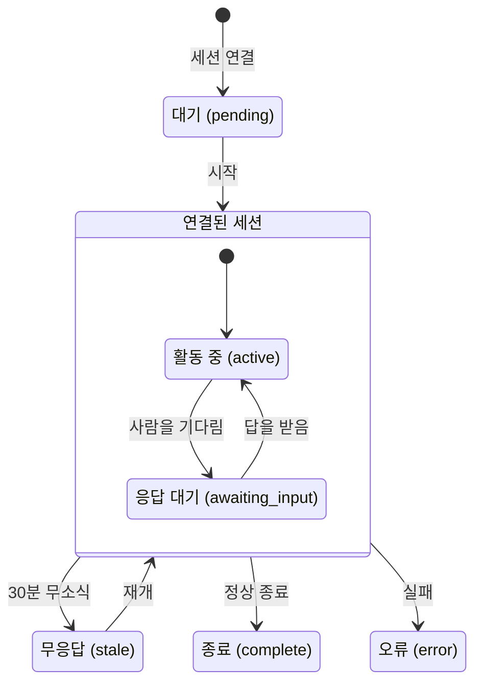

세션은 **지금 실행 중인 에이전트 하나**입니다. 세션 모니터에서는 무슨 일이 벌어지고 있는지 확인할 수 있습니다.

## 모니터 읽는 법

왼쪽은 세션 목록이고, 오른쪽은 선택한 세션의 **활동 레일**입니다. 목록에서 줄을 선택하면 그 세션의 활동이 같은 화면에 바로 표시됩니다. 세션이 왜 멈췄는지 보려고 다른 화면으로 이동할 필요가 없어야 모니터라고 할 수 있습니다. 화면이 좁으면 레일이 접힙니다. 이때는 카드의 **상세**를 열어 활동을 봅니다. **상세 화면에는 레일과 같은 내용이 표시됩니다**(한 일 · 활동 · 묶기 · 원문 펼침 · [앞쪽 활동 더 보기]). 좁은 화면에서도 볼 수 있는 정보는 줄어들지 않습니다.

세션마다 누구의 어느 머신에서 어떤 에이전트(`claude-code` · `codex` · `web` · `other`)가 실행 중인지, 어떤 작업을 맡았는지가 표시됩니다. 종류를 밝히지 않고 접속한 세션은 `other` 로 표시됩니다. 작업 키를 **누르면 작업 상세로** 이동합니다. 카드 · 레일 · 세션 상세의 현재 작업과 클레임 이력 어디에서나 똑같이 동작합니다. 카드 안의 링크를 눌러도 그 카드가 선택되지는 않습니다.

카드에는 이 밖에도 네 가지가 표시됩니다: **남은 시간**(2분 아래로 내려가면 색이 바뀝니다. 곧 회수된다는 뜻입니다) · 마지막 하트비트 시각 · 이 세션이 만든 `+N −M` 변경량 · 작업 범위(마우스를 올리면 펼쳐집니다). 이 점유 시간은 30분이고, 작업 클레임과 **같은 타이머**를 씁니다.

**입력을 기다리는 세션**에는 무엇을 기다리는지 표시됩니다. 열린 질문이 있으면 그 질문의 제목이 표시되고, 없으면 결재를 기다린다고 표시됩니다. **[받은 요청에서 열기 ↗]** 를 누르면 받은 요청의 해당 카드로 바로 이동합니다. **맡은 작업이 없는 세션**에는 마지막으로 맡았던 작업이 표시됩니다(리스가 끝나 회수됐으면 **회수됨**). `stale` 세션의 안내에도 회수된 작업의 키가 표시됩니다. 세션이 하나도 없으면 **설치 안내 열기** · **토큰 발급** 링크가 나타납니다.

목록은 한 번에 전부 불러오지 않습니다. 더 있으면 목록 아래에 **[더 보기]** 가 나타나고, 누르면 다음 페이지가 **아래에 이어 붙습니다.** 먼저 보던 줄은 그대로 남습니다. 위쪽 요약의 숫자는 필터나 페이지와 상관없이 **프로젝트 전체**를 셉니다. 요약은 전체를, 목록은 그 일부를 보여 줍니다.

**선택한 상태 필터와 레일에 연 세션은 주소에 남습니다.** 그래서 "이 세션 좀 봐" 하면서 주소를 그대로 공유할 수 있고, 새로고침해도 같은 세션이 열려 있습니다. 상태 필터를 바꾸면 선택한 세션은 해제됩니다.

### 플러그인이 켜진 머신

목록 위의 **`플러그인 켜짐 N / M대`** 는 최근 30일 동안 Claude Code 세션을 연 머신 가운데 NERV 플러그인이 켜져 있는 머신의 수입니다. 누르면 머신별 목록이 펼쳐집니다. 머신마다 **켜짐(버전) · 꺼짐**, 누구의 머신인지, 마지막으로 확인된 시각이 표시되고, **꺼진 머신이 위쪽**에 나옵니다.

- **판정은 그 머신의 가장 최근 세션을 기준으로 합니다.** 켰다가 끈 머신은 꺼짐으로 표시됩니다.
- **꺼짐은 플러그인 없이 MCP 로만 연결한 머신입니다.** 작업을 클레임할 수는 있지만 훅이 없어서, 그 세션의 활동과 브랜치가 이 화면에 남지 않습니다. 세션이 유난히 비어 보이면 여기부터 확인하세요. 플러그인을 켜는 방법은 [플러그인 설치](/help/install) 장에 있습니다.
- **Codex 는 세지 않습니다.** 플러그인은 Claude Code 용이므로, Codex 에 플러그인이 없는 것은 정상입니다.
- 이 판정은 플러그인 **0.3.2 부터** 동작합니다. 그보다 오래된 플러그인은 자기 버전을 보내지 않아서 꺼짐으로 표시됩니다. `/plugin marketplace update` 로 업데이트하면 다음 세션부터 켜짐으로 표시됩니다.

## 상태

| 상태             | 뜻                                                                                                                             |
| ---------------- | ------------------------------------------------------------------------------------------------------------------------------ |
| `pending`        | 시작을 준비 중입니다                                                                                                           |
| `active`         | 실행 중입니다                                                                                                                  |
| `awaiting_input` | **사람의 응답을 기다립니다.** 질문이 올라와 있거나, 이 세션이 낸 검토 요청이나 `critical` 하향 승인이 결정을 기다리는 중입니다 |
| `complete`       | 끝났습니다                                                                                                                     |
| `error`          | 실패로 끝났습니다                                                                                                              |
| `stale`          | 30분 넘게 응답이 없습니다                                                                                                      |

`stale` 은 실패했다는 뜻이 아닙니다. **상태를 알 수 없다**는 뜻입니다. 머신이 절전 모드에 들어갔거나, 네트워크가 끊겼거나, 프로세스가 죽었을 수 있습니다. 그중 어느 것인지 알 수 없으므로 화면에는 확인된 사실만 표시합니다.

다만 그 결과는 분명합니다. **`stale` 이 되면 그 세션이 맡고 있던 작업은 회수되어 `ready` 로 돌아갑니다.** 카드에도 그렇게 표시됩니다.

## 활동

세션을 열면 레일이 **두 영역**으로 나뉩니다. 위쪽은 **한 일**(무엇을 하는 중인지, 막혀 있는지), 아래쪽은 **도구 로그**입니다. 이 화면에서 먼저 알고 싶은 것은 어떤 도구를 썼는지가 아니어서 이 순서로 배치했습니다.

**도구 로그에 모든 도구 호출이 남지는 않습니다.** 기본 훅이 보내는 것은 **파일을 수정하거나 명령을 실행하는 도구 넷**(`Write` · `Edit` · `MultiEdit` · `Bash`)뿐입니다. 읽기 · 검색이나 `nerv_*` 도구 호출은 남지 않습니다. 즉 무엇을 바꿨는지는 남고, 무엇을 봤는지는 남지 않습니다.

활동은 다섯 종류입니다: `thought`(판단) · `action`(도구 실행) · `elicitation`(사람에게 묻기) · `response`(답) · `error`. 활동은 에이전트의 훅이 보냅니다. 훅이 없는 환경에서는 에이전트가 이벤트를 직접 올립니다.

읽기 쉽도록 두 가지 처리를 합니다.

- **같은 도구가 연달아 실행되면 하나로 묶습니다**(`×12`). 사이에 다른 도구가 끼면 다른 단계로 보고 묶지 않습니다.
- **실패는 묶지 않고 따로 눈에 띄게 둡니다.** 묶음 안에 들어가면 실패를 알리려고 만든 표시가 쓸모없어집니다.

활동 목록은 최근 것부터 한 묶음씩 불러옵니다. 이전 활동이 더 있으면 목록 맨 위에 **[앞쪽 활동 더 보기]** 버튼이 나타나고, 누르면 더 오래된 활동이 **위쪽에 이어 붙습니다.** 이 버튼을 계속 누르면 긴 세션도 처음까지 거슬러 올라갈 수 있습니다.

줄을 펼치면 **원문**(도구 입력 · 응답)이 나옵니다. 원문은 **그 세션의 소유자와 admin 에게만** 보입니다. 비밀 값은 저장할 때 가리지만 완벽하게 가려지지는 않으므로, 볼 수 있는 사람도 제한합니다.

다른 멤버에게는 제목 · 성공 여부 · 도구 이름과 **본문**이 보입니다. 가려지는 것은 원문뿐입니다. 그래서 아래에서 설명하는 **지시와 중단 사유도 프로젝트 멤버 모두가 볼 수 있습니다.**

화면 상단의 **요약 스트립**은 숫자를 보여 주면서 필터 역할도 합니다. 숫자를 누르면 그 상태의 세션만 남습니다. **여섯 상태는 항상 표시됩니다.** 세션이 하나도 없는 상태는 `0` 으로 흐리게 표시됩니다(세션이 아예 없는 프로젝트에서는 0 여섯 개 대신 "세션 없음" 한 줄만 표시됩니다). `0` 인 칸은 거를 세션이 없으므로 누를 수 없습니다. 세션이 있는 상태만 표시하면 "오류가 0건인지, 오류라는 상태가 없는 것인지"를 구별할 수 없습니다. 칸의 위치도 매번 바뀌어서 원하는 칸을 다시 찾아야 합니다.

## 지시와 중단

카드의 **개입** 영역에 버튼 두 개가 있습니다: [지시 보내기]와 [중단]. **둘 다 그 세션의 소유자와 admin 만** 쓸 수 있습니다. 다른 사람의 세션에서는 버튼이 **처음부터 비활성화되어 있고**, 옆에 그 이유가 표시됩니다. 사유를 다 적은 뒤에야 거절당하는 일이 없도록 하기 위해서입니다. 에이전트 토큰으로는 할 수 없습니다. 사람만 할 수 있는 일입니다.

**지시 보내기**로 실행 중인 에이전트에게 방향을 바꿔 달라고 요청할 수 있습니다. 지시는 즉시 끼어들지 않습니다. 에이전트가 서버에 **하트비트**를 보낼 때 함께 전달됩니다. 같은 지시가 두 번 전달되는 일은 없습니다.

**지시가 전달되려면 조건이 하나 있습니다.** 하트비트는 **작업을 맡은 세션만** 보냅니다. 그래서 클레임이 없는 세션(스펙만 쓰는 중이거나, 이미 작업을 내려놓았거나, `stale` 인 세션)에는 지시가 **전달되지 않습니다.** 이런 세션에도 입력창은 열려 있습니다. 지시를 보냈는데 아무 반응이 없으면 먼저 그 세션이 작업을 맡고 있는지 확인하세요.

하트비트는 타이머처럼 정확한 주기로 오지 않습니다. 에이전트는 도구를 호출하거나 작업 단위가 바뀔 때 주기가 지났는지 보고 하트비트를 보냅니다. 그래서 긴 작업 하나가 실행되는 동안에는 더 늦게 옵니다. **"1분 이내"는 가장 빠른 경우일 뿐, 가장 늦은 경우가 아닙니다.**

**중단**은 지시를 전달하지 않고 **클레임을 바로 회수합니다.** 중단을 누르는 가장 흔한 이유는 세션이 이미 죽어서 하트비트를 보내지 못하는 상황입니다. 이때 전달을 기다리면 아무 일도 일어나지 않습니다.

중단은 한 번 눌러서 끝나지 않습니다. 확인 창이 뜨고, **사유를 반드시 적어야 합니다.** 사유를 비워 두면 실행 버튼을 누를 수 없습니다. 사유 칸은 **지시 칸과 별개**입니다. 그래서 적고 있던 지시가 사유로 넘어가지 않고, 취소해도 지시 칸의 내용은 그대로 남습니다. 확인 창은 Esc 로 닫을 수 있습니다. 사유를 적고 실행하면 클레임이 풀리고 작업은 다시 `ready` 가 됩니다.

## 질문

에이전트는 스스로 판단할 수 없을 때 질문을 올립니다. 긴급도는 두 가지입니다.

- `blocking` — 답을 받기 전까지 진행하지 않습니다. 세션은 `awaiting_input` 이 됩니다.
- `normal` — 계속 진행하면서 답을 기다립니다.

**검토 요청(T2 · T3)과 `critical` 하향 요청을 낸 세션도 결정을 기다리며 멈춥니다.** 받은 요청에서 결정하면 그 세션은 다음 하트비트 때 결과를 받고 작업을 이어 갑니다. 다만 다른 대기 항목(답이 없는 질문, 결정되지 않은 다른 요청)이 남아 있으면 계속 기다립니다.

질문은 **받은 요청에 카드로** 도착합니다([받은 요청과 알림](/help/inbox)). 답을 쓰면 그 세션이 작업을 이어 갑니다.
