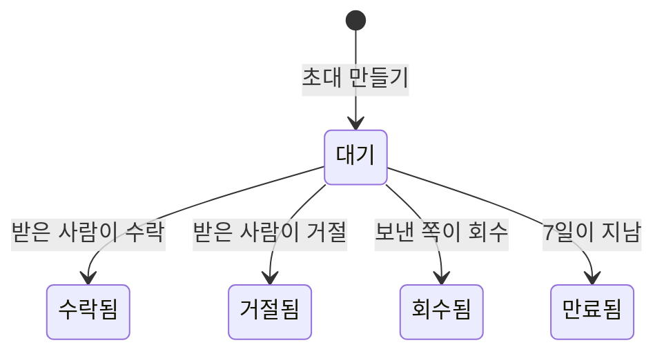

**설정 항목은 범위별로 묶여 있습니다.**

- **조직**: 조직 정보 · 멤버·역할 · 조직 전체 토큰
- **프로젝트**: 프로젝트 목록 · 게이트 정책 · 연동(Phase 2 예정이라 지금은 비활성)
- **나**: 내 계정 · 에이전트 토큰

넓은 화면에서는 왼쪽 열의 **[설정]** 아래에 이 목록이 펼쳐지고, 좁은 화면에서는 설정 화면 위쪽에 가로로 표시됩니다. 화면 위쪽에 **어느 조직의 설정인지** 적혀 있고, [설정]을 누르면 첫 항목인 **조직 정보**가 열립니다.

**조직을 바꿔도 설정 화면에 그대로 있습니다.** 설정(그리고 받은 요청·알림·도움말)에서 왼쪽 열 맨 위의 조직을 바꾸면 새 조직의 같은 화면이 열립니다. 프로젝트 화면에서 바꾸면 홈으로 이동합니다. 새 조직에는 그 프로젝트가 없기 때문입니다.

## 조직 정보

조직 이름을 바꾸고, 조직을 삭제하고, 새 조직을 만드는 곳입니다.

**여기서 다루는 조직은 왼쪽 열 맨 위에서 고른 조직입니다.** 조직이 둘 이상이면 먼저 그곳에서 조직을 바꾼 뒤 수정하세요.

조직 이름 변경과 조직 삭제는 **조직 admin**(조직 전체 역할이 admin 인 사람)만 할 수 있습니다. 조직 admin 이 아니면 화면 위쪽 안내에 **누구에게 요청하면 되는지** 조직 admin 의 이름이 표시됩니다.

- **이름 바꾸기** — 이름만 바뀝니다. **slug 는 바뀌지 않습니다.** 주소와 API 경로가 slug 를 기준으로 만들어지기 때문에, 바꾸면 이미 공유한 링크가 모두 깨집니다.
- **조직 삭제** — **프로젝트가 하나도 없을 때만** 삭제할 수 있습니다. 조직 삭제는 되돌릴 수 없어서, 그 전에 되돌릴 수 있는 단계를 먼저 두었습니다. 다만 **보관한 프로젝트도 개수에 들어갑니다.** 화면에서는 프로젝트를 삭제할 수 없으므로, 프로젝트를 한 번이라도 만든 조직은 지금은 이 화면에서 삭제할 수 없습니다. 이때 [조직 삭제]는 **비활성**이고, 그 아래에 프로젝트가 몇 개(보관 몇 개 포함) 있는지 적힙니다. 조직을 삭제하려고 프로젝트를 보관하지 마세요. 비어 있는 조직이면 한 번 더 확인한 뒤 삭제합니다.
- **새 조직** — 맨 아래 **[새 조직 만들기…]** 로 조직을 하나 더 만듭니다. **누구나** 만들 수 있고, 만든 사람이 그 조직의 admin 이 됩니다. **첫 프로젝트 이름**을 함께 적으면 프로젝트까지 만든 뒤 그 프로젝트로 이동하고, 비워 두면 새 조직의 프로젝트 목록에서 만들기 폼이 열려 있습니다. 조직이 나뉘면 스펙도 나뉘므로, 이미 쓰고 있는 조직이 있다면 새로 만들기보다 그 조직의 초대를 받는 편이 좋습니다. 왼쪽 열 맨 위 조직 메뉴의 **[조직 관리 · 새 조직]** 을 누르면 이 화면이 열립니다.

## 프로젝트 목록

프로젝트를 만들고, 이름과 저장소를 고치고, 보관하거나 복구하는 곳입니다. 설정 메뉴의 **프로젝트** 묶음 첫 항목이고, 여기서 다루는 것도 왼쪽 열 맨 위에서 고른 조직의 프로젝트입니다.

**필요한 권한은 작업마다 다릅니다.** [+ 새 프로젝트]는 **조직 admin** 만 누를 수 있습니다. 프로젝트 줄의 편집·보관은 조직 admin 과 **그 프로젝트의 admin** 이 할 수 있습니다. 한 프로젝트의 admin 에게는 자기 프로젝트 줄만 열리고 다른 프로젝트 줄은 잠겨 있습니다. 어느 곳에서도 admin 이 아니면 [보관 보기]도 보이지 않습니다. [+ 새 프로젝트]는 조직 admin 이 아니어도 **비활성 상태로 보이고**, 화면 위쪽 안내에 **누구에게 요청하면 되는지** 조직 admin 의 이름이 표시됩니다.

- **프로젝트 만들기** — 이름을 적으면 주소(slug)와 키가 자동으로 채워집니다. 주소는 이름의 영문·숫자로 만들기 때문에, **이름을 한글로만 적으면 주소 칸이 비고 그 아래에 이유가 표시됩니다.** 이때는 주소와 키를 영문 소문자·숫자로 직접 적으면 됩니다. 키는 **작업 번호** 앞에 붙는 짧은 표기입니다(`CLV-T-3F92A1`). 스펙 키는 이와 별개로, 문서를 만들 때 사람이 직접 정합니다. 왼쪽 열 프로젝트 목록 아래의 **[프로젝트 관리 · 새 프로젝트]** 를 누르면(조직 admin) 이 폼이 **열린 상태로** 화면이 열립니다. 만들고 나면 오른쪽 아래 메시지의 **[열기]** 로 바로 그 프로젝트에 들어갈 수 있습니다.
- **이름 바꾸기** — 이름만 바뀝니다. **slug 는 바뀌지 않습니다.**
- **저장소 종류** — 같은 [편집]에서 고릅니다(`github` 기본 · `gitlab`). 이 값은 **링크 주소의 형식**만 정합니다. GitLab 은 커밋·파일 주소에 `/-/` 가 들어가기 때문에, 골라 두지 않으면 링크가 열리지 않습니다. **서버는 이 저장소에 접속하지 않습니다.** 도메인만 보고 종류를 추측하지도 않습니다. 직접 운영하는 서버는 주소만으로 어느 종류인지 알 수 없기 때문입니다.
- **저장소 주소와 기본 브랜치** — 프로젝트 줄의 [편집]에서 이름과 함께 입력합니다. 작업의 **증적**에 붙은 커밋과 코드 경로가 이 주소를 기준으로 열립니다([작업](/help/tasks) 장의 "증적을 눌러 봅니다"). 비어 있으면 그 줄은 누를 수 없고, 작업 화면에 그 사실이 표시됩니다. 잘못 적었으면 **칸을 비우고 저장**하면 지워집니다.
- **프로젝트 보관** — 누르면 **그 자리에서 한 번 더 확인**하고, 그 프로젝트에서 대기 중인 결재가 몇 건인지 알려 줍니다(아래 설명처럼 모든 사람의 화면에서 숨겨지기 때문입니다). 보관한 프로젝트는 목록에서 빠지지만 삭제되지는 않고, 주소로는 그대로 열 수 있습니다. 되돌릴 수도 있습니다. 목록 위의 **보관 보기**를 켜면 보관한 프로젝트가 함께 보이고, 그 줄의 **복구**를 누르면 돌아옵니다.
- 보관한 프로젝트의 **알림과 승인 카드는 숨겨집니다.** 정리한 프로젝트의 결정을 계속 기다리지 않게 하기 위해서입니다. 복구하면 함께 돌아옵니다.
- 같은 slug 로 새 프로젝트를 만들 수는 없습니다. 보관한 프로젝트가 그 slug 를 쓰고 있으면 화면에 그렇게 표시됩니다. 새로 만드는 대신 **복구**하세요.

## 멤버

멤버·역할 화면에는 탭이 두 개 있습니다. 첫 탭인 **멤버**가 기본으로 열리고, 둘째 탭 **초대**에서 사람을 초대합니다(아래 "초대" 절). 탭 옆의 숫자는 멤버 수(사람 수)와 대기 중인 초대 수입니다.

멤버 탭에서는 누가 어떤 역할로 들어와 있는지 봅니다. 역할은 조직 전체에 줄 수도, 한 프로젝트에만 줄 수도 있습니다. 한 사람이 두 범위의 역할을 함께 가지면 **권한은 합집합**입니다.

표 제목에 **어느 조직의 멤버인지** 적혀 있고, **적용 범위** 칸에는 그 역할이 조직 전체의 것인지 어느 프로젝트의 것인지 프로젝트 **이름**으로 표시됩니다. 역할 칩을 켜면 **그 줄의 범위**에 역할이 추가됩니다.

**한 사람의 줄은 한 묶음으로 모여 있습니다.** 이름과 이메일은 묶음의 첫 줄에만 있고, 그 아래로 조직 전체 줄이 먼저, 프로젝트 줄이 이어집니다. 프로젝트 줄에서 **↳ 표시가 붙은 점선 칩**은 그 사람이 **조직 전체에서 이미 가진 역할**입니다. 이 프로젝트에서도 그 권한이 있다는 뜻이라 따로 켤 필요가 없고, 누를 수도 없습니다. 바꾸려면 조직 전체 줄에서 바꿉니다.

멤버·역할 편집은 `admin`만 할 수 있습니다. **조직 전체 줄은 조직 admin 만**, 프로젝트 줄은 그 프로젝트의 admin 도 바꿀 수 있습니다. 바꿀 수 없는 줄은 칩이 잠겨 있고, 칩에 마우스를 올리면 잠긴 이유가 표시됩니다. 조직 admin 이 아니면 화면 위쪽 안내에 **누구에게 요청하면 되는지** 조직 admin 의 이름이 표시됩니다. **마지막 역할 하나는 칩으로 뗄 수 없습니다.** 역할이 없는 멤버는 아무 곳에도 들어갈 수 없는데 목록에는 남기 때문입니다.

**떠난 사람은 [내보내기…]로 내보냅니다.** 조직 admin 에게는 묶음 첫 줄 끝에 이 버튼이 있습니다. 그 사람의 멤버십을 **모두** 지우고, 그 사람의 **유효한 토큰도 폐기합니다.** 누르면 각각 몇 개인지 알려 주고 한 번 더 확인합니다. 한 프로젝트의 admin 에게는 자기 프로젝트 줄 끝에 **[이 프로젝트에서 빼기]** 가 있습니다. 누르면 그 줄의 역할을 모두 뗍니다. 자기 자신은 내보낼 수 없습니다. 되돌리려면 다시 초대합니다.

**조직의 마지막 admin 은 뗄 수 없습니다.** 조직 전체 admin 이 한 사람뿐이면 그 사람의 admin 칩과 [내보내기…]가 잠깁니다. admin 이 한 명도 없는 조직은 멤버십을 관리할 사람이 없어 되살릴 방법이 없습니다(서버도 거절합니다). 다른 사람을 먼저 조직 admin 으로 지정하세요. **내 admin 칩을 끌 때는 한 번 더 확인합니다.** 끄는 즉시 이 화면의 편집이 잠기고, 되돌리려면 다른 admin 에게 요청해야 하기 때문입니다.

## 초대

초대는 멤버·역할 화면의 **초대** 탭에서 보냅니다. 초대는 `admin` 만 보낼 수 있고, 다른 역할에게는 **[+ 초대하기]가 비활성 상태로** 보입니다. **조직 전체로 초대하는 것은 조직 admin 만** 할 수 있고, 한 프로젝트의 admin 은 자기 프로젝트로만 초대할 수 있습니다.

**[+ 초대하기]** 를 누르고 이메일·역할·**적용 범위**를 정하면 **초대 링크**가 만들어집니다. 폼 맨 앞에 **어느 조직으로 초대하는지** 적혀 있습니다(조직은 왼쪽 열 맨 위에서 바꿉니다). 적용 범위는 "조직 전체(모든 프로젝트)" 또는 그 조직의 프로젝트 중 하나를 **이름으로** 고릅니다. 만들고 나면 링크 위에 "누구 → 조직 / 범위 · 역할" 요약이 표시됩니다.

- **메일은 자동으로 발송됩니다.** 이 서버에 메일 발송이 설정되어 있으면 초대 링크가 그 주소로 발송되고 화면에 **"메일을 보냈습니다"** 가 표시됩니다. 설정되어 있지 않으면 **"복사해서 전달하세요"** 가 표시됩니다. 두 경우를 같은 문구로 표시하면 한쪽은 틀린 안내가 되고, 받는 사람은 오지 않는 메일을 기다리게 됩니다.
- **링크는 그 자리에서 한 번만 보입니다.** 메일 발송 여부와 관계없이 링크는 같은 카드에 표시되고, 서버는 링크를 다시 만들어 줄 수 없습니다. 메일을 보낼 수 없는 환경에서는 **[링크 복사]로 직접 전달하세요.**
- **초대한 이메일로만 수락할 수 있습니다.** 링크가 다른 사람에게 전달되어도 그 사람은 참여할 수 없습니다.
- **7일이 지나면 만료**됩니다. 그때는 새로 만들면 됩니다.
- 계정이 있든 없든 **같은 링크**입니다. 계정이 없으면 가입한 뒤 자동으로 그 초대 화면으로 돌아옵니다.
- **보낸 초대** 목록에는 마지막으로 발송된 시각이 적힙니다(발송된 적이 없으면 **미발송**). 보내지 않은 것과 보냈는데 도착하지 않은 것은 다른 문제입니다. 화면에서 둘을 구분할 수 없으면 같은 초대를 여러 번 만들게 됩니다.
- **보이는 초대는 내가 초대할 수 있는 범위까지입니다.** 조직 admin 에게는 조직의 모든 초대가, 프로젝트 admin 에게는 자기 프로젝트로 보낸 초대만 보입니다.
- 잘못 보냈다면 목록에서 **회수**하세요. 한 번 더 확인한 뒤 회수하면 링크가 바로 무효가 됩니다. 회수해도 기록은 남습니다. 누가 누구를 초대했는지는 감사 대상이기 때문입니다.
- 목록의 상태는 **대기 · 수락됨 · 회수됨 · 거절됨 · 만료됨** 입니다. **거절됨**은 받은 사람이 거절한 것이고, 그 사람도 다시 초대할 수 있습니다.

초대받은 사람에게는 **홈·시작하기·알림** 어디서든 초대가 카드로 표시되고, 그 자리에서 참여할 수 있습니다. 메일을 보낼 수 있는 환경이라면 **계정이 없는 사람은 가입한 뒤 이메일 확인까지 마쳐야 수락할 수 있습니다.** 절차는 [시작하기](/help/start) 장의 "계정 만들기"에 있습니다.

카드에는 **언제 만료되는지**("3일 뒤 만료")가 적혀 있고, 원하지 않는 초대는 **[거절]** 로 정리합니다. 누르면 한 번 더 확인합니다. 거절한 뒤 다시 참여하려면 새 초대를 받아야 합니다. **프로젝트로 보낸 초대를 거절하면 초대한 사람에게 알림이 갑니다.** 그 알림을 누르면 초대 탭이 열립니다(조직 전체로 보낸 초대는 알림 없이 보낸 초대 목록에 **거절됨**으로만 남습니다). 처음 소속이 생기는 초대를 수락하면 **시작하기** 화면이 자기 역할과 다음에 할 일을 먼저 보여 줍니다.

초대 링크를 열면 **지금 로그인한 계정**이 표시됩니다. **다른 계정으로 로그인한 상태**로 열었으면 [참여하기] 대신 **[다른 계정으로 로그인]** 이 표시됩니다. 누르면 로그아웃되고, 다시 로그인하면 그 링크로 돌아옵니다. 끝난 초대(만료·회수·거절)나 없는 링크를 열면 **초대한 사람에게 새 링크를 요청하세요** 와 **[NERV 로 가기]** 가 표시됩니다.

## 내 계정

설정 메뉴 **나** 묶음의 첫 항목입니다. 오른쪽 위의 이름을 누르면 나오는 메뉴에서도 첫 줄에 있습니다.

- **표시 이름** — 멤버 표·카드·활동에 표시되는 이름입니다. 바꾼 뒤 **[저장]** 을 누르면 모든 화면에 바로 반영됩니다. 앞뒤 공백은 지워지고, 비워 둘 수는 없습니다.
- **이메일** — 볼 수만 있습니다. 로그인 아이디라서 바꿀 수 없습니다.
- **비밀번호** — 지금 비밀번호와 새 비밀번호(두 번)를 입력하고 **[비밀번호 바꾸기]** 를 누릅니다. 새 비밀번호는 8자 이상이어야 합니다. 두 칸이 다르면 보내기 전에 알려 줍니다. **"다른 기기의 로그인을 모두 끊습니다"** 는 기본으로 켜져 있습니다. 켜 두면 다른 브라우저와 기기의 로그인이 끊기고, 지금 쓰는 브라우저는 로그인 상태가 그대로 유지됩니다. 지금 비밀번호가 틀리면 폼 안에 그 사실이 표시됩니다.

에이전트 토큰으로는 이름을 바꿀 수 없습니다. 사람의 계정은 그 사람이 직접 바꿉니다. 비밀번호를 **잊었다면** 로그인 화면의 "비밀번호를 잊었을 때" 를 누르세요. 메일로 받은 링크에서 새 비밀번호를 정할 수 있습니다([시작하기](/help/start) 장의 "비밀번호를 잊었을 때").

## 토큰

에이전트가 쓸 **내** 토큰을 발급하고 폐기하는 곳입니다. 목록에는 내가 속한 모든 조직의 토큰이 표시됩니다. **발급부터 연결까지의 절차는 [플러그인 설치](/help/install) 장**에 있습니다. 이 화면에서 도움말을 열어도 그 장이 열립니다.

발급하면 카드에 **연결 3단계**(토큰 · 플러그인 설치 · 설정 한 줄)가 차례로 표시됩니다. 그 토큰이 처음 쓰이면 카드가 **"연결됨"** 으로 바뀝니다. 권한은 **[권장]** 묶음이 기본으로 선택되어 있습니다. 토큰은 **프로젝트에 묶이므로** 조직에 프로젝트가 없으면 발급할 수 없습니다. 이때 조직 admin 에게는 그 자리에 **[프로젝트 만들기]** 가 표시됩니다.

**폐기는 되돌릴 수 없어서 한 번 더 확인합니다.** 확인 창에는 그 토큰을 **마지막으로 사용한 호스트**가 표시됩니다. 폐기하면 그 호스트의 에이전트는 다음 호출부터 연결이 끊깁니다.

조직 admin 은 설정 메뉴 조직 묶음의 **[조직 전체 토큰]** 에서 누가 어느 프로젝트에 어떤 토큰을 가지고 있는지 볼 수 있습니다. 떠난 사람의 토큰처럼 다른 사람의 유효한 토큰도 같은 [폐기]를 눌러 끊을 수 있습니다. 목록은 프로젝트 이름과 소유자로 걸러 볼 수 있습니다. 조직 admin 이 아니면 이 항목이 보이지 않습니다.

## 게이트 정책

게이트 정책은 조직 단위가 아니라 **프로젝트마다 따로** 정합니다. **수정할 프로젝트는 이 화면의 프로젝트 선택기에서 고릅니다.** 제목에 "게이트 정책 — 프로젝트 이름" 형식으로 어느 프로젝트인지 표시됩니다. 처음에는 마지막으로 본 프로젝트(왼쪽 열의 "최근")가 선택되어 있습니다.

고른 프로젝트는 주소(`?project=`)에 남으므로 링크로 공유할 수 있습니다. 프로젝트를 보는 중에 왼쪽 열에서 그 프로젝트 아래의 **[설정]** 을 누르면 그 프로젝트의 게이트 정책이 바로 열립니다.

게이트는 **스펙 변경이 얼마나 위험한지**에 따라 무엇을 거쳐야 하는지 정하는 규칙입니다. 티어는 T0~T3 입니다. 위험을 네 가지 기준(부작용 · 민감도 · 가역성 · 영향 범위)으로 점수를 매기고, 그 합으로 티어가 정해집니다.

- **티어 경계** — T1·T2·T3 의 진입 점수를 **세 칸**에 입력합니다. 경계를 낮출수록 사람이 검토하는 변경이 늘어납니다. 값은 0 이상의 정수이고 T1 ≤ T2 ≤ T3 이어야 합니다. 조건에 맞지 않으면 저장하기 전에 칸 아래에 안내가 표시됩니다. 칸 아래 요약에는 **티어마다 점수 구간과 요구하는 것**(자동 통과 · 사람 1인 승인 · 직군이 다른 2인 승인)이 표시되고, 입력하는 대로 바로 바뀝니다.
- **동적 강화** — 티어를 한 단계 올리는 신호는 두 가지입니다. **그 문서의 첫 승인 버전**(처음 합의되는 약속)과 **같은 실패 3회 신고**(에이전트가 같은 실패를 세 번 겪고 사람에게 넘긴 것)입니다. 두 신호가 함께 와도 한 단계만 올립니다. 사람이 한 번 확인하면 충분하기 때문입니다. 롤백 이력은 신호에서 뺐습니다. NERV 에는 아직 승인한 버전을 되돌리는 기능이 없기 때문입니다.

**요구사항을 새로 정하는 문서는 한 번은 사람이 검토합니다.** 새로 만든 스펙은 되돌릴 이전 버전이 없고 아직 참조하는 곳도 없어서 점수가 낮게 나옵니다. 그대로 두면 요구사항을 새로 정하는 문서가 사람이 한 번도 보지 않은 채 승인됩니다. 그래서 첫 버전에만 티어를 한 단계 올립니다. 둘째 버전부터는 점수대로 티어가 정해집니다.

**한 단계를 올려도 T1 까지는 자동으로 통과합니다.** 따라서 점수가 아주 낮은 새 문서(요구사항이 없는 짧은 문서 등)는 여전히 사람 없이 승인됩니다. 이 가산 때문에 실제로 사람의 승인이 필요해지는 것은 원래 점수가 어느 정도 있는 문서입니다.

동적 강화를 끄면 이 가산도 적용되지 않습니다.

화면 아래쪽의 **판정할 수 없을 때** 값(에스컬레이션 횟수·시간 창)은 읽기 전용입니다. 게이트 판정 자체가 실패했을 때 몇 번 반복되면 티어를 올릴지 정하는 기준이고, 이 화면에서 바꾸는 값이 아닙니다.

**[저장]은 바뀐 값이 있을 때만 활성화됩니다.** 버튼 위에는 바뀌는 값이 전 → 후로 표시됩니다. **경계를 올리거나 동적 강화를 끄고 저장**하면 자동 통과 범위가 넓어지므로 한 번 더 확인합니다. 저장하는 순간부터 더 많은 스펙이 사람 없이 승인되기 때문입니다. 저장하지 않은 변경이 있는 채로 다른 프로젝트를 고르면 변경을 버릴지 먼저 확인합니다.

편집은 `admin`만 할 수 있습니다. 다른 사람에게도 현재 값은 그대로 보입니다. 내 변경이 무엇 때문에 막히는지는 누구나 볼 수 있어야 하기 때문입니다. 안내에는 **누구에게 요청하면 되는지** 그 프로젝트의 admin 이름이 표시됩니다.
