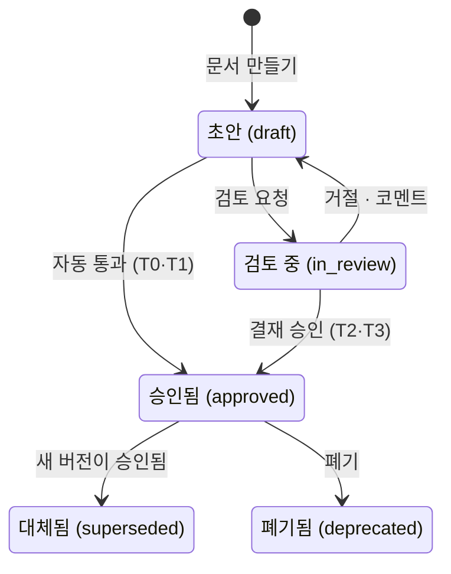
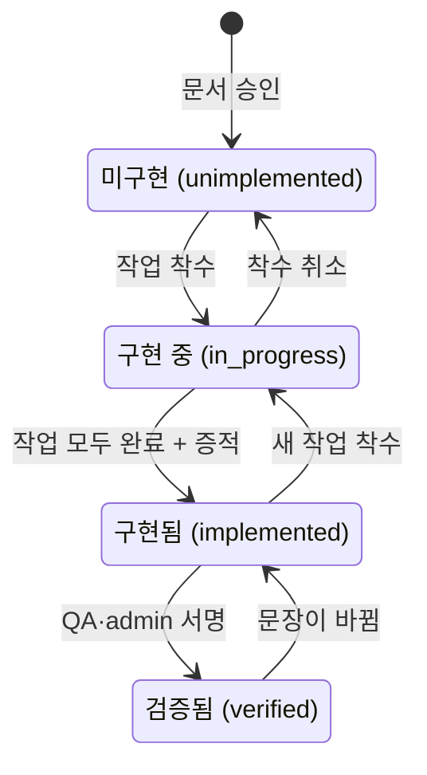

NERV 에서는 **스펙을 기준으로** 개발합니다. 에이전트도 구현을 시작하기 전에 스펙을 먼저 읽습니다.

## 트리와 유형

왼쪽 트리는 스펙의 구조를 보여 줍니다. 문서 유형은 여섯 가지이고, 유형에 따라 문서의 성격이 정해집니다. 문서를 열면 맨 위에 **상위 문서의 경로**(`채널 › 웹챗`)가 표시됩니다. 그래서 트리를 접어 둔 좁은 화면에서도 이 문서가 어디에 있는지 알 수 있습니다. 경로를 누르면 그 문서로 이동합니다.

| 유형         | 담는 내용                             |
| ------------ | ------------------------------------- |
| `vision`     | 이 제품이 무엇인지                    |
| `area`       | 영역 (하위 문서를 묶는 단위)          |
| `feature`    | 기능 하나                             |
| `design`     | 설계·화면                             |
| `convention` | 규약 (지켜야 하는 방식)               |
| `adr`        | 결정 기록 (무엇을 왜 그렇게 정했는지) |

`area` 는 본문 없이 묶음 역할만 해도 됩니다. 나머지 유형은 본문이 곧 문서입니다.

## 문서를 전부 보는 곳

**문서를 열면 사이드바 옆에 스펙 트리 열이 나타납니다.** 이 트리는 **모든 문서를 펼쳐서** 보여 줍니다. 목록에서 일부만 보여 주면 없는 문서와 접힌 문서를 구분할 수 없기 때문입니다. 트리 상단의 `141 / 141` 은 **지금 보이는 수 / 전체 수**입니다. 가지를 접으면 앞의 수가 줄어들어 가려진 문서가 있다는 것을 알 수 있습니다.

**스펙 목록 상단에는 상태별 문서 수**(초안 · 검토 중 · 승인됨 …)가 표시됩니다. 상태를 누르면 그 상태로 필터링한 트리가 열리고, 한 번 더 누르면 필터가 풀립니다. 전체 트리의 각 줄 끝에는 **현재 버전 · 최근 갱신 · 💬 열린 코멘트 수**가 표시되므로, 줄만 보고도 손볼 문서를 고를 수 있습니다. **[기준선 생성]** 은 planner·admin 만 할 수 있습니다. 다른 역할에게는 버튼이 비활성화된 채 그 이유가 표시됩니다.

가지 앞의 **꺾쇠**를 누르면 그 가지만 접거나 펼칩니다. 보고 있는 문서가 들어 있는 상위 가지도 똑같이 접힙니다. 이때는 접힌 가지 제목 앞에 **파란 점**이 표시되어, 보고 있는 문서가 그 안에 있다는 것을 알려 줍니다. 다른 문서로 이동하면 그 문서까지의 경로는 다시 펼쳐집니다.

트리 상단 줄에는 버튼이 세 개 있습니다.

- **과녁** — 보고 있는 문서로 이동합니다. 접혀 있던 상위 가지를 펼치고 그 줄까지 스크롤합니다. 문서를 보고 있을 때만 나타납니다.
- **벌어지는 화살표** — 전체 펼치기. 이미 모두 펼쳐져 있으면 흐리게 비활성화됩니다.
- **모이는 화살표** — 전체 접기. 보고 있는 문서가 있어도 루트까지 모두 접습니다. 이미 모두 접혀 있으면 흐리게 비활성화됩니다.

접어 둔 상태는 저장됩니다. 문서 옆의 트리 열과 스펙 목록 화면은 이 상태를 **따로** 저장합니다.

**트리 열은 문서를 볼 때만 나타납니다.** 작업·세션·리뷰 화면에서는 그 폭만큼 본문이 넓어집니다. 열 상단의 **제목·키로 찾기** 칸에 입력하면 제목이나 키가 일치하는 문서만 남습니다(내용까지 검색하려면 ⌘K 나 스펙 목록의 검색을 씁니다). 넓은 화면에서는 상단 줄 끝의 **[스펙 트리 접기]** 로 열을 접을 수 있고, 접은 상태는 이 브라우저에 저장됩니다. 왼쪽 가장자리의 띠를 누르면 다시 펼쳐집니다. 좁은 화면에서는 띠를 누르면 트리가 본문 위에 열리고, 문서를 고르거나 `Esc` 를 누르면 닫힙니다.

문서를 전부 보려면 왼쪽 메뉴의 **스펙**으로 이동합니다. 이 화면은 **빠짐없는 전체 목록**입니다. 처음 열면 모든 문서가 펼쳐져 있고, 접는 것은 사용자가 직접 합니다. **여기에 없는 문서는 이 프로젝트에 없습니다.**

트리 탭과 표 탭에는 모두 `표시 N / 전체 M` 이 적혀 있습니다. 두 수가 다르면 그 차이만큼 접혀 있거나 **제목·키로 찾기**로 걸러졌다는 뜻입니다. 이 목록 화면에는 트리 열이 따로 나타나지 않습니다. 이 화면의 트리가 트리 열을 전체 화면으로 넓힌 것이기 때문입니다.

목록 위의 **상태** 선택기로 `초안`·`검토 중` 같은 특정 상태의 문서만 볼 수 있습니다. 상태를 고르면 **그 상태의 문서와 그 상위 문서**가 남습니다. 상위 문서는 조건에 맞아서 남은 것이 아니라 **위치를 보여 주려고** 남긴 것입니다. 상위 문서가 사라지면 그 아래 문서가 어디에 속하는지 알 수 없기 때문입니다. 조건에 맞는 문서가 하나도 없는 가지는 통째로 빠집니다. 고른 상태는 **주소에 남으므로, 링크를 공유하면 상대도 같은 목록을 봅니다.** `전체 M` 은 필터와 상관없이 프로젝트의 전체 문서 수입니다.

옆의 **종류** 선택기도 같은 방식으로 동작합니다. `뼈대(비전 + 영역)` 를 고르면 **구조를 잡는 문서만** 남아 트리의 골격을 한눈에 볼 수 있습니다. 문서가 141개인 프로젝트도 뼈대는 17개입니다. 새 문서를 어디에 둘지 정할 때 유용합니다. 두 선택기를 함께 쓰면 **두 조건에 모두 맞는 문서**만 남습니다.

두 선택기는 **트리 탭에서만** 보입니다. 트리의 조작 줄(제목·키로 찾기·펼치기·접기 옆)에 있고, 표나 관계 그래프 탭으로 바꾸면 사라집니다.

## 버전과 상태

스펙은 **덮어쓰지 않고 새 버전을 쌓습니다.** 각 버전은 다섯 가지 상태 중 하나입니다.

- `draft` — 초안. 아직 누구에게도 기준이 되지 않습니다.
- `in_review` — 제출됨. 사람의 결정을 기다립니다.
- `approved` — 승인됨. **에이전트는 이 상태의 버전만 읽습니다.**
- `superseded` — 더 새로운 버전이 승인되었습니다. 이 버전은 남아 있지만 더는 기준이 아닙니다.
- `deprecated` — 더 이상 쓰지 않습니다.



이 그림은 **버전 하나**의 흐름입니다. 승인본은 수정하지 않습니다. 새 버전(초안)을 만들어 검토를 받고, 그 버전이 승인되면 이전 버전은 **대체됨** 상태가 됩니다. 등급이 낮은 문서(T0·T1)는 검토 요청을 누르면 결재 없이 바로 승인됩니다(아래 "검사와 제출" 참고).

**초안을 보는 방법**은 세 가지입니다.

1. 목록 위의 **상태** 선택기에서 `초안` 을 고릅니다. 주소에 남으므로 링크로 공유할 수 있습니다.
2. **승인본이 한 번도 없는 문서**는 열면 바로 초안이 보입니다.
3. 승인본 위에 새 초안이 있는 문서는 기본으로 승인본이 열립니다. 이때는 레일의 **버전** 탭에서 그 초안을 고릅니다. 이 목록에는 상태와 상관없이 모든 버전이 나오고, 고르면 주소가 `?v=4` 로 바뀌어 그대로 공유할 수 있습니다.

상단의 배지는 지금 보고 있는 버전의 상태를 나타냅니다. `superseded` 버전을 보고 있으면 화면에서 그 사실을 먼저 알려 줍니다. 오래된 문서를 최신으로 알고 읽는 것이 가장 흔한 실수이기 때문입니다. `?v=` 로 다른 버전을 열면 배지·버전·사전 검토·[검토 요청]·코멘트가 **모두 그 버전을 기준으로** 표시됩니다. 승인본을 보고 있는데 더 새 초안이 있으면, 본문 위 배너에 그 사실과 **[vN 보기]·[vM→vN 차이]** 버튼이 표시됩니다. 에이전트가 보낸 링크, 받은 요청의 결재 카드, 작업의 출처 스펙 링크는 **해당 버전**을 엽니다.

**제목 아래 줄에는 다음에 할 일이 표시됩니다.** 초안이면 **[검토 요청]** 이, 검토 중이면 **[받은 요청에서 열기]** 가 나옵니다. 결재는 받은 요청의 카드에서 합니다. 승인본이면 **[작업 만들기]** 가 나오고, 누르면 그 버전에서 작업을 만드는 폼이 열립니다(요구사항이 없는 문서에서도 만들 수 있습니다). 옆의 칩은 **열린 코멘트 수**와 **요구사항 수**이고, 누르면 오른쪽 레일의 해당 탭이 열립니다. **[에이전트에게 넘기기]** 를 누르면 레일 맨 아래의 [터미널에서 이어서 쓰기] 카드로 이동합니다.

## 기준선 — 그때 그 세트로 읽기

스펙은 구현보다 앞서 나갑니다. 문서마다 새 버전이 계속 승인되는 동안에도, 구현은 **"그 시점에 서로 일관된 승인본 세트"** 를 기준으로 진행해야 합니다. 문서 하나의 버전만 고정하면 그 문서가 참조하는 주변 문서들의 기준은 계속 바뀝니다.

**기준선**은 그 세트에 이름을 붙여 고정합니다.

- 목록 위의 **[기준선 생성]** 으로 만듭니다(기획자·관리자). 만드는 시점의 스펙별 최신 승인본이 모두 담깁니다.
- **만든 뒤에는 바꿀 수 없습니다.** 세트를 바꾸려면 새 기준선을 만듭니다. 그래야 같은 기준선을 언제 보더라도 같은 결과가 나옵니다.
- 목록의 **기준선 선택기**에서 기준선을 고르면 **목록이 그 세트로 바뀝니다.** 세트에 담긴 문서만, 담을 때의 버전으로 보입니다. 기준선을 만든 뒤에 생긴 문서는 나오지 않습니다(나오면 그 세트에 포함된 것으로 오해할 수 있기 때문입니다). 고른 값은 주소에 남아 문서 상세 화면까지 유지되므로 **링크를 공유하면 상대도 같은 세트를 봅니다.**
- 기준선을 고른 동안에는 **상태·종류 필터가 사라집니다.** 세트의 항목이 모두 승인본이라 걸러 낼 것이 없기 때문입니다.
- 아무 기준선도 고르지 않은 상태는 **기준선 없음** 으로 표시됩니다. 이때는 각 문서를 최신 승인본으로 읽고, **승인본이 한 번도 없으면 현재 버전(초안)으로** 읽습니다.
- 문서 상단의 배지에 어느 세트로 읽고 있는지 표시됩니다. 그 세트에 이 문서가 없으면(기준선 이후에 만들어진 문서) 최신 버전을 보여 주면서 **"기준선 밖"** 이라고 표시합니다. 알리지 않고 다른 버전을 보여 주지 않습니다.
- **문서 화면에서도 기준선을 바꾸거나 해제할 수 있습니다.** 기준선으로 읽는 동안에는 문서 상단에 기준선 선택기가 나타나고, **기준선 없음**을 고르면 최신 버전으로 돌아갑니다. 트리·표·그래프·레일의 관계 줄·왼쪽 사이드바 중 어디를 거쳐 다른 문서로 이동해도 같은 세트가 유지됩니다.

작업(Task)에도 기준선을 지정할 수 있습니다. 그러면 그 작업을 맡은 에이전트는 주변 문서까지 그 세트의 버전으로 읽습니다.

## 버전 비교

레일의 **버전** 탭에는 **최근 8개 버전**이 표시됩니다. 탭 이름 옆의 숫자는 전체 버전 수이므로, 버전이 8개를 넘는 문서에서는 두 수가 다릅니다. 이 탭에서 두 가지를 할 수 있습니다.

- **이전 버전과 비교** — 버튼 하나로 바로 이전 버전과의 차이를 봅니다.
- **두 버전 고르기** — 비교 화면 위쪽의 **기준** · **대상** 선택 상자에서 아무 두 버전이나 골라 비교합니다.

비교하는 동안에는 편집기 대신 **차이**가 표시됩니다. 요구사항이 늘었는지 줄었는지가 먼저 나오고, 그 아래에 본문의 줄 단위 차이가 나옵니다. 검토할 때 실제로 확인하는 순서가 그렇기 때문입니다.

**보고 있는 화면은 주소에 그대로 남습니다.** `?v=3` 은 3번째 버전의 전체 내용(읽기 전용)이고, `?diff=v2..v3` 은 두 버전의 차이입니다. 주소를 그대로 복사해 보내면 상대도 같은 화면을 봅니다. "세 번째 문단 보세요" 라고 따로 설명할 필요가 없습니다. 비교를 열고, 다른 버전 쌍으로 바꾸고, 닫아도 **레일 탭과 기준선은 그대로 유지됩니다.**

## 첨부

레일의 **첨부** 탭에서 시안이나 문서를 첨부합니다. 파일을 끌어다 놓거나 직접 골라서 올립니다.

- 형식은 아홉 가지입니다: 그림 `png` · `jpeg` · `gif` · `webp` · `svg`, 문서 `pdf` · `html` · `txt`, 압축 파일 `zip`.
- 크기: 파일당 최대 **10MB**
- 첨부한 파일을 본문에 넣는 일은 **에이전트**가 합니다. 웹에서는 본문을 편집하지 않기 때문입니다(아래 "본문은 누가 쓰나"). 그림은 이미지로, 그 밖의 파일은 **링크**로 들어갑니다.

첨부는 그림만을 위한 것이 아닙니다. `html` · `txt` · `zip` 은 리포트 한 장, 추출한 로그, 여러 파일 묶음 같은 **산출물**을 올리는 데 씁니다.

**첨부 삭제는 되돌릴 수 없으므로 한 번 더 확인합니다.** 파일이 저장소에서도 지워지고, 본문에서 그 파일을 쓰고 있었다면 그 부분이 깨집니다.

첨부는 **버전이 아니라 문서에** 연결됩니다. 초안을 고쳐도 시안은 그대로 남고, 문서를 보관하면 첨부도 함께 보관됩니다. 외부 링크로 두면 스펙 버전과 상관없이 내용이 바뀔 수 있어서, "이 버전이 설명하는 화면" 을 나중에 다시 확인할 수 없습니다.

첨부 파일을 열 때도 서버를 거치므로, 주소를 알아도 **그 프로젝트의 멤버**가 아니면 볼 수 없습니다.

`html` 은 **열면 그대로 렌더링됩니다.** 스크립트가 들어 있는 시안이나 리포트도 동작합니다. 다만 그 페이지는 **격리된 상태**로 열립니다. 로그인 정보나 NERV 의 다른 화면에 접근할 수 없고, 입력한 내용을 밖으로 보내는 동작(폼 전송)은 막힙니다. `svg` 를 비롯한 나머지 형식은 스크립트 없이 표시됩니다.

## 다이어그램

본문에 ` ```mermaid ` 코드 블록을 쓰면 **그림으로 표시됩니다.** 아스키 아트로 그릴 필요가 없습니다. 문법은 [mermaid](https://mermaid.js.org) 그대로입니다.

- 승인본이든 초안이든 **기본은 그림**입니다.
- 블록 오른쪽 위의 **[코드]** 를 누르면 원본 코드가 나타나고, 거기서 고칩니다. **[그림]** 을 누르면 다시 그림으로 돌아갑니다.
- 문법이 틀리면 그림 대신 코드가 나타나고 **그리지 못했다는 안내가 표시됩니다.** 그림도 글도 없는 빈자리는 만들지 않습니다.
- **확대해서 볼 수 있습니다.** 그림 오른쪽 위의 `−` `+` 로 배율을 바꾸고, 가운데 숫자를 누르면 100% 로 돌아갑니다. 노드가 많아 그림이 영역보다 넓으면 그 자리에서 스크롤해서 봅니다.
- **전체화면**(`⤡`)은 화면 전체에 그림 하나만 띄웁니다. 새 탭이 아니므로 닫으면 읽던 위치 그대로입니다. 배율은 본문과 전체화면에서 따로 유지됩니다.
- 문서에 저장되는 것은 언제나 코드입니다. 그림과 배율은 보는 방식일 뿐이라 문서에 남지 않습니다.

## 본문은 누가 쓰나

**웹에서는 본문을 고치지 않습니다.** 웹은 문서를 읽고, 결정하고, 첨부와 코멘트를 다는 곳입니다. 본문은 에이전트가 씁니다.

문서 아래의 [터미널에서 이어서 쓰기] 카드에 필요한 명령이 있습니다. 복사해서 터미널에 붙여 넣으면 에이전트가 그 문서를 열고 이어서 씁니다.

```text
claude "/nerv:spec edit SPC-CWC-007"
```

**이렇게 한 이유.** 웹 편집기는 md 를 화면에 그리고, 편집한 내용을 다시 md 로 되돌려야 합니다. 그런데 되돌리는 쪽이 완전하지 않았습니다. 표 안의 파이프나 연속 인용문처럼 **편집기에서 열 수는 있어도 저장은 막히는 문서**가 있었고(실측 22개 중 3개), 그때 안내는 결국 "터미널에서 고치세요" 였습니다. 반쯤만 되는 방법 두 가지보다 확실히 되는 방법 하나가 낫습니다.

웹에는 **사람이 할 일**이 남아 있습니다. 검토 요청, 승인, 메타(제목·부모) 수정, 보관·복원, 첨부, 코멘트입니다.

**스펙이 하나도 없는 프로젝트**에서는 스펙 목록에 시작 방법이 표시됩니다. 터미널에서 실행할 `claude "/nerv:spec new"`(복사 버튼 포함), 에이전트를 아직 연결하지 않았다면 **설치 안내 열기 · 토큰 발급** 링크, 이미 써 둔 문서가 있다면 CLI 임포터 안내([에이전트 연동](/help/agents) 장의 "문서 가져오기")가 나옵니다. 사이드바 트리에는 이 화면으로 가는 링크가 한 줄로 표시됩니다. 초안을 쓸 수 없는 역할(viewer)에게는 명령 대신 누가 스펙을 쓰는지 안내합니다.

## 긴 문서를 오가기

- 메타 줄의 **[목차 ▾]** 로 각 절(`##`·`###`)로 이동합니다. 절이 두 개 이상인 문서에만 나타납니다.
- **앵커를 누르면 해당 절로 이동합니다.** 사전 검토 지적의 앵커, 코멘트의 앵커, 본문 안의 `#…` 링크가 모두 그렇습니다. 요구사항 번호(`REQ-…`)를 가리키는 지적은 레일의 요구사항 탭을 엽니다.
- 이동한 위치는 **주소의 `#…`** 에 남으므로 그대로 공유할 수 있습니다. 헤딩의 slug(`#3-게임플레이`)와 절 번호(`#3`) 모두 쓸 수 있습니다. 그래서 에이전트가 본문에 넣는 `…/specs/SUD-AREA-PLAY#3` 같은 절 링크도 그 절로 바로 이동합니다.
- 본문 안의 다른 스펙 링크는 **앱 안에서** 이동합니다(페이지를 새로 불러오지 않습니다). 외부 링크는 새 탭에서 열립니다.
- 본문 첫 줄이 문서 제목과 같은 `# 제목` 이면 뷰어에서는 표시하지 않습니다. 위의 제목과 두 번 나오지 않게 하기 위해서입니다. 소스 탭과 원문에는 그대로 남아 있습니다.
- 소스 탭의 각 줄에는 **줄 번호**가 있습니다. 줄 번호는 복사되지 않고, 주소 끝에 `#L120` 을 붙이면 그 줄로 이동합니다.
- 창이 좁아 레일이 본문 아래에 있을 때는, 상단의 칩을 누르거나 `?rail=…` 주소로 들어오면 **레일 위치로 스크롤합니다.** 레일 탭은 키보드의 좌우 화살표로 바꿀 수 있습니다.

## 본문을 보는 두 가지 방식

본문 위의 **뷰어 / 소스** 탭으로 보는 방식을 바꿉니다.

- **뷰어** — 렌더링된 화면으로 읽습니다. 표와 링크가 제대로 동작하고 ` ```mermaid ` 는 다이어그램으로 그려집니다.
- **소스** — 원문 md 그대로입니다. 오른쪽 위의 **[복사]** 로 전체를 복사합니다. 에이전트에게 붙여 넣을 내용을 드래그로 복사하면 줄바꿈과 들여쓰기가 흐트러지기 때문입니다.

고른 탭은 **주소에 남습니다**(`?body=source`). 주소를 그대로 복사해 보내면 상대도 같은 화면을 엽니다.

## 검사와 제출

검사는 따로 실행하지 않습니다. 문서를 열면 **자동으로** 실행되고, 결과는 본문 **위**의 `사전 검토` 패널에 표시됩니다. 검사기는 문서 사이의 모순, 근거가 끊긴 곳, 작업이 없는 요구사항 같은 것을 찾습니다.

결과에 **차단**이 하나라도 있으면 [검토 요청] 버튼이 비활성화됩니다. 눌러도 서버가 거절하므로 막힌 곳을 먼저 고칩니다. 버튼이 비활성화되면 옆에 **"사전 검토에서 막힌 항목 N건"** 이 표시되고, 누르면 해당 검사 결과로 이동합니다.

**검토 요청을 눌러도 항상 사람에게 가는 것은 아닙니다.** 게이트가 문서의 등급을 매기고, 낮은 등급(T0·T1)이면 **승인 없이 바로 `approved`** 가 됩니다. 이때 화면에 "승인 없이 통과했습니다" 라는 알림이 표시됩니다. 받은 요청에 카드가 생기는 것은 T2·T3일 때입니다(등급은 [설정](/help/settings) 장 참고).

사람이 결재하는 경우, 작성자는 자기 스펙을 직접 승인할 수 없습니다. 다만 **그 문서를 승인할 수 있는 다른 사람이 없으면 허용됩니다.** 혼자 쓰는 프로젝트에서 아무것도 진행하지 못하는 편이 더 나쁘기 때문입니다. 이렇게 통과한 건은 감사 기록에 남습니다.

**검토 요청은 작성자 본인이나 planner·admin 이 할 수 있습니다.** 다른 사람이 대신 제출하면 요청자는 그 사람이 됩니다. 그래도 작성자는 자기 문서를 승인할 수 없습니다. 서버가 요청자·작성자·작성 세션 소유자 세 사람을 모두 확인하기 때문입니다.

승인된 문서의 다음 버전도 에이전트가 시작합니다. `/nerv:spec edit <키>` 를 실행하면 승인본 위에 새 초안을 엽니다.

## 코멘트

코멘트는 문서 전체가 아니라 **문서 안의 특정 위치에 답니다.** 본문을 드래그해서 다는 대신, 코멘트 상자의 **코멘트 위치 고르기**에서 위치를 고릅니다. 보고 있는 버전의 헤딩과 요구사항 번호(`REQ-…`)를 고를 수 있습니다(고를 것이 없는 문서에서만 직접 입력합니다). 반영이 끝난 코멘트는 `resolved` 로 닫습니다.

코멘트마다 **누가(에이전트가 단 것이면 어느 기기의 어떤 에이전트인지) · 언제 · 어느 버전에** 달았는지가 표시됩니다. 탭 이름 옆의 숫자와 상단의 칩은 **열린 코멘트만** 셉니다. 해결된 코멘트는 목록 아래 **[해결된 것 N건 보기]** 를 누르면 누가 해결했는지와 함께 볼 수 있습니다. 가리키던 헤딩이 본문에서 사라진 코멘트는 목록 맨 위에 **위치를 잃은 코멘트**로 모입니다. 눌러도 이동할 곳이 없으므로, 그 지적이 아직 유효한지부터 확인합니다. 코멘트를 달거나 해결하다가 실패하면(예: 해결할 권한이 없음) 그 이유가 표시됩니다.

코멘트를 달려면 **`spec:read` 권한만 있으면 됩니다.** 그래서 viewer 도 코멘트로 지적할 수 있습니다. 코멘트를 닫는 것(해결)은 초안을 쓸 수 있는 역할만 할 수 있습니다.

제출 전 확인 대화상자에는 코멘트 수 대신 **이 문서를 참조하는 문서 수와 파생 작업 수**가 표시됩니다. 승인했을 때 영향을 받는 것을 먼저 보여 주기 위해서입니다.

## 요구사항

스펙 본문의 요구사항은 따로 추출되고, 요구사항마다 구현 상태가 관리됩니다: `unimplemented` → `in_progress` → `implemented` → `verified`. 우선순위는 `must` · `should` · `could` 입니다.

**요구사항 하나는 본문의 한 줄입니다.** 형식은 `- REQ-<접두>-<번호> WHEN <조건>이면 THE SYSTEM SHALL <동작>한다` 한 가지입니다. 문장은 WHEN · WHILE · IF 중 하나로 시작합니다.

```text
- REQ-CWC-031 WHEN 방문자가 위젯을 처음 열면 THE SYSTEM SHALL 이전 대화를 복원한다
- REQ-CWC-032 WHILE 연결이 끊겨 있는 동안 THE SYSTEM SHALL 보낼 메시지를 모아 둔다
- REQ-CWC-033 IF 복원할 대화가 30일보다 오래되었으면 THE SYSTEM SHALL 새 대화로 시작한다
```

번호는 에이전트가 서버에서 받아 붙이므로 사람이 직접 매기지 않습니다. **요구사항 행은 문서가 승인될 때 이 줄들을 바탕으로 만들어집니다.** 그래서 한 번도 승인되지 않은 초안은 요구사항 탭이 비어 있습니다. 형식에 맞지 않는 줄은 사전 검토에서 경고로 알려 줍니다.

프로젝트 화면의 **구현 현황**에서 이 상태별 수를 볼 수 있습니다. 숫자 여섯 개 중 뒤의 세 개가 이 화면에서 가장 중요합니다.

| 숫자               | 세는 것                                                              |
| ------------------ | -------------------------------------------------------------------- |
| 요구사항           | 유효한 요구사항 전부                                                 |
| 구현               | `implemented` 이거나 `verified` 인 것                                |
| 검증               | `verified` 인 것                                                     |
| **증적 없음**      | `implemented` 라고 해 놓고 **증적이 하나도 없는** 것                 |
| **작업 없음**      | 아직 구현되지 않았는데 **맡은 작업이 하나도 없는** 것                |
| **다시 검증 필요** | 검증한 뒤 문장이 바뀌어 **이전 서명이 현재 문장을 보증하지 않는** 것 |

**증적 없음**은 "다 됐다고 했는데 보여 줄 것이 없다"는 뜻이고, **작업 없음**은 "하겠다고 적어 놓고 아무도 맡지 않았다"는 뜻입니다. 증적 없음은 증적을 붙여서 줄이고, 작업 없음은 작업을 만들어 요구사항에 연결해서 줄입니다([작업](/help/tasks) 장). **다시 검증 필요**는 아래에서 설명합니다.

**어떤 요구사항인지는 문서에서 확인합니다.** 프로젝트 화면의 숫자는 건수만 보여 줍니다. 스펙 상세 오른쪽의 **요구사항** 탭에는 그 문서의 요구사항이 한 줄씩 나오고, 각 줄에 파생 작업 수와 증적 수가 표시됩니다. 둘 다 0 이면 그 줄은 **붉게** 표시됩니다. 그 아래 **파생 작업** 에는 이 문서에서 나온 작업 중 `ready`·`in_progress`·`blocked` 상태인 작업이 나오고, [보드에서 전체 보기]를 누르면 같은 필터가 걸린 작업 보드로 이동합니다.

요구사항 행은 문서가 **승인될 때** 본문을 바탕으로 만들어집니다. 초안에 EARS 문장을 적어 두기만 해서는 생기지 않습니다. 초안은 아직 확정된 약속이 아니기 때문입니다. 다음 버전에서 문장이 빠지면 행을 지우지 않고 **어느 버전에서 빠졌는지**를 기록합니다.

우선순위의 기본값은 `must` 입니다. 본문의 EARS 줄에는 우선순위가 들어 있지 않기 때문입니다. 임포트로 들어온 요구사항은 다릅니다. 원본에 우선순위 표기가 없으면 **비워 둡니다**(화면에는 "우선순위 없음" 으로 표시). 없는 값을 `must` 로 채우면 원본이 그렇게 정한 것처럼 보이기 때문입니다.

**구현 상태는 사람이 직접 정하지 않습니다.** 서버가 그 요구사항에서 나온 작업을 보고 정합니다.

| 상태            | 언제                                                                               |
| --------------- | ---------------------------------------------------------------------------------- |
| `unimplemented` | 착수된 작업도 끝난 작업도 없음(전부 `backlog`·`ready`·`blocked`)                   |
| `in_progress`   | 하나라도 **클레임됐거나** 진행 중. 또는 끝난 것이 있지만 아직 전부 끝나지는 않음   |
| `implemented`   | 전부 `done` **이고** 증적이 하나 이상                                              |
| `verified`      | `implemented` 이고 QA·admin 이 서명한 테스트 증적이 있으며 열린 `critical` 이 없음 |



**작업이 전부 끝나도 증적이 없으면 `in_progress` 에 머뭅니다.** 다 됐다고 하려면 보여 줄 것을 붙여야 합니다. **검증은 QA·admin 이 남긴 테스트 증적으로 이루어집니다.** 누가 상태를 직접 올리지 않습니다. 그 서명이 있으면 서버가 `verified` 로 올립니다. 한번 검증된 요구사항은 발견이 열려도 상태가 내려가지 않습니다. 에이전트가 붙인 테스트 증적은 서명으로 치지 않습니다.

**상태가 되돌아가기도 합니다.** 클레임을 풀어서 착수된 작업이 없어지면 `unimplemented` 로, 구현된 요구사항에 새 작업이 착수되면 `in_progress` 로 돌아갑니다. 둘 다 현재 작업 상태를 그대로 반영한 결과입니다. 가리키는 대상이 사라진 증적은 증적으로 세지 않습니다. 임포터로 들어온 상태 값은 그 요구사항에 작업이 연결되기 전까지 그대로 둡니다.

**문장이 바뀌면 검증이 풀립니다.** 검증 서명은 서명할 때의 문장에만 유효합니다. 새 버전에서 요구사항 문장이 바뀌면 이전 서명은 바뀐 문장을 보증하지 못합니다. 그래서 `verified` 가 `implemented` 로 돌아가고, 요구사항 탭에 **다시 검증 필요** 가 표시됩니다. 공백이나 굵게 같은 서식만 바뀐 경우는 바뀐 것으로 보지 않습니다.

이 표시는 사람이 해제합니다. QA·admin 이 새 테스트 증적에 서명하거나, 이전 테스트가 바뀐 문장에도 맞으면 **[영향 없음 확인]** 을 눌러 같은 테스트에 다시 서명합니다. 누르면 무엇에 서명하는지 한 번 더 확인하고, 서명은 기록으로 남습니다. 에이전트가 붙인 테스트는 서명이 아니므로 이 표시를 해제할 수 없습니다.

문서 상단에는 **참조 문서가 바뀌었습니다** 배지도 나타납니다. 이 문서가 참조하는 문서가 지금 읽는 버전보다 나중에 바뀌었을 때 켜지고, **어느 문서 때문인지**도 함께 알려 줍니다. 화면에서 추측한 값이 아니라 서버가 판정한 값입니다.

## 관계와 역참조

본문에서 다른 문서를 **링크로** 적으면 `references` 관계가 **자동으로** 생깁니다. 여기서 링크는 **마크다운 링크**, 즉 대괄호 안에 제목을 쓰고 바로 뒤 괄호 안에 주소를 적는 표기를 뜻합니다. 문장 안에 스펙 키를 글자로만 적으면 관계가 생기지 않습니다. 사람이 "이건 그 문서다" 라고 명시해 둔 곳만 세는 규칙이기 때문입니다. 그 밖의 관계인 `refines`(정제한다) · `depends_on`(선행한다) · `duplicates` · `supersedes` 는 문서를 읽어야 판단할 수 있어서 사람이나 에이전트가 직접 선언합니다.

오른쪽 레일의 **관계** 탭에서 두 종류의 관계를 함께 볼 수 있고, 아래 하위 탭으로 방향을 나눠 볼 수 있습니다. 두 방향이 답하는 질문이 서로 다르기 때문입니다.

| 하위 탭    | 보는 것                                                 |
| ---------- | ------------------------------------------------------- |
| **전체**   | 양쪽 모두                                               |
| **역참조** | 이 문서를 **가리키는** 문서들 (고치면 영향을 받는 문서) |
| **참조**   | 이 문서가 **가리키는** 문서들 (이 문서가 의존하는 문서) |

각 탭 이름 옆의 숫자는 그 방향의 건수입니다. 누르기 전에 건수가 보이므로 빈 탭을 열어 볼 필요가 없습니다.

같은 관계를 **관계 그래프**로도 볼 수 있습니다. 스펙 목록 화면의 `관계 그래프` 탭입니다. 노드를 누르면 **문서로 이동하지 않고** 그 노드와 연결된 노드들이 강조됩니다. 오른쪽에는 패널이 열려 문서 이름과 이웃 목록(역참조 / 참조)을 보여 줍니다. 그 문서로 이동하려면 **패널에서 이름을 누릅니다.** 선택을 해제하려면 바탕을 누르거나 `Esc` 를 누릅니다. **보던 보기(트리·표·관계 그래프)와 그래프의 중심 문서는 주소에 남습니다.** 그래서 문서에 들어갔다가 뒤로 돌아오면 보던 화면 그대로이고, 링크를 공유하면 상대도 같은 그래프를 봅니다. 문서 레일의 **관계** 탭 상단에 있는 **[그래프에서 보기 →]** 를 누르면 그 문서를 중심으로 한 그래프가 열립니다.

**색은 문서 종류를, 크기는 역참조 수를 나타냅니다.** 캔버스 **왼쪽 아래의 범례**에서 이 두 가지를 확인할 수 있습니다. 비전·기능·디자인·규약·결정은 색으로 구분하고, 영역은 동그라미 대신 옅은 사각형으로 그리므로 범례에서도 사각형으로 표시됩니다. 범례에는 **지금 그려진 종류만** 나옵니다.

노드가 클수록 그 문서를 가리키는 문서가 많다는 뜻입니다. 그림을 잘못 읽지 않으려면 두 가지를 더 알아 두세요. 역참조가 아주 많은 문서는 **일정 크기 이상 커지지 않습니다**(허브 문서 하나가 화면을 다 차지하지 않도록 상한을 두었습니다). 또 크기는 **지금 화면에 그려진 것**만 세므로 중심 모드에서는 같은 문서가 더 작아 보입니다. **정확한 건수는 노드를 눌러** 오른쪽 패널의 `역참조` 탭에서 확인합니다. 패널 상단에는 고른 문서의 색 점과 종류도 함께 표시되므로, 캔버스에서 본 색을 범례에서 다시 찾아볼 필요가 없습니다.

화면은 **바탕을 끌어서** 이동하고, 휠로 확대·축소합니다. 영역 상자(같은 묶음의 문서들을 감싼 옅은 사각형) 위에서 끌어도 화면이 이동합니다. 상자를 선택하려면 **한 번 누릅니다.**

**나란히 있는 영역 상자는 서로 겹치지 않습니다.** 그래서 한 상자가 다른 상자를 감싸고 있으면 실제 하위 관계입니다. 단순히 겹쳐 보이는 것인지 감싸고 있는 것인지 눈으로 구별하지 않아도 됩니다.

그래프 조작 도구는 **캔버스 왼쪽 위**에 모여 있습니다. 보기 범위(전체/이 문서 중심) · 영역으로 묶기 · [다시 배치], 그리고 **`?`** 입니다. `?` 를 누르면 **읽는 법**(색·크기·흐려짐)과 **조작**이 함께 열립니다. 노드와 간선 수는 오른쪽 아래 모서리에, 범례는 왼쪽 아래 모서리에 있습니다.

**노드는 끌어서 옮길 수 있습니다.** 겹친 노드를 직접 떼어 놓을 때 씁니다. 옮긴 위치는 이 화면에서만 유지됩니다. 문서의 트리 위치는 바뀌지 않고, 그래프를 다시 그리면(중심 모드·영역 묶기 전환) 원래 배치로 돌아갑니다. **[다시 배치]** 버튼을 누르면 배치를 새로 계산합니다. 누를 때마다 다른 배치가 나오므로 엉킨 곳을 풀 때 쓰고, 직접 흐트러뜨린 배치를 정리할 때도 씁니다.

축소해서 보면 **문서 이름이 표시되지 않습니다.** 읽을 수 없을 만큼 작은 글자를 백 개 넘게 그리면 그림이 얼룩처럼 보이기 때문입니다. 확대하면 이름이 나타납니다. 영역 이름은 배율과 상관없이 표시됩니다.

**이름이 서로 겹치면 한쪽만 표시합니다.** 겹쳐서 가려진 글자는 어차피 읽을 수 없으므로, 역참조가 많은 쪽의 이름을 남깁니다. 가려진 이름은 **확대해도 보이지 않습니다.** 글자도 그림과 함께 커지므로 확대해도 겹침은 그대로입니다. 대신 세 가지 방법이 있습니다: **노드를 누르거나**(고른 문서의 이름은 항상 보이고, 주변이 흐려지면 이웃 문서의 이름도 다시 나타납니다) · **끌어서 떼어 놓거나** · **표 탭**에서 봅니다. 오른쪽 패널에는 처음부터 이름이 글자로 표시됩니다.

## 보관

메타 창의 **[보관]은 한 번 더 확인합니다.** 보관하면 목록과 트리에서 빠지고, 이 문서 주소의 [복구]로만 되살릴 수 있기 때문입니다. Esc 를 누르면 확인 창만 닫히고, 한 번 더 누르면 메타 창이 닫힙니다.

보관이 **거부될 수도 있습니다.** 보관되지 않은 하위 문서가 있거나, 그 문서에서 나온 작업을 누군가 맡고 있으면 보관할 수 없습니다. 이때 화면에 막힌 이유가 목록으로 표시되고, 키를 누르면 정리해야 할 문서나 작업으로 이동합니다.

보관은 **삭제가 아닙니다.** 목록과 트리에서는 빠지지만 주소로는 그대로 열 수 있고, 그 문서를 가리키던 링크도 그대로 동작합니다. 스펙은 무엇을 왜 그렇게 정했는지 남긴 기록이라, 지우면 그 기록도 사라집니다.

보관한 문서를 **다시 보려면** 스펙 목록 상단의 **보관 보기**를 켭니다. 보관한 문서가 `보관됨` 표시와 함께 목록에 다시 나타납니다. 이 상태는 주소에 남으므로(`?archived=true`) 링크를 공유하면 상대도 같은 목록을 봅니다.

**복구는 문서 화면에서 합니다.** 보관된 문서를 열면 상단에 배너가 뜨고, planner·admin 에게는 **복구** 버튼도 함께 보입니다. 상위 문서가 보관되어 있으면 복구할 수 없는데, 이때 화면에 **먼저 복구해야 할 문서의 키**가 표시됩니다.

보관된 문서 **아래에는 새 문서를 만들 수 없고**, 기존 문서를 그 아래로 옮길 수도 없습니다. 이를 허용하면 그 문서는 목록 어디에도 나타나지 않아서 만든 사람도 다시 찾을 수 없습니다.
