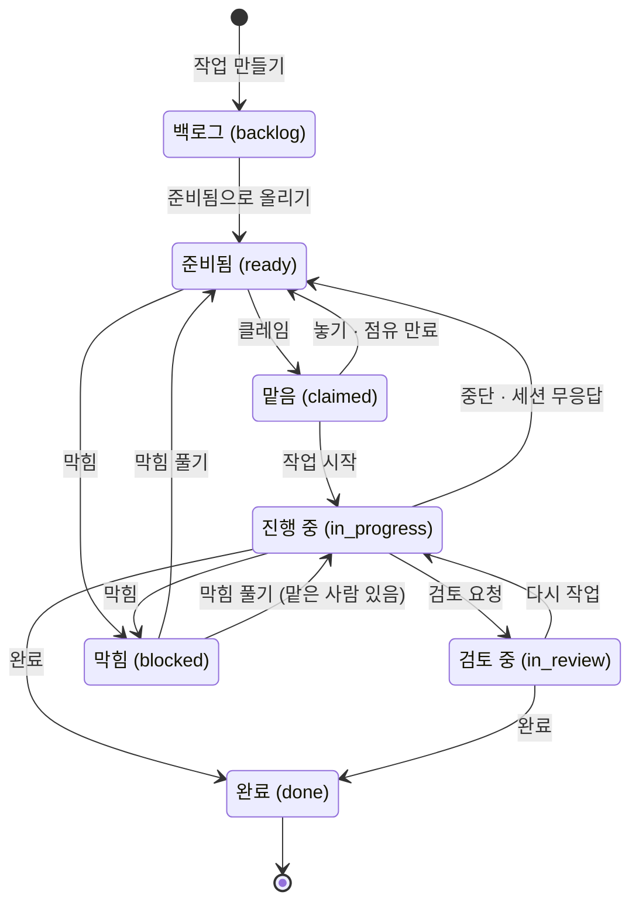

작업(Task)은 승인된 스펙에서 나온 할 일 하나입니다. 사람과 에이전트가 같은 보드를 봅니다.

## 보드와 레인

보드의 레인은 작업의 상태를 나타냅니다.

| 화면 이름 (값)          | 뜻                                  |
| ----------------------- | ----------------------------------- |
| 백로그 (`backlog`)      | 아직 착수할 대상이 아닙니다         |
| 준비됨 (`ready`)        | **지금 가져갈 수 있습니다**         |
| 맡음 (`claimed`)        | 누군가 맡았습니다                   |
| 진행 중 (`in_progress`) | 진행 중입니다                       |
| 검토 중 (`in_review`)   | 검토를 기다립니다 (선택)            |
| 완료 (`done`)           | 끝났습니다                          |
| 막힘 (`blocked`)        | 막혔습니다 (사유가 함께 표시됩니다) |

그림에는 자주 거치는 흐름만 담았습니다. 되돌리기(준비됨·백로그로)와 권한별 규칙은 아래 절에서 설명합니다. **완료는 되돌릴 수 없습니다.**

화면에는 상태가 **이름**으로 표시됩니다. 보드 레인, 작업 상세, 세션, 스펙의 파생 작업 목록이 모두 같은 이름을 씁니다. 괄호 안의 값은 API·CLI·에이전트가 쓰는 식별자입니다.

**보드 카드에는 누구의 일인지와 누가 실행하고 있는지가 표시됩니다.** 담당자는 이니셜 동그라미로만 표시되지만, 마우스를 올리면 이름이 나타나고 스크린 리더는 이름을 읽어 줍니다. 에이전트 세션이 그 작업을 실행하고 있으면 작은 **AI** 표식이 나타나고, 누르면 그 세션으로 이동합니다. 우선순위는 **P0·P1 만** 칩으로 표시됩니다. 모든 카드에 칩이 붙으면 신호 역할을 하지 못하기 때문입니다. 출처 스펙의 키를 누르면 그 스펙으로 이동합니다.

`in_review`는 **선택 단계**입니다. 여러 사람이 보는 보드에서 "산출물은 나왔지만 아직 확인하지 않은 작업"을 구분하고 싶을 때 씁니다. 이 단계를 거치지 않고 `in_progress`에서 바로 `done`으로 옮겨도 됩니다. 완료할 수 있는지는 거쳐 온 레인과 상관없이 증적과 스펙 영향을 채웠는지로 정해집니다.

**막힘 사유는 네 가지 중에서 고릅니다**: 답변 대기 · 선행 의존이 깨짐 · 기준 스펙과 어긋남 · 외부 요인. 사유를 자유롭게 적을 수는 없습니다. 같은 뜻을 사람마다 다른 문장으로 적으면 **막힘을 사유별로 셀 때 숫자가 틀어지기 때문입니다.** 더 적을 내용이 있으면 코멘트나 질문으로 남깁니다.

보드 카드와 작업 상세에는 사유가 **이 네 가지 이름 그대로** 표시됩니다. 사유 목록이 생기기 전(2026-09-06 이전)에 자유롭게 적어 둔 사유는 **그때 적은 문장 그대로** 보입니다. 예전 사유라고 숨기지 않습니다.

**막힌 작업 화면에는 무엇이 해결되면 풀리는지가 함께 표시됩니다.** 아직 막고 있는 것(열린 질문 · 끝나지 않은 선행 작업 · 대체된 기준 스펙)이 링크로 나타나고, 모두 해결되면 **이제 풀 수 있습니다** 배지가 붙습니다. 배지가 나타나도 저절로 풀리지는 않습니다. 작업 상세 상단의 **[막힘 풀기]** 를 눌러야 풀립니다. 맡은 사람이 있으면 **진행 중**으로, 없으면 **준비됨**으로(위임 명세가 비어 있으면 **백로그**로) 돌아갑니다. 아직 막고 있는 것이 남아 있으면 버튼이 비활성화되고 그 이유가 표시됩니다. 사유가 `외부 요인`이면 서버가 판정할 수 없으므로, 사람이 확인한 뒤 **[확인하고 풀기]** 로 풉니다.

**작업을 완료로 옮길 수 있는 사람은 넷입니다**: 그 작업의 활성 클레임을 가진 사람, 담당자, planner, admin. 에이전트는 규칙이 다릅니다. **자기 클레임이 살아 있어야만** `진행 중`·`검토 중`·`완료`로 옮길 수 있습니다. 거절 응답에는 작업을 다시 잡을 수 있는지가 함께 담겨 있으므로, 에이전트는 이를 보고 작업을 이어 갈지 그만둘지 정합니다. `claimed` 레인에는 상태를 옮겨서 들어갈 수 없고, 클레임해야만 들어갑니다.

**준비됨으로 되돌릴 때도 조건을 확인합니다.** 위임 명세 네 가지가 채워져 있어야 하고 선행 작업이 끝나 있어야 합니다(임포트로 들어와 명세 칸에 "원본에 위임 명세 없음" 이 적힌 작업은 **비어 있는 것으로 처리합니다**). 활성 클레임이 걸려 있으면 준비됨·백로그로 옮기기 전에 **먼저 클레임을 해제하거나 세션을 중단**해야 합니다.

**백로그 보기는 처음부터 켜져 있습니다.** 작업은 언제나 `backlog` 상태로 만들어지고, 위임 명세 네 가지를 채운 뒤에야 `준비됨`으로 올라갑니다. 그래서 방금 만든 작업은 백로그 레인에 있습니다. **네 가지를 다 채워서 만들었으면 카드의 [준비됨으로 올리기]를 누릅니다.** 만들기만 해서는 큐에 올라가지 않습니다. 버튼을 누르면 서버가 네 가지와 선행 작업을 확인한 뒤 올립니다. 위임 명세가 다 채워지지 않은 카드에는 **[채우기 ▸]** 버튼이 나타납니다. 백로그를 빼고 진행 중인 흐름만 보고 싶으면 **백로그 보기**를 끄면 됩니다. 이 설정은 주소에 남습니다(`?backlog=0`). 위쪽의 요약 줄(`준비됨` · `진행 중` · `내 담당` · `막힘`)을 보면 보드 전체를 훑지 않아도 상태를 알 수 있습니다.

**적용한 필터는 보드 위에 표시됩니다.** 요약 줄 위의 **스펙** · **담당** 필터로 작업을 거를 수 있습니다. 스펙 상세의 "파생 작업 → 보드에서 전체 보기" 처럼 필터가 걸린 링크로 들어와도 필터에 그 값이 표시됩니다. 필터가 하나라도 걸려 있으면 옆에 **필터 적용 중**이 표시되고, 이때 요약 줄의 숫자와 레인에는 **필터에 맞는 작업만** 반영됩니다. **[필터 지우기]** 는 스펙·담당·에이전트 필터를 해제하고, 백로그 보기와 보관 보기는 그대로 둡니다. 요약 줄의 **내 담당** 숫자를 누르면 내가 담당인 작업만 남습니다. 필터는 모두 주소에 남으므로(`?spec=` · `?assignee=`) 주소를 그대로 공유할 수 있습니다.

**레인의 카드는 한 번에 다 불러오지 않습니다.** 건수에 `+` 가 붙은 레인은 카드가 더 있다는 뜻입니다. 레인 아래의 **+N개 더** 로 이미 받아 둔 카드를 펼치고, **더 불러오기**로 다음 묶음을 불러옵니다. 보관 보기를 켠 완료 레인처럼 긴 레인도 끝까지 볼 수 있습니다. **준비됨 레인이 비어 있으면** 다음에 할 일이 표시됩니다: **막힘 N건 보기**(막힘 레인으로 이동)와 **백로그 N건 채우기**(백로그 레인으로 이동하며, 백로그 보기가 꺼져 있으면 켭니다).

## 작업 상세는 보드 위에 열립니다

카드를 누르면 작업 상세가 **보드 오른쪽에 시트로** 열립니다. 보드는 뒤에 그대로 남아 있습니다. 적용한 필터, 접어 둔 레인, 펼쳐 둔 "+N개 더" 가 모두 유지되고, 뒤에 있는 다른 카드를 누르면 시트가 그 작업으로 바뀝니다. 좁은 화면에서는 시트가 화면 전체를 덮습니다.

- 시트 상단의 **✕** 를 누르거나 `Esc` 키를 누르면 시트가 **닫힙니다**. 보드의 필터는 주소에 남아 있으므로 시트를 닫아도 풀리지 않습니다.
- `j` · `k` 로 **같은 레인의 다음·이전 작업**으로 넘어갑니다. 시트 상단에 "레인에서 2 / 5" 처럼 현재 위치가 표시됩니다. 막힌 카드 여러 장을 차례로 살펴볼 때 편리합니다.
- 입력칸에 커서가 있을 때는 `Esc`·`j`·`k` 가 동작하지 않습니다.
- 시트로 열어도 작업 상세의 주소(`/p/…/tasks/CLV-T-…`)는 그대로이므로 링크로 공유할 수 있습니다. 그 주소로 들어오면 보드를 뒤에 둔 채로 시트가 열립니다.

## 다음 단계는 작업 상세 상단에 있습니다

작업 상세 제목 오른쪽의 버튼으로 **지금 상태에서 다음 상태로 넘어갑니다**.

| 지금 상태 | 상단의 버튼                                                                          |
| --------- | ------------------------------------------------------------------------------------ |
| 백로그    | 네 가지를 다 채웠으면 **[준비됨으로 올리기]**, 빈 것이 있으면 **[위임 명세 채우기]** |
| 준비됨    | **[클레임]**                                                                         |
| 맡음      | **[진행 시작]** · [완료…]                                                            |
| 진행 중   | **[검토 요청]** · [완료…]                                                            |
| 검토 중   | **[완료…]**                                                                          |
| 막힘      | **[막힘 풀기]** (서버가 판정할 수 없는 사유면 [확인하고 풀기])                       |

**누를 수 없는 버튼도 비활성 상태로 표시됩니다.** 마우스를 올리거나 `Tab` 으로 이동하면 이유가 나타납니다(할 수 있는 역할 · 다른 사람이 맡고 있음 · 아직 남은 막힘). [클레임]은 **준비됨** 작업에만 나타납니다. 점유 시간이 지난 클레임만 걸려 있는 작업은 예외이며, 이때 누르면 그 클레임을 회수하고 새로 잡습니다. 예전에는 백로그나 막힌 작업에서도 이 버튼이 보였지만, 누르면 거절됐습니다.

**상단에는 담당과 실행이 함께 표시됩니다.** **담당 {이름}** 은 그 일을 책임지는 사람이고, **실행 {호스트} ▸** 는 지금 그 작업을 맡아 실행하고 있는 에이전트 세션입니다. 누르면 그 세션으로 이동합니다. 담당과 실행은 서로 다를 수 있습니다. 담당은 사람이 정하고, 실행은 클레임을 가진 쪽입니다.

**완료 폼은 [완료…]를 누르거나, 작업이 맡음·진행 중·검토 중일 때 펼쳐집니다.** 스펙 영향은 **처음에 아무것도 선택되어 있지 않습니다**. "없음" 도 직접 골라야 하므로, 고르기 전에는 [완료로 바꾸기]가 비활성화됩니다. "있음" 을 고르면 어떤 스펙이 어떻게 바뀌어야 하는지 적어야 버튼이 활성화됩니다. 붙은 증적이 없으면 누르기 전에 그 사실이 표시됩니다. done 게이트가 증적을 요구하기 때문입니다. 작업을 막힘으로 표시하려면 별도의 **막힘으로 표시** 카드에서 사유를 고릅니다.

## 위임 명세 네 가지

작업이 `ready`가 되려면 다음 네 가지를 채워야 합니다.

1. **목표** — 무엇을 이루면 끝인가
2. **산출물 형식** — 무엇을 내놓아야 하는가 (PR·문서·패치)
3. **도구·출처** — 무엇을 보고 무엇으로 하는가
4. **경계** — 건드리면 안 되는 것

하나라도 비어 있으면 클레임할 수 없습니다. **큰 작업은 한 단계를 더 거칩니다.** 같은 스펙 버전에서 나온 작업이 넷 이상이거나 그 버전이 T3 이면, 착수 전에 **계획 승인**을 받아야 합니다([받은 요청](/help/inbox)). **기준 스펙 버전은 이 네 가지에 들어가지 않습니다.** 기준 버전이 있으면 에이전트가 그 버전을 읽고, 없어도 작업은 `ready` 로 올라갑니다. 에이전트는 빈 칸을 짐작으로 채우지 않고 **질문을 올리도록** 되어 있습니다. 짐작으로 시작한 일은 다 끝난 뒤에야 틀렸다는 것이 드러나기 때문입니다.

**작업은 승인본을 바탕으로 만듭니다.** 스펙 화면의 요구사항 줄에서 [이 요구사항으로 작업 만들기]를 누르면 출처가 채워진 새 작업 폼이 열립니다. 폼을 직접 열었으면 스펙·버전·요구사항을 폼에서 고를 수 있고, **버전 목록에는 승인본만** 나옵니다. 승인되지 않은 문서에서 만든 작업은 아직 합의되지 않은 내용을 기준으로 삼게 되기 때문입니다. 출처는 선택 사항이지만, 채워 두면 그 요구사항의 구현 상태가 이 작업의 진행에 따라 바뀝니다.

**위임 명세는 작업 상세에서 고칩니다.** 위임 명세 카드의 **[고치기]** 를 누르면 그 자리에 폼이 열립니다. 비어 있는 칸과 임포트 자리표시자("원본에 위임 명세 없음")는 **❌** 로 표시됩니다. 폼에서는 그런 칸이 **빈 칸**으로 열리고, "원본에 없음 (채워야 합니다)" 가 흐리게 표시됩니다. 채운 칸만 저장되고 비워 둔 칸은 바뀌지 않으므로, 제목만 고칠 수도 있습니다. 저장하면 아직 비어 있는 칸의 이름을 알려 줍니다. 원래 내용이 있던 칸은 비울 수 없습니다. 지시 재확인 배지 옆에도 [고치기]가 있습니다. 기준 버전이 바뀌면 지시도 다시 읽어야 하기 때문입니다. **작업은 planner · developer · admin · qa 가 만들 수 있고, 위임 명세는 planner · developer · admin 이 고칠 수 있습니다**(qa 는 발견한 문제를 작업으로 올리지만 명세는 쓰지 않습니다). 권한이 없는 사람에게는 [+ 새 작업]·[채우기 ▸]·[고치기]가 비활성 상태로 보입니다. 폼을 다 채운 뒤에야 거절당하는 일을 막기 위해서입니다.

작업 상세에는 작업의 근거가 읽기 쉬운 형태로 표시됩니다: 요구사항의 고정 ID와 문장, 활성 클레임의 남은 시간과 작업 범위, 이 작업의 리뷰(열린 critical 이 있으면 붉게 표시). 셋 모두 누르면 해당 화면으로 이동합니다. 요구사항은 그 스펙의 **요구사항** 탭으로, 클레임 줄의 **[세션 보기 ▸]** 는 그 클레임을 가진 세션으로, 리뷰 줄의 브랜치는 **그 브랜치의 발견만** 걸러 낸 리뷰 센터로 이어집니다.

## 클레임과 점유 시간

작업을 맡는 것을 **클레임**이라고 합니다. 클레임은 30분 동안 유효하고, 세션은 60초마다 하트비트를 보내 이 시간을 연장합니다.

- 하트비트가 끊기면 점유가 풀리고 작업은 다시 `ready`로 돌아갑니다. 응답이 없는 세션이 작업을 계속 붙잡고 있지 않게 하는 장치입니다.
- 두 세션이 같은 범위를 건드리면 **겹침**으로 판정됩니다. 다만 모두 거절하지는 않고, 세 등급으로 나눕니다. **차단**은 두 세션이 **같은 스펙 문서**를 선언했을 때만 해당하며, 이때만 두 번째 클레임이 거절됩니다. **경고**는 스펙 트리에서 위아래로 이어진 문서이거나 같은 요구사항에서 나온 작업일 때이고, **알림**은 그 밖에 범위가 조금 겹치는 경우입니다. 경고와 알림은 사실을 알려 줄 뿐 클레임을 막지 않습니다. **파일 경로만 겹치는 경우는 막지 않습니다.** 겹칠 때마다 막으면 큰 모듈 하나 때문에 프로젝트 전체 작업을 한 번에 하나씩만 할 수 있게 됩니다. **클레임이 차단되면 먼저 클레임한 쪽에 알림이 갑니다.** 차단된 쪽은 그 자리에서 거절 응답을 받지만, 범위가 충돌하고 있다는 사실을 알아야 할 사람은 먼저 클레임한 쪽이기 때문입니다.
- **웹에서도 클레임하고 놓을 수 있습니다.** 작업 상세 상단의 [클레임]을 누르면 바로 클레임됩니다. 범위는 이 작업의 출처 스펙 하나이고, 파일은 선언하지 않습니다. 클레임을 놓을 때는 둘 중 하나를 고릅니다. **[인계]는** 다음 사람이 이어받으라는 뜻이고, **[포기]는** 작업을 그만둔다는 뜻입니다. 두 경우는 다르게 기록되므로 나중에 "왜 놓았는가"를 확인할 수 있습니다. **[포기]를 누르면 한 번 더 확인합니다.** 작업이 `ready` 로 돌아가기 때문입니다.
- 클레임은 보통 **클레임한 쪽**이 놓습니다. 에이전트는 작업을 끝냈거나 그만둘 때 스스로 클레임을 놓습니다(`nerv_task_release`). 다른 사람이 클레임한 작업을 멈추고 싶으면 세션 화면에서 **중단**하면 됩니다. 그러면 클레임이 바로 풀리고 작업이 `ready` 로 돌아갑니다.
- **아무도 클레임하지 않은 진행 중 작업은 되돌릴 수 있습니다.** 클레임이 걸려 있지 않은 `claimed`·`진행 중` 작업에는 [준비됨으로 되돌리기] 또는 [백로그로 되돌리기] 버튼이 나타납니다. 위임 명세 네 가지가 채워져 있으면 앞의 것이, 임포트로 들어와 명세가 비어 있으면 뒤의 것이 나타납니다. 예전에는 임포트로 만들어진 진행 중 작업이 오랫동안 그 상태로 남아 있었습니다. 큐에도 보이지 않고 클레임할 수도 없어서 아무도 맡을 수 없었습니다. 활성 클레임이 걸려 있으면 먼저 클레임을 해제하거나 세션을 중단해야 합니다.
- 서버는 이보다 넓게 허용합니다. **admin 은 다른 사람의 클레임도 놓을 수 있고**, planner·admin 은 다른 사람이 클레임한 작업의 상태도 옮길 수 있습니다. 다만 화면에는 이 기능이 없습니다.

## 완료와 보관 창

끝난 작업은 **7일 동안** 보드에 남아 있다가 그 뒤에는 목록에서 빠집니다. **보관 보기**를 켜면 7일이 지난 작업까지 보입니다.

보관 창은 상태가 아니라 **완료 시각을 기준으로 계산하는 기간**입니다. 보관된 작업도 지워지지 않으며, 주소로 그대로 열 수 있습니다.

**`done` 은 되돌릴 수 없습니다.** 끝난 작업을 다른 레인으로 옮기려는 요청은 거절됩니다. 완료는 증적과 스펙 영향을 채우고 닫은 상태이므로, 이를 되돌리는 것은 새로운 결정이기 때문입니다. 이어서 할 일이 남아 있으면 **새 작업을 만듭니다.**

## 증적을 눌러 봅니다

작업 상세의 **증적** 목록은 그 작업이 결과로 보여 줄 자료를 붙인 기록입니다. 연결된 곳이 있는 항목은 **누르면 새 탭에서 열립니다**. PR 은 적어 둔 주소로, 커밋과 코드 경로는 프로젝트 저장소의 해당 위치로, 리뷰는 리뷰 센터의 해당 발견으로 이동합니다. 새 탭에서 여는 이유는 이 화면에서 완료 폼을 작성하는 중일 수 있기 때문입니다. 같은 탭에서 다른 페이지로 이동하면 적어 둔 스펙 영향과 증적이 사라집니다.

**증적에 저장소 정보가 있으면 그 저장소로 이동합니다.** CI 가 붙인 증적에는 어느 저장소에서 왔는지가 함께 기록되므로, 저장소를 여러 개 쓰는 프로젝트에서도 해당 커밋이 있는 저장소로 이동합니다. 저장소 정보가 없으면 프로젝트의 저장소 주소를 씁니다.

**사용자 가이드 증적은 이 매뉴얼의 해당 장으로 이동합니다.** `tasks` 처럼 장 이름을 적거나 `/help/tasks` 처럼 주소 전체를 적으면 그 장이 열립니다. 없는 장 이름은 링크 없이 글자로만 표시됩니다.

**누를 수 없는 항목도 있습니다.** 테스트 이름은 저장소마다 적는 방식이 달라서 어디로 연결할지 추측하지 않습니다. 잘못된 곳으로 안내하는 링크보다는 글자로 두는 편이 낫기 때문입니다. 커밋과 코드 경로는 **프로젝트에 저장소 주소가 있어야** 열립니다. 저장소 주소가 비어 있으면 그 항목들은 글자로만 표시되고, 화면에 그 이유가 함께 표시됩니다.

## 요구사항 링크

작업은 자신이 구현한 요구사항을 가리킬 수 있습니다. 이 링크가 영향을 주는 것은 프로젝트 화면의 **작업 없음** 지표 하나입니다. **작업 없음**은 어떤 작업도 맡고 있지 않은 미구현 요구사항의 수입니다. 링크가 없으면 이 수는 0이 아니라 **최댓값**으로 표시됩니다.

구현·검증 비율 막대는 이와 별개입니다. 이 막대는 요구사항 자체의 구현 상태로 계산합니다(스펙 장의 "요구사항" 절).

## 기준 버전이 낡으면

작업의 기준 스펙 버전이 `superseded`가 되면 작업 카드에 그 사실이 표시됩니다. 표시만 할 뿐, **작업의 기준 버전을 나중에 바꾸는 기능은 화면에 없습니다.**

그래서 둘 중 하나를 골라야 합니다. 지금 기준으로 작업을 끝내고 차이는 다음 작업으로 넘기거나, 새 버전을 기준으로 **새 작업을 만듭니다**. 어느 쪽으로 할지는 사람이 정하며, 화면이 대신 고르지 않습니다.
