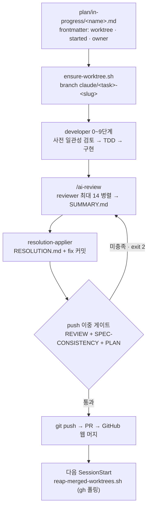
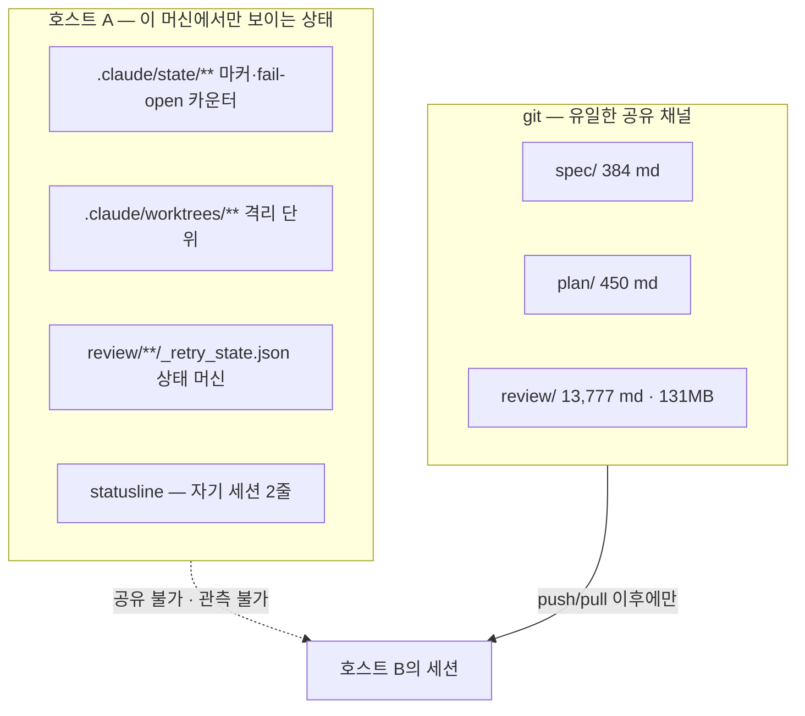
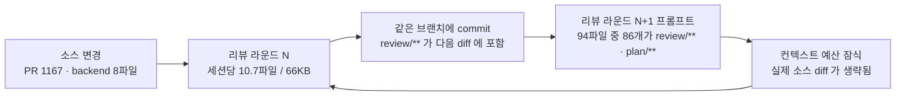

---
referenced_by:
  - 01-problem/pain-points.md
  - 02-research/spec-driven-development.md
  - 02-research/agent-orchestration.md
  - 02-research/collab-platforms.md
  - 02-research/integration-tech.md
  - 03-proposal/vision.md
  - 03-proposal/architecture.md
  - 03-proposal/data-model.md
  - 03-proposal/agent-integration.md
  - 03-proposal/spec-workflow.md
  - 03-proposal/ui-wireframes.md
  - 03-proposal/roadmap.md
  - 04-mvp/importer.md
  - README.md
  - ../README.md
---
# clemvion 하네스 분석 — 1인용 SDD+TDD 하네스가 도달한 곳과 그 상한

> **요약** — `clemvion`은 1인 개발자가 Claude Code 하네스로 SDD(스펙 주도 개발)+TDD를 자동화한 제품 모노레포이며, 규약을 사람의 규율이 아니라 훅·빌드 가드로 기계 강제한다는 점에서 완성도가 매우 높다. 훅 9종·판정 모듈 `_lib` 6종·공용 모듈 `_shared` 4종·워크플로우 3종 합계 약 7,600줄이 "리뷰 없이 push 금지", "main 브랜치에서 작업 금지", "완료 plan은 스펙 영향 선언 의무" 같은 규칙을 실제로 차단한다. 그러나 조율에 쓰이는 상태가 전부 gitignored 로컬 파일이라 규칙의 강제력이 **호스트 경계에서 끝나고**, 스펙 동시수정 자동 검출은 "다른 머신·세션이면 로컬에 안 보인다"는 이유로 저장소 스스로 제거했다. 동시에 리뷰 산출물 13,777개(131MB)가 코드와 같은 브랜치에 커밋되면서 `.git` packed blob 바이트의 60%를 차지하고, 한 changeset이 8라운드를 도는 동안 마지막 라운드 리뷰 프롬프트 94파일 중 86개가 이전 리뷰 산출물이 되는 자기증식 루프가 실측됐다. 이 문서는 계승할 자산과 버려야 할 구조를 전부 `clemvion:경로` 근거와 실측치로 분리한다.
>
> 문서 버전 v0.2 · 2026-08-13 · HTML 파생본: [clemvion-analysis.html](../html/clemvion-analysis.html)
>
> v0.2 변경(2026-09-05 — 용어 사전 반영, 사람 지시): [용어 사전](../glossary.md)의 채택어로 이 문서의 낱말을 옮긴다 — 기준선(← 베이스라인) · 워크플로우(← 워크플로) · 권한/소속/작업 범위(← 스코프) · 버전(← 판) · 고정 ID(← 안정 ID·키). **뜻은 바뀌지 않는다** — 코드·API 식별자는 그대로다.

---

## 1. clemvion 개요

### 1.1 무엇을 만드는 저장소인가

`clemvion`은 워크플로우 에디터형 제품(노드 기반 자동화 · 웹챗 채널 · 실행 엔진)을 만드는 모노레포다. 최상위 구조는 다음과 같다(`clemvion:CLAUDE.md`).

| 디렉토리 | 역할 | 실측 규모 |
| --- | --- | --- |
| `spec/` | 제품 단일 진실(스펙 문서) | md 384개 · 9.3MB (API 카탈로그 제외 순수 스펙 **135 md · 49,383줄**) |
| `plan/` | 작업 티켓 = markdown 파일 | md 450개 · 5.2MB (in-progress 62 / complete 387 / research 1) |
| `review/` | AI 리뷰 산출물 | md **13,777개 · 131MB** (code 9,070 · consistency 4,697 · spec-coverage 10) |
| `codebase/` | 실제 제품 코드 | frontend · backend · packages · channel-web-chat, 724MB |
| `.claude/` | 하네스 | agents 31 · commands 3 · skills 6 · hooks 9(+`_lib` 6) · workflows 3 · tools 7 · state · docs · config |

- 근거: `clemvion:CLAUDE.md`, `clemvion:spec/0-overview.md`, `clemvion:.claude/docs/plan-lifecycle.md`, `clemvion:.gitignore`.
- `.git`은 148MB(`git count-objects` size-pack 118MiB · count 3,797)이며, 그중 리뷰 이력이 대부분을 차지한다(§5.5).

핵심은 **하네스가 제품의 일부가 아니라 개발 방식 그 자체**라는 점이다. 스펙을 쓰는 주체, 코드를 쓰는 주체, 리뷰하는 주체가 스킬(역할)로 분리되어 있고, 각 역할의 경계는 프롬프트 규약이 아니라 훅과 빌드 테스트로 강제된다.

### 1.2 하네스의 철학: "강제 없는 규약은 반드시 깨진다"

clemvion의 모든 게이트는 **문서로 시작해서 실패를 겪은 뒤 기계 강제로 승격됐다**. 이 패턴은 저장소가 스스로 기록해 둔 것이다.

- 리뷰 의무(산문) → `review_guard` 하드 게이트: 2026-07-17 전수 조사에서 "커밋된 575 세션 중 160건이 forced 리뷰어 미충족(그중 107건은 `RESOLUTION.md`를 갖고 게이트를 통과 중)"으로 드러났고, "산문 의무는 예외가 아니라 상시로 무너지고 있었다"는 결론과 함께 디스크 리포트 파일 기준 기계 강제로 승격됐다(`clemvion:.claude/skills/code-review-agents/SKILL.md`).
- plan 갱신(산문) → `plan_guard` push 게이트: 리뷰 게이트와의 비대칭을 해소하려고 신설(`clemvion:.claude/hooks/_lib/plan_guard.py`).
- plan `status` 필드(산문) → 빌드 가드: "이 저장소가 **두 번** 놓친 실패다(#1108·#1117) — 그때까지 이 필드는 어떤 게이트도 보지 않고 사람의 규율에만 기대고 있었다"(`clemvion:.claude/docs/plan-lifecycle.md`).

> **D-14 — 게이트는 fail-open + 관측 + 격상, 진실은 서버 산출물.** clemvion의 판정 원칙은 "디스크가 arbiter"다. 자기보고 STATUS에 대응하는 파일이 없으면 그것은 가짜 성공이며, 계약은 그 가짜 성공을 없애려고 존재한다(`clemvion:.claude/docs/subagent-call-contract.md`). NERV는 이 원칙을 "서버에 업로드된 산출물만 진실"로 번역한다.

### 1.3 규모 한눈에 (실측, 2026-08-13)

| 지표 | 값 | 출처 |
| --- | --- | --- |
| 리뷰 산출물 | md **13,777개 / 131MB** (json 포함 17,329 파일, 전부 git 추적) | `clemvion:review/` |
| 리뷰 세션 | **1,891개 / 73일**(2026-06-02~08-13) ≈ 일평균 26개 | `clemvion:review/**` 경로 집계 |
| git 점유 | review 이력 blob **23,533개 / 60.7MB packed = 전체 blob 바이트의 60%**(`.git`의 ~41%) | `git cat-file` 집계 |
| 커밋 오염도 | 전체 커밋 2,464개 중 **937개(38%)**가 `review/` 접촉 | `git log` 집계 |
| 증가 추세 | 현 페이스 유지 시 월 **~7,000파일 / ~50MB** | 월별 분포 집계 |
| 하네스 코드 | 훅+`_lib`+`_shared`+workflows 약 **7,600줄** (최대 단일 훅 1,005줄) | `clemvion:.claude/hooks/`, `clemvion:.claude/workflows/` |
| 하네스 회귀 테스트 | `.claude/tests/` **57파일 · 1.2MB** | `clemvion:.claude/tests/` |

---

## 2. 하네스 구성 요소 전수

### 2.1 역할 스킬 5+1종 = 경로별 쓰기 권한

`clemvion:CLAUDE.md` §Skill 체계는 역할을 **쓰기 가능한 경로**로 정의한다. 이것이 clemvion이 1인 개발 환경에서 직군 분리를 시뮬레이션하는 방식이다.

| 역할 | 스킬 | 쓰기 권한 | 강제 수단 |
| --- | --- | --- | --- |
| 기획자 | `project-planner` | `spec/**`, `plan/**` | 프롬프트 규약(SKILL.md) + 착수 전 `/consistency-check --spec` 의무 |
| 개발자 | `developer` | `codebase/**`, `plan/**`, `review/**/RESOLUTION.md` (`spec/` read-only) | 프롬프트 규약 + push/Stop 게이트 |
| 일관성 검토자 | `consistency-checker` | `review/consistency/**` | `BLOCK: YES` 시 호출자 즉시 중단 |
| 코드 리뷰어 | `code-review-agents` | `review/code/**` | push 게이트가 산출물 존재를 검사 |
| 통합 조율자 | `merge-coordinator` | `review/merge/**`, `.claude/worktrees/integrate-*/**` | 사용자 confirm 2회 |
| (보조) 커버리지 감사 | `spec-coverage` | `review/spec-coverage/**` | advisory — 차단 없음 |

- 위임 규약: "구현 중 spec 변경 필요 시 `developer`는 멈추고 `project-planner`에 위임"(`clemvion:CLAUDE.md`), 반대로 planner는 "구현 금지 — 코딩·리팩토링·테스트 작성은 `developer` 위임"(`clemvion:.claude/skills/project-planner/SKILL.md`).
- 리뷰어는 sub-agent로 세분화된다: `clemvion:.claude/agents/` 31개(코드 리뷰어 14종 · 일관성 checker 5종 · merge 계열 6종 · `resolution-applier`·`review-router`·`user-guide-writer` 등).
- **중요한 한계**: 이 역할 분리를 강제하는 것은 훅이 아니라 SKILL.md 서술이다. "planner 세션이 codebase를 고치는 것을 막는 OS/권한 수준 장치는 없다"(`clemvion:.claude/skills/developer/SKILL.md` 및 역할 규약 대조). 훅이 막는 것은 "어디서(worktree)·무엇을 안 하고(리뷰·plan 갱신) push 하는가"이지 "누가"가 아니다.

### 2.2 훅 9종 전수표

`clemvion:.claude/hooks/` 아래 훅 스크립트 9개 + 판정 모듈 `_lib` 6개(공용 모듈 `_shared` 4개·워크플로우 3종과 합쳐 약 7,600줄 — §1.3). **차단 조건**과 **우회 수단**을 함께 읽어야 이 하네스의 실제 강제력이 보인다.

| # | 훅 파일 | 이벤트 | 목적 | 차단 조건 | 우회 수단 |
| --- | --- | --- | --- | --- | --- |
| 1 | `guard_default_branch_edit.py` | PreToolUse(Write/Edit/MultiEdit/NotebookEdit) | main 워크트리 기본 브랜치 편집 차단 | **exit 2 하드 차단** — (최상위 `.git`이 디렉토리 = main worktree) AND (현재 브랜치 == origin 기본 브랜치). 판정은 **CWD 기준이며 target file_path 기준이 아님**(경로 위장 우회 봉쇄) | `BYPASS_DEFAULT_BRANCH_GUARD=1` (단발) |
| 2 | `guard_default_branch_prompt.py` | UserPromptSubmit | 작업 의도 프롬프트에 경고 주입 | 차단 없음. 한/영 정규식(`구현`, `수정`, `\bimplement\b` 등) 매칭 시 `<system-reminder>` 주입 | 해당 없음(비차단) |
| 3 | `guard_default_branch_bash.py` | PreToolUse(Bash) | mutating 명령 경고 | **절대 차단하지 않음** — "Bash 명령 분류는 오탐이 너무 쉽다". mutating 정규식 최초 1회만 reminder, 세션당 1회 dedup(`.claude/state/main_worktree_bash_warned/<session_id>`) | 해당 없음(비차단) |
| 4 | `guard_review_before_push.py` (1,005줄) | PreToolUse(Bash) — `git push` 감지 | 리뷰·plan 이중 게이트 | **exit 2 하드 차단** — ① REVIEW: `codebase/**` 변경에 "fresh, resolved review" 부재 ② SPEC-CONSISTENCY: 스펙 `code:` glob 매칭 변경에 최신 `--impl-done` 리포트(`BLOCK: NO`) 부재 ③ PLAN: 연결된 in-progress plan 미갱신. 16KB 초과 명령은 분석 없이 차단 | `BYPASS_REVIEW_GUARD=1` / `BYPASS_PLAN_GUARD=1` · 게이트 모듈 예외 시 **fail-open**(허용+배너) |
| 5 | `guard_review_before_stop.py` | Stop | 리뷰 미완 턴 종료 저지 | **소프트** — `{"decision":"block","reason":…}` JSON. (session_id, branch)당 1회 넛지, `stop_hook_active`면 즉시 허용(anti-wedge) | 마커 존재 시 자동 통과 · in-flight 리뷰 30분 TTL 양보 · fail-open |
| 6 | `mark_resolution_in_flight.py` | PreToolUse(Agent) | `resolution-applier` 디스패치 기록 | 차단 없음 — `.claude/state/resolution_in_flight/<tool_use_id>` 마커 기록 | 해당 없음(비차단) |
| 7 | `clear_resolution_in_flight.py` | SubagentStop | 같은 마커 삭제 | 차단 없음 | SubagentStop 미발화(크래시) 시 30분 TTL 백스톱 |
| 8 | `lint_mermaid_posttooluse.py` | PostToolUse(Write/Edit/…) | md 내 mermaid 문법 검증 | **exit 2** — mermaid 블록 파싱 실패 시 모델에게 수정 지시 | deps 미설치 · 20초 타임아웃 · tooling broken(exit 3) 전부 **fail-open** |
| 9 | `normalize_worktree_branch.py` | UserPromptSubmit + PreToolUse(Bash) | 브랜치명 컨벤션 사후 교정 | 차단 없음 — `worktree-<name>` → `claude/<name>` rename | linked worktree AND `worktree-` 접두 AND **upstream 미설정**일 때만 동작 |

부속 강제 지점(훅 파일은 아니지만 같은 계층에서 동작):

| 지점 | 시점 | 목적 | 차단 조건 | 우회 수단 |
| --- | --- | --- | --- | --- |
| `clemvion:.githooks/pre-commit` | `git commit` 직전 | 브랜치 가드 + mermaid 린트 재검사 | `branch_guard.py` exit 2 → commit exit 1 | `core.hooksPath` 미설정 클론이면 **아예 동작 안 함** |
| `clemvion:.claude/tools/bootstrap-session.sh` | SessionStart | hooksPath 활성화 · mermaid deps · 마커 GC(30일) · reaper 호출 | 항상 exit 0 (차단 없음) | npm install 실패 시 30분 cooldown |

판정 로직은 `clemvion:.claude/hooks/_lib/` 6개 모듈로 분리돼 있다: `branch_guard.py`(브랜치 판정 단일 SoT), `review_guard.py`(리뷰 신선도·커버리지), `plan_guard.py`(plan 연결 판정), `failopen_state.py`(연속 카운터), `branch_naming.py`, `mermaid_lint_ready.py`.

### 2.3 4-layer 브랜치 가드 — 같은 규칙을 네 지점에서

SSOT는 `clemvion:.claude/docs/worktree-policy.md` §5이고 판정은 `clemvion:.claude/hooks/_lib/branch_guard.py` 한 곳이다.

> 차단 조건 = (최상위 `.git`이 **디렉토리** = main worktree) **AND** (현재 브랜치 == origin 기본 브랜치)

linked worktree(`.git`이 파일), detached HEAD, origin 부재는 모두 허용된다. 4개 레이어(A: 편집 차단 / B: 프롬프트 리마인더 / C: pre-commit / D: Bash 리마인더)는 **차단 강도가 의도적으로 다르다** — 오탐 비용이 큰 지점(Bash 명령 분류)은 아예 차단하지 않는다. 정식 진입 경로는 `clemvion:.claude/tools/ensure-worktree.sh <task_name>`이며, `.claude/worktrees/<task>-<slug>/` + 브랜치 `claude/<task>-<slug>`를 origin 기본 브랜치 기준으로 만든다. 스크립트는 "호출자의 CWD를 바꿀 수 없다 — 출력된 `cd` 명령을 호출자가 직접 실행해야 한다"고 명시한다.

### 2.4 push 이중 게이트 — 1,005줄이 하는 일

`clemvion:.claude/hooks/guard_review_before_push.py`는 하네스 최대 단일 훅이다. 분량 대부분은 **"이 Bash 명령이 push인가"를 텍스트로 판정**하는 데 쓰인다.

- **설계**: "BLIND first pass + 열거된 릴리스 허용목록". shlex 파서로 재작성했다가 "리뷰 라운드마다 새로운 false-negative 유형이 발견돼" 되돌렸고, 대신 무지한 정규식으로 먼저 잡은 뒤 커밋 메시지(`-m '…'`)·heredoc 본문 같은 불활성 텍스트만 blank 처리해 재검사한다.
- **ReDoS 역사가 주석에 실측치로 박제**: "246바이트 명령에서 6.4초 측정", `A=v\n`×20000 입력이 30초 → 5ms로 수정. 16KB 초과 명령은 분석하지 않고 안전 방향(차단)으로 처리한다.
- **멀티 worktree 스코핑**: `cd <다른 worktree> && git push`가 게이트를 통과하는 실측 우회(2026-07-23)가 발견되어, `git worktree list --porcelain`의 모든 브랜치·경로명이 명령 텍스트에 등장하면 그 worktree도 함께 평가하도록 확장됐다. 잔여 갭도 명시돼 있다 — "도구의 CWD가 이미 다른 worktree 안인 상태에서의 bare push는 훅 자신의 CWD만 평가된다".
- **freshness 시계**: 리뷰 시각은 파일 mtime이 아니라 **세션 디렉토리 경로의 타임스탬프**(`review/code/<Y>/<m>/<d>/<H>_<M>_<S>`), 코드 시각은 커밋 author date(clean)/mtime(dirty). checkout·rebase가 mtime과 committer date를 리셋해 오판하던 문제를 회피하려는 "rewrite-immune 시계" 공학이다(`clemvion:.claude/hooks/_lib/review_guard.py`).

"fresh, resolved review"의 정의는 세 조건의 논리곱이다(같은 파일 docstring): (a) `agents_forced` 리뷰어 전원의 리포트 존재, (b) `RESOLUTION.md` 존재 또는 `## 전체 위험도`가 NONE/LOW, (c) 최신 코드 변경보다 나중.

> **D-07 — AI 리뷰는 플랫폼 엔티티다.** 게이트 판정은 서버 SQL로 내려간다. 위 세 조건은 리뷰가 **커밋 SHA와 연결되기만 하면** 단순 질의가 된다. 파일시스템 walk·경로 타임스탬프·author-date 시계·rebase 면역 설계는 전부 "커밋 링크 없음"을 보상하려는 우회 공학이다(`clemvion:.claude/hooks/_lib/review_guard.py`). NERV에서는 ReviewSession이 입력 커밋 스냅샷을 필수 필드로 갖고, 게이트 판정 API(FR-10)가 이를 대체한다.

### 2.5 Stop 소프트 게이트와 anti-wedge

`clemvion:.claude/hooks/guard_review_before_stop.py`는 push 게이트와 **같은 판정 함수**(`evaluate_review()` / `evaluate_plan()`)를 재사용하되 세 가지를 양보한다.

1. `stop_hook_active`면 즉시 허용 — 무한 루프 차단.
2. 넛지는 (session_id, branch)당 1회 — 마커 `.claude/state/review_stop_nudged/<sid>__<branch>[__<kind>]`.
3. `evaluate_review(in_flight_ok=True)` — 시작됐지만 SUMMARY 미작성인 리뷰 세션(30분 TTL)은 넛지 억제. **push 게이트는 이 양보를 받지 않는다**: "공유된 기본 활성 억제는 TTL 전체 구간 동안 push 게이트를 열어버렸을 것"이라는 실제 버그의 회귀 방지 주석이 남아 있다.

여기에 재리뷰 경합 억제 마커 쌍(#6·#7 훅)이 붙는다. `resolution-applier`가 만든 fix 커밋은 리뷰 이후 시점의 코드 변경이므로 Stop 넛지를 재발화시켜 "때이른 중복 `/ai-review` — 토큰 낭비 + 경합"을 유발한다. 이 억제는 Stop 전용이며 push는 여전히 하드 게이트다.

### 2.6 fail-open + 연속 카운터 격상

게이트 모듈 import 실패나 평가 예외가 나면 push는 **허용**되지만 침묵하지 않는다.

- 명시적 배너 출력("이 push는 검사되지 않았습니다") + `.claude/state/push_guard_failopen.json`에 **연속 fail-open 횟수** 기록.
- `ESCALATE_AT = 3` — 3회 연속이면 "이 게이트는 사실상 꺼져 있습니다"로 격상(`clemvion:.claude/hooks/_lib/failopen_state.py`).
- 리셋은 `_ALL_GATES = {REVIEW, PLAN}` 전원이 답한 실행에서만.

이 패턴은 NERV가 그대로 계승할 가치가 있다(§4). 다만 **관측자가 본인 터미널뿐**이라는 점이 한계다(§5.1).

### 2.7 워크플로우 3종과 서브에이전트 호출 계약

`clemvion:.claude/workflows/`에 `ai-review.js`(325줄) · `consistency-check.js`(197줄) · `merge-coordinate.js`(202줄)가 있고, 공통 패턴은 4단계다.

1. Python orchestrator `--prepare`(모델 호출 없음)가 diff 코퍼스를 수집해 `review/<종류>/<ts>/_prompts/<agent>.md` + `_retry_state.json` manifest 작성.
2. main 세션이 manifest를 읽어 워크플로우 호출.
3. `ai-review.js`는 Route → Review → Summary 3단. **Route 불신 규칙**: `review-router`가 forced 리뷰어를 제외하면 라우팅 결정을 폐기하고 전수 실행한다. 도입 계기는 2026-07-23 사고 — "14개 전부 false, '문서만 변경' 판정, 그런데 changeset에는 새 Python 모듈이 있었다".
4. Summary 단계는 전 리포트를 **인라인으로** 전달한다. 근거: "워크플로우 스크립트에는 파일시스템 접근이 없다" + Write를 건너뛴 리뷰어의 Critical이 사라져 "CRITICAL이 읽히지 않은 채 `BLOCK: NO`가 나온 사례가 한 작업에서 3회" 실측.

서브에이전트 호출 계약(`clemvion:.claude/docs/subagent-call-contract.md`)은 인자 2줄(`prompt_file=` / `output_file=`)과 반환 1줄(`STATUS=<success|rate_limit|network|fatal> ISSUES=<n> PATH=<output_file> RESET_HINT=<sec>`)로 고정돼 있고, "Write 실패 시 success 거짓 보고 절대 금지"를 명시한다. 하네스 자체 가드도 실측돼 있다 — `SUMMARY.md`/`summary.md`/`REPORT.md`/`findings.md` basename은 **어떤 sub-agent도 Write 불가**이며, 그래서 summary 계열은 전문을 반환하고 호출자(main)가 멱등 Write한다.

이 계약의 알려진 결함: 같은 에이전트에 대한 `--update` 호출이 겹치면 lock 없는 read-modify-write라 앞선 전이가 유실된다. 실측 기록(2026-08-07): "두 개의 겹친 update가 있었고, 먼저 쓴 쪽의 전이가 사라졌다". 그 전이가 `fatal`이었다면 sentinel까지 함께 지워져 **어떤 재조정으로도 복구되지 않는다**(`clemvion:.claude/docs/subagent-call-contract.md` §5).

### 2.8 worktree 정책과 GC reaper

- 모든 신규 작업은 `.claude/worktrees/<task>-<slug>/` 안에서만 수행한다(`clemvion:.claude/docs/worktree-policy.md` §1). e2e 인프라도 자동 격리된다 — "`make e2e-*`는 worktree 디렉토리 basename으로 compose project name을 도출해 컨테이너·볼륨·network를 분리"(§3).
- worktree 수명은 PR 단위. 정리는 `clemvion:.claude/tools/reap-merged-worktrees.sh`가 세션 시작마다 수행: `gh pr list --state all --limit 200` 1회 배치로 브랜치→상태 맵을 만들고, MERGED + clean인 worktree와 dangling `claude/*` 브랜치를 제거한다. LOCAL-ONLY(원격 ref 불변) · dirty 보존 · gh 부재 시 fail-safe · 6시간 throttle.
- 설계 근거가 곧 구조적 진단이다: "merge는 대부분 GitHub 웹에서 일어나 로컬이 그 이벤트를 관측할 수 없다. 그래서 세션 시작마다 조회해 정리한다 — 멱등적"(§7). **이벤트 소스(서버) 부재를 폴링으로 보상**하는 전형이다.

### 2.9 로컬 상태 파일 인벤토리

조율에 쓰이는 상태는 예외 없이 로컬 파일시스템에 있고, `.gitignore`가 `.claude/state/`·`.claude/worktrees/`·`review/**/_prompts/`를 제외한다 — 즉 **조율용 상태는 전부 비공유**다.

| 상태 | 위치 | 형태 | 키 |
| --- | --- | --- | --- |
| Bash 경고 dedup | `.claude/state/main_worktree_bash_warned/<session_id>` | 빈 touch 파일 | 하네스 `session_id` |
| Stop 넛지 dedup | `.claude/state/review_stop_nudged/<sid>__<branch>[__<kind>]` | 빈 touch 파일 | `session_id` + 브랜치명 |
| resolution 진행 중 | `.claude/state/resolution_in_flight/<tool_use_id>` | epoch 초 텍스트 | `tool_use_id` |
| fail-open 연속 카운터 | `.claude/state/push_guard_failopen.json`, `stop_guard_failopen.json` | `{"streak":n,"gates":[…]}` | 없음(파일 단일) |
| reaper throttle | `.claude/state/reap_last_run` | 빈 파일(mtime이 시계) | 없음 |
| mermaid 설치 마커/쿨다운 | `node_modules/.bootstrap-install-complete`(lockfile sha256), `.claude/state/mermaid_install_last_fail` | 해시/mtime | 없음 |
| 리뷰 세션 상태 머신 | `review/<종류>/<Y>/<m>/<d>/<H>_<M>_<S>/_retry_state.json` | JSON manifest | 세션 디렉토리 경로 |
| 작업 추적 | `plan/in-progress/<name>.md` frontmatter | git 내 markdown | `worktree:` 문자열 |
| 가시성 | `.claude/statusline.sh` (transcript JSONL 파싱) | 터미널 2줄 렌더 | 자기 세션 |

statusline은 model·컨텍스트 %·누적 비용·git ahead/behind·`plan/in-progress/` 카운트를 보여준다. **가시성 대시보드가 로컬 터미널 두 줄에 갇혀 있는 형태**다(`clemvion:.claude/statusline.sh`).

---

## 3. 문서 체계



### 3.1 spec/ — 계층·3섹션 규약·증적 frontmatter

**계층**: 루트 진입 문서(`0-overview.md` 제품 비전·구현 상태·문서맵, `1-data-model.md` 943줄 엔티티 SoT, `6-brand.md`) + 영역 폴더 7개(`2-navigation` 18 · `3-workflow-editor` 7 · `4-nodes` 44(하위 7 카테고리) · `5-system` 18 · `7-channel-web-chat` 7 · `conventions` 22+카탈로그 249 · `data-flow` 16). 최대 문서는 1,750줄이 2개(`clemvion:spec/5-system/4-execution-engine.md`, `clemvion:spec/2-navigation/4-integration.md`).

**3섹션 포맷**(`clemvion:.claude/skills/project-planner/SKILL.md`): `## Overview (제품 정의)`(옛 PRD 자리) → 본문(데이터 모델·API·UI·상태 전이·에러 처리) → `## Rationale`(결정 배경·근거·**폐기된 대안**, 옛 ADR 자리). 실측 105개 문서가 Rationale을 보유한다. 본문은 "latest-only 사실"만 기술하고 이력은 git이 전담한다(`clemvion:spec/0-overview.md`).

**요구사항 ID**: `_product-overview.md` 안에서 `NAV-WF-01` · `ED-CV-01` · `ND-AG-24` · `CCH-SE-02` 형식(영역-화면-순번)으로 쓰이고, 커밋 메시지도 이 ID로 대화한다(예: `2a698f360` "spec이 `필수`로 약속한 update dedup이 통째로 미구현이었다 (CCH-SE-02)"). 그러나 **구현 상태 ✅ 컬럼은 영역마다 비일관**하다 — `clemvion:spec/2-navigation/_product-overview.md`는 ✅ 마크 131개, `clemvion:spec/3-workflow-editor/_product-overview.md`와 `clemvion:spec/7-channel-web-chat/_product-overview.md`는 상태 컬럼 자체가 없다.

**증적 frontmatter**(`clemvion:spec/conventions/spec-impl-evidence.md`):

```yaml
---
id: chat-channel          # kebab-case, basename 기반
status: implemented       # 5값 enum
code:                     # 구현 경로 glob (레포 루트 상대)
  - codebase/backend/src/modules/chat-channel/**
pending_plans:            # status: partial 일 때 의무
  - plan/in-progress/<name>.md
user_guide:               # 선택, 가드 미적용 (R-10)
---
```

status 5값 라이프사이클: `backlog`(→ `id`가 `0-overview.md` 본문에 등장 의무) → `spec-only`(**TTL 90일 초과 시 빌드 실패**) → `partial`(`code:` ≥1 매치 + `pending_plans:` 의무) → `implemented`(`code:` ≥1 매치) / `archived`(폐기 사유 + 90일 후 삭제 권장).

실측 분포는 frontmatter 추적 대상 **135개 문서**에서 `implemented` 117 · `partial` 17 · `backlog` 1이다(`spec-only`·`archived`는 0). 이 문서의 다른 수치는 2026-08-13 조사분이지만, 이 항목만은 조사 과정에서 집계값이 갈려 **2026-08-14에 재검증한 값**을 싣는다 — 그 이유가 바로 아래 내용이다.

> **이 수치를 세는 방식 자체가 P4의 사례다.** 단순 `grep '^status:'` 라인 집계는 118/18/1/1(합 138)로 부풀려진다 — 규약 문서 `clemvion:spec/conventions/spec-impl-evidence.md`(5회)와 `clemvion:spec/conventions/swagger.md`(2회) **본문의 예시 frontmatter 라인**이 함께 세어지기 때문이다. 실제 문서 frontmatter만 파싱하면 117/17/1이고 합이 정확히 135로 맞는다. 같은 저장소를 두 방식으로 세면 다른 답이 나온다는 것 자체가, 구현 상태가 문서 텍스트에 흩어져 있는 한 "무엇이 얼마나 구현됐나"는 **측정 방법에 따라 흔들리는 추정치**임을 보여준다. NERV가 상태를 DB 필드로 들고 관계 질의로 답해야 하는 이유다(**D-03**, [데이터 모델](../03-proposal/data-model.md)).

도입 동기가 이 규약의 핵심을 말해준다: 기존 검사가 전부 change-triggered라 "'스펙이 약속한 surface가 **지금** 구현됐는가'는 어떤 검사도 묻지 않았다". 기원 사례는 텔레그램 chat-channel UI 영구 누락 — 스펙이 plan을 가리키지 않아 "어떤 plan도 책임지지 않는 빈 약속"이 됐다(§Overview, R-5).

### 3.2 빌드 결합 가드 9종

스펙 거버넌스 검증이 **프론트엔드 단위 테스트**로 구현돼 있다(`clemvion:codebase/frontend/src/lib/docs/__tests__/`). 빌드 실패 = 차단이다.

| 가드 | 검사 대상 |
| --- | --- |
| `spec-frontmatter.test.ts` | 필수 필드 존재 |
| `spec-code-paths.test.ts` | `code:` glob이 실제 파일 ≥1개와 매치 |
| `spec-status-lifecycle.test.ts` | `spec-only` TTL 90일, `partial`→`implemented` 승격 누락, `backlog` 로드맵 등재 |
| `spec-pending-plan-existence.test.ts` | `pending_plans:`가 가리키는 plan 실존 |
| `spec-link-integrity.test.ts` | in-repo 상대링크 타깃 존재 + heading slug 앵커 대조 |
| `spec-area-index.test.ts` | 영역 폴더(≥2 sibling)에 index 문서 존재 + 전 sibling 링크 |
| `plan-frontmatter.test.ts` | plan 필수 3필드 |
| `spec-plan-completion.test.ts` (**Gate C**) | 완료 plan의 `spec_impact` 선언 |
| `/spec-coverage --mode reverse` (**Gate D**, advisory) | 스펙 미참조 route·이벤트·env를 NLP 휴리스틱으로 탐지 — CI 비차단 |

역방향 증적(가이드→코드)은 별도 규약 `clemvion:spec/conventions/user-guide-evidence.md`가 담당한다 — MDX 본문에 `<ImplAnchor kind file symbol describes>`를 심고 3개 테스트가 파일 실존과 symbol grep을 강제한다.

**규약이 스스로 인정하는 약점**: R-1 "stale glob(없어진 파일을 가리키는 glob이 다른 파일에 매칭돼서 통과)은 본 가드만으로 검출 불가", R-10 "`user_guide:`는 빌드 가드 미적용". 그리고 `clemvion:PROJECT.md` §자주 누락되는 항목은 "spec frontmatter `code:` glob stale — backend 경로만 명시하고 frontend 경로 누락"을 재현 패턴으로 기록해 두었다.

부작용 하나가 중요하다: **스펙 본문의 plan 링크도 링크 무결성 검사 대상**이라 plan이 `in-progress/`→`complete/`로 이동하면 스펙 링크를 함께 고쳐야 빌드가 통과한다. 문서 이동이 곧 빌드 리스크다.

### 3.3 plan/ — markdown 파일 하나가 티켓

별도 이슈 트래커 없이 `plan/in-progress/<name>.md` 하나가 태스크 티켓이다(`clemvion:.claude/docs/plan-lifecycle.md` §1).

- **분류 규칙**: 미체크 체크박스·TODO·"결정 필요"가 하나라도 있으면 `in-progress/`, 전부 끝나면 `complete/`. 작업이 아닌 조사 문서는 `plan/research/`로 제3의 축 분리 — "리서치 문서는 `in-progress/`에 영구 정체하며 실제 진행 중 작업 목록을 오염시킨다"(§2).
- **필수 3필드**: `worktree:`(살아있는 worktree 디렉토리명, 미착수는 sentinel `(unstarted)`) · `started:`(ISO 날짜) · `owner:`. placeholder(TBD 등)는 가드가 거부한다 — "어떤 worktree와도 매칭되지 않아 plan이 게이트에서 사라지므로".
- **`worktree:`가 곧 소유권 클레임**: 이 값이 push 게이트의 "연결 판정" 키다(plan frontmatter `worktree:` basename ↔ 현재 worktree 디렉토리명 매칭).
- **Gate C**: `started >= 2026-06-04`인 완료 plan은 frontmatter `spec_impact` 선언 의무(스펙 실존 경로 리스트 또는 sentinel `none`/`없음`/`n/a`/`na`). `status`를 선언했다면 종료값 4종(`complete`·`implemented`·`applied`·`superseded`)만 허용.
- **완료 이동 의식**: 모든 체크박스 `[x]` + follow-up 0건이 되는 **마지막 작업 PR 안에서** `git mv` + `chore(plan): mark <name> complete` 별도 커밋. "plan 이동만 담은 별 PR 분리 금지".
- 양방향 추적 구조가 완성돼 있다: plan→spec은 `spec_impact`(완료 시), spec→plan은 `pending_plans`(부분 구현 시). 둘 다 빌드 실패로 강제된다.

스키마의 취약점이 실물로 기록돼 있다 — `clemvion:plan/in-progress/retry-turn-terminal-guard.md` frontmatter 주석: "최초 worktree는 #1024로 머지됐다. 머지된 값을 두면 P1 코드 push 시 가드가 '연결된 plan 없음(ad-hoc)'으로 오판해 **무장 해제**된다". `worktree:`는 스칼라 1개라 재착수·다중 worktree를 표현하지 못하고 수동 갱신에 의존한다.

### 3.4 review/ — 경로가 곧 데이터베이스 인덱스

```
review/
├── code/          YYYY/MM/DD/HH_MM_SS/   ← /ai-review (reviewer 최대 14)
├── consistency/   YYYY/MM/DD/HH_MM_SS/   ← /consistency-check (checker 5)
└── spec-coverage/ YYYY/MM/DD/HH_MM_SS/   ← standing audit (단일 감사자)
```

**세션 1세트 파일 구성**(실례 `clemvion:review/code/2026/08/13/19_08_48/` — 11파일 약 85KB): `SUMMARY.md`(단일 진입점, main이 멱등 Write) · `meta.json`(대상 파일 목록·agents·route_mode·agents_forced) · `_retry_state.json`(세션 상태 머신) · `<role>.md`(역할별 리뷰어 리포트) · `RESOLUTION.md`(자동 fix 결과) · `_resolution_state.json`/`_resolution_log.md` · `_prompts/`(gitignored).

**리뷰어 매트릭스** 기본 14종(`security` `performance` `architecture` `requirement` `scope` `side_effect` `maintainability` `testing` `documentation` `dependency` `database` `concurrency` `api_contract` `user_guide_sync`). 이 중 **7종은 코드 변경 시 강제 화이트리스트**(`agents_forced`)로 router도 제외할 수 없다: `documentation` `maintainability` `requirement` `scope` `security` `side_effect` `testing`(`clemvion:.claude/skills/code-review-agents/SKILL.md`).

**severity 어휘 3계층**:

| 계층 | 어휘 | 위치 |
| --- | --- | --- |
| 발견사항 | `[CRITICAL]` / `[WARNING]` / `[INFO]` + 위치 `<파일경로>:<줄번호>` | 리뷰어 출력 형식(`clemvion:.claude/agents/security-reviewer.md`) |
| 리뷰어·세션 위험도 | `NONE` / `LOW` / `MEDIUM` / `HIGH` / `CRITICAL` | 리포트 말미 `### 위험도`, SUMMARY `## 전체 위험도` |
| 특수 태그 | `[SPEC-DRIFT]` — "구현이 스펙을 의도적으로 개선해 스펙이 낡음" | 통합 시 보존 의무: "절대 일반 WARNING으로 뭉개지 말 것"(`clemvion:.claude/agents/code-review-summary.md`) |

consistency는 여기에 SUMMARY 최상단 **`BLOCK: YES/NO`**를 추가한다 — "Critical = 차단: `BLOCK: YES`면 호출자 즉시 멈춤", "**Critical 하향은 금지다**"(`clemvion:.claude/skills/consistency-checker/SKILL.md`). spec-coverage는 별도 어휘를 쓴다(`[severe]`/`[major]` + confidence `high/medium/low`).

**SUMMARY.md 스키마**는 고정돼 있다(`clemvion:.claude/agents/code-review-summary.md`): `## 전체 위험도` → `## Critical 발견사항` → `## 경고 (WARNING)` → `## 참고 (INFO)`(각각 `| # | 카테고리 | 발견사항 | 위치 | 제안 |` 표) → `## 에이전트별 위험도 요약` → `## 발견 없는 에이전트` → `## 권장 조치사항` → `## 라우터 결정`. **표의 행 번호(#)가 곧 finding ID**이며 커밋 메시지와 RESOLUTION이 `SUMMARY#<n>`으로 참조한다.

**resolution-applier**(`clemvion:.claude/agents/resolution-applier.md`)는 `## 조치 항목`(분류 ∈ {코드, spec(draft 위임), SPEC-DRIFT}) · `## TEST 결과`(e2e는 "통과 / 면제 / 자동 흐름 환경 차단 / 3회 실패" 4형식만) · `## 보류·후속 항목` 구조를 강제하고, fix 커밋 메시지는 `fix(<scope>): SUMMARY#<n> <한 줄 요약>` — "`SUMMARY#<n>` 인용 강제 — idempotency 복구에 필요". `_resolution_state.json`에 `commits_made: [{"sha","summary_id","scope"}]`로 **finding→commit이 구조화**돼 있다.

**ESCALATE 매트릭스**(한 줄 프로토콜): `STATUS=… ITEMS=<r>/<t> E2E=… ESCALATE=<no|spec|user-decision|infra|e2e-fail-3x|sensitive-fix> NEEDS_SPEC=… RESOLUTION=…`. 특히 `spec` 경로는 SPEC-DRIFT 역류를 정식화한다 — resolution-applier가 코드를 되돌리지 않고 `plan/in-progress/spec-update-<area>.md` draft를 만들고 `/consistency-check --spec`으로 스펙에 반영한다.

---

## 4. 잘 작동하는 것 — 계승 자산

| 계승 자산 | clemvion 근거 | NERV 반영 |
| --- | --- | --- |
| **역할 = 경로별 쓰기 권한 분리** | 기획/개발/검토/통합 5+1 스킬, planner만 `spec/` 쓰기(`clemvion:CLAUDE.md`) | 역할(admin·planner·designer·developer·qa·viewer) 기반 권한(FR-14), 사람 assignee + 에이전트 delegate 분리(D-08) |
| **"미루기 금지" 게이트** | "'PR에서' 미루는 것은 위반이며, hook으로 강제된다"(`clemvion:.claude/skills/developer/SKILL.md`) | Task `done` 전이 조건에 해소된 리뷰 필수(FR-10) |
| **증적(evidence) 개념** | `code:` glob · `pending_plans:` · `spec_impact` · `<ImplAnchor>` (`clemvion:spec/conventions/spec-impl-evidence.md`) | Evidence 엔티티 — Requirement↔Task↔PR↔Review 관계 그래프(D-03, FR-13) |
| **Rationale 문화(폐기된 대안 보존)** | 105개 문서의 `## Rationale` + `rationale-continuity-checker`(기각 결정 재도입 검출) | 스펙 타입 `adr` + SpecVersion 불변 스냅샷(FR-02) |
| **fail-open + 연속 카운터 격상** | `ESCALATE_AT = 3`, "이 게이트는 사실상 꺼져 있습니다"(`clemvion:.claude/hooks/_lib/failopen_state.py`) | D-14 — 판정 불가 시 진행 허용 + 배너 + 임계 초과 시 격상 |
| **rewrite-immune 시계 같은 공학** | 경로 타임스탬프 + author date 시계(`clemvion:.claude/hooks/_lib/review_guard.py`) | 서버 발급 이벤트 시각으로 **자연 해소** — 이 공학 자체가 불필요해지는 것이 이득 |
| **디스크가 arbiter (자기보고 불신)** | "파일이 뒷받침하지 않는 자기보고 STATUS는 이 계약이 없애려는 가짜 성공"(`clemvion:.claude/docs/subagent-call-contract.md`) | D-14 — 에이전트 자기보고와 산출물 업로드 분리 검증 |
| **라우터 불신 규칙** | forced 리뷰어 누락 시 라우팅 결정 폐기·전수 실행(`clemvion:.claude/workflows/ai-review.js`) | 리뷰 커버리지 무결성 판정(FR-09) |
| **ESCALATE 어휘 + SPEC-DRIFT 역류 경로** | `no/spec/user-decision/infra/e2e-fail-3x/sensitive-fix`(`clemvion:.claude/agents/resolution-applier.md`) | 받은 요청(FR-11) 카드 유형 + CR 흐름(FR-04) |
| **완료 의식이 스펙 정합을 강제 동반** | Gate C — 완료 plan의 `spec_impact` 선언 의무 | Task 완료 API의 필수 필드로 승격(FR-05) |
| **doc-sync-matrix 3중 구조** | 사람용 표(`clemvion:PROJECT.md`) + 기계용 JSON(`clemvion:.claude/config/doc-sync-matrix.json`) + 정합 테스트 | 규칙 엔진·체크리스트 자동화 |
| **쓰기 전 사전 일관성 검토** | planner의 `/consistency-check --spec` 의무(5 관점 병렬) | 스펙 제출 파이프라인의 자동 사전 검토 단계 |
| **규칙의 사후 승격 패턴** | 산문 → 실패 실측 → 기계 강제(#1108·#1117·575세션 조사) | 처음부터 서버 정책 엔진으로 — 사후 보수 비용 소거 |

한 가지 더 짚을 것: **차단 게이트의 공유 모듈화는 양날**이다. push 게이트가 정규식을 의도적으로 중복 보유하는 이유는 "공유 모듈 하나가 깨지면 차단 게이트가 통째로 사라지는" 실패 모드를 피하기 위해서다(`clemvion:.claude/hooks/guard_review_before_push.py`). NERV의 서버 게이트 설계에도 동일한 격리 원칙이 필요하다.

---

## 5. 구조적 한계 — 전부 실측 인용

### 5.1 로컬 상태 갇힘: 규칙의 강제력이 호스트 경계에서 끝난다



갇히는 이유는 네 가지이며 모두 설계에 내장돼 있다(`clemvion:.claude/hooks/`, `clemvion:.gitignore`).

1. **키가 로컬 하네스 식별자**: dedup 마커의 키는 `session_id`·`tool_use_id`·브랜치명이다. 다른 머신의 세션은 이 키 공간을 볼 수도 공유할 수도 없다.
2. **시계가 로컬 파일시스템/경로**: freshness 판정이 세션 디렉토리 경로 타임스탬프·author date·mtime이라 한 checkout 안에서만 정합적이다.
3. **게이트 권한이 `git worktree list` 결과** = 이 머신의 checkout 목록. 다른 호스트의 브랜치는 push 게이트의 타깃 열거에 아예 등장하지 않는다.
4. **훅 미설치 클론이면 규칙 전체가 무효**: 모든 게이트가 "이 머신의 훅"이고, 훅 등록조차 SessionStart 부트스트랩에 의존한다(수동 클론은 별도 setup 필요).

동시성 제어는 전무하며 **의도적으로 포기됐다**: `retry_state`의 atomic replace는 찢어진 읽기만 막고 "동시 writer 간의 lost update는 남는다", fail-open streak도 "read-increment-write에 lock이 없다"("겹친 두 실행이 증가 하나를 잃고 격상을 한 번 늦출 수 있다"), 부트스트랩 npm install도 직접 만든 mkdir lock이 TOCTOU로 "락이 막으려던 바로 그 경합"을 재현해 제거됐다. 전부 "1인 저빈도 로컬" 전제에서 수용한 잔여 리스크이며, n 세션에서는 **상시 발생 조건**이 된다.

사람 개입 채널도 없다. 승인·거절·코멘트는 전부 "그 터미널의 그 세션" 안에서만 가능하고, **누가(hostname) 무엇을 돌리는지는 어디에도 기록되지 않는다**.

> **D-01 — 스펙·리뷰 산출물은 git이 아니라 플랫폼 DB에 저장한다.** 조율 상태가 gitignored 로컬 파일인 한 크로스머신 조율은 원리적으로 불가능하다. NERV는 상태 저장·조정·리뷰 보관·게이트 판정을 서버로 옮기고, git에는 코드와 read-only 미러·포인터만 남긴다(D-12).

### 5.2 owner가 신원이 아니라 자유 텍스트 라벨

`plan/in-progress/` 34개 top-level plan의 `owner:` 실측 분포(`clemvion:.claude/docs/plan-lifecycle.md` 스키마 + 실물 grep):

| 값 | 건수 |
| --- | --- |
| `developer` | 17 |
| `project-planner` | 8 |
| `planner` | 5 |
| `developer (TBD)` | 2 |
| `사용자 본인 / planner` | 1 |
| `developer (다음 진입자)` | 1 |

같은 역할의 표기가 요동하고(`planner` vs `project-planner`), "다음 진입자" 같은 무주공산 표기가 존재한다. **실제 사람 배정(assignee)·계정·hostname 개념 자체가 없다.** 게다가 모든 승인 권한이 단일 "사용자"에게 수렴한다 — merge-coordinator의 2중 confirm, e2e 면제 승인, plan grooming, BLOCK 해소 결정의 종착지가 전부 한 명이며 역할별 승인자 분리(기획 승인 vs 코드 승인)가 없다(`clemvion:.claude/skills/merge-coordinator/SKILL.md`).

### 5.3 백로그 부재와 인덱스 문서 부패

**공식 백로그 큐·정렬 장치는 없다.** 존재하는 것은 신호 4종과 사람의 수동 picking이다(`clemvion:.claude/docs/plan-lifecycle.md` §6).

1. 로드맵 표 — `clemvion:spec/0-overview.md` §6(6.1 완료 ✅ / 6.2 부분 🚧 / 6.3 미구현 ❌), 수동 유지.
2. 스펙 frontmatter 라이프사이클 — `spec-only` TTL 90일이 **유일한 시간 압박 장치**.
3. `plan/in-progress/` 자체 — 34건 중 **13건이 `(unstarted)`** 착수 대기. 우선순위는 15/34만 frontmatter `priority: P1~P3`(P1 3 · P2 5 · P3 6 · 기타 1)이고 나머지는 본문 라벨로 산재. **전역 정렬·기한·담당 배정 없음.**
4. audit 도구 2종은 보고만 하고 차단하지 않는다 — `clemvion:.claude/tools/plan-stale-audit.sh`(30일 stale·DONE?·ORPHAN? 플래그, "fail 안 함 — 정보 출력만"), `/spec-coverage`(NLP 휴리스틱, "보고만 산출, 사용자가 picking").

**부패의 실증**: 과거 백로그 인덱스 `plan/in-progress/0-unimplemented-overview.md`는 커밋 `65f3e526b`(#426, 2026-06-03)에서 "**미관리 stale 문서**"로 삭제됐다. 그런데 `clemvion:plan/in-progress/marketplace-and-plugin-sdk.md`는 지금도 "상위 인덱스: `0-unimplemented-overview.md` §A"라는 dangling 참조를 보유한다 — inline code 표기라 상대링크 가드에 잡히지 않는다. 수동 인덱스 문서는 유지비를 감당하지 못해 죽었고, 이후 백로그 조망은 사람의 머리와 audit 출력에 의존한다.

> **D-04 — 동시성 제어는 원자적 클레임+리스(lease).** 우선순위·정렬·기한은 문서가 아니라 **질의 가능한 메타데이터**여야 한다. NERV는 의존성 그래프로 ready를 판정하고(FR-05), `nerv_task_claim`이 assignee와 상태를 원자적으로 전환하며 TTL 리스+하트비트로 만료를 자동 회수한다(FR-06).

### 5.4 스펙 동시수정 검출의 의도적 제거

이것이 clemvion이 **스스로 명시한 최대 한계**다. `clemvion:.claude/docs/worktree-policy.md` §3:

> 동일 `spec/` 파일·코드 영역을 두 worktree가 동시 수정 중이면 plan에 명시하고 직렬화한다. **자동 검출은 없다** — 사용자와 통합 단계(`/merge-coordinate`)의 책임이다.

제거 이력까지 남아 있다. `plan_coherence` checker가 worktree 경합을 검출했으나 `3da85dc3b`(#576)에서 제거됐고, 사유는 "**병렬 작업이 다른 머신·세션에서 진행되면 로컬에 반영되지도 않아 신뢰할 수 없고**, 불필요한 git/gh 조회로 토큰만 소모하기 때문"이다. 즉 로컬 파일시스템이 유일한 상태 저장소인 한 크로스머신 조율은 원리적으로 불가능하다는 결론을 저장소가 직접 내렸다.

같은 계열의 자백이 두 건 더 있다.

- **세션 앵커 레지스트리 부재**: "자기 세션의 앵커만 알 수 있다. 동시에 열린 다른 세션이 앵커로 쓰는 worktree의 PR이 머지되면 **그 세션은 여전히 죽는다**('살아있는 세션 앵커 레지스트리'가 필요해 과하다고 판단)"(`clemvion:.claude/docs/worktree-policy.md` §7). 그 레지스트리가 곧 NERV의 AgentSession 프레즌스(FR-07)다.
- **머지 이벤트 관측 불가**: reaper가 `gh` 폴링으로 수렴하는 구조(§2.8)는 이벤트 소스 부재의 전형적 증상이다.

조정이 **낙관적**이라는 것이 결론이다 — 격리(worktree)로 물리 충돌만 막고, 논리 충돌(같은 스펙 영역을 두 세션이 다르게 개정)은 사람의 직렬화 판단과 머지 시점 분석으로 미룬다.

### 5.5 리뷰 자기증식 루프와 git 비대화



실측 인용(`clemvion:review/code/2026/08/13/19_08_48/requirement.md`):

> prompt는 대부분(94개 파일 중 86개) 그 8라운드의 `review/**` 산출물… 실질 소스 변경은 backend 8파일… prompt 예산 초과로 여러 diff/전체 파일 컨텍스트가 생략됐으므로, 워크트리에서 직접 검증했다

changeset 하나(#1167)가 code review 5회 + consistency 3회 = **8라운드**를 돌며 라운드마다 약 10파일씩 쌓였고, 그 누적물이 다음 라운드 리뷰어의 컨텍스트 예산을 잠식해 정작 소스 diff가 생략되는 지경에 이르렀다.

누적 수치:

| 항목 | 값 |
| --- | --- |
| `review/` 총량 | 131MB / 17,329파일(md 13,777 + json 3,552), **전부 git 추적** |
| 워킹트리 내 위상 | `codebase/` 724MB 다음 **2위** — `spec/` 9.3MB·`plan/` 5.2MB의 10~25배 |
| `.git` 총 크기 | 148MB (전체 packed blob 43,097개 / 100.6MB) |
| review 이력 blob | **23,533개 / 60.7MB packed = 전체 blob 바이트의 60%** |
| review 접촉 커밋 | **937 / 2,464 (38%)** — 월별 03:5 → 04:86 → 05:284 → 06:303 → 07:204 → 08(13일):55 |
| 세션당 용량 추세 | code 59KB → 62KB → 81KB (라운드가 깊어지며 리포트가 길어짐) |
| 현 추세 | 월 **~7,000파일 / ~50MB** 지속 증가 |

**대응의 역사가 이미 한 바퀴 돌았다**(`clemvion:.gitignore` 및 git 고고학):

1. 2026-03-30 `8387260e7` 리뷰 체계 도입(초기 플랫 구조).
2. 2026-05-17 `fc16810cf`/`541228a87` — `_prompts/` gitignore + untrack. 근거 원문: "diff + role checklist의 시점 직렬화본이라 commit hash + `.claude/skills/`로 항상 재생성 가능하고, 리뷰 결론은 별도 `<role>.md`/`SUMMARY.md`/`meta.json`에 남는다. **review/ 전체의 ~70%를 차지해 blob 누적이 빠르므로 git에 두지 않는다.**"
3. 2026-05-30 `f7c56bf0a` — 과거 세션 대량 삭제 + `review/.gitignore`에 `*`(전체 미추적 시도).
4. 2026-06-01 `770fbdc3d` — 전체 미추적을 **이틀 만에 롤백**(게이트와 plan 인용이 커밋된 산출물에 의존하기 때문).

즉 "재생성 가능한 입력은 버리고 결론은 남긴다"는 절충이 이미 실행됐고, **그럼에도 결론만으로 60MB·60%를 차지하는 것이 현재**다. 게다가 5-30 삭제분 blob은 `.git` 이력에 영구 잔존한다.

> **D-07 — AI 리뷰는 플랫폼 엔티티다.** 리뷰를 git에서 빼는 것 자체가 루프 차단이다 — 산출물이 DB로 가면 다음 리뷰의 diff에서 사라져 자기증식(컨텍스트 예산 잠식 포함)이 구조적으로 소멸한다. 보존 정책은 clemvion이 이미 검증한 절충을 그대로 쓴다(D-07) — 결론(SUMMARY·Finding)은 영구, 재생성 가능한 입력(프롬프트 페이로드)은 TTL.

### 5.6 provenance — 무엇이 끊겨 있나

리뷰의 출처 추적은 일부만 구조화돼 있고 나머지는 산문이다(`clemvion:review/**` 스키마 실측).

| 연결 | 상태 |
| --- | --- |
| finding → fix commit | **구조화됨** — `SUMMARY#<n>` 커밋 규약 + `_resolution_state.json.commits_made[{sha,summary_id}]` |
| 세션 → 리뷰 대상 파일 | 부분 — `meta.json.files[{file_path, change_type}]`, **경로만이며 커밋/해시 없음** |
| 세션 → 검토 커밋·diff base·브랜치 | **부재** — code 리뷰 `meta.json`에 해당 필드가 없다. SUMMARY 본문 산문에만 해시가 등장하며 **표본 200개 SUMMARY 중 47개만 해시를 언급**한다 |
| 세션 → 워크트리 | 우연 — `_retry_state.json`의 절대경로에 새어 있을 뿐(의도된 필드 아님). worktree가 reap되면 그 경로는 죽는다 |
| 세션 → PR | **부재** — PR 번호는 머지 커밋 제목(`(#1167)`)에만 존재 |
| 세션 → 스펙/plan | 산문 — finding의 스펙 근거는 인용문(`spec/5-system/13-replay-rerun.md §RR-PL-05` 식). 역방향은 plan 체크리스트가 담당하며 **plan md 450개 중 197개가 리뷰 세션 경로를 인용**, 반대로 스펙에서 리뷰를 참조하는 파일은 **2개뿐** |
| 라운드 체인 | 산문 — "이전 라운드(`18_38_10`) 이후…" 식 상호 인용. "changeset X의 N라운드"라는 구조화된 축이 없다 |
| finding 동일성 | **부재** — 라운드를 넘는 같은 발견이 매번 새 표 행으로 재서술된다(예: 동일 유예 건이 `14_01_46`/`17_15_21`/`18_19_33` 세 세션에서 반복 재확인). **dedup 키 없음** |

유예(deferral) 결정의 기억도 산문으로만 존재한다 — `clemvion:review/code/2026/08/13/17_15_21/RESOLUTION.md`는 INFO 항목을 번호별로 처분하며 "이전 라운드(`14_01_46`)가 이미 지적하고 의식적으로 유예한 항목의 재확인… 그대로 유지"라고 적는다. 이것이 Finding의 `fingerprint`와 Resolution 상태(`open → fixed / dismissed / wont_fix`)가 1급 데이터여야 하는 이유다(D-07, FR-09).

### 5.7 산문 계약 붕괴 — 숫자로 증명된 것

| 실측 | 값 | 출처 |
| --- | --- | --- |
| forced 리뷰어 미충족 세션 | **160 / 575 (28%)** — 그중 107건은 `RESOLUTION.md`를 갖고 게이트를 통과 중이었다 | `clemvion:.claude/skills/code-review-agents/SKILL.md` (2026-07-17 전수 조사) |
| `BLOCK: NO`인데 checker에 `[CRITICAL]` | **24 / 732 (3.3%)** | `clemvion:.claude/hooks/_lib/review_guard.py` |
| 배치 분할 버그로 인한 거짓 PASS | `agents_forced`가 마지막 배치만 보고 계산돼 **실측 7명 → 2명** | `clemvion:.claude/skills/code-review-agents/SKILL.md` (2026-08-10 이전) |
| 라우터 오판 사고 | 리뷰어 14개 전부 false, "문서만 변경" 판정 — 실제로는 새 Python 모듈 포함 | `clemvion:.claude/workflows/ai-review.js` (2026-07-23) |
| 문서 간 중복 서술 drift | `9a4d3e32b` "종결 이벤트 계약을 한 곳으로 — **네 문서가 각자 필드를 열거하고 있었다**", `c37a3732c` "**모방한 쪽이 맞고 원본이 틀렸다**" | `clemvion:spec/` git 이력 |
| 스펙 약속 vs 구현 갭 | `2a698f360` "spec이 `필수`로 약속한 update dedup이 통째로 미구현(CCH-SE-02)" — 문서 단위 status의 허점 | 동일 |
| 문서 정리 커밋 비중 | 스펙 터치 커밋 **857개 중 `docs(spec)` 211개**(4.5개월) — 상당 부분이 사후 정합화 | 동일 |
| 완료 plan의 깨진 링크 | **135건 용인**(complete/는 시점 기록이라 옛 경로 유지 허용) | `clemvion:.claude/docs/plan-lifecycle.md` |

핵심은 **"규약이 지켜지지 않았다"가 아니라 "산문 규약은 규모가 커지면 반드시 무너진다"**이다. clemvion은 그때마다 기계 강제로 승격시켜 대응했고, 그 대응의 총량이 7,600줄이다.

### 5.8 한계 → NERV 요구사항 매핑

| clemvion 한계 | 실측 근거 | NERV 대응 |
| --- | --- | --- |
| 조율 상태가 로컬·비공유 | `.gitignore`가 `.claude/state/` 제외, 키가 `session_id` | FR-07 세션 레지스트리 · FR-16 감사 로그 · D-01 |
| 스펙 동시수정 검출 없음 | `#576`에서 의도적 제거 | FR-06 원자적 클레임·scope 겹침 감지 · D-04 |
| owner가 자유 텍스트 | 34건 6가지 표기 요동 | FR-14 역할 기반 권한 · D-08 assignee/delegate 분리 |
| 백로그·우선순위 부재 | `(unstarted)` 13/34, `priority` 15/34, 인덱스 문서 사망 | FR-05 ready 큐·의존성 그래프 |
| 문서 단위 status | 1,750줄 문서에 값 하나, CCH-SE-02 누락 | FR-03 Requirement 단위 2축 추적 · D-02 |
| 문서 리뷰 라이프사이클 부재 | 초안/검토중/승인 상태 없음, 승인 이력이 git PR에 묻힘 | FR-02 SpecVersion `draft→in_review→approved` · FR-11 받은 요청 |
| 리뷰 provenance 단절 | 커밋 SHA 필드 부재(200 표본 중 47), PR 링크 없음 | FR-09 ReviewSession 커밋 스냅샷 필수 · FR-13 증적 그래프 |
| 리뷰 자기증식·git 비대화 | 13,777 md·131MB, blob의 60%, 8라운드 86/94 | D-01 DB 저장 · D-07 fingerprint dedup |
| 게이트 판정이 텍스트 휴리스틱 | 1,005줄 훅 + ReDoS 3회 수정 | FR-10 게이트 판정 API(서버 질의) |
| 사람 개입이 터미널에 갇힘 | 승인·confirm이 그 세션 안에서만 | FR-11 받은 요청 · FR-12 알림 · D-06 위험도 가변 게이트 |
| 비개발자 참여 불가 | 모든 진입점이 CLI·md·git | FR-01 스펙 저장소 웹 UI · D-09 markdown 편집기 |
| 훅 미설치 클론이면 무효 | 게이트가 이 머신의 훅에만 존재 | FR-15 플러그인·관리형 settings 배포 · D-05 |

> **D-12 — clemvion은 점진 이관한다.** 로컬 하네스는 레이턴시 0이 필요한 것만 남긴다(worktree 격리·브랜치 가드·로컬 린트·pre-commit). **상태 저장·조정·리뷰 보관·게이트 판정**은 플랫폼으로 옮기고, 임포터가 `spec/` 384 md → Spec/SpecVersion/Requirement, `plan/` 450 md → Task, `review/` → ReviewSession/Finding으로 매핑한다(FR-17). 병행 운영 후 컷오버.

---

## 참고 자료

이 문서의 모든 수치와 인용은 2026-08-13 `/Volumes/project/private/clemvion` READ-ONLY 실측 조사에 근거한다. 외부 URL 인용은 없다.

### 하네스 — 훅·판정 모듈·도구

- `clemvion:CLAUDE.md` — 저장소 구조, Skill 체계 표, 정보 저장 위치, 외부 LLM 호출 정책
- `clemvion:.claude/hooks/guard_default_branch_edit.py` · `guard_default_branch_prompt.py` · `guard_default_branch_bash.py` — 4-layer 브랜치 가드 A·B·D
- `clemvion:.claude/hooks/guard_review_before_push.py` (1,005줄) · `guard_review_before_stop.py` — push 이중 게이트, Stop 소프트 게이트
- `clemvion:.claude/hooks/mark_resolution_in_flight.py` · `clear_resolution_in_flight.py` — 재리뷰 경합 억제 마커 쌍
- `clemvion:.claude/hooks/lint_mermaid_posttooluse.py` · `normalize_worktree_branch.py`
- `clemvion:.claude/hooks/_lib/` — `branch_guard.py` · `review_guard.py` · `plan_guard.py` · `failopen_state.py` · `branch_naming.py` · `mermaid_lint_ready.py`
- `clemvion:.githooks/pre-commit` — 브랜치 가드 + mermaid 린트 (Layer C)
- `clemvion:.claude/tools/` — `bootstrap-session.sh` · `ensure-worktree.sh` · `reap-merged-worktrees.sh` · `plan-stale-audit.sh` · `run-test.sh` · `cleanup-worktree.sh` · `mermaid-lint/`
- `clemvion:.claude/statusline.sh` — 로컬 가시성
- `clemvion:.claude/workflows/ai-review.js` · `consistency-check.js` · `merge-coordinate.js`
- `clemvion:.claude/docs/worktree-policy.md` · `plan-lifecycle.md` · `subagent-call-contract.md` · `orchestrator-workflow-migration.md`
- `clemvion:.claude/config/doc-sync-matrix.json` · `clemvion:.claude.project.json` · `clemvion:.claude/tests/`

### 역할 스킬과 서브에이전트

- `clemvion:.claude/skills/project-planner/SKILL.md` · `developer/SKILL.md` · `consistency-checker/SKILL.md` · `code-review-agents/SKILL.md` · `merge-coordinator/SKILL.md` · `spec-coverage/SKILL.md`
- `clemvion:.claude/agents/code-review-summary.md` · `resolution-applier.md` · `security-reviewer.md` (총 31개 중 3건)
- `clemvion:.claude/commands/ai-review.md`

### 스펙·plan 체계

- `clemvion:spec/0-overview.md` · `spec/1-data-model.md` · `spec/6-brand.md`
- `clemvion:spec/conventions/spec-impl-evidence.md` · `spec/conventions/user-guide-evidence.md`
- `clemvion:spec/2-navigation/_product-overview.md` · `spec/3-workflow-editor/_product-overview.md` · `spec/7-channel-web-chat/_product-overview.md`
- `clemvion:spec/5-system/4-execution-engine.md` · `spec/2-navigation/4-integration.md` (각 1,750줄) · `spec/2-navigation/8-marketplace.md`
- `clemvion:codebase/frontend/src/lib/docs/__tests__/` — 빌드 결합 가드 9종
- `clemvion:PROJECT.md` — 변경 유형→갱신 위치 매핑, 자주 누락되는 항목
- `clemvion:plan/in-progress/retry-turn-terminal-guard.md` · `plan/in-progress/marketplace-and-plugin-sdk.md` · `plan/complete/fix-spec-frontmatter-catalog.md`

### 리뷰 산출물 실례

- `clemvion:review/code/2026/08/13/19_08_48/` — SUMMARY.md · meta.json · `_retry_state.json` · requirement.md(자기증식 루프 실측 인용)
- `clemvion:review/code/2026/08/13/17_15_21/RESOLUTION.md` — 조치 표·mutation testing·유예 처분 기록
- `clemvion:review/consistency/2026/08/13/18_50_06/SUMMARY.md` — `BLOCK:` 헤더 · checker 5종
- `clemvion:review/spec-coverage/2026/06/10/12_32_46/SUMMARY.md` — `[severe]`/`[major]` 어휘
- `clemvion:.gitignore` — `_prompts/` 제외 근거 원문
- 비대화 대응 커밋: `8387260e7`(도입) · `fc16810cf`/`541228a87`(`_prompts` untrack) · `f7c56bf0a`(대량 삭제) · `770fbdc3d`(전체 ignore 롤백)
- 한계 근거 커밋: `3da85dc3b`(#576, 동시수정 검출 제거) · `65f3e526b`(#426, 백로그 인덱스 삭제) · `2a698f360`(CCH-SE-02) · `9a4d3e32b` · `c37a3732c` · `9dfa2818e` · `84dbcd4cf`

### 관련 문서

- [1.2 문제 정의와 요구사항](pain-points.md) — 이 문서의 한계 진단을 P1~P8과 FR-01~17 / NFR-01~05로 정식화
- [3.2 시스템 아키텍처](../03-proposal/architecture.md) — D-01 저장 전략과 게이트 판정 API 설계
- [3.3 데이터 모델](../03-proposal/data-model.md) — clemvion frontmatter → NERV 엔티티 매핑
- [3.4 에이전트 연동 설계](../03-proposal/agent-integration.md) — 로컬 하네스에 남길 것과 서버로 옮길 것
- [3.5 스펙 워크플로우와 거버넌스](../03-proposal/spec-workflow.md) — 리뷰 파이프라인·게이트의 플랫폼 버전
- [3.7 로드맵](../03-proposal/roadmap.md) — D-12 점진 이관 계획(FR-17 임포터)
