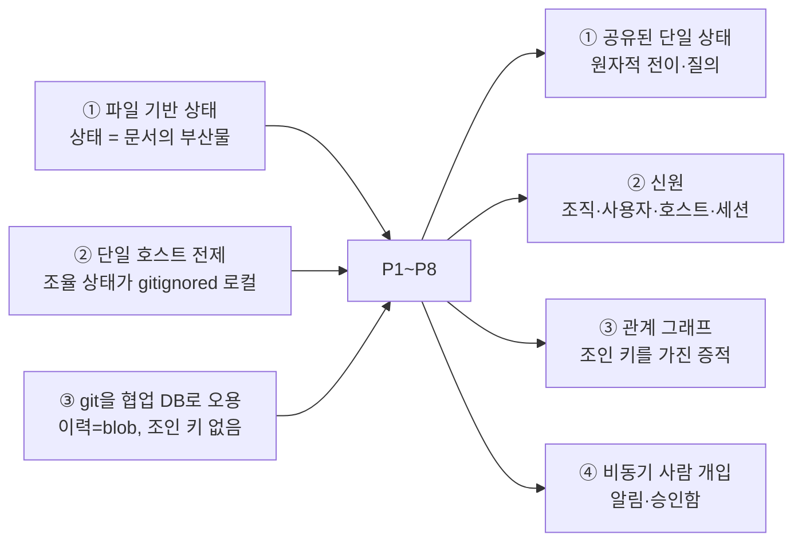
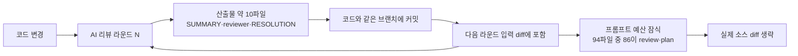

# 문제 정의와 요구사항

> **요약** — 이 문서는 1인용 Claude Code 하네스 `clemvion`을 여러 세션·여러 사람으로 확장할 때 반복해서 무너지는 지점 여덟 가지(P1~P8)를 **증상 → 실측/사례 근거 → 근본 원인** 3단으로 정리한다. 근거는 추정이 아니라 실측이다: 리뷰 산출물 markdown 13,777개(131MB)가 git packed blob 바이트의 60%를 차지하고, 산문으로만 강제되던 리뷰 의무는 575개 세션 중 160건(28%)에서 이미 무너져 있었으며, 스펙 동시수정 자동 검출은 "다른 머신·세션이면 로컬에 보이지 않는다"는 이유로 저장소 스스로 제거했다. 여덟 문제는 증상이 다르지만 원인은 하나로 수렴한다 — **파일과 git을 협업 데이터베이스로 쓴 대가**이며, 7,600줄에 이르는 하네스 훅 코드가 그 청구서다. 문서 후반은 이 문제들을 해소하기 위한 기능 요구사항 FR-01~FR-17과 비기능 요구사항 NFR-01~NFR-05를 각각 한 줄 수용 기준과 함께 정의한다.
>
> 문서 버전 v0.1 · 2026-08-13 · HTML 판: [pain-points.html](../html/pain-points.html)

---

## 1. 문제 지형 한눈에 보기

NERV(가칭)의 출발점은 `/Volumes/project/private/clemvion`이다. 1인 개발자가 Claude Code 하네스로 SDD(스펙 주도 개발)와 TDD를 자동화한 제품 모노레포이고, 완성도 자체는 매우 높다. 역할별 스킬 5+1종, 훅 9종, 워크플로 3종, 31개 서브에이전트가 "리뷰 없이 push 금지", "main 브랜치에서 작업 금지" 같은 규칙을 기계적으로 강제한다. 이 하네스의 철학은 한 문장으로 요약된다 — **강제 없는 규약은 반드시 깨진다**.

문제는 이 하네스가 **한 사람, 한 대의 컴퓨터**를 전제로 만들어졌다는 점이다. 여러 직군(기획자·디자이너·개발자·QA)이 여러 호스트에서 여러 에이전트 세션을 동시에 돌리는 순간, 잘 만들어진 규칙일수록 더 정확하게 한계를 드러낸다. 아래 여덟 가지가 그 한계다.

| # | 문제 | 한 줄 증상 | 대표 실측 근거 | 대응 요구사항 |
| --- | --- | --- | --- | --- |
| P1 | 세션 간 스펙 충돌 | 같은 스펙 영역을 두 세션이 다르게 고쳐도 통합 시점까지 아무도 모름 | "자동 검출은 없다" — 검출 기능이 #576에서 **의도적으로 제거**됨 | FR-01·02·04·06·07 |
| P2 | 중복 작업 | 이미 누가 하고 있는 일을 다른 세션이 다시 시작 | 백로그 인덱스 문서가 "미관리 stale"로 삭제(#426), 우선순위 선언 15/34 | FR-05·06·07·08 |
| P3 | 스펙 버전 관리 부재 | 문서에 초안/검토중/승인 상태가 없어 "합의된 것인지" 알 수 없음 | `status` 5값은 전부 **구현 축**, 1,750줄 문서에 상태 값 하나 | FR-02·03·04·11·16 |
| P4 | 구현 상태·다음 할 일 추적 곤란 | "이 스펙 어디까지 됐나", "지금 뭘 하면 되나"에 즉답 불가 | 수동 ✅ 마크가 한 영역 131개 vs 다른 영역 0개 | FR-03·05·10·13 |
| P5 | 리뷰 출처(provenance) 추적 곤란 | 발견사항이 어느 커밋·어느 스펙에서 왔는지 구조화된 답이 없음 | 리뷰 `meta.json`에 **커밋 SHA 필드 자체가 없음**, 표본 200개 중 47개만 산문에 해시 | FR-09·10·13·16 |
| P6 | 문서·리뷰 누적으로 git 비대화 | 리뷰 산출물이 저장소를 채우고 다음 리뷰의 입력이 됨 | review 이력 blob 60.7MB = packed blob 바이트의 **60%** | FR-09·17 / NFR-01 |
| P7 | 비개발자 직군 참여 불가 | 승인·코멘트를 하려면 터미널과 git이 필요함 | 사람 개입 채널이 **그 터미널의 그 세션** 안(AskUserQuestion·confirm)뿐 | FR-11·12·14 / NFR-02 |
| P8 | 멀티 프로젝트 × 멀티 유저(n:n) 부재 | 사용자·조직·프로젝트 개념 자체가 없고 규칙이 호스트 경계에서 끝남 | 조율 상태 전량이 gitignored 로컬 파일, 게이트 범위 = `git worktree list` | FR-07·14·15·16 / NFR-03·04·05 |

### 1.1 근거의 세 가지 출처

이 문서의 모든 주장은 아래 셋 중 하나에 묶인다. 근거 없는 수사는 쓰지 않는다.

1. **clemvion 실측** — 저장소를 읽기 전용으로 조사해 얻은 파일 수·용량·커밋 통계, 그리고 하네스 문서가 **스스로 명시한 한계 문장**. 표기는 `clemvion:경로` + 수치.
2. **SDD 도구 생태계의 1차 출처** — Spec Kit·OpenSpec 등의 공식 문서와 이슈/디스커션. 이들이 같은 문제를 공개적으로 미해결로 남겨 두었다는 사실은, clemvion의 한계가 개별 저장소의 실수가 아니라 **파일 기반 접근의 구조적 귀결**임을 뒷받침한다.
3. **업계 계측 데이터** — 병렬 에이전트 운용의 리뷰 병목을 수치로 잰 필드 리포트. 문제의 크기를 가늠하는 데 쓴다.

### 1.2 이 문서가 정하는 것과 정하지 않는 것

- **정한다**: 문제 목록(P1~P8), 근본 원인 진단, 요구사항 번호 체계(FR-01~FR-17, NFR-01~NFR-05)와 각각의 수용 기준, non-goals.
- **정하지 않는다**: 해결 방식의 설계. 데이터 모델은 [데이터 모델](../03-proposal/data-model.md), 시스템 구성은 [시스템 아키텍처](../03-proposal/architecture.md), 워크플로는 [스펙 워크플로우와 거버넌스](../03-proposal/spec-workflow.md), 단계별 계획은 [로드맵](../03-proposal/roadmap.md)이 다룬다.
- 현행 하네스의 구성 요소 전수 분석은 [clemvion 하네스 분석](clemvion-analysis.md)에 있다. 이 문서는 그 분석에서 **문제만** 뽑아 요구사항으로 번역한 것이다.

---

## 2. 문제 P1~P8

### 2.1 P1 — 세션 간 스펙 충돌

**증상.** 두 세션(또는 두 사람)이 같은 스펙 영역을 동시에, 서로 다른 방향으로 고친다. 파일이 물리적으로 겹치면 git 병합 충돌로 드러나지만, 진짜 문제는 **논리 충돌**이다. 한쪽은 이벤트 계약에 필드를 추가하고 다른 쪽은 같은 계약을 축소하는 식으로, 두 스펙이 각각 자기 안에서는 완결적인데 합치면 모순이다. 착수 시점에 "이 영역 지금 누가 건드리고 있나?"를 물어볼 대상이 없다.

**실측/사례 근거.**

- `clemvion:.claude/docs/worktree-policy.md` §3은 이 문제를 사람에게 위임한다고 명문화한다: 동일 `spec/` 파일·코드 영역을 두 worktree가 동시 수정 중이면 plan에 명시하고 직렬화하라, **자동 검출은 없다**. 사전 예방은 사용자와 통합 단계(`/merge-coordinate`)의 책임이다.
- 검출 기능이 없는 게 아니라 **있다가 제거됐다**. `plan_coherence` checker의 worktree 경합 검출은 커밋 `3da85dc3b`(#576)에서 삭제됐고, 사유는 기술적 한계의 정직한 진술이다 — 병렬 작업이 다른 머신·세션에서 진행되면 로컬에 반영되지 않아 신뢰할 수 없고, 불필요한 조회로 토큰만 소모한다.
- 중복 서술이 실제로 모순을 낳은 기록: `9a4d3e32b`(2026-08-13) "종결 이벤트 계약을 EIA §6 도입부 하나로 — **네 문서가 각자 필드를 열거하고 있었다**", `c37a3732c` "**모방한 쪽이 맞고 원본이 틀렸다** — fixed window를 '슬라이딩'이라 부름". 4.5개월간 `spec/` 터치 커밋 857개 중 `docs(spec)` 커밋이 211개이고, 그중 상당수가 이런 사후 정합화다.
- 같은 문제가 생태계 최대 SDD 도구에서도 미해결이다. Spec Kit 팀 도입 디스커션은 "두 기능이 같은 파일을 건드릴 때 두 스펙 계약이 동시에 유효한지 검증할 방법이 없다"고 보고하고, OpenSpec 공식 팀 워크플로 문서는 충돌 방지책이 **"One change, one owner"라는 사람 규약과 일반 git 병합뿐**임을 자인한다.

**근본 원인.** 조정(coordination)에는 *모든 참가자가 동시에 보는 하나의 상태*가 필요하다. 그런데 clemvion에서 "누가 어떤 영역을 언제부터 잡고 있는가"라는 정보는 ① 각 머신의 gitignored 로컬 파일(`.claude/state/**`)과 ② 아직 push되지 않은 브랜치에만 존재한다. 공유 지점이 원리적으로 없으므로, 검출을 시도하면 오탐만 늘어난다. **검출을 포기한 것은 잘못된 판단이 아니라 주어진 아키텍처에서의 합리적 결론**이었다. 바꿔야 하는 것은 판단이 아니라 아키텍처다.

> **D-04 — 동시성 제어는 원자적 클레임+리스(lease).** 클레임 시 scope(spec_ids, file_globs)를 선언하고 서버가 겹침을 감지한다. 서버는 모든 세션의 선언을 보므로, 로컬 한계 때문에 제거된 기능을 복원할 수 있다.

### 2.2 P2 — 중복 작업

**증상.** 이미 진행 중인 일을 다른 세션이 처음부터 다시 시작한다. "다음에 무엇을 할지"가 질의 가능한 큐가 아니라 사람의 기억과 문서 인덱스에 있고, 착수 선언은 문서 편집(plan frontmatter의 `worktree:` 값 하나)이라 원자적이지도, 만료되지도, 다른 세션에 보이지도 않는다.

**실측/사례 근거.**

- **백로그 인덱스 문서는 부패했다.** 백로그 조망용 문서 `plan/in-progress/0-unimplemented-overview.md`는 커밋 `65f3e526b`(#426, 2026-06-03)에서 "미관리 stale 문서"로 삭제됐다. 그런데 `clemvion:plan/in-progress/marketplace-and-plugin-sdk.md`는 지금도 삭제된 그 인덱스를 "상위 인덱스"로 참조한다 — 인라인 코드 표기라 상대링크 무결성 가드에도 잡히지 않는 dangling 참조다. 수동 인덱스는 유지비를 감당하지 못하고 죽었고, 이후 백로그 조망은 사람의 머리와 감사 스크립트 출력에 의존한다.
- **우선순위·담당이 데이터가 아니다.** in-progress plan 34건 중 13건이 `(unstarted)` sentinel이고, `priority:` 선언은 15/34(P1 3·P2 5·P3 6·기타 1)뿐이다. 나머지는 본문 산문에 P0~P3 라벨이 흩어져 있다. 전역 정렬·기한·배정이라는 개념이 없다.
- **소유자가 신원이 아니다.** `owner:` 값 실측 분포는 `developer` 17 / `project-planner` 8 / `planner` 5 / `developer (TBD)` 2 / `사용자 본인 / planner` 1 / `developer (다음 진입자)` 1이다. 동일 역할의 표기 요동과 "다음 진입자" 같은 무주공산 표기가 공존한다.
- **클레임 표현이 스칼라 하나다.** `clemvion:plan/in-progress/retry-turn-terminal-guard.md`의 frontmatter 주석은 이 한계를 직접 기록한다 — 최초 worktree가 이미 머지됐는데 그 값을 남겨 두면, 이후 push 시 가드가 "연결된 plan 없음(ad-hoc)"으로 오판해 **게이트가 무장 해제된다**. 재착수·다중 worktree를 표현할 수 없는 필드가 게이트의 판정 키로 쓰이고 있다.
- 파일 기반 도구 공통 증상이다. Spec Kit 동시 개발 디스커션은 두 엔지니어가 동시에 다음 스펙을 만들면 둘 다 같은 순번(`0004`)을 잡아 병합 충돌이 필연이라고 보고한다. 타임스탬프 네이밍 옵션이 추가됐지만 그것은 완화일 뿐 조정이 아니다.

**근본 원인.** **선점이 원자적 연산이 아니라 문서 편집이기 때문**이다. 클레임이 클레임이려면 세 가지가 필요하다 — 원자성(동시 요청 중 하나만 성공), 가시성(모든 참가자가 즉시 조회), 만료(죽은 세션의 점유가 자동 해제). 파일 편집은 셋 다 제공하지 않는다. 여기에 ID 발급이 로컬 규칙(순번·경로 이름)이면 충돌은 확률이 아니라 시간 문제다.

### 2.3 P3 — 스펙 버전 관리 부재

**증상.** 스펙 문서에 **초안 / 검토중 / 승인** 이라는 상태가 없다. 어떤 문서를 열었을 때 그것이 팀이 합의한 결과인지, 누군가 지금 고치는 중인 초안인지 문서만 보고는 알 수 없다. 승인 이력은 git 커밋과 PR 대화에 묻히고, 특정 시점의 스펙 전체 상태를 재구성하려면 git 고고학이 필요하다.

**실측/사례 근거.**

- `clemvion:spec/conventions/spec-impl-evidence.md`가 정의하는 frontmatter `status` 5값(`backlog` → `spec-only`(TTL 90일) → `partial` → `implemented`, `archived`)은 **전부 구현 진행 축**이다. 문서 자체의 초안→검토→승인 축은 존재하지 않는다. 초안은 `plan/in-progress/spec-draft-<name>.md`로 임시 존재하다 스펙 반영과 함께 사라진다.
- 사람 승인 단계 자체가 없다. 대신 `project-planner`가 `spec/` 쓰기 직전 `/consistency-check --spec`(LLM checker 5종 병렬)을 의무 수행하고, 이후에는 빌드 가드가 지킨다. 즉 **검증은 있으나 결재는 없다** — 승인자·승인 시각·승인 대상 버전이라는 레코드가 남지 않는다.
- 상태의 해상도가 문서 단위라 사각이 생긴다. 최대 문서는 1,750줄(`clemvion:spec/5-system/4-execution-engine.md`, `clemvion:spec/2-navigation/4-integration.md`)인데 여기에도 `status` 값은 하나다. 그 결과 커밋 `2a698f360`이 기록한 사고가 발생했다 — spec이 `필수`로 약속한 update dedup이 통째로 미구현이었다(요구사항 ID `CCH-SE-02`). 증적 가드는 `code:` 글로브가 하나라도 매치되면 통과시키므로 요구사항 단위 누락을 볼 수 없다.
- 버전 개념이 없으니 이력이 본문 밖으로 밀려난다. `clemvion:spec/0-overview.md`의 원칙은 "본문은 latest-only 사실을 기술"이고, 계획 워크플로도 "옛 내용을 정리해 latest만 남김(history가 아님)"이다. 이력 전담은 git이 맡는데, git은 파일 이력은 알아도 **"이 버전이 승인되었는가"**는 모른다.
- 문서 수준에서 이 문제를 가장 멀리 밀어붙인 것이 OpenSpec의 델타 모델(`ADDED`/`MODIFIED`/`REMOVED` 접두사로 변경을 표현하고 완료 시 현재 스펙에 병합)이지만, 그조차 상태는 여전히 **폴더 위치**(changes vs archive)와 체크박스로 표현된다.

**근본 원인.** "승인"은 파일 내용이 아니라 **결정 레코드**다. 누가, 언제, 어떤 스냅샷을 대상으로, 어떤 사유로 승인했는가 — 이 다섯 필드를 담을 자리가 파일시스템에 없으니 커밋 메시지와 PR 대화로 흩어진다. 여기에 상태 축이 하나(구현)뿐이라 "문서가 합의됐는가"와 "코드가 따라왔는가"가 한 값에 뭉개진다.

> **D-02 — 스펙 상태는 2축으로 분리한다.** ① 문서 리뷰 축: SpecVersion `draft → in_review → approved → superseded / deprecated` ② 구현 축: Requirement 단위 `unimplemented → in_progress → implemented → verified`. clemvion은 구현 축(문서 단위)만 있어 승인 이력이 git PR에 묻혔고, 1,750줄 문서에 상태 값 하나라 요구사항 누락(CCH-SE-02)을 놓쳤다.

### 2.4 P4 — 구현 상태·다음 할 일 추적 곤란

**증상.** 두 가지 흔한 질문에 즉답할 수 없다. **"이 스펙은 어디까지 구현됐나?"**와 **"지금 무엇을 하면 되나?"**. 상태가 문서 본문 체크박스, 수동 ✅ 마크, 폴더 위치(`in-progress/` vs `complete/`), frontmatter 필드에 흩어져 있어 집계 질의가 불가능하다.

**실측/사례 근거.**

- **수동 표기는 유지에 실패했다.** 요구사항 표의 구현 상태 컬럼은 `clemvion:spec/2-navigation/_product-overview.md`에 ✅ 마크 131개가 있는 반면 `clemvion:spec/3-workflow-editor/_product-overview.md`와 `clemvion:spec/7-channel-web-chat/_product-overview.md`에는 **컬럼 자체가 없다**. 같은 저장소 안에서 영역별 관행이 갈라졌다는 것은 규약이 아니라 유지비의 문제다.
- 최상위 구현 현황표(`clemvion:spec/0-overview.md` §6의 완료/부분/로드맵 3분류)도 전량 수동이며 가드가 없다.
- 자동 도구는 **보고만 하고 차단하지 않는다.** `plan-stale-audit.sh`는 30일 stale·죽은 worktree 참조를 표로 출력하되 실패시키지 않고("사용자가 수동 grooming"), `/spec-coverage`는 스펙 약속 대비 구현 갭을 NLP 휴리스틱으로 탐지해 보고만 한다. 결정은 항상 사람에게 남는다.
- 착수 대기 풀은 존재하지만 큐가 아니다(P2 근거 참조: 34건 중 13건 미착수, 우선순위 선언 15/34).
- **시장의 상한선도 같다.** Kiro는 태스크 의존성 그래프로 독립 태스크를 wave 단위 병렬 실행하는 가장 발전된 형태를 갖췄지만 전부 개인 IDE 안의 로컬 뷰다. spec-workflow-mcp의 진행 바, BMAD의 `sprint-status.yaml`도 마찬가지로 단일 머신이다. Spec Kit은 아예 태스크를 GitHub Issues로 내보내는 명령을 공식 제공하는데, **외부 트래커로 탈출하는 통로가 공식화됐다는 사실 자체가 파일 기반 추적의 한계 방증**이다.
- 반대 방향의 증언도 있다. Kiro 실사용 후기는 SDD의 이득으로 "작업 분해가 기계적이 되고 진행이 가시화되어 반쯤 된 작업이 드러난다"를 꼽는다 — 추적이 성립할 때만 얻는 이득이라는 뜻이다.

**근본 원인.** **상태를 문서 본문에 적으면 상태는 문서의 부산물이 된다.** 갱신 의무가 사람에게 남고, 집계는 파싱이 되며, 해상도는 문서 단위에 갇힌다. 추적 단위는 문서가 아니라 요구사항과 작업이어야 하고, "어디까지 됐는가"는 사람이 적은 마크가 아니라 **관계에서 계산된 값**이어야 한다.

> **D-03 — 구현 추적의 단위는 Task와 Requirement.** "무엇이 구현됐나"는 Requirement ↔ Task ↔ PR/커밋 ↔ ReviewSession 관계 그래프로 계산한다. 문서 안 체크박스·수동 ✅가 아니라 DB 관계로.

### 2.5 P5 — 리뷰 출처(provenance) 추적 곤란

**증상.** 리뷰가 남긴 발견사항에 대해 "이건 어느 커밋을 보고 지적한 건가", "같은 지적이 몇 번째 라운드인가", "왜 지난번엔 유예했나"를 물으면 구조화된 답이 없다. 답이 있더라도 산문 속에 있어 사람이 읽어야 하고, 그 산문 규약은 실측상 이미 깨져 있다.

**실측/사례 근거.**

- **리뷰가 무엇을 봤는지 기록되지 않는다.** 코드 리뷰 세션의 `meta.json`에는 커밋 SHA·diff base·브랜치 필드가 **없다**(예: `clemvion:review/code/2026/08/13/19_08_48/meta.json` — `timestamp`/`files`/`agents`/`route_mode`/`agents_explicit`/`agents_forced`뿐). 커밋 해시는 `SUMMARY.md` 본문 산문에만 등장하며, 표본 200개 SUMMARY 중 해시를 언급한 것은 **47개**다. 세션→PR 링크는 아예 없다(PR 번호는 머지 커밋 제목에만 존재).
- **라운드와 동일성 축이 없다.** 한 changeset의 다회 리뷰는 서로를 산문으로 인용할 뿐("이전 라운드(`18_38_10`) 이후…")이고, 라운드를 넘는 같은 발견은 매번 새 표 행으로 재서술된다 — 실제로 하나의 유예 항목이 `14_01_46`/`17_15_21`/`18_19_33` 세 세션에서 반복 재확인됐다. dedup 키가 없다.
- **유예 결정의 기억이 산문으로만 존재한다.** RESOLUTION 문서는 INFO 항목 처분을 "이전 라운드가 이미 지적하고 의식적으로 유예한 항목의 재확인 — 그대로 유지"처럼 문장으로 남긴다. "새 근거 없이 재상정하지 않는다"는 규칙이 데이터가 아니라 문장이므로, 다음 라운드의 리뷰어가 그 문장을 읽지 못하면 규칙은 없는 것과 같다.
- **산문 계약은 실제로 무너졌고, 그 비율이 측정됐다.** 2026-07-17 전수 조사 결과 커밋된 575개 세션 중 **160건(28%)이 강제 리뷰어 미충족**이었고, 그중 107건은 RESOLUTION 문서를 갖고 게이트를 통과 중이었다. 별개로 `review_guard.py`는 종합 판정이 `BLOCK: NO`인데 개별 checker 리포트에는 `[CRITICAL]`이 있는 모순을 **732개 세션 중 24건(3.3%)** 실측했다. 2026-08-10 이전에는 배치 분할 버그로 강제 리뷰어 수가 7명에서 2명으로 줄어 계산돼 **거짓 PASS**가 나기도 했다.
- **판정의 시계마저 우회 공학이다.** 게이트는 "최신 코드 변경보다 나중에 만들어진, 해소된 리뷰가 있는가"를 판정하는데, 그 시각의 근거가 **세션 디렉토리 경로에 인코딩된 타임스탬프**(`review/code/<Y>/<m>/<d>/<H>_<M>_<S>`)다. checkout이 mtime을, rebase가 committer date를 오염시키기 때문에 "checkout·rebase 면역" 시계를 따로 만들어야 했다.

**근본 원인.** **관계를 문자열과 경로 관습으로 표현했기 때문**이다. 커밋 SHA 같은 조인 키가 스키마에 없으면 출처는 산문으로 밀려나고, 산문 규약은 기계가 강제하지 않는 한 반드시 깨진다 — 28%와 3.3%가 그 붕괴율의 실측치다. 역설적이게도 clemvion은 구조화가 필요한 곳을 정확히 알고 있었다. fix 커밋 메시지에 `SUMMARY#<n>` 인용을 강제하고 `_resolution_state.json`에 `commits_made: [{sha, summary_id, scope}]`를 남기는 부분만은 이미 관계형이다. 그 방식이 통했다는 것이, 나머지도 그래야 한다는 근거다.

> **D-07 — AI 리뷰는 플랫폼 엔티티다.** ReviewSession(입력 커밋 스냅샷 필수) → ReviewerReport → Finding(fingerprint로 라운드 간 dedup) → Resolution(fixed/deferred/escalated, 커밋 FK). 게이트 판정("이 커밋 범위를 커버하는 해소된 리뷰가 있는가")은 서버 SQL로 — 1,005줄 정규식 push 훅과 rewrite-immune 시계가 전부 불필요해진다.

### 2.6 P6 — 문서·리뷰 누적으로 git 비대화

**증상.** AI 리뷰 산출물이 코드와 같은 브랜치에 커밋되어 저장소를 채운다. 더 나쁜 것은 그 산출물이 **다음 라운드 리뷰의 입력 diff에 그대로 들어간다**는 점이다. 리뷰가 리뷰를 리뷰하는 자기증식 루프가 돌면서 정작 검토해야 할 소스 변경이 컨텍스트 예산에서 밀려난다.

**실측/사례 근거.**

| 항목 | 실측치 |
| --- | --- |
| `review/` 총량 | markdown **13,777개 / 131MB** (code 9,070 · consistency 4,697 · spec-coverage 10), 전부 git 추적 |
| 리뷰 세션 수 | **1,891개 / 73일**(2026-06-02~08-13) ≈ **일평균 26개** |
| git 점유 | review 이력 blob **23,533개 / 60.7MB packed** = 전체 packed blob 바이트의 **60%**, `.git` 148MB의 약 41% |
| 커밋 오염도 | 전체 커밋 2,464개 중 **937개(38%)**가 `review/` 접촉 |
| 증가 추세 | 현 페이스 유지 시 **월 ~7,000파일 / ~50MB** 추가. 세션당 용량도 59KB → 62KB → 81KB로 증가 중 |
| 워킹트리 위상 | `codebase/` 724MB 다음 **2위** — `spec/` 9.3MB·`plan/` 5.2MB의 10~25배 |

- **자기증식 루프 실측.** 하나의 changeset(#1167)이 코드 리뷰 5회 + 일관성 검토 3회 = **8라운드**를 돌았고, 마지막 라운드 리뷰어의 입력 프롬프트는 **94개 파일 중 86개가 이전 `review/`·`plan/` 산출물**이었다. 해당 리뷰 리포트는 "프롬프트 예산 초과로 여러 diff와 전체 파일 컨텍스트가 생략됐으므로 워크트리에서 직접 검증했다"고 기록한다 — 리뷰 산출물이 리뷰 품질을 잠식한 것이다.
- **대응 역사가 곧 구조적 한계의 증거다.** ① 2026-05-17 `fc16810cf`/`541228a87`: 재생성 가능한 프롬프트 페이로드(`_prompts/`, review 전체의 ~70%)를 gitignore + untrack. ② 2026-05-30 `f7c56bf0a`: 과거 세션 대량 삭제 + `review/` 전체 미추적 시도. ③ 2026-06-01 `770fbdc3d`: **이틀 만에 롤백** — 게이트와 plan 인용이 커밋된 산출물에 의존하기 때문이다. 즉 "결론만 남기고 입력은 버린다"는 절충은 이미 실행됐고, **결론만으로도 60MB/60%**가 된 것이 현재 상태다. 게다가 삭제분 blob은 `.git` 이력에 영구 잔존한다.
- 링크 방향도 한쪽으로 쏠려 있다. plan 문서 450개 중 197개가 리뷰 세션 경로를 인용하는 반면, 스펙 쪽에서 리뷰를 참조하는 파일은 2개뿐이다.
- 이것은 clemvion 고유 증상이 아니다. 조사한 파일 기반 SDD 도구 전반에서 archive·specs·문서 체인이 git에 무한 누적되는 구조가 공통으로 관찰된다.

**근본 원인.** **append-only 이력을 blob으로 저장했기 때문**이다. 리뷰 이력은 본질적으로 "언제 무엇을 보고 무엇을 지적했는가"라는 시점 기록이고, 시점 기록은 질의(query)의 대상이지 diff의 대상이 아니다. 게다가 게이트가 커밋된 파일을 읽어야 판정할 수 있으니 gitignore로 도망칠 수도 없다(롤백이 그 증명이다). 저장 위치를 바꾸지 않는 한 이 문제는 완화만 가능하다.

> **D-01 — 스펙·리뷰 산출물은 git이 아니라 플랫폼 DB에 저장한다.** 코드는 지금처럼 git. git에는 read-only 미러/내보내기와 포인터(ID/URL)만 남긴다. 산출물이 DB로 가면 다음 리뷰의 diff에서 사라지므로 **자기증식 루프가 구조적으로 소멸한다**.

### 2.7 P7 — 비개발자 직군 참여 불가

**증상.** 기획자·디자이너·QA가 스펙을 검토하거나 승인하려면 git 저장소를 클론하고, 터미널을 열고, Claude Code 세션 안에 있어야 한다. 승인 요청은 요청자의 터미널 밖으로 나가지 못하고, 승인자는 응답할 자리가 없다. 결과적으로 모든 판단이 한 사람에게 수렴한다.

**실측/사례 근거.**

- **사람 개입 채널이 세션 내부에만 있다.** 승인·거절·코멘트는 전부 "그 터미널의 그 세션" 안에서만 가능하고(`AskUserQuestion`·confirm), 알림도 하네스 내부 task-notification뿐이다. hostname 단위로 "누가 무엇을 돌리는가"는 어디에도 기록되지 않는다.
- **승인 지점은 이미 명확히 식별돼 있다.** 통합 조율의 2중 사용자 confirm, e2e 면제 승인, `BLOCK` 해소 결정, stale plan grooming, 커버리지 갭 picking — 모두 정식 절차인데 **종착지가 전부 단일 "사용자"**다. 역할별 승인자 분리(기획 승인 vs 코드 승인)라는 개념이 없다.
- **역할은 있으나 신원은 없다.** 역할 분리는 경로별 쓰기 권한으로 잘 구현돼 있다(기획자=`project-planner`가 `spec/**`·`plan/**`, 개발자=`developer`가 `codebase/**`, `spec/`는 read-only). 그러나 이것은 스킬 프롬프트 규약이고, `owner`는 자유 텍스트 역할 라벨이라 실제 계정·배정·hostname 개념이 없다(P2 근거의 owner 분포 참조).
- **검토 결과를 제3자가 볼 수 없다.** 리뷰 산출물이 gitignored였던 기간에는 PR에 리뷰 흔적이 없어 "plan 노트가 PR에서 워크플로 이행을 확인할 유일한 흔적"이었다. 개발자가 아닌 사람이 "이 변경이 제대로 검토됐는가"를 확인할 표면이 없다는 뜻이다.
- **시장에서 요구됐고 거부됐다.** OpenSpec 이슈 #435는 "스펙 작성은 본질적으로 협업인데 현재 도구들은 single-player이거나 일반 git 충돌에 의존한다"며 멀티유저 워크스페이스(RBAC·실시간 편집), 문서식 인라인 코멘트, 멀티 에이전트 병렬 리뷰를 요청했으나 **"closed as not planned"로 종료**됐다. 승인 워크플로를 내장한 유일한 도구는 spec-workflow-mcp(GPL-3.0)인데, 사용자 계정·권한·원격 접근이 없는 로컬 도구라 "팀 협업"이 아니라 "1인+에이전트 협업"이다.
- 반면 수요는 실재한다. Anthropic 사내 10개 팀 인터뷰에서는 법무·마케팅·데이터 등 비개발 직군의 Claude Code 활용이 보고된다.

**근본 원인.** **참여 표면이 개발 도구에 묶여 있으면 참여 자격이 개발 숙련도로 결정된다.** 더 근본적으로, 승인은 비동기 커뮤니케이션 문제인데 동기 CLI 대화로 구현돼 있다. 승인자가 그 터미널 앞에 그 순간 있어야 한다는 제약은, 팀이 커질수록 곧바로 병목이 된다.

### 2.8 P8 — 멀티 프로젝트 × 멀티 유저(n:n) 구조 부재

**증상.** 조직·프로젝트·사용자라는 개념 자체가 없다. 규칙의 강제력이 호스트 경계에서 끝나고, 다른 호스트의 세션은 관측 대상도 조정 대상도 아니다. 한 사람이 여러 프로젝트를, 한 프로젝트를 여러 사람이 다루는 구조를 표현할 자리가 없다.

**실측/사례 근거.**

- **조율 상태 전량이 비공유 로컬 파일이다.** `.claude/state/**`(세션별 경고 dedup, Stop 넛지 마커, resolution 진행 마커, fail-open 연속 카운터, reaper throttle)와 `.claude/worktrees/**`는 gitignored다. 키가 `session_id`·`tool_use_id`·브랜치 이름이므로 **다른 머신은 이 키 공간을 볼 수도 공유할 수도 없다**.
- **게이트 범위가 이 머신의 checkout 목록이다.** push 가드는 `git worktree list` 결과를 스코프로 삼는다. 다른 호스트에서의 push는 애초에 이 훅 밖이고, 훅이 설치되지 않은 클론에서 push하면 규칙 전체가 무효다.
- **세션 프레즌스가 없어서 서로를 죽인다.** 머지된 PR의 worktree를 정리하는 reaper는 자기 세션의 앵커만 알 수 있다. `clemvion:.claude/docs/worktree-policy.md` §7은 한계를 명시한다 — 동시에 열린 다른 세션이 앵커로 쓰는 worktree의 PR이 머지되면 **그 세션은 여전히 죽는다**("살아있는 세션 앵커 레지스트리가 필요해 과하다고 판단"). 그 레지스트리가 곧 NERV의 세션 프레즌스 기능이다.
- **이벤트 소스가 없어 폴링한다.** 머지는 대부분 웹에서 일어나 로컬이 관측할 수 없으므로, 세션 시작마다 `gh pr list` 배치 조회로 수렴한다(6시간 throttle). 이벤트 수신자(서버) 부재의 전형적 증상이다.
- **동시성 제어 부재를 코드 주석이 자인한다.** 재시도 상태 파일은 원자적 교체로 찢어진 읽기만 막고 "동시 writer 간 lost update는 남는다"고 적혀 있으며, 실제로 겹친 두 갱신에서 앞선 전이가 사라진 사고가 2026-08-07에 기록됐다. fail-open 카운터의 read-increment-write도 잠기지 않아 "겹친 두 실행이 증분 하나를 잃고 격상을 한 번 늦출 수 있다". 세션 시작 시 의존성 설치의 락은 TOCTOU 문제로 **제거**됐다. 전부 "1인·저빈도·로컬" 전제에서 수용한 잔여 리스크인데, n개 세션에서는 상시 발생 조건이 된다.
- **가시성은 터미널 한 줄이다.** statusline이 모델·컨텍스트·비용·브랜치·진행 중 plan 수를 렌더링하지만 자기 세션만 보여준다.
- 도구 생태계 전반에서도 같은 공백이 확인된다 — 누구(hostname)의 어떤 세션이 어떤 스펙을 잡고 있는지 표시하는 도구는 하나도 없고, 사용자 개념 자체가 git committer뿐이다. 한편 병렬 운용 실전기는 **동시 3~5 에이전트가 사람 리뷰 용량의 실용 한계**라고 보고하는데, 그 한도를 정책으로 강제할 주체 역시 부재한다.

**근본 원인.** **단일 호스트 전제**다. 신원(조직·사용자·호스트·세션)이 1급 개념이 아니면 n:n 관계는 표현할 수 없고, 신원이 없으면 권한·한도·알림·감사 어느 것도 성립하지 않는다. clemvion의 하네스는 이 전제 위에서 최선을 다한 결과물이며, 그래서 한계가 선명하다.

---

## 3. 근본 원인 종합 — "git + 파일시스템을 협업 DB로 쓴 대가"

### 3.1 세 가지 잘못된 전제

여덟 문제는 증상이 다를 뿐 세 개의 전제에서 파생된다.

| 전제 | 무엇을 가정했나 | 어디서 깨지나 | 직결 문제 |
| --- | --- | --- | --- |
| ① 파일 기반 상태 | 상태를 문서에 적으면 사람도 기계도 읽을 수 있다 | 갱신이 사람 의무가 되고, 집계는 파싱이 되며, 해상도가 문서 단위에 갇힌다 | P2·P3·P4 |
| ② 단일 호스트 전제 | 조율에 필요한 정보는 이 컴퓨터 안에 다 있다 | 다른 머신의 세션·브랜치·클레임이 보이지 않아 검출 자체를 포기하게 된다 | P1·P8 |
| ③ git을 협업 DB로 오용 | 버전 관리 도구가 이력 저장소 역할까지 해 준다 | append-only 이력이 blob으로 쌓이고, 관계는 경로 문자열 관습이 되며, 승인이라는 결정 레코드는 자리가 없다 | P3·P5·P6 |
| (파생) 참여 표면 = 개발 도구 | 참여자는 모두 git과 터미널을 쓴다 | 직군 확장과 동시에 승인 병목이 된다 | P7 |

### 3.2 대가의 청구서 — 7,600줄이 증명하는 것

이 전제들을 유지하면서 규칙을 강제하려면 정교한 우회 공학이 필요하다. clemvion은 그것을 실제로 해냈고, 그 규모가 곧 청구서다.

- **하네스 훅 코드 약 7,600줄**(훅 + 판정 모듈 + 워크플로 합계). 최대 단일 훅은 push 게이트 **1,005줄**이고, 훅 회귀 테스트만 57개 파일 1.2MB다.
- 그 1,005줄 중 상당 부분이 **"이 Bash 명령이 push인가"를 판정하는 텍스트 파싱**이다. 정식 셸 파서로 재작성했다가 "리뷰 라운드마다 새로운 false-negative 부류가 발견돼" 되돌렸고, 정규식 ReDoS 회귀는 주석에 실측치로 박제돼 있다(246바이트 명령에 6.4초, 특정 입력에서 30초 → 5밀리초로 수정).
- **freshness 판정을 위한 "checkout·rebase 면역 시계"** — 경로 타임스탬프와 author date를 조합한 자체 시계(P5 참조).
- **fail-open + 연속 카운터 + 격상** — 게이트가 깨져도 작업은 계속하되 배너를 띄우고, 3회 연속 실패 시 "이 게이트는 사실상 꺼져 있습니다"로 격상.
- **디스크가 arbiter** — 서브에이전트의 자기보고(`STATUS=success`)를 믿지 않고 실제 파일 존재로 검증. "파일 없는 자기보고 성공은 이 계약이 제거하려는 가짜 성공"이라고 코드가 직접 적고 있다.

핵심은 이 공학이 **나쁜 코드가 아니라는 것**이다. 오히려 뛰어나다. 문제는 이 중 대부분이 **서버가 없어서 필요했던 것**이라는 점이다. 서버가 push/PR 이벤트를 직접 받고, 리뷰가 커밋 SHA와 함께 저장되며, 상태 전이가 트랜잭션이면 — 텍스트 파싱 게이트도, 자체 시계도, 파일 마커 dedup도 전부 사라진다.

동시에 **버릴 수 없는 교훈**도 이 공학에서 나온다. fail-open + 관측 + 격상, 자기보고 불신, 규칙의 사후 승격(prose → 기계 강제) 패턴은 서버 설계에도 그대로 유효하다. NERV는 clemvion을 부정하는 제품이 아니라, clemvion이 로컬에서 검증한 규칙을 **공유 가능한 곳으로 옮기는** 제품이다.

> **D-14 — 게이트는 fail-open + 관측 + 격상, 진실은 서버 산출물.** 판정 불가 시 진행을 허용하되 배너와 연속 카운터를 남기고, 임계 초과 시 격상한다(clemvion 검증 패턴). 에이전트 자기보고와 실제 산출물 업로드를 분리 검증 — "서버에 업로드된 산출물만 진실"이 clemvion "디스크가 arbiter" 원칙의 서버 번역이다.

### 3.3 자기증식 루프 — 대가가 복리로 늘어나는 구조

P6의 루프는 세 전제가 결합했을 때 비용이 선형이 아니라 복리로 증가한다는 것을 보여주는 대표 사례다.

한 changeset이 8라운드를 돌면 라운드마다 약 10개 파일이 쌓이고, 그 누적물이 다음 라운드 리뷰어의 컨텍스트를 잠식해 결국 소스 diff가 생략된다. 저장 위치를 옮기면 이 화살표 하나(`G → D`)가 끊기고 루프 전체가 소멸한다.

### 3.4 이것은 clemvion만의 문제가 아니다

같은 진단이 SDD 도구 생태계 전반에서 **공식 문서와 이슈로** 확인된다. 즉 NERV가 풀려는 문제는 한 저장소의 사정이 아니라 시장의 공백이다.

| 확인 지점 | 출처의 성격 | 요지 |
| --- | --- | --- |
| Spec Kit 팀 도입 디스커션(#497) | 커뮤니티 보고 | 번호 충돌, 두 스펙 계약의 동시 유효성 검증 불가, 마스터 계약 부재 — 공식 해법 없음 |
| Spec Kit 동시 개발 디스커션(#2116) | 커뮤니티 보고 | 두 사람이 동시에 같은 순번을 잡아 병합 충돌 필연. 타임스탬프 옵션은 완화일 뿐 |
| OpenSpec 팀 워크플로 문서 | 공식 문서 | 충돌 방지는 "One change, one owner" 규약과 일반 git 병합뿐임을 자인 |
| OpenSpec 이슈 #435 | 공식 결정 | 멀티유저 워크스페이스·RBAC·인라인 코멘트 요청이 "not planned"로 종료 |
| spec-workflow-mcp | 유일한 승인 워크플로 내장 | MCP 연동 + 웹 승인 대시보드 개념 증명. 단 계정·권한·원격 없음(GPL-3.0이라 개념만 참조) |

그리고 문제의 크기는 업계 계측이 말해 준다. AI 도입 상위 팀에서 **PR 리뷰 시간 중앙값 +441%, 무리뷰 머지 31%, 개발자당 버그 +54%**가 관측됐고(2.2만 명·4천 팀 계측), 다른 조사에서는 AI 생성 PR이 리뷰어 배정까지 4.6배 오래 기다린다고 보고한다. 한편 숙련 개발자 대상 RCT에서는 AI 도구 사용 시 실측 **19% 더 느렸으나** 본인들은 20% 빨랐다고 체감했다. 두 결과를 합치면 결론은 하나다 — **병목은 코드 생성이 아니라 검증·조정이며, 자기보고는 지표가 될 수 없다.**

### 3.5 서버가 가져야 할 네 가지 능력

세 전제를 뒤집으면 요구사항의 뼈대가 나온다.

1. **공유된 단일 상태** — 상태 전이가 원자적이고, 모든 참가자에게 즉시 보이며, 질의 가능해야 한다. (→ FR-01·02·05·06)
2. **신원** — 조직·사용자·호스트·에이전트 세션이 1급 개념이어야 권한·한도·감사·알림이 성립한다. (→ FR-07·14·16)
3. **관계 그래프** — 스펙·요구사항·작업·커밋·리뷰·발견사항이 조인 키로 연결돼야 출처와 커버리지가 계산된다. (→ FR-03·09·10·13)
4. **비동기 사람 개입** — 승인·질문·에스컬레이션이 요청자의 터미널 밖으로 나가 수신함에 도착하고, 응답이 세션으로 되돌아와야 한다. (→ FR-11·12)

---

## 4. 문제 → 요구사항 매핑

### 4.1 읽는 법 (중요)

- 아래 **FR-01~FR-17 / NFR-01~NFR-05 번호와 이름은 제안서 전체의 공통 참조**다. 다른 문서는 이 번호를 그대로 인용하며, **재정의하거나 번호를 바꾸지 않는다.**
- 각 항목의 **수용 기준(acceptance)** 은 "이것이 되면 요구사항이 충족됐다고 본다"를 한 줄로 적은 것이다. 구현 방식은 규정하지 않는다.
- 우선순위와 단계 배치는 이 문서의 소관이 아니다 — [로드맵](../03-proposal/roadmap.md)이 Phase 0~3으로 배치한다.
- 아래 표에 등장하는 **상태 어휘**는 용어 사전을 그대로 따른다(재정의 금지):

| 대상 | 상태 값 |
| --- | --- |
| SpecVersion (문서 축) | `draft → in_review → approved → superseded / deprecated` |
| Requirement (구현 축) | `unimplemented → in_progress → implemented → verified` |
| Task | `backlog → ready → claimed → in_progress → in_review → done` (+`blocked`) |
| AgentSession | `pending → active ↔ awaiting_input → complete / error / stale` |
| Finding | severity `critical / warning / info` (+`spec_drift` 태그) · 상태 `open → fixed / dismissed / wont_fix` |

### 4.2 기능 요구사항 (FR-01 ~ FR-17)

| 번호 | 요구사항 | 수용 기준 (acceptance) |
| --- | --- | --- |
| **FR-01** | 스펙 단일 진실 저장소(트리·타입·검색·안정 ID) | 프로젝트의 모든 스펙을 트리로 조회할 수 있고, 타입(`vision`/`area`/`feature`/`design`/`convention`/`adr`)과 안정 ID로 단건 조회·전문 검색이 되며, 문서를 옮기거나 이름을 바꿔도 ID 참조가 깨지지 않는다 |
| **FR-02** | 스펙 버전·문서 상태 관리(불변 스냅샷, draft→in_review→approved, 버전 diff) | `approved` 된 SpecVersion 본문은 이후 편집으로 변하지 않고, 임의의 두 버전 간 diff와 상태 전이 이력(행위자·시각·사유)을 UI에서 확인할 수 있다 |
| **FR-03** | 요구사항(Requirement) 단위 추적(안정 ID, EARS 템플릿, 구현 상태 2축) | 한 SpecVersion에서 추출된 각 Requirement가 안정 ID와 수용 기준을 갖고, 문서 축과 독립적으로 `unimplemented→in_progress→implemented→verified` 값을 가진다(같은 문서 안의 두 요구사항이 서로 다른 상태일 수 있다) |
| **FR-04** | 변경 요청(CR)과 델타 리뷰(ADDED/MODIFIED/REMOVED) | 승인된 스펙에 대한 CR이 ADDED/MODIFIED/REMOVED로 분류된 델타 뷰로 표시되고, 승인 시 새 버전이 `approved`, 이전 버전이 `superseded`로 전이한다 |
| **FR-05** | 작업(Task) 관리: 스펙 파생, 의존성 그래프, ready 큐, 우선순위, 위임 명세 4요소(목표/산출물 형식/도구·출처/경계) | 승인된 SpecVersion/Requirement에서 Task를 파생할 수 있고, 의존성 그래프로 계산된 ready 큐가 우선순위 순으로 제공되며, 위임 명세 4요소가 하나라도 비어 있으면 `ready`로 전이하지 않는다 |
| **FR-06** | 원자적 클레임·리스: scope 선언, 겹침 감지, 하트비트, 만료 자동 회수 | 동시 클레임 요청 중 정확히 하나만 성공하고(나머지는 충돌 응답), 선언된 scope(spec_ids·file_globs)가 겹치면 경고 또는 차단이 발생하며, 하트비트가 TTL 내 도착하지 않으면 클레임이 자동 회수되어 Task가 `ready`로 복귀한다 |
| **FR-07** | 에이전트 세션 레지스트리: 사용자·hostname·에이전트 종류·상태 머신·SLA | 실행 중인 모든 세션이 사용자·hostname·에이전트 종류(claude-code/codex/…)·상태(`pending→active↔awaiting_input→complete/error/stale`)와 함께 한 화면에서 조회되고, 무활동 임계(기본 30분) 초과 시 `stale`로 자동 전이한다 |
| **FR-08** | 세션 활동 스트림(typed Activity)과 미션 컨트롤(전역 보드, steer/stop) | 세션이 남긴 Activity(`thought`/`action`/`elicitation`/`response`/`error`)가 시간순 타임라인으로 보이고, 전역 보드에서 임의 세션에 지시(steer)와 중단(stop)을 보낼 수 있다 |
| **FR-09** | 리뷰 수집: ReviewSession(커밋 스냅샷)·Finding(fingerprint dedup)·Resolution | 모든 ReviewSession이 입력 스냅샷(커밋 SHA·diff base·브랜치)을 필수로 갖고, 라운드가 바뀌어도 동일 지적은 fingerprint로 하나의 Finding에 합쳐지며, 각 Finding은 `open→fixed/dismissed/wont_fix` 처분과 근거(커밋 또는 사유)를 남긴다 |
| **FR-10** | 게이트 판정 API: 커밋 범위 리뷰 커버리지, Task done 전이 조건, 면제 기록 | "이 커밋 범위를 커버하는 해소된 리뷰가 있는가"를 단일 API 호출로 판정하고, Task의 `done` 전이가 그 판정을 통과해야 하며, 면제(BYPASS)는 사유·행위자·시각과 함께 기록된다 |
| **FR-11** | 승인함(Inbox): 스펙 승인/CR/플랜 승인/질문/에스컬레이션 — 승인·거절·코멘트 | 다섯 유형의 요청이 한 수신함에 모이고, 카드에서 승인/거절/코멘트를 원클릭으로 처리하면 요청한 세션이 `awaiting_input`에서 즉시 해제된다 |
| **FR-12** | 알림: 인앱/Slack/메일, 중요도 라우팅, 다이제스트(피로 방지) | 이벤트가 구독 규칙(역할·워치)에 따라 채널로 라우팅되고, 승인 요청 같은 즉시성 항목과 단순 상태 변화가 분리되어 후자는 다이제스트로 묶인다 |
| **FR-13** | 증적·커버리지: Requirement↔Task↔PR↔Review 그래프, 커버리지 대시보드 | 임의의 Requirement에서 연결된 Task·PR/커밋·ReviewSession으로 양방향 드릴다운이 가능하고, 스펙별 구현/검증 커버리지가 수동 표기 없이 관계에서 계산되어 대시보드에 표시된다 |
| **FR-14** | 멀티테넌시: Organization/Project/User n:n, 역할 기반 권한 | 한 사용자가 여러 프로젝트에, 한 프로젝트가 여러 사용자에 속할 수 있고, 역할(admin·planner·designer·developer·qa·viewer)별 권한이 API와 UI 양쪽에서 강제되며 다른 조직의 데이터는 조회되지 않는다 |
| **FR-15** | 에이전트 연동: MCP tools-first, 훅 수집, 플러그인/AGENTS.md 배포, 토큰 발급 | Claude Code와 Codex 양쪽에서 **tools만으로** 핵심 흐름(bootstrap→next→claim→heartbeat→제출)이 완주되고, 훅 이벤트가 서버에 수집되며, 배포 번들과 사용자별 토큰 발급·폐기가 동작한다 |
| **FR-16** | 감사 로그: 모든 상태 전이 이벤트, is_agent 액터 구분 | 모든 상태 전이가 액터(사람/에이전트를 `is_agent`로 구분)·시각·대상과 함께 append-only로 남고, 임의 엔티티의 전체 변경 이력을 시간순으로 재구성할 수 있다 |
| **FR-17** | clemvion 임포트: spec/plan/review 마이그레이션 도구 | `spec/` 384 md와 `plan/` 450 md를 Spec/SpecVersion/Requirement·Task로 변환하는 임포터가 멱등적으로 재실행되고, 변환 실패·수동 확인 필요 항목이 목록으로 보고된다 |

### 4.3 비기능 요구사항 (NFR-01 ~ NFR-05)

| 번호 | 요구사항 | 수용 기준 (acceptance) |
| --- | --- | --- |
| **NFR-01** | 자가호스팅 가능(docker-compose) | 외부 SaaS 의존 없이 단일 compose 파일로 웹·API·DB·워커가 기동되고, 백업과 복구 절차가 문서화되어 실제로 왕복 검증된다 |
| **NFR-02** | 실시간성(세션 보드 갱신 ≤5s) | 세션 상태가 바뀐 시점부터 보드에 반영되기까지 5초 이내이며, 클라이언트 폴링 없이 서버 푸시(WebSocket)로 전달된다 |
| **NFR-03** | 보안(토큰 스코프, 권한 비확대, 프롬프트 인젝션 완화) | 에이전트 토큰은 프로젝트 스코프이고 위임한 사용자의 권한을 넘는 요청은 거부되며, 스펙·리뷰 본문은 비신뢰 데이터로 취급되어 도구 실행 지시로 해석되지 않는다 |
| **NFR-04** | 규모(프로젝트 수십, 동시 세션 수십) | 프로젝트 수십 개·동시 세션 수십 개 부하에서 세션 보드가 NFR-02의 갱신 목표를 유지하고, 커버리지 대시보드 질의가 페이지 로드를 막지 않는다 |
| **NFR-05** | 플랫폼 다운 시 로컬 폴백(오프라인 캐시로 읽기, 복구 후 동기화) | 서버가 응답하지 않아도 에이전트는 캐시된 스펙·작업 정보로 작업을 계속할 수 있고, 복구 후 대기 중이던 상태 보고와 산출물이 자동 동기화되며 충돌은 사람에게 보고된다 |

### 4.4 P ↔ FR/NFR 커버리지

| 문제 | 해소하는 요구사항 | 관련 설계 결정 | 어떻게 해소되는가 (한 줄) |
| --- | --- | --- | --- |
| **P1** 세션 간 스펙 충돌 | FR-01, FR-02, FR-04, FR-06, FR-07 | D-01·D-02·D-04 | 스펙이 한 곳에 있고, 클레임 scope 겹침을 서버가 보므로 "로컬에 안 보여서" 포기했던 검출이 복원된다 |
| **P2** 중복 작업 | FR-05, FR-06, FR-07, FR-08 | D-04·D-13 | ready 큐가 질의 가능해지고, 선점이 원자적 연산이 되며, 죽은 세션의 점유는 리스 만료로 자동 회수된다 |
| **P3** 스펙 버전 관리 부재 | FR-02, FR-03, FR-04, FR-11, FR-16 | D-02·D-09 | 문서 축과 구현 축이 분리되고, 승인이 결재 레코드로 남으며, 델타 리뷰로 변경만 검토한다 |
| **P4** 구현 상태·다음 할 일 | FR-03, FR-05, FR-10, FR-13 | D-02·D-03 | 상태가 요구사항·작업 단위로 내려가고, 커버리지는 수동 마크가 아니라 관계에서 계산된다 |
| **P5** 리뷰 출처 추적 | FR-09, FR-10, FR-13, FR-16 | D-07·D-14 | 리뷰가 커밋 스냅샷과 함께 저장되고 finding에 fingerprint가 붙어, 게이트 판정이 정규식이 아니라 질의가 된다 |
| **P6** git 비대화 | FR-09, FR-17 / NFR-01 | D-01·D-12 | 리뷰·스펙 산출물이 DB로 이동해 diff에서 사라지고 자기증식 루프가 끊긴다 |
| **P7** 비개발자 참여 불가 | FR-11, FR-12, FR-14 / NFR-02 | D-06·D-08·D-09 | 승인이 터미널 밖 수신함으로 나가고, 역할별 권한과 markdown 편집·코멘트로 직군이 참여한다 |
| **P8** n:n 구조 부재 | FR-07, FR-14, FR-15, FR-16 / NFR-03·04·05 | D-05·D-08·D-11·D-13 | 조직·프로젝트·사용자·세션이 1급 엔티티가 되고, 규칙 강제와 관측이 호스트 경계를 넘는다 |

### 4.5 요구사항이 곧바로 반박하는 비판

SDD에는 "워터폴의 귀환"이라는 유력한 비판이 있다. 날짜 표시 기능 하나에 8개 파일·1,300줄이 생성되고, 버그 하나에 16개 수용 기준이 붙는 실사용 관찰이 근거다. 반론 측은 "워터폴이 실패한 것은 스펙 때문이 아니라 스펙이 틀렸음을 발견하는 비용이 파국적이었기 때문이며, 재생성 비용이 0에 수렴하면 경제학이 바뀐다"고 말한다.

NERV는 어느 한쪽 편을 들지 않고 **정책으로 답한다**. 저위험 변경(오탈자 등)은 자동 통과 경로를 두고, 고위험 변경만 사람 승인 큐로 보낸다(D-06). FR-10의 면제 기록과 FR-12의 중요도 라우팅이 그 정책의 실행 수단이다. 리뷰 부담을 줄이는 UX(델타만 보여주는 CR 뷰 = FR-04, 자동 요약)가 채택 성패를 가른다는 점은 리서치가 반복해서 지적하는 바다.

> **D-06 — 사람 개입 게이트는 위험도 가변.** 표준 게이트 4+1: ① 스펙/CR 승인 ② 플랜 승인 ③ 에이전트 질문(awaiting_input) ④ PR 머지·CI 실행("지시자≠승인자") + ⑤ 기록되는 BYPASS. 저위험 변경의 자동 통과 경로가 "버그 하나에 16개 AC" 비판에 대한 제품 차원의 답이다.

---

## 5. Non-goals — 이번에 풀지 않는 것

범위를 좁히는 것이 이 문서의 절반이다. 아래는 **의도적으로 만들지 않는 것**이며, 각각 대안이 있다.

| 하지 않는 것 | 이유 | 대신 |
| --- | --- | --- |
| **코드 호스팅 대체** | git forge는 이미 잘 작동하고, 코드는 git에 있는 것이 맞다(D-01은 *스펙·리뷰 산출물*에 대한 결정이다) | GitHub 등과 웹훅·PR 링크로 연동. 커밋·PR·머지는 그대로 forge에서 |
| **CI 대체** | 테스트 실행·빌드는 기존 파이프라인의 일이며, 중복 구축은 가치가 없다 | CI 결과를 증적(Evidence)으로 수집하고 게이트 판정에만 사용(FR-10·FR-13) |
| **범용 프로젝트 관리 도구** | Jira/Linear를 다시 만드는 순간 스펙·에이전트 조정이라는 차별점이 흐려진다 | 스펙 도메인 모델과 에이전트 조정에 집중. 일반 이슈 트래킹은 연동 대상 |
| **에이전트 런타임·모델 제공** | 모델 호출·토큰 미터링은 각 하네스(Claude Code/Codex)의 경로를 유지하는 것이 맞다 | NERV는 조정·기록·게이트 계층. 실행은 기존 에이전트가 그대로 수행(FR-15) |
| **로컬 하네스 전면 폐기** | 브랜치 가드처럼 레이턴시 0이 필요한 검사는 로컬이 정답이다 | 상태 저장·조정·리뷰 보관·게이트 판정만 서버로 이관하고 병행 운영 후 컷오버(D-12) |
| **실시간 공동 편집(CRDT)** | MVP 가치의 핵심이 아니며 구현 비용이 크다 | Phase 3로 연기. MVP는 markdown 에디터 + 프리뷰 + 헤딩 앵커 코멘트(D-09) |
| **완전한 이벤트 소싱** | 과설계이며 운영 복잡도만 늘린다 | append-only Event 테이블 + WebSocket 푸시로 활동 피드·알림·감사 로그를 한 원천에서(D-10) |

추가로, **비개발 직군을 위한 스펙 자동 생성**(자연어 한 줄에서 완성된 스펙 문서)은 목표가 아니다. NERV의 역할은 사람과 에이전트가 함께 만든 스펙에 **상태·출처·승인**을 부여하는 것이지, 스펙 작성 자체를 대체하는 것이 아니다.

---

## 참고 자료

### clemvion 실측 근거 (읽기 전용 조사, 2026-08-13)

- `clemvion:.claude/docs/worktree-policy.md` — §3 "자동 검출은 없다"(P1), §7 세션 앵커 레지스트리 부재(P8)
- `clemvion:.claude/docs/plan-lifecycle.md` — plan frontmatter 3필수 필드, Gate C, 미착수 sentinel(P2·P4)
- `clemvion:.claude/docs/subagent-call-contract.md` — `STATUS=` 1줄 반환 규약, 겹친 `--update`의 전이 유실(P8)
- `clemvion:.claude/hooks/_lib/review_guard.py` — 경로 타임스탬프 시계, BLOCK 하향 모순 24/732(3.3%)(P5)
- `clemvion:.claude/hooks/guard_review_before_push.py` — 1,005줄 push 게이트, ReDoS 실측 주석(§3.2)
- `clemvion:.claude/skills/code-review-agents/SKILL.md` — forced reviewer 미충족 160/575(28%), 배치 분할 거짓 PASS(P5)
- `clemvion:.claude/agents/resolution-applier.md` — RESOLUTION 스키마, `SUMMARY#<n>` 인용 강제, ESCALATE 어휘(P5)
- `clemvion:spec/conventions/spec-impl-evidence.md` — status 5값 라이프사이클, `code:`/`pending_plans:` 증적 규약(P3·P4)
- `clemvion:spec/0-overview.md` — 문서 컨벤션, §6 수동 구현 현황표(P4)
- `clemvion:spec/2-navigation/_product-overview.md` — 요구사항 ID 체계와 ✅ 마크 131개(P4)
- `clemvion:spec/5-system/4-execution-engine.md` — 1,750줄 문서에 status 값 하나(P3)
- `clemvion:plan/in-progress/retry-turn-terminal-guard.md` — `worktree:` 스칼라 한계로 게이트 무장 해제(P2)
- `clemvion:plan/in-progress/marketplace-and-plugin-sdk.md` — 삭제된 백로그 인덱스에 대한 dangling 참조(P2)
- `clemvion:review/code/2026/08/13/19_08_48/` — 8라운드 자기증식 루프 실측(94파일 중 86이 review·plan), 세션 `meta.json`에 커밋 SHA·diff base·브랜치 필드 부재(P5·P6)
- `clemvion:.gitignore` — `_prompts/`가 review 전체의 ~70%라 제외한다는 주석(P6)
- 커밋 근거: `3da85dc3b`(#576 충돌 검출 제거) · `65f3e526b`(#426 백로그 인덱스 삭제) · `2a698f360`(CCH-SE-02 미구현) · `9a4d3e32b`·`c37a3732c`(문서 간 모순 정정) · `fc16810cf`/`541228a87`(`_prompts` 제외) · `f7c56bf0a`(대량 삭제) · `770fbdc3d`(전체 미추적 이틀 만에 롤백)

### 외부 출처

- [What's the best way to use spec-kit in a team? (Discussion #497) — github/spec-kit](https://github.com/github/spec-kit/discussions/497) — (2026-08-13 확인) 팀 도입 시 번호 충돌, 두 스펙 계약의 동시 유효성 검증 불가, 공식 해법 부재를 사용자들이 보고(P1).
- [What best practices exist for concurrent SpecKit development? (Discussion #2116) — github/spec-kit](https://github.com/github/spec-kit/discussions/2116) — (2026-08-13 확인) 두 엔지니어가 동시에 같은 순번을 잡아 병합 충돌이 필연이며 타임스탬프 옵션은 완화에 그침(P2).
- [OpenSpec 팀 워크플로 문서 (team-workflow.md) — Fission-AI/OpenSpec](https://github.com/Fission-AI/OpenSpec/blob/main/docs/team-workflow.md) — (2026-08-13 확인) 충돌 방지책이 "One change, one owner" 규약과 일반 git 병합뿐임을 공식 문서가 자인(P1).
- [Issue #435: Collaboration & Orchestration — Fission-AI/OpenSpec](https://github.com/Fission-AI/OpenSpec/issues/435) — (2026-08-13 확인) 멀티유저 워크스페이스·RBAC·인라인 코멘트 요청이 "closed as not planned"로 종료(P7).
- [Pimzino/spec-workflow-mcp](https://github.com/Pimzino/spec-workflow-mcp) — (2026-08-13 확인) MCP 연동 + 웹 대시보드 승인 라이프사이클을 갖춘 유일한 도구이나 계정·권한·원격 접근 없음. GPL-3.0이므로 개념만 참조(P7).
- [Kiro Specs 공식 문서](https://kiro.dev/docs/specs/) — (2026-08-13 확인) 태스크 의존성 그래프·wave 병렬 실행이라는 진행 추적의 상한선이 개인 IDE 로컬 뷰에 머문다(P4).
- [EARS 공식 가이드 — Alistair Mavin](https://alistairmavin.com/ears/) — (2026-08-13 확인) 요구사항 표기법 EARS의 정의. FR-03의 템플릿 근거.
- [Understanding Spec-Driven-Development: Kiro, spec-kit, and Tessl — martinfowler.com](https://martinfowler.com/articles/exploring-gen-ai/sdd-3-tools.html) — (2025-10-15) 버그 하나가 16개 수용 기준으로 부풀고 마크다운 검토가 코드 리뷰보다 고통스럽다는 실사용 관찰(§4.5).
- [Spec-Driven Development: The Waterfall Strikes Back — Marmelab](https://marmelab.com/blog/2025/11/12/spec-driven-development-waterfall-strikes-back.html) — (2025-11-12) 기능 하나에 8파일·1,300줄이 생성되는 과잉 장황함과 이중 리뷰 부담 비판(§4.5).
- [Spec-Driven Development Isn't Waterfall Unless You're Using It That Way — Yuval Yeret](https://yuvalyeret.com/blog/spec-driven-development-isnt-waterfall-unless-youre-using-it-that-way/) — (2026-05-18) 재생성 비용이 0에 수렴하면 경제학이 바뀐다는 반론과 위험 기반 체크포인트 권고(§4.5).
- [The Limits of Spec-Driven Development — Isoform](https://isoform.ai/blog/the-limits-of-spec-driven-development) — (2025-11-25) 스펙에 why(가정·제약·근거)가 없으면 정렬이 깨진다는 지적. Rationale 보존과 증적의 근거.
- [What METR's Study Missed About AI Productivity in the Wild — Faros AI](https://www.faros.ai/blog/lab-vs-reality-ai-productivity-study-findings) — (2026-03 데이터) 2.2만 명·4천 팀 계측: 리뷰 시간 중앙값 +441%, 무리뷰 머지 31%, 개발자당 버그 +54%(§3.4).
- [The Human Review Bottleneck: Practical Code Review Strategies for Agent Output — Codex Knowledge Base](https://codex.danielvaughan.com/2026/05/24/human-review-bottleneck-code-review-strategies-agent-output/) — (2026-05-24) AI 생성 PR이 리뷰어 배정까지 4.6배 대기, 스펙 검증의 상류 시프트 권고(§3.4).
- [Measuring the Impact of Early-2025 AI on Experienced Open-Source Developer Productivity — METR](https://metr.org/blog/2025-07-10-early-2025-ai-experienced-os-dev-study/) — (2025-07-10) RCT 실측 19% 감속 vs 체감 20% 가속. 자기보고 불신(D-14)의 근거(§3.4).
- [The Complete Guide to Running Parallel AI Coding Agents — Superset](https://superset.sh/blog/parallel-coding-agents-guide) — (2026) 동시 3~5 에이전트가 사람 리뷰 용량의 실용 한계라는 현장 보고(P8).
- [Our plan for running 100 Parallel Coding Agents — Superset](https://superset.sh/blog/roadmap-to-100-agents) — (2026) 자동 품질 게이트·구조화 디스패치·완료 리뷰 워크플로가 대규모 병렬의 전제(§3.5).
- [How Anthropic teams use Claude Code — Anthropic](https://claude.com/blog/how-anthropic-teams-use-claude-code) — (2025-07-24) 법무·마케팅·데이터 등 비개발 직군의 활용 실증(P7).
- [What I Learned Using Specification-Driven Development with Kiro — DEV](https://dev.to/aws-builders/what-i-learned-using-specification-driven-development-with-kiro-pdj) — (2026-08-13 확인) 수용 기준이 스펙에서 가장 가치 있는 부분이며 진행 가시화가 SDD의 실이득(P4·FR-03).

### 이 문서와 연결되는 제안서 문서

- [1.1 clemvion 하네스 분석](clemvion-analysis.md) — 이 문서가 인용한 하네스 구성 요소·규약의 전수 분석
- [2.1 Spec-Driven Development](../02-research/spec-driven-development.md) — 파일 기반 SDD 도구들의 공통 한계 상세
- [2.2 병렬 에이전트 오케스트레이션](../02-research/agent-orchestration.md) — 클레임·세션 보드·게이트 패턴의 검증 사례
- [2.3 협업 플랫폼의 에이전트 통합](../02-research/collab-platforms.md) — 승인·세션 상태 모델의 업계 수렴 패턴
- [3.1 비전과 핵심 시나리오](../03-proposal/vision.md) · [3.2 시스템 아키텍처](../03-proposal/architecture.md) · [3.3 데이터 모델](../03-proposal/data-model.md) · [3.4 에이전트 연동 설계](../03-proposal/agent-integration.md) · [3.5 스펙 워크플로우와 거버넌스](../03-proposal/spec-workflow.md) · [3.6 화면 설계](../03-proposal/ui-wireframes.md) · [3.7 로드맵](../03-proposal/roadmap.md) — 이 문서의 FR/NFR 번호를 인용해 설계·배치한다
