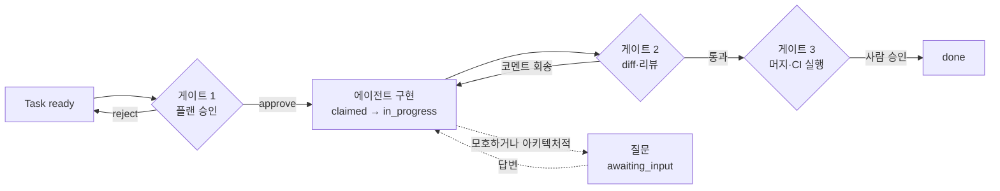
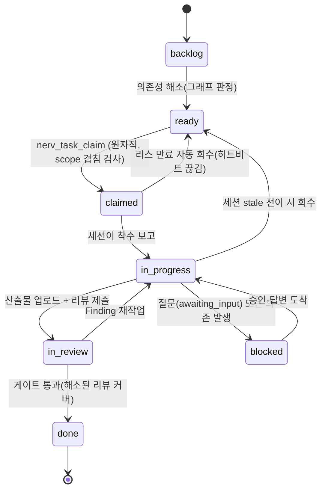

# 병렬 에이전트 오케스트레이션 — 도구 지형과 검증된 패턴

> **요약** — 2025~2026년에 쏟아진 병렬 코딩 에이전트 도구는 **로컬 git worktree 계열**과 **클라우드 VM/컨테이너 계열**로 갈라졌지만, 할당·격리·상태 표시·충돌 방지·사람 개입 5축에서 거의 같은 답으로 수렴했다. 검증된 공통 규격은 원자적 클레임 + 의존성 기반 ready 판정(beads·Claude Code agent teams), 세션 카드 UI(상태·diff 통계·attach), 플랜/리뷰/머지·CI의 3게이트, 위임 명세 4요소다. 반면 필드 데이터는 병렬화의 병목이 코드 생성이 아니라 **리뷰**임을 가리킨다 — 중앙값 PR 리뷰 시간 +441%, 무리뷰 머지 31%, 실용 동시 한계 3~5 에이전트. 게다가 로컬 오케스트레이터는 1년 안에 사라진다(Crystal 2026-02 종료, vibe-kanban sunsetting). 그래서 NERV(가칭)는 특정 도구를 통합하는 대신 **패턴(클레임 API·세션 레지스트리·게이트)을 서버에 표준화**하고 에이전트별 어댑터를 얇게 유지하며, 이 문서가 FR-05~FR-08과 D-04·D-13의 1차 근거를 제공한다.
>
> 문서 버전 v0.1 · 2026-08-13 · HTML 판: [agent-orchestration.html](../html/agent-orchestration.html)

---

## 1. 병렬 에이전트 운용 지형

### 1.1 두 계보

2026년 8월 현재 "코딩 에이전트 여러 개를 동시에 굴린다"는 문제에는 두 갈래의 해법 계보가 있다.

| 계보 | 대표 | 실행 위치 | 격리 수단 | 상태의 소유자 | 강점 | 약점 |
| --- | --- | --- | --- | --- | --- | --- |
| **로컬 worktree 파** | Conductor, vibe-kanban, claude-squad, Crystal, Claude Code `--worktree` | 개발자 머신 | `git worktree` (+tmux) | 로컬 파일 | 즉시 attach·디버깅, 기존 툴체인 그대로, 비용은 본인 구독 | 한 대의 머신에 갇힘, 타 세션·타 머신 관측 불가, 도구 수명 짧음 |
| **클라우드 VM 파** | Claude Code on the web, Codex cloud, Copilot coding agent, Jules, Devin, Factory | 벤더 관리 VM/컨테이너 | 샌드박스 VM·컨테이너 + 네트워크 허용목록 | 벤더 플랫폼 DB | 어디서나 조회, 팀 단위 가시성, 감사 로그 내장 | 벤더 종속, 저장소·환경 정의 필요, 내부 스펙 도메인은 못 다룸 |

두 계보는 **격리 방식만 다르고 나머지 4축(할당·상태 표시·충돌 방지·개입 지점)은 거의 같은 결론**에 도달했다. 이 문서의 핵심 주장은 여기서 나온다: NERV가 구현해야 하는 것은 새로운 격리 기술이 아니라, 두 계보 위에 공통으로 얹히는 **조정(coordination)과 가시성 계층**이다.

### 1.2 격리는 2계층으로 수렴했고, 관례가 아니라 강제다

Claude Code의 공식 worktree 지원이 이 수렴의 규격을 가장 명료하게 보여준다. `claude --worktree <name>`은 `.claude/worktrees/<name>/`과 `worktree-<name>` 브랜치를 만들고, 세션 도중에는 `EnterWorktree`/`ExitWorktree` 도구로 드나든다. 중요한 것은 **툴 레벨 강제**다 — worktree 세션에서 메인 체크아웃을 향한 Edit/Write, 메인으로 해석되는 작업 디렉터리, `git -C`·`GIT_DIR` 같은 리다이렉트, 정적으로 추적 불가능한 셸 구성이 전부 차단된다. 여기에 실행 중 `git worktree lock`으로 동시 정리로부터 보호하고, 정리 스윕은 미커밋 작업이 있는 worktree를 건너뛴다.

클라우드 계열은 같은 요구를 VM/컨테이너로 푼다. Claude Code on the web은 세션마다 관리형 격리 VM에 네트워크 허용목록을 걸고, **GitHub 접근은 보안 프록시를 경유해 자격증명이 샌드박스 안에 들어가지 않는다**. Codex cloud는 실행 중 컨테이너의 네트워크를 기본 차단하고 저장소별 환경(의존성·도구·변수·setup)을 정의·캐싱한다.

- [Run parallel sessions with worktrees — Claude Code Docs](https://code.claude.com/docs/en/worktrees) — (확인일 2026-08-13) 격리를 툴 레벨에서 강제하고 lock·작업 보존 스윕까지 규격화한 1차 출처.
- [Claude Code on the web 출시 발표 — claude.com](https://claude.com/blog/claude-code-on-the-web) — (2025-10-20) 세션별 격리 샌드박스와 자격증명 프록시 원칙.
- [Codex cloud 문서 — learn.chatgpt.com](https://learn.chatgpt.com/docs/cloud) — (확인일 2026-08-13) 컨테이너 격리 + 저장소별 환경 정의·캐싱.

> **설계 시사점.** AgentSession 레코드는 격리 방식(worktree/container/vm), worktree 경로, 브랜치, 실행 호스트(hostname)를 **필수 메타데이터**로 가져야 한다(FR-07). 격리 자체는 로컬 하네스와 벤더 샌드박스에 맡기고, NERV는 "누가 어디서 무엇을 격리해 돌리는지"를 기록·조회하는 레지스트리 역할을 한다.

### 1.3 clemvion의 좌표: 격리는 최상급, 조정은 공백

clemvion은 로컬 worktree 계보의 완성형에 가깝다. 모든 신규 작업은 `.claude/worktrees/<task>-<slug>/` 안에서만 수행되고, 메인 체크아웃 쓰기는 4-layer 브랜치 가드(`clemvion:.claude/hooks/_lib/branch_guard.py`)로 차단되며, e2e 인프라까지 worktree 디렉터리 이름으로 compose 프로젝트를 분리한다. 그런데 **조정 계층은 의도적으로 비어 있다.**

> **근거 · clemvion 실측.** `clemvion:.claude/docs/worktree-policy.md` §3 원문: "동일 `spec/` 파일·코드 영역을 두 worktree가 동시 수정 중이면 plan에 명시하고 직렬화한다. **자동 검출은 없다**." 실제로 `plan_coherence` 체커의 worktree 경합 검출은 커밋 `3da85dc3b`(#576)에서 제거됐고, 제거 사유는 "병렬 작업이 다른 머신·세션이면 로컬에 반영되지 않아 신뢰할 수 없다"였다. 같은 문서 §7은 머지 정리 도구(`clemvion:.claude/tools/reap-merged-worktrees.sh`)가 **"살아있는 세션 앵커 레지스트리"가 없어 타 세션의 앵커 worktree를 죽일 수 있다**고 스스로 한계를 명시한다. 머지 이벤트조차 관측 수단이 없어 세션 시작마다 `gh` 폴링으로 수렴시킨다.

즉 clemvion이 로컬 아키텍처의 한계로 **포기한 기능 목록이 이 문서가 조사한 도구들이 서버로 해결한 기능 목록과 정확히 겹친다**. 상세는 [1.1 clemvion 하네스 분석](../01-problem/clemvion-analysis.md)과 [1.2 문제 정의와 요구사항](../01-problem/pain-points.md)(P1·P2·P4)을 참조.

---

## 2. 도구별 분석

### 2.1 로컬 worktree 계열

**Conductor (Melty Labs)** — Claude Code·Codex·Cursor·OpenCode를 한 프로젝트에서 병렬 실행하는 Mac 앱. "태스크마다 자기 워크스페이스·브랜치·파일·터미널·diff·리뷰 경로를 갖는다"가 제품의 한 줄 정의이며, 대시보드에서 전체 작업을 한눈에 보고 → 리뷰 → 머지하는 3단 UX가 표준 기대치를 만들었다. 앱은 무료, 사용자 본인의 구독을 쓰는 BYO 모델.

**vibe-kanban (Bloop AI)** — "병렬 작업의 병목은 계획과 리뷰"라는 문제의식의 칸반 오케스트레이터(Apache-2.0, 27.8k★). 이슈/서브이슈로 작업을 쪼개 에이전트에 프롬프트하면 **에이전트 시작·PR 생성·머지 이벤트가 카드 상태를 자동 전이**시킨다. 워크스페이스는 브랜치+터미널+dev 서버 세트이고 worktree와 setup script를 자동 생성한다. 결정적으로 **자체 MCP 서버를 내장**해 에이전트가 보드의 태스크를 직접 조작한다 — NERV의 `nerv_task_*` 도구 설계의 직접 선례. 확인 시점 기준 sunsetting 발표, 커뮤니티 유지보수로 전환.

**claude-squad (smtg-ai)** — 터미널 TUI(AGPL-3.0, 8.3k★). tmux 세션(터미널 격리) + git worktree(코드 격리) 조합으로 인스턴스를 관리하고, 목록에서 Enter로 attach한다. 주목할 것은 명시적 상태 전이 키바인딩: `c`(checkout — 변경 커밋 후 세션 일시정지) → 사람 확인 → `r`(재개). auto-accept는 `-y` 플래그의 **opt-in**이다.

**Crystal → Nimbalyst (Stravu)** — Electron 앱(MIT, 3.1k★). 같은 문제에 여러 접근을 나란히 실행·비교하는 best-of-N이 특징이었고, 세션 영속성·diff 시각화·rebase/squash를 내장했다. **2026-02 deprecated**, 후속 제품 Nimbalyst로 이전.

- [Conductor Docs](https://www.conductor.build/docs/) · [Conductor 제품 페이지](https://conductor.build) — (확인일 2026-08-13) "태스크 = 워크스페이스 + 브랜치 + 리뷰 경로" 단위화와 대시보드 3단 UX.
- [Vibe Kanban 공식 사이트](https://www.vibekanban.com/) · [BloopAI/vibe-kanban GitHub](https://github.com/BloopAI/vibe-kanban) — (확인일 2026-08-13) 이벤트 기반 상태 자동 전이 + 플랫폼 자체를 MCP 서버로 노출하는 구조.
- [smtg-ai/claude-squad GitHub](https://github.com/smtg-ai/claude-squad) — (확인일 2026-08-13) 일시정지→확인→재개 상태 전이와 auto-accept opt-in.
- [stravu/crystal GitHub](https://github.com/stravu/crystal) — (확인일 2026-08-13) best-of-N 비교 실행, 2026-02 종료 사실.

### 2.2 Claude Code 자체의 병렬·팀 기능

**agent teams (실험 기능)** — `CLAUDE_CODE_EXPERIMENTAL_AGENT_TEAMS=1`로 켜면 리드 세션과 독립 컨텍스트의 팀메이트들이 **공유 태스크 리스트**(pending / in progress / completed + 태스크 간 의존성)로 협업한다. NERV 설계에 직결되는 규격이 네 가지다.

1. **미해결 의존성이 있는 태스크는 클레임 불가** — ready 판정이 그래프에서 나온다.
2. **클레임은 파일 잠금으로 레이스 컨디션을 막는다** — 할당은 리드 지정 또는 self-claim(다음 unassigned·unblocked 태스크 자가 선점).
3. **`TaskCreated`/`TaskCompleted`/`TeammateIdle` 훅이 exit code 2로 태스크 생성·완료를 거부**할 수 있다 — 품질 게이트의 기계화.
4. **다른 에이전트의 메시지는 사용자 승인·동의로 취급되지 않는다** — 메일박스(`~/.claude/teams/{team}/inboxes/{agent}.json`)를 통한 권한 우회 차단.

운영 권장치도 그대로 참고할 만하다: 팀메이트 3~5명, 팀메이트당 태스크 5~6개, **파일 소유권을 팀메이트별로 분리**해 충돌 회피. 제약도 명시돼 있다 — 한 세션 한 팀, 중첩 불가, 세션 재개 시 in-process 팀메이트 미복원.

**모범 사례 문서**는 병렬화를 4계층(수동 worktree / 데스크톱 앱의 자동 worktree / 웹 클라우드 / agent teams)으로 정리하고, 두 가지 작업 패턴을 명시한다. **Writer/Reviewer 분리** — 한 세션이 구현하고 다른 세션이 신선한 컨텍스트로 리뷰한다("자기가 방금 쓴 코드에 편향되지 않는다"). **fan-out** — 대상 파일 목록을 만들고 `claude -p`를 루프로 돌리되 `--allowedTools`로 권한을 좁힌다. 검증 게이트는 프롬프트 내 체크 → `/goal` 조건 → Stop hook → 검증 서브에이전트의 4단이다.

- [Orchestrate teams of Claude Code sessions — Claude Code Docs](https://code.claude.com/docs/en/agent-teams) — (확인일 2026-08-13) 공유 태스크 리스트·파일 잠금 클레임·의존성 ready·훅 거부·"에이전트 메시지 ≠ 승인" 원칙.
- [Best practices — Claude Code Docs](https://code.claude.com/docs/en/best-practices) — (확인일 2026-08-13) Writer/Reviewer 분리, fan-out, 4단 검증 게이트.

### 2.3 클라우드 계열

**Claude Code on the web** — 세션마다 관리형 격리 VM과 저장된 "cloud environment"를 쓴다. `claude --cloud "태스크"`를 여러 번 실행하면 각각 독립 세션이 되고 `/tasks`로 일괄 모니터링한다. 세션 목록에는 `+42 −18` 형태의 **diff 지표**가 붙고, diff 뷰의 인라인 코멘트가 다음 메시지로 에이전트에 전달된다. `--teleport`로 클라우드 세션을 로컬 터미널로 끌어오고, `claude -p "msg" --cloud <session-id>`로 어느 기계에서든 실행 중 세션에 후속 지시를 큐잉할 수 있다. **Auto-fix PR**은 CI 실패·리뷰 코멘트에 자동 대응하되 해석이 갈리거나 아키텍처적으로 중요한 요청은 사람에게 질문하며, 에이전트 답글에는 작성 주체 라벨이 붙는다. 권장 패턴은 "plan locally, execute remotely".

**Codex cloud** — 웹·IDE·GitHub PR·Linear·Slack에서 위임하면 격리 컨테이너에서 실행된다. 저장소별 환경을 정의·캐싱해 재현성을 확보하고, **동일 태스크의 여러 시도(attempts)를 비교하는 best-of-N**을 지원한다. 결과는 summary+diff로 도착한다.

**GitHub Copilot coding agent** — **이슈를 사람에게 하듯 assign**하면 👀 리액션으로 접수를 알리고, GitHub Actions 기반 임시 환경(최대 59분)에서 자기 브랜치에 커밋을 쌓는 **draft PR**로 작업하다가 완료 시 사용자를 리뷰어로 지정한다. 보안 기본값이 특히 중요하다 — 에이전트는 자기 브랜치에만 push하고, **요청자는 그 PR을 스스로 승인할 수 없으며**, CI/CD 워크플로 실행에는 사람의 명시적 승인이 필요하다.

**Jules (Google)** — 사람 개입 지점이 3체크포인트로 명문화돼 있다: (1) 프롬프트 (2) **코드 작성 전 플랜 리뷰·수정·거절** (3) diff 승인 후 PR 생성, 머지는 사람. 동시 실행 한도가 요금제로 규격화된 것도 참고 대상이다(Free 15태스크/일·동시 3, Pro 100/일·동시 15, Ultra 300/일·동시 60).

**Devin (Cognition)** — 태스크 유입이 Slack 멘션·Linear/Jira 티켓 태그·웹·CLI/API로 다중이고, **티켓을 분석해 세션 프롬프트를 자동 생성**한다. 한 주에 659개의 Devin PR을 머지한 기록이 공개돼 있다. Devin Review는 복잡한 diff를 정리하고 버그를 감지해 **리뷰어가 원시 diff가 아니라 정리된 산출물을 보게** 한다. 착수 전 **Confidence Score**로 이슈를 일괄 선별해 확신도 높은 것부터 시작하는 흐름도 제공한다.

**Factory.ai** — 개별 에이전트에서 "소프트웨어 공장"으로 확장한 사례. Droid(단순) → Automations(반복) → Droid Computers(장기 실행) → **Missions**(복잡 작업을 병렬 트랙으로 분해해 수 시간~수 일 자율 실행)의 스펙트럼을 두고, 리뷰·보안·문서·QA가 **같은 조직 컨텍스트**를 공유해 피드백 루프를 만든다. 셀프호스팅·에어갭 옵션 제공.

- [Use Claude Code on the web — Claude Code Docs](https://code.claude.com/docs/en/claude-code-on-the-web) — (확인일 2026-08-13) 세션 카드의 diff 지표, teleport·후속 지시 큐잉, "명확하면 진행·모호하면 질문" 정책.
- [GitHub Copilot: Meet the new coding agent — GitHub Blog](https://github.blog/news-insights/product-news/github-copilot-meet-the-new-coding-agent/) — (2025-05-19, 2025-05-23 갱신) 이슈 assign = 태스크 큐잉, draft PR, 자기승인 금지·CI 승인 게이트.
- [About Copilot coding agent — GitHub Docs](https://docs.github.com/en/copilot/concepts/agents/coding-agent/about-coding-agent) — (확인일 2026-08-13) 다중 진입점, 59분 하드 타임아웃, 모든 행위의 커밋·로그 기록.
- [Jules 공식 사이트](https://jules.google/) — (확인일 2026-08-13) 플랜 승인을 1급 게이트로 둔 3체크포인트, 요금제별 동시 실행 한도.
- [How Cognition Uses Devin to Build Devin — Cognition Blog](https://cognition.com/blog/how-cognition-uses-devin-to-build-devin) · [Devin Docs 소개](https://docs.devin.ai/get-started/devin-intro) — (확인일 2026-08-13) 티켓→세션 프롬프트 자동 생성, 정리된 리뷰 산출물, Confidence Score, take over.
- [Factory 2.0: From coding agents to software factories](https://factory.ai/news/software-factory) — (확인일 2026-08-13) 단일 조직 컨텍스트 공유와 Mission의 병렬 트랙 분해.

### 2.4 에이전트용 이슈 트래커: beads

**beads (Steve Yegge)** — "코딩 에이전트를 위한 영속·구조화 메모리"를 표방하는 분산 그래프 이슈 트래커(26.3k★). 마크다운 체크리스트를 의존성 그래프 DB로 대체한다: 링크 타입 blocks / relates-to / duplicates / supersedes, 계층 ID(`bd-a3f8.1.1`), 저장은 버전 관리되는 SQL DB(Dolt)이고 `.beads/issues.jsonl`은 교환 포맷이다. NERV가 그대로 가져올 세 요소가 여기 다 있다.

- **`bd ready`** — 열린 blocker가 없는 태스크를 자동 판별해 에이전트가 다음 작업을 스스로 발견한다.
- **`bd update <id> --claim`** — assignee 지정과 in-progress 전환을 **원자적으로** 수행해 중복 착수를 막는다.
- **해시 기반 ID(`bd-a1b2`)** — 브랜치·에이전트 간 병합에서 ID 충돌이 원천적으로 발생하지 않는다.

- [steveyegge/beads GitHub](https://github.com/steveyegge/beads) — (확인일 2026-08-13) 의존성 ready 판정·원자적 클레임·해시 ID의 검증된 선행 구현.

### 2.5 5축 비교표

할당(assignment) · 격리(isolation) · 상태 표시(observability) · 충돌 방지(conflict avoidance) · 개입 지점(human gate).

| 도구 | (a) 태스크 할당 | (b) 격리 | (c) 상태 표시 | (d) 충돌·중복 방지 | (e) 사람 개입 |
| --- | --- | --- | --- | --- | --- |
| Conductor | 수동(워크스페이스+프롬프트) | git worktree | 대시보드 일람 + diff 뷰 | 태스크별 브랜치·워크스페이스 | diff 리뷰 → PR → 머지 → 아카이브 |
| vibe-kanban | 칸반 카드 → 에이전트, MCP로 에이전트가 조작 | git worktree + setup script | 보드 컬럼, 이벤트 기반 자동 전이 | worktree, 태스크별 브랜치 | 인라인 diff 코멘트, PR 리뷰·머지 |
| claude-squad | 수동(TUI `n`) | tmux + git worktree | TUI 목록·미리보기 | worktree/브랜치 분리 | checkout/push 게이트, auto-yes는 opt-in |
| Crystal | 수동, 동일 태스크 N세션 | git worktree | 세션 상태 + diff | worktree | diff 비교 후 승자 선택, rebase/squash |
| Claude Code agent teams | 리드 지정 or self-claim | 컨텍스트 분리(+worktree 병용) | 에이전트 패널, idle 알림 | 공유 태스크 리스트 + **파일 잠금** + 의존성 | 플랜 승인, 훅 exit-2 거부, 직접 개입 |
| Claude Code on the web | 브라우저/모바일/`--cloud`, 세션=태스크 | 관리형 VM + 네트워크 제한 | 세션 목록 + `+N −M` diff, `/tasks` | 세션별 VM·브랜치, 자격증명 프록시 | diff 코멘트, PR 생성, 모호하면 질문 |
| Codex cloud | 웹/IDE/GitHub/Linear/Slack 위임 | 컨테이너(네트워크 기본 차단) | 실시간 로그 또는 백그라운드 | 컨테이너 독립, 환경 캐싱 | summary+diff 리뷰, follow-up, PR |
| Copilot coding agent | 이슈 assign, `@copilot`, 패널, 트리거 | Actions ephemeral(최대 59분) | 세션 로그 + draft PR 커밋 스트림 | 자기 브랜치만 push, 이슈=1 PR | 리뷰어 지정, **자기승인 금지**, CI 실행 승인 |
| Jules | 웹, `jules` 라벨, API | Google Cloud VM | activity feed 실시간 로그 | 동시 실행 한도(3/15/60) | **플랜 승인** → diff 승인 → 사람이 머지 |
| Devin | Slack/Linear/Jira/웹/API | 클라우드 워크스페이스(IDE·셸·브라우저) | 세션 링크 실시간, Slack 업데이트 | Confidence Score 사전 선별 | take-over, 정리된 리뷰 산출물 후 사람 승인 |
| Factory | 터미널/IDE/웹/Slack/티켓 | 클라우드 또는 로컬 | 플랫폼 관측성 | Mission이 병렬 트랙으로 분해 | 사람은 고수준 결정·거버넌스 |
| beads | `bd ready`로 에이전트가 자가 발견 | (트래커 — 격리 무관) | 이슈 상태·의존성 그래프 | **원자적 `--claim`**, 해시 ID | 사람도 같은 트래커로 관리 |
| **clemvion(현행)** | 사람이 plan 문서에서 수동 선택 | git worktree + 4-layer 브랜치 가드 | 자기 세션 statusline 1줄 | **없음**(자동 검출 제거, #576) | 그 터미널 그 세션 안에서만 |
| **NERV(제안)** | ready 큐 + `nerv_task_next`/`nerv_task_claim` | 로컬 worktree·클라우드 샌드박스 **양쪽 수용** | 세션 모니터(S5): 사용자·hostname·상태·현재 Task·하트비트·diff | 원자적 클레임 + 리스 + **scope 겹침 감지** | 승인함(S7): 스펙/CR·플랜·질문·머지 |

> **읽는 법.** 마지막 두 행이 이 문서의 결론이다. clemvion은 (b)에서 업계 최상급이지만 (a)(c)(d)(e)가 전부 로컬 한 대에 갇혀 있고, NERV는 (b)를 기존 도구에 위임한 채 나머지 네 축을 서버로 올린다.

---

## 3. 검증된 패턴 추출

여러 도구가 **독립적으로 같은 결론에 도달한** 설계만 추린다. 한 도구에서만 보이는 아이디어는 채택 후보로만 남긴다.

### 3.1 원자적 클레임 + 의존성 기반 ready 판정

같은 문제에 대한 세 가지 구현이 존재한다 — beads의 `bd ready` / `--claim`, agent teams의 파일 잠금 + self-claim, Copilot의 이슈 assign(1 이슈 = 1 PR). 공통 불변식은 두 가지다. ① **다음 할 일은 사람이 고르는 게 아니라 그래프가 계산한다**(열린 blocker가 없는 태스크만 ready) ② **선점은 assignee 지정과 상태 전이를 한 트랜잭션에서** 수행한다.

> **D-04 — 동시성 제어는 원자적 클레임+리스(lease).** ready 판정(의존성 그래프) → `nerv_task_claim`(assignee + 상태 원자 전환) → TTL 리스 + 하트비트 연장 → 만료 시 자동 회수. 클레임 시 Scope(spec_ids, file_globs)를 선언해 겹침을 사전 감지한다. 로컬 파일 잠금(agent teams)과 로컬 DB(beads)로 검증된 모델을 **서버 API로 옮긴 것**이며, 이것이 clemvion이 "다른 머신·세션은 로컬에 안 보인다"는 이유로 포기한 지점(P1·P2)의 정확한 해답이다.

### 3.2 충돌 없는 분산 ID

beads의 해시 기반 ID(`bd-a1b2`)는 브랜치·에이전트가 동시에 태스크를 만들어도 병합 시 ID가 충돌하지 않게 한다. 파일 기반 도구에서 흔한 "번호 채번 경쟁"이 원천 제거된다. NERV는 ID를 **서버가 발급**하므로 더 강한 보장을 공짜로 얻는다(D-04).

### 3.3 세션 카드 UI의 업계 컨센서스

Conductor의 "see at a glance", Claude Code web의 세션 목록(`+42 −18` diff 지표·`/tasks`), Jules의 activity feed, Devin의 세션 링크가 사실상 같은 카드를 그린다.

```text
┌─ 세션 카드: 업계 공통 필드 ────────────────────────────────────────────┐
│ ● 상태(작업중/idle/입력대기/완료/실패)   브랜치: feat/nav-tabs        │
│ 태스크 요약 한 줄                                    diff: +142 −38   │
│ [ 로그 보기 ]  [ attach / take over ]  [ 코멘트 ]  [ stop ]           │
└────────────────────────────────────────────────────────────────────────┘
┌─ NERV가 추가하는 3필드 ────────────────────────────────────────────────┐
│ 사용자 + hostname(mac-A) + 에이전트 종류(claude-code/codex)            │
│ 클레임한 Task ID + 리스 잔여 시간                                      │
│ 유래 SpecVersion / Requirement (무엇을 구현 중인가)                    │
└────────────────────────────────────────────────────────────────────────┘
```

앞의 3필드가 없으면 "지금 누가 뭘 하나"에 답할 수 없다. 이것이 미션 컨트롤(S5, FR-08)의 차별점이며 화면 상세는 [3.6 화면 설계](../03-proposal/ui-wireframes.md)에 있다.

### 3.4 3게이트 + 1원칙

사람 개입 지점은 도구를 가로질러 세 곳으로 수렴한다.



- **게이트 1 · 플랜 승인** — Jules의 1급 체크포인트, agent teams의 plan approval, Claude Code의 "plan locally, execute remotely".
- **게이트 2 · diff/리뷰** — 전 도구 공통. 인라인 코멘트가 에이전트에게 피드백으로 회송되는 것이 핵심(Claude web, vibe-kanban).
- **게이트 3 · 머지·CI 실행** — Copilot은 **CI 실행에도** 사람 승인을 요구하고 요청자의 자기 승인을 금지한다("지시자 ≠ 승인자").
- **+1원칙** — "명확하면 자동 진행, 모호하거나 아키텍처적이면 질문"(Claude Auto-fix PR). NERV에서는 Question 엔티티와 세션 상태 `awaiting_input`이 이 원칙의 구현체다(D-13).

이 4분류는 D-06의 표준 게이트 4+1에 대응하며, 그중 플랜 승인·질문은 승인함(Inbox) 카드가 되고(FR-11) 머지·CI 승인은 git forge 측 게이트다.

### 3.5 위임 명세 4요소

Anthropic 멀티에이전트 리서치 시스템의 실패 분석은 명확하다. **objective / 기대 output format / 도구·출처 가이드 / 명확한 task boundaries** 중 하나라도 빠지면 서브에이전트들이 같은 주제를 중복 조사한다 — "research the semiconductor shortage" 같은 모호한 지시가 실제로 중복 작업을 유발했다. 같은 글은 노력 스케일링 규칙(단순 조회 1에이전트·3~10 tool calls, 직접 비교 2~4에이전트·각 10~15 calls, 복잡 리서치 10+)도 프롬프트에 명시하라고 권한다.

> NERV는 이 4요소를 Task 스키마의 **필수 필드로 강제**한다(FR-05). 프롬프트 관례가 아니라 서버 검증이어야 P2(중복 작업)가 재발하지 않는다.

### 3.6 Writer/Reviewer 분리와 정리된 리뷰 산출물

"자기가 방금 쓴 코드에 편향되지 않는다"(Claude Code 모범 사례)는 이유로 구현 세션과 리뷰 세션을 분리하는 것이 공식 권장이고, Devin은 한 발 더 나가 **리뷰어에게 원시 diff 대신 정리된 리뷰 산출물**을 제공한다. NERV의 ReviewSession→Finding→Resolution 모델(D-07, FR-09)이 이 두 교훈의 데이터 모델판이다.

### 3.7 채택 후보(당장은 아님)

- **best-of-N** — 동일 Task를 N개 세션이 시도하고 사람이 승자를 고른다(Crystal, Codex cloud attempts). 리뷰 부담이 N배가 되므로 [3.7 로드맵](../03-proposal/roadmap.md) Phase 3 이후 후보.
- **Confidence Score 선별** — 착수 전 태스크별 성공 확신도를 산출해 높은 것부터 자동 할당(Devin). ready 큐의 우선순위 정책으로 이식 가능하나, 점수의 근거 데이터가 축적된 뒤에야 의미가 있다.

### 3.8 보안 불변식 2개

1. **자격증명은 에이전트 실행 환경 밖에 둔다** — Claude Code on the web은 GitHub 접근을 보안 프록시로 우회시켜 토큰이 샌드박스에 들어가지 않게 한다.
2. **에이전트 간 메시지는 사용자 승인·동의로 취급하지 않는다** — agent teams 메일박스의 명시적 규칙.

두 번째는 NERV에서 특히 중요하다. 스펙 본문과 Finding 본문은 에이전트가 읽는 **비신뢰 데이터**이므로, 그 안의 텍스트가 승인·게이트 면제를 지시할 수 없어야 한다(NFR-03). 상세는 [3.4 에이전트 연동 설계](../03-proposal/agent-integration.md).

---

## 4. 실전 교훈

### 4.1 제1 실패 모드는 리뷰 병목이다

병렬 에이전트 운용의 필드 데이터는 한 방향을 가리킨다. **코드 생성이 빨라진 만큼 검증이 밀린다.**

| 지표 | 값 | 출처 |
| --- | --- | --- |
| PR 생성량 / 리뷰 시간 | +98% / +91% | Codex Knowledge Base |
| 중앙값 PR 리뷰 시간 | **+441%** | Faros AI(22,000명·4,000팀 계측), Codex KB |
| AI 생성 PR의 리뷰어 배정 대기 | 4.6배 | Codex Knowledge Base |
| 리뷰 없이 머지된 PR | **31%** | Faros AI — 정책이 아니라 "리뷰어가 못 따라가서" |
| 개발자당 버그 / PR당 인시던트 | +54% / 3배 | Faros AI |
| 리뷰 노력의 집중도 | 전체의 69%가 상위 위험 20% PR에 | Codex Knowledge Base |

Faros AI는 이 패턴을 **"Acceleration Whiplash"**로 명명한다 — 코드 작성 제약은 사라졌는데 리뷰·테스트·검증 파이프라인은 여전히 사람 속도 기준이라 시스템이 범람한다. Codex KB의 처방은 5계층 리뷰(자동화 게이트 → 의도 검증 → 위험 분류 P0~P3 → 구조 검토 → 지식 이전)와 **스펙 검증의 상류 시프트(shift upstream)**, 즉 검증을 코드 생성 전으로 옮기는 것이다. 경고도 함께 실려 있다: 생성 에이전트와 검토 에이전트가 같은 훈련 분포를 공유하면 **상관된 실패**가 나므로 AI 재검토만으로는 보증이 약하다.

- [The Human Review Bottleneck — Codex Knowledge Base](https://codex.danielvaughan.com/2026/05/24/human-review-bottleneck-code-review-strategies-agent-output/) — (2026-05-24, 2026-07-05 갱신) 리뷰 5계층·위험 분류 P0~P3·상류 시프트 권고와 상관된 실패 경고.
- [What METR's Study Missed About AI Productivity in the Wild — Faros AI](https://www.faros.ai/blog/lab-vs-reality-ai-productivity-study-findings) — (2026-03 데이터) 22,000명 계측: 리뷰 시간 +441%, 무리뷰 머지 31%, 버그 +54%.
- [Agentic Coding: Who Will Review All That Code? — Stark Raving Finkle](https://starkravingfinkle.org/posts/2026/03/coding-agents-who-will-review-all-that-code/) — (2026-03) 리뷰가 병목이 되면 "리뷰 생략"이 조직의 암묵 선택이 된다는 경고.
- [Agentic Code Review — Addy Osmani](https://addyo.substack.com/p/agentic-code-review) — (2026) 자동 1차 리뷰 + 사람은 의도·아키텍처 판단이라는 계층화.
- [These Aren't the Reviews You're Looking For — arXiv 2605.02273](https://arxiv.org/pdf/2605.02273) — (2026) AI 생성 PR에 대한 인간 리뷰 행동 연구.

> **clemvion 대조.** 같은 병목이 clemvion에서는 **산출물 폭증**으로 나타났다. `clemvion:review/`에 markdown 13,777개·131MB가 쌓였고(73일간 리뷰 세션 1,891개, 일평균 26개), 리뷰 이력 blob이 `.git` packed blob 바이트의 **60%**(60.7MB)를 차지한다. 한 changeset이 8라운드 리뷰를 돌았을 때 마지막 라운드 프롬프트 94파일 중 **86개가 이전 리뷰 산출물**이었다 — 리뷰가 리뷰를 먹는 자기증식 루프. 업계가 "사람이 못 따라간다"로 겪는 문제를 clemvion은 "기계가 만든 리뷰를 아무도 소비하지 않는다"로 겪었고, 원인은 같다: **리뷰가 1급 엔티티가 아니라 파일이었다.**

### 4.2 동시성과 경제학은 정책 대상이다

- **실용 한계는 동시 3~5 에이전트다.** 그 이상은 리뷰 용량 초과로 품질이 "아무도 모르게" 하락한다(Superset). 공교롭게 agent teams의 권장 팀메이트 수(3~5)와 Anthropic 리서치 시스템의 서브에이전트 수(3~5)가 같다.
- **비용은 선형이 아니다.** 멀티에이전트는 단일 채팅 대비 **약 15배 토큰**(단일 에이전트도 4배)을 쓴다. 같은 글은 **강한 의존성이 있는 코딩 작업에는 멀티에이전트가 부적합**하고 병렬 분해 가능한 작업에만 유효하다고 못박는다 — 무조건적 병렬화는 근거가 없다.
- **한도는 이미 제품 기능이다.** Jules는 요금제별 동시 실행 한도(3/15/60)를 규격화했고, Claude Code web은 rate limit을 계정 전체와 공유한다.
- **100 에이전트의 전제는 사람 주의력 추가가 아니다.** Superset의 로드맵은 자동 품질 게이트 + 구조화된 디스패치(에이전트가 스스로 일을 찾음) + 완료 시 리뷰 워크플로 세 가지를 든다 — 정확히 NERV의 ready 큐(FR-05) + 클레임(FR-06) + 게이트(FR-10)다.

- [The Complete Guide to Running Parallel AI Coding Agents — Superset](https://superset.sh/blog/parallel-coding-agents-guide) — (2026) 동시 3~5가 실용 한계, 병렬 운용 실용화의 3요소(CLI 신뢰성·worktree·tmux 성숙).
- [Our plan for running 100 Parallel Coding Agents — Superset](https://superset.sh/blog/roadmap-to-100-agents) — (2026) 안전망 있는 자율성 = 자동 게이트 + 구조화 디스패치 + 완료 리뷰.
- [How we built our multi-agent research system — Anthropic Engineering](https://www.anthropic.com/engineering/multi-agent-research-system) — (확인일 2026-08-13) 위임 명세 4요소, 노력 스케일링, 토큰 15배, 강의존 작업 부적합, 체크포인트 재개.
- [Running Multiple Codex Agent Instances — Codex Knowledge Base](https://codex.danielvaughan.com/2026/04/18/running-multiple-codex-agents-parallel-orchestration/) — (2026-04-18) Codex 다중 인스턴스 병렬 패턴(워크스페이스 격리·태스크 분배).

### 4.3 자기보고와 체감은 증거가 아니다

METR의 RCT는 숙련 오픈소스 개발자 16명·실제 이슈 246개에서 AI 도구 사용 시 **19% 더 느렸다**고 보고한다. 정작 참가자들은 사전에 "+24% 빨라질 것", 사후에 "+20% 빨랐다"고 답했다. 인식과 계측의 격차가 39%p(사후 체감 +20% vs 실측 -19%)이고, 사전 예측 기준으로는 43%p다.

> **D-14의 근거.** 에이전트의 자기보고(STATUS)와 실제 산출물 업로드를 분리 검증하고 "서버에 업로드된 산출물만 진실"로 삼는 원칙은 clemvion의 "디스크가 arbiter" 규칙의 서버 번역이면서, 동시에 이 학술 근거의 제품화다. 대시보드 지표도 체감이 아니라 계측(리뷰 리드타임·재작업률·커버리지)이어야 한다.

- [Measuring the Impact of Early-2025 AI on Experienced Open-Source Developer Productivity — METR](https://metr.org/blog/2025-07-10-early-2025-ai-experienced-os-dev-study/) — (2025-07-10) RCT 실측 -19% vs 사후 체감 +20%.
- [How Anthropic teams use Claude Code — claude.com](https://claude.com/blog/how-anthropic-teams-use-claude-code) — (2025-07-24) 10개 팀 교훈: 체크포인트 커밋, 자율 작업 후 최종 정제 전 사람 검토, "무감독 가능한 작업"의 학습. 법무·마케팅·데이터 등 비개발 직군 활용은 P7(직군 장벽) 해소 가능성의 실증.

### 4.4 도구는 단명하고 패턴은 반복된다

이 문서가 조사한 로컬 오케스트레이터 4종 중 2종이 1년 안에 수명을 마쳤다 — **Crystal은 2026-02 deprecated**되어 Nimbalyst로 이전했고, **vibe-kanban은 sunsetting**을 발표하고 커뮤니티 유지보수로 넘어갔다. 반면 worktree 격리·원자적 클레임·플랜 승인·세션 카드는 도구를 갈아타도 반복해서 나타난다.

> **결론: 도구를 통합하지 말고 패턴을 표준화하라.** NERV는 (1) 서버 API로서의 클레임·리스, (2) 세션 레지스트리와 상태 머신, (3) 게이트 판정 API를 고정 표면으로 두고, Claude Code·Codex 등 **에이전트별 어댑터(MCP 도구·스킬·훅)를 얇게** 유지한다. 어댑터가 깨져도 조정·기록·게이트는 남는다. 이는 벤더 API 변화 리스크에 대한 완화책이기도 하다([3.7 로드맵](../03-proposal/roadmap.md) 리스크 절).

- [Best Tools for Managing Parallel AI Coding Agents in 2026 — Nimbalyst](https://nimbalyst.com/blog/best-agent-management-tools-2026/) — (2026) 로컬 오케스트레이터 세대교체 진행 상황.
- [Multi-Agent Development Workflows with Claude Code — DEV(javatarz)](https://dev.to/javatarz/multi-agent-development-workflows-with-claude-code-n23) — (확인일 2026-08-13) 개인 실전기: 역할 분리·워크플로 정형화가 핵심이라는 결론.

---

## 5. NERV 시사점

### 5.1 패턴 → 요구사항 매핑

| 검증된 패턴 | 검증한 곳 | NERV 반영 | 번호 |
| --- | --- | --- | --- |
| 의존성 그래프 기반 ready 판정 | beads `bd ready`, agent teams | ready 큐 + `nerv_task_next` | FR-05 |
| 위임 명세 4요소 필수화 | Anthropic 멀티에이전트 | Task 스키마 필수 필드(목표/산출물 형식/도구·출처/경계) | FR-05 |
| 원자적 클레임 + 리스·하트비트 | beads `--claim`, agent teams 파일 잠금 | `nerv_task_claim` + TTL 리스 + 만료 자동 회수 | FR-06, **D-04** |
| Scope 선언과 겹침 감지 | agent teams "파일 소유권 분리" 권장 | 클레임 시 spec_ids·file_globs 선언, 겹침 경고/차단 | FR-06, **D-04** |
| 해시·서버 발급 ID | beads `bd-a1b2` | 서버 발급 해시 ID로 분산 생성 충돌 제거 | FR-05, **D-04** |
| 세션 카드 + 실행 컨텍스트 | Conductor, Claude web, Jules, Devin | AgentSession(사용자·hostname·에이전트 종류·격리 방식) 레지스트리 | FR-07 |
| 세션 상태 머신 + 무응답 처리 | claude-squad 일시정지/재개, Claude web 세션 상태 | `pending → active ↔ awaiting_input → complete/error/stale`, 하트비트 임계 초과 시 stale + 클레임 회수 | FR-07, **D-13** |
| 미션 컨트롤 + attach/stop | Conductor 대시보드, `/tasks`, `--teleport`, Devin take-over | 전역 세션 보드(S5)와 steer/stop 액션 | FR-08 |
| 이벤트 기반 상태 자동 전이 | vibe-kanban(시작·PR·머지) | git forge 웹훅 → Task 상태 전이, Event 기록 | FR-08, FR-16 |
| 3게이트 + "모호하면 질문" | Jules, Copilot, Claude Auto-fix | 승인함 카드 유형 5종(스펙 승인·CR·플랜·질문·에스컬레이션), Question ↔ `awaiting_input` | FR-11, D-06 |
| 지시자 ≠ 승인자 | Copilot 자기승인 금지 | 승인 권한 분리와 감사 기록(is_agent) | FR-11, FR-16, D-06 |
| 정리된 리뷰 산출물 | Devin Review | ReviewSession → Finding → Resolution | FR-09, D-07 |
| 완료 훅으로 품질 게이트 | agent teams exit-2 거부, Stop hook | Task done 전이 조건 = 해소된 리뷰 커버리지 | FR-10, D-14 |
| 동시 실행 한도 정책화 | Jules 요금제 한도, 실용 3~5 | 조직·프로젝트 단위 동시 세션/클레임 한도 | FR-14 |
| 자격증명은 실행 환경 밖 | Claude Code on the web 프록시 | 토큰 스코프·권한 비확대 | NFR-03, D-08 |
| 에이전트 메시지 ≠ 승인 | agent teams 메일박스 규칙 | 스펙·Finding 본문은 비신뢰 데이터로 취급 | NFR-03 |

### 5.2 클레임 수명주기 — D-04와 D-13이 만나는 지점



세션 축에서 하트비트가 끊기면(무활동 임계 초과) AgentSession이 `stale`로 전이하고, 그 세션이 쥔 클레임이 자동 회수되어 Task가 `ready`로 돌아온다(D-13). **죽은 세션을 사람이 감시하지 않는다** — clemvion의 worktree reaper가 "살아있는 세션 앵커 레지스트리가 필요하다"며 포기한 바로 그 기능이 여기서는 리스 만료라는 평범한 서버 로직이 된다.

### 5.3 이 문서가 근거를 대는 결정

> **D-13 — 세션 상태 머신과 응답성 SLA를 프로토콜에 내장.** `pending → active ↔ awaiting_input → complete / error / stale`. 하트비트 무활동 임계(기본 30분) 초과 시 stale 자동 전이 + 클레임 자동 회수. 근거는 세 겹이다 — (1) 클라우드 도구들이 이미 세션에 하드 타임아웃과 상태 라벨을 부여한다(Copilot 59분, Claude web 세션 상태) (2) 로컬 도구들도 일시정지/재개를 명시적 전이로 다룬다(claude-squad) (3) clemvion은 타 세션의 생사를 알 수 없어 정리 도구가 남의 세션을 죽일 위험을 안고 있다.

### 5.4 반영되는 제안 문서

- 클레임·리스·scope 알고리즘과 게이트 판정 → [3.5 스펙 워크플로우와 거버넌스](../03-proposal/spec-workflow.md)
- Task/Claim/AgentSession/Activity 엔티티와 인덱스 → [3.3 데이터 모델](../03-proposal/data-model.md)
- `nerv_task_next/claim/heartbeat/release`·세션 규약·어댑터 설계 → [3.4 에이전트 연동 설계](../03-proposal/agent-integration.md)
- 세션 보드·승인함 화면 → [3.6 화면 설계](../03-proposal/ui-wireframes.md)
- Phase 0 검증 목표("두 호스트·세 세션 동시 작업에서 중복 클레임 0") → [3.7 로드맵](../03-proposal/roadmap.md)
- 포지셔닝과 Build vs Buy → [3.1 비전과 핵심 시나리오](../03-proposal/vision.md)

### 5.5 하지 않기로 한 것

- **에이전트 실행기를 직접 만들지 않는다.** 격리·실행은 Claude Code worktree와 벤더 샌드박스에 위임하고, NERV는 조정·기록·게이트만 소유한다(§1.2).
- **특정 오케스트레이터와 깊게 결합하지 않는다.** 어댑터는 얇게(§4.4).
- **best-of-N과 Confidence Score는 Phase 3 이후 후보다.** 리뷰 용량이 병목인 상태에서 시도 수를 늘리는 것은 §4.1의 데이터에 역행한다.

---

## 참고 자료

### 1차 출처 — 도구·플랫폼 문서

- [Run parallel sessions with worktrees — Claude Code Docs](https://code.claude.com/docs/en/worktrees) — (확인일 2026-08-13) worktree 격리의 툴 레벨 강제·lock·작업 보존 스윕.
- [Orchestrate teams of Claude Code sessions — Claude Code Docs](https://code.claude.com/docs/en/agent-teams) — (확인일 2026-08-13) 공유 태스크 리스트·파일 잠금 클레임·훅 거부·"에이전트 메시지 ≠ 승인".
- [Best practices — Claude Code Docs](https://code.claude.com/docs/en/best-practices) — (확인일 2026-08-13) 병렬화 4계층, Writer/Reviewer, fan-out, 검증 게이트.
- [Use Claude Code on the web — Claude Code Docs](https://code.claude.com/docs/en/claude-code-on-the-web) — (확인일 2026-08-13) 세션 카드 diff 지표·teleport·Auto-fix 질문 정책.
- [Claude Code on the web 출시 발표 — claude.com](https://claude.com/blog/claude-code-on-the-web) — (2025-10-20) 격리 샌드박스와 자격증명 프록시.
- [Codex cloud 문서 — learn.chatgpt.com](https://learn.chatgpt.com/docs/cloud) — (확인일 2026-08-13) 컨테이너 격리·환경 캐싱·best-of-N attempts.
- [GitHub Copilot: Meet the new coding agent — GitHub Blog](https://github.blog/news-insights/product-news/github-copilot-meet-the-new-coding-agent/) — (2025-05-19) 이슈 assign·draft PR·자기승인 금지·CI 승인.
- [About Copilot coding agent — GitHub Docs](https://docs.github.com/en/copilot/concepts/agents/coding-agent/about-coding-agent) — (확인일 2026-08-13) 진입점·59분 타임아웃·감사 원칙.
- [Jules 공식 사이트](https://jules.google/) — (확인일 2026-08-13) 3체크포인트 개입 모델·동시 실행 한도.
- [How Cognition Uses Devin to Build Devin — Cognition Blog](https://cognition.com/blog/how-cognition-uses-devin-to-build-devin) — (확인일 2026-08-13) 티켓→세션 프롬프트, Devin Review, 주당 659 PR.
- [Devin Docs — Devin 소개](https://docs.devin.ai/get-started/devin-intro) — (확인일 2026-08-13) 세션 take-over, Confidence Score 선별.
- [Factory 2.0: From coding agents to software factories](https://factory.ai/news/software-factory) — (확인일 2026-08-13) Mission 병렬 트랙, 단일 조직 컨텍스트.
- [Conductor Docs](https://www.conductor.build/docs/) · [Conductor 제품 페이지](https://conductor.build) — (확인일 2026-08-13) 태스크=워크스페이스+브랜치+리뷰 경로.
- [Vibe Kanban 공식 사이트](https://www.vibekanban.com/) · [BloopAI/vibe-kanban GitHub](https://github.com/BloopAI/vibe-kanban) — (확인일 2026-08-13) 이벤트 기반 상태 전이, 내장 MCP 서버, sunsetting.
- [smtg-ai/claude-squad GitHub](https://github.com/smtg-ai/claude-squad) — (확인일 2026-08-13) tmux+worktree 격리, 일시정지/재개.
- [stravu/crystal GitHub](https://github.com/stravu/crystal) — (확인일 2026-08-13) best-of-N 비교, 2026-02 종료.
- [steveyegge/beads GitHub](https://github.com/steveyegge/beads) — (확인일 2026-08-13) ready 판정·원자적 클레임·해시 ID.
- [How we built our multi-agent research system — Anthropic Engineering](https://www.anthropic.com/engineering/multi-agent-research-system) — (확인일 2026-08-13) 위임 명세 4요소·노력 스케일링·토큰 15배.

### 실전 데이터·경험 보고

- [The Human Review Bottleneck — Codex Knowledge Base](https://codex.danielvaughan.com/2026/05/24/human-review-bottleneck-code-review-strategies-agent-output/) — (2026-05-24) 리뷰 5계층·위험 분류·상류 시프트.
- [What METR's Study Missed About AI Productivity in the Wild — Faros AI](https://www.faros.ai/blog/lab-vs-reality-ai-productivity-study-findings) — (2026-03) 리뷰 시간 +441%·무리뷰 머지 31%·버그 +54%.
- [Measuring the Impact of Early-2025 AI on Experienced Open-Source Developer Productivity — METR](https://metr.org/blog/2025-07-10-early-2025-ai-experienced-os-dev-study/) — (2025-07-10) 실측 -19% vs 체감 +20%.
- [The Complete Guide to Running Parallel AI Coding Agents — Superset](https://superset.sh/blog/parallel-coding-agents-guide) — (2026) 동시 3~5 실용 한계.
- [Our plan for running 100 Parallel Coding Agents — Superset](https://superset.sh/blog/roadmap-to-100-agents) — (2026) 자동 게이트+구조화 디스패치+완료 리뷰.
- [Running Multiple Codex Agent Instances — Codex Knowledge Base](https://codex.danielvaughan.com/2026/04/18/running-multiple-codex-agents-parallel-orchestration/) — (2026-04-18) Codex 병렬 운용 패턴.
- [How Anthropic teams use Claude Code — claude.com](https://claude.com/blog/how-anthropic-teams-use-claude-code) — (2025-07-24) 10개 팀 운용 교훈, 비개발 직군 활용.
- [Agentic Coding: Who Will Review All That Code? — Stark Raving Finkle](https://starkravingfinkle.org/posts/2026/03/coding-agents-who-will-review-all-that-code/) — (2026-03) 리뷰 생략의 조직적 압력.
- [Agentic Code Review — Addy Osmani](https://addyo.substack.com/p/agentic-code-review) — (2026) AI 1차 리뷰 + 사람 판단의 계층화.
- [These Aren't the Reviews You're Looking For — arXiv 2605.02273](https://arxiv.org/pdf/2605.02273) — (2026) 인간의 AI PR 리뷰 행동 연구.
- [Best Tools for Managing Parallel AI Coding Agents in 2026 — Nimbalyst](https://nimbalyst.com/blog/best-agent-management-tools-2026/) — (2026) 로컬 오케스트레이터 세대교체.
- [Multi-Agent Development Workflows with Claude Code — DEV(javatarz)](https://dev.to/javatarz/multi-agent-development-workflows-with-claude-code-n23) — (확인일 2026-08-13) 역할 분리·워크플로 정형화.

### clemvion 실측 근거

- `clemvion:.claude/docs/worktree-policy.md` §3 — "자동 검출은 없다"(스펙 동시 수정), §7 — 세션 앵커 레지스트리 부재로 타 세션 앵커 파괴 가능.
- `clemvion:.claude/hooks/_lib/branch_guard.py` — 4-layer 브랜치 가드(격리 강제의 로컬 구현).
- `clemvion:.claude/tools/reap-merged-worktrees.sh` — 머지 이벤트 관측 불가 → 세션 시작마다 `gh` 폴링.
- 커밋 `3da85dc3b`(#576) — `plan_coherence`의 worktree 경합 검출 제거, 사유 "다른 머신·세션이면 로컬에 안 보여 신뢰할 수 없다".
- `clemvion:review/` — markdown 13,777개·131MB, 73일간 리뷰 세션 1,891개(일평균 26개), 리뷰 blob이 `.git` packed blob의 60%(60.7MB), 8라운드 리뷰의 마지막 라운드 프롬프트 94파일 중 86개가 이전 리뷰 산출물.

### 관련 문서

- [1.1 clemvion 하네스 분석](../01-problem/clemvion-analysis.md) · [1.2 문제 정의와 요구사항](../01-problem/pain-points.md)
- [2.1 Spec-Driven Development](spec-driven-development.md) · [2.3 협업 플랫폼의 에이전트 통합](collab-platforms.md) · [2.4 Claude Code/Codex 연동 기술](integration-tech.md)
- [3.3 데이터 모델](../03-proposal/data-model.md) · [3.4 에이전트 연동 설계](../03-proposal/agent-integration.md) · [3.5 스펙 워크플로우와 거버넌스](../03-proposal/spec-workflow.md) · [3.6 화면 설계](../03-proposal/ui-wireframes.md) · [3.7 로드맵](../03-proposal/roadmap.md)
