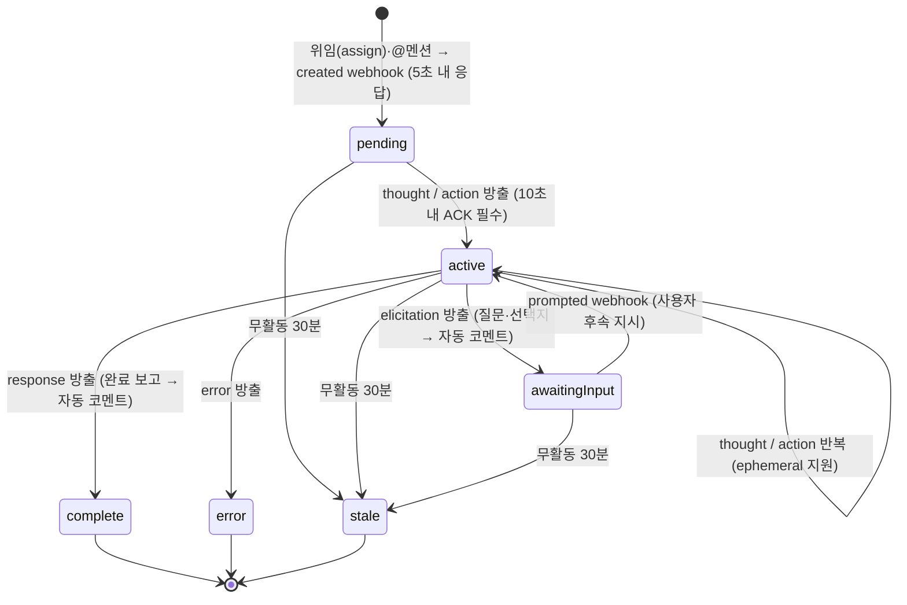
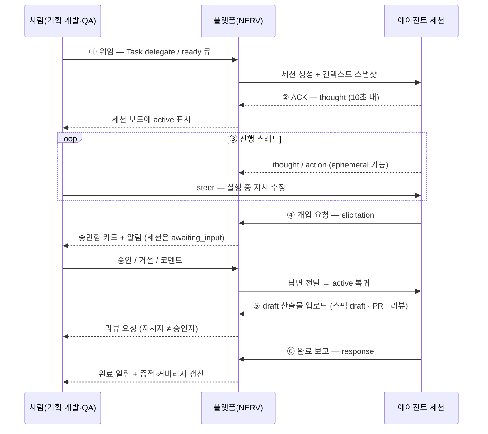

# 협업 플랫폼의 에이전트 통합 — "에이전트=팀원" 모델의 사실상 표준

> **요약** — Linear·GitHub·Atlassian·Notion·Asana·Slack 6개 협업 플랫폼은 2025~2026년에 각자 AI 에이전트를 제품에 들였지만, 결론은 네 가지 패턴으로 수렴했다: ① 에이전트는 **별도 액터 타입**이되 사람과 같은 표면(할당·멘션)에 노출되고 책임은 사람에게 남는다 ② 작업 단위는 **세션(Session)이라는 1급 객체**이며 상태 머신 + 타입드 로그 + 산출물 역링크를 갖는다 ③ 산출물은 **항상 draft로 수렴**하고 "지시자≠승인자" 같은 승인 무결성 규칙이 붙는다 ④ 외부 에이전트 진입로는 **MCP + 이벤트 webhook**으로 표준화되고 관리자는 감사·allowlist·즉시 비활성화를 쥔다. 가장 정교하게 문서화된 규격은 Linear의 **세션 6상태 + 응답성 SLA(5초/10초/30분)와 5종 typed activity**이고, 가장 강한 거버넌스 축은 GitHub의 **`actor_is_agent` 감사 로그와 커밋→세션 역링크**다. 그러나 6개 플랫폼 중 어느 것도 **스펙·요구사항 도메인**을 모델링하지 않는다 — 이것이 NERV(가칭)가 상호작용 규약은 그대로 차용하되 스펙 도메인과 조정 계층은 자체 구축해야 하는 이유이며, 이 문서는 D-08·D-13과 FR-07·FR-08·FR-11·FR-16의 1차 근거다.
>
> 문서 버전 v0.1 · 2026-08-13 · HTML 판: [collab-platforms.html](../html/collab-platforms.html)

---

## 1. "에이전트 = 팀원" 패러다임 개관

### 1.1 조사 대상과 관점

2026년 8월 기준으로 "AI 에이전트를 팀 협업 도구 안에 정식 구성원으로 들인다"는 문제를 실제 제품으로 푼 플랫폼 6개를 1차 문서(개발자 docs·릴리스 노트·엔지니어링 블로그) 기준으로 조사했다. 관점은 네 가지다 — (a) "에이전트=팀원" 모델을 데이터 모델에서 어떻게 구현했는가 (b) 진행 상태를 사람에게 어떤 UI로 보여주는가 (c) 승인·거절·코멘트와 알림을 어떻게 설계했는가 (d) 외부 에이전트 개발자에게 어떤 API를 여는가.

| 플랫폼 | 에이전트가 사는 곳 | 문서화 성숙도 | NERV가 가장 크게 빌려올 것 |
| --- | --- | --- | --- |
| **Linear** | 이슈/프로젝트 (Agent Session) | 최상 — 상태 머신·SLA·activity 타입까지 규격 공개 | 세션 데이터 모델 전체(6상태 + typed activity + delegate) |
| **GitHub** | 이슈/PR (Copilot coding agent, Agent HQ) | 상 — 감사·승인 규칙이 제품 기능으로 명문화 | 감사 축(`actor_is_agent`), 커밋→세션 역링크, 승인 무결성 |
| **Atlassian(Jira+Rovo)** | 작업 항목 (Agents 섹션) | 중상 — 트리거 표면과 단계적 가시성이 명확 | 트리거 4표면, "개인 검토 → 승인 후 팀 공개" |
| **Notion** | 페이지/DB (커스텀 에이전트) | 중상 — run 로그·가역성·MCP 설계 원칙 공개 | run 단위 로그와 가역성, 에이전트 지향 Markdown 툴 설계 |
| **Asana** | 태스크 (AI Teammates) | 중 — 거버넌스 원칙 중심 | 권한 상속·비확대, 체크포인트 승인, 워크플로의 "Human input" 스텝 |
| **Slack** | 대화 컨테이너 (AI 앱) | 상 — 상태·스트리밍 API가 플랫폼 제공 | 진행 상태 표시를 플랫폼 API로 표준화하는 발상 |

### 1.2 수렴한 4가지 패턴

여섯 플랫폼이 **서로 베끼지 않고 독립적으로 같은 답에 도달한** 지점만 추린다. 한 곳에서만 보이는 아이디어는 §6.5의 유보 목록으로 내린다.

**패턴 A — 별도 액터 타입, 동일한 표면.** 에이전트는 사람 계정이 아니라 별도 타입이지만(Linear `actor=app` 앱 유저, GitHub `actor_is_agent`, Jira 에이전트 프로필, Notion 커스텀 에이전트 프로필, Slack bot user), UI에서는 assignee 메뉴와 @멘션 목록에 사람과 나란히 나타난다. 학습 비용이 0이 되는 대신, 권한·과금·감사는 사람과 분리된다(Linear는 과금 시트에 미포함).

**패턴 B — 세션이 1급 객체다.** "에이전트가 한 번 일한 것"이 로그 뭉치가 아니라 ID·상태·소유자·입력 스냅샷·산출물 링크를 가진 레코드다. Linear의 Agent Session, GitHub의 세션(+`agent_session.task` 감사 이벤트), Notion의 run, Slack의 스레드가 모두 같은 자리를 차지한다. 여기서 상태 머신과 타임라인 UI가 따라 나온다.

**패턴 C — 산출물은 draft로 수렴하고, 승인에는 무결성 규칙이 붙는다.** GitHub draft PR, Jira Coding Agent의 draft PR(에이전트는 머지 금지), Rovo 출력의 draft comment 전환, Linear 코딩 세션의 diff→Reviews 탭. 그 위에 "지시자의 승인은 승인 수에 포함되지 않는다"(GitHub), "출력은 트리거한 사람만 먼저 본다"(Jira), "체크포인트에서 사람이 승인해야 진행"(Asana) 같은 규칙이 얹힌다.

**패턴 D — 외부 에이전트 진입로는 MCP + 이벤트로 표준화됐다.** Linear(호스티드 MCP + AgentSessionEvent webhook + activity 쓰기 API), GitHub(이벤트 + MCP 확장 + 엔터프라이즈 MCP allowlist), Notion(호스티드 MCP + Admin API), Slack(Events API + `assistant.*` + MCP/RTS), Asana(MCP + AI Connectors), Atlassian(Marketplace + MCP 기반 서드파티 수용). 공통 부속물은 **OAuth 인가, 읽기 전용 변형, 관리자 감사·철회**다.

> **이 문서의 핵심 관찰.** 네 패턴은 전부 *상호작용 규약*에 관한 것이고, *도메인 모델*에 관한 것은 하나도 없다. 여섯 플랫폼의 작업 단위는 이슈·태스크·페이지·메시지이며, **스펙(Spec)·스펙 버전(SpecVersion)·요구사항(Requirement)** 을 1급 엔티티로 가진 곳은 없다. 그래서 NERV의 build vs buy 답은 "상호작용 규약은 차용, 스펙 도메인과 조정 계층은 자체 구축"으로 갈린다(§6.4, [3.1 비전과 핵심 시나리오](../03-proposal/vision.md)).

### 1.3 clemvion의 좌표

clemvion에는 위 네 패턴 중 **하나도 없다**. 에이전트 액터 타입이 없고(사람과 에이전트가 같은 git 커밋 저자로 뭉갠다), 세션은 레코드가 아니라 gitignored 로컬 파일이며(모든 조율 상태가 단일 호스트에 갇힌다), 산출물은 draft 단계 없이 코드와 같은 브랜치에 바로 커밋되고, 외부에 열린 API가 없다. 사람 개입 채널도 "그 터미널의 그 세션" 안뿐이라 기획자·디자이너·QA는 참여 자체가 불가능하다(P7). 상세는 [1.1 clemvion 하네스 분석](../01-problem/clemvion-analysis.md)과 [1.2 문제 정의와 요구사항](../01-problem/pain-points.md).

---

## 2. Linear for Agents 심층 — 상호작용 규약의 참조 구현

Linear는 에이전트를 별도 액터 타입("app user")으로 승격시키고 작업 단위를 "Agent Session"이라는 1급 객체로 모델링했다. 조사 대상 중 상호작용 모델이 가장 정교하게 문서화되어 있어, 이 문서에서 가장 많은 지면을 쓴다.

### 2.1 앱 유저(app user) — 비과금 액터

OAuth 인가 URL에 `actor=app` 파라미터를 붙이면 에이전트가 **워크스페이스별 고유 ID를 가진 "app user"** 로 설치된다(워크스페이스 admin 권한 필요, **과금 시트에 미포함**). 팀원형 상호작용을 결정하는 것은 두 개의 선택 스코프다 — `app:assignable`(이슈 위임 가능), `app:mentionable`(이슈·문서에서 @멘션 가능). 설치 후에는 admin이 Integrations Directory에서 팀 접근 범위를 지정하고, 에이전트는 assignee 메뉴에 일반 팀원처럼 나타난다(이름 충돌 시 "Charlie1"처럼 숫자 자동 부여).

> **NERV 대응.** 에이전트를 사람 User 테이블에 섞지 말고 별도 액터 타입 + 프로젝트 스코프 토큰으로 분리하되, UI 표면(담당자 선택·멘션)은 공유한다(FR-14, FR-15, D-08). "비과금"에 대응하는 NERV 개념은 **좌석 개념 없음 + 조직·프로젝트 단위 동시 세션 한도**다(FR-14).

### 2.2 assignee / delegate 분리 — "에이전트는 책임을 질 수 없다"

Linear 엔지니어링 블로그는 설계 원칙 네 가지를 명문화했다: **에이전트는 플랫폼에 네이티브하게 거주해야 한다 · 에이전트는 자신이 에이전트임을 항상 밝혀야 한다 · 에이전트는 책임을 질 수 없다(An agent cannot be held accountable) · 에이전트는 즉각적 피드백을 제공해야 한다.** 세 번째 원칙의 구현이 **이중 필드**다 — 이슈의 `assignee`는 사람에게 유지하고 에이전트는 `delegate` 필드에 들어간다. 사용자 문서도 "위임 후에도 사람 assignee가 이슈에 대한 책임을 유지한다"고 못박는다. 에이전트 활동은 에이전트 유저 페이지·My Issues의 위임 탭·커스텀 필터 뷰·delegate별 Insights로 추적된다.

이 분리가 없으면 생기는 실패 모드도 문서에 적혀 있다 — 에이전트가 이슈를 "소유"하면 방치된 할당 더미가 쌓이고, 누구에게 물어야 할지 모르는 상태가 된다.

> **D-08 — 행위자 모델: 사람 assignee + 에이전트 delegate 분리.** NERV의 Task도 사람 assignee와 에이전트 delegate(=AgentSession의 소유 사용자에게서 위임받은 실행 주체)를 분리한다. AgentSession은 소유 사용자의 위임 권한으로만 행동하고(권한 상속, 절대 비확대 — Asana 원칙, §4.3), UI는 "AI" 배지를 강제 표기하며, 감사 로그에는 `is_agent` 플래그가 붙는다(GitHub 패턴, §3.5). 근거는 이 절과 §4.3·§3.5 세 곳이다.

### 2.3 세션 상태 머신 6상태 + 응답성 SLA

Agent Session은 **`pending / active / error / awaitingInput / complete / stale`** 6개 상태를 가지며, **상태는 에이전트가 방출하는 activity에 따라 Linear가 자동 관리한다.** 에이전트가 상태를 직접 쓰지 않는다는 점이 중요하다 — 상태는 행동의 부산물이지 선언이 아니다.



| Linear 상태 | 진입 계기 | UI가 말하는 것 | NERV 상태(D-13 표기) |
| --- | --- | --- | --- |
| `pending` | 위임·멘션으로 세션 생성(`created` webhook) | "접수는 됐다, 아직 응답 없음" | `pending` |
| `active` | `thought` 또는 `action` activity 방출 | "지금 일하는 중" (사고 과정 스트리밍) | `active` |
| `awaitingInput` | `elicitation` activity 방출 | "사람 답변 대기 — 승인함에 카드 도착" | `awaiting_input` |
| `complete` | `response` activity 방출 | "끝났다 + 결과 코멘트 자동 생성" | `complete` |
| `error` | `error` activity 방출 | "실패했다(사유 표시)" | `error` |
| `stale` | 무활동 30분 | "죽은 세션 — 사람이 감시할 필요 없음" | `stale` |

응답성 규칙은 프로토콜의 일부다.

| SLA | Linear 규격 | 위반 시 | NERV 대응 |
| --- | --- | --- | --- |
| webhook 응답 | **5초** | 전달 실패 처리 | 훅 수집 엔드포인트 응답 목표(비차단 수신 후 비동기 처리) |
| 최초 activity(ACK) | **10초** | UI에 "무응답"으로 표시 | 세션 등록 후 첫 Activity까지의 지연을 보드에 노출 |
| 무활동 → stale | **30분** | 세션 자동 stale 처리 | 하트비트 무활동 임계 기본 30분 → `stale` 자동 전이 **+ 클레임 자동 회수**(D-13, FR-06) |

Linear가 하지 않는 일이 NERV에는 하나 더 있다. Linear의 stale은 UI 정리이지만, **NERV의 stale은 자원 회수를 동반한다** — 세션이 쥔 Task 클레임의 리스가 만료되어 Task가 `ready`로 돌아간다(D-04·D-13). clemvion이 "살아있는 세션 앵커 레지스트리가 없다"며 포기했던 정리 기능이 여기서는 평범한 서버 로직이 된다.

> **NERV와의 차이 한 가지.** Linear의 `prompted` webhook은 "기존 세션에 사용자가 후속 메시지를 보낸 경우"로 문서화돼 있고, 완료된 세션을 되살리는지는 명시되지 않았다. NERV는 D-13 표기(`pending → active ↔ awaiting_input → complete / error / stale`)를 그대로 따라 **`complete` 이후의 부활 전이를 두지 않고**, 후속 지시는 새 세션으로 만든다. 완료 세션의 불변성이 증적(Evidence)·감사(FR-16)의 전제이기 때문이다.

### 2.4 typed activity — 불변 로그와 편집 가능한 코멘트의 분리

에이전트는 **`thought` / `action` / `elicitation` / `response` / `error`** 5종 activity를 GraphQL `agentActivityCreate` mutation(또는 SDK `createAgentActivity()`)으로 방출한다. `thought`·`action`은 다음 activity가 오면 사라지는 **`ephemeral` 플래그**를 지원한다 — 중간 사고 과정이 영구 기록을 오염시키지 않게 하는 장치다. 세션 종료 시 `response`/`elicitation`/`error`를 방출하면 Linear가 그 내용으로 **코멘트를 자동 생성**한다.

그리고 모범 사례 문서는 결정적인 규칙 하나를 준다: **대화 재구성은 수정될 수 있는 코멘트가 아니라 불변(frozen) Agent Activity로 하라.** 코멘트는 사람이 편집·삭제할 수 있으므로 출처 추적의 근거가 될 수 없다.

> **근거 · clemvion 대조.** clemvion에는 이 분리가 없다. 리뷰·판단·중간 산출물이 전부 편집 가능한 markdown 파일로 `clemvion:review/`에 쌓였고 그 규모가 **markdown 13,777개·131MB**(73일간 리뷰 세션 1,891개, 일평균 26개)다. 게다가 이 파일들이 다음 리뷰의 입력이 되어 자기증식했다 — 한 changeset이 8라운드 리뷰를 돌았을 때 마지막 라운드 프롬프트 **94파일 중 86개가 이전 `review/**` 산출물**이었다. Linear의 답은 "불변 activity는 로그로, 사람이 읽는 요약은 코멘트로"이고, NERV의 답은 그것의 저장소판이다 — 결론(Finding·SUMMARY)은 영구 보존, 재생성 가능한 입력(프롬프트 페이로드)은 TTL(D-07), 그리고 전체를 git이 아닌 DB에(D-01).

Activity 타입은 NERV의 Activity 엔티티([3.3 데이터 모델](../03-proposal/data-model.md) §2.5)에 그대로 채택되어 있다: Activity = `thought / action / elicitation / response / error`(FR-08).

### 2.5 코딩 세션 — 스펙→구현→리뷰 파이프라인의 완성형 참조

이슈를 Linear 자체 에이전트에 위임하면 **Claude Code 또는 Codex로 "secure coding session"** 이 시작된다. 세션은 Python/Ruby/Go/Rust/Java/Node 툴체인을 지원하는 관리형 샌드박스에서 돌고, 진행 중 스티어링과 후속 지시가 가능하며, **PR 초안과 diff가 이슈에 첨부되고 스크린샷·녹화 같은 검증 아티팩트와 함께 Reviews 탭에서 검토 후 Linear 안에서 머지**까지 한다. 모델은 워크스페이스 단위로 선택하고 AI 크레딧을 소비한다.

출시 공지에는 운영 수치도 있다 — 신규 버그 리포트를 엔지니어 검토 전에 에이전트가 먼저 조사·수정 시도하는 자동화로 **내부 유입 버그의 약 30%를 첫 패스에 해결**했다.

> **NERV 해석.** "이슈 위임 → 샌드박스 세션 → diff + 검증 아티팩트를 이슈에 인라인 → 플랫폼 내 리뷰"는 NERV가 목표하는 파이프라인과 같은 모양이다. 다만 NERV는 **실행 환경을 직접 만들지 않는다**(→ [2.2 병렬 에이전트 오케스트레이션](agent-orchestration.md) §5.5). 격리·실행은 Claude Code worktree와 벤더 샌드박스에 맡기고, NERV는 세션 레지스트리(FR-07)·활동 스트림(FR-08)·리뷰 수집(FR-09)·게이트(FR-10)를 소유한다. "QA가 신규 버그를 등록하면 에이전트가 1차 조사"는 Phase 2 이후의 자동 트리거 후보다([3.7 로드맵](../03-proposal/roadmap.md)).

### 2.6 생태계와 MCP — 하나의 규약 위에 27+ 에이전트

"Deploy AI teammates inside Linear" 디렉토리에는 Cursor, Devin, GitHub Copilot, Codex, Charlie, Sentry Agent, Factory, ChatPRD, Warp(Oz), Tembo, Cyrus 등 **27개 이상의 서드파티 에이전트**가 등록되어 있고, 전부 같은 방식(이슈 위임)으로 작동한다. 단일 상호작용 규약(세션 + activity) 위에 디렉토리를 얹는 생태계 구조가 실증된 셈이다.

접속 표면은 호스티드 원격 MCP 서버 `https://mcp.linear.app/mcp`(Streamable HTTP, 구형 `/sse`는 deprecated)이고 인증은 **OAuth 2.1 dynamic client registration**(또는 API key/bearer)이다. 읽기 전용은 `/mcp/readonly` 엔드포인트 또는 `read` 스코프로 제한한다. Claude, Cursor, VS Code, Windsurf, Zed, Codex, Jules 등이 네이티브 지원한다.

> **NERV 대응.** "호스티드 MCP + OAuth 2.1 + 읽기 전용 변형 엔드포인트" 조합을 그대로 채택하면 Claude Code/Codex 연동이 즉시 열린다(D-05, FR-15). 프로토콜 리비전과 인증 상세는 [2.4 Claude Code/Codex 연동 기술](integration-tech.md), 도구 카탈로그는 [3.4 에이전트 연동 설계](../03-proposal/agent-integration.md).

### 2.7 guidance — 규약을 플랫폼 오브젝트로

Linear는 워크스페이스 레벨 + 팀 레벨의 markdown **"guidance"** 를 에이전트에게 줄 수 있고, 충돌 시 **팀 guidance가 우선**한다. 이는 clemvion이 `clemvion:spec/`의 규약 문서와 훅 코드로 강제하던 것(하네스 훅 약 7,600줄, 최대 단일 훅 1,005줄)을 **플랫폼 설정으로 옮긴 형태**다. 2단계 계층 + 우선순위 규칙이라는 구조는 NERV의 조직/프로젝트 2단계 에이전트 규약 설정으로 그대로 옮길 수 있다(FR-14, FR-15).

- [Getting Started – Linear Developers](https://linear.app/developers/agents) — (확인일 2026-08-13) `actor=app` 설치, `app:assignable`·`app:mentionable` 스코프, 위임 시 세션 자동 생성과 10초 ACK 규칙.
- [Developing the Agent Interaction – Linear Developers](https://linear.app/developers/agent-interaction) — (확인일 2026-08-13) 6상태 머신, `created`/`prompted` webhook, `promptContext` 스냅샷, 5종 activity와 ephemeral, 5초/10초 타이밍 규칙.
- [Interaction Best Practices – Linear Developers](https://linear.app/developers/agent-best-practices) — (확인일 2026-08-13) 10초 ACK·30분 stale, delegate 자기 설정 규칙, 종료 activity의 코멘트 자동 생성, "불변 activity로 대화 재구성".
- [Our approach to building the Agent Interaction SDK – Linear Blog](https://linear.app/now/our-approach-to-building-the-agent-interaction-sdk) — (2025-08-01) 4대 설계 원칙과 assignee/delegate 분리의 근거.
- [AI Agents – Linear Docs](https://linear.app/docs/agents-in-linear) — (확인일 2026-08-13) 설치·팀 접근·assignee 메뉴 노출, 위임 후에도 사람이 책임 유지, workspace/team 2단계 guidance.
- [MCP server – Linear Docs](https://linear.app/docs/mcp) — (확인일 2026-08-13) 호스티드 MCP + OAuth 2.1 DCR + readonly 변형.
- [Coding sessions – Linear Docs](https://linear.app/docs/coding-sessions) — (확인일 2026-08-13) 관리형 샌드박스 세션, diff·검증 아티팩트, Reviews 탭.
- [Coding sessions in Linear – Changelog](https://linear.app/changelog/2026-06-11-coding-sessions) — (2026-06-11) 다중 진입점, 컨텍스트 자동 주입, 유입 버그 약 30% 첫 패스 해결.
- [Agents Integrations – Linear](https://linear.app/integrations/agents) — (확인일 2026-08-13) 27개 이상 서드파티 에이전트가 동일 규약으로 동작.

---

## 3. GitHub — Agent HQ, mission control, 그리고 감사 축

GitHub는 "이슈를 에이전트에 할당 → Actions 샌드박스에서 세션 실행 → draft PR" 파이프라인, 여러 에이전트를 한 화면에서 지휘하는 mission control, 그리고 엔터프라이즈 거버넌스(control plane)를 갖췄다. Linear가 *상호작용*의 참조라면 GitHub는 *거버넌스와 출처 추적*의 참조다.

### 3.1 Agent HQ — 멀티 벤더를 하나의 세션 모델로

Agent HQ는 Anthropic Claude, OpenAI Codex, Google Jules, Cognition Devin, xAI 등 **서드파티 코딩 에이전트를 Copilot 구독 안에서 GitHub 네이티브로 실행**하는 개방 생태계 선언이다. 함께 발표된 것들 — mission control(GitHub·VS Code·모바일·CLI를 따라오는 단일 지휘소), branch controls, 에이전트 identity/audit 관리, Slack/Linear/Jira/Teams/Azure Boards/Raycast 연동, VS Code의 Plan Mode(구현 전 명확화 질문으로 계획 수립), 소스 관리되는 AGENTS.md 기반 custom agents, 제출 전 1차 자동 리뷰, Copilot metrics dashboard, 엔터프라이즈 control plane.

**"멀티 벤더 에이전트를 하나의 세션·거버넌스 모델로 수용하는 플랫폼"** 이라는 포지셔닝 자체가 NERV의 지향점과 같다. 차이는 대상 도메인이다 — GitHub는 코드 저장소를, NERV는 스펙을 중심에 둔다.

### 3.2 mission control — 실행 중 개입이 1급 동작

진입점은 github.com/copilot의 `/task` 명령, github.com/copilot/agents, GitHub Mobile의 agents 페이지이며 Codespaces·VS Code Insiders·CLI로 이어서 작업할 수 있다. 세션 로그·개요·파일 변경을 한 화면에 통합했고, **실행 중인 세션에 실시간으로 지시를 넣는 스티어링**과 상태 한눈보기 task view를 제공한다.

운용 가이드는 개입의 판단 기준까지 준다 — 여러 리포에 태스크를 병렬 할당하고, 코드가 되기 전의 **추론·행동을 실시간 세션 로그로 관찰**하다가 **실패 테스트·스코프 이탈·의도 오해** 징후가 보이면 일시정지/지시 수정/재시작으로 개입한다. 완료된 작업은 draft PR로 수렴한다.

> **NERV 대응.** 세션 모니터(S5)는 조회 화면이 아니라 **조작 화면**이어야 한다 — 로그 보기·질문 응답·steer·stop이 카드 위에 있어야 한다(FR-08). "스코프 이탈"은 NERV에서 문자 그대로 기계 판정이 가능하다: 클레임 시 선언한 Scope(spec_ids·file_globs)를 벗어난 파일 편집이 훅 텔레메트리로 들어오면 경고를 띄울 수 있다(D-04, [2.4 연동 기술](integration-tech.md)).

### 3.3 커밋 → 세션 역링크 — provenance의 검증된 해법

모든 GitHub 페이지에서 열리는 agents panel과 전용 agents 페이지에서 실행 중/과거 세션 목록을 보고, 세션을 클릭하면 진행 상황·**토큰 사용량**·세션 길이와 함께 내부 추론·사용 도구가 담긴 세션 로그를 볼 수 있다. 결정적인 것은 **모든 커밋 메시지에 세션 로그 링크가 포함**된다는 점이다 — 코드 리뷰·감사 시 "왜 이 변경이 생겼는지"를 역추적할 수 있다. 세션을 멈추지 않고 로그 아래 prompt box로 방향을 수정하거나, Stop session으로 종료(기 푸시 커밋은 보존)할 수도 있다.

> **근거 · clemvion 대조(P5).** clemvion의 리뷰 산출물은 반대 방향이다. 리뷰가 파일로만 존재해 "이 발견사항이 어느 커밋·어느 스펙에서 나왔는가"를 구조화된 질의로 답할 수 없다. 그래서 게이트 판정을 1,005줄짜리 정규식 push 훅으로 흉내 내야 했다. NERV는 ReviewSession에 **입력 스냅샷(커밋 SHA·diff base·브랜치)을 필수 필드로** 두고(D-07, FR-09), 산출물↔세션 양방향 링크를 데이터 모델에 박는다(FR-13, FR-16). 문제 정의는 [1.2 문제 정의와 요구사항](../01-problem/pain-points.md) P5.

### 3.4 승인 무결성 — 지시자 ≠ 승인자, 그리고 CI 실행 게이트

Copilot이 만든 PR에는 두 개의 하드 룰이 붙는다.

1. **"작업을 지시한 사람의 승인은 필수 승인 수에 포함되지 않는다"(your approval won't count)** — 반드시 다른 리뷰어의 승인이 필요하다.
2. **에이전트가 푸시한 변경에 대해 GitHub Actions 워크플로는 기본 비활성**이며, 사람이 diff(특히 `.github/workflows` 변경)를 확인한 뒤 **"Approve and run workflows"** 버튼을 눌러야 CI가 돈다.

수정 요청은 @copilot 멘션 코멘트나 직접 커밋으로 하고, thumbs up/down으로 결과를 평가한다.

두 번째 규칙의 함의가 크다 — **위험 행동은 승인 대상이 "결과"가 아니라 "실행 권한"** 이다. 코드를 승인하는 것과 그 코드가 CI에서 도는 것을 분리했다.

> **D-06 대응.** NERV의 표준 게이트 4+1 중 ④가 정확히 이것이다(PR 머지·CI 실행 — git forge 측, "지시자≠승인자" 규칙 채택). 그리고 ⑤ 게이트 면제는 **기록되는 BYPASS**로 남긴다(FR-10). 저위험 변경의 자동 통과 경로와 함께 위험도 가변 게이트를 구성하는 근거가 이 절이다.

### 3.5 control plane — `actor_is_agent` 감사와 MCP allowlist

엔터프라이즈 AI Controls와 agent control plane이 GA되면서 감사 축이 제품 기능이 됐다.

| 기능 | 내용 | NERV 대응 |
| --- | --- | --- |
| `actor_is_agent` 감사 식별자 | audit log에서 에이전트 행위를 사람과 구분 | Event의 액터에 `is_agent` 플래그(FR-16, D-08) |
| `agent_session.task` 이벤트 | 세션 시작/종료/실패를 감사 로그에 기록 | AgentSession 상태 전이 전부를 Event로(FR-07, FR-16) |
| AI Controls workspace | 관리자가 서드파티 포함 세션 활동을 에이전트별 검색, 조직별 사용량 추적 | 조직 관리자용 세션 감사 뷰(S8, FR-14) |
| 에이전트 정의 파일 보호 | `.github/agents/*.md` 경로를 편집으로부터 보호하는 원클릭 push rule | 에이전트 규약(guidance)은 플랫폼 오브젝트 + 권한 제어(§2.7) |
| MCP allowlist | 중앙 레지스트리 URL 기반 허용목록(공개 프리뷰) | 조직 단위 MCP 서버 허용목록 — Phase 3 후보(§6.5) |

### 3.6 Copilot for Jira — 트래커와 코드 호스트가 달라도 성립한다

Jira 이슈 안에서 Copilot 코딩 에이전트의 진행 상황이 **실시간 스트리밍**되고, draft PR 생성 후에도 Jira 채팅 패널에서 후속 지시를 주면 **새 PR을 만들지 않고 같은 PR에 이어서** 작업한다. 프리뷰 기간에 모델 선택·Confluence 컨텍스트·custom agents·리뷰 알림이 추가됐다.

> **NERV 아키텍처 근거.** 이 사례는 "트래커(NERV)와 코드 호스트(GitHub 등)가 다른 시스템이어도 이슈 안에 세션 진행을 스트리밍하는 크로스 플랫폼 패턴이 성립한다"는 실증이다. NERV는 코드 호스팅을 대체하지 않는다(non-goal) — git forge 웹훅으로 PR·머지 이벤트를 받아 Task 상태와 증적에 반영하고, 세션 진행은 NERV 안에 스트리밍한다([3.2 시스템 아키텍처](../03-proposal/architecture.md)).

- [Introducing Agent HQ: Any agent, any way you work – GitHub Blog](https://github.blog/news-insights/company-news/welcome-home-agents/) — (2025-10-28) 멀티 벤더 에이전트 수용, mission control, Plan Mode, AGENTS.md custom agents, control plane.
- [A mission control to assign, steer, and track Copilot coding agent tasks – GitHub Changelog](https://github.blog/changelog/2025-10-28-a-mission-control-to-assign-steer-and-track-copilot-coding-agent-tasks/) — (2025-10-28) 진입점, 세션 로그 통합 화면, 실행 중 스티어링.
- [How to orchestrate agents using mission control – GitHub Blog](https://github.blog/ai-and-ml/github-copilot/how-to-orchestrate-agents-using-mission-control/) — (2025-12-01) 병렬 할당, 조기 개입 판단 기준(실패 테스트·스코프 이탈·의도 오해), draft PR 수렴.
- [Tracking GitHub Copilot's sessions – GitHub Docs](https://docs.github.com/en/copilot/how-tos/agents/copilot-coding-agent/tracking-copilots-sessions) — (확인일 2026-08-13) 세션 목록·로그·토큰 사용량, **커밋 메시지의 세션 로그 링크**, prompt box 개입과 Stop session.
- [About GitHub Copilot cloud agent – GitHub Docs](https://docs.github.com/copilot/concepts/agents/coding-agent/about-coding-agent) — (확인일 2026-08-13) 다중 트리거, Actions 기반 격리 환경, 기본 활성 MCP 서버, ruleset 차단.
- [Reviewing a pull request created by GitHub Copilot – GitHub Docs](https://docs.github.com/enterprise-cloud@latest/copilot/how-tos/agents/copilot-coding-agent/reviewing-a-pull-request-created-by-copilot) — (확인일 2026-08-13) "지시자의 승인은 무효", "Approve and run workflows" CI 게이트.
- [Enterprise AI Controls & agent control plane now generally available – GitHub Changelog](https://github.blog/changelog/2026-02-26-enterprise-ai-controls-agent-control-plane-now-generally-available/) — (2026-02-26) `actor_is_agent`, `agent_session.task` 이벤트, AI Controls workspace, 에이전트 파일 push rule, MCP allowlist.
- [GitHub Copilot for Jira is now generally available – GitHub Changelog](https://github.blog/changelog/2026-06-25-github-copilot-for-jira-is-now-generally-available/) — (2026-06-25) 이슈 안 실시간 스트리밍, 같은 PR에 후속 지시.

---

## 4. Atlassian · Notion · Asana · Slack — 나머지 네 축

### 4.1 Atlassian(Jira + Rovo) — 트리거 4표면과 단계적 가시성

Rovo 에이전트는 "팀원 누구나 부르거나 만들 수 있는 구성 가능한 AI 팀메이트"로 세 종류가 있다: Atlassian 제공 기본 에이전트(Rovo Ops, Service Triage, Jira Delivery Agent 등), 커스텀 에이전트, Marketplace 서드파티 에이전트(Figma·Box·HubSpot 연동). 에이전트 프로필 페이지에서 공유·성능 평가·**실제 대화 검토**가 가능하다.

**트리거 4표면**이 이 플랫폼의 고유 기여다.

| 표면 | 발동 조건 | NERV 등가물 |
| --- | --- | --- |
| assignee 필드에 에이전트 추가 | 위임 즉시 | Task delegate 지정(D-08) |
| 코멘트 @멘션 | 멘션 즉시 | 스펙 코멘트 스레드에서 호출(FR-11, S3) |
| **워크플로 전환에 에이전트 규칙** | 누구든 상태를 옮기면 | SpecVersion `approved` 전이 시 Task 파생·리뷰 착수(FR-05, D-02) |
| **팀 관리 보드의 컬럼에 에이전트 배치** | 카드가 그 컬럼으로 이동하면 | Task가 `ready` 큐에 들어오면 자동 위임(FR-05·FR-06) |

가시성 모델도 독특하다. 에이전트 활동은 작업 항목의 "Agents" 섹션에 표시되는데 **트리거한 사람에게만 보이며**, 사용자가 출력을 조정하고 필요한 입력을 채운 뒤 **draft comment로 전환해 팀에 공유**한다. 즉 **사람 승인 후에만 팀에 공개**된다. 커스텀 에이전트가 어떤 표면에 노출될지는 에이전트 설정(Surfaces)으로 제어하고, 즉석 생성 시에는 Rovo Chat이 초안 계획(draft plan)을 만들고 "Accept and assign"으로 확정한다.

Jira Coding Agent는 작업 항목의 Agents 섹션에서 "Start work"로 시작해 대상 리포(복수 가능)·커스텀 프롬프트·환경·draft PR 자동 생성 여부를 정하고, 보안 클라우드 샌드박스에서 생성되는 코드를 실시간으로 보며 채팅 패널로 수정을 반복한다(코드 라인 하이라이트 참조, 직접 편집 가능). 만족하면 PR을 만들고 work item key로 자동 링크되며, **에이전트는 draft PR을 직접 머지하지 않는다.**

> **NERV 대응 — 그리고 채택하지 않는 것.** 트리거 4표면과 "계획 승인 후 할당"은 채택한다(FR-05, D-06). 단계적 가시성("트리거한 사람만 먼저 봄")은 **부분 채택**한다 — 스펙 초안(`draft`)은 작성자·리뷰어에게만 보이지만, **세션 진행 자체는 처음부터 팀에 공개**한다. clemvion의 P2(중복 작업)는 "누가 뭘 하는지 안 보여서" 생긴 문제이므로, 진행 상태를 숨기면 문제가 재발한다.

### 4.2 Notion — run 로그, 가역성, 그리고 에이전트용 툴 재설계

Notion 3.0의 개인 에이전트는 페이지 생성·편집, 수백 페이지 규모 DB 일괄 갱신, 워크스페이스 검색, **최대 20분짜리 멀티스텝 작업**을 수행하고, `instructions` 페이지로 작업 스타일·산출물 위치를 학습시키는 메모리 시스템을 갖는다. 3.3의 커스텀 에이전트는 **스케줄·Slack 메시지·이메일·캘린더 이벤트·DB 변경**을 트리거로 24/7 자율 실행되는 "AI 팀메이트"이며 프로필을 갖고 팀에 공유된다(FAQ 응답·요청 라우팅/트리아지·상태 보고서 생성 등).

여기서 NERV가 가져올 문장은 하나다: **"모든 실행이 로그로 남아 변경 사항이 가시적이고 되돌릴 수 있다(Every run is logged, so changes are visible and reversible)."** admin이 생성 권한·데이터 접근을 통제하고 언제든 비활성화할 수 있다는 조건이 함께 붙는다.

MCP 쪽 기여도 크다. Notion은 2025-04 오픈소스 로컬 MCP 서버의 기술 장벽이 높아 호스티드 원격 서버(원클릭 OAuth)로 전환하면서, **REST API를 그대로 노출하지 않고 "Notion-flavored Markdown" 기반으로 생성/수정 툴을 에이전트 대화에 맞게 재설계**했다 — JSON 계층 구조 대비 LLM 토큰당 콘텐츠 밀도를 높이기 위해서다. 공식 툴 목록은 `notion-search` / `notion-fetch` / `notion-create-pages` / `notion-update-page` / `notion-move-pages` / `notion-create-comment` / `notion-get-comments` / `notion-get-users` / `notion-query-data-sources` 등 **검색·조회·생성·수정·코멘트·사용자 조회** 축으로 구성된다.

> **D-09·D-05 대응.** NERV의 스펙 저장 포맷은 markdown이고 메타는 DB 컬럼이다(D-09). MCP 도구 역시 REST 미러가 아니라 **markdown 지향으로 따로 설계**한다 — `nerv_spec_get`은 렌더링된 markdown + 안정 ID를, `nerv_spec_draft_upsert`는 markdown 본문을 받는다(D-05, FR-15). run 단위 로그와 가역성은 NERV에서 **Event(append-only) + SpecVersion 불변 스냅샷**의 조합으로 구현된다(D-10, FR-02, FR-16).

### 4.3 Asana — 권한 3원칙

Asana는 거버넌스를 전면에 내세운다. AI Teammate는 "다른 팀원과 똑같이 태스크를 할당받을 수 있고" Work Graph에서 팀 목표의 전체 맥락을 얻지만, 세 가지 제약을 받는다.

1. **체크포인트 승인** — "체크포인트에서 작업 결과를 보여주고" 사람이 검토·승인해야 진행한다.
2. **권한 상속·비확대** — "사용자와 동일한 권한을 상속하고 **절대 권한을 확대하지 않는다**(never elevate access)". 비공개 프로젝트·태스크에는 명시적으로 추가돼야 접근할 수 있다.
3. **감사·가역성** — 모든 행동은 감사 가능하고 되돌릴 수 있으며, 누가 AI Teammate를 생성·수정·협업할 수 있는지 팀이 통제한다.

AI Studio는 인테이크·라우팅·업데이트 자동화를 노코드로 구성하되 분기 로직에 **"Human input" 스텝**을 1급 노드로 넣을 수 있고, MCP와 AI Connectors로 ChatGPT·Claude·Gemini에서 Work Graph를 다루되 **사용자가 이미 볼 수 있는 데이터에만** 접근한다.

> **NFR-03·D-08 대응.** 세 원칙 전부 NERV에 채택된다 — 토큰은 사용자별 발급(PAT)·프로젝트 스코프, 서버는 위임한 사용자의 권한을 넘는 요청을 거부, 모든 상태 전이는 Event로 기록. 워크플로의 "Human input" 스텝은 NERV에서 **Question 엔티티 + 세션 `awaiting_input` 상태**로 구현된다(FR-11, D-13).

### 4.4 Slack — 진행 상태 표시를 플랫폼 API로 표준화

Slack의 AI 앱(에이전트)은 상단 바에서 열리는 **스플릿 뷰 컨테이너**에 거주하며 "입력 수신 → 추론 → 툴 호출 → 스트리밍 출력" 루프로 동작한다. 신규 권장 `agent_view`(Messages 탭 타임라인)와 폐기 예정 `assistant_view`(Chat/History 탭)가 있고, 이벤트는 `app_home_opened`/`app_context_changed`/`message.im`(신형) 또는 `assistant_thread_started`/`assistant_thread_context_changed`(구형), 스코프는 `assistant:write`다.

핵심은 **진행 표시를 개별 에이전트가 각자 구현하지 않게 플랫폼이 API로 제공**한다는 점이다.

| Slack API | 하는 일 | NERV 등가물 |
| --- | --- | --- |
| `assistant.threads.setStatus` | "thinking…" 로딩 상태 표시 | Activity `thought`(ephemeral) → 세션 카드 상태 라인 |
| `assistant.threads.setTitle` | 스레드 제목 설정 | 세션 요약 한 줄(현재 Task) |
| `assistant.threads.setSuggestedPrompts` | 추천 프롬프트 제시 | 승인함 카드의 선택지(Question options) |
| `chat.startStream` / `appendStream` / `stopStream` | 응답 스트리밍 | SSE 기반 Activity 스트림(NFR-02) |
| plan/task 디스플레이 모드 | 멀티스텝 추론 진행 표시 | 위임 명세·플랜 승인 뷰(FR-05, D-06) |

디자인 가이드라인도 규범적이다 — LLM 생성물 고지 footer, 썸업/다운 피드백, **출처 인용**, "Slack 데이터를 저장하지 말고 메타데이터만 저장". 2026-02의 Slack MCP 서버와 Real-time Search API는 **"벌크 익스포트 금지, 실시간 질의·권한 필터링·무저장"** 원칙을 채택했고, 권한은 단일 스코프 대신 공개 채널(`search:read.public`)과 비공개 채널·DM(동의 기반)으로 세분화됐다. 내장 Slackbot은 "사용자가 이미 볼 수 있는 정보만" 쓰는 개인 에이전트로 동작하며 서드파티 에이전트와의 공존을 예고한다.

> **NERV 대응.** (1) "플랫폼이 세션 스레드·상태 UI를 소유하고 에이전트는 이벤트와 API만 다룬다"는 역할 분담을 채택한다 — NERV MCP 도구는 상태를 *보고*할 뿐 UI를 그리지 않는다(FR-08). (2) 내장 에이전트(스펙 도우미)와 외부 Claude Code/Codex의 공존 구도를 전제로 설계한다. (3) 알림 채널로서의 Slack은 **연동 대상**이지 대체 대상이 아니다(FR-12).

### 4.5 액터·위임·책임 모델 6개 플랫폼 비교

| 플랫폼 | 액터 타입 | 위임 방식 | 책임 모델 |
| --- | --- | --- | --- |
| Linear | `actor=app` 앱 유저(비과금, assignee 메뉴 노출, 워크스페이스별 고유 ID) | 이슈 할당(위임) 또는 @멘션 → Agent Session 자동 생성 | 사람 assignee 유지 + 에이전트는 `delegate`. "에이전트는 책임을 질 수 없다" 명문화 |
| GitHub | Copilot·서드파티를 assignee로 선택, audit log에 `actor_is_agent` | 이슈 할당, @copilot 멘션, `/task`, automations | 에이전트가 PR author지만 자기 PR 승인 불가, **지시자 승인도 무효** |
| Jira/Rovo | assignee 필드의 에이전트 + 에이전트 프로필 | assignee 지정, @멘션, 워크플로 전환, 보드 컬럼 | 출력은 트리거한 사람의 개인 검토 후 팀 공개, 에이전트 머지 금지 |
| Notion | 프로필을 가진 커스텀 에이전트(팀 공유) | 채팅 지시(개인) + 트리거(스케줄/Slack/메일/DB 변경) | 모든 run 로그 + 가역, admin이 생성·접근·비활성화 통제 |
| Asana | 태스크 할당 가능한 AI Teammate | 태스크 할당, AI Studio 워크플로 스텝 | 권한 상속·비확대, 체크포인트 승인, 전 행동 감사·가역 |
| Slack | bot user 기반 AI 앱(전용 컨테이너) + 내장 Slackbot | DM/멘션, 스레드 대화 | 무저장 원칙, 사용자 가시 데이터만 접근 |
| **NERV(제안)** | 별도 액터 타입 + 사용자별 PAT(프로젝트 스코프), 좌석 미소모 | Task delegate 지정, ready 큐 self-claim(`nerv_task_claim`), 스펙 코멘트 멘션 | 사람 assignee 유지 + 에이전트 delegate(D-08), 산출물은 서버 업로드분만 진실(D-14), Event에 `is_agent` |

- [Agents – Rovo Docs (Atlassian Support)](https://support.atlassian.com/rovo/docs/agents/) — (확인일 2026-08-13) 에이전트 3종 분류, 호출 표면, 에이전트 프로필·대화 검토.
- [Collaborate on work items with AI agents – Jira Cloud Docs](https://support.atlassian.com/jira-software-cloud/docs/collaborate-on-work-items-with-ai-agents/) — (확인일 2026-08-13) 트리거 4표면, "트리거한 사람만 보는 출력 → draft comment로 팀 공개".
- [Collaborate with your Rovo agent on work items – Rovo Docs](https://support.atlassian.com/rovo/docs/collaborate-with-your-rovo-agent-on-work-items/) — (확인일 2026-08-13) Surfaces 설정, 초안 계획 → "Accept and assign".
- [Generate code from a work item in Jira – Rovo Docs](https://support.atlassian.com/rovo/docs/generate-code-from-a-work-item-in-jira/) — (확인일 2026-08-13) 샌드박스 코딩 세션, 실시간 코드 뷰·채팅 수정, 에이전트 머지 금지.
- [Notion 3.0: Agents – Release Notes](https://www.notion.com/releases/2025-09-18) — (2025-09-18) 개인 에이전트 능력 범위, 20분 멀티스텝, instructions 메모리.
- [Notion 3.3: Custom Agents – Release Notes](https://www.notion.com/releases/2026-02-24) — (2026-02-24) 트리거 기반 24/7 커스텀 에이전트, "모든 run은 로그로 남고 되돌릴 수 있다", admin 통제.
- [Notion MCP – Notion Docs](https://developers.notion.com/guides/mcp/overview) — (확인일 2026-08-13) 호스티드 MCP + OAuth, 관리자 연결 감사·철회.
- [Supported tools – Notion MCP Docs](https://developers.notion.com/guides/mcp/mcp-supported-tools) — (확인일 2026-08-13) 검색·조회·생성·수정·코멘트·사용자 조회 축의 툴 카탈로그.
- [Notion's hosted MCP server: an inside look – Notion Blog](https://www.notion.com/blog/notions-hosted-mcp-server-an-inside-look) — (2025-07-15) REST 그대로가 아닌 Markdown 지향 툴 재설계, MCP와 REST의 상호보완.
- [Asana AI & Agentic Work Management](https://asana.com/product/ai) — (확인일 2026-08-13) 프리빌트 AI teammates 30종, AI Studio의 "Human input" 스텝, 사용자 가시 데이터 한정.
- [Asana AI Teammates](https://asana.com/product/ai/ai-teammates) — (확인일 2026-08-13) 체크포인트 승인, 권한 상속·비확대(never elevate access), 감사·가역성.
- [Developing AI apps – Slack Developer Docs](https://docs.slack.dev/ai/developing-ai-apps) — (확인일 2026-08-13) 컨테이너·이벤트·스코프, `assistant.threads.*`와 스트리밍 API, 디자인 가이드라인.
- [Developing an agent – Slack Developer Docs](https://docs.slack.dev/ai/developing-agents/) — (확인일 2026-08-13) 응답 루프와 수명주기 관리, 플랫폼이 상태 UI를 소유하는 역할 분담.
- [Introducing Slackbot, Your Context-Aware AI Agent for Work – Slack Blog](https://slack.com/blog/news/slackbot-context-aware-ai-agent-for-work) — (2026-01 GA, 확인일 2026-08-13) 내장 에이전트와 서드파티 에이전트의 공존 구도.
- [Announcing the Slack MCP server and Real-time Search API – Slack Developer Changelog](https://docs.slack.dev/changelog/2026/02/17/slack-mcp/) — (2026-02-17) LLM 지향 툴 설계, 무저장·권한 필터링 실시간 질의, 세분화 스코프.

---

## 5. 공통 상호작용 패턴 종합

### 5.1 6단계 규범 흐름

여섯 플랫폼의 상호작용을 최소 공배수로 압축하면 **위임 → ACK → 진행 스레드 → 개입 요청 → draft 산출물 → 완료 보고**의 6단계가 남는다. 이 순서는 어느 플랫폼에서도 뒤바뀌지 않는다.



### 5.2 종합 표 — 단계별 플랫폼 구현과 NERV 매핑

| 단계 | Linear | GitHub | Atlassian(Jira/Rovo) | Notion · Asana · Slack | **NERV 구현(엔티티 · 번호)** |
| --- | --- | --- | --- | --- | --- |
| **① 위임(Delegate)** | 이슈 할당 또는 @멘션 → Agent Session 자동 생성. `app:assignable`/`app:mentionable` 스코프 | 이슈 assignee로 Copilot, @copilot 멘션, `/task`, automations | assignee·@멘션·**워크플로 전환·보드 컬럼** 4표면 | Notion: 스케줄·Slack·메일·캘린더·DB 변경 트리거 / Asana: 태스크 할당·AI Studio 스텝 / Slack: DM·멘션 | Task **delegate** 지정 또는 ready 큐 self-claim(`nerv_task_claim`). 위임 명세 4요소(목표/산출물 형식/도구·출처/경계) 필수 — **FR-05, FR-06, D-04, D-08** |
| **② ACK(접수 신호)** | **10초 내 `thought`** 미방출 시 UI에 무응답 표시 | 👀 리액션·세션 생성으로 접수 표시 | Agents 섹션에 실행 표시 | Slack `setStatus`("thinking…") | 세션 등록(`pending`) 후 첫 Activity로 `active` 전이, 지연은 보드에 노출 — **FR-07, D-13** |
| **③ 진행 스레드(Progress)** | `thought`/`action` activity 스트림(ephemeral) | 세션 로그(내부 추론·도구·토큰 사용량), mission control 통합 뷰, **실행 중 steer** | Agents 섹션 + 실시간 코드 뷰 + 채팅 패널 | Notion: run 로그 / Slack: 스트리밍·plan·task 모드 | Activity 타임라인(`thought/action`) + 세션 모니터(S5) SSE 갱신 ≤5s, steer/stop 액션 — **FR-08, NFR-02** |
| **④ 개입 요청(Elicitation)** | `elicitation` → `awaitingInput` + 자동 코멘트 + Inbox 알림 | PR 코멘트·리뷰 요청, "모호하면 질문" 정책 | "필요한 입력을 채운 뒤 공유" | Asana 체크포인트 / AI Studio "Human input" 스텝 | **Question 엔티티**(선택지 포함) → 세션 `awaiting_input` → 승인함(S7) 카드 + 알림. 응답 시 즉시 세션 해제 — **FR-11, FR-12, D-06, D-13** |
| **⑤ draft 산출물(Draft)** | 코딩 세션 diff + 검증 아티팩트 → Reviews 탭 | **draft PR**, 제출 전 1차 자동 리뷰 | draft comment(개인 검토 후 공개), draft PR(머지 금지) | Notion: 페이지 변경 + run 로그(가역) | SpecVersion `draft` / ReviewSession·Finding / PR 링크. **서버에 업로드된 산출물만 진실** — **FR-02, FR-09, D-14** |
| **⑥ 완료 보고(Completion)** | `response` → `complete` + 코멘트 자동 생성 | 리뷰어 지정, **지시자 승인 무효**, "Approve and run workflows" | 사람이 PR 생성·머지, work item key 자동 링크 | Notion 가역 run / Asana 감사·가역 | `complete` 전이 + 게이트 판정(해소된 리뷰 커버리지) 통과 시 Task `done`, 증적·커버리지 갱신, Event 기록 — **FR-10, FR-13, FR-16, D-14** |

### 5.3 단계별 불변식 — 지키지 않으면 재현되는 실패

| 불변식 | 검증한 곳 | 위반 시 증상 | NERV의 강제 지점 |
| --- | --- | --- | --- |
| 위임에는 **경계와 기대 산출물**이 명시돼야 한다 | Linear guidance, GitHub AGENTS.md, 위임 명세 4요소 | 같은 일을 두 세션이 다르게 해석(P1·P2) | Task 스키마 필수 필드 미충족 시 `ready` 전이 거부(FR-05) |
| 접수는 **시간 제한이 있는 신호**여야 한다 | Linear 10초 ACK | 죽은 세션인지 일하는 중인지 구분 불가 | 첫 Activity 지연 노출 + 무활동 30분 `stale`(FR-07, D-13) |
| 진행은 **결과가 아니라 과정**이 보여야 한다 | GitHub 세션 로그, Linear activity | 스코프 이탈·의도 오해를 완료 후에야 발견 | Activity 스트림 + Scope 겹침 감지(FR-08, D-04) |
| 질문은 **세션을 멈추고 사람 수신함으로** 가야 한다 | Linear elicitation, Asana 체크포인트 | 에이전트가 추측으로 진행하거나 무한 대기 | Question → `awaiting_input` → 승인함(FR-11, D-06) |
| 산출물은 **draft 상태로 도착**해야 한다 | 전 플랫폼 공통 | 검토 없이 확정본이 되어 되돌릴 수 없음 | SpecVersion `draft`, PR draft, Finding `open`(FR-02, FR-09) |
| **지시자 ≠ 승인자**, 위험 행동은 별도 승인 | GitHub | 자기 승인으로 게이트가 형식화 | 승인 권한 분리 + BYPASS 기록(FR-10, FR-11, D-06) |
| 완료는 **불변 기록**으로 남아야 한다 | Linear frozen activity, GitHub audit, Notion run 로그 | 출처 추적 불가(P5), 감사 불가 | Event append-only + `is_agent` + ReviewSession 커밋 스냅샷(FR-16, D-07, D-10) |

### 5.4 세션 스레드 UI의 공통 골격

여섯 플랫폼의 세션 UI를 겹쳐 보면 같은 요소가 남는다. NERV의 세션 모니터(S5)와 스펙 상세(S3) 인라인 스레드가 이 골격을 따른다.

```text
┌─ 세션 스레드 (스펙/작업 안 인라인) ─────────────────────────────────────┐
│ 🤖 claude-code · mac-A · 김개발 위임          ● active   00:12:41 경과 │
│ ────────────────────────────────────────────────────────────────────── │
│ 💭 thought   스펙 SPEC-NAV-3 의 Requirement 4건을 읽는 중…  (ephemeral) │
│ ⚙️ action    nerv_task_claim(TASK-7f21) · scope: spec/nav, src/nav/**  │
│ ⚙️ action    Edit src/nav/tabs.tsx  (+82 −14)                          │
│ ❓ elicitation  "탭 최대 개수 초과 시 스크롤 vs 접기 — 어느 쪽?"        │
│                 [ 스크롤 ]  [ 접기 ]  [ 코멘트 ]     → 승인함으로 전송  │
│ ────────────────────────────────────────────────────────────────────── │
│ [ 전체 로그 ]   [ steer: 지시 추가 ]   [ stop ]    리스 잔여 08:12     │
└────────────────────────────────────────────────────────────────────────┘
    ↑ ①로그는 불변(Activity)  ②사람 코멘트는 별도 축  ③상태는 activity의 부산물
```

---

## 6. NERV 시사점

### 6.1 이 문서가 근거를 대는 결정 — D-08

> **D-08 — 행위자 모델: 사람 assignee + 에이전트 delegate 분리.** "에이전트는 책임을 질 수 없다"(Linear). AgentSession은 소유 사용자의 위임 권한으로 행동하고(권한 상속, 절대 비확대 — Asana), UI는 "AI" 배지를, 감사 로그는 `is_agent` 플래그를 강제한다(GitHub). 토큰은 사용자별 발급(PAT)·프로젝트 스코프. 근거는 세 겹이다 — (1) Linear가 이중 필드로 책임 소재를 UI에서 강제한다 (2) Asana가 권한 상속·비확대를 제품 원칙으로 명문화했다 (3) GitHub가 `actor_is_agent`와 "지시자 승인 무효"로 감사·승인 무결성을 동시에 확보했다.

### 6.2 이 문서가 근거를 대는 결정 — D-13

> **D-13 — 세션 상태 머신과 응답성 SLA를 프로토콜에 내장.** `pending → active ↔ awaiting_input → complete / error / stale`. 하트비트 무활동 임계(기본 30분) 초과 시 `stale` 자동 전이 **+ 클레임 자동 회수**. Linear의 6상태 + SLA(5초/10초/30분) 모델을 그대로 가져오되, 두 가지를 더한다 — ① 상태를 자원(클레임 리스)과 묶어 죽은 세션이 Task를 계속 점유하지 못하게 한다(D-04) ② `complete` 이후 부활 전이를 두지 않아 완료 세션을 증적으로 고정한다.

clemvion과의 대비가 이 결정의 실효를 보여준다. clemvion은 조율 상태 전량이 **gitignored 로컬 파일**이라 다른 호스트·세션의 생사를 알 수 없고, 그 결과 worktree 정리 도구가 "살아있는 세션 앵커 레지스트리가 필요하다"며 타 세션 앵커를 파괴할 위험을 스스로 문서화했다. 스펙 동시수정 자동 검출도 같은 이유로 제거됐다(#576: "다른 머신·세션이면 로컬에 안 보여"). 세션 레지스트리가 서버에 있으면 이 두 문제는 **기능 삭제가 아니라 질의**로 풀린다.

### 6.3 요구사항 근거 매핑

| 검증된 패턴 | 검증한 곳 | NERV 반영 | 번호 |
| --- | --- | --- | --- |
| 에이전트 = 별도 액터 타입, 좌석 미소모 | Linear `actor=app` | 에이전트 액터 + 사용자별 PAT(프로젝트 스코프) | FR-14, FR-15, D-08 |
| 사람 assignee + 에이전트 delegate | Linear delegate 필드 | Task의 assignee/delegate 이중 필드, "AI" 배지 | FR-05, **D-08** |
| 세션 = 1급 객체(상태·소유자·입력 스냅샷) | Linear Agent Session, GitHub `agent_session.task` | AgentSession(사용자·hostname·에이전트 종류·상태) 레지스트리 | **FR-07**, D-13 |
| 6상태 머신 + 응답성 SLA | Linear 6-state, 10초/30분 | `pending→active↔awaiting_input→complete/error/stale` + 하트비트 임계 | **FR-07**, **D-13** |
| typed activity 불변 로그 | Linear 5종 activity, frozen 권고 | Activity(`thought/action/elicitation/response/error`) append-only | **FR-08**, D-10 |
| 미션 컨트롤 + 실행 중 steer/stop | GitHub mission control, prompt box, Stop session | 세션 모니터(S5)의 steer·stop 액션 | **FR-08**, NFR-02 |
| 개입 요청 → 대기 상태 → 수신함 | Linear elicitation, Asana 체크포인트 | Question → `awaiting_input` → 승인함(S7) 원클릭 처리 | **FR-11**, FR-12, D-06 |
| 산출물은 draft로 수렴 | GitHub draft PR, Rovo draft comment, Linear Reviews 탭 | SpecVersion `draft`, Finding `open`, PR 링크 | FR-02, FR-09, D-14 |
| 지시자 ≠ 승인자, 위험 행동 별도 승인 | GitHub 승인 규칙, Approve and run workflows | 승인 권한 분리, 게이트 4+1과 BYPASS 기록 | FR-10, FR-11, **D-06** |
| 산출물 ↔ 세션 역링크 | GitHub 커밋 메시지의 세션 로그 링크 | ReviewSession 커밋 스냅샷 + Evidence 그래프 | FR-09, FR-13, D-07 |
| `actor_is_agent` 감사 + 세션 이벤트 | GitHub control plane | Event 액터의 `is_agent`, 모든 상태 전이 기록 | **FR-16**, D-10 |
| run 로그 + 가역성 | Notion 3.3 | Event append-only + SpecVersion 불변 스냅샷 | FR-02, FR-16, D-10 |
| 권한 상속·비확대 | Asana never elevate access | 토큰 스코프, 위임자 권한 초과 요청 거부 | NFR-03, D-08 |
| 트리거 표면 다양화 | Jira 워크플로 전환·보드 컬럼, Notion 트리거 | 상태 전이 이벤트 → 자동 Task 파생·리뷰 착수 | FR-05, FR-12 |
| 에이전트 지침의 2단계 계층 | Linear workspace/team guidance | 조직/프로젝트 2단계 에이전트 규약(팀 우선) | FR-14, FR-15 |
| 호스티드 MCP + OAuth + readonly | Linear MCP, Notion MCP, Slack MCP | 원격 MCP(Streamable HTTP + OAuth 2.1/PAT), 읽기 전용 스코프 | FR-15, **D-05** |
| 에이전트 지향 markdown 툴 설계 | Notion-flavored Markdown 재설계 | REST 미러가 아닌 markdown 지향 `nerv_spec_*` 도구 | FR-15, D-05, D-09 |
| 무저장·실시간 질의·권한 필터링 | Slack MCP/RTS 원칙 | 스펙 본문은 질의 시점 권한 필터링, 벌크 익스포트 제한 | NFR-03 |

### 6.4 무엇을 자체 구축하고 무엇을 연동하는가

여섯 플랫폼은 상호작용 규약을 이미 풀었다. NERV가 다시 만들 이유가 없는 것과, 반드시 만들어야 하는 것을 가른다.

| 영역 | 판단 | 이유 |
| --- | --- | --- |
| 스펙·요구사항 도메인 모델(Spec/SpecVersion/Requirement/CR) | **자체 구축** | 여섯 플랫폼 중 어디에도 없다. 이슈·페이지·태스크로는 문서 축(`draft→in_review→approved`)과 구현 축(Requirement 단위)을 동시에 못 다룬다(D-02) |
| 조정 계층(ready 큐·원자적 클레임·리스·scope 겹침) | **자체 구축** | Linear/GitHub는 "한 이슈에 한 에이전트"를 가정한다. 스펙 영역 겹침 감지는 스펙 도메인을 아는 서버만 할 수 있다(D-04) |
| 세션 레지스트리·활동 스트림 | **자체 구축(규약은 차용)** | 벤더 플랫폼은 자기 에이전트만 본다. NERV는 로컬 Claude Code·Codex·클라우드 세션을 **한 보드에** 모아야 한다(FR-07·08) |
| 리뷰 수집·게이트 판정 | **자체 구축** | 커밋 범위 리뷰 커버리지 판정은 스펙·Requirement와 조인해야 성립한다(D-07, FR-10) |
| 승인함·알림 | **자체 구축 + 채널 연동** | 승인 카드의 도메인(스펙/CR/플랜/질문)은 NERV 고유. 전달 채널은 Slack·메일 연동(FR-11·12) |
| 코드 호스팅·PR·CI | **연동** | non-goal. git forge 웹훅으로 PR·머지·CI 결과를 증적으로 수집(§3.6, FR-13) |
| 에이전트 실행 환경(샌드박스·worktree) | **연동** | Linear/Jira/GitHub가 관리형 샌드박스를 제공하지만, NERV는 실행기를 만들지 않는다([2.2 오케스트레이션](agent-orchestration.md) §5.5) |
| 채팅·문서 협업(Slack/Notion 대체) | **연동** | 범용 협업 도구를 다시 만들 이유가 없다 |

이 표는 [3.1 비전과 핵심 시나리오](../03-proposal/vision.md)의 Build vs Buy 절로 이어진다.

### 6.5 채택을 유보한 것

- **에이전트 자율 트리거의 전면 개방**(Notion의 스케줄·메일·DB 변경 24/7 실행) — 스펙 도메인에서 무인 자율 변경은 승인 부하와 신뢰 문제를 동시에 키운다. Phase 2 이후, 저위험 경로(오탈자·링크 정리)부터 제한 적용(D-06, [3.7 로드맵](../03-proposal/roadmap.md)).
- **단계적 가시성의 전면 채택**(Jira의 "트리거한 사람만 먼저 봄") — 스펙 draft에는 적용하되 세션 진행에는 적용하지 않는다(§4.1). 진행을 숨기면 P2가 재발한다.
- **조직 MCP allowlist**(GitHub control plane) — 자가호스팅 초기 규모에서는 과설계. Phase 3 보안 고도화 항목.
- **에이전트 크레딧·과금 미터링**(Linear AI 크레딧) — NERV는 모델 호출 경로를 소유하지 않으므로(non-goal) 한도는 **동시 세션·클레임 수**로만 건다(FR-14).
- **best-of-N·복수 시도 비교** — [2.2 병렬 에이전트 오케스트레이션](agent-orchestration.md) §3.7과 같은 판단(리뷰 용량이 병목).

### 6.6 반영되는 제안 문서

- 에이전트 액터·세션·Activity 엔티티와 상태 컬럼 → [3.3 데이터 모델](../03-proposal/data-model.md)
- MCP 도구 카탈로그·인증·세션 규약(ACK·하트비트·질문 에스컬레이션) → [3.4 에이전트 연동 설계](../03-proposal/agent-integration.md)
- 승인 흐름·게이트·알림 라우팅 → [3.5 스펙 워크플로우와 거버넌스](../03-proposal/spec-workflow.md)
- 세션 모니터(S5)·승인함(S7)·스펙 상세(S3) 인라인 스레드 → [3.6 화면 설계](../03-proposal/ui-wireframes.md)
- SSE·이벤트·감사 축의 시스템 구성 → [3.2 시스템 아키텍처](../03-proposal/architecture.md)
- Build vs Buy와 포지셔닝 → [3.1 비전과 핵심 시나리오](../03-proposal/vision.md)
- 단계별 도입(자율 트리거·allowlist의 시점) → [3.7 로드맵](../03-proposal/roadmap.md)

---

## 참고 자료

### 1차 출처 — Linear

- [Getting Started – Linear Developers](https://linear.app/developers/agents) — (확인일 2026-08-13) `actor=app` 앱 유저 설치, `app:assignable`/`app:mentionable`, 위임 시 세션 자동 생성.
- [Developing the Agent Interaction – Linear Developers](https://linear.app/developers/agent-interaction) — (확인일 2026-08-13) 6상태 머신, `created`/`prompted` webhook, `promptContext`, 5종 activity·ephemeral, 5초/10초 규칙.
- [Interaction Best Practices – Linear Developers](https://linear.app/developers/agent-best-practices) — (확인일 2026-08-13) 10초 ACK·30분 stale, 종료 activity의 코멘트 자동 생성, 불변 activity 권고.
- [Our approach to building the Agent Interaction SDK – Linear Blog](https://linear.app/now/our-approach-to-building-the-agent-interaction-sdk) — (2025-08-01) 4대 원칙, assignee/delegate 분리.
- [AI Agents – Linear Docs](https://linear.app/docs/agents-in-linear) — (확인일 2026-08-13) 설치·노출 UX, 책임 유지 원칙, workspace/team guidance.
- [MCP server – Linear Docs](https://linear.app/docs/mcp) — (확인일 2026-08-13) 호스티드 MCP·OAuth 2.1 DCR·readonly 엔드포인트.
- [Coding sessions – Linear Docs](https://linear.app/docs/coding-sessions) — (확인일 2026-08-13) 샌드박스 코딩 세션과 Reviews 탭.
- [Coding sessions in Linear – Changelog](https://linear.app/changelog/2026-06-11-coding-sessions) — (2026-06-11) 다중 진입점, 유입 버그 약 30% 첫 패스 해결.
- [Agents Integrations – Linear](https://linear.app/integrations/agents) — (확인일 2026-08-13) 27개 이상 서드파티 에이전트 생태계.

### 1차 출처 — GitHub

- [Introducing Agent HQ: Any agent, any way you work – GitHub Blog](https://github.blog/news-insights/company-news/welcome-home-agents/) — (2025-10-28) 멀티 벤더 수용, mission control, control plane.
- [A mission control to assign, steer, and track Copilot coding agent tasks – GitHub Changelog](https://github.blog/changelog/2025-10-28-a-mission-control-to-assign-steer-and-track-copilot-coding-agent-tasks/) — (2025-10-28) 진입점과 실행 중 스티어링.
- [How to orchestrate agents using mission control – GitHub Blog](https://github.blog/ai-and-ml/github-copilot/how-to-orchestrate-agents-using-mission-control/) — (2025-12-01) 조기 개입 판단 기준, draft PR 수렴.
- [Tracking GitHub Copilot's sessions – GitHub Docs](https://docs.github.com/en/copilot/how-tos/agents/copilot-coding-agent/tracking-copilots-sessions) — (확인일 2026-08-13) 커밋 → 세션 로그 역링크, prompt box·Stop session.
- [About GitHub Copilot cloud agent – GitHub Docs](https://docs.github.com/copilot/concepts/agents/coding-agent/about-coding-agent) — (확인일 2026-08-13) 트리거 다중화, Actions 격리 환경, MCP 확장.
- [Reviewing a pull request created by GitHub Copilot – GitHub Docs](https://docs.github.com/enterprise-cloud@latest/copilot/how-tos/agents/copilot-coding-agent/reviewing-a-pull-request-created-by-copilot) — (확인일 2026-08-13) 지시자 승인 무효, "Approve and run workflows".
- [Enterprise AI Controls & agent control plane now generally available – GitHub Changelog](https://github.blog/changelog/2026-02-26-enterprise-ai-controls-agent-control-plane-now-generally-available/) — (2026-02-26) `actor_is_agent`, `agent_session.task`, MCP allowlist.
- [GitHub Copilot for Jira is now generally available – GitHub Changelog](https://github.blog/changelog/2026-06-25-github-copilot-for-jira-is-now-generally-available/) — (2026-06-25) 크로스 플랫폼 세션 스트리밍.

### 1차 출처 — Atlassian · Notion · Asana · Slack

- [Agents – Rovo Docs](https://support.atlassian.com/rovo/docs/agents/) — (확인일 2026-08-13) 에이전트 3종, 호출 표면, 프로필·대화 검토.
- [Collaborate on work items with AI agents – Jira Cloud Docs](https://support.atlassian.com/jira-software-cloud/docs/collaborate-on-work-items-with-ai-agents/) — (확인일 2026-08-13) 트리거 4표면, 개인 검토 → draft comment 공개.
- [Collaborate with your Rovo agent on work items – Rovo Docs](https://support.atlassian.com/rovo/docs/collaborate-with-your-rovo-agent-on-work-items/) — (확인일 2026-08-13) Surfaces 설정, 초안 계획 승인 후 할당.
- [Generate code from a work item in Jira – Rovo Docs](https://support.atlassian.com/rovo/docs/generate-code-from-a-work-item-in-jira/) — (확인일 2026-08-13) 실시간 코드 뷰·채팅 수정, 에이전트 머지 금지.
- [Notion 3.0: Agents – Release Notes](https://www.notion.com/releases/2025-09-18) — (2025-09-18) 개인 에이전트, instructions 메모리.
- [Notion 3.3: Custom Agents – Release Notes](https://www.notion.com/releases/2026-02-24) — (2026-02-24) 트리거 기반 자율 실행, run 로그와 가역성.
- [Notion MCP – Notion Docs](https://developers.notion.com/guides/mcp/overview) — (확인일 2026-08-13) 호스티드 MCP, 관리자 연결 감사·철회.
- [Supported tools – Notion MCP Docs](https://developers.notion.com/guides/mcp/mcp-supported-tools) — (확인일 2026-08-13) 공식 툴 카탈로그.
- [Notion's hosted MCP server: an inside look – Notion Blog](https://www.notion.com/blog/notions-hosted-mcp-server-an-inside-look) — (2025-07-15) Markdown 지향 툴 재설계.
- [Asana AI & Agentic Work Management](https://asana.com/product/ai) — (확인일 2026-08-13) 프리빌트 teammates, "Human input" 스텝.
- [Asana AI Teammates](https://asana.com/product/ai/ai-teammates) — (확인일 2026-08-13) 체크포인트·권한 비확대·감사와 가역성.
- [Developing AI apps – Slack Developer Docs](https://docs.slack.dev/ai/developing-ai-apps) — (확인일 2026-08-13) `assistant.threads.*`·스트리밍 API·디자인 가이드라인.
- [Developing an agent – Slack Developer Docs](https://docs.slack.dev/ai/developing-agents/) — (확인일 2026-08-13) 응답 루프와 플랫폼-에이전트 역할 분담.
- [Introducing Slackbot, Your Context-Aware AI Agent for Work – Slack Blog](https://slack.com/blog/news/slackbot-context-aware-ai-agent-for-work) — (2026-01 GA, 확인일 2026-08-13) 내장 에이전트와 서드파티의 공존.
- [Announcing the Slack MCP server and Real-time Search API – Slack Developer Changelog](https://docs.slack.dev/changelog/2026/02/17/slack-mcp/) — (2026-02-17) 무저장·권한 필터링, 세분화 스코프.

### clemvion 실측 근거

- `clemvion:review/` — markdown **13,777개·131MB**(code 9,070 + consistency 4,697 + spec-coverage 10), 73일간 리뷰 세션 **1,891개**(일평균 26개), 리뷰 이력 blob **60.7MB = `.git` packed blob 바이트의 60%**. → 편집 가능한 파일을 로그로 쓴 결과(§2.4).
- 자기증식 루프 — 한 changeset이 **8라운드** 리뷰, 마지막 라운드 프롬프트 **94파일 중 86개가 이전 `review/**` 산출물**. → 불변 activity/DB 저장의 필요(§2.4, D-01·D-07).
- 조율 상태 전량이 **gitignored 로컬 파일**(단일 호스트 갇힘), 하네스 훅 약 **7,600줄**(최대 단일 훅 1,005줄). → 세션 레지스트리 부재(§6.2), 규약의 플랫폼화(§2.7).
- 스펙 동시수정 자동 검출 제거(**#576**, "다른 머신·세션이면 로컬에 안 보여"), worktree reaper의 타 세션 앵커 파괴 위험("살아있는 세션 앵커 레지스트리 필요"), 머지 이벤트는 `gh` 폴링만. → D-13·D-04의 직접 근거(§6.2).
- 사람 개입 채널이 그 터미널의 그 세션 안뿐 → 비개발 직군 참여 불가(P7). → 승인함(FR-11)과 알림(FR-12)의 근거(§5.2 ④).

### 관련 문서

- [1.1 clemvion 하네스 분석](../01-problem/clemvion-analysis.md) · [1.2 문제 정의와 요구사항](../01-problem/pain-points.md)
- [2.1 Spec-Driven Development](spec-driven-development.md) · [2.2 병렬 에이전트 오케스트레이션](agent-orchestration.md) · [2.4 Claude Code/Codex 연동 기술](integration-tech.md)
- [3.1 비전과 핵심 시나리오](../03-proposal/vision.md) · [3.2 시스템 아키텍처](../03-proposal/architecture.md) · [3.3 데이터 모델](../03-proposal/data-model.md) · [3.4 에이전트 연동 설계](../03-proposal/agent-integration.md) · [3.5 스펙 워크플로우와 거버넌스](../03-proposal/spec-workflow.md) · [3.6 화면 설계](../03-proposal/ui-wireframes.md) · [3.7 로드맵](../03-proposal/roadmap.md)
