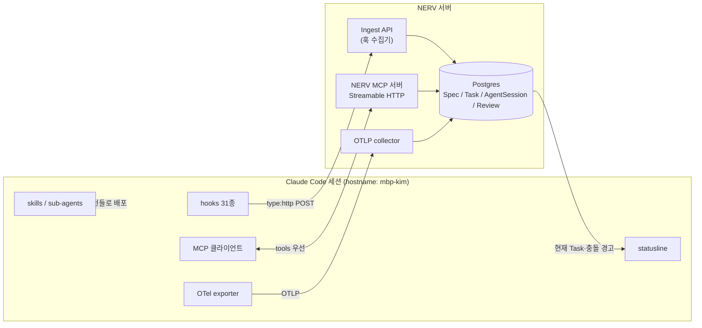

# Claude Code/Codex 연동 기술 — 표면 목록과 NERV 결선도

> **요약** — Claude Code는 훅 31종·MCP 클라이언트·스킬·서브에이전트·플러그인·헤드리스·Agent SDK·OTel까지 여덟 개의 공식 연동 표면을 열어두고 있고, 그중 `type:"http"` 훅 하나만으로 세션 전 생명주기를 래퍼 스크립트 없이 NERV(가칭) 수집 엔드포인트로 직접 POST할 수 있다. Codex도 MCP·훅(11종)·notify·OTel·비대화형 실행·AGENTS.md에서 거의 대칭이지만 **MCP의 resources·prompts·elicitation을 소비하지 못하고, 플러그인 마켓플레이스급 일괄 배포 체계가 없으며, cloud 태스크 생성 API가 문서화되어 있지 않다.** 이 격차가 D-05의 tools-first 설계를 강제한다 — 스펙 조회·클레임·리뷰 제출 같은 핵심 동작은 전부 MCP tools로 만들고 resources/prompts/elicitation/channels는 Claude 전용 향상으로만 얹는다. 수집은 훅(실시간 제어)과 OTel(정량 관측)의 이중 파이프라인으로 가되, 훅 페이로드의 `prompt_id`와 OTel 이벤트의 `prompt.id`가 같은 UUID라는 공식 조인 키가 있어 두 평면을 하나의 AgentSession으로 합칠 수 있다. 이 문서는 FR-15와 D-05의 1차 근거이며, 실제 도구 카탈로그·플러그인 구성·세션 시퀀스는 [3.4 에이전트 연동 설계](../03-proposal/agent-integration.md)로 이어진다.
>
> 문서 버전 v0.1 · 2026-08-13 · HTML 판: [integration-tech.html](../html/integration-tech.html)

---

## 1. 연동 관점의 Claude Code

### 1.1 여덟 개의 표면 — 한눈에 보는 지도

"에이전트를 플랫폼에 붙인다"는 말은 실제로는 **다섯 가지 서로 다른 일**이다: ① 세션이 무엇을 하는지 받아온다(수집) ② 에이전트에게 스펙·작업을 준다(공급) ③ 규칙과 절차를 배포한다(배포) ④ 사람 승인을 강제한다(게이트) ⑤ 누가 무엇에 접근하는지 통제한다(인증). Claude Code는 이 다섯 가지를 각각 담당하는 공식 표면을 이미 전부 갖고 있다.

| 표면 | 무엇인가 | 방향 | NERV 용도 |
| --- | --- | --- | --- |
| **Hooks (31종 이벤트)** | 수명주기 이벤트마다 셸/HTTP/MCP 툴/LLM/서브에이전트 핸들러 실행 | 수집 + 제어 | AgentSession 등록·종료, Activity 스트림, 클레임 scope 위반 실시간 차단, Stop 게이트(FR-07·FR-08·FR-10) |
| **MCP 클라이언트** | 원격/로컬 MCP 서버의 tools·resources·prompts 소비 | 공급 | `nerv_*` 도구로 스펙 조회·Task 클레임·리뷰 제출(FR-01·FR-05·FR-09) |
| **Skills (SKILL.md)** | 절차를 md 한 파일로 규격화, 자동/수동 트리거 | 배포 | NERV 워크플로(스펙 작성·구현·리뷰) 절차 배포. Codex와 **같은 파일** 재사용 |
| **Sub-agents** | 역할별 격리 실행 단위(`.claude/agents/*.md`) | 배포 + 수집 | 리뷰어·스펙 검증자 역할 배포, `SubagentStart/Stop`으로 역할별 활동 추적 |
| **Plugins + 마켓플레이스** | 스킬·에이전트·훅·`.mcp.json`을 한 번들로 묶어 git으로 배포 | 배포 | NERV 클라이언트 v1의 유일한 배포 단위. 관리형 settings로 조직 강제 활성화(FR-15) |
| **Headless (`claude -p`, stream-json)** | 비대화형 실행·재개·JSON 스트림 | 공급 + 수집 | 서버가 워커 세션을 기동/재개, `system/init`으로 "NERV 플러그인이 실제 로드됐는지" 검증 |
| **Agent SDK** | 에이전트 루프를 TS/Python 라이브러리로 임베드 | 공급 | 서버측 자동화(스펙 lint·일관성 검사·리뷰 봇). **과금은 API 키 체계로 분리 필수** |
| **OpenTelemetry(OTLP)** | 메트릭 8종 + 이벤트 13종+ 표준 스키마 | 수집(정량) | 조직 단위 비용·토큰·툴 사용 관측, 부서/팀 라벨링. 훅과 `prompt_id`로 조인 |

여기에 보조 표면으로 **statusline**(세션 메타데이터를 스크립트에 흘려주는 로컬 표면)이 있는데, 이것만 방향이 반대다 — 수집이 아니라 **표시**용 역채널이다.



- [Hooks reference — Claude Code Docs](https://code.claude.com/docs/en/hooks) — (확인일 2026-08-13) 31종 이벤트·공통 페이로드·핸들러 5종의 1차 출처.
- [Connect Claude Code to tools via MCP — Claude Code Docs](https://code.claude.com/docs/en/mcp) — (확인일 2026-08-13) 트랜스포트·스코프·인증·프리미티브 소비 방식.

### 1.2 Hooks — 수집의 1차 표면

Claude Code는 현재 **31개 훅 이벤트**를 제공한다. 세션·턴·툴·에이전트 전 계층이 덮여 있어, 별도 텔레메트리 SDK 없이도 "누가(hostname) 어떤 세션에서 무엇을 했는지"를 완결적으로 복원할 수 있다.

| 계층 | 이벤트 | NERV 용도 |
| --- | --- | --- |
| **세션 (4)** | `SessionStart`(matcher `startup\|resume\|clear\|compact\|fork`), `SessionEnd`(payload `reason`), `Setup`, `InstructionsLoaded` | AgentSession 생성/종료(FR-07). `cwd`·worktree·hostname 기록, `reason`으로 정상 종료와 비정상 종료 구분 → `stale` 오판 방지(D-13) |
| **턴 (4)** | `UserPromptSubmit`, `UserPromptExpansion`, `Stop`, `StopFailure` | Activity(`thought`/`response`) 스트림(FR-08). `Stop`에서 "해소된 리뷰 없음 → 종료 차단" 게이트 판정(FR-10) |
| **툴 (6)** | `PreToolUse`, `PostToolUse`, `PostToolUseFailure`, `PostToolBatch`, `PermissionRequest`, `PermissionDenied` | Activity(`action`) 기록. `tool_input.file_path`를 Claim의 `file_globs`와 대조해 **scope 이탈 실시간 경고/차단**(FR-06), Evidence 자동 수집(FR-13) |
| **에이전트 (5)** | `SubagentStart`, `SubagentStop`(payload `agent_id`/`agent_type`), `TeammateIdle`, `TaskCreated`, `TaskCompleted` | 역할별 서브에이전트 활동 대시보드화, `TaskCreated`/`TaskCompleted` 거부로 "ready 아닌 작업 착수" 차단 |
| **기타 (12)** | `Notification`, `PreCompact`, `PostCompact`, `FileChanged`, `CwdChanged`, `DirectoryAdded`, `ConfigChange`, `WorktreeCreate`, `WorktreeRemove`, `Elicitation`, `ElicitationResult`, `MessageDisplay` | `Elicitation*` → Question 로그, `WorktreeCreate/Remove`·`CwdChanged` → 격리 단위 추적, `ConfigChange` → 감사 로그(FR-16) |

#### 공통 입력 페이로드

모든 훅은 stdin으로 JSON을 받는다. 공통 필드는 `session_id`, `prompt_id`(v2.1.196+, OTel의 `prompt.id`와 동일 UUID), `transcript_path`, `cwd`, `permission_mode`, `effort.level`, `hook_event_name`이고, 툴 이벤트는 `tool_name`·`tool_input`·`tool_use_id`가, 서브에이전트 이벤트는 `agent_id`·`agent_type`이 추가된다.

```json
{
  "hook_event_name": "PostToolUse",
  "session_id": "b4f2c0de-9a71-4e55-9b3a-2e0a1c77d001",
  "prompt_id": "0f9c1a44-3d2e-4c88-9a10-77bf6d2c3311",
  "transcript_path": "/Users/kim/.claude/projects/nerv/b4f2c0de.jsonl",
  "cwd": "/Volumes/project/private/clemvion/.claude/worktrees/spec-editor",
  "permission_mode": "acceptEdits",
  "effort": { "level": "high" },
  "tool_name": "Edit",
  "tool_input": { "file_path": "apps/web/src/spec/editor.tsx" },
  "tool_use_id": "toolu_013jW8Qk2Zr9"
}
```

**hostname은 페이로드에 없다.** 공식 필드가 아니므로 `command` 핸들러라면 래퍼에서 `$(hostname)`을 덧붙이고, `type:"http"` 핸들러라면 헤더(예: `X-NERV-Host`)로 실어 보낸다. 멀티호스트 식별(P8·FR-07)의 유일한 출처이므로 클라이언트 설정 단계에서 반드시 고정한다.

#### 제어: exit code와 JSON 출력

- **exit 0** — 성공. stdout의 JSON이 구조화 결정으로 해석되고, `UserPromptSubmit`/`SessionStart` 등에서는 stdout이 Claude 컨텍스트로 주입된다.
- **exit 2** — 차단 가능 이벤트에서 해당 동작을 막고 stderr를 모델에 전달한다. 차단 가능: `PreToolUse`(툴 차단), `UserPromptSubmit`(프롬프트 거부), `Stop`(종료 방지), `PermissionRequest`(거부), `TaskCreated`/`TaskCompleted`, `PreCompact`, `PostToolBatch`. `PostToolUse` 같은 관찰 전용 이벤트에서는 되돌릴 수 없고 stderr만 노출된다.
- **JSON 출력** — `continue:false`+`stopReason`(전체 중단), `systemMessage`, `decision`, `hookSpecificOutput.permissionDecision`(`allow|deny|escalate`), `additionalContext`(모델 컨텍스트 주입).

> **D-14 — 게이트는 fail-open + 관측 + 격상, 진실은 서버 산출물.** `type:"http"` 훅은 요청/응답 쌍이므로 **NERV 서버가 응답 JSON으로 게이트 판정을 되돌려줄 수 있다.** `Stop` 훅 응답에 `{"decision":"block","reason":"…"}`를 실으면 "해소된 리뷰가 없으면 턴을 끝낼 수 없다"가 서버 SQL 한 방으로 강제된다. 반대로 NERV가 응답하지 못하면(타임아웃·5xx) 훅은 통과시키되 연속 실패를 카운트해 격상한다 — 이것이 clemvion에서 5개월 검증된 fail-open 패턴의 서버 이식이다.

`additionalContext`도 못지않게 중요하다. `SessionStart` 응답으로 "지금 이 사용자가 클레임한 Task, 관련 SpecVersion 요약, 겹치는 scope 경고"를 주입하면 에이전트는 첫 프롬프트부터 플랫폼 상태를 알고 시작한다.

#### 핸들러 5종과 설정 위치

| 핸들러 | 동작 | NERV 용도 |
| --- | --- | --- |
| `command` | 셸 명령 실행(stdin JSON) | 로컬 전처리가 필요할 때(hostname·git 정보 덧붙이기), Codex와 공통 스크립트 재사용 |
| **`http`** | **지정 URL로 이벤트 JSON POST, 응답 JSON 해석. 헤더/Authorization 지정 가능** | **NERV 기본 경로.** 래퍼 스크립트 0개로 수집 + 서버 게이트 판정 회수 |
| `mcp_tool` | 연결된 MCP 서버의 툴을 훅으로 호출(`${tool_input.file_path}` 치환) | `nerv_session_event`를 훅으로 직접 호출하는 대안 경로(인증을 MCP 세션과 공유) |
| `prompt` | 단발 LLM 평가 | 스펙 규약 위반 같은 판단형 검사(비용 주의) |
| `agent` | 검증용 서브에이전트 실행 | 로컬 사전 검증(리뷰 제출 전 자체 점검) |

설정은 `~/.claude/settings.json`(유저) · `.claude/settings.json`(프로젝트, 커밋 공유) · `.claude/settings.local.json` · 관리형 설정 · 플러그인 `hooks/hooks.json` · 스킬/에이전트 frontmatter에 둘 수 있다. matcher는 정확일치·`|` 목록·정규식이며 툴 이벤트는 `if: "Bash(rm *)"` 권한 규칙 문법으로 추가 필터링한다. `async`/`asyncRewake`로 비동기 실행도 가능하다 — 수집 전용 이벤트는 비동기로 돌려 세션 지연을 0에 가깝게 만든다.

```json
{
  "hooks": {
    "SessionStart": [
      { "matcher": "startup|resume|fork",
        "hooks": [{
          "type": "http",
          "url": "https://nerv.example.com/ingest/claude/hook",
          "headers": {
            "Authorization": "Bearer ${NERV_TOKEN}",
            "X-NERV-Host": "mbp-kim",
            "X-NERV-Project": "clemvion"
          }
        }] }
    ],
    "PostToolUse": [
      { "matcher": "Write|Edit|MultiEdit",
        "hooks": [{ "type": "http", "url": "https://nerv.example.com/ingest/claude/hook", "async": true }] }
    ],
    "Stop": [
      { "hooks": [{ "type": "http", "url": "https://nerv.example.com/ingest/claude/gate" }] }
    ],
    "SessionEnd": [
      { "hooks": [{ "type": "http", "url": "https://nerv.example.com/ingest/claude/hook" }] }
    ]
  }
}
```

> **주의.** 위 예시의 키(`type`·`url`·`headers`·`matcher`·`async`)는 공식 문서에서 확인한 것이지만, `${NERV_TOKEN}` 형태의 환경변수 확장은 `.mcp.json`에 대해서만 명시적으로 문서화되어 있다. 훅 헤더의 토큰 주입 방식(환경변수 확장 vs 관리형 설정 고정값)은 플러그인 v1 구현 시 실측 확인 항목이다.

조직 통제 측면에서는 `allowedHttpHookUrls` 설정으로 **HTTP 훅이 POST할 수 있는 URL을 허용목록으로 제한**할 수 있다. NERV 엔드포인트만 열어두면 훅이 임의 외부로 세션 데이터를 유출하는 경로를 원천 차단한다(NFR-03).

### 1.3 MCP 클라이언트 — 스펙·작업 공급 표면

트랜스포트는 stdio(로컬), **HTTP(권장, `streamable-http` 별칭 허용)**, SSE(deprecated), WebSocket(`type:"ws"`, JSON 설정 전용·OAuth 불가)이다. 스코프는 local(`~/.claude.json`, 프로젝트별) · project(`.mcp.json`, 커밋 공유) · user(전역) 3종이고 우선순위는 local > project > user > plugin > claude.ai 커넥터다. `.mcp.json`은 `command/args/env/url/headers`에서 `${VAR}`/`${VAR:-default}` 확장을 지원한다.

```json
{
  "mcpServers": {
    "nerv": {
      "type": "http",
      "url": "https://nerv.example.com/mcp",
      "headers": { "Authorization": "Bearer ${NERV_TOKEN}" }
    }
  }
}
```

| 기능 | 내용 | NERV 용도 |
| --- | --- | --- |
| tools | `tools/list`·`tools/call` | `nerv_task_claim`·`nerv_spec_get` 등 **모든 핵심 동작**(Codex 호환의 유일한 공통분모) |
| resources | `@server:protocol://path` 멘션으로 프롬프트 첨부 | `nerv://spec/{project}/{id}` 로 승인된 SpecVersion 첨부 — Claude 전용 향상 |
| prompts | `/mcp__nerv__<prompt>` 슬래시 명령 | "스펙 리뷰 시작" 같은 정형 워크플로 — Claude 전용 향상 |
| elicitation | 서버가 mid-task로 구조화 입력(form)·URL 승인을 요청, `Elicitation` 훅으로 자동 응답 가능 | 클레임 충돌 시 "어느 Task로 갈지" 즉시 질의 — Claude 전용 향상 |
| tool search | 툴 정의 기본 지연 로딩(서버 `instructions` 2KB가 검색 힌트), `alwaysLoad:true` 또는 툴별 `_meta["anthropic/alwaysLoad"]` | `nerv_bootstrap`·`nerv_task_next`만 상시 로딩, 나머지는 지연 |
| 출력 한도 | 기본 25,000 토큰(`MAX_MCP_OUTPUT_TOKENS`), 툴별 `_meta["anthropic/maxResultSizeChars"]`(최대 50만자) | 스펙 트리·리뷰 목록 응답에 페이지네이션 강제 |
| `requiresUserInteraction` | `_meta["anthropic/requiresUserInteraction"]: true` 툴은 **모든 permission 모드에서 매 호출 사람 승인 강제**(v2.1.199+) | 스펙 승인 제출·게이트 면제 같은 되돌리기 어려운 도구에 지정(D-06) |
| channels | 서버가 `claude/channel` capability 선언 + `--channels`로 활성화 시 **서버→세션 메시지 push** | 승인 결과·충돌 발생을 대기 없이 세션에 통지 — Claude 전용 향상 |

인증은 401/403 시 `/mcp` 또는 `claude mcp login <name>`(v2.1.186+)으로 브라우저 OAuth를 수행하며 **Dynamic Client Registration + CIMD 자동 발견**을 지원한다. 미지원 서버는 `--client-id/--client-secret/--callback-port`로 사전 등록 자격증명을 쓴다(secret은 macOS 키체인). `oauth.scopes`로 스코프 고정, `authServerMetadataUrl`로 발견 체인 오버라이드가 가능하고, OAuth 대신 `headers`(정적 Bearer) 또는 `headersHelper`(연결 시마다 셸로 동적 헤더 생성, 401/403 시 자동 재실행)도 공식 경로다. 비대화형(`claude -p`)에서는 OAuth 플로우를 띄울 수 없으므로 **사전 로그인이 필수**다 — CI·서버 워커 설계의 제약 조건이다.

조직 통제는 `managed-mcp.json` + `allowedMcpServers`/`deniedMcpServers`로 한다.

### 1.4 Skills — 절차의 배포 포맷

스킬은 `<name>/SKILL.md` 디렉터리이며 커스텀 커맨드와 통합된다. 위치는 Enterprise(관리형)/Personal(`~/.claude/skills/`)/Project(`.claude/skills/`)/Plugin(`<plugin>/skills/`, `/plugin:skill` 네임스페이스)이다.

| frontmatter | NERV 용도 |
| --- | --- |
| `name`·`description`(+`when_to_use`, 합계 1,536자에서 잘림) | 자동 트리거 문구. "스펙 작성/구현 착수/리뷰 제출" 상황 매칭 |
| `allowed-tools` / `disallowed-tools` | 해당 턴 동안 `nerv_*` 툴 무승인 허용 — 마찰 없는 상태 보고 |
| `context: fork` + `agent` + `background` | 리뷰 제출 같은 무거운 절차를 서브에이전트로 격리 실행 |
| `hooks` | 스킬 수명 동안만 유효한 훅 — 예: `/nerv:impl` 중에만 scope 검사 강화 |
| `paths` | 글롭 매칭 시에만 자동 로드 — 스펙 디렉터리 편집 시 스펙 규약 스킬 자동 로드 |
| `disable-model-invocation` / `user-invocable:false` | 사람 전용 명령과 에이전트 전용 절차 구분 |

본문에서는 `$ARGUMENTS`/`$0`/`$name`, `${CLAUDE_SESSION_ID}`, `${CLAUDE_PROJECT_DIR}`, `${CLAUDE_PLUGIN_ROOT}` 치환과 `` !`cmd` `` 사전 셸 실행(동적 컨텍스트 주입)이 지원된다. `${CLAUDE_SESSION_ID}`는 NERV의 AgentSession 키와 직접 대응하므로, 스킬 본문에서 세션 ID를 그대로 도구 인자로 넘길 수 있다.

**SKILL.md는 Anthropic이 만든 뒤 오픈 표준으로 공개되어 Claude Code·Claude·ChatGPT/Codex·Cursor·Copilot·VS Code·Gemini CLI·Goose·OpenHands 등 40여 개 도구가 지원한다.** NERV의 절차 배포 포맷을 스킬로 잡으면 **한 파일로 양쪽 에이전트에 배포**된다 — 이 문서에서 가장 실용적인 발견 중 하나다.

- [Extend Claude with skills — Claude Code Docs](https://code.claude.com/docs/en/skills) — (확인일 2026-08-13) SKILL.md frontmatter 전 필드와 로딩 위치(Enterprise/Personal/Project/Plugin).
- [Agent Skills 오픈 표준 (agentskills.io)](https://agentskills.io/) — (확인일 2026-08-13) SKILL.md 포맷의 40여 개 도구 지원.

### 1.5 Sub-agents — 역할 실행 단위

`.claude/agents/*.md`(프로젝트) · `~/.claude/agents/`(유저) · 플러그인 `agents/`의 YAML frontmatter + 시스템 프롬프트. 필수 필드는 `name`(훅의 `agent_type`으로 전달)·`description`, 선택 필드는 `tools`·`model`·`isolation: worktree` 등이다. **플러그인으로 배포할 때 `hooks`/`mcpServers`/`permissionMode` frontmatter는 보안상 무시된다** — 서브에이전트로 권한을 몰래 확대할 수 없다는 뜻이며, D-08의 "권한 상속, 절대 비확대" 원칙과 정확히 같은 방향이다.

추적 경로는 `SubagentStart`/`SubagentStop` 훅(`agent_id`·`agent_type`)과 stream-json의 `parent_tool_use_id`다. NERV는 이것으로 "박개발의 세션 안에서 `spec-reviewer` 서브에이전트가 12분간 돌았다"를 Activity 트리로 복원한다.

- [Create custom subagents — Claude Code Docs](https://code.claude.com/docs/en/sub-agents) — (확인일 2026-08-13) 서브에이전트 정의 필드와 플러그인 배포 시 `hooks`/`mcpServers`/`permissionMode` 무시 동작.

### 1.6 Plugins & 마켓플레이스 — 하네스 일괄 배포 채널

플러그인은 `.claude-plugin/plugin.json` 매니페스트 + 구성요소 디렉터리다.

| 구성요소 | NERV 플러그인에 담을 것 |
| --- | --- |
| `skills/` | `/nerv:next` `/nerv:spec` `/nerv:impl` `/nerv:review` `/nerv:question` |
| `agents/` | 스펙 검증자·리뷰어 서브에이전트 |
| `hooks/hooks.json` | SessionStart/PostToolUse/Stop/SessionEnd `type:"http"` 훅 일괄 |
| `.mcp.json` | NERV MCP 서버 주소·인증 동봉 |
| `monitors/` | 백그라운드 모니터(명령 stdout 각 줄이 Claude 알림으로 전달) — 승인 결과 폴링 표시 |
| `settings.json` | 플러그인 기본 설정 |
| `bin/` | PATH에 추가되는 보조 CLI |

배포는 git 저장소의 `.claude-plugin/marketplace.json`을 `/plugin marketplace add owner/repo`로 등록한 뒤 `/plugin install name@marketplace`. 로컬 테스트는 `--plugin-dir`(zip 허용)·`--plugin-url`(CI 아티팩트), 반영은 `/reload-plugins`.

설정 우선순위는 **관리형(macOS `/Library/Application Support/ClaudeCode/managed-settings.json`, Linux `/etc/claude-code/managed-settings.json`) > CLI 인자 > `.claude/settings.local.json` > `.claude/settings.json` > `~/.claude/settings.json`**이다. 즉 조직은 관리형 설정 하나로 OTel 활성화 + 마켓플레이스 등록 + 플러그인 강제 설치 + 훅 URL 허용목록을 무조작 배포할 수 있다.

```json
{
  "env": {
    "CLAUDE_CODE_ENABLE_TELEMETRY": "1",
    "OTEL_METRICS_EXPORTER": "otlp",
    "OTEL_LOGS_EXPORTER": "otlp",
    "OTEL_EXPORTER_OTLP_ENDPOINT": "https://otel.nerv.example.com",
    "OTEL_RESOURCE_ATTRIBUTES": "department=eng,team.id=platform"
  },
  "allowedHttpHookUrls": ["https://nerv.example.com/ingest/claude/hook"],
  "extraKnownMarketplaces": { "nerv": "git.example.com/nerv/plugins" },
  "enabledPlugins": { "nerv@nerv": true },
  "strictKnownMarketplaces": true,
  "otelHeadersHelper": "/usr/local/bin/nerv-otel-headers"
}
```

> **주의.** 위 키 이름은 모두 공식 settings 문서에서 확인한 것이지만 `extraKnownMarketplaces`/`enabledPlugins`의 값 스키마(문자열 vs 객체)는 문서에서 형태까지 확인하지 못했다. 플러그인 v1 구현 시 확정한다.

- [Create plugins — Claude Code Docs](https://code.claude.com/docs/en/plugins) — (확인일 2026-08-13) 플러그인 구성요소와 마켓플레이스 배포 절차.
- [Settings — Claude Code Docs](https://code.claude.com/docs/en/settings) — (확인일 2026-08-13) 설정 우선순위와 `allowedHttpHookUrls`·`extraKnownMarketplaces`·`enabledPlugins`·`otelHeadersHelper`.

### 1.7 Headless와 Agent SDK — 프로그래매틱 구동

`claude -p "prompt"`는 비대화형 실행이며 `--output-format text|json|stream-json`(+`--include-partial-messages`), `--json-schema`(구조화 출력), `--continue`/`--resume <session_id>`(v2.1.223+ 어느 디렉터리에서든 ID로 재개), `--allowedTools`/`--permission-mode`/`--permission-prompt-tool`, `--mcp-config`, `--bare`(훅·플러그인·CLAUDE.md 미로딩), `--append-system-prompt`를 지원한다.

stream-json의 **`system/init` 이벤트가 세션 메타데이터**(model, tools, `mcp_servers[{name,status}]`, `mcp_server_errors`, `plugins`, `plugin_errors`, `capabilities`)를 준다. NERV 관점에서 이건 단순 로그가 아니라 **컴플라이언스 검사 지점**이다 — "이 세션에 NERV MCP와 플러그인이 실제로 로드됐는가"를 CI/부트스트랩에서 기계적으로 검증할 수 있다(FR-15). JSON 결과에는 `session_id`·`total_cost_usd`가 포함되고, SIGTERM 종료 시에도 `SessionEnd` 훅이 실행되며 exit 143이다 — **강제 종료도 세션 종료로 정확히 기록된다**.

Agent SDK는 같은 루프를 라이브러리로 제공한다(TypeScript `@anthropic-ai/claude-agent-sdk`, Python `claude-agent-sdk`). 내장 툴·훅·서브에이전트·MCP 연결(및 `createSdkMcpServer`+`tool()` 인프로세스 커스텀 툴)·권한 콜백(`canUseTool`)·세션 유지/재개/포크·`.claude/` 스킬 로딩을 쓸 수 있다. 단 **서드파티 제품에 claude.ai 구독 로그인을 제공하는 것은 금지되고 API 키 인증이 필수**다 — NERV 서버측 자동화(스펙 lint, 일관성 검사 봇)는 조직 API 키 과금 체계로 분리해 설계해야 한다.

- [Run Claude Code programmatically (headless) — Claude Code Docs](https://code.claude.com/docs/en/headless) — (확인일 2026-08-13) stream-json `system/init` 메타데이터·`--resume`·SIGTERM 시 `SessionEnd` 실행.
- [Agent SDK overview — Claude Code Docs](https://code.claude.com/docs/en/agent-sdk/overview) — (확인일 2026-08-13) 라이브러리 기능과 API 키 인증 요건.

### 1.8 OpenTelemetry — 조직 단위 정량 관측

`CLAUDE_CODE_ENABLE_TELEMETRY=1` + `OTEL_METRICS_EXPORTER`/`OTEL_LOGS_EXPORTER`(otlp|prometheus|console) + `OTEL_EXPORTER_OTLP_ENDPOINT`로 활성화하고, 관리형 설정의 `env`로 조직 전체에 강제할 수 있다.

| 종류 | 항목 | NERV 용도 |
| --- | --- | --- |
| 메트릭 8종 | `session.count`(start_type: fresh/resume/continue/agents_view), `lines_of_code.count`, `pull_request.count`, `commit.count`, `cost.usage`, `token.usage`, `code_edit_tool.decision`, `active_time.total` | 프로젝트·팀별 비용/산출 대시보드, 로드맵의 성공 지표 계측 |
| 이벤트(로그) | `user_prompt`, `assistant_response`, `tool_result`(tool_name·success·duration_ms·decision_source), `api_request`(model·cost_usd·tokens + `agent.name`/`skill.name`/`plugin.name`/`mcp_server.name`/`mcp_tool.name` 귀속), `api_error`, `api_refusal`, `tool_decision`, `permission_mode_changed`, `auth`, `mcp_server_connection`, `plugin_installed`/`plugin_loaded`, `skill_activated`, `internal_error` | **NERV 스킬·플러그인·MCP 툴의 실제 사용률 측정**(규약이 지켜지는지의 정량 근거), 연동 장애(`mcp_server_connection`) 조기 감지 |
| 표준 속성 | `session.id`·`prompt.id`·`organization.id`·`user.account_uuid`·`user.email`·`terminal.type`, `OTEL_RESOURCE_ATTRIBUTES`로 커스텀 태깅 | 훅 데이터와의 조인 키, 부서/팀 라벨 |

민감정보는 기본 마스킹되고 `OTEL_LOG_USER_PROMPTS=1`·`OTEL_LOG_TOOL_DETAILS=1` 등으로 opt-in한다(NFR-03의 기본값). `otelHeadersHelper`로 동적 인증 헤더를 붙일 수 있고, 베타 트레이싱은 `claude_code.interaction → llm_request/tool/hook` 스팬 계층을 제공한다.

### 1.9 statusline과 클라우드 세션 — 보조 표면과 사각지대

**statusline**은 `settings.json`의 `statusLine: {type:"command", command:"..."}`로 스크립트를 실행하고 stdin으로 세션 JSON을 받는다(`session_id`, `prompt_id`, `model.*`, `workspace.*`, `cost.*`, `context_window.used_percentage`, `rate_limits.*`, `agent.name`, `pr.number/url/review_state`, `worktree.*`). NERV에는 **역채널**로 쓴다 — 서버가 계산한 "현재 클레임한 Task / 리스 잔여 / 겹침 경고"를 개발자 터미널에 상시 표시.

**Claude Code on the web**은 Anthropic 관리 VM에서 세션을 돌린다(research preview). `claude --cloud "task"`로 생성, `claude -p "msg" --cloud <session-id>`로 실행 중 세션에 메시지 큐잉, `--teleport <session-id>`로 로컬 회수가 가능하다. 문제는 **로컬 훅을 심을 수 없다**는 점이다(저장소 커밋 settings·환경변수로 일부만 커버). NERV의 세션 레지스트리는 로컬 CLI 세션과 클라우드 세션을 **구분 취급**해야 하며, 클라우드 세션은 git forge 이벤트와 사용자 자기보고에 의존하는 저해상도 추적이 된다(D-14의 "자기보고 vs 산출물 분리 검증"이 여기서 특히 중요하다).

- [Monitoring / OpenTelemetry — Claude Code Docs](https://code.claude.com/docs/en/monitoring-usage) — (확인일 2026-08-13) 메트릭 8종·이벤트 13종+·표준 속성·마스킹 기본값.
- [Status line — Claude Code Docs](https://code.claude.com/docs/en/statusline) — (확인일 2026-08-13) 세션 JSON 필드 목록.
- [Claude Code on the web — Claude Code Docs](https://code.claude.com/docs/en/claude-code-on-the-web) — (확인일 2026-08-13) 관리형 VM·`--cloud`·`--teleport`, 로컬 훅 미적용 사각지대.

---

## 2. MCP 프로토콜 — 무엇을 어떤 프리미티브로 줄 것인가

### 2.1 프리미티브와 "누가 결정하나"

MCP는 JSON-RPC 2.0 기반이며 서버 기능을 **Tools(모델 제어)** · **Resources(앱 제어)** · **Prompts(사용자 제어)** 로 나누고, 클라이언트 기능으로 **Elicitation**(서버발 사용자 입력 요청)을 명시한다. 옵션 확장으로 **Tasks**(장기 실행 비동기), **Skills over MCP**, **MCP Apps**(인라인 UI)가 있다.

| 프리미티브 | 제어 주체 | NERV 매핑 | Codex 소비 |
| --- | --- | --- | --- |
| Tools | 모델 | `nerv_bootstrap`, `nerv_spec_search/get/tree`, `nerv_task_next/claim/heartbeat/update/release`, `nerv_review_submit`, `nerv_finding_resolve`, `nerv_question_create`, `nerv_session_event` | **가능** |
| Resources | 앱 | `nerv://spec/{project}/{id}` 승인된 SpecVersion 본문, 리소스 템플릿·자동완성 | **불가** |
| Prompts | 사용자 | `/mcp__nerv__spec_review` 같은 정형 워크플로 슬래시 명령 | **불가** |
| Elicitation | 클라이언트 | 클레임 충돌·모호한 요구사항의 즉시 질의 | **불가** |
| Tasks(확장) | 서버 | 사람 승인 대기 게이트를 `input_required` 상태로 모델링 | 미확인 |

MCP Tasks 확장은 특히 흥미롭다. 서버가 즉시 결과 대신 `CreateTaskResult`(taskId, status, TTL, pollInterval)를 돌려주고, 클라이언트가 `tasks/get` 폴링·`tasks/update`(mid-flight 입력)·`tasks/cancel`을 쓴다. 상태는 `working|input_required|completed|failed|cancelled`다. **"스펙 승인 대기"를 `input_required`로 모델링하면 에이전트가 끊겼다 재접속해도 taskId로 승인 결과를 회수**할 수 있다 — awaiting_input 세션 상태(D-13)의 프로토콜 대응물이다. 다만 클라이언트 지원 여부는 별도 확인이 필요하므로, MVP는 "웹 UI 승인 + 폴링 툴"로 가고 Tasks는 Phase 2 이후 검토 대상으로 둔다.

### 2.2 Streamable HTTP 리비전 변화 — 2026-07-28의 무세션화

표준 트랜스포트는 stdio와 Streamable HTTP(단일 MCP 엔드포인트에 요청당 POST, 응답은 JSON 또는 요청 스코프 SSE 스트림)다. **2026-07-28 리비전에는 파괴적 변경이 있다.**

| 항목 | 구 리비전 (2025-03-26 ~ 2025-11-25) | 신 리비전 (2026-07-28) | NERV 대응 |
| --- | --- | --- | --- |
| 프로토콜 세션 | `Mcp-Session-Id` 헤더로 세션 유지 | **제거** — 요청별 capability 협상(stateless) | 세션 상태를 프로토콜이 아니라 **OAuth 토큰 + NERV DB**에 결부 |
| 서버→클라이언트 스트림 | GET 스트림 엔드포인트 | **제거** | 알림은 `subscriptions/listen` 응답 스트림으로 수신 |
| 재개 | `Last-Event-ID` 재개 | **제거** | 재접속 시 NERV 측 커서(마지막 Event id)로 재동기화 |
| 서버발 상호작용 | 별도 요청(sampling/elicitation/roots) | MRTR(SEP-2322)의 `InputRequiredResult` → 재시도 | 질문/승인은 도구 재호출 규약으로 설계 |
| 필수 헤더 | — | `MCP-Protocol-Version` 필수 + `Mcp-Method`/`Mcp-Name` 미러 헤더(불일치 시 400 `HeaderMismatch`) | 게이트웨이에서 헤더 검증·로깅 |
| 보안 | — | Origin 검증·localhost 바인딩 필수 | 리버스 프록시 규칙에 반영 |

> **D-11 — 기술 스택(제안).** NERV MCP 서버는 **2026-07-28 리비전 기준으로 구현하되 구 리비전(Mcp-Session-Id 시대)도 당분간 함께 서빙**한다. 현재 배포된 Claude Code·Codex 클라이언트가 어떤 리비전을 협상할지는 버전마다 다르고, 우리가 통제할 수 없다. 핵심 원칙은 하나다 — **세션 상태를 프로토콜 세션에 의존시키지 않는다.** 클레임·리스·하트비트는 전부 NERV DB의 AgentSession에 붙어 있으므로 트랜스포트가 무상태로 바뀌어도 영향이 없다.

### 2.3 OAuth 2.1 — 인증 평면

MCP 서버는 OAuth 2.1 리소스 서버로서 **RFC 9728 Protected Resource Metadata 구현이 필수**이고, 인증 서버는 RFC 8414 또는 OIDC Discovery 중 하나가 필수(클라이언트는 둘 다 지원 필수)다. 클라이언트 등록은 **CIMD(Client ID Metadata Documents) 권장(SHOULD)** 이며 **DCR(RFC 7591)은 하위호환용으로 격하(deprecated)** 됐다. 그 밖에 RFC 8707 resource 파라미터 필수(토큰 audience 바인딩), `WWW-Authenticate` scope 챌린지와 403 `insufficient_scope` step-up, RFC 9207 iss 검증, Bearer 헤더 필수·쿼리스트링 금지.

- **정식 경로**: NERV IdP가 PRM(9728) + AS metadata(8414) + CIMD + PKCE + resource indicator를 구현하면 Claude Code(`/mcp`, `claude mcp login`)와 Codex(`codex mcp login`) 양쪽에서 무설정 로그인이 된다.
- **저비용 대안(MVP)**: Claude는 `headers`(정적 Bearer)/`headersHelper`(동적), Codex는 `bearer_token_env_var`/`http_headers`로 NERV 발급 PAT를 주입한다. D-08의 "토큰은 사용자별 발급, 프로젝트 스코프" 원칙은 두 경로 모두에서 지켜진다.

스코프 설계는 D-08(권한 상속, 절대 비확대)을 따른다 — 에이전트 토큰은 위임한 사람의 권한을 넘을 수 없고, 403 step-up 챌린지로 부족한 권한을 사후 요구하는 흐름은 "사람에게 물어보라"는 신호로 사용한다.

### 2.4 Skills over MCP — 중기 관전 포인트

Skills over MCP 워킹그룹(2026-02 IG 결성 → 2026-04-16 WG 전환)은 스킬을 MCP로 발견·배포·소비하는 표준화를 진행 중이며, 현재 방향은 **SEP-2640 Skills Extension(Resources 기반, Extensions Track, In Review)** 이다. 성사되면 NERV는 플러그인 zip 배포 외에 **"MCP 서버가 스킬을 직접 서빙"** 하는 경로를 갖게 된다. 지금 할 일은 하나다 — 스킬 저장소를 나중에 resources로도 노출할 수 있게 **DB에 스킬 본문을 두고 파일로 내보내는 구조**를 잡아두는 것.

- [MCP Specification (latest = 2026-07-28)](https://modelcontextprotocol.io/specification/latest) — (확인일 2026-08-13) 프리미티브 3종 + elicitation, 옵션 확장 목록.
- [Transports / Streamable HTTP (2026-07-28)](https://modelcontextprotocol.io/specification/2026-07-28/basic/transports/streamable-http) — (확인일 2026-08-13) 세션·GET 스트림·Last-Event-ID 제거와 하위호환 절차.
- [Authorization (OAuth 2.1, 2026-07-28)](https://modelcontextprotocol.io/specification/2026-07-28/basic/authorization) — (확인일 2026-08-13) PRM 9728 필수, CIMD 권장·DCR 격하, 8707 resource 바인딩.
- [MCP server concepts](https://modelcontextprotocol.io/docs/learn/server-concepts) — (확인일 2026-08-13) 프리미티브별 제어 주체 구분과 리소스 템플릿.
- [MCP Tasks extension](https://modelcontextprotocol.io/extensions/tasks/overview) — (확인일 2026-08-13) `input_required` 상태와 폴링·취소 규약.
- [Skills over MCP Working Group](https://modelcontextprotocol.io/community/working-groups/skills-over-mcp) — (확인일 2026-08-13) SEP-2640 Skills Extension(Extensions Track, In Review) 진행 상황.

---

## 3. Codex — 대칭 표면과 세 가지 결정적 격차

### 3.1 설정: `config.toml`

Codex는 `~/.codex/config.toml`(전역) 또는 **신뢰된** 프로젝트의 `.codex/config.toml`에 `[mcp_servers.<name>]` 테이블로 MCP를 설정한다. stdio는 `command/args/env/cwd`, 원격은 `url` + `bearer_token_env_var`·`http_headers`(Streamable HTTP). CLI는 `codex mcp add/list/login`, OAuth 로그인은 `mcp_oauth_callback_port`로 콜백 포트를 고정할 수 있고, 툴 allow/deny 목록·승인 모드·타임아웃도 지원한다.

```toml
# <repo>/.codex/config.toml  — 저장소 온보딩으로 배포
[mcp_servers.nerv]
url = "https://nerv.example.com/mcp"
bearer_token_env_var = "NERV_TOKEN"
http_headers = { "X-NERV-Project" = "clemvion" }

# 턴 완료 알림을 NERV 웹훅으로 (agent-turn-complete 등)
notify = ["/usr/local/bin/nerv-notify"]

[otel]
exporter = "otlp-http"
environment = "prod"
log_user_prompt = false
```

### 3.2 hooks 11종 — 같은 계열, 좁은 표면

Codex도 수명주기 훅을 지원한다(2026년 상반기 추가). 이벤트는 세션 수준 `SessionStart`/`SessionEnd`/`SubagentStart`, 턴 수준 `PreToolUse`/`PermissionRequest`/`PostToolUse`/`PreCompact`/`PostCompact`/`UserPromptSubmit`/`SubagentStop`/`Stop` — **총 11종**이다. 공통 페이로드는 `session_id`, `hook_event_name`, `transcript_path`, `cwd`, `model`이고 턴 스코프에서는 `turn_id`·`permission_mode`가 붙는다. 차단은 exit 2 + stderr 또는 JSON `{"decision":"block","reason":...}`이며 **`PreToolUse`가 사실상 유일한 실질 차단 이벤트**다(PostToolUse는 결과 대체).

설정 위치는 `~/.codex/hooks.json`·`~/.codex/config.toml [hooks]`(유저), `<repo>/.codex/hooks.json`(프로젝트, 신뢰 필요), 플러그인 매니페스트, 관리형(MDM/`requirements.toml`)이며 **비관리형 훅은 `/hooks`로 검토·승인해야 활성화**된다.

문서상 Codex 훅 핸들러는 command 중심이므로 `type:"http"` 같은 직결 경로가 없다. NERV는 얇은 포워더 스크립트를 플러그인/온보딩에 동봉한다.

```bash
#!/usr/bin/env bash
# .codex/hooks/nerv-forward.sh — Codex 훅 → NERV Ingest 포워더
# Claude Code의 type:"http" 핸들러에 대응하는 최소 래퍼. 실패해도 세션을 막지 않는다(fail-open, D-14).
set -uo pipefail
payload="$(cat)"
enriched="$(printf '%s' "$payload" | jq -c --arg host "$(hostname)" --arg agent "codex" \
  '. + {hostname: $host, agent_kind: $agent}')"

curl -sS -X POST "${NERV_INGEST_URL}/codex/hook" \
  -H "Authorization: Bearer ${NERV_TOKEN}" \
  -H "Content-Type: application/json" \
  --max-time 3 \
  -d "$enriched" >/dev/null || true   # 타임아웃/장애 시 통과 + 서버가 결측을 카운트
exit 0
```

### 3.3 notify와 OTel

`notify = ["program"]`은 지원 이벤트(예: `agent-turn-complete`) 발생 시 외부 프로그램을 호출하며 JSON으로 `type`, `thread-id`, `turn-id`, `cwd`, `input-messages`, `last-assistant-message`를 전달한다.

```json
{
  "type": "agent-turn-complete",
  "thread-id": "01J9…",
  "turn-id": "01J9…",
  "cwd": "/Volumes/project/private/clemvion",
  "input-messages": ["TASK-138 구현 계속"],
  "last-assistant-message": "리뷰 제출 완료. 3건 warning."
}
```

`[otel]` 섹션(`exporter = "otlp-http"|"otlp-grpc"|"none"`, `environment`, `log_user_prompt`)으로 `codex.conversation_starts`, `codex.api_request`, `codex.sse_event`, `codex.tool_decision`, `codex.tool_result` 등을 보낸다(모델·샌드박스 설정·토큰 수·승인 결과·실행 시간 포함). 즉 **Codex 수집은 hooks + notify + OTel 3종으로 Claude Code와 거의 대칭 구성이 가능**하다.

### 3.4 비대화형 실행과 SDK

`codex exec "task"`는 TUI 없이 단일 세션을 완주한다. `--json`은 `thread.started`/`turn.started`/`item.completed`/`turn.failed` 등 ThreadEvent JSONL 스트림을 주고, `--output-schema <schema.json>` 구조화 출력, `-o/--output-last-message`, `codex exec resume --last | <SESSION_ID>`로 다단계 파이프라인, `--sandbox workspace-write|danger-full-access`, `--ephemeral`을 지원한다. CI에서는 `CODEX_API_KEY`를 단일 호출 스코프로 주입하는 것이 권장된다.

SDK는 TypeScript `@openai/codex-sdk`(Node 18+)·Python `openai-codex`(3.10+)이며 `startThread()`/`resumeThread(threadId)`/`run(prompt)`, 이벤트 스트리밍, 구조화 출력, 샌드박스 프리셋을 제공한다. 특히 **exec 옵션으로 세션 스코프 `mcpServers`를 주입**할 수 있어 전역 등록 없이 NERV MCP를 붙일 수 있다 — 서버측 자동화를 듀얼 엔진으로 짜는 근거다.

### 3.5 AGENTS.md — 프로젝트 지침의 표준 타깃

AGENTS.md는 "에이전트용 README" 오픈 포맷으로 순수 Markdown이며 필수 필드·frontmatter가 없다. 모노레포에서는 **편집 대상 파일에서 가장 가까운 AGENTS.md가 우선**하고 사용자 채팅 지시가 항상 최우선이다. Codex·Cursor·Copilot·Gemini CLI·Jules·Factory·Devin 등 30+ 도구가 네이티브 지원하고 6만+ 저장소가 채택했으며, 현재 Linux Foundation 산하 Agentic AI Foundation이 관리한다.

문제는 Claude Code가 `CLAUDE.md`를 읽고 AGENTS.md를 자동 인식하지 않는다는 점이다(이슈 #6235, 2026-05 기준 open). 공식 우회는 CLAUDE.md 안의 `@AGENTS.md` import 또는 심링크다.

```markdown
<!-- CLAUDE.md — NERV가 생성/갱신 -->
@AGENTS.md
```

> **NERV 규약.** 스펙에서 생성하는 프로젝트 지침의 **단일 소스는 AGENTS.md**로 두고, CLAUDE.md에는 `@AGENTS.md` 한 줄만 둔다. 지침 본문은 D-01에 따라 NERV DB에 있고 저장소에는 내보낸 미러가 놓인다.

### 3.6 Claude Code vs Codex 패리티 표

| 능력 | Claude Code | Codex | NERV 대응 |
| --- | --- | --- | --- |
| MCP tools 소비 | ✅ | ✅ | **공통분모** — 핵심 기능 전부 tools로(D-05) |
| MCP **resources** | ✅ `@nerv:…` 멘션 | **❌ 미지원** | 스펙 본문은 `nerv_spec_get` **툴**로도 반드시 제공 |
| MCP **prompts** | ✅ `/mcp__nerv__…` | **❌ 미지원** | 정형 워크플로는 SKILL.md로 이중 배포 |
| **elicitation** | ✅ form/URL 모드 + `Elicitation` 훅 | **❌ 미지원** | 질문은 `nerv_question_create` + 폴링 툴로 대체(세션은 `awaiting_input`) |
| `requiresUserInteraction` 승인 강제 | ✅ (v2.1.199+) | ❌ | Codex는 서버측 승인 게이트로만 강제 — 도구 호출을 `pending` 상태로 두고 사람 결재 대기 |
| channels(서버→세션 push) | ✅ `claude/channel` | ❌ | Codex는 폴링 주기(예: 하트비트 60s)에 승인 결과를 회수 |
| 훅 이벤트 수 | **31종** | **11종**(`TaskCreated`/`Notification`/`FileChanged` 등 없음) | 공통 8~9종만으로 세션 상태 머신(D-13)이 성립하도록 설계 |
| 훅 핸들러 | command / **http** / mcp_tool / prompt / agent | command 중심(문서상 http 핸들러 없음) | Codex는 포워더 스크립트 동봉 |
| 턴 완료 알림 | `Stop` 훅 | `Stop` 훅 + **`notify`(agent-turn-complete)** | 양쪽 다 "턴 종료" 이벤트 확보 |
| OTel export | ✅ 메트릭 8종 + 이벤트 13종+ | ✅ `codex.*` 이벤트 | 같은 collector로 수집, 스키마만 어댑터 |
| 비대화형 실행 | `claude -p`, stream-json, `--resume` | `codex exec --json`, `resume` | 워커 기동 인터페이스 대칭 |
| 공식 SDK | `@anthropic-ai/claude-agent-sdk` / `claude-agent-sdk` | `@openai/codex-sdk` / `openai-codex`(세션 스코프 `mcpServers` 주입) | 서버측 자동화 듀얼 엔진 |
| 스킬(SKILL.md) | ✅ | ✅ (agentskills.io 표준) | **같은 파일 재사용** |
| 프로젝트 지침 | CLAUDE.md(AGENTS.md 미인식, #6235) | **AGENTS.md 네이티브** | AGENTS.md 단일 소스 + `@AGENTS.md` import |
| **일괄 배포** | ✅ 마켓플레이스 + 관리형 settings 강제 설치 | **❌ 마켓플레이스 부재**(훅은 MDM/`requirements.toml`로 관리형 배포 가능) | Codex는 저장소 온보딩 스크립트(`.codex/config.toml`+`hooks.json`+AGENTS.md) |
| statusline 데이터 피드 | ✅ | ❌ | 역채널 표시는 Claude 전용 부가 기능 |
| 클라우드 실행 | Claude Code on the web(`--cloud`/`--teleport`) | Codex cloud(웹·IDE·GitHub `@codex`·Slack·Linear 진입) | 양쪽 다 로컬 훅 불가 |
| **클라우드 태스크 생성 API** | `claude --cloud` CLI 경로 존재 | **❌ 공개 API/SDK 문서화되지 않음** | Codex cloud는 GitHub PR/이슈 이벤트로 **간접 추적**만 |

> **결론.** Codex가 못 하는 세 가지 — **① resources/prompts/elicitation 소비 ② 마켓플레이스급 일괄 배포 ③ cloud 태스크 생성 API** — 는 각각 설계 제약을 하나씩 만든다. ①은 API 설계(tools-first), ②는 배포 전략(저장소 온보딩), ③은 관측 범위(간접 추적)를 규정한다.

- [Codex MCP — learn.chatgpt.com](https://learn.chatgpt.com/docs/extend/mcp?surface=cli) — (확인일 2026-08-13, 원 URL `developers.openai.com/codex/mcp`) `[mcp_servers.*]` 설정과 "tools·server instructions만 소비" 한계.
- [Codex hooks — learn.chatgpt.com](https://learn.chatgpt.com/docs/hooks) — (확인일 2026-08-13) 11종 이벤트·페이로드·차단 규약·설정 위치.
- [Codex 고급 설정(notify·OTel) — learn.chatgpt.com](https://learn.chatgpt.com/docs/config-file/config-advanced) — (확인일 2026-08-13) `notify` JSON 필드와 `[otel]` 이벤트 목록.
- [Codex 비대화형 실행 — learn.chatgpt.com](https://learn.chatgpt.com/docs/non-interactive-mode) — (확인일 2026-08-13) `codex exec --json` ThreadEvent 스트림.
- [Codex SDK — learn.chatgpt.com](https://learn.chatgpt.com/docs/codex-sdk) — (확인일 2026-08-13) 세션 스코프 `mcpServers` 주입.
- [Codex cloud — learn.chatgpt.com](https://learn.chatgpt.com/docs/cloud) — (확인일 2026-08-13) 진입 경로와 "태스크 생성용 공개 API 미문서화".
- [AGENTS.md](https://agents.md/) — (확인일 2026-08-13) 오픈 포맷·근접 우선 규칙·Linux Foundation 관리.

---

## 4. NERV 시사점

### 4.1 tools-first 설계는 선택이 아니라 제약이다 (D-05)

> **D-05 — 에이전트 연동 표면은 3층.** (a) 원격 MCP 서버(Streamable HTTP + OAuth 2.1/PAT) = 데이터 평면, **tools-first**. (b) 훅 텔레메트리 평면 — Claude Code `type:"http"` 훅 + Codex 훅/notify, 조직 관측은 OTel 병행. (c) 배포 평면 — Claude용 플러그인(사내 마켓플레이스 + 관리형 settings), Codex용 AGENTS.md + `.codex/config.toml` 온보딩. SKILL.md는 오픈 표준이라 양쪽 재사용.

세 표면 중 **어느 하나라도 Claude 전용 기능에 기대면 Codex 사용자는 그 기능을 통째로 잃는다.** 그래서 규칙은 단순하다.

1. **기능의 정의는 tool이다.** 스펙 조회도 `nerv_spec_get` 툴이 정본이고, resources는 같은 데이터의 Claude 전용 첨부 경로일 뿐이다.
2. **UX 향상만 프리미티브로 얹는다.** prompts·elicitation·channels·`requiresUserInteraction`은 있으면 좋고 없어도 흐름이 끊기지 않아야 한다.
3. **모든 Claude 전용 기능에는 tools 폴백이 명시된다.** elicitation ↔ `nerv_question_create` + 폴링, channels ↔ 하트비트 응답에 실린 알림.

### 4.2 이중 수집 파이프라인 — 훅은 제어, OTel은 관측

훅과 OTel은 대체재가 아니라 **역할이 다른 두 파이프라인**이다.

| 축 | 훅(Claude `type:"http"` / Codex 포워더) | OTel(OTLP) |
| --- | --- | --- |
| 성격 | 동기 요청/응답 — **차단·주입 가능** | 단방향 export — 관측 전용 |
| 지연 | 즉시(세션 흐름에 개입) | 배치·지연 허용 |
| 대상 | AgentSession·Activity·게이트 판정(FR-07/08/10) | 비용·토큰·툴 사용률·스킬/플러그인 적재(FR-16 이벤트 로그 · 로드맵 성공 기준) |
| 실패 시 | fail-open + 연속 카운터 격상(D-14) | 손실 허용 |
| 조인 키 | `session_id`, `prompt_id`, (Codex) `turn_id`, hostname 헤더 | `session.id`, `prompt.id`, `user.email`, `organization.id` |

핵심은 **`prompt_id`(훅) = `prompt.id`(OTel)가 같은 UUID**라는 공식 사실이다. 이 하나로 "이 프롬프트가 만든 툴 호출(훅)과 이 프롬프트가 태운 토큰·비용(OTel)"이 결합된다. Codex 쪽은 `session_id`+`turn_id`로 같은 결합을 만든다.

수집이 만들어내는 최종 산출물은 결국 화면이다 — S5 세션 모니터의 모든 열은 위 표면에서 그대로 온다.

```text
┌─ S5 세션 모니터 (미션 컨트롤) ①─────── 활성 4 · SSE 실시간(NFR-02 ≤5s) ─┐
│ 사용자   호스트       종류          상태               현재 Task        │
│ 김기획   mbp-kim      claude-code ② ● active           TASK-142         │
│ 박개발   wks-park     claude-code   ◐ awaiting_input ③ TASK-138         │
│ 이QA     mbp-lee      codex       ④ ● active           TASK-151         │
│ 정개발   ci-runner-2  claude-code   ○ stale (32분)    ⑤ TASK-149 회수됨 │
└─────────────────────────────────────────────────────────────────────────┘
```

- ① 이 화면의 모든 열은 이 문서의 표면에서 직접 온다 — 새로 만들 계측은 없다.
- ② 사용자·에이전트 종류는 `SessionStart` 훅 페이로드 + 토큰 주체에서, **hostname은 훅 헤더**(`X-NERV-Host`)에서 온다.
- ③ `awaiting_input`은 `Elicitation` 훅 또는 `nerv_question_create` 호출로 전이된다(D-13).
- ④ Codex 세션도 같은 행에 들어온다 — 포워더 스크립트가 같은 Ingest API로 보내기 때문.
- ⑤ 하트비트 무활동 임계(기본 30분) 초과 시 `stale` 자동 전이 + 클레임 자동 회수. 사람이 죽은 세션을 감시하지 않는다(D-13).

### 4.3 배포 전략 — 강제할 수 있는 것과 부탁해야 하는 것

clemvion의 뼈아픈 교훈은 **"강제 없는 규약은 반드시 깨진다"** 이고, 실측이 이를 뒷받침한다: forced reviewer 미충족 160/575 세션(28%), checker CRITICAL을 BLOCK: NO로 하향한 모순 24/732(3.3%). 그런데 로컬 훅으로 만든 강제는 "이 머신의 훅"일 뿐이라 훅 미설치 클론 하나면 무효가 된다.

| 대상 | 강제 수단 | 강제력 |
| --- | --- | --- |
| Claude Code(사내 관리 기기) | 관리형 settings — 마켓플레이스 등록 + `enabledPlugins` + OTel `env` + `allowedHttpHookUrls` | **강함**(사용자 조작 불필요·우회 불가) |
| Claude Code(비관리 기기) | 저장소 `.claude/settings.json` + `.mcp.json` 커밋 | 중간(승인 프롬프트 통과 필요) |
| Codex | 저장소 `.codex/config.toml` + `.codex/hooks.json` + AGENTS.md 온보딩, 관리형은 MDM/`requirements.toml` | 중간(비관리형 훅은 `/hooks` 승인 필요) |
| **모든 경우의 최후 방어선** | **서버측 게이트 판정**(FR-10) — "해소된 리뷰가 없으면 Task는 `done`이 될 수 없다" | **가장 강함** |

결론은 D-14와 같다. **클라이언트 강제는 편의이고, 진실은 서버 산출물이다.** 훅이 없는 세션은 관측이 저해상도일 뿐, 게이트를 우회하지는 못한다.

### 4.4 clemvion 로컬 하네스 7,600줄이 어디로 가는가 (D-12)

| clemvion 로컬 구현 | 실측 | NERV에서의 대체 표면 |
| --- | --- | --- |
| `clemvion:.claude/hooks/guard_review_before_push.py` | **1,005줄**(하네스 최대 훅), push 명령 정규식 파싱 | 서버 게이트 판정 API(FR-10) + git forge 웹훅. 클라이언트 훅은 판정 결과를 **표시만** |
| `clemvion:.claude/hooks/guard_review_before_stop.py` | Stop 게이트, 세션·브랜치별 넛지 dedup 마커 | `Stop` `type:"http"` 훅 → 서버 응답 `{"decision":"block"}` |
| `clemvion:.claude/state/*`(gitignored 마커·카운터) | 조율 상태 전부 로컬 파일 = **단일 호스트 갇힘** | Event·AgentSession 테이블(FR-16), hostname 태그로 멀티호스트 식별 |
| `clemvion:.claude/state/push_guard_failopen.json` | 연속 fail-open 카운터(`ESCALATE_AT = 3`) | 서버 카운터 + 대시보드 배너(D-14) — 개인 터미널이 아니라 팀이 본다 |
| `clemvion:.claude/tools/reap-merged-worktrees.sh` | 머지 이벤트 관측 불가 → 세션 시작마다 `gh` 폴링, 타 세션 앵커 파괴 위험 | git forge 웹훅 + 세션 레지스트리(FR-07)로 살아있는 앵커 판별 |
| `clemvion:review/` 산출물 커밋 | **md 13,777개·131MB**, 리뷰 blob이 `.git` packed blob의 **60%(60.7MB)** | 에이전트가 파일 대신 `nerv_review_submit` 툴 호출(D-01·D-07) |
| 역할 스킬 5+1종 | 로컬 `.claude/skills/` | 플러그인 `skills/`로 배포, SKILL.md 그대로 Codex 재사용 |

즉 이 문서의 표면 목록은 **"clemvion이 로컬 파일과 정규식으로 구현한 것들이 각각 어떤 공식 표면으로 대체되는가"의 대조표**이기도 하다. 7,600줄의 상당 부분은 코드가 사라지는 것이 아니라 **서버의 SQL과 웹훅으로 이동**한다.

### 4.5 남는 공백과 리스크

1. **클라우드 세션의 관측 공백** — Claude Code on the web과 Codex cloud는 로컬 훅이 없다. AgentSession에 `execution_env`(local/cloud) 필드를 두고 클라우드 세션은 저해상도(생성·PR·완료)로만 추적한다고 명시한다.
2. **Codex cloud 태스크 생성 API 부재** — NERV가 Codex 클라우드 작업을 프로그래매틱하게 띄울 방법이 문서화되어 있지 않다. GitHub 이슈/PR `@codex` 멘션이 사실상의 API다.
3. **훅 헤더의 토큰 주입 방식**과 **`extraKnownMarketplaces` 값 스키마**는 문서에서 형태까지 확인하지 못했다 — Phase 0 PoC의 실측 항목.
4. **MCP 리비전 전환기** — 클라이언트마다 협상 리비전이 다르므로 이중 서빙 기간이 필요하고, 이 기간의 버그는 "무설정 로그인"의 신뢰를 직접 깎는다.
5. **벤더 API 변화** — 훅 이벤트 목록과 OTel 스키마는 버전마다 늘어난다. 어댑터 계층을 두고 미지 이벤트는 원본 JSON을 그대로 보존(schema-on-read)한다.

### 4.6 다음 문서로

이 문서는 **무엇이 가능한지**의 목록이고, [3.4 에이전트 연동 설계](../03-proposal/agent-integration.md)가 **무엇을 실제로 만들지**를 정한다 — `nerv_*` 도구 카탈로그(입력/출력/권한/호출 시점/멱등성), NERV 플러그인 구성과 `hooks.json` 실물, Codex 온보딩 템플릿, 세션 수명주기 시퀀스, 보안(스펙 본문 = 비신뢰 데이터). 저장·수집 컴포넌트 배치는 [3.2 시스템 아키텍처](../03-proposal/architecture.md), 수집된 이벤트가 앉는 테이블은 [3.3 데이터 모델](../03-proposal/data-model.md), 게이트가 걸리는 지점은 [3.5 스펙 워크플로우와 거버넌스](../03-proposal/spec-workflow.md)에 있다.

---

## 참고 자료

### Claude Code 공식 문서 (확인일 2026-08-13)

- [Hooks reference — Claude Code Docs](https://code.claude.com/docs/en/hooks) — 31종 이벤트, 공통 페이로드(`session_id`/`prompt_id`/`transcript_path`/`cwd`), exit 2 차단 규약, 핸들러 5종(`command`/`http`/`mcp_tool`/`prompt`/`agent`).
- [Connect Claude Code to tools via MCP — Claude Code Docs](https://code.claude.com/docs/en/mcp) — 트랜스포트·스코프 3종·`.mcp.json` 변수 확장·OAuth(DCR/CIMD)·`headersHelper`·tool search·`requiresUserInteraction`·channels.
- [Extend Claude with skills — Claude Code Docs](https://code.claude.com/docs/en/skills) — SKILL.md frontmatter 전 필드와 로딩 위치.
- [Create custom subagents — Claude Code Docs](https://code.claude.com/docs/en/sub-agents) — 서브에이전트 정의, 플러그인 배포 시 `hooks`/`mcpServers`/`permissionMode` 무시.
- [Create plugins — Claude Code Docs](https://code.claude.com/docs/en/plugins) — 플러그인 구성요소와 마켓플레이스 배포 절차.
- [Settings — Claude Code Docs](https://code.claude.com/docs/en/settings) — 설정 우선순위, `allowedHttpHookUrls`·`extraKnownMarketplaces`·`enabledPlugins`·`otelHeadersHelper`.
- [Run Claude Code programmatically (headless) — Claude Code Docs](https://code.claude.com/docs/en/headless) — stream-json `system/init` 메타데이터, `--resume`, SIGTERM 시 `SessionEnd` 실행.
- [Agent SDK overview — Claude Code Docs](https://code.claude.com/docs/en/agent-sdk/overview) — 라이브러리 기능과 API 키 인증 요건.
- [Monitoring / OpenTelemetry — Claude Code Docs](https://code.claude.com/docs/en/monitoring-usage) — 메트릭 8종·이벤트 13종+·표준 속성·마스킹 기본값.
- [Status line — Claude Code Docs](https://code.claude.com/docs/en/statusline) — 세션 JSON 필드(역채널 표시용).
- [Claude Code on the web — Claude Code Docs](https://code.claude.com/docs/en/claude-code-on-the-web) — 관리형 VM 세션과 로컬 훅 사각지대.

### OpenAI Codex 공식 문서 (확인일 2026-08-13)

- [Codex MCP — learn.chatgpt.com](https://learn.chatgpt.com/docs/extend/mcp?surface=cli) — `[mcp_servers.*]`, tools·server instructions만 소비(resources/prompts/elicitation 미지원).
- [Codex hooks — learn.chatgpt.com](https://learn.chatgpt.com/docs/hooks) — 11종 이벤트·페이로드·`/hooks` 승인.
- [Codex 고급 설정 — learn.chatgpt.com](https://learn.chatgpt.com/docs/config-file/config-advanced) — `notify` 페이로드, `[otel]` 이벤트.
- [Codex 비대화형 실행 — learn.chatgpt.com](https://learn.chatgpt.com/docs/non-interactive-mode) — `codex exec --json` ThreadEvent.
- [Codex SDK — learn.chatgpt.com](https://learn.chatgpt.com/docs/codex-sdk) — 세션 스코프 `mcpServers` 주입.
- [Codex cloud — learn.chatgpt.com](https://learn.chatgpt.com/docs/cloud) — 진입 경로, 태스크 생성 API 미문서화.

### 표준·프로토콜

- [MCP Specification (latest = 2026-07-28)](https://modelcontextprotocol.io/specification/latest) — 프리미티브와 옵션 확장.
- [Transports / Streamable HTTP (2026-07-28)](https://modelcontextprotocol.io/specification/2026-07-28/basic/transports/streamable-http) — 세션·GET 스트림·Last-Event-ID 제거, 헤더 요건, 하위호환.
- [Authorization (OAuth 2.1, 2026-07-28)](https://modelcontextprotocol.io/specification/2026-07-28/basic/authorization) — PRM(9728)·AS metadata(8414)·CIMD·resource(8707).
- [MCP server concepts](https://modelcontextprotocol.io/docs/learn/server-concepts) — 제어 주체 구분과 리소스 템플릿.
- [MCP Tasks extension](https://modelcontextprotocol.io/extensions/tasks/overview) — `input_required` 상태와 폴링/취소 규약.
- [Skills over MCP Working Group](https://modelcontextprotocol.io/community/working-groups/skills-over-mcp) — SEP-2640 Skills Extension 진행 상황.
- [Agent Skills 오픈 표준 (agentskills.io)](https://agentskills.io/) — SKILL.md 포맷의 40여 개 도구 지원.
- [AGENTS.md](https://agents.md/) — 크로스 툴 지침 표준, Linux Foundation 관리.
- [Claude Code의 AGENTS.md 미지원 이슈 #6235](https://github.com/anthropics/claude-code/issues/6235) — (2026-05 기준 open) `@AGENTS.md` import 우회.

### clemvion 실측 근거

- `clemvion:.claude/hooks/guard_review_before_push.py` — 1,005줄, 하네스 최대 훅(push 감지 정규식 게이트).
- `clemvion:.claude/hooks/guard_review_before_stop.py` — Stop 게이트(`{"decision":"block"}` 출력 패턴).
- `clemvion:.claude/state/push_guard_failopen.json` — fail-open 연속 카운터, 3회 연속 시 "게이트가 사실상 꺼짐" 격상.
- `clemvion:.claude/tools/reap-merged-worktrees.sh` — 머지 이벤트 관측 불가 → `gh` 폴링, 타 세션 앵커 파괴 위험.
- `clemvion:.claude/state/` · `.claude/worktrees/` — `.gitignore` 대상, 조율 상태 전부 비공유 로컬 파일(단일 호스트 갇힘).
- `clemvion:review/` — md 13,777개·131MB, 73일간 리뷰 세션 1,891개, 리뷰 blob이 `.git` packed blob의 60%(60.7MB).
- 하네스 코드 규모 약 7,600줄(훅 9종 + `_lib` + workflows), 역할 스킬 5+1종.
- 산문 규약 붕괴 실측 — forced reviewer 미충족 160/575 세션(28%), checker CRITICAL을 BLOCK: NO로 하향 24/732(3.3%).

### 관련 문서

- [1.1 clemvion 하네스 분석](../01-problem/clemvion-analysis.md) · [1.2 문제 정의와 요구사항](../01-problem/pain-points.md)
- [2.1 Spec-Driven Development](spec-driven-development.md) · [2.2 병렬 에이전트 오케스트레이션](agent-orchestration.md) · [2.3 협업 플랫폼의 에이전트 통합](collab-platforms.md)
- [3.1 비전과 핵심 시나리오](../03-proposal/vision.md) · [3.2 시스템 아키텍처](../03-proposal/architecture.md) · [3.3 데이터 모델](../03-proposal/data-model.md) · [3.4 에이전트 연동 설계](../03-proposal/agent-integration.md) · [3.5 스펙 워크플로우와 거버넌스](../03-proposal/spec-workflow.md) · [3.6 화면 설계](../03-proposal/ui-wireframes.md) · [3.7 로드맵](../03-proposal/roadmap.md)
