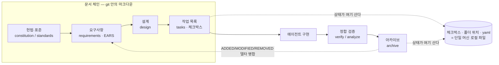
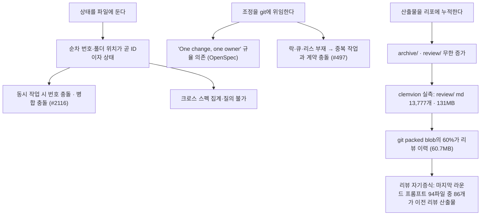

# Spec-Driven Development — 도구 생태계와 구조적 공백

> **요약** — 2025년 하반기에 SDD(Spec-Driven Development) 도구가 한꺼번에 쏟아졌고, 1년 만에 GitHub Spec Kit 126,932★·OpenSpec 64,751★·BMAD-METHOD 51,854★ 규모의 생태계가 만들어졌다. 이 도구들은 requirements(EARS)/design/tasks 3분할, 프로젝트 헌법(constitution), ADDED/MODIFIED/REMOVED 델타 스펙, 자기완결 스토리 파일 같은 **재사용할 가치가 충분한 문서 어휘**를 정착시켰다. 그러나 조사한 7개 도구 전부가 "git 저장소 안의 마크다운 + 로컬 CLI/IDE"를 벗어나지 못해 멀티유저 협업·동시성 제어·실시간 상태 가시성이 통째로 비어 있으며, 이는 추정이 아니라 Spec Kit 토론 #497·#2116과 OpenSpec 이슈 #435("closed as not planned")가 남긴 1차 기록으로 확인된다. 동시에 "SDD는 워터폴의 귀환"이라는 실증 비판(한 기능에 8파일 1,300줄, 버그 하나에 16개 acceptance criteria)도 반복 관찰되므로, NERV(가칭)는 이 도구들의 어휘를 DB 엔티티로 승격하되 게이트를 위험도 가변형(D-06)으로 설계해 비판에 제품으로 답해야 한다. 결론적으로 "SDD 도구들의 Linear/GitHub"에 해당하는 협업 계층은 시장에서 명시적으로 요구되었으나 아직 아무도 만들지 않은 자리다.
>
> 문서 버전 v0.1 · 2026-08-13 · HTML 파생본: [spec-driven-development.html](../html/spec-driven-development.html)

---

## 1. SDD 개념과 2025년 도구 폭발

### 1.1 하나의 용어, 세 가지 야심

SDD는 "자연어 스펙 문서를 먼저 쓰고, 그 문서를 AI 에이전트가 구현의 근거로 삼는다"는 실천을 가리키는 2025년의 신조어다. 다만 이 용어 아래에 야심의 크기가 다른 세 진영이 섞여 있다. Thoughtworks의 Birgitta Böckeler가 정리한 3단 사다리가 사실상의 공용 어휘가 됐다.

| 수준 | 스펙의 지위 | 대표 도구 |
| --- | --- | --- |
| **spec-first** | 구현을 유도하기 위해 쓰고, 구현 뒤에는 버려져도 무방 | Spec Kit, Kiro (실제 사용 관찰 기준) |
| **spec-anchored** | 기능과 함께 살아남아 이후 변경도 스펙을 거쳐 이뤄짐 | OpenSpec(델타 모델), BMAD |
| **spec-as-source** | 스펙이 유지보수 대상이고 코드는 컴파일 산출물에 가까움 | Tessl |

NERV는 이 중 **spec-anchored**를 기본값으로 삼는다. 스펙은 살아남아야 하고(그래야 승인·추적·커버리지가 성립한다), 코드는 여전히 진실의 일부다(그래서 git은 코드 저장소로 남는다 — D-01). spec-as-source는 LLM의 비결정성 위에 모델 주도 개발(MDD)의 실패를 재연할 위험이 지적되고 있어 v0.1 범위에서 채택하지 않는다.

- [Understanding Spec-Driven Development: Kiro, spec-kit, and Tessl (martinfowler.com)](https://martinfowler.com/articles/exploring-gen-ai/sdd-3-tools.html) — (2025-10-15 게시) 3단계 사다리의 출처이자, 세 도구를 직접 써 본 실사용 관찰(문서 과잉·마크다운 검토 피로)의 1차 기록.
- [Spec-driven development: Unpacking 2025's key new AI-assisted engineering practice (Thoughtworks)](https://www.thoughtworks.com/en-us/insights/blog/agile-engineering-practices/spec-driven-development-unpacking-2025-new-engineering-practices) — (2025-12-04 게시) SDD 정의 자체가 업계 합의에 이르지 못했고 스펙 드리프트·환각은 인간 검증 루프 없이는 해소되지 않는다는 진단.

### 1.2 타임라인 — 16개월에 압축된 생태계

```text
 2025-04-13  BMAD-METHOD 리포 생성 — 이번 물결의 최초 주자(에이전트 페르소나 팀)
 2025-07-14  AWS Kiro 프리뷰 공개 — requirements/design/tasks 3파일 + EARS 부활
 2025-08-05  OpenSpec 리포 생성 — specs / changes / archive 3공간 델타 모델
 2025-08-21  GitHub Spec Kit 리포 생성
 2025-09-02  Spec Kit 공식 발표(GitHub Blog) — "스펙은 공유되는 단일 진실이자 살아있는 아티팩트"
 2025-09-23  Tessl Framework + Spec Registry 발표 — spec-as-source 진영의 깃발
 2025-10-15  Böckeler 3단계 사다리 발표 — 용어 정리와 첫 대규모 실사용 비판
 2025-11     Kiro GA
 2025-11-12  Marmelab "워터폴의 역습" — 기능 하나에 8파일 1,300줄 실증
 2025-11-25  Isoform "SDD의 한계" — 유지보수 부담·why 부재·false confidence·추상화 미스매치
 2025-12-04  Thoughtworks — "정의부터 합의되지 않았다"
 2026-05-18  Yeret 반론 — "재생성 비용이 0에 수렴하면 워터폴의 경제학이 성립하지 않는다"
 ───────────────────────────────────────────────────────────────────────────────
 2026-08-13  Spec Kit 126,932★ · OpenSpec 64,751★ · BMAD 51,854★ · Tessl $125M 조달
             그러나 조사한 7개 도구 중 멀티유저 협업을 지원하는 것은 0개
```

이 압축된 타임라인이 시사하는 바는 두 가지다. 첫째, **문서 어휘는 이미 수렴했다** — 서로 다른 팀이 독립적으로 만든 도구들이 거의 같은 3분할과 단계 체인에 도달했다. 둘째, **협업 계층은 한 번도 시도되지 않았다** — 성장은 전부 "1인 개발자 + 에이전트" 축에서 일어났고, 두 사람 이상이 같은 스펙을 다루는 문제는 1년 내내 미해결로 남았다.

### 1.3 EARS — 요구사항 표기법의 재발견

Kiro가 다시 끌어올린 EARS(Easy Approach to Requirements Syntax)는 AI 시대의 발명이 아니다. Rolls-Royce의 Alistair Mavin이 항공 엔진 제어 소프트웨어의 인증 요구사항을 분석하다 도출해 RE'09 학회에서 발표한 표기법으로, `WHILE <전제조건>, WHEN <트리거>, the <시스템> SHALL <응답>` 형태로 자연어 요구사항의 모호성을 줄인다. Airbus·Bosch·NASA·Intel 등 안전 필수 분야에서 쓰이던 것이 LLM 시대에 "테스트로 변환 가능한 문장"이라는 새 효용을 얻었다.

NERV에서 EARS는 문서 서식이 아니라 **Requirement 엔티티의 입력 템플릿**이다(FR-03). 요구사항을 문장 단위로 쪼개 안정 ID(`REQ-NAV-012` 형식)를 부여하고 구현 상태를 개별 추적하려면, 애초에 한 문장이 하나의 검증 가능한 조건이어야 하기 때문이다.

- [EARS 공식 가이드 (Alistair Mavin)](https://alistairmavin.com/ears/) — (2026-08-13 확인) EARS의 기원(RE'09), 문형 구조, 항공·자동차·반도체 산업 채택 사례.

---

## 2. 도구별 분석

### 2.1 한눈에 보는 비교표

수치는 별도 표기가 없으면 2026-08-13 GitHub API·npm API 확인값이다.

| 도구 | 문서 구조 | 상태 추적 | 협업 지원 | 라이선스 | 규모 |
| --- | --- | --- | --- | --- | --- |
| **GitHub Spec Kit** | `.specify/`(templates · memory=constitution) + `specs/NNN-기능명/`(spec·plan·tasks·research·data-model·contracts). 스펙 폴더 ↔ 브랜치 1:1 | `tasks.md` 체크리스트가 유일한 상태 저장소 · `/speckit.converge`(코드 대조) · `/speckit.taskstoissues`(Issues 변환) | **없음.** 팀 가이드 부재(#497) · 순차 번호 동시 충돌(#2116) | MIT | 126,932★ / 11,349 fork · 30+ 에이전트 |
| **AWS Kiro** | `.kiro/specs/{스펙명}/` 정확히 3파일 — `requirements.md`(user story + EARS AC, 버그는 `bugfix.md`) · `design.md`(아키텍처·시퀀스·에러) · `tasks.md` | **도구군 최고 수준.** in-progress/completed 실시간 표시 · 의존성 그래프로 wave 병렬 실행 · 단 개인 IDE 로컬 뷰 | "공유 아티팩트"라 부르지만 공유 수단은 git 커밋뿐 · 실시간 편집·승인·알림 없음 | 상용(비공개, AWS) | 2025-07-14 프리뷰 → 2025-11 GA · Pro $20/1,000크레딧 ~ Power $200/10,000 · 초과 $0.04 |
| **OpenSpec** | 3공간 — `specs/`(현재 진실) · `changes/`(proposal + 델타 + design + tasks) · `changes/archive/`. 델타는 **ADDED / MODIFIED / REMOVED** 접두사 | `tasks.md` 체크리스트 · `/opsx:verify` · `/opsx:archive` · 상태 = 폴더 위치 + 체크박스 | git 규약 의존 자인 · "One change, one owner" 규약뿐 · Stores(베타)는 읽기 전용 · 협업 요청 #435 **not planned** | MIT | 64,751★ / 4,462 fork · npm 주간 367,356 다운로드(2026-08-03~09) |
| **Tessl** | 컴포넌트 설명 + 테스트 링크된 capabilities + API 정의 · generation / usage 2종 · 코드에 `// GENERATED FROM SPEC - DO NOT EDIT` | 태스크 개념 없음 — **링크된 테스트 통과 = 구현 완료** | Spec Registry 중앙 저장·버전 관리(10,000+ usage spec) + 조직 내부 공유 · 실시간 편집·승인은 없음 | 상용 SaaS | $125M 조달($500M+ 밸류) · Registry 오픈 베타 · Framework 클로즈드 베타 |
| **BMAD-METHOD** | 4단계(Analysis→Planning→Solutioning→Implementation) · 34+ 워크플로 · 12+ 페르소나 · 핵심 단위 = 자기완결 **스토리 파일**(아키텍처 컨텍스트·지침·근거·테스트 기준 내장) | `sprint-status.yaml`(스토리 상태·준비도) · 공식 문서가 "대시보드가 아니라 아티팩트 기반 진행"이라 명시 | '팀' = AI 페르소나 팀 · 사람 간 동시 작업 없음(웹 UI 기획 / IDE 구현 2단 분리) | MIT (+TRADEMARK 별도 · API 표기 NOASSERTION) | 51,854★ / 5,932 fork · 리포 생성 2025-04-13 |
| **Agent OS** | 3층 — Standards(`/discover-standards`) · Product(`/plan-product` → mission·roadmap·tech-stack) · Specs(`/shape-spec`). 전부 `agent-os/` 마크다운 | **없음** (roadmap.md 갱신 수준) | 없음 — 표준을 에이전트 컨텍스트에 주입하는 것이 목적 | MIT | 5,263★ / 825 fork · 마지막 푸시 2026-05-05 |
| **spec-workflow-mcp** | `.spec-workflow/` — `approvals/`·`archive/`·`specs/`·`steering/`(비전·기술 결정)·`templates/` · requirements→design→tasks 순차(Kiro 모델 차용) | 실시간 웹 대시보드(:5000) 진행 바·태스크 상태·검색 가능 구현 로그 · VSCode 확장 | **승인 워크플로 내장**(생성→승인 요청→코멘트→수정→승인) · 계정·권한·원격 접근 없음 = "1인 + 에이전트" | **GPL-3.0** (카피레프트 — 개념만 참조) | 4,291★ / 354 fork · npm 주간 601 · 마지막 푸시 2026-07-03 |

### 2.2 GitHub Spec Kit — 생태계 최대, 그러나 철저히 파일·브랜치 기반

`specify init`이 `.specify/`(템플릿과 `memory/` 아래 constitution)와 `specs/`를 만들고, 그 뒤는 슬래시 명령 체인이다: `/speckit.constitution` → `/speckit.specify`(what/why, user story) → `/speckit.clarify` → `/speckit.plan` → `/speckit.tasks` → `/speckit.analyze`·`/speckit.checklist` → `/speckit.implement`. 단계마다 인간 검토 체크포인트를 두도록 설계된 점이 공식 발표에서 강조됐는데, 이 체크포인트는 채팅 안의 관행일 뿐 시스템이 강제하거나 기록하지 않는다. NERV의 받은 요청(S7, FR-11)은 정확히 이 체크포인트를 서버 측 엔티티로 승격한 것이다.

주목할 신호는 `/speckit.taskstoissues`다. 태스크를 GitHub Issues로 내보내는 공식 통로가 존재한다는 사실 자체가 **마크다운 체크리스트로는 추적이 안 된다는 것을 도구가 인정한 셈**이다.

- [github/spec-kit 리포지터리](https://github.com/github/spec-kit) — (2026-08-13 확인) MIT·126.9k★, `.specify/memory/` constitution, converge·taskstoissues 포함 명령 체계, 멀티유저 언급 전무.
- [Spec-driven development with AI: new open source toolkit (GitHub Blog)](https://github.blog/ai-and-ml/generative-ai/spec-driven-development-with-ai-get-started-with-a-new-open-source-toolkit/) — (2025-09-02 게시) 스펙을 "공유되는 단일 진실이자 살아있는 아티팩트"로 정의하고 단계별 인간 체크포인트와 조직 보안·컴플라이언스 표준 주입을 목표로 명시.

### 2.3 AWS Kiro — 3파일 모델과 IDE 내장 추적의 상한선

Kiro는 문서 구조를 가장 단정하게 정리했다. 스펙 하나가 정확히 세 파일이고, requirements-first / design-first 두 진입 변형만 허용한다. 진행 추적도 조사 대상 중 가장 앞서 있다 — tasks 전용 실행 인터페이스가 상태를 실시간 갱신하고, 의존성 그래프를 만들어 서로 독립인 태스크를 wave 단위로 병렬 실행한다.

문제는 그 모든 것이 **한 사람의 IDE 창 안**이라는 점이다. 크로스 스펙 가시성이 부족해 서드파티가 별도 진행률 대시보드를 만들어 붙일 정도다. Kiro의 태스크 의존성·wave 모델은 NERV의 ready 큐 판정과 원자적 클레임(D-04, FR-05/FR-06)의 직접적 참조 설계이지만, NERV에서는 그래프가 서버에 있고 wave를 여러 호스트의 여러 세션이 나눠 집는다는 점이 다르다.

Kiro의 훅(파일 저장·생성·삭제 이벤트로 테스트·문서 갱신 자동 실행)도 참고할 만하다. NERV에서는 이것이 클라이언트 파일 이벤트가 아니라 **서버 이벤트 → 구독 규칙 → 알림·자동 검증**으로 일반화된다(D-10, FR-12).

- [Kiro Specs 공식 문서](https://kiro.dev/docs/specs/) — (2026-08-13 확인) 3파일 구조, 태스크 실행 인터페이스의 실시간 상태, 의존성 wave 병렬 실행. 협업·공유 기능은 언급 자체가 없음.
- [Kiro Feature Specs 문서](https://kiro.dev/docs/specs/feature-specs/) — (2026-08-13 확인) EARS 예시와 requirements→design→tasks 산출 흐름, 요구사항의 명확성·테스트 가능성·추적성 강조.
- [Introducing Kiro (공식 블로그)](https://kiro.dev/blog/introducing-kiro/) — (2025-07-14 게시) 프롬프트 → EARS 기준이 달린 user story → design → tasks 생성 흐름과 파일 이벤트 훅 소개. 요금 체계는 `kiro.dev/pricing`(2026-08-13 확인).

### 2.4 OpenSpec — 델타 모델, 파일 기반의 이론적 정점

OpenSpec의 발명은 **"현재 상태"와 "변경 diff"를 문서 수준에서 분리한 것**이다. `specs/`는 시스템이 지금 어떻게 동작하는지에 대한 단일 진실이고, `changes/` 아래 각 변경 폴더는 그 진실에 대한 델타를 `ADDED` / `MODIFIED` / `REMOVED` 요구사항 접두사로 표현한다. 변경이 archive 되는 순간 델타가 `specs/`에 병합된다.

이것은 사실상 문서로 구현한 버전 관리 시스템이며, NERV의 SpecVersion(불변 스냅샷)과 ChangeRequest(델타 리뷰)의 문서적 원형이다(D-02, FR-02/FR-04). 결정적 차이는 병합과 충돌 검출의 주체다 — OpenSpec은 그것을 git과 사람에게 맡기고, NERV는 서버가 수행한다.

그 위임을 OpenSpec 공식 팀 워크플로 문서가 스스로 밝힌다. 도구는 `openspec/` 아래 마크다운을 읽고 쓸 뿐 커밋·브랜치·푸시를 하지 않으며, 충돌 방지 수단은 "변경 폴더 하나에 소유자 한 명"(One change, one owner)이라는 **규약**과 평범한 git 병합뿐이다. 공유되는 `specs/`를 두 변경이 동시에 건드리면 그냥 git 충돌이 난다.

- [Fission-AI/OpenSpec 리포지터리](https://github.com/Fission-AI/OpenSpec) — (2026-08-13 확인) MIT·64.7k★, specs/changes/archive 3공간과 델타 접두사, `/opsx:explore→propose→apply→verify→archive` 명령 체인, Stores 베타(플랫폼팀 소유·제품팀 읽기 전용).
- [OpenSpec 공식 팀 워크플로 문서 (team-workflow.md)](https://github.com/Fission-AI/OpenSpec/blob/main/docs/team-workflow.md) — (2026-08-13 확인) 도구가 git 조작을 하지 않는다는 선언과 "One change, one owner" 규약 의존을 명문화.

### 2.5 Tessl — 중앙 레지스트리라는 유일한 이탈

Tessl은 스펙을 컴포넌트 설명 + 테스트가 링크된 capabilities + API 정의로 정의하고, 생성된 코드 파일에 편집 금지 마커를 박아 스펙:코드 1:1을 강제한다. 진행 상태를 따로 관리하지 않는 대신 **capability에 링크된 테스트가 통과하면 그것이 구현 완료**라는 정의를 택했다 — NERV의 증적(Evidence) 개념, 즉 Requirement ↔ 테스트·PR·커밋 연결(FR-13)과 발상이 같다.

가장 눈여겨볼 점은 Spec Registry다. 10,000+ 오픈소스 라이브러리의 usage spec을 중앙에서 버전 관리하고 조직 내부 스펙도 공유한다 — 조사한 도구 중 유일하게 "스펙이 리포 밖에 산다". 다만 이는 패키지 레지스트리 모델이지 협업 워크스페이스가 아니어서, 승인·코멘트·실시간 상태는 없다. NERV는 이 중앙화 발상을 Organization 스코프의 스펙 공유·안정 ID 참조로 흡수한다(FR-14, D-09).

- [Tessl launches spec-driven development tools (공식 블로그)](https://tessl.io/blog/tessl-launches-spec-driven-framework-and-registry) — (2025-09-23 게시) Framework(스펙 → 에이전트 구현 → 테스트 가드레일)와 Registry(10,000+ specs) 발표, 스펙 3요소 구조.
- [Tessl raises $125M at $500M+ valuation (TechCrunch)](https://techcrunch.com/2024/11/14/tessl-raises-125m-at-at-500m-valuation-to-build-ai-that-writes-and-maintains-code/) — (2024-11-14 게시) Snyk 창업자 Guy Podjarny 설립, boldstart·GV Seed $25M + Index Ventures Series A $100M.

### 2.6 BMAD-METHOD — 직군 페르소나와 자기완결 스토리 파일

BMAD는 방법론에 가깝다. Analyst·PM·Architect·Scrum Master·Dev·QA/Test Architect·UX 등 12+ 페르소나가 4단계 34+ 워크플로를 돌며 brief → PRD → architecture → story → code로 이어지는 문서 체인을 만든다. Planning 단계의 산출물은 구현 전에 잠기는 "canonical technical contract"로 취급된다.

핵심 단위인 **스토리 파일**은 아키텍처 컨텍스트·구현 지침·결정 근거·테스트 기준을 한 파일에 전부 담은 자기완결 작업 패키지다. 이것이 NERV Task의 위임 명세 4요소(목표 / 산출물 형식 / 도구·출처 / 경계, FR-05)의 방법론적 조상이다. 다만 BMAD의 '팀'은 AI 페르소나 팀이지 사람의 팀이 아니고, 상태는 `sprint-status.yaml`이라는 파일 하나에 산다. NERV는 페르소나 분업을 **역할(Role) 기반 권한과 직군별 화면**으로, yaml 상태를 **DB 상태 머신**으로 옮긴다.

- [bmad-code-org/BMAD-METHOD 리포지터리](https://github.com/bmad-code-org/BMAD-METHOD) — (2026-08-13 확인) MIT + 상표 별도, 51.9k★, 4단계 전달 모델과 확장 모듈 생태계.
- [BMAD Method Workflow Map (공식 문서)](https://docs.bmad-method.org/reference/workflow-map/) — (2026-08-13 확인) 34+ 워크플로 맵, `sprint-status.yaml` 기반 상태 추적, "아티팩트 기반 진행" 명시.

### 2.7 Agent OS — 표준 주입 계층

Agent OS는 스펙 추적 도구라기보다 **컨텍스트 주입 계층**이다. 코드베이스에서 코딩 표준을 추출하고(Standards), 제품 미션·로드맵·기술 스택을 문서화하고(Product), 그 둘을 반영한 질문으로 스펙을 정형화한다(Specs). 진행 추적과 협업은 아예 목표가 아니다.

NERV에서 이 계층은 사라지지 않고 **스펙 타입**으로 흡수된다 — `convention`(코딩·문서 규약)과 `vision`(제품 방향성)이 그것이며, 세션 시작 시 `nerv_bootstrap`이 프로젝트의 해당 스펙을 에이전트 컨텍스트에 주입한다(D-05, FR-15). 파일을 복사해 배포하는 대신 서버가 최신 승인본을 내려주므로, 표준 문서가 리포마다 갈라지는 문제가 사라진다.

- [Agent OS 공식 사이트](https://buildermethods.com/agent-os) — (2026-08-13 확인) standards/product/specs 3층 구조와 discover → inject → shape 흐름, Claude Code 우선 지원.

### 2.8 spec-workflow-mcp — NERV 상호작용 모델의 소규모 개념 증명

조사 대상 중 NERV와 가장 가까운 물건이다. MCP 서버가 에이전트와 연결되고, 별도 웹 대시보드가 사람에게 승인을 요청한다. 승인 라이프사이클(요청 → 피드백 → 수정 → 승인)이 도구에 내장되어 있고, 진행 바와 검색 가능한 구현 로그까지 갖췄다.

그런데 사용자 계정도, 권한도, 원격 접근도 없다. 결국 "로컬 프로젝트 하나 + 나 한 사람 + 에이전트"의 구조이며, 이것이 **파일 기반 도구가 도달할 수 있는 협업의 최대치**다. NERV는 여기에 조직·프로젝트 n:n 멤버십, 역할 권한, 알림, 세션 신원(사용자 + hostname + 에이전트 종류)을 더한 서버판이다.

> **주의 — 라이선스.** spec-workflow-mcp는 GPL-3.0(카피레프트)이다. 상호작용 모델과 승인 라이프사이클이라는 **개념만 참조**하고 코드·구조를 직접 차용해서는 안 된다.

- [Pimzino/spec-workflow-mcp 리포지터리](https://github.com/Pimzino/spec-workflow-mcp) — (2026-08-13 확인) GPL-3.0, MCP 서버 + 대시보드 분리 실행, 승인 라이프사이클, `.spec-workflow/` 디렉터리 구조. 멀티유저 언급 없음.

---

## 3. 공통 패턴 — 재사용할 가치가 있는 것들

서로 참조하지 않고 만들어진 도구들이 거의 같은 골격에 도달했다. 이 수렴은 우연이 아니라 "LLM에게 무엇을 만들지 설명하는 방법"의 자연 균형점으로 보이며, NERV가 문서 어휘를 새로 발명할 필요가 없다는 뜻이다.



*그림 1. 파일 기반 SDD 도구의 공통 파이프라인. 문서 어휘는 훌륭하지만 상태는 전부 로컬 파일에 산다.*

| 패턴 | 원산지 | 무엇이 좋은가 | NERV에서의 형태 |
| --- | --- | --- | --- |
| **requirements / design / tasks 3분할** | Kiro (Spec Kit·spec-workflow-mcp가 사실상 동일 채택) | "무엇을·왜"와 "어떻게"와 "실행 단위"를 분리해 각각을 다른 사람이 다른 시점에 검토할 수 있게 함 | Spec 타입 `feature`·`design` + Requirement 엔티티 + Task 파생 (FR-01/FR-03/FR-05) |
| **EARS 요구사항 문형** | Kiro (기원은 Rolls-Royce/RE'09) | 한 문장 = 하나의 검증 가능한 조건 → 테스트·추적의 최소 단위가 생김 | Requirement 입력 템플릿·린터, 안정 ID 부여 (FR-03) |
| **constitution / standards 주입** | Spec Kit, Agent OS | 프로젝트 불변 원칙을 매 스펙 생성 시 재입력하지 않아도 됨 | 스펙 타입 `convention`·`vision`, `nerv_bootstrap`이 세션 시작 시 주입 (D-05, FR-15) |
| **델타 스펙(ADDED/MODIFIED/REMOVED)** | OpenSpec | 검토 대상이 문서 전체가 아니라 변경분으로 줄어 리뷰 피로가 급감 | ChangeRequest + SpecVersion 불변 스냅샷 + 델타 리뷰 뷰 (D-02, FR-02/FR-04) |
| **자기완결 스토리 파일** | BMAD | 에이전트가 컨텍스트를 스스로 재수집하지 않아도 되고, 작업의 경계가 명시됨 | Task의 위임 명세 4요소: 목표 / 산출물 형식 / 도구·출처 / 경계 (FR-05) |
| **태스크 의존성 그래프와 wave 병렬 실행** | Kiro | 무엇을 지금 시작해도 되는지 계산으로 답함 | TaskDependency + ready 큐 + 원자적 클레임·리스 (D-04, FR-05/FR-06) |
| **승인 라이프사이클(요청→피드백→수정→승인)** | spec-workflow-mcp (개념만) | 에이전트 산출물에 사람의 결재점을 만듦 | 받은 요청(Inbox) 카드 + Approval 엔티티 + 알림 (FR-11/FR-12) |
| **중앙 스펙 레지스트리** | Tessl | 스펙을 리포 경계 밖에서 버전 관리·재사용 | Organization 스코프 공유와 안정 ID 참조 (FR-14, D-09) |
| **테스트 링크 = 구현 상태** | Tessl | 자기보고가 아니라 산출물이 상태를 결정 | Evidence(Requirement ↔ 코드·테스트·PR·커밋), 커버리지 대시보드 (FR-13, D-14) |

여기서 **버리는 것**도 분명하다. 순차 폴더 번호(Spec Kit 001, 002…)는 서버 발급 해시 ID로, 폴더 위치·체크박스·yaml로 표현된 상태는 DB 상태 머신으로 대체된다(D-01, D-04). 문서 어휘는 차용하고 저장·조정 메커니즘은 전부 갈아엎는다는 것이 NERV의 기본 자세다.

---

## 4. 공통 한계 — 1차 출처가 남긴 기록

조사한 7개 도구 전부가 "git 저장소 안의 마크다운 + 로컬 CLI/IDE" 형태를 공유하며, 그 결과 아래 한계가 도구를 가리지 않고 반복된다. 중요한 것은 이것이 외부 관찰자의 추정이 아니라 **각 프로젝트의 공식 문서와 커뮤니티 토론에 남은 자백**이라는 점이다.

### 4.1 멀티유저 공백 — 세 건의 1차 기록

**① Spec Kit Discussion #497 — "팀에서 spec-kit을 쓰는 최선의 방법은?"**
실사용자들이 보고한 문제는 세 갈래다. 공통 베이스에서 각자 분기하면 스펙 폴더 번호가 필연적으로 겹친다. 두 기능이 같은 파일을 건드릴 때 두 스펙의 계약이 동시에 유효한지 검증할 수단이 없다. 스펙이 기능 폴더마다 흩어져 "마스터 계약"이 없으니 통합 시점의 가시성이 사라진다. 제시된 우회책은 "specify 단계를 전부 main에서 끝내고 분기하라", "스쿼드 단위로만 써라", "JIRA를 붙여라" 수준이었고 공식 해법은 나오지 않았다.

**② Spec Kit Discussion #2116 — "동시 개발 모범 사례는?"**
두 엔지니어가 같은 시점에 다음 스펙을 만들면 둘 다 `0004`를 잡아 병합 충돌이 확정된다. 논의 끝에 타임스탬프 기반 네이밍(`--branch-numbering timestamp`)이 추가됐지만, 이는 **충돌 완화이지 조정(coordination)이 아니다** — 누가 무엇을 하고 있는지는 여전히 아무도 모른다. 유지자의 답변도 "브랜치·디렉터리 네이밍의 진실 소유자를 팀이 알아서 정하라"는 선에 머물렀다.

**③ OpenSpec Issue #435 — "Collaboration & Orchestration"**
"스펙 작성은 본질적으로 협업인데 현재 도구들은 single-player 이거나 평범한 git 충돌에 의존한다"는 문제 제기와 함께 멀티유저 워크스페이스(RBAC·실시간 편집), Google Docs 식 인라인 코멘트, 멀티 에이전트 병렬 리뷰, 모델 간 합의 기능이 요청됐다. 결과는 **"closed as not planned"**. 파일 기반 도구가 이 방향을 구조적으로 감당할 수 없다는 판단이 공개적으로 내려진 것이다.

> **읽는 법.** 이 세 건은 NERV의 기능 명세를 시장이 대신 써 준 문서다. #497은 FR-01(스펙 단일 진실 저장소)·FR-13(증적 그래프)을, #2116은 D-04(원자적 클레임 + 서버 발급 ID)와 FR-06을, #435는 FR-11(받은 요청)·FR-14(멀티테넌시)·FR-08(세션 활동 스트림)을 각각 요구하고 있다.

- [What's the best way to use spec-kit in a team? (Discussion #497)](https://github.com/github/spec-kit/discussions/497) — (2026-08-13 확인) 번호 충돌·계약 동시 유효성 검증 불가·마스터 계약 부재라는 팀 도입 3대 문제와 공식 해법 부재.
- [What best practices exist for concurrent SpecKit development? (Discussion #2116)](https://github.com/github/spec-kit/discussions/2116) — (2026-08-13 확인) 동시 스펙 생성 시 번호 충돌의 필연성과 타임스탬프 옵션이라는 완화책.
- [OpenSpec Issue #435: Collaboration & Orchestration](https://github.com/Fission-AI/OpenSpec/issues/435) — (2026-08-13 확인) 멀티유저 워크스페이스·인라인 코멘트·병렬 리뷰 요청이 "not planned"로 종료된 기록.

### 4.2 마크다운 체크박스라는 상태 저장소의 상한

상태를 체크박스·폴더 위치·yaml 키로 표현하면 다음이 불가능해진다.

| 못 하는 것 | 왜 | NERV의 대응 |
| --- | --- | --- |
| 크로스 스펙 집계 — "이 프로젝트 요구사항 중 몇 %가 구현됐나" | 체크박스는 문서를 열어야 읽히고 문서 간 조인이 없음 | Requirement 단위 2축 상태 + 커버리지 질의 (D-02, D-03, FR-13) |
| 원자적 선점 — "이 작업은 내가 잡았다" | 파일 쓰기는 원자적 전이가 아니고 다른 호스트에 보이지 않음 | `nerv_task_claim` + TTL 리스 + 하트비트 (D-04, FR-06) |
| 실시간 가시성 — "지금 누가 무엇을 하나" | 파일에는 액터 개념이 없다(git committer가 전부) | AgentSession(사용자·hostname·에이전트 종류·상태 머신) (D-13, FR-07/FR-08) |
| 승인 이력 조회 — "이 요구사항은 누가 언제 승인했나" | 승인은 채팅 로그나 PR 코멘트에 흩어짐 | Approval 엔티티 + Event append-only 로그 (D-10, FR-11/FR-16) |

Kiro의 IDE 실행 인터페이스, spec-workflow-mcp의 로컬 대시보드, BMAD의 `sprint-status.yaml`이 이 계열의 상한선이며 셋 다 단일 머신 안에 갇혀 있다. 같은 현상은 clemvion에서도 그대로 관측된다 — 하네스의 모든 조율 상태가 gitignored 로컬 파일에 있어 다른 호스트에서는 존재조차 보이지 않고, 그래서 스펙 동시수정 자동 검출은 "병렬 작업이 다른 머신·세션이면 로컬에서 신뢰할 수 없다"는 이유로 **의도적으로 제거**됐다(clemvion 이슈 #576). 상세는 [clemvion 하네스 분석](../01-problem/clemvion-analysis.md)과 [문제 정의와 요구사항](../01-problem/pain-points.md) 참조.

### 4.3 아카이브 비대화 — 구조적 귀결이지 운영 실수가 아니다

문서와 리뷰 산출물을 코드와 같은 저장소에 무한 누적하는 구조는 OpenSpec `changes/archive/`, Spec Kit `specs/`, BMAD 문서 체인이 모두 공유한다. 이 계열의 끝이 어디인지는 clemvion이 이미 실측으로 보여줬다.



*그림 2. 파일 기반 전제 3가지에서 출발한 한계의 전파 경로. 마지막 세 노드는 clemvion 실측치다.*

`clemvion:review/` 하위에는 markdown 13,777개(131MB)가 쌓였고(code 9,070 + consistency 4,697 + spec-coverage 10), 73일간 리뷰 세션 1,891개(일평균 26개)가 생성되어 현 추세로 월 약 7,000파일·50MB씩 증가한다. 전체 커밋 2,464개 중 937개(38%)가 `clemvion:review/`를 건드렸다. 리뷰 산출물이 코드와 같은 브랜치에 커밋되므로 **다음 라운드 리뷰의 diff에 이전 리뷰가 포함되는 자기증식 루프**가 생겨, 한 changeset이 8라운드를 도는 동안 마지막 라운드 프롬프트 94파일 중 86개가 이전 `clemvion:review/**` 산출물이었다. 스펙 쪽도 `clemvion:spec/` 384 md(순수 스펙 135 md·49,383줄), `clemvion:plan/` 450 md 규모다.

이것이 D-01(스펙·리뷰 산출물은 git이 아니라 플랫폼 DB에 저장, git에는 read-only 미러와 포인터만)의 직접적 근거이며, 기존 자산의 이관 계획은 D-12·FR-17로 이어진다.

### 4.4 그 밖의 공통 공백

- **출처 추적(traceability)이 약하다.** requirement → task 링크(Kiro), task → Issue 변환(Spec Kit) 정도가 전부이고, 리뷰 결과 → 스펙 → 구현으로 이어지는 체인을 관리하는 도구는 하나도 없다. NERV는 이것을 Evidence와 Finding의 provenance로 1급 기능화한다(D-07, FR-09/FR-13).
- **멀티 프로젝트·멀티 리포 개념이 없다.** OpenSpec Stores(베타)와 Tessl Registry가 유일한 시도인데 둘 다 공유 저장소 모델이지 협업 워크스페이스가 아니다(FR-14).
- **신원과 권한이 없다.** 사용자 개념이 git committer뿐이라 역할 기반 접근 제어도, 에이전트와 사람의 구분도 성립하지 않는다. NERV는 사람 assignee와 에이전트 delegate를 분리하고 감사 로그에 `is_agent`를 남긴다(D-08, FR-16) — 근거는 [협업 플랫폼의 에이전트 통합](collab-platforms.md).

---

## 5. 비판과 반론 — "워터폴의 귀환"인가

SDD를 채택할 때 가장 먼저 부딪히는 저항은 기술이 아니라 **"이거 워터폴 아니냐"**는 질문이다. 이 논쟁은 NERV의 UX 설계와 직결되므로 양쪽을 모두 정리한다.

### 5.1 비판 측 — 문서량과 검토 피로는 실측된 문제다

| 출처 | 핵심 지적 | 실측·사례 |
| --- | --- | --- |
| Marmelab (2025-11-12) | SDD는 BDUF(Big Design Up Front)의 부활 | 날짜 표시 기능 하나에 Spec Kit이 **8개 파일·1,300줄** 생성. 에이전트가 기존 함수 갱신을 놓치는 컨텍스트 맹목, 스펙 리뷰 + 코드 리뷰의 이중 부담, 에이전트가 스펙을 일관되게 따르지 않는 데서 오는 거짓 안심 |
| Böckeler / martinfowler.com (2025-10-15) | 문서 깊이가 문제 크기에 비례하지 않음 | 작은 버그 수정이 **4개 user story·16개 acceptance criteria**로 부풀고, 마크다운 검토가 코드 리뷰보다 고통스럽다는 직접 관찰 |
| Isoform (2025-11-25) | 4대 구조적 한계 | ① 스펙 작성·동기화 유지보수 부담(요구사항이 스펙 갱신보다 빨리 변함) ② what은 있고 why(가정·제약·근거)가 없음 ③ 과잉 명세가 만드는 false confidence와 반복·창의성 저하 ④ 구현 세부에 치우친 추상화 미스매치 |
| Thoughtworks (2025-12-04) | 드리프트와 환각은 본질적으로 제거되지 않음 | 인간 검증 루프와 CI/CD 없이는 SDD가 성립하지 않는다는 결론 |

### 5.2 반론 측 — 실패한 것은 스펙이 아니라 발견 비용이었다

Yuval Yeret의 반론이 이 진영의 대표다. 워터폴이 무너진 이유는 스펙을 썼기 때문이 아니라 **"스펙이 틀렸다는 사실을 발견하는 비용이 파국적으로 높았기" 때문**이며, 재생성 비용이 0에 수렴하면 그 경제학 자체가 성립하지 않는다는 주장이다. 그가 지목하는 진짜 함정은 두 가지다 — 과잉 명세(토큰 낭비와 적응 차단), 그리고 성과 무시(동작하는 소프트웨어만 만들고 사용자 행동 변화를 검증하지 않음). 처방은 배치 크기를 작게 유지하고, **리스크 수준에 따라 에이전트 자율성과 체크포인트를 조정**하라는 것이다.

### 5.3 NERV의 입장 — 위험도 가변 게이트로 답한다

양쪽 주장을 합치면 결론은 하나다. **문제는 스펙 자체가 아니라 "모든 변경에 같은 무게의 절차를 강제하는 것"이다.** clemvion도 같은 것을 다른 방식으로 겪었다 — 산문으로 쓰인 규약은 강제력이 없으면 반드시 깨진다는 사실이 수치로 남아 있다(forced reviewer 미충족 160/575 세션 = 28%, checker의 CRITICAL 판정을 BLOCK: NO로 하향한 모순 24/732 = 3.3%). 절차를 없애도 실패하고, 획일적으로 강제해도 실패한다.

> **D-06 — 사람 개입 게이트는 위험도 가변.** 표준 게이트 4+1: ① 스펙/CR 승인 ② 플랜 승인(대형 작업 착수 전) ③ 에이전트 질문(awaiting_input) ④ PR 머지·CI 실행("지시자≠승인자" 규칙) + ⑤ 게이트 면제는 기록되는 BYPASS. 오탈자 수정 같은 저위험 변경은 자동 통과 경로를 두어, "버그 하나에 16개 acceptance criteria"라는 워터폴 비판을 제품 동작으로 반박한다.

구체적으로 NERV는 세 가지 장치로 검토 피로에 대응한다.

1. **델타만 검토한다.** OpenSpec의 ADDED/MODIFIED/REMOVED를 ChangeRequest의 델타 뷰로 승격해, 승인자가 1,750줄 문서가 아니라 변경분과 그 영향 범위만 본다(FR-04).
2. **위험도로 경로를 가른다.** 델타 크기, 영향받는 Requirement 수, 이미 구현된 Task 존재 여부로 위험도를 계산해 저위험은 기록만 남기고 통과시키고 고위험만 받은 요청으로 보낸다(FR-10/FR-11).
3. **why를 필드로 강제한다.** Isoform이 지적한 "what만 있고 why가 없다"는 문제에 대해, 결정 근거를 스펙 레코드의 구조화 필드로 두고 ADR 타입 스펙과 연결한다(D-09).

```text
┌─ 받은 요청(Inbox) ────────────────────────────────────────────────────┐
│ ● CR · 로그인 화면 안내 문구 수정                      위험도: 낮음 │
│   델타 MODIFIED 1건(2줄) · 영향 Requirement 0건                     │
│   → 자동 통과 · 이벤트 로그에 기록됨            [기록 보기]         │
│ ─────────────────────────────────────────────────────────────────── │
│ ● CR · 결제 실패 재시도 정책 변경                      위험도: 높음 │
│   델타 ADDED 3 · MODIFIED 2 · REMOVED 1                             │
│   영향 Requirement 6건(구현 완료 2건 포함) · 파생 Task 4건 재계산   │
│   리뷰어: 기획 · QA (역할 기반 자동 지정)                           │
│   [승인]  [거절]  [코멘트]                                          │
└─────────────────────────────────────────────────────────────────────┘
```

*그림 3. 위험도 가변 게이트가 받은 요청에서 보이는 모습(개념 스케치). 전체 화면 정의는 [화면 설계](../03-proposal/ui-wireframes.md) S7 참조.*

- [Spec-Driven Development: The Waterfall Strikes Back (Marmelab)](https://marmelab.com/blog/2025/11/12/spec-driven-development-waterfall-strikes-back.html) — (2025-11-12 게시) 8파일 1,300줄 실증과 이중 리뷰 부담, 대안으로서의 반복적 자연어 개발 시연.
- [The Limits of Spec-Driven Development (Isoform)](https://isoform.ai/blog/the-limits-of-spec-driven-development) — (2025-11-25 게시) 유지보수 부담·why 부재·false confidence·추상화 미스매치라는 4대 한계 정리.
- [Spec-Driven Development Isn't Waterfall Unless You're Using It That Way (Yuval Yeret)](https://yuvalyeret.com/blog/spec-driven-development-isnt-waterfall-unless-youre-using-it-that-way/) — (2026-05-18 게시) 재생성 비용 0 논거와 리스크 기반 체크포인트 조정 권고 — D-06의 직접 근거.

---

## 6. NERV 시사점

### 6.1 차용 목록과 반영 문서

| 차용 대상 | 출처 도구 | NERV에서의 형태 | 결정·요구사항 | 반영 문서 |
| --- | --- | --- | --- | --- |
| requirements(EARS)/design/tasks 3분할 | Kiro | Spec 타입 + Requirement 엔티티(EARS 템플릿·안정 ID) + Task 파생 | D-02, D-03, FR-01/03/05 | [데이터 모델](../03-proposal/data-model.md), [스펙 워크플로우](../03-proposal/spec-workflow.md) |
| constitution · standards 주입 | Spec Kit, Agent OS | 스펙 타입 `convention`·`vision` + `nerv_bootstrap` 세션 시작 주입 | D-05, FR-01, FR-15 | [에이전트 연동 설계](../03-proposal/agent-integration.md) |
| ADDED/MODIFIED/REMOVED 델타 | OpenSpec | ChangeRequest + SpecVersion 불변 스냅샷 + 델타 리뷰 뷰 | D-02, FR-02, FR-04 | [스펙 워크플로우](../03-proposal/spec-workflow.md), [데이터 모델](../03-proposal/data-model.md) |
| 자기완결 스토리 파일 | BMAD | Task 위임 명세 4요소(목표/산출물 형식/도구·출처/경계) | FR-05 | [스펙 워크플로우](../03-proposal/spec-workflow.md) |
| 의존성 그래프 · wave 병렬 실행 | Kiro | TaskDependency + ready 큐 + 원자적 클레임·리스 | D-04, FR-05, FR-06 | [스펙 워크플로우](../03-proposal/spec-workflow.md), [시스템 아키텍처](../03-proposal/architecture.md) |
| MCP 연동 + 웹 대시보드 승인 | spec-workflow-mcp (개념만, GPL-3.0) | tools-first 원격 MCP + 받은 요청(Inbox) + 알림 | D-05, FR-11, FR-12, FR-15 | [에이전트 연동 설계](../03-proposal/agent-integration.md), [Claude Code/Codex 연동 기술](integration-tech.md) |
| 중앙 스펙 레지스트리 | Tessl | Organization 스코프 공유 + 안정 ID 참조(경로·앵커 아님) | D-09, FR-14 | [데이터 모델](../03-proposal/data-model.md) |
| 테스트 링크 = 구현 상태 | Tessl | Evidence(Requirement ↔ 코드·테스트·PR·커밋) + 커버리지 대시보드 | D-14, FR-13 | [데이터 모델](../03-proposal/data-model.md), [스펙 워크플로우](../03-proposal/spec-workflow.md) |
| 단계별 인간 체크포인트 | Spec Kit | 표준 게이트 4+1, 위험도 가변 + 기록되는 BYPASS | D-06, FR-10, FR-11 | [스펙 워크플로우](../03-proposal/spec-workflow.md) |
| 스펙 변경 훅(이벤트 자동화) | Kiro | 서버 Event → 구독 규칙 → 알림·자동 검증 | D-10, FR-12, FR-16 | [시스템 아키텍처](../03-proposal/architecture.md) |
| **배격**: 순차 폴더 번호 | Spec Kit | 서버 발급 해시 ID(충돌 원천 제거) | D-04 | [데이터 모델](../03-proposal/data-model.md) |
| **배격**: 폴더 위치·체크박스·yaml 상태 | 전 도구 공통 | DB 상태 머신 + 관계 그래프 질의 | D-01, D-02, D-03 | [데이터 모델](../03-proposal/data-model.md) |
| **배격**: 산출물 git 누적 | OpenSpec archive, clemvion review | 플랫폼 DB 저장 + git엔 포인터·read-only 미러 | D-01, D-12, FR-17 | [시스템 아키텍처](../03-proposal/architecture.md), [로드맵](../03-proposal/roadmap.md) |

### 6.2 포지셔닝 근거

이 조사가 [비전과 핵심 시나리오](../03-proposal/vision.md)에 제공하는 결론은 세 문장으로 요약된다.

1. **어휘는 이미 있다.** 수십만 사용자가 쓰는 문서 구조(3분할·헌법·델타·스토리)가 검증돼 있으므로 NERV는 새 방법론을 발명하지 않고 이를 DB 엔티티로 승격하는 데 집중한다 — 학습 비용이 낮고, 기존 SDD 사용자를 그대로 받아들일 수 있다.
2. **공백은 협업 계층이다.** 진행 추적의 시장 상한선이 "로컬 대시보드"이고 멀티유저 요청은 공식적으로 기각됐다(#435). 서버 사이드 멀티유저 상태 — 누구(hostname)의 어떤 세션이 무엇을 잡고 있는지 — 는 아무도 점유하지 않은 자리다. 병렬 에이전트 운용 쪽의 같은 공백은 [병렬 에이전트 오케스트레이션](agent-orchestration.md)에서, "에이전트를 팀원으로 취급하는" 협업 플랫폼들의 수렴 패턴은 [협업 플랫폼의 에이전트 통합](collab-platforms.md)에서 다룬다.
3. **시장은 형성됐다.** 1년 만에 Spec Kit 126,932★·OpenSpec 64,751★(주간 npm 367,356 다운로드)·BMAD 51,854★, Tessl $125M 조달. SDD는 실험이 아니라 카테고리이며, 그 위의 협업 계층은 "SDD 도구들의 Linear/GitHub"로 포지셔닝된다.

### 6.3 채택 리스크로 이월할 것

- **검토 피로가 최대 실패 요인이다.** 실증 비판이 반복 확인된 만큼, 델타 뷰·요약 자동 생성·경량 모드가 없으면 도입 자체가 실패한다 → [로드맵](../03-proposal/roadmap.md) 리스크 항목으로 이월.
- **GPL 경계.** spec-workflow-mcp는 개념 참조만 허용. 구현 시 코드·구조 차용 금지를 개발 규약으로 명문화해야 한다.
- **스펙 드리프트는 제거되지 않는다.** Thoughtworks·Isoform이 공통으로 지적한 대로 드리프트는 관리 대상이지 해결 대상이 아니다. NERV는 `spec_drift` 태그가 붙은 Finding과 Evidence 링크로 이를 **탐지 가능하게** 만드는 데 목표를 둔다(D-07, FR-09).

---

## 참고 자료

### 개념·비평

- [Understanding Spec-Driven Development: Kiro, spec-kit, and Tessl (martinfowler.com)](https://martinfowler.com/articles/exploring-gen-ai/sdd-3-tools.html) — (2025-10-15) spec-first / spec-anchored / spec-as-source 3단계 사다리와 실사용 관찰(4 user story·16 AC).
- [Spec-driven development: Unpacking 2025's key new AI-assisted engineering practice (Thoughtworks)](https://www.thoughtworks.com/en-us/insights/blog/agile-engineering-practices/spec-driven-development-unpacking-2025-new-engineering-practices) — (2025-12-04) SDD 정의 미합의와 드리프트·환각의 불가피성.
- [Spec-Driven Development: The Waterfall Strikes Back (Marmelab)](https://marmelab.com/blog/2025/11/12/spec-driven-development-waterfall-strikes-back.html) — (2025-11-12) 8파일 1,300줄 실증과 이중 리뷰 부담.
- [The Limits of Spec-Driven Development (Isoform)](https://isoform.ai/blog/the-limits-of-spec-driven-development) — (2025-11-25) SDD의 4대 구조적 한계.
- [Spec-Driven Development Isn't Waterfall Unless You're Using It That Way (Yuval Yeret)](https://yuvalyeret.com/blog/spec-driven-development-isnt-waterfall-unless-youre-using-it-that-way/) — (2026-05-18) 재생성 비용 0 논거와 리스크 기반 체크포인트 — D-06 근거.
- [EARS 공식 가이드 (Alistair Mavin)](https://alistairmavin.com/ears/) — (2026-08-13 확인) EARS 문형과 기원, 산업 채택 사례.

### 도구 1차 출처

- [github/spec-kit 리포지터리](https://github.com/github/spec-kit) — (2026-08-13 확인) MIT, 126,932★/11,349 fork, `.specify/` 구조와 명령 체계.
- [Spec-driven development with AI: new open source toolkit (GitHub Blog)](https://github.blog/ai-and-ml/generative-ai/spec-driven-development-with-ai-get-started-with-a-new-open-source-toolkit/) — (2025-09-02) Spec Kit 공식 발표, 단계별 인간 체크포인트.
- [What's the best way to use spec-kit in a team? (Discussion #497)](https://github.com/github/spec-kit/discussions/497) — (2026-08-13 확인) **멀티유저 공백 1차 출처 ①** 팀 도입 문제와 공식 해법 부재.
- [What best practices exist for concurrent SpecKit development? (Discussion #2116)](https://github.com/github/spec-kit/discussions/2116) — (2026-08-13 확인) **멀티유저 공백 1차 출처 ②** 동시 스펙 생성 시 번호 충돌.
- [Kiro Specs 공식 문서](https://kiro.dev/docs/specs/) — (2026-08-13 확인) 3파일 구조, 태스크 wave 병렬 실행, 협업 기능 부재.
- [Kiro Feature Specs 문서](https://kiro.dev/docs/specs/feature-specs/) — (2026-08-13 확인) EARS acceptance criteria 예시와 추적성 강조.
- [Introducing Kiro (공식 블로그)](https://kiro.dev/blog/introducing-kiro/) — (2025-07-14) 스펙 생성 흐름과 파일 이벤트 훅.
- [Fission-AI/OpenSpec 리포지터리](https://github.com/Fission-AI/OpenSpec) — (2026-08-13 확인) MIT, 64,751★, specs/changes/archive 델타 모델과 Stores 베타.
- [OpenSpec 공식 팀 워크플로 문서 (team-workflow.md)](https://github.com/Fission-AI/OpenSpec/blob/main/docs/team-workflow.md) — (2026-08-13 확인) "One change, one owner" 규약과 git 의존의 공식 자인.
- [OpenSpec Issue #435: Collaboration & Orchestration](https://github.com/Fission-AI/OpenSpec/issues/435) — (2026-08-13 확인) **멀티유저 공백 1차 출처 ③** 협업 기능 요청의 "not planned" 종료.
- [Tessl launches spec-driven development tools (공식 블로그)](https://tessl.io/blog/tessl-launches-spec-driven-framework-and-registry) — (2025-09-23) Framework와 Spec Registry(10,000+ specs).
- [Tessl raises $125M at $500M+ valuation (TechCrunch)](https://techcrunch.com/2024/11/14/tessl-raises-125m-at-at-500m-valuation-to-build-ai-that-writes-and-maintains-code/) — (2024-11-14) 펀딩 규모와 투자자.
- [bmad-code-org/BMAD-METHOD 리포지터리](https://github.com/bmad-code-org/BMAD-METHOD) — (2026-08-13 확인) MIT + 상표, 51,854★, 4단계 전달 모델.
- [BMAD Method Workflow Map (공식 문서)](https://docs.bmad-method.org/reference/workflow-map/) — (2026-08-13 확인) 34+ 워크플로와 `sprint-status.yaml` 상태 추적.
- [Agent OS 공식 사이트](https://buildermethods.com/agent-os) — (2026-08-13 확인) standards/product/specs 3층 구조.
- [Pimzino/spec-workflow-mcp 리포지터리](https://github.com/Pimzino/spec-workflow-mcp) — (2026-08-13 확인) GPL-3.0, MCP + 대시보드 승인 라이프사이클.

### 내부 근거 (clemvion 실측)

- `clemvion:review/` — markdown 13,777개·131MB(code 9,070 + consistency 4,697 + spec-coverage 10), 73일간 리뷰 세션 1,891개, git packed blob의 60%(60.7MB), 커밋 2,464개 중 937개(38%)가 접촉. §4.3 아카이브 비대화의 실측 근거.
- `clemvion:spec/` — 384 md(순수 스펙 135 md·49,383줄), `clemvion:plan/` 450 md. §4.3 이관 대상 규모.
- clemvion 이슈 #576 — 스펙 동시수정 자동 검출을 "다른 머신·세션이면 로컬에서 보이지 않는다"는 이유로 의도적 제거. §4.2 로컬 상태 갇힘의 근거.
- 산문 규약 붕괴 실측 — forced reviewer 미충족 160/575 세션(28%), checker CRITICAL을 BLOCK: NO로 하향한 모순 24/732(3.3%). §5.3 게이트 설계의 근거.

### 관련 문서

- [1.1 clemvion 하네스 분석](../01-problem/clemvion-analysis.md) · [1.2 문제 정의와 요구사항](../01-problem/pain-points.md)
- [2.2 병렬 에이전트 오케스트레이션](agent-orchestration.md) · [2.3 협업 플랫폼의 에이전트 통합](collab-platforms.md) · [2.4 Claude Code/Codex 연동 기술](integration-tech.md)
- [3.1 비전과 핵심 시나리오](../03-proposal/vision.md) · [3.2 시스템 아키텍처](../03-proposal/architecture.md) · [3.3 데이터 모델](../03-proposal/data-model.md) · [3.4 에이전트 연동 설계](../03-proposal/agent-integration.md) · [3.5 스펙 워크플로우와 거버넌스](../03-proposal/spec-workflow.md) · [3.6 화면 설계](../03-proposal/ui-wireframes.md) · [3.7 로드맵](../03-proposal/roadmap.md)
