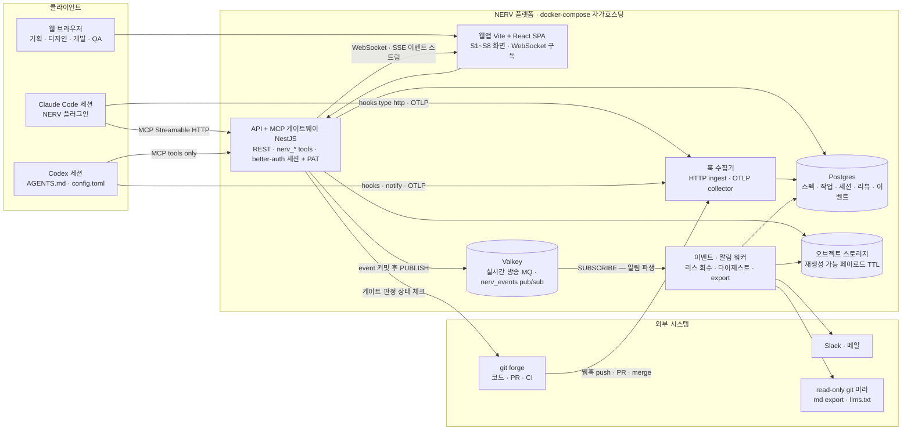
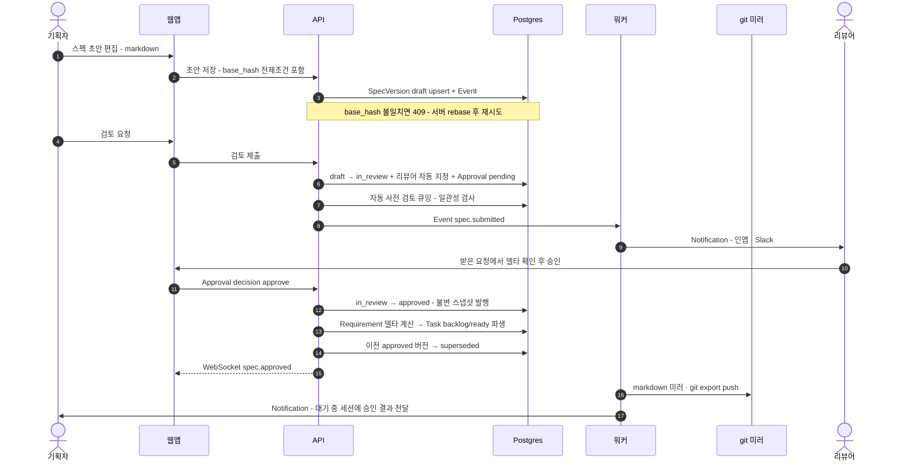
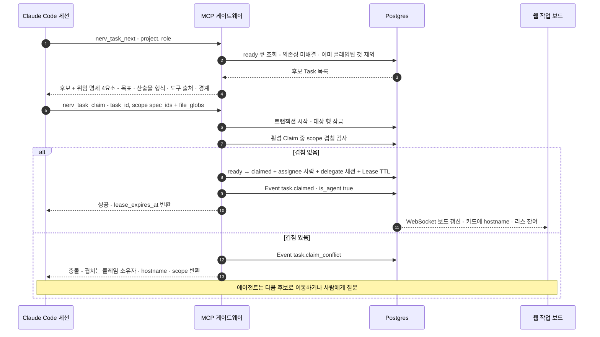
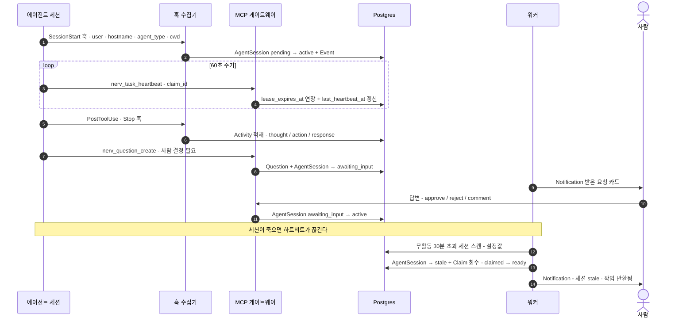
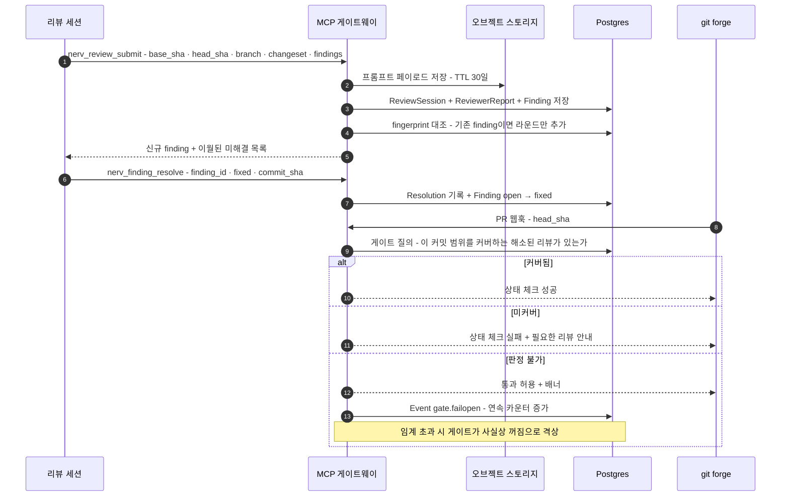
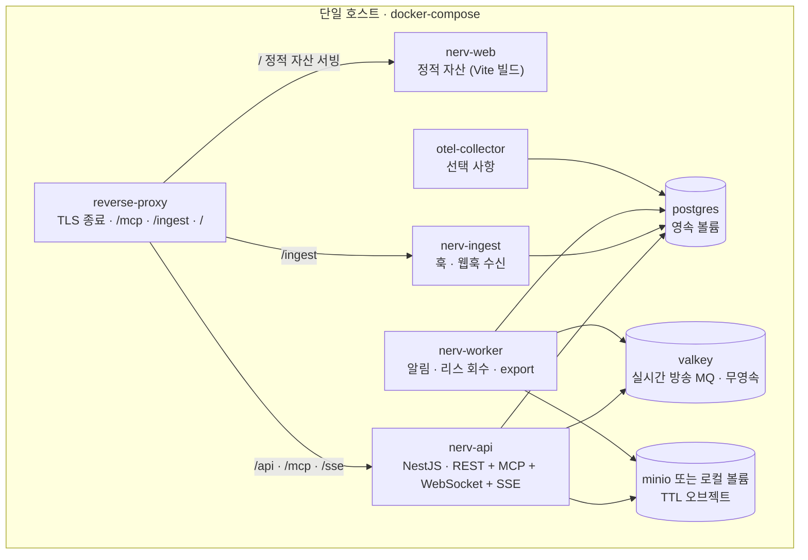

---
referenced_by:
  - 01-problem/clemvion-analysis.md
  - 01-problem/pain-points.md
  - 02-research/spec-driven-development.md
  - 02-research/collab-platforms.md
  - 02-research/integration-tech.md
  - 03-proposal/vision.md
  - 03-proposal/data-model.md
  - 03-proposal/agent-integration.md
  - 03-proposal/spec-workflow.md
  - 03-proposal/ui-wireframes.md
  - 03-proposal/roadmap.md
  - 04-mvp/scope.md
  - 04-mvp/codebase.md
  - 04-mvp/database.md
  - 04-mvp/api.md
  - 04-mvp/screens.md
  - 04-mvp/backlog.md
  - README.md
---
# 시스템 아키텍처

> **요약** — NERV(가칭)는 웹앱(Vite + React SPA), API + MCP 게이트웨이(NestJS), 훅 수집기, Postgres, Valkey(실시간 방송 MQ), 이벤트·알림 워커의 여섯 덩어리와 git forge·Slack 연동으로 구성된다. 가장 중요한 결정은 저장 전략(D-01)이다: **스펙과 리뷰 산출물의 단일 진실은 플랫폼 DB**이고, git에는 사람이 읽고 grep할 수 있는 **read-only markdown 미러**와 포인터만 남기며, 에이전트는 markdown으로 읽되 **쓰기는 MCP/API 한 경로로만** 한다. 근거는 추정이 아니라 실측이다 — clemvion에서 리뷰 이력 blob 60.7MB가 `.git` packed blob 바이트의 60%를 차지했고(`review/` 산출물은 markdown 13,777개·131MB), 리뷰가 코드와 같은 브랜치에 커밋되어 다음 리뷰의 입력이 되는 자기증식 루프(한 changeset 8라운드, 마지막 라운드 프롬프트 94파일 중 86개가 이전 리뷰 산출물)가 관측됐다. 이 문서는 컴포넌트별 책임, 저장 전략, 핵심 데이터 흐름 4종(스펙 승인 · 작업 클레임 · 세션 하트비트/stale · 리뷰 수집→게이트 판정), 기술 스택(D-11) 대안 비교, 멀티테넌시·보안·성능·백업·로컬 폴백(NFR-05)까지를 구현 착수가 가능한 수준으로 기술한다.
>
> 문서 버전 v0.5 · 2026-09-06 · HTML 파생본: [architecture.html](../html/architecture.html)

> v0.5 변경(2026-09-06 — 컴포넌트 그림이 옛 인증을 적고 있었다, 정합성 대조 → 사람 지시): 구성도의 API 노드가 "REST · nerv_* tools · **OAuth 2.1**" 이었다 — 2026-08-20 인증 확정으로 MVP 는 **better-auth 세션 + PAT 2경로**이고 OAuth 2.1 은 Phase 2 다([4.1](../04-mvp/scope.md) §2.1). §7 리서치 인용의 OAuth 서술은 MCP 표준을 인용하는 자리라 그대로 둔다.
>
> v0.4 변경(2026-09-05 — 용어 사전 반영, 사람 지시): [용어 사전](../glossary.md)의 채택어로 이 문서의 낱말을 옮긴다 — 기준선(← 베이스라인) · 워크플로우(← 워크플로) · 권한/소속/작업 범위(← 스코프) · 버전(← 판) · 고정 ID(← 안정 ID·키). **뜻은 바뀌지 않는다** — 코드·API 식별자는 그대로다.
>
> v0.3 변경(2026-09-05 — 걷어낸 인자를 현재처럼 적고 있었다, 정합성 감사): §3 시퀀스와 §4 산문의 저장 전제조건을 `base_version` 에서 **`base_hash`(본문 지문)** 로 고친다 — [4.4](../04-mvp/api.md) §1.4g 가 2026-08-30 에 표면에서 걷은 이름이다. `base_version_id` 열은 그대로다(파생 계보는 서버가 채운다).
>
---

## 1. 아키텍처 개요

### 1.1 설계 원칙 네 가지

이 문서의 모든 구조 결정은 아래 네 원칙에서 파생된다. 앞의 셋은 [문제 정의와 요구사항](../01-problem/pain-points.md)의 P1~P8에서, 넷째는 [clemvion 하네스 분석](../01-problem/clemvion-analysis.md)이 검증한 운영 경험에서 나왔다.

1. **서버가 진실이다.** 조정에 필요한 모든 상태(스펙 버전, 작업 클레임, 세션 생존, 리뷰 커버리지)는 서버 DB에 있다. clemvion의 조율 상태는 전량 gitignored 로컬 파일이라 다른 호스트에서 보이지 않았고, 그래서 스펙 동시수정 자동 검출 기능이 "다른 머신·세션이면 로컬에 안 보여 신뢰할 수 없다"는 이유로 제거됐다(`clemvion:.claude/docs/worktree-policy.md` §3, #576). 서버가 모든 세션의 선언을 보면 그 기능은 복원된다.
2. **에이전트 인터페이스는 tools 우선, 포맷은 markdown.** Codex는 MCP의 resources·prompts·elicitation을 소비하지 못하므로 스펙 조회·작업 클레임·리뷰 제출 같은 핵심 동작은 전부 tools로 제공한다(D-05). 본문 포맷은 블록 JSON이 아니라 markdown이다 — 토큰 밀도 때문에 Notion이 호스티드 MCP에서 내린 것과 같은 결론이다.
3. **이벤트는 append-only, 실시간은 WebSocket + SSE 다중 채널.** 전면 이벤트 소싱은 하지 않는다(D-10). Event 테이블 하나가 활동 피드·알림·감사 로그의 단일 원천이 되고, 화면 갱신은 WebSocket으로, 브라우저 밖 소비자(CLI·외부 도구)는 SSE로 같은 이벤트를 받는다(NFR-02). 두 채널의 방송 버스는 Valkey pub/sub 하나다(2026-08-21 확정).
4. **게이트는 fail-open + 관측 + 격상.** 판정 불가 시 작업을 멈추지 않되 배너와 연속 카운터를 남기고, 임계 초과 시 "게이트가 사실상 꺼짐"으로 격상한다(D-14). clemvion이 `_lib/failopen_state.py`의 3회 연속 임계로 5개월 검증한 패턴을 서버로 옮긴 것이다.

> **D-01 — 스펙·리뷰 산출물은 git이 아니라 플랫폼 DB에 저장한다.** 코드는 지금처럼 git에 둔다. git에는 read-only 미러/내보내기와 포인터(ID/URL)만 남긴다. 상세 설계와 근거는 §2.

### 1.2 전체 구성도



### 1.3 컴포넌트별 책임

| 컴포넌트 | 책임 | 하지 않는 일 | 관련 FR/NFR |
| --- | --- | --- | --- |
| **웹앱** (Vite + React SPA) | S1~S8 화면 렌더링, markdown 편집기·프리뷰·diff 뷰, 받은 요청 원클릭 액션, WebSocket 구독으로 보드 실시간 갱신 | 비즈니스 규칙 판정(전부 API에 위임), 에이전트 인증 | FR-08·11·13 / NFR-02 |
| **API + MCP 게이트웨이** (NestJS) | REST/RPC + Streamable HTTP MCP 엔드포인트 + WebSocket·SSE 실시간 채널을 **같은 도메인 서비스 위에** 노출(같은 Nest 모듈의 provider를 여러 표면이 주입받는다). 상태 전이 트랜잭션, 클레임 원자성, 게이트 판정 SQL, OAuth 2.1 리소스 서버 | 장기 실행 작업(워커로), 모델 호출(에이전트 하네스가 담당) | FR-01~11·14·15 / NFR-02·03 |
| **훅 수집기** (HTTP ingest + OTLP) | Claude Code `type:"http"` 훅과 Codex hooks/notify를 토큰 인증으로 수신해 202로 즉시 응답하고 큐에 적재. OTLP는 정량 관측용 별도 경로 | 차단 **판정의 산출**(판정은 API가 하고 수집기는 응답을 중계한다). 단 `Stop` 훅만 동기 판정 경로다 | FR-07·08·16 / NFR-02·04 |
| **Postgres** | 스펙·요구사항·작업·클레임·세션·활동·리뷰·발견사항·승인·이벤트·알림의 단일 진실. 게이트 판정도 여기서 SQL로 | 대용량 blob 보관(오브젝트 스토리지로), 실시간 방송(Valkey로) | FR-01~17 |
| **Valkey** (실시간 방송 MQ) | `nerv_events` pub/sub 채널 — WebSocket·SSE·워커 팬아웃의 단일 방송 버스. EventService가 커밋 후 PUBLISH, 각 API 파드·워커가 SUBSCRIBE | 영속 데이터 보관 — pub/sub 전용·무영속이며 유실은 허용된다(진실은 Postgres — D-14) | NFR-02 |
| **이벤트·알림 워커** | Event 소비 → Notification 생성·라우팅(인앱/Slack/메일), 만료 리스 회수, 무활동 세션 stale 전이, 다이제스트, markdown/git 미러 export, 보존 정책 집행 | 사용자 요청 경로의 동기 처리 | FR-06·07·12·17 / NFR-01 |
| **오브젝트 스토리지** | 리뷰 프롬프트 페이로드·대용량 첨부처럼 **커밋 SHA로 재생성 가능한 입력**을 TTL로 보관 | 결론(SUMMARY·Finding·Resolution) 보관 — 이건 DB 영구 | FR-09 |
| **git forge 연동** | push·PR·merge 웹훅 수신으로 Task/Evidence 상태 자동 전이, 서버 게이트 판정을 PR 상태 체크로 반환 | 코드 호스팅·CI 실행 자체를 대체하지 않음 | FR-10·13·16 |
| **로컬 하네스** (클라이언트) | worktree 격리, CWD/branch 즉시 차단, 로컬 린트·테스트, 비상 BYPASS | 조정 상태 보관·게이트 최종 판정(서버로 이동, D-12) | NFR-05 |

### 1.4 경계 — NERV가 대체하지 않는 것

- **코드 호스팅과 CI를 대체하지 않는다.** 코드·PR·파이프라인은 git forge에 그대로 둔다. NERV는 웹훅으로 관측하고 상태 체크로 게이트를 되돌려 준다.
- **모델 호출과 과금을 대신하지 않는다.** 에이전트 실행은 각자의 하네스(Claude Code·Codex) 경로를 쓴다. NERV는 산출물 업로드와 상태 보고만 받는다 — clemvion이 "plan-metered 하네스 경로만 허용, SDK 직접 호출 금지"로 정한 원칙과 같은 이유다.
- **실시간 공동 편집은 MVP에 넣지 않는다**(D-09, Phase 3). 근거는 §4.2의 에디터 항목.

---

## 2. 저장 전략 (D-01)

### 2.1 무엇을 어디에 두는가

| 데이터 | 저장소 | 이유 |
| --- | --- | --- |
| 코드·테스트·설정 | **git forge** | 코드는 원래 git의 것. 브랜치·diff·머지가 그대로 필요하다 |
| 스펙 본문·SpecVersion·Requirement | **Postgres**(+ md 미러) | 구조화 질의, 승인 워크플로우, 비개발자 접근, 고정 ID 참조 |
| Task·의존성·Claim/Lease | **Postgres** | 원자적 전이와 겹침 검사에 트랜잭션이 필수(D-04) |
| AgentSession·Activity | **Postgres** | 크로스 호스트 가시성이 존재 이유. 파일로는 원리적으로 불가 |
| ReviewSession·Finding·Resolution | **Postgres** | git 비대화의 주범이자 append-only 성격. fingerprint dedup은 DB 인덱스의 일 |
| 리뷰 프롬프트 페이로드·대용량 첨부 | **오브젝트 스토리지(TTL)** | 커밋 SHA로 재생성 가능한 입력. clemvion도 `_prompts/`(리뷰 전체의 ~70%)를 같은 이유로 git에서 제외했다 |
| Event·Notification | **Postgres**(append-only, 월 파티션) | 감사·피드·알림의 단일 원천(D-10) |
| 사람이 읽는 스냅샷 | **read-only git 미러** | 감사·백업·grep·오프라인. 쓰기 경로 아님 |

### 2.2 근거 ① — clemvion 실측

> **근거 · git을 문서 DB로 쓴 결과.** `review/`에 markdown **13,777개·131MB**(code 9,070 + consistency 4,697 + spec-coverage 10)가 누적됐고, review 이력 blob **60.7MB는 `.git` packed blob 바이트의 60%**다. 전체 커밋 2,464개 중 **937개(38%)** 가 `review/`를 건드렸고, **73일간 리뷰 세션 1,891개**(일평균 26개, 현 추세 월 ~7,000파일/~50MB 증가)가 쌓였다. 결정적인 것은 **자기증식 루프**다 — 산출물이 코드와 같은 브랜치에 커밋되니 한 changeset이 8라운드를 돌았고, 마지막 라운드 리뷰 프롬프트 **94파일 중 86개가 이전 `review/**` 산출물**이라 정작 소스 diff가 컨텍스트 예산에서 밀려났다.

운영자는 이미 세 번 대응했다. `_prompts/` gitignore(리뷰 전체의 ~70% 제거), 2026-05-30 과거 세션 대량 삭제, 그리고 `review/` 전체 gitignore 시도 후 **2일 만에 롤백**(게이트와 plan이 커밋된 산출물에 의존). 세 번째 실패가 핵심을 드러낸다 — 게이트가 파일 존재에 의존하는 한 산출물은 git을 떠날 수 없다. **게이트 판정을 서버 SQL로 옮기는 것과 산출물을 DB로 옮기는 것은 같은 작업이다.**

부수 효과도 실측됐다. `_retry_state.json`이 `…/.claude/worktrees/<...>/review/code/2026/08/13/…` 절대경로를 담고 있어 worktree가 정리되면 경로가 죽고, 리뷰가 검토한 커밋 SHA·diff base·브랜치는 `meta.json`에 **필드 자체가 없어** 산문과 경로 부산물로만 남았다(표본 SUMMARY 200개 중 47개만 해시 언급). 출처 추적(P5)이 무너지는 지점이다.

### 2.3 근거 ② — 협업 문서 도구의 수렴 진화

- [The data model behind Notion's flexibility — Notion](https://www.notion.com/blog/data-model-behind-notion) — (2021-05-18) 모든 콘텐츠를 UUID·type·properties·content·parent를 가진 "블록" 행 하나로 모델링하고 권한은 parent 포인터로 상속한다. 블록 ID가 코멘트 앵커·출처 추적의 안정 단위가 된다.
- [Herding elephants: sharding Postgres at Notion — Notion](https://www.notion.com/blog/sharding-postgres-at-notion) — (2021-10-06) 블록 테이블을 workspace ID 파티션 키로 480 논리 샤드에 분산. **문서를 DB 행으로 두는 모델이 Postgres에서 초대형 규모까지 실증**됐고, NERV의 자연 파티션 키는 프로젝트 ID다.
- [Confluence Cloud REST API — Content versions](https://developer.atlassian.com/cloud/confluence/rest/v1/api-group-content-versions/) — (2026-08-13 확인) 저장마다 정수 버전이 올라가고, 과거 버전 복원은 **새 버전을 생성**하며 이력 자체는 불변이다. SpecVersion 설계의 사실상 표준 인터페이스.
- [Defining and Implementing Requirements Baselines — Jama Software](https://www.jamasoftware.com/requirements-management-guide/requirements-gathering-and-management-processes/defining-and-implementing-requirements-baselines/) — (2026-08-13 확인) baseline = "합의·검토·**승인**된 요구사항 집합의 시점 스냅샷", 승인 후 변경은 변경 통제로 영향 평가. NERV의 `approved` SpecVersion = baseline, CR = 변경 통제다(D-02 · FR-04).
- [reverse-linear-sync-engine](https://github.com/wzhudev/reverse-linear-sync-engine) — (2026-08-13 확인, Linear CTO 공인) **서버가 단일 진실**이고 모든 변경에 단조 증가 sync id를 부여해 델타로 방송하며 충돌은 중앙 전순서 기반 last-writer-wins. CRDT 없이 실시간 협업 트래커가 성립함의 증명.
- [steveyegge/beads](https://github.com/steveyegge/beads) — (2026-08-13 확인) 에이전트용 이슈 트래커가 이슈·상태를 버전 관리 SQL DB에 두고 git에는 교환 포맷만 얹는다. "산출물은 DB, git엔 참조"가 에이전트 도구 쪽의 답이기도 하다.
- [About large files on GitHub — GitHub Docs](https://docs.github.com/en/repositories/working-with-files/managing-large-files/about-large-files-on-github) — (2026-08-13 확인) 저장소는 이상적으로 1GB 미만 권장. 기계 생성 산출물은 "코드"가 아니라 앱 데이터이므로 git 이력에서 빼라는 취지.
- [Docs as code is a broken promise — thisisimportant.net](https://thisisimportant.net/posts/docs-as-code-broken-promise/) — (2024-04-10) git 학습곡선, 원시 마크업 PR 리뷰, 강제되지 않는 프로세스가 비개발자 참여의 병목. NERV의 목표 사용자(기획·디자인·QA)와 정면 충돌하는 지점이다(P7).

반대 논거도 분명하다. 에이전트 SDD 생태계의 주류는 여전히 git 속 markdown이고([GitHub Spec Kit](https://github.com/github/spec-kit), [ADR](https://adr.github.io/)), 코드와 스펙 변경이 한 커밋에 묶이는 원자성·오프라인·도구 무의존이 그 장점이다. 그래서 결론은 "DB냐 git이냐"가 아니라 **하이브리드 미러**다.

### 2.4 하이브리드 미러 설계

> **결론.** ① **DB가 단일 진실**이고 쓰기 경로는 MCP/API 하나뿐이다. ② 읽기는 **markdown 미러**로 제공한다 — 문서별 `GET /api/specs/{id}.md`와 프로젝트 루트 `llms.txt` 인덱스. ③ 프로젝트 단위 **read-only git export**를 두어 감사·백업·grep·오프라인을 흡수한다. ④ 양방향 동기화는 실증돼 있으나(GitBook Git Sync) 구축 비용이 커 Phase 3로 미룬다.

**(a) markdown 미러 (에이전트·사람 공용 읽기 경로)**

에이전트에게 블록 JSON이 아니라 markdown을 주는 것은 Notion이 호스티드 MCP를 만들며 내린 공식 결론이다 — 계층형 JSON은 다중 호출과 과다 토큰을 유발하는 반면 markdown은 LLM 토큰당 콘텐츠 밀도가 높다. URL에 `.md`를 붙인 클린 마크다운 미러와 루트 인덱스는 이미 표준(llms.txt v2)이며 Anthropic·OpenAI·Google이 자사 개발자 문서에 적용하고 있다.

- `GET /api/projects/{p}/specs/{id}.md?version=approved` — 기본은 최신 `approved` SpecVersion, `?version=42`로 특정 스냅샷.
- 응답 frontmatter에 고정 ID·버전·문서 상태·승인자·요구사항 ID 목록을 실어 에이전트가 인용할 수 있게 한다. 경로·앵커가 아니라 **고정 ID로 상호참조**한다(D-09).
- `GET /api/projects/{p}/llms.txt` — 스펙 트리 인덱스(제목 + `.md` 링크 + 한 줄 설명).

**(b) read-only git export (감사·백업·오프라인)**

워커가 SpecVersion 승인·CR 병합·야간 배치 시점에 미러 저장소로 강제 push한다. 사람이 손으로 커밋하지 않으며, 미러 브랜치는 보호 설정으로 직접 쓰기를 막는다.

```text
nerv-export/                      # read-only · 플랫폼만 push
  llms.txt                        # 스펙 트리 인덱스 (llms.txt v2 형식)
  manifest.json                   # {spec_id: {version, status, approved_at, sha}} 전량
  specs/
    2-navigation/
      4-integration.md            # frontmatter: nerv_id · version · status · requirements[]
  requirements.tsv                # REQ ID · 스펙 · 구현 상태 · 증적 링크 (grep·diff용)
  tasks/
    open.md                       # ready/claimed/in_progress 스냅샷 (누가·어느 호스트)
  reviews/
    findings-open.md              # 미해결 finding 요약 (본문 아님, 링크만)
```

커밋 메시지는 `export(spec): <spec_id>@v<n> approved by <user>` 형태로 출처를 남긴다. **리뷰 본문은 미러에 넣지 않는다** — 그게 §2.2의 자기증식 루프를 다시 만드는 유일한 길이기 때문이다. 미러에는 요약과 링크만 둔다.

**(c) 에이전트 오프라인 컨텍스트 팩**

`nerv_bootstrap` 응답을 로컬 `.nerv/cache/`에 캐시해 플랫폼이 죽어도 세션이 계속 읽을 수 있게 한다(NFR-05). 팩 구성: 내가 클레임한 Task와 위임 명세 4요소, 그 Task가 참조하는 승인된 SpecVersion 본문 md, 관련 Requirement 목록, 현재 게이트 정책, 미해결 Finding 요약. 쓰기는 `.nerv/outbox/`에 멱등 키와 함께 큐잉했다가 복구 후 재전송한다. 상세 규약은 [에이전트 연동 설계](agent-integration.md), 폴백 동작은 §5.6.

### 2.5 보존 정책 — 결론은 영구, 입력은 TTL

clemvion에서 검증된 2층 구조를 그대로 채택한다(D-07). **결론**(SpecVersion, Finding, Resolution, Approval, Event)은 영구 보존한다. **재생성 가능한 입력**(리뷰 프롬프트 페이로드, 대형 첨부, 원시 훅 페이로드)은 오브젝트 스토리지에 TTL(기본 30일)로 두고 커밋 SHA로 언제든 재생성한다. 이 분리만으로 clemvion 기준 리뷰 저장량의 ~70%가 영구 저장에서 빠진다.

Activity(세션 활동 스트림)는 볼륨이 가장 큰 축이므로 프로젝트별 보존 기간을 설정값으로 두고, 만료 시 세션 단위 요약으로 압축한다. 개인정보는 이벤트 본문에 직접 넣지 않고 사용자 ID 참조로만 둔다 — [Event Sourcing Pattern — Microsoft](https://learn.microsoft.com/en-us/azure/architecture/patterns/event-sourcing)이 경고하는 삭제권 충돌을 피하기 위해서다. 같은 문서가 "프로토타입·MVP에는 전면 이벤트 소싱이 부적합하며 이득이 큰 부분에만 선택 적용하라"고 명시하는데, D-10이 정확히 그 선택 적용이다.

---

## 3. 데이터 흐름 시퀀스

핵심 흐름 네 가지다. 각 흐름 끝의 상태값과 번호는 [데이터 모델](data-model.md)·[스펙 워크플로우와 거버넌스](spec-workflow.md)와 동일 어휘를 쓴다.

### 3.1 스펙 승인 (FR-02 · FR-11 · D-02)



핵심은 세 가지다. **불변 스냅샷** — 승인은 새 버전을 발행하고 이전 approved는 `superseded`가 된다(복원도 새 버전 생성, Confluence 모델). **낙관적 동시성** — 저장 요청은 `base_hash`(본문 지문)를 전제조건으로 받고 불일치 시 409를 돌려 재시도하게 한다. CRDT 없이 이 모델로 충분한 이유는 §4.2. **파생 계산** — 승인 순간 Requirement 델타로부터 Task가 자동 생성되므로, "승인했는데 아무도 몰라서 아무 일도 안 일어나는" 공백이 사라진다.

### 3.2 작업 클레임과 겹침 검사 (FR-05 · FR-06 · D-04)



**ID는 서버가 발급하는 해시 기반**이라 파일 기반 순번 충돌(Spec Kit 디스커션 #497·#2116이 미해결로 남긴 문제)이 원천 소멸한다. 클레임은 assignee 설정과 상태 전이를 한 트랜잭션에서 처리하므로 두 세션이 같은 Task를 잡을 수 없다. scope 겹침 검사는 clemvion이 로컬 한계로 **삭제했던** 기능(`plan_coherence`, #576)의 복원이다 — 서버는 모든 세션의 선언을 보기 때문에 성립한다. 겹침 시 차단할지 경고만 할지는 프로젝트 정책으로 둔다(D-06의 위험도 가변 원칙).

### 3.3 세션 하트비트와 stale 처리 (FR-07 · D-13)



죽은 세션을 사람이 감시하지 않는 것이 핵심이다. clemvion은 정확히 반대였다 — worktree GC가 "동시에 열린 다른 세션이 앵커로 쓰는 worktree의 PR이 merge되면 그 세션은 여전히 죽는다"며 **살아있는 세션 앵커 레지스트리의 필요성을 스스로 언급하고 포기**했다(`clemvion:.claude/docs/worktree-policy.md` §7). AgentSession 테이블이 바로 그 레지스트리다. 임계값 30분과 SLA 모델은 Linear의 Agent Session 규약(무활동 30분 stale)과 같은 값을 채택한다.

### 3.4 리뷰 수집과 게이트 판정 (FR-09 · FR-10 · D-07 · D-14)



이 한 장이 clemvion의 1,005줄짜리 push 훅을 대체한다. 그 훅은 `git push` 명령 텍스트를 정규식으로 blind-match하고(ReDoS 3회 수정 이력), 리뷰 신선도를 파일 mtime이 아닌 "세션 디렉토리 경로 타임스탬프 vs 커밋 author date"라는 rewrite-immune 시계로 비교해야 했다. **커밋 SHA와 ReviewSession 사이에 FK 하나만 있으면 그 전부가 단순 SQL이 된다.** 게다가 훅은 그 머신의 Claude Code Bash 호출에만 걸리므로 훅 미설치 클론이나 다른 호스트에서의 push는 규칙 밖이었다 — 서버 게이트는 그 구멍을 막는다.

Finding fingerprint는 라운드 간 동일성을 보장한다. clemvion에는 이 축이 없어 8라운드 재리뷰에서 같은 유예 항목이 매번 재서술됐다. 자기보고와 산출물은 분리 검증한다 — "서버에 업로드된 산출물만 진실"(D-14)이며, 이는 clemvion의 "디스크가 arbiter, 파일 없는 자기보고 success는 가짜" 원칙의 서버 번역이다.

---

## 4. 기술 스택 (D-11)과 대안 비교

### 4.1 선택 요약

**전 계층 확정.** 웹앱(Vite)·API(NestJS)는 2026-08-14에, 쿼리(Drizzle)·인증(better-auth)·실시간(WebSocket)·에디터(TipTap)·배포(로컬 compose/운영 k8s)는 2026-08-20에 확정했다. 2026-08-21에 실시간 채널을 **WebSocket + SSE 다중 채널**로 확장하고 팬아웃 **방송 MQ를 Valkey pub/sub**로 확정했다(확정 전문은 [4.1 MVP 범위와 스택 확정](../04-mvp/scope.md) §2). Phase 0 스파이크는 '결정 검증' 태스크로 백로그에 남는다.

| 계층 | 선택 | 한 줄 이유 |
| --- | --- | --- |
| 언어·저장소 구조 | TypeScript 모노레포(pnpm) | 웹·API·MCP·에이전트 SDK가 모두 TS 생태계. 스키마·타입을 패키지로 공유 |
| 웹앱 | Vite + React SPA | 모든 화면이 로그인 뒤의 사용자별 실시간 뷰라 SSR 이득이 작다. 웹 티어에 런타임이 없어 정적 자산 배포로 끝난다 |
| API·MCP 게이트웨이 | NestJS | REST와 MCP가 **같은 도메인 서비스**를 쓰도록 DI·모듈 구조가 강제한다(D-05). 가드·인터셉터로 권한 검사와 감사 로그를 횡단 관심사로 일원화 |
| DB | Postgres | 트랜잭션·부분 인덱스·JSONB·전문검색을 한 엔진에서. 클레임 원자성과 게이트 SQL이 여기 의존 |
| 쿼리 계층 | Drizzle | SQL에 가까운 표현력 — 게이트·커버리지 질의가 복잡 조인이라 ORM 추상화보다 SQL 제어권이 중요 |
| 인증 | better-auth | 자가호스팅(NFR-01) 전제에서 SaaS 종속 없이 조직·역할·API 토큰 모델을 직접 소유 |
| 실시간 | WebSocket + SSE 다중 채널 · 방송 MQ Valkey pub/sub | 웹 SPA는 WS 양방향(질문 즉답·세션 제어), 브라우저 밖 소비자(CLI·외부 도구)는 SSE 단방향 구독. 팬아웃은 Valkey `nerv_events` 하나 — EventService가 커밋 후 PUBLISH, 파드별 SUBSCRIBE |
| MCP | MCP TypeScript SDK | 2026-07-28 리비전 기준 구현 + 구 리비전 병행 서빙(§4.3) |
| 프론트 세부 | TanStack Router/Query · Tailwind + shadcn/ui · react-hook-form + zod | 타입 안전 라우트 파라미터(스펙 ID·버전), WebSocket 이벤트 → 쿼리 무효화 패턴, zod 스키마는 `packages/schema`로 API·MCP와 공유 |
| 에디터 | TipTap(markdown 직렬화) | 비개발자 WYSIWYG(P7). 지원 노드를 md 표현 가능 집합으로 제한하는 규율을 전제로 저장 포맷은 md 유지(D-09), Phase 3 CRDT(y-prosemirror) 직결 |
| 배포 | 로컬 docker-compose · 운영 k8s(kustomize) | 자가호스팅 전제(NFR-01)는 동일. 개발·소규모는 compose 한 파일, 운영은 조직 표준 k8s — clemvion이 이미 kustomize(base/overlays)를 쓴다 |

### 4.2 대안 비교

| 결정 | 선택 | 유력 대안 | 대안의 장점 | 선택 이유(NERV 조건) | 재검토 트리거 |
| --- | --- | --- | --- | --- | --- |
| 웹 프레임워크 | **Vite + React SPA** | Next.js, Remix/React Router, SvelteKit | SSR·서버 컴포넌트로 초기 렌더 비용을 서버로 이전, 파일 기반 라우팅 관례 | 전 화면이 인증 뒤의 사용자별 뷰이고 보드·세션은 WebSocket으로 계속 갱신되는 라이브 뷰다 — SSR이 그린 첫 화면도 곧바로 클라이언트가 다시 그린다. 웹 티어를 정적 자산으로 만들면 docker-compose에서 컨테이너 하나가 사라진다 | 스펙 문서 공개 열람(비로그인 링크 공유·검색 노출) 요구가 생기면 |
| API 프레임워크 | **NestJS**(Fastify 어댑터) | Hono, Fastify/Express 단독 | 웹 표준 `Request/Response` 기반이라 MCP Streamable HTTP 구현이 자연스럽고 런타임이 얇다 | REST·MCP·워커가 한 도메인 규칙을 공유해야 한다(D-05). 표면마다 게이트 판정이 갈라지는 것이 이 플랫폼에서 가장 비싼 실패라, DI로 서비스 공유를 구조가 강제하는 쪽을 택했다. `@Sse()`·가드·인터셉터로 실시간·인가·감사가 1급 | MCP 스트리밍 어댑터 계층이 유지보수 부담이 될 때 |
| 데이터베이스 | **Postgres** | MySQL, SQLite, MongoDB, Dolt | SQLite는 운영 단순, Dolt는 버전 관리 SQL(beads가 채택) | 클레임 원자성·게이트 조인·부분 인덱스·JSONB가 한 엔진에 필요. Notion이 블록 모델을 Postgres에서 초대형까지 실증 | 스펙 버전 diff를 DB 네이티브로 다뤄야 할 요구가 커지면 Dolt 재평가 |
| 쿼리 계층 | **Drizzle** | Prisma, Kysely, 순수 SQL | Prisma는 마이그레이션·툴링 성숙, Kysely는 타입 안전 쿼리빌더(Docmost 사례) | 게이트·커버리지 질의가 재귀·윈도우 함수를 쓰는 복잡 조인이라 SQL 제어권 우선 | 마이그레이션 운영 부담이 임계를 넘을 때 |
| 인증 | **better-auth** | Clerk/WorkOS, Auth.js, Keycloak | 관리형은 SSO·MFA를 즉시 제공 | 자가호스팅 필수(NFR-01) + 프로젝트 소속 PAT 발급을 직접 소유해야 함(D-08) | 엔터프라이즈 SSO 요구가 들어오면 Keycloak 연동 검토 |
| 실시간 | **WebSocket + SSE 다중 채널**(WS는 socket.io·websocket 전송만, SSE는 `/sse/*` 단방향), 방송 MQ **Valkey pub/sub** | 단일 채널 유지(WS만), 롱폴링 | 채널이 하나면 배포 산출물·프록시 규약이 단순 | 웹에서 에이전트 세션에 지시·답변을 보내는 양방향 UX(질문 즉답, Phase 2 steer) 때문에 WS를 깐다(2026-08-20). 이후 브라우저 밖 소비자(CLI·외부 도구)의 실시간 구독 요구를 수용해 SSE를 병행 채널로 확정하고(2026-08-21 — v0.1 재검토 트리거의 점화), 팬아웃 버스를 파드별 PG `LISTEN/NOTIFY`에서 **Valkey pub/sub**로 옮겼다 — PG NOTIFY의 8000B 페이로드 한도·`LISTEN` 전용 커넥션 점유·트랜잭션 풀러 비호환을 피하고 방송 부하를 DB 밖으로 격리한다. websocket 전송만 활성화해 k8s 스티키 세션을 피하고, 파드별 SUBSCRIBE라 크로스파드 socket.io 어댑터가 필요 없다 | 방송 유실 재조회 비용이 실측 임계를 넘으면 Valkey Streams(적재형)·HA 재검토 |
| 실시간 협업 편집 | **미도입**(Phase 3) | Yjs + Hocuspocus, prosemirror-collab | 오프라인 병합·동시 타이핑 | 주 작성자가 에이전트(원자적 API 저장·버전 전제조건 가능)라 동시 타이핑 빈도가 낮다. MVP부터 CRDT를 넣으면 버전 스냅샷·감사·스키마 권위가 CRDT 상태와 얽힌다 | 사람 동시 편집 요청이 반복되면 |
| 배포 | **로컬 docker-compose / 운영 k8s(kustomize)** | 단일 타깃(compose 또는 k8s만), 관리형 PaaS | 타깃이 하나면 배포 산출물 유지보수가 절반 | 온보딩·PoC·소규모 자가호스팅은 compose 한 파일이 최저 마찰이고, 운영은 조직 인프라 표준이 k8s다(clemvion `k8s/base`+`overlays` kustomize 관례). API는 무상태라 이중 타깃 비용이 낮고, 워커 replica 1·마이그레이션 Job 같은 규칙만 고정하면 된다 | 운영 규모가 단일 노드로 충분하면 k8s 생략 가능(NFR-04) |

> **주의.** 이 표의 전 행은 **확정된 결정**이다(웹·API는 2026-08-14, 나머지는 2026-08-20 — 실시간은 SSE 제안을 뒤집어 WebSocket으로 확정했다가, 2026-08-21에 재검토 트리거가 점화되어 **WebSocket + SSE 다중 채널 + Valkey 방송 MQ**로 재확정했다). "유력 대안"과 "재검토 트리거"는 결정을 뒤집을 조건이 아니라 **어떤 트레이드오프를 감수했는지의 기록**이다. 이 표의 프레임워크·라이브러리 비교는 리서치 노트에 1차 출처가 없어 URL 근거를 달지 않았다. 실증 근거가 있는 항목은 명시했다 — Yjs·Hocuspocus·TipTap 스택 실증([Docmost](https://github.com/docmost/docmost)), 서버 권위 LWW([Figma](https://www.figma.com/blog/how-figmas-multiplayer-technology-works/), [Linear](https://github.com/wzhudev/reverse-linear-sync-engine)), CRDT 반론([moment.dev](https://www.moment.dev/blog/lies-i-was-told-pt-2)), 버전 관리 SQL DB 채택([beads](https://github.com/steveyegge/beads)). Phase 0 착수 전 스택 스파이크로 검증할 것을 권한다.

### 4.3 MCP 서버 리비전 전략

MCP 최신 스펙(2026-07-28 리비전)은 Streamable HTTP에서 **프로토콜 세션(`Mcp-Session-Id`)·GET 스트림·`Last-Event-ID` 재개를 제거**하고, 모든 POST에 `MCP-Protocol-Version` 헤더와 `Mcp-Method`/`Mcp-Name` 미러 헤더를 요구한다(불일치 시 400). 서버→클라이언트 상호작용은 MRTR의 `InputRequiredResult`→재시도로, 변경 알림은 `subscriptions/listen` 응답 스트림으로 처리한다.

- 신규 리비전을 기준으로 구현하되 **2025-03-26~2025-11-25 구 리비전(세션 ID 시대)도 병행 서빙**한다. 현재 배포된 Claude Code·Codex 클라이언트가 그 리비전을 협상하기 때문이다.
- **세션 상태를 MCP 프로토콜에 결부시키지 않는다.** NERV의 세션 개념(AgentSession)은 OAuth 토큰과 DB 레코드에 묶이므로 프로토콜 리비전 변화의 영향을 받지 않는다. 이 분리가 리비전 병행 서빙을 가능하게 하는 설계 포인트다.
- 인증은 OAuth 2.1 + RFC 9728 PRM(필수) + RFC 8414 AS metadata + CIMD(DCR은 deprecated) + RFC 8707 audience 바인딩. MVP 저비용 대안으로 Claude는 `headersHelper`, Codex는 `bearer_token_env_var`로 NERV 발급 PAT를 주입할 수 있다.
- 도구 카탈로그·권한·멱등성 규약은 [에이전트 연동 설계](agent-integration.md)에서 다룬다.

### 4.4 docker-compose 자가호스팅 구성 (NFR-01)

배포 타깃은 둘이다 — **로컬·소규모 자가호스팅은 docker-compose**(이 절), **운영은 k8s(kustomize base/overlays, clemvion 관례)**. 같은 이미지 3종(`nerv-api`·`nerv-worker`·`nerv-web` 정적 자산)을 두 타깃이 공유하며, k8s 상세(마이그레이션 Job, Ingress WebSocket 업그레이드·SSE 버퍼링 해제·타임아웃, 워커 replica 1, Valkey 배치, 운영 Postgres 위치)는 MVP 구체화 문서에서 확정한다.



| 서비스 | 역할 | 비고 |
| --- | --- | --- |
| `reverse-proxy` | TLS 종료, 경로 라우팅(`/`, `/api`, `/mcp`, `/ingest`, `/sse`) | MCP는 Origin 검증 필수, SSE는 버퍼링 해제 |
| `nerv-web` | Vite 빌드 산출물(정적 자산) | 별도 런타임 없이 `reverse-proxy`가 직접 서빙 — 컨테이너를 두지 않아도 된다 |
| `nerv-api` | REST + MCP + WebSocket + SSE + 게이트 판정 | 수평 확장 가능 — 모든 브로드캐스트의 원천이 Valkey `nerv_events` 방송이라 파드별 `SUBSCRIBE`로 크로스파드 어댑터 없이 팬아웃 |
| `valkey` | 실시간 방송 MQ — `nerv_events` pub/sub | 무영속(pub/sub 전용) — 재기동 유실 허용, 진실은 DB(D-14) |
| `nerv-ingest` | 훅·웹훅 수신, 202 즉시 응답 후 큐 적재 | 에이전트 지연에 영향 주지 않도록 API와 분리 |
| `nerv-worker` | 알림·리스 회수·stale 전이·export·보존 정책 | 단일 인스턴스 가정, 잡 잠금은 DB advisory lock |
| `postgres` | 단일 진실 | 볼륨 백업 대상 1순위 |
| 오브젝트 스토리지 | TTL 페이로드 | 소규모는 로컬 볼륨으로 시작 가능 |
| `otel-collector` | 조직 정량 관측(선택) | Claude·Codex 공통 OTLP 수신 |

SPA로 바뀌면서 웹 티어는 API를 호출하지 않는다 — 브라우저가 정적 자산을 받은 뒤 `reverse-proxy`를 거쳐 API를 직접 호출한다. 그래서 `nerv-web`은 프로세스가 아니라 빌드 산출물이고, `reverse-proxy`가 그 디렉터리를 그대로 서빙하면 컨테이너 목록에서 빠진다.

최소 사양은 목표 규모(프로젝트 수십, 동시 세션 수십 — NFR-04) 기준 2 vCPU / 4GB RAM / 50GB 디스크에서 시작해 이벤트·Activity 볼륨을 보며 조정한다.

---

## 5. 멀티테넌시 · 보안 · 성능 · 운영

### 5.1 테넌시 모델 (FR-14)

Organization > Project > Membership 3계층이고 사용자와 프로젝트는 n:n이다(P8의 직접 해소). 모든 도메인 테이블은 `project_id`를 갖고 조회 인덱스는 `(project_id, …)` 복합으로 시작한다 — 블록 테이블을 workspace ID로 파티셔닝한 Notion의 선택과 같은 이유로, 질의가 대부분 단일 프로젝트 범위이기 때문이다.

격리는 **앱 레벨 강제를 1차 방어선**으로 삼는다. 저장소 계층이 요청 컨텍스트의 프로젝트 소속을 자동 주입하고, 권한 없는 질의는 타입 레벨에서 컴파일되지 않게 한다. Postgres RLS는 **2차 방어선**으로 선택 도입한다(운영 복잡도가 올라가므로 조직 요구가 있을 때). 역할은 admin · planner · designer · developer · qa · viewer 6종이며 권한 표는 [스펙 워크플로우와 거버넌스](spec-workflow.md)에 있다.

### 5.2 인증·인가와 에이전트 권한 (NFR-03 · D-08)

- **사람**은 웹 세션으로, **에이전트**는 사용자별 발급 PAT 또는 OAuth 2.1 토큰으로 인증한다. 토큰은 항상 (사용자, 프로젝트, 역할, 소속) 튜플에 묶인다.
- **권한 비확대 원칙**: AgentSession은 소유 사용자 권한의 부분집합으로만 행동한다. 위임으로 권한이 늘어나는 경로를 만들지 않는다.
- **행위자 분리**: 사람 assignee와 에이전트 delegate를 별도 필드로 둔다. "에이전트는 책임을 질 수 없다"는 Linear의 원칙을 데이터 모델로 고정한 것이고, 모든 Event에 `is_agent` 플래그를 남겨 감사 로그에서 사람과 에이전트를 구분한다(FR-16).
- **지시자 ≠ 승인자**: 작업을 지시한 사람이 그 결과를 단독 승인할 수 없다(D-06). GitHub이 Copilot PR에 적용한 규격과 같다.
- **BYPASS 기록**: 로컬 비상구는 유지하되 사용 사실을 서버 감사 로그로 보고한다. clemvion에서 `BYPASS_*`는 관측자가 본인뿐이었다.

### 5.3 프롬프트 인젝션 완화 (NFR-03)

스펙 본문은 여러 사람과 에이전트가 쓰는 **비신뢰 데이터**다. 세 가지로 방어한다.

1. **출처 래핑** — MCP 도구 응답에서 스펙 본문을 명시적 경계(예: `<nerv:spec id="…" trust="untrusted">`)로 감싸고, 본문 내 지시문을 명령으로 취급하지 않는 규약을 NERV 스킬에 못 박는다.
2. **승인 강제 도구 지정** — 파괴적·되돌리기 어려운 도구는 Claude Code의 `_meta["anthropic/requiresUserInteraction"]`으로 매 호출 사람 승인을 강제한다. Codex는 이 어노테이션이 없으므로 승인 정책 + 질문 폴링으로 대체한다.
3. **수집 경로 고정** — ingest 엔드포인트는 토큰 필수이며, 클라이언트 측에서는 `allowedHttpHookUrls`로 훅이 POST할 수 있는 URL을 NERV 도메인으로 제한한다.

### 5.4 성능 (NFR-02 · NFR-04)

| 부하 축 | 추정 | 설계 대응 |
| --- | --- | --- |
| 하트비트 | 동시 세션 50개 × 60초 주기 ≈ **0.83 req/s** | 단일 UPDATE. 부하가 아니라 무시 가능한 수준 |
| 훅 이벤트 | `PostToolUse`가 최대 볼륨. 세션당 분당 수십 건 가능 | ingest가 202 즉시 응답 후 큐 적재, 프로젝트별 이벤트 타입 샘플링·배치 옵션 |
| WebSocket·SSE 팬아웃 | 사용자 수십 × 열린 탭 = 수백 연결 | 탭당 1 연결 + 프로젝트 룸 구독(멤버십 검사 후 join). 앱 인스턴스 간 팬아웃은 Valkey pub/sub(`nerv_events`) |
| 보드 갱신 지연 | 목표 ≤5s(NFR-02), 실질 1s 이내 | 이벤트 커밋 직후 PUBLISH, 클라이언트는 재연결 시 화면 데이터를 재조회(replay 없음 — D-14) |
| 리뷰 저장 | clemvion 추세 월 ~7,000파일/~50MB | 결론만 영구 저장하면 행 단위 수 MB/월. 입력 페이로드는 TTL 오브젝트 |
| 이벤트 테이블 | 최대 성장 테이블 | 월 파티션 + 오래된 파티션 아카이브. 피드 질의는 `(project_id, created_at desc)` 인덱스 |

### 5.5 백업·복구와 감사

- **Postgres**: 일 1회 논리 백업 + WAL 아카이브로 PITR. 초기 목표는 RPO 15분 / RTO 2시간으로 잡고 운영 데이터를 보며 조정한다.
- **오브젝트 스토리지**: TTL 페이로드는 손실 허용(커밋 SHA로 재생성 가능). 첨부 파일만 백업 대상.
- **git 미러**: 사람이 읽을 수 있는 형태의 3차 사본이자 최악의 경우 스펙 자산의 생존 경로. "플랫폼에 갇힌다"는 도입 반론에 대한 실물 답변이기도 하다.
- **감사**: 모든 상태 전이가 Event로 남고 `is_agent`로 행위자 종류를 구분한다. 게이트 면제(BYPASS)와 fail-open도 이벤트다.

### 5.6 로컬 폴백 (NFR-05)

플랫폼이 죽어도 개발이 멈추면 안 된다. 다만 **조정이 필요한 행위는 낙관적으로 진행하지 않는다.**

| 상황 | 읽기 | 쓰기 | 조정 행위 |
| --- | --- | --- | --- |
| 정상 | API/MCP | API/MCP | 서버 판정 |
| 플랫폼 다운 | `.nerv/cache/` 컨텍스트 팩(§2.4c) | `.nerv/outbox/`에 멱등 키로 큐잉 | **신규 클레임 발급 불가**. 보유한 리스는 유예 기간 동안 유효 |
| 복구 후 | 캐시 무효화 후 재동기화 | outbox 재전송(멱등) | 유예 중 만료된 리스는 재확인 요청 |

게이트는 이때 fail-open으로 동작하되 배너와 연속 카운터를 남기고, 임계 초과 시 격상한다(D-14). 로컬 하네스에 남기는 것과 서버로 옮기는 것의 경계는 [clemvion 하네스 분석](../01-problem/clemvion-analysis.md)과 [로드맵](roadmap.md)의 마이그레이션 계획(D-12)을 따른다 — 요약하면 **레이턴시 0이 필요한 즉시 차단·격리·린트는 로컬, 상태 저장·조정·리뷰 보관·게이트 판정은 서버**다.

### 5.7 관측

수집은 이중 파이프라인이다. **훅**(Claude Code `type:"http"`, Codex hooks/notify)이 실시간 제어·세션 추적을 담당하고, **OTLP**가 조직 단위 정량 관측(세션 수·토큰·비용·툴 결정)을 담당한다. 두 파이프라인은 `session_id`와 `prompt_id`(Codex는 `turn_id`) + hostname 태그로 조인된다 — Claude Code 훅의 `prompt_id`와 OTel 이벤트의 `prompt.id`가 동일 UUID이기 때문이다. 표면별 상세는 [Claude Code/Codex 연동 기술](../02-research/integration-tech.md)에 있다.

---

## 참고 자료

### 이 문서가 인용한 clemvion 실측 근거

- `clemvion:review/` — markdown 13,777개·131MB(code 9,070 + consistency 4,697 + spec-coverage 10), 73일간 세션 1,891개(일평균 26개), 현 추세 월 ~7,000파일/~50MB 증가
- `clemvion:.git` — 148MB, review 이력 blob 60.7MB = packed blob 바이트의 60%, 전체 커밋 2,464개 중 937개(38%)가 `review/` 접촉
- `clemvion:.claude/hooks/guard_review_before_push.py` — 1,005줄 push 게이트, 정규식 blind-match + rewrite-immune 시계, ReDoS 3회 수정 이력
- `clemvion:.claude/docs/worktree-policy.md` §3 — "자동 검출은 없다", 스펙 동시수정 검출 제거 사유(#576) / §7 — 살아있는 세션 앵커 레지스트리 부재
- `clemvion:.claude/state/` — 조율 상태 전량이 gitignored 로컬 파일(세션·툴 호출 ID 키, lock 없는 JSON), 하네스 코드 약 7,600줄
- 자기증식 루프 — 한 changeset 8라운드, 마지막 라운드 리뷰 프롬프트 94파일 중 86개가 이전 `review/**` 산출물
- 보존 정책 근거 — `_prompts/`가 리뷰 전체의 ~70%, "커밋 해시로 재생성 가능"을 사유로 gitignore

### 외부 출처 (전부 리서치 노트에서 접속 확인된 URL)

- [The data model behind Notion's flexibility — Notion](https://www.notion.com/blog/data-model-behind-notion) — (2021-05-18) 문서를 블록 행으로 모델링하고 권한을 parent 포인터로 상속하는 DB 문서 모델의 원형(§2.3).
- [Herding elephants: sharding Postgres at Notion — Notion](https://www.notion.com/blog/sharding-postgres-at-notion) — (2021-10-06) workspace ID 파티션 키로 블록 테이블을 샤딩한 실증. NERV의 프로젝트 ID 파티셔닝 근거(§2.3·§5.1).
- [Notion's hosted MCP server: an inside look — Notion](https://www.notion.com/blog/notions-hosted-mcp-server-an-inside-look) — (2025-07-15) 에이전트에게는 블록 JSON이 아니라 markdown을 주는 것이 토큰 밀도상 유리하다는 공식 결론(§2.4a).
- [Confluence Cloud REST API — Content versions](https://developer.atlassian.com/cloud/confluence/rest/v1/api-group-content-versions/) — (2026-08-13 확인) 저장마다 정수 버전, 복원은 새 버전 생성, 이력 불변. SpecVersion 인터페이스 표준(§2.3·§3.1).
- [Confluence Storage Format — Atlassian](https://confluence.atlassian.com/doc/confluence-storage-format-790796544.html) — (2026-08-13 확인) 위키 원조도 본문을 파일이 아닌 DB 레코드로 저장한다(§2.3).
- [Google Drive API — Revisions](https://developers.google.com/workspace/drive/api/reference/rest/v3/revisions) — (2026-08-13 확인) 범용 SaaS의 리비전은 30일 후 자동 삭제가 기본값. 승인 스냅샷을 명시적 불변 개념으로 둬야 하는 근거(§2.5).
- [Defining and Implementing Requirements Baselines — Jama Software](https://www.jamasoftware.com/requirements-management-guide/requirements-gathering-and-management-processes/defining-and-implementing-requirements-baselines/) — (2026-08-13 확인) baseline = 승인된 요구사항의 불변 스냅샷, 이후 변경은 변경 통제. approved SpecVersion + CR 설계의 요구공학 근거(§2.3).
- [reverse-linear-sync-engine (Linear CTO 공인)](https://github.com/wzhudev/reverse-linear-sync-engine) — (2026-08-13 확인) 서버 단일 진실 + 단조 증가 sync id + LWW로 CRDT 없이 실시간 협업 성립(§2.3·§4.2).
- [Scaling the Linear Sync Engine — Linear](https://linear.app/now/scaling-the-linear-sync-engine) — (2023-06-29) 동기화 엔진을 제품 경쟁력으로 공식화한 사례(§2.3).
- [How Figma's multiplayer technology works — Figma](https://www.figma.com/blog/how-figmas-multiplayer-technology-works/) — (2019-10-16) 중앙 서버가 있으면 OT도 순수 CRDT도 아닌 서버 권위 LWW가 정석이라는 실증(§4.2).
- [Lies I was Told About Collaborative Editing, Part 2 — moment.dev](https://www.moment.dev/blog/lies-i-was-told-pt-2) — (2026-08-13 확인) 중앙 서버가 있으면 서버 권위 rebase가 CRDT보다 단순하고 감사 추적에 유리하다는 반론(§4.2).
- [Yjs](https://github.com/yjs/yjs) · [Hocuspocus](https://github.com/ueberdosis/hocuspocus) — (2026-08-13 확인) 실시간 편집이 필요해질 때의 성숙한 MIT 확장 경로(§4.2, Phase 3).
- [Docmost](https://github.com/docmost/docmost) · [Outline](https://github.com/outline/outline) — (2026-08-13 확인) "Postgres에 문서+이력+코멘트, TipTap 기반 편집"이 오픈소스로 이미 동작함을 보여주는 레퍼런스(§4.1·§4.2).
- [steveyegge/beads](https://github.com/steveyegge/beads) — (2026-08-13 확인) 에이전트용 이슈 트래커가 상태를 버전 관리 SQL DB에 두고 git에는 교환 포맷만 얹는 "산출물은 DB, git엔 참조" 패턴(§2.3·§4.2).
- [Event Sourcing Pattern — Microsoft Azure Architecture Center](https://learn.microsoft.com/en-us/azure/architecture/patterns/event-sourcing) — (2026-03-27 갱신) 전면 이벤트 소싱은 MVP에 부적합하며 이득이 큰 부분에만 선택 적용하라는 공식 권고. D-10의 근거(§2.5).
- [About large files on GitHub — GitHub Docs](https://docs.github.com/en/repositories/working-with-files/managing-large-files/about-large-files-on-github) — (2026-08-13 확인) 기계 생성 산출물은 git 이력 밖에 두라는 크기 가이드(§2.3).
- [Docs as code is a broken promise — thisisimportant.net](https://thisisimportant.net/posts/docs-as-code-broken-promise/) — (2024-04-10) 비개발자 참여 시 git 기반 문서가 병목이 되는 실무 관찰. P7의 외부 근거(§2.3).
- [GitHub Spec Kit](https://github.com/github/spec-kit) · [ADR — adr.github.io](https://adr.github.io/) — (2026-08-13 확인) git-native 스펙/결정 기록의 대표 사례이자 하이브리드 미러가 흡수해야 할 반대 논거(§2.3).
- [GitHub & GitLab Sync — GitBook](https://gitbook.com/docs/docs-as-code/git-sync.md) — (2026-08-13 확인) DB 편집기 ↔ git markdown 양방향 동기화의 상용 실증. NERV는 1단계 read-only export로 시작한다(§2.4).
- [The /llms.txt file, v2 — llmstxt.org](https://llmstxt.org/) — (v2 개정 2026-08-10) URL에 `.md`를 붙인 클린 마크다운 미러 + 루트 인덱스 표준(§2.4a).
- [MCP server — Linear Docs](https://linear.app/docs/mcp) — (2026-08-13 확인) DB 기반 도구가 에이전트와 만나는 표준 접점은 권한이 분리된 호스티드 MCP(§2.4·§4.3).
- [MCP Streamable HTTP transport (2026-07-28)](https://modelcontextprotocol.io/specification/2026-07-28/basic/transports/streamable-http) — (2026-08-13 확인) 세션·GET 스트림 제거, 필수 헤더 체계, 구 리비전 하위호환 절차(§4.3).
- [MCP Authorization (OAuth 2.1, 2026-07-28)](https://modelcontextprotocol.io/specification/2026-07-28/basic/authorization) — (2026-08-13 확인) RFC 9728 PRM 필수, CIMD 권장·DCR deprecated, RFC 8707 audience 바인딩(§4.3·§5.2).
- [Hooks reference — Claude Code Docs](https://code.claude.com/docs/en/hooks) — (2026-08-13 확인) 31종 훅 이벤트, `type:"http"` 핸들러, `allowedHttpHookUrls`. 훅 수집기 설계 근거(§1.3·§5.3·§5.7).
- [Monitoring (OpenTelemetry) — Claude Code Docs](https://code.claude.com/docs/en/monitoring-usage) — (2026-08-13 확인) 메트릭 8종·이벤트 13+종과 `prompt.id` 조인 키(§5.7).
- [Connect Claude Code to tools via MCP — Claude Code Docs](https://code.claude.com/docs/en/mcp) — (2026-08-13 확인) `.mcp.json` 배포, `headersHelper`, `requiresUserInteraction` 승인 강제(§4.3·§5.3).
- [Codex MCP — learn.chatgpt.com](https://learn.chatgpt.com/docs/extend/mcp?surface=cli) — (2026-08-13 확인) Codex는 MCP tools와 server instructions만 소비. tools-first 설계의 직접 근거(§1.1).
- [Codex hooks — learn.chatgpt.com](https://learn.chatgpt.com/docs/hooks) — (2026-08-13 확인) 11종 lifecycle hooks와 `turn_id` 페이로드(§5.7).
- [Codex 고급 설정: notify·OTel — learn.chatgpt.com](https://learn.chatgpt.com/docs/config-file/config-advanced) — (2026-08-13 확인) `notify`와 `[otel]`로 Claude Code와 대칭 수집 구성 가능(§5.7).
- [Developing the Agent Interaction — Linear Developers](https://linear.app/developers/agent-interaction) — (2026-08-13 확인) 세션 6상태 + 응답성 SLA(무활동 30분 stale), 사람 assignee/에이전트 delegate 분리(§3.3·§5.2).

### 이 문서와 연결되는 제안서 문서

- [1.2 문제 정의와 요구사항](../01-problem/pain-points.md) — 이 문서가 인용하는 FR-01~17 · NFR-01~05의 정의
- [1.1 clemvion 하네스 분석](../01-problem/clemvion-analysis.md) — §2.2·§3.4가 인용한 하네스 구성 요소의 전수 분석
- [2.4 Claude Code/Codex 연동 기술](../02-research/integration-tech.md) — §4.3·§5.7이 요약한 연동 표면 카탈로그의 상세
- [3.1 비전과 핵심 시나리오](vision.md) — 이 아키텍처가 실현하는 사용자 여정과 Build vs Buy 판단
- [3.3 데이터 모델](data-model.md) — §3의 상태 전이가 다루는 엔티티·필드·질의의 상세
- [3.4 에이전트 연동 설계](agent-integration.md) — §4.3의 MCP 도구 카탈로그와 인증·배포 상세
- [3.5 스펙 워크플로우와 거버넌스](spec-workflow.md) — §3의 흐름을 역할·권한·게이트 규칙으로 확장
- [3.6 화면 설계](ui-wireframes.md) — §1.3의 웹앱이 렌더링하는 S1~S8 화면
- [3.7 로드맵](roadmap.md) — 이 아키텍처의 단계별 구축 순서와 clemvion 마이그레이션(D-12)

