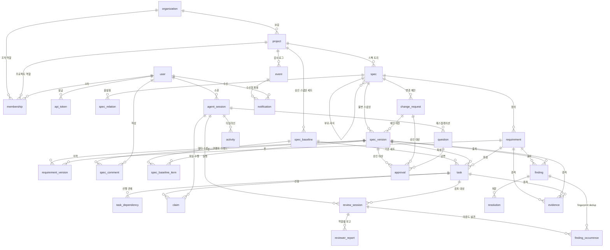
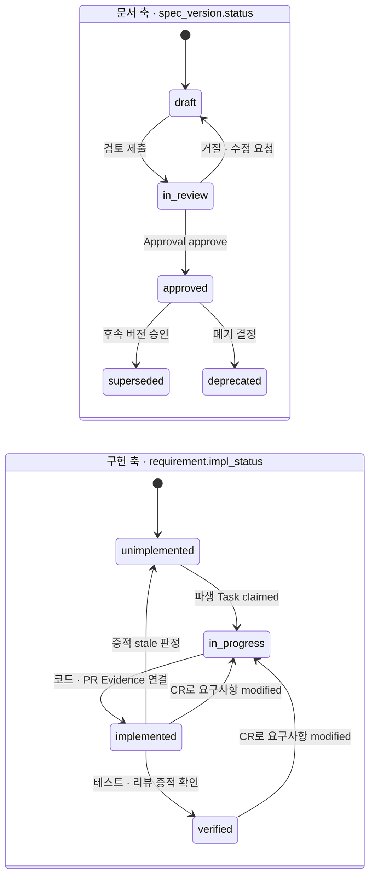

---
referenced_by:
  - 01-problem/clemvion-analysis.md
  - 01-problem/pain-points.md
  - 02-research/spec-driven-development.md
  - 02-research/agent-orchestration.md
  - 02-research/collab-platforms.md
  - 02-research/integration-tech.md
  - 03-proposal/vision.md
  - 03-proposal/architecture.md
  - 03-proposal/agent-integration.md
  - 03-proposal/spec-workflow.md
  - 03-proposal/ui-wireframes.md
  - 03-proposal/roadmap.md
  - 04-mvp/scope.md
  - 04-mvp/codebase.md
  - 04-mvp/database.md
  - 04-mvp/api.md
  - 04-mvp/screens.md
  - 04-mvp/importer.md
  - 04-mvp/backlog.md
  - glossary.md
  - README.md
  - ../AGENTS.md
---
# 데이터 모델

> **요약** — 이 문서는 NERV(가칭)가 Postgres에 담을 **테이블 37개**(도메인 엔티티 32 + 부속 5 — 2026-09-07 정정. 처음 29개로 적었고 그 뒤 늘었다)의 필드·상태 머신·관계를 구현 착수가 가능한 수준으로 정의한다. 설계의 축은 두 가지다. 첫째, **스펙 상태를 2축으로 분리**해(D-02) 문서 리뷰 축은 `SpecVersion.status`가, 구현 축은 `Requirement.impl_status`가 갖는다 — clemvion은 1,750줄 문서에 상태 값이 하나뿐이라 요구사항 단위 누락(CCH-SE-02)을 놓쳤다. 둘째, **산문과 경로 문자열로 유지되던 연결을 전부 외래키로 승격**한다 — 리뷰 `meta.json`에 커밋 SHA 필드가 아예 없어서(표본 SUMMARY 200개 중 47개만 산문에 해시 언급) 무너졌던 출처 추적이 조인 한 번이 된다. 본문은 전체 ERD와 엔티티별 필드 표, clemvion frontmatter 매핑, 대표 질의 8개(SQL)로 모델을 검증하고, 마지막에 ID·인덱스·보존 정책을 정리한다.
>
> 문서 버전 v0.14 · 2026-09-07 · HTML 파생본: [data-model.html](../html/data-model.html)
>
> v0.14 변경(2026-09-07 — 의미 정본이 열 여덟과 제약 하나를 몰랐다, 개선 계획 첫 스프린트): **새 요구사항 없음 — 코드가 옳고 문서가 낡은 자리 다섯이다.** ① **§1.3 의 33번째가 엔티티가 아니었다** — `activity_summary` 는 테이블이 아니라 `agent_session` 의 jsonb 열(`0012`)이다. 도메인 **32** + 부속 **5**(auth 셋 · `spec_chunk_embedding` · `idempotency_key`) = 37 로 [4.3 데이터베이스 스키마](../04-mvp/database.md)와 셈을 맞췄다(그쪽은 반대 방향으로 틀려 `idempotency_key` 를 도메인으로 세고 있었다). ② **필드표가 마이그레이션 다섯이 더한 열을 몰랐다** — `api_token.last_used_hostname`(`0002`) · `resolution.spec_version_id`(`0011`) · `agent_session.activity_summary`(`0012`)·`diff_files`(`0017`) · `claim.release_note`·`progress_note`(`0017`)·`project_id`, 그리고 `requirement.priority` 가 **NULL 을 받는다**는 사실(`0020` — NULL 은 `must` 의 축약이 아니라 "표기가 없었다" 는 사실이다). ③ **`spec_version.base_version_id` 의 뜻을 바로잡는다** — "낙관적 동시성의 전제조건, 불일치 시 409" 라 적었는데 그 축은 **`base_hash`** 이고 이 열은 서버가 직전 버전으로 채우는 **계보**다. 둘을 같은 칸으로 읽으면 "계보를 보내야 동시성 검사가 된다" 는 반대 결론이 나온다. ④ **§5.5 규칙 9 는 partial index 가 아니라 CHECK 다**(`spec_version_lease_draft_only_ck`) — 인덱스는 유일성을 강제하지 조건부 NULL 을 강제하지 못하므로, 문서대로 세우면 그 규칙이 DB 에서 사라진다. ⑤ **§5.4 보존 정책 중 넷은 집행되지 않는다**(`notification` 180일 · `reviewer_report` 365일 압축 · `spec_version` draft 90일 압축 · `event` 12개월 콜드) — 표는 약속이고 그 사실을 표 아래에 적었다. 곁들여 §2.6 에 **표면의 `resolution` 어휘 ↔ 저장 두 축**의 번역을 적는다(표면의 `wont_fix` 는 `kind='deferred'` + `status='wont_fix'` 이고 `resolution_kind` 에 `wont_fix` 라는 값은 없다).
>
> v0.13 변경(2026-09-06 — 의미 정본이 제약을 반대로 적고 있었다, 정합성 대조 → 사람 지시): **제약 둘 · 필드 셋 · 엔티티 넷.** ① `membership` 유일성 축에 **`role` 이 들어간다**(`0003_multi_role`) — 이 문서가 적은 `UNIQUE (user_id, coalesce(project_id, org_id))` 를 그대로 걸면 2026-08-23 확정된 **겸직이 DB 에서 차단된다**(실측 20건). ② `spec.key` 를 "변경 가능, 참조 키 아님" 이라 적고 있었다 — 2026-08-30 에 **프로젝트 안에서 유일**해졌고(`0009_spec_key_unique`) 도구 7종·URL·본문 링크가 이 키로 문서를 가리킨다. 4.3 은 이미 정정했는데 의미 정본만 반대로 남아 있었다. ③ `finding` 필드표에 **`area`·`area_inferred`·`promoted_task_id`** 를 더한다 — `area` 는 NOT NULL 이고 `category`(무슨 종류)와 **다른 축**(무엇을 고칠 것)인데 정본이 그 구별을 정의하지 않았다. ④ 엔티티 표가 29행에서 멈춰 있어 **요약(37)과 표(29)가 서로 다른 말을** 했다 — `attachment`·`finding_comment`·`invitation`·`activity_summary` 를 30~33 으로 더하고, 인프라 4종을 합쳐 37 이 되는 셈을 표 아래 적었다.
>
> v0.12 변경(2026-09-05 — 용어 사전 반영, 사람 지시): [용어 사전](../glossary.md)의 채택어로 이 문서의 낱말을 옮긴다 — 기준선(← 베이스라인) · 워크플로우(← 워크플로) · 권한/소속/작업 범위(← 스코프) · 버전(← 판) · 고정 ID(← 안정 ID·키). **뜻은 바뀌지 않는다** — 코드·API 식별자는 그대로다.
>
> v0.11 변경(2026-09-05 — 인계와 포기가 같은 값이 됐다, 정합성 감사 → 사람 결정): §2.5 `claim.release_reason` 의 값 목록을 여섯으로 고치고, **두 축**(부른 쪽이 고른 셋 · 서버가 판정한 둘)을 명기한다. 넷만 적혀 있던 동안 인계와 포기가 저장에서 구별되지 않았다([4.3](../04-mvp/database.md) v0.29).
> v0.10 변경(2026-09-05 — 의미 정본이 값 하나를 모르고 있었다, 정합성 감사): §2.7 `approval.subject_type` 이 다섯 값에서 멈춰 있었다 — `finding` 이 2026-08-23 에 더해졌고(critical 하향 A3 의 승인 카드) 4.3 DDL·enum 은 여섯인데 **의미 정본인 이 표만** 다섯이었다.
> v0.9 변경(2026-09-05 — 걷어낸 인자를 현재처럼 적고 있었다, 정합성 감사): §2.2 리스 설명의 `base_version` 을 **`base_hash`** 로 고친다. **열 이름 `base_version_id` 는 그대로다** — 걷은 것은 요청 표면의 인자이지 계보 열이 아니다.
> v0.8 변경(2026-09-05 — Phase 표기를 현황으로, 정합성 감사 → 사람 결정): 요약의 "29개 엔티티" 를 **37개**(도메인 33 + 인프라 4)로 고친다 — 이 문서가 엔티티 의미의 정본인데 그 수가 여덟 버전 낡아 있었고, 4.5·4.8 이 그 수를 그대로 인용하고 있었다.
> v0.7 변경(2026-09-05 — 죽은 권한의 마지막 자리, 정합성 감사): §2.9 `api_token.scopes` 의 예시가 `spec:write`·`review:write`·`session:write` 를 들고 있었다 — 어휘에 없는 값 셋이고, [4.3](../04-mvp/database.md) v0.24 가 이미 결함으로 지목한 그것이다. 어휘 정본이 `@nerv/schema` 의 `AGENT_SCOPES`(10종)이라는 사실과 사람 전용 둘은 토큰이 가질 수 없다는 사실을 함께 적는다.
> v0.6 변경(2026-09-02 — 사람 결정): **`in_review` 는 선택 단계다.** Task 전이 표는 `in_review → done` 만 적었는데 배포된 `/nerv:impl` 은 `in_progress → done` 으로 곧장 가고 서버도 막지 않았다 — 셋이 서로 다른 말을 하고 있었다. 표를 실물에 맞춘다: `done` 의 실질 조건(증적 · `spec_impact`)은 게이트가 이미 강제하고, `in_review` 를 필수로 만들면 아무것도 막지 못하는 형식 단계가 생긴다.
> v0.5 변경(2026-08-30 — 초안이 언제 바뀌었는지, 사람 결정): `spec_version` 에 `updated_at` 을 더한다(§2.7). draft 는 같은 행을 덮어쓰므로 `created_at` 은 "언제 만들었나"에만 답한다. DDL 정본은 [4.3](../04-mvp/database.md) §2.8.
>
> v0.4 변경(2026-08-30 — 질문의 출처와 사유, 사람 결정): `question` 에 `spec_id`·`finding_id`·`escalate` 를 더한다(§2.7). 출처는 **사람이 원문으로 가는 길**이고, 사유는 `escalate_reason` 어휘를 그대로 쓴다(§2.6 — 같은 뜻에 두 어휘를 두지 않는다). DDL 정본은 [4.3](../04-mvp/database.md) §2.8.

---

## 1. 전체 ERD와 엔티티 지도

### 1.1 이 모델을 읽는 법

모델은 3층으로 나뉜다. 각 층은 [문제 정의와 요구사항](../01-problem/pain-points.md)의 서로 다른 문제를 담당한다.

| 층 | 엔티티 | 성격 | 해소하는 문제 |
| --- | --- | --- | --- |
| **테넌시** | Organization · User · Project · Membership · ApiToken | 느리게 변하는 신원·권한 | P8 n:n 구조 부재 |
| **도메인** | Spec · SpecVersion · Requirement · RequirementVersion · SpecRelation · ChangeRequest · Task · TaskDependency · Claim · AgentSession · SpecComment | 상태 머신을 가진 살아 있는 데이터 | P1 스펙 충돌 · P2 중복 작업 · P3 버전 관리 · P4 상태 추적 |
| **기록** | Activity · ReviewSession · ReviewerReport · Finding · FindingOccurrence · Resolution · Approval · Question · Evidence · Event · Notification | append-only에 가까운 불변 기록 | P5 출처 추적 · P6 git 비대화 · P7 비개발자 참여 |

세 가지 규칙이 표 전체를 관통한다.

1. **모든 도메인 테이블은 `project_id`를 갖는다.** 질의가 거의 항상 단일 프로젝트 범위이기 때문이며, 이는 블록 테이블을 workspace ID로 파티셔닝한 Notion의 선택과 같은 이유다. 인덱스는 예외 없이 `(project_id, …)` 복합으로 시작한다.
2. **상호참조는 경로가 아니라 ID로 한다**(D-09). clemvion은 상대경로 + 헤딩 앵커로 문서를 엮어 `plan/`이 `in-progress/`에서 `complete/`로 이동하면 스펙 본문 링크가 깨지고 빌드가 실패했다(`clemvion:spec/conventions/spec-impl-evidence.md` §4.2). ID 참조에는 그 결합이 없다.
3. **행위자는 항상 (사람, 세션) 쌍으로 남긴다.** 사람 `assignee`와 에이전트 `delegate`를 분리하는 D-08의 데이터 표현이며, Event에는 `is_agent` 플래그가 함께 남는다(FR-16).

> **D-02 — 스펙 상태는 2축으로 분리한다.** ① 문서 리뷰 축: `spec_version.status` = `draft → in_review → approved → superseded / deprecated` ② 구현 축: `requirement.impl_status` = `unimplemented → in_progress → implemented → verified`. 두 축은 서로 다른 테이블에 있고, 한 문서 안의 두 요구사항이 서로 다른 구현 상태를 가질 수 있다.

### 1.2 전체 ERD



### 1.3 엔티티 한 줄 요약

| # | 엔티티 | 테이블 | 한 줄 정의 | 관련 FR |
| --- | --- | --- | --- | --- |
| 1 | 조직 | `organization` | 최상위 테넌트. 프로젝트와 멤버를 보유 | FR-14 |
| 2 | 사용자 | `user` | 사람 계정. 에이전트는 별도 계정을 갖지 않는다(D-08) | FR-14 |
| 3 | 프로젝트 | `project` | 하나의 제품/저장소 단위. 모든 도메인 데이터의 파티션 키 | FR-14 |
| 4 | 멤버십 | `membership` | 사용자×(조직 또는 프로젝트) n:n + 역할 6종 | FR-14 |
| 5 | API 토큰 | `api_token` | 사용자별·프로젝트 소속 에이전트 자격증명 | FR-15 · NFR-03 |
| 6 | 스펙 | `spec` | 트리 노드. 타입 6종, 고정 ID 보유 | FR-01 |
| 7 | 스펙 버전 | `spec_version` | 본문의 불변 스냅샷 + 문서 상태(D-02 문서 축) | FR-02 |
| 8 | 요구사항 | `requirement` | 세분 추적 단위. 고정 ID + 구현 상태(D-02 구현 축) | FR-03 |
| 9 | 요구사항 버전 | `requirement_version` | 버전×요구사항 델타(ADDED/MODIFIED/REMOVED) | FR-04 |
| 10 | 스펙 관계 | `spec_relation` | 스펙 간 참조·정제·중복 관계 | FR-01 |
| 11 | 변경 요청 | `change_request` | 승인된 스펙에 대한 수정 제안(새 draft 버전 + 델타) | FR-04 |
| 12 | 작업 | `task` | SpecVersion/Requirement에서 파생된 구현 단위 | FR-05 |
| 13 | 작업 의존성 | `task_dependency` | ready 판정을 만드는 선행 관계 그래프 | FR-05 |
| 14 | 클레임 | `claim` | 원자적 선점 + scope 선언 + TTL 리스 | FR-06 |
| 15 | 에이전트 세션 | `agent_session` | 사용자·hostname·에이전트 종류의 1회 실행 | FR-07 |
| 16 | 활동 | `activity` | 세션이 남기는 타입드 불변 로그 5종 | FR-08 |
| 17 | 리뷰 세션 | `review_session` | 검토 1회 실행 + 입력 커밋 스냅샷(필수) | FR-09 |
| 18 | 리뷰어 보고서 | `reviewer_report` | 세션×역할 개별 보고 + 커버리지 충족 여부 | FR-09 |
| 19 | 발견사항 | `finding` | 라운드 불변 fingerprint를 가진 개별 지적 | FR-09 |
| 20 | 발견 출현 | `finding_occurrence` | 어느 라운드에서 몇 번으로 보였는가(구 `SUMMARY#n`) | FR-09 |
| 21 | 해결 | `resolution` | finding 처분: 수정·유예·기각·에스컬레이션 | FR-09 · FR-10 |
| 22 | 승인 | `approval` | 사람의 결재 행위(스펙·CR·플랜·질문·면제) | FR-11 |
| 23 | 질문 | `question` | 에이전트→사람 에스컬레이션. 세션은 `awaiting_input` | FR-11 |
| 24 | 증적 | `evidence` | Requirement/SpecVersion ↔ 코드·테스트·PR·커밋 연결 | FR-13 |
| 25 | 이벤트 | `event` | append-only 상태 전이 로그(피드·알림·감사의 원천) | FR-16 |
| 26 | 알림 | `notification` | 이벤트에서 파생된 개인별 수신함 항목 | FR-12 |
| 27 | 스펙 코멘트 | `spec_comment` | 헤딩·요구사항 앵커에 달리는 스레드 코멘트(해소 추적) | FR-11 |
| 28 | 스펙 기준선 | `spec_baseline` | 프로젝트의 approved 버전 집합을 이름 붙여 동결한 스냅샷 세트 | FR-02 |
| 29 | 기준선 항목 | `spec_baseline_item` | 기준선×스펙 — 어느 approved 버전이 핀됐는가(스펙당 1개) | FR-02 |
| 30 | 스펙 첨부 | `attachment` | 스펙 버전에 매다는 시안·문서(2026-09-01 신설 · `0013_attachment`) | FR-01 |
| 31 | 발견 코멘트 | `finding_comment` | 발견 하나에 달리는 스레드(2026-09-01 · `0010_finding_comment`) | FR-09 |
| 32 | 조직 초대 | `invitation` | 조직 가입 초대 링크와 만료(2026-08-27 · `0006_invitation`) | P8 |

위 **32종이 도메인 엔티티**이고, 여기에 **부속 5종**이 더해져 테이블은 **37개**다 — [4.3 데이터베이스 스키마](../04-mvp/database.md)의 `CREATE TABLE` 개수와 같다. 부속은 better-auth 가 소유하는 셋(`auth_session`·`auth_account`·`auth_verification`) · 재생성 가능한 검색 인덱스(`spec_chunk_embedding` — §5.3) · 요청 배관(`idempotency_key` — 주체가 프로젝트가 아니라 자격증명이라 `project_id` 조차 없다)이다.

> **33 → 32**(2026-09-07 정정). 이 표는 33행이었고 그 33번째가 `activity_summary` 였는데, 그것은 **테이블이 아니라 `agent_session` 의 jsonb 열**이다(`0012` — 보존 잡이 Activity 원문을 지우기 전에 도구별 횟수를 접어 두는 자리이고, 의미는 §2.5 의 필드표에 있다). 열을 엔티티로 세면 두 가지가 함께 틀린다 — 엔티티 수와, 그 수에서 빼기로 계산하던 부속 수다. 4.3 은 반대 방향으로 틀려 있었다(`idempotency_key` 를 도메인으로 세고 `spec_chunk_embedding` 을 인프라로 셌다): **32 + 5 = 37** 로 두 문서를 맞췄다.
>
> (2026-09-06 보완: 30~33 이 표에 없어 이 문서가 요약에서는 37, 표에서는 29 를 말하고 있었다.)

> **근거 · 2축 분리가 필요한 이유.** clemvion의 `status`는 5값(`backlog`/`spec-only`/`partial`/`implemented`/`archived`)이지만 **전부 구현 축**이고 **문서 단위**다. 그 결과 (a) 초안/검토중/승인이라는 문서 상태가 존재하지 않아 "이게 합의된 내용인가"를 물을 수 없었고, (b) 1,750줄 문서(`clemvion:spec/5-system/4-execution-engine.md`)에 상태 값이 하나뿐이라 `code:` glob이 매치되면 통과해 요구사항 단위 미구현이 통과했다 — 실제 사고: "spec이 `필수`로 약속한 update dedup이 통째로 미구현"(CCH-SE-02). 요구사항별 상태를 대신하던 수동 ✅ 마크는 한 영역 131개 대 다른 영역 0개로 관행이 갈라져 이미 붕괴해 있었다.

### 1.4 두 축의 상태 머신



두 축은 서로를 참조하지만 결합하지 않는다. 새 SpecVersion이 승인돼도 이미 `verified`인 Requirement는 그대로 이월되고(`requirement_version.change_kind = 'unchanged'`), `modified`로 표시된 것만 `in_progress`로 되돌아간다. 이 계산이 CR 승인 시 영향 분석의 전부다(FR-04).

---

## 2. 엔티티 상세

타입은 Postgres 표기다(`uuid`, `text`, `timestamptz`, `jsonb`, `text[]`). 모든 테이블은 별도 표기가 없으면 `id uuid PK`(서버 발급 UUIDv7, §5.1)와 `created_at timestamptz NOT NULL DEFAULT now()`를 갖는다.

### 2.1 테넌시 — organization · user · project · membership · api_token

**`organization`**

| 필드 | 타입 | 설명 |
| --- | --- | --- |
| `id` | uuid PK | 조직 식별자 |
| `slug` | text UNIQUE | URL 식별자 |
| `name` | text | 표시 이름 |
| `settings` | jsonb | 기본 게이트 정책·보존 기간 기본값(프로젝트가 덮어쓴다) |
| `created_at` | timestamptz | |

**`user`** — 사람 계정만 담는다. Linear는 에이전트를 `actor=app` 앱 유저로 승격시키지만, NERV는 에이전트 신원을 `agent_session` + `api_token`으로 표현한다(§2.5의 판단 근거 참조).

| 필드 | 타입 | 설명 |
| --- | --- | --- |
| `id` | uuid PK | |
| `email` | citext UNIQUE | 로그인 식별자 |
| `display_name` | text | UI 표시 이름 |
| `avatar_url` | text | |
| `state` | enum | `invited / active / disabled` |
| `created_at` | timestamptz | |

**`project`**

| 필드 | 타입 | 설명 |
| --- | --- | --- |
| `id` | uuid PK | 전 도메인 테이블의 파티션 키 |
| `org_id` | uuid FK → organization | |
| `slug` | text | URL·MCP `project` 인자용 식별자(소문자 kebab, 예: `clemvion`). `UNIQUE (org_id, slug)`. 표시 접두 `key`와 별개 |
| `key` | text | 사람이 읽는 짧은 키(예: `CLV`). 표시 ID 접두사로 쓰인다 |
| `name` · `description` | text | |
| `repo_url` · `default_branch` | text | git forge 연동 대상 |
| `gate_policy` | jsonb | 위험도별 게이트 임계(D-06), fail-open 격상 임계(D-14) |
| `retention` | jsonb | Activity·프롬프트 페이로드 보존 기간(§5.4) |
| `archived_at` | timestamptz | |

**`membership`** — `project_id`가 NULL이면 조직 전체 역할이다.

| 필드 | 타입 | 설명 |
| --- | --- | --- |
| `id` | uuid PK | |
| `org_id` | uuid FK | |
| `project_id` | uuid FK NULL | NULL = 조직 전역 역할 |
| `user_id` | uuid FK | |
| `role` | enum | `admin / planner / designer / developer / qa / viewer` |
| `created_at` | timestamptz | |

제약: `UNIQUE (user_id, coalesce(project_id, org_id), role)` 표현식 인덱스로 중복 배정을 막는다 — **축에 `role` 이 들어간다**(2026-09-06 정정 · `0003_multi_role`): 겸직이 확정되면서(2026-08-23 · 실측 20건) 한 사람이 같은 프로젝트에서 두 역할을 가질 수 있고, `role` 없는 축을 그대로 걸면 그 겸직이 DB 에서 차단된다. 한 사용자가 여러 프로젝트에, 한 프로젝트가 여러 사용자에 속하는 n:n이 P8의 직접 해소다.

**`api_token`**

| 필드 | 타입 | 설명 |
| --- | --- | --- |
| `id` | uuid PK | |
| `project_id` | uuid FK | 토큰은 항상 프로젝트 소속 |
| `user_id` | uuid FK | 위임한 사람. 권한은 이 사용자의 부분집합을 넘지 못한다 |
| `name` | text | "노트북 Claude Code" 같은 사람용 라벨 |
| `token_hash` | bytea | 원문 미저장 |
| `prefix` | text | 앞 8자(식별·감사용) |
| `scopes` | text[] | `spec:read`, `spec:draft`, `task:claim`, `task:update` … — 어휘 정본은 `@nerv/schema` 의 `AGENT_SCOPES`(10종)이고, 사람 전용 둘(`spec:approve`·`approval:decide`)은 토큰이 가질 수 없다(2026-09-05 정정) |
| `expires_at` · `revoked_at` · `last_used_at` | timestamptz | |
| `last_used_hostname` | text NULL | 마지막으로 쓰인 머신(`X-NERV-Host`, `0002`). 헤더 값이라 **신뢰하지 않으며 권한 판정이 아니라 표시 전용**이다 — 유출 판단의 첫 단서다(NFR-03) |

권한 비확대는 스키마가 아니라 정책으로 강제하지만, `user_id`를 필수 FK로 두는 것이 그 정책의 데이터 기반이다 — Asana가 AI Teammate에 대해 "사용자와 동일한 권한을 상속하고 절대 확대하지 않는다"고 명시한 원칙과 같다.

### 2.2 스펙 — spec · spec_version · requirement · requirement_version · spec_relation · spec_comment · spec_baseline

**`spec`** — 트리 노드. 본문은 여기 없다.

| 필드 | 타입 | 설명 |
| --- | --- | --- |
| `id` | uuid PK | 고정 ID. 문서를 옮기거나 이름을 바꿔도 참조가 깨지지 않는다 |
| `project_id` | uuid FK | |
| `parent_id` | uuid FK NULL | 트리 부모. 권한·정렬 상속 경로 |
| `type` | enum | `vision / area / feature / design / convention / adr` |
| `key` | text | 프로젝트 내 사람이 읽는 고정 ID(예: `channel-web-chat`). **프로젝트 안에서 유일하다**(`spec_key_uq` · `0009_spec_key_unique` · 2026-08-30 결정) — 도구 7종·URL·본문 링크가 이 키로 문서를 가리키므로 참조 키다. (2026-09-06 정정: 예전에는 "변경 가능, 참조 키 아님" 이라 적혀 있었다.) |
| `title` | text | |
| `sort_key` | text | 형제 정렬(clemvion의 `0-`/`1-` 정수 접두 규약을 데이터로 흡수) |
| `current_version_id` | uuid FK NULL | 최신 `approved` 버전(없으면 최신 `draft`) |
| `owner_role` | enum NULL | 기본 리뷰어 자동 지정 힌트 |
| `archived_at` | timestamptz | 삭제 대신 아카이브(ADR 관행과 동일) |

**`spec_version`** — 불변 스냅샷.

| 필드 | 타입 | 설명 |
| --- | --- | --- |
| `id` | uuid PK | |
| `spec_id` | uuid FK | |
| `version_no` | int | 스펙 내 1부터 증가. `UNIQUE (spec_id, version_no)` |
| `status` | enum | `draft / in_review / approved / superseded / deprecated` |
| `body_md` | text | 본문(markdown 우선, D-09) |
| `content_hash` | bytea | `sha256(body_md)`. 무변경 저장 차단·중복 감지 |
| `base_version_id` | uuid FK NULL | **파생 계보다 — 어느 버전에서 갈라져 나왔는가.** 서버가 직전 `version_no` 로 채우고 부른 쪽은 주지 않는다(2026-08-30 사람 결정). 2026-09-07 정정: 이 열을 "낙관적 동시성의 전제조건, 불일치 시 409" 라 적어 왔는데 **그 축은 `base_hash` 다** — 부른 쪽은 "무엇을 보고 썼는가" 를 `content_hash` 의 지문으로 말하고, 서버가 그것을 현재 값과 비교-교환한다. 둘을 같은 칸으로 읽으면 "계보를 보내지 않으면 동시성 검사가 안 된다" 는 반대 결론이 나온다 |
| `change_summary_md` | text | 이 버전이 무엇을 바꿨는가(사람이 읽는 요약) |
| `author_user_id` · `author_session_id` | uuid FK | 사람과 에이전트를 함께 기록 |
| `change_request_id` | uuid FK NULL | CR에서 파생된 버전이면 그 CR |
| `submitted_at` · `approved_at` | timestamptz | |
| `approved_by_user_id` | uuid FK NULL | 결재자. `approval`에도 남지만 조회 편의로 비정규화 |
| `superseded_by_version_id` | uuid FK NULL | 후속 버전 |
| `edit_lease_user_id` | uuid FK NULL | 초안 편집 리스 보유자(D-04의 문서 축 확장). 리스는 1차 사전 조정 — `base_hash_id` 409는 그대로 최후 방어선이다 |
| `edit_lease_session_id` | uuid FK NULL | 보유 표면. 에이전트 세션이면 그 세션, NULL = 웹 |
| `edit_lease_expires_at` | timestamptz NULL | 리스 만료. TTL 30분 — Task 클레임 리스·stale 임계와 같은 상수 |
| `updated_at` | timestamptz | 본문이 **바뀐** 시각(저장된 시각이 아니다). draft 는 같은 행을 덮어쓰므로 `created_at` 만으로는 "언제 바뀌었나"에 답하지 못한다 — 요약만 고치는 저장·리스 갱신에는 움직이지 않는다 |

무결성 규칙: `status = 'approved'` 이후 `body_md`·`content_hash` UPDATE를 트리거로 금지한다. 과거 버전 복원은 편집이 아니라 **새 버전 생성**이다 — Confluence가 20년째 쓰는 인터페이스이고, 요구공학의 baseline 정의("합의·검토·승인된 요구사항 집합의 시점 스냅샷") 그대로다.

**`requirement`** — 구현 추적의 단위(D-03).

| 필드 | 타입 | 설명 |
| --- | --- | --- |
| `id` | uuid PK | |
| `project_id` · `spec_id` | uuid FK | |
| `ref` | text | 안정 표시 ID(예: `REQ-NAV-012`). `UNIQUE (project_id, ref)` |
| `statement_md` | text | EARS 템플릿 권장 |
| `acceptance_md` | text | 수용 기준 |
| `priority` | enum **NULL 허용** | `must / should / could`(clemvion의 필수/권장 매핑). **NULL 은 `must` 의 축약이 아니라 "원본에 표기가 없었다" 는 사실**이다(`0020` · 2026-09-06). 그전에는 NOT NULL 이라 임포터가 전건 `must` 를 넣었고, 뒤에 오는 사람은 그것을 원본의 선언으로 읽었다 |
| `impl_status` | enum | `unimplemented / in_progress / implemented / verified` |
| `introduced_in_version_id` | uuid FK | 이 요구사항이 처음 등장한 SpecVersion |
| `current_version_id` | uuid FK | 최신 본문을 담은 SpecVersion |
| `removed_in_version_id` | uuid FK NULL | 제거된 요구사항의 묘비(이력은 지우지 않는다) |
| `verified_at` | timestamptz NULL | |

**`requirement_version`** — 버전×요구사항 델타. CR 델타 뷰(FR-04)와 영향 분석이 전부 이 테이블에서 나온다.

| 필드 | 타입 | 설명 |
| --- | --- | --- |
| `requirement_id` · `spec_version_id` | uuid FK | 복합 PK |
| `change_kind` | enum | `added / modified / removed / unchanged` |
| `statement_md` | text | 그 버전 시점의 본문(스냅샷) |
| `ordinal` | int | 문서 내 표시 순서 |

**`spec_relation`**

| 필드 | 타입 | 설명 |
| --- | --- | --- |
| `id` | uuid PK | |
| `project_id` · `from_spec_id` · `to_spec_id` | uuid FK | |
| `kind` | enum | `references / refines / depends_on / duplicates / supersedes` |
| `note` | text | |

`duplicates`가 있는 이유는 clemvion의 실측 사고 때문이다 — "종결 이벤트 계약을 EIA §6 도입부 하나로 — **네 문서가 각자 필드를 열거하고 있었다**"(`9a4d3e32b`), "모방한 쪽이 맞고 원본이 틀렸다"(`c37a3732c`). 중복 서술은 drift의 근원이므로 단일 정의 + 관계 참조를 권장 규약으로 두고, 중복이 생기면 관계로 명시해 검사 대상으로 만든다(D-09).

**`spec_comment`** — 헤딩·요구사항 앵커에 달리는 스레드 코멘트(FR-11). vision의 14:30 시나리오와 S3의 코멘트 스레드가 이미 쓰고 있었는데 스키마에 없던 테이블이다(기존 결함 보수).

| 필드 | 타입 | 설명 |
| --- | --- | --- |
| `id` | uuid PK | |
| `project_id` · `spec_id` | uuid FK | |
| `spec_version_id` | uuid FK | 코멘트가 달린 시점의 버전 |
| `anchor` | text | 헤딩 slug 또는 Requirement `ref`(예: `REQ-CWC-031`) — 블록 앵커(D-09) |
| `author_user_id` | uuid FK | 사람 작성자 |
| `author_session_id` | uuid FK NULL | 에이전트가 대신 단 코멘트면 그 세션(D-08 쌍 기록) |
| `body_md` | text | |
| `status` | enum | `open / resolved` |
| `resolved_by_user_id` | uuid FK NULL | |
| `resolved_in_version_id` | uuid FK NULL | 어느 draft 버전에서 반영됐나 |
| `created_at` · `resolved_at` | timestamptz | |

코멘트는 **편집·해소되는 협업 개체**이고(본문 편집 가능, `open → resolved` 상태 전이), Activity는 **불변 로그**다(§2.5). §2.5가 인용하는 Linear 권고 — "대화 재구성은 수정될 수 있는 코멘트가 아니라 불변 Agent Activity로 하라" — 가 전제하는 편집 가능한 코멘트의 자리가 바로 이 테이블이다. 해소는 삭제가 아니라 상태 전이이고, `resolved_in_version_id`가 어느 draft 버전에서 반영됐는지를 남겨 해소 추적이 질의가 된다.

**`spec_baseline`** — 프로젝트 단위 승인 스냅샷 세트(FR-02 범위 확장, 2026-08-21 MVP 포함 확정).

스펙은 구현보다 앞서간다 — draft→approved가 빈번히 도는 동안 구현은 특정 시점의 approved **세트**를 기준으로 진행된다. SpecVersion 하나의 불변성은 문서 1건의 기준만 고정할 뿐, "그때 함께 정합이던 문서들의 조합"은 표현하지 못한다. 요구공학의 baseline 정의("합의·검토·승인된 요구사항 **집합**의 시점 스냅샷" — Jama)를 문서 1건이 아니라 프로젝트 세트에 적용한 것이 이 엔티티다. 워크플로우 규약은 [스펙 워크플로우와 거버넌스](spec-workflow.md) §3.6이 정본이다.

| 필드 | 타입 | 설명 |
| --- | --- | --- |
| `id` | uuid PK | |
| `project_id` | uuid FK | |
| `name` | text | 사람이 붙이는 이름(예: `R1`, `2026-09-릴리스`). `UNIQUE (project_id, name)` |
| `note_md` | text | 무엇을 위한 동결인가 |
| `created_by_user_id` | uuid FK | **사람 전용** — 기준선 동결은 거버넌스 행위라 에이전트 생성 경로(MCP 도구)가 없다. 에이전트는 읽기만 한다(`nerv_spec_get`의 `baseline` 인자) |
| `created_at` | timestamptz | |

**`spec_baseline_item`** — 기준선×스펙 junction. 스펙당 approved 버전 1개를 묶는다.

| 필드 | 타입 | 설명 |
| --- | --- | --- |
| `baseline_id` · `spec_id` | uuid FK | 복합 PK — 스펙당 1개 |
| `spec_version_id` | uuid FK | 핀된 버전. **approved 상태만 허용**(생성 시 서버 검증) |

무결성 규칙: 기준선은 **생성 후 불변**이다 — 항목 집합의 추가·교체·삭제는 없고, 세트를 바꾸려면 새 기준선을 만든다(approved SpecVersion 불변과 같은 원리). 핀 대상이 나중에 `superseded`가 되어도 항목은 그대로다 — 그것이 "그때의 세트"를 재현하는 존재 이유다. 참고로 특정 **시각**의 approved 집합은 기준선 없이도 `approved_at`으로 파생 가능하다(as-of 질의 — [4.4 API 명세](../04-mvp/api.md)의 manifest 엔드포인트) — 기준선은 시각 절단이 아니라 **큐레이션된 이름 있는 동결**이라는 점이 다르다.

### 2.3 변경 요청 — change_request

| 필드 | 타입 | 설명 |
| --- | --- | --- |
| `id` | uuid PK | |
| `project_id` · `spec_id` | uuid FK | |
| `base_version_id` | uuid FK | 어느 approved 버전에 대한 변경인가 |
| `proposed_version_id` | uuid FK | 제안 내용을 담은 draft SpecVersion |
| `title` · `rationale_md` | text | 무엇을 왜 바꾸는가 |
| `status` | enum | `open / in_review / approved / rejected / withdrawn` |
| `risk` | enum | `low / normal / high` — 저위험은 자동 통과 경로(D-06) |
| `origin` | enum | `human / agent / spec_drift` — 구현 중 발견된 스펙 개선의 역류 경로 |
| `created_by_user_id` · `created_by_session_id` | uuid FK | |
| `decided_at` | timestamptz | |

`origin = 'spec_drift'`는 clemvion에서 5개월 검증된 경로의 이식이다. 리뷰가 `[SPEC-DRIFT]` 태그를 달면 resolution-applier가 코드를 되돌리지 않고 `plan/in-progress/spec-update-<area>.md` 초안을 만들어 `ESCALATE=spec`으로 넘겼다. NERV에서는 그 초안이 CR 레코드가 되고, 태그 보존 의무("절대 일반 WARNING으로 뭉개지 말 것")는 `finding.tags`와 `change_request.origin`의 FK 관계로 대체된다.

### 2.4 작업 — task · task_dependency · claim

**`task`**

| 필드 | 타입 | 설명 |
| --- | --- | --- |
| `id` | uuid PK | |
| `project_id` | uuid FK | |
| `key` | text | 표시 ID(예: `CLV-T-7QF3K2`). 서버 발급 해시(§5.1) |
| `title` · `body_md` | text | |
| `status` | enum | `backlog / ready / claimed / in_progress / in_review / done / blocked` |
| `priority` | enum | `P0 / P1 / P2 / P3` |
| `source_spec_version_id` | uuid FK NULL | 파생 출처 버전 = **이 Task의 기준 버전**(구현 컨텍스트는 이 불변 스냅샷을 읽는다 — [에이전트 연동 설계](agent-integration.md) §2.4 기준 버전 규약). NULL은 임포트 레거시 전용 — 신규 생성 표면(REST·MCP)은 필수다 |
| `source_requirement_id` | uuid FK NULL | 파생 출처 요구사항 |
| `baseline_id` | uuid FK NULL | 기준 기준선(§2.2) — 이 Task가 어느 승인 세트의 맥락에서 파생됐는가. 주변 문서까지 그 세트로 읽는다 |
| `rebrief_required_at` | timestamptz NULL | 기준 버전이 `superseded`로 전이될 때 서버가 세팅 — **재브리핑 필요** 플래그의 실물([스펙 워크플로우](spec-workflow.md) §3.3). 사람이 위임 명세를 재확인하고 기준 버전을 갱신하면 해제 |
| `assignee_user_id` | uuid FK NULL | **사람** 책임자 |
| `delegate_session_id` | uuid FK NULL | **에이전트** 수행 세션 |
| `goal_md` | text | 위임 명세 ①: 목표 |
| `output_format_md` | text | 위임 명세 ②: 산출물 형식 |
| `tools_sources_md` | text | 위임 명세 ③: 사용할 도구·출처 |
| `boundaries_md` | text | 위임 명세 ④: 경계(건드리면 안 되는 것) |
| `spec_impact` | jsonb NULL | 완료 시 필수 선언: 영향 스펙 ID 목록 또는 `{"none": true}` |
| `blocked_reason` | text NULL | |
| `done_at` · `updated_at` | timestamptz | |

전이 규칙:

| 전이 | 조건 | 강제 지점 |
| --- | --- | --- |
| `backlog → ready` | 위임 명세 4요소가 모두 NOT NULL + 선행 의존성 없음/해소 | API 검증(FR-05) |
| `ready → claimed` | `nerv_task_claim` 트랜잭션 성공(scope 겹침 통과) | partial unique 인덱스(FR-06) |
| `claimed → in_progress` | 세션의 첫 `action` Activity 또는 명시 전이 | 서버 |
| `in_progress → in_review` | 산출물(PR/커밋) Evidence 1건 이상 | API 검증 |
| `in_progress`·`in_review → done` | 게이트 통과(증적 1건 이상) **AND** `spec_impact` NOT NULL | 게이트 API(FR-10) |
| `* → blocked` | 질문 미해결·의존성 역행 | 서버·수동 |

**전이의 문지기는 세 가지다**(2026-09-02 — 정합 점검). 구현은 위 표를 강제하지 않고 있었고, 그중 셋을 채웠다: ① **어휘** — 입력을 그대로 `::task_status` 로 캐스팅해 오타가 500(22P02)이 됐다(이제 400 `invalid_input`). ② **담당자** — 활성 클레임을 다른 세션이 쥐고 있어도 상태를 옮길 수 있었다(이제 보유자 또는 planner·admin). ③ **리스** — 내 리스가 만료돼 그 사이 다른 세션이 같은 Task 를 잡았어도 `done` 으로 옮길 수 있었다(이제 `NERV_LEASE_EXPIRED`). 더해 **done 은 이 문으로 되돌아오지 않는다** — 게이트를 통과해 닫힌 상태를 되살리는 것은 새 결정이다.

**`in_review` 는 선택 단계다**(2026-09-02 · 사람 확정). 표는 `in_review → done` 만 적었는데 배포된 구현 루프(`/nerv:impl`)는 `in_progress → done` 으로 곧장 가고 서버도 경로를 막지 않았다 — 셋이 서로 다른 말을 하고 있었다. **표를 실물에 맞춘다.**

이유는 `done` 의 실질 조건을 이미 게이트가 강제하기 때문이다: 증적 1건 이상과 `spec_impact` 가 없으면 `done` 으로 갈 수 없다. `in_review` 를 필수로 만들면 혼자 일하는 사람이 자기 작업을 `in_review` 로 옮겼다가 곧바로 `done` 으로 옮기는 형식 단계가 생기고, 그 단계는 아무것도 막지 못한다. 실제 리뷰가 붙는 곳은 FR-09 리뷰 세션이며 그것은 Task 상태와 **다른 축**이다.

`in_review` 는 여러 사람이 보는 보드에서 "산출물은 나왔고 아직 확인 전"을 구분하고 싶을 때 쓴다. 경로 그래프는 계속 강제하지 않는다 — 강제하는 것은 어휘·담당자·리스, 그리고 `done` 이 최종이라는 사실 넷이다.

`spec_impact`를 done 전제조건으로 둔 것은 clemvion의 Gate C(`spec-plan-completion.test.ts`) 이식이다. 그쪽은 완료 plan의 frontmatter에 영향 스펙 목록 또는 `none` sentinel을 요구했고, 이 게이트가 "작업 완료가 스펙 정합 결정을 강제 동반"하게 만든 좋은 패턴이었다.

**`task_dependency`**

| 필드 | 타입 | 설명 |
| --- | --- | --- |
| `task_id` · `depends_on_task_id` | uuid FK | 복합 PK |
| `kind` | enum | `blocks / relates` — `blocks`만 ready 판정에 영향 |
| `created_at` | timestamptz | |

**`claim`** — D-04의 실체.

| 필드 | 타입 | 설명 |
| --- | --- | --- |
| `id` | uuid PK | |
| `project_id` | uuid FK | 모든 도메인 행이 갖는다(§5.5 규칙 8) |
| `task_id` | uuid FK | |
| `agent_session_id` | uuid FK NULL | 사람이 직접 잡으면 NULL |
| `user_id` | uuid FK | 책임자(세션 소유자) |
| `status` | enum | `active / released / expired / revoked` |
| `scope_spec_ids` | uuid[] | 이 작업이 건드릴 스펙 |
| `scope_file_globs` | text[] | 이 작업이 건드릴 파일 |
| `acquired_at` | timestamptz | |
| `lease_expires_at` | timestamptz | TTL 리스. 하트비트로 연장 |
| `last_heartbeat_at` | timestamptz | |
| `released_at` · `release_reason` | timestamptz · enum | **부른 쪽이 고른 셋** `done / handoff / abandon`(표면이 받는 값은 이 셋뿐이다) + **서버가 판정한 셋** `expired`(리스 만료) · `session_end`(세션 종료로 회수) · `stopped`(사람이 중단해 회수) + **생산자가 없는 둘** `manual`(`0021` 이전의 잔재 — 그때 `session_end`·`stopped` 두 경로가 이 값으로 뭉쳐 있었다)·`conflict`(이 설계에서 겹침은 회수가 아니라 **거절**이다 — 두 번째 클레임이 막히고 첫 번째가 남는다). 축이 다르므로 같은 열에 두되 어느 쪽이 쓴 값인지가 이름으로 드러난다. 값 목록의 정본은 [1.2 문제 정의와 요구사항](../01-problem/pain-points.md) §4.1 이고 DDL 은 [4.3 데이터베이스 스키마](../04-mvp/database.md) §2.1 이다 |
| `release_note` | text NULL | **인수인계 노트**(`0017`). `nerv_task_release(state_note)` 가 채운다 — 세션 타임라인이 아니라 **클레임에** 붙는 이유는 다음 사람이 `nerv_task_next` 후보 목록에서 그것을 읽어야 하기 때문이다 |
| `progress_note` | text NULL | 하트비트의 한 줄 진행 요약(`0017` · LWW — 이력이 아니라 "지금 무엇을 하는 중인가") |

제약: `CREATE UNIQUE INDEX ON claim (task_id) WHERE status = 'active'` — 두 세션이 같은 작업을 잡는 것이 데이터베이스 수준에서 불가능해진다. 상태 전이와 assignee 설정이 한 트랜잭션이므로 경합은 하나만 통과하고 나머지는 충돌 응답을 받는다.

> **근거 · 이 테이블이 복원하는 기능.** clemvion은 스펙 동시수정 자동 검출을 **의도적으로 삭제**했다. `plan_coherence`의 worktree 경합 검출이 `3da85dc3b`(#576)에서 제거됐고 사유는 이렇다 — "병렬 작업이 다른 머신·세션에서 진행되면 로컬에 반영되지도 않아 신뢰할 수 없고, 불필요한 git/gh 조회로 토큰만 소모하기 때문." `worktree-policy.md` §3은 더 단호하다: "동일 `spec/` 파일·코드 영역을 두 worktree가 동시 수정 중이면 plan에 명시하고 직렬화한다. **자동 검출은 없다**." 서버가 모든 세션의 `scope_*` 선언을 보면 그 기능은 그대로 복원된다(§4.6 질의).

### 2.5 세션 — agent_session · activity

**`agent_session`**

| 필드 | 타입 | 설명 |
| --- | --- | --- |
| `id` | uuid PK | |
| `project_id` · `user_id` | uuid FK | 소유자(권한 상속 원천) |
| `agent_type` | enum | `claude-code / codex / web / other` |
| `agent_version` | text | 클라이언트 버전 |
| `hostname` | text | **누구의 어느 머신인가** — P8의 핵심 필드 |
| `cwd` · `worktree_path` · `branch` | text | 실행 컨텍스트 |
| `external_session_id` | text | 하네스가 발급한 세션 ID(훅 페이로드 조인 키) |
| `state` | enum | `pending / active / awaiting_input / complete / error / stale` |
| `model` | text | |
| `started_at` · `last_heartbeat_at` · `ended_at` | timestamptz | |
| `end_reason` | enum NULL | `complete / error / stopped / stale` |
| `diff_added` · `diff_removed` · `diff_files` | int | 세션 카드의 +N −M 표시. `diff_files`(`0017`)가 셋째 값인 이유는 줄 수만으로 "한 파일을 크게" 와 "여러 파일을 조금" 이 같아 보이기 때문이다 |
| `token_usage` | jsonb | 훅·OTel 수집치 |
| `current_task_id` | uuid FK NULL | 조회 편의 비정규화(진실은 `claim`) |
| `activity_summary` | jsonb NOT NULL `{}` | **원문이 사라진 뒤에도 남는 것**(`0012`). 보존 잡이 90일 지난 `activity` 를 지우기 전에 도구별 횟수를 여기 접는다 — 빈 레일은 "기록이 없다" 와 "아무것도 안 했다" 를 구별하지 못한다. **테이블이 아니라 `agent_session` 의 열**이다(2026-09-07 정정 — §1.3 이 이것을 33번째 엔티티로 세고 있었다) |

상태 전이는 D-13 그대로다: `pending → active ↔ awaiting_input → complete / error / stale`. `stale`은 사람이 아니라 워커가 만든다 — 무활동 임계(기본 30분) 초과 시 자동 전이하고 보유 클레임을 회수한다. 임계값은 Linear의 Agent Session 규약(무활동 30분 stale)과 같은 값이다.

> **근거 · clemvion이 스스로 요청한 테이블.** worktree GC(reaper)는 merge된 PR의 worktree를 정리하지만 "동시에 열린 다른 세션이 앵커로 쓰는 worktree의 PR이 merge되면 **그 세션은 여전히 죽는다**"고 한계를 명시하며 "'살아있는 세션 앵커 레지스트리'가 필요해 과하다고 판단"했다(`clemvion:.claude/docs/worktree-policy.md` §7). `agent_session`이 정확히 그 레지스트리다. 현재 세션 가시성은 statusline 2줄(자기 세션만)이 전부다.

**설계 판단 — 왜 에이전트에게 `user` 행을 주지 않는가.** Linear는 `actor=app` 앱 유저를 만들어 assignee 메뉴에 팀원처럼 노출하고 과금 시트에서 뺀다. NERV는 (a) 에이전트가 **매번 다른 호스트에서 뜨는 일회성 실행**이고 (b) 권한이 위임한 사람의 부분집합이어야 하며(D-08) (c) 감사에서 "누구의 위임인가"가 항상 필요하다는 세 조건 때문에 세션 자체를 액터로 둔다. 대신 UI 표기(AI 배지)와 `event.is_agent` 플래그로 Linear·GitHub과 같은 가시성을 제공한다.

**`activity`**

| 필드 | 타입 | 설명 |
| --- | --- | --- |
| `id` | uuid PK | |
| `session_id` · `project_id` | uuid FK | |
| `seq` | bigint | 세션 내 단조 증가. `UNIQUE (session_id, seq)` |
| `type` | enum | `thought / action / elicitation / response / error` |
| `title` · `body_md` | text | |
| `tool_name` | text NULL | `action`일 때 도구 이름 |
| `payload` | jsonb | 훅 원문에서 추출한 구조화 필드 |
| `ephemeral` | bool | 다음 활동이 오면 UI에서 접히는 진행 표시 |
| `created_at` | timestamptz | |

Activity는 **불변**이다. 편집 가능한 코멘트와 분리하라는 것은 Linear가 "대화 재구성은 수정될 수 있는 코멘트가 아니라 불변 Agent Activity로 하라"고 권고하는 바와 같다. 세션 타임라인(S5 상세)과 커밋→세션 역링크가 이 테이블 위에 선다.

### 2.6 리뷰 — review_session · reviewer_report · finding · finding_occurrence · resolution

**`review_session`**

| 필드 | 타입 | 설명 |
| --- | --- | --- |
| `id` | uuid PK | |
| `project_id` | uuid FK | |
| `kind` | enum | `code / consistency / spec_coverage / merge` |
| `trigger` | enum | `auto / manual / gate` |
| `agent_session_id` · `task_id` | uuid FK NULL | 누가 언제 돌렸나 |
| `branch` | text | |
| `head_sha` | text | **필수** 입력 스냅샷 — 검토한 커밋 |
| `base_sha` | text | **필수** diff 기준 커밋 |
| `changeset_hash` | bytea | 검토 대상 파일+내용 해시(라운드 동일성 판정) |
| `file_count` | int | |
| `round_no` | int | 같은 changeset의 몇 번째 라운드인가 |
| `previous_session_id` | uuid FK NULL | 라운드 체인 |
| `routing` | jsonb | 선별·제외 사유·강제 목록 |
| `forced_roles` | text[] | 제외 불가 리뷰어 |
| `forced_coverage_ok` | bool | 강제 리뷰어 전원 보고 여부 |
| `state` | enum | `running / complete / failed` |
| `risk` | enum | `none / low / medium / high / critical` |
| `block` | bool | consistency의 `BLOCK: YES/NO` 계승 |
| `prompt_blob_uri` · `prompt_expires_at` | text · timestamptz | 재생성 가능 입력은 TTL(§5.4) |
| `started_at` · `completed_at` | timestamptz | |

`head_sha`·`base_sha`를 NOT NULL로 두는 것이 이 문서에서 가장 값싼 개선이다. clemvion의 code 리뷰 `meta.json`에는 **커밋 SHA·diff base·브랜치 필드 자체가 없고**(`timestamp/files/agents/route_mode/agents_explicit/agents_forced`뿐), 커밋 해시는 SUMMARY 산문에만 등장했다 — 표본 200개 중 47개. 브랜치는 `_retry_state.json`의 절대경로에 **우연히** 새어 있었고, PR 번호는 머지 커밋 제목의 `(#1167)`에만 있었다.

**`reviewer_report`**

| 필드 | 타입 | 설명 |
| --- | --- | --- |
| `id` | uuid PK | |
| `review_session_id` | uuid FK | |
| `role` | text | `security`·`requirement`·`cross-spec` 등 역할 키 |
| `risk` | enum | `none / low / medium / high / critical` |
| `body_md` | text | |
| `has_report` · `forced` · `recovered` | bool | 커버리지 무결성 판정용 |
| `created_at` | timestamptz | |

**`finding`** — 라운드를 넘어 하나로 유지되는 지적.

| 필드 | 타입 | 설명 |
| --- | --- | --- |
| `id` | uuid PK | |
| `project_id` | uuid FK | |
| `fingerprint` | bytea | 라운드 불변 dedup 키. `UNIQUE (project_id, fingerprint)`(§5.2) |
| `severity` | enum | `critical / warning / info` |
| `tags` | text[] | `spec_drift` 등 |
| `category` | text | 리뷰어 역할에서 파생 |
| `title` · `detail_md` · `suggestion_md` | text | |
| `file_path` · `line_start` · `symbol` | text · int · text | 코드 위치 |
| `spec_version_id` · `requirement_id` | uuid FK NULL | **출처**: 어느 스펙·요구사항 근거인가 |
| `status` | enum | `open / fixed / dismissed / wont_fix` |
| `area` · `area_inferred` | enum · bool | **어디에 대한 지적인가**(`codebase / spec / task / process` · `0014_finding_area`). `category`(무슨 종류인가)와 **다른 축**이다 — 지적한 쪽이 가장 잘 알므로 받되, 주지 않으면 서버가 출처로 추론하고 그 사실을 `area_inferred` 로 남긴다. NOT NULL(기본 `codebase`) |
| `promoted_task_id` | uuid FK NULL | 이 발견에서 승격된 Task(`0010_finding_comment`) |
| `first_session_id` · `last_session_id` | uuid FK | 처음·마지막으로 보인 리뷰 세션 |
| `occurrence_count` | int | 반복 재확인 횟수 |

**`finding_occurrence`**

| 필드 | 타입 | 설명 |
| --- | --- | --- |
| `id` | uuid PK | |
| `finding_id` · `review_session_id` | uuid FK | `UNIQUE (finding_id, review_session_id)` |
| `reviewer_report_id` | uuid FK NULL | |
| `round_no` | int | |
| `display_no` | int | 세션 내 표시 번호 = 구 `SUMMARY#<n>` |
| `raw_severity` | enum | 그 라운드에서 리뷰어가 매긴 원 severity |
| `created_at` | timestamptz | |

`raw_severity`를 따로 남기는 이유: clemvion에서 SUMMARY가 `BLOCK: NO`인데 checker 리포트엔 `[CRITICAL]`이 있는 **하향 모순이 커밋된 732 세션 중 24건(3.3%)** 실측됐다. "Critical 하향은 금지다"라는 산문 규칙이 있었지만 산문은 강제되지 않는다. 원 severity와 종합 판정을 다른 컬럼에 두면 불일치가 질의로 드러난다.

**`resolution`**

| 필드 | 타입 | 설명 |
| --- | --- | --- |
| `id` | uuid PK | |
| `finding_id` | uuid FK | |
| `kind` | enum | `fixed / deferred / dismissed / escalated / spec_change` |
| `commit_sha` | text NULL | `fixed`일 때 필수 |
| `change_request_id` | uuid FK NULL | `spec_change` 의 증거 — 둘 중 하나면 된다 |
| `spec_version_id` | uuid FK NULL | **스펙을 고쳐 해결한 증거**(`0011` · 2026-08-30). 커밋이 코드 쪽 증거이듯 이것이 문서 쪽 증거다. CHECK 는 `spec_change` 에 `change_request_id` **또는** 이 열을 요구한다 — 그전에는 CR 만 인정했고 CR 을 만드는 코드가 없어 `spec_change` 자체가 **닿을 수 없는 값**이었다 |
| `escalate_reason` | enum NULL | `no / spec / user-decision / infra / e2e-fail-3x / sensitive-fix` |
| `rationale_md` | text | **유예 근거는 1급 데이터** |
| `actor_user_id` · `actor_session_id` | uuid FK | |
| `created_at` | timestamptz | |

**표면의 `resolution` 어휘와 저장의 두 축은 이름이 다르다**(2026-09-07 명시). `EP-REV-02`·`nerv_finding_resolve` 가 받는 값은 다섯(`fixed`·`spec_change`·`dismissed`·`wont_fix`·`escalated`)이고, 서버는 그것을 **`resolution.kind`(무엇으로 해결했나)** 와 **`finding.status`(그래서 발견은 어떻게 됐나)** 두 축으로 번역한다. 엇갈리는 자리가 둘이다 — 표면의 **`wont_fix` 는 `kind='deferred'` + `status='wont_fix'`** 이고(`resolution_kind` 에 `wont_fix` 라는 값은 없다), **`escalated` 는 `status` 를 `open` 으로 남긴다**(넘긴 것은 해결한 것이 아니다). 번역표는 도메인 한 곳이다 — 표면마다 사본을 두면 한쪽만 낡는다.

ESCALATE 어휘는 clemvion에서 5개월 검증된 매트릭스를 그대로 이식한다. `rationale_md`가 중요한 이유도 실측이다 — `SNAPSHOT_CACHE_MAX_ENTRIES` 유예 건이 `14_01_46`/`17_15_21`/`18_19_33` 세 세션에서 반복 재확인되며 매번 새 표 행으로 재서술됐다. "새 근거 없이 재상정하지 않음" 규칙이 산문 인용으로만 유지되던 것을, finding 1건 + resolution 여러 건의 관계로 바꾼다.

### 2.7 사람 개입 — approval · question

**`approval`**

| 필드 | 타입 | 설명 |
| --- | --- | --- |
| `id` | uuid PK | |
| `project_id` | uuid FK | |
| `subject_type` | enum | `spec_version / change_request / plan / question / gate_bypass / **finding**` — 여섯이다. `finding` 은 critical 하향(A3)의 승인 카드가 붙는 곳이다(FR-09 · 2026-08-23 추가. 이 표만 다섯에서 멈춰 있었다 — 2026-09-05 정정) |
| `subject_id` | uuid | 대상 엔티티 ID(다형 참조) |
| `requested_by_user_id` · `requested_by_session_id` | uuid FK | 지시자 |
| `assignee_user_id` | uuid FK NULL | 지정 승인자 |
| `assignee_role` | enum NULL | 역할 큐로 열어두는 경우 |
| `decision` | enum NULL | `approve / reject / comment`. NULL = 대기 |
| `comment_md` | text | |
| `requested_at` · `due_at` · `decided_at` | timestamptz | SLA·리마인더 |
| `is_bypass` · `bypass_reason` | bool · text | 게이트 면제도 결재 레코드로 남긴다(FR-10) |

규칙: **지시자 ≠ 승인자**(D-06). `assignee_user_id = requested_by_user_id`인 결재는 거부한다 — GitHub이 Copilot PR에 대해 "작업을 지시한 사람의 승인은 필수 승인 수에 포함되지 않는다"로 규격화한 것과 같다. clemvion에는 이 축이 없었다: merge confirm 2회·e2e 면제·BLOCK 해소·stale grooming의 종착지가 전부 한 사람이었다.

**`question`**

| 필드 | 타입 | 설명 |
| --- | --- | --- |
| `id` | uuid PK | |
| `project_id` · `agent_session_id` · `task_id` | uuid FK | |
| `spec_id` · `finding_id` | uuid FK NULL | 출처(`context`) — 사람은 요약이 아니라 **원문**을 보고 판단한다. 받은 요청 카드가 이 링크를 건다 |
| `escalate` | enum NULL | 왜 사람을 부르는가 — **`escalate_reason` 어휘를 그대로 쓴다**(§2.6). 같은 뜻에 두 어휘를 두면 그 순간부터 갈라진다 |
| `title` · `body_md` | text | |
| `options` | jsonb | 선택지(있으면 원클릭 응답) |
| `urgency` | enum | `blocking / normal` |
| `status` | enum | `open / answered / cancelled / expired` |
| `answer_key` · `answer_md` | text | |
| `answered_by_user_id` | uuid FK NULL | |
| `asked_at` · `answered_at` | timestamptz | |

Question이 생기면 세션은 `awaiting_input`으로 가고, 답이 들어오면 `active`로 복귀한다. 이 한 테이블이 P7의 핵심을 푼다 — clemvion에서 사람 개입 채널은 `AskUserQuestion`·confirm뿐이었고, 그건 **그 터미널 앞에 사람이 있어야만** 작동한다.

### 2.8 증적 — evidence

| 필드 | 타입 | 설명 |
| --- | --- | --- |
| `id` | uuid PK | |
| `project_id` | uuid FK | |
| `requirement_id` · `spec_version_id` · `task_id` | uuid FK NULL | 셋 중 최소 1개 필수(CHECK) |
| `kind` | enum | `code_path / test / pr / commit / review / user_guide` |
| `locator` | text | 경로 glob·PR URL·커밋 SHA·테스트 이름 |
| `repo` | text | 멀티 저장소 대비 |
| `source` | enum | `agent / human / ci` |
| `verified_at` · `verified_by` | timestamptz · uuid | 마지막 확인 시점 |
| `stale` | bool | 대상이 사라졌거나 오래된 증적 |

clemvion의 `code:` glob이 남긴 교훈이 `stale` 컬럼에 들어 있다. 규약 스스로 인정한 약점: "stale 글로브(없어진 파일을 가리키는 glob이 다른 파일에 매칭돼서 통과)는 본 가드만으로 검출 불가"(R-1), 그리고 "`code:` 글로브 stale — backend 경로만 명시하고 frontend 경로 누락"이 반복 실패 목록에 올라 있다. 증적을 행으로 두면 주기적 재검증이 배치 작업이 되고, 실패는 값이 된다.

### 2.9 이벤트·알림 — event · notification

**`event`** — append-only(D-10).

| 필드 | 타입 | 설명 |
| --- | --- | --- |
| `id` | uuid | `PRIMARY KEY (id, occurred_at)` — 월 파티션 |
| `project_id` | uuid FK | |
| `occurred_at` | timestamptz | 파티션 키 |
| `type` | text | `spec.approved`, `task.claimed`, `session.stale`, `gate.failopen` … |
| `actor_user_id` · `actor_session_id` | uuid FK NULL | |
| `is_agent` | bool | 감사에서 사람/에이전트 구분(FR-16) |
| `subject_type` · `subject_id` | text · uuid | 대상 |
| `from_state` · `to_state` | text NULL | 상태 전이 이벤트의 전후 |
| `payload` | jsonb | 타입별 부가 정보(개인정보는 넣지 않고 ID 참조만) |
| `request_id` | text | 요청 단위 상관관계 |

`is_agent`는 GitHub이 audit log에 `actor_is_agent` 식별자와 `agent_session.task` 이벤트를 추가한 것과 같은 축이다. 전면 이벤트 소싱은 하지 않는다 — Microsoft의 공식 패턴 문서가 "프로토타입·MVP에는 부적합하며 이득이 큰 부분에만 선택 적용하라"고 명시하고, D-10이 정확히 그 선택 적용이다.

**`notification`**

| 필드 | 타입 | 설명 |
| --- | --- | --- |
| `id` | uuid PK | |
| `project_id` · `user_id` · `event_id` | uuid FK | |
| `importance` | enum | `immediate / digest` — 승인 요청은 즉시, 상태 변화는 묶음 |
| `channel` | enum | `inapp / slack / email` |
| `state` | enum | `unread / read / archived` |
| `digest_batch_id` | uuid NULL | 다이제스트 묶음 |
| `delivered_at` · `read_at` | timestamptz | |

---

## 3. clemvion frontmatter → NERV 필드 매핑

clemvion이 markdown frontmatter와 경로 규약으로 흉내내던 것을 어디로 옮기는지의 전수 표다. 이 표가 곧 임포터 명세(FR-17 · D-12)의 뼈대다.

### 3.1 spec frontmatter (`spec/conventions/spec-impl-evidence.md`)

| clemvion 필드 | 값·규약 | NERV 대응 | 무엇이 달라지나 |
| --- | --- | --- | --- |
| `id:` | kebab-case, basename 기반 | `spec.key` + `spec.id`(안정 UUID) | basename 충돌 시 영역 prefix를 붙이던 회피가 불필요 |
| `status:` | `backlog / spec-only / partial / implemented / archived` | **분해**: 문서 축 → `spec_version.status`, 구현 축 → `requirement.impl_status`, `archived` → `spec.archived_at` | 문서 단위 값 하나가 요구사항 단위 상태로 세분화(D-02) |
| `code:` | 구현 경로 glob 목록 | `evidence(kind='code_path', locator=glob)` 다중 행 | stale 판정이 `evidence.stale` 값이 되고 재검증이 배치 작업 |
| `pending_plans:` | `partial`일 때 의무. 미구현을 책임지는 plan 경로 | `task(source_requirement_id=…, status≠done)` | "빈 약속" 차단이 문자열 매칭이 아니라 FK 존재 검사 |
| `user_guide:` | 선택, **가드 미적용**(R-10) | `evidence(kind='user_guide')` | 다른 증적과 같은 검증 경로에 올라온다 |
| `spec-only` TTL 90일 | 초과 시 build fail | `spec_version.status='approved'` + 파생 Task 0건을 스캔하는 워커 규칙 | 빌드가 아니라 서버가 알림으로 압박 |
| 요구사항 표 `NAV-WF-01` | `_product-overview.md` 안의 표 행 | `requirement.ref` + `requirement.statement_md` | 커밋·plan·리뷰가 이미 이 ID로 대화한다 — 1급 엔티티로 승격 |
| 요구사항 표 ✅ 마크 | 완전 수동, 가드 없음(131개 vs 0개) | `requirement.impl_status` 파생 뷰 | 사람이 칠하는 표가 사라진다 |
| `## Overview` / 본문 / `## Rationale` | 3섹션 규약(Rationale 105개 파일) | `spec_version.body_md` 내 규약 유지 + `spec.type`으로 `adr` 분리 | 폐기된 대안의 보존은 문화로 유지, 위치는 그대로 |
| `> 관련 문서:` 상대링크 | 링크 무결성 빌드 가드 | `spec_relation` 행 | 문서 이동이 빌드를 깨지 않는다 |

### 3.2 plan frontmatter (`.claude/docs/plan-lifecycle.md` §4)

| clemvion 필드 | 값·규약 | NERV 대응 | 무엇이 달라지나 |
| --- | --- | --- | --- |
| `worktree:` | worktree 디렉토리명 또는 `(unstarted)` sentinel | `claim.agent_session_id` → `agent_session.worktree_path` | **스칼라 1개**라 재착수·다중 worktree를 표현 못 하던 한계 해소. 실측 사고: 머지된 값을 남겨 두면 가드가 "연결된 plan 없음"으로 오판해 **무장 해제**됐다 |
| `started:` | ISO 날짜 | `claim.acquired_at` / `task.created_at` | 수동 기입 → 전이 시각 자동 기록 |
| `owner:` | 자유 텍스트 역할 라벨 | `task.assignee_user_id`(사람) + `task.delegate_session_id`(에이전트) | 실측 분포가 `developer` 17 / `project-planner` 8 / `planner` 5 / `developer (TBD)` 2 / `사용자 본인 / planner` 1 / `developer (다음 진입자)` 1(합 34) — 표기 요동과 무주공산이 계정 FK로 대체 |
| `priority:` | 15/34만 선언, 나머지는 본문 P0~P3 라벨 | `task.priority` enum | 전역 정렬 가능한 메타데이터가 된다 |
| `status:` (완료 시) | 종료값 4종만 허용 | `task.status='done'` + `done_at` | 빌드 가드가 아니라 상태 머신 제약 |
| `spec_impact:` | Gate C — 스펙 경로 목록 또는 `none` sentinel | `task.spec_impact` jsonb(done 전제조건) | 선언 의무는 유지, 대상은 경로가 아니라 스펙 ID |
| plan 본문 체크박스 | 미체크 1개라도 있으면 `in-progress/` | `task_dependency` + 하위 `task` | "체크박스 = 실제 상태" 규약이 상태 머신으로 |
| `plan/in-progress/` 자체 | 백로그 겸 진행 목록(34건 중 13건 미착수) | `task.status` = `backlog`/`ready`/`claimed`… | 인덱스 문서 부패(`0-unimplemented-overview.md`가 "미관리 stale"로 삭제)가 구조적으로 불가능 |

### 3.3 리뷰 산출물 (`review/**`)

| clemvion 구조 | NERV 대응 | 무엇이 달라지나 |
| --- | --- | --- |
| 세션 디렉토리 경로 `YYYY/MM/DD/HH_MM_SS` | `review_session.id` + `started_at` | 경로 타임스탬프를 "게이트가 파싱하는 시계"로 쓰던 우회 공학이 사라진다 |
| `meta.json.files[]` | `review_session.file_count` + `changeset_hash` | 경로만 있던 목록에 커밋 스냅샷이 붙는다 |
| (없음) 커밋 SHA·diff base·브랜치 | `review_session.head_sha` / `base_sha` / `branch` **NOT NULL** | 산문 47/200 → 100% 구조화 |
| `_retry_state.json` | `review_session.state` · `routing` · `forced_roles` | lock 없는 read-modify-write의 전이 유실이 트랜잭션으로 해소 |
| `SUMMARY.md` 표의 행 번호 `#n` | `finding.id`(전역) + `finding_occurrence.display_no`(표시) | 커밋 메시지 `SUMMARY#<n>` 규약은 표시 번호로 계속 쓰되 키는 전역 ID |
| `<role>.md` 개별 보고서 | `reviewer_report` | `forced`·`has_report`가 커버리지 판정 컬럼이 된다 |
| `RESOLUTION.md` 조치 표 | `resolution` + `commit_sha` FK | `_resolution_state.json.commits_made`의 구조를 정규화 |
| `BLOCK: YES/NO` | `review_session.block` + `risk` | 하향 모순 24/732(3.3%)이 질의로 드러난다 |
| `[SPEC-DRIFT]` 태그 | `finding.tags` + `change_request.origin='spec_drift'` | 태그 보존 의무가 FK 경로가 된다 |
| `ESCALATE=<...>` 1줄 프로토콜 | `resolution.escalate_reason` enum | 어휘 그대로 이식 |
| `_prompts/`(gitignored, 전체의 ~70%) | `review_session.prompt_blob_uri` + TTL | 이미 검증된 "결론 영구·입력 휘발" 원칙의 계승 |

### 3.4 이 매핑이 만드는 차이 한 줄 요약

clemvion은 **문자열 매칭**으로 연결을 유지했다 — 세션 디렉토리 타임스탬프, plan frontmatter `worktree:` 자유 서식, `spec_impact` 경로 목록, `SUMMARY#<n>` 커밋 메시지. 문자열은 이름이 바뀌거나 파일이 움직이면 끊기고, 다른 호스트에서는 아예 조회할 수 없다. 위 표의 모든 행이 하는 일은 하나다: **문자열을 외래키로 바꾼다.**

---

## 4. 대표 질의로 모델 검증

각 질의는 [문제 정의와 요구사항](../01-problem/pain-points.md)의 문제 하나를 겨냥한다. 문법은 Postgres 기준이다.

### 4.1 "이 스펙, 어디까지 구현됐나" (P4 · FR-03 · FR-13)

```sql
SELECT r.impl_status,
       count(DISTINCT r.id)                     AS reqs,
       count(DISTINCT e.requirement_id)         AS with_evidence,
       array_agg(DISTINCT r.ref ORDER BY r.ref) AS refs
FROM spec s
JOIN spec_version sv        ON sv.id = s.current_version_id AND sv.status = 'approved'
JOIN requirement_version rv ON rv.spec_version_id = sv.id AND rv.change_kind <> 'removed'
JOIN requirement r          ON r.id = rv.requirement_id
LEFT JOIN evidence e        ON e.requirement_id = r.id AND NOT e.stale
WHERE s.id = $1
GROUP BY r.impl_status
ORDER BY 1;
```

수동 ✅ 마크가 사라지는 지점이다. 커버리지는 **관계에서 계산**되며(D-03), 프로젝트 전체로 올리려면 `WHERE s.project_id = $1`로 바꾸고 `spec_id`로 한 단계 더 그룹핑하면 S2의 커버리지 게이지가 된다.

### 4.2 "지금 누가 뭐 하고 있나" (P8 · FR-07 · FR-08)

```sql
SELECT u.display_name, s.hostname, s.agent_type, s.state,
       t.key AS task, t.title,
       now() - s.last_heartbeat_at AS since_heartbeat,
       c.lease_expires_at - now()  AS lease_left,
       s.diff_added, s.diff_removed
FROM agent_session s
JOIN "user" u   ON u.id = s.user_id
LEFT JOIN claim c ON c.agent_session_id = s.id AND c.status = 'active'
LEFT JOIN task  t ON t.id = c.task_id
WHERE s.project_id = $1
  AND s.state IN ('pending', 'active', 'awaiting_input')
ORDER BY s.state, s.last_heartbeat_at DESC;
```

S5 세션 모니터 한 화면이 이 질의 하나다. clemvion에서는 원리적으로 불가능했다 — 조율 상태가 전량 gitignored 로컬 파일이고 가시성은 자기 세션 statusline 2줄이 전부였다.

### 4.3 "이 발견사항은 어느 커밋·어느 스펙에서 왔나" (P5 · FR-09 · FR-13)

```sql
SELECT f.title, f.severity, f.status,
       fo.round_no, fo.display_no, fo.raw_severity,
       rs.kind, rs.branch, rs.head_sha, rs.base_sha, rs.started_at,
       ses.hostname, ses.agent_type,
       sp.key AS spec_key, sv.version_no, r.ref AS requirement,
       res.kind AS resolution, res.commit_sha AS fix_commit
FROM finding f
JOIN finding_occurrence fo ON fo.finding_id = f.id
JOIN review_session rs     ON rs.id = fo.review_session_id
LEFT JOIN agent_session ses ON ses.id = rs.agent_session_id
LEFT JOIN spec_version sv   ON sv.id = f.spec_version_id
LEFT JOIN spec sp           ON sp.id = sv.spec_id
LEFT JOIN requirement r     ON r.id = f.requirement_id
LEFT JOIN resolution res    ON res.finding_id = f.id
WHERE f.id = $1
ORDER BY fo.round_no;
```

한 발견사항의 전 생애가 한 결과셋에 나온다: 어느 라운드에서 몇 번으로 보였고, 어느 커밋을 검토하다 나왔고, 어느 호스트의 어떤 세션이 만들었고, 어느 요구사항 근거이며, 어느 커밋으로 고쳐졌는가. **P5는 새 기능이 아니라 FK 몇 개다.**

### 4.4 "이 커밋 범위를 커버하는 해소된 리뷰가 있는가" (P5 · FR-10 · D-07)

```sql
WITH covering AS (
  SELECT rs.*
  FROM review_session rs
  WHERE rs.project_id = $1
    AND rs.kind  = 'code'
    AND rs.state = 'complete'
    AND rs.forced_coverage_ok
    AND rs.head_sha = $2            -- 판정 대상 head SHA
)
SELECT c.id AS review_session_id, c.risk, c.completed_at
FROM covering c
LEFT JOIN finding_occurrence fo ON fo.review_session_id = c.id
LEFT JOIN finding f             ON f.id = fo.finding_id
GROUP BY c.id, c.risk, c.completed_at
HAVING count(*) FILTER (
         WHERE f.status = 'open' AND f.severity IN ('critical', 'warning')
       ) = 0;
```

결과가 0행이면 게이트 실패다. 이 20줄이 clemvion의 **1,005줄짜리 push 훅**을 대체한다. 그 훅은 `git push` 명령 텍스트를 정규식으로 blind-match하고(ReDoS 3회 수정 이력), 리뷰 신선도를 파일 mtime이 아니라 "세션 디렉토리 경로 타임스탬프 vs 커밋 author date"라는 rewrite-immune 시계로 비교해야 했다. 커밋 SHA가 컬럼이 되는 순간 그 전부가 불필요해진다. 판정 자체가 실패하면 fail-open + 연속 카운터 + 격상이다(D-14).

### 4.5 "다음에 뭘 하면 되나" — ready 큐 (P2 · FR-05)

```sql
SELECT t.key, t.title, t.priority, r.ref AS requirement
FROM task t
LEFT JOIN requirement r ON r.id = t.source_requirement_id
WHERE t.project_id = $1
  AND t.status = 'ready'
  AND t.goal_md IS NOT NULL AND t.output_format_md IS NOT NULL
  AND t.tools_sources_md IS NOT NULL AND t.boundaries_md IS NOT NULL  -- 위임 명세 4요소
  AND NOT EXISTS (
        SELECT 1 FROM claim c
        WHERE c.task_id = t.id AND c.status = 'active')
  AND NOT EXISTS (
        SELECT 1 FROM task_dependency d
        JOIN task p ON p.id = d.depends_on_task_id
        WHERE d.task_id = t.id AND d.kind = 'blocks' AND p.status <> 'done')
ORDER BY t.priority, t.created_at
LIMIT 20;
```

`nerv_task_next`의 본체다. clemvion에는 공식 백로그 큐가 없었다 — 신호 4종(로드맵 표, spec TTL, `plan/in-progress/`, audit 스크립트)과 사람의 수동 picking뿐이었고, 백로그 인덱스 문서는 "미관리 stale"로 삭제됐다(#426). 우선순위·정렬·기한은 문서가 아니라 질의 가능한 메타데이터여야 한다.

### 4.6 "스펙 충돌 위험이 있나" — scope 겹침 (P1 · FR-06 · D-04)

```sql
WITH me AS (SELECT * FROM claim WHERE id = $1)
SELECT c.id, u.display_name, coalesce(s.hostname, '(web)') AS hostname, t.key AS task,
       c.scope_spec_ids && me.scope_spec_ids AS spec_overlap,
       ARRAY(SELECT a FROM unnest(c.scope_file_globs) a,
                          unnest(me.scope_file_globs) b
             WHERE nerv_glob_overlap(a, b))  AS glob_overlap
FROM claim c
CROSS JOIN me
JOIN task t               ON t.id = c.task_id
LEFT JOIN agent_session s ON s.id = c.agent_session_id
JOIN "user" u             ON u.id = c.user_id
WHERE c.status = 'active'
  AND c.id <> me.id
  AND ( c.scope_spec_ids && me.scope_spec_ids
     OR EXISTS (SELECT 1 FROM unnest(c.scope_file_globs) a,
                              unnest(me.scope_file_globs) b
                WHERE nerv_glob_overlap(a, b)) );
```

`nerv_glob_overlap(a, b)`의 MVP 구현은 와일드카드 앞 접두사 비교다(`codebase/backend/src/modules/chat-channel/**` vs `codebase/backend/**` → 겹침). 정확한 glob 교집합은 어렵지만 **과검출은 경고, 미검출은 사고**이므로 넉넉한 쪽으로 잡는다. 차단이냐 경고냐는 프로젝트 정책이다(D-06). 이 질의가 clemvion이 로컬 한계 때문에 삭제한 기능(#576)의 복원이라는 점은 §2.4에서 다뤘다.

### 4.7 "내가 처리해야 할 결재" — 받은 요청 (P7 · FR-11 · FR-12)

```sql
SELECT a.id, a.subject_type, a.subject_id, a.requested_at, a.due_at,
       coalesce(sp.title, cr.title, q.title) AS subject_title,
       (a.due_at < now())                    AS overdue
FROM approval a
LEFT JOIN spec_version sv  ON a.subject_type = 'spec_version'   AND sv.id = a.subject_id
LEFT JOIN spec sp          ON sp.id = sv.spec_id
LEFT JOIN change_request cr ON a.subject_type = 'change_request' AND cr.id = a.subject_id
LEFT JOIN question q        ON a.subject_type = 'question'       AND q.id  = a.subject_id
WHERE a.project_id = ANY($1)
  AND a.decision IS NULL
  AND (a.assignee_user_id = $2 OR a.assignee_role = ANY($3))
  AND a.requested_by_user_id <> $2          -- 지시자 ≠ 승인자
ORDER BY (a.subject_type = 'question') DESC, a.requested_at;
```

S1 홈의 숫자 배지와 S7 받은 요청이 이 질의다. `question`을 맨 위로 올리는 이유는 그 세션이 `awaiting_input`으로 **멈춰 서 있기** 때문이다.

### 4.8 "이 스펙에 무슨 일이 있었나" — 감사 타임라인 (P3 · FR-16)

```sql
SELECT e.occurred_at, e.type, e.from_state, e.to_state,
       coalesce(u.display_name, '(system)') AS actor,
       e.is_agent, s.hostname, s.agent_type
FROM event e
LEFT JOIN "user" u          ON u.id = e.actor_user_id
LEFT JOIN agent_session s   ON s.id = e.actor_session_id
WHERE e.project_id = $1
  AND e.occurred_at >= $2
  AND ( (e.subject_type = 'spec' AND e.subject_id = $3)
     OR (e.subject_type = 'spec_version'
         AND e.subject_id IN (SELECT id FROM spec_version WHERE spec_id = $3)) )
ORDER BY e.occurred_at;
```

clemvion에서 특정 시점의 스펙 상태를 재구성하려면 git 고고학이 필요했고, 승인 이력은 애초에 존재하지 않았다(사람 승인 단계 자체가 없었다). `occurred_at >= $2`를 조건에 둔 것은 월 파티션 프루닝을 위해서다.

---

## 5. ID · 인덱스 · 보존 정책

### 5.1 ID 전략 — 서버 발급, 두 종류

| 종류 | 형식 | 용도 | 규칙 |
| --- | --- | --- | --- |
| 내부 키 | `uuid` (UUIDv7) | 모든 FK·API 파라미터 | 시간 정렬이라 B-tree 삽입 지역성이 좋다. 클라이언트 발급 금지 |
| 표시 키 | `<project.key>-<타입>-<base32 6자>` (예: `CLV-T-7QF3K2`) | 사람·커밋 메시지·대화 | UUID 앞부분의 해시를 base32(혼동 문자 제외)로 인코딩. 프로젝트 내 유일 |
| 요구사항 ref | `REQ-<영역>-<번호>` 또는 임포트 원본(`NAV-WF-01`) | 스펙 본문·리뷰·커밋 | `UNIQUE (project_id, ref)`. clemvion 어휘를 그대로 계승 |

**ID는 서버가 발급한다**(D-04). 파일 기반 순번은 두 세션이 동시에 같은 번호를 잡는 순간 충돌하고, 이는 파일 기반 SDD 도구들이 멀티유저 요구를 "not planned"로 닫으며 남긴 미해결 문제이기도 하다. 해시 기반 발급에는 중앙 카운터도 락도 필요 없다.

### 5.2 fingerprint 설계 — 라운드를 넘는 동일성

```text
fingerprint = sha256(
    project_id           ||
    category             ||   -- 리뷰어 역할에서 파생. severity는 넣지 않는다
    normalize(file_path) ||   -- 저장소 루트 상대 경로, 대소문자·구분자 정규화
    symbol_or_anchor     ||   -- 함수/클래스명 또는 스펙 heading 앵커
    title_stem                -- 제목에서 숫자·경로·따옴표를 제거한 어간
)
```

세 가지 선택이 중요하다.

1. **줄 번호를 넣지 않는다.** 코드가 몇 줄 밀렸다고 새 발견이 되면 dedup은 무의미하다. 위치는 `finding.line_start`에 따로 두고 최신 출현으로 갱신한다.
2. **severity를 넣지 않는다.** 넣으면 리뷰어가 severity를 낮추는 순간 새 finding이 생겨 하향이 감춰진다. `finding_occurrence.raw_severity`와 대조해야 하향을 감사할 수 있다(§2.6).
3. **파일 이동은 rename map으로 보정한다.** 커밋의 rename 정보를 받아 `normalize(file_path)`를 이전 경로로 되돌려 계산한 값도 함께 조회한다.

이 축이 없어서 벌어진 일이 실측돼 있다. 한 changeset이 **code 리뷰 5회 + consistency 3회 = 8라운드**를 돌았고, 라운드마다 같은 유예 항목이 새 표 행으로 재서술됐다. 게다가 산출물이 코드와 같은 브랜치에 커밋되니 마지막 라운드의 리뷰 프롬프트는 **94파일 중 86개가 이전 `review/**` 산출물**이었고, 정작 소스 diff가 컨텍스트 예산에서 밀려났다. 산출물을 DB로 옮기는 것(D-01)과 fingerprint를 두는 것이 이 루프를 끊는 두 손이다.

### 5.3 인덱스와 파티션

| 대상 | 인덱스 | 이유 |
| --- | --- | --- |
| 전 도메인 테이블 | `(project_id, …)` 복합 | 질의가 항상 단일 프로젝트 범위 |
| `claim` | `UNIQUE (task_id) WHERE status='active'` | 중복 클레임을 DB가 막는다(§4.6 이전에 §2.4가 막는다) |
| `claim` | GIN `(scope_spec_ids)`, GIN `(scope_file_globs)` | 겹침 검사(§4.6) |
| `spec_version` | `UNIQUE (spec_id, version_no)`, `(spec_id, status)` | 최신 approved 조회 |
| `requirement` | `UNIQUE (project_id, ref)`, `(spec_id, impl_status)` | 커버리지 집계(§4.1) |
| `task` | `(project_id, status, priority)`, `UNIQUE (project_id, key)` | ready 큐(§4.5) |
| `agent_session` | `(project_id, state, last_heartbeat_at)` | 세션 보드(§4.2) + stale 스캔 |
| `review_session` | `(project_id, head_sha)`, `(changeset_hash, round_no)` | 게이트 판정(§4.4) |
| `finding` | `UNIQUE (project_id, fingerprint)`, `(project_id, status, severity)` | dedup + 리뷰 센터 큐 |
| `approval` | `(project_id, assignee_user_id) WHERE decision IS NULL` | 받은 요청(§4.7) |
| `event` | `(project_id, occurred_at DESC)`, `(subject_type, subject_id, occurred_at)` | 피드·감사(§4.8) |
| `spec_version` | **하이브리드 검색**(2026-08-22 MVP 확정 — [4.1 MVP 범위와 스택 확정](../04-mvp/scope.md) §2.1): GIN tsvector + pg_trgm(한국어·부분 일치) + pgvector HNSW(헤딩 청크 임베딩 — 인덱스 테이블 `spec_chunk_embedding`은 재생성 가능한 파생 데이터로 **엔티티 29종에 들지 않는다**, DDL 정본 [4.3](../04-mvp/database.md) §2.15) + `spec_relation` 1-hop 관계 확장 | 스펙 검색(FR-01) — 파이프라인 정본 [4.4](../04-mvp/api.md) §2.2b |

파티션은 두 곳이다. `event`와 `activity`는 월 파티션(키: `occurred_at` / `created_at`)으로 두고 오래된 파티션은 콜드 아카이브로 분리한다. 이 둘이 유일하게 선형 성장하는 테이블이다.

### 5.4 보존 정책 — 결론은 영구, 입력은 TTL

| 데이터 | 보존 | 근거 |
| --- | --- | --- |
| `spec_version` (approved) | **영구·불변** | 승인 스냅샷 = baseline. 변조 불가가 존재 이유 |
| `spec_version` (draft 중간 저장) | 프로젝트 설정(기본 90일) 후 압축 | 범용 SaaS는 리비전을 30일에 지우거나 요금제로 차등한다 — 정책은 명시적으로 |
| `requirement`, `evidence`, `approval`, `resolution` | 영구 | 결론·결재·증적 |
| `finding` + `finding_occurrence` | 영구 | 결론. 라운드 재서술이 아니라 출현 행만 늘어난다 |
| `reviewer_report.body_md` | 기본 365일 후 요약 압축 | clemvion 실측 세션당 66KB × 월 ~434 세션 |
| `review_session.prompt_blob_uri` | **TTL 30일**(오브젝트 스토리지) | 커밋 SHA + 스킬로 재생성 가능. clemvion도 같은 사유로 `_prompts/`(리뷰 전체의 ~70%)를 git에서 제외했다 |
| `activity` | 프로젝트 설정(기본 90일) 후 세션 요약으로 압축 | 최대 볼륨 축 |
| `event` | 영구(월 파티션, 12개월 후 콜드) | FR-16 감사 |
| `notification` | 180일 | 파생 데이터. 원천은 `event` |

**집행되는 것은 둘뿐이다**(2026-09-07 실측 — 표는 약속이고 이 문단이 현재다). 보존 잡(`retention`)이 실제로 도는 줄은 `activity`(프로젝트 정책 `activity_days`, 기본 90일 — 지우기 전에 `agent_session.activity_summary` 로 접는다)와 `review_session.prompt_blob_uri`(`prompt_blob_ttl_days`, 기본 30일 · 행의 `prompt_expires_at` 과 먼저 오는 쪽)다. 프로젝트 정책 스키마(`RetentionSchema`)의 키도 그 둘뿐이라 나머지는 정책으로 적을 자리조차 없다.

| 약속한 줄 | 상태 |
| --- | --- |
| `notification` 180일 | **집행 없음** — 파생 데이터인데 영구히 쌓인다 |
| `reviewer_report.body_md` 365일 후 압축 | **집행 없음** — 이 표에서 가장 큰 축이었다(세션당 66KB × 월 ~434 세션) |
| `spec_version`(draft 중간 저장) 90일 후 압축 | **집행 없음** — approved 는 영구·불변이 맞고 이 줄은 draft 만의 이야기다 |
| `event` 12개월 후 콜드(`DETACH`) | **집행 없음** — 파티션 분리 잡이 없다([4.3 데이터베이스 스키마](../04-mvp/database.md) §2.14) |

넷 다 **이월**이며 그 사실을 여기 적는 이유는, 있다고 적힌 보존 정책이 감사·용량 계획의 입력이 되기 때문이다 — 거짓이면 두 계산이 함께 틀린다.

개인정보는 `event.payload`에 직접 넣지 않고 사용자 ID 참조만 둔다 — 이벤트 로그와 삭제권의 충돌은 이벤트 소싱 패턴이 공식적으로 경고하는 지점이다.

### 5.5 스키마가 강제하는 무결성 규칙

산문 규약은 반드시 깨진다는 것이 clemvion의 실측 결론이다(강제 리뷰어 미충족 **160/575 세션 = 28%**, severity 하향 모순 **24/732 = 3.3%**). 그래서 아래는 문서가 아니라 제약으로 둔다.

| # | 규칙 | 구현 |
| --- | --- | --- |
| 1 | approved 버전 본문은 변하지 않는다 | UPDATE 트리거로 `body_md`·`content_hash` 변경 거부 |
| 2 | 한 Task에 활성 클레임은 하나 | partial unique 인덱스 |
| 3 | `ready` 전이는 위임 명세 4요소를 요구한다 | CHECK 또는 전이 API 검증 |
| 4 | `done` 전이는 게이트 통과 + `spec_impact` 선언을 요구한다 | 전이 API(§4.4 질의) |
| 5 | 지시자는 자기 요청을 승인할 수 없다 | `approval` 저장 시 검증 + 질의 필터(§4.7) |
| 6 | 모든 상태 전이는 Event를 남긴다 | 도메인 서비스 계층에서 전이와 같은 트랜잭션 |
| 7 | severity 변경은 감사 대상이다 | `finding.severity` 변경 시 `event` 필수, 원값은 `raw_severity`에 보존 |
| 8 | 모든 도메인 행은 `project_id`를 갖는다 | NOT NULL + 저장소 계층의 권한 자동 주입 |
| 9 | 편집 리스는 draft 상태에서만 non-NULL이다 | **CHECK 제약** `spec_version_lease_draft_only_ck` — `status = 'draft' OR (리스 3필드가 전부 NULL)`. 2026-09-07 정정: 이 칸이 "partial index" 라 적고 있었는데 인덱스는 **유일성**을 강제하지 실물의 조건부 NULL 을 강제하지 못한다 — 문서대로 세우면 규칙 9 가 DB 에서 사라진다 |
| 10 | 기준선은 approved 버전만 담고, 생성 후 불변이다 | 생성 트랜잭션에서 항목 전건의 `status='approved'` 검증 + 항목 UPDATE/DELETE 경로 미제공(변경 = 새 기준선 생성) |

---

## 참고 자료

### clemvion 실측 근거 (이 문서가 인용한 것)

- `clemvion:spec/conventions/spec-impl-evidence.md` — frontmatter 스키마(`id`/`status`/`code`/`pending_plans`/`user_guide`), status 5값 라이프사이클과 전이 가드, 자기 인정 약점 R-1(stale glob 미검출)·R-10(`user_guide` 가드 미적용) — §3.1
- `clemvion:spec/` — md 384개(순수 스펙 135 md·49,383줄), frontmatter 분포 `implemented` 117 / `partial` 17 / `backlog` 1(총 135 문서), `## Rationale` 보유 105개, 최대 문서 1,750줄 × 2, spec 터치 커밋 857개(그중 `docs(spec)` 211개) — §1.3 · §2.2
- `clemvion:spec/2-navigation/_product-overview.md` vs `spec/3-workflow-editor/_product-overview.md` — 요구사항 표의 수동 ✅ 마크가 131개 대 0개로 갈라진 실측 — §1.3 · §3.1
- CCH-SE-02 (`2a698f360`) — "spec이 `필수`로 약속한 update dedup이 통째로 미구현" — 문서 단위 status의 사각 — §1.3
- `9a4d3e32b` / `c37a3732c` / `9dfa2818e` — 네 문서가 각자 필드를 열거하던 중복 서술, 모방본이 원본보다 맞았던 사례, 빈 포인터 — §2.2
- `clemvion:.claude/docs/plan-lifecycle.md` §4 — plan frontmatter 필수 3필드(`worktree`/`started`/`owner`)와 `(unstarted)` sentinel, 자유 확장 필드 — §3.2
- `clemvion:plan/in-progress/` 실측 — 34건 중 미착수 13건, `priority:` 선언 15/34, `owner:` 분포(`developer` 17 / `project-planner` 8 / `planner` 5 / `developer (TBD)` 2 / `사용자 본인 / planner` 1 / `developer (다음 진입자)` 1 = 합 34) — §3.2
- `clemvion:plan/in-progress/retry-turn-terminal-guard.md` — 머지된 worktree 값을 남겨 두면 가드가 "연결된 plan 없음"으로 오판해 무장 해제되는 스칼라 필드의 한계 — §3.2
- `65f3e526b` (#426) — 백로그 인덱스 `plan/in-progress/0-unimplemented-overview.md`가 "미관리 stale 문서"로 삭제된 사례 — §3.2 · §4.5
- `clemvion:.claude/docs/worktree-policy.md` §3 — "자동 검출은 없다", 동시수정 검출 제거(#576) / §7 — 살아있는 세션 앵커 레지스트리가 필요하다는 자기 진술 — §2.4 · §2.5
- `clemvion:review/` — md 13,777개·131MB(code 9,070 + consistency 4,697 + spec-coverage 10), 73일간 세션 1,891개(일평균 26개), 현 추세 월 ~7,000파일/~50MB 증가, code 세션 평균 10.7파일/66KB — §2.6 · §5.4
- `clemvion:review/code/**/meta.json` — 커밋 SHA·diff base·브랜치 **필드 부재**, 표본 SUMMARY 200개 중 47개만 산문에 해시 언급 — §2.6 · §3.3
- `clemvion:.claude/agents/resolution-applier.md` · `code-review-summary.md` — `SUMMARY#<n>` 커밋 규약, RESOLUTION 조치 표, `[SPEC-DRIFT]` 보존 의무, `ESCALATE=` 1줄 프로토콜 — §2.3 · §2.6 · §3.3
- `clemvion:.claude/hooks/_lib/review_guard.py` — 경로 타임스탬프를 게이트 시계로 쓰는 설계, BLOCK 하향 모순 24/732(3.3%) 실측 — §2.6 · §4.4
- `clemvion:.claude/hooks/guard_review_before_push.py` — 1,005줄 push 게이트(정규식 blind-match, ReDoS 3회 수정, rewrite-immune 시계) — §4.4
- `clemvion:.claude/skills/code-review-agents/SKILL.md` — 강제 리뷰어 미충족 160/575 세션(28%) 전수 조사 — §5.5
- 자기증식 루프 — 한 changeset이 8라운드(code 5 + consistency 3), 마지막 라운드 프롬프트 94파일 중 86개가 이전 `review/**` 산출물 — §5.2
- `_prompts/` gitignore — "리뷰 전체의 ~70%를 차지, 커밋 해시로 재생성 가능" — §3.3 · §5.4
- `clemvion:.claude/state/` — 조율 상태 전량이 gitignored 로컬 파일, 가시성은 statusline 2줄 — §4.2

### 외부 출처 (리서치 노트에서 접속 확인된 URL만)

- [Confluence Cloud REST API — Content versions](https://developer.atlassian.com/cloud/confluence/rest/v1/api-group-content-versions/) — (2026-08-13 확인) 저장마다 정수 버전, 복원은 새 버전 생성, 이력 자체는 불변. `spec_version` 인터페이스의 표준 근거(§2.2).
- [Defining and Implementing Requirements Baselines — Jama Software](https://www.jamasoftware.com/requirements-management-guide/requirements-gathering-and-management-processes/defining-and-implementing-requirements-baselines/) — (2026-08-13 확인) baseline = 합의·검토·승인된 요구사항 집합의 시점 스냅샷. approved SpecVersion의 요구공학 근거(§2.2).
- [The data model behind Notion's flexibility — Notion](https://www.notion.com/blog/data-model-behind-notion) — (2021-05-18) 고정 ID와 parent 포인터가 코멘트 앵커·권한 상속의 단위가 된다는 DB 문서 모델의 원형(§1.1 · §2.2).
- [Herding elephants: sharding Postgres at Notion — Notion](https://www.notion.com/blog/sharding-postgres-at-notion) — (2021-10-06) workspace ID를 파티션 키로 잡은 이유("블록은 정확히 하나의 워크스페이스에 속하고 쿼리는 대부분 단일 워크스페이스 범위"). NERV의 `project_id` 규칙 근거(§1.1 · §5.3).
- [Developing the Agent Interaction — Linear Developers](https://linear.app/developers/agent-interaction) — (2026-08-13 확인) 세션 6상태와 `thought/action/elicitation/response/error` 타입드 activity. `agent_session`·`activity` 설계의 직접 출처(§2.5).
- [Interaction Best Practices — Linear Developers](https://linear.app/developers/agent-best-practices) — (2026-08-13 확인) 무활동 30분 stale, "대화 재구성은 편집 가능한 코멘트가 아니라 불변 activity로" 권고(§2.5).
- [Our approach to building the Agent Interaction SDK — Linear Blog](https://linear.app/now/our-approach-to-building-the-agent-interaction-sdk) — (2025-08-01) "에이전트는 책임을 질 수 없다" + 사람 assignee / 에이전트 delegate 분리. `task.assignee_user_id` · `delegate_session_id`의 근거(§2.4 · §2.5).
- [Getting Started — Linear Developers](https://linear.app/developers/agents) — (2026-08-13 확인) `actor=app` 앱 유저 모델. NERV가 다른 선택을 한 비교 대상(§2.5).
- [Reviewing a pull request created by GitHub Copilot — GitHub Docs](https://docs.github.com/enterprise-cloud@latest/copilot/how-tos/agents/copilot-coding-agent/reviewing-a-pull-request-created-by-copilot) — (2026-08-13 확인) "작업을 지시한 사람의 승인은 필수 승인 수에 포함되지 않는다". `approval`의 지시자≠승인자 규칙(§2.7 · §4.7).
- [Enterprise AI Controls & agent control plane — GitHub Changelog](https://github.blog/changelog/2026-02-26-enterprise-ai-controls-agent-control-plane-now-generally-available/) — (2026-02-26) audit log의 `actor_is_agent` 식별자와 `agent_session.task` 이벤트. `event.is_agent`의 근거(§2.9).
- [Tracking GitHub Copilot's sessions — GitHub Docs](https://docs.github.com/en/copilot/how-tos/agents/copilot-coding-agent/tracking-copilots-sessions) — (2026-08-13 확인) 커밋 메시지에 세션 로그 링크를 박아 "왜 이 변경이 생겼는지"를 역추적하는 패턴(§2.5 · §4.3).
- [Asana AI Teammates](https://asana.com/product/ai/ai-teammates) — (2026-08-13 확인) "사용자와 동일한 권한을 상속하고 절대 확대하지 않는다". `api_token.user_id` 필수 FK의 원칙적 근거(§2.1).
- [Notion 3.3: Custom Agents — Release Notes](https://www.notion.com/releases/2026-02-24) — (2026-02-24) "모든 실행이 로그로 남아 변경 사항이 가시적이고 되돌릴 수 있다". run 단위 기록의 참조 사례(§2.9).
- [Event Sourcing Pattern — Microsoft Azure Architecture Center](https://learn.microsoft.com/en-us/azure/architecture/patterns/event-sourcing) — (2026-03-27 갱신) 전면 이벤트 소싱은 MVP에 부적합, 이득이 큰 부분에만 선택 적용 + 개인정보와 이벤트 로그의 충돌 경고. D-10과 §5.4의 근거.
- [Google Drive API — Revisions](https://developers.google.com/workspace/drive/api/reference/rest/v3/revisions) — (2026-08-13 확인) 리비전은 30일 후 자동 purge가 기본값. 보존 정책을 명시적으로 두어야 하는 근거(§5.4).
- [Notion 요금제](https://www.notion.com/pricing) — (2026-08-13 확인) 페이지 히스토리 보존이 요금제로 차등(Free 7일 ~ Enterprise 무제한). 이력 저장이 비용 요소라는 근거(§5.4).
- [reverse-linear-sync-engine](https://github.com/wzhudev/reverse-linear-sync-engine) — (2026-08-13 확인, Linear CTO 공인) 서버가 단일 진실이고 충돌은 중앙 전순서 기반 LWW. `base_version_id` 낙관적 동시성의 근거(§2.2).
- [About large files on GitHub — GitHub Docs](https://docs.github.com/en/repositories/working-with-files/managing-large-files/about-large-files-on-github) — (2026-08-13 확인) 기계 생성 산출물은 git 이력 밖에 두라는 크기 가이드(§5.4).

### 이 문서와 연결되는 제안서 문서

- [1.1 clemvion 하네스 분석](../01-problem/clemvion-analysis.md) — §3의 매핑이 대상으로 삼는 현행 규약의 전수 분석
- [1.2 문제 정의와 요구사항](../01-problem/pain-points.md) — 이 문서가 인용하는 P1~P8 · FR-01~17 · NFR-01~05의 정의
- [2.3 협업 플랫폼의 에이전트 통합](../02-research/collab-platforms.md) — §2.5·§2.7의 세션·승인 모델이 차용한 플랫폼 패턴의 원전
- [2.1 Spec-Driven Development](../02-research/spec-driven-development.md) — 요구사항 ID·EARS 템플릿과 파일 기반 도구의 멀티유저 공백
- [3.2 시스템 아키텍처](architecture.md) — 이 스키마가 놓이는 컴포넌트 구성과 저장 전략(D-01)
- [3.4 에이전트 연동 설계](agent-integration.md) — `nerv_*` 도구가 읽고 쓰는 필드의 계약
- [3.5 스펙 워크플로우와 거버넌스](spec-workflow.md) — §1.4 상태 머신의 전이 조건·권한·게이트 규칙
- [3.6 화면 설계 (와이어프레임)](ui-wireframes.md) — §4의 질의가 그리는 S1~S8 화면
- [3.7 로드맵](roadmap.md) — §3 매핑을 실행하는 임포터와 clemvion 마이그레이션 계획(D-12)

