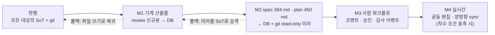

# 로드맵

> **요약** — NERV(가칭)를 한 번에 만들지 않는다. 가치 검증 순서를 **조정(충돌 제거) → 가시성(세션·커버리지) → 거버넌스(승인·게이트) → 고도화**로 고정하고, Phase 0 PoC(2~3주) · Phase 1 MVP(4~6주) · Phase 2(4~6주) · Phase 3+(착수 조건 기반)로 나눈다. 각 Phase는 기간·범위(FR 번호)·산출물과 함께 **수치로 된 종료 조건**을 갖고, 그 수치를 채우지 못하면 다음 Phase로 넘어가지 않는다(예: Phase 0은 두 호스트·세 세션 동시 작업에서 중복 클레임 0건). clemvion 이관은 D-12에 따라 **기계 산출물 먼저 → 스펙 → 사람 워크플로 → 실시간**의 순서로 진행하며, 대상 규모는 `spec/` 384 md · `plan/` 450 md · `review/` 13,777 md(131MB)다. 마지막으로 도입 실패·규약 미준수·플랫폼 다운·리뷰 피로·벤더 API 변화 다섯 가지 리스크에 각각 계측 신호와 완화 수단을 붙였다.
>
> 문서 버전 v0.2 · 2026-08-22 · HTML 판: [roadmap.html](../html/roadmap.html)
>
> v0.2 변경(2026-08-22): 4부 확정을 역반영 — Phase 0·1 범위 표에 **하이브리드 검색**(FTS+pg_trgm → 벡터·RRF·관계 확장 완성, 임베딩 제공자는 env 프로필)과 **탐색 UI**(퀵 스위처·관계 패널) 표기를 추가했다. 상세 정본은 [4.1 MVP 범위와 스택 확정](../04-mvp/scope.md) §2.1 · [4.4 API 명세](../04-mvp/api.md) §2.2b. FR 판정(●◐○)과 Phase 배분은 변경 없다 — 표기 보완이다. (인증 표기는 4.1 §2.1 콜아웃이 이미 대체: OAuth 2.1은 Phase 2, MVP는 PAT.)

---

## 1. 단계 전략

### 1.1 순서의 원칙 — 왜 조정이 먼저인가

문제 여덟 가지(P1~P8, [1.2 문제 정의와 요구사항](../01-problem/pain-points.md))는 심각도가 아니라 **의존 순서**로 풀어야 한다. 리뷰 병목이 병렬 에이전트 운용의 제1 실패 모드라는 필드 계측(중앙값 PR 리뷰 시간 +441%, 무리뷰 머지 31%)이 있지만, 리뷰 게이트를 먼저 만드는 것은 clemvion이 이미 해 본 선택이고 그 결과가 13,777개 리뷰 md다. 조정과 가시성이 없는 상태에서 게이트만 세우면 게이트는 **로컬 파일 위에서** 동작하게 되고, 그 순간 단일 호스트 갇힘·자기증식·산문 규약 붕괴가 재현된다.

| 순서 | 주제 | 푸는 문제 | 없으면 무슨 일이 | 대응 Phase |
| --- | --- | --- | --- | --- |
| 1 | **조정** — 원자적 클레임·리스·scope 겹침 | P1 스펙 충돌 · P2 중복 작업 | 병렬 세션 자체가 성립하지 않는다. clemvion이 동시수정 자동 검출을 "다른 머신·세션이면 로컬에 안 보여"라며 제거한 지점(#576) | Phase 0 |
| 2 | **가시성** — 세션 레지스트리·활동 스트림·스펙 상태 | P4 추적 곤란 · P8 n:n 부재 | 누가 무엇을 하는지 모르는 채로 승인만 요구하게 된다. 현행 가시성은 statusline 한 줄(자기 세션만) | Phase 0(읽기 전용) → Phase 1 |
| 3 | **거버넌스** — 승인·리뷰·게이트 판정 | P3 버전 관리 부재 · P5 출처 추적 · P7 직군 참여 | 규칙이 산문으로 남는다. 실측상 산문 계약은 28%(160/575 세션)까지 무너졌다 | Phase 1(승인) → Phase 2(리뷰·게이트) |
| 4 | **고도화** — 실시간 편집·분석·SaaS | — | (없어도 제품은 성립한다) | Phase 3+ |

> **D-12 — clemvion은 점진 이관.** 로컬 하네스는 레이턴시 0이 필요한 것만 유지하고(worktree 격리·브랜치 가드·로컬 린트), **상태 저장·조정·리뷰 보관·게이트 판정**을 플랫폼으로 옮긴다. 병행 운영 후 컷오버한다. 이 문서 §7이 그 실행 계획이다.

### 1.2 Phase 개요와 종료 조건

| Phase | 기간 | 한 줄 목표 | 종료 게이트(수치) |
| --- | --- | --- | --- |
| **Phase 0 — PoC** | 2~3주 | "조정이 실제로 되는가"만 검증 | 두 호스트·세 세션 90분 동시 작업에서 **중복 클레임 0건**, 겹침 경고 10/10 검출·오탐 0 |
| **Phase 1 — MVP** | 4~6주 | 스펙과 사람이 플랫폼 안으로 들어온다 | 파일럿 2주간 **플랫폼 밖에서 처리된 승인 0건**, 세션 가시성 100% / 보드 반영 p95 ≤ 5초 |
| **Phase 2 — 거버넌스** | 4~6주 | 리뷰와 게이트가 서버 판정이 된다 | **신규 리뷰 산출물의 git 커밋 0**, 과거 575 세션 리플레이에서 forced 미충족 160건 **전건 검출** |
| **Phase 3+** | 착수 조건 기반 | 수요가 확인된 항목만 | 각 항목별 착수 조건(§5.1)을 계측치가 넘을 때 |

합계 10~15주. 아래 달력은 착수일을 **2026-08-31(월)** 로 가정한 예시이며, 실제 착수일에 따라 평행 이동한다.

```text
  week       W1  W2  W3 | W4  W5  W6  W7  W8  W9 | W10 W11 W12 W13 W14 W15| W16+
  Phase 0   ============|                        |                        |
  Phase 1               |========================|                        |
  Phase 2               |                        |========================|
  Phase 3+              |                        |                        | ~~~~~~~~
  gate               ^G0|                     ^G1|                     ^G2|
  cutover               |                        | ^M1                 ^M2| ^M3   ^M4

  달력(예시)  W1 = 2026-08-31(월) 착수 · Phase 0 = 08-31~09-18 · Phase 1 = 09-21~10-30
              Phase 2 = 11-02~12-11 · Phase 3+ = 12-14~ (착수 조건 충족 항목만)
  ^G0/^G1/^G2 Phase 종료 게이트 — 수치 미달 시 Go 판정 없음(§1.4)
  ^M1~^M4     clemvion 이관 마일스톤 — 기계 산출물 → spec·plan → 사람 워크플로 → 실시간(§7.2)
  ~~~~        일정이 아니라 계측된 착수 조건으로 시작(§5.1)
```

### 1.3 FR·NFR × Phase 배분표

번호와 이름은 [1.2 문제 정의와 요구사항](../01-problem/pain-points.md) §4의 정의를 그대로 인용한다(재정의 없음). ●=이 Phase에서 수용 기준 충족, ◐=부분 구현, ○=미착수.

| 요구사항 | P0 | P1 | P2 | P3+ | 비고 |
| --- | :-: | :-: | :-: | :-: | --- |
| FR-01 스펙 단일 진실 저장소 | ◐ | ● | ● | ● | P0는 읽기·트리·안정 ID만, P1 기획자 터미널 경로 포함 |
| FR-02 스펙 버전·문서 상태 | ○ | ● | ● | ● | 승인은 P1 |
| FR-03 Requirement 단위 추적 | ○ | ◐ | ● | ● | 구현 축 2축 완성은 P2(커버리지와 함께) |
| FR-04 CR·델타 리뷰 | ○ | ○ | ● | ● | |
| FR-05 Task 관리·ready 큐 | ◐ | ● | ● | ● | P0는 ready 판정+위임 명세 4요소 검증만 |
| FR-06 원자적 클레임·리스 | ● | ● | ● | ● | **P0의 핵심 검증 대상**, P1 초안 편집 리스(문서 축, D-04 확장) |
| FR-07 세션 레지스트리 | ◐ | ● | ● | ● | P0는 등록·하트비트·상태 전이 |
| FR-08 활동 스트림·미션 컨트롤 | ○ | ● | ● | ● | steer/stop은 P1 |
| FR-09 리뷰 수집 | ○ | ○ | ● | ● | |
| FR-10 게이트 판정 API | ○ | ◐ | ● | ● | P1은 Task done 전이 조건만(리뷰 커버리지 제외) |
| FR-11 받은 요청(Inbox) | ○ | ◐ | ● | ● | P1은 스펙 승인·플랜·질문 3유형과 스펙 코멘트 왕복, CR·에스컬레이션 카드는 P2 |
| FR-12 알림 | ○ | ◐ | ● | ● | P1 인앱, P2 Slack·메일·다이제스트 |
| FR-13 증적·커버리지 | ○ | ◐ | ● | ● | P1은 PR 링크 수집, P2에 커버리지 계산 |
| FR-14 멀티테넌시 | ◐ | ● | ● | ● | P0는 단일 조직·단일 프로젝트 고정 |
| FR-15 에이전트 연동 | ◐ | ◐ | ● | ● | P0 MCP tools 8종+PAT, P1 Claude 플러그인·OAuth, P2 Codex·`AGENTS.md` 배포 |
| FR-16 감사 로그 | ◐ | ● | ● | ● | P0는 이벤트 테이블만(뷰 없음) |
| FR-17 clemvion 임포트 | ◐ | ◐ | ● | ● | spec P0 → plan P1 → review P2 |
| NFR-01 자가호스팅 | ◐ | ● | ● | ● | P1에서 백업·복구 왕복 검증 |
| NFR-02 실시간성(≤5s) | ◐ | ● | ● | ● | |
| NFR-03 보안 | ◐ | ● | ● | ● | P0는 PAT 스코프만, SSO는 P3+ |
| NFR-04 규모 | ○ | ◐ | ● | ● | 부하 시험은 P2 |
| NFR-05 로컬 폴백 | ○ | ◐ | ● | ● | P1 읽기 캐시, P2 복구 후 동기화 |

### 1.4 Phase 게이트 운영 규칙 (Go/No-Go)

1. **종료 조건은 기능 목록이 아니라 수치다.** 각 Phase의 성공 기준 표를 그대로 체크리스트로 쓰고, 미달 항목이 하나라도 있으면 Go 판정을 내리지 않는다.
2. **미달 시 일정이 아니라 범위를 조정한다.** 기간을 늘리는 대신 그 Phase의 기능을 덜어 내고, 덜어 낸 항목은 다음 Phase 범위 표에 명시적으로 이월한다. 근거: 스펙 문서량과 검토 피로가 SDD 최대 채택 리스크라는 리서치 결론([2.1 Spec-Driven Development](../02-research/spec-driven-development.md))은 플랫폼 자체의 범위 팽창에도 그대로 적용된다.
3. **모든 Phase는 되돌릴 수 있어야 한다.** clemvion 하네스는 각 Phase 종료 시점까지 그대로 동작해야 하며, NERV를 끄면 이전 상태로 복귀한다. 이 규칙이 깨지는 순간(= 하네스가 NERV 없이는 동작하지 않게 되는 순간)이 곧 컷오버이고, 컷오버는 §7.5의 체크리스트를 통과한 뒤에만 선언한다.
4. **측정은 계측이지 설문이 아니다.** 자기보고와 체감은 실측과 어긋난다는 학술 근거(숙련 개발자 RCT에서 체감 +20%, 실측 −19%)가 있고, 같은 원칙이 D-14("서버에 업로드된 산출물만 진실")로 이미 설계에 들어와 있다. Phase 종료 판정은 이벤트 로그 질의와 자동 테스트 결과로만 한다.

---

## 2. Phase 0 — PoC: 조정이 되는가 (2~3주)

### 2.1 목표와 비범위

**목표 하나**: 서버가 모든 세션의 선언을 보면 clemvion이 로컬 한계로 제거했던 기능(동시수정 사전 검출)이 복원되는가를 실물로 확인한다. 웹 UI·승인·리뷰·알림은 이 Phase의 목표가 아니다.

- **비범위**: 스펙 편집기, 받은 요청, 리뷰 수집, 알림, CR, 커버리지, 멀티 조직, OAuth, Codex 지원.
- **사용자**: 개발자 2인(호스트 2대). 기획자·디자이너·QA는 Phase 1부터.

### 2.2 범위 (FR 매핑)

| 범위 항목 | FR/NFR | 내용 |
| --- | --- | --- |
| nerv-mcp 최소 서버 | FR-15 ◐ | Streamable HTTP + PAT. tools 8종만: `nerv_bootstrap` · `nerv_spec_tree` · `nerv_spec_search` · `nerv_spec_get` · `nerv_task_next` · `nerv_task_claim` · `nerv_task_heartbeat` · `nerv_task_release` |
| 스펙 읽기 | FR-01 ◐ | 트리·타입·안정 ID·검색(P0는 렉시컬 — FTS+pg_trgm). 편집 없음(임포트로만 적재) |
| Task·ready 큐 | FR-05 ◐ | 의존성 그래프 기반 ready 판정, 위임 명세 4요소 미비 시 `ready` 전이 거부 |
| 원자적 클레임·리스 | **FR-06 ●** | assignee+상태 원자 전환, TTL 리스, 하트비트 연장, 만료 자동 회수, scope(spec_ids·file_globs) 선언과 겹침 감지 |
| 세션 레지스트리 | FR-07 ◐ | 사용자·hostname·에이전트 종류·상태 머신(`pending→active↔awaiting_input→complete/error/stale`)·하트비트 |
| 읽기 전용 세션 보드 | FR-08 ○ / NFR-02 ◐ | WebSocket 갱신. steer/stop 없음 |
| clemvion spec 임포터 v0 | FR-17 ◐ | `spec/` 384 md → Spec/SpecVersion/Requirement(§7.3) |
| 자가호스팅 | NFR-01 ◐ | docker-compose 단일 파일 기동(web·api·postgres) |
| 감사 이벤트 | FR-16 ◐ | append-only Event 테이블에 전 상태 전이 적재(`is_agent` 포함). 조회 UI 없음 |

### 2.3 산출물

1. `nerv-mcp` 서버(도구 8종) + PAT 발급 CLI — 도구 스펙은 [3.4 에이전트 연동 설계](agent-integration.md) §2의 카탈로그를 따른다.
2. Postgres 스키마 v0 — [3.3 데이터 모델](data-model.md)의 Spec/SpecVersion/Requirement · Task/Claim · AgentSession · Event 부분집합.
3. 읽기 전용 세션 보드(단일 화면) — [3.6 화면 설계](ui-wireframes.md) S5의 축소판.
4. clemvion spec 임포터 v0(멱등 재실행) + 변환 실패·수동 확인 항목 리포트.
5. `docker-compose.yml` + 기동 문서.
6. **검증 리포트** — §2.5 시나리오의 이벤트 로그 원본과 판정표. 이 리포트가 Phase 0의 실질 산출물이다.

### 2.4 성공 기준

| # | 기준 | 측정 방법 | 목표 | 관련 |
| --- | --- | --- | --- | --- |
| 0-1 | **중복 클레임 0** | 90분 동시 작업 세션의 Event 로그 질의 — 같은 Task가 두 세션에서 동시에 `in_progress`인 구간 | **0건** | FR-06 · P2 |
| 0-2 | 클레임 원자성 | 3세션 동시 클레임 요청 100회 부하 시험 | 성공 정확히 **1/요청묶음**, 나머지 100% 충돌 응답 | FR-06 · D-04 |
| 0-3 | scope 겹침 검출 | 의도적으로 겹치는 클레임 10회 시도 | **10/10 경고**, 겹치지 않는 20회에서 **오탐 0** | FR-06 · P1 |
| 0-4 | 리스 만료 자동 회수 | 하트비트 중단 세션을 TTL 초과까지 방치 | 임계(기본 30분) 초과 후 `stale` 전이 + 클레임 회수 **100%**, 사람 개입 0회 | D-13 · FR-06 |
| 0-5 | 세션 보드 반영 지연 | 상태 전이 시각 ↔ 보드 반영 시각 차이 | **p95 ≤ 5초** | NFR-02 |
| 0-6 | 임포트 성공률 | `spec/` frontmatter 추적 대상 135개 문서 변환 | **≥ 95%** 자동 변환, 실패 항목 전건 목록화 | FR-17 |
| 0-7 | 임포트 멱등성 | 임포터 2회 연속 실행 | 두 번째 실행의 신규 생성 레코드 **0** | FR-17 |
| 0-8 | tools-only 완주 | Claude Code 1세션·Codex 1세션 각각 | `bootstrap→next→claim→heartbeat→release` **완주**(resources·prompts·elicitation 미사용) | FR-15 · D-05 |

### 2.5 검증 시나리오 — 두 호스트·세 세션

Phase 0의 판정은 아래 시나리오 1회(90분)의 이벤트 로그로 한다. clemvion에서 **검출 자체가 불가능했던** 상황을 그대로 재현하는 것이 목적이다.

| 단계 | 호스트 A(세션 1·2) | 호스트 B(세션 3) | 관찰 대상 |
| --- | --- | --- | --- |
| 1 | 세션 1이 `nerv_task_next` → Task X 클레임(scope: `spec/5-system/**`) | 세션 3이 같은 Task X 클레임 시도 | 0-2 원자성 — 세션 3은 충돌 응답 |
| 2 | 세션 2가 Task Y 클레임(scope가 X와 겹침) | — | 0-3 겹침 경고 — 두 세션 모두에 경고 표시 |
| 3 | 세션 1 하트비트 정상 | 세션 3이 Task Z 클레임 후 프로세스 강제 종료 | 0-4 리스 만료 — Z가 `ready`로 복귀 |
| 4 | 세션 2가 Z를 재클레임 | — | 0-1 중복 없음 — Z의 소유자가 항상 1명 |
| 5 | 세 세션 모두 종료 | — | 0-5 보드가 종료 상태를 5초 내 반영 |

> **근거 — clemvion에서는 이 시나리오의 1~2단계가 관측 불가다.** `clemvion:.claude/docs/worktree-policy.md` §3은 "자동 검출은 없다 — 사용자와 통합 단계(`/merge-coordinate`)의 책임"이라 명시하고, 검출 기능(`plan_coherence`)은 "병렬 작업이 다른 머신·세션이면 로컬에 안 보여 신뢰할 수 없다"는 이유로 #576에서 제거됐다. 3단계의 죽은 세션 정리도 현행은 세션 시작 시 `gh pr list` 폴링(6시간 throttle)이고, 저장소 스스로 "동시에 열린 다른 세션이 앵커로 쓰는 worktree의 PR이 merge되면 그 세션은 여전히 죽는다"고 한계를 적어 두었다.

---

## 3. Phase 1 — MVP: 스펙과 사람이 들어온다 (4~6주)

### 3.1 목표와 비범위

**목표**: 스펙이 플랫폼 안에서 쓰이고 승인되며, 비개발 직군이 터미널 없이 참여한다. 세션 보드는 읽기 전용에서 조작 가능(steer/stop)으로 승격한다.

- **비범위**: 리뷰 수집·게이트 판정(리뷰 커버리지)·CR 델타·커버리지 대시보드·Slack·Codex·실시간 공동 편집.
- **사용자**: 기획자·디자이너·개발자·QA 각 1인 이상 + 파일럿 프로젝트 1개(신규) + clemvion 미러 1개.

### 3.2 범위 (FR 매핑)

| 범위 항목 | FR/NFR | 내용 |
| --- | --- | --- |
| 하이브리드 검색·탐색 UI | FR-01 ● (완성) | 렉시컬+벡터(pgvector·임베딩 env 프로필)+RRF 병합+관계 확장(graph RAG), 퀵 스위처(⌘K)·관계 패널·트리 스케일 — 정본 [4.4 API 명세](../04-mvp/api.md) §2.2b · [4.5 화면 명세](../04-mvp/screens.md) |
| 스펙 CRUD·버전·승인 | **FR-01 · FR-02 ●** | markdown 편집기+프리뷰+헤딩 앵커 코멘트(D-09), 불변 SpecVersion 스냅샷, `draft→in_review→approved→superseded/deprecated`, 버전 diff |
| Requirement 추출 | FR-03 ◐ | EARS 템플릿, 안정 ID 발급, 구현 축 초기값 설정(자동 계산은 Phase 2) |
| 작업 보드 | **FR-05 ●** | 승인된 SpecVersion에서 Task 파생, 칸반(S4), 위임 명세 4요소 강제 |
| 세션 모니터 | **FR-07 · FR-08 ●** | S5 미션 컨트롤 — hostname·에이전트 종류·6상태·현재 Task·diff 통계·steer/stop |
| 받은 요청 + 인앱 알림 | FR-11 ◐ / FR-12 ◐ | 스펙 승인·플랜 승인·질문 3유형(CR·에스컬레이션은 Phase 2), 원클릭 승인/거절/코멘트 |
| GitHub 연동 | FR-13 ◐ / FR-10 ◐ | PR·커밋 웹훅 수신, Task↔PR 링크, Task `done` 전이 조건(리뷰 커버리지 조건은 제외) |
| Claude Code 플러그인 v1 | FR-15 ◐ | 스킬 `/nerv:next` `/nerv:spec` `/nerv:impl` `/nerv:question` 4종(`/nerv:review`는 Phase 2) + `hooks.json`(SessionStart/PostToolUse/Stop/SessionEnd `type:"http"`) + `.mcp.json` 번들, 사내 마켓플레이스 배포 |
| 인증 | NFR-03 ● | OAuth 2.1(RFC 9728 PRM + PKCE + RFC 8707)로 승격, PAT는 비대화형 대안으로 유지. 토큰 발급·폐기 UI는 S8 에이전트 토큰 탭 |
| 멀티테넌시 | **FR-14 ●** | Organization/Project/User n:n, 역할 6종 권한이 API·UI 양쪽에서 강제. 관리 UI는 S8 멤버·역할 탭 |
| 감사 로그 | **FR-16 ●** | 전 상태 전이 + `is_agent` 액터 구분 + 엔티티별 이력 재구성 뷰 |
| plan 임포터 | FR-17 ◐ | `plan/` 450 md → Task(§7.3) |
| 운영 | NFR-01 ● / NFR-05 ◐ | 백업·복구 왕복 검증, 에이전트 오프라인 읽기 캐시 |

화면은 S1 홈 · S2 프로젝트 개요 · S3 스펙 상세 · S4 작업 보드 · S5 세션 모니터 · S7 받은 요청 · S8 설정(멤버·역할, 에이전트 토큰 탭 우선)을 구축한다(S6 리뷰 센터와 S8의 연동·게이트 정책 탭은 Phase 2). 이 순서는 [3.6 화면 설계](ui-wireframes.md)의 안내와 일치한다.

**기획자 터미널 경로** — 스펙 편집은 웹 에디터 단독 경로가 아니다. Phase 1은 기획자 터미널 경로(초안 편집 리스 · 코멘트 왕복 · 사전 검토 셀프서비스)를 포함한다 — 웹과 에이전트는 같은 draft SpecVersion을 번갈아 잡는 두 개의 입력 장치이며(초안 편집 리스 TTL 30분, D-04의 문서 축 확장), 별도 FR 추가 없이 FR-01·FR-06·FR-11의 기존 범위 안이다.

### 3.3 산출물

1. 웹앱(Vite + React SPA) — S1·S2·S3·S4·S5·S7·S8(멤버·역할, 에이전트 토큰 탭).
2. API + MCP 게이트웨이(NestJS) — 도구 카탈로그 확장(7종: `nerv_spec_draft_upsert` · `nerv_spec_check` · `nerv_spec_comment_resolve` · `nerv_spec_submit_review` · `nerv_task_update` · `nerv_question_create` · `nerv_session_event`).
3. **NERV 플러그인 v1**(Claude Code) — 스킬·서브에이전트·훅·`.mcp.json` 번들 + 관리형 settings 배포 가이드.
4. 훅 수집기 — `type:"http"` 이벤트 수신 엔드포인트(세션 등록·활동 스트림 자동화).
5. plan 임포터 + owner 자유 텍스트 → 사용자 계정 수동 매핑 테이블.
6. 백업·복구 절차서와 왕복 검증 로그.
7. 파일럿 운영 리포트(2주).

### 3.4 성공 기준

| # | 기준 | 측정 방법 | 목표 | 관련 |
| --- | --- | --- | --- | --- |
| 1-1 | **승인이 플랫폼 밖에서 일어나지 않음** | 파일럿 2주간 승인·질문 응답 레코드 대비 터미널 내 처리 건수 | 플랫폼 밖 처리 **0건** | FR-11 · P7 |
| 1-2 | 직군 참여 | 승인 레코드의 행위자 역할 분포 | 스펙 승인의 **100%** 가 비개발 직군(planner/designer/qa) 승인 포함 | FR-11 · FR-14 |
| 1-3 | 승인 리드타임 | 승인 요청 생성 → 결정까지 | **p50 ≤ 1 영업일** | FR-11 · FR-12 |
| 1-4 | 질문 응답 리드타임 | 세션 `awaiting_input` 체류 시간 | 업무시간 기준 **p50 ≤ 30분** | D-13 · FR-11 |
| 1-5 | 세션 가시성 | 실행 중 세션 중 보드에 표시된 비율 / 반영 지연 | **100%** / **p95 ≤ 5초** | FR-07 · NFR-02 |
| 1-6 | 승인 스냅샷 불변성 | `approved` SpecVersion 본문 수정 시도 자동 테스트 | 거부율 **100%** | FR-02 · D-02 |
| 1-7 | 위임 명세 강제 | 4요소 중 하나라도 빈 Task의 `ready` 전이 시도 | 거부율 **100%** | FR-05 |
| 1-8 | 감사 재구성 | 무작위 엔티티 20건의 전체 변경 이력 재구성 | 성공 **20/20** | FR-16 |
| 1-9 | 백업·복구 | 백업 → 신규 인스턴스 복원 왕복 | **1회 이상 성공**, 데이터 손실 0 | NFR-01 |
| 1-10 | 플러그인 배포 | 파일럿 참여 호스트의 플러그인 활성화율 | **100%**(관리형 settings 강제 활성화 확인) | FR-15 |
| 1-11 | 기획자 웹·터미널 왕복 | 기획자가 웹과 터미널(Claude Code/Codex)을 오가며 같은 초안을 완성 — 리스 인계·`base_version` 충돌을 Event 로그로 질의 | 같은 초안 완성, 리스 인계·base_version 충돌 **0** 실증 | FR-01 · FR-06 · FR-11 |

### 3.5 파일럿 운영 규칙

- **프로젝트 2개로 시작한다.** ① 신규 프로젝트(스펙을 처음부터 NERV에서 작성) ② clemvion 미러(읽기 전용 — 이 시점에 clemvion의 SoT는 여전히 git이다).
- **동시 세션 상한을 정책으로 건다.** 필드 실증상 사람 리뷰 용량의 실용 한계는 동시 3~5 에이전트다. 파일럿은 프로젝트당 3으로 시작하고, 승인·질문 리드타임(1-3·1-4)이 목표를 유지하는 한에서만 올린다.
- **저위험 자동 통과 경로를 첫날부터 켠다.** 모든 변경에 동일 게이트를 강제하면 "버그 하나에 16개 수용 기준" 비판이 그대로 현실이 된다(D-06). 오탈자·문구 수정 티어는 승인 없이 통과시키고, 통과 사실만 이벤트로 남긴다.

---

## 4. Phase 2 — 거버넌스: 리뷰와 게이트 (4~6주)

### 4.1 목표

리뷰를 git 파일에서 플랫폼 엔티티로 옮기고(D-07), 게이트 판정을 정규식 훅이 아니라 서버 질의로 만든다(FR-10). 동시에 Codex를 1급 시민으로 받아들여 에이전트 이종성을 확인한다.

### 4.2 범위 (FR 매핑)

| 범위 항목 | FR/NFR | 내용 |
| --- | --- | --- |
| 리뷰 수집 | **FR-09 ●** | ReviewSession(입력 스냅샷: repo·브랜치·diff base·검토 커밋 SHA 필수) → ReviewerReport → Finding(fingerprint dedup) → Resolution(커밋 FK) |
| 게이트 판정 API | **FR-10 ●** | "이 커밋 범위를 커버하는 해소된 리뷰가 있는가" 단일 호출 판정 + Task `done` 전이 조건 + BYPASS 기록 |
| 리뷰 센터(S6) | FR-09 · FR-13 | finding 큐(severity·상태 필터), finding 상세(코드 위치·커밋·유래 스펙/Requirement·해결 이력), 게이트 현황 |
| CR 델타 리뷰 | **FR-04 · FR-11 ●** | ADDED/MODIFIED/REMOVED 뷰, 승인 시 파생 Task 재계산(영향 분석), SPEC-DRIFT 역류 경로. 받은 요청에 CR·에스컬레이션 카드가 붙어 5유형이 완성된다 |
| 커버리지 대시보드 | **FR-03 · FR-13 ●** | Requirement↔Task↔PR↔Review 그래프에서 계산. 수동 ✅ 표기 폐지 |
| 알림 확장 | **FR-12 ●** | Slack·메일 채널, 중요도 라우팅, 다이제스트 배칭 |
| Codex 지원 | **FR-15 ●** | `AGENTS.md` + `.codex/config.toml` + hooks/notify 매핑, elicitation 부재 대응(질문 폴링 도구) |
| fail-open 관측·격상 | D-14 | 판정 불가 시 진행 허용 + 배너 + 연속 카운터, 임계 초과 시 격상 알림 |
| 보존 정책 워커 | D-07 / NFR-01 | 결론(SUMMARY·Finding·Resolution) 영구 / 재생성 가능 입력(프롬프트 페이로드) TTL |
| review 임포터 | **FR-17 ●** | 과거 리뷰 요약 소급(§7.3) |
| 규모·폴백 | NFR-04 · NFR-05 ● | 프로젝트 수십·동시 세션 수십 부하 시험, 복구 후 자동 동기화 |

### 4.3 산출물

1. `nerv_review_submit` · `nerv_finding_resolve` 도구(카탈로그 18종 완성)와 fingerprint 알고리즘 명세 + `/nerv:review` 스킬 추가(플러그인 스킬 4종 → 5종).
2. 게이트 판정 API + git forge 머지 게이트 연동(훅 미설치 클론·타 호스트 push 구멍을 서버가 막는다).
3. S6 리뷰 센터 · 커버리지 대시보드 · S8 연동·게이트 정책 탭.
4. Codex 온보딩 번들(`AGENTS.md` · `.codex/config.toml` · `hooks.json`) — SKILL.md는 오픈 표준이라 양쪽 재사용.
5. 보존 정책 워커와 스토리지 정책 문서.
6. review 임포터 + 리플레이 회귀 코퍼스(§4.5).

### 4.4 성공 기준

| # | 기준 | 측정 방법 | 목표 | 관련 |
| --- | --- | --- | --- | --- |
| 2-1 | **신규 리뷰 산출물의 git 커밋 0** | 컷오버 후 4주간 `review/` 경로 신규 커밋 파일 수·바이트 | **0**(기준선: 월 ~7,000파일 / ~50MB) | D-01 · P6 |
| 2-2 | 게이트 판정 정확도 | clemvion 과거 575 커밋 세션 리플레이(§4.5) | forced 미충족 **160/160 검출**, 오탐 0 | FR-10 · FR-09 |
| 2-3 | verdict 모순 검출 | 과거 732 세션 리플레이 | CRITICAL→`BLOCK: NO` 하향 **24/24 검출**, 신규 발생 **0**(스키마 제약으로 차단) | FR-09 · FR-16 |
| 2-4 | fingerprint dedup | 8라운드 재리뷰 재현 시나리오 + 수동 라벨 200 finding 대비 | 동일 finding 재서술 **0**, dedup 정확도 **≥ 95%** | FR-09 · D-07 |
| 2-5 | 리뷰 컨텍스트 오염 제거 | 리뷰 입력 파일 중 이전 리뷰 산출물 비율 | **86/94 → 0** | D-01 · P6 |
| 2-6 | 무리뷰 머지 | 게이트 판정을 통과하지 않고 머지된 PR 비율 | **0%**(면제는 BYPASS로 100% 기록) | FR-10 · D-14 |
| 2-7 | 게이트 판정 지연 | 판정 API 응답 시간 | **p95 ≤ 300ms** | NFR-04 |
| 2-8 | 커버리지 자동 계산율 | 수동 마크 없이 관계에서 계산된 Requirement 비율 | **100%**(기준선: 영역별 131개 vs 0개) | FR-13 · D-03 |
| 2-9 | Codex 완주 | Codex 세션이 tools만으로 전 흐름 수행 | `bootstrap→claim→구현→리뷰 제출→done` **완주**, 질문 에스컬레이션 폴백 동작 | FR-15 · D-05 |
| 2-10 | 알림 피로 | 1인당 일 알림 수 / 무시율 | 다이제스트 적용 후 **증가하지 않을 것** | FR-12 |

### 4.5 회귀 코퍼스 — clemvion 과거 세션 리플레이

Phase 2의 게이트 API에는 **정답이 이미 매겨진 회귀 데이터**가 있다. clemvion이 2026-07-17에 수행한 전수 조사가 커밋된 575 세션 중 160건의 forced reviewer 미충족(그중 107건은 `RESOLUTION.md`를 갖고 게이트를 통과 중)을 찾아냈고, `review_guard`는 732 세션에서 24건(3.3%)의 verdict 모순을 실측했다. 이 라벨을 그대로 기대값으로 삼아 판정 API의 회귀 시험을 구성한다.

- **입력**: 과거 세션 디렉토리(경로 타임스탬프·`meta.json`·reviewer 리포트 파일 목록·`SUMMARY.md`).
- **기대 출력**: 커버리지 충족 여부 · verdict 일치 여부.
- **의의**: 이 시험을 통과하면 1,005줄 정규식 push 훅과 rewrite-immune 시계(경로 타임스탬프 vs author date)가 서버 SQL 한 줄로 대체됐음을 실증할 수 있다.

---

## 5. Phase 3+ — 고도화 (착수 조건 기반)

### 5.1 후보 목록과 착수 조건

Phase 3 이후는 일정이 아니라 **계측된 수요**로 착수한다. 조건을 넘지 않으면 만들지 않는다.

| 후보 | 무엇 | 착수 조건(계측) | 근거·주의 |
| --- | --- | --- | --- |
| **실시간 공동 편집(CRDT)** | TipTap/ProseMirror 에디터에 Yjs + Hocuspocus 추가 | 스펙 저장 시 버전 충돌(409 재시도) **주 20건 이상** 또는 동시 편집 요청이 파일럿 팀에서 반복 제기 | MVP부터 넣으면 버전 스냅샷·감사·스키마 권위가 CRDT 상태와 얽힌다. 중앙 서버가 있으면 서버 권위 LWW로 충분하다는 실증(Figma·Linear)이 있다 |
| **양방향 git sync** | DB ↔ git markdown 동기화(현행은 read-only export) | 외부 기여자(플랫폼 계정 없는)의 스펙 PR이 **분기 5건 이상** | 상용 실증은 있으나(GitBook Git Sync) 동기화 엔진 구축 비용이 크다 |
| **임베딩 기반 중복·충돌 감지** | scope 겹침을 넘어 의미 수준 중복 제안 검출 | scope 겹침 경고를 통과했는데 머지 시점에 발견된 논리 충돌 **분기 3건 이상** | 규칙 기반 겹침 감지(FR-06)로 잡히지 않는 잔여분에만 적용 |
| **분석·리포팅** | 리드타임·재작업률·커버리지 추세, 팀 단위 리포트 | 파일럿 확대(프로젝트 5개 이상) | 지표는 §1.4 원칙대로 계측치만 |
| **SSO·감사 고도화** | OIDC 조직 IdP 연동, 감사 내보내기, MCP allowlist | 조직 도입(조직 2개 이상) 또는 보안 검토 요구 | 자가호스팅 초기 규모에서 조직 MCP allowlist는 과설계 |
| **SaaS화** | 멀티테넌트 호스팅·과금 | 외부 조직의 도입 요청 발생 | 첫 사용자는 우리 팀. 자가호스팅 우선(NFR-01) |
| **MCP Tasks 확장** | 장기 대기 승인을 `input_required`로 모델링 | 클라이언트 지원 확인 | MVP는 "웹 승인 + 폴링 도구"로 충분 |
| **best-of-N · Confidence 선별** | 착수 전 확신도 산출로 중복 착수 차단 | 리뷰 처리량이 동시 세션 수를 앞선 이후 | 리뷰가 병목인 상태에서 시도 수를 늘리는 것은 계측 근거에 역행한다 |

### 5.2 하지 않기로 한 것 (재확인)

[3.1 비전과 핵심 시나리오](vision.md) §5.1의 non-goals는 Phase 3+에서도 유지된다 — 코드 호스팅·PR·CI 대체, 범용 PM 도구 대체, 에이전트 런타임·모델 실행, 로컬 하네스 전면 흡수. 특히 마지막 항목은 D-12의 핵심이다: **worktree 격리·브랜치 가드·로컬 린트·BYPASS 비상구는 끝까지 로컬에 남는다.**

---

## 6. 리스크와 완화

### 6.1 리스크 등록부

| # | 리스크 | 조기 신호(계측) | 완화 | 관련 |
| --- | --- | --- | --- | --- |
| R1 | **도입 실패 — 마찰이 이득보다 크다** | 스펙 문서 길이·수용 기준 개수 중앙값 상승, 파일럿 참여자의 우회 사용(터미널 처리) 증가 | 위험도 가변 게이트로 저위험 자동 통과 경로 유지(D-06), 승인 카드 원클릭, 델타만 보여주는 CR 뷰(FR-04) | D-06 · P7 |
| R2 | **에이전트 규약 미준수** — 클레임 없이 작업, 산출물 미업로드 | 자기보고(STATUS) 대비 서버 산출물 누락률, 클레임 없는 커밋 비율 | 게이트로 차단하되 판정 불가 시 fail-open + 연속 카운터 격상(D-14), 자기보고와 산출물 업로드 분리 검증 | D-14 · FR-10 |
| R3 | **플랫폼 다운 시 작업 중단** | 서버 5xx·타임아웃 시 에이전트 세션 실패율 | 로컬 폴백(NFR-05) — 오프라인 캐시로 스펙·Task 읽기, 복구 후 산출물 자동 동기화, 로컬 하네스는 독립 동작 유지 | NFR-05 · D-12 |
| R4 | **리뷰 피로 — 게이트가 조용히 꺼진다** | BYPASS 비율 상승, 게이트 판정 불가 연속 카운터, 1인당 일 알림 수·무시율 | 위험도 티어링(D-06), 다이제스트 배칭(FR-12), fail-open 격상은 알림 1급 항목으로(D-14) | D-06 · D-14 |
| R5 | **벤더 API 변화** — 훅 이벤트·MCP 리비전·플러그인 규격 | 연동 계약 테스트 실패, 클라이언트 협상 리비전 분포 변화 | 어댑터 계층을 얇게 유지, MCP는 최신 리비전 기준 + 구 리비전 병행 서빙(D-11), 도구가 아니라 패턴(클레임 API·세션 레지스트리·게이트)을 표준화 | D-05 · D-11 |
| R6 | **마이그레이션 실패·데이터 유실** | 임포터 실패 항목 수, 컷오버 후 정합 검사 불일치 건수 | 병행 운영 + 읽기 전용 미러 + 마일스톤별 롤백 절차(§7.6). clemvion이 `review/` 전체 gitignore를 2일 만에 롤백한 실측이 근거 | D-12 · FR-17 |
| R7 | **리뷰 병목이 그대로 이동한다** | 리뷰 도달 시간 p50/p90 악화, 동시 활성 세션 수 > 리뷰 처리량 | 조직·프로젝트별 동시 세션 한도를 정책으로 노출(FR-14), AI 1차 리뷰 + 사람 위험 판단 계층 분리 | FR-09 · FR-11 |
| R8 | **범위 팽창으로 Phase가 끝나지 않음** | Phase 종료 조건 미달 항목 수, 기간 초과 주차 | 기간이 아니라 범위를 줄인다(§1.4 규칙 2). 이월 항목은 다음 Phase 범위 표에 명시 | — |
| R9 | **권한·인젝션 사고** | 권한 상승 시도 거부 로그, 스펙 본문 유래 도구 호출 시도 | 토큰 프로젝트 스코프·권한 비확대, 스펙·리뷰 본문을 비신뢰 데이터로 취급, 위험 도구는 사람 승인 강제 | NFR-03 |

### 6.2 조기 경보 지표

성공 지표만 보면 늦는다. R1·R2·R4의 신호는 [3.1 비전과 핵심 시나리오](vision.md) §5.3의 반증 지표와 동일한 항목이며, **Phase 1부터 대시보드 1급 항목으로 노출**한다. 원칙 하나만 반복한다 — 가드가 깨져도 작업은 계속되어야 하지만, **조용히 꺼진 게이트가 최악이다**(clemvion의 fail-open 연속 3회 격상 패턴이 코드와 테스트로 검증한 운영 교훈).

---

## 7. clemvion 마이그레이션 계획 (D-12)

### 7.1 이관 대상 실측

| 대상 | 규모(실측) | 특징 | 이관 후 형태 |
| --- | --- | --- | --- |
| `clemvion:spec/` | **384 md** · 9.3MB (기계생성 API 카탈로그 249 md·4.6MB 제외 시 순수 135 md·49,383줄) | frontmatter 추적 대상 135(implemented 117 / partial 17 / backlog 1), Rationale 105개, 최대 1,750줄 | Spec / SpecVersion / Requirement / SpecRelation |
| `clemvion:plan/` | **450 md** · 5.2MB (in-progress 62 = 최상위 34 + 클러스터 28, complete 387, research 1) | 미착수 sentinel 13/34, `priority` 선언 15/34, `owner`는 자유 텍스트 역할 라벨 | Task / TaskDependency / Evidence |
| `clemvion:review/` | **13,777 md** · 131MB (code 9,070 + consistency 4,697 + spec-coverage 10) | 73일간 세션 1,891개(일평균 26), 이력 blob 60.7MB = packed blob 바이트의 **60%**, 커밋 2,464 중 937(38%)이 review 접촉 | ReviewSession / ReviewerReport / Finding / Resolution |
| 로컬 조율 상태 | `.claude/state/` 마커 7종, 훅 약 7,600줄(최대 단일 훅 1,005줄) | 전량 gitignored — 이관 대상이 아니라 **소멸 대상** | 서버 상태 머신 + 이벤트 로그로 대체 |

> **근거 · 자기증식 루프.** 리뷰 산출물이 코드와 같은 브랜치에 커밋되어 한 changeset이 8라운드(code 5 + consistency 3)를 돌았고, 마지막 라운드 리뷰 프롬프트 94파일 중 **86개가 이전 `review/` 산출물**이라 정작 소스 diff가 컨텍스트 예산에서 밀려났다. 산출물을 git 밖으로 빼는 것 자체가 이 루프를 구조적으로 끊는다.

### 7.2 이관 순서 M1~M4 — 기계 산출물 먼저

이관 순서는 제품 구축 순서(Phase 0~3)와 **다른 축**이다. 구분이 중요하다.

- **임포트(복제)**: NERV가 git의 사본을 읽어 들이는 것. SoT는 여전히 git. Phase 0(spec)·Phase 1(plan)에서 수행한다.
- **컷오버(쓰기 경로 전환)**: 해당 대상의 SoT가 NERV로 넘어가는 것. 아래 M1~M4가 그 순서다.

| 마일스톤 | 대상 | 시점 | 왜 이 순서인가 |
| --- | --- | --- | --- |
| **M1 — 기계 산출물** | `review/` 신규 산출물(13,777 md의 증가분) | Phase 2 초 | ① 사람이 손으로 고치지 않는 append-only 데이터라 되돌리기 쉽다 ② 즉시 효과가 가장 크다(packed blob의 60%, 월 ~7,000파일/~50MB 증가 정지) ③ 스펙이라는 제품의 SoT를 걸기 전에 업로드·보존 정책 파이프라인을 실증한다 |
| **M2 — spec · plan** | `spec/` 384 md · `plan/` 450 md | Phase 2 말 | 문서 축(승인)과 구현 축이 모두 준비되고(Phase 1), 커버리지 계산이 동작하는(Phase 2) 이후에만 SoT를 옮긴다. git에는 read-only 미러 export를 남긴다 |
| **M3 — 사람 워크플로** | 코멘트·승인·감사 이벤트 | Phase 2 말~Phase 3 초 | 스펙이 플랫폼에 있어야 코멘트 앵커와 승인 레코드가 의미를 갖는다. 이 시점에 비개발 직군이 정식 온보딩된다 |
| **M4 — 실시간** | 실시간 공동 편집 · 양방향 git sync | Phase 3+(착수 조건 §5.1) | 수요가 계측된 뒤에만 |

이 순서는 스펙 저장 아키텍처 리서치의 결론(기계 산출물 → 스펙 → 사람 워크플로 → 실시간)과 같다. **M1을 M2보다 먼저 두는 실질적 이유**는 리스크 비대칭이다 — M1이 실패해도 잃는 것은 리뷰 조회 편의(원본은 git 이력에 남아 있다)지만, M2가 먼저 실패하면 제품의 단일 진실이 접근 불가가 된다. NFR-05(로컬 폴백)가 실사용으로 검증되기 전에는 M2를 실행하지 않는다.



### 7.3 임포터 상세

#### (1) spec 임포터 — `spec/` 384 md → Spec / SpecVersion / Requirement

| clemvion | NERV | 비고 |
| --- | --- | --- |
| 디렉토리 계층(루트 3 + 영역 7) | Spec 트리 노드 | `_product-overview.md`→`area`, `N-name.md`→`feature`, `conventions/**`→`convention`, Rationale 단독 결정→`adr` 후보 |
| frontmatter `id`(kebab-case) | 안정 ID 매핑 테이블 | 서버 발급 해시 ID를 정본으로 하고, 옛 `id`는 별칭으로 보존해 기존 인용을 살린다 |
| frontmatter `status` 5값 | **2축 분해**: 문서 축 + 구현 축 | `backlog`/`spec-only`→(문서 `draft` 또는 `approved`) + 구현 `unimplemented`, `partial`→`approved` + Requirement 일부 `in_progress`, `implemented`→`approved` + `implemented`, `archived`→`deprecated` |
| `code:` glob | Evidence(코드 경로 패턴) | stale glob은 규약 스스로 검출 불가(R-1)라고 인정 — 임포트 후 **경로 실존 검사 리포트**를 사람에게 넘긴다 |
| `pending_plans:` | Requirement ↔ Task 링크 | spec→plan 역방향 링크("빈 약속" 차단)를 관계로 승격 |
| `spec_impact`(완료 plan) | Task → SpecVersion 역링크 | |
| 요구사항 ID 표(`NAV-WF-01` 등) | **Requirement 엔티티** | 우선순위(필수/권장) → 필드, 수용 기준 → 필드(EARS 템플릿으로 정규화는 사람 확인) |
| 수동 ✅ 마크(영역별 131개 vs 0개) | **폐기** | 커버리지는 관계에서 계산(D-03) |
| `## Rationale` 섹션 105개 | SpecVersion 본문 유지 + 결정 태깅 | 기각된 대안 보존은 계승 자산 |
| 상대경로 + heading 앵커 상호참조 | 안정 ID 참조 | 변환 실패 링크는 리포트로 |

**손실 주의**: 문서 단위 `status` 하나를 요구사항 단위로 자동 분해할 수는 없다. 초기값은 문서 status에서 복사하고, Requirement 단위 확정은 사람 확인 큐로 보낸다. 근거는 `clemvion:spec/5-system/4-execution-engine.md` 같은 1,750줄 문서에 status 값이 하나뿐이어서 요구사항 `CCH-SE-02`의 통째 미구현이 evidence 가드 도입 **이후에** 발견된 사건이다.

#### (2) plan 임포터 — `plan/` 450 md → Task

- `worktree` / `started` / `owner` → Task의 격리 정보·시작일·담당. **`owner`는 신원이 아니다**(실측 분포: developer 17 / project-planner 8 / planner 5 / `developer (TBD)` 2 / `developer (다음 진입자)` 1) — 자유 텍스트 → 사용자 계정 수동 매핑 테이블을 만들고, 매핑 불가 항목은 `unassigned`로 임포트한 뒤 사람이 배정한다.
- 체크박스 목록 → Task 체크리스트 또는 하위 Task(분해 기준은 임포트 옵션).
- `priority`(15/34만 선언) → 우선순위 필드. 미선언은 null로 두고 추정하지 않는다.
- `in-progress`(62) → `ready`/`in_progress`, `complete`(387) → `done`, `research`(1) → Task가 아닌 참고 문서로 분류.
- 미착수 sentinel `(unstarted)` 13건 → `backlog`.
- **위임 명세 4요소는 소급 생성하지 않는다.** 옛 Task를 다시 착수할 때 명세를 채워야 `ready`로 전이한다(FR-05).

#### (3) review 임포터 — 결론만 소급

- **대상**: 커밋된 SUMMARY·RESOLUTION(결론). `_prompts/`(리뷰 전체의 ~70%, 이미 gitignored)는 이관하지 않는다 — "커밋 해시 + 스킬로 재생성 가능"이라는 clemvion 자신의 판단을 그대로 따른다.
- **세션 시각**: 경로 타임스탬프(`review/<종류>/Y/m/d/H_M_S`) → `created_at`.
- **입력 스냅샷**: `meta.json`에 커밋 SHA·diff base·브랜치 **필드 자체가 없다**(표본 200개 SUMMARY 중 47개만 산문에 해시 언급). 임포트 시 NULL + `provenance_incomplete` 플래그를 세우고, 이 플래그가 붙은 세션은 게이트 판정 입력으로 쓰지 않는다.
- **Finding**: SUMMARY 표의 행 번호 `#n`은 세션-로컬 표시 번호로만 보존하고 전역 ID를 새로 발급한다. 소급 fingerprint 계산은 **advisory**로만 사용(정확도가 낮다).
- **Resolution**: `fix(scope): SUMMARY#<n>` 커밋 규약과 `_resolution_state.json.commits_made[{sha,summary_id}]`가 이미 구조화돼 있어 커밋 FK로 승격 가능하다.
- **멱등성**: `(source_path, content_hash)`를 키로 재실행 시 중복 생성 0.

### 7.4 병행 운영 규칙

| 기간 | `spec/` SoT | `plan/` SoT | `review/` SoT | 게이트 판정의 진실 |
| --- | --- | --- | --- | --- |
| Phase 0 | git | git | git | 로컬 훅 |
| Phase 1 | git (NERV는 미러) | git (NERV는 미러) | git | 로컬 훅 (NERV는 관측만) |
| M1 이후 | git | git | **NERV** | 로컬 훅 + NERV 판정 이중화(불일치는 알림) |
| M2 이후 | **NERV** (git은 read-only export) | **NERV** | **NERV** | **NERV** (로컬 훅은 fail-open 보조) |

규칙 세 가지:

1. **한 대상의 SoT는 항상 하나다.** 이중 쓰기를 허용하지 않는다. 미러 쪽 편집은 차단하거나(read-only export) 검출 즉시 경고한다.
2. **로컬 하네스는 컷오버 이후에도 살아 있다.** 남는 것: CWD/브랜치 즉시 차단, worktree 생성·격리, 로컬 린트·테스트 래퍼, `BYPASS_*` 비상구(단, 사용 사실은 서버 감사 로그로 보고). 서버로 가는 것: 상태 저장, 조정(클레임·리스), 리뷰 보관, 게이트 판정.
3. **판정이 갈리면 서버가 이긴다, 단 조용히 지지 않는다.** 이중화 기간에 로컬 훅과 서버 판정이 다르면 서버 판정을 적용하고 불일치를 이벤트로 남긴다. 불일치율은 컷오버 안정화 지표(§7.5)다.

### 7.5 컷오버 체크리스트

M1·M2 각각에 대해 아래를 순서대로 통과해야 컷오버를 선언한다.

**사전 조건**

- [ ] 해당 대상의 임포터가 멱등 재실행 검증을 통과했다(신규 생성 0).
- [ ] 정합 검사가 통과했다 — 원본 파일 수 ↔ 레코드 수, 샘플 30건의 본문 해시 일치.
- [ ] 롤백 절차(§7.6)가 문서화되고 **1회 이상 리허설**을 마쳤다.
- [ ] 백업·복구 왕복 검증이 최근 2주 내에 성공했다(NFR-01).
- [ ] (M2 한정) NFR-05 로컬 폴백이 파일럿에서 실사용 검증됐다 — 서버 중단 상태에서 에이전트가 캐시로 작업을 계속하고 복구 후 자동 동기화됐다.

**실행**

- [ ] 쓰기 경로를 전환한다(예: M1 — 리뷰 산출물 작성 경로를 `nerv_review_submit`으로 바꾸고, 훅으로 `review/` 파일 쓰기를 차단).
- [ ] git 쪽 대상 경로를 read-only로 표시한다(미러 export 또는 쓰기 차단).
- [ ] 관련 게이트 판정을 서버 API로 전환하고, 로컬 훅은 fail-open 보조로 강등한다.

**검증(컷오버 후 2주 관측)**

- [ ] 대상 경로의 신규 git 커밋 **0**.
- [ ] 서버 ↔ 로컬 판정 불일치율 **< 1%**, 불일치 전건 원인 규명 완료.
- [ ] 에이전트 세션 실패율이 컷오버 이전 대비 **증가하지 않음**.
- [ ] 사람 작업의 처리 리드타임(승인·질문)이 목표를 유지.

**안정화 선언**: 위 4항목이 2주 연속 충족되면 컷오버를 확정하고 해당 대상의 로컬 게이트 코드를 제거 대상 목록에 올린다.

### 7.6 롤백

clemvion은 이미 `review/` 전체를 gitignore 처리했다가 **2일 만에 롤백**한 이력이 있다(게이트와 plan 문서가 커밋된 산출물에 의존하고 있었기 때문). 롤백은 예외가 아니라 설계 항목이다.

| 마일스톤 | 롤백 트리거 | 절차 | 데이터 |
| --- | --- | --- | --- |
| M1 | 판정 불일치율 ≥ 5%, 또는 리뷰 제출 실패율 ≥ 2% | 리뷰 작성 경로를 파일 쓰기로 복귀 + `review/` 쓰기 차단 훅 해제 | NERV의 리뷰 레코드는 유지(중복 아님 — 이후 기간만 파일로) |
| M2 | 스펙 조회 불가 누적 30분 이상, 또는 정합 검사 불일치 발견 | git read-only 미러를 SoT로 승격(export 최신본 확인 후 쓰기 허용) | 미러 export가 최신 승인 버전을 항상 포함하도록 M2 이전부터 상시 가동 |
| M3 | 승인 리드타임 목표 2주 연속 미달 | 승인 게이트를 저위험 자동 통과 범위로 넓히고(D-06) 필수 승인만 남긴다 | 승인 레코드는 감사 목적으로 전량 보존 |
| M4 | (착수 조건 미충족 시 착수하지 않음) | — | — |

롤백 후에는 반드시 트리거 원인과 재시도 조건을 §7.5의 사전 조건에 항목으로 추가한다 — clemvion에서 규칙이 항상 실패 이후에 자란 패턴을, 이번에는 처음부터 문서화된 절차로 둔다.

---

## 참고 자료

### 이 문서가 인용한 외부 출처

- [About large files on GitHub — GitHub Docs](https://docs.github.com/en/repositories/working-with-files/managing-large-files/about-large-files-on-github) — (2026-08-13 확인) 저장소 크기 권장(이상적으로 1GB 미만)과 "한 번 커밋된 대용량 파일은 삭제해도 이력에 남는다" — M1의 근거이자 git 이력 정리를 별도 결정으로 분리한 이유(§7.2).
- [Event Sourcing Pattern — Azure Architecture Center](https://learn.microsoft.com/en-us/azure/architecture/patterns/event-sourcing) — (2026-08-13 확인) 전면 이벤트 소싱은 "프로토타입·MVP에 부적합", 이득이 큰 부분에만 선택 적용하라는 공식 권고 — Phase 0~1이 감사 이벤트 테이블만 두는 근거(§2.2·D-10).
- [Defining and Implementing Requirements Baselines — Jama Software](https://www.jamasoftware.com/requirements-management-guide/requirements-gathering-and-management-processes/defining-and-implementing-requirements-baselines/) — (2026-08-13 확인) baseline = 승인된 요구사항의 불변 시점 스냅샷, 이후 변경은 change control로 — Phase 1의 승인 스냅샷 불변성 기준(1-6)의 표준 근거.
- [Google Drive API — Revisions](https://developers.google.com/workspace/drive/api/reference/rest/v3/revisions) — (2026-08-13 확인) 리비전 30일 자동 삭제와 보존 지정 — 보존 정책을 명시적으로 설계해야 하는 이유(Phase 2 보존 정책 워커).
- [Notion 요금제 비교](https://www.notion.com/pricing) — (2026-08-13 확인) 페이지 히스토리 보존이 요금제에 묶일 만큼 이력 저장은 비용 요소 — "결론 영구 / 입력 TTL" 2층 보존 정책의 방증.
- [Notion's hosted MCP server: an inside look — Notion Blog](https://www.notion.com/blog/notions-hosted-mcp-server-an-inside-look) — (2026-08-13 확인) 에이전트에게는 블록 JSON이 아니라 markdown을 서빙 — DB 컷오버 이후에도 에이전트 인터페이스를 markdown으로 유지하는 근거(§7.2 M2).
- [The /llms.txt file, v2](https://llmstxt.org/) — (2026-08-13 확인) 문서 URL + `.md` 미러와 루트 인덱스 표준 — read-only 미러 설계가 외부 표준과 정합함(§7.4).
- [GitHub & GitLab Sync — GitBook Docs](https://gitbook.com/docs/docs-as-code/git-sync.md) — (2026-08-13 확인) DB 편집기 ↔ git markdown 양방향 동기화의 상용 실증 — M4로 미룬 근거(구축 비용).
- [Yjs](https://github.com/yjs/yjs) · [Hocuspocus](https://github.com/ueberdosis/hocuspocus) · [Docmost](https://github.com/docmost/docmost) — (2026-08-13 확인) 실시간 편집이 필요해질 때의 성숙한 MIT 확장 경로와 동일 스택 실증 — Phase 3 착수 조건(§5.1).
- [How Figma's multiplayer technology works — Figma Blog](https://www.figma.com/blog/how-figmas-multiplayer-technology-works/) · [reverse-linear-sync-engine](https://github.com/wzhudev/reverse-linear-sync-engine) — (2026-08-13 확인) 중앙 서버 권위 LWW로 협업이 성립한다는 실증 — CRDT를 MVP에서 뺀 근거.
- [steveyegge/beads](https://github.com/steveyegge/beads) — (2026-08-13 확인) 원자적 `--claim` + 의존성 기반 ready 판정, 이슈는 DB·git엔 교환 포맷만 — Phase 0 클레임 설계의 원형.
- [stravu/crystal](https://github.com/stravu/crystal) · [BloopAI/vibe-kanban](https://github.com/BloopAI/vibe-kanban) — (2026-08-13 확인) 로컬 오케스트레이터의 단명 실증(Crystal 2026-02 deprecated, vibe-kanban sunsetting) — R5(벤더 변화)에서 어댑터를 얇게 유지하는 근거.
- [MCP Streamable HTTP transport (2026-07-28 revision)](https://modelcontextprotocol.io/specification/2026-07-28/basic/transports/streamable-http) — (2026-08-13 확인) 세션·GET 스트림 제거 등 리비전 변화 — 구 리비전 병행 서빙(R5·D-11)의 근거.
- [Claude Code Plugins](https://code.claude.com/docs/en/plugins) — (2026-08-13 확인) 스킬·서브에이전트·훅·`.mcp.json` 번들과 마켓플레이스·관리형 settings — Phase 1 플러그인 v1 배포(1-10)의 근거.
- [Codex hooks](https://learn.chatgpt.com/docs/hooks) — (2026-08-13 확인) Codex 라이프사이클 훅 11종 — Phase 2 Codex 대칭 구성의 근거.
- [MCP server — Linear Docs](https://linear.app/docs/mcp) — (2026-08-13 확인) 호스티드 MCP + readonly 엔드포인트 분리 — 권한 최소화 설계 참고.
- [The Human Review Bottleneck — Codex Knowledge Base](https://codex.danielvaughan.com/2026/05/24/human-review-bottleneck-code-review-strategies-agent-output/) — (2026-05-24) 중앙값 PR 리뷰 시간 +441%, 위험 분류(P0~P3)와 스펙 검증의 상류 시프트 — §1.1 순서 논거와 R7.
- [What METR's Study Missed About AI Productivity in the Wild — Faros AI](https://www.faros.ai/blog/lab-vs-reality-ai-productivity-study-findings) — (2026-03 데이터) 무리뷰 머지 31%, 개발자당 버그 +54% — Phase 2 성공 기준 2-6의 기준선.
- [Measuring the Impact of Early-2025 AI on Experienced Open-Source Developer Productivity — METR](https://metr.org/blog/2025-07-10-early-2025-ai-experienced-os-dev-study/) — (2025-07-10) 체감 +20% vs 실측 −19% — §1.4 "계측이지 설문이 아니다"의 근거.
- [The Complete Guide to Running Parallel AI Coding Agents — Superset](https://superset.sh/blog/parallel-coding-agents-guide) · [Our plan for running 100 Parallel Coding Agents — Superset](https://superset.sh/blog/roadmap-to-100-agents) — (2026) 동시 3~5 에이전트가 실용 한계이고, 확장의 전제는 자동 게이트 + 구조화 디스패치 + 완료 리뷰 — §3.5 동시 세션 상한과 §1.1 순서.
- [How Anthropic teams use Claude Code — Claude Blog](https://claude.com/blog/how-anthropic-teams-use-claude-code) — (2025-07-24) 체크포인트 커밋과 "자율 작업 → 최종 정제 전 사람 검토", 비개발 직군 활용 — Phase 1 파일럿 구성의 참고.

### clemvion 실측 근거

- `clemvion:spec/` — 384 md·9.3MB(순수 135 md·49,383줄, API 카탈로그 249 md 제외), status 분포 implemented 117 / partial 17 / backlog 1(총 135 문서), Rationale 105개, 최대 문서 1,750줄, spec 터치 커밋 857개(그중 `docs(spec)` 211개) → §7.1·§7.3(1)
- `clemvion:spec/conventions/spec-impl-evidence.md` — frontmatter 스키마(`id`/`status` 5값/`code:` glob/`pending_plans:`), spec-only TTL 90일, stale glob 검출 불가(R-1) → §7.3(1)
- `clemvion:spec/5-system/4-execution-engine.md` — 1,750줄 문서에 status 값 하나. 요구사항 `CCH-SE-02`의 통째 미구현이 가드 도입 이후 발견 → §7.3(1) 손실 주의
- `clemvion:plan/` — 450 md(in-progress 62 = 최상위 34 + 클러스터 28 / complete 387 / research 1), 미착수 13/34, `priority` 15/34, `owner` 분포(developer 17 / project-planner 8 / planner 5 / TBD 2 / 다음 진입자 1) → §7.1·§7.3(2)
- `clemvion:review/` — 13,777 md·131MB(code 9,070 + consistency 4,697 + spec-coverage 10), 73일간 1,891세션(일평균 26), 이력 blob 60.7MB = packed blob 바이트의 60%, 커밋 2,464 중 937(38%) 접촉, 월 ~7,000파일/~50MB 증가, 8라운드 리뷰의 프롬프트 94파일 중 86개가 이전 리뷰 산출물 → §7.1·§4.4(2-1·2-5)
- `clemvion:.claude/skills/code-review-agents/SKILL.md` — 2026-07-17 전수 조사: 커밋된 575 세션 중 160건 forced reviewer 미충족(107건은 RESOLUTION 보유로 게이트 통과 중) → §4.5 회귀 코퍼스
- `clemvion:.claude/hooks/_lib/review_guard.py` — 732 세션 중 24건(3.3%) verdict 모순, freshness 판정에 쓰이는 경로 타임스탬프·author date 시계 → §4.5·§4.4(2-3)
- `clemvion:.claude/hooks/guard_review_before_push.py` — 1,005줄 정규식 push 게이트, fail-open 연속 3회 격상 → §1.1·§6.2·§4.5
- `clemvion:.claude/docs/worktree-policy.md` — "자동 검출은 없다"(§3), 제거 사유 "다른 머신·세션이면 로컬에 안 보여"(#576), reaper의 타 세션 앵커 파괴 한계(§7) → §2.5 검증 시나리오
- `clemvion:.claude/state/` — 조율 상태 전량이 gitignored 로컬 파일(session_id·tool_use_id 키), 훅 약 7,600줄 → §7.1 소멸 대상
- `clemvion:.gitignore` 및 커밋 `f7c56bf0a`(대량 삭제) · `770fbdc3d`(review 전체 ignore 2일 만에 롤백) — `_prompts/`가 review 전체의 ~70%이며 "커밋 해시로 재생성 가능" → §7.3(3)·§7.6

### 이 문서와 연결되는 제안서 문서

- [1.1 clemvion 하네스 분석](../01-problem/clemvion-analysis.md) — §7.1 이관 대상 수치와 "소멸 대상" 목록의 원 분석
- [1.2 문제 정의와 요구사항](../01-problem/pain-points.md) — §1.3 배분표가 인용하는 FR-01~17 · NFR-01~05와 P1~P8의 정의
- [2.1 Spec-Driven Development](../02-research/spec-driven-development.md) — §1.4 범위 관리 원칙(문서량·검토 피로가 최대 채택 리스크)의 근거
- [2.2 병렬 에이전트 오케스트레이션](../02-research/agent-orchestration.md) — Phase 0 클레임·리스 설계와 R5 어댑터 전략의 근거
- [2.3 협업 플랫폼의 에이전트 통합](../02-research/collab-platforms.md) — Phase 1 세션 상태·SLA·승인 패턴의 근거
- [2.4 Claude Code/Codex 연동 기술](../02-research/integration-tech.md) — Phase 1 플러그인·Phase 2 Codex 범위의 기술 근거
- [3.1 비전과 핵심 시나리오](vision.md) — §5.2 성공 지표(각 Phase 성공 기준의 상위 지표)와 §5.1 non-goals
- [3.2 시스템 아키텍처](architecture.md) — Phase별로 세워지는 컴포넌트와 저장 전략(D-01), read-only git export 설계
- [3.3 데이터 모델](data-model.md) — §7.3 임포터 매핑의 대상 스키마(엔티티·필드·보존 정책)
- [3.4 에이전트 연동 설계](agent-integration.md) — Phase 0~2에서 늘어나는 MCP 도구 카탈로그와 배포 번들
- [3.5 스펙 워크플로우와 거버넌스](spec-workflow.md) — Phase 1 승인 흐름·Phase 2 게이트 판정의 규칙 정의
- [3.6 화면 설계 (와이어프레임)](ui-wireframes.md) — Phase 1(S1~S5·S7·S8 멤버·토큰 탭) · Phase 2(S6 · S8 연동·게이트 정책 탭)로 나뉘는 화면 구축 순서
