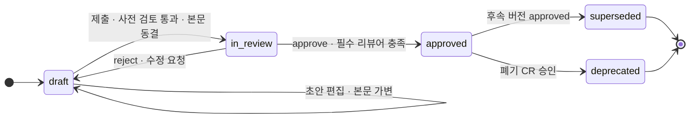
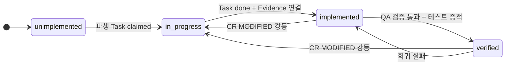
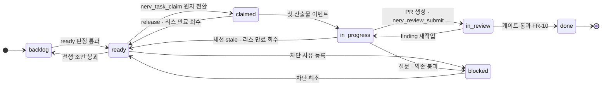

# 스펙 워크플로우와 거버넌스

> **요약** — NERV(가칭)의 일은 세 개의 상태 축 위에서 흐른다. 스펙 문서가 초안에서 승인으로 가는 **문서 축**, 요구사항이 미구현에서 검증 완료로 가는 **구현 축**, 그리고 작업이 백로그에서 완료로 가는 **Task 축**이다(D-02·D-03). 이 문서는 세 축의 상태도와 전이 조건·역할별 권한을 정의하고, 그 위에서 사람이 개입하는 지점 — 스펙/CR 승인, 플랜 승인, 에이전트 질문, 머지·CI, 그리고 기록되는 게이트 면제 — 을 **위험도 가변 게이트**(D-06)와 **지시자≠승인자** 규칙으로 설계한다. 핵심 메커니즘 세 가지는 원자적 클레임과 scope 겹침 검사 알고리즘(D-04), fingerprint 기반 리뷰 dedup과 게이트 판정(D-07), 그리고 알림을 티어·배칭·승인함 승격으로 나누는 알림 설계다. 모든 규칙은 clemvion 하네스가 5개월간 산문 규약으로 시도하다 무너진 지점(강제 리뷰어 미충족 160/575 세션, BLOCK 하향 모순 24/732)을 서버 강제로 옮긴 것이다.
>
> 문서 버전 v0.1 · 2026-08-13 · HTML 판: [spec-workflow.html](../html/spec-workflow.html)

---

## 1. 세 개의 상태 축 (D-02 · D-03)

### 1.1 왜 축을 나누는가

clemvion에는 상태 축이 **하나뿐**이다. 스펙 문서의 frontmatter `status`가 `backlog → spec-only → partial → implemented`(+`archived`) 5값을 갖는데, 이건 전부 *구현* 진행 축이고 문서 자체의 초안·검토·승인 상태가 아니다(`clemvion:spec/conventions/spec-impl-evidence.md` §3). 그 결과 두 가지 구조적 손실이 실측된다.

- **승인 이력이 사라진다.** 문서 리뷰 라이프사이클이 없으니 "누가 언제 이 스펙을 승인했는가"는 git PR 어딘가에 묻힌다. 특정 시점의 스펙 상태를 재구성하려면 git 고고학이 유일한 수단이다(순수 스펙 135 md·49,383줄, spec 터치 커밋 857개).
- **상태의 해상도가 문서 단위다.** `clemvion:spec/5-system/4-execution-engine.md`는 1,750줄인데 status 값은 하나다. `code:` 글로브가 한 개라도 매치하면 `implemented`로 통과하므로, 문서 안 개별 요구사항의 누락은 검출되지 않는다. 실제로 spec이 `필수`로 약속한 update dedup이 통째로 미구현이었던 사건(요구사항 ID `CCH-SE-02`)이 evidence 가드 도입 **이후에** 발생했다.

> **D-02 — 스펙 상태는 2축으로 분리한다.** ① 문서 리뷰 축: SpecVersion `draft → in_review → approved → superseded / deprecated` ② 구현 축: Requirement 단위 `unimplemented → in_progress → implemented → verified`. 여기에 실행 단위인 Task 축(`backlog → ready → claimed → in_progress → in_review → done`, +`blocked`)이 얹혀 세 축이 된다.

> **D-03 — 구현 추적의 단위는 Task와 Requirement.** "무엇이 구현됐나"는 문서 안 체크박스나 수동 ✅가 아니라 Requirement↔Task↔PR/커밋↔ReviewSession 관계 그래프로 **계산**한다. clemvion의 수동 ✅ 마크는 영역별로 131개 대 0개로 갈라졌다 — 관행이 유지되지 않는다는 실측이다.

### 1.2 문서 축 — SpecVersion 상태도



SpecVersion은 **불변 스냅샷**이다. 가변인 구간은 `draft` 하나뿐이며, `in_review` 진입 시점에 본문이 동결되고 content hash가 확정된다. 승인된 버전을 고치는 유일한 경로는 변경 요청(CR)으로 새 draft 버전을 만드는 것이다(§3). 이것이 clemvion의 "latest-only 본문 + 이력은 git" 사상을 계승하면서, 사라졌던 승인 축을 되살리는 방법이다.

| 전이 | 트리거 | 서버 가드(전이 조건) | 실행 권한 | 발생 이벤트 |
| --- | --- | --- | --- | --- |
| `→ draft` | 스펙 생성, `nerv_spec_draft_upsert` | 상위 스펙 노드 존재, 타입(vision/area/feature/design/convention/adr) 유효 | planner · designer · developer · admin · agent(위임) | `spec.draft_created` |
| `draft → in_review` | 제출, `nerv_spec_submit_review` | 사전 검토 BLOCK 없음(§2.1), 요구사항 블록 파싱 성공, 필수 리뷰어 산출 가능 | 작성자 본인 또는 planner | `spec.submitted` |
| `in_review → draft` | reject / 수정 요청 | 리뷰어 1인 이상의 `reject` 결정 | 지정 리뷰어 | `spec.rejected` |
| `in_review → approved` | approve | 필수 리뷰어 **전원** 승인, 지시자≠승인자(§2.3), 게이트 티어 충족(§2.4) | 지정 승인자(항상 사람) | `spec.approved` |
| `approved → superseded` | 후속 버전 승인 | 같은 Spec 노드의 다른 버전이 approved로 전이 | 서버 자동 | `spec.superseded` |
| `approved → deprecated` | 폐기 CR 승인 | 참조 중인 미완료 Task 0건 또는 이관 계획 첨부 | planner · admin | `spec.deprecated` |

에이전트는 `draft`까지만 만들 수 있다. `spec:approve`는 어떤 자율성 설정에서도 사람 전용이다 — MCP 사양이 "호스트는 어떤 도구든 호출 전 명시적 사용자 동의를 받아야 한다"고 요구하는 지점이고, OWASP ASI03(Identity & Privilege Abuse) 대응이기도 하다.

**초안 편집 리스 — 두 개의 편집기가 아니라, 하나의 초안에 대한 두 개의 입력 장치.** 기획자는 같은 draft를 웹 에디터(S3)에서도, Claude Code/Codex 세션에서도 쓴다. 이때 두 표면 사이의 동시성은 새 개념이 아니라 D-04의 클레임+리스를 문서 축으로 확장해 푼다 — `draft` 상태의 SpecVersion 하나당 편집 리스는 최대 1개이고, 보유자는 **(사용자, 표면)** 쌍이다. 표면은 웹(세션 없음) 또는 에이전트 세션이다.

| 규칙 | 내용 |
| --- | --- |
| 획득 | **암묵적** — 웹 에디터를 열거나 `nerv_spec_draft_upsert`가 성공하는 순간 자동 획득·갱신. 별도 claim/release 도구는 만들지 않는다 |
| 갱신 | 저장·upsert마다 갱신. 웹은 에디터가 열려 있는 동안 주기 갱신 |
| 인계 | 같은 사용자가 다른 표면에서 열면 **자동 인계** + 이전 표면에 알림 |
| 타인 차단 | 다른 사용자의 에이전트 upsert는 `NERV_DRAFT_LEASED` 에러(하드 차단). 다른 사용자의 웹은 읽기 전용 + [인계 요청] 버튼(보유자에게 알림, 승인 시 이전) |
| 만료 | TTL **30분** — Task 클레임 리스·stale 임계와 같은 상수를 쓴다(§4.5, 새 상수를 만들지 않는다) |
| 해제 | `nerv_spec_submit_review` 성공 · 웹 에디터 닫기 · `SessionEnd` 훅 · TTL 만료 |
| 최후 방어선 | **`base_version` 409는 그대로 유지한다.** 리스는 1차 사전 조정(작업 낭비 방지)이고, 409는 데이터 유실 방지다 — 역할이 다르므로 둘 다 필요하다 |

부수 효과: 스펙을 쓰는 에이전트 세션도 S5 세션 보드에 뜬다(FR-07·08의 기존 메커니즘 그대로). 기획자의 작성 세션이라고 팀의 시야 밖에 있는 사각은 생기지 않는다.

### 1.3 구현 축 — Requirement 상태도



이 축의 값은 **사람이 손으로 찍지 않는다.** 서버가 관계 그래프에서 파생한다(D-03).

| Requirement 상태 | 파생 규칙 |
| --- | --- |
| `unimplemented` | 연결된 Task가 없거나 전부 `backlog`/`ready` |
| `in_progress` | 파생 Task 중 하나 이상이 `claimed`/`in_progress`/`in_review` |
| `implemented` | 파생 Task 전부 `done` **그리고** Evidence(코드 경로·커밋·PR) 1건 이상 연결 |
| `verified` | `implemented` + QA 역할의 검증 Evidence(테스트 통과 기록) 1건 이상, 해당 커밋 범위에 open `critical` finding 0 |

강등(→ `in_progress`)은 CR이 그 요구사항을 MODIFIED로 표시할 때 자동으로 일어난다. clemvion이 `CCH-SE-02`를 놓친 사각 — "문서는 implemented인데 그 안의 한 요구사항은 미구현" — 은 상태의 단위를 요구사항으로 내리는 것만으로 사라진다.

### 1.4 Task 축 — 실행 상태도



`blocked`는 별도 축이 아니라 어느 상태에서든 들어가고 나올 수 있는 예외 상태다. 진입 시 사유 코드(`awaiting_answer` / `dependency_broken` / `spec_conflict` / `external`)와 해소 조건을 필수로 받는다 — clemvion의 `(unstarted)` sentinel이 "placeholder는 어떤 worktree와도 매칭되지 않아 plan이 게이트에서 사라진다"는 이유로 가드에 거부당한 것과 같은 원리로, 사유 없는 blocked는 백로그 부패의 씨앗이기 때문이다.

### 1.5 세 축이 만나는 지점

| 사건 | 문서 축 | 구현 축 | Task 축 |
| --- | --- | --- | --- |
| 스펙 승인 | `in_review → approved` | 새 Requirement가 `unimplemented`로 등록 | 파생 Task가 `backlog`로 생성 |
| 클레임 | 변화 없음 | `unimplemented → in_progress` | `ready → claimed` |
| Task 완료 | 변화 없음 | `in_progress → implemented` (Evidence 조건) | `in_review → done` |
| QA 검증 | 변화 없음 | `implemented → verified` | 변화 없음 |
| CR 승인(MODIFIED) | 새 버전 `approved`, 이전 `superseded` | 해당 REQ `verified/implemented → in_progress` | 관련 Task 재개 또는 신설 |

이 표가 P4("구현 상태·다음 할 일 추적 곤란")의 답이다. clemvion에서는 이 세 축이 `spec/0-overview.md` §6의 수동 표, `_product-overview.md`의 수동 ✅, `plan/in-progress/` 디렉토리 위치라는 서로 다른 세 문서 관행에 흩어져 있었고, 백로그 인덱스 문서(`clemvion:plan/in-progress/0-unimplemented-overview.md`)는 "미관리 stale 문서"로 삭제됐다(#426). 상태가 질의 가능한 메타데이터가 되면 인덱스 문서를 유지할 필요 자체가 없다.

### 1.6 역할별 권한 매트릭스

역할은 `admin · planner · designer · developer · qa · viewer`이며(FR-14), 에이전트는 별도 principal 타입으로 소유 사용자의 권한을 **상속하되 절대 확대하지 않는다**(D-08).

| 동작 | admin | planner | designer | developer | qa | viewer | agent(위임) |
| --- | :-: | :-: | :-: | :-: | :-: | :-: | :-: |
| 스펙 조회·코멘트 | ● | ● | ● | ● | ● | ● | ● |
| 스펙 draft 작성·수정 | ● | ● | ○ design 타입 | ○ convention/adr | ○ | — | ● |
| in_review 제출 | ● | ● | ○ | ○ | ○ | — | ● |
| **스펙/CR 승인·거절** | ● | ● | ○ design 타입 | ○ convention/adr | ○ feature 타입 | — | **불가** |
| CR 제안 | ● | ● | ● | ● | ● | — | ● |
| Task 생성·분해 | ● | ● | — | ● | ○ | — | ○ 제안만 |
| Task 클레임·리스 갱신 | ● | ● | ● | ● | ● | — | ● |
| 리뷰 제출(ReviewSession) | ● | ● | ● | ● | ● | — | ● |
| finding 해결 판정 | ● | ● | ● | ● | ● | — | ○ `fixed`만 |
| Requirement `verified` 전이 | ● | — | — | — | ● | — | — |
| **게이트 면제(BYPASS)** | ● | ○ 스펙 계열만 | — | ○ 코드 계열만 | — | — | **불가** |
| 게이트 정책·위험도 임계 편집 | ● | — | — | — | — | — | — |
| 알림 구독 규칙 편집(본인) | ● | ● | ● | ● | ● | ● | — |

● 가능 · ○ 조건부(지정 시 또는 명시 범위) · — 불가

clemvion은 역할을 **경로별 쓰기 권한**으로 구현했다(planner는 `spec/**`, developer는 `codebase/**`이고 `spec/`은 read-only). 이 분리 자체는 계승할 자산이지만, 강제 수단은 SKILL.md 산문("절대 수행하지 않으며")이었다 — 훅이 막는 것은 "어디서·무엇을 안 하고 push하는가"이지 "누가"가 아니다. NERV에서는 같은 분리가 서버 인가로 강제된다.

---

## 2. 승인 흐름

### 2.1 제출 전 자동 사전 검토 — 일관성 검사의 서비스화

clemvion에서 `spec/` 쓰기 직전 `/consistency-check --spec`은 의무였고, 5개 checker(cross-spec / rationale-continuity / convention-compliance / plan-coherence / naming-collision)가 병렬로 돌아 `review/consistency/<ISO시각>/SUMMARY.md`에 `BLOCK: YES/NO`를 남겼다. 858개 세션·42MB가 쌓였고, 산출물은 전부 git에 커밋됐다. NERV는 이 검사를 **플랫폼 서비스**로 옮긴다 — `draft → in_review` 전이의 전제 조건이고, 산출물은 DB 레코드다(D-01).

| 검사기 | 무엇을 보는가 | NERV에서 가능해지는 것 |
| --- | --- | --- |
| `cross-spec` | 다른 스펙과의 모순·중복 서술 | 안정 ID 참조 그래프로 중복 정의를 기계 검출(clemvion: "네 문서가 각자 필드를 열거"하던 drift) |
| `rationale-continuity` | 과거 기각한 대안의 무자각 재도입 | Rationale을 Decision 레코드로 보관해 기각 이력 질의 |
| `convention-compliance` | convention 타입 스펙 위배 | 규약을 스펙 노드로 두고 참조 관계로 검사 |
| `requirement-shape` | EARS 템플릿·요구사항 ID 형식·중복 ID | 요구사항이 1급 엔티티라 파싱이 아니라 스키마 검증 |
| `task-coherence` | 파생 Task와의 정합(고아 요구사항·빈 약속) | clemvion의 R-5 "어떤 plan도 책임지지 않는 빈 약속"을 FK 부재로 즉시 검출 |

**severity 하향은 감사 대상이다.** clemvion 실측에서 SUMMARY는 `BLOCK: NO`인데 checker 리포트에는 `[CRITICAL]`이 있는 모순이 커밋된 732세션 중 24건(3.3%) 존재했다. NERV에서는 종합 verdict가 개별 검사기 severity보다 낮을 수 없다는 것이 스키마 제약이고, 예외를 두려면 BYPASS 레코드(§7)를 남겨야 한다.

이 검사는 제출 게이트이면서 동시에 **셀프서비스**다. 에이전트는 `nerv_spec_check`(A1·읽기 전용)로 같은 검사 서비스를 초안 저장 후·제출 전 아무 때나 호출해, 5검사기별 warning/block 결과와 앵커 위치를 받아볼 수 있다. clemvion의 "spec 쓰기 직전 consistency-check 의무"(훅 강제)가 "수시 가능 + 제출 시 강제"로 바뀐 것이다.

### 2.2 리뷰어 자동 지정 (역할·영역 기반)

리뷰어는 사람이 고르는 것이 아니라 규칙에서 산출된다. clemvion은 코드 리뷰어 14종 중 7종(`documentation/maintainability/requirement/scope/security/side_effect/testing`)을 강제 화이트리스트로 두었는데, 2026-07-17 전수 조사에서 **커밋된 575 세션 중 160건(28%)이 강제 리뷰어 미충족**이었고 그중 107건은 RESOLUTION.md를 갖고 게이트를 통과 중이었다. 산문 의무는 예외가 아니라 상시로 무너진다 — 그래서 지정은 서버가 하고, 충족 여부는 전이 조건이 된다.

| 스펙 타입 | 필수 승인자 | 필수 검토자(코멘트 의무) | 자동 추가 규칙 |
| --- | --- | --- | --- |
| `vision` | admin 1 + planner 1 | designer, qa | 프로젝트 전 영역 워처에게 통지 |
| `area` | planner 1 | 해당 영역 오너, developer 1 | 영역 하위 스펙 담당자 전원 워처 등록 |
| `feature` | planner 1 + (UI 영역이면 designer 1) | developer 1, qa 1 | 참조 Requirement의 기존 담당자 |
| `design` | designer 1 | planner 1 | 연결된 feature 스펙의 승인자 |
| `convention` | developer 1 + admin 1 | planner 1 | 해당 규약을 참조하는 스펙 소유자 |
| `adr` | developer 1 + planner 1 | admin | 기각 대안이 있으면 원 결정의 승인자 |

지정 결과는 SpecVersion에 고정(pin)된다. 지정 이후 멤버십이 바뀌어도 이미 진행 중인 리뷰의 필수 집합은 변하지 않으며, 변경하려면 승인 요청을 다시 만든다.

### 2.3 지시자 ≠ 승인자

GitHub는 Copilot이 만든 PR에 대해 "작업을 지시한 사람의 승인은 필수 승인 수에 포함되지 않는다"고 못 박고, 에이전트가 푸시한 변경의 CI는 사람이 diff를 확인하고 "Approve and run workflows"를 눌러야 돈다. NERV는 이 규칙을 스펙 승인까지 확장한다.

```
승인 유효성 판정 (서버)
  reject IF actor_id == approval.requested_by            # 본인이 낸 요청을 본인이 승인
  reject IF actor_id == spec_version.author_user_id      # 초안 작성자 = 승인자
  reject IF actor.is_agent                               # 에이전트는 영구 불가
  reject IF actor_id == agent_session.owner_user_id      # 에이전트를 지시한 사람 = 승인자
         AND spec_version.author_session_id IS NOT NULL
  reject IF approval.target_content_hash != spec_version.content_hash   # stale 승인
```

네 번째 규칙이 D-08의 귀결이다. 에이전트는 소유 사용자의 위임 권한으로 행동하므로, 에이전트가 쓴 초안을 그 소유자가 승인하면 실질적으로 자기 승인이 된다. UI는 이 경우 승인 버튼을 비활성화하고 "이 초안은 당신의 세션이 작성했습니다 — 다른 승인자가 필요합니다"를 표시한다.

다섯 번째 규칙은 **승인의 유통기한**이다. 승인은 특정 content hash에 대한 결정이므로, 대상 본문이 바뀌면 무효화되고 재요청된다. 승인 감사 레코드에는 승인 ID·시각·요청자·승인자·대상 리소스·평가된 정책 버전·결정·실행 결과를 남긴다 — 사후에 "그때 왜 자동 승인됐나"를 재구성하려면 정책 버전이 반드시 필요하다.

**자기 승인 금지.** 위 판정 규칙을 정책 한 문장으로 못 박으면 이렇다 — **에이전트가 작성한 초안**(`spec_version.author_session_id`가 NOT NULL)은 그 세션을 소유한 사용자가 **단독으로 승인할 수 없고**, 다른 멤버 1인 이상의 승인이 필요하다. T0(자동 통과 티어)는 예외다 — 기존 규칙대로 자동 통과한다(§2.4). GitHub가 Copilot PR에 적용한 "지시자≠승인자" 규칙을 스펙 승인으로 확장한 것이며, 1차 출처는 [2.3 협업 플랫폼의 에이전트 통합](../02-research/collab-platforms.md)에 있다.

**소규모 완화.** 프로젝트 멤버가 2인 미만이거나 승인 가능한 다른 역할이 없으면 이 정책은 **자동 완화**된다 — 차단 대신 승인 화면에 배너를 띄우고 감사 이벤트를 기록한다(D-14의 fail-open+관측+격상 패턴 재사용). clemvion 1인 마이그레이션(D-12)이 이 규칙에 막혀 죽지 않기 위한 조항이다. 정책은 S8 게이트 정책에 토글로 노출된다(기본 ON).

### 2.4 위험도 가변 게이트 (D-06)

> **D-06 — 사람 개입 게이트는 위험도 가변.** 표준 게이트 4+1: ① 스펙/CR 승인 ② 플랜 승인(대형 작업 착수 전) ③ 에이전트 질문(awaiting_input) ④ PR 머지·CI 실행("지시자≠승인자" 채택) + ⑤ 게이트 면제는 기록되는 BYPASS. 저위험 변경(오탈자 등)은 자동 통과 경로를 둬 "버그 하나에 16개 AC" 워터폴 비판을 제품으로 반박한다.

이 티어는 **스펙 변경 게이트 티어(T0~T3)**이며, [3.4 에이전트 연동 설계](agent-integration.md)가 정의하는 **도구 호출 위험도(A1~A4)**와는 다른 축이다. 게이트 티어는 네 축의 점수로 산출한다 — **부작용 × 데이터 민감도 × 가역성 × 영향 범위**. 이 4축 분류는 고위험 에이전트 액션의 승인 게이트 설계에서 확립된 프레임이고, NERV는 스펙 도메인으로 번역해 쓴다.

| 축 | 0점 | 1점 | 2점 |
| --- | --- | --- | --- |
| 부작용 | 서술 정정(오탈자·문구·링크) | 기존 요구사항 수정 | 요구사항 추가/삭제, 규약·ADR 변경 |
| 민감도 | 내부 설명 | 외부 노출 사양(API·화면 계약) | 보안·권한·과금·개인정보 |
| 가역성 | 되돌려도 파생 영향 없음 | 파생 Task 재계산 필요 | 이미 구현·배포된 요구사항을 무효화 |
| 영향 범위 | 참조 스펙 0~1 | 참조 스펙 2~5 또는 파생 Task 1~3 | 참조 스펙 6+ 또는 파생 Task 4+ |

| 합계 | 티어 | 처리 | 예시 |
| --- | --- | --- | --- |
| 0~1 | **T0 자동 통과** | 승인 없이 approved, 사후 통지만(다이제스트) | 오탈자, 링크 정정, 표 정렬 |
| 2~3 | **T1 소프트 게이트** | 즉시 approved 처리하되 24시간 이의제기 창(되돌리기 1클릭) | 문구 명확화, 예시 추가 |
| 4~5 | **T2 하드 게이트** | 필수 승인자 1인 사전 승인 | 요구사항 문구 변경, 신규 feature 스펙 |
| 6+ | **T3 강화 게이트** | 필수 승인자 2인(직군 교차) + QA 확인 + 영향 분석 첨부 | 규약 변경, 승인된 요구사항 삭제, 권한 모델 변경 |

**동적 강화.** 액션 위험도만이 아니라 세션의 신뢰도도 티어를 올린다. 같은 Task에서 재시도가 임계를 넘거나(예: e2e 3회 실패 — clemvion의 `ESCALATE=e2e-fail-3x` 어휘를 그대로 계승), 최근 30일 내 해당 영역의 승인 후 롤백 이력이 있으면 티어를 +1 한다. 실패가 반복되는 세션에서 같은 액션의 게이트를 강화하는 것은 에이전트 운영의 표준 권고다.

**자동 통과 경로는 필수 기능이다.** SDD에 대한 대표적 비판은 "버그 하나 고치는 데 16개 인수 기준"이라는 워터폴 회귀 지적이다. T0/T1 경로가 없으면 NERV는 그 비판을 그대로 실현하는 도구가 된다. 반대로 모든 것을 묻는 설계는 반사적 승인(consent fatigue)을 낳고, 이것이 OWASP ASI09(Human-Agent Trust Exploitation)가 지목하는 취약점이다. 그래서 승인 카드는 에이전트의 요약문이 아니라 **실제 diff와 대상 리소스 원문**을 먼저 보여준다(§6.4).

### 2.5 결정 어휘: approve / reject / comment

Approval의 결정 값은 `approve · reject · comment` 세 가지다. HITL 프레임워크들이 쓰는 4종 결정(approve / edit / reject / respond)은 NERV의 세 값과 아래처럼 대응한다 — 새 상태값을 만들지 않고 기존 엔티티로 흡수한다.

| 외부 어휘 | NERV 표현 |
| --- | --- |
| approve | `Approval.decision = approve` |
| reject | `Approval.decision = reject` → SpecVersion `in_review → draft` |
| edit(인자 수정 후 실행) | `comment` + 승인자가 직접 draft 편집 → 재제출. 본문이 바뀌면 기존 승인은 hash 불일치로 자동 무효(§2.3) |
| respond(인간 응답을 결과로 반환) | Question 엔티티에 대한 `Approval` — 세션은 `awaiting_input`에서 재개(§4.7) |

### 2.6 SLA·리마인더·에스컬레이션

승인 대기는 사람의 기억이 아니라 상태 머신으로 관리한다. 승인함 항목은 `대기 → 결정 → 만료` 상태를 가진다.

| 시점 | 동작 | 채널 |
| --- | --- | --- |
| T+0 | 승인함 카드 생성 + 요청 세션에 "대기 중" 표시 | 인앱(즉시) + critical 티어 채널 |
| T+4h | 미결 리마인더 1회(같은 승인 건은 배칭되어 1건으로) | 인앱 |
| T+1d | 리마인더 2회 + 대체 승인자 후보 표시 | 인앱 + 메일 |
| T+2d | admin 에스컬레이션, 프로젝트 개요에 "지연 승인" 배지 | 인앱 + Slack |
| T+7d | 요청 `만료` 처리, 대상은 draft로 복귀하고 요청자에게 통지 | 다이제스트 |

`awaiting_input`으로 사람을 기다리는 에이전트 세션은 이 SLA와 별개로 하트비트를 유지한다(D-13). 승인이 며칠 걸려도 세션은 죽지 않아야 하며, 이는 "리뷰가 오래 걸리면 상태를 직렬화해 저장하고 나중에 재개하라 — 그것은 여전히 같은 run이다"라는 에이전트 승인 설계의 정석과 같다. 반대로 사람이 아니라 에이전트가 응답하지 않는 경우는 무활동 30분에 `stale`로 자동 전이하고 클레임을 회수한다(§4.5).

---

## 3. 변경 요청(CR) 흐름 (FR-04)

### 3.1 왜 CR인가

`approved` SpecVersion은 불변이다. 요구공학에서 승인된 요구사항 집합을 baseline으로 두고 이후 변경을 변경 통제로 다루는 것과 같은 이유다 — 승인 시점의 약속이 나중에 조용히 바뀌면 승인 자체가 무의미해진다. clemvion은 이 계층이 없어 본문을 직접 고치고 git 커밋에 이력을 위임했고, 그 결과 "정정/어긋/틀렸/누락" 류의 사후 정합화 커밋이 상시 업무가 됐다(`docs(spec)` 커밋 211개).

### 3.2 델타 뷰

CR은 새 draft 버전 + 요구사항 단위 델타를 함께 제시한다. 리뷰어는 1,750줄 본문 전체가 아니라 델타만 본다.

```
CR-142 · 웹챗 위젯 임베드 (spec: 7-channel-web-chat/2-embed, v3 → v4)
────────────────────────────────────────────────────────────
[ADDED]    REQ-CCH-SE-07  위젯은 세션 재개 시 마지막 30건을 복원한다
[MODIFIED] REQ-CCH-SE-02  update dedup: "권장" → "필수", 윈도우 5s → 3s
[REMOVED]  REQ-CCH-UI-11  레거시 iframe 임베드 모드
────────────────────────────────────────────────────────────
영향: 파생 Task 3건 · 진행 중 클레임 1건(세션 S-8812, host mbp-kim) · 참조 스펙 2건
게이트 티어: T3 (부작용 2 · 민감도 1 · 가역성 2 · 범위 1 = 6)
```

이 델타 어휘(ADDED/MODIFIED/REMOVED)는 파일 기반 SDD 도구들이 델타 스펙으로 검증한 형태이고, NERV에서는 파일 diff가 아니라 **요구사항 ID 단위**로 계산된다는 점이 다르다.

### 3.3 승인 시 영향 분석과 파생 Task 재계산

CR 승인은 세 축을 동시에 움직인다. 서버가 아래 규칙으로 재계산하고, 결과를 승인 화면에 **미리보기로 먼저 보여준 뒤** 승인을 받는다.

| 델타 | 문서 축 | 구현 축(Requirement) | Task 축 | 알림 티어 |
| --- | --- | --- | --- | --- |
| ADDED | 새 버전 approved, 이전 superseded | 새 REQ `unimplemented` | 파생 Task `backlog` 자동 제안(위임 명세 초안 포함) | standard |
| MODIFIED | 동일 | `implemented`/`verified` → `in_progress` 강등 | 완료 Task는 재검증 Task 신설, 진행 중 Task는 **재브리핑 필요** 플래그 | high (클레임 보유 세션에는 critical) |
| REMOVED | 동일 | REQ `deprecated` | 파생 Task 중 미착수분은 취소 제안, 진행 중이면 즉시 중단 확인 요청 | critical |

진행 중인 클레임이 있는 요구사항을 MODIFIED/REMOVED 하는 CR은 **그 세션에 즉시 알림을 보내고**(§6), 세션은 다음 하트비트에서 변경을 인지해 `blocked(spec_conflict)`로 스스로 전이할 수 있다. clemvion이 "동일 spec 파일을 두 worktree가 동시 수정 중이면 plan에 명시하고 직렬화한다. **자동 검출은 없다**"고 포기했던 지점(`clemvion:.claude/docs/worktree-policy.md` §3)이 여기서 복원된다 — 서버가 모든 세션의 scope 선언을 보기 때문이다.

### 3.4 SPEC-DRIFT 역류 경로

구현하다 보면 스펙이 틀렸다는 것이 드러난다. clemvion은 이 경우를 위해 정식 경로를 만들어 5개월 운영했다: 리뷰 finding에 `[SPEC-DRIFT]` 태그가 붙으면 `resolution-applier`가 **코드를 되돌리지 않고** `plan/in-progress/spec-update-<area>.md` 초안을 만든 뒤 `ESCALATE=spec`으로 격상하고, `/consistency-check --spec`을 거쳐 스펙에 반영한다. 요약 에이전트에는 "절대 일반 WARNING으로 뭉개지 말 것"이라는 지침이 명시돼 있다.

NERV는 같은 경로를 엔티티로 옮긴다.

```
Finding(tag=spec_drift, severity=warning)
   └─▶ nerv_spec_draft_upsert  →  CR draft 자동 생성 (본문·근거·해당 커밋 첨부)
        └─▶ planner 승인함 카드 "구현이 스펙을 개선했습니다 — 스펙 갱신 승인?"
             ├─ approve → CR 승인 흐름(§3.3) → Requirement 문구 갱신
             └─ reject  → Finding은 `dismissed`, 코드 되돌림 Task 생성
```

핵심은 **코드 revert가 기본값이 아니라는 것**이다. 스펙이 진실이라는 원칙과 "구현에서 배운 것이 스펙으로 역류한다"는 현실을 양립시키는 유일한 방법이고, `spec_drift`가 Finding의 1급 태그인 이유다.

### 3.5 CR과 문서 축의 관계

CR은 자체 수명 상태(`open / in_review / approved / rejected / withdrawn`)를 갖되, **승인 판정의 진실은 대상 SpecVersion의 문서 축 상태**다. CR 상태는 제안 자체의 진행(철회·반려 포함)을 표현하고, 무엇이 승인된 기준인지는 언제나 SpecVersion이 답한다. 두 값 중 어느 쪽이 진실인지 미리 못 박아 두지 않으면, 값이 갈라지는 순간 판단이 불가능해지기 때문이다 — clemvion에서 plan frontmatter `status`와 디렉토리 위치(`in-progress/` vs `complete/`)가 두 번이나 어긋난 실패(#1108·#1117)가 그 사례다.

---

## 4. 작업 흐름

### 4.1 Task 분해와 위임 명세 4요소 (FR-05)

승인된 SpecVersion의 Requirement에서 Task를 파생한다. 모든 Task는 **위임 명세 4요소**를 갖춰야 하며, 하나라도 비면 서버가 `ready` 승격을 거부한다.

| 요소 | 내용 | 미충족 시 벌어지는 일 |
| --- | --- | --- |
| **목표** | 어떤 Requirement를 충족시키는가(REQ ID 필수) | 에이전트가 스펙을 재해석해 범위가 흔들림 |
| **산출물 형식** | PR / 스펙 초안 / 리뷰 보고서 / 조사 노트 중 무엇인가 | 산출물이 어디로 가는지 몰라 로컬 파일로 남음 |
| **도구·출처** | 어떤 MCP 도구·저장소·문서를 근거로 쓰는가 | 근거 없는 구현, provenance 추적 불가(P5) |
| **경계** | 건드리면 안 되는 것, 결정하면 안 되는 것 | 스코프 이탈. clemvion이 리뷰어 14종 중 `scope`를 강제 화이트리스트에 넣은 이유 |

**플랜 승인 게이트(D-06 ②).** 위임 명세가 갖춰져도, 파생 Task가 4건 이상이거나 T3 티어 스펙에서 나온 대형 작업은 착수 전 플랜 승인을 받는다. 코드 2,000줄이 쓰이기 전 설계 단계에서 문제를 잡는 shift-left 접근이 검증된 방향이고, clemvion의 `/merge-coordinate`가 Phase 2에서 사용자 confirm을 의무화한 것과 같은 위치의 게이트다.

### 4.2 ready 판정

```
ready(task) ⟺
      task.status == 'backlog'
  AND task.spec_version.status == 'approved'
  AND 위임_명세_4요소_충족(task)
  AND ∀ d ∈ TaskDependency(task): d.status == 'done'
  AND (task.plan_approval_required ⇒ task.plan_approval.decision == 'approve')
  AND task.blocked_reason IS NULL
```

ready 큐는 우선순위·기한·담당 후보로 정렬된 **질의 결과**다. 문서가 아니다. clemvion에서 백로그 조망을 담당하던 인덱스 문서가 부패해 삭제된 뒤 "사람 머리 + audit 도구 출력"에 의존하게 된 것, 그리고 34개 in-progress plan 중 15개만 `priority`를 선언했던 실측이 이 설계의 근거다.

### 4.3 클레임과 리스 (D-04 · FR-06)

> **D-04 — 동시성 제어는 원자적 클레임+리스(lease).** ready 판정(의존성 그래프) → `nerv_task_claim`(assignee+상태 원자 전환) → TTL 리스+하트비트 → 만료 시 자동 회수. 클레임 시 scope(spec_ids, file_globs)를 선언하고 겹침 시 경고/차단한다. ID는 서버 발급(해시 기반)으로 파일 기반 번호 충돌을 원천 제거한다.

클레임은 "누가 이 작업을 한다"의 선언이자 "내가 어디를 건드린다"의 선언이다. 후자가 P1(세션 간 스펙 충돌)·P2(중복 작업)를 푸는 열쇠다.

### 4.4 scope 겹침 검사 알고리즘

```
# nerv_task_claim 서버측 처리 — 원자적 클레임 + scope 겹침 판정
# 입력 : task_id, session_id, scope{spec_ids[], file_globs[]}, ttl
# 출력 : {ok:true, lease_expires_at, warnings[]} | {ok:false, reason, overlaps[]}

FUNCTION claim_task(task_id, session_id, scope, ttl):
  BEGIN TRANSACTION

    # 0) 대상 행 잠금 — 중복 클레임을 DB 레벨에서 차단
    task := SELECT * FROM task WHERE id = task_id FOR UPDATE
    IF task IS NULL OR task.status != 'ready':
        ROLLBACK; RETURN {ok:false, reason:'not_ready', status:task.status}

    # 1) 비교 대상은 "살아있는" 클레임만 (만료·죽은 세션은 먼저 회수)
    reclaim_expired_leases(task.project_id)
    active := SELECT c.*, s.hostname, s.user_id
              FROM claim c JOIN agent_session s ON s.id = c.session_id
              WHERE c.project_id = task.project_id
                AND c.released_at IS NULL
                AND c.lease_expires_at > now()
                AND s.status IN ('active', 'awaiting_input')
                AND c.session_id != session_id

    # 2) 두 축(스펙·파일)으로 겹침 계산
    overlaps := []
    FOR EACH c IN active:
        # 2-a) 스펙 축 — 트리 폐포로 확장해 조상/자손 겹침까지 검출
        spec_hit := closure(scope.spec_ids) ∩ closure(c.scope.spec_ids)

        # 2-b) 파일 축 — 파일시스템을 읽지 않고 glob 패턴만으로 교차 가능성 판정
        file_hit := []
        FOR EACH g1 IN scope.file_globs:
            FOR EACH g2 IN c.scope.file_globs:
                IF globs_can_intersect(g1, g2): file_hit += (g1, g2)

        IF spec_hit ≠ ∅ OR file_hit ≠ ∅:
            overlaps += { session:c.session_id, host:c.hostname, user:c.user_id,
                          task:c.task_id, specs:spec_hit, files:file_hit,
                          severity:severity_of(spec_hit, file_hit, task, c) }

    # 3) 정책 판정 — 차단은 좁게, 경고는 넓게
    IF ∃ o ∈ overlaps WHERE o.severity == 'block':
        ROLLBACK
        emit_event('claim.conflict_blocked', task, overlaps)
        RETURN {ok:false, reason:'scope_conflict', overlaps}

    # 4) 조건부 UPDATE — 경쟁에서 진 세션은 affected_rows = 0 으로 즉시 판별
    UPDATE task
       SET status = 'claimed', assignee = session.user_id, delegate_session = session_id
     WHERE id = task_id AND status = 'ready'
    IF affected_rows == 0:
        ROLLBACK; RETURN {ok:false, reason:'lost_race'}

    INSERT INTO claim(task_id, session_id, scope, lease_expires_at = now() + ttl)
    INSERT INTO event(type='task.claimed', actor=session, is_agent=true, targets=[task])

  COMMIT

  IF overlaps ≠ ∅:
      notify(overlaps, tier='high')      # warn 은 통과시키되 양쪽 세션·담당자에게 알린다
  RETURN {ok:true, lease_expires_at, warnings:overlaps}


# glob 교차 가능성 — 두 패턴이 같은 파일을 가리킬 수 있는가 (보수적 판정)
FUNCTION globs_can_intersect(g1, g2):
    IF g1 == g2: RETURN true
    p1 := split(g1, '/');  p2 := split(g2, '/')
    i := 0
    WHILE i < len(p1) AND i < len(p2):
        a := p1[i];  b := p2[i]
        IF a == '**' OR b == '**':        RETURN true    # 이후 임의 깊이 → 교차 가능
        IF NOT segment_can_match(a, b):   RETURN false   # 리터럴 불일치 → 교차 불가
        i := i + 1
    RETURN true                                          # 접두 전부 호환 → 보수적으로 true

# 위험도 — 차단은 "같은 스펙 문서를 두 세션이 동시에 개정"하는 경우로 한정
FUNCTION severity_of(spec_hit, file_hit, t_new, c_old):
    IF spec_hit ≠ ∅ AND both_tasks_mutate_spec(t_new, c_old):  RETURN 'block'
    IF spec_hit ≠ ∅:                                           RETURN 'warn'
    IF file_hit ≠ ∅ AND same_requirement(t_new, c_old):        RETURN 'warn'
    IF file_hit ≠ ∅:                                           RETURN 'info'
    RETURN 'info'
```

설계 의도 세 가지.

1. **차단은 좁게.** 파일 글로브가 겹친다는 이유로 막으면 대형 저장소에서는 아무도 일을 못 한다(clemvion `codebase/` 724MB). 진짜 되돌리기 어려운 충돌은 "같은 스펙 문서를 두 세션이 동시에 개정"하는 경우이므로 그것만 `block`이다. 나머지는 통과시키되 **양쪽 모두에게** 알린다 — 중복 작업(P2)은 차단이 아니라 인지로 해결되는 문제다.
2. **glob은 파일시스템을 읽지 않는다.** 서버는 대상 저장소의 워킹트리를 갖고 있지 않다. 패턴 대 패턴 판정이므로 보수적으로 true를 반환하며, 이는 clemvion이 인정한 stale glob 문제("없어진 파일을 가리키는 glob이 다른 파일에 매칭돼서 통과")를 회피한다.
3. **경쟁은 조건부 UPDATE로 끝낸다.** `WHERE status='ready'` 조건이 붙은 단일 UPDATE의 affected_rows가 승패를 결정한다. 파일 기반 번호 발급이 필요 없고, ID는 서버가 해시로 발급한다.

### 4.5 하트비트·리스 만료·stale (D-13)

| 값 | 기본값(설정 가능) | 근거 |
| --- | --- | --- |
| 하트비트 주기 | 60초 | 세션 보드 갱신 ≤5s(NFR-02)를 만족하면서 서버 부하가 낮은 지점 |
| 리스 TTL | 30분 | 하트비트마다 갱신되므로 정상 세션은 만료되지 않음 |
| 초안 편집 리스 TTL | 30분 | 문서 축의 초안 편집 리스(§1.2) — Task 클레임 리스와 **같은 상수**를 쓴다(별도 리스 상수를 만들지 않는다) |
| stale 임계 | 무활동 30분 | Linear가 에이전트 세션에 채택한 값과 동일 |
| 회수 동작 | `claimed`/`in_progress` → `ready`, 산출물·Activity는 보존 | 죽은 세션 정리를 사람이 감시하지 않게 |

clemvion의 GC reaper는 "merge는 대부분 GitHub 웹에서 일어나 로컬이 그 이벤트를 관측할 수 없다"는 이유로 세션 시작마다 `gh pr list`를 폴링했고, 그마저도 "동시에 열린 다른 세션이 앵커로 쓰는 worktree의 PR이 merge되면 그 세션은 여전히 죽는다 — 살아있는 세션 앵커 레지스트리가 필요하다"고 한계를 명시했다. 세션 레지스트리(FR-07)가 서버에 있으면 그 한계는 존재하지 않는다.

### 4.6 done 전이 조건 (FR-10 게이트)

`in_review → done`은 아래를 **전부** 만족할 때만 허용된다. 판정은 서버 질의 한 번이다.

| # | 조건 | clemvion 대응물 |
| --- | --- | --- |
| 1 | 이 Task의 커밋 범위를 커버하는 **해소된 리뷰**가 존재 | `guard_review_before_push.py`의 3조건(커버리지·해소·신선도) |
| 2 | 필수 리뷰어 전원의 ReviewerReport 존재 | `agents_forced` 화이트리스트(미충족 160/575 실측) |
| 3 | 대상 커밋 범위에 open `critical` finding 0건 | `BLOCK: YES` 차단 |
| 4 | Requirement ↔ 구현 Evidence 1건 이상 연결 | spec frontmatter `code:` 글로브 ≥1 매치 |
| 5 | **스펙 영향 선언**(변경된 스펙 ID 목록 또는 `none`) | Gate C `spec_impact` — 없으면 build fail |
| 6 | 테스트 증적 기록(lint/unit/build/e2e, e2e는 `통과·면제·환경차단·3회실패` 4상태) | RESOLUTION.md의 TEST 결과 규약 |

> **D-14 — 게이트는 fail-open + 관측 + 격상, 진실은 서버 산출물.** 판정 불가(예: git forge 웹훅 지연으로 커밋 범위를 모름) 시 진행을 허용하되 배너와 연속 카운터를 남기고, 임계 초과 시 "게이트가 사실상 꺼짐"으로 격상한다. 그리고 에이전트의 자기보고(STATUS 한 줄)와 실제 산출물 업로드를 분리 검증한다 — **서버에 업로드된 산출물만 진실이다.**

조건 5는 clemvion에서 가장 잘 작동한 규칙의 이식이다. "작업 완료가 스펙 정합 결정을 강제 동반"하게 만들면, 완료 시점에 아무도 스펙을 보지 않는 사태가 구조적으로 불가능해진다. `none` sentinel을 허용하되 선언 자체는 필수라는 점이 핵심이다.

### 4.7 blocked와 질문(Question) 에스컬레이션

에이전트가 스스로 결정하면 안 되는 것을 만나면 `nerv_question_create`로 질문을 만들고 세션은 `awaiting_input`으로 대기한다. 질문은 선택지를 포함할 수 있다.

```
세션 S-8812 (developer/mbp-kim, Task T-204)
  └─ nerv_question_create(
        question: "REQ-CCH-SE-02의 dedup 윈도우를 3s로 줄이면 기존 클라이언트가 깨집니다",
        options: ["3s 강행 + 마이그레이션 공지", "5s 유지 + 스펙 정정 CR", "판단 보류"],
        blocking: true, escalate: "user-decision")
     → 세션 active → awaiting_input
     → planner 승인함 카드(critical 티어, Slack DM 딥링크)
     → 답변 시 Activity(response) 기록 + 세션 재개, Task는 blocked 해제
```

에스컬레이션 사유 어휘는 clemvion에서 5개월 검증된 매트릭스를 그대로 쓴다: `user-decision / spec / infra / e2e-fail-3x / sensitive-fix`. `spec`은 §3.4의 SPEC-DRIFT 경로로, `user-decision`은 승인함 질문 카드로 라우팅된다. 이 "질문 → 대기 → 답변 → 재개" 3단 구조는 Linear의 `elicitation` activity가 세션을 `awaitingInput`으로 멈추고 승인함 알림을 보내는 모델과 동형이며, 자율 에이전트 HITL의 세 패턴(Notify / Question / Review) 중 Question에 해당한다.

---

## 5. 리뷰 파이프라인 (D-07)

> **D-07 — AI 리뷰는 플랫폼 엔티티다.** ReviewSession(입력 커밋 스냅샷 필수) → ReviewerReport → Finding(fingerprint로 라운드 간 dedup) → Resolution(fixed/deferred/escalated, 커밋 FK). 게이트 판정은 서버 SQL로 한다 — clemvion의 1,005줄 정규식 push 훅과 rewrite-immune 시계가 전부 불필요해진다.

### 5.1 수집 — 입력 스냅샷은 필수 필드

clemvion 리뷰 세션의 `meta.json`에는 **커밋 SHA·diff base·브랜치 필드가 없다.** 검토 대상 파일 경로 목록만 있고, 커밋 해시는 SUMMARY 본문 산문에만 등장하며 표본 200개 중 47개에서만 발견된다. 브랜치는 `_retry_state.json`의 절대 경로에 우연히 새어 있을 뿐이고, PR 번호는 머지 커밋 제목에만 있다. 역방향 연결도 산문이다 — plan md 450개 중 197개가 리뷰 세션 경로를 체크리스트 문장으로 인용하는 반면, spec 쪽에서 리뷰를 참조하는 파일은 단 2개다. "이 리뷰가 무엇을 봤는가"가 구조화돼 있지 않다는 뜻이다(P5).

`nerv_review_submit`의 입력 스키마는 [3.4 에이전트 연동 설계](agent-integration.md) §2 도구 카탈로그가 정의한다. 아래는 그 필수 인자를 인용한 것이며, 하나라도 없으면 서버가 거부한다.

| 필드 | 값 | 없으면 불가능해지는 것 |
| --- | --- | --- |
| `repo` / `branch` | 저장소·브랜치 | 어느 라인에서 나온 리뷰인지 |
| `base_sha` / `head_sha` | diff 구간 | 게이트의 커버리지 판정(§5.4) |
| `changeset` | 파일 목록 + 내용 해시 | 라운드 간 동일 changeset 인식 |
| `kind` | `code` / `consistency` / `spec-coverage` / `merge` | 리뷰 종류별 게이트 규칙 적용 |
| `session_id` | 실행 주체(사용자·hostname·에이전트 종류) | "누가 돌린 리뷰인가"(P5) |
| `round_of` | 같은 changeset의 이전 ReviewSession | 라운드 체인 — clemvion에는 없는 축 |

### 5.2 fingerprint dedup

clemvion에서 같은 발견이 라운드마다 새 표 행으로 재서술됐다. 한 유예 항목이 세 세션(`14_01_46` / `17_15_21` / `18_19_33`)에서 반복 재확인된 것이 실례이며, dedup 키가 없다는 것이 정보 모델의 최대 결손으로 지목됐다.

**fingerprint 구성 요소는 [3.3 데이터 모델](data-model.md) §5.2가 정의한다.** 이 문서는 그 정의를 재정의하지 않고 인용만 한다 — 요소 목록이 두 곳에 복제되면 라운드 간 dedup이 문서마다 다르게 동작한다.

구성 요소에서 줄 번호를 뺀 이유는 코드가 위아래로 밀려도 같은 발견이어야 하기 때문이다. 같은 fingerprint가 다시 들어오면 새 Finding을 만들지 않고 기존 Finding에 occurrence를 추가한다. 그러면 이런 질의가 가능해진다 — "3라운드 이상 반복 등장했는데 아직 `open`인 finding", "지난 30일간 dismissed 후 재등장한 finding".

### 5.3 해결 추적 — 유예(`wont_fix`)는 1급 데이터

Finding 상태는 `open → fixed / dismissed / wont_fix`다. 여기에 처분 근거를 붙인다.

| 처분 | 필수 부가 정보 | 근거 |
| --- | --- | --- |
| `fixed` | 커밋 SHA(FK) | clemvion `fix(<scope>): SUMMARY#<n>` 커밋 규약 + `_resolution_state.json.commits_made[{sha,summary_id}]` |
| `dismissed`(오탐·기각) | 사유 + 승인자(사람) | severity 하향과 동일 취급 — 감사 대상 |
| `wont_fix`(유예) | 사유 + 재상정 조건 | 유예 결정이 산문으로만 존재해 세 세션에 걸쳐 반복 재확인된 실측 |
| `spec_drift` 태그 | 생성된 CR 링크 | §3.4 역류 경로 |

`wont_fix`는 "새 근거 없이 재상정하지 않는다"는 규칙과 함께 동작한다. 같은 fingerprint가 다시 들어와도 재상정 조건이 충족되지 않으면 리뷰어에게 "이미 유예된 항목"으로 표시되고 새 알림을 만들지 않는다 — 이것 하나로 리뷰 피로의 상당 부분이 사라진다.

### 5.4 게이트 판정 — 훅 1,005줄이 질의 한 줄로

clemvion의 push 게이트는 "이 브랜치의 최신 코드 변경보다 나중에 만들어진, 해소된 리뷰가 있는가"를 **파일시스템 walk + 디렉토리명 타임스탬프 파싱**으로 판정했다. checkout이 mtime을, rebase가 committer date를 오염시키므로 rewrite-immune 시계까지 따로 구현해야 했다.

```sql
-- "이 커밋 범위를 커버하는 해소된 리뷰가 있는가" (FR-10)
SELECT EXISTS (
  SELECT 1 FROM review_session rs
  WHERE rs.project_id = :project
    AND rs.branch     = :branch
    AND rs.head_sha   = :head          -- 신선도: 경로 타임스탬프가 아니라 커밋 동일성
    AND rs.forced_roles_satisfied      -- 커버리지: 필수 리뷰어 전원 산출물
    AND NOT EXISTS (                   -- 해소: open critical 0건
      SELECT 1 FROM finding f
      WHERE f.review_session_id = rs.id
        AND f.severity = 'critical' AND f.status = 'open')
);
```

커밋 SHA 연결 하나로 세 조건(커버리지·해소·신선도)이 단순 질의가 된다. 판정 불가 시의 동작은 D-14 그대로다 — 통과시키되 배너·카운터, 임계 초과 시 격상.

### 5.5 커버리지 계산 — P4의 답

"이 스펙 어디까지 구현됐나"는 대시보드 수치다. 문서 안 ✅가 아니라 관계 그래프 집계다.

```
구현 커버리지(spec) = |{r ∈ REQ(spec) : r.status ∈ (implemented, verified)}| / |REQ(spec)|
검증 커버리지(spec) = |{r ∈ REQ(spec) : r.status = verified}|                  / |REQ(spec)|
증적 결손(spec)     =  {r ∈ REQ(spec) : r.status = implemented ∧ Evidence(r) = ∅}
빈 약속(spec)       =  {r ∈ REQ(spec) : r.status = unimplemented ∧ Task(r) = ∅}
```

마지막 줄이 clemvion의 R-5 사례 — "spec이 plan을 가리키지 않아 어떤 plan도 책임지지 않는 빈 약속으로 영구 누락"된 텔레그램 chat-channel UI — 를 매일 자동 검출하는 질의다. clemvion은 이걸 NLP 휴리스틱(`/spec-coverage`, advisory·비차단)으로 근사해야 했다. 관계가 있으면 휴리스틱이 필요 없다.

### 5.6 보존 정책

**결론은 영구, 재생성 가능한 입력은 TTL.** clemvion이 이미 검증한 절충이다 — `_prompts/`(리뷰 전체의 약 70%)를 "커밋 해시 + 스킬로 항상 재생성 가능"을 근거로 gitignore 처리했다. 그런데도 결론만으로 60.7MB, packed blob 바이트의 60%에 도달한 것이 현재다.

| 데이터 | 보존 | 저장 위치 |
| --- | --- | --- |
| Finding · Resolution · verdict · 입력 스냅샷 메타 | 영구 | Postgres |
| ReviewerReport 본문 | 영구(압축) | Postgres |
| 리뷰 프롬프트 페이로드·중간 로그(`review_session.prompt_blob_uri`) | TTL 30일(설정) | 오브젝트 스토리지 |
| 세션 Activity 원문 | TTL 180일, 요약은 영구 | 혼합 |

리뷰가 DB로 가면 부수 효과가 하나 더 있다. clemvion에서 리뷰 산출물이 코드와 같은 브랜치에 커밋돼 다음 라운드 리뷰의 입력이 되는 **자기증식 루프**가 관측됐다 — 한 changeset이 8라운드를 돌았고 마지막 라운드 리뷰 프롬프트 94파일 중 86개가 이전 `review/**` 산출물이라 정작 소스 diff가 컨텍스트 예산 부족으로 생략됐다. 산출물이 git diff에서 사라지면 이 루프는 구조적으로 소멸한다.

---

## 6. 알림 설계 (FR-12)

### 6.1 이벤트 → 구독 → 라우팅

```
Event (append-only, D-10)
   │  actor{user|agent, is_agent} · action(<리소스>.<동사>) · targets[] · context · policy_version
   ▼
구독 규칙 매칭
   │  ① 역할 기반 (feature 스펙 승인 요청 → planner 전원)
   │  ② 워치 (사용자가 스펙 노드·영역·Task를 명시적으로 구독)
   │  ③ 관여 (내가 작성·승인·클레임·코멘트한 대상의 후속 이벤트)
   │  ④ 지정 (리소스 레벨 그랜트 — 이 스펙의 승인자로 지목됨)
   ▼
중요도 티어 산출 → 채널 라우팅 → 배칭 → 발송/승인함 승격
```

이벤트 이름은 `<리소스>.<동사>` 규약을 쓴다(`spec.approved`, `session.stale`, `claim.conflict_blocked`). 감사 로그와 알림이 같은 Event 테이블을 원천으로 하므로(D-10), 알림에 보인 것은 반드시 감사에도 남는다.

### 6.2 중요도 티어와 채널 라우팅

| 티어 | 정의 | 채널 | 배칭 |
| --- | --- | --- | --- |
| **critical** | 내 결정이 없으면 누군가의 세션이 멈춰 있다 | 인앱 즉시 + Slack DM + 메일 | 없음(개별 발송) |
| **high** | 내 작업에 직접 영향, 오늘 안에 봐야 함 | 인앱 즉시 + Slack 채널 | 5분 창 배칭 |
| **standard** | 알아두면 좋음 | 인앱만 | 5분 창 배칭 |
| **low** | 배경 활동 | 인앱 피드(뱃지 없음) | 일일 다이제스트 |

### 6.3 알림 카탈로그

| 이벤트 | 티어 | 수신자 | batch key |
| --- | --- | --- | --- |
| `approval.requested`(스펙/CR/플랜) | critical | 필수 승인자 | 없음 |
| `question.created` | critical | 대상 역할 또는 지정자 | 없음 |
| `claim.conflict_blocked` | critical | 양쪽 세션 소유자 | 없음 |
| `finding.opened`(critical severity) | critical | Task 담당자 + 리뷰 요청자 | 없음 |
| `cr.opened`(진행 중 클레임 영향) | critical | 클레임 보유 세션 소유자 | 없음 |
| `spec.rejected` / `spec.approved` | high | 작성자 · 워처 | `spec:{id}:decisions` |
| `claim.conflict_warn` | high | 양쪽 세션 소유자 | `task:{id}:conflicts` |
| `session.stale`(내 세션) | high | 세션 소유자 | `user:{id}:sessions` |
| `task.blocked` | high | 담당자 + planner | `task:{id}:state` |
| `gate.bypassed` | high | admin | `project:{id}:bypass` |
| `spec.comment_added` | standard | 스레드 참여자 · 워처 | `spec:{id}:comments` |
| `task.ready`(내 영역) | standard | 영역 워처 | `project:{id}:ready` |
| `finding.resolved` | standard | 리뷰 요청자 | `review:{id}:resolutions` |
| `session.started` / `session.complete` | low | 워처 | `session:{id}:lifecycle` |
| `task.claimed` / `task.done` | low | 워처 | `project:{id}:progress` |

에이전트 세션의 진행 이벤트(도구 호출·파일 수정)는 **알림을 만들지 않는다.** 세션 모니터(S5)와 활동 피드에서 WebSocket으로 흐를 뿐이다. 이걸 알림으로 만들면 세션 수십 개(NFR-04) 환경에서 승인함이 즉시 파괴된다.

### 6.4 승인함 승격 — 알림을 줄이는 궁극의 방법

**승인·질문·리뷰 요청은 알림이 아니라 작업 항목이다.** 흩어진 핑 대신 미결 액션을 한 곳에서 추적하는 Agent Inbox 패턴이며, NERV의 승인함(S7, FR-11)이 그 화면이다. 승인함 항목은 자체 상태 머신 `대기 → 결정 → 만료`(§2.6)를 갖고, Slack·메일은 **승인함으로 가는 딥링크만** 나른다. 같은 항목에 대해 채널을 넘나드는 중복 발송은 크로스 채널 dedup으로 제거한다 — 승인함에서 이미 처리된 항목은 대기 중이던 메일 다이제스트에서 빠진다.

```text
┌─ 승인함 (대기 3 · 결정함 · 만료) ────────────────────────────────────────┐
│ ✅ 스펙 변경 요청 · CR-142            [In Review]        [T3 강화 게이트] │
│    7-channel-web-chat / 2-embed · v3 → v4      요청 김기획 · 12분 전      │
│    [ADDED]    REQ-CCH-SE-07  세션 재개 시 마지막 30건 복원                │
│    [MODIFIED] REQ-CCH-SE-02  update dedup "권장"→"필수", 5s→3s            │
│    [REMOVED]  REQ-CCH-UI-11  레거시 iframe 임베드 모드                    │
│    영향: 파생 Task 3 · 진행 중 클레임 1 (S-8812 · mbp-kim) · 참조 스펙 2  │
│    ⓘ 지시자≠승인자 — 이 초안은 당신의 세션이 작성했습니다                 │
│                                     ( 승인 )( 거절 )( 코멘트 )           │
├──────────────────────────────────────────────────────────────────────────┤
│ ❓ 에이전트 질문 · S-8812  [AI]              [awaiting_input · 8분 경과]  │
│    dedup 윈도우를 3s로 줄이면 기존 클라이언트가 깨집니다                  │
│    ① 3s 강행 + 공지  ② 5s 유지 + 정정 CR  ③ 판단 보류      ( 선택 )      │
├──────────────────────────────────────────────────────────────────────────┤
│ 🔔 통지 · T1 소프트 게이트로 자동 승인됨          [23시간 남음]           │
│    5-system / 12-webhook · 설명 문구 명확화 (1·0·1·0 = 2) ( 되돌리기 )    │
└──────────────────────────────────────────────────────────────────────────┘
```

카드는 세 유형이며, 자율 에이전트 HITL의 3패턴과 정확히 대응한다.

| 카드 유형 | HITL 패턴 | 카드에 반드시 보이는 것 |
| --- | --- | --- |
| 승인(스펙/CR/플랜/게이트 면제) | Review | 요구사항 단위 델타 원문, 영향 분석(파생 Task·진행 중 클레임), 게이트 티어와 산출 근거 |
| 질문 | Question | 질문 원문, 선택지, 대기 중인 세션(사용자·hostname·경과) |
| 통지 | Notify | 무엇이 왜 바뀌었는지 + 되돌리기 링크(T1 소프트 게이트의 이의제기 창) |

승인 카드는 **에이전트의 요약문이 아니라 실제 diff·명령·대상 리소스를 먼저 보여준다.** 매끄러운 설명으로 사람을 속여 유해한 승인을 받아내는 것이 OWASP ASI09가 명명한 공격 표면이고, 원문 우선 표시가 그에 대한 구조적 방어다.

### 6.5 배칭·다이제스트

인앱은 **batch-on-write**(이벤트 발생 시 수신자별 배치에 누적, 창이 닫힐 때 flush), 메일은 **batch-on-read**(일 1회 미열람 항목 수집)로 이원화한다.

- **batch key**: §6.3 표의 값. 같은 키의 이벤트는 한 알림으로 접힌다("스펙 3.2에 코멘트 4건").
- **batch window**: 인앱 5분 / 메일 24시간(사용자별 조정 가능).
- **조기 flush**: 배치 항목이 20건을 넘거나 상위 티어 이벤트가 같은 키로 들어오면 즉시 발송.
- **idempotency**: 배치 flush는 1회 발송 보장 키로 중복을 막는다. 동시 이벤트가 두 배치를 만드는 경쟁도 같은 키로 방지한다.

### 6.6 피로 방지 원칙 다섯

1. **가치 위계를 먼저 정한다.** 티어가 채널과 배칭 규칙을 결정하지, 그 반대가 아니다.
2. **선호 센터를 1차 출시 범위에 넣는다.** 카테고리 × 채널 × 빈도 × 방해금지 시간. 선호 센터를 둔 제품은 발송량을 줄이지 않고도 수신거부가 최대 30% 감소한다는 실측이 있다.
3. **결정이 필요한 것만 승인함으로.** 나머지는 피드다. 승인함 배지 숫자는 "내 결정을 기다리는 것"만 센다.
4. **중복은 채널을 넘어 제거한다.** 승인함에서 처리된 항목은 예약된 다이제스트·Slack 발송에서 취소한다.
5. **에이전트 진행 상황은 알림이 아니라 화면이다.** 실시간이 필요한 것은 WebSocket으로 밀고(NFR-02), 사람의 개입이 필요할 때만 승인함 항목이 생긴다.

---

## 7. 게이트 카탈로그와 실패 모드

D-06의 표준 게이트 4+1을 한 표로 정리하면 아래와 같다. 각 게이트는 판정 주체·차단 대상·fail-open 동작·관측 지표를 갖는다(D-14).

| # | 게이트 | 판정 | 차단 대상 | 티어 가변 | fail-open 시 동작 | 관측 지표 |
| --- | --- | --- | --- | :-: | --- | --- |
| G1 | 스펙/CR 승인 | 필수 승인자 + 지시자≠승인자 + hash 일치 | `in_review → approved` | ● T0~T3 | 해당 없음(승인은 사람이 없으면 진행 불가) | 승인 리드타임, 만료율 |
| G2 | 플랜 승인 | 파생 Task 4건+ 또는 T3 스펙 | `ready → claimed` | ● | 정책 조회 실패 시 통과 + 배너 | 플랜 승인 건수, 착수 후 범위 이탈률 |
| G3 | 에이전트 질문 | `blocking: true`인 Question | 세션 `active` 재개 | — | 해당 없음 | 답변까지 걸린 시간, 미답변 만료 |
| G4 | 리뷰 커버리지·머지/CI | §5.4 질의 + git forge 웹훅 | `in_review → done`, CI 실행 | ● | 통과 + 배너 + 연속 카운터, 임계 초과 시 격상 | fail-open 연속 횟수, 커버리지 미달률 |
| G5 | BYPASS(면제) | admin 또는 범위 한정 역할 | — (통과시키는 장치) | — | 해당 없음 | 면제 건수·사유 분포, 반복 면제 경로 |

**BYPASS는 우회가 아니라 기록이다.** clemvion에도 `BYPASS_DEFAULT_BRANCH_GUARD=1` 같은 환경변수 탈출구가 있었지만 사용 사실이 어디에도 남지 않았다. NERV의 BYPASS는 Approval 엔티티(대상: 게이트 면제)로 만들어지고, 사유·범위·유효 시간을 받으며, admin 알림과 감사 로그에 남는다. 같은 경로에서 면제가 반복되면 그것은 게이트 설계가 틀렸다는 신호이며, 정책 조정 대상이 된다 — clemvion이 실패 이력에서 게이트를 사후에 키워 온 방식("게이트는 문서가 아니라 실패 이력에서 자랐다")을 데이터로 앞당기는 장치다.

주요 실패 모드와 대응.

| 실패 모드 | 증상 | 설계상 대응 |
| --- | --- | --- |
| 승인 병목 | 승인자 1인에게 전부 몰림 | 필수 승인자 규칙을 역할·영역으로 분산(§2.2), T+1d에 대체 승인자 후보 표시 |
| 반사적 승인 | 내용을 안 보고 승인 | T0/T1 자동 경로로 저위험을 걸러내고(§2.4), 카드에 원문 diff 우선 표시(§6.4) |
| 게이트 상시 꺼짐 | fail-open이 일상화 | 연속 카운터 임계 초과 시 격상 배너 + admin 알림(D-14) |
| 클레임 교착 | 겹침 차단이 과도해 진행 불가 | `block`은 "같은 스펙 동시 개정"에만, 나머지는 경고(§4.4) |
| 좀비 세션 | 죽은 세션이 작업을 붙잡음 | 하트비트 30분 → `stale` + 리스 자동 회수(§4.5) |
| 리뷰 피로 | 같은 지적 반복 | fingerprint dedup + 유예 재상정 조건(§5.2·§5.3) |

---

## 참고 자료

### 이 문서가 인용한 clemvion 실측 근거

- `clemvion:spec/conventions/spec-impl-evidence.md` — frontmatter status 5값(`backlog/spec-only/partial/implemented/archived`), `spec-only` TTL 90일, `partial → implemented` 승격 가드. 문서 리뷰 축(초안/검토/승인)은 부재(§1.1·§1.2)
- `clemvion:spec/5-system/4-execution-engine.md` — 1,750줄 문서에 status 값 하나. 요구사항 단위 상태 부재의 실물(§1.1)
- 요구사항 `CCH-SE-02` — spec이 `필수`로 약속한 update dedup이 통째로 미구현(커밋 `2a698f360`). evidence 가드 도입 이후에도 발생(§1.1·§1.3)
- `clemvion:spec/2-navigation/_product-overview.md` 외 — 수동 ✅ 마크 131개 vs 다른 영역 0개. 관행 비일관 실측(§1.1)
- `clemvion:.claude/skills/consistency-checker/SKILL.md` — checker 5종 병렬, `BLOCK: YES/NO`, "Critical 하향은 금지다". 세션 858개·42MB 누적(§2.1)
- `clemvion:.claude/hooks/_lib/review_guard.py` — BLOCK 하향 모순 24/732 세션(3.3%) 실측, 게이트 3조건(커버리지·해소·신선도), 경로 타임스탬프 시계(§2.1·§5.4)
- `clemvion:.claude/skills/code-review-agents/SKILL.md` — 강제 리뷰어 7종 화이트리스트, 커밋된 575 세션 중 160건(28%) 미충족(그중 107건은 게이트 통과 중)(§2.2)
- `clemvion:.claude/docs/worktree-policy.md` §3 — "동일 spec 파일을 두 worktree가 동시 수정 중이면 plan에 명시하고 직렬화한다. 자동 검출은 없다"(제거 근거 #576) / §7 — 살아있는 세션 앵커 레지스트리 부재(§3.3·§4.5)
- `clemvion:.claude/docs/plan-lifecycle.md` — 필수 3필드(worktree/started/owner), `(unstarted)` sentinel, Gate C `spec_impact` 선언 의무, 종료값 4종(#1108·#1117 두 번 놓친 실패), 34개 in-progress plan 중 15개만 `priority` 선언(§1.4·§3.5·§4.2·§4.6)
- `clemvion:plan/in-progress/0-unimplemented-overview.md` — 백로그 인덱스가 "미관리 stale 문서"로 삭제(#426, 커밋 `65f3e526b`). 인덱스 문서 부패의 실증(§1.5·§4.2)
- `clemvion:.claude/agents/resolution-applier.md` · `code-review-summary.md` — `[SPEC-DRIFT]` 태그의 코드 revert 금지 라우팅, "절대 일반 WARNING으로 뭉개지 말 것", ESCALATE 어휘 `no/spec/user-decision/infra/e2e-fail-3x/sensitive-fix`, `fix(<scope>): SUMMARY#<n>` 커밋 규약(§3.4·§4.7·§5.3)
- `clemvion:review/` — md 13,777개·131MB, 73일간 세션 1,891개(일평균 26), code 세션당 용량 59KB→81KB 증가, 현 추세 월 ~7,000파일/~50MB(§5.6)
- `clemvion:.git` — review 이력 blob 60.7MB = packed blob 바이트의 60%, 전체 커밋 2,464개 중 937개(38%)가 `review/` 접촉. `_prompts/`는 리뷰 전체의 ~70%로 "재생성 가능"을 근거로 gitignore(§5.6)
- 자기증식 루프 — 한 changeset이 code 5 + consistency 3 = 8라운드, 마지막 라운드 프롬프트 94파일 중 86개가 이전 `review/**` 산출물(§5.6)
- 리뷰 세션 `meta.json` — 커밋 SHA·diff base·브랜치 필드 부재, SUMMARY 표본 200개 중 47개만 해시 언급. 유예 항목이 세 세션에서 반복 재확인(§5.1·§5.2)
- `clemvion:spec/conventions/spec-impl-evidence.md` R-1·R-5 — stale glob 검출 불가, "어떤 plan도 책임지지 않는 빈 약속"(텔레그램 chat-channel UI 영구 누락)(§4.4·§5.5)

### 외부 출처 (전부 리서치 노트에서 접속 확인된 URL)

- [Reviewing a pull request created by GitHub Copilot — GitHub Docs](https://docs.github.com/enterprise-cloud@latest/copilot/how-tos/agents/copilot-coding-agent/reviewing-a-pull-request-created-by-copilot) — (2026-08-13 확인) 지시자의 승인은 필수 승인 수에 포함되지 않으며, 에이전트발 변경의 CI는 "Approve and run workflows" 명시 승인 후에만 실행된다(§2.3·§7 G4).
- [Developing the Agent Interaction — Linear Developers](https://linear.app/developers/agent-interaction) — (2026-08-13 확인) 세션 6상태(pending/active/error/awaitingInput/complete/stale)와 typed activity 5종. `elicitation` → `awaitingInput` 모델(§4.7·§1.4).
- [Interaction Best Practices — Linear Developers](https://linear.app/developers/agent-best-practices) — (2026-08-13 확인) 10초 ACK·무활동 30분 stale이라는 응답성 SLA, 불변 activity 로그와 편집 가능한 코멘트의 분리(§4.5).
- [Our approach to building the Agent Interaction SDK — Linear Blog](https://linear.app/now/our-approach-to-building-the-agent-interaction-sdk) — (2025-08-01) "에이전트는 책임을 질 수 없다" 원칙과 사람 assignee + 에이전트 delegate 분리(§1.6·§2.3).
- [Collaborate on work items with AI agents — Jira Cloud Docs](https://support.atlassian.com/jira-software-cloud/docs/collaborate-on-work-items-with-ai-agents/) — (2026-08-13 확인) 에이전트 출력은 트리거한 사람의 개인 검토를 거쳐 draft로 팀에 공개된다(§2.4·§6.4).
- [Asana AI Teammates](https://asana.com/product/ai/ai-teammates) — (2026-08-13 확인) 체크포인트 승인 + 권한 상속·비확대 + 가역성의 3원칙(§1.6).
- [Notion 3.3: Custom Agents — Release Notes](https://www.notion.com/releases/2026-02-24) — (2026-02-24) "모든 실행이 로그로 남아 변경이 가시적이고 되돌릴 수 있다" — 가역성의 최소 단위(§2.4 T1 이의제기 창).
- [Enterprise AI Controls & agent control plane — GitHub Changelog](https://github.blog/changelog/2026-02-26-enterprise-ai-controls-agent-control-plane-now-generally-available/) — (2026-02-26) `actor_is_agent` 감사 플래그와 세션 이벤트 전수 감사(§6.1).
- [Designing Approval Gates for High-Risk AI Agent Actions — C# Corner](https://www.c-sharpcorner.com/article/designing-approval-gates-for-high-risk-ai-agent-actions/) — (2026-08-13 확인) 부작용×민감도×가역성×범위 4축 위험 분류, 승인 만료 윈도우·스테일 승인 거부, 승인 감사 레코드 필수 항목(§2.3·§2.4·§2.6).
- [Guardrails and human review — OpenAI API Docs](https://developers.openai.com/api/docs/guides/agents/guardrails-approvals) — (2026-08-13 확인) 승인 대기 시 상태를 직렬화해 저장하고 나중에 재개하면 여전히 같은 run이다. 실패 임계 초과 시 에스컬레이션(§2.6·§4.7).
- [Building effective agents — Anthropic](https://www.anthropic.com/engineering/building-effective-agents) — (2024-12 게시 / 2026-08-13 확인) 체크포인트와 블로커에서의 인간 피드백, 정지 조건을 공통 패턴으로 제시(§2.4·§4.7).
- [Human-in-the-loop — LangChain](https://docs.langchain.com/oss/python/langchain/human-in-the-loop) — (2026-08-13 확인) 인간 결정 4종(approve/edit/reject/respond)과 도구별 허용 결정 집합(§2.5).
- [Introducing ambient agents — LangChain Blog](https://www.langchain.com/blog/introducing-ambient-agents) — (2025-01-14) 인간 개입 3패턴(Notify/Question/Review)과 Agent Inbox — 흩어진 알림 대신 미결 액션을 한 곳에서(§6.4).
- [HumanLayer](https://www.humanlayer.dev/) — (2026-08-13 확인) 코드 2,000줄이 쓰이기 전 설계 단계 리뷰로 문제를 잡는 shift-left 승인(§4.1).
- [OWASP Top 10 for Agentic Applications — OWASP GenAI Security Project](https://genai.owasp.org/2025/12/09/owasp-top-10-for-agentic-applications-the-benchmark-for-agentic-security-in-the-age-of-autonomous-ai/) — (2025-12-09) ASI09 Human-Agent Trust Exploitation("매끄러운 설명이 인간 운영자를 속여 유해 액션을 승인하게 만든다"), ASI03 Identity & Privilege Abuse(§1.2·§2.4·§6.4).
- [Model Context Protocol 사양 (2025-11-25) — Security and Trust & Safety](https://modelcontextprotocol.io/specification/2025-11-25) — (2026-08-13 확인) 호스트는 도구 호출 전 명시적 사용자 동의를 받아야 하며 구현자가 견고한 동의·인가 플로를 앱에 내장해야 한다(§1.2).
- [Configure permissions — Claude Agent SDK](https://code.claude.com/docs/en/agent-sdk/permissions) — (2026-08-13 확인) 6단계 권한 평가와 "조직이 ask로 지정한 도구는 bypass 모드에서도 사람에게 온다"는 강제 승인 레인(§2.4·§7).
- [Levels of Autonomy for AI Agents](https://www.aigl.blog/levels-of-autonomy-for-ai-agents/) — (2025-07-28, arXiv:2506.12469v2) L1 Operator ~ L5 Observer 자율성 5단계. 자율성 레벨이 게이트 밀도를 결정하는 단일 다이얼(§2.4).
- [Audit Logs — WorkOS](https://workos.com/docs/audit-logs) — (2026-08-13 확인) `<리소스>.<동사>` 액션 네이밍과 actor/targets[]/context 스키마(§6.1).
- [How to design an RBAC model for multi-tenant SaaS — WorkOS](https://workos.com/blog/how-to-design-multi-tenant-rbac-saas) — (2026-08-13 확인) org/project 2계층 역할 스코프와 리소스 레벨 그랜트(특정 스펙의 승인자 지정)의 분리(§1.6·§6.1).
- [How to Reduce Notification Fatigue — Courier](https://www.courier.com/blog/how-to-reduce-notification-fatigue-7-proven-product-strategies-for-saas) — (2026-08-13 확인) 우선순위 티어제, 선호 센터(수신거부 최대 30% 감소), 크로스 채널 중복 제거(§6.2·§6.6).
- [Building a batched notification engine — Knock](https://knock.app/blog/building-a-batched-notification-engine) — (2026-08-13 확인) batch key·batch window·batch-on-write vs batch-on-read, idempotency와 조기 flush(§6.5).

### 이 문서와 연결되는 제안서 문서

- [1.1 clemvion 하네스 분석](../01-problem/clemvion-analysis.md) — 이 문서가 인용한 하네스 게이트·규약의 전수 분석
- [1.2 문제 정의와 요구사항](../01-problem/pain-points.md) — P1~P8과 FR-01~17 / NFR-01~05의 정의(재정의 금지)
- [2.1 Spec-Driven Development](../02-research/spec-driven-development.md) — §2.4의 워터폴 회귀 비판과 델타 스펙 어휘의 근거
- [2.3 협업 플랫폼의 에이전트 통합](../02-research/collab-platforms.md) — §2.3 지시자≠승인자, §4.7 세션 상태 모델의 원 출처
- [3.1 비전과 핵심 시나리오](vision.md) — 이 문서의 흐름이 실현하는 여정 (a)(b)(c)
- [3.2 시스템 아키텍처](architecture.md) — §4.4·§5.4 판정을 수행하는 컴포넌트와 데이터 흐름 시퀀스
- [3.3 데이터 모델](data-model.md) — SpecVersion·Requirement·Task·Claim·Finding·Approval·Event 엔티티의 필드 상세
- [3.4 에이전트 연동 설계](agent-integration.md) — `nerv_task_claim` 등 이 문서가 호출한 MCP 도구의 입출력·권한·멱등성
- [3.6 화면 설계 (와이어프레임)](ui-wireframes.md) — S3 스펙 상세 · S4 작업 보드 · S6 리뷰 센터 · S7 승인함의 화면
- [3.7 로드맵](roadmap.md) — 이 워크플로를 Phase 0~3에 배치하는 순서와 clemvion 마이그레이션(D-12)
