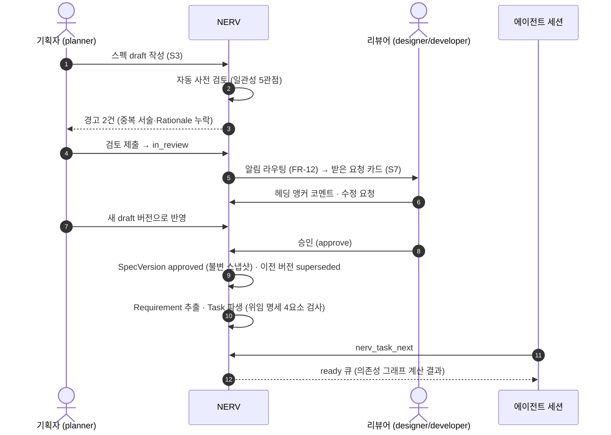
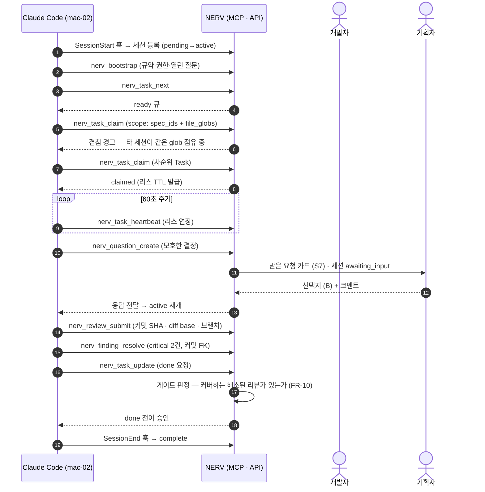
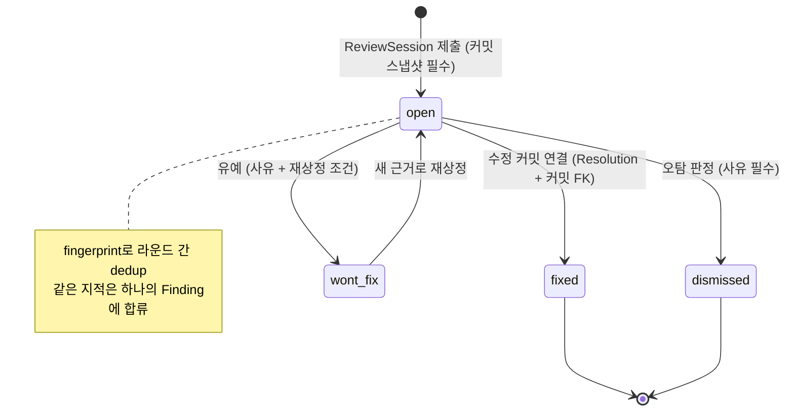

---
references:
  - 01-problem/pain-points.md
  - 02-research/spec-driven-development.md
  - 02-research/agent-orchestration.md
  - 02-research/collab-platforms.md
  - 02-research/integration-tech.md
  - 03-proposal/architecture.md
  - 03-proposal/spec-workflow.md
  - 03-proposal/ui-wireframes.md
  - 03-proposal/roadmap.md
  - 04-mvp/scope.md
  - 04-mvp/plugin.md
  - README.md
  - ../README.md
---
# 비전과 핵심 시나리오

> **요약** — NERV(가칭)는 **스펙이 단일 진실이 되고, 에이전트가 조정되고, 사람이 게이트를 지키는** 협업 플랫폼이다. 파일 기반 SDD 도구들은 문서 어휘(requirements/design/tasks·constitution·델타)를 표준화하는 데 성공했지만 멀티유저 조정은 공식적으로 포기했고(Spec Kit #497·#2116, OpenSpec #435 "closed as not planned"), clemvion은 그 상한을 7,600줄 훅과 `review/` 13,777개 md·131MB로 실증했다. 이 문서는 3대 가치와 4개 직군(기획·디자인·개발·QA)의 하루 시나리오, 핵심 여정 3개를 통해 NERV가 화면(S1~S8)과 MCP 도구(`nerv_*`)로 어떻게 작동하는지 보여준다. Build vs Buy 비교는 Linear·Jira·Notion·GitHub Projects·spec-workflow-mcp·Kiro/Spec Kit 어느 것도 **스펙 도메인 모델과 에이전트 조정을 동시에** 제공하지 못한다는 것을 셀별 근거와 함께 정리하고, 스펙·조정·리뷰는 자체 구축하고 git forge·Slack·기존 PM은 연동한다는 결론을 낸다. 성공 지표는 체감이 아니라 이벤트 로그에서 계산되는 계측치(중복 클레임 0건, 무리뷰 머지 0%, git 리뷰 증가 0, 승인 리드타임 p50)로 정의한다.
>
> 문서 버전 v0.3 · 2026-09-02 · HTML 파생본: [vision.html](../html/vision.html)
>
> v0.3 변경(2026-09-05 — 용어 사전 반영, 사람 지시): [용어 사전](../glossary.md)의 채택어로 이 문서의 낱말을 옮긴다 — 기준선(← 베이스라인) · 워크플로우(← 워크플로) · 권한/소속/작업 범위(← 스코프) · 버전(← 판) · 고정 ID(← 안정 ID·키). **뜻은 바뀌지 않는다** — 코드·API 식별자는 그대로다.
>
> v0.2 변경(2026-09-02 — 정본 정합): 리스 인계 표기를 정본에 맞춘다(2026-09-02 · [3.5](spec-workflow.md) §1.2 · [4.4](../04-mvp/api.md) §1.4h): 2026-08-30 에 보유자를 `(user, session)` 으로 좁히고 인계를 `takeover` 로 명시화했는데, 그 개정이 이 문서까지 오지 않아 여전히 "같은 사용자면 자동 인계" 라고 적고 있었다. **L3 시나리오 D 가 그 문장대로 쓰여 있었고 그래서 실패했다** — 에이전트 규약(3.4)은 아예 "이 에러는 오지 않는다" 고 적어, 그 말을 믿은 에이전트는 웹이 열어 둔 초안 앞에서 멈춘다.

---

## 1. 한 줄 정의와 포지셔닝

### 1.1 한 줄 정의

> **NERV는 스펙이 단일 진실이 되고, 에이전트가 조정되고, 사람이 게이트를 지키는 협업 플랫폼이다.**

세 개의 절이 각각 하나의 문제군에 대응한다. "스펙이 단일 진실"은 P1·P3(스펙 충돌·버전 관리 부재)에, "에이전트가 조정된다"는 P2·P4·P8(중복 작업·상태 추적·n:n 부재)에, "사람이 게이트를 지킨다"는 P5·P7(출처 추적·비개발 직군 참여)에 대응한다. 문제 번호의 정의와 실측 근거는 [1.2 문제 정의와 요구사항](../01-problem/pain-points.md)에 있다.

### 1.2 3대 가치

| 가치 | 한 문장 | 이것이 없으면 | 관련 결정·요구사항 |
| --- | --- | --- | --- |
| **① 단일 진실** | 스펙·요구사항·상태·리뷰가 파일이 아니라 질의 가능한 레코드로 한 곳에 있다 | 문서 네 개가 각자 필드를 열거하고, "구현됐나"는 사람이 문서를 읽어야 안다 | D-01·D-02·D-03 / FR-01~FR-04, FR-13 |
| **② 조정** | 누가·어느 호스트의 어떤 세션이 무엇을 잡았는지 서버가 알고, 선점은 원자적 연산이다 | 같은 스펙을 두 세션이 동시에 고치고, 충돌은 머지 시점에야 발견된다 | D-04·D-13 / FR-05~FR-08 |
| **③ 거버넌스** | 승인·리뷰·면제가 전부 기록되고, 게이트 판정은 정규식이 아니라 서버 질의다 | 리뷰 산출물이 git을 삼키고, 게이트는 조용히 꺼진다 | D-06·D-07·D-14 / FR-09~FR-12, FR-16 |

> **D-01 — 스펙·리뷰 산출물은 git이 아니라 플랫폼 DB에 저장한다.** 코드는 지금처럼 git에 남는다. 근거는 리뷰 이력 blob이 `.git` packed blob 바이트의 **60%(60.7MB)** 를 차지하고, 전체 커밋 2,464개 중 **937개(38%)** 가 `review/`를 건드린다는 실측이다. git에는 read-only 미러와 포인터(ID/URL)만 남긴다.

> **근거 · clemvion 실측(2026-08-13)** — `clemvion:review/`에 md **13,777개·131MB**(code 9,070 + consistency 4,697 + spec-coverage 10)가 전부 git 추적 상태로 누적됐고, **73일간 리뷰 세션 1,891개**(일평균 26개), 현 추세 월 ~7,000파일/~50MB 증가. 한 changeset이 8라운드 리뷰를 도는 동안 마지막 라운드의 리뷰 프롬프트 94파일 중 **86개가 이전 `review/**` 산출물**이었다 — 리뷰가 리뷰를 먹는 자기증식 루프.

### 1.3 포지셔닝 — "SDD 도구들의 Linear/GitHub"

2025년 하반기에 SDD 도구가 동시에 쏟아졌다. Kiro(2025-07 프리뷰), OpenSpec(2025-08), GitHub Spec Kit(2025-08~09), Tessl(2025-09). 1년 뒤 규모는 Spec Kit 126,932 stars, OpenSpec 64,751 stars(npm 주간 367,356 다운로드), BMAD 51,854 stars, Tessl $125M 펀딩이다(수치는 2026-08-13 API 확인). 이들이 만든 것은 **문서 어휘**다: requirements(EARS)/design/tasks 3분할, constitution, ADDED/MODIFIED/REMOVED 델타, 자기완결 스토리 파일.

그런데 그 어휘 위에 있어야 할 **협업·상태·출처 계층이 통째로 비어 있다**. 이건 추정이 아니라 1차 출처의 기록이다.

- [What's the best way to use spec-kit in a team? (Discussion #497)](https://github.com/github/spec-kit/discussions/497) — (2026-08-13 확인) 공통 베이스에서 분기하면 스펙 폴더 순차 번호가 "자연히 충돌"하고, 두 스펙 계약이 동시에 유효한지 검증할 방법도 "마스터 계약"도 없다는 사용자 보고. 공식 해법 없음.
- [What best practices exist for concurrent SpecKit development? (Discussion #2116)](https://github.com/github/spec-kit/discussions/2116) — (2026-08-13 확인) 두 사람이 동시에 다음 스펙을 만들면 둘 다 `0004`를 잡는다. `--branch-numbering timestamp` 옵션이 추가됐지만 충돌 완화일 뿐 조정(coordination)이 아니다.
- [OpenSpec 공식 팀 워크플로우 문서](https://github.com/Fission-AI/OpenSpec/blob/main/docs/team-workflow.md) — (2026-08-13 확인) "One change, one owner" 규율과 일반 git 병합이 충돌 방지책의 전부임을 공식 문서가 자인한다.
- [OpenSpec Issue #435: Collaboration & Orchestration](https://github.com/Fission-AI/OpenSpec/issues/435) — (2026-08-13 확인) 멀티유저 워크스페이스·RBAC·인라인 코멘트 요청이 **"closed as not planned"** 로 종료. 시장이 요구했고 도구가 구조적으로 거부한 기능 목록이 곧 NERV의 기능 명세다.

그래서 NERV의 자리는 "또 하나의 SDD 도구"가 아니라 **SDD 도구들이 만든 어휘 위의 협업 플랫폼**이다. Linear가 이슈 어휘 위에, GitHub가 git 어휘 위에 협업·상태·출처 계층을 얹은 것과 같은 관계다. 기존 도구와는 경쟁이 아니라 **임포트·연동** 관계로 설정한다(§4.4).

```text
                       ┌──────────────────────────────────────────────┐
    NERV (제안)         │ 조정 · 상태 · 출처 · 승인 · 알림 · 멀티테넌시   │  ← 비어 있던 계층
                       ├──────────────────────────────────────────────┤
    SDD 도구 계층       │ requirements(EARS)/design/tasks · constitution │
    (Kiro·Spec Kit·    │ · ADDED/MODIFIED/REMOVED 델타 · 스토리 파일     │  ← 이미 표준화됨
     OpenSpec·BMAD)    ├──────────────────────────────────────────────┤
    실행 계층           │ Claude Code · Codex (MCP · 훅 · 스킬)          │  ← 벤더가 제공
                       ├──────────────────────────────────────────────┤
    저장 계층           │ git forge (코드 · PR · CI)                     │  ← 그대로 사용
                       └──────────────────────────────────────────────┘
```

### 1.4 무엇을 파는 제품인가 — 가속기가 아니라 검증·조정 파이프라인

병렬 에이전트 운용의 제1 실패 모드는 코드 생산량이 아니라 **리뷰 병목**이다. 이건 필드 계측으로 확인된다.

- [What METR's Study Missed About AI Productivity in the Wild — Faros AI](https://www.faros.ai/blog/lab-vs-reality-ai-productivity-study-findings) — (2026-03 데이터) 22,000명 개발자·4,000팀 계측에서 PR 크기 +51%, 중앙값 리뷰 시간 **+441%**, **무리뷰(0 review) 머지 31%**(정책이 아니라 리뷰어가 못 따라가서), 개발자당 버그 +54%, PR당 인시던트 3배. 저자는 이를 "Acceleration Whiplash"로 명명한다.
- [The Human Review Bottleneck — Codex Knowledge Base](https://codex.danielvaughan.com/2026/05/24/human-review-bottleneck-code-review-strategies-agent-output/) — (2026-05-24) PR 생성량 +98%에 리뷰 시간 +91%, AI 생성 PR은 리뷰어 배정까지 4.6배 대기, 리뷰 노력의 69%가 상위 위험 20% PR에 집중. **스펙 검증을 코드 생성 전으로 옮기는 상류 시프트(shift upstream)** 를 명시 권고하고, 생성·검토 에이전트가 같은 훈련 분포면 상관된 실패가 나므로 AI 재검토만으로는 약한 보증이라고 경고한다.
- [The Complete Guide to Running Parallel AI Coding Agents — Superset](https://superset.sh/blog/parallel-coding-agents-guide) — (2026) 실전 상한은 **동시 3~5 에이전트** — 그 이상은 리뷰 용량 초과로 품질이 "아무도 모르게" 하락한다.
- [Our plan for running 100 Parallel Coding Agents — Superset](https://superset.sh/blog/roadmap-to-100-agents) — (2026) 대규모 병렬의 전제는 사람 주의력 추가가 아니라 **자동 품질 게이트 + 구조화된 디스패치 + 완료 리뷰 워크플로우**. 이 3요소가 정확히 NERV의 게이트(FR-10)·ready 큐(FR-05)·리뷰 수집(FR-09)이다.

따라서 NERV의 판매 명제는 "코드를 더 빨리 만든다"가 아니라 **"더 만들어진 코드를 조직이 감당할 수 있게 한다"** 이다. 이 문서의 성공 지표(§5.2)가 생산량이 아니라 리드타임·무리뷰 비율·재작업으로 구성되는 이유이기도 하다.

---

## 2. 페르소나 4종과 하루 시나리오

### 2.1 읽는 법 — 태그 규약

시나리오의 각 단계에는 **어느 화면**과 **어느 MCP 도구**가 개입하는지를 태그로 붙였다. 화면 정의는 [3.6 화면 설계](../03-proposal/ui-wireframes.md)에서 와이어프레임으로 확장되고, MCP 도구 명세는 [3.4 에이전트 연동 설계](../03-proposal/agent-integration.md)의 도구 카탈로그에서 확정된다.

- **[S1]~[S8]** = 사람이 보는 화면. S1 홈 대시보드 / S2 프로젝트 개요 / S3 스펙 상세 / S4 작업 보드 / S5 세션 모니터 / S6 리뷰 센터 / S7 받은 요청 / S8 설정·멤버
- **[`nerv_*`]** = 에이전트가 호출하는 MCP 도구. 사람은 이 호출을 직접 하지 않지만, 그 결과는 항상 화면과 이벤트로 드러난다.

### 2.2 페르소나 요약

| 페르소나 | 역할(Role) | 지금(clemvion) 겪는 것 | NERV에서의 주 무대 | 관련 문제 |
| --- | --- | --- | --- | --- |
| **지민** · 프로덕트 기획자 | `planner` | 스펙은 저장소 안 md, 승인은 git 커밋. 에이전트 질문은 남의 터미널에 뜨고 사라진다 | S3 스펙 상세, S7 받은 요청, S2 프로젝트 개요 | P3·P7 |
| **서연** · 프로덕트 디자이너 | `designer` | 참여 경로 자체가 없음. 디자인 결정은 개발자 구두 전달 뒤 스펙에 흡수 | S3 스펙 상세(design 타입), S7 받은 요청 | P7 |
| **도현** · 개발자 | `developer` | worktree 격리는 최상급이나 조정은 공백. "다른 머신·세션이면 로컬에 안 보여" | S4 작업 보드, S5 세션 모니터, 터미널(Claude Code) | P1·P2·P4 |
| **하나** · QA 엔지니어 | `qa` | 리뷰 결론이 13,777개 md 안에 있고 검토 커밋 SHA조차 필드로 없다 | S6 리뷰 센터, S2 커버리지, S4 작업 보드 | P4·P5 |

> **근거 · clemvion 실측** — `clemvion:plan/in-progress/`의 `owner` 값은 신원이 아니라 자유 텍스트 역할 라벨로 요동한다(developer 17 / project-planner 8 / planner 5 / "developer (다음 진입자)" 1). 계정·hostname 개념이 없어 모든 confirm과 에스컬레이션이 단일 사용자 터미널로 수렴한다 — 비개발 직군이 들어올 문이 없다(P7).

### 2.3 기획자 지민의 하루

**09:10 · [S1 홈 대시보드]** 로그인하면 상단에 숫자 배지 세 개가 보인다. 승인 대기 2건, 답변 대기 질문 1건, 내 프로젝트 카드에 "활성 세션 3". 어젯밤 도현의 에이전트가 남긴 질문이 아직 열려 있다는 게 한눈에 들어온다.

**09:25 · [S3 스펙 상세]** 새 기능 "웹챗 위젯 임베드 v2"를 쓴다. 좌측 트리에서 `7-channel-web-chat` 영역을 고르고 `feature` 타입으로 새 스펙을 만든다. 본문은 markdown 에디터(D-09)이고, 우측 패널에서 요구사항을 EARS 템플릿으로 3개 등록한다 — `WHEN 방문자가 위젯을 처음 열면 THE SYSTEM SHALL 이전 대화를 복원한다` 식이다. 각 요구사항은 서버가 발급한 고정 ID(`REQ-CWC-031`)를 받는다(FR-03).

**09:50 · [S3 스펙 상세]** "검토 요청" 버튼. 제출 즉시 자동 사전 검토가 돈다 — clemvion의 consistency-check 5관점(cross-spec/rationale/convention/plan/naming)을 플랫폼 서비스로 옮긴 것이다. 경고 2건: "3-workflow-editor/2-nodes.md의 세션 복원 정의와 문구가 다름", "Rationale 섹션 없음". 지민은 첫 번째를 참조 링크로 바꾸고(중복 서술이 drift의 근원 — D-09) 두 번째를 채운 뒤 다시 제출한다. 문서 상태가 `draft → in_review`로 전이한다(D-02).

**10:05 · [S7 받은 요청]** 어제 열린 질문을 처리한다. 카드에는 요약과 선택지가 있다: *"임베드 위젯의 세션 복원을 localStorage로 할지 서버 세션으로 할지 — 스펙에 명시 없음. (A) localStorage (B) 서버 세션 (C) 스펙에 남길 질문"*. 지민은 (B)를 고르고 한 줄 코멘트를 단다. 처리 즉시 카드에 "요청 세션 `mac-02/claude-code`에 전달됨"이 뜬다 — 도현의 세션이 `awaiting_input`에서 풀렸다는 뜻이다(FR-11). **[`nerv_question_create`]** 로 만들어진 질문이 사람의 한 번의 클릭으로 닫힌다.

**11:20 · [터미널 · Claude Code]** 서연의 코멘트를 반영하려고 S3 웹 에디터에 새 draft 버전을 열어 둔 참이지만, 코멘트를 EARS 문장으로 옮기는 일은 에이전트가 빠르다. 지민은 터미널에서 `/nerv:spec edit SPC-CWC-007`로 초안을 이어쓴다. 에이전트가 **[`nerv_spec_get`]** 을 `include=comments`로 호출해 open 코멘트를 읽고, 빈 상태·오프라인 두 케이스를 EARS 요구사항 수정안으로 만든다 — `WHEN 복원할 이전 대화가 없으면 THE SYSTEM SHALL 빈 상태 안내를 보여준다` 식이다. 지민이 문구를 다듬어 승낙하면 **[`nerv_spec_draft_upsert`]** 가 웹 에디터의 리스를 알리며 멈춰 서고, 지민이 이어받겠다고 하자 같은 호출에 `takeover` 를 실어 저장한다(D-04의 문서 축 확장). 열어 둔 웹 탭에는 인계 알림이 뜬다 — 리스 보유자는 `(사용자, 세션)` 이라 지민의 웹 탭과 터미널 세션은 다른 자리다. 이어서 **[`nerv_spec_check`]** 로 09:50에 제출하며 강제로 돌던 그 사전 검토를 제출 전에 셀프서비스로 미리 돌려 경고 0을 확인하고, 반영된 코멘트는 **[`nerv_spec_comment_resolve`]** 로 닫는다. 응답의 `web_url`(S3 딥링크)을 열면 방금 저장한 draft가 웹에 그대로 보이고, 이 스펙 작성 세션도 S5 세션 보드에 구현 세션들과 나란히 뜬다(FR-07·FR-08). 기획자의 도구가 화면이냐 터미널이냐는 경계가 아니다 — 경계는 계정·역할·리스이고(D-08·D-04), 어느 표면이든 같은 draft·같은 게이트를 지난다.

**14:30 · [S3 스펙 상세]** 오후에 도현의 코멘트가 헤딩 앵커에 하나 더 달렸다 — "복원 실패 시 폴백 필요". 서연의 빈 상태 코멘트는 11:20에 터미널에서 이미 반영·해소됐으므로, 지민은 웹 에디터에서 같은 draft 버전에 폴백 요구사항만 마저 반영하고 재제출한다. 두 사람이 승인한다. **[S3 스펙 상세]** 상태가 `approved`로 전이하며 본문이 불변 스냅샷으로 고정되고 이전 버전은 `superseded`가 된다(FR-02).

**14:45 · [S4 작업 보드]** 승인된 SpecVersion에서 Task를 파생한다. 각 Task에는 위임 명세 4요소(목표/산출물 형식/도구·출처/경계)를 채워야 하고, 하나라도 비면 `ready`로 전이하지 않는다(FR-05). 지민이 채운 "경계" 항목은 이렇게 적힌다: *"프론트엔드 위젯 코드만. 서버 세션 API는 별도 Task."*

**17:00 · [S2 프로젝트 개요]** 커버리지 게이지를 본다. `7-channel-web-chat` 영역 요구사항 41개 중 implemented 28 · verified 19. 이 숫자는 누가 문서에 ✅를 찍어서 나온 게 아니라 Requirement↔Task↔PR↔Review 관계에서 계산된 값이다(D-03·FR-13).

> **지금과 무엇이 다른가** — clemvion에서 스펙 승인은 문서 리뷰 상태 없이 LLM consistency-check 통과 후 planner가 직접 커밋하는 방식이고, 구현 상태는 문서 단위 `status` 값 하나다. 그래서 1,750줄짜리 `clemvion:spec/5-system/4-execution-engine.md`가 `implemented`여도 그 안의 요구사항 하나(CCH-SE-02)가 통째로 미구현인 채 최근까지 발견되지 않았다. D-02(2축 분리)와 FR-03(요구사항 단위 추적)이 이 사각을 닫는다.

### 2.4 디자이너 서연의 하루

**09:40 · [S1 홈 대시보드]** 알림에 "지민이 검토 요청: 웹챗 위젯 임베드 v2 — 리뷰어로 지정됨". 서연은 저장소를 clone한 적이 없고 터미널을 열 필요도 없다(P7 해소).

**10:00 · [S3 스펙 상세]** 본문을 읽으며 "위젯 최초 진입" 헤딩에 앵커 코멘트를 단다: *"빈 상태(empty state)와 오프라인 상태 정의가 없습니다. 두 케이스 모두 화면이 필요합니다."* 코멘트는 스레드가 되고 지민이 답하면 알림으로 돌아온다.

**11:20 · [S3 스펙 상세]** 자기 몫을 쓴다. `design` 타입 스펙 "웹챗 위젯 v2 — 상태별 화면"을 만들고, 상위 feature 스펙과 관계를 건다. 본문에는 각 상태의 정의와 토큰 이름을 적고, 상세 시안은 외부 디자인 도구 링크로 건다. 스펙은 markdown이지만 **디자인 결정이 처음으로 스펙 그래프 안의 노드가 된다** — 지금까지 이 정보는 구두 전달 뒤 개발자가 요약해 스펙에 흡수하는 형태였다.

**14:00 · [S7 받은 요청]** 도현의 에이전트가 만든 CR 제안이 도착했다. 구현 중에 발견된 스펙 개선 제안이다(SPEC-DRIFT 역류 경로 — clemvion에서 검증된 패턴을 플랫폼 워크플로우로 승격). 델타 뷰가 **ADDED 2 / MODIFIED 1 / REMOVED 0** 으로 표시되고, 서연은 변경분만 읽는다. MODIFIED 한 건이 디자인 토큰 이름을 바꾸는 내용이라 "이 이름은 디자인 시스템과 어긋난다"고 코멘트하고 거절한다(FR-04·FR-11).

**16:30 · [S5 세션 모니터]** 구현이 어디까지 갔나 궁금해서 세션 보드를 연다. `mac-02 / claude-code / 도현`의 세션이 `active`, 현재 Task "위젯 상태별 렌더링", diff `+218 −34`. 세션 상세의 Activity 타임라인에서 에이전트가 어떤 스펙을 읽고 무엇을 고쳤는지 시간순으로 보인다(FR-08). 서연은 아무것도 클릭하지 않고 닫는다 — 물어보지 않아도 알 수 있다는 것이 이 화면의 값이다.

> **차용한 패턴** — 디자이너가 "델타만 읽는" 경험은 OpenSpec의 ADDED/MODIFIED/REMOVED 델타 모델을 서버로 승격한 것이고(§4.2), 검토 피로를 줄이는 이 UX는 "버그 하나에 16개 acceptance criteria" 비판에 대한 직접적인 답이다(D-06).

### 2.5 개발자 도현의 하루

**09:05 · 터미널** Claude Code를 연다. NERV 플러그인이 SessionStart 훅으로 세션을 등록한다 — 사용자·hostname(`mac-02`)·에이전트 종류(`claude-code`)·브랜치가 서버에 뜬다. 상태는 `pending → active`(D-13). **[`nerv_session_event`]** **[`nerv_bootstrap`]** — bootstrap 응답에는 프로젝트 규약, 내 역할 권한, 현재 열린 질문 수가 담긴다.

**09:07 · [`nerv_task_next`]** "다음 할 일"을 묻는다. 서버가 의존성 그래프로 계산한 ready 큐가 우선순위 순으로 온다. clemvion에서 이 질문의 답은 로드맵 표 + spec status + in-progress 풀(34건 중 13건 미착수) + 감사 스크립트 2종을 사람이 눈으로 훑어 고르는 것이었다.

**09:08 · [`nerv_task_claim`] [S4 작업 보드]** 1순위 Task를 클레임한다. 클레임 요청에는 scope를 선언한다 — `spec_ids: [SPC-CWC-007]`, `file_globs: ["codebase/frontend/src/widget/**"]`. 서버가 **겹침을 감지**한다: *"세션 `linux-ci-01/codex/유나`가 같은 glob을 30분째 점유 중(리스 잔여 8분)"*. 도현은 2순위 Task로 넘어간다. 이 한 번의 응답이 P1·P2를 동시에 막는다 — clemvion이 "다른 머신·세션이면 로컬에 안 보여 신뢰할 수 없다"는 이유로 **의도적으로 제거한** 검출이 서버에서는 자명해진다.

**09:12 · [`nerv_spec_get`] [`nerv_spec_tree`]** 에이전트가 승인된 SpecVersion 본문과 연결 Requirement를 읽는다. 파일 경로가 아니라 고정 ID로 읽으므로 문서를 옮기거나 이름을 바꿔도 참조가 깨지지 않는다(FR-01).

**09:15~11:40 · 구현** TDD로 구현이 돌아간다. 60초마다 **[`nerv_task_heartbeat`]**. S4 작업 보드의 카드에는 리스 잔여 시간이 줄어드는 게 보이고, S5 세션 모니터에는 diff 통계가 갱신된다(NFR-02, 5초 이내).

**10:30 · [`nerv_question_create`] [S7 받은 요청]** 세션 복원 방식이 스펙에 없다는 걸 발견한다. 에이전트는 추측하지 않고 선택지 3개를 붙여 질문을 만든다. 세션 상태가 `active → awaiting_input`으로 전이하고, 지민의 받은 요청에 카드가 뜬다. 20분 뒤 답이 오면 세션이 자동으로 재개된다. *"명확하면 자동, 모호하면 질문"* — 이 규약은 에이전트 스킬에 명시되고, 질문·응답은 감사 로그에 남는다(FR-16).

**13:00 · [S5 세션 모니터]** 점심 사이에 유나의 세션이 노트북 절전으로 끊겼다. 하트비트가 30분간 없어 `stale`로 자동 전이했고, 잡고 있던 Task는 `claimed → ready`로 자동 회수됐다(D-13·FR-06). 아무도 이걸 정리하지 않았다 — clemvion에서는 죽은 worktree가 GC reaper의 6시간 주기 배치를 기다렸고, 그 reaper조차 "다른 세션이 앵커로 쓰는 worktree를 죽일 수 있다"는 한계를 스스로 적어 두었다.

**15:20 · [`nerv_review_submit`] [S6 리뷰 센터]** 리뷰를 돌린다. ReviewSession이 **입력 스냅샷(커밋 SHA·diff base·브랜치)** 과 함께 서버에 제출된다. 산출물은 파일이 아니라 레코드다 — 세션 디렉토리 하나에 md가 평균 10.7개(66KB) 쌓이는 대신, Finding 6건이 fingerprint와 함께 등록된다(D-07·FR-09). 다음 리뷰의 diff에 이전 리뷰가 섞이는 자기증식 루프가 여기서 끊긴다.

**16:10 · [`nerv_finding_resolve`]** critical 2건을 수정하고 커밋 FK와 함께 해소 처리, warning 1건은 사유를 달아 `wont_fix`. 라운드가 바뀌어도 같은 지적은 fingerprint로 하나의 Finding에 합쳐지므로 "유예 항목을 세션마다 재서술"하는 낭비가 사라진다.

**16:40 · [`nerv_task_update`] [S4 작업 보드]** Task를 `done`으로 올린다. 서버가 게이트를 판정한다 — *"이 커밋 범위를 커버하는 해소된 리뷰가 있는가"*(FR-10). 통과. clemvion에서 이 판정은 1,005줄짜리 push 훅(`clemvion:.claude/hooks/guard_review_before_push.py`)이 정규식으로 `git push`를 감지하고 경로 타임스탬프를 rewrite-immune 시계로 파싱해 내리던 것이었다. 서버에서는 세션↔커밋 FK 하나로 SQL 질의가 된다.

**17:30 · 세션 종료** SessionEnd 훅이 세션을 `complete`로 닫는다. 보드에서 카드가 내려가고, 오늘의 Activity·질문·리뷰·게이트 판정이 전부 이벤트로 남는다.

```text
S5 세션 모니터 (미션 컨트롤) — 도현이 13:00에 본 화면
┌────────────────────────────────────────────────────────────────────────────┐
│ 활성 세션 4 · 대기 1 · stale 1                        [필터: 전체 ▾] [새로고침]│
├──────┬──────────┬────────────┬──────────┬────────────┬─────────┬──────────┤
│ 상태 │ 사용자    │ hostname   │ 에이전트  │ 현재 Task   │ 하트비트 │ diff      │
├──────┼──────────┼────────────┼──────────┼────────────┼─────────┼──────────┤
│ ●    │ 도현     │ mac-02     │ claude   │ 위젯 렌더링 │ 0:12 전  │ +218 −34 │
│ ◐    │ 지민     │ web        │ —        │ 스펙 검토   │ —       │ —        │
│ ●    │ 하나     │ mac-07     │ claude   │ E2E 시나리오│ 0:41 전  │ +64 −5   │
│ ○    │ 유나     │ linux-ci-01│ codex    │ (회수됨)    │ 31:20 전 │ +12 −0   │  ← stale
└──────┴──────────┴────────────┴──────────┴────────────┴─────────┴──────────┘
  ● active   ◐ awaiting_input   ○ stale        [로그 보기] [질문 응답] [stop]
```

### 2.6 QA 하나의 하루

**09:30 · [S6 리뷰 센터]** finding 큐를 severity로 필터한다. 지난 24시간 critical 3 · warning 17 · info 42. 각 Finding은 코드 위치·검토 커밋·**유래한 스펙/Requirement**·해결 이력을 갖는다. 하나가 여기서 하는 일은 AI 리뷰 결과를 다시 읽는 게 아니라 **위험 판단**이다 — 어떤 finding이 인증·결제·마이그레이션에 닿는지 골라 올린다.

**10:15 · [S6 리뷰 센터]** `spec_drift` 태그가 붙은 finding 하나를 연다. 구현이 스펙보다 낫다고 판단된 케이스다. 코드를 되돌리는 대신 CR 제안 경로로 라우팅한다(clemvion의 SPEC-DRIFT 규약을 그대로 이식 — D-07).

**11:00 · [S2 프로젝트 개요 → 커버리지 드릴다운]** 커버리지 게이지에서 `verified`가 낮은 영역을 클릭한다. Requirement 목록이 나오고, 각각에 연결된 Task·PR·ReviewSession이 보인다. `REQ-CWC-018`은 implemented지만 연결된 테스트 증적이 없다. 하나는 여기서 검증 Task를 만든다(FR-13).

**14:00 · [S4 작업 보드]** 검증을 마친 요구사항을 `implemented → verified`로 올린다. 이 전이는 qa(및 admin) 역할만 가능하다(FR-14). 커버리지 숫자가 즉시 바뀐다.

**15:30 · [S6 리뷰 센터 — 게이트 현황]** 브랜치별 게이트 커버 여부를 본다. `feature/widget-v2`는 커버됨, `hotfix/session-restore`는 **BYPASS 기록 1건** — 어제 밤 배포에서 게이트를 면제한 사람과 사유가 남아 있다. 하나는 그 커밋 범위에 사후 리뷰를 예약한다. 면제가 조용히 일어나지 않는다는 것 자체가 기능이다(D-14·FR-10).

**16:20 · [S8 설정·멤버 → 게이트 정책]** 이번 분기 정책을 조정한다. 저위험 변경(오탈자·주석)은 자동 통과, 인증·결제 경로에 닿는 변경은 사람 승인 필수. 위험 분류를 게이트 티어에 직결하는 이 설계는 필드 리포트의 P0~P3 위험 분류 권고를 정책 UI로 옮긴 것이다.

> **AI 리뷰만으로는 부족하다** — 생성 에이전트와 검토 에이전트가 같은 훈련 분포를 공유하면 실패가 상관된다. NERV는 AI 리뷰(FR-09)를 1차 필터로, 사람 승인(FR-11)을 위험 판단으로 계층 분리한다. 하나의 하루가 "AI가 찾은 걸 다시 읽는 하루"가 아니라 "무엇이 위험한지 고르는 하루"인 이유다.

### 2.7 네 시나리오가 공통으로 통과하는 지점

| 개입 지점 | 등장 인물 | 화면 | 요구사항 |
| --- | --- | --- | --- |
| 스펙/CR 승인 | 지민·서연 | S3, S7 | FR-02·FR-04·FR-11 |
| 플랜 승인(대형 작업 착수 전) | 지민 | S7 | FR-05·FR-11 |
| 에이전트 질문(`awaiting_input`) | 도현의 세션 → 지민 | S7 | FR-11·FR-12 |
| PR 머지·CI 실행 | 도현·하나 | git forge(연동) | FR-10·D-06 |
| 게이트 면제(BYPASS) | 하나 | S6, S8 | FR-10·FR-16·D-14 |

이 4+1 게이트가 D-06의 표준 게이트다. clemvion에는 이 지점들이 이미 전부 존재하지만(merge confirm 2회·conflict patch 승인·e2e 면제·BLOCK 해소·stale grooming) 전부 한 사람의 터미널 대화로 수렴한다. NERV는 같은 지점을 **수신함 항목**으로 바꿀 뿐이다.

---

## 3. 핵심 여정 3개

### 3.1 여정 A — 스펙 제안 → 검토 → 승인 → 작업 파생



핵심은 **승인이 결재 레코드가 된다**는 점이다. 지금은 승인의 흔적이 git 커밋과 PR 대화에 묻혀 있어 "누가 언제 무슨 근거로 이 스펙을 확정했는가"를 재구성하려면 git 고고학이 필요하다. 그리고 `approved` 이후의 본문은 불변이므로, 이후 변경은 반드시 CR을 거친다(FR-04).

### 3.2 여정 B — 에이전트 구현 세션의 전 과정



> **D-04 — 동시성 제어는 원자적 클레임+리스(lease).** ready 판정(의존성 그래프) → `nerv_task_claim`(assignee+상태 원자 전환) → TTL 리스+하트비트 → 만료 시 자동 회수. 클레임 시 scope(spec_ids·file_globs)를 선언해 겹침을 경고·차단하고, ID는 서버가 해시 기반으로 발급해 파일 기반 번호 충돌을 원천 제거한다.

> **D-14 — 게이트는 fail-open + 관측 + 격상, 진실은 서버 산출물.** 판정 불가 시 진행은 허용하되 배너와 연속 카운터를 남기고, 임계 초과 시 "게이트가 사실상 꺼짐"으로 격상한다. 에이전트의 자기보고(STATUS)와 실제 산출물 업로드는 분리 검증한다 — clemvion의 "디스크가 arbiter" 원칙의 서버 번역이다.

### 3.3 여정 C — 리뷰 finding → 해결 → 커버리지 갱신



Finding이 해소되면 세 가지가 연쇄로 갱신된다.

1. **게이트 판정**: "이 커밋 범위를 커버하는 해소된 리뷰가 있는가"의 답이 바뀐다 → Task의 `done` 전이가 열린다(FR-10).
2. **증적 그래프**: Requirement↔Task↔PR/커밋↔ReviewSession 관계에 간선이 하나 추가된다(FR-13).
3. **커버리지 수치**: S2의 게이지와 S6의 게이트 현황이 다시 계산된다. **사람이 문서에 ✅를 찍는 단계가 없다**(D-03).

> **근거 · clemvion 실측** — 지금은 리뷰가 검토한 커밋 SHA·diff base·브랜치·PR 번호가 `meta.json`에 **필드 자체가 없어서**, 표본 SUMMARY 200개 중 해시를 언급한 것은 47개뿐이다. 나머지 provenance는 산문과 세션 디렉토리 절대경로의 부산물로만 남는다(P5). 또한 산문 규약의 무결성은 실제로 무너졌다 — forced reviewer 미충족 **160/575 세션(28%)**, checker CRITICAL을 `BLOCK: NO`로 하향한 모순 **24/732(3.3%)**. 이런 불변식은 산문이 아니라 스키마 제약과 알림으로 강제해야 한다.

---

## 4. Build vs Buy

### 4.1 판단 기준 6축

기존 도구로 대체 가능한지를 판단하는 축은 아래 6개다. 각 축은 요구사항 번호에 직접 대응하므로, "이 도구로 안 되는 이유"가 곧 "만들어야 하는 이유"가 된다.

| 축 | 무엇을 묻는가 | 대응 요구사항 |
| --- | --- | --- |
| **A. 스펙 도메인 모델** | 불변 SpecVersion·고정 ID·Requirement 2축 상태·CR 델타가 1급 개념인가 | FR-01~FR-04 |
| **B. 에이전트 조정** | 원자적 클레임·scope 겹침 감지·리스 만료 회수·세션 레지스트리(사용자·hostname)를 제공하는가 | FR-05~FR-08 |
| **C. 리뷰·게이트·출처** | ReviewSession 커밋 스냅샷·Finding dedup·커버리지 게이트 판정 API가 있는가 | FR-09·FR-10·FR-13 |
| **D. 직군 참여·승인** | 비개발 직군이 터미널·저장소 없이 승인/코멘트하는가 | FR-11·FR-12·FR-14 |
| **E. 자가호스팅·라이선스** | docker-compose 자가호스팅이 되는가, 코드 차용에 제약이 없는가 | NFR-01·NFR-03 |
| **F. clemvion 이관** | 384 spec md·450 plan md·리뷰 이력을 흡수할 수 있는가 | FR-17·D-12 |

### 4.2 후보별 비교표 (각 셀에 근거)

| 후보 | A. 스펙 도메인 모델 | B. 에이전트 조정 | C. 리뷰·게이트·출처 | D. 직군 참여·승인 | E. 자가호스팅·라이선스 | NERV의 결론 |
| --- | --- | --- | --- | --- | --- | --- |
| **Linear** (+ Agents) | ✗ 이슈·프로젝트·문서는 있으나 불변 SpecVersion·Requirement 고정 ID·EARS·ADDED/MODIFIED/REMOVED 델타 개념이 없다. 문서 승인 축(D-02)이 이슈 상태로 뭉개진다 | △ 세션 모델은 업계 최고 수준(6상태 + webhook 5초·최초 activity 10초·무활동 30분 stale SLA)이지만 클레임 단위가 **이슈 할당**이라 `spec_ids·file_globs` scope 겹침 감지·리스 만료 회수는 없다 | ✗ 코딩 세션 diff를 Reviews 탭에서 보지만 ReviewSession 커밋 스냅샷·Finding fingerprint·"커밋 범위 커버리지" 판정 API가 없다 | ○ Inbox(Linear 자체 수신함) 알림·코멘트·delegate 표시가 성숙. 27+ 서드파티 에이전트 디렉토리로 생태계도 검증 | ✗ 상용 SaaS, 자가호스팅 불가 → NFR-01 위배 | **모델을 차용, 도구는 선택적 연동.** assignee/delegate 분리와 6상태+SLA를 D-08·D-13으로 이식. 이미 쓰는 조직에는 Task 미러 |
| **Jira + Rovo** | ✗ Confluence 문서에 버전은 있으나 Requirement 단위 추적·구현 2축·증적 그래프가 없다. 커스텀 필드로 흉내 내면 FR-13 커버리지가 다시 수동 집계로 회귀 | △ 워크플로우 엔진은 강력하고 트리거 표면이 4종(assignee·@멘션·상태 전환·보드 컬럼)이지만, 원자적 클레임·하트비트 리스·hostname 세션 레지스트리 개념이 없다 | △ 워크플로우 조건 게이트는 있으나 "이 커밋 범위를 커버하는 해소된 리뷰"라는 판정이 아니다. Jira Coding Agent는 draft PR을 만들고 머지는 사람에게 넘긴다 | ◎ 전 직군이 이미 쓰는 표준. 에이전트 출력을 트리거한 사람만 먼저 보고 draft comment로 팀에 공개하는 단계 공개가 검증됨 | △ 상용, Cloud 중심 | **연동 대상.** 이슈·워크플로우는 Jira에, 스펙 도메인은 NERV에. 단계 공개 패턴은 차용 |
| **Notion** | △ 문서·DB로 흉내는 가능하지만 불변 스냅샷·고정 ID·Requirement 2축은 결국 **사람의 규율**로 남는다. clemvion이 이미 실패한 방식(산문 계약 붕괴 28%) | ✗ 세션·클레임·리스 개념 없음. 커스텀 에이전트 트리거(스케줄·Slack·메일·DB 변경)는 자동화지 조정이 아니다 | ✗ 리뷰 엔티티·게이트 판정 없음 | ◎ 비개발 직군 접근성은 최상 | ✗ 상용 SaaS | **UX와 원칙을 차용.** "모든 run은 로그로 남고 되돌릴 수 있다"(가역성)와 MCP를 Markdown 지향으로 재설계한 교훈을 NERV MCP 설계에 반영 |
| **GitHub Projects** (+ Agent HQ) | ✗ 이슈·프로젝트 필드는 자유 텍스트. Spec Kit이 `taskstoissues`로 이슈에 내보내는 것은 파일→이슈 변환이지 스펙 모델이 아니다 | △ 이슈 assign 기반. mission control은 **Copilot 클라우드 세션**을 보여줄 뿐, 사내 개발자 머신의 Claude Code/Codex 로컬 세션 레지스트리가 아니다(P8의 핵심). 원자적 클레임·scope 겹침 없음 | ○/✗ 코드 리뷰·CI·감사(`actor_is_agent`, `agent_session.task` 이벤트)·"지시자≠승인자"·"Approve and run workflows"는 그대로 쓸 값어치가 있다. 그러나 스펙 커버리지 게이트는 없고, 리뷰 산출물을 다시 git에 넣으면 P6가 재발한다 | △ 기획·디자인 직군에 GitHub 계정과 개발자 UI를 요구한다 | ○ GHES로 자가호스팅 가능, 상용 | **연동 필수 · 대체 안 함(non-goal).** 코드·PR·CI·웹훅·머지 게이트는 전부 git forge에 맡기고, NERV는 스펙↔PR 링크와 커버리지만 소유 |
| **spec-workflow-mcp** | ○/✗ requirements/design/tasks 3분할(Kiro 차용)과 `steering/` 문서까지 갖췄으나 전부 **로컬 파일**이라 버전·질의·고정 ID가 없다 | ✗ 계정·권한·원격 접근 개념 자체가 없는 단일 프로젝트 로컬 도구 | △ 승인 라이프사이클(request→feedback→revision→approve)은 있지만 리뷰 수집·게이트 판정은 없다 | ✗ 로컬 웹 대시보드(포트 5000) — 원격 팀 협업이 아니라 "1인+에이전트 협업" | ✗ **GPL-3.0** — 개념 참조는 가능하나 코드 차용 불가. npm 주간 601 다운로드, 마지막 푸시 2026-07-03 | **개념 증명으로만 인용.** "MCP 연동 + 웹 승인 대시보드"가 이미 소규모로 검증됐다는 증거. NERV는 여기에 계정·RBAC·알림·멀티프로젝트·hostname 신원을 더한 형태 |
| **Kiro · Spec Kit** (파일 기반 SDD) | ○/✗ 문서 어휘는 사실상 표준(EARS 3파일, constitution). 그러나 상태는 md 체크박스이고 크로스 스펙 질의가 불가능하다 | ✗ 순차 번호가 동시 작업에서 충돌(#497·#2116, timestamp 옵션은 완화일 뿐). OpenSpec은 "One change, one owner" 규율과 git 충돌 해결에 위임하고 멀티유저 요청(#435)을 not planned로 종료 | ✗ 진행 추적의 상한이 로컬 대시보드(Kiro 태스크 wave 실행, spec-workflow-mcp 진행 바). 리뷰→스펙→구현 체인을 관리하는 도구는 없다 | ✗ IDE·CLI 로컬 뷰. 승인은 "채팅에서 OK" | ○/✗ Spec Kit MIT(126,932 stars)·OpenSpec MIT(64,751 stars), Kiro는 상용(2025-11 GA, Free~$200/월) | **어휘 공급원이자 임포트 대상.** 경쟁이 아니다. 3분할·constitution·델타를 DB 엔티티로 승격하고(FR-01~05), 서버 발급 ID로 번호 충돌을 원천 제거(D-04) |

범례: ◎ 충분 · ○ 부분 충족 · △ 흉내 가능하나 구조적 공백 · ✗ 없음

### 4.3 표를 한 문장으로 압축하면

**세션·승인 모델을 가진 도구(Linear·GitHub)는 스펙 도메인이 없고, 스펙 도메인을 가진 도구(Kiro·Spec Kit·OpenSpec)는 멀티유저 조정이 없다.** 두 축이 만나는 칸이 비어 있고, 그 칸을 채우는 것이 NERV다. 이 진단은 두 리서치 문서에서 각각 독립적으로 도출된다 — [2.1 Spec-Driven Development](../02-research/spec-driven-development.md)의 "멀티유저 공백" 절과 [2.3 협업 플랫폼의 에이전트 통합](../02-research/collab-platforms.md)의 "에이전트=팀원 패러다임" 절.

### 4.4 결론 — 만드는 것과 연동하는 것

| 자체 구축 (Build) | 근거 |
| --- | --- |
| Spec / SpecVersion / Requirement / SpecRelation + CR 델타 | 어떤 후보도 불변 스냅샷 + 요구사항 2축 상태를 제공하지 않는다 (§4.2 A열 전부 ✗ 또는 △) |
| Task / Claim / Lease + scope 겹침 판정 | 클레임을 원자적 연산으로 제공하는 후보가 없다. clemvion이 "로컬에 안 보여서" 제거한 기능의 복원 |
| AgentSession 레지스트리 + typed Activity | 로컬 CLI 세션(사내 hostname)을 보여주는 후보가 없다 — GitHub mission control도 자사 클라우드 세션만 본다 |
| ReviewSession / Finding / Resolution + 게이트 판정 API | 커밋 스냅샷 기반 커버리지 판정을 제공하는 후보가 없다 (P5·P6의 직접 해법) |
| 받은 요청(Inbox) + 알림 라우팅 | 스펙 승인·CR·플랜·질문·에스컬레이션 다섯 유형을 한 수신함에 모으는 후보가 없다 |
| 증적·커버리지 그래프 | 수동 ✅ 없이 관계에서 계산되는 커버리지를 제공하는 후보가 없다 |

| 연동·구매 (Buy / Integrate) | 근거 |
| --- | --- |
| git forge(GitHub 등) — 코드·PR·CI·머지 게이트 | 대체는 non-goal. "지시자≠승인자"와 "Approve and run workflows"는 이미 검증된 안전 기준선이라 그대로 쓴다 |
| 에이전트 런타임 — Claude Code · Codex | 우리가 만들지 않는다. MCP tools-first + 훅으로 연동한다(D-05). 로컬 오케스트레이터는 단명한다는 실증(Crystal 2026-02 종료, vibe-kanban sunsetting)이 있어 어댑터는 얇게 유지 |
| 알림 채널 — Slack · 메일 | 자체 메시징을 만들지 않는다. 이벤트를 라우팅만 한다(FR-12) |
| 인증 — OAuth 2.1 / SSO | 표준을 구현하고 IdP는 조직 것을 쓴다(NFR-03) |
| 기존 PM — Jira · Linear | 이미 쓰는 조직에는 Task 양방향 미러. 스펙 도메인만 NERV가 소유한다 |

---

## 5. Non-goals와 성공 지표

### 5.1 Non-goals — 이번에 만들지 않는 것

| 안 만드는 것 | 대신 | 근거 |
| --- | --- | --- |
| **코드 호스팅·PR·CI 대체** | GitHub 등 git forge 연동 | 코드는 계속 git에 산다(D-01). PR 승인 규칙은 forge 것이 이미 안전하다 |
| **범용 PM·이슈 트래커 대체** | 스펙 파생 Task만 1급, 나머지는 기존 도구 미러 | 마케팅 캠페인·채용 같은 업무까지 흡수하면 스펙 도메인의 초점을 잃는다 |
| **에이전트 런타임·모델 실행** | Claude Code·Codex를 MCP·훅으로 연동(D-05) | 벤더 표면은 빠르게 변한다. 표준화 대상은 도구가 아니라 패턴(클레임 API·세션 레지스트리·게이트) |
| **실시간 공동 편집(CRDT)** | Phase 3으로 이월. MVP는 md 에디터 + 헤딩 앵커 코멘트(D-09) | 스펙 편집의 병목은 동시 타이핑이 아니라 승인·조정이다 |
| **로컬 하네스 전면 흡수** | 레이턴시 0이 필요한 것(worktree 격리·브랜치 가드·로컬 린트)은 로컬에 남긴다(D-12) | 상태 저장·조정·리뷰 보관·게이트 판정만 서버로 옮긴다 |
| **"스펙만 있으면 품질이 보장된다"는 주장** | AI 리뷰(FR-09) 1차 + 사람 위험 판단(FR-11) 2차 | 생성·검토 에이전트의 훈련 분포가 같으면 실패가 상관된다는 경고가 필드 리포트에 있다 |
| **SaaS 멀티테넌트 상용화** | 자가호스팅 우선(NFR-01), SaaS화는 Phase 3+ | 첫 사용자는 우리 팀이다. 배포 복잡도를 먼저 줄인다 |

### 5.2 성공 지표 — 체감이 아니라 계측

| 지표 | 측정 방법 | 현재 기준선 | 목표 | 관련 |
| --- | --- | --- | --- | --- |
| **중복 클레임** | 같은 Task를 두 세션이 동시에 `in_progress`로 가진 사건 수(이벤트 로그 질의) | 검출 불가 — 동시수정 자동 검출이 "다른 머신·세션이면 로컬에 안 보여" 제거됨 | **0건** (Phase 0 검증 조건: 두 호스트·세 세션 동시 작업) | FR-06 |
| **스펙 충돌 재작업** | scope 겹침 경고 이후 강행 → 머지 충돌·재작업으로 이어진 건수 | 머지 시점까지 미발견(충돌 해소를 `/merge-coordinate`와 사용자 직렬화에 위임) | 분기당 **0건** | FR-01·FR-06 |
| **무리뷰 머지 비율** | 게이트 판정을 통과하지 못한 채 머지된 PR 비율 | 업계 필드 계측 **31%** (리뷰어가 못 따라가서 발생) | **0%** (면제는 BYPASS로 기록되어 별도 집계) | FR-10·D-14 |
| **리뷰 도달 시간** | 리뷰 제출 → 모든 critical finding 해소까지의 p50/p90 | 업계 필드 계측: 중앙값 리뷰 시간 **+441%**, AI 생성 PR 리뷰어 배정 대기 4.6배 | p50 목표를 팀이 설정하고 **추세가 악화되지 않을 것** | FR-09·FR-11 |
| **승인 리드타임** | 질문 생성 → 응답까지(세션 `awaiting_input` 체류 시간) p50/p90 | 측정 불가 — 터미널 대화라 기록이 없다 | 업무시간 기준 p50 **≤ 30분** | FR-11·FR-12 |
| **git 리뷰 증가율** | 신규 리뷰 산출물이 git에 커밋된 파일 수·바이트(월) | 월 ~7,000파일 / ~50MB 증가, 리뷰 이력 blob이 packed blob의 60% | 신규 리뷰 산출물의 git 커밋 **0** | D-01·FR-09 |
| **커버리지 자동 계산율** | 수동 마크 없이 관계에서 계산된 Requirement 비율 | 문서 단위 status + 수동 ✅(영역 간 비일관: 131개 vs 0개) | **100%** | FR-13·D-03 |
| **리뷰 무결성 위반** | 필수 리뷰어 미충족 세션 / verdict 모순 건수 | forced reviewer 미충족 **160/575(28%)**, CRITICAL→`BLOCK: NO` 하향 **24/732(3.3%)** | **0** (산문 규약이 아니라 스키마 제약으로 강제) | FR-09·FR-16 |
| **세션 가시성** | 실행 중 세션 중 보드에 표시된 비율 / 보드 반영 지연 | 타 호스트 세션 **0%** (모든 조율 상태가 gitignored 로컬 파일) | **100%** / **≤ 5초** | FR-07·NFR-02 |
| **stale 자동 회수** | 무활동 30분 초과 세션이 사람 개입 없이 정리된 비율 | reaper 6시간 주기 배치이고, 타 세션 앵커를 파괴할 위험을 스스로 명시 | **100%** | D-13·FR-06 |
| **직군 참여** | 승인·코멘트 행위자 중 `planner`/`designer`/`qa` 역할 비율 | **0%** (참여 경로 부재) | 스펙 승인의 **100%** 가 비개발 직군을 포함한 승인 레코드 보유 | FR-11·FR-14 |

### 5.3 반증 지표 — 실패를 먼저 알아채는 신호

성공 지표만 보면 늦는다. 아래는 "이 제품이 실패하는 중"임을 먼저 알려 주는 신호이고, 전부 대시보드 1급 항목으로 노출한다.

| 신호 | 무엇을 뜻하는가 | 대응 |
| --- | --- | --- |
| **BYPASS 비율 상승** | 게이트가 사실상 꺼지는 중 | clemvion의 fail-open 연속 3회 격상 패턴을 그대로 이식 — 배너 + 격상 알림(D-14) |
| **게이트 판정 불가 연속 카운터** | 서버·연동 장애가 조용히 게이트를 무력화하는 중 | 진행은 허용하되 격상. "조용히 꺼진 게이트가 최악"이라는 운영 교훈 |
| **1인당 일 알림 수 / 무시율 상승** | 알림 피로 → 승인 품질 하락 | 중요도 라우팅 재조정, 상태 변화는 다이제스트로 강등(FR-12) |
| **스펙 문서 길이·AC 개수 중앙값 상승** | 워터폴 회귀 — "기능 하나에 8파일 1,300줄", "버그 하나에 16 AC" 비판이 현실이 되는 중 | 위험도 가변 게이트로 저위험 경로를 넓힌다(D-06) |
| **동시 활성 세션 수 > 리뷰 처리량** | 필드 실증상 실용 한계는 동시 3~5 에이전트 | 조직·프로젝트별 동시 세션 한도를 정책으로 노출(FR-14) |
| **자기보고 vs 산출물 불일치율** | 에이전트 STATUS는 성공인데 서버에 산출물이 없다 | "서버에 업로드된 산출물만 진실"(D-14) — 불일치는 세션 품질 지표로 집계 |

### 5.4 측정 원칙 — 왜 설문을 쓰지 않는가

- [Measuring the Impact of Early-2025 AI on Experienced Open-Source Developer Productivity — METR](https://metr.org/blog/2025-07-10-early-2025-ai-experienced-os-dev-study/) — (2025-07-10) 숙련 오픈소스 개발자 16명·실제 이슈 246개 RCT에서 AI 도구 사용 시 **19% 더 느렸다**. 그런데 사전 예측은 "+24% 빨라질 것", 사후 체감은 "+20% 빨랐다"였다. 인식과 실측의 부호가 반대다.

그래서 NERV의 지표는 전부 **이벤트 로그(FR-16)에서 계산되는 값**이다. 만족도 설문이나 "빨라진 것 같다"는 회고는 채택 여부의 참고 자료일 뿐 성공 판정의 근거가 아니다. 이것은 clemvion이 코드로 이미 관철한 원칙("디스크가 arbiter — 파일 없는 자기보고 success는 가짜")의 조직 버전이기도 하다(D-14).

---

## 참고 자료

### 이 문서가 인용한 외부 출처

**SDD 도구 생태계와 멀티유저 공백** — 상세는 [2.1 Spec-Driven Development](../02-research/spec-driven-development.md)

- [What's the best way to use spec-kit in a team? — Spec Kit Discussion #497](https://github.com/github/spec-kit/discussions/497) — (2026-08-13 확인) 팀 사용 시 스펙 번호 충돌과 마스터 계약 부재가 공식 미해결 과제임을 보여준다.
- [What best practices exist for concurrent SpecKit development? — Discussion #2116](https://github.com/github/spec-kit/discussions/2116) — (2026-08-13 확인) 동시 작업 시 번호 충돌이 필연이며 timestamp 옵션은 완화책일 뿐임을 보여준다.
- [OpenSpec 공식 팀 워크플로우 문서](https://github.com/Fission-AI/OpenSpec/blob/main/docs/team-workflow.md) — (2026-08-13 확인) 충돌 방지책이 "One change, one owner" 규율과 git 병합뿐임을 공식 문서가 자인한다.
- [OpenSpec Issue #435: Collaboration & Orchestration](https://github.com/Fission-AI/OpenSpec/issues/435) — (2026-08-13 확인) 멀티유저 워크스페이스·인라인 코멘트 요청이 "closed as not planned"로 종료됐다.
- [github/spec-kit 리포지터리](https://github.com/github/spec-kit) — (2026-08-13 확인) MIT·126,932 stars, constitution과 specify/plan/tasks 명령 체인 — NERV가 차용하는 문서 어휘의 출처.
- [Kiro Specs 공식 문서](https://kiro.dev/docs/specs/) — (2026-08-13 확인) requirements(EARS)/design/tasks 3파일과 태스크 의존성 wave 병렬 실행 — 진행 추적의 시장 상한선이 로컬 IDE 뷰임을 보여준다.
- [Pimzino/spec-workflow-mcp 리포지터리](https://github.com/Pimzino/spec-workflow-mcp) — (2026-08-13 확인) GPL-3.0, MCP 연동 + 웹 승인 대시보드의 소규모 개념 증명. 코드 차용 금지 근거.
- [EARS 공식 가이드 — Alistair Mavin](https://alistairmavin.com/ears/) — (2026-08-13 확인) FR-03의 요구사항 템플릿 근거.
- [Understanding Spec-Driven-Development: Kiro, spec-kit, and Tessl — martinfowler.com](https://martinfowler.com/articles/exploring-gen-ai/sdd-3-tools.html) — (2025-10-15) 작은 버그가 4 user story·16 acceptance criteria로 부푸는 관찰 — §5.3 반증 지표의 근거.
- [Spec-Driven Development: The Waterfall Strikes Back — Marmelab](https://marmelab.com/blog/2025/11/12/spec-driven-development-waterfall-strikes-back.html) — (2025-11-12) 기능 하나에 8파일·1,300줄 실측 — D-06이 답해야 하는 비판.
- [Spec-Driven Development Isn't Waterfall Unless You're Using It That Way — Yuval Yeret](https://yuvalyeret.com/blog/spec-driven-development-isnt-waterfall-unless-youre-using-it-that-way/) — (2026-05-18) 재생성 비용이 0에 수렴하면 경제학이 바뀐다는 반론 — 위험도 가변 게이트의 논거.
- [Tessl launches spec-driven development tools](https://tessl.io/blog/tessl-launches-spec-driven-framework-and-registry) — (2025-09-23) 스펙 레지스트리 모델과 시장 규모 근거.

**협업 플랫폼의 에이전트 통합(Build vs Buy 근거)** — 상세는 [2.3 협업 플랫폼의 에이전트 통합](../02-research/collab-platforms.md)

- [Developing the Agent Interaction — Linear Developers](https://linear.app/developers/agent-interaction) — (2026-08-13 확인) Agent Session 6상태와 응답성 SLA(webhook 5초·최초 activity 10초·무활동 30분 stale), typed activity 5종 — D-13의 원형.
- [Our approach to building the Agent Interaction SDK — Linear Blog](https://linear.app/now/our-approach-to-building-the-agent-interaction-sdk) — (2025-08-01) "에이전트는 책임을 질 수 없다" 원칙과 assignee/delegate 분리 — D-08의 근거.
- [AI Agents — Linear Docs](https://linear.app/docs/agents-in-linear) — (2026-08-13 확인) 에이전트가 assignee 메뉴에 팀원처럼 노출되고 위임 후에도 사람이 책임을 유지하는 UX.
- [Coding sessions — Linear Docs](https://linear.app/docs/coding-sessions) — (2026-08-13 확인) 이슈 위임 → 샌드박스 세션 → diff·검증 아티팩트 인라인 → 플랫폼 내 리뷰. 스펙 도메인 모델이 없다는 §4.2 A열 판정의 확인 근거.
- [Agents Integrations — Linear](https://linear.app/integrations/agents) — (2026-08-13 확인) 27+ 서드파티 에이전트 디렉토리 — 단일 상호작용 규약 위의 생태계가 성립함을 보여준다.
- [MCP server — Linear Docs](https://linear.app/docs/mcp) — (2026-08-13 확인) 호스티드 MCP + OAuth 2.1 + readonly 변형 — NERV MCP 접속 규격의 참조.
- [Reviewing a pull request created by GitHub Copilot — GitHub Docs](https://docs.github.com/enterprise-cloud@latest/copilot/how-tos/agents/copilot-coding-agent/reviewing-a-pull-request-created-by-copilot) — (2026-08-13 확인) 지시자의 승인은 무효이고 CI 실행에 "Approve and run workflows" 명시 승인이 필요하다 — D-06 게이트 ④의 기준선.
- [Tracking GitHub Copilot's sessions — GitHub Docs](https://docs.github.com/en/copilot/how-tos/agents/copilot-coding-agent/tracking-copilots-sessions) — (2026-08-13 확인) 커밋 메시지의 세션 로그 역링크 — 산출물→세션 provenance의 검증된 해법.
- [Introducing Agent HQ: Any agent, any way you work — GitHub Blog](https://github.blog/news-insights/company-news/welcome-home-agents/) — (2025-10-28) mission control과 멀티 벤더 수용 — §4.2 GitHub 행의 근거.
- [Enterprise AI Controls & agent control plane now generally available — GitHub Changelog](https://github.blog/changelog/2026-02-26-enterprise-ai-controls-agent-control-plane-now-generally-available/) — (2026-02-26) `actor_is_agent` 감사 플래그와 `agent_session.task` 이벤트 — FR-16의 참조 설계.
- [Collaborate on work items with AI agents — Jira Cloud Docs](https://support.atlassian.com/jira-software-cloud/docs/collaborate-on-work-items-with-ai-agents/) — (2026-08-13 확인) 트리거 4표면과 "개인 검토 → draft comment로 팀 공개" 단계 공개 모델.
- [Generate code from a work item in Jira — Rovo Docs](https://support.atlassian.com/rovo/docs/generate-code-from-a-work-item-in-jira/) — (2026-08-13 확인) draft PR을 에이전트가 직접 머지하지 않는 규칙.
- [GitHub Copilot for Jira is now generally available — GitHub Changelog](https://github.blog/changelog/2026-06-25-github-copilot-for-jira-is-now-generally-available/) — (2026-06-25) 트래커와 코드 호스트가 달라도 세션 진행을 스트리밍하는 크로스 플랫폼 패턴.
- [Notion 3.3: Custom Agents — Release Notes](https://www.notion.com/releases/2026-02-24) — (2026-02-24) "모든 run은 로그로 남아 변경이 가시적이고 되돌릴 수 있다" — 가역성 원칙의 출처.
- [Notion's hosted MCP server: an inside look — Notion Blog](https://www.notion.com/blog/notions-hosted-mcp-server-an-inside-look) — (2025-07-15) REST를 그대로 노출하지 않고 Markdown 지향으로 재설계한 교훈.
- [Asana AI Teammates](https://asana.com/product/ai/ai-teammates) — (2026-08-13 확인) 권한 상속·비확대, 체크포인트 승인, 감사·가역성 3원칙 — D-08의 권한 모델 근거.

**병렬 에이전트 운용의 필드 데이터(성공 지표·리스크 논거)**

- [What METR's Study Missed About AI Productivity in the Wild — Faros AI](https://www.faros.ai/blog/lab-vs-reality-ai-productivity-study-findings) — (2026-03 데이터) 중앙값 리뷰 시간 +441%, 무리뷰 머지 31%, 개발자당 버그 +54% — §5.2 기준선.
- [The Human Review Bottleneck — Codex Knowledge Base](https://codex.danielvaughan.com/2026/05/24/human-review-bottleneck-code-review-strategies-agent-output/) — (2026-05-24) 위험 분류(P0~P3)와 상류 시프트 권고, AI 재검토의 상관된 실패 경고 — §2.6·§5.1의 근거.
- [Measuring the Impact of Early-2025 AI on Experienced Open-Source Developer Productivity — METR](https://metr.org/blog/2025-07-10-early-2025-ai-experienced-os-dev-study/) — (2025-07-10) 체감 +20% vs 실측 −19% — §5.4 측정 원칙의 근거.
- [The Complete Guide to Running Parallel AI Coding Agents — Superset](https://superset.sh/blog/parallel-coding-agents-guide) — (2026) 동시 3~5 에이전트가 실용 한계 — §5.3 반증 지표.
- [Our plan for running 100 Parallel Coding Agents — Superset](https://superset.sh/blog/roadmap-to-100-agents) — (2026) 자동 게이트 + 구조화 디스패치 + 완료 리뷰 워크플로우 3요소.
- [How Anthropic teams use Claude Code — Claude 블로그](https://claude.com/blog/how-anthropic-teams-use-claude-code) — (2025-07-24) 비개발 직군의 실사용과 "자율 작업 → 최종 정제 전 사람 검토" 교훈 — 페르소나 설계의 방증.
- [What I Learned Using Specification-Driven Development with Kiro — DEV](https://dev.to/aws-builders/what-i-learned-using-specification-driven-development-with-kiro-pdj) — (확인) acceptance criteria가 스펙에서 가장 가치 있는 부분이라는 실사용 결론 — FR-03의 근거.
- [The New Code — Sean Grove, AI Engineer 2025](https://www.youtube.com/watch?v=8rABwKRsec4) — (2025) 코드는 스펙의 손실 있는 투영이라는 담론 — 포지셔닝의 배경.
- [steveyegge/beads — GitHub](https://github.com/steveyegge/beads) — (2026-08-13 확인) 원자적 클레임(`--claim`)·ready 판정·해시 ID와 "이슈는 DB, git엔 교환 포맷" 방향 — D-04·D-01의 선례.
- [Orchestrate teams of Claude Code sessions (agent teams) — Claude Code Docs](https://code.claude.com/docs/en/agent-teams) — (2026-08-13 확인) 파일 잠금 기반 self-claim과 팀메이트별 파일 소유권 분리 — scope 겹침 판정의 로컬 선례.

### clemvion 실측 근거 (2026-08-13, READ-ONLY 조사)

- `clemvion:review/` — md 13,777개·131MB(code 9,070 / consistency 4,697 / spec-coverage 10), 73일간 세션 1,891개(일평균 26), 월 ~7,000파일·~50MB 증가
- `clemvion:.git` — 148MB, 리뷰 이력 blob 60.7MB = packed blob 바이트의 60%, 커밋 2,464개 중 937개(38%)가 `review/` 접촉
- `clemvion:review/code/2026/08/13/19_08_48/` — 자기증식 루프 실측(8라운드, 최종 라운드 리뷰 프롬프트 94파일 중 86개가 이전 `review/**` 산출물)
- `clemvion:spec/` — 384 md(순수 스펙 135 md·49,383줄), 4.5개월간 spec 터치 커밋 857개(그중 순수 문서 정리 211개)
- `clemvion:spec/5-system/4-execution-engine.md` — 1,750줄 문서에 status 값 하나(요구사항 단위 미구현 CCH-SE-02를 놓친 구조적 원인)
- `clemvion:spec/conventions/spec-impl-evidence.md` — frontmatter 증적 규약(id/status/code glob/pending_plans)과 그 수동 영역
- `clemvion:plan/in-progress/` — 62 md, `owner`가 자유 텍스트 역할 라벨로 요동(developer 17 / project-planner 8 / planner 5 / "developer (다음 진입자)" 1)
- `clemvion:.claude/hooks/guard_review_before_push.py` — 1,005줄 push 게이트(정규식 blind-match + rewrite-immune 시계). 하네스 전체 약 7,600줄
- `clemvion:.claude/docs/worktree-policy.md` — "자동 검출은 없다"(동시수정 검출 의도적 제거, #576)
- `clemvion:.claude/tools/reap-merged-worktrees.sh` — "살아있는 세션 앵커 레지스트리 필요"를 스스로 명시한 GC reaper
- `clemvion:.claude/state/` — 모든 조율 상태가 gitignored 로컬 파일(session_id·tool_use_id 키, hostname 부재) → 단일 호스트 갇힘
- 산문 계약 붕괴 실측 — forced reviewer 미충족 160/575 세션(28%), checker CRITICAL을 `BLOCK: NO`로 하향한 모순 24/732(3.3%)

### 이 문서와 연결되는 문서

- [1.1 clemvion 하네스 분석](../01-problem/clemvion-analysis.md) — 이 문서가 인용한 실측치의 원 조사
- [1.2 문제 정의와 요구사항](../01-problem/pain-points.md) — P1~P8과 FR-01~17 / NFR-01~05의 정의(재정의 금지)
- [2.1 Spec-Driven Development](../02-research/spec-driven-development.md) — §1.3 포지셔닝과 §4.2 Kiro·Spec Kit 행의 근거
- [2.2 병렬 에이전트 오케스트레이션](../02-research/agent-orchestration.md) — §3.2 클레임 수명주기와 §5.3 동시성 한계의 근거
- [2.3 협업 플랫폼의 에이전트 통합](../02-research/collab-platforms.md) — §4.2 Linear·GitHub·Jira·Notion 행의 근거
- [3.2 시스템 아키텍처](../03-proposal/architecture.md) — 여정 3개를 컴포넌트·데이터 흐름으로 전개
- [3.3 데이터 모델](../03-proposal/data-model.md) — Spec/Task/AgentSession/Finding 엔티티 상세
- [3.4 에이전트 연동 설계](../03-proposal/agent-integration.md) — 이 문서가 태그로만 언급한 `nerv_*` 도구의 전체 카탈로그
- [3.5 스펙 워크플로우와 거버넌스](../03-proposal/spec-workflow.md) — 여정 A·C의 상태 전이 조건과 권한
- [3.6 화면 설계 (와이어프레임)](../03-proposal/ui-wireframes.md) — S1~S8 화면의 와이어프레임
- [3.7 로드맵](../03-proposal/roadmap.md) — §5.2 지표를 Phase별 성공 기준으로 배치

