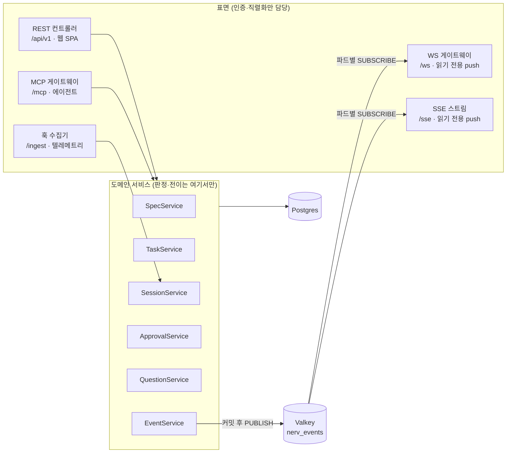

# API 명세

> **요약** — 이 문서는 NERV MVP의 대외 계약 정본이다. REST(`/api/v1`)·MCP(`/mcp`)·WebSocket(`/ws`)·SSE(`/sse`) 네 표면이 **같은 도메인 서비스를 DI로 공유**한다는 구조 결정(D-05)을 엔드포인트 전표와 대응 표로 실물화한다. 공통 규약(인증 2경로·`NERV_*` 에러 코드 재사용·커서 페이지네이션·`Idempotency-Key`), 리소스별 REST 엔드포인트 전표(각 행: 메서드·경로·권한·요청/응답 zod 스키마·발생 이벤트), 실시간 채널 계약 — **WebSocket + SSE 다중 채널**(룸·이벤트 이름은 [스펙 워크플로우와 거버넌스](../03-proposal/spec-workflow.md) §6 정본 인용, 팬아웃 MQ는 Valkey pub/sub), MCP 도구 **24종**(2026-09-05 — 카탈로그 정본은 3.4 §2.3) ↔ 내부 서비스 ↔ REST 대응 표, 그리고 EARS 수용 기준(REQ-API-*)으로 구성된다. 임포트 표면(§2.10 EP-IMP-01~06)은 원본 파일을 읽지 못하는 서버가 **이미 파싱된 결과만 받는** 경로다 — 임포터 CLI가 유일한 정상 호출자이며 규칙 정본은 [4.7 스펙 임포터](importer.md)다. 도구 24종의 입출력·티어·멱등성 정의는 [에이전트 연동 설계](../03-proposal/agent-integration.md) §2가, 필드 의미는 [데이터 모델](../03-proposal/data-model.md)이 정본이며 이 문서는 재정의하지 않는다.
>
> 문서 버전 v0.93 · 2026-09-05 · HTML 파생본: [api.html](../html/api.html)
>
> v0.93 변경(2026-09-05 — 용어 사전 반영, 사람 지시): [용어 사전](../glossary.md)의 채택어로 이 문서의 낱말을 옮긴다 — 기준선(← 베이스라인) · 워크플로우(← 워크플로) · 권한/소속/작업 범위(← 스코프) · 버전(← 판) · 고정 ID(← 안정 ID·키). **뜻은 바뀌지 않는다** — 코드·API 식별자는 그대로다.
>
> v0.92 변경(2026-09-05 — §1.7 의 선언이 거짓이었다, 정합성 감사 → 사람 결정): **REQ-API-113 신설 · 공유 zod 스키마 배선.** §1.7 은 "요청 열은 zod 스키마 이름이고 `packages/schema` export 와 1:1" 이라 못 박는데 **그 이름 대부분이 코드 어디에도 없었다** — 컨트롤러는 `Record<string, unknown>` 을 손으로 파싱했고, 이번 감사가 찾은 결함 넷이 전부 거기서 나왔다. 요청·질의 스키마를 모듈 다섯으로 만들고(테넌시·스펙·Task·리뷰·세션) 컨트롤러를 배선한다. **`.strict()`** 로 알 수 없는 키를 거절하고, **어휘(enum)는 여기서 보지 않는다**(도메인이 본다 — REQ-API-112). 응답(`*Result`)은 런타임 파싱하지 않는다: 서버가 만드는 것이라 스키마가 막을 실수가 적고, 이름은 계약의 이름으로 남는다. **1:1 을 검사가 센다** — 선언이 다시 거짓이 되는 것은 기계가 막고, 새 스키마를 더하는 것은 사람이 한다. 그 검사가 곧바로 둘을 짚었다: 임포트 스키마 다섯이 `…Schema` 접미사라 전표 이름과 어긋나 있었고(별칭을 뒀다), **EP-SPEC-10 이 2026-09-03 에 걷어낸 `reviewer_hint`·`note` 를 계속 적고 있었다**(본문 없음으로 고쳤다).
> v0.91 변경(2026-09-05 — 그물은 500 을 400 으로 바꿀 뿐이다, 정합성 감사 → 사람 결정): **REQ-API-112 신설 · §1.4a 에 전수 점검표.** `${…}::<enum>` 꼴 **62곳**을 전수로 확인하고 요청에서 오는 자리 **19곳에 `assertVocab` 을 심었다.** 그물(REQ-API-106)이 이미 400 을 보장하지만 "잘못된 입력" 만 받은 클라이언트는 같은 요청을 다시 보낸다 — **어느 필드가 어떤 목록에서 벗어났는지** 말하는 것은 자리마다의 검사만 할 수 있다. 나머지 43곳은 zod(7) · 리터럴 유니온 타입(3) · 서버가 만든 값(27) · 이미 있던 검사(6)로 이미 막혀 있었다. **점검 결과를 표로 남긴다** — 다음 사람이 62곳을 다시 세지 않게. 값이 요청에서 오지 않는 자리에는 검사를 두지 **않았다**: 두면 "이 값이 사용자 입력일 수 있다" 는 잘못된 신호가 남는다.
> v0.90 변경(2026-09-05 — 게이트가 표면에만 있었다, 정합성 감사 → 사람 결정): **REQ-API-111 신설.** `HUMAN_ONLY` 를 던지는 곳이 컨트롤러 다섯이고 **도메인 서비스는 0건**이었다 — 대응 메서드는 주체의 종류를 **인자로 받지도 않아**, 다른 표면이 같은 메서드를 부르면 게이트가 없었다. D-05 는 "표면은 번역만 하고 판정은 도메인 한 곳" 이라 적는데 **게이트도 판정이다.** 판정을 `common/human-only.ts` 의 `assertHuman(actor, action, webUrl)` 로 모으고 여섯 서비스가 그것을 부른다. 타입이 **모든 호출자에게 주체를 밝히라고 강제한다** — 표면이 늘 때 기억에 맡기지 않는다. **예외 하나를 명기한다**: 토큰 발급의 "PAT 가 PAT 를 발급하지 못한다" 는 도메인 판단이 아니라 인증 사슬의 규칙이라(D-08) 표면에 남는다. 기준선 생성은 `spec:approve` 가 사람 전용 권한라 **권한 가드가 더 앞에서** 답한다 — 더 강한 보장이라 그대로 둔다.
> v0.89 변경(2026-09-05 — 이름만 있던 인자에 뜻을 준다, 정합성 감사 → 사람 결정): **REQ-API-110 신설.** EP-SPEC-02 의 `requirement_id` 는 전표가 **이름만 적고 무엇을 거르는지 정하지 않아** 배선을 미뤄 둔 자리였다. 뜻은 **"이 요구사항 주변에서 찾아라"** — 그 요구사항이 속한 스펙으로 좁힌다. 앵커로 가진 결과만 주는 읽기도 가능했지만 그러면 결과가 사실상 한 건이라 검색이 아니라 조회이고, `nerv_spec_get` 이 이미 그 일을 한다 — 같은 일을 두 도구가 하면 에이전트는 어느 것을 쓸지 매번 판단해야 한다. 키와 UUID 를 둘 다 받고(§1.4b), **없는 요구사항은 빈 결과가 아니라 409** 다(§1.4 기준대로 없는 참조는 모양이 아니라 상태다).
> v0.88 변경(2026-09-05 — 만들 수 없는 값 둘에 길을 낸다, 정합성 감사 → 사람 결정): **REQ-API-108·109 신설 · EP-QST-03 신설 · 도구 24종.** 열거에는 있는데 **만드는 경로가 없어 아무도 쓸 수 없던 값 둘**에 길을 낸다. ① `resolution_kind.escalated` — 사람에게 넘기는 처분이고 **발견은 열린 채로 남는다**(넘긴 것은 해결한 것이 아니다). `escalate_reason` 을 필수로 요구한다: 사유 없는 에스컬레이션은 큐에 열린 발견 하나를 남기고 아무 정보도 더하지 않는다. 어휘는 질문과 **같은 것**을 쓴다(`resolution.escalate_reason` 열은 처음부터 있었는데 아무도 채우지 않았다). ② `question_status.cancelled` — **사람과 그 질문을 만든 세션 둘 다** 거둘 수 있다. 세션에 길이 필요한 이유는 하나다: 답이 필요 없어진 것을 아는 쪽은 물어본 쪽뿐이다. 그 길을 막으면 그 질문이 사람의 수신함에 남고 사람은 맥락 없이 처리한다. 그래서 **도구가 하나 늘었다**(`nerv_question_cancel` — MVP 22종 · 카탈로그 24종).
> v0.87 변경(2026-09-05 — 인계와 포기가 같은 값이 됐다, 정합성 감사 → 사람 결정): **REQ-API-107 신설.** EP-TASK-08 의 `reason` 이 **그대로 저장된다.** 그전에는 두 겹으로 뭉개졌다 — 저장이 `done` 외를 전부 `manual` 로 넣었고(인계와 포기가 같은 값), REST 컨트롤러는 그 위에 "셋 중 하나가 아니면 handoff" 라는 **조용한 변환**을 얹고 있었다. 어휘 판정은 도메인 서비스 한 곳이고(D-05 — MCP 는 스키마의 `enum` 으로 거절하고 REST 는 조용히 바꿔서 두 표면이 같은 값에 다르게 답했다), 어휘 밖은 400 이다.
> v0.86 변경(2026-09-05 — 어휘 밖 값이 진짜 500 이었다, 정합성 감사 → 사람 결정): **REQ-API-106 신설.** §1.4a 의 SQLSTATE 표에 **`22P02`**(값의 모양이 타입과 맞지 않음)를 더한다. 이 코드가 없어서 어휘 검사를 아직 두지 않은 자리마다 오타 하나가 500 으로 나갔다 — 500 은 "서버가 잘못했다, 기다렸다 다시" 라는 뜻이라 **클라이언트가 고칠 수 없는 요청을 재시도**한다. 값은 싣지 않는다: Postgres 의 메시지가 `… enum evidence_kind: "screenshot"` 처럼 값을 포함하므로 **콜론 앞까지만** 읽어 타입 이름만 `details.pg_type` 에 싣는다. **이것은 그물이지 검사가 아니다** — 어느 목록에서 벗어났는지 말하는 것은 자리마다의 `assertVocab` 이 하고, 그 전수 점검이 다음 일이다.
> v0.85 변경(2026-09-05 — 한 문서에서 번호 하나가 둘이었다, 정합성 감사 → 사람 결정): **초대의 `REQ-API-031`~`034` 를 `102`~`105` 로 옮긴다.** 같은 날(2026-08-27) 두 결정이 같은 번호를 잡았다 — v0.17 보관과 v0.18 초대. **v0.19(08-28)가 이 충돌을 한 번 풀었는데 셋 중 하나(`033`)만 옮기고 멈췄고**, 남은 `031`·`032` 가 그대로 둘씩이었다. **규약 5 를 한 번 깬다** — "기존 번호는 재사용·재배치하지 않는다" 가 정본이지만 둘 다 이미 발급된 번호라 어느 쪽을 옮겨도 재배치다. **선례와 방향이 다르다는 것을 적어 둔다**: v0.19 는 slug(보관) 쪽을 옮겼고 이번에는 초대 쪽을 옮긴다. 기준은 **파장**이다 — 보관 번호는 README v1.36·v2.40 · 이 문서 v0.17·v0.82 · 4.5 v0.29 의 다섯 서술이 그 사건을 가리키고, 초대 번호는 이 문서 §2.1b 안에서만 인용된다. 이후 신규 번호는 `106` 부터다. **이 예외를 선례로 삼지 않는다** — 번호는 발급 시점에 유일해야 하고, 그것을 지키는 검사를 넣는 것이 다음 일이다.
> v0.84 변경(2026-09-05 — 전역 규칙에 말 없는 예외가 있었다, 정합성 감사): §1.6 페이지 규약이 "기본 30·최대 100" 만 적는데 **발견 큐는 50/200, 게이트 표의 브랜치는 20/200** 이다. 값이 `review.service.ts` 안에 박혀 있어 화면은 그 수를 알 길이 없었다 — REQ-CB-006 이 상수를 `@nerv/schema` 에 두라고 한 **바로 그 이유**(서버가 자르는 값과 화면이 "더 있다" 를 판단하는 값이 갈리면 마지막 페이지에서 어긋난다)가 예외인 쪽에서 지켜지지 않았다. 상수를 `FINDING_PAGE_LIMIT_*`·`GATE_BRANCH_LIMIT_*` 로 올리고 예외를 근거와 함께 명기한다.
> v0.83 변경(2026-09-05 — 오타가 500 이던 마지막 자리, 정합성 감사): **REQ-API-101 신설.** EP-REQ-03 의 `kind` 가 검사 없이 `::evidence_kind` 로 캐스팅돼 어휘 밖 값이 **22P02(진짜 500)** 로 나갔다 — `db-error.ts` 가 다루는 SQLSTATE 목록에 22P02 는 없다. REQ-API-074·082 가 같은 실패를 두 번 이름 붙였는데 이 자리가 남아 있었다. 함께 전표의 증적 종수를 실물에 맞춘다(넷 → **여섯** — `review`·`user_guide` 가 빠져 있었고, 그 둘도 엔드포인트는 받는다).
> v0.82 변경(2026-09-05 — 파생본이 원본과 다른 말을 하고 있었다, 정합성 감사): html 파생본에서 §2.1 전표 네 행(`EP-ORG-03`·`04`·`05`·`EP-PRJ-05`)이 빠져 있었고, 그래서 `REQ-API-031` 이 "복구(EP-PRJ-05)" 라 가리키는 곳이 **같은 문서에 없는 죽은 참조**였다. §1.4j 의 근거 문단 셋(판정을 `common/query-vocab.ts` 한 곳으로, 예외 원문이 `details` 로 새던 자리)도 없었다 — EARS 행만 남고 왜 그렇게 정했는지가 사라져 있었다. `EP-SPEC-19` 행은 `</td>` 대신 `<td>` 가 들어가 표가 깨져 있었다. 함께: 존재한 적 없는 권한 `audit:read` 를 EP-EVT-01 의 권한으로 적던 것을 실물(`spec:read`)로 고친다.
> v0.81 변경(2026-09-05 — Phase 표기를 현황으로, 정합성 감사 → 사람 결정): §4 의 "서버·도구가 먼저 들어왔고 S6 화면은 아직 없다" 를 현황으로 고친다 — 리뷰 센터는 라우트·사이드바 탭·배지·facet·처분·코멘트·승격까지 동작한다. 이 문장은 화면이 들어온 2026-08-23 이후로 계속 틀려 있었다.
> v0.80 변경(2026-09-05 — 표면이 전표대로 받지 않았다, 정합성 감사 → 사람 결정): **REQ-API-099·100 신설.** 전표가 적은 입력을 REST 가 읽지 않는 자리 넷을 배선한다. ① EP-SPEC-08 의 `relations` — 서비스도 MCP 도 배선돼 있었고 컨트롤러만 본문에서 읽지 않아, REST 로 보낸 관계는 **성공 응답과 함께 버려졌다**(REQ-API-043 이 요구하던 것이다). ② EP-TASK-07 이 본문을 통째로 버렸다(`void body;`) — `progress`·`stats`·`lease_seconds` 셋 다 서비스는 받고 있었다. 세션 카드의 +N −M 이 REST 경로에서만 비던 이유다. ③ EP-TASK-08 의 `state_note` — 저장할 열까지 만들고 MCP 만 배선했다. ④ EP-SPEC-02 의 `type`·`status` — **두 표면 어디에도 없었다.** 자르기 전에 거르고, 어휘 밖은 400 이다(REQ-API-074 와 같은 규율). `requirement_id` 는 **뜻이 정해지지 않아 배선하지 않았다** — 이름만 있고 무엇을 거르는지가 어느 문서에도 없어, 추측해 넣으면 조용히 틀린 집합을 주게 된다. 넷 다 **REST 표면 L2 가 없어서** 아무도 세지 못했다(`rest-surface.spec.ts` 에 검사를 세웠다). 같은 감사에서 `nerv_spec_tree` 의 `{around, baseline}` 이 거절도 적용도 되지 않던 것을 고쳤다 — 기준선은 좁히기 축이 아니라 스냅샷 선택자라 배타가 아니라 **함께 적용된다**(REQ-API-090).
> v0.79 변경(2026-09-05 — 기준선을 골라도 목록이 그 세트가 아니었다, 사람 지적): **REQ-API-098 신설.** [4.5](screens.md) §2.4 (4)는 처음부터 "기준선을 고르면 목록이 그 세트에 핀된 버전 기준으로 렌더된다" 고 적었는데 **목록 질의가 기준선을 아예 받지 않았다.** 그래서 기준선을 골라도 그 뒤에 만들어진 문서가 함께 보였고, 보는 사람은 그 세트가 그 문서를 담고 있다고 읽었다 — **기준선은 세트인데 세트 밖을 함께 보이면 그것은 기준선이 아니라 "지금"이다.** EP-SPEC-01·19 가 `baseline` 을 받아 그 세트의 문서만, 그때 핀된 버전으로 준다. 없는 이름은 거절이다(EP-SPEC-03 과 같은 판정). 곁들여 선택기의 기본 항목을 `현재(최신 승인본)` → **`기준선 없음`** 으로 고쳤다(en: `No baseline`): 그 라벨은 목록을 거른다는 인상을 주는 데다, 승인본이 없으면 지금 버전으로 떨어지는 사실도 말하지 않았다.
> v0.78 변경(2026-09-05 — 구현 축이 파생되기 시작한다, 사람 요청): **REQ-API-097 신설.** spec-workflow §1.3 은 처음부터 "이 축의 값은 **사람이 손으로 찍지 않는다. 서버가 관계 그래프에서 파생한다**"(D-03)고 적고 파생 규칙표까지 두었는데, 파생하는 코드가 없었다 — `impl_status` 를 바꾸는 UPDATE 가 저장소에 0건이었다(v0.77 이 만든 요구사항 행이 전부 `unimplemented` 에 머물던 이유다). 그 표를 그대로 옮긴다. **판정은 한 곳**(`impl-status.ts`)이고 부르는 자리는 셋이다 — 클레임·Task 전이·증적 등록. `verified` 는 손대지 않는다: 그 칸의 조건(QA 역할의 검증 증적 · 그 커밋 범위에 열린 critical 0)을 지금 스키마가 담지 못해, 없는 근거로 약한 규칙을 만들면 그 값이 검증됐다는 뜻이 아니게 된다. Task 가 하나도 없는 요구사항도 건드리지 않는다 — 그러면 임포터가 문서에서 읽어 넣은 값을 증적 등록 한 번에 쓸어버린다.
> v0.77 변경(2026-09-05 — 커버리지가 셀 것이 없었다, 사람 결정): **REQ-API-096 신설.** `requirement` 행을 만드는 코드가 저장소에 **임포터 하나뿐**이었다(도움말 감사 2026-09-05 · `impl_status` 를 바꾸는 UPDATE 는 0건). 그래서 웹이나 에이전트로 쓴 스펙에는 요구사항이 없었고, 프로젝트 화면의 구현 현황은 그 프로젝트에서 **영원히 0** 이었다 — 화면 하나가 통째로 죽어 있던 것이다. 승인 시점에 본문의 EARS 줄을 행으로 만든다. **추출기는 새로 만들지 않는다** — 저장 응답의 델타가 이미 쓰는 `requirementsOf()` 를 그대로 쓴다(두 벌이면 "무엇이 요구사항인가" 가 갈라지고, 그때 화면의 수와 델타의 수가 다른 말을 한다). 초안이 아니라 승인 시점인 이유는 초안의 EARS 가 아직 약속이 아니어서다. 본문에서 사라진 요구사항은 지우지 않고 **어느 버전에서 빠졌는지**를 남긴다. `impl_status` 를 올리는 경로는 여전히 없다 — 그것은 다음 걸음이다.
> v0.76 변경(2026-09-05 — 플랜 승인 게이트를 실물로, 사람 결정): **REQ-API-095 신설.** 명세는 받은 요청의 MVP 카드를 3종(스펙 승인·**플랜 승인**·질문)으로 적고 D-06 ②·§5 의 G2 가 "파생 Task 4건 이상이거나 T3 티어 스펙에서 나온 대형 작업은 착수 전 플랜 승인" 이라고 조건까지 정해 두었는데, **`'plan'` 결재를 만드는 호출자가 저장소에 하나도 없었다**(도움말 감사 2026-09-05). 카드 유형이 명세에만 있고 실물로는 존재하지 않던 것이다. G2 를 정본이 정한 자리(`ready → claimed`)에 세운다. **거절하기 전에 카드를 만든다** — 결재를 만들지 않고 막기만 하면 사람이 승인할 자리가 없어 그 작업이 영영 멈춘다. 그래서 게이트는 **트랜잭션 밖**이다: 안에서 만들면 던질 때 카드도 함께 롤백된다. 판정 실패는 fail-open 이다(§5 표).
> v0.75 변경(2026-09-05 — 적혀 있던 헤더 대조를 실제로 한다, 사람 결정): **REQ-API-094 신설.** §1.2 의 헤더 표가 처음부터 `X-NERV-Project` 를 "토큰의 프로젝트와 대조" 라고 적었는데 **서버가 어디서도 읽지 않았다**(도움말 감사 2026-09-05 · `apps/api/src` 전체 grep 0건). 그래서 매뉴얼의 진단표는 아무 일도 하지 않는 헤더를 고치라고 사람을 보내고 있었다. **권한의 근거는 지금도 토큰이다** — 헤더는 틀렸을 때 멈추는 장치일 뿐이라, 실려 왔을 때만 견주고 없으면 지금처럼 지나간다(배포된 설정을 한꺼번에 막지 않기 위해서다). 오류는 헤더와 토큰의 값을 **모두** 말한다 — 어느 쪽을 고쳐야 하는지는 그 둘을 나란히 봐야 안다.
> v0.74 변경(2026-09-05 — 종류로도 거른다, 사람 결정): **REQ-API-093 신설.** `status` 와 **같은 축**이라 규칙도 같다(매칭 + 조상 · `matched` · `around` 와 배타). 둘을 함께 주면 AND 다. `area` 는 본문 없이 자리를 잡는 종류라 `type=vision,area` 가 곧 **트리의 뼈대**다 — 실측: clemvion 141편 → **17편**, sudoku 18편 → 5편. 스킬이 그것을 쓴다(4.6 §new 2단계: 자리를 고를 때 뼈대만 본다). 어휘는 `spec_type` 6종이고 검사는 `status` 와 같은 자리다.
> v0.73 변경(2026-09-05 — 적혀 있던 `status` 를 쓰는 쪽으로, 사람 결정): **REQ-API-092 신설.** v0.72 가 "아무도 읽지 않는다" 고 적어 둔 `SpecTreeQuery.status` 를 **구현한다.** 결정의 근거는 실측이다 — clemvion 141노드에서 `status=draft` 는 26건인데 **그중 17건의 부모가 draft 가 아니다.** 매칭만 남기면 그 17건이 부모를 잃고, 받는 쪽은 트리를 그릴 수 없다(`graph()` 가 이미 끝점 없는 간선을 걷어내는 것과 같은 이유다). 그래서 **조상을 함께 싣는다** — 값은 노드 3개고(26 → 29), 조상은 걸러낸 결과가 아니므로 `matched: false` 로 가른다. 세는 것은 `matched` 뿐이다. `status` 는 성질의 축이라 `root`·`depth` 와는 함께 쓰고 **`around` 와는 배타**다 — 관계 이웃에는 조상이라는 것이 없어 같은 인자가 모드마다 다른 뜻이 된다. 어휘 검사는 `nerv_task_list` 와 같은 자리(REQ-API-074)를 쓴다.
> v0.72 변경(2026-09-05 — 걸러 달라고 한 것이 걸러지지 않았다, 실사용 보고): **REQ-API-090·091 신설.** ① `nerv_spec_tree` 의 `root`·`depth`·`around`·`hops` 가 **스키마에만 있고 핸들러에는 없었다** — 무엇을 주든 프로젝트 전체가 돌아왔고(실측 sudoku: 최상위 하나 + 깊이1 자식 여덟인데 `depth:1` 이 18개), **없는 문서를 `root` 로 줘도 `ok:true` 였다.** 없는 것을 가리킨 성공 응답은 "그 문서 밑에 이만큼 있다" 로 읽힌다. REQ-API-082 가 이미 판정한 규율을 여기에도 적용한다 — 걸러 주는 인자는 **걸러서 주거나 거절하거나** 둘 중 하나다. REST 질의(`SpecTreeQuery`)의 `root`·`depth` 도 같은 자리에서 버려지고 있었다: 판정은 서비스 한 곳이라 두 표면이 같은 답을 준다(D-05). ② 스킬이 그 인자를 **`root_spec_id`** 라는 없는 이름으로 적고 있었는데(§4.6), ①과 겹쳐 **옳은 이름을 쓴 세션과 틀린 이름을 쓴 세션의 응답이 같았다** — 어긋남을 알아챌 자리가 없었다. 그래서 스킬↔도구 인자 대조를 L2 가 기계로 한다(REQ-API-091): 손으로 하는 교차 검사는 하기로 정해 두어도 하지 않는 날이 오고, 그날은 아무 소리도 나지 않는다. ③ 같은 줄의 **`status` 는 여전히 아무도 읽지 않는다** — 이번 변경의 범위 밖이라 손대지 않고 전표에 그 사실을 적어 둔다. 빼는 것도 구현하는 것도 결정이 필요하다.
> v0.71 변경(2026-09-04 — 안내가 형식을 여섯만 말하고 있었다, 실사용 검증): **REQ-API-089 확장 · REQ-API-069 안내 문구 정정.** ① 거부 메시지가 `png·jpeg·gif·webp·svg·pdf` **여섯만** 말하고 있었다(ko·en 둘 다) — 실제로는 v0.67 에 `html`·`txt`·`zip` 이 들어와 **아홉**이다. `zip` 을 올려도 된다는 것을 안내가 부정하고 있었으니, **없는 안내보다 틀린 안내가 나쁘다.** ② 첨부 1단계(`presign`)에 받는 주소가 없는 것은 **의도**임을 요구사항에 못 박았다 — 확정 전에는 받을 것이 없고, 아직 없는 주소를 주면 에이전트가 그것을 본문에 적는다(실사용 확인 요청에 대한 답).
> v0.70 변경(2026-09-04 — 지시가 가리키는 필드가 그 자리에 없었다, 실사용 보고): **REQ-API-089 확장.** 스킬은 "확정하면 응답의 `url` 을 본문에 넣으라" 고 지시하는데 **확정(2단계) 응답은 `{attachment_id, bytes, committed}` 뿐이었다** — 에이전트가 목록을 따로 불러 메우고 이 어긋남을 보고했다. v0.69 가 사람 경로(`upload`)의 주소만 고치고 에이전트 경로의 종착점을 빠뜨린 것이다. 확정 응답이 목록과 **같은 주소**를 주게 하고, 그 동일성을 L2 가 지킨다. 규약 6 이 말하는 유령 필드는 스킬이 없는 것을 부를 때만이 아니라 **서버가 부르라 한 것을 주지 않을 때도** 생긴다.
> v0.69 변경(2026-09-04 — 첨부를 되읽는 두 길, 사람 결정): **REQ-API-089 신설 · 도구 23종.** ① 목록이 **받는 주소**를 함께 준다 — id 만 주면 조립 규칙을 아는 쪽만 받을 수 있고, 실사용 에이전트는 몰라서 스토리지를 직접 두드리다 403 을 받았다. ② `nerv_spec_attachment_read` 를 더한다(P1 · `spec:read`) — Bash 가 없는 세션을 위한 길이라 **텍스트만·32KiB 상한**이고, 자르면 잘랐다고 말한다. 규약의 예외이므로 경계를 좁게 잡았다: 응답에 파일을 싣지 않는 것이 2단계 업로드의 이유였고 그 이유는 내려받기에도 유효하다. ③ 곁들여 §4 대응표가 19행에서 멈춰 있던 것을 채웠다(`spec_attach`·`review_submit`·`finding_resolve`·신설 도구) — 제목은 23종인데 본문은 19행이었다. ④ 그러다 **주소 자체가 깨져 있던 것**을 찾았다 — 사람 경로 `upload` 와 에이전트 `commit` 응답의 `url` 이 `projectId`(UUID)로 만들어져 **409** 였다(실측). 에이전트 1단계(`presign`)는 원래 받는 주소를 주지 않는다 — 아직 받을 것이 없다. 스킬이 그 주소를 본문에 넣으라고 하니 에이전트가 쓴 첨부 링크가 전부 죽어 있었다. 주소를 만드는 자리를 슬러그로 통일했다.
> v0.68 변경(2026-09-04 — 올릴 수는 있는데 되읽을 수 없었다, 실사용 보고): **REQ-API-088 신설 · EP-NTF-03 신설.** ① 에이전트가 `nerv_spec_attach` 로 파일을 올린 뒤 확인하려 했는데 `include:["attachments"]` 가 **`ok:true` 와 함께 사라졌다** — 응답 키가 그대로여서 "이 배포에는 첨부를 되읽을 경로가 없다" 고 결론지었다. **있는데 못 쓴 것과 없는 것을 구별할 수 없으면 사람은 없는 쪽을 믿는다.** `include` 어휘를 검사해 목록 밖은 400 으로 거부하고(REQ-API-082 와 같은 규율), `attachments` 를 실물로 만든다. ② 안 읽은 알림 **695건**을 한 건씩 지우는 것이 유일한 길이었다 — 지울 수 없는 배지는 곧 읽지 않는 배지가 된다. 일괄 읽음을 두고 **몇 건을 읽었는지 돌려준다.**
> v0.67 변경(2026-09-04 — 첨부 형식 셋과, 설정 누락을 장애로 말하던 자리): **REQ-API-069 확장.** ① 화이트리스트에 `text/html`·`text/plain`·`application/zip` 을 더한다(사람 지시) — 시안만이 아니라 **산출물**(리포트·로그·묶음)도 문서에 매달린다. `text/html` 이 새 위험을 만들지 않는 것은 내려받기(EP-SPEC-22)가 이미 `CSP: sandbox; default-src 'none'` + `nosniff` 를 걸고 있기 때문이다 — 더 어려운 경우인 `image/svg+xml` 을 이미 그 방어로 받고 있었다. ② **스토리지 미설정이 `kind:'internal'` 로 나가고 있었다**(실사용 보고): `NERV_UNAVAILABLE` 은 규약상 "나중에 재시도" 라 스킬이 outbox 에 큐잉하는데, 설정 누락은 재시도로 풀리지 않는다. `storage_unconfigured` 와 `missing[]` 으로 가른다.
> v0.66 변경(2026-09-04 — 기준선을 읽는 길, 사람 결정): **REQ-API-087 신설.** 테이블도 엔드포인트 넷도 2026-08 부터 있었는데 **그 세트로 문서를 읽는 길이 없어 실사용 기준선이 0개**였다(실측). EP-SPEC-03·`nerv_spec_get` 에 `baseline` 을, EP-TASK-03·`nerv_task_create` 에 기준 세트 인자를 단다. `version` 과 **배타**다 — 둘을 섞으면 "어느 쪽이 이겼나" 를 매번 물어야 하고 그 물음이 생기는 순간 기준선의 값어치가 사라진다. 없는 이름은 400 으로 거부한다(조용히 최신을 주면 사람은 기준선을 읽었다고 믿는다 — REQ-API-082 와 같은 규율). **이름은 맞는데 그 세트에 이 문서가 없는 것은 오류가 아니다**(나중에 만들어진 문서): 기본으로 떨어지되 `baseline_pinned:false` 로 말한다.
> v0.65 변경(2026-09-04 — 플랫폼이 자기 플러그인을 서빙한다, 사람 결정): **§2.11 신설**(EP-PLG-01·02 · REQ-API-086). git 마켓플레이스는 모두에게 같은 파일을 주므로 서버 주소가 `nerv.example.com` 이 아닌 배치는 받은 뒤에 고쳐야 했고, 실측된 유일한 실사용 설치가 정확히 그렇게 했다(4.6 v0.29). 서버가 카탈로그를 만들면 주소는 언제나 그 서버의 것이다. **주소의 출처는 `NERV_PUBLIC_URL` 하나이며 요청의 `Host` 를 읽지 않는다** — `mcp-origin.guard`(REQ-CB-013)가 이미 같은 판정을 했고, 반대로 하면 저장소가 '우리 주소' 를 두 가지로 갖게 된다. 표면은 **무인증**이다: `headersHelper` 는 관리형 settings 에만 걸려 손으로 설치하는 길을 남기려면 공개여야 하고, 패키지에는 비밀이 없다.
> v0.64 변경(2026-09-04 — 토큰의 실제 권한이 체크박스보다 넓었다, 실측): **§1.3b 신설**(REQ-API-085). 역할(`@RequireRole`)만 걸린 라우트는 **토큰의 권한을 보지 않았다** — `spec:read` 하나만 체크한 developer 토큰으로 Task 생성·수정(EP-TASK-03·05)과 증적 등록(EP-REQ-03)이 통과했고, 같은 작업의 MCP 경로는 `task:update` 를 요구하고 있었다(**경로마다 권한이 달랐다**). 셋에 권한을 AND 로 얹고, 증적에는 새 권한 `spec:evidence` 를 준다 — 정본이 "CI는 PAT"라고 적어 둔 자리라 CI 토큰을 증적만으로 좁힐 수 있어야 한다. 프로젝트 설정·보관·복구(EP-PRJ-04·05)는 **사람 전용**으로 바꾼다: 게이트 면제(EP-APR-04)가 이미 사람 전용인데 정책 자체를 낮추는 길이 토큰에 열려 있으면 그것이 면제의 우회로가 된다. 함께 어휘 서술의 "도구 표와 1:1"을 사실로 고쳤다(도구가 쓰는 권한은 일곱이다).
> v0.63 변경(2026-09-03 — 브랜치는 모델이 아니라 git 이 말한다, 사람 결정): **§2.5b 신설**(REQ-API-084). 세션 신원 3요소 중 `branch`·`worktree_path` 는 `nerv_bootstrap` 인자로만 올 수 있었고 모델이 그것을 실어 준 적이 없다 — **실사용 세션 34개 전부 NULL** 이다(실측). 훅은 프로젝트 디렉터리에서 도니까 포워더가 `git rev-parse` 로 읽어 `X-NERV-Branch`·`X-NERV-Worktree` 헤더에 싣고, 서버는 **빈 자리에만** 채운다. detached HEAD 면 헤더를 보내지 않는다 — 없는 것과 잘못된 것은 다르다.
> v0.62 변경(2026-09-03 — 상한만 있고 커서가 없던 목록 둘): **REQ-API-083 신설.** 알림은 서비스에 상한이 있는데 컨트롤러도 웹도 `limit` 을 넘기지 않아 언제나 최신 50건이었고, 발견 큐는 200 이 절대 상한이었다. 실측(2026-09-03): 안 읽은 알림 479건 중 **429건**, 열린 발견 18,653건 중 **18,453건**이 웹에서 도달 불가였다 — 화면은 "18653건 중 50건" 이라고 정직하게 말하면서 나머지로 가는 길을 주지 않았다. 두 목록에 커서를 둔다. 발견 큐의 커서는 `(severity, created_at, id)` 세 값이다 — 정렬 방향이 섞여 있어 행 값 비교를 쓸 수 없다.
> v0.61 변경(2026-09-03 — 오타가 500 이던 자리 넷, 라이브 실측): **§1.4j 확장**(REQ-API-082). 어휘 검사가 EP-SES-01 한 자리에만 있어 `?status=doing`·`?impl_status=nope`·`?v=abc`·`events?limit=abc` 가 전부 500 이었고, 발견 큐는 반대로 어휘 밖 값을 **조용히 버려** 걸러지지 않은 목록을 200 으로 돌려줬다. 판정을 `common/query-vocab.ts` 한 곳으로 모은다. 함께 **EP-SPEC-15 `owner_role` 이 존재하지 않는 타입(`membership_role`)으로 캐스팅하던 것**을 고쳤다 — 이 경로는 100% 500 이었고 같은 요청의 다른 필드까지 롤백시켰다. MCP 실패 응답의 예외 원문(SQL 전문) 유출도 막았다.
> v0.60 변경(2026-09-03 — 배지의 판정을 서버로): EP-SPEC-03 응답에 `recheck{count,specs[]}` 를 더한다. 참조 갱신 배지의 판정이 화면에 있었고 그 규칙이 초안이면 거의 언제나 참이라 **오탐률 100%** 였다(4.5 v0.62). 판정은 서버가 한다 — 이미 발행하고 있던 `spec.recheck_requested` 를 이 버전의 저장 시각과 견주고, 무엇 때문인지도 함께 싣는다.
> v0.59 변경(2026-09-03 — REST 쪽 절반): EP-SPEC-03 이 `include` 를 실제로 받는다. 전표는 처음부터 적고 있었지만 컨트롤러가 그 인자를 넘기지 않아, 웹의 영향 미리보기가 파생 Task 를 **언제나 0건**이라 말했다(실측: 그 수치가 0이던 스펙 86개 중 하나는 실제로 29건이다). 전표에서 `relations`·`baseline` 은 Phase 2 로 표기를 맞췄다 — 적어 두고 없는 것이 이 결함의 원인이었다.
> v0.58 변경(2026-09-03 — 받는 척하던 인자를 실물로, 사람 결정): **REQ-API-081 신설.** v0.57 이 드러낸 유령 인자 열한 종 중 일곱을 배선했다 — `state_note`·`progress`·`stats`·`include[tasks,comments]`·`resolved_in_version_id`·`lease_seconds`·후보의 `spec_key`·`version_no`. 열 셋이 새로 생겼다(`claim.release_note`·`claim.progress_note`·`agent_session.diff_files` — 4.3 참조). 나머지 넷은 정본 표에서 걷었다(3.4 v0.10).
> v0.57 변경(2026-09-03 — 유령 인자, 실측): **§1.4e 보강**(REQ-API-080). 스키마에 없는 인자를 검사도 거부도 없이 지나쳐, 스킬이 지시하는 인자 열한 종이 성공 응답과 함께 사라지고 있었다. 거부하지 않되 `ignored_args`(성공)·`details.unknown`(거절)로 버렸다는 사실을 말한다 — 개별 인자의 구현·삭제는 그다음 결정이다.
> v0.56 변경(2026-09-03 — 채택 규칙을 좁힌다, 사람 결정): REQ-API-079 의 선택 규칙을 확정했다. **`cwd` 필수**(hostname 만으로 고르는 가지를 닫는다)와 **마지막 활동 시각 1순위**(유령 세션이 등록 시각으로 이기지 못하게 한다). §1.4c 의 점화 기록을 해소로 닫았다.
> v0.55 변경(2026-09-03 — 훅 세션 채택에 번호를 준다, 사람 결정): §1.4c 에 **REQ-API-079** 를 신설했다. 어제까지 이 동작은 산문에만 있었다. 함께 **재검토 트리거 하나를 점화 기록으로 남긴다** — 후보가 여럿일 때의 선택 규칙("가장 최근")이 같은 DB 의 실측과 어긋난다: 겹친 쌍 14건 중 10건에서 나중 세션은 활동 0의 유령이었다.
> v0.54 변경(2026-09-03 — 훅 응답 의미론 정정): §2.9 의 훅 응답 서술을 실물에 맞췄다 — 주입은 `hookSpecificOutput.additionalContext` 아래이고, `Stop` 은 `stop_hook_active` 면 즉시 허용한다. 정본은 [3.4](../03-proposal/agent-integration.md) §3.3.
> v0.53 변경(2026-09-02 — 정본 정합): 리스 인계 표기를 정본에 맞춘다(2026-09-02 · 3.5 §1.2 · 4.4 §1.4h): 2026-08-30 에 보유자를 `(user, session)` 으로 좁히고 인계를 `takeover` 로 명시화했는데, 그 개정이 이 문서까지 오지 않아 여전히 "같은 사용자면 자동 인계" 라고 적고 있었다. **L3 시나리오 D 가 그 문장대로 쓰여 있었고 그래서 실패했다** — 에이전트 규약(3.4)은 아예 "이 에러는 오지 않는다" 고 적어, 그 말을 믿은 에이전트는 웹이 열어 둔 초안 앞에서 멈춘다.
> v0.52 변경(2026-09-02 — 사람 결정 반영): §2.1a 의 `gate_policy` 에서 `t1_objection_hours` 를 걷었다(이의제기 창 미구현 · [3.5](../03-proposal/spec-workflow.md) §2.4). EP-TOK-02 에 발급과 검증의 역할을 적었다 — 발급은 역할과 교집합하지 않고, 상한은 검증 시점에 걸리며, **화면은 역할 밖 권한을 보이되 잠근다**.
> v0.51 변경(2026-09-02 — 빈 룸): **§3.3 의 개인 룸이 비어 있었다.** "+ `user:{id}`" 열은 아홉 행에 걸쳐 있는데 그 룸으로 흐르는 봉투가 하나도 없었다 — WS 는 자동 join 하고 `/sse/me` 는 열리는데 내용이 없다. 봉투에 방송 전용 `recipient_user_ids` 를 두고, 알림 파생이 `notification.created` 를 수신자의 룸으로 흘린다. 웹은 그 이벤트에 종과 **받은 요청**을 함께 되읽는다 — 다른 프로젝트 화면에 있는 사람에게는 그것이 유일한 길이다.
> v0.50 변경(2026-09-02 — 약속한 계약의 실물화): **§1.5 · §1.8 · §3.5 가 문서에만 있었다.** 멱등 키는 저장소가 없어 `Idempotency-Key` 도 MCP 의 `idempotency_key` 도 그냥 버려졌고(같은 클레임이 두 번 만들어졌다), 쿼터는 상수 3종만 있고 세는 곳이 없었으며(집행되던 것은 인증 표면의 IP 한도뿐), SSE 는 사용자당 8 연결 상한이 적혀 있을 뿐 아무도 세지 않았다. 셋을 구현하고 문서가 비워 둔 자리를 채운다(REQ-API-076~078): 처리 중인 키의 응답, 실패한 최초 요청의 자리 비우기, 표면이 다를 때의 지문, 쿼터 카운터의 저장소와 degrade. 곁가지로 룸 상한 `8` 이 웹·API 에 각각 박혀 있던 것을 `@nerv/schema` 로 모았다.
> v0.49 변경(2026-09-02 — 정본 정리): §2.10 이 **둘**이었다(첨부·임포트) — 2026-09-01 에 신설한 두 절이 §1 안에 2.10·2.11 로 들어가 임포트 절과 번호가 겹쳤고, "4.4 §2.10" 인용이 두 뜻으로 갈렸다. 첨부는 §1.4k, 지시·발견 축은 §1.4l 로 옮긴다. 도구 수 표기(16/18)도 실측 22종으로 통일했다.
> v0.48 변경(2026-09-02 — 보안 점검): **§1.3a 신설**(REQ-API-075). §2 전표의 "권한" 열이 **문서에만** 있었다 — 판정 함수는 처음부터 있었고 task·approval·session 컨트롤러가 한 번도 부르지 않아 `viewer` 로 초안 저장·Task 생성·클레임·전이가 통과했다. 라우트가 권한을 **선언**하고 가드가 집행하며, **선언이 없으면 거절한다**(fail-closed).
> v0.47 변경(2026-09-02 — 보안 점검): **§1.4j 신설**(REQ-API-074). EP-SES-01 의 `state` 가 배열 리터럴에 그대로 이어 붙어 **프로젝트 멤버 누구나 WHERE 절을 재작성**할 수 있었다. 자리마다 이스케이프를 맞추는 대신 조립 자체를 없앤다 — 값은 파라미터로 가고, 어휘 밖의 값은 400 `invalid_input` 으로 거절한다(조용히 버리면 필터가 거짓말을 한다). 곁가지로 `invalid_input` 의 상태를 §1.4 기준대로 409 → **400** 으로 고쳤다.
> v0.45 변경(2026-09-01 — 사람 결정): **§1.4k 신설**(REQ-API-069~071 · 2026-09-02 에 §2.10 에서 번호를 옮겼다 — 임포트 절이 이미 그 번호였다). 스펙에 디자인 시안을 첨부한다 — MinIO 는 스택에 처음부터 있었고 아무도 쓰지 않았다. 사람은 서버를 거쳐, 에이전트는 **presigned 2단계**로 올린다(응답에 파일을 싣지 않는다). 읽기도 서버를 거친다: 첨부가 공개면 스펙 권한이 무의미해진다. 곁들여 **편집기가 이미지를 통째로 지우고 있던 결함**을 고쳤다.
> v0.44 변경(2026-09-01 — 사람 결정, 정책 변경): **REQ-API-065~068**. 훅 페이로드 **원문 보관**으로 정책을 바꾼다 — 예전에는 `tool_name` 만 남겨 타임라인이 "Bash / Bash" 를 383번 반복했다. **비밀만 예외**이고 그 예외는 적재 시점에 적용한다(저장 뒤 가리기는 백업·복제본을 되돌리지 못한다). 마스킹이 완벽하지 않으므로 **원문 열람은 세션 본인과 admin** 으로 좁힌다. 보존 잡은 지우기 전에 도구 횟수를 세션에 접어 두고, 세션 **작업 궤적**(도구 로그가 아니라 한 일)을 새로 연다.
> v0.43 변경(2026-09-01 — 화면을 붙이며 드러난 결함): **REQ-API-064**. 버전 diff 의 요구사항 델타가 `requirement_version` **조회**뿐이었는데 그 표를 채우는 것은 임포터뿐이라, **에이전트가 쓴 스펙에서는 언제나 비어 있었다**. 행이 없으면 본문에서 읽는다. 곁들여 EP-SPEC-06 의 L2 를 세웠다 — 그때까지 0건이었다.
> v0.42 변경(2026-08-31 — 사람 보고): **REQ-API-063**. 받은편지함의 결정이 **대상을 움직이지 않았다** — 결재 행만 고치고 끝나서, 거절한 스펙이 `in_review` 에 갇힌 채 카드만 사라졌다(고칠 수도 다시 낼 수도 없는 상태다). 결정과 전이를 한 트랜잭션으로 묶는다.
> v0.41 변경(2026-08-31 — 사람 보고·결정): REQ-API-061·062. ① **`review.submitted` 신설** — `finding.opened` 는 새 발견에만 나서, 병합되거나 0건인 라운드는 게이트 현황만 조용히 바꿨다(화면은 새로고침 전에는 몰랐다). ② **admin 의 자기 결재 허용** — 지시자≠승인자가 막으려는 것은 에이전트의 자기 통과이지 사람 admin 의 서명이 아니다. 판정은 서버가 하고 카드가 `can_approve` 로 받는다.
> v0.40 변경(2026-08-30 — 사람 보고 → 결정 A): **REQ-API-060**. 스펙을 고쳐 해결한 에이전트에게 **정직한 선택지가 하나도 없었다** — `fixed` 는 커밋이 없어 막히고 나머지 둘은 거짓말이다. `spec_change` 는 열거에 있었으나 도구가 노출하지 않았고 CHECK 가 CR 을 요구했다(그 표에 INSERT 하는 코드가 없다). 도구에 열고 증거를 `spec_version_id` 로도 받는다.
> v0.39 변경(2026-08-30 — 사람 요청): §4 대응표에 **`nerv_task_list`**. `next`(집을 수 있는 것)·`get`(아는 하나)로는 "이 프로젝트에 지금 무엇이 도는가" 를 물을 수 없었다. 곁들여 `TaskService.list` 의 `spec` 필터가 키도 받도록 고쳤다 — UUID 만 받던 탓에 키를 넣으면 **조용히 0건**이 되어 "그 스펙에 Task 가 없다" 로 읽혔다(§1.4b).
> v0.38 변경(2026-08-30 — 사람 물음): REQ-API-057·058·059. **피드백이 기록으로 끝났다** — 처분 3종 말고는 적을 자리가 없었고, 무엇을 적든 지적한 에이전트는 듣지 못했으며, "나중에 하자" 가 갈 곳이 없었다. 발견 코멘트 · 하트비트 역채널(`finding_commented`) · 발견 → Task 승격 셋을 잇는다.
> v0.37 변경(2026-08-30 — 사람 결정): §4 대응표에 **`nerv_task_get`·`nerv_task_create`** 두 행. MCP 표면이 REST 의 **부분집합**이었다 — 만들기·단건 읽기가 없어 에이전트는 자기가 클레임할 다음 것만 볼 수 있었다. MVP 도구 약속도 16 → 18 로 함께 고쳤다(4.1 §4.2). `TaskService.get` 이 키·UUID 를 둘 다 받도록 정정(§1.4b — 옆 도구들과 같은 규칙).
> v0.36 변경(2026-08-30 — 사람 보고 반영): REQ-API-055·056. ① 발견 목록이 **최근 처분**(근거·커밋·처분자)을 함께 준다 — 근거가 화면에 없어 dismissed 가 삭제와 구별되지 않았다. ② `nerv_task_update` 스키마가 **핸들러가 읽는 입력 전부**를 적는다(`evidence`·`blocked_reason`·`spec_impact`·`status` 열거) — 적히지 않아 done 게이트를 통과할 방법이 없었다.
> v0.35 변경(2026-08-30 — 결함 정정): **§1.4i 보강**(REQ-API-054). 버전 행이 없는 골격 노드(임포터가 디렉터리에서 만든 area)를 `nerv_spec_get` 이 **"없다"고 답했고**, 이어 쓰려면 **얻을 수 없는 지문**을 요구했다 — 그러면서 아무 문자열이나 통과시켰다. 노드를 빈 본문으로 돌려주고, **지킬 내용이 있을 때만** 지문을 요구한다.
> v0.34 변경(2026-08-30 — 사람 결정 4건): **§1.4i 신설**(REQ-API-051·052·053). ① `base_version` 을 요청 표면에서 걷는다 — 부른 쪽은 지문만 말하고 **계보와 버저닝은 시스템이 쥔다**. ② **고정 ID를 프로젝트 안에서 유일**하게 한다(제약도 검사도 없어서 같은 키를 가진 유령 문서가 생길 수 있었다). ③ 리스가 **하트비트를 본다** — 죽은 세션의 리스에 30분씩 갇히지 않는다.
> v0.33 변경(2026-08-30 — 리스가 아무것도 잠그지 않았다, 점검 결과 → 사람 결정): **§1.4h 신설**(REQ-API-049·050). 편집 리스 보유자를 **세션**으로 좁히고(예전에는 사용자 단위라 같은 PAT 로 도는 병렬 세션끼리 서로를 못 막았다), 뺏는 길을 `takeover` 로 연다 — 죽은 세션이 쥔 리스에 사람이 갇히지 않게. **선언 관계는 상대 문서의 `base_hash` 를 요구한다**.
> v0.32 변경(2026-08-30 — 병렬 편집이 막히지 않았다, 점검 결과 → 사람 결정): **§1.4g 신설**(REQ-API-047·048). 세 세션이 같은 초안을 동시에 저장하면 **셋 다 성공하고 본문에는 하나만** 남았다 — 둘은 오류도 경고도 없이 글을 잃었다. `base_version` 은 초안 단계에서 원리적으로 못 막는다(같은 행을 덮어쓰므로 id 가 변하지 않는다). **`base_hash` 비교-교환을 필수로** 하고, 저장 경로에 행 잠금을 둔다(제출·승인은 이미 잠그고 있었다).
>
> v0.31 변경(2026-08-30 — 초안이 언제 바뀌었는지, 사람 결정): `spec_version.updated_at` 을 EP-SPEC-04 응답에 싣는다(§1.4f). draft 는 같은 행을 덮어쓰므로 `created_at` 만으로는 "언제 바뀌었나"에 답하지 못한다. **본문이 바뀔 때만** 움직인다.
>
> v0.30 변경(2026-08-30 — 저장이 아무것도 남기지 않았다, 사람 보고): **§1.4f 신설**(REQ-API-046). draft 가 덮어써지는 것은 설계지만, 그 위에서 `change_summary` 는 **스키마에 없어 한 번도 실리지 않았고**(실측 30/30) 카탈로그가 약속한 **델타 요약은 응답에 없었다**. 실측 sudoku: 저장 40회 · 버전 15개(전부 v1) · 변경 요약 전부 NULL. 요약을 받아 남기고(주지 않으면 앞의 것을 지우지 않는다), 저장 응답이 요구사항·줄 수 델타를 돌려준다.
>
> v0.29 변경(2026-08-30 — 조용한 성공이 문서를 지웠다, 실측): **§1.4e 신설**(REQ-API-044·045). 스키마의 `required` 를 아무도 읽지 않아 인자 없는 호출이 핸들러까지 갔고, 핸들러는 없는 값을 `?? ''` 로 받았다 — 카탈로그·REST·웹이 쓰는 `body_markdown` 으로 부르면 본문이 **빈 문자열로 저장에 성공**했다(draft 는 이전 본문을 남기지 않으므로 그 문서는 사라진다). 호출 전에 입력을 검사하고, 본문은 두 이름으로 받으며, 빈 본문으로 기존 초안을 덮어쓰지 못하게 했다.
>
> v0.28 변경(2026-08-30 — 선언 관계는 저장 인자로, 사람 결정): EP-SPEC-08 이 `relations: [{to, kind}]` 를 받는다(§2.2 · REQ-API-043) — 정제·선행은 본문에 적히지 않는 판단이라 링크로는 잡히지 않는다. **주지 않으면 건드리지 않고**(본문만 고치는 저장이 관계를 쓸어버리지 않게) 빈 배열은 전부 지운다. `nerv_spec_relate` 의 `from`·`to` 도 키·UUID 를 모두 받는다. 사전 검토는 **해소되지 않는 링크**와 **아무와도 이어지지 않은 문서**를 warning 으로 본다.
>
> v0.27 변경(2026-08-30 — 관계는 링크에서만 읽는다, 사람 결정): §2.2 개정(REQ-API-024). 앞선 규칙은 본문 아무 데서나 `SPC-` 로 시작하는 문자열을 주웠는데, **접두가 상수라** 키를 다르게 지은 프로젝트에서는 통째로 죽었고(sudoku 13편 · 관계 0건), 그렇다고 프로젝트의 실제 키로 바꾸면 `migrations`·`conventions` 같은 **일상어 키**가 문장에서 걸린다. 링크는 사람이 "이건 그 문서다"라고 적은 자리라 둘 다 없다. 외부 주소·상대 경로·이미지는 받지 않는다.
>
> v0.26 변경(2026-08-30 — 도구를 스킬에 맞춘다, 사람 결정): **§1.4d 신설**(REQ-API-042). `nerv_question_create` 의 스킬과 카탈로그가 지시하는 `context`·`escalate`·`blocking`·`wait_seconds` 를 도구가 **받지 않고 조용히 버리고 있었다** — 에이전트는 출처를 달았다고 믿는데 받은 요청 카드에는 아무것도 없었다. 넷을 다 받는다: 출처는 키든 UUID 든 해석해 저장하고(못 찾으면 어느 항목인지 말한다), `escalate` 는 **기존 `escalate_reason` 어휘를 재사용**하며, `blocking` 은 `urgency` 와 같은 축, `wait_seconds` 는 최대 60초 long-poll 이다.
>
> v0.25 변경(2026-08-29 — 세션을 요구하는 도구가 전부 막혀 있었다, 실측 보고): **§1.4c 신설**(REQ-API-040·041). 카탈로그는 `nerv_bootstrap` 외의 도구에 `session_id` 를 적지 않는다 — 서버가 안다는 뜻인데 **추정이 구현돼 있지 않았다.** 그래서 `nerv_question_create`·`nerv_task_claim`·`nerv_session_event` 는 스키마대로 부르면 언제나 `session_required` 였다(bootstrap 직후에도). 이제 살아 있는 세션이 하나면 그것으로 해소하고, 여럿이면 **고르지 않고** 후보를 준다(오귀속은 잘못된 충돌 판정이 된다). 도구 호출이 세션을 살려 두고, stale 세션은 재개가 되살린다.
>
> v0.24 변경(2026-08-29 — 보관된 부모 아래에 만들 수 있었다, 실측): 복원에는 있던 `parent_archived` 규칙이 **생성·이동에는 없었다** — 보관된 부모를 지정해 스펙을 만들면 201 이었고, 그 문서는 기본 트리에서 부모를 못 찾아 **화면에서 사라졌다**(만든 사람도 다시 찾지 못한다). EP-SPEC-07·08·15 가 같은 규칙을 쓴다(§2.2 · REQ-API-039).
>
> v0.23 변경(2026-08-29 — 보관을 화면이 가를 수 있게, 실측): EP-SPEC-01·19 노드에 **`archived_at`** 을 싣는다(§2.2). `include_archived=true` 로 받은 목록에서 무엇이 보관된 것인지 응답이 말하지 않으면, 화면은 살아 있는 문서와 보관된 문서를 **같은 무게로** 그린다([4.5](screens.md) §2.4b · REQ-WEB-105).
>
> v0.22 변경(2026-08-29 — 실시간 갱신이 조용히 죽어 있었다, 사람 보고): ① **방송이 봉투를 잘라 보내고 있었다** — `{id, type, project_id}` 세 필드뿐이라 받는 쪽은 무엇이 바뀌었는지 몰랐다(§3.3). 봉투를 통째로 싣는다. ② 봉투에 **`actor_user_id`·`is_agent`** 를 더한다 — "내가 한 일"과 "남이 한 일"을 갈라야 알림이 소음이 되지 않는다(식별자만이라 D-14 와 어긋나지 않는다). ③ **`spec.draft_updated` 신설**(EP-SPEC-08 개정) — 같은 draft 재저장에 이벤트가 없어서, 에이전트가 본문을 고쳐도 화면이 알 수 없었다.
>
> v0.21 변경(2026-08-29 — 도구마다 식별자 기준이 달랐다, 실측): **§1.4b 신설**(REQ-API-038). `nerv_spec_get` 의 `spec_id` 는 키를, `nerv_spec_draft_upsert` 의 같은 이름은 UUID 를 받고 있었고 설명도 없어서 에이전트가 실패로 배웠다 — get 은 **자기 출력을 자기 입력에 넣을 수도 없었다**. 이제 `spec_id`·`parent_id`·`task_id`·`scope.spec_ids` 가 **키와 UUID 를 모두** 받는다(형태로 판별). 호환은 그대로다.
>
> v0.20 변경(2026-08-29 — 훅으로 만든 세션이 전부 `other` 였다, 실측): **§2.5a 신설**(REQ-API-037). 훅 본문에는 에이전트 종류가 없어서 세션 화면이 "누구의 무엇"에 답하지 못했다 — `X-NERV-Agent` 헤더를 우선하고 본문 `agent_type`(MCP `nerv_bootstrap` 경로)을 폴백으로 둔다.
>
> v0.19 변경(2026-08-28 — 무결성 위반이 500 으로 보였다, 사람 보고): **§1.4a 신설**(REQ-API-036). 같은 `key` 로 프로젝트를 만들면 유니크 제약이 그대로 올라와 "internal server error" 였다 — slug 는 미리 확인하는데 `key` 는 아니었고, 제약마다 미리 확인을 심는 방식은 유지되지 않는다. **표면(REST 필터·MCP 컨트롤러)이 한 번에** SQLSTATE 5종을 `NERV_PRECONDITION` 으로 옮기고 필드·제약 이름을 `details` 에 싣는다(값은 싣지 않는다 — `detail` 에는 충돌한 값이 있다). MCP 에서는 더 나빴다: 같은 실패가 `NERV_UNAVAILABLE` 로 나가 에이전트가 **영원히 실패할 요청을 재시도**했다. 곁가지 정정 둘: **REQ-API-033 이 두 요구에 겹쳐 있던 것**(초대 · 프로젝트 slug)을 slug 쪽을 REQ-API-035 로 옮겨 풀고, 그 요구의 상태 표기를 실물에 맞춰 400 → **409** 로 고쳤다.
>
> v0.18 변경(2026-08-27 — 조직 초대, 사람 결정): **§2.1b 신설**(EP-INV-01~06 · REQ-API-031~034 — **현재는 `REQ-API-102`~`105` 다**, 2026-09-05 재배치 · v0.85). 멤버 표면은 기존 사용자 배정만 담당했고 화면에는 그 입구조차 없어, **신규 사용자는 어느 쪽으로도 들어올 수 없었다**. 초대를 레코드(`invitation`)로 만들고 **링크 하나가 기존·신규를 모두 처리**한다 — 초대하는 쪽은 상대가 계정을 가졌는지 모르고 알 필요도 없다. 사람이 정한 규칙 둘: **초대한 이메일로만 수락**(링크는 메신저를 타고 흐른다) · **7일 만료**. 토큰은 해시만 저장하고 원문은 생성 응답에 한 번만 나간다(PAT 와 같은 규율). 메일 발송은 Phase 2 그대로 — MVP 는 admin 이 링크를 직접 전달한다.
>
> v0.17 변경(2026-08-27 — 보관이 되돌릴 수 없는 일이었다, 사람 보고): ① **`resolveProject` 가 보관을 걸러** 보관한 프로젝트의 모든 경로가 409 였다 — **복구 엔드포인트까지** 프로젝트 경로라 한 번 보관하면 되살릴 길이 없었고, 주소로 열람도 되지 않았다(§1.6a · REQ-API-031). ② **전역 승인함·알림·안읽음 수에서 보관한 프로젝트를 뺀다**(REQ-API-032) — 목록에는 보이는데 누르면 아무 일도 일어나지 않았다. 승인 카드와 **질문 카드**가 서로 다른 조건을 쓰고 있어 한쪽만 고치면 반만 사라진다. ③ 같은 slug 재생성이 유니크 제약 위반 그대로 올라와 **500** 이던 것을 이유 있는 400 으로 바꿨다(REQ-API-033) — 보관된 것이 자리를 쥐고 있으면 그 사실을 말해야 복구라는 길이 보인다.
>
> v0.16 변경(2026-08-24 — 멤버십 판정에서 조직 경계가 빠져 있었다): §1.6a에 **조직 경계**를 명시한다. 한 프로젝트에서의 역할은 "프로젝트 소속 멤버십 ∪ **같은 조직의** 조직 소속 멤버십"인데, `assertMembership`이 `project_id IS NULL`만 보고 `org_id`를 보지 않아 **A 조직의 조직 단위 admin이 B 조직의 프로젝트에서도 admin**이었다(L2 회귀로 재현·수정). 이 판정은 REST·WS join·SSE가 공유하는 한 곳이라 여기가 새면 세 표면이 함께 샌다. 사람 보고("admin인데 스펙 메타 편집이 잠겨 있다")를 좇다가 같은 절에서 발견했다 — 그쪽은 화면 결함이었고([4.5](screens.md) §1.8), 서버는 합집합을 이미 하고 있었으나 경계가 없었다.
>
> v0.15 변경(2026-08-24 — 조직·프로젝트 관리 표면, 사람 지시): **EP-ORG-03~05 · EP-PRJ-05 신설**(§2.1). 조직은 만들고 이름을 바꾸고 **비어 있을 때만** 지운다 — 프로젝트가 남아 있으면 409 다. 프로젝트는 **지우지 않고 보관한다**(`archived_at`) — 그 아래 스펙·Task·리뷰가 달려 있고 지우는 것은 감사 기록(FR-16)을 지우는 일이다. 되돌릴 수 없는 일 앞에 되돌릴 수 있는 단계를 하나 세운 것이다. 곁가지로 **EP-IMP-04 의 `pending` 을 실제로 구현했다** — 계약에는 있었고 아무도 채우지 않아 커버리지의 "요구사항 → 작업" 축이 언제나 0 이었다.
>
> v0.14 변경(2026-08-24 — 리뷰 소급 적재): **EP-IMP-06 신설**(§2.10) — 임포터가 파싱한 리뷰 세션 배치. 판정은 도구 경로와 같은 `ReviewService` 한 곳에 있고(D-05), **임포트는 이벤트를 내지 않는다**(과거 리뷰 수만 건이 알림이 되면 사람이 알림을 끈다). 곁가지로 EP-REV-03·04 에 상한을 넣었다 — clemvion 실측 18,650 발견·441 브랜치를 한 응답에 담으면 화면이 3만 픽셀이 된다.
>
> v0.13 변경(2026-08-23 — S6 가 읽을 것): **EP-REV-03 확장**(`severity[]`·`status[]`·`tag[]` 필터 + **facet 건수를 같은 응답에**)과 **EP-REV-04 신설**(브랜치별 게이트 현황). facet 을 따로 받게 하면 목록과 숫자가 어긋나는 순간이 생긴다. EP-REV-04 는 **표시일 뿐 집행이 아니다** — Task `done` 을 막는 것은 FR-10 의 Phase 2 몫이다.
>
> v0.12 변경(2026-08-23 — 리뷰 표면 신설): **§2.6a 리뷰·발견 전표 신설**(EP-REV-01~03). Phase 2 리뷰 수집(FR-09) 착수에 따른 것이고([4.1 범위](scope.md) §5 착수 기록) MVP 전표는 불변이다. 세 계약을 절 안에 못 박았다 — 입력 스냅샷(`head_sha`) 필수, 라운드는 `changeset_hash` 로 서버가 셈, **에이전트의 critical 하향은 A3**(승인 카드 `subject_type=finding` → 202 `NERV_APPROVAL_REQUIRED`).
>
> v0.8 변경(2026-08-23): §1.4 에 **`Accept-Language` 협상** 규약 추가 — 봉투의 `message` 는 요청 로케일로 만들고 `code`·`details` 는 로케일과 무관하다. MCP 표면(도구 설명·구조화 에러)도 같은 규칙을 따른다. 신설 요구 REQ-API-030. 카탈로그 정본은 [4.2](codebase.md) §3.4. 다른 계약은 불변.
>
> v0.7 변경(2026-08-22): §2.2b ③의 임베딩 호출을 **OpenAI 호환 `/v1/embeddings` 제공자 추상화**로 개정 — 제공자는 env 프로필(로컬 TEI / 스테이징 LM Studio / 운영 OpenAI, 정본 [4.2](codebase.md) §5.2a). 파이프라인·degrade 규칙은 불변.
>
> v0.6 변경(2026-08-22 — 하이브리드 검색 MVP 확정, [4.1](scope.md) §2.1): ① **검색 파이프라인 §2.2b 신설** — ID 직행 → 렉시컬(FTS+trgm) + 벡터(pgvector) RRF 병합 → 관계 확장(graph RAG). EP-SPEC-02와 `nerv_spec_search`는 같은 서비스이므로 두 표면이 동시에 이 품질을 얻는다 ② **EP-SPEC-18 관계 조회 신설**(양방향·backlink) + EP-SPEC-03 `include[]`에 `relations` 추가 ③ REQ-API-025~027.
>
> v0.7 변경(2026-08-22 — 화면 대조에서 발견): §1.8 쿼터 표에 **IP당 인증 한도(30 req/min)** 행 추가. 인증 스택의 내장 기본값에 맡기면 한도가 문서에도 코드에도 없고 사용자는 영문 "Too many requests"를 보게 된다(실측) — 값은 `@nerv/schema` `RATE_LIMIT_AUTH_PER_MIN`이 정본이다.
>
> v0.6 변경(2026-08-22 — 구현 착수 중 발견): **GitHub 웹훅 표면 EP-WHK-01 신설**(§2.9a). [4.8 백로그](backlog.md) E14-S03이 요구하는 "PR 웹훅 → Task evidence 수집"(FR-13)의 경로·인증(HMAC)·멱등 규칙이 어느 문서에도 없어 구현이 막혀 있었다. 인증이 다른 유일한 표면이며(GitHub은 우리 토큰을 들고 있지 않다), **판정하지 않는다**는 경계를 함께 못 박는다 — 증적 수집이 상태 전이나 커버리지 판정으로 번지면 Phase 2 범위를 조용히 당겨오게 된다. `evidence.added` 이벤트를 카탈로그에 추가(EP-REQ-03이 이미 참조하고 있었으나 이벤트 목록에 없던 누락 정정).
>
> v0.5 변경(2026-08-22 — 구현 착수 검토에서 발견된 공백 보완): ① **스펙 메타 표면 EP-SPEC-15~17 신설**(메타 수정·아카이브·복원 — §2.2). FR-01 "이동·개명에도 ID 불변"의 실행 경로가 없던 결함 해소, MCP `nerv_spec_draft_upsert`와의 메타 필드 계약 정합 규칙 포함 ② **`gate_policy`·`retention` 키 스키마 확정**(§2.1a) ③ **쿼터 시작값 확정**(§1.8) ④ **`spec_relation` 자동 추출 규칙**(§2.2 — 참조 전파(FR-02)가 임포트 없는 프로젝트에서도 동작하기 위한 전제) ⑤ REQ-API-020~024.
>
> v0.4 변경(2026-08-22): **임포트 표면 EP-IMP-01~05 신설**(§2.10) + `import:write` 권한(§1.3) + `import.applied` 이벤트(§3.3) + REQ-API-017~019 — 임포터 실행 모델이 DB 직결에서 API 클라이언트로 확정된 데 따른 계약 추가([4.7 스펙 임포터](importer.md) §3.2).

---

## 1. 공통 규약

### 1.1 하나의 서비스, 네 개의 표면 (D-05)

NERV API는 표면이 넷이고 판정 코드는 한 벌이다. NestJS(Fastify 어댑터)의 REST 컨트롤러·MCP 게이트웨이·WebSocket 게이트웨이·SSE 컨트롤러가 **같은 도메인 서비스**(SpecService·TaskService·SessionService·ApprovalService·QuestionService·EventService)를 주입받는다. 게이트 판정(스펙 승인 조건, 클레임 겹침, done 전이 조건)이 표면마다 갈라지는 것이 최악의 실패이며, 이 문서의 §4 대응 표가 그 단일화의 증명이다. 모듈 배치의 실물은 [4.2 코드베이스와 배포](codebase.md) §2가 정의한다.



| 표면 | 경로 | 쓰기 | 주 사용자 | 이 문서에서 |
| --- | --- | --- | --- | --- |
| REST | `/api/v1/**` | 있음 | 웹 SPA(S1~S8), 외부 연동 | §2 전표 |
| MCP | `/mcp` (Streamable HTTP 단일 엔드포인트) | 있음 | Claude Code · Codex 세션 | §4 대응 표 — 정의는 [에이전트 연동 설계](../03-proposal/agent-integration.md) §2 |
| WebSocket | `/ws` | **없음** (join 외 클라이언트 emit 없음) | 웹 SPA 실시간 갱신 | §3 계약 |
| SSE | `/sse/**` | **없음** (단방향 스트림) | 브라우저 밖 소비자(CLI·외부 도구) 실시간 구독 | §3.5 계약 |
| 훅 ingest | `/ingest/hooks/*` | Activity·세션 전이만 | Claude/Codex 훅 | §2.9 — 정본은 [에이전트 연동 설계](../03-proposal/agent-integration.md) §3.3 |

### 1.2 base path와 버전

- REST base path는 **`/api/v1`** 이다. 파괴적 변경은 `/api/v1`을 유지한 채 `/api/v2`를 병행 서빙하는 방식으로만 한다.
- SSE는 **`/sse`** 프리픽스를 `/api/v1`과 분리해 쓴다 — 프록시 계층(nginx·Ingress)이 버퍼링 해제·장수명 타임아웃을 경로 단위로 걸어야 하기 때문이다([4.2 코드베이스와 배포](codebase.md) §5.4·§6.3). 파괴적 변경 시 `/sse/v2`를 병행 서빙한다.
- MCP는 `/mcp` 단일 엔드포인트이며 프로토콜 리비전 병행 서빙 규약은 [에이전트 연동 설계](../03-proposal/agent-integration.md) §2.6을 따른다(이 문서는 재정의하지 않는다).
- markdown 미러(`/api/projects/{p}/specs/{id}.md` · `/api/projects/{p}/llms.txt`)는 [시스템 아키텍처](../03-proposal/architecture.md) §2.4의 경로 문자열을 **그대로, 버전 프리픽스 없이** 유지한다 — `llms.txt` 인덱스와 에이전트 로컬 캐시(`.nerv/cache/`)에 링크가 박제되는 경로라 v2 전환에도 불변이어야 한다(§2.8).
- 경로 파라미터: `{proj}` = `project.slug`(예: `clemvion`) — URL·MCP `project` 인자용 소문자 kebab 식별자로 `UNIQUE (org_id, slug)`, 표시 접두 `key`(예: `CLV`)와는 **별개 필드**다([데이터 모델](../03-proposal/data-model.md) §2.1). `{spec}`·`{task}`·`{sid}` = 표시 키 또는 내부 uuid 모두 허용, `{ver}` = SpecVersion uuid, `{no}` = `version_no` 정수. 표시 키 발급 규칙(`<project.key>-<타입>-<base32 6자>`)은 [데이터 모델](../03-proposal/data-model.md) §5.1 정본이고, 본문 예시는 기존 문서의 표기 예시(`SPC-CWC-007`·`CLV-T-1KTDCK` 등, [화면 설계](../03-proposal/ui-wireframes.md) §1.4)를 그대로 쓴다.

### 1.3 인증 — 2경로

| 경로 | 자격증명 | 대상 | 규약 |
| --- | --- | --- | --- |
| **웹 세션** | better-auth 세션 쿠키(HttpOnly·SameSite=Lax) | 브라우저 SPA | 로그인·세션 관리는 better-auth 핸들러(`/api/auth/*`)에 위임한다. `/api/v1`·`/ws`는 이 쿠키를 검증만 한다. 조직·멤버십은 better-auth organization 플러그인, 역할 6종(`admin·planner·designer·developer·qa·viewer`)은 `membership.role`이 정본([데이터 모델](../03-proposal/data-model.md) §2.1) |
| **PAT** | `Authorization: Bearer <token>` | 에이전트(MCP)·CI·외부 연동·md 미러 | better-auth api-key 플러그인 기반. 토큰은 **(사용자, 프로젝트, 역할, 소속)** 튜플에 바인딩되고 권한은 소유 사용자의 부분집합을 넘지 못한다([에이전트 연동 설계](../03-proposal/agent-integration.md) §6.1, D-08). Bearer 헤더 필수, **쿼리스트링 전달 금지**(MCP Authorization 규약 재인용) |

- PAT 원문 형식: `nerv_` 접두 + 32바이트 난수의 base64url. 서버는 해시만 저장하고(`api_token.token_hash`), 식별·감사용으로 앞 8자를 `api_token.prefix`에 남긴다([데이터 모델](../03-proposal/data-model.md) §2.1과 1:1). 원문은 발급 응답(EP-TOK-02)에서 **한 번만** 반환된다.
- 권한 어휘는 `resource:action` 표기이고 **10종**이다: `spec:read` `spec:draft` `spec:meta` `spec:evidence` `task:claim` `task:update` `review:submit` `review:resolve` `agent-session:launch` `import:write`. `spec:approve`와 `approval:decide`는 **토큰에 부여 자체가 불가능한 사람 전용 권한**다 — 정책이 아니라 시스템 불변식([에이전트 연동 설계](../03-proposal/agent-integration.md) §6.1 ④). 정본은 `@nerv/schema` 의 `AGENT_SCOPES`·`HUMAN_ONLY_SCOPES` 이며, 어느 문서도 이 목록을 다시 적지 않는다.
- **MCP 도구 대응이 없는 권한이 셋 있다**(2026-09-04 정정 — 실측). 도구 24종이 쓰는 권한은 **일곱**이라, "§2.3 도구 표의 '필요 권한' 열과 1:1"이라던 예전 서술은 사실이 아니었다. REST 축은 셋이다 — `import:write`(§2.10 이관 표면) · `spec:meta`(EP-SPEC-12·15~17) · `spec:evidence`(EP-REQ-03). `import:write`는 admin이 자신에게만 발급할 수 있고 역할 판정(admin)과 AND로 검사되며, 이관 작업이 끝나면 폐기하는 것이 기본 운용이다(EP-TOK-03).
- REST 엔드포인트의 인가는 역할 매트릭스([스펙 워크플로우와 거버넌스](../03-proposal/spec-workflow.md) §1.6)가 정본이다. §2 전표의 "권한" 열은 그 매트릭스의 인용이며, PAT 요청은 역할 판정에 **권한 검사가 AND로** 추가된다.

### 1.3a 권한은 라우트가 선언한다 (2026-09-02 신설 — 보안 점검)

**판정 함수는 처음부터 있었고, 부르는 곳이 없었다.** `assertScope` 는 spec·review·import 세 컨트롤러에서만 불렸다. task(생성·클레임·하트비트·해제·전이)·approval(게이트 면제·질문 답변)·session 컨트롤러는 **한 번도** 부르지 않았고, spec 도 초안 저장·제출·증적·코멘트 해소는 빠져 있었다. 그래서 §2 전표의 "권한" 열은 문서에만 있었다 — `viewer` 웹 세션이나 `spec:read` 만 가진 PAT 로 초안 덮어쓰기·Task 생성·클레임·전이가 전부 통과했다(실측 2026-09-02).

고칠 방법은 빠진 자리에 호출을 더하는 것이 아니다. **빠뜨리는 것이 가능한 구조**가 결함이다. 그래서 프로젝트 경로(`/api/v1/projects/{proj}/**`)의 모든 라우트는 권한을 **선언**하고, 가드가 그 선언을 집행한다. 선언이 없으면 **요청을 거절한다**(fail-closed) — 새 라우트를 열고 잊으면 조용히 열리는 대신 첫 요청에서 드러나고, 그 전에 단위 테스트가 먼저 말한다(REQ-API-075).

선언은 전표의 두 축을 그대로 옮긴다. 전표가 권한으로 적은 자리는 권한을, 역할로 적은 자리(EP-TASK-05 planner·developer·admin, EP-REQ-03 developer·qa·admin)는 역할을 요구한다. 축 **안에서는 하나라도**(겸직은 합집합이다), 축 **사이에서는 둘 다**(EP-IMP-* 의 `admin` AND `import:write`)다.

**소유권은 여기서 판정하지 않는다.** "클레임 보유자"(EP-TASK-07)·"작성자 본인"(EP-CMT-03)·"세션 소유자"(EP-SES-04)는 문턱이 아니라 대상의 성질이라 도메인 서비스가 본다. 라우트 선언은 그 앞의 문턱이고, 둘은 겹치지 않는다.

| ID | 수용 기준(EARS) |
| --- | --- |
| REQ-API-075 | WHILE 프로젝트 경로의 라우트를 처리하는 동안 THE SYSTEM SHALL §2 전표의 권한을 선언에서 읽어 집행하고, 선언이 없는 라우트는 **거절한다**(403 `route_undeclared`). WHEN 주체의 역할·권한이 선언을 충족하지 못하면 THE SYSTEM SHALL 403 `NERV_FORBIDDEN`(`role_required`·`missing_scope`)으로 거부하고 요구·보유 목록을 `details` 에 싣는다 |

#### 1.3b 역할만 보던 자리 — 토큰의 권한은 체크박스가 말한 것이어야 한다 (2026-09-04 신설 — 실측)

§1.3a가 "선언하지 않으면 거절한다"로 **빠뜨림**을 막았다. 남은 것은 **선언의 축이 하나뿐인 자리**였다. `@RequireRole` 만 붙은 라우트는 역할만 보고 토큰의 권한을 보지 않는다 — 그래서 발급 화면에서 `spec:read` 하나만 체크한 토큰이 다음을 전부 통과했다(실측 2026-09-04).

| 자리 | 예전 | 지금 | 왜 |
| --- | --- | --- | --- |
| EP-TASK-03 · 05 | 역할만 | 역할 **AND** `task:update` | MCP `nerv_task_create`·`nerv_task_update` 가 이미 그 권한을 요구했다. **같은 작업의 권한이 경로마다 달랐다** — 토큰에서 빼도 REST 로는 그대로 됐다 |
| EP-REQ-03 | 역할만 | 역할 **AND** `spec:evidence` | 전표가 "CI는 PAT"라고 적어 둔 자리다. 증적만 올리는 CI 토큰을 좁게 발급할 방법이 없었다 |
| EP-PRJ-04 · 05 | 역할만 | **사람 전용** | 아래 |

**`spec:evidence` 를 새로 만든 이유**(사람 결정). 기존 권한을 재사용하면 CI 토큰이 필요 이상을 갖는다 — `spec:draft` 면 초안 덮어쓰기(도구 5종)까지, `task:update` 면 Task 생성·전이·클레임 해제까지 딸려온다. 증적은 그 둘 어느 쪽도 아니고, 최소권한이 실제로 성립하려면 자기 이름이 있어야 한다. MCP 도구 대응은 없다 — REST 축이다(§1.3).

**프로젝트 관리를 사람 전용으로 옮긴 이유**(사람 결정). 게이트 **면제**(EP-APR-04)는 이미 사람 전용이었다. 그런데 게이트 **정책 자체**를 낮추는 길이 토큰에 열려 있으면 그것이 면제의 우회로가 된다 — 면제를 받지 못하는 에이전트가 임계값을 내리면 되기 때문이다. 같은 축의 한쪽만 잠그는 것은 잠근 것이 아니다. 보관·복구를 함께 막는 것은 프로젝트를 목록에서 지우는 일이 같은 무게라서다.

**권한이 새고 있었다는 뜻은 아니다.** 이 자리들은 전부 역할 검사를 통과해야 했고, 역할은 사람이 가진 것이다. 무너진 것은 **최소권한**이다: 발급 화면이 보여준 체크박스가 그 토큰이 할 수 있는 일의 전부가 아니었고, 그래서 좁은 토큰을 만들려는 사람에게 그럴 방법이 없었다.

| ID | 수용 기준(EARS) |
| --- | --- |
| REQ-API-085 | WHEN 어느 라우트가 역할을 요구하면서 대응 권한이 어휘에 있으면 THE SYSTEM SHALL 역할과 권한을 **함께**(AND) 검사한다 — 같은 작업의 MCP 경로와 REST 경로는 같은 권한을 요구한다. WHEN 프로젝트 설정 변경·보관·복구(EP-PRJ-04·05)를 에이전트 주체가 호출하면 THE SYSTEM SHALL 403 `NERV_HUMAN_ONLY` 로 거부한다. WHEN 토큰을 발급하면 THE SYSTEM SHALL 어휘에 없는 권한을 저장하지 않는다 |

### 1.4 에러 포맷과 HTTP 상태 매핑

에러 본문은 [에이전트 연동 설계](../03-proposal/agent-integration.md) §2.7의 구조화된 도구 결과와 **같은 봉투**를 쓴다. 코드 체계도 같은 문서의 `NERV_*` 10종을 재사용하며 REST 전용 코드를 신설하지 않는다.

```json
{
  "ok": false,
  "code": "NERV_CONFLICT_SCOPE",
  "message": "CLV-T-0CFQC2의 scope가 다른 활성 클레임과 겹칩니다.",
  "details": {
    "conflicting_claim_id": "clm_9c41…",
    "owner": "유나",
    "hostname": "linux-ci-01",
    "overlap": { "spec_ids": ["SPC-CWC-007"], "file_globs": ["codebase/frontend/src/widget/**"] }
  },
  "retry_after_s": null,
  "next_actions": []
}
```

`next_actions`는 MCP 표면에서 채워지는 필드이며 REST 응답에서는 빈 배열을 허용한다.

**`message`는 요청 로케일로 만든다**(2026-08-23 — 정본: [4.2 코드베이스와 배포](codebase.md) §3.4). 요청의 `Accept-Language`를 협상해 지원 로케일(`ko`·`en`)로 떨어뜨리고, 없거나 모르는 언어면 기본값 `ko`다. **`code`와 `details`는 로케일과 무관하다** — 기계가 읽는 값이라 번역하면 클라이언트의 분기가 깨진다. 같은 규칙이 MCP 표면에도 적용된다(도구 설명·구조화 에러). 협상 실패가 오류가 되지 않는다는 것이 규약이다.

HTTP 상태 매핑:

| `code` | HTTP | REST에서의 대표 상황 |
| --- | --- | --- |
| `NERV_UNAUTHENTICATED` | 401 | 세션 쿠키 없음·만료, PAT 폐기·만료 |
| `NERV_FORBIDDEN` | 403 | 역할 미충족, PAT 권한 부족, 지시자≠승인자 위반 |
| `NERV_PRECONDITION` | 400 / 409 | 400: zod 스키마 위반(`details.issues`) · **입력 모양을 어긴 DB 제약**(§1.4a — 빠뜨린 값·허용되지 않는 값·너무 긴 값) · 409: 본문 지문(`base_hash`) 불일치, 게이트 전이 조건 미충족, 멱등 키 본문 불일치, **중복 값·없는 참조**(§1.4a) |
| `NERV_CONFLICT_SCOPE` | 409 | 클레임 scope 겹침 `block` 판정 |
| `NERV_LEASE_EXPIRED` | 409 | 리스 만료 후 상태 변경 시도 |
| `NERV_DRAFT_LEASED` | 409 | 다른 사용자가 초안 편집 리스 보유 |
| `NERV_APPROVAL_REQUIRED` | 202 | A3 액션이 pending Approval을 만들고 대기 진입(`details.approval_id`) |
| `NERV_HUMAN_ONLY` | 403 | A4 액션 요청 — `details.web_url` 딥링크 포함 |
| `NERV_RATE_LIMIT` | 429 | 쿼터 초과 — `retry_after_s` + `Retry-After` 헤더 병행 |
| `NERV_UNAVAILABLE` | 503 | 의존 구성요소 장애 |

### 1.4a DB 무결성 위반은 500 이 아니다 (2026-08-28 신설 — 사람 보고)

**"internal server error" 는 사용자의 잘못을 서버의 잘못으로 보고한다.** 같은 `key` 로 프로젝트를 만들면 유니크 제약 위반이 그대로 올라와 500 이었다 — 화면은 무엇이 잘못됐는지 말하지 못하고, 로그를 볼 수 있는 사람만 원인을 안다. slug 는 저장 전에 미리 확인하고 있었지만 `key` 는 아니었고(같은 표에 유니크가 둘이다), **제약마다 미리 확인을 심는 방식은 유지되지 않는다.**

그래서 **표면이 한 번에 받는다.** REST 필터와 MCP 컨트롤러가 같은 변환을 쓴다.

| SQLSTATE | 뜻 | `details.kind` | HTTP |
| --- | --- | --- | --- |
| `23505` | 중복 값 | `unique_violation` | 409 |
| `23503` | 없는 참조 | `foreign_key_violation` | 409 |
| `23502` | 빠뜨린 값 | `not_null_violation` | 400 |
| `23514` | 허용되지 않는 값 | `check_violation` | 400 |
| `22001` | 너무 긴 값 | `too_long` | 400 |
| `22P02` | **값의 모양이 타입과 맞지 않음** — 어휘 밖 enum · 잘못된 UUID | `invalid_text_representation` | 400 |

가르는 기준은 **모양이냐 상태냐**다. 빠뜨린 값·허용되지 않는 값·너무 긴 값은 요청의 모양이 틀린 것이라 다시 보내도 같은 결과이므로 400 이고, 중복 값·없는 참조는 지금의 상태라 다른 시점에는 같은 요청이 성공하므로 409 다.

- `details` 에 **`fields`**(제약이 건 열 전부) · **`constraint`** · `table` 을 싣는다. 사람에게 보이는 문장은 그중 **`_id` 로 끝나지 않는 열**만 부른다 — `(org_id, key)` 유니크에서 사람이 고른 값은 `key` 하나이고, 범위 열까지 부르면 무엇을 고치라는 것인지 흐려진다.
- **값은 싣지 않는다.** Postgres 의 `detail` 에는 충돌한 값이 들어 있는데(`Key (key)=(nerv)`) 그대로 돌려주면 남의 행 값이 새는 자리가 된다. 나가는 것은 이름뿐이다.
- 필드 이름은 `detail` 에서 읽으므로 서버 로케일(`lc_messages`)이 영어가 아니면 못 읽을 수 있다. 그때는 `fields` 가 비고 **제약 이름만** 남는다 — 이름이라도 있는 편이 "internal error" 보다 낫다.
- **`22P02` 는 그물이다**(2026-09-05 · REQ-API-106). 값이 어휘 밖이면 `::enum` 캐스팅이 여기서 죽는데 이 표에 없어서 **진짜 500** 으로 나갔다 — 클라이언트는 고칠 수 없는 요청을 재시도한다. 어휘 검사를 미리 두는 쪽이 더 친절한 답을 주지만(어느 목록에서 벗어났는지까지 말한다), 그것을 모든 자리에 심기 전까지 남은 자리가 어디든 400 이 되게 한다.
- **`22P02` 에서도 값은 싣지 않는다.** Postgres 의 메시지는 `invalid input value for enum evidence_kind: "screenshot"` 처럼 **값을 포함한다.** 콜론 **앞까지만** 읽어 타입 이름(`details.pg_type`)만 싣는다 — 타입 이름은 스키마의 사실이라 새는 것이 없다. 서버 로케일이 영어가 아니면 못 읽고, 그때도 400 은 유지된다.
- **모르는 오류는 그대로 500 이다.** 여기서 아무거나 4xx 로 만들면 서버의 결함이 사용자 잘못으로 둔갑하고, 그 순간 500 이 사라져 아무도 고치지 않는다.
- MCP 에서 특히 중요하다: 예전에는 이런 실패가 `NERV_UNAVAILABLE`("잠시 뒤 다시")로 나갔고, 그 코드를 받은 에이전트는 **영원히 실패할 요청을 재시도**한다. 중복 키는 기다린다고 풀리지 않는다.

#### `::enum` 캐스팅 전수 점검 (2026-09-05 · REQ-API-112)

`22P02` 그물(REQ-API-106)은 **남은 자리가 어디든 400 이 되게** 한다. 그물이 하지 못하는 것은 **어느 목록에서 벗어났는지 말하는 것**이라, 자리마다의 어휘 검사를 한 번에 훑었다. `${…}::<enum>` 꼴 **62곳**을 전수로 확인한 결과다 — 다음 사람이 다시 세지 않게 남긴다.

| 부류 | 곳 | 무엇이 막는가 |
| --- | --: | --- |
| **어휘 검사를 새로 심음** | 19 | `assertVocab(…, <enum>.enumValues, '<필드>')` — `member_role`(4) · `agent_type` · `activity_type`(2) · `session_end_reason`(2) · `task_priority`(2) · `task_status` · `evidence_kind` · `spec_type` · `spec_relation_kind`(4) · `review_kind`(3) · `approval_decision` · `comment_status` · `notification_state` · `escalate_reason` · `question_urgency` |
| 이미 검사가 있었음 | 6 | `assertVocab` 이 앞에 있던 자리(`impl_status`·`member_role`(owner) 등) · `resolutionOf` 가 판정하는 `resolution_kind`·`finding_status` · `CLAIM_RELEASE_INPUTS` |
| **zod 가 경계에서 막음** | 7 | 임포트 배치(`packages/schema/src/zod/import.ts` — `z.enum`). 값이 서비스에 닿기 전에 걸린다 |
| 리터럴 유니온 타입 | 3 | `approval_subject_type` — 시그니처가 값 여섯을 열거한 유니온이라 **컴파일러가 막는다** |
| 서버가 만든 값 | 27 | 삼항 리터럴(`'auto'`/`'manual'` · `'human'`/`'agent'`) · DB 에서 읽어 되쓰는 값 · 계산된 위험도 · 커서에 담겼던 값 |

**요청에서 곧장 오는 캐스팅 중 검사 없는 것은 0곳이다.** 이 표의 마지막 두 부류는 값이 요청에서 오지 않으므로 검사를 두지 않는다 — 두면 "이 값이 사용자 입력일 수 있다" 는 잘못된 신호를 남긴다.

**더 친절한 답이 필요한 자리에는 여전히 미리 확인을 둔다** — 프로젝트 slug 가 그렇다(REQ-API-035): 보관된 것이 자리를 쥐고 있다는 사실까지 말해야 "복구"라는 길이 보이고, 그건 제약 위반만 보고는 알 수 없다.

| ID | 수용 기준(EARS) |
| --- | --- |
| REQ-API-036 | WHEN DB 제약 위반으로 요청이 실패하면 THE SYSTEM SHALL 표면(REST·MCP)에서 그것을 `NERV_PRECONDITION` 으로 옮기고, 어긴 제약의 종류·필드 이름·제약 이름을 `details` 에 담아 응답한다 — 값은 담지 않는다 |

### 1.4b 참조는 키든 UUID 든 받는다 (2026-08-29 신설 — 실측)

**같은 이름의 인자가 도구마다 다른 것을 뜻하고 있었다.**

| 도구 | 인자 | 받던 것 |
| --- | --- | --- |
| `nerv_spec_get` | `spec_id` | 키(`SPC-…`) |
| `nerv_spec_draft_upsert` | `spec_id` · `parent_id` | UUID |
| `nerv_task_claim` · `nerv_task_update` · `nerv_task_get` | `task_id` | UUID |
| `nerv_task_list` | `spec` | UUID |
| `nerv_task_claim` | `scope.spec_ids` | UUID |
| `nerv_spec_relate` | `from` · `to` | 키 |

스키마에 설명도 없어서 고를 근거가 없었고, 에이전트는 **실패로 배웠다** — 한 세션이 `spec get` 두 번과 `draft upsert` 한 번을 틀리고 나서야 "upsert 는 UUID 를 받는군요"라고 적었다(실측 2026-08-29). 더 나쁜 것은 `nerv_spec_get` 이 **자기 출력을 자기 입력에 넣을 수 없었다**는 것이다: 입력은 키인데 응답의 `spec_id` 는 UUID다.

**규칙은 하나다: 참조는 키와 UUID 를 둘 다 받는다.** 값의 **형태**로 가른다(UUID 모양이면 id, 아니면 키). 사람·화면·로그가 쓰는 것은 키이므로 키가 정본이고 UUID 는 내부 식별자다 — 어느 쪽을 줘도 같은 것을 가리키면 그것으로 충분하다.

- 적용 대상: `spec_id` · `parent_id` · `task_id` · `scope.spec_ids`. 스키마의 `description` 에 "key (SPC-…) or UUID" 를 적어 **고를 근거를 준다**.
- **없는 키는 못 찾았다고 말한다.** 조용히 null 로 떨어뜨리면 `parent_id` 오타가 "최상위에 만들기"로 둔갑한다.
- 아무 문자열이나 `::uuid` 로 캐스팅하지 않는다 — 못 읽는 값에서 22P02 가 나고 그건 사용자 잘못이 **500 으로** 보고되는 자리다(§1.4a).
- 호환은 깨지지 않는다. UUID 를 넘기던 호출은 그대로 동작하고, 키를 넘기던 호출이 새로 동작한다.

| ID | 수용 기준(EARS) |
| --- | --- |
| REQ-API-038 | WHEN 도구·엔드포인트가 스펙·Task 참조를 받으면 THE SYSTEM SHALL 고정 ID와 UUID 를 모두 해석하고, 어느 쪽으로 받았든 같은 대상을 가리키게 하며, 해석되지 않으면 `not_found` 로 거부한다 |
| REQ-API-039 | WHEN 보관된 스펙을 부모로 지정해 스펙을 만들거나 옮기면 THE SYSTEM SHALL 409 `NERV_PRECONDITION`(`details.kind="parent_archived"`, `parent`=부모 키)로 거부한다 — 보관된 부모 아래의 문서는 기본 목록·트리 어디에도 나타나지 않아 만든 사람도 다시 찾지 못한다 | 보관 후 그 아래 생성 1건 + 보관된 부모로 이동 1건 |

### 1.4c 이 호출은 어느 세션의 일인가 (2026-08-29 신설 — 실측)

카탈로그([3.4](../03-proposal/agent-integration.md) §2.3)는 `nerv_bootstrap` 외의 도구에 `session_id` 를 적지 않는다. **서버가 안다**는 뜻이었는데, 그 절반이 구현돼 있지 않았다: 세션 해소는 명시 인자만 읽고 없으면 `null` 을 돌려줬다(코드 주석은 "명시 인자 > 활성 세션 추정"이라고 적혀 있었다 — 추정이 없었다).

결과는 조용하지 않았다. 세션을 요구하는 도구 세 개(`nerv_question_create` · `nerv_task_claim` · `nerv_session_event`)는 **스키마대로 부르면 언제나 실패했다** — bootstrap 이 방금 `resumed: true` 로 성공했어도 `session_required` 였다(실측 2026-08-29 · 토이 프로젝트 보고). 에이전트의 작업 루프(클레임 → 보고 → 에스컬레이션)가 통째로 닫혀 있었다.

**L2 가 이것을 못 잡은 이유**는 테스트가 모든 호출에 `session_id` 를 실어 보냈기 때문이다 — 계약에 없는 인자를 테스트만 알고 있었다.

해소 순서는 셋이다.

| 순서 | 규칙 |
| --- | --- |
| ① 명시 | `session_id` 인자가 있으면 그것. **자기 세션만** 받는다 — 존재만 확인하면 같은 프로젝트의 남의 세션에 질문·클레임을 붙일 수 있고, 그러면 감사(FR-16)가 "누가 했나"에 답하지 못한다 |
| ② 추정 | 이 토큰 주체의 **살아 있는 세션이 하나**면 그것(`state ∈ pending·active·awaiting_input` + 무활동 30분 이내 — `markStale` 과 같은 기준) |
| ③ 모호 | 둘 이상이면 **고르지 않는다.** `session_ambiguous` 로 후보(세션 id·hostname·종류·마지막 활동)를 돌려주고 `session_id` 를 요구한다 |

③에서 아무거나 고르지 않는 이유: 클레임은 **세션 단위로 겹침을 판정**하므로, 조용한 오귀속은 곧 잘못된 충돌 판정이 된다. 그리고 이 경우의 `next_actions` 는 **비어 있다** — bootstrap 을 권하면 세션이 하나 더 생겨 모호함이 깊어진다.

두 실패는 다른 실패다: 없어서 못 고른 것(`session_required` → bootstrap)과 여럿이라 안 고른 것(`session_ambiguous` → 인자 지정). 한 코드로 뭉치면 에이전트는 이미 만든 세션을 두고 bootstrap 을 다시 부르며 제자리를 돈다.

함께 고친 것 셋:

- **도구 호출은 생존의 증거다.** 하트비트는 클레임을 쥔 세션만 치므로, 스펙만 쓰는 세션은 30분 뒤 stale 로 쓸려 가고 그때부터 자기 도구를 못 썼다. 세션을 해소할 때마다 마지막 활동 시각을 갱신한다.
- **재개는 되살리는 것이다.** `nerv_bootstrap` 이 stale 세션을 찾으면 `resumed: true` 만 돌려주고 상태는 stale 로 두고 있었다 — 살아 있다고 말하면서 죽은 세션이다. 이제 `active` 로 되돌린다. 그러지 않으면 추정이 그 세션을 찾지 못해 에이전트가 bootstrap 과 실패를 무한히 오간다.
- **세션 해소 실패도 구조화 에러로** 나간다. 이 판정은 도구 실행 앞에 있어 예외가 그대로 올라가면 게이트웨이가 프로토콜 오류로 뭉갠다.

세 도구의 스키마에는 `session_id` 를 **선택 인자로 적었다** — 추정이 기본 경로이고, 지정은 모호할 때의 길이다.

**모호함을 만들지 않는 쪽이 먼저다 — 훅 세션 채택**(2026-09-03 신설 · 실측). 위 ③은 모호해진 **뒤**의 대응인데, 기본 설치는 그 모호함을 스스로 만들고 있었다: `SessionStart` 훅이 하네스 id 로 세션 A 를 만들고, 곧이어 스킬의 `nerv_bootstrap` 이 그 id 를 모른 채 세션 B 를 만든다. 그래서 첫 `nerv_task_claim` 이 ③에 걸렸다 — 실측(2026-09-03 · 실사용 DB): 세션 34개가 만든 클레임 **0건**.

그래서 `nerv_bootstrap` 이 `external_session_id`·`resume_session_id` **둘 다 없이** 오면 서버가 훅 세션을 채택한다. 대조 조건은 서버가 양쪽에서 받을 수 있는 것들이다 — 같은 사용자(D-08)·같은 프로젝트·같은 `hostname`, 그리고 호출이 `cwd` 를 말했으면 같은 `cwd`, `external_session_id` 가 있는(= 훅이 만든) 살아 있는 세션. 반대편은 막혀 있다: Claude Code 는 모델에게 자기 `session_id` 를 주지 않으므로 스킬이 그것을 실을 수 없다.

> **점화 기록 — 후보가 여럿일 때의 선택 규칙**(2026-09-03 점화 · 같은 날 해소). 처음 구현은 등록 순서로 골랐고, 실측이 그 위험을 드러냈다: 같은 사람·같은 cwd 에서 겹친 실사용 쌍 14건 중 **10건에서 나중에 등록된 세션은 활동이 0인 유령**이었다(나중 세션이 유일한 활동 주체인 경우는 0건). 다만 검토 중 하나를 정정한다 — 훅 활동도 `last_heartbeat_at` 을 갱신하므로 기존 정렬(`last_heartbeat_at`)이 관측된 10건에서는 이미 진짜 세션을 고르고 있었다. 남아 있던 위험은 **유령이 등록된 순간부터 진짜 세션이 다음 도구를 쓰기 전까지의 창**이다. 그 창을 닫기 위해 **마지막 활동 시각을 1순위**로 올리고, hostname 만으로 고르는 가지를 닫았다(`cwd` 필수 — 사람 결정 2026-09-03).

| ID | 수용 기준(EARS) |
| --- | --- |
| REQ-API-079 | WHEN `nerv_bootstrap` 이 `external_session_id` 와 `resume_session_id` 없이 호출되면 THE SYSTEM SHALL 같은 사용자·프로젝트·`hostname`·`cwd` 의 살아 있는 훅 세션(`external_session_id IS NOT NULL`)을 채택하고 그 스냅샷을 `resumed: true` 로 반환한다. WHEN 호출이 `cwd` 를 싣지 않으면 THE SYSTEM SHALL 채택하지 않는다. WHILE 채택·재개가 일어나면 THE SYSTEM SHALL 훅이 알 수 없는 `branch`·`worktree_path`·`model`·`cwd` 를 **비어 있는 자리에만** 채운다(이미 있는 값을 덮지 않는다). WHEN 후보가 여럿이면 THE SYSTEM SHALL **마지막 활동 시각이 가장 최근인 것**을 고르고, 활동 기록이 없는 후보들 사이에서는 `last_heartbeat_at`(없으면 `started_at`)이 최근인 것을 고른다. WHEN 대조되는 세션이 없으면 THE SYSTEM SHALL 새 세션을 만든다 |
| REQ-API-040 | WHEN MCP 도구가 세션을 요구하는데 `session_id` 인자가 없으면 THE SYSTEM SHALL 그 토큰 주체의 살아 있는 세션이 하나일 때 그것으로 해소하고, 없으면 `session_required`(다음 행동: `nerv_bootstrap`), 둘 이상이면 `session_ambiguous`(후보 목록 + 빈 다음 행동)로 거부한다. WHEN `session_id` 가 명시되면 THE SYSTEM SHALL 그것이 같은 프로젝트의 **자기 세션**일 때만 받아들인다 |
| REQ-API-041 | WHEN 세션 위에서 도구가 실행되면 THE SYSTEM SHALL 그 세션의 마지막 활동 시각을 갱신한다. WHEN `nerv_bootstrap` 이 stale 세션을 재개하면 THE SYSTEM SHALL 그 세션을 다시 활성으로 되돌린다 |

### 1.4d 도구가 받는 것과 스킬이 시키는 것 (2026-08-30 신설 — 사람 결정)

`nerv_question_create` 의 스킬(`/nerv:question`)과 카탈로그([3.4](../03-proposal/agent-integration.md) §2.3)는 넷을 더 지시한다 — `context{spec_id,task_id,finding_id}` · `escalate` · `blocking` · `wait_seconds`. **도구는 그 넷을 받지 않았다.** JSON Schema 가 추가 속성을 막지 않으므로 요청은 성공했고, 값은 **조용히 버려졌다**: 에이전트는 출처를 달았다고 믿는데 받은 요청 카드에는 아무것도 없었다(실측 2026-08-29 — 토이 프로젝트 보고). 지시와 표면이 어긋나면 **지시를 따른 쪽이 손해를 본다.**

도구를 스킬에 맞춘다(2026-08-30 사람 결정 — "도구를 스킬에 맞춰 늘려줘").

| 입력 | 어디로 |
| --- | --- |
| `context.spec_id` · `context.task_id` | `question.spec_id` · `question.task_id` — **키든 UUID 든** 받는다(§1.4b). 못 찾으면 `not_found` + 어느 항목인지(`details.field`) |
| `context.finding_id` | `question.finding_id` — Finding 은 고정 ID가 없으므로 UUID 만 |
| `escalate` | `question.escalate` — **어휘를 새로 만들지 않는다.** `escalate_reason` 은 clemvion 에서 5개월 검증된 5종이고 Resolution 이 이미 쓴다([3.3](../03-proposal/data-model.md) §2.6) |
| `blocking` | `urgency` 와 **같은 축이다** — 질문의 열은 `urgency` 하나이고([3.3](../03-proposal/data-model.md) §2.7) spec-workflow §4.7 의 예시가 `blocking: true` 로 부른다. 둘 다 받되 명시된 `urgency` 가 이긴다(더 구체적인 말이 이기는 것이 덜 놀랍다). 기본은 `blocking` — 사람을 부르고도 그냥 진행하는 것은 에스컬레이션이 아니다 |
| `wait_seconds` | 저장하지 않는다 — 이 요청 안에서 **기다린다**(long-poll). 상한 60초는 하트비트 주기와 같은 값이라 에이전트의 리듬과 맞고, 그보다 오래 붙잡는 것은 대기가 아니라 누수다 |

출처는 **사람이 원문으로 가는 길**이므로 받은 요청 카드까지 이어진다(EP-QST-01·EP-APR-01 응답에 `spec_key`·`task_key`·`finding_id`·`escalate`, [4.5](screens.md) §2.7 · REQ-WEB-107).

| ID | 수용 기준(EARS) |
| --- | --- |
| REQ-API-042 | WHEN `nerv_question_create` 가 `context` 를 받으면 THE SYSTEM SHALL 각 참조를 키 또는 UUID 로 해석해 질문에 저장하고, 해석되지 않으면 어느 항목인지(`details.field`)와 함께 `not_found` 로 거부한다. WHEN `wait_seconds` 가 오면 THE SYSTEM SHALL 답이 오거나 그 시간(최대 60초)이 지날 때까지 응답을 미루고 그 시점의 상태를 반환한다 |
| REQ-API-043 | WHEN EP-SPEC-08 이 `relations` 를 받으면 THE SYSTEM SHALL 그 spec 의 `references` 아닌 관계를 그 집합으로 교체하고(주지 않으면 건드리지 않는다), `references` kind 와 해석되지 않는 `to` 는 거부한다. WHEN 사전 검토를 실행하면 THE SYSTEM SHALL 해소되지 않는 본문 링크와 관계가 하나도 없는 문서를 각각 warning 으로 보고한다 | 선언 교체·미지정 보존·빈 배열 삭제 각 1건 + 검사기 경고 2종 |

### 1.4e 조용한 성공을 만들지 않는다 (2026-08-30 신설 — 실측)

도구 스키마는 `required` 를 적고 있었지만 **아무도 읽지 않았다.** 인자 없이 부른 `nerv_spec_get` 이 그대로 핸들러까지 갔다(실측 2026-08-30 — 레지스트리 주석은 처음부터 "zod 입력 검증"을 말하고 있었다). 스키마가 계약이 되려면 표면이 그것을 집행해야 한다.

문제는 거부되지 않는다는 것이 아니라 **빈 값으로 성공한다**는 것이다. 핸들러는 없는 값을 `?? ''` 로 받으므로:

| 어긋난 것 | 예전 결과 |
| --- | --- |
| 이름이 다르다 — 카탈로그·REST·웹은 `body_markdown`, 이 도구만 `body_md` | 본문이 **빈 문자열**이 되어 저장이 **성공**했다. draft 는 가변 구간이라 이전 본문이 남지 않으므로 **그 문서는 사라진다** |
| 필수 인자가 없다 | 도메인 서비스가 "찾을 수 없다"로 답해, 에이전트는 자기가 무엇을 빠뜨렸는지 모른 채 같은 호출을 반복했다 |

셋을 세운다.

- **호출 전에 입력을 본다** — 최상위 `required`·`type`·`enum` 을 검사하고, 어긋나면 `invalid_input` 과 함께 **어느 항목인지 이름으로** 돌려준다(`missing`·`wrong_type`·`not_allowed`). JSON Schema 전부를 해석하지는 않는다 — 그 이상은 도메인 판정이라 서비스가 본다.
- **본문은 두 이름으로 받는다** — `body_markdown`(카탈로그·REST·웹의 이름)과 `body_md`. 둘 다 없으면 `invalid_input`(`missing: ["body_markdown"]`)이다. "둘 중 하나"는 `required` 로 적을 수 없으므로 그 판정만 핸들러가 한다.
- **빈 본문으로 기존 초안을 덮어쓰지 못한다** — `empty_body` 로 거부한다. 새로 만드는 문서의 빈 본문은 막지 않는다: `area` 는 본문 없이 자리만 잡는다([4.7](importer.md) §2.2).

**모르는 인자는 세어서 돌려준다**(2026-09-03 신설 — 실측). 위 셋을 세우고도 한 구멍이 남아 있었다: 스키마에 **없는** 속성은 검사도 거부도 없이 지나갔다. 그래서 스킬이 지시하는데 도구가 받지 않는 인자들이 **성공 응답과 함께 사라졌다** — 실측 열한 종(`state_note` 인수인계 노트 · `stats` diff 통계 · `include` · `repo{}` · `role` · `capabilities` · `branch` · `worktree` · `resolved_in_version_id` · `note` · `reviewer_hint`). 에이전트는 노트를 남겼다고 믿고, 서버에는 그 노트가 없다.

거부하지 않는 이유는 **배포된 스킬이 지금 그것들을 보내고 있기 때문**이다 — 거부하면 첫 세션 경로가 다시 막힌다(§1.4c). 대신 버렸다는 사실을 말한다: 성공 응답에 `ignored_args`, 거절 응답의 `details` 에 `unknown`. 조용한 실패를 시끄러운 실패로 바꾸는 것이 이 판정의 전부이고, 개별 인자를 실제로 구현할지 스킬 문장에서 지울지는 그다음 결정이다.

`session_id` 와 `idempotency_key` 는 **봉투 인자**라 이 계산에서 뺀다 — 도구가 아니라 게이트웨이가 읽으므로(§1.4c · §1.5), 스키마에 안 적은 도구를 부를 때 정상 호출이 경고를 받으면 안 된다.

| ID | 수용 기준(EARS) |
| --- | --- |
| REQ-API-044 | WHEN MCP 도구 호출이 오면 THE SYSTEM SHALL 핸들러 실행 **전에** 스키마의 필수 인자·타입·열거값을 검사하고, 어긋난 항목의 이름과 함께 `invalid_input` 으로 거부한다 |
| REQ-API-081 | WHEN `nerv_task_release` 가 `state_note` 를 실으면 THE SYSTEM SHALL 그것을 `claim.release_note` 에 저장하고 응답에 되돌려주며, WHEN `nerv_task_next` 가 후보를 돌려주면 THE SYSTEM SHALL 그 Task 의 가장 최근 인수인계 노트를 `handoff_note` 로 함께 싣는다. WHEN `nerv_task_heartbeat` 가 `progress`·`stats` 를 실으면 THE SYSTEM SHALL `progress` 를 `claim.progress_note` 에 덮어쓰고(LWW) `stats{added,removed,files}` 를 세션의 diff 열에 반영한다 — 실리지 않은 값은 이전 값을 지우지 않는다. WHEN `nerv_spec_get` 이 `include` 에 `tasks`·`comments` 를 실으면 THE SYSTEM SHALL 파생 Task 목록과 코멘트 목록을 함께 반환한다 |
| REQ-API-080 | WHEN MCP 도구 호출이 스키마에 없는 인자를 실으면 THE SYSTEM SHALL 그 호출을 거부하지 않고, 성공 응답에 무시한 인자 이름을 `ignored_args` 로 싣는다. WHEN 같은 호출이 다른 이유로 거절되면 THE SYSTEM SHALL `details.unknown` 에 그 이름을 함께 싣는다. WHILE 게이트웨이가 직접 읽는 봉투 인자(`session_id`·`idempotency_key`)는 THE SYSTEM SHALL 무시 목록에서 제외한다 |
| REQ-API-045 | WHEN 초안 저장이 본문을 `body_markdown` 또는 `body_md` 중 하나로 실으면 THE SYSTEM SHALL 그것을 본문으로 받고, 둘 다 없으면 거부한다. WHEN 비어 있지 않은 초안에 빈 본문이 오면 THE SYSTEM SHALL `empty_body` 로 거부한다 |

### 1.4f 저장이 남기는 것 (2026-08-30 신설 — 사람 보고)

**draft 는 덮어써진다.** 새 버전 행은 열린 draft 가 **없을 때만** 생기므로(D-02 — 가변 구간은 draft 뿐), 승인 전까지의 모든 저장은 같은 `version_no` 를 고쳐 쓴다. 그것 자체는 설계다. 문제는 그 위에 있었다.

실측(sudoku 15편): 저장 40회 · 버전 15개(전부 v1) · `change_summary_md` **15편 전부 NULL**. 그러니 "언제 무엇이 왜 바뀌었나"에 답할 수 있는 것이 하나도 없었다.

| 약속(카탈로그 [3.4](../03-proposal/agent-integration.md) §2.3) | 실물 |
| --- | --- |
| 입력 `change_summary` | **스키마에 없었다.** 도구는 스키마를 읽으므로 에이전트는 한 번도 싣지 않았다(실측 30/30) |
| 출력 델타 요약(ADDED/MODIFIED/REMOVED) | **응답에 없었다.** 스킬은 "사람에게 보여준다"고 지시하는데 보여줄 값이 없었다 |

둘을 채운다.

- **`change_summary` 를 받아 버전에 남긴다.** **주지 않으면 앞의 것을 지우지 않는다** — draft 는 여러 번 덮어써지므로, 요약 없는 저장이 앞의 요약을 지우면 마지막 자동 저장 하나가 이력을 비운다.
- **저장 응답이 델타를 돌려준다.** 축은 둘이다: `requirements`(added·modified·removed — 리뷰가 실제로 묻는 것이고 EP-SPEC-06 도 그 순서다)와 `lines`(added·removed — 요구사항이 없는 문서에서도 변화의 크기를 말한다). 기준은 in-place 저장이면 **덮어쓰기 직전의 본문**, 새 버전이면 직전 버전이다.
- 이벤트에는 **수만** 싣는다(`change_summary`·`lines_added`·`lines_removed`) — 본문은 봉투에 담지 않는다(D-14).

받은 요약은 S3 우측 레일의 버전 목록에 그대로 선다([4.5](screens.md) §2.4 · REQ-WEB-110) — 남기기만 하고 보이지 않으면 없는 것과 같다.

**시각도 둘이다**(2026-08-30 · `spec_version.updated_at` — [4.3](database.md) §2.8). draft 가 같은 행을 덮어쓰므로 `created_at` 은 "언제 만들었나"에만 답한다 — 버전 목록이 "2시간 전"이라 적는데 방금 고친 문서인 상황이 그래서 나왔다. `updated_at` 은 **본문이 바뀔 때만** 움직인다: 요약만 고치는 저장이나 리스 갱신에 시계가 움직이면 "언제 바뀌었나"가 거짓이 된다. EP-SPEC-04 응답이 그 값을 함께 준다.

| ID | 수용 기준(EARS) |
| --- | --- |
| REQ-API-046 | WHEN 초안 저장이 `change_summary` 를 실으면 THE SYSTEM SHALL 그 버전의 변경 요약으로 저장하고, 싣지 않으면 기존 요약을 지우지 않는다. WHEN 저장이 커밋되면 THE SYSTEM SHALL 직전 본문 대비 요구사항(added·modified·removed)과 줄 수 델타를 응답에 함께 반환한다 |

### 1.4g 병렬 편집 — 비교-교환 (2026-08-30 신설 — 점검 결과)

**Task 축에는 동시성 테스트가 12건, 문서 축에는 0건이었다.** 그 비대칭이 그대로 결함이었다. 격리된 DB 에서 재현한 결과(2026-08-30):

| 시나리오 | 예전 결과 |
| --- | --- |
| 세 세션이 같은 초안을 동시 저장 | **3건 다 성공**, 본문에는 하나만 남는다 — 둘은 오류도 경고도 없이 글을 잃었다 |
| 낡은 `base_version` 으로 저장 | 성공(덮어씀) |
| `base_version` 을 빼고 저장 | 성공(검사 자체가 없다) |
| 웹 자동저장 + 에이전트(같은 사람) | 서로 덮어씀 |

원인은 셋이었다.

1. **`base_version` 은 초안 단계에서 원리적으로 못 막는다.** draft 는 같은 행을 덮어쓰므로 version id 가 변하지 않는다 — "어느 행"은 알지만 "어느 내용"을 보고 썼는지는 모른다. 승인 뒤에는 새 버전이 생기므로 제대로 막았다: **보호가 필요 없는 쪽만 보호되고 있었다.**
2. **리스는 사용자 단위**인데 실제 배치는 PAT 하나 = 사용자 하나 = 세션 여럿이다.
3. **저장 경로에 행 잠금이 없었다.** 제출(EP-SPEC-10)·승인(EP-SPEC-14)은 `FOR UPDATE` 로 직렬화하는데 본문 저장만 비어 있었다.

**`base_hash` 로 비교-교환한다**(HTTP 의 `If-Match` 와 같은 규약).

- `nerv_spec_get`(EP-SPEC-03) 응답이 읽은 버전의 **`content_hash`** 를 준다.
- 저장(EP-SPEC-07·08)은 그것을 `base_hash` 로 되돌려 준다. **기존 문서를 고칠 때는 필수다**(2026-08-30 사람 결정) — 선택이면 아무도 넣지 않는다는 것이 이미 관측된 사실이다(`change_summary` 30/30 미포함).
- 서버는 초안 행을 `FOR UPDATE` 로 잠그고 지문을 견준 뒤, `WHERE content_hash = …` 조건부로 쓴다.
- 저장 응답이 **새 지문**을 준다 — 이어서 고칠 때는 다시 읽지 않아도 된다.

거부는 둘로 가른다. `base_hash_required`(안 실었다)와 `stale_body`(그 사이 바뀌었다). 뒤엣것은 **현재 지문과 `web_url`** 을 함께 준다: 같은 본문으로 재시도하면 그건 덮어쓰기이므로, 답은 다시 읽고 그 위에 다시 얹는 것이다.

**본문은 그대로 두고 관계만 바꾸는 저장은 허용한다**(사람 결정) — 지문이 같으므로 비교-교환을 그대로 통과한다.

| ID | 수용 기준(EARS) |
| --- | --- |
| REQ-API-047 | WHEN 기존 스펙의 초안 저장이 오면 THE SYSTEM SHALL `base_hash` 를 요구하고, 대상 버전의 현재 지문과 다르면 `stale_body`(현재 지문·`web_url` 포함)로 거부한다. WHEN 저장이 성공하면 THE SYSTEM SHALL 새 지문을 응답에 반환한다 |
| REQ-API-048 | WHEN 초안을 저장하면 THE SYSTEM SHALL 대상 버전 행을 잠그고 지문 조건부로 갱신한다 — 동시에 들어온 저장 중 하나만 성공한다 |

### 1.4h 편집 리스는 세션이 쥔다 — 명시적 인계 (2026-08-30 신설 — 사람 결정)

비교-교환(§1.4g)이 본문을 지키고 나면 남는 물음은 **"누가 이 자리에 있나"**다. 리스가 답할 자리인데, 예전 리스는 **사용자 단위**였다 — "같은 사용자면 자동 인계".

실제 배치는 **PAT 하나 = 사용자 하나 = 세션 여럿**이다. 같은 사람 이름으로 도는 병렬 에이전트 셋과 웹 탭 하나가 서로를 전혀 막지 않았다. **리스는 있는데 아무것도 잠그지 않았다.** 실측(2026-08-30)에서 "웹 자동저장 + 에이전트"가 서로 덮어쓴 것이 이 자리다.

리스 보유자를 `(user, session)` 으로 좁힌다. 같은 세션이 이어 쓰는 것만 자기 리스다. 웹 탭들끼리는 세션이 없으므로 같은 사람이면 한 자리로 본다(예전과 같다).

**뺏는 길을 함께 연다** — `takeover: true`. 이것이 없으면 죽은 세션이 쥔 30분짜리 리스에 사람이 갇힌다. 응답하지 않는 상대에게 "인계 요청"을 보내는 것은 답이 아니다. 뺏은 사실은 `spec.draft_updated` 이벤트의 `takeover: true` 로 남는다.

뺏어도 본문은 안전하다 — **리스는 신호이고 지문이 자물쇠다.** 리스를 뺏은 저장도 낡은 `base_hash` 면 `stale_body` 로 막힌다.

**선언 관계도 상대의 지문을 요구한다.** `relations[].base_hash` 는 필수다(`nerv_spec_relate` 는 관계를 **더할 때**만 — 지우는 데 상대를 읽으라는 것은 뒤집힌 요구다). 관계는 "저 문서를 읽고 내린 판단"이라, 읽지 않고 선언한 `refines` 는 그래프에 거짓을 심는다. 본문을 안 고치고 관계만 바꾸는 저장이 허용되는 만큼(§1.4g), 그 경로가 검사 없는 뒷문이 되면 안 된다. 어긋난 대상은 **모아서** 한 번에 돌려준다 — 하나씩 튕기면 다섯 개짜리 선언이 다섯 왕복이 된다.

| ID | 수용 기준(EARS) |
| --- | --- |
| REQ-API-049 | WHILE 초안에 만료되지 않은 편집 리스가 있으면 THE SYSTEM SHALL 리스를 쥔 `(user, session)` 이 아닌 저장을 `NERV_DRAFT_LEASED`(보유자 표시 이름·만료 시각 포함)로 거부한다. WHEN 저장이 `takeover: true` 를 실으면 THE SYSTEM SHALL 리스를 넘겨받고 그 사실을 이벤트 페이로드에 남긴다 |
| REQ-API-050 | WHEN 저장이나 `nerv_spec_relate` 가 선언 관계를 **더하면** THE SYSTEM SHALL 대상 문서의 `base_hash` 를 요구하고, 없으면 `relation_base_hash_required`·어긋나면 `stale_relation_target` 으로 대상 목록과 함께 거부한다 |

### 1.4i 계보는 시스템이 채우고, 고정 ID는 유일하다 (2026-08-30 신설 — 사람 결정)

**`base_version` 을 요청 표면에서 걷는다.** 부른 쪽이 말하는 전제조건은 **"어느 내용을 보고 썼는가"(`base_hash`) 하나**다. "어느 버전에서 갈라져 나왔는가"는 서버가 아는 사실이라 묻지 않는다 — 물어봐야 초안 단계에서는 아무것도 막지 못했고(§1.4g), 도구·스킬은 비슷한 이름의 두 인자를 매번 구분해 설명해야 했다.

버저닝은 **확정 시점에 시스템이 진행한다**: 새 버전 행이 생길 때 서버가 직전 버전을 `base_version_id` 에 채우고, 승인이 그 행을 `approved` 로 닫으며 이전 approved 를 `superseded` 로 민다. 지문과 버전의 연결(`spec_version.content_hash` ↔ `version_no`)도 같은 자리에서 서버가 쥔다 — `nerv_spec_get` 이 둘을 함께 돌려주므로 에이전트는 지문만 다루면 된다.

**고정 ID는 프로젝트 안에서 유일하다.** 예전에는 유니크 제약도, 생성 경로의 검사도 없었다. 그런데 도구 7종·URL·본문 링크가 전부 이 키로 문서를 가리키므로, 같은 키를 가진 문서 둘이 생기면 그중 하나는 **어느 조회에도 걸리지 않는 유령**이 된다(`requirement` 는 이미 `(project_id, ref)` 유니크였다 — 같은 저장소 안에서 규칙이 갈려 있었다).

이미 쓰이는 키로 온 생성은 `key_taken` 으로 막고 **그 문서를 딥링크로 짚어 준다**. 덮어쓰지도, 조용히 이어 쓰지도 않는다 — 같은 키로 오는 생성은 대개 "이미 있는 줄 몰랐다"이고, 그때 남의 문서에 말없이 이어 쓰는 것이 가장 나쁘다. 보관된 문서가 키를 쥐고 있으면 답은 새로 만드는 것이 아니라 복구다. 동시에 들어온 둘은 유니크 인덱스(`spec_key_uq`)가 잡는다 — **검사는 흔한 길의 말이고 인덱스가 자물쇠다.**

### 1.4j 목록은 조립하지 않는다 (2026-09-02 신설 — 보안 점검)

**세션 보드의 상태 필터가 SQL 을 다시 쓸 수 있었다.** EP-SES-01 의 `state` 값은 쉼표로 쪼개진 뒤 배열 리터럴에 **그대로 이어 붙어** 있었다 — 작은따옴표 하나면 `project_id` 술어를 닫고 뒤를 주석으로 지울 수 있었다는 뜻이고, 그 자리에는 프로젝트 멤버라면 누구나(viewer·읽기 전용 PAT 포함) 닿았다. 같은 저장소의 다른 자리들은 따옴표를 두 배로 늘려 막고 있었는데 이 자리만 빠져 있었다 — **자리마다 이스케이프를 맞추는 방식은 유지되지 않는다**는 증거다.

그래서 규칙을 하나로 만든다. **값은 언제나 파라미터로 간다** — 목록도, 기간도. SQL 본문에 리터럴로 남는 것은 컬럼·타입 이름뿐이고 그것들은 호출부의 상수다. 목록을 `ARRAY[…]` 문자열로 조립하는 코드는 이 저장소에 더 이상 없다.

**모르는 값은 거절이지 무시가 아니다.** 어휘 밖의 상태값(`state=uploading`)은 400 `NERV_PRECONDITION`(`invalid_input`)으로 돌려주고 허용 목록을 `details` 에 싣는다. 조용히 버리면 필터가 거짓말을 한다 — 사람은 걸러진 화면이라고 믿으면서 걸러지지 않은 목록을 읽는다. 어휘의 정본은 `session_state` enum(`@nerv/schema`)이고, 표면은 쪼개기만 한다(D-05).

곁가지 정정: `invalid_input` 은 요청의 **모양**이 틀린 것이라 §1.4 의 기준("모양이냐 상태냐")대로 **400** 이다. 409 로 나가던 동안 화면은 이것을 "지금은 안 되지만 나중에는 될 일"(상태 충돌)과 구별할 수 없었다.

**한 자리만 고쳤던 것이 드러났다**(2026-09-03 · 라이브 실측 — REQ-API-082). 위 규칙은 EP-SES-01 에만 적용돼 있었고, 같은 모양의 자리 넷은 값을 그대로 `::enum` 으로 캐스팅하거나 `Number()` 의 `NaN` 을 SQL 에 실어 **사용자의 오타가 500** 이 됐다: `?status=doing` · `?impl_status=nope` · `?v=abc` · `events?limit=abc`. 그리고 발견 큐(`?severity=HIGH`)는 반대 방향으로 어긋나 있었다 — 200 을 주면서 **필터를 조용히 버렸다.** 조용한 무시가 더 나쁘다: 500 은 실패를 알려 주지만 무시는 걸러진 화면이라고 믿게 만든다.

판정은 이제 한 곳이다(`common/query-vocab.ts`) — 어휘의 정본은 언제나 `@nerv/schema` 의 enum 이고, 표면은 그것을 다시 적지 않는다(D-05).

**예외 원문은 나가지 않는다.** MCP 표면은 실패한 도구의 예외 메시지를 `details.detail` 에 그대로 실었는데, drizzle 의 예외 메시지는 **SQL 전문**이라 오타 하나가 스키마와 질의를 돌려주는 창이 됐다. 원인은 운영자 로그에 남고 모델에게는 "다시 시도할 수 있는 실패" 라는 사실만 준다.

| ID | 수용 기준(EARS) |
| --- | --- |
| REQ-API-074 | WHEN 목록·기간 값을 SQL 에 실으면 THE SYSTEM SHALL 문자열로 조립하지 않고 파라미터로 바인딩한다. WHEN EP-SES-01 의 `state` 에 `session_state` 어휘 밖의 값이 오면 THE SYSTEM SHALL 400 `NERV_PRECONDITION`(`invalid_input`)으로 거부하고 허용 목록을 `details` 에 싣는다 |
| REQ-API-083 | WHEN 알림 목록(EP-NTF-01) 또는 발견 큐(EP-REV-02)가 상한을 넘는 결과를 가지면 THE SYSTEM SHALL 다음 쪽의 커서를 `next_cursor` 로 반환하고, 그 커서를 받은 요청에 **겹치지도 빠뜨리지도 않는** 다음 쪽을 준다. WHEN 마지막 쪽이면 THE SYSTEM SHALL `next_cursor` 를 `null` 로 준다 — 끝을 말하지 않으면 화면은 영원히 [더 보기] 를 보인다 |
| REQ-API-082 | WHEN 어느 표면이든 질의 인자에 어휘 밖의 값(`status`·`impl_status`·`severity`·`owner_role` 등) 또는 정수가 아닌 수치(`v`·`limit`)를 실으면 THE SYSTEM SHALL 400 `invalid_input` 으로 거부하고 `field`·`unknown`·`allowed` 를 `details` 에 싣는다 — **조용히 버리지도, 500 으로 죽지도 않는다.** WHEN 도구 실행이 내부 예외로 실패하면 THE SYSTEM SHALL 예외 원문을 응답에 싣지 않고 운영자 로그에만 남긴다 |

### 1.4k 스펙 첨부 — 디자인 시안 (2026-09-01 신설 — 사람 결정 · 2026-09-02 번호 정정)

**시안이 문서 밖에 있으면 문서가 아니다.** 지금까지 시안은 외부 링크로 떠돌았고 그 링크는 스펙의 버전과 무관하게 바뀌었다 — "이 버전이 말하는 화면" 을 나중에 되짚을 수 없다는 뜻이다.

**스토리지는 처음부터 있었다.** MinIO 가 compose·k8s 스택에 서 있고 `NERV_S3_*` 환경 변수까지 준비돼 있었는데, 이 저장소의 어떤 코드도 그것을 부르지 않았다(실측 2026-09-01) — 계층이 놓여 있고 배선만 없었다. 첨부가 그 첫 소비자다.

**파일은 오브젝트 스토리지에, 메타는 DB 에.** 첨부는 **버전이 아니라 문서에** 매단다: 초안이 덮어써지는 동안에도 시안은 그대로 남아야 하고, 문서를 보관하면 함께 따라가야 한다.

두 경로가 있다. 사람은 **서버를 거쳐** 올리고(작고 즉시적이다), 에이전트는 **presigned 2단계**로 올린다 — MCP 응답에 수백 KB base64 를 실으면 그 세션의 컨텍스트 예산이 그것으로 찬다. 확정은 **말만 듣지 않는다**: 서버가 실제 업로드를 확인한 뒤에만 목록에 넣는다(링크가 깨진 시안은 시안이 없는 것보다 나쁘다 — 사람이 그것을 찾아 헤맨다). 상한도 확정에서 지켜진다: presigned PUT 은 크기를 막지 못한다.

**읽기는 서버를 거친다.** presigned GET 을 주면 그 주소가 권한 밖으로 새고, 첨부가 공개면 스펙 권한이 무의미해진다. **SVG 를 허용하되**(시안에 가장 유용하다 — 사람 결정) 스크립트 위험은 서빙이 막는다: `` 로 부른 SVG 는 스크립트를 실행하지 않고, 주소를 직접 연 경우를 위해 `nosniff` 와 CSP sandbox 를 붙인다.

**곁들여 드러난 결함**: 편집기에 image 노드가 없어 `` 이 왕복에서 **통째로 사라지고 있었다**(실측). 에이전트가 이미지를 넣은 문서를 사람이 열어 한 글자만 고치면 그 순간 모든 이미지가 삭제됐다 — 저장은 성공하면서. §3.2 규칙 4("화이트리스트 밖 구문은 본문을 재작성하지 않는다")를 이미지가 어기고 있었고, **테스트가 없어 아무도 못 봤다**.

**훅 페이로드는 원문을 보관한다**(2026-09-01 — 사람 결정). 예전에는 `tool_name` 만 남겼고(코드 주석이 D-07 을 인용했는데 D-07 은 "AI 리뷰는 플랫폼 엔티티다" 라 이 사안과 무관하다 — **문서에 규칙이 없었다**), 그 결과 세션 타임라인이 **"Bash / Bash" 를 383번** 반복했다(실측 443건 중 86%). 무엇을 했는지도, 성공했는지도 알 수 없었다.

**비밀만 예외이고, 그 예외는 적재 시점에 적용한다.** 저장한 뒤 화면에서만 가리면 백업·복제본·파티션에 이미 들어간 값을 되돌리지 못한다 — 예외가 뜻을 가지려면 DB 에 안 들어가야 한다. 가리는 축은 넷이다: **이름**(`TOKEN=`·`--api-key`·`Authorization:`) · **모양**(`sk-`·`ghp_`·JWT·PEM) · **주소 자격**(`postgres://user:pw@`) · **파일 자체가 비밀인 것**(`.env`·`*.pem`·`id_rsa`, `env` 출력 — 내용에는 열쇠 이름이 없어 패턴으로는 못 잡으므로 **응답 전체**를 가리고 경로는 남긴다).

원칙 둘: **애매하면 가린다**(가려서 잃는 것은 재현 한 번, 새서 잃는 것은 토큰 회전이다) · **가렸다고 말한다**(조용히 지우면 "그 인자를 안 받았나" 로 읽힌다). **제목도 가린 값에서 만든다** — 페이로드만 가리고 제목을 놓치면 마스킹이 뚫린 것과 같다(L2 가 이것을 잡았다).

**마스킹은 완벽하지 않다.** 이름도 모양도 없는 비밀은 못 잡는다 — 그래서 **원문 열람을 세션 본인과 admin 으로 좁힌다**(REQ-API-066). 가리는 것과 좁히는 것은 한 쌍이고, 하나만으로는 부족하다. 요약 줄(무슨 도구로 무엇을, 성공했나)까지 가리면 세션 모니터가 서지 않으므로 그것은 멤버 전체가 본다. 판정은 **SQL 안**이다: 응답을 만들고 나서 지우면 그 사이의 어떤 경로가 원문을 흘린다.

**요구사항 델타는 행이 없으면 본문에서 읽는다**(2026-09-01 — 화면을 붙이며 드러났다). EP-SPEC-06 의 요구사항 델타는 `requirement_version` **조회**인데, 그 표를 채우는 것은 **임포터뿐**이다. 에이전트가 쓴 스펙에는 그 행이 없어서 델타가 언제나 빈 배열이었다 — 리뷰가 실제로 묻는 축(약속이 늘었나 줄었나)이 그 문서들에서 통째로 죽어 있었다는 뜻이고, 화면이 없어서 아무도 몰랐다. 저장 응답의 델타(`specDelta`)가 이미 같은 규칙으로 본문을 읽으므로 그것을 쓴다 — **필드 이름은 조회 경로와 같다**: 화면이 두 경로를 구분할 이유가 없고, 구분하게 두면 한쪽만 고치는 날이 온다.

**결정은 대상을 움직여야 한다**(2026-08-31 — 사람 보고 "등록됐는데 보이지 않는 항목이 있다"). `POST /approvals/{id}/decision` 은 결재 행에 결정을 적고 이벤트를 내고 **끝났다** — 대상은 건드리지 않았다. 문서를 실제로 옮기는 `SpecService.approve`/`reject` 는 `POST /specs/approve`·`/specs/reject` 에 따로 붙어 있고 **웹은 그 경로를 한 번도 부르지 않는다**.

**그 두 라우트는 이제 없다**(2026-09-02 — 보안 점검). 결재를 거치지 않고 문서를 확정하는 문이었고, 문턱은 "사람인가" 하나였다 — `viewer` 도 통과했다는 뜻이다. 게다가 거절은 `project_id` 를 보지 않아 **다른 프로젝트의 `in_review` 를 되돌릴 수 있었다**(승인·제출·결재 경로는 전부 조인하고 있었다). 전이는 EP-APR-03 한 경로이고, 도메인 연산(`SpecService.approve`/`reject`)은 남되 결재 서비스와 테스트만 부른다.

결과는 조용한 교착이다: 받은편지함에서 스펙을 거절하면 카드는 사라지는데(`decision IS NOT NULL`) **문서는 `in_review` 에 갇힌다** — 가변 구간은 draft 하나뿐이라(D-02) 고칠 수도 없고, "draft 가 아니면 제출할 수 없다" 라 다시 낼 수도 없다. 실측(sudoku 2026-08-31): 거절 2건, 스펙 둘 다 `in_review`. clemvion 에 같은 증상이 없는 이유는 그쪽 13건이 임포터가 직접 `approved` 로 넣은 것이라 이 경로를 밟은 적이 없기 때문이다 — **sudoku 가 이 길을 처음 실제로 걸었다.**

결정과 전이를 **한 트랜잭션**으로 묶는다. 둘로 나누면 그 사이의 실패가 정확히 이 상태를 다시 만들고, 판정이 표면으로 새어 나간다(D-05). 질문(`question`)은 전용 경로가 이미 상태를 옮기고, `plan`·`gate_bypass` 는 결재 자체가 사실이라 옮길 상태가 없다 — **모르는 대상은 조용히 넘어간다**(여기서 던지면 결정 자체가 롤백된다).

**라운드가 들어온 사실 자체를 알린다**(2026-08-30 — 사람 보고 "매번 새로고침하기 힘들다"). `finding.opened` 는 **새** 발견에만 난다 — 그래서 재리뷰가 기존 발견에 합쳐지거나("봤고 문제가 없었다" 처럼) 발견이 0건이면 게이트 현황·라운드 번호·관측 횟수가 바뀌는데 **이벤트는 하나도 나지 않았다**. `review.submitted` 가 그 자리다. **알림은 만들지 않는다** — 사람을 부르는 것은 발견이지 라운드가 아니고, 이것은 화면을 다시 읽게 하는 신호다. 임포트는 이 이벤트도 내지 않는다(과거 라운드 1,984건이 화면을 1,984번 다시 읽게 만든다).

**admin 은 자기 요청을 결재한다**(2026-08-30 — 사람 결정). 지시자≠승인자(REQ-API-008)가 막으려는 것은 **에이전트가 자기 산출물을 통과시키는 것**이고(D-01), 사람 admin 이 자기 판단에 서명하는 것은 다른 일이다 — 그 길이 없으면 admin 혼자 도는 프로젝트에서 **어떤 결재도 끝나지 않는다**. 완화는 둘이다: 소규모(멤버 2인 미만)와 admin. 조직 단위 admin 도 같다(프로젝트 행이 없다고 권한이 없는 것은 아니다). **허용한 사실은 감사에 남는다** — 예외를 허용하는 것과 그것을 감추는 것은 다른 일이다.

판정은 **서버 한 곳**이고 카드가 `can_approve` 로 그 답을 받는다(D-05). 화면이 `self_requested` 를 보고 스스로 판정하면 완화가 늘 때마다 규칙이 두 벌이 되고, 두 벌이 되면 언젠가 한쪽만 고친다. 곁들여 **거절은 요청자도 할 수 있다** — 서버는 처음부터 승인만 막았는데 화면이 둘 다 껐다.

**정직한 선택지가 없으면 에이전트는 거짓말을 배운다**(2026-08-30 — 사람 보고). 스펙을 고쳐 해결한 에이전트에게 남은 처분은 셋 다 틀린 것이었다: `fixed` 는 커밋이 없어 막히고, `dismissed` 는 오탐이 아니었으며, `wont_fix` 는 고쳤기 때문이다.

`spec_change` 는 **처음부터 `resolution_kind` 에 있었다.** 막고 있던 것은 둘이다 — 도구가 그 값을 노출하지 않았고, CHECK 가 `change_request_id` 를 요구하는데 **그 표에 INSERT 하는 코드가 없다**. 도구에 값을 열고, 증거를 `spec_version_id` 로도 받는다(CHECK 는 둘 중 하나면 통과).

**증거의 규율은 두 축에서 같다.** `fixed` 가 커밋을 요구하는 이유("다 했습니다"를 증거로 받지 않는다 — 그래서 A2 로 통과한다)는 문서 쪽에도 그대로 적용된다: 무엇을 고쳤는지 그 버전을 대야 한다. 남의 프로젝트 버전이나 없는 id 는 증거가 아니다.

**`critical → spec_change` 는 사람 승인을 거치지 않는다.** A3 승격이 잡는 것은 "에이전트가 자기 리뷰의 심각도를 스스로 낮추는 것"(`dismissed`·`wont_fix`)인데, 스펙을 고쳐 닫는 것은 **지적이 옳았다는 인정**이라 하향이 아니다.

`fixed` 가 커밋 없이 막힐 때 **다른 길을 응답에 적는다**(`alternatives`) — 막다른 길에 세우면 에이전트는 남은 값 중 아무거나 고르고, 그게 거짓 기록이 된다.

**피드백은 기록으로 끝나지 않는다**(2026-08-30 — 사람 물음 "피드백을 하면 이후 흐름이 어떻게 흘러가나"). 예전 답은 **"아무 데로도"** 였다: 사람이 할 수 있는 것은 처분 3종(`fixed`·`dismissed`·`wont_fix`)뿐이라 "왜 그렇게 봤는지"를 적을 자리가 없었고, 무엇을 적든 **지적한 에이전트는 영영 듣지 못했다**(역채널이 질문 답변 하나뿐이었다). "나중에 하자"도 갈 곳이 없어 `wont_fix` 는 사실상 삭제와 같았다.

세 자리를 잇는다. ① **발견 코멘트** — 스펙 코멘트와 같은 모델이다. ② **사람 → 에이전트 역채널의 둘째 종류** — 하트비트의 `pending` 에 `finding_commented` 가 실린다. 라우팅의 근거는 `review_session.agent_session_id` 다: 그 지적을 올린 세션이 답을 듣는다(자기가 쓴 코멘트는 돌아오지 않는다). ③ **발견 → Task 승격** — 발견의 제목·내용·제안·출처 스펙으로 Task 를 만든다. **위임 명세 4요소를 서버가 지어내지 않는다**(D-09): 발견이 아는 것은 목표와 경계의 일부뿐이라 나머지를 서버가 채우면 그 Task 는 근거 없이 `ready` 가 된다. `backlog` 로 앉고 사람이 마저 채운다. 한 발견은 Task 하나가 된다 — 두 번 올리면 이미 만든 것을 돌려준다(Task 둘은 서로를 모른 채 각자 done 이 된다).

`change_request` 는 이 흐름에 넣지 않는다 — 표는 있으나 아무도 쓰지 않는 상태이고, 그것을 켜는 것은 FR-04(스펙 드리프트 → CR 라우팅)의 몫이다.

**도구 스키마는 핸들러가 읽는 것을 전부 적는다.** `nerv_task_update` 의 핸들러는 처음부터 `evidence`·`blocked_reason`·`spec_impact` 를 읽고 있었는데 스키마에는 `task_id`·`status` 둘뿐이었다 — `nerv_question_create` 와 **같은 결함**이다(도구는 스키마를 읽으므로 적히지 않은 입력은 애초에 실리지 않는다). done 게이트는 증적과 스펙 영향 선언을 요구하는데 **그 둘을 실을 길이 없었다**: 에이전트가 Task 를 done 으로 옮기지 못한다는 보고(2026-08-30)의 원인이 이것이다. `status` 에 열거를 붙이고(없으면 상태 이름을 지어낸다), `spec_impact` 의 열쇠 이름(`changed`·`none`)을 적는다 — "비어 있지 않은 객체"만으로는 무엇을 넣을지 알 수 없다.

**버전이 없는 노드도 문서다.** 임포터의 골격 배치는 디렉터리에서 area 노드를 만들고, 본문 파일이 없으면 버전 행을 만들지 않는다. 그런 노드가 트리에는 보이는데 `nerv_spec_get` 은 **"스펙을 찾을 수 없습니다"** 라고 답했다(실측 2026-08-30 — clemvion `channel-web-chat`, 자식 둘을 거느린 영역이 도구로는 읽히지 않았다). 그건 "없다"가 아니라 "아직 본문이 없다"이므로 노드를 빈 본문으로 돌려준다.

같은 자리에서 **지킬 내용이 없으면 지문도 요구하지 않는다**. 예전 조건은 "기존 스펙이면"이었는데, 견줄 버전이 없는 노드에 지문을 요구하면 에이전트는 **얻을 수 없는 값**을 내놓아야 했고(그 문서의 조회가 실패하므로), 실제로는 아무 문자열이나 통과했다 — 필수를 흉내만 낸 자리였다. 조건은 "지킬 내용이 있으면"이다.

**리스는 하트비트를 본다.** 리스 TTL(30분)과 세션 stale 임계(30분)가 같아, 크래시한 에이전트의 리스는 30분을 버텼다 — 그동안 사람은 자기 문서에서 막힌다. 하트비트는 60초마다 오고 있었는데 리스가 그 신호를 안 봤다. 이제 리스를 쥔 세션이 **3주기(180초) 침묵했거나 살아 있는 상태가 아니면** 그 리스는 비어 있는 것으로 본다. 세션이 없는 표면(웹 탭)에는 적용하지 않는다 — 하트비트가 없으니 오검출만 낸다.

| ID | 수용 기준(EARS) |
| --- | --- |
| REQ-API-069 | WHEN 스펙에 파일을 첨부하면 THE SYSTEM SHALL 형식 화이트리스트(그림 png·jpeg·gif·webp·svg · 문서 pdf·**html**·**txt** · 묶음 **zip** — 2026-09-04 확장)와 파일당 10MB 를 강제하고, 올린 주체가 사람인지 에이전트인지 함께 기록한다. WHEN 첨부 스토리지가 **설정되지 않았으면** THE SYSTEM SHALL `NERV_UNAVAILABLE`(`kind:'storage_unconfigured'`, `missing[]`)로 거절한다 — `internal` 로 뭉개면 호출자는 그것을 일시 장애로 읽고 영원히 재시도한다 |
| REQ-API-070 | WHEN 첨부를 내려주면 THE SYSTEM SHALL **서버를 거쳐** 멤버십을 확인한 뒤 스트리밍하고, `nosniff` 와 CSP sandbox 를 붙인다 |
| REQ-API-071 | WHEN 에이전트가 첨부를 올리면 THE SYSTEM SHALL presigned PUT 주소를 주고, **확정 요청 시 실제 업로드를 확인한 뒤에만** 목록에 넣는다. WHEN 확정 시점의 크기가 상한을 넘으면 THE SYSTEM SHALL 오브젝트를 지우고 거부한다 |
| REQ-API-065 | WHEN 도구 훅이 들어오면 THE SYSTEM SHALL `tool_input`·`tool_response` **원문**을 적재하되 비밀(이름·모양·주소 자격·비밀 파일 응답)을 **적재 시점에** 가리고, 가린 자리에 사유를 남긴다. 필드는 64KB·행은 256KB 를 넘지 않게 자르되 **끝을 남긴다** |
| REQ-API-066 | WHEN 활동 타임라인을 조회하면 THE SYSTEM SHALL 원문(`tool_input`·`tool_response`)을 **세션 본인과 admin 에게만** 주고, 그 밖에는 제목·성패·도구만 준다. WHEN 보는 사람을 알 수 없으면 THE SYSTEM SHALL 원문을 주지 않는다 |
| REQ-API-067 | WHEN 보존 잡이 오래된 Activity 를 지우면 THE SYSTEM SHALL 지우기 전에 세션별 도구 횟수를 `agent_session.activity_summary` 에 접어 둔다 |
| REQ-API-068 | WHEN 세션의 작업 궤적을 조회하면 THE SYSTEM SHALL 그 세션이 낸 이벤트를 시간순으로 주되(`session.*` 제외) 대상의 고정 ID를 함께 되찾아 준다 |
| REQ-API-064 | WHEN 버전 diff 를 조회하는데 대상 스펙에 `requirement` 행이 없으면 THE SYSTEM SHALL 두 본문에서 요구사항을 읽어 같은 모양(`ref`·`statement_md`·`delta`)으로 델타를 만든다 |
| REQ-API-063 | WHEN 결재 결정이 기록되면 THE SYSTEM SHALL **같은 트랜잭션에서** 대상의 상태 전이를 적용한다 — `spec_version` 은 승인 시 `approved`, 거절·**코멘트** 시 `draft`(2026-09-02 — 코멘트가 문서를 `in_review` 에 가두고 있었다: 카드는 결정됨으로 사라지고 그 상태는 편집도 재제출도 불가라 되살릴 길이 없었다. 3.5 §2.5 의 "comment → 편집 → 재제출" 이 성립하려면 편집 가능한 상태여야 한다). WHEN 대상이 이미 그 상태가 아니면 THE SYSTEM SHALL 결정을 남기고 전이만 건너뛴다 |
| REQ-API-061 | WHEN 리뷰 라운드가 제출되면 THE SYSTEM SHALL 새 발견이 0건이어도 `review.submitted` 를 방송한다(라운드 번호·새/병합 수·block). WHEN 임포트가 과거 리뷰를 적재하면 THE SYSTEM SHALL 이 이벤트를 내지 않는다 |
| REQ-API-062 | WHEN 요청자가 자기 결재를 승인하려 하면 THE SYSTEM SHALL 그 사람이 그 프로젝트·조직의 `admin` 이거나 멤버가 2인 미만일 때만 허용하고, 허용한 사실을 이벤트 페이로드(`self_approved`)에 남긴다. WHEN 결재 카드를 조회하면 THE SYSTEM SHALL 이 판정을 `can_approve` 로 실어 준다 |
| REQ-API-060 | WHEN 스펙을 고쳐 해결한 발견이 `spec_change` 로 처분되면 THE SYSTEM SHALL 그 프로젝트의 `spec_version_id` 를 증거로 요구하고, 없거나 남의 것이면 거부한다. WHEN `fixed` 가 커밋 없이 오면 THE SYSTEM SHALL 거부하면서 `spec_change` 라는 다른 길을 응답에 적는다 |
| REQ-API-057 | WHEN 사람이 발견에 코멘트를 남기면 THE SYSTEM SHALL 그것을 발견별 대화로 저장하고 `finding.commented` 이벤트를 낸다. WHEN 본문이 비어 있으면 THE SYSTEM SHALL 저장하지 않는다 |
| REQ-API-058 | WHEN 하트비트가 오면 THE SYSTEM SHALL 그 세션이 **올린 발견**에 달린 남의 코멘트를 `pending` 에 `finding_commented` 로 실어 준다 — 자기가 쓴 코멘트는 제외한다 |
| REQ-API-059 | WHEN 발견을 Task 로 올리면 THE SYSTEM SHALL 발견의 제목·내용·제안·출처 스펙으로 `backlog` Task 를 만들고 발견에 그 Task 를 기록한다. WHEN 이미 올린 발견이면 THE SYSTEM SHALL 새로 만들지 않고 기존 Task 를 반환한다 |
| REQ-API-055 | WHEN 발견 목록을 조회하면 THE SYSTEM SHALL 각 발견의 **최근 처분**(종류·근거·커밋·처분자·시각)을 함께 반환한다 |
| REQ-API-056 | WHEN `nerv_task_update` 스키마를 선언하면 THE SYSTEM SHALL 핸들러가 읽는 입력 전부(`status` 열거·`evidence[]`·`blocked_reason`·`spec_impact`)를 스키마에 적는다 — 적히지 않은 입력은 실리지 않는다 |
| REQ-API-054 | WHEN 버전 행이 없는 스펙 노드를 조회하면 THE SYSTEM SHALL 그 노드를 빈 본문(`content_hash`·`version_id`는 null)으로 반환한다 — "없다"고 답하지 않는다. WHEN 그런 노드에 처음 본문을 쓰면 THE SYSTEM SHALL `base_hash`를 요구하지 않는다 |
| REQ-API-051 | WHEN 초안 저장이 새 버전 행을 만들면 THE SYSTEM SHALL 직전 버전을 `base_version_id` 로 스스로 기록한다 — 요청은 계보를 싣지 않는다 |
| REQ-API-052 | WHEN 이미 쓰이는 고정 ID로 스펙 생성이 오면 THE SYSTEM SHALL `key_taken`(그 문서의 `web_url`·보관 여부 포함)으로 거부하고, 프로젝트 안에서 키의 유일성을 DB 제약으로 강제한다 |
| REQ-API-053 | WHILE 초안 편집 리스를 쥔 세션이 하트비트 3주기를 넘겨 침묵했거나 활성 상태가 아니면 THE SYSTEM SHALL 그 리스를 비어 있는 것으로 취급한다 |

### 1.4l 사람이 보낸 지시의 전달 · 발견의 대상 축 (2026-09-01 신설 — 사람 보고 · 2026-09-02 번호 정정)

**보낸 지시가 아무에게도 가지 않았다.** 세션 화면의 "메시지 보내기"는 `activity` 에 `elicitation` 행을 잘 넣고 있었고, 그것을 꺼내 주는 `takePendingInstructions` 도 처음부터 있었다 — **부르는 곳이 없었다**(실측 2026-09-01: 호출자 0). 하트비트의 `pending` 에는 질문 답변과 발견 코멘트만 실렸다. 사람이 보낸 말은 DB 에 앉아 화면에만 보였고, 받는 쪽은 그런 말이 있는 줄도 몰랐다.

하트비트가 그 자리다 — 에이전트와 서버가 정기적으로 만나는 유일한 곳이고, 역채널의 다른 둘이 이미 거기로 온다. **지시가 답변보다 앞선다**: `stop` 은 "지금 하던 것을 멈춰라"인데 질문 답변 열 개 뒤에 붙으면 늦게 읽힌다. `stop` 자체는 클레임을 회수하므로 다음 하트비트가 `NERV_LEASE_EXPIRED` 로 끝난다 — **그 오류가 곧 정지 신호**이고, 이 경로가 실어 나르는 것은 클레임이 살아 있는 `steer` 다.

**발견에는 "어디에 대한 말인가"가 없었다.** `severity` 는 얼마나 급한가, `category` 는 무슨 종류인가(보안·성능·테스트)를 답하는데, 사람이 발견을 보고 **다음에 할 행동**을 가르는 축은 그 둘이 아니다. 코드를 고칠 것인가, 문서를 고칠 것인가, 작업 정의를 고칠 것인가, 일하는 방식을 바꿀 것인가 — 처분 4종(`fixed`·`spec_change`·`dismissed`·`wont_fix`)이 이미 이 갈림을 전제하고 있었는데 **분류가 없어 목록에서 그것을 미리 나눌 수 없었다**.

넷으로 정의한다. **codebase** — 구현이 잘못됐다(고칠 것: 코드·테스트). **spec** — 명세가 틀렸거나 구현과 어긋난다(고칠 것: 문서, 대개 `spec_change` 로 닫힌다). **task** — 작업 정의·범위·위임 명세가 문제다(고칠 것: Task). **process** — 규약·게이트·도구 등 일하는 방식이다(고칠 것: 규칙). 축이 다섯이 되면 사람이 고르지 못하고, 셋이면 `task` 와 `process` 가 한 덩어리가 되어 다시 안 쓰인다.

**에이전트가 선언하고, 없으면 서버가 유추한다.** 지금까지 쌓인 18,690건(실측)에 새 열을 붙이면 전부 기본값이 되므로 유추가 필요하고, 앞으로 오는 것도 도구가 그 값을 안 실으면 마찬가지다. 유추 규칙은 짚는 대상을 따른다 — 스펙·요구사항을 짚었거나 `spec_drift` 태그면 `spec`(파일이 함께 있어도 그렇다: 드리프트는 코드가 아니라 문서 쪽 사실이다), 파일이 있으면 `codebase`, 파일 없이 Task 리뷰면 `task`, 짚을 것이 없으면 `process`.

**유추한 값은 유추라고 밝힌다**(`area_inferred`). 밝히지 않으면 사람은 그것을 **지적한 쪽이 정한 값**으로 읽고, 틀린 분류를 근거로 다음 행동을 고른다 — 없는 분류보다 나쁘다. 화면도 그 표식을 그대로 보인다(REQ-WEB-128). 이 열은 나중에 규칙을 고칠 때 "어디까지가 서버의 짐작이었나"를 답하는 유일한 근거이기도 하다.

| ID | 수용 기준(EARS) |
| --- | --- |
| REQ-API-072 | WHEN 하트비트가 오면 THE SYSTEM SHALL 그 세션 앞으로 온 사람의 지시(`steer`·`stop`)를 `pending` 의 **맨 앞**에 실어 주고, 한 번 전달한 지시는 다시 싣지 않는다 |
| REQ-API-073 | WHEN 발견이 적재되면 THE SYSTEM SHALL 대상 축(`codebase`·`spec`·`task`·`process`)을 함께 저장하되, 제출이 값을 싣지 않으면 짚는 대상으로 유추하고 **유추했다는 사실**(`area_inferred`)을 남긴다. WHEN 발견 목록을 조회하면 THE SYSTEM SHALL 이 축으로 거를 수 있게 하고 facet 을 함께 준다 |

### 1.5 멱등 키 — `Idempotency-Key` 헤더

상태를 바꾸는 모든 REST 요청(POST·PUT·PATCH·DELETE)은 `Idempotency-Key` 헤더를 받는다. MCP의 A2 이상 도구가 받는 `idempotency_key` 입력([에이전트 연동 설계](../03-proposal/agent-integration.md) §2.1 원칙 4)과 **같은 저장소**를 쓴다 — 오프라인 아웃박스가 큐잉한 쓰기가 MCP로 재전송되든 REST로 재전송되든 한 번만 실행된다.

| 규칙 | 내용 |
| --- | --- |
| 저장 | (키, 요청 본문 content hash, 최초 응답)을 **24시간** 보관 |
| 같은 키 + 같은 본문 | 최초 응답을 그대로 재생하고 응답 헤더 `Idempotency-Replayed: true`를 단다 |
| 같은 키 + 다른 본문 | 409 `NERV_PRECONDITION`(`details.kind = "idempotency_mismatch"`) |
| 헤더 생략 | 허용하되 재시도 안전성은 클라이언트 책임. 웹 SPA는 폼 제출·클레임·결정 요청에 항상 부여한다 |
| 같은 키 + **아직 도는 요청** | 409 `NERV_PRECONDITION`(`details.kind = "idempotency_in_flight"`) + `Retry-After: 1`. 재생할 응답이 아직 없고 실행하면 두 번 실행된다 — 잠시 뒤 다시 부르면 그때는 재생이다 (2026-09-02 신설 — 구현이 이 자리를 비워 둘 수 없어 채웠다) |
| **실패한 최초 요청** | 자리를 비운다. 같은 키의 재시도는 다시 실행된다 — 멱등의 목적은 부작용을 두 번 만들지 않는 것이지 실패를 박제하는 것이 아니다 (2026-09-02) |

- **주체는 프로젝트가 아니라 자격증명이다**(`token:{id}` 또는 `user:{id}`). 키는 클라이언트가 만드는 값이라 남과 겹칠 수 있고, 전역 유일로 두면 남이 먼저 쓴 키로 내 요청이 남의 응답을 받는다. 저장소는 `idempotency_key` 테이블이고([4.3 데이터베이스](database.md) §2.3b) 경합은 그 유일 인덱스가 판정한다 — 먼저 SELECT 하고 없으면 INSERT 하는 순서로는 동시 요청 둘이 나란히 통과한다.
- **읽기(A1) 도구는 저장소를 거치지 않는다.** 재실행에 부작용이 없고, 재생하면 오히려 낡은 값을 준다.
- **`nerv_question_create` 는 예외다.** 그 도구는 같은 키의 재호출이 곧 폴링이라([에이전트 연동 설계](../03-proposal/agent-integration.md) §5.3 — 에이전트에게 서버 push 채널이 없어서 있는 설계), 공용 저장소가 최초 응답을 재생하면 답이 달린 뒤에도 영원히 `open` 을 받는다. 자기 멱등을 스스로 하는 도구로 표시하고 건너뛴다.
- **표면이 다르면 지문도 다르다.** 지문은 (경로 또는 도구 이름 + 본문)이므로, REST 로 보낸 쓰기를 같은 키로 MCP 에 재전송하면 재생이 아니라 409(`idempotency_mismatch`)다. 계약이 약속한 것은 "한 번만 실행된다" 이고 409 는 그것을 지킨다 — 두 표면의 요청 본문을 같은 모양으로 만들 수는 없다.
- 보관은 **24시간**이며 만료는 보존 잡이 지운다([4.2 코드베이스와 배포](codebase.md) §3.2 `IDEMPOTENCY_TTL_HOURS`). 하루 지난 키의 재생은 재시도가 아니라 사고다 — 어제의 응답을 오늘의 요청에 돌려주는 일이 된다.

### 1.6 커서 페이지네이션

목록 응답은 전부 커서 방식이다. 오프셋 페이지네이션은 제공하지 않는다.

- 요청: `?cursor=<opaque>&limit=<n>` — `limit` 기본 30·최대 100(`PAGE_LIMIT_DEFAULT`·`PAGE_LIMIT_MAX`).
- **예외 하나: 발견 큐와 게이트 표**(2026-09-05 명기). 발견은 기본 50·최대 200, 게이트 표의 브랜치는 기본 20·최대 200 이다 — 근거는 규모다(소급 적재 실측 발견 **18,650건**·브랜치 **441개**, [4.5](screens.md) §2.6a). 30건씩 끊으면 facet 으로 좁히기 전에 페이지만 넘긴다. 값의 정본은 `@nerv/schema` 의 `FINDING_PAGE_LIMIT_*`·`GATE_BRANCH_LIMIT_*` 다 — **그전에는 `review.service.ts` 안에 박혀 있어 화면이 그 수를 알 길이 없었다**(REQ-CB-006 이 상수를 공유하라고 한 바로 그 이유다).
- 응답 봉투: `{ "items": [...], "next_cursor": "<opaque>" | null }`.
- 커서는 (정렬 키, id)를 인코딩한 불투명 문자열이며 클라이언트는 해석하지 않는다. 정렬 기준은 엔드포인트별로 §2 전표에 명시한다(기본: 생성 역순, 이벤트 피드는 `occurred_at DESC`).

### 1.6a 역할 → 권한 (2026-08-23 신설)

**역할과 권한은 한 축이다.** `assertScope` 는 "세션 사용자는 역할 매트릭스가 판정한다"고 적어 두고 그 매트릭스가 없어, 웹으로 들어오면 `viewer` 도 EP-SPEC-15(메타 편집)·16(아카이브)·12(기준선 동결)을 통과했다(실측 2026-08-23).

- **세션(쿠키)**: 역할이 허용하는 권한(`ROLE_SCOPES` — `@nerv/schema`). `ProjectAccessGuard` 가 멤버십을 읽어 채운다.
- **PAT**: 역할이 허용하는 권한 **∩** 토큰에 실린 권한. 토큰이 역할보다 넓을 수 없다 — 발급 뒤 역할이 낮아지면 낮아진 쪽을 따른다.
- **겸직은 합집합**이다([4.3 데이터베이스](database.md) §4 REQ-DB-010). planner+developer 는 양쪽 권한을 다 갖는다.
- **한 프로젝트에서의 역할 = 프로젝트 소속 멤버십 ∪ 같은 조직의 조직 소속 멤버십**(`project_id IS NULL`). 조직 단위로만 소속된 admin 은 그 조직의 모든 프로젝트에서 admin 이다.
- **보관한 프로젝트도 slug 로 해소된다**(2026-08-27 정정). `resolveProject` 가 `archived_at IS NULL` 로 걸러, 보관한 프로젝트의 **모든 경로가 409** 였다 — 복구(EP-PRJ-05)까지 프로젝트 경로라 **보관이 되돌릴 수 없는 일**이 됐고 주소로 열람도 되지 않았다(사람 보고·실측). 보관의 뜻은 "목록에서 뺀다"이지 "없앤다"가 아니다 — 스펙 아카이브와 같은 규약이다.
- **조직이 경계다**(2026-08-24 정정). 그 합집합은 **같은 조직 안에서만** 이뤄진다. `assertMembership` 이 `project_id IS NULL` 만 보고 `org_id` 를 보지 않아, A 조직의 조직 단위 admin 이 **B 조직의 프로젝트에서도 admin** 이었다(실측·L2 회귀). 이 판정은 REST·WS join·SSE 가 함께 쓰는 한 곳이라 여기가 새면 세 표면이 함께 샌다.
- 사람 전용 권한(`spec:approve`·`approval:decide`)는 역할에는 있어도 **토큰에는 못 간다** — 다른 축이다(§1.3).

`viewer` 는 `spec:read` 뿐이다. 넓게 열어 두고 나중에 조이는 것은 이미 통과하던 요청을 깨는 일이라 더 비싸다.

**타입 제한은 권한과 다른 축이다(2026-08-23 구현).** `spec:draft` 는 "초안을 쓸 수 있는가"이고 위 표기는 "무엇을 **시작**할 수 있는가"다. 판정은 도메인 서비스 한 곳(`SpecService.draftUpsert`)에 있어 REST 와 MCP 가 같은 답을 낸다(D-05) — 거부는 403 `NERV_FORBIDDEN`(`details.kind="spec_type_not_allowed"`). 겸직이면 **어느 한 역할이라도 만들 수 있으면** 만들 수 있다.

### 1.7 요청/응답 표기와 엔드포인트 ID

- §2 전표의 요청·응답 열은 **zod 스키마 이름**이다. 스키마는 `packages/schema`가 export하는 이름과 1:1이며(공유 규칙은 [4.2 코드베이스와 배포](codebase.md) §3), 서버(NestJS 파이프)와 웹(react-hook-form + zod)이 같은 스키마로 검증한다.
- 목록 응답의 `Page<X>`는 §1.6 봉투에 `items: X[]`를 담는 제네릭 표기다.
- 엔드포인트는 고정 ID **`EP-<영역>-<번호>`** 를 갖는다. [4.5 화면 명세](screens.md) 등 다른 문서는 경로 문자열이 아니라 이 ID로 인용한다 — 경로가 바뀌어도 참조가 깨지지 않게 하기 위해서다(D-09와 같은 원리).
- 이벤트 열에서 **★ 표시는 이 문서가 신설하는 이벤트 이름**이다 — `<리소스>.<동사>` 규약([스펙 워크플로우와 거버넌스](../03-proposal/spec-workflow.md) §6.1)을 따르되 같은 문서 §6.3 알림 카탈로그에 없는 이름으로, 전부 알림을 만들지 않는 low/무티어 기록용이다. 무표시 이름은 전부 정본 인용이다.
### 1.8 쿼터 — `NERV_RATE_LIMIT`의 실제 한도

REQ-API-012의 429 응답이 참조하는 한도 값이다. 값은 `@nerv/schema` `constants.ts`가 정본으로 export하고([4.2 코드베이스와 배포](codebase.md) §3.2), 여기 표는 그 인용이다. **전부 시작값이다** — 파일럿 실측(정상 트래픽에서 429 발생)이 재검토 트리거이며, 조정은 상수 변경 한 곳으로 끝난다.

| 주체 | 한도 | 적용 표면 | 비고 |
| --- | --- | --- | --- |
| PAT 토큰당 | **300 req/min** | `/api/v1` + `/mcp`(같은 풀 — 토큰이 주체이므로 표면을 나누지 않는다) | 하트비트 60초 주기·조회 포함 여유값. 초과 시 `retry_after_s` 준수는 스킬 규약([4.6](plugin.md) §2) |
| 웹 세션 사용자당 | **600 req/min** | `/api/v1` | 쿼리 무효화 재조회 버스트([4.5 화면 명세](screens.md) §1.4) 흡수 |
| 세션당 ingest | **120 req/min** | `/ingest/hooks/*` | 훅 폭주(도구 호출 다발) 상한. 초과분은 429 — 훅 수집은 손실 허용(진실은 서버 산출물, D-14) |
| **IP당 인증** | **30 req/min** (로그인·가입은 **10 req/min**) | `/api/auth/*` | 주체가 다르다 — 로그인 전에는 토큰도 세션도 없으므로 IP로 센다. 목적도 다르다: 위 셋은 과부하 방어이고 이것은 **무차별 대입 방어**다. 사람의 로그인 속도로는 닿지 않고 자동화된 시도에는 금세 걸리는 값이다. 로그인·가입은 무차별 대입의 표적이라 더 좁다 — 다만 사람이 오타 몇 번에 잠기지 않을 만큼은 남긴다(인증 스택 기본값 10초당 3회는 그 선을 넘는다). 초과 응답 문구는 화면이 우리 말로 옮기고, 재시도 시각은 `Retry-After`·`x-retry-after` 중 있는 것을 쓴다(§1.5 · REQ-WEB-005) |

- 한도 계산은 고정 창(1분) 기준이며, 응답 헤더 `Retry-After`(초)와 봉투 `details.retry_after_s`를 함께 싣는다(§1.4).
- **세는 곳은 Valkey다**(2026-09-02 · 구현 기록). api 파드가 여럿이라(§6.3 replicas 2) 프로세스 메모리로 세면 실효 한도가 파드 수만큼 늘어난다 — 300 이라 적어 두고 600 을 허용하는 것은 한도가 아니라 장식이다. Valkey 가 닿지 않으면 파드별 카운터로 낮춰 센다: 과부하 방어에 필요한 것은 정확한 숫자가 아니라 상한의 존재이고, 아예 안 세는 것보다 파드별로라도 세는 편이 낫다(D-14 의 degrade 규율과 같은 축).
- WS·SSE **연결 수**는 쿼터 대상이 아니다 — 연결 후 이벤트는 서버 발신이므로. 연결 시도 폭주는 인프라 계층(nginx/Ingress) 소관.

---

## 2. 리소스별 엔드포인트 전표

### 2.1 인증·조직·프로젝트·멤버·토큰 (S8)

| ID | 메서드 · 경로 | 권한 | 요청 | 응답 | 발생 이벤트 |
| --- | --- | --- | --- | --- | --- |
| EP-AUTH-01 | `GET /api/v1/me` | 로그인 사용자 | — | `MeResult`(프로필 + 멤버십·역할 목록) | — |
| EP-ORG-01 | `GET /api/v1/orgs` | 로그인 사용자 | — | `Page<OrgSummary>` | — |
| EP-ORG-02 | `GET /api/v1/orgs/{org}` | 조직 멤버 | — | `OrgResult` | — |
| EP-PRJ-01 | `GET /api/v1/orgs/{org}/projects` | 조직 멤버 | — | `Page<ProjectSummary>` | — |
| EP-ORG-03 | `POST /api/v1/orgs` | 로그인 사용자 | `OrgCreateInput`(slug, name) | `OrgResult` — 만든 사람이 그 조직의 **admin** 이 된다 | — |
| EP-ORG-04 | `PATCH /api/v1/orgs/{org}` | admin | `OrgUpdateInput`(name) | `OrgResult` — **slug 는 바꾸지 않는다**(링크의 축 · D-09) | — |
| EP-ORG-05 | `DELETE /api/v1/orgs/{org}` | admin | — | `{deleted:true}` — **프로젝트가 하나라도 있으면 409**. 되돌릴 수 없는 일 앞에 되돌릴 수 있는 단계(프로젝트 보관)를 세운다 | — |
| EP-PRJ-02 | `POST /api/v1/orgs/{org}/projects` | admin | `ProjectCreateInput` | `ProjectResult` | ★`project.created` |
| EP-PRJ-03 | `GET /api/v1/projects/{proj}` | 프로젝트 멤버 | — | `ProjectResult`(게이트 정책 `gate_policy`·보존 `retention`·활성 세션/승인 대기 카운트 포함) | — |
| EP-PRJ-04 | `PATCH /api/v1/projects/{proj}` | admin **· 사람 전용**(§1.3b — 토큰은 403 `NERV_HUMAN_ONLY`) (게이트 정책·위험도 임계는 admin 전용 — [스펙 워크플로우와 거버넌스](../03-proposal/spec-workflow.md) §1.6 매트릭스) | `ProjectUpdateInput` | `ProjectResult` | ★`project.updated` |
| EP-PRJ-05 | `POST /api/v1/projects/{proj}/archive` · `/restore` | admin **· 사람 전용**(§1.3b) | — | `ProjectResult` — **지우지 않고 보관한다**(`archived_at`). 목록에서 빠지되 주소는 살아 있다(EP-SPEC-16·17 과 같은 규약). EP-PRJ-01 은 `include_archived=true` 로만 보관분을 준다 |  — |
| EP-MBR-01 | `GET /api/v1/orgs/{org}/members` | 조직 멤버 | — | `Page<MemberResult>` | — |
| EP-MBR-02 | `POST /api/v1/orgs/{org}/members` | admin | `MemberAddInput`(user + org/project 권한 + `role`) | `MemberResult` | ★`member.added` |
| EP-MBR-03 | `PATCH /api/v1/memberships/{id}` | admin | `MemberUpdateInput`(role 변경) | `MemberResult` | ★`member.updated` |
| EP-MBR-04 | `DELETE /api/v1/memberships/{id}` | admin | — | `{ok:true}` | ★`member.removed` |
| EP-TOK-01 | `GET /api/v1/me/tokens` | 본인 | — | `Page<TokenSummary>`(prefix·scopes·last_used_at, 원문 없음) | — |
| EP-TOK-02 | `POST /api/v1/me/tokens` | 본인(역할이 허용하는 권한의 부분집합만) | `TokenCreateInput`(project, name, scopes[], expires) | `TokenCreateResult`(**원문 1회 반환**) — 발급은 역할과 교집합하지 않고 저장한다. 상한은 §1.6a 대로 **검증 시점**에 걸린다: 발급 때 잘라 두면 나중에 역할이 넓어져도 토큰이 좁은 채로 남는다. 화면은 역할 밖 권한을 **보이되 잠근다**(2026-09-02 사람 결정 — 켜 놓고 쓸 수 없는 토큰이 나오던 자리다) | ★`token.created` |
| EP-TOK-03 | `DELETE /api/v1/me/tokens/{id}` | 본인 또는 admin | — | `{ok:true}`(즉시 폐기, `revoked_at` 기록) | ★`token.revoked` |
| EP-TOK-04 | `GET /api/v1/orgs/{org}/tokens` | admin | `TokenAdminListQuery`(project, user, cursor) | `Page<TokenAdminSummary>`(소유자·prefix·scopes·last_used_at, 원문 없음) — S8 admin의 조직 전체 토큰 표([화면 설계](../03-proposal/ui-wireframes.md) §2.8) 데이터 소스, EP-TOK-03의 admin 폐기와 짝 | — |

#### 2.1a `gate_policy` · `retention` 키 스키마

EP-PRJ-03 응답·EP-PRJ-04 입력의 두 jsonb 필드는 웹 폼(S8 게이트 정책 탭)·API 검증·워커 잡이 **같은 zod 스키마**(`GatePolicySchema` · `RetentionSchema`, `@nerv/schema`)를 쓴다(REQ-CB-006). 의미 정본은 티어 산정이 [스펙 워크플로우와 거버넌스](../03-proposal/spec-workflow.md) §2.4(D-06), fail-open 격상이 [에이전트 연동 설계](../03-proposal/agent-integration.md) §1.3(D-14)이고, 여기서는 **키 이름·타입·기본값**을 확정한다. 알 수 없는 키는 400 `NERV_PRECONDITION`으로 거부한다(관대한 수용은 오타 정책을 조용히 무시하게 된다).

```jsonc
// gate_policy — 전 키 선택(생략 시 기본값). version은 스키마 마이그레이션용
{
  "version": 1,
  "spec_gate": {
    "tier_boundaries": [2, 4, 6],      // 4축 합산 점수의 T1/T2/T3 진입 경계(§2.4 기본: 0~1=T0 · 2~3=T1 · 4~5=T2 · 6+=T3)
    "dynamic_escalation": true         // 재시도 임계·롤백 이력에 의한 티어 +1 (spec-workflow §2.4 "동적 강화")
  },
  "failopen": {
    "escalate_count": 3,               // 연속 fail-open 판정 격상 임계(D-14)
    "window_hours": 24
  }
}
```

```jsonc
// retention — 워커 retention.job이 읽는다(4.2 §2.2)
{
  "activity_days": 90,                 // Activity 세션 요약 압축 후 파티션 드랍(4.3 §2.14)
  "prompt_blob_ttl_days": 30           // 리뷰 프롬프트 blob TTL — 상수 REVIEW_PROMPT_BLOB_TTL_DAYS의 프로젝트 오버라이드
}
```

S8 게이트 정책 탭의 MVP 편집 항목은 `spec_gate.*` 3키다([4.5 화면 명세](screens.md) §2.8) — `failopen`·`retention`은 표시만 하고 편집은 admin의 API 직접 호출로 남긴다(편집 UI는 Phase 2).

멤버 초대 메일 발송은 Phase 2 알림 채널(메일)과 함께 온다 — MVP의 EP-MBR-02는 기존 사용자 배정만 담당한다([로드맵](../03-proposal/roadmap.md) FR-12 배정과 정합).

### 2.2 스펙·버전·코멘트 (S3)

| ID | 메서드 · 경로 | 권한 | 요청 | 응답 | 발생 이벤트 |
| --- | --- | --- | --- | --- | --- |
| EP-SPEC-01 | `GET /api/v1/projects/{proj}/specs/tree` | 전 역할(`spec:read`) | `SpecTreeQuery`(root, depth, status, type, include_archived — 기본 false, REQ-API-022 · root·depth 는 REQ-API-090 · status·type 은 REQ-API-092·093) | `SpecTreeResult`(id·title·type·문서 상태·현재 버전·`archived_at`) | — |
| EP-SPEC-02 | `GET /api/v1/projects/{proj}/specs/search` | 전 역할 | `SpecSearchQuery`(**q**(질의 — 인자 이름은 `query` 가 아니다), type·status(쉼표 목록 — 2026-09-05 배선 · REQ-API-099. 어휘 밖은 400), requirement_id(**그 요구사항이 속한 스펙으로 좁힌다** — 2026-09-05 배선 · REQ-API-110. 키 또는 UUID, 없는 요구사항은 빈 결과가 아니라 409), **references**(이 스펙을 참조하는 문서만), include_archived — 기본 false(REQ-API-022), limit) | `SpecSearchResult`(고정 ID + 앵커 + 스니펫 + 관련도, **`related[]`** 1-hop 관계 확장 그룹, **`degraded?`** — 파이프라인은 §2.2b) | — |
| EP-SPEC-03 | `GET /api/v1/projects/{proj}/specs/{spec}` | 전 역할 | `SpecGetQuery`(`version` 기본 approved 최신 — Task 컨텍스트에서는 기준 버전 지정, `include` 쉼표 구분 — **구현: `tasks`·`comments`**(`requirements` 는 늘 실린다). `relations` 요약은 Phase 2. **`baseline`**(그 세트가 이 문서에 묶어 둔 버전 — `version` 과 배타, REQ-API-087)) | `SpecGetResult`(+`basis_superseded?` — 요청 버전이 superseded면 최신 approved 번호와 함께 표시, +`recheck{count,specs[]}` — 이 버전을 마지막으로 쓴 뒤 온 참조 갱신 신호와 그 출처 스펙 키, REQ-WEB-037) | — |
| EP-SPEC-04 | `GET /api/v1/projects/{proj}/specs/{spec}/versions` | 전 역할 | — | `Page<SpecVersionSummary>` | — |
| EP-SPEC-05 | `GET /api/v1/projects/{proj}/specs/{spec}/versions/{no}` | 전 역할 | — | `SpecVersionResult`(불변 스냅샷 — 같은 `{no}`는 영원히 같은 응답) | — |
| EP-SPEC-06 | `GET /api/v1/projects/{proj}/specs/{spec}/diff` | 전 역할 | `SpecDiffQuery`(from, to) | `SpecDiffResult`(requirement_version 기반 ADDED/MODIFIED/REMOVED/unchanged 델타 + 본문 diff) | — |
| EP-SPEC-07 | `POST /api/v1/projects/{proj}/specs` | planner·admin ●, designer(design)·developer(convention/adr) ○, **qa ✗**(2026-08-23 확정 — qa 가 만드는 것은 리뷰이지 스펙이 아니고, 리뷰 표면은 Phase 2 다. `spec:draft` 는 유지 — 코멘트 해소·초안 편집의 몫) | `SpecCreateInput`(parent_id, type, title, body_markdown) | `SpecDraftResult`(spec + draft v1) — **보관된 부모 아래에는 만들지 못한다**: 409 `NERV_PRECONDITION`(`details.kind="parent_archived"`, REQ-API-039) | `spec.draft_created` |
| EP-SPEC-08 | `PUT /api/v1/projects/{proj}/specs/{spec}/draft` | EP-SPEC-07과 동일(`spec:draft`) | `SpecDraftUpsertInput`(body_markdown, **base_hash**, change_summary, **relations**(선언 관계 — 2026-09-05 배선 · REQ-API-043. 그전에는 REST 만 이것을 읽지 않아 관계가 성공 응답과 함께 버려졌다)) | `SpecDraftResult`(version, 델타 요약, 검증 경고, `web_url`) | 새 draft 버전 생성 시 `spec.draft_created`, **같은 draft 재저장은 `spec.draft_updated`**(2026-08-29 개정 — 예전에는 "이벤트 없음(리스 갱신만)"이었다. 에이전트가 스펙을 쓰는 방식이 대부분 이 경로라, 본문이 바뀌어도 화면이 새로고침 전에는 알 수 없었다. 저장 빈도는 자동 저장 주기(60초)라 방송이 넘치지 않는다) |
| EP-SPEC-09 | `GET /api/v1/projects/{proj}/spec-versions/{ver}/check` | 전 역할(읽기 전용 셀프서비스) | — | `SpecCheckResult`(5검사기별 warning/block + 앵커 — [스펙 워크플로우와 거버넌스](../03-proposal/spec-workflow.md) §2.1) | — |
| EP-SPEC-10 | `POST /api/v1/projects/{proj}/spec-versions/{ver}/submit` | 작성자 본인 또는 planner | **본문 없음** — `reviewer_hint`·`note` 는 2026-09-03 에 걷었다(리뷰어 지정은 게이트가 §6.3 규칙으로 정하고, 변경 요약은 초안의 `change_summary_md` 가 이미 나른다). 이 행이 그 뒤로도 둘을 적고 있었고 2026-09-05 에 스키마 대조 검사가 짚었다 | `SpecSubmitResult`(approval_id[], 지정 리뷰어·SLA) | `spec.submitted` + `approval.requested` |
| EP-CMT-01 | `GET /api/v1/projects/{proj}/specs/{spec}/comments` | 전 역할 | `CommentListQuery`(status: open/resolved) | `Page<CommentResult>` | — |
| EP-CMT-02 | `POST /api/v1/projects/{proj}/spec-versions/{ver}/comments` | 전 역할(viewer 포함 — [스펙 워크플로우와 거버넌스](../03-proposal/spec-workflow.md) §1.6 "스펙 조회·코멘트") | `CommentCreateInput`(anchor: 헤딩 slug 또는 REQ ref, body_md) | `CommentResult` | `spec.comment_added` |
| EP-CMT-03 | `PATCH /api/v1/projects/{proj}/comments/{id}` | 작성자 본인 | `CommentUpdateInput`(body_md) | `CommentResult` | — |
| EP-CMT-04 | `POST /api/v1/projects/{proj}/comments/{id}/resolve` | `spec:draft` 보유 역할 | `CommentResolveInput`(resolution_note, resolved_in_version_id) | `CommentResult`(open→resolved, 남은 open 수) | ★`comment.resolved` |
| EP-SPEC-11 | `GET /api/v1/projects/{proj}/baselines` | 전 역할(`spec:read`) | `BaselineListQuery`(cursor) | `Page<BaselineSummary>`(name·note·항목 수·created_by·created_at) | — |
| EP-SPEC-12 | `POST /api/v1/projects/{proj}/baselines` | planner·admin — **사람 전용**(PAT 불가, 기준선 동결은 거버넌스 행위 — [스펙 워크플로우](../03-proposal/spec-workflow.md) §3.6) | `BaselineCreateInput`(name, note_md, items[]? — 생략 시 스펙별 최신 approved 전체) | `BaselineResult` — approved 아닌 항목 포함 시 409 `NERV_PRECONDITION` | ★`baseline.created` |
| EP-SPEC-13 | `GET /api/v1/projects/{proj}/baselines/{bl}` | 전 역할 | — | `BaselineDetailResult`(항목 전량: spec_id·key·title·핀 버전·현재 최신 approved와의 차이 표시) — 불변, 같은 `{bl}`은 영원히 같은 세트 | — |
| EP-SPEC-14 | `GET /api/v1/projects/{proj}/specs/manifest` | 전 역할(`spec:read`, PAT 허용) | `ManifestQuery`(`as_of?` timestamptz 또는 `baseline?` 이름 — 둘 다 생략 시 현재) | `SpecManifestResult`(spec_id→{version_no, status, approved_at} 전량 — git export `manifest.json`의 API 버전, [아키텍처](../03-proposal/architecture.md) §2.4b) | — |
| EP-SPEC-15 | `PATCH /api/v1/projects/{proj}/specs/{spec}` | planner·admin (`spec:meta`) | `SpecMetaUpdateInput`(title?, parent_id?, sort_key?, owner_role? — 전 필드 선택, 최소 1개) | `SpecResult` — parent_id 이동은 사이클(자기 자신·자기 하위로 이동) 시 409 `NERV_PRECONDITION`(`details.kind="tree_cycle"`), 보관된 부모로의 이동도 409(`parent_archived`, REQ-API-039) | ★`spec.meta_updated`(payload에 변경 필드 목록) |
| EP-SPEC-16 | `POST /api/v1/projects/{proj}/specs/{spec}/archive` | planner·admin (`spec:meta`) | — | `SpecResult`(`archived_at` 세팅) — 미아카이브 하위 노드 또는 활성 클레임이 걸린 파생 Task 존재 시 409 `NERV_PRECONDITION`(`details.kind="archive_blocked"`, 차단 사유 목록) | ★`spec.archived` |
| EP-SPEC-17 | `POST /api/v1/projects/{proj}/specs/{spec}/restore` | planner·admin (`spec:meta`) | — | `SpecResult`(`archived_at` NULL) — 부모가 아카이브 상태면 409(`details.kind="parent_archived"`) | ★`spec.restored` |
| EP-SPEC-18 | `GET /api/v1/projects/{proj}/specs/{spec}/relations` | 전 역할(`spec:read`) | `SpecRelationQuery`(direction: out/in/both 기본 both, kind?, cursor) | `Page<SpecRelationEntry>`(kind·방향·상대 스펙 id/key/title/문서 상태/현재 버전) — **역참조(backlink)가 1급이다**: 수정 전 "누가 나를 참조하나"의 조회 경로, S3 관계 패널([4.5 화면 명세](screens.md) §2.4)과 영향 미리보기의 데이터 소스 | — |
| EP-SPEC-19 | `GET /api/v1/projects/{proj}/specs/graph` | 전 역할(`spec:read`) | `SpecGraphQuery`(include_archived — 기본 false) | `SpecGraphResult`(`nodes[]` 트리와 같은 모양 + `edges[]` from_id·to_id·kind) — 전역 관계 그래프를 **한 응답**으로. 둘을 나눠 받으면 그 사이의 변화가 끝점 없는 간선으로 남는다. 화면 정본 [4.5](screens.md) §2.4a | — |

스펙 **승인·거절 엔드포인트는 이 절에 없다.** `in_review → approved/rejected` 전이는 받은 요청의 결정(EP-APR-03) 한 경로뿐이며, 이는 MCP에 `nerv_spec_approve`가 존재하지 않는 것([에이전트 연동 설계](../03-proposal/agent-integration.md) §2.1 원칙 3)과 같은 설계다. 표면이 달라도 사람 전용 게이트는 하나다.

**메타(트리)와 본문(버전)은 다른 축이다.** `spec` 행의 메타(title·parent_id·sort_key·owner_role)는 버전 이력을 만들지 않고 EP-SPEC-15로만 바뀐다 — FR-01 "문서를 옮기거나 이름을 바꿔도 ID 참조가 깨지지 않는다"의 실행 경로이며, 임포터 수동 확인 큐의 "트리 위치 변경"([4.7 스펙 임포터](importer.md) §3.4)을 사람이 처리하는 수단이다. 권한 `spec:meta`는 PAT에 부여 가능하지만 대응 MCP 도구는 없다 — 트리 구조는 거버넌스 대상이라 웹(S3 메타 다이얼로그 — [4.5 화면 명세](screens.md) §2.4)이 기본 경로다. 이에 따라 MCP `nerv_spec_draft_upsert`의 `key`·`parent_id`·`type`·`title` 입력은 **생성(spec_id 없음)에서만 소비**된다(도구 스키마에 그 넷이 빠져 있어 에이전트가 새 스펙을 아예 시작하지 못하던 것을 2026-08-23 정정했다): 기존 spec_id 지정 호출에 현재 값과 다른 메타가 오면 무시하지 않고 409 `NERV_PRECONDITION`(`details.kind="meta_change_not_allowed"`, EP-SPEC-15 안내)을 반환하고, 같은 값이면 통과한다(멱등 재호출 보호). 아카이브(EP-SPEC-16)는 삭제가 아니다 — 행과 버전·관계·이벤트는 전부 남고, 트리(EP-SPEC-01)·검색(EP-SPEC-02)·목록 기본 결과에서 빠질 뿐이다(`?include_archived=true`로 포함).

**`spec_relation`은 본문의 링크에서 자동 유도된다(MVP).** draft 저장(EP-SPEC-08 = `nerv_spec_draft_upsert`)이 커밋될 때, 서버는 본문의 **인라인 링크**가 가리키는 실존 스펙을 추출해 `spec_relation(kind='references', from=이 spec)` 행 집합을 그 저장 본문 기준으로 동기화한다(추가·제거 모두 — 임포터 링크 패스 [4.7](importer.md) §2.4와 **같은 규칙**이다: 둘 다 링크를 읽고, 서버는 링크의 키를 CLI 는 파일 경로를 해소한다). `references` 외의 kind(refines·depends_on 등)는 MVP에 편집 경로가 없다 — 임포터 산출 또는 Phase 2. approved 본문은 불변이므로 승인 이후 관계도 안정적이고, 참조 문서 전파(`spec.recheck_requested` — [스펙 워크플로우](../03-proposal/spec-workflow.md) §3.3)는 이 행들의 역방향 조회로 동작한다. **임포트 없는 신규 프로젝트에서도 전파가 살아 있게 하는 것**이 이 규칙의 이유다.

#### 링크만 센다 (2026-08-30 개정 — 사람 결정)

앞선 규칙은 본문 **아무 데서나** `SPC-` 로 시작하는 문자열을 주웠다. 두 가지가 동시에 틀려 있었다.

| 무엇이 틀렸나 | 실측 |
| --- | --- |
| **접두가 상수였다** — 키는 만드는 쪽이 정하는 값인데 한 프로젝트의 작명 습관이 규칙에 박혀 있었다 | sudoku 는 키가 `SUD-…` 라 13편을 쓰는 동안 관계가 **0건**이었다. clemvion 의 1,255건은 이 경로가 아니라 **임포터**가 만든 것이다(대상 1,255건이 전부 `SPC-` 아닌 키다) |
| **산문을 주웠다** — 그렇다고 접두를 프로젝트의 실제 키로 바꾸면 더 나쁘다 | clemvion 의 키에는 `migrations`·`conventions`·`data-model` 같은 **일상어**가 있다. "migrations 를 먼저 돌린다"는 문장이 관계가 된다 |

**링크는 사람이 "이건 그 문서다"라고 적은 자리다.** 그래서 규칙을 링크로 좁힌다 — 산문에 적힌 키는 관계가 아니다.

받는 형태는 둘이고, 앵커·질의는 판정에서 버린다(사람이 읽을 때만 쓴다).

```markdown
[게임플레이 §3](/p/sudoku/specs/SUD-AREA-PLAY#3)   권장 — 웹에서 그대로 눌린다
[게임플레이](SUD-AREA-PLAY)                        키만 써도 된다
```

받지 않는 것도 규칙이다.

- **스펙 경로가 아닌 외부 주소**(`https://example.com/migrations`)는 참조가 아니다 — 스킴이 붙은 주소는 `/specs/<키>` 로 끝날 때만 받는다.
- **상대 경로**(`../play/index.md`)는 서버가 해소할 수 없다. 원본 체크아웃을 보는 임포터 CLI 의 몫이고([4.7](importer.md) §2.4), 서버가 마지막 조각을 키로 넘겨짚으면 `index` 같은 이름이 남의 문서에 붙는다.
- **이미지**(``)는 문서를 가리키지 않는다.

`unknown`(없는 문서를 가리킨 링크)은 여전히 경고다 — 아직 안 쓴 문서를 미리 링크하는 것은 정상적인 집필 순서다. 다만 이제 그 경고가 **오타의 유일한 방어선**이므로 사전 검토가 함께 본다(§2.2 검사기).

**선언 관계는 저장 인자로 받는다**(2026-08-30 · REQ-API-043). `refines`·`depends_on`·`duplicates`·`supersedes` 는 **문서를 읽어야 아는 판단**이라 문장에 적히지 않는다 — 링크로는 잡히지 않으므로 명시해야 남는다. EP-SPEC-08 이 `relations: [{to, kind}]` 를 받고, `to` 는 키든 UUID 든 해석한다(§1.4b).

| 값 | 뜻 |
| --- | --- |
| 주지 않음(`undefined`) | **건드리지 않는다.** 본문만 고치는 저장이 매번 관계를 쓸어버리면 아무도 관계를 선언하지 않게 된다 |
| `[]` | 선언 관계를 **전부 지운다** — 되돌릴 길이 없으면 아무도 넣지 않는다 |
| 배열 | 그 집합으로 **교체한다**(`references` 는 거부 — 본문이 그것의 주인이다) |

**사전 검토가 두 가지를 더 본다**(cross-spec): ① 링크가 가리키는데 **이 프로젝트에 없는 문서**(오타는 곧 끊긴 관계다 — 저장 응답의 `unknown` 을 그 자리에서 흘려보내면 아무도 다시 보지 않는다) ② **아무와도 이어지지 않은 문서**. 둘 다 warning 이다 — 비전처럼 정말 아무것도 참조하지 않는 문서가 있다.

#### 2.2b 검색 파이프라인 — 하이브리드 + 관계 확장 (EP-SPEC-02 = `nerv_spec_search`)

검색의 주 소비자는 사람만이 아니다 — `nerv_spec_search`는 P0 도구 8종에 포함되고 호출 시점이 "컨텍스트 수집·중복 확인"이다. 이 파이프라인의 품질이 곧 에이전트의 스펙 이해·중복 방지(FR-01) 품질이므로 MVP부터 하이브리드로 확정한다(2026-08-22 — [4.1](scope.md) §2.1). 검색 방식은 **서버 내부 판정**이며 표면 계약에 모드 선택 파라미터를 두지 않는다 — 두 표면 어디서 불러도 같은 코드가 같은 순서로 돈다(D-05).

| 단계 | 동작 | 구현 축 |
| --- | --- | --- |
| ① ID 직행 | 질의가 고정 ID 패턴(`SPC-`·`REQ-`·`TSK-` prefix)에 매칭되면 해당 리소스를 최상위 반환 — 전문 검색을 거치지 않는다 | 정확 일치 + prefix |
| ② 렉시컬 | FTS(`simple` — 영문·ID 토큰) + **pg_trgm**(한국어 조사 변형·부분 문자열) 병행. 대상: 제목·본문·requirement EARS 문장 | [4.3](database.md) §2.12 인덱스 |
| ③ 벡터 | 질의를 임베딩 제공자(**OpenAI 호환 `/v1/embeddings`** — env 프로필: 로컬 TEI / 스테이징 LM Studio / 운영 OpenAI, [4.2](codebase.md) §5.2a)로 1회 임베딩 → `spec_chunk_embedding` HNSW cosine top-K(전 프로필 1024차원 고정 — REQ-CB-021). 청크 = 헤딩 앵커 단위라 결과가 곧 앵커 스니펫이다 | [4.3](database.md) §2.15 |
| ④ 병합 랭킹 | ②·③을 **RRF**(Reciprocal Rank Fusion)로 병합 — 점수 정규화 없이 순위만 쓰는 결정적 병합. 문서 상태 부스트(approved > in_review > draft) 후 스펙 단위 그룹핑 | 서비스 계층 |
| ⑤ 관계 확장 (graph RAG) | 상위 결과의 `spec_relation` 1-hop(`references`·`depends_on` 양방향)을 **`related[]` 별도 그룹**으로 병기 — 본 랭킹에 섞지 않는다(관계는 관련성의 근거이지 질의 일치가 아니다). 에이전트는 이 그룹으로 "언급되지 않았지만 걸려 있는 스펙"을 컨텍스트에 넣는다 | `spec_relation`(REQ-API-024가 채운다) |

- **degrade 규칙**: 임베딩 제공자 무응답 시 ③을 건너뛰고 ②만으로 응답하되 `degraded: "lexical-only"`를 표기한다(REQ-API-026). 검색은 조정 경로가 아니므로 fail-open이 맞다(D-14의 정신 — 판정 불가 시 진행 + 관측).
- **지연 목표**: 검색 p95 목표치는 **의도적으로 보류**한다(2026-08-22 결정) — 제공자 프로필·방식에 따른 변동폭이 커서, E06-S06 스파이크의 프로필별 실측 후 수치를 확정해 REQ로 승격한다. 그 전까지 성능 회귀 판단 기준은 스파이크 산출 비교표다.
- **인덱싱 시점**: 검색 인덱스 갱신은 워커 `embedding.job` 비동기다 — 저장 직후 수 초간 벡터 결과에 새 본문이 빠질 수 있고, 렉시컬은 트랜잭션 내 인덱스라 즉시 반영된다. 이 비대칭은 수용한다(스펙 검색은 실시간 조정이 아니다).

초안 편집 리스는 EP-SPEC-08 성공 시 자동 획득·갱신되고(웹 표면), 리스를 쥔 `(user, session)` 이 아닌 저장은 409 `NERV_DRAFT_LEASED`를 반환한다. TTL 30분·**명시 인계**(`takeover`)·해제 조건은 [스펙 워크플로우와 거버넌스](../03-proposal/spec-workflow.md) §1.2 정본을 따르며, 보유자 단위와 인계 규약은 §1.4h 가 정본이다.

### 2.3 요구사항 (Requirement)

| ID | 메서드 · 경로 | 권한 | 요청 | 응답 | 발생 이벤트 |
| --- | --- | --- | --- | --- | --- |
| EP-REQ-01 | `GET /api/v1/projects/{proj}/requirements` | 전 역할 | `RequirementListQuery`(spec, impl_status, cursor) | `Page<RequirementResult>`(`ref`·`statement_md`·`impl_status`·연결 Task/Evidence 수) | — |
| EP-REQ-02 | `GET /api/v1/projects/{proj}/requirements/{ref}` | 전 역할 | — | `RequirementDetailResult`(버전 이력 + 파생 Task + Evidence) | — |
| EP-REQ-03 | `POST /api/v1/projects/{proj}/requirements/{ref}/evidence` | developer·qa·admin **AND `spec:evidence`** (CI는 PAT — §1.3b) | `EvidenceCreateInput`(kind: **6종** `code_path`/`test`/`pr`/`commit`/`review`/`user_guide` — 어휘 정본은 `evidence_kind` enum 이고 밖의 값은 400 이다(2026-09-05 · REQ-API-101. 그전에는 검사 없이 캐스팅돼 오타가 500 이었다), locator, repo) | `EvidenceResult` | ★`evidence.added` |

`impl_status`는 파생 값이라 **직접 쓰는 엔드포인트가 없다** — `verified` 전이도 QA의 검증 Evidence 등록(EP-REQ-03, kind=test)이 파생 규칙([스펙 워크플로우와 거버넌스](../03-proposal/spec-workflow.md) §1.3)을 통해 만든다. MVP(P1)의 Evidence는 PR 링크 수집까지이고 커버리지 계산은 P2다([로드맵](../03-proposal/roadmap.md) FR-13).

### 2.4 Task·클레임 (S4)

| ID | 메서드 · 경로 | 권한 | 요청 | 응답 | 발생 이벤트 |
| --- | --- | --- | --- | --- | --- |
| EP-TASK-01 | `GET /api/v1/projects/{proj}/tasks` | 전 역할 | `TaskListQuery`(status[], assignee, spec, priority, **include_archived**(기본 false — `done_at` 이 `TASK_DONE_WINDOW_DAYS` 를 지난 done 을 포함, [4.5 화면 명세](screens.md) §2.5), cursor, limit) | `Page<TaskSummary>`(보드 레인용 — 정렬 `priority ASC, updated_at DESC, id ASC`) | — |
| EP-TASK-02 | `GET /api/v1/projects/{proj}/tasks/next` | task:claim 보유 역할 | `TaskNextQuery`(role, spec_id, limit) | `TaskNextResult`(ready 후보 + **위임 명세 4요소** + 권장 scope) | — |
| EP-TASK-03 | `POST /api/v1/projects/{proj}/tasks` | planner·developer·admin ●, qa ○ **AND `task:update`**(MCP `nerv_task_create` 와 같은 권한 — §1.3b) | `TaskCreateInput`(title, body_md, source_spec_version_id, source_requirement_id, **baseline**(이름 — 주변 문서까지 포함한 기준 세트), 위임 명세 4필드, priority) | `TaskResult`(status=backlog) | ★`task.created` |
| EP-TASK-04 | `GET /api/v1/projects/{proj}/tasks/{task}` | 전 역할 | — | `TaskDetailResult`(위임 명세·활성 클레임·의존·Evidence) | — |
| EP-TASK-05 | `PATCH /api/v1/projects/{proj}/tasks/{task}` | planner·developer·admin **AND `task:update`** | `TaskUpdateInput`(위임 명세·priority·의존) | `TaskResult` — 위임 명세 4요소 충족 + 의존 해소 시 서버가 `ready` 승격 | `task.ready`(승격 시) |
| EP-TASK-06 | `POST /api/v1/projects/{proj}/tasks/{task}/claim` | viewer 제외 전 역할(`task:claim`) | `TaskClaimInput`(scope{spec_ids, file_globs}, branch, worktree, lease_seconds) | `TaskClaimResult`(claim_id, lease_expires_at, warnings[]) — 겹침 `block`이면 409 `NERV_CONFLICT_SCOPE` | `task.claimed` / `claim.conflict_warn` / `claim.conflict_blocked` |
| EP-TASK-07 | `POST /api/v1/projects/{proj}/claims/{claim}/heartbeat` | 클레임 보유자 | `HeartbeatInput`(progress, stats{added, removed, files}) | `HeartbeatResult`(새 lease_expires_at + pending 질문 답변·steer/stop 지시) | — (이벤트 없음 — `last_heartbeat_at` 갱신만) |
| EP-TASK-08 | `POST /api/v1/projects/{proj}/claims/{claim}/release` | 클레임 보유자 또는 admin | `ClaimReleaseInput`(reason: **done/handoff/abandon — 어휘 밖은 400** 이다(2026-09-05 · REQ-API-107. 그전에는 REST 가 "셋 중 하나가 아니면 handoff" 로 조용히 바꿨고, 저장은 `done` 외를 전부 `manual` 로 뭉쳤다), state_note) | `ClaimReleaseResult`(Task 최종 상태 — `claimed → ready` 회수 또는 유지) | ★`claim.released` + `task.ready`(회수 시) |
| EP-TASK-09 | `POST /api/v1/projects/{proj}/tasks/{task}/transition` | 담당자·planner·admin(`task:update`) | `TaskTransitionInput`(status, note, evidence{commit_sha, pr_url, test_ids}, blocked_reason) | `TaskResult` 또는 409(게이트 거부 사유 — FR-10) | `task.blocked` · `task.done` · 기타 전이는 ★`task.updated`(payload에 from/to) |

클레임의 원자성·겹침 판정 알고리즘·`severity_of` 규칙은 [스펙 워크플로우와 거버넌스](../03-proposal/spec-workflow.md) §4.4가 정본이다. `done` 전이는 같은 문서 §4.6의 6조건 판정이며, **MVP(P1)에서는 리뷰 커버리지 조건(1~3)을 제외한 조건(4 Evidence·5 `spec_impact` 선언·6 테스트 증적)만 검사**한다([로드맵](../03-proposal/roadmap.md) FR-10 — 리뷰 커버리지는 P2). 리스 상수는 TTL 30분·하트비트 60초([스펙 워크플로우와 거버넌스](../03-proposal/spec-workflow.md) §4.5).

클레임 요청/응답 예시(예시 데이터는 기존 문서와 동일한 한 벌):

```json
// POST /api/v1/projects/clemvion/tasks/CLV-T-1KTDCK/claim   (도현 · mac-02)
{
  "scope": { "spec_ids": ["SPC-CWC-007"], "file_globs": ["codebase/frontend/src/widget/**"] },
  "branch": "claude/widget-render",
  "lease_seconds": 1800
}
// 200 — 겹침 warn 통과 (양쪽 세션에 claim.conflict_warn 알림)
{
  "ok": true,
  "claim_id": "clm_2e9d…",
  "lease_expires_at": "2026-08-20T05:42:11Z",
  "warnings": [
    { "session": "S-2d04", "user": "유나", "hostname": "linux-ci-01",
      "task": "CLV-T-TRA25N", "specs": ["SPC-CWC-007"], "files": [], "severity": "warn" }
  ]
}
```

### 2.5 세션·Activity (S5)

| ID | 메서드 · 경로 | 권한 | 요청 | 응답 | 발생 이벤트 |
| --- | --- | --- | --- | --- | --- |
| EP-SES-01 | `GET /api/v1/projects/{proj}/sessions` | 전 역할 | `SessionListQuery`(state[], user, cursor) | `Page<SessionSummary>`(user·hostname·agent_type·state·현재 Task·diff·last_heartbeat — [데이터 모델](../03-proposal/data-model.md) §4.2 질의) | — |
| EP-SES-02 | `GET /api/v1/projects/{proj}/sessions/{sid}` | 전 역할 | — | `SessionDetailResult`(실행 컨텍스트·클레임 이력·토큰 사용량) | — |
| EP-SES-03 | `GET /api/v1/projects/{proj}/sessions/{sid}/activities` | 전 역할 | `ActivityListQuery`(cursor, type[]) | `Page<ActivityResult>`(seq 순 타임라인, `thought/action/elicitation/response/error`) | — |
| EP-SES-04 | `POST /api/v1/projects/{proj}/sessions/{sid}/steer` | 세션 소유자·admin | `SessionSteerInput`(kind: steer/stop, message) | `{ok:true}` — steer: 지시는 다음 하트비트 응답의 `pending`으로 전달([에이전트 연동 설계](../03-proposal/agent-integration.md) §2.4 역채널). stop: 지시 전달과 별개로 서버가 **즉시** 활성 클레임을 회수하고 Task를 `claimed/in_progress → ready`로 되돌린다([화면 설계](../03-proposal/ui-wireframes.md) §4.2) | ★`session.steered` · stop 시 ★`claim.released` + `task.ready` |

세션의 생성·상태 전이는 REST가 아니라 훅 ingest(§2.9)와 MCP `nerv_bootstrap`이 만든다. REST 표면은 조회와 steer만 갖는다 — 세션은 에이전트의 실행 사실이지 웹에서 만드는 리소스가 아니기 때문이다.

#### 2.5a 세션의 에이전트 종류는 헤더가 말한다 (2026-08-29 신설 — 실측)

`agent_type` 을 정하는 순서는 **`X-NERV-Agent` 헤더 → 본문 `agent_type` → `other`** 다.

훅 본문에는 에이전트 종류가 없다 — Claude Code 가 보내는 페이로드는 세션 id·cwd·source 뿐이다. 본문만 읽으면 훅으로 만들어진 세션이 **전부 `other`** 가 되고, 세션 화면은 "누구의 무엇이 도는가"에 답하지 못한다(실측 2026-08-29). 훅을 보내는 쪽은 자기가 누구인지 아니까 헤더로 말한다([4.6 플러그인](plugin.md) §3.3).

본문 자리를 없애지 않는 이유는 **MCP 경로**다. `nerv_bootstrap` 은 도구 인자로 종류를 받으므로 그쪽은 본문이 정본이고, 두 경로가 같은 정규화(`claude-code`·`codex`·`web`·`other`)를 지난다.

| ID | 수용 기준(EARS) |
| --- | --- |
| REQ-API-037 | WHEN 훅이 세션을 등록하면 THE SYSTEM SHALL `X-NERV-Agent` 헤더를 우선해 에이전트 종류를 정하고, 헤더가 없으면 본문 `agent_type`, 그것도 없으면 `other` 로 기록한다 |

#### 2.5b 세션의 브랜치는 git 이 말한다 (2026-09-03 신설 — 사람 결정)

`branch`·`worktree_path` 를 정하는 순서는 **`X-NERV-Branch`/`X-NERV-Worktree` 헤더 → 본문(`nerv_bootstrap` 인자) → NULL** 이다. 헤더가 없거나 빈 값이면 **이미 있는 값을 지우지 않는다.**

이 두 열은 지금까지 `nerv_bootstrap` 인자로만 채워질 수 있었고 — 즉 **모델이 자기 브랜치를 말해 주기를 기다리고 있었다.** 모델은 말하지 않았다: 실측(2026-09-03) 실사용 세션 34개의 `branch`·`worktree_path` 가 **전부 NULL** 이다. 훅은 작업 디렉터리 안에서 도니까 물어볼 필요가 없다 — 포워더가 `git rev-parse --abbrev-ref HEAD` 와 `--show-toplevel` 로 직접 읽는다([4.6 플러그인](plugin.md) §3.3).

**두 훅에서만 읽는다.** 세션을 만드는 `session` 이 처음 채우고, `tool` 이 신선하게 유지한다 — 브랜치는 세션 도중 바뀌고, 도구 훅은 이미 하트비트를 갱신하러 오므로 같은 UPDATE 문장에 얹으면 왕복이 늘지 않는다. 나머지 훅에서 git 을 부르는 것은 값 없는 비용이다.

**detached HEAD 면 브랜치 헤더를 생략한다.** `git rev-parse --abbrev-ref HEAD` 는 그 상태에서 문자열 `HEAD` 를 돌려준다. 그것을 그대로 실으면 서로 다른 작업 수십 개가 게이트 현황에서 `HEAD` 한 행으로 뭉친다 — **없는 것과 잘못된 것은 다르다.** git 이 없는 호스트·비-git 디렉터리도 같다: 헤더를 빼고 훅은 그대로 성공한다(훅은 텔레메트리 평면이다).

이 경로는 `command` 변형 훅에만 있다. `type:"http"` 훅의 `headers` 는 상수와 `${VAR}` 확장만 받으므로 git 을 부를 자리가 없다 — 기본 변형을 command 로 정한 결정(2026-09-03 · [4.6](plugin.md) §3.1)의 네 번째 근거다.

리뷰 축(`review_session.branch`)은 건드리지 않는다. 그쪽은 에이전트가 `nerv_review_submit` 으로 선언하는 값이고 라운드 연결의 조인 키다.

| ID | 수용 기준(EARS) |
| --- | --- |
| REQ-API-084 | WHEN 훅 이벤트가 `X-NERV-Branch`·`X-NERV-Worktree` 헤더를 실으면 THE SYSTEM SHALL 그 값으로 세션의 `branch`·`worktree_path` 를 갱신하고, 헤더가 없거나 공백뿐이면 **이미 있는 값을 지우지 않는다.** WHILE 세션이 진행 중이면 THE SYSTEM SHALL 도구 훅이 실어 온 값으로 그 두 열을 갱신한다 — 브랜치는 세션 도중 바뀐다 |

### 2.6 받은 요청·질문 (S7)

| ID | 메서드 · 경로 | 권한 | 요청 | 응답 | 발생 이벤트 |
| --- | --- | --- | --- | --- | --- |
| EP-APR-01 | `GET /api/v1/approvals` | 로그인 사용자(본인 관련만) | `ApprovalListQuery`(state: pending/decided/expired, project, subject_type, subject_id, cursor) | `Page<ApprovalCard>`(대상 원문 델타·영향 분석 포함 — [스펙 워크플로우와 거버넌스](../03-proposal/spec-workflow.md) §6.4 카드 3유형) | — |
| EP-APR-02 | `GET /api/v1/approvals/{id}` | 관련자 | — | `ApprovalDetailResult` | — |
| EP-APR-03 | `POST /api/v1/approvals/{id}/decision` | 지정 승인자·해당 역할 큐 — **사람 전용**, 지시자≠승인자 판정([스펙 워크플로우와 거버넌스](../03-proposal/spec-workflow.md) §2.3 5규칙) | `ApprovalDecisionInput`(decision: approve/reject/comment, comment_md) | `ApprovalResult` | 대상이 spec_version이면 `spec.approved`(+이전 버전 `spec.superseded`) / `spec.rejected` · 대상이 question이면 ★`question.answered` |
| EP-APR-04 | `POST /api/v1/projects/{proj}/gates/bypass` | admin ●, planner(스펙 계열)·developer(코드 계열) ○ | `GateBypassInput`(대상, 사유, 유효 시간) | `ApprovalResult`(is_bypass=true) | `gate.bypassed` |
| EP-QST-01 | `GET /api/v1/projects/{proj}/questions` | 전 역할 | `QuestionListQuery`(status: open/answered, cursor) | `Page<QuestionResult>`(선택지·대기 세션·경과·**출처**(`spec_key`·`task_key`·`finding_id`)·`escalate`) | — |
| EP-QST-02 | `POST /api/v1/projects/{proj}/questions/{id}/answer` | 대상 역할 또는 지정자 — 사람 전용 | `QuestionAnswerInput`(answer_key 또는 answer_md) | `QuestionResult`(status=answered) — 내부적으로 ApprovalService.decide(subject=question) 한 경로 | ★`question.answered` |
| EP-QST-03 | `POST /api/v1/projects/{proj}/questions/{id}/cancel` | 전 역할(`task:update`) — **사람과 그 질문을 만든 세션 둘 다**(2026-09-05 · REQ-API-109). 남의 질문은 사람만 내린다 | — | `QuestionResult`(status=`cancelled`) — 열린 질문에만 걸린다(답이 달렸으면 그 답이 사실이다) | ★`question.cancelled` |

승인 유효성 판정(자기 승인 거부·에이전트 영구 불가·content hash 불일치 = stale 승인 거부)과 SLA·리마인더·만료는 [스펙 워크플로우와 거버넌스](../03-proposal/spec-workflow.md) §2.3·§2.6 정본을 서버가 그대로 집행한다. MVP 받은 요청 카드는 스펙 승인·플랜·질문 3유형이고 CR·에스컬레이션 카드는 P2다([로드맵](../03-proposal/roadmap.md) FR-11).

### 2.6a 리뷰·발견 (S6 — **Phase 2**, 2026-08-23 착수)

리뷰 수집(FR-09)은 MVP 범위 밖으로 계획했으나 **지금은 화면까지 들어와 있다**(2026-09-05 현황 정정 · [4.1 범위](scope.md) §5 착수 기록). 서버·도구가 먼저였고 S6 리뷰 센터는 라우트·사이드바 탭·배지·facet·처분·코멘트·승격까지 동작한다 — 이 전표는 **도구 2종과 같은 서비스**를 가리키는 REST 표면이다(D-05).

| ID | 메서드 · 경로 | 권한 | 요청 | 응답 | 발생 이벤트 |
| --- | --- | --- | --- | --- | --- |
| EP-REV-01 | `POST /api/v1/projects/{proj}/reviews` | `review:submit` | `ReviewSubmitInput`(branch, base_sha, head_sha, changeset[], kind, task_id?, reviewer{role, risk}, summary, findings[]{severity, title, body, suggestion, category, file, line, symbol, requirement_id?, spec_version_id?}, payload_ref?) | `ReviewSubmitResult`(review_session_id, round_no, merged_into_existing_session, findings_new[], findings_merged[], carried_over[], block) | 새로 열린 발견마다 `finding.opened` |
| EP-REV-02 | `POST /api/v1/projects/{proj}/findings/{id}/resolve` | `review:resolve` | `FindingResolveInput`(resolution: fixed/**spec_change**/dismissed/wont_fix, commit_sha?, **spec_version_id?**(spec_change 의 근거 — REQ-API-060), change_request_id?, rationale) — 계약 밖의 값은 400 `invalid_input` 이다(기각으로 접지 않는다) | `FindingResolveResult`(finding_id, status, resolution_id, open_remaining) | `finding.resolved` · 에이전트의 critical 하향이면 먼저 `approval.requested` |
| EP-REV-03 | `GET /api/v1/projects/{proj}/findings` | `spec:read` | `FindingListQuery`(`severity[]`·`status[]`·`area[]`·`tag[]`·`limit`) | `FindingListResult`(`items[]` — severity·category·위치·occurrence_count + 마지막 세션의 head_sha·branch·round_no + 유래 스펙/Requirement, `facets{severity,status,area,tag}`) | — |
| EP-REV-04 | `GET /api/v1/projects/{proj}/gates/reviews` | `spec:read` | — | `GateCoverageResult[]`(branch, 커버 리뷰(head_sha·round_no·완료 시각), 해소 `resolved/total`, 판정 `passed`/`pending`/`uncovered`, 면제(`is_bypass` 결재의 사람·시각·사유)) | — |

세 가지가 이 표면의 계약이다.

1. **입력 스냅샷은 필수다.** `head_sha`·`base_sha` 없는 제출은 `NERV_PRECONDITION` 이다 — 나중에 "무엇을 봤는가"에 답할 수 없는 리뷰는 게이트의 근거가 되지 못한다(clemvion 실측: 표본 SUMMARY 200개 중 47개만 산문에 해시를 남겼다).
2. **라운드는 서버가 센다.** 같은 커밋·같은 파일 집합의 재제출은 `changeset_hash` 로 같은 세션에 합쳐지고(`merged_into_existing_session=true`), 라운드는 늘지 않는다. 리뷰어 여럿이 같은 changeset 을 보면 한 세션의 `reviewer_report` 여럿이 된다.
3. **게이트 현황은 표시일 뿐 집행이 아니다.** EP-REV-04 는 "이 브랜치를 커버하는 해소된 리뷰가 있는가"를 SQL 한 번으로 답한다. 그 판정이 Task `done` 전이를 **막는** 것은 FR-10 의 Phase 2 몫이라 아직 없다 — 보여 주는 것과 막는 것을 한 번에 넣지 않는다.
4. **하향은 A3다.** `critical` 발견을 `dismissed`/`wont_fix` 로 옮기는 **에이전트의** 호출은 `NERV_APPROVAL_REQUIRED`(202)로 되돌아가고 승인 카드(`approval.subject_type='finding'`)가 받은 요청에 뜬다. 사람이 승인한 뒤 같은 호출을 다시 하면 통과한다. 사람이 직접 부르는 경로에는 이 게이트가 없다 — 막는 것은 에이전트가 **자기 리뷰의 심각도를 스스로 낮추는 것**이다([에이전트 연동](../03-proposal/agent-integration.md) §2.3 — 실측 732건 중 24건).

### 2.7 이벤트 피드·알림·커버리지

| ID | 메서드 · 경로 | 권한 | 요청 | 응답 | 발생 이벤트 |
| --- | --- | --- | --- | --- | --- |
| EP-EVT-01 | `GET /api/v1/projects/{proj}/events` | 전 역할(`spec:read`) — `audit:read` 라는 권한은 **존재한 적 없다**(2026-09-05 정정) | `EventListQuery`(since, type[], subject_type, subject_id, cursor) — `occurred_at DESC` | `Page<EventResult>`(actor{user, session, is_agent}·from/to state·payload — [데이터 모델](../03-proposal/data-model.md) §2.9) | — |
| EP-NTF-01 | `GET /api/v1/me/notifications` | 본인 | `NotificationListQuery`(state: unread/read, cursor) | `Page<NotificationResult>` | — |
| EP-NTF-02 | `POST /api/v1/me/notifications/{id}/read` | 본인 | — | `{ok:true}` | — |
| EP-NTF-03 | `POST /api/v1/me/notifications/read-all` | 본인 | — | `{ok:true, marked:<수>}` — **몇 건을 읽었는지 말한다**(조용히 0 이 되는 목록은 사고처럼 보인다) | — |
| EP-COV-01 | `GET /api/v1/projects/{proj}/coverage` | 전 역할 | `CoverageQuery`(spec) | `CoverageResult`(스펙별 구현/검증 커버리지·증적 결손·빈 약속 — [스펙 워크플로우와 거버넌스](../03-proposal/spec-workflow.md) §5.5 산식) | — |

EP-COV-01은 **계약 선점**이다 — 커버리지 계산은 P2([로드맵](../03-proposal/roadmap.md) FR-13)이므로 MVP 응답에서는 커버리지 수치 필드가 `null`일 수 있고, Requirement·Evidence 개수 같은 원자료 필드만 채워진다. S2가 게이지를 그릴 때 `null`은 "집계 준비 중"으로 렌더한다.

### 2.8 markdown 미러 (아키텍처 §2.4 인용)

경로·응답 형태는 [시스템 아키텍처](../03-proposal/architecture.md) §2.4(a)가 정본이다. 버전 프리픽스를 붙이지 않는 이유는 §1.2에 있다.

| ID | 메서드 · 경로 | 권한 | 응답 |
| --- | --- | --- | --- |
| EP-MIR-01 | `GET /api/projects/{p}/specs/{id}.md?version=approved` | `spec:read`(PAT 허용 — 에이전트 공용 읽기 경로) | `text/markdown` — 기본은 최신 approved SpecVersion, `?version=42`로 특정 스냅샷. frontmatter에 고정 ID·버전·문서 상태·승인자·요구사항 ID 목록 |
| EP-MIR-02 | `GET /api/projects/{p}/llms.txt` | `spec:read` | `text/plain` — 스펙 트리 인덱스(제목 + `.md` 링크 + 한 줄 설명, llms.txt v2 형식) |

응답 frontmatter 예시(필드 의미는 아키텍처 §2.4 그대로):

```markdown
---
nerv_id: SPC-CWC-007
version: 4
status: approved
approved_by: 지민
requirements: [REQ-CWC-031, REQ-CWC-032]
---
# 임베드 위젯
…
```

### 2.9 훅 ingest (참조)

훅 수집 엔드포인트 5종(`POST /ingest/hooks/session` · `/tool` · `/subagent` · `/stop` · `/session-end`)의 경로·헤더(`Authorization` Bearer, `X-NERV-Project`, `X-NERV-Host`, `X-NERV-Agent` — 아래 §2.5a)·응답 의미론(`hookSpecificOutput.additionalContext` 주입, `{"decision":"block"}` 종료 차단, `stop_hook_active` 면 즉시 허용 — 2026-09-03 정정)은 [에이전트 연동 설계](../03-proposal/agent-integration.md) §3.3이 정본이고, 훅 페이로드 실물은 [4.6 플러그인과 온보딩](plugin.md)이 다룬다. 이 문서에서는 두 가지만 못 박는다: ① ingest는 **인증 필수**다 — 토큰 없는 이벤트는 버린다(같은 문서 §6.5). ② ingest 컨트롤러는 REST·MCP와 같은 `SessionService`를 주입받아 세션 전이·Activity 적재를 수행한다(§4 표).

### 2.9a GitHub 웹훅 ingest — Task ↔ PR 링크 (FR-13)

| ID | 메서드 · 경로 | 인증 | 요청 | 응답 | 발생 이벤트 |
| --- | --- | --- | --- | --- | --- |
| EP-WHK-01 | `POST /ingest/webhooks/github/{proj}` | **HMAC 서명**(`X-Hub-Signature-256`, 시크릿 `NERV_GITHUB_WEBHOOK_SECRET`) — PAT 아님 | GitHub `pull_request`·`push` 페이로드 원문 | `{ok, event, matched_task, evidence_id, skipped_reason}` | ★`evidence.added`(수집 시) |

- **인증이 다른 이유**: GitHub은 우리 토큰을 들고 있지 않다. 그래서 이 라우트만 세션·PAT 가드 밖이고, 대신 서명 검증을 통과하지 못하면 아무것도 하지 않는다. 시크릿이 설정돼 있지 않으면 **거부**한다 — 검증 없는 웹훅은 누구나 증적을 만들 수 있는 문이고, 증적은 done 게이트의 입력이다(FR-10). 서명은 **원문 바이트**로 계산하므로 API는 rawBody를 보존한다.
- **연결 축은 Task 키**다. 브랜치·PR 제목·본문·커밋 메시지 어디에 있든 `TSK-…`를 찾으면 그 Task에 붙인다 — 커밋 메시지 규약을 새로 만들지 않는 이유는, 규약이 늘수록 지켜지지 않기 때문이다.
- **판정하지 않는다.** PR이 열렸다는 사실을 `evidence`(kind=`pr`/`commit`, source=`ci`)로 남길 뿐 Task 상태를 옮기거나 커버리지를 올리지 않는다 — 리뷰 커버리지 판정은 Phase 2(FR-09)이고, "무엇이 완료됐나"는 사람·게이트의 판단이다.
- **재전송이 정상이다.** 같은 (task, kind, locator) 증적은 한 번만 만들고, 두 번째부터는 `skipped_reason`에 멱등 사실을 담아 200으로 답한다. Task를 못 찾은 경우도 200 + 사유다 — GitHub 배달 로그가 곧 디버깅 경로이고, 4xx로 답하면 GitHub이 무의미한 재전송을 반복한다.

### 2.10 임포트 (EP-IMP — [4.7 스펙 임포터](importer.md) §3.2)

**이 표면이 존재하는 이유**: 운영 환경의 서버는 임포트 대상 저장소의 체크아웃에 접근할 수 없다. 파일을 읽는 쪽은 파일이 있는 장비(임포터 CLI)이고, 서버는 **이미 파싱된 결과**를 받아 도메인 서비스로 적재한다. 파싱 규칙·프로파일·리포트는 전부 클라이언트 것이며 서버는 프로파일 이름만 기록한다.

- **권한**: 전 행 admin **AND** PAT 권한 `import:write`(§1.3). 세션 쿠키로도 호출 가능하지만 정상 호출자는 CLI다.
- **소급 적재의 성질**: 이 경로만 워크플로우 전이 검사를 우회한다(`approved` 버전·`done` Task를 승인·게이트 없이 생성). 스키마 제약(approved 본문 불변 트리거·`UNIQUE (project_id, ref)`·partial unique)은 예외 없이 그대로 적용된다 — 위반은 그 **항목**의 실패이고 배치 전체를 되돌리지 않는다.
- **트랜잭션 단위**: 배치는 전송 단위일 뿐이다. `import/specs`의 `kind=document`는 **파일 1건 = 트랜잭션 1건**, `kind=structure`와 `import/links`는 배치 1건이 트랜잭션 1건이다(임포터 §3.5).
- **멱등**: 전 행 `Idempotency-Key` 필수(§1.5). 같은 키 재전송은 최초 응답 재생이며 레코드를 다시 만들지 않는다.

| ID | 메서드 · 경로 | 권한 | 요청(zod) | 응답(zod) | 발생 이벤트 |
| --- | --- | --- | --- | --- | --- |
| EP-IMP-01 | `POST /api/v1/projects/{proj}/import/preflight` | admin + `import:write` | `ImportPreflightInput`(profile, root_commit?, kind: spec/plan, items[]{source_path, natural_key, content_hash}) | `ImportPreflightResult`(항목별 `state`: `new`/`unchanged`/`changed`/`conflict` + 기존 `spec_id`·`version_no`) — 쓰기 0 | — |
| EP-IMP-02 | `POST /api/v1/projects/{proj}/import/specs` | admin + `import:write` | `ImportSpecBatchInput`(profile, kind: structure/document, items[]{source_path, key, parent_key?, type, title, body_md, doc_status, **sort_key**(형제 정렬 — 값을 만드는 것은 CLI 다. 서버는 판정 없이 적재하고 **최초 적재에서만** 쓴다. 규칙 정본 [4.7 스펙 임포터](importer.md) §2.2), requirements[]{ref, text, priority?, impl_status}, evidence[]}) | `ImportBatchResult`(항목별 `ok`/`error{code, details}` + 생성 `spec_id`·`spec_version_id`·`requirement` ref→UUID 맵) | ★`import.applied` |
| EP-IMP-03 | `POST /api/v1/projects/{proj}/import/tasks` | admin + `import:write` | `ImportTaskBatchInput`(profile, items[]{source_path, title, body_md, status, assignee_user_id?, source_spec_key?, depends_on[]}) — `ready` 상태와 위임 명세 4요소는 받지 않는다(임포터 REQ-IMP-009) | `ImportBatchResult` | ★`import.applied` |
| EP-IMP-04 | `POST /api/v1/projects/{proj}/import/links` | admin + `import:write` | `ImportLinkBatchInput`(profile, relations[]{from_key, to_key, kind}, pending[]{requirement_ref, task_source_path}) | `ImportBatchResult` — 해소 실패는 오류가 아니라 항목별 `skipped` | ★`import.applied` |
| EP-IMP-06 | `POST /api/v1/projects/{proj}/import/reviews` | admin + `import:write` | `ImportReviewBatchInput`(items[]{source_path, kind, branch, base_sha, head_sha, changeset[], reviewed_at?, block, reports[]{role, risk, body_md}, findings[]{severity, category, title, detail_md, suggestion_md, file, line, tags[]}}) | `ImportBatchResult` | — (**임포트는 이벤트를 내지 않는다** — 과거 리뷰 수만 건이 알림이 되면 사람이 알림을 끈다) |
| EP-IMP-05 | `GET /api/v1/projects/{proj}/import/map` | admin + `import:write` | `ImportMapQuery`(kind?, cursor) | `Page<ImportMapEntry>`(자연 키 → `spec_id`/`task_id`/`requirement` UUID + `content_hash` + `version_no`) — `nerv import rebuild-map`의 소스 | — |

`import.applied` 이벤트는 배치당 1건이며 payload에 프로파일 이름·`root_commit`·처리 건수(ok/error/skipped)를 담는다. **알림은 만들지 않는다**(§3.3 표) — 감사(FR-16)와 화면 갱신용이다.

> **이 표면이 하지 않는 것**: 원본 파일 접근, 프로파일 해석, 리포트 생성, 매니페스트 보관. 전부 클라이언트 책임이다. 서버는 "무엇을 적재하라"는 이미 판정된 입력만 받는다 — 그래서 이 표면에는 파일 업로드도, git 자격증명도 없다.

---

### 2.1b 조직 초대 (2026-08-27 신설 — 사람 결정)

**기존 사용자와 신규 사용자를 분기하지 않는다.** 초대하는 쪽은 상대가 이미 계정을 가졌는지 모르고, 알 필요도 없다 — **링크 하나가 둘 다 처리한다**. 계정이 있으면 로그인해 수락하고, 없으면 가입한 뒤 같은 자리로 돌아온다.

초대는 **레코드**다(`invitation` — [4.3](database.md) §2). membership 을 바로 만들 수 없기 때문이다: 초대받은 사람이 아직 가입하지 않았으면 `user` 행이 없다. 그리고 "누가 누구를 언제 불렀나"는 감사 대상이고(FR-16), 만료와 회수는 상태를 가진 것만이 가질 수 있다.

| 무엇 | 규칙 |
| --- | --- |
| 이메일 | **초대한 이메일로만 수락된다**(사람 결정). 토큰만으로 받아 주면 링크가 새는 순간 그 링크가 곧 조직의 열쇠다 — 링크는 메신저를 타고 흐른다 |
| 만료 | `INVITATION_TTL_DAYS` = **7일**. 되찾는 길(재발급)이 있으므로 짧게 |
| 토큰 | **해시만 저장**한다(PAT 와 같은 규율 · D-08). 원문은 생성 응답에 한 번 나가고 그 뒤로 서버는 그것을 모른다 |
| 중복 | 대기 중 초대는 소속당 하나(부분 unique). 다시 부르면 앞의 것을 회수하고 새로 만든다 — 오타를 고치는 것이 실제 사용이다 |
| 회수·수락 | **지우지 않는다.** 상태만 바뀐다 — 누가 누구를 불렀는지가 기록이다 |
| 메일 | **Phase 2.** MVP 에서는 admin 이 링크를 직접 전달한다 — 없는 기능을 있는 것처럼 그리지 않는다 |

| ID | 메서드·경로 | 권한 | 요청 | 응답 |
| --- | --- | --- | --- | --- |
| EP-INV-01 | `POST /api/v1/orgs/{org}/invitations` | admin | `{email, role, project?}` | `{id, email, role, token, expires_in_days}` — **토큰 원문은 여기서 한 번만** |
| EP-INV-02 | `GET /api/v1/orgs/{org}/invitations` | admin | — | 초대 목록(`pending`·`accepted`·`revoked`·`expired`) |
| EP-INV-03 | `DELETE /api/v1/invitations/{id}` | admin | — | `{ok:true}` — 회수(기록은 남는다) |
| EP-INV-04 | `GET /api/v1/invitations/{token}` | **공개** | — | 조직·역할·상태 + `email_hint`(가려서) |
| EP-INV-05 | `POST /api/v1/invitations/{token}/accept` | 인증 | — | 멤버십 생성 |
| EP-INV-05b | `POST /api/v1/me/invitations/{id}/accept` | 인증 | — | 앱 안의 카드에서 수락 — **이메일 대조는 링크 경로와 같다** |
| EP-INV-06 | `GET /api/v1/me/invitations` | 인증 | — | 내게 온 대기 초대. 화면 셋(홈·온보딩·알림)이 같은 값을 쓴다 |

**미리보기가 공개인 이유**: 로그인 전에도 "어느 조직이 무슨 역할로 부르는가"는 보여야 한다 — 모르는 것에 가입부터 하라고 요구할 수는 없다. 다만 **이메일은 가린다**(`j***@example.com`): 토큰을 주운 사람에게 초대받은 사람이 누구인지 알려 줄 이유가 없다.

**두 입구, 한 판정**: 링크로 온 사람은 토큰을, 앱 안의 카드에서 누른 사람은 id 를 들고 온다(토큰은 해시만 저장하므로 카드가 그것을 알 길이 없다). 어느 쪽이든 **이메일 대조는 똑같이** 거친다.

**알림 테이블을 타지 않는다.** `notification.project_id` 는 NOT NULL 인데 조직 초대에는 프로젝트가 없고, 무엇보다 **초대받은 사람은 아직 아무 프로젝트의 멤버가 아니다** — 프로젝트 소속 알림 목록은 그에게 언제나 비어 있다. 전용 조회(EP-INV-06) 하나를 화면 셋이 공유한다.

| ID | 수용 기준(EARS) |
| --- | --- |
| REQ-API-102 | WHEN 초대를 만들면 THE SYSTEM SHALL 토큰 원문을 그 응답에서만 반환하고 저장은 해시로 한다 |
| REQ-API-103 | WHEN 초대받은 이메일과 다른 계정이 수락을 시도하면 THE SYSTEM SHALL 403 `NERV_FORBIDDEN`(`kind=email_mismatch`)으로 거부한다 |
| REQ-API-104 | WHILE 초대가 만료·회수·수락 상태이면 THE SYSTEM SHALL 수락을 거부하고 그 상태를 사유로 말한다 |
| REQ-API-105 | WHEN 같은 소속·같은 이메일로 초대를 다시 만들면 THE SYSTEM SHALL 앞의 대기 초대를 회수하고 새 토큰을 발급한다 — 대기 중 초대는 소속당 하나다 |

### 2.11 플러그인 배포 (EP-PLG — [4.6 플러그인과 온보딩](plugin.md) §3.5)

| ID | 메서드 · 경로 | 권한 | 요청 | 응답 | 발생 이벤트 |
| --- | --- | --- | --- | --- | --- |
| EP-PLG-01 | `GET /plugin/marketplace.json` | **무인증** | — | 마켓플레이스 카탈로그(`name`·`owner`·`plugins[]`). 플러그인 소스는 `{source:"archive", url, sha256}` 이고 `url` 은 **`NERV_PUBLIC_URL` 로 만든 절대 주소**다 | — |
| EP-PLG-02 | `GET /plugin/{name}-{version}.zip` | **무인증** | — | `application/zip`. 이름이 이 배포의 것과 다르면 `NERV_PRECONDITION`(`kind:'not_found'`) | — |

**왜 서버가 카탈로그를 만드는가.** git 마켓플레이스는 모두에게 같은 파일을 준다. 그래서 서버 주소가 예시값이 아닌 배치는 받은 뒤에 고쳐야 했고, 실측된 유일한 실사용 설치가 `.mcp.json` 을 손으로 다시 쓰고 훅 6종을 갈아 끼웠다([4.6](plugin.md) v0.29). **패키지가 배포 가능한 물건이 아니면 사람은 포크한다.** 서버가 만들면 주소는 언제나 그 서버의 것이고, 플러그인이 말하는 MCP 리비전·도구 이름·훅 엔드포인트가 **그 서버의 것임이 구조적으로 보장된다.**

**주소는 `NERV_PUBLIC_URL` 에서만 온다.** 요청의 `Host` 를 읽지 않는다 — 서버는 `Host` 를 검증하지 않으므로(실측 2026-09-04) 그것을 카탈로그에 실으면 응답이 "이 서버가 내어준, 남의 zip 을 가리키는 카탈로그" 가 되고, 앞단에 캐시가 있으면 남에게 서빙된다. `sha256` 은 그것을 막지 못한다(공격자가 URL 을 바꾸면 해시도 함께 바꾼다). 게다가 어댑터에 `trustProxy` 가 없어 TLS 종단 뒤에서 요청 스킴은 `http` 로 읽히는데 아카이브 소스는 HTTPS 전용이다 — 요청에서 읽으면 **운영에서만 깨진다.** 저장소는 이미 이 판정을 했다([codebase.md](codebase.md) REQ-CB-013 · `mcp-origin.guard.ts`).

**상대경로를 쓰지 않는다.** URL 로 받은 카탈로그는 그 파일 하나만 내려받으므로 `./` 는 가리킬 대상이 없다. git 경로용 카탈로그(`plugin/.claude-plugin/marketplace.json`)만 상대경로를 쓰고, 두 카탈로그의 이름·버전이 갈라지지 않는 것은 테스트가 지킨다.

**`version` 은 갱신 신호다.** Claude Code 는 카탈로그의 `version` 문자열이 바뀔 때만 새 아카이브를 받는다 — zip 을 바꾸고 이 값을 그대로 두면 이미 설치한 사람은 **캐시된 사본을 계속 쓴다. 오류도 경고도 없이.** 그래서 값의 정본은 `plugin/.claude-plugin/plugin.json` 하나이고, 카탈로그는 거기서 파생한다.

**`sha256` 은 서버가 기동 시 자기가 서빙할 파일에서 계산한다.** 빌드가 계산해 넘기면 그 값과 실제 파일이 어긋날 수 있고, 어긋나면 설치가 조용히 실패한다. 대가는 분명히 해 둔다 — 같은 출처가 파일과 해시를 함께 주므로 이것은 **전송 오류 검출이지 공급망 보증이 아니다.** 신뢰 경계는 컨테이너 이미지다.

**설치되는 주소인지가 따로 있다**(2026-09-04 · 실기기 실측). `claude plugin marketplace add http://localhost:8080/plugin/marketplace.json` 은 **성공한다** — 카탈로그를 받아 검증까지 통과한다. 그런데 이어지는 `claude plugin install` 이 거부한다:

```text
Archive URLs must use https:// and must not point at a loopback, link-local, or cloud-metadata host
```

**두 단계 사이에서 갈라진다** — 추가는 되고 설치가 안 된다. 그래서 운영자는 "마켓플레이스는 붙었는데 왜 설치가 안 되지"를 혼자 좇게 된다. 서버가 카탈로그를 만들 때 `NERV_PUBLIC_URL` 이 그 조건을 못 맞추면 **운영자 로그에 먼저 경고한다.** 개발 기본값(`http://localhost:8080`)은 의도적으로 설치 불가이고, 개발은 수동 경로를 쓰므로 문제가 아니다.

**무인증인 이유.** 인증 헤더를 붙이는 `headersHelper` 는 관리형 settings 에 등록한 마켓플레이스에만 걸리고, 사람이 `/plugin marketplace add <url>` 로 직접 치는 경로에는 붙지 않는다. 손으로 설치하는 길을 남기려면 공개여야 한다. 공개해도 되는 이유는 패키지에 비밀이 없기 때문이다 — 서버 주소는 들어가지만 토큰은 `.nerv/env` 에 있고 그것은 패키지가 아니다([4.6](plugin.md) §3.3).

| ID | 수용 기준(EARS) |
| --- | --- |
| REQ-API-086 | WHEN 마켓플레이스 카탈로그를 요청하면 THE SYSTEM SHALL 인증 없이 200 으로 응답하고, 플러그인 소스의 `url` 을 **`NERV_PUBLIC_URL` 로만** 구성한다 — 요청의 `Host`·`X-Forwarded-*` 를 읽지 않는다. WHILE 카탈로그를 만드는 동안 THE SYSTEM SHALL `version` 을 `plugin.json` 에서 가져오고 `sha256` 을 **실제로 서빙할 바이트**에서 계산한다. WHEN 배포에 아카이브가 없으면 THE SYSTEM SHALL 빈 카탈로그가 아니라 `NERV_PRECONDITION`(`kind:'not_found'`)으로 거절한다 |

## 3. 실시간 채널 계약 — WebSocket + SSE

실시간 채널은 **다중 채널**이다(2026-08-21 확정 — [4.1 MVP 범위와 스택 확정](scope.md) §2). 두 채널은 같은 이벤트 봉투(§3.3)를 같은 방송 버스(Valkey `nerv_events`)에서 받아 흘린다 — 차이는 대상·방향·인증뿐이다.

| 채널 | 경로 | 대상 | 방향 | 인증 |
| --- | --- | --- | --- | --- |
| WebSocket | `/ws` | 웹 SPA | 양방향(단, 클라이언트 emit은 `join`·`leave`뿐) | better-auth 세션 쿠키 |
| SSE | `/sse/**` | 브라우저 밖 소비자 — CLI·외부 도구·연동 스크립트 | 단방향(서버→클라이언트) | 세션 쿠키 **또는** PAT Bearer |

### 3.1 WebSocket — 핸드셰이크와 인증

- 엔드포인트: `wss://<host>/ws` — NestJS `@WebSocketGateway`(socket.io 어댑터).
- **전송은 websocket만 활성**한다(폴링 폴백 off). 폴백이 없으므로 k8s 스티키 세션이 필요 없다 — 스택 확정 사항([4.1 MVP 범위와 스택 확정](scope.md) §2).
- 인증은 핸드셰이크 시점의 better-auth 세션 쿠키 검증이다. 웹 SPA 전용 표면이며 PAT 접속은 지원하지 않는다 — 브라우저 밖 소비자는 SSE 채널(§3.5)을 쓴다. 에이전트의 서버→세션 지시 채널은 여전히 하트비트 응답이 정본이다([에이전트 연동 설계](../03-proposal/agent-integration.md) §2.4).
- 인증 실패 시 socket.io `connect_error`에 `{code: "NERV_UNAUTHENTICATED"}`를 실어 즉시 끊는다.

### 3.2 룸 join 규약

| 룸 | join | 검사 | 용도 |
| --- | --- | --- | --- |
| `user:{id}` | 연결 성공 시 서버가 **자동 join** | 본인 여부 | 승인 요청·질문·알림 배지 등 개인 대상 이벤트 |
| `project:{id}` | 클라이언트가 `join` emit: `{room: "project:{id}"}` | **멤버십 검사** — 비멤버는 ack `{ok:false, code:"NERV_FORBIDDEN"}` | 프로젝트 화면(S2~S5·S7)의 실시간 갱신 |

- 클라이언트 emit은 `join`·`leave` 두 개뿐이다. 상태를 바꾸는 emit은 존재하지 않는다 — 쓰기는 REST/MCP로만.
- 프로젝트 화면을 떠나면 `leave`를 보낸다. 서버는 연결당 join 가능한 project 룸을 8개로 제한한다(초과 시 `{ok:false, code:"NERV_RATE_LIMIT"}`).

### 3.3 서버 → 클라이언트 이벤트

팬아웃 경로는 단일하다: 도메인 서비스가 상태 전이와 같은 트랜잭션으로 `event` 행을 남기면, EventService가 커밋 직후 Valkey `nerv_events` 채널로 PUBLISH하고(채널·페이로드 규약은 [4.3 데이터베이스 스키마](database.md) §3 정본), 각 파드는 SUBSCRIBE로 받은 봉투를 자기에게 붙은 소켓의 해당 룸과 SSE 스트림에만 emit한다. 크로스파드 socket.io 어댑터는 없다 — 모든 emit의 원천이 Valkey 방송이기 때문이다.

이벤트 이름은 socket.io 이벤트 이름으로 **Event `type` 문자열을 그대로** 쓴다 — `<리소스>.<동사>` 규약과 카탈로그는 [스펙 워크플로우와 거버넌스](../03-proposal/spec-workflow.md) §6이 정본이다. 페이로드는 최소 봉투이며 본문 데이터를 싣지 않는다(수신 즉시 해당 Query를 재조회한다 — §3.4). 아래 표의 **룸 열은 SSE에 그대로 대응**된다 — `project:{id}` 룸 = `GET /sse/projects/{proj}`, `user:{id}` 룸 = `GET /sse/me`(§3.5).

```json
// socket.on("spec.approved", handler) 로 수신
{
  "id": "01991f2a-…",
  "type": "spec.approved",
  "project_id": "…",
  "subject_type": "spec_version",
  "subject_id": "…",
  "subject_key": "SPC-CWC-007",
  "actor_user_id": "…",
  "is_agent": true,
  "occurred_at": "2026-08-20T05:30:00Z"
}
```

**봉투는 통째로 나간다**(2026-08-29 정정 — 실측). 구현이 방송에 `{id, type, project_id}` 세 필드만 싣고 있었고, 그래서 받는 쪽은 **무엇이 바뀌었는지 몰랐다** — 화면은 `['spec', undefined]` 를 무효화하고 있었고, 프로젝트 단위 키(트리·목록)만 우연히 맞아떨어져 "새로고침해야 보이는 화면"과 아닌 화면이 뒤섞여 있었다.

**개인 룸(`user:{id}`)은 봉투가 지목한다**(2026-09-02 정정 — 실측). 아래 표의 "+ `user:{id}`" 는 오랫동안 표에만 있었다: WS 는 접속하면 그 룸을 자동 join 하고 `GET /sse/me` 는 200 으로 열리는데, 그 룸으로 흐르는 봉투가 **하나도 없었다** — 종은 새로고침해야 숫자가 바뀌었고, 다른 프로젝트 화면에 있는 사람에게는 자기 앞으로 온 승인 요청이 실시간으로 닿지 않았다(프로젝트 룸은 그가 join 한 프로젝트만 흘린다).

이제 봉투에 방송 전용 필드 `recipient_user_ids`(`event` 행에는 없다)가 실리고, 파드는 그 목록의 개인 룸으로도 흘린다. 두 룸에 다 있는 사람은 **한 번만** 받는다 — 같은 봉투를 두 번 흘리면 화면은 같은 Query 를 두 번 무효화한다.

개인 룸으로 나가는 것은 **`notification.created` 하나**다. 원본 이벤트를 개인 룸에도 흘리면 프로젝트 룸에 이미 있는 사람이 같은 봉투를 두 번 받기 때문이고, 수신자 산출은 표면이 아니라 알림 파생이 하기 때문이다(D-05 · [스펙 워크플로우와 거버넌스](../03-proposal/spec-workflow.md) §6.3). 봉투의 `subject_type`/`subject_id`/`subject_key` 는 **원인이 된 이벤트**를 가리켜, 받는 쪽이 어느 화면을 다시 읽을지 정할 수 있다. 표의 "+ `user:{id}`" 는 그러므로 "그 사건이 이 사람에게 알림으로 도달한다" 로 읽는다.

`actor_user_id` · `is_agent` 는 같은 날 더했다. **식별자만이라 D-14(본문 없음)와 어긋나지 않는다.** 받는 쪽이 "내가 방금 한 일"과 "남이 한 일"을 갈라야 하기 때문이다 — 그것이 없으면 화면은 자기 저장에도 알림을 띄우고, 그 소음은 알림 자체를 못 믿게 만든다.

| 이벤트(정본) | 발생 지점 | 룸 | MVP |
| --- | --- | --- | --- |
| `spec.draft_created` · ★`spec.draft_updated` · `spec.submitted` · `spec.rejected` · `spec.approved` · `spec.superseded` · `spec.deprecated` | 문서 축 전이([스펙 워크플로우와 거버넌스](../03-proposal/spec-workflow.md) §1.2) | `project:{id}` | P1 |
| `spec.comment_added` | EP-CMT-02 | `project:{id}` | P1 |
| ★`spec.meta_updated` · ★`spec.archived` · ★`spec.restored` | EP-SPEC-15~17(§2.2) | `project:{id}` | P1 |
| ★`comment.resolved` | EP-CMT-04 | `project:{id}` | P1 |
| `task.ready` · `task.claimed` · `task.blocked` · `task.done` | Task 축 전이(§1.4·§6.3) | `project:{id}` | P0~P1 |
| `task.rebrief_required` | 기준 SpecVersion superseded — 재브리핑 플래그 세팅([스펙 워크플로우](../03-proposal/spec-workflow.md) §3.3) | `project:{id}` + 담당자·클레임 세션 소유자 `user:{id}` | P1 |
| `spec.recheck_requested` | 참조 문서 전파 — 참조하는 스펙의 새 버전 승인(같은 문서 §3.3) | `project:{id}` + 대상 문서 owner `user:{id}` | P1 |
| ★`task.created` · ★`task.updated` | EP-TASK-03·09 | `project:{id}` | P1 |
| ★`baseline.created` | EP-SPEC-12 | `project:{id}` | P1 |
| `claim.conflict_warn` · `claim.conflict_blocked` | 클레임 겹침 판정(§4.4) | `project:{id}` + 양쪽 세션 소유자 `user:{id}` | P0 |
| ★`claim.released` | EP-TASK-08·EP-SES-04(stop)·리스 만료 회수 | `project:{id}` | P0 |
| `session.started` · `session.stale` · `session.complete` | 세션 수명주기(§6.3, D-13) | `project:{id}` + 소유자 `user:{id}`(stale) | P0 |
| ★`session.steered` | EP-SES-04 | `project:{id}` | P1 |
| `approval.requested` | EP-SPEC-10·플랜 승인·BYPASS 요청 | 지정 승인자 `user:{id}` + `project:{id}` | P1 |
| `question.created` | MCP `nerv_question_create` | 대상 역할/지정자 `user:{id}` + `project:{id}` | P1 |
| ★`question.answered` | EP-APR-03·EP-QST-02 | 요청 세션 소유자 `user:{id}` + `project:{id}` | P1 |
| ★`question.cancelled` | EP-QST-03 | 요청 세션 소유자 `user:{id}` + `project:{id}` | P1 |
| `gate.bypassed` | EP-APR-04 | admin `user:{id}` + `project:{id}` | P1 |
| `gate.failopen` | 게이트 판정 불가(D-14, [에이전트 연동 설계](../03-proposal/agent-integration.md) §1.3) | `project:{id}` | P1 |
| ★`import.applied` | EP-IMP-02·03·04 배치 적재(§2.10) | `project:{id}` | P0 |
| ★`notification.created` | 알림 파생(배지 카운트 갱신용) | `user:{id}` | P1 |
| `finding.opened` · `finding.resolved` · `cr.opened` | 리뷰·CR — **Phase 2**(S6·review 도구 2종과 함께) | `project:{id}` | P2 |

### 3.4 재연결·무효화·keep-alive (WS·SSE 공통)

- **이벤트 재전송(replay)은 없다.** 끊겼다 재연결한 클라이언트는 밀린 이벤트를 받지 못하며, 받으려 해서도 안 된다 — 재연결 성공 시 클라이언트는 **화면의 활성 Query를 전부 재조회**한다(웹 SPA는 TanStack Query invalidate). SSE의 `Last-Event-ID` 재개도 같은 이유로 지원하지 않는다(§3.5). 이벤트 유실은 허용되고 진실은 DB다(D-14).
- 정상 수신 시의 이벤트→Query 무효화 매핑(어떤 이벤트가 어떤 화면 Query 키를 무효화하는가)은 [4.5 화면 명세](screens.md)가 화면별로 정의한다. 이 문서의 계약은 "봉투에는 재조회에 필요한 식별자만 있다"까지다.
- keep-alive — WS는 socket.io 기본 ping(주기 25초·타임아웃 20초)을 그대로 쓰고, SSE는 25초 주기의 코멘트 라인(`: ping`)을 송신한다. **에이전트 하트비트 60초와는 무관하다** — 그것은 MCP 클레임 리스 규약이다.
- 서버 재기동·배포 시 클라이언트는 재접속하고(WS는 socket.io 기본 백오프, SSE는 `EventSource` 기본 재시도 또는 클라이언트 백오프), 위 재조회 규칙이 정합성을 복구한다. 연결 상태는 앱 셸의 실시간 연결 배너가 표시한다([4.5 화면 명세](screens.md)).

### 3.5 SSE 계약

브라우저 밖 소비자를 위한 단방향 구독 채널이다(2026-08-21 확정 — WebSocket 단일 채널의 재검토 트리거 "브라우저 밖 소비자가 실시간 구독을 원할 때"가 점화됐다). 표면은 EventModule의 `sse.controller.ts`가 소유한다([4.2 코드베이스와 배포](codebase.md) §2.2).

| ID | 메서드 · 경로 | 권한 | 응답 |
| --- | --- | --- | --- |
| EP-SSE-01 | `GET /sse/projects/{proj}` | 프로젝트 멤버(세션 쿠키) 또는 해당 프로젝트에 바인딩된 PAT | `text/event-stream` — `project:{id}` 룸과 동일한 이벤트 흐름(§3.3 표) |
| EP-SSE-02 | `GET /sse/me` | 본인(세션 쿠키) 또는 PAT(소유 사용자 기준) | `text/event-stream` — `user:{id}` 룸과 동일한 이벤트 흐름 |

- **이벤트 형식**: 메시지마다 `event:` = Event `type`(예: `spec.approved`), `id:` = event id, `data:` = §3.3의 최소 봉투 JSON. 본문 데이터는 싣지 않는다 — 상세는 수신자가 자기 권한으로 REST/MCP 재조회한다.
- **PAT 검사**: 프로젝트 바인딩만 검사한다 — 봉투에는 식별자만 흐르므로 권한별 필터링은 두지 않고, 상세 조회 시점의 권한 검사가 최종 방어선이다. 타 프로젝트 PAT는 403(`NERV_FORBIDDEN`)으로 스트림을 열지 않는다.
- **replay 없음**: `Last-Event-ID` 헤더는 무시한다(D-14 — §3.4). `id:` 필드는 클라이언트 측 중복 제거용 참조일 뿐이다.
- **keep-alive**: 25초 주기 코멘트 라인(`: ping`). 프록시 계층의 버퍼링 해제·타임아웃은 [4.2 코드베이스와 배포](codebase.md) §5.4(nginx)·§6.3(Ingress)이 정본이다.
- **연결 상한**: 사용자당 동시 SSE 연결 8개(WS의 project 룸 8개 제한과 같은 값). 초과 시 429 `NERV_RATE_LIMIT`.

---

## 4. MCP 도구 24종 ↔ 내부 서비스 ↔ REST 대응

카탈로그는 **24종**이고 단계 분포는 **P0 8 · P1 14 · P2 2**다(2026-09-05 실측 — 도구 레지스트리 기준). P2 둘은 `nerv_review_submit`·`nerv_finding_resolve` 다. [4.1 MVP 범위와 스택 확정](scope.md) 이 적은 **MVP 21종**(P0 8 + P1 13) 위에 Phase 2 리뷰 2종이 얹힌 수다. 각 도구의 입력·출력·티어·멱등성은 [에이전트 연동 설계](../03-proposal/agent-integration.md) §2.3이 정본이고, 이 표는 **같은 서비스 메서드가 REST와 MCP 양쪽에 주입되는 지점**만 밝힌다. 게이트 판정·전이 규칙이 서비스 계층에 있으므로, 어느 표면으로 호출하든 판정은 한 번 작성된 코드가 내린다.

임포트 표면(§2.10)은 이 표에 없다 — **대응하는 MCP 도구가 없기 때문**이다. 임포트는 전수 계정·멱등 검증이 재현돼야 하는 결정적 ETL이라 도구 호출 단위로 쪼개지 않는다([4.7 스펙 임포터](importer.md) §3.6). 에이전트가 관여하는 지점은 도구가 아니라 CLI를 감싸는 스킬 `/nerv:import`다.

| MCP 도구 | 티어 | 내부 서비스 메서드 | REST 대응 | 비고 |
| --- | --- | --- | --- | --- |
| `nerv_bootstrap` | A1 | `SessionService.bootstrap` | — (MCP 전용. 부분 대응: EP-SES-02 + EP-PRJ-03) | 세션 등록 + 컨텍스트 팩. 훅 ingest와 같은 서비스가 세션 상태를 관리 |
| `nerv_spec_tree` | A1 | `SpecService.tree` | EP-SPEC-01 | |
| `nerv_spec_search` | A1 | `SpecService.search` | EP-SPEC-02 | 하이브리드 파이프라인 §2.2b — 두 표면 동일. `related[]`(관계 확장)·`degraded` 표기 포함(정의 정본 [3.4](../03-proposal/agent-integration.md) §2.3, 2026-08-22 갱신) |
| `nerv_spec_get` | A1 | `SpecService.get` | EP-SPEC-03 | 본문은 비신뢰 래핑([에이전트 연동 설계](../03-proposal/agent-integration.md) §6.3) — MCP 표면에서만. `version`/`baseline` 인자와 `basis_superseded` 표시는 두 표면 동일(기준 버전 규약 — 같은 문서 §2.4) |
| `nerv_task_next` | A1 | `TaskService.next` | EP-TASK-02 | ready 큐 질의는 [데이터 모델](../03-proposal/data-model.md) §4.5. 응답에 기준 SpecVersion·기준선 포함(기준 버전 규약) |
| `nerv_task_claim` | A2 | `TaskService.claim` | EP-TASK-06 | 겹침 판정·원자 전환이 이 메서드 안 — 표면 무관 동일 |
| `nerv_task_heartbeat` | A1 | `TaskService.heartbeat` | EP-TASK-07 | 응답의 `pending` 역채널 포함 |
| `nerv_task_release` | A2 | `TaskService.release` | EP-TASK-08 | |
| `nerv_spec_draft_upsert` | A2 | `SpecService.draftUpsert` | EP-SPEC-07·08 | `base_hash` 비교-교환·초안 편집 리스가 이 메서드 안. 메타 필드(parent_id·type·title)는 생성에서만 소비 — 기존 spec에 다른 값이 오면 409(§2.2). 메타 수정은 EP-SPEC-15 전용(도구 없음) |
| `nerv_spec_submit_review` | **A3** | `SpecService.submitReview` → `ApprovalService.request` | EP-SPEC-10 | pending Approval 재사용(카드 중복 금지) — 표면 무관 |
| `nerv_spec_check` | A1 | `SpecService.check` | EP-SPEC-09 | 5검사기 서비스 호출 |
| `nerv_spec_comment_resolve` | A2 | `SpecService.resolveComment` | EP-CMT-04 | |
| `nerv_task_get` | A1 | `TaskService.get` | EP-TASK-02 | 2026-08-30 신설 — MCP 에 Task 단건 조회가 없어 `nerv_task_next`(클레임 후보)만 볼 수 있었다. 키·UUID 둘 다 받는다(§1.4b) |
| `nerv_task_list` | A1 | `TaskService.list` | EP-TASK-01 | 2026-08-30 신설 — 상태·담당·스펙으로 거르고 커서로 넘긴다. `spec` 은 키·UUID 둘 다(§1.4b — 예전에는 UUID 만 받아 키를 넣으면 조용히 0건이었다) |
| `nerv_task_create` | A2 | `TaskService.create` | EP-TASK-03 | 2026-08-30 신설 — 위임 명세 4요소가 차야 서버가 `ready` 로 올린다(D-09). 만들자마자 집어 갈 수 있는 것이 아니다 |
| `nerv_task_update` | A2(정책상 done은 A3) | `TaskService.transition` | EP-TASK-09 | done 게이트 판정 단일 지점 |
| `nerv_spec_relate` | A2 | `SpecRelationService.declare` | — (관계 선언은 에이전트 전용 — 사람의 경로는 본문 참조 자동 동기화(REQ-API-024)와 S3 관계 패널 조회다) | 문서를 읽어야 아는 판단(`refines`·`depends_on`)을 채우는 도구. `references`는 본문에서 자동 동기화되므로 이 도구가 거부한다 |
| `nerv_question_create` | A2 | `QuestionService.create` | — (질문 생성은 에이전트 전용. 사람의 답변이 EP-QST-02) | 멱등 재호출 = 폴링 규약은 MCP 표면 정의. 입력 전부(`context`·`escalate`·`blocking`·`wait_seconds`)를 받는다 — §1.4d |
| `nerv_spec_attach` | A2 | `AttachmentService.insert` → `.commit` | §1.4k(사람 경로는 서버 경유 업로드) | presigned 2단계. 확정은 **실제 업로드를 확인한 뒤에만** 통과한다(REQ-API-071) |
| `nerv_spec_attachment_read` | A1 | `AttachmentService.read` | §1.4k 내려받기와 같은 오브젝트 | 2026-09-04 신설 — **텍스트만·상한 있음**. 되읽는 기본 길은 목록의 `url` 이고 이것은 Bash 가 없는 세션의 좁은 길이다(REQ-API-089) |
| `nerv_review_submit` | A2 | `ReviewService.submit` | EP-REV-01 | P2. 라운드 병합·fingerprint dedup 이 이 메서드 안 — 표면 무관 |
| `nerv_finding_resolve` | A2(critical 하향은 **A3**) | `ReviewService.resolve` | EP-REV-02 | P2. 에이전트의 critical 하향은 승인 카드로 간다(202 `NERV_APPROVAL_REQUIRED`) |
| `nerv_session_event` | A1 | `SessionService.appendActivity` | — (훅 ingest §2.9와 같은 메서드) | 훅 없는 실행 환경 폴백 |

**사람 전용 액션은 어느 표면에도 도구가 없다.** `spec:approve`·`approval:decide`는 REST에서도 받은 요청 결정(EP-APR-03) 하나뿐이고 MCP 카탈로그에는 처음부터 존재하지 않는다. A4 액션을 MCP로 요청하면 `NERV_HUMAN_ONLY`와 웹 딥링크가 돌아온다([에이전트 연동 설계](../03-proposal/agent-integration.md) §2.2).

---

## 5. 수용 기준 (REQ-API-*)

행동 요구는 EARS로 쓴다. 각 항목은 통합 테스트 1개 이상으로 검증한다(테스트 배치는 [4.2 코드베이스와 배포](codebase.md) §4).

| ID | 수용 기준 (EARS) | 검증 |
| --- | --- | --- |
| REQ-API-001 | WHEN 자격증명이 없거나 만료된 요청이 오면 THE SYSTEM SHALL HTTP 401과 `code: "NERV_UNAUTHENTICATED"` 봉투를 반환한다 | 쿠키 없음·만료 PAT·폐기 PAT 3케이스 |
| REQ-API-030 | WHEN 요청이 `Accept-Language`를 실어 오면 THE SYSTEM SHALL 봉투의 `message`를 그 로케일로 만들고 `code`·`details`는 로케일과 무관하게 유지한다(§1.4) | `ko`·`en`·미지원 언어·헤더 없음 4케이스 |
| REQ-API-031 | WHEN 보관한 프로젝트의 경로를 호출하면 THE SYSTEM SHALL slug 를 정상 해소해 열람과 복구(EP-PRJ-05)를 허용한다 — 보관은 목록에서 빼는 것이지 없애는 것이 아니다 |
| REQ-API-032 | WHEN 전역 받은 요청·알림 목록과 안읽음 수를 낼 때 THE SYSTEM SHALL 보관한 프로젝트의 항목을 제외한다 — 목록·질문·배지가 같은 조건을 쓴다 |
| REQ-API-035 | WHEN 이미 쓰는 slug 로 프로젝트를 만들려 하면 THE SYSTEM SHALL 409 `NERV_PRECONDITION`(`details.kind`=`slug_taken`/`slug_archived`)으로 거부한다 — 보관된 것이 쥐고 있으면 복구할 수 있다는 사실을 함께 말한다 (2026-08-28 정정: 번호가 초대의 REQ-API-033 과 겹쳐 있었고, 상태는 실물이 409 다) |
| REQ-API-002 | WHEN 인증은 유효하나 역할 또는 PAT 권한이 부족하면 THE SYSTEM SHALL HTTP 403과 `code: "NERV_FORBIDDEN"`을 반환하고, 부족한 권한 이름을 `details`에 명시하되 권한 확대 경로는 제공하지 않는다 | viewer의 draft 쓰기, `spec:draft` 없는 PAT의 EP-SPEC-08 |
| REQ-API-003 | WHEN 같은 `Idempotency-Key`와 같은 본문으로 24시간 내 재호출되면 THE SYSTEM SHALL 부작용 없이 최초 응답을 재생하고 `Idempotency-Replayed: true` 헤더를 단다 | EP-TASK-06 이중 제출 → 클레임 1건 |
| REQ-API-004 | WHEN 같은 `Idempotency-Key`에 다른 본문이 오면 THE SYSTEM SHALL HTTP 409 `NERV_PRECONDITION`(`details.kind = "idempotency_mismatch"`)을 반환한다 | 본문 변조 재호출 |
| REQ-API-005 | WHEN 리스가 만료된 클레임으로 상태 변경(EP-TASK-09 등)이 시도되면 THE SYSTEM SHALL HTTP 409 `NERV_LEASE_EXPIRED`를 반환하고, 재클레임 가능 여부를 `details`에 싣는다 | 리스 만료 후 done 전이 거부([에이전트 연동 설계](../03-proposal/agent-integration.md) §2.7 리스 규약) |
| REQ-API-006 | WHEN `base_hash`가 빠졌거나 현재 본문 지문과 불일치하는 EP-SPEC-08 요청이 오면 THE SYSTEM SHALL HTTP 409 `NERV_PRECONDITION`(`base_hash_required`·`stale_body`)과 현재 지문을 반환하고 본문을 저장하지 않는다(2026-08-30 개정 — 예전 문형은 `base_version` 기준이었고 초안 단계에서 아무것도 막지 못했다, §1.4g·§1.4i) | 웹·터미널 동시 편집 경합 |
| REQ-API-007 | WHEN 다른 **세션**이 편집 리스를 보유한 draft에 EP-SPEC-08 요청이 오면 THE SYSTEM SHALL HTTP 409 `NERV_DRAFT_LEASED`와 보유자(표시 이름·만료 시각)를 반환한다. WHEN 요청이 `takeover`를 실으면 THE SYSTEM SHALL 리스를 넘겨받고 그 사실을 이벤트에 남긴다(2026-08-30 개정 — 예전 문형은 사용자 단위였고 같은 PAT로 도는 병렬 세션끼리 서로를 막지 못했다, §1.4h) | [스펙 워크플로우와 거버넌스](../03-proposal/spec-workflow.md) §1.2 표 재현 |
| REQ-API-008 | WHEN 승인 요청자 본인·초안 작성 세션의 소유자가 EP-APR-03으로 승인을 시도하면 THE SYSTEM SHALL HTTP 403 `NERV_FORBIDDEN`(`details.kind = "self_approval"`)을 반환한다 — **단 그 사람이 `admin` 이거나 멤버가 2인 미만이면 허용하고 `self_approved` 로 기록한다**(2026-08-31 개정 — REQ-API-062). WHEN 대상 content hash가 변해 있으면 THE SYSTEM SHALL 같은 코드로 stale 승인을 거부한다 | §2.3 판정 5규칙 각각 1케이스 |
| REQ-API-009 | WHEN 미인증 소켓이 `/ws`에 연결을 시도하면 THE SYSTEM SHALL `connect_error`(`NERV_UNAUTHENTICATED`)로 끊고, WHEN 비멤버가 `project:{id}` join을 시도하면 THE SYSTEM SHALL ack `{ok:false, code:"NERV_FORBIDDEN"}`을 반환하며 룸에 넣지 않는다 | 비멤버 join 후 이벤트 미수신 확인 |
| REQ-API-010 | WHEN WebSocket 또는 SSE 클라이언트가 재연결에 성공하면 THE SYSTEM SHALL 밀린 이벤트를 재전송하지 않는다(재조회는 클라이언트 책임 — D-14). SSE의 `Last-Event-ID` 헤더는 무시한다 | 단절 구간 이벤트 발생 후 재연결, 수신 0건 확인(WS·SSE 각 1건) |
| REQ-API-011 | WHEN 상태 전이가 커밋되면 THE SYSTEM SHALL 같은 트랜잭션의 `event` 행과, 그로부터 파생된 WS emit·SSE 송신이 §3.3 표의 룸/스트림으로 5초 이내(NFR-02) 도달하게 한다 | 전이→보드 반영 p95 측정(WS) + SSE 수신 지연 측정 |
| REQ-API-012 | WHEN 쿼터를 초과한 요청이 오면 THE SYSTEM SHALL HTTP 429 `NERV_RATE_LIMIT`과 `retry_after_s`·`Retry-After` 헤더를 함께 반환한다 | 버스트 요청 |
| REQ-API-013 | WHEN 미인증 요청이 `/sse/*`에 오면 THE SYSTEM SHALL HTTP 401 `NERV_UNAUTHENTICATED`로 거부하고, WHEN 비멤버 사용자 또는 타 프로젝트 PAT가 EP-SSE-01을 요청하면 THE SYSTEM SHALL HTTP 403 `NERV_FORBIDDEN`으로 스트림을 열지 않는다 | 쿠키 없음·타 프로젝트 PAT 각 1케이스 |
| REQ-API-014 | WHILE SSE 스트림이 열려 있는 동안, THE SYSTEM SHALL 25초 주기의 코멘트 라인(`: ping`)을 송신해 프록시 유휴 타임아웃을 방지한다 | 60초 무이벤트 구간에서 keep-alive 2회 이상 수신 |
| REQ-API-101 | WHEN EP-REQ-03 에 어휘 밖의 `kind` 가 오면 THE SYSTEM SHALL 400 `NERV_PRECONDITION`(`field: "kind"`)으로 거절한다 — 값이 검사 없이 `::evidence_kind` 로 캐스팅돼 **오타 하나가 22P02(진짜 500)** 로 나가던 자리다(`db-error.ts` 의 SQLSTATE 목록에 22P02 는 없다) | 어휘 밖 400 1건 · 6종 전부 수락 1건 |
| REQ-API-106 | WHEN 어느 표면이든 값의 모양이 타입과 맞지 않아 DB 가 `22P02` 로 거절하면 THE SYSTEM SHALL 400 `NERV_PRECONDITION`(`kind=invalid_text_representation`, `pg_type`)으로 돌려주고 **요청 값은 응답에 싣지 않는다** — 이 코드가 표에 없어 어휘 밖 값이 진짜 500 으로 나갔고, 500 은 "기다렸다 다시" 라는 뜻이라 클라이언트가 고칠 수 없는 요청을 재시도했다(2026-09-05) | enum 400 1건 · UUID 400 1건 · 로케일 미해독 1건 · L2 표면 1건 |
| REQ-API-107 | WHEN 클레임 내려놓기에 `reason` 이 오면 THE SYSTEM SHALL 그 값을 **그대로** `release_reason` 에 저장하고, `CLAIM_RELEASE_INPUTS`(done/handoff/abandon) 밖의 값은 400 으로 거절한다 — 그전에는 저장이 `done` 외를 전부 `manual` 로 뭉쳐 **인계와 포기가 구별되지 않았고**, REST 는 그 위에 "셋 중 하나가 아니면 handoff" 라는 조용한 변환까지 얹고 있었다(2026-09-05) | 세 값 각 1건 · 어휘 밖 400 1건(클레임 불변 확인 포함) |
| REQ-API-108 | WHEN 발견 처분이 `escalated` 로 오면 THE SYSTEM SHALL `escalate_reason` 을 **필수로 요구**하고 처분 레코드를 남기되 **발견의 상태는 `open` 으로 유지한다** — 넘긴 것은 해결한 것이 아니고, 큐에서 사라지면 "누가 보고 있다" 가 "아무도 안 본다" 와 화면에서 같아진다(2026-09-05) | escalated 저장·큐 유지 1건 · 사유 없음 400 1건 · critical 승인 게이트 비적용 1건 |
| REQ-API-109 | WHEN 열린 질문에 취소가 오면 THE SYSTEM SHALL **사람과 그 질문을 만든 세션에만** 허용하고 `cancelled` 로 전이한 뒤 대기 중이던 세션을 깨운다 — 답이 필요 없어진 것을 아는 쪽은 물어본 쪽뿐이라, 그 길을 막으면 그 질문이 사람의 수신함에 남는다(2026-09-05) | 세션 자기 취소 1건 · 사람 취소 1건 · 남의 질문 403 1건 · 답변된 질문 400 1건 |
| REQ-API-110 | WHEN EP-SPEC-02·`nerv_spec_search` 에 `requirement_id` 가 오면 THE SYSTEM SHALL **그 요구사항이 속한 스펙**의 결과만 남기고(키 또는 UUID), 없는 요구사항은 409 `not_found` 로 거절한다 — 빈 결과로 답하면 오타가 "그 요구사항 주변에는 아무것도 없다" 라는 사실이 되어 돌아온다(2026-09-05) | 키 1건 · UUID 1건 · 없는 요구사항 409 1건 |
| REQ-API-111 | WHEN 사람 전용 동작(프로젝트 설정·보관·복구 · 스펙 메타·보관·복구 · 기준선 생성 · steer · 받은 요청 조회·결정)이 요청되면 THE SYSTEM SHALL **도메인 서비스에서** 주체가 에이전트인지 판정해 `NERV_HUMAN_ONLY` 로 거절하고 `details.action` 과 대신 갈 `web_url` 을 함께 준다 — 판정이 표면에만 있으면 새 표면이 생길 때 조용히 열린다(2026-09-05) | 라우트 7종 각 1건 · 게이트를 서비스에서 빼면 전부 실패 |
| REQ-API-112 | WHEN 요청에서 온 값이 enum 열에 저장되면 THE SYSTEM SHALL **도메인 서비스에서** 어휘를 검사해 밖의 값은 400 으로 거절하고 **허용 목록과 어긋난 값을 함께** 준다 — 그물(REQ-API-106)은 500 을 400 으로 바꿀 뿐이고, 어느 목록에서 벗어났는지 말하지 못하면 클라이언트는 같은 요청을 다시 보낸다(2026-09-05 · 전수 62곳 점검) | 필드명·허용 목록 반환 1건 · 전수 표(§1.4a) |
| REQ-API-113 | WHEN 전표가 요청 스키마 이름을 인용하면 THE SYSTEM SHALL 그 이름이 `@nerv/schema` 의 export 로 **실재하게** 하고, 그 1:1 을 검사로 센다 — §1.7 의 선언이 오랫동안 거짓이었고(인용하는 이름 대부분이 코드 어디에도 없었다), **틀린 문서는 확신을 준다**(2026-09-05) | 전표 `*Input` 33종 전수 대조 1건 · 세는 대상이 0 이 아닌지 1건 |
| REQ-API-099 | WHEN EP-SPEC-02·`nerv_spec_search` 에 `type`·`status` 가 오면 THE SYSTEM SHALL 그 값으로 결과를 좁히되 **자르기 전에** 거르고, 어휘 밖 값은 400 으로 거절한다 — 전표는 처음부터 이 필터를 적었는데 두 표면 어디에도 없어 보낸 쪽은 걸러지지 않은 전체를 받고도 걸러졌다고 믿었다(2026-09-05) | 종류 필터 1건 · 상태 필터 1건 · 어휘 밖 400 1건 |
| REQ-API-100 | WHEN EP-SPEC-08 에 `relations` 가, EP-TASK-07 에 `progress`·`stats` 가, EP-TASK-08 에 `state_note` 가 오면 THE SYSTEM SHALL **REST 에서도** 그것을 반영한다 — 셋 다 서비스는 받고 MCP 만 넘기고 있어 같은 요청에 두 표면이 다르게 답했다(D-05 · 2026-09-05) | REST 관계 1건 · 하트비트 본문 1건 · 인수인계 노트 1건 |
| REQ-API-098 | WHEN EP-SPEC-01·19 에 `baseline` 이 오면 THE SYSTEM SHALL 그 세트가 담은 스펙만 반환하고 각 노드의 `version_no`·`doc_status` 를 **그 세트가 묶어 둔 버전**의 것으로 싣는다 — 세트 밖의 문서를 함께 보이면 보는 사람은 그 세트가 그것을 담고 있다고 읽는다. WHEN 그 이름의 기준선이 없으면 THE SYSTEM SHALL `invalid_input`(`field="baseline"`)으로 거절한다 — 조용히 전체로 떨어지면 그 세트를 읽었다고 믿는다. WHILE `baseline` 이 없는 동안 THE SYSTEM SHALL 각 문서의 현재 버전으로 준다 |
| REQ-API-097 | WHEN 파생 Task 가 클레임되거나 전이하거나 그 요구사항에 증적이 등록되면 THE SYSTEM SHALL 그 Requirement 의 `impl_status` 를 **다시 파생한다** — 하나 이상이 `claimed`/`in_progress`/`in_review` 면 `in_progress`, 전부 `done` **이고** 증적(요구사항 또는 그 파생 Task 에 붙은 것) 1건 이상이면 `implemented`, 그 밖에는 `unimplemented` 다. WHILE 이미 `verified` 인 동안 THE SYSTEM SHALL 값을 바꾸지 않는다(그 칸의 조건은 지금 스키마가 담지 못한다). WHILE 파생 Task 가 하나도 없는 동안 THE SYSTEM SHALL 값을 바꾸지 않는다 — 임포터가 문서에서 읽어 넣은 값을 쓸어버리지 않기 위해서다 |
| REQ-API-096 | WHEN SpecVersion 이 `approved` 로 전이하면 THE SYSTEM SHALL 그 본문에서 요구사항 줄(`REQ-…` + EARS)을 읽어 `requirement` 행을 만들거나 갱신하고(같은 `ref` 는 문장과 현재 버전을 갱신한다), **본문에서 사라진 요구사항은 지우지 않고** `removed_in_version_id` 에 그 버전을 적는다. WHILE 본문이 우선순위를 담지 않는 동안 THE SYSTEM SHALL `must` 로 시작한다(임포터는 프로파일에서 읽는다). **추출은 저장 응답의 델타와 같은 함수를 쓴다** — 두 벌이면 요구사항의 정의가 갈라진다 |
| REQ-API-095 | WHEN `ready` 인 Task 를 클레임하는데 그 Task 의 기준 스펙 버전에서 나온 파생 Task 가 **4건 이상**이거나 그 버전의 게이트 티어가 **T3** 이면 THE SYSTEM SHALL 클레임을 `NERV_PRECONDITION`(`details.kind="plan_approval_required"`)으로 거절하고, **거절하기 전에** 그 Task 를 대상으로 하는 `plan` 결재를 만든다(같은 대상에 두 장을 만들지 않는다). WHEN 그 결재가 승인되면 THE SYSTEM SHALL 다음 클레임을 통과시킨다. WHILE 기준 스펙 버전이 없거나 판정이 실패하는 동안 THE SYSTEM SHALL 막지 않는다(fail-open — 게이트가 죽었다고 일이 멈추면 다음에 사람이 하는 일은 게이트를 끄는 것이다) |
| REQ-API-094 | WHILE PAT 로 인증하는 동안 `X-NERV-Project` 헤더가 실려 오면 THE SYSTEM SHALL 그 값을 토큰이 묶인 프로젝트의 슬러그와 견주고, 다르면 `NERV_FORBIDDEN`(`details.kind="project_mismatch"`)으로 거절하며 **헤더의 값과 토큰의 값을 모두** 싣는다 — 조용히 토큰 쪽으로 진행하면 잘못 설정된 세션이 **엉뚱한 프로젝트에 쓴다**. WHILE 헤더가 없거나 비어 있는 동안 THE SYSTEM SHALL 토큰만 보고 진행한다(권한의 근거는 헤더가 아니라 토큰이고, 이미 배포된 설정을 한꺼번에 막지 않는다) |
| REQ-API-093 | WHEN EP-SPEC-01(`nerv_spec_tree` · REST 둘 다)에 `type` 이 오면 THE SYSTEM SHALL 어휘(`spec_type` 6종)를 검사해 밖의 값은 `invalid_input` + `allowed` 로 거부하고, 통과하면 REQ-API-092 와 **같은 규칙**으로 매칭과 그 조상을 반환한다(`matched` · `around` 와 배타). WHEN `status` 와 `type` 이 함께 오면 THE SYSTEM SHALL **둘 다 맞는 노드**만 매칭으로 세고, 어느 쪽도 맞지 않아 조상으로 남을 이유가 없는 가지는 반환하지 않는다 |
| REQ-API-092 | WHEN EP-SPEC-01(`nerv_spec_tree` · REST 둘 다)에 `status` 가 오면 THE SYSTEM SHALL 어휘(`spec_version_status` 5종)를 검사해 밖의 값은 `invalid_input` + `allowed` 로 거부하고, 통과하면 **현재 버전의 문서 상태가 그중 하나인 노드와 그 조상**을 반환하며 노드마다 `matched` 를 싣는다 — 매칭만 남기면 부모를 잃은 노드가 생기고(실측 clemvion: draft 26건 중 17건), 받는 쪽은 트리를 그릴 수 없다. WHILE `status` 를 주지 않는 동안 THE SYSTEM SHALL `matched` 를 싣지 않는다(늘 붙는 필드는 아무도 읽지 않는다). WHEN 현재 버전이 없는 스펙이면 THE SYSTEM SHALL 어느 상태에도 넣지 않되 조상으로는 남긴다. WHEN `status` 가 `around` 와 함께 오면 THE SYSTEM SHALL `invalid_input` 으로 거부한다 — 관계 이웃에는 조상이 없어 같은 인자가 모드마다 다른 뜻이 된다. 좁히는 순서는 **자리(`root`) → 깊이(`depth`) → 상태**이며 조상은 그 범위 안에서만 채운다 |
| REQ-API-090 | WHEN EP-SPEC-01(`nerv_spec_tree` · REST 둘 다)에 `root` 가 오면 THE SYSTEM SHALL 그 문서(고정 ID 또는 UUID)와 그 하위만 반환하고, 그 문서가 없으면 **전체 트리 대신** `NERV_PRECONDITION`(`details.kind="not_found"`, `field="root"`)으로 거부한다 — 없는 것을 가리킨 성공 응답은 "그 문서 밑에 이만큼 있다" 로 읽힌다. WHEN `depth` 가 오면 THE SYSTEM SHALL 뿌리에서 그 간선 수까지만 반환한다(`0` 이면 뿌리만) — WHILE 부모가 결과에 없는 노드(보관된 부모의 자식)가 있으면 THE SYSTEM SHALL 그것도 뿌리로 본다(깊이 제한이 문서를 감추지 않는다). WHEN `around` 가 오면 THE SYSTEM SHALL 관계 간선을 타고 `hops` 이내만 반환하고 중심이 없으면 같은 방식으로 거부한다. WHEN 계층(`root`·`depth`)과 관계(`around`) 인자가 함께 오거나 `hops` 만 오면 THE SYSTEM SHALL `invalid_input` 으로 거부한다 — 아무 일도 하지 않고 성공하는 것이 이 결함의 본체다 |
| REQ-API-091 | WHILE 플러그인 스킬이 도구 호출을 `` `도구`(`인자`) `` 표기로 지시하는 동안 THE SYSTEM SHALL 그 인자 이름이 `tools/list` 스키마의 속성(또는 그 속성 enum 의 값)에 실재하는지 L2 에서 대조하고, 없는 이름이 있으면 실패한다 — 유령 인자는 성공 응답과 함께 조용히 버려지고 (REQ-API-080) 모델은 그것이 반영됐다고 믿는다 |
| REQ-API-089 | WHEN 첨부 목록을 반환하거나 **확정(2단계) 응답을 주면** THE SYSTEM SHALL 각 항목에 **받는 주소**(`/api/v1/projects/{slug}/attachments/{id}`)를 함께 싣는다 — id 만 주면 주소를 조립하는 규칙을 아는 쪽만 받을 수 있다. WHILE 주소를 만드는 동안 THE SYSTEM SHALL **슬러그**를 쓴다(라우트의 `:proj` 는 UUID 로 해소되지 않는다 — 그 주소는 409 다). WHEN `nerv_spec_attachment_read` 가 텍스트가 아닌 첨부를 요청하면 THE SYSTEM SHALL 거부하고 받는 주소를 함께 준다. WHEN 본문이 `ATTACHMENT_READ_MAX_BYTES` 를 넘으면 THE SYSTEM SHALL 잘라내되 **잘랐다는 사실과 주소를** 함께 싣는다. WHILE 첨부가 확정되기 전이면 THE SYSTEM SHALL 받는 주소를 주지 않는다(1단계 `presign` 의 `upload_url` 은 스토리지 PUT 주소이지 받는 주소가 아니다) — **아직 받을 것이 없는 주소를 주면 에이전트가 그것을 본문에 적는다** |
| REQ-API-088 | WHEN 스펙 조회의 `include` 에 어휘(`tasks`·`comments`·`attachments`) 밖의 값이 오면 THE SYSTEM SHALL 400 `invalid_input` 으로 거부하고 `allowed` 를 함께 싣는다 — **조용히 버리면 호출자는 그 기능이 없다고 결론짓는다.** WHEN `attachments` 를 실으면 THE SYSTEM SHALL 그 스펙의 첨부 목록(EP-SPEC-20 과 같은 정의)을 함께 반환한다. WHEN 사람이 알림 일괄 읽음(EP-NTF-03)을 호출하면 THE SYSTEM SHALL 자기 안 읽은 알림을 전부 읽음으로 바꾸고 **그 건수를 반환한다** |
| REQ-API-087 | WHEN 스펙 조회(EP-SPEC-03 · `nerv_spec_get`)에 `baseline` 이 실리면 THE SYSTEM SHALL 그 기준선이 이 문서에 묶어 둔 SpecVersion 을 반환하고, 응답에 `baseline`·`baseline_pinned` 를 싣는다. WHEN 그 세트에 이 문서가 없으면 THE SYSTEM SHALL 기본(최신 approved)으로 응답하되 `baseline_pinned` 를 `false` 로 준다 — 거부하지 않는다. WHEN 존재하지 않는 기준선 이름이 오거나 `version` 과 함께 오면 THE SYSTEM SHALL 400 `invalid_input` 으로 거부한다. WHEN Task 파생(EP-TASK-03 · `nerv_task_create`)에 `baseline` 이 실리면 THE SYSTEM SHALL 그 이름을 해소해 `task.baseline_id` 에 고정하고, 해소되지 않으면 Task 를 만들지 않는다 |
| REQ-API-015 | WHEN 기준선 생성 요청(EP-SPEC-12)에 `approved`가 아닌 SpecVersion 항목이 포함되면 THE SYSTEM SHALL 409 `NERV_PRECONDITION`으로 전체를 거부하고, 생성된 기준선의 항목 집합 변경 요청은 제공하지 않는다(세트 변경 = 새 기준선 — REQ-DB-008) | draft 항목 포함 생성 거부 + 핀 대상 superseded 후 EP-SPEC-13 결과 불변 확인 |
| REQ-API-016 | WHEN Task의 기준 SpecVersion(`source_spec_version_id`)이 `superseded`로 전이되면 THE SYSTEM SHALL 그 Task의 조회(EP-TASK-04)·`nerv_task_next`·`nerv_spec_get`(기준 버전 지정)·하트비트 응답에 `basis_superseded`와 최신 approved 버전 번호를 표시하고, `task.rebrief_required` 이벤트를 발행한다 | 기준 버전 supersede 후 4개 표면 응답 각 1건 + 이벤트 수신 확인 |
| REQ-API-017 | WHEN admin이 아니거나 `import:write` 권한이 없는 주체가 EP-IMP-01~06을 호출하면 THE SYSTEM SHALL 403 `NERV_FORBIDDEN`으로 거부하고 어떤 레코드도 생성하지 않는다 | developer PAT·권한 없는 admin PAT 각 1케이스 |
| REQ-API-018 | WHEN EP-IMP-02(`kind=document`) 배치의 일부 항목이 스키마 제약을 위반하면 THE SYSTEM SHALL 그 항목만 롤백해 `error`로 표시하고 나머지 항목의 적재는 커밋한다 — 배치 전체를 되돌리지 않는다 | 중복 `requirement.ref` 1건을 섞은 50건 배치 |
| REQ-API-019 | WHEN 같은 `Idempotency-Key`로 EP-IMP-02~04가 재전송되면 THE SYSTEM SHALL 최초 응답을 재생하고 신규 레코드를 0건 생성한다(§1.5) | 배치 전송 후 동일 키 재전송, 레코드 수 불변 확인 |
| REQ-API-020 | WHEN EP-SPEC-15로 `parent_id`를 자기 자신 또는 자기 하위 노드로 바꾸려 하면 THE SYSTEM SHALL 409 `NERV_PRECONDITION`(`details.kind="tree_cycle"`)으로 거부하고, 유효한 이동·개명은 spec.id와 기존 버전·관계·코멘트 참조를 전부 보존한다(FR-01) | 사이클 이동 1케이스 + 이동 후 EP-SPEC-03/코멘트 조회로 참조 불변 확인 |
| REQ-API-021 | WHEN 기존 `spec_id`를 지정한 `nerv_spec_draft_upsert`에 현재 값과 다른 `parent_id`/`type`/`title`이 오면 THE SYSTEM SHALL 409 `NERV_PRECONDITION`(`details.kind="meta_change_not_allowed"`)을 반환하고 본문도 저장하지 않는다. WHEN 같은 값이 오면 THE SYSTEM SHALL 정상 처리한다 | 다른 title 1케이스 + 동일 메타 재호출 1케이스 |
| REQ-API-022 | WHEN 미아카이브 하위 노드 또는 활성 클레임이 걸린 파생 Task가 있는 스펙에 EP-SPEC-16이 오면 THE SYSTEM SHALL 409(`details.kind="archive_blocked"`)로 거부하고, 아카이브된 스펙은 `include_archived` 없는 EP-SPEC-01·02 결과에서 제외하되 EP-SPEC-03 단건 조회는 계속 응답한다 | 하위 노드 보유 스펙 아카이브 시도 + 아카이브 후 트리/단건 조회 각 1건 |
| REQ-API-023 | WHEN EP-PRJ-04의 `gate_policy`·`retention`이 §2.1a 스키마를 위반하거나 알 수 없는 키를 포함하면 THE SYSTEM SHALL 400 `NERV_PRECONDITION`(`details.issues`)으로 전체를 거부하고 부분 적용하지 않는다 | 오타 키 1케이스 + 경계값 위반 1케이스 |
| REQ-API-024 | WHEN draft 저장이 커밋되면 THE SYSTEM SHALL 본문의 **인라인 링크**가 가리키는 실존 스펙을 추출해 그 spec의 `kind='references'` 관계 집합을 저장 본문과 일치하게 동기화한다(추가·제거 포함) — 산문에 적힌 키는 세지 않고, 미실존 대상은 행을 만들지 않고 응답 경고로만 반환한다 (2026-08-30 개정 — 앞선 `SPC-` 접두 문자열 수집을 대체한다) | 링크 추가·제거 저장 후 spec_relation 조회 + 산문 키 무시 + 미실존 대상 경고 확인 |
| REQ-API-025 | WHEN 검색 질의가 고정 ID 패턴이면 THE SYSTEM SHALL 해당 리소스를 최상위로 직행 반환하고, 그 외 질의는 렉시컬+벡터 RRF 병합 순위와 `related[]` 분리 그룹으로 응답한다(§2.2b) — REST와 MCP 두 표면의 결과가 동일하다 | ID 질의·한국어 질의·의미 질의 각 1건을 두 표면에서 실행해 대조 |
| REQ-API-026 | WHEN 임베딩 제공자가 무응답이면 THE SYSTEM SHALL 렉시컬 결과만으로 200을 반환하고 `degraded: "lexical-only"`를 표기한다 — 검색 실패를 5xx로 전파하지 않는다(어느 프로필이든 동일) | 제공자 차단 상태에서 검색 1건 |
| REQ-API-027 | WHEN EP-SPEC-18을 direction=both로 호출하면 THE SYSTEM SHALL 나가는 관계와 **역참조**를 kind·방향 표기와 함께 커서 페이지네이션으로 반환한다 | 역참조 30건 스펙에서 2페이지 조회 |
| REQ-API-076 | WHILE 같은 `Idempotency-Key`의 최초 요청이 아직 처리 중인 동안 THE SYSTEM SHALL 409 `NERV_PRECONDITION`(`idempotency_in_flight`)로 거절하고 재시도 시각을 싣는다. WHEN 최초 요청이 실패로 끝나면 THE SYSTEM SHALL 그 키의 자리를 비워 같은 키의 재시도가 다시 실행되게 한다 (2026-09-02) | 동시 2요청 → 하나만 실행 · 실패 후 같은 키 재시도 성공 |
| REQ-API-077 | WHEN 쿼터 주체가 정해지면 THE SYSTEM SHALL 파드 사이에 공유되는 카운터로 세고, 그 저장소에 닿지 못하면 파드별 카운터로 낮춰 센다 — 세지 않는 상태로 통과시키지 않는다 (2026-09-02 · §1.8) | 저장소 차단 상태에서 한도 초과 요청 1건 |
| REQ-API-078 | WHILE 한 사용자의 SSE 연결이 상한에 도달한 동안 THE SYSTEM SHALL 추가 연결을 429 `NERV_RATE_LIMIT`(`sse_connection_limit`)로 거절하고, 열린 연결이 끊기면 그 자리를 즉시 돌려준다 (2026-09-02 · §3.5) | 상한만큼 연결 후 1건 추가 → 429, 하나 끊고 재연결 |

---

## 참고 자료

### 이 문서가 인용한 정본

- [3.4 에이전트 연동 설계](../03-proposal/agent-integration.md) — §2 도구 카탈로그의 입력·출력·권한·티어·멱등성, §2.7 에러 코드 10종과 봉투, §2.5·§6.1 PAT 튜플·권한, §3.3 훅 ingest 경로 — **이 문서의 §1.4·§2.9·§4가 인용** (재정의 금지)
- [3.5 스펙 워크플로우와 거버넌스](../03-proposal/spec-workflow.md) — §1 세 상태 축과 전이·§1.6 권한 매트릭스·§2.3 지시자≠승인자·§4.4 겹침 알고리즘·§4.6 done 게이트·§6 이벤트 이름 규약과 카탈로그 — **§2 전표의 권한 열과 §3.3 이벤트 목록의 정본**
- [3.3 데이터 모델](../03-proposal/data-model.md) — 엔티티 29종 필드(응답 필드명은 이 문서와 1:1)·§4 대표 질의·§5.1 ID 체계
- [3.2 시스템 아키텍처](../03-proposal/architecture.md) — §2.4 markdown 미러·`llms.txt` 경로(§2.8이 문자열 그대로 인용), §1.2 전체 구성도
- [3.6 화면 설계 (와이어프레임)](../03-proposal/ui-wireframes.md) — §1.2 라우팅·§1.4 URL 규약(표시 ID 예시 표기)
- [3.7 로드맵](../03-proposal/roadmap.md) — FR별 P0/P1/P2 배정(§2.3·§2.6·§2.7·§3.3의 Phase 표기 근거)
- [1.2 문제 정의와 요구사항](../01-problem/pain-points.md) — FR-01~17 · NFR-01~05 번호 정의

### 4부 형제 문서

- [4.1 MVP 범위와 스택 확정](scope.md) — 확정 스택(NestJS·socket.io·better-auth·실시간 WebSocket + SSE·방송 MQ Valkey)과 MVP 도구 16종 범위
- [4.2 코드베이스와 배포](codebase.md) — §2 모듈 맵(표면↔서비스 주입 구조의 실물)·§3 `packages/schema` zod 공유 규칙·§5.4/§6.3 SSE 프록시 규약
- [4.3 데이터베이스 스키마](database.md) — §3 이벤트 방송 규약(Valkey `nerv_events` 채널·페이로드)
- [4.5 화면 명세](screens.md) — 엔드포인트 ID 인용처, 이벤트→Query 무효화 매핑
- [4.6 플러그인과 온보딩](plugin.md) — 훅 페이로드 실물과 PAT 발급 온보딩 절차

### 외부 출처 (기존 13편에서 이미 인용된 URL만 재인용)

- [MCP Authorization (OAuth 2.1, 2026-07-28)](https://modelcontextprotocol.io/specification/2026-07-28/basic/authorization) — (2026-08-13 확인) Bearer 헤더 필수·쿼리스트링 금지 — §1.3 PAT 전달 규약의 근거
- [MCP Streamable HTTP transport (2026-07-28)](https://modelcontextprotocol.io/specification/2026-07-28/basic/transports/streamable-http) — (2026-08-13 확인) `/mcp` 단일 엔드포인트·리비전 병행 서빙(§1.2)
- [The /llms.txt file, v2 — llmstxt.org](https://llmstxt.org/) — (v2 개정 2026-08-10) `.md` 미러 + 루트 인덱스 표준 — §2.8의 형식 근거
