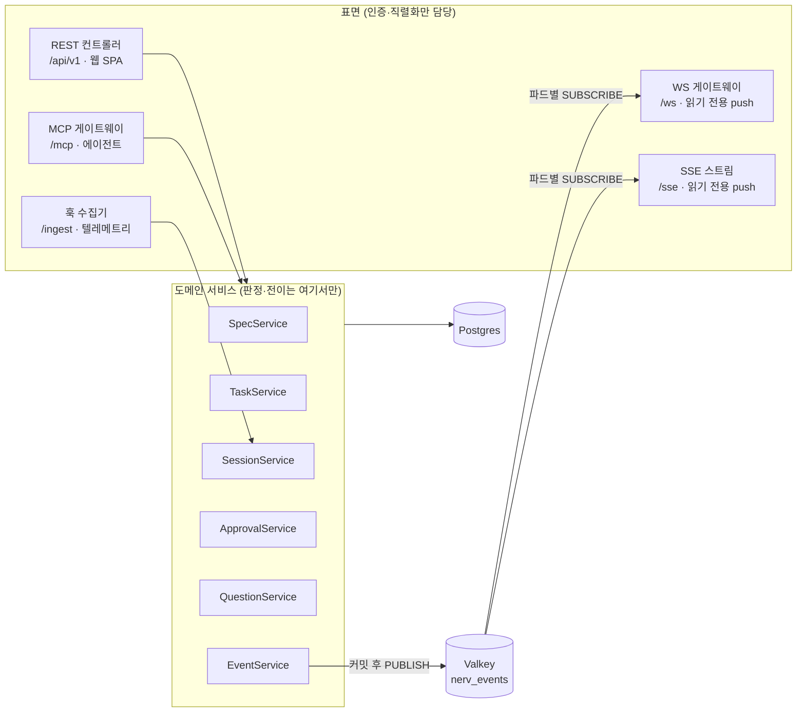

# API 명세

> **요약** — 이 문서는 NERV MVP의 대외 계약 정본이다. REST(`/api/v1`)·MCP(`/mcp`)·WebSocket(`/ws`)·SSE(`/sse`) 네 표면이 **같은 도메인 서비스를 DI로 공유**한다는 구조 결정(D-05)을 엔드포인트 전표와 대응 표로 실물화한다. 공통 규약(인증 2경로·`NERV_*` 에러 코드 재사용·커서 페이지네이션·`Idempotency-Key`), 리소스별 REST 엔드포인트 전표(각 행: 메서드·경로·권한·요청/응답 zod 스키마·발생 이벤트), 실시간 채널 계약 — **WebSocket + SSE 다중 채널**(룸·이벤트 이름은 [스펙 워크플로우와 거버넌스](../03-proposal/spec-workflow.md) §6 정본 인용, 팬아웃 MQ는 Valkey pub/sub), MCP MVP 15종 ↔ 내부 서비스 ↔ REST 대응 표, 그리고 EARS 수용 기준(REQ-API-*)으로 구성된다. 임포트 표면(§2.10 EP-IMP-01~05)은 원본 파일을 읽지 못하는 서버가 **이미 파싱된 결과만 받는** 경로다 — 임포터 CLI가 유일한 정상 호출자이며 규칙 정본은 [4.7 스펙 임포터](importer.md)다. 도구 17종의 입출력·티어·멱등성 정의는 [에이전트 연동 설계](../03-proposal/agent-integration.md) §2가, 필드 의미는 [데이터 모델](../03-proposal/data-model.md)이 정본이며 이 문서는 재정의하지 않는다.
>
> 문서 버전 v0.7 · 2026-08-22 · HTML 판: [api.html](../html/api.html)
>
> v0.7 변경(2026-08-22): §2.2b ③의 임베딩 호출을 **OpenAI 호환 `/v1/embeddings` 제공자 추상화**로 개정 — 제공자는 env 프로필(로컬 TEI / 스테이징 LM Studio / 운영 OpenAI, 정본 [4.2](codebase.md) §5.2a). 파이프라인·degrade 규칙은 불변.
>
> v0.6 변경(2026-08-22 — 하이브리드 검색 MVP 확정, [4.1](scope.md) §2.1): ① **검색 파이프라인 §2.2b 신설** — ID 직행 → 렉시컬(FTS+trgm) + 벡터(pgvector) RRF 병합 → 관계 확장(graph RAG). EP-SPEC-02와 `nerv_spec_search`는 같은 서비스이므로 두 표면이 동시에 이 품질을 얻는다 ② **EP-SPEC-18 관계 조회 신설**(양방향·backlink) + EP-SPEC-03 `include[]`에 `relations` 추가 ③ REQ-API-025~027.
>
> v0.5 변경(2026-08-22 — 구현 착수 검토에서 발견된 공백 보완): ① **스펙 메타 표면 EP-SPEC-15~17 신설**(메타 수정·아카이브·복원 — §2.2). FR-01 "이동·개명에도 ID 불변"의 실행 경로가 없던 결함 해소, MCP `nerv_spec_draft_upsert`와의 메타 필드 계약 정합 규칙 포함 ② **`gate_policy`·`retention` 키 스키마 확정**(§2.1a) ③ **쿼터 시작값 확정**(§1.8) ④ **`spec_relation` 자동 추출 규칙**(§2.2 — 참조 전파(FR-02)가 임포트 없는 프로젝트에서도 동작하기 위한 전제) ⑤ REQ-API-020~024.
>
> v0.4 변경(2026-08-22): **임포트 표면 EP-IMP-01~05 신설**(§2.10) + `import:write` 스코프(§1.3) + `import.applied` 이벤트(§3.3) + REQ-API-017~019 — 임포터 실행 모델이 DB 직결에서 API 클라이언트로 확정된 데 따른 계약 추가([4.7 스펙 임포터](importer.md) §3.2).

---

## 1. 공통 규약

### 1.1 하나의 서비스, 네 개의 표면 (D-05)

NERV API는 표면이 넷이고 판정 코드는 한 벌이다. NestJS(Fastify 어댑터)의 REST 컨트롤러·MCP 게이트웨이·WebSocket 게이트웨이·SSE 컨트롤러가 **같은 도메인 서비스**(SpecService·TaskService·SessionService·ApprovalService·QuestionService·EventService)를 주입받는다. 게이트 판정(스펙 승인 조건, 클레임 겹침, done 전이 조건)이 표면마다 갈라지는 것이 최악의 실패이며, 이 문서의 §4 대응 표가 그 단일화의 증명이다. 모듈 배치의 실물은 [4.2 코드베이스와 배포](codebase.md) §2가 정의한다.



| 표면 | 경로 | 쓰기 | 주 사용자 | 이 문서에서 |
| --- | --- | --- | --- | --- |
| REST | `/api/v1/**` | 있음 | 웹 SPA(S1~S8), 외부 연동 | §2 전표 |
| MCP | `/mcp` (Streamable HTTP 단일 엔드포인트) | 있음 | Claude Code · Codex 세션 | §4 대응 표 — 정의는 [에이전트 연동 설계](../03-proposal/agent-integration.md) §2 |
| WebSocket | `/ws` | **없음** (join 외 클라이언트 emit 없음) | 웹 SPA 실시간 갱신 | §3 계약 |
| SSE | `/sse/**` | **없음** (단방향 스트림) | 브라우저 밖 소비자(CLI·외부 도구) 실시간 구독 | §3.5 계약 |
| 훅 ingest | `/ingest/hooks/*` | Activity·세션 전이만 | Claude/Codex 훅 | §2.9 — 정본은 [에이전트 연동 설계](../03-proposal/agent-integration.md) §3.3 |

### 1.2 base path와 버전

- REST base path는 **`/api/v1`** 이다. 파괴적 변경은 `/api/v1`을 유지한 채 `/api/v2`를 병행 서빙하는 방식으로만 한다.
- SSE는 **`/sse`** 프리픽스를 `/api/v1`과 분리해 쓴다 — 프록시 계층(nginx·Ingress)이 버퍼링 해제·장수명 타임아웃을 경로 단위로 걸어야 하기 때문이다([4.2 코드베이스와 배포](codebase.md) §5.4·§6.3). 파괴적 변경 시 `/sse/v2`를 병행 서빙한다.
- MCP는 `/mcp` 단일 엔드포인트이며 프로토콜 리비전 병행 서빙 규약은 [에이전트 연동 설계](../03-proposal/agent-integration.md) §2.6을 따른다(이 문서는 재정의하지 않는다).
- markdown 미러(`/api/projects/{p}/specs/{id}.md` · `/api/projects/{p}/llms.txt`)는 [시스템 아키텍처](../03-proposal/architecture.md) §2.4의 경로 문자열을 **그대로, 버전 프리픽스 없이** 유지한다 — `llms.txt` 인덱스와 에이전트 로컬 캐시(`.nerv/cache/`)에 링크가 박제되는 경로라 v2 전환에도 불변이어야 한다(§2.8).
- 경로 파라미터: `{proj}` = `project.slug`(예: `clemvion`) — URL·MCP `project` 인자용 소문자 kebab 식별자로 `UNIQUE (org_id, slug)`, 표시 접두 `key`(예: `CLV`)와는 **별개 필드**다([데이터 모델](../03-proposal/data-model.md) §2.1). `{spec}`·`{task}`·`{sid}` = 표시 키 또는 내부 uuid 모두 허용, `{ver}` = SpecVersion uuid, `{no}` = `version_no` 정수. 표시 키 발급 규칙(`<project.key>-<타입>-<base32 6자>`)은 [데이터 모델](../03-proposal/data-model.md) §5.1 정본이고, 본문 예시는 기존 문서의 표기 예시(`SPC-CWC-007`·`TSK-a3f8` 등, [화면 설계](../03-proposal/ui-wireframes.md) §1.4)를 그대로 쓴다.

### 1.3 인증 — 2경로

| 경로 | 자격증명 | 대상 | 규약 |
| --- | --- | --- | --- |
| **웹 세션** | better-auth 세션 쿠키(HttpOnly·SameSite=Lax) | 브라우저 SPA | 로그인·세션 관리는 better-auth 핸들러(`/api/auth/*`)에 위임한다. `/api/v1`·`/ws`는 이 쿠키를 검증만 한다. 조직·멤버십은 better-auth organization 플러그인, 역할 6종(`admin·planner·designer·developer·qa·viewer`)은 `membership.role`이 정본([데이터 모델](../03-proposal/data-model.md) §2.1) |
| **PAT** | `Authorization: Bearer <token>` | 에이전트(MCP)·CI·외부 연동·md 미러 | better-auth api-key 플러그인 기반. 토큰은 **(사용자, 프로젝트, 역할, 스코프)** 튜플에 바인딩되고 권한은 소유 사용자의 부분집합을 넘지 못한다([에이전트 연동 설계](../03-proposal/agent-integration.md) §6.1, D-08). Bearer 헤더 필수, **쿼리스트링 전달 금지**(MCP Authorization 규약 재인용) |

- PAT 원문 형식: `nerv_` 접두 + 32바이트 난수의 base64url. 서버는 해시만 저장하고(`api_token.token_hash`), 식별·감사용으로 앞 8자를 `api_token.prefix`에 남긴다([데이터 모델](../03-proposal/data-model.md) §2.1과 1:1). 원문은 발급 응답(EP-TOK-02)에서 **한 번만** 반환된다.
- 스코프 어휘는 `resource:action` 표기로 [에이전트 연동 설계](../03-proposal/agent-integration.md) §2.3 도구 표의 "필요 권한" 열과 1:1이다(`spec:read` `spec:draft` `spec:meta` `task:claim` `task:update` `review:submit` `review:resolve` `agent-session:launch` …). `spec:approve`와 `approval:decide`는 **토큰에 부여 자체가 불가능한 사람 전용 스코프**다 — 정책이 아니라 시스템 불변식(같은 문서 §6.1 ④).
- **`import:write`는 도구 대응이 없는 유일한 REST 전용 스코프**다(§2.10). MCP 도구 카탈로그에 임포트 도구가 없기 때문이며, admin이 자신에게만 발급할 수 있고 역할 판정(admin)과 AND로 검사된다. 이관 작업이 끝나면 폐기하는 것이 기본 운용이다(EP-TOK-03).
- REST 엔드포인트의 인가는 역할 매트릭스([스펙 워크플로우와 거버넌스](../03-proposal/spec-workflow.md) §1.6)가 정본이다. §2 전표의 "권한" 열은 그 매트릭스의 인용이며, PAT 요청은 역할 판정에 **스코프 검사가 AND로** 추가된다.

### 1.4 에러 포맷과 HTTP 상태 매핑

에러 본문은 [에이전트 연동 설계](../03-proposal/agent-integration.md) §2.7의 구조화된 도구 결과와 **같은 봉투**를 쓴다. 코드 체계도 같은 문서의 `NERV_*` 10종을 재사용하며 REST 전용 코드를 신설하지 않는다.

```json
{
  "ok": false,
  "code": "NERV_CONFLICT_SCOPE",
  "message": "TSK-3f77의 scope가 다른 활성 클레임과 겹칩니다.",
  "details": {
    "conflicting_claim_id": "clm_9c41…",
    "owner": "유나",
    "hostname": "linux-ci-01",
    "overlap": { "spec_ids": ["SPC-CWC-007"], "file_globs": ["codebase/frontend/src/widget/**"] }
  },
  "retry_after_s": null,
  "next_actions": []
}
```

`next_actions`는 MCP 표면에서 채워지는 필드이며 REST 응답에서는 빈 배열을 허용한다. HTTP 상태 매핑:

| `code` | HTTP | REST에서의 대표 상황 |
| --- | --- | --- |
| `NERV_UNAUTHENTICATED` | 401 | 세션 쿠키 없음·만료, PAT 폐기·만료 |
| `NERV_FORBIDDEN` | 403 | 역할 미충족, PAT 스코프 부족, 지시자≠승인자 위반 |
| `NERV_PRECONDITION` | 400 / 409 | 400: zod 스키마 위반(`details.issues`) · 409: `base_version` 불일치, 게이트 전이 조건 미충족, 멱등 키 본문 불일치 |
| `NERV_CONFLICT_SCOPE` | 409 | 클레임 scope 겹침 `block` 판정 |
| `NERV_LEASE_EXPIRED` | 409 | 리스 만료 후 상태 변경 시도 |
| `NERV_DRAFT_LEASED` | 409 | 다른 사용자가 초안 편집 리스 보유 |
| `NERV_APPROVAL_REQUIRED` | 202 | A3 액션이 pending Approval을 만들고 대기 진입(`details.approval_id`) |
| `NERV_HUMAN_ONLY` | 403 | A4 액션 요청 — `details.web_url` 딥링크 포함 |
| `NERV_RATE_LIMIT` | 429 | 쿼터 초과 — `retry_after_s` + `Retry-After` 헤더 병행 |
| `NERV_UNAVAILABLE` | 503 | 의존 구성요소 장애 |

### 1.5 멱등 키 — `Idempotency-Key` 헤더

상태를 바꾸는 모든 REST 요청(POST·PUT·PATCH·DELETE)은 `Idempotency-Key` 헤더를 받는다. MCP의 A2 이상 도구가 받는 `idempotency_key` 입력([에이전트 연동 설계](../03-proposal/agent-integration.md) §2.1 원칙 4)과 **같은 저장소**를 쓴다 — 오프라인 아웃박스가 큐잉한 쓰기가 MCP로 재전송되든 REST로 재전송되든 한 번만 실행된다.

| 규칙 | 내용 |
| --- | --- |
| 저장 | (키, 요청 본문 content hash, 최초 응답)을 **24시간** 보관 |
| 같은 키 + 같은 본문 | 최초 응답을 그대로 재생하고 응답 헤더 `Idempotency-Replayed: true`를 단다 |
| 같은 키 + 다른 본문 | 409 `NERV_PRECONDITION`(`details.kind = "idempotency_mismatch"`) |
| 헤더 생략 | 허용하되 재시도 안전성은 클라이언트 책임. 웹 SPA는 폼 제출·클레임·결정 요청에 항상 부여한다 |

### 1.6 커서 페이지네이션

목록 응답은 전부 커서 방식이다. 오프셋 페이지네이션은 제공하지 않는다.

- 요청: `?cursor=<opaque>&limit=<n>` — `limit` 기본 30·최대 100.
- 응답 봉투: `{ "items": [...], "next_cursor": "<opaque>" | null }`.
- 커서는 (정렬 키, id)를 인코딩한 불투명 문자열이며 클라이언트는 해석하지 않는다. 정렬 기준은 엔드포인트별로 §2 전표에 명시한다(기본: 생성 역순, 이벤트 피드는 `occurred_at DESC`).

### 1.7 요청/응답 표기와 엔드포인트 ID

- §2 전표의 요청·응답 열은 **zod 스키마 이름**이다. 스키마는 `packages/schema`가 export하는 이름과 1:1이며(공유 규칙은 [4.2 코드베이스와 배포](codebase.md) §3), 서버(NestJS 파이프)와 웹(react-hook-form + zod)이 같은 스키마로 검증한다.
- 목록 응답의 `Page<X>`는 §1.6 봉투에 `items: X[]`를 담는 제네릭 표기다.
- 엔드포인트는 안정 ID **`EP-<영역>-<번호>`** 를 갖는다. [4.5 화면 명세](screens.md) 등 다른 문서는 경로 문자열이 아니라 이 ID로 인용한다 — 경로가 바뀌어도 참조가 깨지지 않게 하기 위해서다(D-09와 같은 원리).
- 이벤트 열에서 **★ 표시는 이 문서가 신설하는 이벤트 이름**이다 — `<리소스>.<동사>` 규약([스펙 워크플로우와 거버넌스](../03-proposal/spec-workflow.md) §6.1)을 따르되 같은 문서 §6.3 알림 카탈로그에 없는 이름으로, 전부 알림을 만들지 않는 low/무티어 기록용이다. 무표시 이름은 전부 정본 인용이다.
### 1.8 쿼터 — `NERV_RATE_LIMIT`의 실제 한도

REQ-API-012의 429 응답이 참조하는 한도 값이다. 값은 `@nerv/schema` `constants.ts`가 정본으로 export하고([4.2 코드베이스와 배포](codebase.md) §3.2), 여기 표는 그 인용이다. **전부 시작값이다** — 파일럿 실측(정상 트래픽에서 429 발생)이 재검토 트리거이며, 조정은 상수 변경 한 곳으로 끝난다.

| 주체 | 한도 | 적용 표면 | 비고 |
| --- | --- | --- | --- |
| PAT 토큰당 | **300 req/min** | `/api/v1` + `/mcp`(같은 풀 — 토큰이 주체이므로 표면을 나누지 않는다) | 하트비트 60초 주기·조회 포함 여유값. 초과 시 `retry_after_s` 준수는 스킬 규약([4.6](plugin.md) §2) |
| 웹 세션 사용자당 | **600 req/min** | `/api/v1` | 쿼리 무효화 재조회 버스트([4.5 화면 명세](screens.md) §1.4) 흡수 |
| 세션당 ingest | **120 req/min** | `/ingest/hooks/*` | 훅 폭주(도구 호출 다발) 상한. 초과분은 429 — 훅 수집은 손실 허용(진실은 서버 산출물, D-14) |

- 한도 계산은 고정 창(1분) 기준이며, 응답 헤더 `Retry-After`(초)와 봉투 `details.retry_after_s`를 함께 싣는다(§1.4).
- WS·SSE **연결 수**는 쿼터 대상이 아니다 — 연결 후 이벤트는 서버 발신이므로. 연결 시도 폭주는 인프라 계층(nginx/Ingress) 소관.

---

## 2. 리소스별 엔드포인트 전표

### 2.1 인증·조직·프로젝트·멤버·토큰 (S8)

| ID | 메서드 · 경로 | 권한 | 요청 | 응답 | 발생 이벤트 |
| --- | --- | --- | --- | --- | --- |
| EP-AUTH-01 | `GET /api/v1/me` | 로그인 사용자 | — | `MeResult`(프로필 + 멤버십·역할 목록) | — |
| EP-ORG-01 | `GET /api/v1/orgs` | 로그인 사용자 | — | `Page<OrgSummary>` | — |
| EP-ORG-02 | `GET /api/v1/orgs/{org}` | 조직 멤버 | — | `OrgResult` | — |
| EP-PRJ-01 | `GET /api/v1/orgs/{org}/projects` | 조직 멤버 | — | `Page<ProjectSummary>` | — |
| EP-PRJ-02 | `POST /api/v1/orgs/{org}/projects` | admin | `ProjectCreateInput` | `ProjectResult` | ★`project.created` |
| EP-PRJ-03 | `GET /api/v1/projects/{proj}` | 프로젝트 멤버 | — | `ProjectResult`(게이트 정책 `gate_policy`·보존 `retention`·활성 세션/승인 대기 카운트 포함) | — |
| EP-PRJ-04 | `PATCH /api/v1/projects/{proj}` | admin (게이트 정책·위험도 임계는 admin 전용 — [스펙 워크플로우와 거버넌스](../03-proposal/spec-workflow.md) §1.6 매트릭스) | `ProjectUpdateInput` | `ProjectResult` | ★`project.updated` |
| EP-MBR-01 | `GET /api/v1/orgs/{org}/members` | 조직 멤버 | — | `Page<MemberResult>` | — |
| EP-MBR-02 | `POST /api/v1/orgs/{org}/members` | admin | `MemberAddInput`(user + org/project 스코프 + `role`) | `MemberResult` | ★`member.added` |
| EP-MBR-03 | `PATCH /api/v1/memberships/{id}` | admin | `MemberUpdateInput`(role 변경) | `MemberResult` | ★`member.updated` |
| EP-MBR-04 | `DELETE /api/v1/memberships/{id}` | admin | — | `{ok:true}` | ★`member.removed` |
| EP-TOK-01 | `GET /api/v1/me/tokens` | 본인 | — | `Page<TokenSummary>`(prefix·scopes·last_used_at, 원문 없음) | — |
| EP-TOK-02 | `POST /api/v1/me/tokens` | 본인(역할이 허용하는 스코프의 부분집합만) | `TokenCreateInput`(project, name, scopes[], expires) | `TokenCreateResult`(**원문 1회 반환**) | ★`token.created` |
| EP-TOK-03 | `DELETE /api/v1/me/tokens/{id}` | 본인 또는 admin | — | `{ok:true}`(즉시 폐기, `revoked_at` 기록) | ★`token.revoked` |
| EP-TOK-04 | `GET /api/v1/orgs/{org}/tokens` | admin | `TokenAdminListQuery`(project, user, cursor) | `Page<TokenAdminSummary>`(소유자·prefix·scopes·last_used_at, 원문 없음) — S8 admin의 조직 전체 토큰 표([화면 설계](../03-proposal/ui-wireframes.md) §2.8) 데이터 소스, EP-TOK-03의 admin 폐기와 짝 | — |

#### 2.1a `gate_policy` · `retention` 키 스키마

EP-PRJ-03 응답·EP-PRJ-04 입력의 두 jsonb 필드는 웹 폼(S8 게이트 정책 탭)·API 검증·워커 잡이 **같은 zod 스키마**(`GatePolicySchema` · `RetentionSchema`, `@nerv/schema`)를 쓴다(REQ-CB-006). 의미 정본은 티어 산정이 [스펙 워크플로우와 거버넌스](../03-proposal/spec-workflow.md) §2.4(D-06), fail-open 격상이 [에이전트 연동 설계](../03-proposal/agent-integration.md) §1.3(D-14)이고, 여기서는 **키 이름·타입·기본값**을 확정한다. 알 수 없는 키는 400 `NERV_PRECONDITION`으로 거부한다(관대한 수용은 오타 정책을 조용히 무시하게 된다).

```jsonc
// gate_policy — 전 키 선택(생략 시 기본값). version은 스키마 마이그레이션용
{
  "version": 1,
  "spec_gate": {
    "tier_boundaries": [2, 4, 6],      // 4축 합산 점수의 T1/T2/T3 진입 경계(§2.4 기본: 0~1=T0 · 2~3=T1 · 4~5=T2 · 6+=T3)
    "t1_objection_hours": 24,          // T1 소프트 게이트 이의제기 창
    "dynamic_escalation": true         // 재시도 임계·롤백 이력에 의한 티어 +1 (spec-workflow §2.4 "동적 강화")
  },
  "failopen": {
    "escalate_count": 3,               // 연속 fail-open 판정 격상 임계(D-14)
    "window_hours": 24
  }
}
```

```jsonc
// retention — 워커 retention.job이 읽는다(4.2 §2.2)
{
  "activity_days": 90,                 // Activity 세션 요약 압축 후 파티션 드랍(4.3 §2.14)
  "prompt_blob_ttl_days": 30           // 리뷰 프롬프트 blob TTL — 상수 REVIEW_PROMPT_BLOB_TTL_DAYS의 프로젝트 오버라이드
}
```

S8 게이트 정책 탭의 MVP 편집 항목은 `spec_gate.*` 3키다([4.5 화면 명세](screens.md) §2.8) — `failopen`·`retention`은 표시만 하고 편집은 admin의 API 직접 호출로 남긴다(편집 UI는 Phase 2).

멤버 초대 메일 발송은 Phase 2 알림 채널(메일)과 함께 온다 — MVP의 EP-MBR-02는 기존 사용자 배정만 담당한다([로드맵](../03-proposal/roadmap.md) FR-12 배정과 정합).

### 2.2 스펙·버전·코멘트 (S3)

| ID | 메서드 · 경로 | 권한 | 요청 | 응답 | 발생 이벤트 |
| --- | --- | --- | --- | --- | --- |
| EP-SPEC-01 | `GET /api/v1/projects/{proj}/specs/tree` | 전 역할(`spec:read`) | `SpecTreeQuery`(root, depth, status, include_archived — 기본 false, REQ-API-022) | `SpecTreeResult`(id·title·type·문서 상태·현재 버전) | — |
| EP-SPEC-02 | `GET /api/v1/projects/{proj}/specs/search` | 전 역할 | `SpecSearchQuery`(query, type, status, requirement_id, **references**(이 스펙을 참조하는 문서만), include_archived — 기본 false(REQ-API-022), limit) | `SpecSearchResult`(안정 ID + 앵커 + 스니펫 + 관련도, **`related[]`** 1-hop 관계 확장 그룹, **`degraded?`** — 파이프라인은 §2.2b) | — |
| EP-SPEC-03 | `GET /api/v1/projects/{proj}/specs/{spec}` | 전 역할 | `SpecGetQuery`(`version` 기본 approved 최신 — Task 컨텍스트에서는 기준 버전 지정, `baseline` 이름으로 세트 조회 가능(`version`과 배타), `include[]`: requirements/tasks/comments/**relations**(양방향 요약 — 총계 + 상위 20, 전량·커서는 EP-SPEC-18)) | `SpecGetResult`(+`basis_superseded?` — 요청 버전이 superseded면 최신 approved 번호와 함께 표시) | — |
| EP-SPEC-04 | `GET /api/v1/projects/{proj}/specs/{spec}/versions` | 전 역할 | — | `Page<SpecVersionSummary>` | — |
| EP-SPEC-05 | `GET /api/v1/projects/{proj}/specs/{spec}/versions/{no}` | 전 역할 | — | `SpecVersionResult`(불변 스냅샷 — 같은 `{no}`는 영원히 같은 응답) | — |
| EP-SPEC-06 | `GET /api/v1/projects/{proj}/specs/{spec}/diff` | 전 역할 | `SpecDiffQuery`(from, to) | `SpecDiffResult`(requirement_version 기반 ADDED/MODIFIED/REMOVED/unchanged 델타 + 본문 diff) | — |
| EP-SPEC-07 | `POST /api/v1/projects/{proj}/specs` | planner·admin ●, designer(design)·developer(convention/adr)·qa ○ | `SpecCreateInput`(parent_id, type, title, body_markdown) | `SpecDraftResult`(spec + draft v1) | `spec.draft_created` |
| EP-SPEC-08 | `PUT /api/v1/projects/{proj}/specs/{spec}/draft` | EP-SPEC-07과 동일(`spec:draft`) | `SpecDraftUpsertInput`(body_markdown, **base_version**, change_summary) | `SpecDraftResult`(version, 델타 요약, 검증 경고, `web_url`) | 새 draft 버전 생성 시 `spec.draft_created`, 같은 draft 재저장은 이벤트 없음(리스 갱신만) |
| EP-SPEC-09 | `GET /api/v1/projects/{proj}/spec-versions/{ver}/check` | 전 역할(읽기 전용 셀프서비스) | — | `SpecCheckResult`(5검사기별 warning/block + 앵커 — [스펙 워크플로우와 거버넌스](../03-proposal/spec-workflow.md) §2.1) | — |
| EP-SPEC-10 | `POST /api/v1/projects/{proj}/spec-versions/{ver}/submit` | 작성자 본인 또는 planner | `SpecSubmitInput`(reviewer_hint, note) | `SpecSubmitResult`(approval_id[], 지정 리뷰어·SLA) | `spec.submitted` + `approval.requested` |
| EP-CMT-01 | `GET /api/v1/projects/{proj}/specs/{spec}/comments` | 전 역할 | `CommentListQuery`(status: open/resolved) | `Page<CommentResult>` | — |
| EP-CMT-02 | `POST /api/v1/projects/{proj}/spec-versions/{ver}/comments` | 전 역할(viewer 포함 — [스펙 워크플로우와 거버넌스](../03-proposal/spec-workflow.md) §1.6 "스펙 조회·코멘트") | `CommentCreateInput`(anchor: 헤딩 slug 또는 REQ ref, body_md) | `CommentResult` | `spec.comment_added` |
| EP-CMT-03 | `PATCH /api/v1/projects/{proj}/comments/{id}` | 작성자 본인 | `CommentUpdateInput`(body_md) | `CommentResult` | — |
| EP-CMT-04 | `POST /api/v1/projects/{proj}/comments/{id}/resolve` | `spec:draft` 보유 역할 | `CommentResolveInput`(resolution_note, resolved_in_version_id) | `CommentResult`(open→resolved, 남은 open 수) | ★`comment.resolved` |
| EP-SPEC-11 | `GET /api/v1/projects/{proj}/baselines` | 전 역할(`spec:read`) | `BaselineListQuery`(cursor) | `Page<BaselineSummary>`(name·note·항목 수·created_by·created_at) | — |
| EP-SPEC-12 | `POST /api/v1/projects/{proj}/baselines` | planner·admin — **사람 전용**(PAT 불가, 베이스라인 동결은 거버넌스 행위 — [스펙 워크플로우](../03-proposal/spec-workflow.md) §3.6) | `BaselineCreateInput`(name, note_md, items[]? — 생략 시 스펙별 최신 approved 전체) | `BaselineResult` — approved 아닌 항목 포함 시 409 `NERV_PRECONDITION` | ★`baseline.created` |
| EP-SPEC-13 | `GET /api/v1/projects/{proj}/baselines/{bl}` | 전 역할 | — | `BaselineDetailResult`(항목 전량: spec_id·key·title·핀 버전·현재 최신 approved와의 차이 표시) — 불변, 같은 `{bl}`은 영원히 같은 세트 | — |
| EP-SPEC-14 | `GET /api/v1/projects/{proj}/specs/manifest` | 전 역할(`spec:read`, PAT 허용) | `ManifestQuery`(`as_of?` timestamptz 또는 `baseline?` 이름 — 둘 다 생략 시 현재) | `SpecManifestResult`(spec_id→{version_no, status, approved_at} 전량 — git export `manifest.json`의 API 판, [아키텍처](../03-proposal/architecture.md) §2.4b) | — |
| EP-SPEC-15 | `PATCH /api/v1/projects/{proj}/specs/{spec}` | planner·admin (`spec:meta`) | `SpecMetaUpdateInput`(title?, parent_id?, sort_key?, owner_role? — 전 필드 선택, 최소 1개) | `SpecResult` — parent_id 이동은 사이클(자기 자신·자기 하위로 이동) 시 409 `NERV_PRECONDITION`(`details.kind="tree_cycle"`) | ★`spec.meta_updated`(payload에 변경 필드 목록) |
| EP-SPEC-16 | `POST /api/v1/projects/{proj}/specs/{spec}/archive` | planner·admin (`spec:meta`) | — | `SpecResult`(`archived_at` 세팅) — 미아카이브 하위 노드 또는 활성 클레임이 걸린 파생 Task 존재 시 409 `NERV_PRECONDITION`(`details.kind="archive_blocked"`, 차단 사유 목록) | ★`spec.archived` |
| EP-SPEC-17 | `POST /api/v1/projects/{proj}/specs/{spec}/restore` | planner·admin (`spec:meta`) | — | `SpecResult`(`archived_at` NULL) — 부모가 아카이브 상태면 409(`details.kind="parent_archived"`) | ★`spec.restored` |
| EP-SPEC-18 | `GET /api/v1/projects/{proj}/specs/{spec}/relations` | 전 역할(`spec:read`) | `SpecRelationQuery`(direction: out/in/both 기본 both, kind?, cursor) | `Page<SpecRelationEntry>`(kind·방향·상대 스펙 id/key/title/문서 상태/현재 버전) — **역참조(backlink)가 1급이다**: 수정 전 "누가 나를 참조하나"의 조회 경로, S3 관계 패널([4.5 화면 명세](screens.md) §2.4)과 영향 미리보기의 데이터 소스 | — |

스펙 **승인·거절 엔드포인트는 이 절에 없다.** `in_review → approved/rejected` 전이는 승인함의 결정(EP-APR-03) 한 경로뿐이며, 이는 MCP에 `nerv_spec_approve`가 존재하지 않는 것([에이전트 연동 설계](../03-proposal/agent-integration.md) §2.1 원칙 3)과 같은 설계다. 표면이 달라도 사람 전용 게이트는 하나다.

**메타(트리)와 본문(버전)은 다른 축이다.** `spec` 행의 메타(title·parent_id·sort_key·owner_role)는 버전 이력을 만들지 않고 EP-SPEC-15로만 바뀐다 — FR-01 "문서를 옮기거나 이름을 바꿔도 ID 참조가 깨지지 않는다"의 실행 경로이며, 임포터 수동 확인 큐의 "트리 위치 변경"([4.7 스펙 임포터](importer.md) §3.4)을 사람이 처리하는 수단이다. 스코프 `spec:meta`는 PAT에 부여 가능하지만 대응 MCP 도구는 없다(도구 15종 불변) — 트리 구조는 거버넌스 대상이라 웹(S3 메타 다이얼로그 — [4.5 화면 명세](screens.md) §2.4)이 기본 경로다. 이에 따라 MCP `nerv_spec_draft_upsert`의 `parent_id`·`type`·`title` 입력은 **생성(spec_id 없음)에서만 소비**된다: 기존 spec_id 지정 호출에 현재 값과 다른 메타가 오면 무시하지 않고 409 `NERV_PRECONDITION`(`details.kind="meta_change_not_allowed"`, EP-SPEC-15 안내)을 반환하고, 같은 값이면 통과한다(멱등 재호출 보호). 아카이브(EP-SPEC-16)는 삭제가 아니다 — 행과 버전·관계·이벤트는 전부 남고, 트리(EP-SPEC-01)·검색(EP-SPEC-02)·목록 기본 결과에서 빠질 뿐이다(`?include_archived=true`로 포함).

**`spec_relation`은 본문에서 자동 유도된다(MVP).** draft 저장(EP-SPEC-08 = `nerv_spec_draft_upsert`)이 커밋될 때, 서버는 본문에서 **실존하는 스펙 안정 ID**(`SPC-` 접두 표기 및 NERV 내부 스펙 URL)를 추출해 `spec_relation(kind='references', from=이 spec)` 행 집합을 그 저장 본문 기준으로 동기화한다(추가·제거 모두 — 규칙은 임포터 링크 패스 [4.7](importer.md) §2.4와 동일 코드). `references` 외의 kind(refines·depends_on 등)는 MVP에 편집 경로가 없다 — 임포터 산출 또는 Phase 2. approved 본문은 불변이므로 승인 이후 관계도 안정적이고, 참조 문서 전파(`spec.recheck_requested` — [스펙 워크플로우](../03-proposal/spec-workflow.md) §3.3)는 이 행들의 역방향 조회로 동작한다. **임포트 없는 신규 프로젝트에서도 전파가 살아 있게 하는 것**이 이 규칙의 이유다.

#### 2.2b 검색 파이프라인 — 하이브리드 + 관계 확장 (EP-SPEC-02 = `nerv_spec_search`)

검색의 주 소비자는 사람만이 아니다 — `nerv_spec_search`는 P0 도구 8종에 포함되고 호출 시점이 "컨텍스트 수집·중복 확인"이다. 이 파이프라인의 품질이 곧 에이전트의 스펙 이해·중복 방지(FR-01) 품질이므로 MVP부터 하이브리드로 확정한다(2026-08-22 — [4.1](scope.md) §2.1). 검색 방식은 **서버 내부 판정**이며 표면 계약에 모드 선택 파라미터를 두지 않는다 — 두 표면 어디서 불러도 같은 코드가 같은 순서로 돈다(D-05).

| 단계 | 동작 | 구현 축 |
| --- | --- | --- |
| ① ID 직행 | 질의가 안정 ID 패턴(`SPC-`·`REQ-`·`TSK-` prefix)에 매칭되면 해당 리소스를 최상위 반환 — 전문 검색을 거치지 않는다 | 정확 일치 + prefix |
| ② 렉시컬 | FTS(`simple` — 영문·ID 토큰) + **pg_trgm**(한국어 조사 변형·부분 문자열) 병행. 대상: 제목·본문·requirement EARS 문장 | [4.3](database.md) §2.12 인덱스 |
| ③ 벡터 | 질의를 임베딩 제공자(**OpenAI 호환 `/v1/embeddings`** — env 프로필: 로컬 TEI / 스테이징 LM Studio / 운영 OpenAI, [4.2](codebase.md) §5.2a)로 1회 임베딩 → `spec_chunk_embedding` HNSW cosine top-K(전 프로필 1024차원 고정 — REQ-CB-021). 청크 = 헤딩 앵커 단위라 결과가 곧 앵커 스니펫이다 | [4.3](database.md) §2.15 |
| ④ 병합 랭킹 | ②·③을 **RRF**(Reciprocal Rank Fusion)로 병합 — 점수 정규화 없이 순위만 쓰는 결정적 병합. 문서 상태 부스트(approved > in_review > draft) 후 스펙 단위 그룹핑 | 서비스 계층 |
| ⑤ 관계 확장 (graph RAG) | 상위 결과의 `spec_relation` 1-hop(`references`·`depends_on` 양방향)을 **`related[]` 별도 그룹**으로 병기 — 본 랭킹에 섞지 않는다(관계는 관련성의 근거이지 질의 일치가 아니다). 에이전트는 이 그룹으로 "언급되지 않았지만 걸려 있는 스펙"을 컨텍스트에 넣는다 | `spec_relation`(REQ-API-024가 채운다) |

- **degrade 규칙**: 임베딩 제공자 무응답 시 ③을 건너뛰고 ②만으로 응답하되 `degraded: "lexical-only"`를 표기한다(REQ-API-026). 검색은 조정 경로가 아니므로 fail-open이 맞다(D-14의 정신 — 판정 불가 시 진행 + 관측).
- **지연 목표**: 검색 p95 목표치는 **의도적으로 보류**한다(2026-08-22 결정) — 제공자 프로필·방식에 따른 변동폭이 커서, E06-S06 스파이크의 프로필별 실측 후 수치를 확정해 REQ로 승격한다. 그 전까지 성능 회귀 판단 기준은 스파이크 산출 비교표다.
- **인덱싱 시점**: 검색 인덱스 갱신은 워커 `embedding.job` 비동기다 — 저장 직후 수 초간 벡터 결과에 새 본문이 빠질 수 있고, 렉시컬은 트랜잭션 내 인덱스라 즉시 반영된다. 이 비대칭은 수용한다(스펙 검색은 실시간 조정이 아니다).

초안 편집 리스는 EP-SPEC-08 성공 시 자동 획득·갱신되고(웹 표면), 타 사용자 보유 시 409 `NERV_DRAFT_LEASED`를 반환한다. TTL 30분·자동 인계·해제 조건은 [스펙 워크플로우와 거버넌스](../03-proposal/spec-workflow.md) §1.2 정본을 따른다.

### 2.3 요구사항 (Requirement)

| ID | 메서드 · 경로 | 권한 | 요청 | 응답 | 발생 이벤트 |
| --- | --- | --- | --- | --- | --- |
| EP-REQ-01 | `GET /api/v1/projects/{proj}/requirements` | 전 역할 | `RequirementListQuery`(spec, impl_status, cursor) | `Page<RequirementResult>`(`ref`·`statement_md`·`impl_status`·연결 Task/Evidence 수) | — |
| EP-REQ-02 | `GET /api/v1/projects/{proj}/requirements/{ref}` | 전 역할 | — | `RequirementDetailResult`(버전 이력 + 파생 Task + Evidence) | — |
| EP-REQ-03 | `POST /api/v1/projects/{proj}/requirements/{ref}/evidence` | developer·qa·admin (CI는 PAT) | `EvidenceCreateInput`(kind: code_path/test/pr/commit, locator, repo) | `EvidenceResult` | ★`evidence.added` |

`impl_status`는 파생 값이라 **직접 쓰는 엔드포인트가 없다** — `verified` 전이도 QA의 검증 Evidence 등록(EP-REQ-03, kind=test)이 파생 규칙([스펙 워크플로우와 거버넌스](../03-proposal/spec-workflow.md) §1.3)을 통해 만든다. MVP(P1)의 Evidence는 PR 링크 수집까지이고 커버리지 계산은 P2다([로드맵](../03-proposal/roadmap.md) FR-13).

### 2.4 Task·클레임 (S4)

| ID | 메서드 · 경로 | 권한 | 요청 | 응답 | 발생 이벤트 |
| --- | --- | --- | --- | --- | --- |
| EP-TASK-01 | `GET /api/v1/projects/{proj}/tasks` | 전 역할 | `TaskListQuery`(status[], assignee, spec, priority, cursor) | `Page<TaskSummary>`(보드 컬럼용) | — |
| EP-TASK-02 | `GET /api/v1/projects/{proj}/tasks/next` | task:claim 보유 역할 | `TaskNextQuery`(role, spec_id, limit) | `TaskNextResult`(ready 후보 + **위임 명세 4요소** + 권장 scope) | — |
| EP-TASK-03 | `POST /api/v1/projects/{proj}/tasks` | planner·developer·admin ●, qa ○ | `TaskCreateInput`(title, body_md, source_spec_version_id, source_requirement_id, 위임 명세 4필드, priority) | `TaskResult`(status=backlog) | ★`task.created` |
| EP-TASK-04 | `GET /api/v1/projects/{proj}/tasks/{task}` | 전 역할 | — | `TaskDetailResult`(위임 명세·활성 클레임·의존·Evidence) | — |
| EP-TASK-05 | `PATCH /api/v1/projects/{proj}/tasks/{task}` | planner·developer·admin | `TaskUpdateInput`(위임 명세·priority·의존) | `TaskResult` — 위임 명세 4요소 충족 + 의존 해소 시 서버가 `ready` 승격 | `task.ready`(승격 시) |
| EP-TASK-06 | `POST /api/v1/projects/{proj}/tasks/{task}/claim` | viewer 제외 전 역할(`task:claim`) | `TaskClaimInput`(scope{spec_ids, file_globs}, branch, worktree, lease_seconds) | `TaskClaimResult`(claim_id, lease_expires_at, warnings[]) — 겹침 `block`이면 409 `NERV_CONFLICT_SCOPE` | `task.claimed` / `claim.conflict_warn` / `claim.conflict_blocked` |
| EP-TASK-07 | `POST /api/v1/projects/{proj}/claims/{claim}/heartbeat` | 클레임 보유자 | `HeartbeatInput`(progress, stats{added, removed, files}) | `HeartbeatResult`(새 lease_expires_at + pending 질문 답변·steer/stop 지시) | — (이벤트 없음 — `last_heartbeat_at` 갱신만) |
| EP-TASK-08 | `POST /api/v1/projects/{proj}/claims/{claim}/release` | 클레임 보유자 또는 admin | `ClaimReleaseInput`(reason: done/handoff/abandon, state_note) | `ClaimReleaseResult`(Task 최종 상태 — `claimed → ready` 회수 또는 유지) | ★`claim.released` + `task.ready`(회수 시) |
| EP-TASK-09 | `POST /api/v1/projects/{proj}/tasks/{task}/transition` | 담당자·planner·admin(`task:update`) | `TaskTransitionInput`(status, note, evidence{commit_sha, pr_url, test_ids}, blocked_reason) | `TaskResult` 또는 409(게이트 거부 사유 — FR-10) | `task.blocked` · `task.done` · 기타 전이는 ★`task.updated`(payload에 from/to) |

클레임의 원자성·겹침 판정 알고리즘·`severity_of` 규칙은 [스펙 워크플로우와 거버넌스](../03-proposal/spec-workflow.md) §4.4가 정본이다. `done` 전이는 같은 문서 §4.6의 6조건 판정이며, **MVP(P1)에서는 리뷰 커버리지 조건(1~3)을 제외한 조건(4 Evidence·5 `spec_impact` 선언·6 테스트 증적)만 검사**한다([로드맵](../03-proposal/roadmap.md) FR-10 — 리뷰 커버리지는 P2). 리스 상수는 TTL 30분·하트비트 60초([스펙 워크플로우와 거버넌스](../03-proposal/spec-workflow.md) §4.5).

클레임 요청/응답 예시(예시 데이터는 기존 문서와 동일한 한 벌):

```json
// POST /api/v1/projects/clemvion/tasks/TSK-a3f8/claim   (도현 · mac-02)
{
  "scope": { "spec_ids": ["SPC-CWC-007"], "file_globs": ["codebase/frontend/src/widget/**"] },
  "branch": "claude/widget-render",
  "lease_seconds": 1800
}
// 200 — 겹침 warn 통과 (양쪽 세션에 claim.conflict_warn 알림)
{
  "ok": true,
  "claim_id": "clm_2e9d…",
  "lease_expires_at": "2026-08-20T05:42:11Z",
  "warnings": [
    { "session": "S-2d04", "user": "유나", "hostname": "linux-ci-01",
      "task": "TSK-b904", "specs": ["SPC-CWC-007"], "files": [], "severity": "warn" }
  ]
}
```

### 2.5 세션·Activity (S5)

| ID | 메서드 · 경로 | 권한 | 요청 | 응답 | 발생 이벤트 |
| --- | --- | --- | --- | --- | --- |
| EP-SES-01 | `GET /api/v1/projects/{proj}/sessions` | 전 역할 | `SessionListQuery`(state[], user, cursor) | `Page<SessionSummary>`(user·hostname·agent_type·state·현재 Task·diff·last_heartbeat — [데이터 모델](../03-proposal/data-model.md) §4.2 질의) | — |
| EP-SES-02 | `GET /api/v1/projects/{proj}/sessions/{sid}` | 전 역할 | — | `SessionDetailResult`(실행 컨텍스트·클레임 이력·토큰 사용량) | — |
| EP-SES-03 | `GET /api/v1/projects/{proj}/sessions/{sid}/activities` | 전 역할 | `ActivityListQuery`(cursor, type[]) | `Page<ActivityResult>`(seq 순 타임라인, `thought/action/elicitation/response/error`) | — |
| EP-SES-04 | `POST /api/v1/projects/{proj}/sessions/{sid}/steer` | 세션 소유자·admin | `SessionSteerInput`(kind: steer/stop, message) | `{ok:true}` — steer: 지시는 다음 하트비트 응답의 `pending`으로 전달([에이전트 연동 설계](../03-proposal/agent-integration.md) §2.4 역채널). stop: 지시 전달과 별개로 서버가 **즉시** 활성 클레임을 회수하고 Task를 `claimed/in_progress → ready`로 되돌린다([화면 설계](../03-proposal/ui-wireframes.md) §4.2) | ★`session.steered` · stop 시 ★`claim.released` + `task.ready` |

세션의 생성·상태 전이는 REST가 아니라 훅 ingest(§2.9)와 MCP `nerv_bootstrap`이 만든다. REST 표면은 조회와 steer만 갖는다 — 세션은 에이전트의 실행 사실이지 웹에서 만드는 리소스가 아니기 때문이다.

### 2.6 승인함·질문 (S7)

| ID | 메서드 · 경로 | 권한 | 요청 | 응답 | 발생 이벤트 |
| --- | --- | --- | --- | --- | --- |
| EP-APR-01 | `GET /api/v1/approvals` | 로그인 사용자(본인 관련만) | `ApprovalListQuery`(state: pending/decided/expired, project, subject_type, subject_id, cursor) | `Page<ApprovalCard>`(대상 원문 델타·영향 분석 포함 — [스펙 워크플로우와 거버넌스](../03-proposal/spec-workflow.md) §6.4 카드 3유형) | — |
| EP-APR-02 | `GET /api/v1/approvals/{id}` | 관련자 | — | `ApprovalDetailResult` | — |
| EP-APR-03 | `POST /api/v1/approvals/{id}/decision` | 지정 승인자·해당 역할 큐 — **사람 전용**, 지시자≠승인자 판정([스펙 워크플로우와 거버넌스](../03-proposal/spec-workflow.md) §2.3 5규칙) | `ApprovalDecisionInput`(decision: approve/reject/comment, comment_md) | `ApprovalResult` | 대상이 spec_version이면 `spec.approved`(+이전 버전 `spec.superseded`) / `spec.rejected` · 대상이 question이면 ★`question.answered` |
| EP-APR-04 | `POST /api/v1/projects/{proj}/gates/bypass` | admin ●, planner(스펙 계열)·developer(코드 계열) ○ | `GateBypassInput`(대상, 사유, 유효 시간) | `ApprovalResult`(is_bypass=true) | `gate.bypassed` |
| EP-QST-01 | `GET /api/v1/projects/{proj}/questions` | 전 역할 | `QuestionListQuery`(status: open/answered, cursor) | `Page<QuestionResult>`(선택지·대기 세션·경과) | — |
| EP-QST-02 | `POST /api/v1/projects/{proj}/questions/{id}/answer` | 대상 역할 또는 지정자 — 사람 전용 | `QuestionAnswerInput`(answer_key 또는 answer_md) | `QuestionResult`(status=answered) — 내부적으로 ApprovalService.decide(subject=question) 한 경로 | ★`question.answered` |

승인 유효성 판정(자기 승인 거부·에이전트 영구 불가·content hash 불일치 = stale 승인 거부)과 SLA·리마인더·만료는 [스펙 워크플로우와 거버넌스](../03-proposal/spec-workflow.md) §2.3·§2.6 정본을 서버가 그대로 집행한다. MVP 승인함 카드는 스펙 승인·플랜·질문 3유형이고 CR·에스컬레이션 카드는 P2다([로드맵](../03-proposal/roadmap.md) FR-11).

### 2.7 이벤트 피드·알림·커버리지

| ID | 메서드 · 경로 | 권한 | 요청 | 응답 | 발생 이벤트 |
| --- | --- | --- | --- | --- | --- |
| EP-EVT-01 | `GET /api/v1/projects/{proj}/events` | 전 역할(`audit:read`는 조직 전역 감사 조회에만 요구) | `EventListQuery`(since, type[], subject_type, subject_id, cursor) — `occurred_at DESC` | `Page<EventResult>`(actor{user, session, is_agent}·from/to state·payload — [데이터 모델](../03-proposal/data-model.md) §2.9) | — |
| EP-NTF-01 | `GET /api/v1/me/notifications` | 본인 | `NotificationListQuery`(state: unread/read, cursor) | `Page<NotificationResult>` | — |
| EP-NTF-02 | `POST /api/v1/me/notifications/{id}/read` | 본인 | — | `{ok:true}` | — |
| EP-COV-01 | `GET /api/v1/projects/{proj}/coverage` | 전 역할 | `CoverageQuery`(spec) | `CoverageResult`(스펙별 구현/검증 커버리지·증적 결손·빈 약속 — [스펙 워크플로우와 거버넌스](../03-proposal/spec-workflow.md) §5.5 산식) | — |

EP-COV-01은 **계약 선점**이다 — 커버리지 계산은 P2([로드맵](../03-proposal/roadmap.md) FR-13)이므로 MVP 응답에서는 커버리지 수치 필드가 `null`일 수 있고, Requirement·Evidence 개수 같은 원자료 필드만 채워진다. S2가 게이지를 그릴 때 `null`은 "집계 준비 중"으로 렌더한다.

### 2.8 markdown 미러 (아키텍처 §2.4 인용)

경로·응답 형태는 [시스템 아키텍처](../03-proposal/architecture.md) §2.4(a)가 정본이다. 버전 프리픽스를 붙이지 않는 이유는 §1.2에 있다.

| ID | 메서드 · 경로 | 권한 | 응답 |
| --- | --- | --- | --- |
| EP-MIR-01 | `GET /api/projects/{p}/specs/{id}.md?version=approved` | `spec:read`(PAT 허용 — 에이전트 공용 읽기 경로) | `text/markdown` — 기본은 최신 approved SpecVersion, `?version=42`로 특정 스냅샷. frontmatter에 안정 ID·버전·문서 상태·승인자·요구사항 ID 목록 |
| EP-MIR-02 | `GET /api/projects/{p}/llms.txt` | `spec:read` | `text/plain` — 스펙 트리 인덱스(제목 + `.md` 링크 + 한 줄 설명, llms.txt v2 형식) |

응답 frontmatter 예시(필드 의미는 아키텍처 §2.4 그대로):

```markdown
---
nerv_id: SPC-CWC-007
version: 4
status: approved
approved_by: 지민
requirements: [REQ-CWC-031, REQ-CWC-032]
---
# 임베드 위젯
…
```

### 2.9 훅 ingest (참조)

훅 수집 엔드포인트 5종(`POST /ingest/hooks/session` · `/tool` · `/subagent` · `/stop` · `/session-end`)의 경로·헤더(`Authorization` Bearer, `X-NERV-Project`, `X-NERV-Host`)·응답 의미론(`additionalContext` 주입, `{"decision":"block"}` 종료 차단)은 [에이전트 연동 설계](../03-proposal/agent-integration.md) §3.3이 정본이고, 훅 페이로드 실물은 [4.6 플러그인과 온보딩](plugin.md)이 다룬다. 이 문서에서는 두 가지만 못 박는다: ① ingest는 **인증 필수**다 — 토큰 없는 이벤트는 버린다(같은 문서 §6.5). ② ingest 컨트롤러는 REST·MCP와 같은 `SessionService`를 주입받아 세션 전이·Activity 적재를 수행한다(§4 표).

### 2.10 임포트 (EP-IMP — [4.7 스펙 임포터](importer.md) §3.2)

**이 표면이 존재하는 이유**: 운영 환경의 서버는 임포트 대상 저장소의 체크아웃에 접근할 수 없다. 파일을 읽는 쪽은 파일이 있는 장비(임포터 CLI)이고, 서버는 **이미 파싱된 결과**를 받아 도메인 서비스로 적재한다. 파싱 규칙·프로파일·리포트는 전부 클라이언트 것이며 서버는 프로파일 이름만 기록한다.

- **권한**: 전 행 admin **AND** PAT 스코프 `import:write`(§1.3). 세션 쿠키로도 호출 가능하지만 정상 호출자는 CLI다.
- **소급 적재의 성질**: 이 경로만 워크플로 전이 검사를 우회한다(`approved` 버전·`done` Task를 승인·게이트 없이 생성). 스키마 제약(approved 본문 불변 트리거·`UNIQUE (project_id, ref)`·partial unique)은 예외 없이 그대로 적용된다 — 위반은 그 **항목**의 실패이고 배치 전체를 되돌리지 않는다.
- **트랜잭션 단위**: 배치는 전송 단위일 뿐이다. `import/specs`의 `kind=document`는 **파일 1건 = 트랜잭션 1건**, `kind=structure`와 `import/links`는 배치 1건이 트랜잭션 1건이다(임포터 §3.5).
- **멱등**: 전 행 `Idempotency-Key` 필수(§1.5). 같은 키 재전송은 최초 응답 재생이며 레코드를 다시 만들지 않는다.

| ID | 메서드 · 경로 | 권한 | 요청(zod) | 응답(zod) | 발생 이벤트 |
| --- | --- | --- | --- | --- | --- |
| EP-IMP-01 | `POST /api/v1/projects/{proj}/import/preflight` | admin + `import:write` | `ImportPreflightInput`(profile, root_commit?, kind: spec/plan, items[]{source_path, natural_key, content_hash}) | `ImportPreflightResult`(항목별 `state`: `new`/`unchanged`/`changed`/`conflict` + 기존 `spec_id`·`version_no`) — 쓰기 0 | — |
| EP-IMP-02 | `POST /api/v1/projects/{proj}/import/specs` | admin + `import:write` | `ImportSpecBatchInput`(profile, kind: structure/document, items[]{source_path, key, parent_key?, type, title, body_md, doc_status, requirements[]{ref, text, priority?, impl_status}, evidence[]}) | `ImportBatchResult`(항목별 `ok`/`error{code, details}` + 생성 `spec_id`·`spec_version_id`·`requirement` ref→UUID 맵) | ★`import.applied` |
| EP-IMP-03 | `POST /api/v1/projects/{proj}/import/tasks` | admin + `import:write` | `ImportTaskBatchInput`(profile, items[]{source_path, title, body_md, status, assignee_user_id?, source_spec_key?, depends_on[]}) — `ready` 상태와 위임 명세 4요소는 받지 않는다(임포터 REQ-IMP-009) | `ImportBatchResult` | ★`import.applied` |
| EP-IMP-04 | `POST /api/v1/projects/{proj}/import/links` | admin + `import:write` | `ImportLinkBatchInput`(profile, relations[]{from_key, to_key, kind}, pending[]{requirement_ref, task_source_path}) | `ImportBatchResult` — 해소 실패는 오류가 아니라 항목별 `skipped` | ★`import.applied` |
| EP-IMP-05 | `GET /api/v1/projects/{proj}/import/map` | admin + `import:write` | `ImportMapQuery`(kind?, cursor) | `Page<ImportMapEntry>`(자연 키 → `spec_id`/`task_id`/`requirement` UUID + `content_hash` + `version_no`) — `nerv import rebuild-map`의 소스 | — |

`import.applied` 이벤트는 배치당 1건이며 payload에 프로파일 이름·`root_commit`·처리 건수(ok/error/skipped)를 담는다. **알림은 만들지 않는다**(§3.3 표) — 감사(FR-16)와 화면 갱신용이다.

> **이 표면이 하지 않는 것**: 원본 파일 접근, 프로파일 해석, 리포트 생성, 매니페스트 보관. 전부 클라이언트 책임이다. 서버는 "무엇을 적재하라"는 이미 판정된 입력만 받는다 — 그래서 이 표면에는 파일 업로드도, git 자격증명도 없다.

---

## 3. 실시간 채널 계약 — WebSocket + SSE

실시간 채널은 **다중 채널**이다(2026-08-21 확정 — [4.1 MVP 범위와 스택 확정](scope.md) §2). 두 채널은 같은 이벤트 봉투(§3.3)를 같은 방송 버스(Valkey `nerv_events`)에서 받아 흘린다 — 차이는 대상·방향·인증뿐이다.

| 채널 | 경로 | 대상 | 방향 | 인증 |
| --- | --- | --- | --- | --- |
| WebSocket | `/ws` | 웹 SPA | 양방향(단, 클라이언트 emit은 `join`·`leave`뿐) | better-auth 세션 쿠키 |
| SSE | `/sse/**` | 브라우저 밖 소비자 — CLI·외부 도구·연동 스크립트 | 단방향(서버→클라이언트) | 세션 쿠키 **또는** PAT Bearer |

### 3.1 WebSocket — 핸드셰이크와 인증

- 엔드포인트: `wss://<host>/ws` — NestJS `@WebSocketGateway`(socket.io 어댑터).
- **전송은 websocket만 활성**한다(폴링 폴백 off). 폴백이 없으므로 k8s 스티키 세션이 필요 없다 — 스택 확정 사항([4.1 MVP 범위와 스택 확정](scope.md) §2).
- 인증은 핸드셰이크 시점의 better-auth 세션 쿠키 검증이다. 웹 SPA 전용 표면이며 PAT 접속은 지원하지 않는다 — 브라우저 밖 소비자는 SSE 채널(§3.5)을 쓴다. 에이전트의 서버→세션 지시 채널은 여전히 하트비트 응답이 정본이다([에이전트 연동 설계](../03-proposal/agent-integration.md) §2.4).
- 인증 실패 시 socket.io `connect_error`에 `{code: "NERV_UNAUTHENTICATED"}`를 실어 즉시 끊는다.

### 3.2 룸 join 규약

| 룸 | join | 검사 | 용도 |
| --- | --- | --- | --- |
| `user:{id}` | 연결 성공 시 서버가 **자동 join** | 본인 여부 | 승인 요청·질문·알림 배지 등 개인 대상 이벤트 |
| `project:{id}` | 클라이언트가 `join` emit: `{room: "project:{id}"}` | **멤버십 검사** — 비멤버는 ack `{ok:false, code:"NERV_FORBIDDEN"}` | 프로젝트 화면(S2~S5·S7)의 실시간 갱신 |

- 클라이언트 emit은 `join`·`leave` 두 개뿐이다. 상태를 바꾸는 emit은 존재하지 않는다 — 쓰기는 REST/MCP로만.
- 프로젝트 화면을 떠나면 `leave`를 보낸다. 서버는 연결당 join 가능한 project 룸을 8개로 제한한다(초과 시 `{ok:false, code:"NERV_RATE_LIMIT"}`).

### 3.3 서버 → 클라이언트 이벤트

팬아웃 경로는 단일하다: 도메인 서비스가 상태 전이와 같은 트랜잭션으로 `event` 행을 남기면, EventService가 커밋 직후 Valkey `nerv_events` 채널로 PUBLISH하고(채널·페이로드 규약은 [4.3 데이터베이스 스키마](database.md) §3 정본), 각 파드는 SUBSCRIBE로 받은 봉투를 자기에게 붙은 소켓의 해당 룸과 SSE 스트림에만 emit한다. 크로스파드 socket.io 어댑터는 없다 — 모든 emit의 원천이 Valkey 방송이기 때문이다.

이벤트 이름은 socket.io 이벤트 이름으로 **Event `type` 문자열을 그대로** 쓴다 — `<리소스>.<동사>` 규약과 카탈로그는 [스펙 워크플로우와 거버넌스](../03-proposal/spec-workflow.md) §6이 정본이다. 페이로드는 최소 봉투이며 본문 데이터를 싣지 않는다(수신 즉시 해당 Query를 재조회한다 — §3.4). 아래 표의 **룸 열은 SSE에 그대로 대응**된다 — `project:{id}` 룸 = `GET /sse/projects/{proj}`, `user:{id}` 룸 = `GET /sse/me`(§3.5).

```json
// socket.on("spec.approved", handler) 로 수신
{
  "id": "01991f2a-…",
  "type": "spec.approved",
  "project_id": "…",
  "subject_type": "spec_version",
  "subject_id": "…",
  "subject_key": "SPC-CWC-007",
  "occurred_at": "2026-08-20T05:30:00Z"
}
```

| 이벤트(정본) | 발생 지점 | 룸 | MVP |
| --- | --- | --- | --- |
| `spec.draft_created` · `spec.submitted` · `spec.rejected` · `spec.approved` · `spec.superseded` · `spec.deprecated` | 문서 축 전이([스펙 워크플로우와 거버넌스](../03-proposal/spec-workflow.md) §1.2) | `project:{id}` | P1 |
| `spec.comment_added` | EP-CMT-02 | `project:{id}` | P1 |
| ★`spec.meta_updated` · ★`spec.archived` · ★`spec.restored` | EP-SPEC-15~17(§2.2) | `project:{id}` | P1 |
| ★`comment.resolved` | EP-CMT-04 | `project:{id}` | P1 |
| `task.ready` · `task.claimed` · `task.blocked` · `task.done` | Task 축 전이(§1.4·§6.3) | `project:{id}` | P0~P1 |
| `task.rebrief_required` | 기준 SpecVersion superseded — 재브리핑 플래그 세팅([스펙 워크플로우](../03-proposal/spec-workflow.md) §3.3) | `project:{id}` + 담당자·클레임 세션 소유자 `user:{id}` | P1 |
| `spec.recheck_requested` | 참조 문서 전파 — 참조하는 스펙의 새 버전 승인(같은 문서 §3.3) | `project:{id}` + 대상 문서 owner `user:{id}` | P1 |
| ★`task.created` · ★`task.updated` | EP-TASK-03·09 | `project:{id}` | P1 |
| ★`baseline.created` | EP-SPEC-12 | `project:{id}` | P1 |
| `claim.conflict_warn` · `claim.conflict_blocked` | 클레임 겹침 판정(§4.4) | `project:{id}` + 양쪽 세션 소유자 `user:{id}` | P0 |
| ★`claim.released` | EP-TASK-08·EP-SES-04(stop)·리스 만료 회수 | `project:{id}` | P0 |
| `session.started` · `session.stale` · `session.complete` | 세션 수명주기(§6.3, D-13) | `project:{id}` + 소유자 `user:{id}`(stale) | P0 |
| ★`session.steered` | EP-SES-04 | `project:{id}` | P1 |
| `approval.requested` | EP-SPEC-10·플랜 승인·BYPASS 요청 | 지정 승인자 `user:{id}` + `project:{id}` | P1 |
| `question.created` | MCP `nerv_question_create` | 대상 역할/지정자 `user:{id}` + `project:{id}` | P1 |
| ★`question.answered` | EP-APR-03·EP-QST-02 | 요청 세션 소유자 `user:{id}` + `project:{id}` | P1 |
| `gate.bypassed` | EP-APR-04 | admin `user:{id}` + `project:{id}` | P1 |
| `gate.failopen` | 게이트 판정 불가(D-14, [에이전트 연동 설계](../03-proposal/agent-integration.md) §1.3) | `project:{id}` | P1 |
| ★`import.applied` | EP-IMP-02·03·04 배치 적재(§2.10) | `project:{id}` | P0 |
| ★`notification.created` | 알림 파생(배지 카운트 갱신용) | `user:{id}` | P1 |
| `finding.opened` · `finding.resolved` · `cr.opened` | 리뷰·CR — **Phase 2**(S6·review 도구 2종과 함께) | `project:{id}` | P2 |

### 3.4 재연결·무효화·keep-alive (WS·SSE 공통)

- **이벤트 재전송(replay)은 없다.** 끊겼다 재연결한 클라이언트는 밀린 이벤트를 받지 못하며, 받으려 해서도 안 된다 — 재연결 성공 시 클라이언트는 **화면의 활성 Query를 전부 재조회**한다(웹 SPA는 TanStack Query invalidate). SSE의 `Last-Event-ID` 재개도 같은 이유로 지원하지 않는다(§3.5). 이벤트 유실은 허용되고 진실은 DB다(D-14).
- 정상 수신 시의 이벤트→Query 무효화 매핑(어떤 이벤트가 어떤 화면 Query 키를 무효화하는가)은 [4.5 화면 명세](screens.md)가 화면별로 정의한다. 이 문서의 계약은 "봉투에는 재조회에 필요한 식별자만 있다"까지다.
- keep-alive — WS는 socket.io 기본 ping(주기 25초·타임아웃 20초)을 그대로 쓰고, SSE는 25초 주기의 코멘트 라인(`: ping`)을 송신한다. **에이전트 하트비트 60초와는 무관하다** — 그것은 MCP 클레임 리스 규약이다.
- 서버 재기동·배포 시 클라이언트는 재접속하고(WS는 socket.io 기본 백오프, SSE는 `EventSource` 기본 재시도 또는 클라이언트 백오프), 위 재조회 규칙이 정합성을 복구한다. 연결 상태는 앱 셸의 실시간 연결 배너가 표시한다([4.5 화면 명세](screens.md)).

### 3.5 SSE 계약

브라우저 밖 소비자를 위한 단방향 구독 채널이다(2026-08-21 확정 — WebSocket 단일 채널의 재검토 트리거 "브라우저 밖 소비자가 실시간 구독을 원할 때"가 점화됐다). 표면은 EventModule의 `sse.controller.ts`가 소유한다([4.2 코드베이스와 배포](codebase.md) §2.2).

| ID | 메서드 · 경로 | 권한 | 응답 |
| --- | --- | --- | --- |
| EP-SSE-01 | `GET /sse/projects/{proj}` | 프로젝트 멤버(세션 쿠키) 또는 해당 프로젝트에 바인딩된 PAT | `text/event-stream` — `project:{id}` 룸과 동일한 이벤트 흐름(§3.3 표) |
| EP-SSE-02 | `GET /sse/me` | 본인(세션 쿠키) 또는 PAT(소유 사용자 기준) | `text/event-stream` — `user:{id}` 룸과 동일한 이벤트 흐름 |

- **이벤트 형식**: 메시지마다 `event:` = Event `type`(예: `spec.approved`), `id:` = event id, `data:` = §3.3의 최소 봉투 JSON. 본문 데이터는 싣지 않는다 — 상세는 수신자가 자기 권한으로 REST/MCP 재조회한다.
- **PAT 검사**: 프로젝트 바인딩만 검사한다 — 봉투에는 식별자만 흐르므로 스코프별 필터링은 두지 않고, 상세 조회 시점의 권한 검사가 최종 방어선이다. 타 프로젝트 PAT는 403(`NERV_FORBIDDEN`)으로 스트림을 열지 않는다.
- **replay 없음**: `Last-Event-ID` 헤더는 무시한다(D-14 — §3.4). `id:` 필드는 클라이언트 측 중복 제거용 참조일 뿐이다.
- **keep-alive**: 25초 주기 코멘트 라인(`: ping`). 프록시 계층의 버퍼링 해제·타임아웃은 [4.2 코드베이스와 배포](codebase.md) §5.4(nginx)·§6.3(Ingress)이 정본이다.
- **연결 상한**: 사용자당 동시 SSE 연결 8개(WS의 project 룸 8개 제한과 같은 값). 초과 시 429 `NERV_RATE_LIMIT`.

---

## 4. MCP 15종 ↔ 내부 서비스 ↔ REST 대응

MVP 도구는 15종(P0 8종 + P1 7종)이다 — 카탈로그 17종 중 `nerv_review_submit`·`nerv_finding_resolve` 2종은 P2([4.1 MVP 범위와 스택 확정](scope.md)). 각 도구의 입력·출력·티어·멱등성은 [에이전트 연동 설계](../03-proposal/agent-integration.md) §2.3이 정본이고, 이 표는 **같은 서비스 메서드가 REST와 MCP 양쪽에 주입되는 지점**만 밝힌다. 게이트 판정·전이 규칙이 서비스 계층에 있으므로, 어느 표면으로 호출하든 판정은 한 번 작성된 코드가 내린다.

임포트 표면(§2.10)은 이 표에 없다 — **대응하는 MCP 도구가 없기 때문**이다. 임포트는 전수 계정·멱등 검증이 재현돼야 하는 결정적 ETL이라 도구 호출 단위로 쪼개지 않는다([4.7 스펙 임포터](importer.md) §3.6). 에이전트가 관여하는 지점은 도구가 아니라 CLI를 감싸는 스킬 `/nerv:import`다.

| MCP 도구 | 티어 | 내부 서비스 메서드 | REST 대응 | 비고 |
| --- | --- | --- | --- | --- |
| `nerv_bootstrap` | A1 | `SessionService.bootstrap` | — (MCP 전용. 부분 대응: EP-SES-02 + EP-PRJ-03) | 세션 등록 + 컨텍스트 팩. 훅 ingest와 같은 서비스가 세션 상태를 관리 |
| `nerv_spec_tree` | A1 | `SpecService.tree` | EP-SPEC-01 | |
| `nerv_spec_search` | A1 | `SpecService.search` | EP-SPEC-02 | 하이브리드 파이프라인 §2.2b — 두 표면 동일. `related[]`(관계 확장)·`degraded` 표기 포함(정의 정본 [3.4](../03-proposal/agent-integration.md) §2.3, 2026-08-22 갱신) |
| `nerv_spec_get` | A1 | `SpecService.get` | EP-SPEC-03 | 본문은 비신뢰 래핑([에이전트 연동 설계](../03-proposal/agent-integration.md) §6.3) — MCP 표면에서만. `version`/`baseline` 인자와 `basis_superseded` 표시는 두 표면 동일(기준 버전 규약 — 같은 문서 §2.4) |
| `nerv_task_next` | A1 | `TaskService.next` | EP-TASK-02 | ready 큐 질의는 [데이터 모델](../03-proposal/data-model.md) §4.5. 응답에 기준 SpecVersion·베이스라인 포함(기준 버전 규약) |
| `nerv_task_claim` | A2 | `TaskService.claim` | EP-TASK-06 | 겹침 판정·원자 전환이 이 메서드 안 — 표면 무관 동일 |
| `nerv_task_heartbeat` | A1 | `TaskService.heartbeat` | EP-TASK-07 | 응답의 `pending` 역채널 포함 |
| `nerv_task_release` | A2 | `TaskService.release` | EP-TASK-08 | |
| `nerv_spec_draft_upsert` | A2 | `SpecService.draftUpsert` | EP-SPEC-07·08 | `base_version` 409·초안 편집 리스가 이 메서드 안. 메타 필드(parent_id·type·title)는 생성에서만 소비 — 기존 spec에 다른 값이 오면 409(§2.2). 메타 수정은 EP-SPEC-15 전용(도구 없음) |
| `nerv_spec_submit_review` | **A3** | `SpecService.submitReview` → `ApprovalService.request` | EP-SPEC-10 | pending Approval 재사용(카드 중복 금지) — 표면 무관 |
| `nerv_spec_check` | A1 | `SpecService.check` | EP-SPEC-09 | 5검사기 서비스 호출 |
| `nerv_spec_comment_resolve` | A2 | `SpecService.resolveComment` | EP-CMT-04 | |
| `nerv_task_update` | A2(정책상 done은 A3) | `TaskService.transition` | EP-TASK-09 | done 게이트 판정 단일 지점 |
| `nerv_question_create` | A2 | `QuestionService.create` | — (질문 생성은 에이전트 전용. 사람의 답변이 EP-QST-02) | 멱등 재호출 = 폴링 규약은 MCP 표면 정의 |
| `nerv_session_event` | A1 | `SessionService.appendActivity` | — (훅 ingest §2.9와 같은 메서드) | 훅 없는 실행 환경 폴백 |

**사람 전용 액션은 어느 표면에도 도구가 없다.** `spec:approve`·`approval:decide`는 REST에서도 승인함 결정(EP-APR-03) 하나뿐이고 MCP 카탈로그에는 처음부터 존재하지 않는다. A4 액션을 MCP로 요청하면 `NERV_HUMAN_ONLY`와 웹 딥링크가 돌아온다([에이전트 연동 설계](../03-proposal/agent-integration.md) §2.2).

---

## 5. 수용 기준 (REQ-API-*)

행동 요구는 EARS로 쓴다. 각 항목은 통합 테스트 1개 이상으로 검증한다(테스트 배치는 [4.2 코드베이스와 배포](codebase.md) §4).

| ID | 수용 기준 (EARS) | 검증 |
| --- | --- | --- |
| REQ-API-001 | WHEN 자격증명이 없거나 만료된 요청이 오면 THE SYSTEM SHALL HTTP 401과 `code: "NERV_UNAUTHENTICATED"` 봉투를 반환한다 | 쿠키 없음·만료 PAT·폐기 PAT 3케이스 |
| REQ-API-002 | WHEN 인증은 유효하나 역할 또는 PAT 스코프가 부족하면 THE SYSTEM SHALL HTTP 403과 `code: "NERV_FORBIDDEN"`을 반환하고, 부족한 스코프 이름을 `details`에 명시하되 권한 확대 경로는 제공하지 않는다 | viewer의 draft 쓰기, `spec:draft` 없는 PAT의 EP-SPEC-08 |
| REQ-API-003 | WHEN 같은 `Idempotency-Key`와 같은 본문으로 24시간 내 재호출되면 THE SYSTEM SHALL 부작용 없이 최초 응답을 재생하고 `Idempotency-Replayed: true` 헤더를 단다 | EP-TASK-06 이중 제출 → 클레임 1건 |
| REQ-API-004 | WHEN 같은 `Idempotency-Key`에 다른 본문이 오면 THE SYSTEM SHALL HTTP 409 `NERV_PRECONDITION`(`details.kind = "idempotency_mismatch"`)을 반환한다 | 본문 변조 재호출 |
| REQ-API-005 | WHEN 리스가 만료된 클레임으로 상태 변경(EP-TASK-09 등)이 시도되면 THE SYSTEM SHALL HTTP 409 `NERV_LEASE_EXPIRED`를 반환하고, 재클레임 가능 여부를 `details`에 싣는다 | 리스 만료 후 done 전이 거부([에이전트 연동 설계](../03-proposal/agent-integration.md) §2.7 리스 규약) |
| REQ-API-006 | WHEN `base_version`이 현재 draft와 불일치하는 EP-SPEC-08 요청이 오면 THE SYSTEM SHALL HTTP 409 `NERV_PRECONDITION`과 최신 버전 번호를 반환하고 본문을 저장하지 않는다 | 웹·터미널 동시 편집 경합 |
| REQ-API-007 | WHEN 다른 사용자가 편집 리스를 보유한 draft에 EP-SPEC-08 요청이 오면 THE SYSTEM SHALL HTTP 409 `NERV_DRAFT_LEASED`와 보유자(사용자·표면)를 반환한다. WHEN 같은 사용자가 다른 표면에서 요청하면 THE SYSTEM SHALL 리스를 자동 인계하고 이전 표면에 알림을 만든다 | [스펙 워크플로우와 거버넌스](../03-proposal/spec-workflow.md) §1.2 표 재현 |
| REQ-API-008 | WHEN 승인 요청자 본인·초안 작성 세션의 소유자가 EP-APR-03으로 승인을 시도하면 THE SYSTEM SHALL HTTP 403 `NERV_FORBIDDEN`(`details.rule = "requester-neq-approver"`)을 반환한다. WHEN 대상 content hash가 변해 있으면 THE SYSTEM SHALL 같은 코드로 stale 승인을 거부한다 | §2.3 판정 5규칙 각각 1케이스 |
| REQ-API-009 | WHEN 미인증 소켓이 `/ws`에 연결을 시도하면 THE SYSTEM SHALL `connect_error`(`NERV_UNAUTHENTICATED`)로 끊고, WHEN 비멤버가 `project:{id}` join을 시도하면 THE SYSTEM SHALL ack `{ok:false, code:"NERV_FORBIDDEN"}`을 반환하며 룸에 넣지 않는다 | 비멤버 join 후 이벤트 미수신 확인 |
| REQ-API-010 | WHEN WebSocket 또는 SSE 클라이언트가 재연결에 성공하면 THE SYSTEM SHALL 밀린 이벤트를 재전송하지 않는다(재조회는 클라이언트 책임 — D-14). SSE의 `Last-Event-ID` 헤더는 무시한다 | 단절 구간 이벤트 발생 후 재연결, 수신 0건 확인(WS·SSE 각 1건) |
| REQ-API-011 | WHEN 상태 전이가 커밋되면 THE SYSTEM SHALL 같은 트랜잭션의 `event` 행과, 그로부터 파생된 WS emit·SSE 송신이 §3.3 표의 룸/스트림으로 5초 이내(NFR-02) 도달하게 한다 | 전이→보드 반영 p95 측정(WS) + SSE 수신 지연 측정 |
| REQ-API-012 | WHEN 쿼터를 초과한 요청이 오면 THE SYSTEM SHALL HTTP 429 `NERV_RATE_LIMIT`과 `retry_after_s`·`Retry-After` 헤더를 함께 반환한다 | 버스트 요청 |
| REQ-API-013 | WHEN 미인증 요청이 `/sse/*`에 오면 THE SYSTEM SHALL HTTP 401 `NERV_UNAUTHENTICATED`로 거부하고, WHEN 비멤버 사용자 또는 타 프로젝트 PAT가 EP-SSE-01을 요청하면 THE SYSTEM SHALL HTTP 403 `NERV_FORBIDDEN`으로 스트림을 열지 않는다 | 쿠키 없음·타 프로젝트 PAT 각 1케이스 |
| REQ-API-014 | WHILE SSE 스트림이 열려 있는 동안, THE SYSTEM SHALL 25초 주기의 코멘트 라인(`: ping`)을 송신해 프록시 유휴 타임아웃을 방지한다 | 60초 무이벤트 구간에서 keep-alive 2회 이상 수신 |
| REQ-API-015 | WHEN 베이스라인 생성 요청(EP-SPEC-12)에 `approved`가 아닌 SpecVersion 항목이 포함되면 THE SYSTEM SHALL 409 `NERV_PRECONDITION`으로 전체를 거부하고, 생성된 베이스라인의 항목 집합 변경 요청은 제공하지 않는다(세트 변경 = 새 베이스라인 — REQ-DB-008) | draft 항목 포함 생성 거부 + 핀 대상 superseded 후 EP-SPEC-13 결과 불변 확인 |
| REQ-API-016 | WHEN Task의 기준 SpecVersion(`source_spec_version_id`)이 `superseded`로 전이되면 THE SYSTEM SHALL 그 Task의 조회(EP-TASK-04)·`nerv_task_next`·`nerv_spec_get`(기준 버전 지정)·하트비트 응답에 `basis_superseded`와 최신 approved 버전 번호를 표시하고, `task.rebrief_required` 이벤트를 발행한다 | 기준 버전 supersede 후 4개 표면 응답 각 1건 + 이벤트 수신 확인 |
| REQ-API-017 | WHEN admin이 아니거나 `import:write` 스코프가 없는 주체가 EP-IMP-01~05를 호출하면 THE SYSTEM SHALL 403 `NERV_FORBIDDEN`으로 거부하고 어떤 레코드도 생성하지 않는다 | developer PAT·스코프 없는 admin PAT 각 1케이스 |
| REQ-API-018 | WHEN EP-IMP-02(`kind=document`) 배치의 일부 항목이 스키마 제약을 위반하면 THE SYSTEM SHALL 그 항목만 롤백해 `error`로 표시하고 나머지 항목의 적재는 커밋한다 — 배치 전체를 되돌리지 않는다 | 중복 `requirement.ref` 1건을 섞은 50건 배치 |
| REQ-API-019 | WHEN 같은 `Idempotency-Key`로 EP-IMP-02~04가 재전송되면 THE SYSTEM SHALL 최초 응답을 재생하고 신규 레코드를 0건 생성한다(§1.5) | 배치 전송 후 동일 키 재전송, 레코드 수 불변 확인 |
| REQ-API-020 | WHEN EP-SPEC-15로 `parent_id`를 자기 자신 또는 자기 하위 노드로 바꾸려 하면 THE SYSTEM SHALL 409 `NERV_PRECONDITION`(`details.kind="tree_cycle"`)으로 거부하고, 유효한 이동·개명은 spec.id와 기존 버전·관계·코멘트 참조를 전부 보존한다(FR-01) | 사이클 이동 1케이스 + 이동 후 EP-SPEC-03/코멘트 조회로 참조 불변 확인 |
| REQ-API-021 | WHEN 기존 `spec_id`를 지정한 `nerv_spec_draft_upsert`에 현재 값과 다른 `parent_id`/`type`/`title`이 오면 THE SYSTEM SHALL 409 `NERV_PRECONDITION`(`details.kind="meta_change_not_allowed"`)을 반환하고 본문도 저장하지 않는다. WHEN 같은 값이 오면 THE SYSTEM SHALL 정상 처리한다 | 다른 title 1케이스 + 동일 메타 재호출 1케이스 |
| REQ-API-022 | WHEN 미아카이브 하위 노드 또는 활성 클레임이 걸린 파생 Task가 있는 스펙에 EP-SPEC-16이 오면 THE SYSTEM SHALL 409(`details.kind="archive_blocked"`)로 거부하고, 아카이브된 스펙은 `include_archived` 없는 EP-SPEC-01·02 결과에서 제외하되 EP-SPEC-03 단건 조회는 계속 응답한다 | 하위 노드 보유 스펙 아카이브 시도 + 아카이브 후 트리/단건 조회 각 1건 |
| REQ-API-023 | WHEN EP-PRJ-04의 `gate_policy`·`retention`이 §2.1a 스키마를 위반하거나 알 수 없는 키를 포함하면 THE SYSTEM SHALL 400 `NERV_PRECONDITION`(`details.issues`)으로 전체를 거부하고 부분 적용하지 않는다 | 오타 키 1케이스 + 경계값 위반 1케이스 |
| REQ-API-024 | WHEN draft 저장이 커밋되면 THE SYSTEM SHALL 본문에서 실존 스펙 안정 ID를 추출해 그 spec의 `kind='references'` 관계 집합을 저장 본문과 일치하게 동기화한다(추가·제거 포함) — 미실존 ID는 행을 만들지 않고 응답 경고로만 반환한다 | 링크 추가·제거 저장 후 spec_relation 조회 + 미실존 ID 경고 확인 |
| REQ-API-025 | WHEN 검색 질의가 안정 ID 패턴이면 THE SYSTEM SHALL 해당 리소스를 최상위로 직행 반환하고, 그 외 질의는 렉시컬+벡터 RRF 병합 순위와 `related[]` 분리 그룹으로 응답한다(§2.2b) — REST와 MCP 두 표면의 결과가 동일하다 | ID 질의·한국어 질의·의미 질의 각 1건을 두 표면에서 실행해 대조 |
| REQ-API-026 | WHEN 임베딩 제공자가 무응답이면 THE SYSTEM SHALL 렉시컬 결과만으로 200을 반환하고 `degraded: "lexical-only"`를 표기한다 — 검색 실패를 5xx로 전파하지 않는다(어느 프로필이든 동일) | 제공자 차단 상태에서 검색 1건 |
| REQ-API-027 | WHEN EP-SPEC-18을 direction=both로 호출하면 THE SYSTEM SHALL 나가는 관계와 **역참조**를 kind·방향 표기와 함께 커서 페이지네이션으로 반환한다 | 역참조 30건 스펙에서 2페이지 조회 |

---

## 참고 자료

### 이 문서가 인용한 정본

- [3.4 에이전트 연동 설계](../03-proposal/agent-integration.md) — §2 도구 17종의 입력·출력·권한·티어·멱등성, §2.7 에러 코드 10종과 봉투, §2.5·§6.1 PAT 튜플·스코프, §3.3 훅 ingest 경로 — **이 문서의 §1.4·§2.9·§4가 인용** (재정의 금지)
- [3.5 스펙 워크플로우와 거버넌스](../03-proposal/spec-workflow.md) — §1 세 상태 축과 전이·§1.6 권한 매트릭스·§2.3 지시자≠승인자·§4.4 겹침 알고리즘·§4.6 done 게이트·§6 이벤트 이름 규약과 카탈로그 — **§2 전표의 권한 열과 §3.3 이벤트 목록의 정본**
- [3.3 데이터 모델](../03-proposal/data-model.md) — 엔티티 29종 필드(응답 필드명은 이 문서와 1:1)·§4 대표 질의·§5.1 ID 체계
- [3.2 시스템 아키텍처](../03-proposal/architecture.md) — §2.4 markdown 미러·`llms.txt` 경로(§2.8이 문자열 그대로 인용), §1.2 전체 구성도
- [3.6 화면 설계 (와이어프레임)](../03-proposal/ui-wireframes.md) — §1.2 라우팅·§1.4 URL 규약(표시 ID 예시 표기)
- [3.7 로드맵](../03-proposal/roadmap.md) — FR별 P0/P1/P2 배정(§2.3·§2.6·§2.7·§3.3의 Phase 표기 근거)
- [1.2 문제 정의와 요구사항](../01-problem/pain-points.md) — FR-01~17 · NFR-01~05 번호 정의

### 4부 형제 문서

- [4.1 MVP 범위와 스택 확정](scope.md) — 확정 스택(NestJS·socket.io·better-auth·실시간 WebSocket + SSE·방송 MQ Valkey)과 MVP 도구 15종 범위
- [4.2 코드베이스와 배포](codebase.md) — §2 모듈 맵(표면↔서비스 주입 구조의 실물)·§3 `packages/schema` zod 공유 규칙·§5.4/§6.3 SSE 프록시 규약
- [4.3 데이터베이스 스키마](database.md) — §3 이벤트 방송 규약(Valkey `nerv_events` 채널·페이로드)
- [4.5 화면 명세](screens.md) — 엔드포인트 ID 인용처, 이벤트→Query 무효화 매핑
- [4.6 플러그인과 온보딩](plugin.md) — 훅 페이로드 실물과 PAT 발급 온보딩 절차

### 외부 출처 (기존 13편에서 이미 인용된 URL만 재인용)

- [MCP Authorization (OAuth 2.1, 2026-07-28)](https://modelcontextprotocol.io/specification/2026-07-28/basic/authorization) — (2026-08-13 확인) Bearer 헤더 필수·쿼리스트링 금지 — §1.3 PAT 전달 규약의 근거
- [MCP Streamable HTTP transport (2026-07-28)](https://modelcontextprotocol.io/specification/2026-07-28/basic/transports/streamable-http) — (2026-08-13 확인) `/mcp` 단일 엔드포인트·리비전 병행 서빙(§1.2)
- [The /llms.txt file, v2 — llmstxt.org](https://llmstxt.org/) — (v2 개정 2026-08-10) `.md` 미러 + 루트 인덱스 표준 — §2.8의 형식 근거
