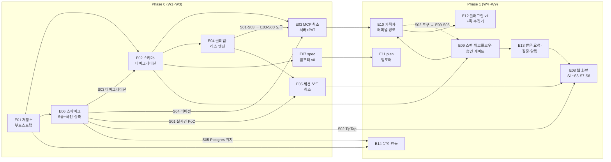

# 백로그

> **요약** — MVP(Phase 0 PoC + Phase 1)의 구현 백로그를 에픽 14개·스토리 74개로 확정한다. [3.7 로드맵](../03-proposal/roadmap.md)의 Phase 배분과 성공 기준(0-1~0-8 · 1-1~1-11)을 그대로 상위 근거로 삼고, 모든 스토리는 근거 문서 링크와 EARS 수용 기준·의존 스토리를 갖는다. Phase 0는 저장소 부트스트랩(E01)부터 spec 임포터 v0(E07 — 프로파일 엔진 · 임포트 API 표면 · CLI)까지, Phase 1은 웹 화면(E08)부터 운영·연동(E14)까지다. 스파이크 5종(실시간 게이트웨이 PoC(WS + SSE · Valkey) · TipTap md 왕복 · drizzle 마이그레이션 파이프라인 · MCP 리비전 병행 서빙 · 임베딩 서빙·하이브리드 검색)과 확인·실측 태스크 2종(운영 Postgres 위치 · 훅 헤더 `${NERV_TOKEN}` 확장)은 E06에 두어 아키텍처 리스크를 첫 2주 안에 태운다. 마지막 절은 로드맵 성공 기준을 재현 절차로 바꾼 E2E 수용 시나리오 5종이다.
>
> 문서 버전 v0.15 · 2026-09-06 · HTML 파생본: [backlog.html](../html/backlog.html)
>
> v0.15 변경(2026-09-06 — 백로그가 저장소를 설명하지 못했다, 정합성 대조 → 사람 지시): **§1.4 구현 현황 신설 · §1.1·§1.3 정정.** §1.1 이 "이 문서의 모든 스토리는 현재 `backlog`다" 라고 적고 있었는데 **74개 중 73개에 대해 거짓**이었다(실측: `done` 64 · 부분 10 · `backlog` 0). §1.3 은 "Phase 2 항목은 여기 스토리로 분해하지 않는다" 며 여섯을 나열했는데 **그중 다섯이 이미 들어와 있었다.** 이 문서는 §1.2 가 선언한 대로 **첫 임포트 대상**이라, 그 두 문장이 그대로 Task 74건의 초기 상태가 된다 — 틀린 상태로 적재되면 **이미 끝난 일을 에이전트가 다시 클레임한다**(이 제품이 없애려는 P2 그 자체다). 신설한 §1.4 는 셋을 싣는다: ① 에픽별 실측 표(근거는 파일 경로), ② **부분 구현 열의 *남은 것***("완료"로 뭉뚱그리면 남은 절반이 영영 보이지 않는다 — E09-S06 이 그 상태였다), ③ **스토리가 없는 구현 일곱**(리뷰 수집·첨부·초대·매뉴얼·미러 export·`nerv_question_cancel`·`preflight`). 갱신 규율은 이 절 안에 두었다 — **스토리를 끝내면 같은 커밋에서 표를 고친다.** 곁들여 본문의 낡은 수치 넷을 고쳤다: E02-S01 "테이블 29종"(→ 37), E12-S02 훅 기본 변형(`http` → `command`), E12-S03 `.mcp.json`(패키지에 담지 않는다), E12-S05 "도구 16종 불변".
>
> v0.14 변경(2026-09-05 — 용어 사전 반영, 사람 지시): [용어 사전](../glossary.md)의 채택어로 이 문서의 낱말을 옮긴다 — 기준선(← 베이스라인) · 워크플로우(← 워크플로) · 권한/소속/작업 범위(← 스코프) · 버전(← 판) · 고정 ID(← 안정 ID·키). **뜻은 바뀌지 않는다** — 코드·API 식별자는 그대로다.
>
> v0.13 변경(2026-09-05 — Phase 표기를 현황으로, 정합성 감사 → 사람 결정): E12 배포 평면 서술의 "스킬 5종(`/nerv:review`는 Phase 2)·`.mcp.json` 번들" 을 현황으로 고치고(6종 · `.mcp.json` 은 패키지에 없다), 참고 문헌의 엔티티 수를 37종으로.
> v0.12 변경(2026-09-04 — E09-S06 완료 표기): 기준선 스토리의 남은 절반(소비 축·웹 UI)을 구현했다. 서버 축(테이블·EP-SPEC-11~14)은 이미 있었고 **읽는 길과 만드는 문이 없어** 실사용 기준선이 0개였다(4.4 v0.66 · 4.5 v0.66).
> v0.11 변경(2026-09-02 — 정본 정합): 리스 인계 표기를 정본에 맞춘다(2026-09-02 · 3.5 §1.2 · 4.4 §1.4h): 2026-08-30 에 보유자를 `(user, session)` 으로 좁히고 인계를 `takeover` 로 명시화했는데, 그 개정이 이 문서까지 오지 않아 여전히 "같은 사용자면 자동 인계" 라고 적고 있었다. **L3 시나리오 D 가 그 문장대로 쓰여 있었고 그래서 실패했다** — 에이전트 규약(3.4)은 아예 "이 에러는 오지 않는다" 고 적어, 그 말을 믿은 에이전트는 웹이 열어 둔 초안 앞에서 멈춘다.
> v0.10 변경(2026-08-30 — 표기 결함 정정, 사람 결정): **`E06-S06` 이 둘이었다** — 임베딩 스파이크와 훅 헤더 실측이 같은 번호를 썼다. 다른 문서 네 곳이 임베딩 쪽을 가리키므로 훅 실측을 **`E06-S07`** 로 옮긴다(번호는 재사용하지 않고 끝번호에 더한다). 곁들여 §2.6 제목과 의존 그래프 노드의 낡은 수("스파이크 4종")를 실제와 맞췄다. **E10-S02 의 수용 기준을 `base_version` → `base_hash` 로** 고쳤다(4.4 §1.4g·§1.4i).
> v0.8 변경(2026-08-22): 배포 산출물 위치 개정([4.2](codebase.md) v0.8 · REQ-CB-015) 반영 — E01-S01 스토리의 트리 서술을 2구역(코드 `codebase/` · 배포 `deploy/`)으로 갱신. 스토리 수·의존·수용 기준 불변.
>
> v0.7 변경(2026-08-22): 임베딩 제공자 추상화([4.2](codebase.md) §5.2a) 반영 — E06-S06을 3프로필 스모크로, E09-S11에 제공자 클라이언트·1024차원 검증 추가. 재검토에서 발견된 표기 결함 정정(E06 스파이크 4종 → 5종, W2 테이블 수 27 → 29).
>
> v0.6 변경(2026-08-22 — 하이브리드 검색·탐색 UI MVP 확정, [4.1](scope.md) §2.1): **E06-S06**(임베딩 서빙·하이브리드 검색 스파이크) · **E09-S10·S11·S12**(하이브리드 검색 백엔드·임베딩 파이프라인·관계 API) · **E08-S09·S10**(퀵 스위처·트리 스케일+관계 패널) 추가. 스토리 68 → 74. 스파이크 4종 → 5종.
>
> v0.5 변경(2026-08-22 — 구현 착수 검토의 공백 보완 반영): **E09-S08**(스펙 메타 편집·아카이브 — EP-SPEC-15~17) · **E09-S09**(`spec_relation` 자동 추출) · **E12-S06**(오프라인 폴백 실물) 추가, E01-S05(CI — codebase §4.5)·E14-S02(백업 — codebase §6.5) 근거를 신설 절로 갱신. 스토리 65 → 68.
>
> v0.4 변경(2026-08-22): 임포터 실행 모델 확정(CLI + 임포트 API — [4.7 스펙 임포터](importer.md) §3.2)에 따라 **E07-S04·S05**(임포트 REST 표면 · `apps/cli`)와 **E12-S05**(`/nerv:import` 스킬)를 추가하고 시나리오 E를 갱신했다. 스토리 62 → 65.

---

## 1. 읽는 법

### 1.1 ID·상태·표기 규약

- **에픽/스토리 ID** — `E01-S01` 형식(에픽 번호-스토리 번호). 에픽은 Phase 0(E01~E07) → Phase 1(E08~E14) 순으로 번호가 붙고, 스토리 번호는 에픽 안의 권장 착수 순서다.
- **상태 어휘** — 스토리는 Task 축 상태 머신([3.5 스펙 워크플로우와 거버넌스](../03-proposal/spec-workflow.md) §1.4)의 어휘를 그대로 쓴다: `backlog → ready → claimed → in_progress → in_review → done`, 예외 상태 `blocked`(사유 코드 필수). **스토리별 현재 상태는 §1.4 가 정본이다** — 2026-09-06 실측으로 `done` 64 · 부분 10 · `backlog` 0 이다. (2026-08-22 신설 당시의 "모든 스토리는 현재 `backlog`다" 를 그대로 두어 **74개 중 73개에 대해 거짓인 문장**이 2주간 남아 있었다 — 이 문서는 첫 임포트 대상이라 그 문장이 그대로 Task 74건의 초기 상태가 된다.)
- **근거** — 모든 스토리는 근거 링크를 갖는다: 기존 13편의 § 참조, FR/NFR 번호([1.2 문제 정의와 요구사항](../01-problem/pain-points.md) §4), D-번호 결정, 또는 4부 형제 문서의 REQ-* / § 참조. 근거 없는 스토리는 백로그에 넣지 않는다.
- **EARS 수용 기준** — 행동 요구는 `WHEN … THE SYSTEM SHALL …` 형식으로 쓴다. 스토리당 1~3개.
- **의존** — 의존 스토리 ID를 표기한다. 의존이 `done`이 아니면 해당 스토리는 `ready`로 전이하지 않는다(FR-05의 ready 판정을 이 백로그 자신에게 적용).

### 1.2 도그푸딩 — 이 문서가 첫 임포트 대상이다

이 백로그는 NERV 가동 후 **첫 임포트 대상**이다. 도그푸딩 임포트는 P1이다([4.7 스펙 임포터](importer.md) §1.1) — `docs/04-mvp/*.md` 문서 세트의 Spec 적재는 nerv-docs 프로파일(importer §5.1)로, 이 문서의 에픽·스토리 → Task 적재는 P1 plan 임포터와 같은 경로(E11 시점)로 수행한다. 문서 머리의 frontmatter(`id: SPC-MVP-BACKLOG`)가 [4.7 스펙 임포터](importer.md) §5의 임포트 규격을 따르는 이유다. 임포트 이후 이 md는 read-only 미러가 되고 SoT는 서버다(D-01 · [3.7 로드맵](../03-proposal/roadmap.md) §7.4).

### 1.3 범위 경계

이 백로그는 MVP = Phase 0 + Phase 1만 다룬다([4.1 MVP 범위와 스택 확정](scope.md) §3). Phase 2 항목은 로드맵 §4가 정본이며 여기 스토리로 분해하지 않는다 — **다만 그중 여섯은 이미 들어와 있다**(2026-09-06 정정): 리뷰 수집·S6 리뷰 센터·`nerv_review_submit`/`nerv_finding_resolve`·`/nerv:review`·review 임포터. 앞당겨 구현한 근거는 [4.1 범위](scope.md) §5 의 착수 기록이고, 실물의 자리는 §1.4 의 "스토리가 없는 구현" 표다. 여전히 분해하지 않는 것은 **게이트 판정 완성**(FR-10 둘째 단 — 화면은 판정을 표시할 뿐 아직 막지 않는다)과 **Codex 완전 지원**이다.

### 1.4 구현 현황 (2026-09-06 실측)

**스토리별 상태의 정본은 이 절이다.** 세는 법은 하나다 — 스토리의 EARS 수용 기준을 만족하는 실물이 저장소에 있으면 `done`,
일부만 있으면 **부분**이고 그때는 *남은 것*을 반드시 적는다. 근거는 파일 경로다.

| 에픽 | `done` | 부분 | 대표 근거 |
| --- | ---: | ---: | --- |
| E01 저장소 부트스트랩 | 5 | — | `codebase/pnpm-workspace.yaml` · `apps/api/src/main.ts` · `.github/workflows/ci.yml` |
| E02 스키마·마이그레이션 | 4 | — | `packages/schema/src/tables/` (테이블 37) · `drizzle/0000`~`0019` · `event.service.ts` |
| E03 MCP 최소 서버 + PAT | 3 | 1 | `mcp/mcp.controller.ts` · `*.tools.ts`(도구 24) · `packages/schema/src/errors.ts` |
| E04 클레임·리스 엔진 | 5 | — | `task.service.ts`(FOR UPDATE) · `claim.service.ts` · `worker/advisory-lock.ts` |
| E05 세션 보드 최소 | 4 | — | `session.service.ts` · `event/ws.gateway.ts` · `event/sse.controller.ts` |
| E06 스파이크 + 확인·실측 | 3 | 4 | `test/integration/spike-realtime.spec.ts` · `apps/web/.spike/tiptap-roundtrip.md` |
| E07 spec 임포터 v0 | 4 | 1 | `apps/cli/src/profiles/` · `report/index.ts` · `modules/import/import.controller.ts` |
| E08 웹 화면 | 8 | 2 | `routes/p.$proj/specs.$spec.tsx`(버전 diff) · `steer-panel.tsx` · `quick-switcher.tsx` |
| E09 스펙 워크플로우·승인 게이트 | 11 | 1 | `0000_init.sql`(동결 트리거) · `spec/gate-tier.ts` · `spec/search.service.ts`(RRF) |
| E10 기획자 터미널 경로 | 4 | — | `spec.service.ts`(`NERV_DRAFT_LEASED`·takeover) · `spec-comment.service.ts` |
| E11 plan 임포터 | 2 | — | `apps/cli/src/parse/plan.ts` · `apps/cli/src/run.ts` |
| E12 플러그인 v1 + 훅 수집기 | 5 | 1 | `plugin/skills/`(6종) · `session/ingest.controller.ts` · `plugin/bin/nerv-outbox` |
| E13 받은 요청·질문·알림 | 3 | — | `approval.service.ts`(`content_hash` stale) · `question.service.ts` · `notification.service.ts` |
| E14 운영·연동 | 3 | — | `deploy/k8s/base/` · `deploy/scripts/nerv-backup.sh` + `restore-roundtrip.spec.ts` · `task/webhook.service.ts` |
| **합계** | **64** | **10** | `backlog` 0 |

§5 의 **E2E 수용 시나리오 A~E 도 다섯 전부 실물**이다 — `apps/api/test/e2e/scenario-a-c.spec.ts` · `scenario-d-e.spec.ts`.

#### 부분 구현 열 — 남은 것을 적어 둔다

"완료"로 뭉뚱그리면 남은 절반이 영영 보이지 않는다. E09-S06 이 정확히 그 상태였다(서버 축만 있고 읽는 길과 만드는 문이 없어 실사용 기준선이 0개였다).

| ID | 들어온 것 | **남은 것** |
| --- | --- | --- |
| E03-S02 | PAT 해시 저장·프로젝트 소속·검증 | better-auth **api-key 플러그인 대신 자체 `api_token` 테이블**(이탈 근거는 `auth.service.ts` 머리 주석) · **발급 CLI 없음**(웹 설정 화면이 유일한 발급 경로) |
| E06-S03 | 마이그레이션 파이프라인 양쪽 경로가 실제로 돈다 | **스파이크 리포트 자체**(후보 2안 비교·롤백 절차·선정 근거) |
| E06-S04 | 리비전 협상·병행 서빙 코드 | Claude Code·Codex **두 클라이언트 실측 리포트** |
| E06-S06 | degrade 경로·1024차원 검증 | **3프로필 지연 실측·한국어 질의 품질 비교·go/no-go 판정**([4.4 API](api.md)가 임베딩 p95 를 아직 보류로 둔다) |
| E06-S07 | command 폴백이 기본 변형으로 배포됨 | 기록된 근거는 훅 `url` 의 `${VAR}` **미**확장이지 **`headers` 확장 자체의 실측이 아니다**([4.6 플러그인](plugin.md) §3.1이 아직 "1차 문서에서 확인 못함"이라 적는다) |
| E07-S05 | `apps/cli` 워크스페이스·bin·멱등 키 재시도 | **`nerv import` 서브커맨드가 없다** — bin 은 `nerv` 이고 `parseArgs` 는 `spec` · `plan` · `review` · `docs` · `rebuild-map` 만 받는다. 실제로 도는 형태는 `nerv spec …` 인데 [4.7 임포터](importer.md) §3.1·`skills/import`·**CLI 자신의 usage 문구** 셋이 `nerv import` 를 말한다 |
| E08-S05 | 칸반 레인·위임 명세 4요소 zod 폼 | **승인된 SpecVersion 에서 파생하는 웹 경로** — `delegation-form.tsx` 의 스키마에 `source_spec_version_id` 가 없어 파생은 REST·MCP 로만 된다 |
| E08-S10 | 가상 스크롤·필터·관계 패널·degraded 배너 | **`depth` 지연 로드** — 서버는 그 인자를 받는데 `useSpecTree` 가 넘기지 않는다 |
| E09-S03 | 지시자≠승인자 차단 | **리뷰어 자동 지정** — `ApprovalService.request()` 를 부르는 곳이 `assigneeUserId` 를 넘기지 않아 결재 카드는 언제나 `assignee_user_id = NULL` 로 만들어진다(그 열이 채워지는 것은 결재 시점의 `COALESCE` 뿐이라 *지정*이 아니라 *기록*이다) |
| E12-S03 | statusline · 마켓플레이스 · 관리형 settings | 수용 기준의 **"활성화 여부를 서버에서 확인"**(플러그인 버전 보고) 경로. ※ `.mcp.json` 미동봉은 남은 것이 아니라 **결정**이다(REQ-PLG-001 개정 — 패키지 테스트가 부재를 강제한다) |

#### 스토리가 없는 구현 — 백로그가 저장소를 설명하지 못하는 자리

아래는 **구현됐는데 이 문서에 스토리가 없다.** 백로그가 "무엇을 만들 것인가"의 목록이라면, 만든 것이 목록에 없다는 것은 그 목록이 더 이상 저장소를 설명하지 않는다는 뜻이다.

| 무엇 | 실물 | 비고 |
| --- | --- | --- |
| 리뷰 수집 전체(FR-09) | `modules/review/` · `routes/p.$proj/reviews.index.tsx` · `review.tools.ts` · `skills/review/` · `cli/src/parse/review.ts` | §1.3 이 "분해하지 않는다"고 적은 여섯 중 다섯이 여기다 |
| 스펙 첨부 | `attachment` 테이블 · `nerv_spec_attach` · `nerv_spec_attachment_read` | 2026-09-01·09-04 도입 |
| 조직 초대 | `modules/auth/invitation.controller.ts` · `routes/invite.$token.tsx` · `0006_invitation` | |
| 제품 매뉴얼 `/help` | `apps/web/src/content/manual/{ko,en}/` 10장 × 2 · `routes/help/` | [AGENTS.md](../../AGENTS.md) 구현 규약 5 가 요구하는 산출물이다 |
| md 미러 export 잡 | `worker/jobs/export.job.ts` | 코드가 스스로 "P1 후반"이라 적는다 |
| `nerv_question_cancel` | `modules/approval/question.tools.ts` | 2026-09-05 신설 |
| `pnpm preflight` · `hooks:install` | `codebase/scripts/preflight.mjs` · `install-hooks.mjs` | 규약 7 이 커밋 전 필수로 지정한 도구 |

#### 이 절은 언제 갱신되는가

- **스토리를 끝내면 같은 커밋에서 이 표를 고친다.** 나중에 몰아서 세면 그 사이의 커밋들은 자기가 무엇을 바꿨는지 말하지 않는다 — 실제로 §1.1 의 "모든 스토리는 현재 `backlog`다" 가 2주간 그렇게 남았다.
- **부분으로 두려면 *남은 것*을 함께 적는다.** 남은 것을 적지 않은 부분 표기는 "완료"와 구별되지 않는다.
- **스토리 없이 들어온 구현은 셋째 표에 한 줄로 남긴다.** 그 줄이 쌓이면 에픽을 새로 여는 신호다(번호는 재사용하지 않고 끝번호에 더한다 — §1.1).
- 이 문서가 **첫 임포트 대상**이라는 것이 규율의 이유다(§1.2). 임포트는 여기 적힌 상태를 그대로 Task 74건의 초기 상태로 옮긴다 — 틀린 상태로 적재되면 **이미 끝난 일을 에이전트가 다시 클레임한다.**

---

## 2. Phase 0 에픽 — 조정이 되는가 (W1~W3)

Phase 0의 유일한 목표는 로드맵 §2.1 그대로다 — "서버가 모든 세션의 선언을 보면 clemvion이 로컬 한계로 제거했던 동시수정 사전 검출이 복원되는가"를 실물로 확인한다. 종료 게이트는 §5.1~§5.3의 E2E 시나리오(성공 기준 0-1~0-8)다.

### 2.1 E01 — 저장소 부트스트랩

모노레포·API/웹 골격·로컬 compose·CI. 모든 에픽의 공통 선행.

| ID | 스토리 | 근거 | EARS 수용 기준 | 의존 |
| --- | --- | --- | --- | --- |
| E01-S01 | pnpm 모노레포 골격 — 저장소 `codebase/` 하위에 `apps/web` `apps/api` `apps/cli` `packages/schema` 트리, 저장소 루트에 `deploy/compose` `deploy/k8s` 트리, 그리고 패키지 책임 경계(REQ-CB-015 — 애플리케이션·패키지 코드는 `codebase/`, 배포 산출물은 `deploy/`) | [4.2 코드베이스와 배포](codebase.md) §1 · [4.1 범위·스택](scope.md) §2 | WHEN 신규 클론의 `codebase/`에서 `pnpm install`을 실행하면, THE SYSTEM SHALL lockfile 기준으로 워크스페이스 전 패키지를 한 번에 설치한다 | — |
| E01-S02 | NestJS(Fastify 어댑터) API 골격 — 도메인 모듈 자리와 REST·MCP·WS 표면이 같은 서비스를 DI로 주입받는 배선 | [3.4 에이전트 연동 설계](../03-proposal/agent-integration.md) §1(D-05) · [4.2 코드베이스와 배포](codebase.md) §2 | WHEN REST 컨트롤러와 MCP 게이트웨이가 같은 도메인 동작을 호출하면, THE SYSTEM SHALL 동일 서비스 인스턴스를 거쳐 게이트 판정을 단일화한다 | E01-S01 |
| E01-S03 | Vite + React SPA 골격 — TanStack Router/Query · Tailwind + shadcn/ui · react-hook-form + zod 셋업 | [4.1 범위·스택](scope.md) §2 · [4.5 화면 명세](screens.md) §1 | WHEN `pnpm dev`로 웹을 기동하면, THE SYSTEM SHALL 라우팅 맵의 기본 경로와 앱 셸을 렌더링한다 | E01-S01 |
| E01-S04 | docker-compose 로컬 기동 — postgres·minio·valkey·api·worker·web 단일 파일 | [4.2 코드베이스와 배포](codebase.md) §5 · NFR-01 · [3.7 로드맵](../03-proposal/roadmap.md) §2.2 | WHEN `docker compose up`을 실행하면, THE SYSTEM SHALL 단일 명령으로 전 서비스를 기동한다(마이그레이션 연결은 E02-S02) | E01-S01 |
| E01-S05 | CI 파이프라인 — `.github/workflows/ci.yml` 전문(check/integration/e2e 3잡) + 스키마 드리프트 검사 | [4.2 코드베이스와 배포](codebase.md) §4.5(REQ-CB-018) | WHEN PR이 열리면, THE SYSTEM SHALL lint·typecheck·L1·L2(실제 Postgres)를 실행하고 실패 시 머지를 차단한다 WHEN 스키마 선언 변경이 마이그레이션 산출물 없이 오면, THE SYSTEM SHALL CI를 실패시킨다(REQ-CB-018) | E01-S01 |

### 2.2 E02 — 스키마·마이그레이션

Postgres + Drizzle. `packages/schema`가 테이블·zod·파생 타입의 단일 원천이 된다.

| ID | 스토리 | 근거 | EARS 수용 기준 | 의존 |
| --- | --- | --- | --- | --- |
| E02-S01 | drizzle 테이블 선언(**착수 당시 29종 → 현재 37종** — 2026-09-06 실측) — `organization`부터 `spec_baseline_item`까지, zod 스키마·파생 타입 공유 | [3.3 데이터 모델](../03-proposal/data-model.md) §1.3 · [4.3 데이터베이스 스키마](database.md) §2 | WHEN drizzle-kit이 DDL을 생성하면, THE SYSTEM SHALL data-model.md의 29개 테이블·컬럼명과 1:1 일치하는 스키마를 산출한다 | E01-S01 · E06-S03 |
| E02-S02 | 초기 스냅샷 마이그레이션 + 왕복 멱등 — compose는 기동 시, k8s는 Job으로 적용 | [4.3 데이터베이스 스키마](database.md) §1·§5 | WHEN 같은 마이그레이션을 2회 연속 실행하면, THE SYSTEM SHALL 두 번째 실행을 스키마 변경 0으로 종료한다 | E02-S01 |
| E02-S03 | 이벤트 방송 규약 — Valkey pub/sub 채널 `nerv_events`, 페이로드 JSON(event id·type·project_id), EventService 커밋 후 발행 | [4.3 데이터베이스 스키마](database.md) §3 · [3.2 시스템 아키텍처](../03-proposal/architecture.md) §1(D-10) | WHEN `event` 테이블에 행이 삽입되고 트랜잭션이 커밋되면, THE SYSTEM SHALL Valkey `nerv_events` 채널로 event id·type·project_id를 PUBLISH한다(롤백 시 발행 없음) | E02-S01 |
| E02-S04 | 개발 시드 한 벌 — 프로젝트 clemvion, `SPC-CWC-007`·`REQ-CWC-031`, CLV-T-0CFQC2(하나/mac-07)·CLV-T-1KTDCK(도현/mac-02)·CLV-T-TRA25N(유나/linux-ci-01/codex), 세션 S-b7e9 | [4.3 데이터베이스 스키마](database.md) §4 | WHEN 시드 스크립트를 실행하면, THE SYSTEM SHALL 예시 데이터 한 벌을 멱등하게 적재한다(재실행 시 신규 레코드 0) | E02-S02 |

### 2.3 E03 — MCP 최소 서버 + PAT

Streamable HTTP 게이트웨이와 P0 도구 8종. tools-only 완주(성공 기준 0-8)가 이 에픽의 판정이다.

| ID | 스토리 | 근거 | EARS 수용 기준 | 의존 |
| --- | --- | --- | --- | --- |
| E03-S01 | Streamable HTTP MCP 게이트웨이 — tools-first, `/mcp` Origin 검증 | [3.4 에이전트 연동 설계](../03-proposal/agent-integration.md) §2.1·§2.6 · [4.4 API 명세](api.md) §4 | WHEN Claude Code 또는 Codex 클라이언트가 접속하면, THE SYSTEM SHALL resources·prompts·elicitation 없이 tools만으로 카탈로그를 노출한다 | E01-S02 · E06-S04 |
| E03-S02 | PAT 발급·검증 — better-auth api-key 플러그인, 해시 저장·프로젝트 소속, 발급 CLI | [3.4 에이전트 연동 설계](../03-proposal/agent-integration.md) §2.5·§6.1 · [4.1 범위·스택](scope.md) §2 | WHEN 폐기된 PAT 또는 권한 밖 프로젝트로 호출하면, THE SYSTEM SHALL `NERV_UNAUTHENTICATED` 또는 `NERV_FORBIDDEN`으로 거부한다 | E02-S01 |
| E03-S03 | P0 도구 8종 — `nerv_bootstrap` `nerv_spec_tree` `nerv_spec_search` `nerv_spec_get` `nerv_task_next` `nerv_task_claim` `nerv_task_heartbeat` `nerv_task_release` | [3.4 에이전트 연동 설계](../03-proposal/agent-integration.md) §2.3 · [3.7 로드맵](../03-proposal/roadmap.md) §2.2 | WHEN 세션이 `nerv_bootstrap`을 첫 도구 호출로 실행하면, THE SYSTEM SHALL session_id·규약 요약·활성 클레임·게이트 정책을 반환한다 WHEN 같은 `session_id`로 재호출하면, THE SYSTEM SHALL 동일 스냅샷을 반환한다(멱등) | E03-S01 · E03-S02 · E04-S01 · E04-S03 |
| E03-S04 | 에러 규약 — `NERV_*` 코드 체계와 next_actions를 담은 구조화 에러, REST HTTP 상태 매핑 재사용 | [3.4 에이전트 연동 설계](../03-proposal/agent-integration.md) §2.7 · [4.4 API 명세](api.md) §1 | WHEN 도구 호출이 실패하면, THE SYSTEM SHALL `NERV_*` 코드·사유·next_actions를 담은 구조화 에러를 반환한다 | E03-S01 |

### 2.4 E04 — 클레임·리스 엔진

Phase 0의 핵심 검증 대상(FR-06 ●). clemvion이 #576에서 제거한 동시수정 사전 검출의 복원이다.

| ID | 스토리 | 근거 | EARS 수용 기준 | 의존 |
| --- | --- | --- | --- | --- |
| E04-S01 | 원자적 클레임 트랜잭션 — `ready → claimed` 단일 트랜잭션 전환(FOR UPDATE) | [3.5 스펙 워크플로우](../03-proposal/spec-workflow.md) §4.3~4.4 · FR-06 · D-04 | WHEN 3세션이 같은 ready Task를 동시에 클레임하면, THE SYSTEM SHALL 정확히 1건만 성공시키고 나머지에 409 충돌 응답을 반환한다 | E02-S01 |
| E04-S02 | scope 겹침 판정 — `spec_ids`·`file_globs` 교집합 계산, 경고/차단 2단계, `NERV_CONFLICT_SCOPE`에 상대 세션·사용자·hostname·scope 반환 | [3.5 스펙 워크플로우](../03-proposal/spec-workflow.md) §4.4 · [3.4 에이전트 연동 설계](../03-proposal/agent-integration.md) §2.4 | WHEN 활성 클레임과 scope가 겹치는 클레임이 오면, THE SYSTEM SHALL 상대 정보를 담은 경고를 반환한다 WHEN 같은 스펙 문서를 두 세션이 동시 개정하려 하면, THE SYSTEM SHALL `NERV_CONFLICT_SCOPE`로 차단한다 | E04-S01 |
| E04-S03 | 하트비트·리스 연장 — 60초 주기, 리스 TTL 30분, 응답 역채널(pending 질문 답변·steer/stop) | [3.4 에이전트 연동 설계](../03-proposal/agent-integration.md) §2.4·§2.7 | WHEN 유효한 claim_id로 하트비트가 도착하면, THE SYSTEM SHALL 새 lease_expires_at을 반환하고 pending 지시를 응답에 싣는다 WHEN 만료된 리스로 하트비트가 오면, THE SYSTEM SHALL `NERV_LEASE_EXPIRED`를 반환한다 | E04-S01 |
| E04-S04 | 만료 자동 회수 워커 — advisory lock 단일 워커(replica 1), `stale` 전이 + 클레임 회수 | [3.5 스펙 워크플로우](../03-proposal/spec-workflow.md) §4.5 · D-13 · [4.2 코드베이스와 배포](codebase.md) §6 | WHEN 하트비트가 TTL(30분)을 초과해 끊기면, THE SYSTEM SHALL 세션을 `stale`로 전이하고 클레임을 회수해 Task를 `ready`로 복귀시킨다(사람 개입 0회) | E04-S03 |
| E04-S05 | ready 판정 + 위임 명세 4요소 강제 — 의존성 그래프 기반, 4요소(목표·산출물 형식·도구/출처·경계) 미비 시 전이 거부 | [3.5 스펙 워크플로우](../03-proposal/spec-workflow.md) §4.1~4.2 · FR-05 | WHEN 위임 명세 4요소 중 하나라도 빈 Task가 `ready` 전이를 시도하면, THE SYSTEM SHALL 전이를 거부하고 누락 요소를 명시한다 | E02-S01 |

### 2.5 E05 — 세션 보드 최소

세션 레지스트리(FR-07 ◐)와 읽기 전용 보드(FR-08 ○, S5 축소판). NFR-02(p95 ≤ 5초)의 첫 실측 지점.

| ID | 스토리 | 근거 | EARS 수용 기준 | 의존 |
| --- | --- | --- | --- | --- |
| E05-S01 | 세션 레지스트리 — `agent_session` 등록, 상태 머신 `pending→active↔awaiting_input→complete/error/stale`, 하트비트 | [3.3 데이터 모델](../03-proposal/data-model.md) §2.5 · FR-07 · [3.7 로드맵](../03-proposal/roadmap.md) §2.2 | WHEN `nerv_bootstrap`이 성공하면, THE SYSTEM SHALL `agent_session` 행을 생성하고 `session.started` 이벤트를 적재한다 | E02-S01 · E03-S01 |
| E05-S02 | WS·SSE 게이트웨이 + Valkey 구독 팬아웃 — WS 룸 `project:{id}`·`user:{id}`(join 시 멤버십 검사, websocket 전송만·폴링 폴백 off) + SSE 스트림 `/sse/projects/{p}`·`/sse/me`(쿠키 또는 PAT) | [4.1 범위·스택](scope.md) §2 · [4.4 API 명세](api.md) §3 · NFR-02 | WHEN 이벤트가 `nerv_events`에 PUBLISH되면, THE SYSTEM SHALL 각 파드가 자기 소켓의 해당 룸과 SSE 스트림으로 emit하고 상태 전이→보드 반영 지연 p95 ≤ 5초를 유지한다 | E02-S03 · E06-S01 |
| E05-S03 | 읽기 전용 세션 보드 화면 — hostname·에이전트 종류·상태·현재 Task·리스 잔여 표기(S5 축소판, steer/stop 없음) | [3.6 화면 설계](../03-proposal/ui-wireframes.md) S5 · [3.7 로드맵](../03-proposal/roadmap.md) §2.3 | WHEN 세션 상태가 전이되면, THE SYSTEM SHALL 새로고침 없이 보드 카드를 5초 내 갱신한다 WHEN WebSocket이 끊겼다 재연결되면, THE SYSTEM SHALL 화면 데이터를 재조회한다(이벤트 유실 허용, 진실은 DB — D-14) | E01-S03 · E05-S02 |
| E05-S04 | Event 적재 표준화 — 전 상태 전이를 `event` 테이블에 `is_agent` 포함 append-only 적재 | [3.3 데이터 모델](../03-proposal/data-model.md) §2.9 · FR-16 · D-10 | WHEN 도메인 상태 전이가 커밋되면, THE SYSTEM SHALL 같은 트랜잭션에서 `event` 행을 적재한다(전이·이벤트의 원자성) | E02-S01 |

### 2.6 E06 — 스파이크 5종 + 확인·실측 태스크 2종

각 스파이크는 **타임박스 1주**, 산출물은 검증 리포트와 go/no-go 판정이다. 실패 시 대안 경로(각 행의 재검토 트리거)가 이미 정의되어 있으므로 일정이 아니라 선택지가 바뀐다.

| ID | 스토리 | 근거 | EARS 수용 기준 | 의존 |
| --- | --- | --- | --- | --- |
| E06-S01 | 스파이크: 실시간 게이트웨이 PoC — NestJS `@WebSocketGateway`(socket.io 어댑터, websocket 전송 단독) + SSE 스트림, 파드 2개에서 크로스파드 어댑터 없이 Valkey pub/sub 팬아웃 | [4.1 범위·스택](scope.md) §2 · NFR-02 | WHEN 파드 2개 뒤에 WS·SSE 클라이언트를 분산 접속시키고 `nerv_events`에 PUBLISH하면, THE SYSTEM SHALL 크로스파드 어댑터 없이 전 클라이언트에 이벤트를 전달한다 | E01-S02 |
| E06-S02 | 스파이크: TipTap md 왕복 검증 — 지원 노드 화이트리스트(heading·paragraph·list·table·code·blockquote·link·hr)로 실측 문서 왕복. 손실 실측 시 Milkdown 재검토 트리거 발동 | [4.1 범위·스택](scope.md) §2 · [4.5 화면 명세](screens.md) §3 | WHEN `clemvion:spec/` 표본 30문서를 md→TipTap→md로 왕복하면, THE SYSTEM SHALL 지원 노드 집합 안에서 손실 0을 보이고, 손실 발생 항목은 파일·위치·유형 리포트로 남긴다 | E01-S03 |
| E06-S03 | 스파이크: drizzle 마이그레이션 파이프라인 — compose 기동 시 적용 vs k8s Job, 롤백 절차 포함 후보 비교 | [4.1 범위·스택](scope.md) §2 · [4.2 코드베이스와 배포](codebase.md) §5~6 · [4.3 데이터베이스 스키마](database.md) §1 | WHEN 파이프라인 후보 2안을 각각 실행하면, THE SYSTEM SHALL 신규 DB·기존 DB 양쪽에서 왕복 멱등을 통과하는 안을 선정 근거와 함께 리포트로 남긴다 | E01-S01 |
| E06-S04 | 스파이크: MCP 리비전 병행 서빙 — 최신 리비전 + 구 리비전 병행(D-11), Claude Code·Codex 클라이언트 협상 실측 | [3.4 에이전트 연동 설계](../03-proposal/agent-integration.md) §2.6 · [3.7 로드맵](../03-proposal/roadmap.md) §6.1(R5) | WHEN 구 리비전 클라이언트와 최신 리비전 클라이언트가 같은 엔드포인트에 접속하면, THE SYSTEM SHALL 협상된 리비전으로 각각 tools 호출을 완주시킨다 | E01-S02 |
| E06-S05 | 확인 태스크: 운영 Postgres 위치 — 클러스터 외부(권장) vs CloudNativePG. 백업·복구(NFR-01)·운영 부담·k8s 의존성 3기준 비교 후 결정 기록 | [4.1 범위·스택](scope.md) §2(배포 행) · [4.2 코드베이스와 배포](codebase.md) §6 | WHEN 확인 태스크가 종료되면, THE SYSTEM SHALL 3기준 비교표·결정·재검토 트리거를 [4.2 코드베이스와 배포](codebase.md) §6에 반영한다 | — |
| E06-S06 | 스파이크: 임베딩 제공자·하이브리드 검색 — OpenAI 호환 클라이언트로 **3프로필 스모크**(로컬 TEI CPU p95 실측 · LM Studio · OpenAI `dimensions=1024`), 한국어 질의 3종(조사 변형·부분 문자열·의미 유사)에서 FTS 단독 vs trgm vs 하이브리드(RRF) 품질 비교 | [4.1 범위·스택](scope.md) §2.1(검색 행) · [4.2 코드베이스와 배포](codebase.md) §5.2a · [4.4 API 명세](api.md) §2.2b | WHEN 스파이크가 종료되면, THE SYSTEM SHALL 프로필별 지연·차원 검증·하이브리드 품질 비교표와 go/no-go 판정을 산출한다(no-go 시 §2.2 트리거 조기 점화) | E01-S04 |
| E06-S07 | 실측: 훅 headers `${NERV_TOKEN}` 환경변수 확장(Claude Code hooks `type:"http"`) — 불가로 판명되면 `bin/nerv-hook-forward` 래퍼(`type:"command"`) 변형 hooks.json으로 폴백 확정 | [4.6 플러그인과 온보딩](plugin.md) §3.1 | WHEN 실측에서 훅 `headers`의 `${NERV_TOKEN}` 확장이 불가로 판명되면, THE SYSTEM SHALL `type:"http"` 훅을 `type:"command"` + `bin/nerv-hook-forward`로 바꾼 변형 hooks.json을 배포판으로 확정하고 판정 리포트를 남긴다 | — |

### 2.7 E07 — spec 임포터 v0 (clemvion 프로파일)

`clemvion:spec/` 순수 135 md(implemented 117 / partial 17 / backlog 1) → Spec/SpecVersion/Requirement. 성공 기준 0-6·0-7의 대상. 도구는 **프로파일 기반 범용 임포터**이고 clemvion은 그 첫 프로파일이다 — 실행은 원본 체크아웃 장비의 CLI(`@nerv/cli`)가 임포트 API를 호출하는 형태다([4.7 스펙 임포터](importer.md) §1.4·§3.2).

| ID | 스토리 | 근거 | EARS 수용 기준 | 의존 |
| --- | --- | --- | --- | --- |
| E07-S01 | 파싱·매핑 구현 — **프로파일 로더**(내장 clemvion·nerv-docs + `--profile-file` 스키마 검증) 위에 디렉터리 계층→스펙 트리, frontmatter(id/status/code/pending_plans) 매핑, status 2축 분해, 요구사항 ID 휴리스틱(`[A-Z]+-[A-Z]+-\d+`) | [4.7 스펙 임포터](importer.md) §1.4·§2 · [3.7 로드맵](../03-proposal/roadmap.md) §7.3(1) | WHEN `clemvion:spec/` 순수 135 md를 입력하면, THE SYSTEM SHALL ≥95%를 자동 변환하고 실패 전건을 파일·줄·사유와 함께 목록화한다(0-6) | E02-S02 |
| E07-S02 | dry-run 기본·멱등 재실행 — 멱등 키(파일 경로+id), 매니페스트, 재실행은 변경분만. **dry-run은 서버 없이 완주**(REQ-IMP-011) | [4.7 스펙 임포터](importer.md) §3 · [3.7 로드맵](../03-proposal/roadmap.md) §2.4(0-7) | WHEN 임포터를 2회 연속 실행하면, THE SYSTEM SHALL 두 번째 실행의 신규 생성 레코드 0을 보인다 WHEN `--apply`가 없으면, THE SYSTEM SHALL `--server` 없이도 리포트·매니페스트 초안을 산출한다 | E07-S01 |
| E07-S03 | 실패 리포트·수동 확인 큐 — 건너뜀/중단 구분, 원문 보존(정보 손실 0) | [4.7 스펙 임포터](importer.md) §4 | WHEN 변환 실패 또는 수동 확인 항목이 발생하면, THE SYSTEM SHALL 파일·줄·사유·건너뜀/중단 구분이 있는 리포트를 산출하고 원문을 보존한다 | E07-S01 |
| E07-S04 | **임포트 REST 표면** — `ImportModule` + EP-IMP-01~05(preflight·specs·tasks·links·map), admin **AND** `import:write` 권한, 배치 `Idempotency-Key`, 항목 단위 트랜잭션, `import.applied` 이벤트 | [4.4 API 명세](api.md) §2.10 · [4.2 코드베이스와 배포](codebase.md) §2.2 · [4.7 스펙 임포터](importer.md) §3.2 | WHEN 권한·역할이 부족한 주체가 EP-IMP-*를 호출하면, THE SYSTEM SHALL 403으로 거부하고 레코드를 만들지 않는다(REQ-API-017) WHEN 배치 일부 항목이 제약을 위반하면, THE SYSTEM SHALL 그 항목만 롤백하고 나머지를 커밋한다(REQ-API-018) | E02-S02 · E03-S02 |
| E07-S05 | **`apps/cli` 워크스페이스** — `nerv import` 엔트리, 내장 프로파일 동봉, `--server`/`--token` API 클라이언트(재시도 시 같은 `Idempotency-Key`), DB 드라이버 미의존 | [4.2 코드베이스와 배포](codebase.md) §1.3(REQ-CB-016·017) · [4.7 스펙 임포터](importer.md) §3.1 | WHEN CLI가 적재를 수행하면, THE SYSTEM SHALL `DATABASE_URL` 없이 PAT로 EP-IMP-*만 호출한다(REQ-IMP-012) WHEN 배치 전송이 재시도되면, THE SYSTEM SHALL 중복 레코드를 0건 생성한다(REQ-IMP-013) | E07-S01 · E07-S04 |

---

## 3. Phase 1 에픽 — 스펙과 사람이 들어온다 (W4~W9)

Phase 1의 목표는 로드맵 §3.1 그대로다 — 스펙이 플랫폼 안에서 쓰이고 승인되며, 비개발 직군이 터미널 없이 참여한다. 종료 게이트는 성공 기준 1-1~1-11이며, 그중 1-11(기획자 웹↔터미널 왕복)은 §5.4의 E2E 시나리오로 재현한다.

### 3.1 E08 — 웹 화면 (S1~S5·S7·S8 + 로그인)

MVP 화면 범위는 S1~S5·S7·S8 + 로그인/온보딩이다(S6 리뷰 센터는 Phase 2 — [4.1 범위·스택](scope.md) §4). 그림 정본은 [3.6 화면 설계](../03-proposal/ui-wireframes.md), 데이터·상태·컴포넌트 명세는 [4.5 화면 명세](screens.md) §2가 정본이다.

| ID | 스토리 | 근거 | EARS 수용 기준 | 의존 |
| --- | --- | --- | --- | --- |
| E08-S01 | 로그인·온보딩 + 앱 셸 — better-auth 세션 쿠키, organization 플러그인(조직·멤버십), 전역 헤더·사이드바·실시간 연결 상태 배너 | [4.5 화면 명세](screens.md) §1~2 · [4.1 범위·스택](scope.md) §2 | WHEN 미인증 사용자가 보호 경로에 접근하면, THE SYSTEM SHALL `/login`으로 보내고 로그인 후 원래 경로로 복귀시킨다 | E01-S03 · E03-S02 |
| E08-S02 | S1 홈 대시보드 — 소속 프로젝트·내 승인 대기·활성 세션 요약 | [3.6 화면 설계](../03-proposal/ui-wireframes.md) S1 · [4.5 화면 명세](screens.md) §2 | WHEN 사용자가 로그인하면, THE SYSTEM SHALL 조직 단위 요약(프로젝트·승인 대기·세션)을 한 화면에 표시한다 | E08-S01 |
| E08-S03 | S2 프로젝트 개요 — 스펙 트리·진행 요약·세션 스트립 | [3.6 화면 설계](../03-proposal/ui-wireframes.md) S2 · [4.5 화면 명세](screens.md) §2 | WHEN 프로젝트에 진입하면, THE SYSTEM SHALL 스펙 트리와 진행 요약을 표시하고 WS 룸 `project:{id}`에 join한다 | E08-S01 · E05-S02 |
| E08-S04 | S3 스펙 상세 — TipTap 에디터(+md 소스 read-only 토글)·버전·diff·코멘트·승인 패널·편집 리스 UI·터미널 이어쓰기 안내 | [3.6 화면 설계](../03-proposal/ui-wireframes.md) S3 · [4.5 화면 명세](screens.md) §2~3 · D-09 | WHEN 편집 중 같은 사용자의 다른 표면이 리스를 인계받으면, THE SYSTEM SHALL 리스 인계 배너를 표시하고 에디터를 read-only로 전환한다 | E08-S01 · E06-S02 · E09-S01 · E10-S01 |
| E08-S05 | S4 작업 보드 — 칸반, 승인된 SpecVersion에서 Task 파생, 위임 명세 4요소 폼(zod 검증) | [3.6 화면 설계](../03-proposal/ui-wireframes.md) S4 · [4.5 화면 명세](screens.md) §2 · FR-05 | WHEN 위임 명세 4요소가 미완성인 채 `ready` 전이를 시도하면, THE SYSTEM SHALL 누락 필드를 폼 검증으로 표시하고 전이를 막는다 | E08-S01 · E04-S05 |
| E08-S06 | S5 세션 모니터 승격 — 읽기 전용 보드에 steer/stop 추가, activity 타임라인 | [3.6 화면 설계](../03-proposal/ui-wireframes.md) S5 · FR-08 · [3.7 로드맵](../03-proposal/roadmap.md) §3.2 | WHEN 사람이 세션 카드에서 stop을 누르면, THE SYSTEM SHALL 지시를 하트비트 역채널에 실어 세션에 전달한다 | E05-S03 · E04-S03 |
| E08-S07 | S7 받은 요청 — 스펙 승인·플랜·질문 3유형 카드, 원클릭 승인/거절/코멘트 | [3.6 화면 설계](../03-proposal/ui-wireframes.md) S7 · FR-11 · [3.5 스펙 워크플로우](../03-proposal/spec-workflow.md) §6.4 | WHEN 카드에서 결정을 처리하면, THE SYSTEM SHALL 요청 세션을 `awaiting_input`에서 즉시 해제한다 | E08-S01 · E13-S01 |
| E08-S08 | S8 설정 — 멤버·역할(6종)·에이전트 토큰 발급/폐기·게이트 정책 | [3.6 화면 설계](../03-proposal/ui-wireframes.md) S8 · FR-14 · [3.5 스펙 워크플로우](../03-proposal/spec-workflow.md) §1.6 | WHEN admin이 아닌 역할이 게이트 정책 편집에 접근하면, THE SYSTEM SHALL API와 UI 양쪽에서 거부한다 | E08-S01 · E03-S02 |
| E08-S09 | 전역 퀵 스위처(⌘K) — 고정 ID 직행·최근 방문·핀(localStorage)·키보드 완결 | [4.5 화면 명세](screens.md) §1.3a(REQ-WEB-040) | WHEN 어느 라우트에서든 ⌘K를 누르면, THE SYSTEM SHALL 마우스 없이 검색·이동을 완결시킨다 | E08-S01 · E09-S10 |
| E08-S10 | 트리 스케일 + 관계 UI — 지연 로드(depth=1)·가상 스크롤·트리 필터, 검색 결과 뷰(관련도·related 구분·degraded 배너), S3 관계 패널·영향 미리보기 | [4.5 화면 명세](screens.md) §2.4(REQ-WEB-041~044) | WHEN 트리 노드 200개 초과 프로젝트를 열면, THE SYSTEM SHALL 최초 페인트에 전체 트리 로드 없이 렌더한다 WHEN 검토 요청을 누르면, THE SYSTEM SHALL 역참조·파생 Task 영향 미리보기를 표시한다 | E08-S04 · E09-S12 |

### 3.2 E09 — 스펙 워크플로우·승인 게이트

문서 축 상태 머신과 승인 흐름(FR-01·FR-02 ●). 성공 기준 1-6(스냅샷 불변)·1-2(직군 참여)의 기반.

| ID | 스토리 | 근거 | EARS 수용 기준 | 의존 |
| --- | --- | --- | --- | --- |
| E09-S01 | 문서 축 상태 머신 + 불변 스냅샷 — `draft→in_review→approved→superseded/deprecated`, approved 본문 불변은 DB 트리거로 강제 | [3.5 스펙 워크플로우](../03-proposal/spec-workflow.md) §1.2 · [4.3 데이터베이스 스키마](database.md) §2 · FR-02 | WHEN `approved` SpecVersion 본문 수정이 시도되면, THE SYSTEM SHALL DB 계층에서 거부한다(1-6: 거부율 100%) | E02-S01 |
| E09-S02 | 제출 전 사전 검토 5검사기 — cross-spec/rationale-continuity/convention-compliance/requirement-shape/task-coherence, warning/block + 앵커 위치 | [3.5 스펙 워크플로우](../03-proposal/spec-workflow.md) §2.1 · [3.4 에이전트 연동 설계](../03-proposal/agent-integration.md) §2.3(`nerv_spec_check`) | WHEN 초안에 BLOCK 검사 결과가 있으면, THE SYSTEM SHALL `in_review` 제출을 거부하고 앵커 위치를 반환한다 | E09-S01 |
| E09-S03 | 리뷰어 자동 지정 + 지시자≠승인자 — 역할·영역 기반 지정, 본인 요청 승인·지시자 승인 차단 | [3.5 스펙 워크플로우](../03-proposal/spec-workflow.md) §2.2~2.3 | WHEN 에이전트를 지시한 사람이 그 산출물의 승인을 시도하면, THE SYSTEM SHALL 거부하고 대체 승인자를 제안한다 | E09-S01 |
| E09-S04 | 위험도 가변 게이트 — 스펙 변경 게이트 티어 T0~T3, 저위험(T0) 자동 통과 + 통과 사실 이벤트 기록. 첫날부터 켠다 | [3.5 스펙 워크플로우](../03-proposal/spec-workflow.md) §2.4 · D-06 · [3.7 로드맵](../03-proposal/roadmap.md) §3.5 | WHEN T0(오탈자·문구) 변경이 제출되면, THE SYSTEM SHALL 승인 없이 통과시키되 통과 사실을 event로 남긴다 | E09-S01 |
| E09-S05 | Task done 게이트(P1 범위) — evidence 조건 검사, 리뷰 커버리지 조건은 Phase 2로 제외(FR-10 ◐) | [3.5 스펙 워크플로우](../03-proposal/spec-workflow.md) §4.6 · [3.7 로드맵](../03-proposal/roadmap.md) §1.3(FR-10) | WHEN 유효한 리스 없이 `nerv_task_update(status=done)`이 호출되면, THE SYSTEM SHALL 거부한다 | E04-S03 · E10-S02 |
| E09-S06 | 기준선(**2026-09-04 소비 축까지 완료** — 읽기 `?baseline=`·`nerv_spec_get`, Task 파생 고정, 웹 선택기·동결 다이얼로그) — `spec_baseline`/`spec_baseline_item` + EP-SPEC-11~14(목록·생성·상세·manifest as-of/baseline) + 스펙 목록 기준선 선택기·S3 버전 피커 항목 | [3.5 스펙 워크플로우](../03-proposal/spec-workflow.md) §3.6 · [3.3 데이터 모델](../03-proposal/data-model.md) §2.2 · [4.4 API 명세](api.md) §2.2(REQ-API-015) · FR-02 | WHEN `approved`가 아닌 SpecVersion을 담아 기준선 생성을 시도하면, THE SYSTEM SHALL 전체를 거부한다 WHEN 핀된 버전이 이후 `superseded`가 되어도, THE SYSTEM SHALL 기준선 조회 결과를 동일하게 유지한다 | E09-S01 |
| E09-S07 | 기준 버전 규약·재브리핑·참조 전파 — `nerv_task_next`/`nerv_bootstrap`에 기준 버전 포함, `basis_superseded` 표시(4개 표면), `rebrief_required_at` 세팅·해제, `spec.recheck_requested` 역참조 산출 | [3.4 에이전트 연동 설계](../03-proposal/agent-integration.md) §2.4(기준 버전 규약) · [3.5 스펙 워크플로우](../03-proposal/spec-workflow.md) §3.3 · [4.4 API 명세](api.md) REQ-API-016 | WHEN Task의 기준 SpecVersion이 `superseded`로 전이되면, THE SYSTEM SHALL 재브리핑 플래그를 세우고 `task.rebrief_required`를 발행하며, 이후 기준 버전 지정 조회 응답에 `basis_superseded`를 표시한다 WHEN 새 버전이 승인되면, THE SYSTEM SHALL `spec_relation` 역방향 참조 문서에 `spec.recheck_requested`를 발행한다 | E09-S01 · E04-S03 |
| E09-S08 | 스펙 메타 편집·아카이브 — EP-SPEC-15(제목·부모 이동·정렬·owner_role, 사이클 거부)·EP-SPEC-16/17(아카이브·복원) + S3 메타 다이얼로그, `spec:meta` 권한 | [4.4 API 명세](api.md) §2.2(REQ-API-020~022) · [4.5 화면 명세](screens.md) §2.4(REQ-WEB-038·039) | WHEN 스펙을 이동·개명하면, THE SYSTEM SHALL 기존 버전·관계·코멘트 참조를 전부 보존한다(FR-01) WHEN 자기 하위로의 이동이 시도되면, THE SYSTEM SHALL 409로 거부한다 | E09-S01 |
| E09-S09 | `spec_relation` 자동 추출 — draft 저장 커밋 시 본문의 실존 스펙 고정 ID → `references` 관계 집합 동기화(임포터 링크 패스와 동일 코드), 참조 전파(E09-S07)의 데이터 전제 | [4.4 API 명세](api.md) §2.2(REQ-API-024) · [4.7 스펙 임포터](importer.md) §2.4 | WHEN draft 저장이 커밋되면, THE SYSTEM SHALL 본문 기준으로 `references` 관계를 추가·제거 동기화하고 미실존 ID는 경고로만 반환한다 | E09-S01 |
| E09-S10 | 하이브리드 검색 백엔드 — ID 직행·렉시컬(FTS+trgm)·벡터(HNSW)·RRF 병합·상태 부스트·`related[]` 관계 확장·degrade | [4.4 API 명세](api.md) §2.2b(REQ-API-025·026) · [4.3 데이터베이스 스키마](database.md) §2.12(REQ-DB-016) | WHEN 고정 ID·한국어·의미 질의를 실행하면, THE SYSTEM SHALL REST와 MCP 두 표면에서 동일한 순위와 `related[]`를 반환한다 WHEN 임베딩 서비스가 무응답이면, THE SYSTEM SHALL 렉시컬만으로 200 + `degraded`를 반환한다 | E02-S02 · E09-S11 |
| E09-S11 | 임베딩 파이프라인 — `spec_chunk_embedding`(헤딩 청크·HNSW)·워커 `embedding.job`(변경분만·최신 버전만·모델 교체 재임베딩)·**OpenAI 호환 제공자 클라이언트**(env 프로필·1024차원 검증·API 키) | [4.3 데이터베이스 스키마](database.md) §2.15(REQ-DB-014·015·017) · [4.2 코드베이스와 배포](codebase.md) §5.2a(REQ-CB-020·021) | WHEN draft 저장·승인·임포트가 커밋되면, THE SYSTEM SHALL 변경 청크만 재임베딩하고 스펙당 인덱싱 버전을 최신 approved + 현재 draft 이하로 유지한다 WHEN 제공자 응답 차원이 1024가 아니면, THE SYSTEM SHALL 적재하지 않고 오류로 기록한다 | E02-S02 · E06-S06 |
| E09-S12 | 관계 조회 API — EP-SPEC-18(양방향·backlink·커서) + EP-SPEC-03 `include=relations` 요약 | [4.4 API 명세](api.md) §2.2(REQ-API-027) | WHEN direction=both로 호출하면, THE SYSTEM SHALL 나가는 관계와 역참조를 kind·방향과 함께 페이지네이션으로 반환한다 | E09-S09 |

### 3.3 E10 — 기획자 터미널 경로 (초안 리스·코멘트 왕복)

웹과 터미널은 같은 draft SpecVersion을 번갈아 잡는 두 개의 입력 장치다([3.7 로드맵](../03-proposal/roadmap.md) §3.2 "기획자 터미널 경로"). 성공 기준 1-11의 구현 대상.

| ID | 스토리 | 근거 | EARS 수용 기준 | 의존 |
| --- | --- | --- | --- | --- |
| E10-S01 | 초안 편집 리스 — TTL 30분(클레임 리스와 동일 상수), 암묵 획득/해제, 표면 간 **명시 인계**(`takeover`) + 이전 표면 알림 | [3.4 에이전트 연동 설계](../03-proposal/agent-integration.md) §2.7 · D-04 · [3.7 로드맵](../03-proposal/roadmap.md) §3.2 | WHEN 웹 편집 중인 초안에 터미널 세션이 `nerv_spec_draft_upsert`를 호출하면, THE SYSTEM SHALL `NERV_DRAFT_LEASED` 로 거절하며 응답에 `takeover` 경로를 알리고, `takeover: true` 를 실은 재호출은 인계하고 그 사실을 이벤트에 남긴다(2026-08-30 개정 — 예전 문형은 사용자 단위 자동 인계였고, 그러면 같은 PAT 로 도는 병렬 에이전트들이 서로를 전혀 막지 못했다) WHEN 다른 사용자가 리스 보유 초안에 upsert하면, THE SYSTEM SHALL `NERV_DRAFT_LEASED`로 거부하고 보유자 정보를 반환한다 | E09-S01 |
| E10-S02 | MCP P1 도구 8종 — `nerv_spec_draft_upsert` `nerv_spec_submit_review` `nerv_spec_check` `nerv_spec_comment_resolve` `nerv_task_update` `nerv_question_create` `nerv_session_event` `nerv_spec_relate` (MVP 16종 완성) | [3.4 에이전트 연동 설계](../03-proposal/agent-integration.md) §2.3 · [3.7 로드맵](../03-proposal/roadmap.md) §3.3 · [4.1 범위·스택](scope.md) §4 | WHEN `base_hash`가 현재 본문 지문과 불일치하거나 빠진 upsert가 오면, THE SYSTEM SHALL `NERV_PRECONDITION`을 반환하고 데이터를 덮어쓰지 않는다 | E03-S03 · E09-S01 |
| E10-S03 | 코멘트 왕복 — 헤딩 slug·REQ ref 앵커(`spec_comment`), open→resolved 추적, 남은 open 수 반환 | [3.3 데이터 모델](../03-proposal/data-model.md) §2.2 · D-09 · [3.4 에이전트 연동 설계](../03-proposal/agent-integration.md) §2.3(`nerv_spec_comment_resolve`) | WHEN 코멘트가 달리면, THE SYSTEM SHALL `spec.comment_added` 이벤트를 적재하고 스레드 참여자에게 알림을 라우팅한다 | E09-S01 · E13-S03 |
| E10-S04 | 제출·승인 왕복 완성 — `nerv_spec_submit_review` 멱등(pending Approval 재사용), 저장·제출 응답의 `web_url` 딥링크 | [3.4 에이전트 연동 설계](../03-proposal/agent-integration.md) §2.3 | WHEN 같은 `spec_version_id`로 제출을 재호출하면, THE SYSTEM SHALL 받은 요청 카드를 중복 생성하지 않고 기존 pending Approval을 반환한다 | E10-S02 · E13-S01 |

### 3.4 E11 — plan 임포터

`clemvion:plan/` 450 md → Task. 임포트(복제)이며 SoT는 여전히 git이다(컷오버는 M2 — [3.7 로드맵](../03-proposal/roadmap.md) §7.2).

| ID | 스토리 | 근거 | EARS 수용 기준 | 의존 |
| --- | --- | --- | --- | --- |
| E11-S01 | plan 파싱·Task 매핑 — worktree/started/owner 매핑, `complete/`(387)→`done`, `in-progress/`+`worktree: (unstarted)`(13)→`backlog`, `in-progress/`+worktree 값 있음→`in_progress`, `research`(1)→참고 문서. `ready`로는 적재하지 않는다([4.7 스펙 임포터](importer.md) §2.6 · REQ-IMP-009) | [4.7 스펙 임포터](importer.md) §2 · [3.7 로드맵](../03-proposal/roadmap.md) §7.3(2) | WHEN `clemvion:plan/` 450 md를 임포트하면, THE SYSTEM SHALL 상태 매핑 규칙대로 Task를 생성하고 위임 명세 4요소를 소급 생성하지 않는다 | E07-S02 |
| E11-S02 | owner 수동 매핑 테이블 — 자유 텍스트 역할 라벨→사용자 계정, 매핑 불가는 `unassigned` | [3.7 로드맵](../03-proposal/roadmap.md) §3.3·§7.3(2) | WHEN owner 텍스트가 매핑 테이블에 없으면, THE SYSTEM SHALL `unassigned`로 임포트하고 수동 배정 큐에 올린다 | E11-S01 |

### 3.5 E12 — 플러그인 v1 + 훅 수집기

Claude Code 배포 평면. 스킬 6종(`/nerv:review` 포함 — 2026-08-23 배포)·훅 번들과 사내 마켓플레이스 배포(성공 기준 1-10).

| ID | 스토리 | 근거 | EARS 수용 기준 | 의존 |
| --- | --- | --- | --- | --- |
| E12-S01 | 스킬 4종 SKILL.md — `/nerv:next` `/nerv:spec` `/nerv:impl` `/nerv:question`(임포터 스킬은 E12-S05). bootstrap→claim→하트비트 60초→질문 에스컬레이션 프로토콜과 스펙 본문 비신뢰 규약 포함, A3 도구는 allowed-tools 제외 | [4.6 플러그인과 온보딩](plugin.md) §2 · [3.4 에이전트 연동 설계](../03-proposal/agent-integration.md) §3.2 | WHEN 신규 세션이 문서 없이 스킬 안내만으로 진행하면, THE SYSTEM SHALL `nerv_bootstrap`→`nerv_task_next`→`nerv_task_claim` 첫 클레임까지 도달시킨다 | E10-S02 |
| E12-S02 | hooks.json + ingest 엔드포인트 — 훅(SessionStart/PostToolUse/Stop/SessionEnd) 수신. **기본 변형은 `type:"command"` 다**(2026-09-03 결정 · 4.6 §3.1 — `type:"http"` 는 별도 파일 `hooks.http.json` 이다), 세션 등록·activity 적재 자동화 | [4.6 플러그인과 온보딩](plugin.md) §3 · [3.4 에이전트 연동 설계](../03-proposal/agent-integration.md) §3.3 · [3.7 로드맵](../03-proposal/roadmap.md) §3.3 | WHEN 훅 이벤트가 도착하면, THE SYSTEM SHALL 세션 등록·activity 적재에 반영하고 미인증 이벤트를 거부한다 | E05-S01 |
| E12-S03 | statusline + 마켓플레이스 배포 — 관리형 settings 강제 활성화. **`.mcp.json` 은 패키지에 담지 않는다**(2026-09-04 REQ-PLG-001 개정 — 그 파일은 쓰는 쪽 저장소가 갖는 템플릿이다) | [3.4 에이전트 연동 설계](../03-proposal/agent-integration.md) §3.4~3.5 · [3.7 로드맵](../03-proposal/roadmap.md) §3.4(1-10) | WHEN 관리형 settings로 플러그인이 배포되면, THE SYSTEM SHALL 파일럿 참여 호스트의 활성화 여부를 서버에서 확인 가능하게 한다(목표 100%) | E12-S01 · E12-S02 |
| E12-S04 | 사람 온보딩 절차 — PAT 발급(S8)→플러그인 설치→`nerv_bootstrap` 확인, 단계별 명령 문서화 | [4.6 플러그인과 온보딩](plugin.md) §4 | WHEN 신규 참여자가 온보딩 절차를 따르면, THE SYSTEM SHALL 단계별 명령만으로 첫 `nerv_bootstrap` 성공까지 도달시킨다 | E08-S08 · E12-S03 |
| E12-S05 | **`/nerv:import` 스킬** — 프로파일 선택 → dry-run → 리포트 요약 → 사람 승인 → `--apply` → 멱등 재실행 검증. MCP 도구가 아니라 로컬 CLI를 실행한다(도구 카탈로그 불변 — MCP 도구가 아니다) | [4.6 플러그인과 온보딩](plugin.md) §2.5 · [4.7 스펙 임포터](importer.md) §3.6 | WHEN 스킬이 실행되면, THE SYSTEM SHALL dry-run 리포트를 사람에게 제시한 뒤에만 `--apply`를 실행한다(REQ-IMP-017) | E07-S05 · E12-S01 |
| E12-S06 | 오프라인 폴백 실물 — `.nerv/cache/`·`.nerv/outbox/` 레이아웃·큐 파일 형식·flush(oldest-first·원 멱등 키)·SessionEnd 잔량 보고·`.gitignore` | [4.6 플러그인과 온보딩](plugin.md) §3.4(REQ-PLG-011~013) · NFR-05 | WHEN 쓰기 도구가 `NERV_UNAVAILABLE`을 받으면, THE SYSTEM SHALL outbox에 멱등 키와 함께 큐잉하고 복구 후 flush에서 중복 레코드 0을 유지한다 | E12-S01 |

### 3.6 E13 — 받은 요청 백엔드·질문·알림

FR-11 ◐(3유형) + FR-12 ◐(인앱). 성공 기준 1-1(플랫폼 밖 승인 0)·1-3·1-4의 기반.

| ID | 스토리 | 근거 | EARS 수용 기준 | 의존 |
| --- | --- | --- | --- | --- |
| E13-S01 | Approval 3유형 + 결정 API — 스펙 승인·플랜 승인·질문(CR·에스컬레이션 카드는 Phase 2), content_hash 기반 stale 승인 차단 | [3.5 스펙 워크플로우](../03-proposal/spec-workflow.md) §2.5·§6.4 · [3.3 데이터 모델](../03-proposal/data-model.md) §2.7 · FR-11 | WHEN 결재 대상의 content_hash가 현재와 불일치하면, THE SYSTEM SHALL stale 승인으로 거부한다 | E09-S01 |
| E13-S02 | 질문 에스컬레이션·폴링 — `nerv_question_create` 멱등 재호출=폴링, `blocking` 기본 true, 답변은 하트비트 역채널에도 적재 | [3.4 에이전트 연동 설계](../03-proposal/agent-integration.md) §2.3·§5.3 · [3.5 스펙 워크플로우](../03-proposal/spec-workflow.md) §4.7 | WHEN 질문이 생성되면, THE SYSTEM SHALL `question.created`를 critical 티어로 라우팅한다 WHEN 답변이 등록되면, THE SYSTEM SHALL 요청 세션의 다음 하트비트 또는 폴링 응답에 답변을 싣는다 | E13-S01 · E04-S03 |
| E13-S03 | 인앱 알림 — 중요도 티어(critical/high/standard/low) 라우팅, `notification` 수신함, low 티어는 즉시 알림 미생성 | [3.5 스펙 워크플로우](../03-proposal/spec-workflow.md) §6.2~6.3 · FR-12 | WHEN 이벤트가 적재되면, THE SYSTEM SHALL 구독 규칙에 따라 `notification`을 생성하되 low 티어는 즉시 알림을 만들지 않는다 | E05-S04 |

### 3.7 E14 — 운영·연동

운영 k8s 배포·백업 복구(NFR-01 ●)·GitHub 연동(FR-13 ◐).

| ID | 스토리 | 근거 | EARS 수용 기준 | 의존 |
| --- | --- | --- | --- | --- |
| E14-S01 | k8s 배포 — kustomize base/overlays, 이미지 3종(`nerv-api`·`nerv-worker`·`nerv-web`) + Valkey Deployment, 마이그레이션 Job, Ingress WebSocket 업그레이드·SSE 버퍼링 해제·타임아웃 상향, 워커 replica 1 | [4.2 코드베이스와 배포](codebase.md) §6 · [4.1 범위·스택](scope.md) §2 | WHEN overlay를 적용하면, THE SYSTEM SHALL 마이그레이션 Job 완료 후에만 신규 버전 파드를 승격한다 | E01-S04 · E06-S03 · E06-S05 |
| E14-S02 | 백업·복구 왕복 검증 — §6.5 절차(①pg_restore→②migrate→④롤아웃→⑤정합 검증) 실측 + 왕복 로그. E06-S05 결과가 관리형이면 ①을 스냅샷+PITR로 대체 | [4.2 코드베이스와 배포](codebase.md) §6.5(REQ-CB-019) · NFR-01 · [3.7 로드맵](../03-proposal/roadmap.md) §3.4(1-9) | WHEN 백업본으로 §6.5 절차를 실행하면, THE SYSTEM SHALL 추가 수동 개입 없이 데이터 손실 0의 왕복을 1회 이상 성공시킨다 | E14-S01 · E06-S05 |
| E14-S03 | GitHub 웹훅·Task↔PR 링크 — PR·커밋 웹훅 수신, evidence 수집(리뷰 커버리지 판정은 Phase 2) | [3.7 로드맵](../03-proposal/roadmap.md) §3.2 · FR-13 · [3.3 데이터 모델](../03-proposal/data-model.md) §2.8 | WHEN PR 웹훅이 도착하면, THE SYSTEM SHALL Task에 PR 링크를 `evidence`로 수집한다 | E05-S04 |

---

## 4. 의존 그래프와 착수 순서

### 4.1 에픽 의존 그래프

경로의 임계는 **E01 → E02 → E04 → E03(-S03)**다(E03-S03 도구 8종이 E04-S01 클레임 트랜잭션·E04-S03 하트비트에 의존한다). 클레임·리스 엔진(E04)이 Phase 0 종료 게이트(0-1~0-4)의 직접 대상이므로, 이 사슬이 지연되면 로드맵 §1.4 규칙 2에 따라 기간이 아니라 다른 에픽(E05 화면 범위·E07)의 범위를 줄인다.

### 4.2 첫 2주 권장 경로

| 주 | 트랙 A (백엔드) | 트랙 B (프론트·스파이크) | 종료 시 확인 |
| --- | --- | --- | --- |
| W1 | E01-S01·S02·S04 → E06-S03(마이그레이션 스파이크) 착수 | E01-S03·S05 · E06-S01(실시간 PoC) · E06-S05(Postgres 위치 확인) 착수 | compose 기동, CI 녹색, 스파이크 중간 판정 |
| W2 | E02 전체 → E03-S01·S02 착수 | E06-S02(TipTap 왕복) · E06-S04(MCP 리비전) · E06-S06(임베딩 3프로필 스모크) · E05-S04 | 29테이블(+검색 인덱스 1) 마이그레이션 왕복 멱등, 시드 적재, 스파이크 5종 go/no-go |

W3에 E04 전체 → E03-S03·S04 → E05를 이어 Phase 0 검증 시나리오(§5.1~§5.3)를 실행한다. 스파이크가 no-go를 내면(예: TipTap 왕복 손실) 해당 재검토 트리거(Milkdown 재검토 등, [4.1 범위·스택](scope.md) §2)를 W3 계획에 반영한다.

---

## 5. E2E 수용 시나리오

로드맵의 수치 성공 기준을 **재현 절차**로 바꾼 것이다. 판정은 설문이 아니라 Event 로그 질의와 자동 테스트로만 한다([3.7 로드맵](../03-proposal/roadmap.md) §1.4). 시나리오의 등장 데이터는 개발 시드 한 벌(E02-S04)이다.

### 5.1 시나리오 A — 동시 클레임 충돌 0 (성공 기준 0-1·0-2)

- **대상 스토리**: E04-S01 · E03-S03. **환경**: 호스트 2대(mac-07·mac-02)·세션 3개, 90분 — 로드맵 §2.5의 시나리오 구성 그대로.

| 단계 | 행위 | 판정(Event 로그 질의) |
| --- | --- | --- |
| 1 | 하나(mac-07) 세션이 `nerv_task_next` → CLV-T-0CFQC2 클레임 | `task.claimed` 1건, claim 소유자 1명 |
| 2 | 도현(mac-02) 세션이 같은 CLV-T-0CFQC2 클레임 시도 | 409 충돌 응답, `task.claimed` 추가 0건 |
| 3 | 3세션 동시 클레임 요청 100회 부하 시험 | 요청묶음당 성공 정확히 1, 나머지 100% 충돌 응답 |
| 4 | 90분 로그 전수 질의 — 같은 Task가 두 세션에서 동시에 `in_progress`인 구간 | **0건** |

### 5.2 시나리오 B — scope 겹침 경고 (성공 기준 0-3)

- **대상 스토리**: E04-S02. **핵심**: clemvion이 #576에서 제거한 검출의 복원 실증.

| 단계 | 행위 | 판정 |
| --- | --- | --- |
| 1 | 도현 세션이 CLV-T-1KTDCK을 CLV-T-0CFQC2과 겹치는 scope(`spec_ids`에 `SPC-CWC-007` 포함)로 클레임 | 두 세션 모두에 겹침 경고, 경고에 상대 사용자·hostname·scope 포함 |
| 2 | 의도적으로 겹치는 클레임 10회 시도 | **10/10 경고 검출** |
| 3 | 겹치지 않는 클레임 20회 시도 | **오탐 0** |

### 5.3 시나리오 C — 리스 만료 자동 회수 (성공 기준 0-4)

- **대상 스토리**: E04-S03 · E04-S04 · E05-S02.

| 단계 | 행위 | 판정 |
| --- | --- | --- |
| 1 | 유나(linux-ci-01, codex) 세션이 CLV-T-TRA25N 클레임 후 프로세스 강제 종료 | `task.claimed` 기록, 이후 하트비트 없음 |
| 2 | TTL(30분) 초과까지 방치 | 세션 `session.stale` 전이 + 클레임 회수 **100%**, 사람 개입 0회 |
| 3 | 다른 세션이 CLV-T-TRA25N 재클레임 | 소유자 항상 1명(중복 없음), 보드 반영 p95 ≤ 5초(0-5) |

### 5.4 시나리오 D — 기획자 웹↔터미널 왕복 (성공 기준 1-11)

- **대상 스토리**: E10-S01~S04 · E08-S04 · E13-S01. **등장**: 기획자가 `SPC-CWC-007` 초안(요구사항 `REQ-CWC-031` 포함)을 웹과 터미널(세션 S-b7e9)에서 번갈아 완성한다.

| 단계 | 행위 | 판정 |
| --- | --- | --- |
| 1 | 웹 에디터(S3)에서 초안 편집 — 편집 리스 획득 | 리스 보유자 표시 |
| 2 | 같은 사용자가 터미널에서 `/nerv:spec` → `nerv_spec_draft_upsert`(`takeover: true`) | **명시 인계**(2026-08-30 개정 · [4.4](api.md) §1.4h — 리스 보유자는 `(user, session)` 이라 세션 없는 웹 탭과 터미널 세션은 다른 자리다), 웹 에디터에 인계 배너 + read-only 전환, 인계 사실이 `spec.draft_updated` 페이로드에 기록 |
| 3 | 터미널에서 `nerv_spec_check` → 지적 반영 → 웹으로 복귀해 마무리(에디터의 **이어받기** 버튼) | `stale_body` 충돌(`NERV_PRECONDITION`) 0 — Event 로그로 실증. 돌아오는 길도 인계다: 사람이 겪는 것은 배너 한 줄과 클릭 한 번이고 **막히는 자리는 없다**는 것이 판정이다 |
| 4 | `nerv_spec_submit_review` → 다른 검토자가 S7에서 코멘트 → `nerv_spec_comment_resolve` → 승인 | 같은 초안 완성, `spec.approved` 기록, 승인은 전부 플랫폼 안(1-1) |

### 5.5 시나리오 E — 임포터 135 md 전수 (성공 기준 0-6·0-7)

- **대상 스토리**: E07-S01~S05(+ E12-S05). **대상**: `clemvion:spec/` 순수 135 md(기계생성 API 카탈로그 249 md 제외). **환경**: 원본 체크아웃이 있는 장비에서 CLI 실행, 서버는 `import:write` PAT로만 접근한다.

| 단계 | 행위 | 판정 |
| --- | --- | --- |
| 0 | `--server` 없이 dry-run 실행(네트워크 차단 상태) | 완주하고 리포트·매니페스트 초안 산출 — 서버 의존 0(REQ-IMP-011) |
| 1 | `--server` 지정 dry-run(preflight 포함) | 변환 계획·실패 예상 항목 + 자연 키 충돌 사전 판정 리포트, 서버 쓰기 0 |
| 2 | 사람 승인 후 `--apply` 본 실행 | 자동 변환 **≥ 95%**(0-6), 실패 항목 전건 목록화(파일·줄·사유), `import.applied` 이벤트 배치당 1건 |
| 3 | 실패 항목 수동 확인 큐 처리 후 재실행 | 135 md **전수 임포트** 도달, 원문 보존(정보 손실 0 — [4.7 스펙 임포터](importer.md) §4) |
| 4 | 2회 연속 재실행 | 두 번째 실행의 신규 생성 레코드 **0**(0-7) |
| 5 | 배치 전송 중 강제 타임아웃 후 같은 명령 재실행 | 같은 `Idempotency-Key` 재전송으로 중복 레코드 **0**(REQ-IMP-013) |
| 6 | `import:write` 없는 PAT로 `--apply` | 403 거부, 레코드 생성 0(REQ-API-017) |

---

## 참고 자료

### 이 문서가 인용한 외부 출처 (기존 13편에서 재인용)

- [MCP Streamable HTTP transport (2026-07-28 revision)](https://modelcontextprotocol.io/specification/2026-07-28/basic/transports/streamable-http) — (2026-08-13 확인) 리비전 변화와 하위호환 절차 — E06-S04 스파이크의 대상.
- [Claude Code Plugins](https://code.claude.com/docs/en/plugins) — (2026-08-13 확인) 스킬·훅·`.mcp.json` 번들과 마켓플레이스·관리형 settings — E12의 배포 근거.
- [steveyegge/beads](https://github.com/steveyegge/beads) — (2026-08-13 확인) 원자적 `--claim` + 의존성 기반 ready 판정 — E04 설계의 원형.

### 이 문서와 연결되는 제안서 문서

- [3.7 로드맵](../03-proposal/roadmap.md) — Phase 배분·성공 기준(0-1~0-8, 1-1~1-11)·임포터 상세(§7.3)의 정본. 이 백로그의 상위 문서.
- [1.2 문제 정의와 요구사항](../01-problem/pain-points.md) — 스토리가 인용하는 FR-01~17 · NFR-01~05의 정의.
- [3.4 에이전트 연동 설계](../03-proposal/agent-integration.md) — MCP 도구 카탈로그(§2.3)·에러/리스 규약(§2.7)·플러그인 구성(§3).
- [3.5 스펙 워크플로우와 거버넌스](../03-proposal/spec-workflow.md) — 상태 머신·권한 매트릭스·클레임 알고리즘·이벤트 이름의 정본.
- [3.3 데이터 모델](../03-proposal/data-model.md) — 엔티티 37종(도메인 33 + 인프라 4) 필드 의미의 정본(E02의 대상).
- [3.6 화면 설계 (와이어프레임)](../03-proposal/ui-wireframes.md) — E08 화면 스토리의 그림 정본.
- [4.1 MVP 범위와 스택 확정](scope.md) · [4.2 코드베이스와 배포](codebase.md) · [4.3 데이터베이스 스키마](database.md) · [4.4 API 명세](api.md) · [4.5 화면 명세](screens.md) · [4.6 플러그인과 온보딩](plugin.md) · [4.7 스펙 임포터](importer.md) — 4부 형제 문서. 각 스토리의 구현 명세 정본.
