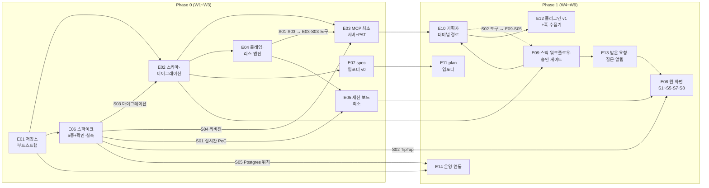

# 백로그

> **요약** — MVP(Phase 0 PoC + Phase 1)의 구현 백로그를 에픽 14개·스토리 74개로 확정한다. [3.7 로드맵](../03-proposal/roadmap.md)의 Phase 배분과 성공 기준(0-1~0-8 · 1-1~1-11)을 그대로 상위 근거로 삼고, 모든 스토리는 근거 문서 링크와 EARS 수용 기준·의존 스토리를 갖는다. Phase 0는 저장소 부트스트랩(E01)부터 spec 임포터 v0(E07 — 프로파일 엔진 · 임포트 API 표면 · CLI)까지, Phase 1은 웹 화면(E08)부터 운영·연동(E14)까지다. 스파이크 5종(실시간 게이트웨이 PoC(WS + SSE · Valkey) · TipTap md 왕복 · drizzle 마이그레이션 파이프라인 · MCP 리비전 병행 서빙 · 임베딩 서빙·하이브리드 검색)과 확인·실측 태스크 2종(운영 Postgres 위치 · 훅 헤더 `${NERV_TOKEN}` 확장)은 E06에 두어 아키텍처 리스크를 첫 2주 안에 태운다. 마지막 절은 로드맵 성공 기준을 재현 절차로 바꾼 E2E 수용 시나리오 5종이다.
>
> 문서 버전 v1.00 · 2026-09-22 · HTML 파생본: [backlog.html](../html/backlog.html)
>
> v1.00 변경(2026-09-22 — 스토리 없이 들어온 수정 하나, 앞 줄의 뒤처리): §1.4 셋째 표에 **관계 그래프가 그림으로 남은 적이 없었다** 한 줄([4.3](database.md) v0.43 · [4.2](codebase.md) REQ-CB-048 · v1.55). 스토리 수·`done` 수는 그대로다. **v0.99 가 범례를 붙이면서 드러난 자리**다 — 그 화면을 찍으려다 시드에 `spec_relation` 이 0건이라 캔버스가 아예 마운트되지 않는 것을 알았다. Activity(2026-08-23)·증적(2026-09-10)과 같은 형태의 세 번째이고, 셋 다 같은 문장으로 끝난다: **화면에 길을 내고도 그 길을 지나가는 데이터가 없으면 L3 도 스크린샷도 그 길을 보지 못한다.**
>
> v0.99 변경(2026-09-22 — 스토리 없이 들어온 수정 하나, 사람 보고): §1.4 셋째 표에 **색과 크기를 읽는 표가 없었다** 한 줄([4.5](screens.md) REQ-WEB-176·177 · v1.18). 스토리 수·`done` 수는 그대로다 — 관계 그래프 자체가 어느 스토리에도 없다(v0.98 과 같은 자리다). **기능이 없던 것이 아니라 있는 것을 읽을 방법이 없던 자리**이고, 그것은 v0.98 이 적은 "그림의 정직함" 과 같은 종류다: 그때는 화면이 없는 계층을 말했고, 이번에는 말한 것을 읽을 표가 없었다.
>
> v0.98 변경(2026-09-22 — 스토리 없이 들어온 수정 하나, 사람 보고): §1.4 셋째 표에 **겹쳐 그려지던 영역 상자** 한 줄([4.5](screens.md) REQ-WEB-174·175 · v1.17). 스토리 수·`done` 수는 그대로다 — 관계 그래프 자체가 어느 스토리에도 없다(가장 가까운 E08-S10 이 세는 것은 트리 스케일과 S3 관계 패널이다). **화면이 데이터에 없는 계층을 말하고 있었다**는 것이 이 줄의 내용이고, 그것은 기능의 유무가 아니라 그림의 정직함에 관한 자리다.
>
> v0.97 변경(2026-09-22 — 스토리 없이 들어온 수정 하나, 사람 보고): §1.4 셋째 표에 **긴 벡터 절단** 한 줄([4.2](codebase.md) REQ-CB-047 · v1.54). 스토리 수·`done` 수는 그대로다 — E06-S06(임베딩 프로필)이 세는 것은 "제공자를 env 로 고른다" 이고, **그 제공자가 내는 차원이 스키마와 다를 때 어떻게 하는가**는 그 스토리가 세지 않은 자리다.
>
> v0.96 변경(2026-09-22 — 웹의 본문 편집을 걷는다, 사람 결정): §1.4 셋째 표에 한 줄([4.5](screens.md) REQ-WEB-173 · v1.16). **스토리 수·`done` 수는 그대로지만 뜻이 바뀐 자리가 있다** — E06-S03(웹 에디터)·E06-S04(초안 리스)가 세던 것이 웹에서 없어졌다. 스토리를 되돌리지 않는 이유는 **그 일이 안 된 것이 아니라 그 자리가 옮겨 갔기** 때문이다(터미널 경로 = [4.6](plugin.md) spec 스킬). 되돌리면 백로그는 "아직 못 했다" 를 뜻하게 되고, 그것은 사실이 아니다.
>
> v0.95 변경(2026-09-22 — 스토리 없이 들어온 구현 하나, 사람 물음): §1.4 셋째 표에 **거절 뒤의 길과 다이어그램 배율** 한 줄([4.5](screens.md) REQ-WEB-172 · [4.4](api.md) REQ-API-161). 스토리 수·`done` 수는 그대로다.
>
> v0.94 변경(2026-09-21 — 스토리 없이 들어온 구현 하나, 사람 보고): §1.4 셋째 표에 **본문의 mermaid 와 트리의 펴기/접기** 한 줄([4.5](screens.md) REQ-WEB-169·170·171 · REQ-WEB-113 개정). 스토리 수·`done` 수는 그대로다 — E06-S03(에디터)이 세는 것은 "md 를 왕복 손실 없이 편집한다" 이고, **무엇이 그림으로 보이고 무엇이 눌리는가**는 그 스토리가 세지 않은 자리다.
>
> v0.93 변경(2026-09-21 — 스토리 없이 들어온 구현 하나, 사람 보고): §1.4 셋째 표에 **토큰이 어느 프로젝트의 것인지** 한 줄([4.5](screens.md) REQ-WEB-167·168 · [4.4](api.md) REQ-API-160). 스토리 수·`done` 수는 그대로다 — E01-S05(토큰 발급·폐기)가 세는 것은 "발급하고 폐기한다" 이고, **발급한 뒤에 그것을 관리한다**는 그 스토리가 세지 않은 자리다(프로젝트가 여럿이 되기 전에는 물음 자체가 없었다).
>
> v0.92 변경(2026-09-21 — 스토리 없이 들어온 수정 하나, 사람 보고): §1.4 셋째 표에 **첨부 주소의 오리진** 한 줄([4.5](screens.md) REQ-WEB-166 · v1.12). 스토리 수·`done` 수는 그대로다 — E06-S05(첨부)가 세는 것은 "올리고 본문에 넣는다" 이고, **그것이 어느 호스트로 가는가**는 그 스토리가 세지 않은 자리다(주소를 가르기 전에는 갈릴 것이 없었다).
>
> v0.91 변경(2026-09-21 — 같은 판정을 두 표면이 본다, 사람 지시): §1.4 셋째 표의 **매뉴얼 자리표시자** 줄에 설치 가능 판정을 더했다(줄 수 불변). 스토리 수·`done` 수는 그대로다 — 판정이 `apps/api` 에서 `@nerv/schema` 로 옮겨 간 것이라 새 기능이 아니고, 화면이 그것을 읽는 자리가 늘었을 뿐이다([4.5](screens.md) REQ-WEB-165 개정 · [4.2](codebase.md) v1.53).
>
> v0.90 변경(2026-09-21 — 설치 장이 이 배치의 값으로 말한다, 사람 지시): §1.4 셋째 표에 **매뉴얼의 자리표시자** 한 줄([4.5](screens.md) REQ-WEB-165 · v1.10). 스토리 수·`done` 수는 그대로다 — E12-S04(사람 온보딩 절차)가 세는 것은 "단계별 명령만으로 첫 `nerv_bootstrap` 까지" 이고, 그 명령에 **무엇을 넣어야 하는지를 사람이 따로 알아 와야 했던 것**은 그 스토리가 세지 않은 자리다.
>
> v0.89 변경(2026-09-21 — 스토리 없이 들어온 구현 하나, 사람 보고): §1.4 셋째 표에 **좁은 화면의 셸** 한 줄([4.5](screens.md) REQ-WEB-164 · v1.09). 스토리 수·`done` 수는 그대로다 — 휴대폰 폭에서 헤더가 겹치고 프로젝트 사이드바가 통째로 없던 것을 고쳤고, 어느 스토리에도 속하지 않는다(E08 은 셸을 "선다" 까지만 세고 그 폭을 세지 않았다).
>
> v0.88 변경(2026-09-20 — 설치가 설정까지 간다, 사람 지시): §1.4 셋째 표에 **`nerv-init`** 한 줄([4.6](plugin.md) REQ-PLG-018 · §3.7 · 패키지 0.3.0). 스토리 수·`done` 수는 그대로다 — E12-S03 이 적어 둔 "`.mcp.json` 미동봉은 남은 것이 아니라 **결정**이다" 도 그대로고, 바뀐 것은 그 파일을 **누가 만드는가**뿐이다.
>
> v0.87 변경(2026-09-20 — 스토리 없이 들어온 구현 하나): §1.4 셋째 표에 **네임스페이스 없이 렌더되던 셋**을 더한다. `base/web/` 의 Deployment·Service·Ingress 가 네임스페이스 없이 렌더되고 있었고 어느 스토리에도 속하지 않는다 — `base/kustomization.yaml` 의 `namespace: nerv` 는 그 kustomization 의 resources 에만 미치는데 오버레이는 `../../base/web` 을 따로 더한다. 게이트가 이제 그것을 센다(REQ-CB-046 일곱째)([4.2](codebase.md) v1.52).
>
> v0.86 변경(2026-09-20 — 공개 주소 분리 4단계 ②, 사람 지시): **E14-S04 가 네 단계를 전부 담는다**(스토리 수 불변 · **부분 10 → 9**). 플러그인의 배달 주소 13곳이 `api.` 로 갔고 `plugin.json` 이 0.2.23 이다(REQ-PLG-017 — 버전과 함께 가야 설치한 쪽이 새 사본을 받는다). **저장소 쪽에서 남은 것이 없어 `done` 으로 옮긴다** — 실제 전환(DNS·인증서·CDN)은 운영 주체의 몫이고 절차는 [4.2](codebase.md) §6.3a 가 적는다.
>
> v0.85 변경(2026-09-20 — 공개 주소 분리 4단계 ①, 사람 지시): **E14-S04 에 4단계의 k8s 지형을 더한다**(스토리 수·`done` 수 불변 · 여전히 부분이다). 들어온 것: base 는 `api.` 호스트만 갖고 화면은 `base/web/` 한 덩어리로 갈라졌으며(REQ-CB-045), 게이트가 **렌더 결과**를 센다(REQ-CB-046 — 그 전에는 두 오버레이의 Ingress 경로가 0개인 채로 초록이었다). 남은 것은 **플러그인 주소와 버전**뿐이다.
>
> v0.84 변경(2026-09-20 — 공개 주소 분리 3단계, 사람 지시): **E14-S04 의 현황을 3단계까지 옮긴다**(스토리 수·`done` 수 불변 · 여전히 부분이다). 들어온 것: 화면의 런타임 설정 로더와 앞문의 `/config.json`(REQ-CB-044). 남은 것은 **4단계 하나**다 — DNS·인증서·Ingress host·CDN 전환과 `base/web/` 을 오버레이로 내리는 일, `plugin/hooks/hooks.http.json` 의 하드코딩된 주소(`plugin.json` 버전과 함께). 앞문 nginx 의 `map` 한계도 그 칸에 그대로 있다.
>
> v0.83 변경(2026-09-20 — 스토리 없이 들어온 구현 하나): §1.4 셋째 표에 **세션 쓰기의 오리진 대조**를 더한다. 2단계에서 "결정하지 않았다" 로 남겨 둔 것을 사람이 확정한 것이고(REQ-CB-043) 어느 스토리에도 속하지 않는다 — 쿠키는 브라우저가 알아서 싣는 자격증명이라 CORS 도 `SameSite=Lax` 도 그 자리를 다 막지 못한다([4.2](codebase.md) v1.49).
>
> v0.82 변경(2026-09-20 — 공개 주소 분리 2단계, 사람 지시): **E14-S04 의 현황을 2단계까지 옮긴다**(스토리 수·`done` 수 불변 · 여전히 부분이다). 들어온 것: 허용 오리진 **한 목록**(CORS·better-auth·`/mcp` 가드가 같은 출처에서 읽는다 — [4.2](codebase.md) REQ-CB-041)과 세션 쿠키의 `Domain` 손잡이(REQ-CB-042), 그리고 그 둘을 브라우저 없이 세는 L2. 2026-09-14 에 적어 둔 미룸 하나가 여기서 닫힌다 — `/mcp` 가드가 `NERV_TRUSTED_ORIGINS` 를 보지 않던 비대칭이다. **앞문 nginx 의 `map` 은 그대로 오리진 하나만 안다**(치환이 한 줄이고 같은 값 두 줄이면 기동을 거부한다) — 최종 강제가 앱 가드라 실해는 없고, 이 사실은 남은 것 칸에 그대로 둔다. 남은 것은 **3·4단계**다: 웹의 런타임 설정 로더(`api.ts`·`session.ts`·`ws.ts` 가 여전히 상대 경로다)와 DNS·인증서·Ingress·CDN 전환.
>
> v0.81 변경(2026-09-14 — 스토리 없이 들어온 구현 하나): §1.4 셋째 표에 **`pnpm dev` 가 새 장비에서 뜨지 않았다**를 더한다. 런처가 부르던 루트 `.bin/vite` 는 pnpm 이 만드는 파일이 아니었고(고아 shim 으로 돌고 있었다) 어느 스토리에도 속하지 않는다([4.2](codebase.md) v1.46).
>
> v0.80 변경(2026-09-14 — 스토리 없이 들어온 구현 하나): §1.4 셋째 표에 **환경 구성 전수 점검의 여섯**을 더한다. local·docker·k8s 구성 파일 37개를 훑어 나온 것이고 어느 스토리에도 속하지 않는다 — dev 오버레이의 운영 S3 값, compose 워커의 없는 인증 키, 반만 실물이던 걷힌 이름 거부 셋이 결함이고, 나머지 셋은 사람 결정이다(ConfigMap 손잡이 전량 · 미러 PVC · 없는 서비스 기본값 비우기 · REQ-CB-040)([4.2](codebase.md) v1.45).
>
> v0.79 변경(2026-09-14 — 미룬 것을 적지 않으면 미룬 것이 아니다, 사람 지시): **E14-S04 의 남은 것에 `/mcp` 가드·앞문의 비대칭을 더한다.** 신뢰 오리진 파서를 손대면서([4.2](codebase.md) v1.41) 허용 목록의 **구성**은 2단계의 몫이라 두고 갔는데, 그 미룸이 어디에도 적혀 있지 않았다 — 적지 않은 미룸은 다음 사람에게 결함으로 보인다. 가드는 `NERV_TRUSTED_ORIGINS` 를 보지 않고(웹의 `/mcp` 호출 0건이라 실해는 없다) 앞문의 `map` 은 오리진 하나만 받는다.
>
> v0.78 변경(2026-09-14 — 스토리 없이 들어온 구현 하나): §1.4 셋째 표에 **앞문에 이름이 둘이었다**를 더한다. 포트 작업의 마지막 단계이고 어느 스토리에도 속하지 않는다 — 앞문을 호스트에 내보내는 포트와 리슨하는 포트가 이름 둘이었고, 하나로 합쳤다. REQ-CB-039 신설([4.2](codebase.md) v1.43).
>
> v0.77 변경(2026-09-14 — 스토리 없이 들어온 구현 하나): §1.4 셋째 표에 **포트 손잡이가 실제로 듣는다**를 더한다. [4.2](codebase.md) v1.40 이 깐 지도의 본체이고 어느 스토리에도 속하지 않는다 — `NERV_API_PORT` 가 전표에 있고 코드가 읽는데도 어느 배치에서도 듣지 않았고, 앞문이 리슨하는 포트에는 이름조차 없었다. REQ-CB-038 신설([4.2](codebase.md) v1.42).
>
> v0.76 변경(2026-09-14 — 스토리 없이 들어온 구현 하나): §1.4 셋째 표에 **적어 두지 않은 손잡이와 구분자 하나**를 더한다. [4.2](codebase.md) v1.40 이 깐 포트 지도의 1단계이고 어느 스토리에도 속하지 않는다 — 전표가 손잡이라고 적은 `NERV_S3_REGION` 이 실물 전표에만 없었고, `NERV_TRUSTED_ORIGINS` 의 구분자가 쉼표뿐이라 한 줄에 하나씩 적은 배치에서는 목록 전체가 못 쓰는 값이었다. 스킴을 빠뜨린 값이 문자열 `"null"` 로 읽혀 `Origin: null` 요청을 통과시키던 자리도 함께 막았다([4.2](codebase.md) v1.41).
>
> v0.75 변경(2026-09-13 — 공개 주소를 둘로 가른다, 사람 확정): **E14-S04 신설**(스토리 74 → 75 · `done` 65 · 부분 **10**). 화면과 API 를 서브도메인 둘로 가르는 일이 스토리로 없었다 — [4.1](scope.md) §2.3 이 확정 셋과 네 단계를 적는데 백로그가 그것을 세지 않으면 임포트된 Task 에도 없다. **1단계는 들어왔고 2~4단계가 남았다**: 이름을 갈랐고(`NERV_WEB_URL`·`NERV_API_URL` · 옛 이름은 기동 거부 — [4.2](codebase.md) REQ-CB-036·037) 두 값이 같은 오리진이라 동작은 바뀌지 않았다. 남은 것을 §1.4 부분 표에 전수로 적는다 — CORS·쿠키 도메인 · 웹의 런타임 설정 로더 · 실제 호스트 전환. **"완료" 로 뭉뚱그리면 남은 셋이 영영 보이지 않는다.**
>
> v0.74 변경(2026-09-10 — 사람 지시): §1.4 셋째 표에 **알림이 바뀐 자리로 데려간다**를 더한다. 어느 스토리에도 속하지 않는다 — 명세가 이미 약속한 동작을 구현이 지키지 않던 자리이고, 새 요구사항 둘(REQ-WEB-163 · REQ-API-159)은 사람이 번호를 떼도록 허락한 것이다([4.4](api.md) v1.31 · [4.5](screens.md) v1.06).
>
> v0.73 변경(2026-09-10 — 스토리 없이 들어온 구현 하나): §1.4 셋째 표에 **커서의 시각 정밀도 — 질의가 보장하고, 검사가 센다**를 더한다. v0.72 가 작업 목록에 세운 규칙을 남은 두 자리에 넓히는 일이고 어느 스토리에도 속하지 않는다 — 동작 변경은 없고(값이 바이트로 같다) 실제로 메운 것은 **그 결함을 세지 않던 검사**다. 커서를 가진 네 목록을 전수로 확인했고, 셋(이벤트·알림·세션)이 세지 않고 있었다([4.4](api.md) §1.6).
>
> v0.72 변경(2026-09-10 — 스토리 없이 들어온 구현 하나): §1.4 셋째 표에 **커서가 같은 밀리초 안의 행을 잃었다**를 더한다. pg18 점검 중 드러난 선재 결함이고 어느 스토리에도 속하지 않는다([4.4](api.md) v1.30).
>
> v0.71 변경(2026-09-10 — 스토리 없이 들어온 구현 하나): §1.4 셋째 표에 **로컬·CI·백업을 pg18 로 함께**를 더한다. 이미지 메이저를 올리는 일이고 어느 스토리에도 속하지 않는다 — 실측(마이그레이션 27건 · L2 810 전부 통과 · pgvector 동일 0.8.6)으로 판단했고 앱 코드는 고치지 않았다([4.2](codebase.md) v1.36).
>
> v0.70 변경(2026-09-10 — 사람 결정): §1.4 셋째 표에 **프로젝트 축을 타입이 지킨다**([4.5](screens.md) §1.4) 한 줄.
>
> v0.69 변경(2026-09-10 — 사람 결정): §1.4 셋째 표에 **관측 스펙은 자기 신원으로**([4.2](codebase.md) §4.3) 한 줄.
>
> v0.68 변경(2026-09-10 — 사람 지시): §1.4 셋째 표에 **개입 뒤 무효화도 id 축으로**([4.5](screens.md) §1.4) 한 줄.
>
> v0.67 변경(2026-09-10 — 사람 지시): §1.4 셋째 표에 **프로젝트 축을 id 하나로**([4.5](screens.md) §1.4) 한 줄.
>
> v0.66 변경(2026-09-10 — 사람 지시): §1.4 셋째 표에 **L3 가 재실행에 멱등해진다**([4.2](codebase.md) v1.34 §4.3) 한 줄.
>
> v0.65 변경(2026-09-10 — 사람 지시): §1.4 셋째 표에 **시드의 증적과 그 길을 지나는 L3**([4.3](database.md) v0.42) 한 줄.
>
> v0.64 변경(2026-09-10 — 사람 결정): §1.4 셋째 표에 **저장소 종류가 주소의 모양을 정한다**([4.4](api.md) REQ-API-158 · [4.5](screens.md) REQ-WEB-162 · 마이그레이션 0026) 한 줄.
>
> v0.63 변경(2026-09-10 — 사람 보고): §1.4 셋째 표에 **좁은 화면의 발견 상세 · 사용자 가이드 증적**([4.5](screens.md) REQ-WEB-161) 한 줄.
>
> v0.62 변경(2026-09-10 — 사람 지시): §1.4 셋째 표에 **저장소 주소를 넣을 자리 · 증적이 선 저장소 · 증적 종류 어휘**([4.5](screens.md) REQ-WEB-160 · [4.4](api.md) REQ-API-157) 한 줄.
>
> v0.61 변경(2026-09-10 — 사람 지시·보고): §1.4 셋째 표에 **done 게이트의 해소되지 않은 참조**([4.4](api.md) REQ-API-156) · **리뷰 센터 세 칸의 스크롤 상자**([4.5](screens.md) REQ-WEB-158) · **증적이 가리키는 곳으로 가는 링크**([4.5](screens.md) REQ-WEB-159) 세 줄.
>
> v0.60 변경(2026-09-08 — 사람 지시): §1.4 셋째 표에 **매뉴얼 본문의 스크롤 상자** 한 줄([4.5](screens.md) REQ-WEB-157).
>
> v0.59 변경(2026-09-08 — 사람 지시): §1.4 셋째 표에 **본문 칸의 스크롤 상자** 한 줄([4.5](screens.md) REQ-WEB-156).
>
> v0.58 변경(2026-09-08 — 사람 지시): §1.4 셋째 표에 **백로그 보기의 기본을 켜짐으로** 한 줄([4.5](screens.md) REQ-WEB-155).
>
> v0.57 변경(2026-09-08 — 사람 지시): 그 줄을 **SVG 까지** 넓힌다 — 같은 한 줄이 SVG 안의 `<style>` 도 막고 있었다([4.4](api.md) REQ-API-070).
>
> v0.56 변경(2026-09-08 — 사람 지시): §1.4 셋째 표에 **html 첨부의 CSP** 한 줄([4.4](api.md) REQ-API-070).
>
> v0.55 변경(2026-09-08 — 사람 지시): §1.4 셋째 표에 **탭 줄의 잘림 표시** 한 줄([4.5](screens.md) REQ-WEB-154).
>
> v0.54 변경(2026-09-08 — 사람 지시): §1.4 셋째 표에 **레일 머리 고정** 한 줄([4.5](screens.md) REQ-WEB-153).
>
> v0.53 변경(2026-09-08 — 사람 지시): §1.4 셋째 표에 **S3 폭 상한 둘 걷기 · 겹친 랜드마크** 한 줄([4.5](screens.md) REQ-WEB-152).
>
> v0.52 변경(2026-09-08 — 사람 보고): §1.4 셋째 표에 **탭 줄의 가로 축**(S3 곁레일 · S8 설정) 한 줄([4.5](screens.md) REQ-WEB-151).
>
> v0.51 변경(2026-09-07 — 아홉째 스프린트): §1.4 셋째 표에 **도구 카탈로그·README 대조 게이트** 한 줄.
>
> v0.50 변경(2026-09-07 — 여덟째 스프린트): §1.4 셋째 표에 **정본 표와 실물의 대조 게이트 둘** 한 줄. E12 배포 평면 서술의 "스킬 6종" 을 5종으로 고친다(`/nerv:import` 는 2026-09-06 에 걷었다).
>
> v0.49 변경(2026-09-07 — 일곱째 스프린트 ①): §1.4 셋째 표에 **프로파일 YAML 부분집합 · 매니페스트의 frontmatter** 한 줄([4.7](importer.md) REQ-IMP-029·030).
>
> v0.48 변경(2026-09-07 — 여섯째 스프린트 ①): §1.4 셋째 표에 **임포터의 abort 게이트 · 규칙 전표 대조 · 계약 세 열** 한 줄([4.7](importer.md) REQ-IMP-023~028 · [4.3](database.md) 0024).
>
> v0.47 변경(2026-09-07 — 클레임 이후를 아무도 태우지 않았다, 개선 계획 넷째 스프린트): **§5.6 시나리오 F 신설.** A~C 는 `nerv_bootstrap`·`nerv_task_claim` 까지만 태우고 웹 e2e 는 보드·세션·받은 요청을 열지 않아, 클레임 **이후**의 계약(하트비트 역채널 · done 게이트 · SessionEnd 회수)이 **한 세션 안에서 이어지는지**는 어느 검사도 보지 않았다 — 조각이 각각 초록인 것과 여정이 이어지는 것은 다른 사실이다. [3.7 로드맵](../03-proposal/roadmap.md) 성공 기준 0-8("도구만으로 완주")에 판정 수단이 없던 이유이기도 하다.
>
> v0.46 변경(2026-09-07 — 넷째 스프린트 ⑤): §1.4 셋째 표에 **유한 목록의 총계 · 관계 상한 제거** 한 줄([4.4](api.md) REQ-API-155).
>
> v0.45 변경(2026-09-07 — 넷째 스프린트 ④): §1.4 셋째 표에 **잔재 걷기와 손잡이 · 세션 보드 [더 보기]** 한 줄([4.2](codebase.md) REQ-CB-035 · [4.5](screens.md) REQ-WEB-150).
>
> v0.44 변경(2026-09-07 — 넷째 스프린트 ③): §1.4 셋째 표에 **임베딩 차원·절단·공개 S3 주소** 한 줄([4.2](codebase.md) REQ-CB-033·034 · [4.4](api.md) REQ-API-154).
>
> v0.43 변경(2026-09-07 — 넷째 스프린트 ②): §1.4 셋째 표에 **MCP 비신뢰 래핑 실물** 한 줄([4.4](api.md) REQ-API-153). 어느 스토리도 서버 래핑을 소유하지 않았다 — 도구의 존재(E03-S03)와 스킬의 문장(E12-S01)만 세어져 있었다.
>
> v0.42 변경(2026-09-07 — 넷째 스프린트 ①): §1.4 셋째 표에 **slug 해소의 조직 경계** 한 줄([4.4](api.md) REQ-API-152). E03-S02 의 '들어온 것' 에 EP-TOK-02 의 `org` 를 적는다.
>
> v0.41 변경(2026-09-07 — 감사 축): §1.4 셋째 표에 **권한·토큰의 감사** 한 줄([4.4](api.md) REQ-API-151).
>
> v0.40 변경(2026-09-07 — 셋째 스프린트 ⑦): §1.4 셋째 표에 **알림 등급·수신자** 한 줄([4.4](api.md) REQ-API-149·150).
>
> v0.39 변경(2026-09-07 — 셋째 스프린트 ⑥): §1.4 셋째 표에 **done 게이트 정책** 한 줄([4.4](api.md) REQ-API-146~148). E09-S05 의 '남은 것' 에서 리뷰 커버리지가 빠진다 — 이제 정책으로 켠다.
>
> v0.38 변경(2026-09-07 — 셋째 스프린트 ⑤): §1.4 셋째 표에 **EARS 작성 표면** 한 줄([4.4](api.md) REQ-API-144·145).
>
> v0.37 변경(2026-09-07 — 셋째 스프린트 ④): §1.4 셋째 표에 **웹의 Task 파생 문** 한 줄([4.5](screens.md) REQ-WEB-147·148).
>
> v0.36 변경(2026-09-07 — 셋째 스프린트 ③): §1.4 셋째 표에 **구현 축 파생** 한 줄([4.4](api.md) REQ-API-141).
>
> v0.35 변경(2026-09-07 — 셋째 스프린트 ②): §1.4 셋째 표에 **T3 정족수** 한 줄([4.4](api.md) REQ-API-140).
>
> v0.34 변경(2026-09-07 — 셋째 스프린트 ①): §1.4 셋째 표에 **결재 판정 한 벌** 한 줄([4.4](api.md) REQ-API-136~139).
>
> v0.33 변경(2026-09-07 — 둘째 스프린트 ⑥): §1.4 셋째 표에 **스킬이 가르치는 길** 한 줄([4.6](plugin.md) 패키지 0.2.19).
>
> v0.32 변경(2026-09-07 — 둘째 스프린트 ⑤): §1.4 셋째 표에 **승인 역채널** 한 줄([4.4](api.md) REQ-API-133~135).
>
> v0.31 변경(2026-09-07 — 둘째 스프린트 ④): §1.4 셋째 표에 **고아 작업을 되돌리는 문** 한 줄([4.5](screens.md) REQ-WEB-144).
>
> v0.30 변경(2026-09-07 — 둘째 스프린트 ③): §1.4 셋째 표에 **전이의 문지기** 한 줄([4.4](api.md) REQ-API-129~132). E09-S05 의 수용 기준 "유효한 리스 없이 `nerv_task_update(status=done)` 이 호출되면 거부한다" 가 이 커밋에서 참이 됐다 — 그전까지 이 스토리는 그 조건이 **무검사**인 채로 `done` 이었다.
>
> v0.29 변경(2026-09-07 — 둘째 스프린트 ②): §1.4 셋째 표에 **차단·결재가 남기는 사실** 한 줄([4.4](api.md) REQ-API-128).
>
> v0.28 변경(2026-09-07 — 둘째 스프린트 ①): §1.4 셋째 표에 **회수·해제 이벤트** 한 줄([4.4](api.md) REQ-API-127).
>
> v0.27 변경(2026-09-07 — 첫 스프린트 ⑥): §1.4 셋째 표에 **append-only 트리거** 한 줄([4.3](database.md) REQ-DB-023).
>
> v0.26 변경(2026-09-07 — 첫 스프린트 ⑤): §1.4 셋째 표에 **첨부 백업·보존** 한 줄([4.2](codebase.md) REQ-CB-031·032).
>
> v0.25 변경(2026-09-07 — 첫 스프린트 ④): §1.4 셋째 표에 **질의 어휘** 한 줄([4.4](api.md) REQ-API-126).
>
> v0.24 변경(2026-09-07 — 첫 스프린트 ③): §1.4 셋째 표에 **조직 경계** 한 줄([4.4](api.md) REQ-API-125).
>
> v0.23 변경(2026-09-07 — 첫 스프린트 ②): §1.4 셋째 표에 **커서 정합** 한 줄([4.4](api.md) REQ-API-124).
>
> v0.22 변경(2026-09-07 — 첫 스프린트, 사람 지시): §1.4 셋째 표에 **사람 전용 게이트** 한 줄. 전표가 사람 전용이라 적은 셋(질문 답변·게이트 면제·프로젝트 받은 요청)에 도메인 판정이 없어 에이전트 PAT 로 지나갔다([4.4](api.md) REQ-API-123).
>
> v0.21 변경(2026-09-06 — 스토리 없이 들어온 구현 셋): §1.4 셋째 표에 **임포트 매니페스트·`rebuild-map`** · **리포트 계약(규칙 슬러그·`warn`)** · **자라는 목록의 커서**를 더한다. 셋 다 정본이 계약으로 적어 두고 코드에 없던 자리이고, 어느 스토리에도 속하지 않는다.
>
> v0.20 변경(2026-09-06 — 스토리 없이 들어온 구현 하나): §1.4 셋째 표에 **막힘의 해소 조건 파생**을 더한다. 정본([3.5](../03-proposal/spec-workflow.md) §2)이 요구하던 "해소 조건" 을 열이 아니라 파생으로 답한 자리이고(4.4 REQ-API-118), 어느 스토리에도 속하지 않는다.
>
> v0.19 변경(2026-09-06 — 스토리 없이 들어온 구현 둘): §1.4 셋째 표에 **`.env` 전표 정합 게이트**와 **로그 수준 배선**을 더한다. 둘 다 [4.2](codebase.md) §5.2 가 계약으로 적어 두고 코드에 없던 자리이고, 어느 스토리에도 속하지 않는다.
>
> v0.18 변경(2026-09-06 — 스토리 없이 들어온 구현 셋): §1.4 셋째 표에 **에러 코드 → UI 매핑 한 곳** · **S3 우측 레일 넷** · **웹 클레임·근거 카드**를 더한다. 셋 다 [4.5](screens.md)가 이름까지 적어 두고 저장소에는 없던 자리이고, 어느 스토리에도 속하지 않는다(E08 의 남은 둘은 그대로다).
>
> v0.17 변경(2026-09-06 — E07-S05 의 남은 것이 닫혔다): `nerv import <kind>` 서브커맨드가 실재하게 됐다(정본·usage 문구·이 문서가 말하던 형태였고 파서만 몰랐다). E07 을 done 5 · 부분 0 으로, 합계를 **done 65 · 부분 9** 로 고치고 부분 표에서 그 행을 걷었다.
>
> v0.16 변경(2026-09-06 — E12-S05 의 산출물을 걷었다, 사람 결정): `/nerv:import` 스킬을 플러그인에서 뺐다([4.6](plugin.md) §2.5). **스토리는 `done` 으로 둔다** — 만든 것은 사실이고 걷은 것은 그 뒤의 범위 결정이라, 상태를 되돌리면 "만든 적 없다" 가 되어 §1.4 가 기록해야 할 것을 잃는다. 대신 스토리 행에 걷어낸 사실과 근거를 적었다.
>
> v0.15 변경(2026-09-06 — 백로그가 저장소를 설명하지 못했다, 정합성 대조 → 사람 지시): **§1.4 구현 현황 신설 · §1.1·§1.3 정정.** §1.1 이 "이 문서의 모든 스토리는 현재 `backlog`다" 라고 적고 있었는데 **74개 중 73개에 대해 거짓**이었다(실측: `done` 64 · 부분 10 · `backlog` 0). §1.3 은 "Phase 2 항목은 여기 스토리로 분해하지 않는다" 며 여섯을 나열했는데 **그중 다섯이 이미 들어와 있었다.** 이 문서는 §1.2 가 선언한 대로 **첫 임포트 대상**이라, 그 두 문장이 그대로 Task 74건의 초기 상태가 된다 — 틀린 상태로 적재되면 **이미 끝난 일을 에이전트가 다시 클레임한다**(이 제품이 없애려는 P2 그 자체다). 신설한 §1.4 는 셋을 싣는다: ① 에픽별 실측 표(근거는 파일 경로), ② **부분 구현 열의 *남은 것***("완료"로 뭉뚱그리면 남은 절반이 영영 보이지 않는다 — E09-S06 이 그 상태였다), ③ **스토리가 없는 구현 일곱**(리뷰 수집·첨부·초대·매뉴얼·미러 export·`nerv_question_cancel`·`preflight`). 갱신 규율은 이 절 안에 두었다 — **스토리를 끝내면 같은 커밋에서 표를 고친다.** 곁들여 본문의 낡은 수치 넷을 고쳤다: E02-S01 "테이블 29종"(→ 37), E12-S02 훅 기본 변형(`http` → `command`), E12-S03 `.mcp.json`(패키지에 담지 않는다), E12-S05 "도구 16종 불변".
>
> v0.14 변경(2026-09-05 — 용어 사전 반영, 사람 지시): [용어 사전](../glossary.md)의 채택어로 이 문서의 낱말을 옮긴다 — 기준선(← 베이스라인) · 워크플로우(← 워크플로) · 권한/소속/작업 범위(← 스코프) · 버전(← 판) · 고정 ID(← 안정 ID·키). **뜻은 바뀌지 않는다** — 코드·API 식별자는 그대로다.
>
> v0.13 변경(2026-09-05 — Phase 표기를 현황으로, 정합성 감사 → 사람 결정): E12 배포 평면 서술의 "스킬 5종(`/nerv:review`는 Phase 2)·`.mcp.json` 번들" 을 현황으로 고치고(6종 · `.mcp.json` 은 패키지에 없다), 참고 문헌의 엔티티 수를 37종으로.
> v0.12 변경(2026-09-04 — E09-S06 완료 표기): 기준선 스토리의 남은 절반(소비 축·웹 UI)을 구현했다. 서버 축(테이블·EP-SPEC-11~14)은 이미 있었고 **읽는 길과 만드는 문이 없어** 실사용 기준선이 0개였다([4.4](api.md) v0.66 · [4.5](screens.md) v0.66).
> v0.11 변경(2026-09-02 — 정본 정합): 리스 인계 표기를 정본에 맞춘다(2026-09-02 · [3.5](../03-proposal/spec-workflow.md) §1.2 · [4.4](api.md) §1.4h): 2026-08-30 에 보유자를 `(user, session)` 으로 좁히고 인계를 `takeover` 로 명시화했는데, 그 개정이 이 문서까지 오지 않아 여전히 "같은 사용자면 자동 인계" 라고 적고 있었다. **L3 시나리오 D 가 그 문장대로 쓰여 있었고 그래서 실패했다** — 에이전트 규약(3.4)은 아예 "이 에러는 오지 않는다" 고 적어, 그 말을 믿은 에이전트는 웹이 열어 둔 초안 앞에서 멈춘다.
> v0.10 변경(2026-08-30 — 표기 결함 정정, 사람 결정): **`E06-S06` 이 둘이었다** — 임베딩 스파이크와 훅 헤더 실측이 같은 번호를 썼다. 다른 문서 네 곳이 임베딩 쪽을 가리키므로 훅 실측을 **`E06-S07`** 로 옮긴다(번호는 재사용하지 않고 끝번호에 더한다). 곁들여 §2.6 제목과 의존 그래프 노드의 낡은 수("스파이크 4종")를 실제와 맞췄다. **E10-S02 의 수용 기준을 `base_version` → `base_hash` 로** 고쳤다([4.4](api.md) §1.4g·§1.4i).
> v0.8 변경(2026-08-22): 배포 산출물 위치 개정([4.2](codebase.md) v0.8 · REQ-CB-015) 반영 — E01-S01 스토리의 트리 서술을 2구역(코드 `codebase/` · 배포 `deploy/`)으로 갱신. 스토리 수·의존·수용 기준 불변.
>
> v0.7 변경(2026-08-22): 임베딩 제공자 추상화([4.2](codebase.md) §5.2a) 반영 — E06-S06을 3프로필 스모크로, E09-S11에 제공자 클라이언트·1024차원 검증 추가. 재검토에서 발견된 표기 결함 정정(E06 스파이크 4종 → 5종, W2 테이블 수 27 → 29).
>
> v0.6 변경(2026-08-22 — 하이브리드 검색·탐색 UI MVP 확정, [4.1](scope.md) §2.1): **E06-S06**(임베딩 서빙·하이브리드 검색 스파이크) · **E09-S10·S11·S12**(하이브리드 검색 백엔드·임베딩 파이프라인·관계 API) · **E08-S09·S10**(퀵 스위처·트리 스케일+관계 패널) 추가. 스토리 68 → 74. 스파이크 4종 → 5종.
>
> v0.5 변경(2026-08-22 — 구현 착수 검토의 공백 보완 반영): **E09-S08**(스펙 메타 편집·아카이브 — EP-SPEC-15~17) · **E09-S09**(`spec_relation` 자동 추출) · **E12-S06**(오프라인 폴백 실물) 추가, E01-S05(CI — codebase §4.5)·E14-S02(백업 — codebase §6.5) 근거를 신설 절로 갱신. 스토리 65 → 68.
>
> v0.4 변경(2026-08-22): 임포터 실행 모델 확정(CLI + 임포트 API — [4.7 스펙 임포터](importer.md) §3.2)에 따라 **E07-S04·S05**(임포트 REST 표면 · `apps/cli`)와 **E12-S05**(`/nerv:import` 스킬)를 추가하고 시나리오 E를 갱신했다. 스토리 62 → 65.

---

## 1. 읽는 법

### 1.1 ID·상태·표기 규약

- **에픽/스토리 ID** — `E01-S01` 형식(에픽 번호-스토리 번호). 에픽은 Phase 0(E01~E07) → Phase 1(E08~E14) 순으로 번호가 붙고, 스토리 번호는 에픽 안의 권장 착수 순서다.
- **상태 어휘** — 스토리는 Task 축 상태 머신([3.5 스펙 워크플로우와 거버넌스](../03-proposal/spec-workflow.md) §1.4)의 어휘를 그대로 쓴다: `backlog → ready → claimed → in_progress → in_review → done`, 예외 상태 `blocked`(사유 코드 필수). **스토리별 현재 상태는 §1.4 가 정본이다** — 2026-09-06 실측으로 `done` 64 · 부분 10 · `backlog` 0 이다. (2026-08-22 신설 당시의 "모든 스토리는 현재 `backlog`다" 를 그대로 두어 **74개 중 73개에 대해 거짓인 문장**이 2주간 남아 있었다 — 이 문서는 첫 임포트 대상이라 그 문장이 그대로 Task 74건의 초기 상태가 된다.)
- **근거** — 모든 스토리는 근거 링크를 갖는다: 기존 13편의 § 참조, FR/NFR 번호([1.2 문제 정의와 요구사항](../01-problem/pain-points.md) §4), D-번호 결정, 또는 4부 형제 문서의 REQ-* / § 참조. 근거 없는 스토리는 백로그에 넣지 않는다.
- **EARS 수용 기준** — 행동 요구는 `WHEN … THE SYSTEM SHALL …` 형식으로 쓴다. 스토리당 1~3개.
- **의존** — 의존 스토리 ID를 표기한다. 의존이 `done`이 아니면 해당 스토리는 `ready`로 전이하지 않는다(FR-05의 ready 판정을 이 백로그 자신에게 적용).

### 1.2 도그푸딩 — 이 문서가 첫 임포트 대상이다

이 백로그는 NERV 가동 후 **첫 임포트 대상**이다. 도그푸딩 임포트는 P1이다([4.7 스펙 임포터](importer.md) §1.1) — `docs/04-mvp/*.md` 문서 세트의 Spec 적재는 nerv-docs 프로파일(importer §5.1)로, 이 문서의 에픽·스토리 → Task 적재는 P1 plan 임포터와 같은 경로(E11 시점)로 수행한다. 문서 머리의 frontmatter(`id: SPC-MVP-BACKLOG`)가 [4.7 스펙 임포터](importer.md) §5의 임포트 규격을 따르는 이유다. 임포트 이후 이 md는 read-only 미러가 되고 SoT는 서버다(D-01 · [3.7 로드맵](../03-proposal/roadmap.md) §7.4).

### 1.3 범위 경계

이 백로그는 MVP = Phase 0 + Phase 1만 다룬다([4.1 MVP 범위와 스택 확정](scope.md) §3). Phase 2 항목은 로드맵 §4가 정본이며 여기 스토리로 분해하지 않는다 — **다만 그중 여섯은 이미 들어와 있다**(2026-09-06 정정): 리뷰 수집·S6 리뷰 센터·`nerv_review_submit`/`nerv_finding_resolve`·`/nerv:review`·review 임포터. 앞당겨 구현한 근거는 [4.1 범위](scope.md) §5 의 착수 기록이고, 실물의 자리는 §1.4 의 "스토리가 없는 구현" 표다. 여전히 분해하지 않는 것은 **게이트 판정 완성**(FR-10 둘째 단 — 화면은 판정을 표시할 뿐 아직 막지 않는다)과 **Codex 완전 지원**이다.

### 1.4 구현 현황 (2026-09-06 실측)

**스토리별 상태의 정본은 이 절이다.** 세는 법은 하나다 — 스토리의 EARS 수용 기준을 만족하는 실물이 저장소에 있으면 `done`,
일부만 있으면 **부분**이고 그때는 *남은 것*을 반드시 적는다. 근거는 파일 경로다.

| 에픽 | `done` | 부분 | 대표 근거 |
| --- | ---: | ---: | --- |
| E01 저장소 부트스트랩 | 5 | — | `codebase/pnpm-workspace.yaml` · `apps/api/src/main.ts` · `.github/workflows/ci.yml` |
| E02 스키마·마이그레이션 | 4 | — | `packages/schema/src/tables/` (테이블 37) · `drizzle/0000`~`0019` · `event.service.ts` |
| E03 MCP 최소 서버 + PAT | 3 | 1 | `mcp/mcp.controller.ts` · `*.tools.ts`(도구 24) · `packages/schema/src/errors.ts` |
| E04 클레임·리스 엔진 | 5 | — | `task.service.ts`(FOR UPDATE) · `claim.service.ts` · `worker/advisory-lock.ts` |
| E05 세션 보드 최소 | 4 | — | `session.service.ts` · `event/ws.gateway.ts` · `event/sse.controller.ts` |
| E06 스파이크 + 확인·실측 | 3 | 4 | `test/integration/spike-realtime.spec.ts` · `apps/web/.spike/tiptap-roundtrip.md` |
| E07 spec 임포터 v0 | 5 | — | `apps/cli/src/profiles/` · `report/index.ts` · `modules/import/import.controller.ts` |
| E08 웹 화면 | 8 | 2 | `routes/p.$proj/specs.$spec.tsx`(버전 diff) · `steer-panel.tsx` · `quick-switcher.tsx` |
| E09 스펙 워크플로우·승인 게이트 | 11 | 1 | `0000_init.sql`(동결 트리거) · `spec/gate-tier.ts` · `spec/search.service.ts`(RRF) |
| E10 기획자 터미널 경로 | 4 | — | `spec.service.ts`(`NERV_DRAFT_LEASED`·takeover) · `spec-comment.service.ts` |
| E11 plan 임포터 | 2 | — | `apps/cli/src/parse/plan.ts` · `apps/cli/src/run.ts` |
| E12 플러그인 v1 + 훅 수집기 | 5 | 1 | `plugin/skills/`(6종) · `session/ingest.controller.ts` · `plugin/bin/nerv-outbox` |
| E13 받은 요청·질문·알림 | 3 | — | `approval.service.ts`(`content_hash` stale) · `question.service.ts` · `notification.service.ts` |
| E14 운영·연동 | 4 | — | `deploy/k8s/base/` · `deploy/scripts/nerv-backup.sh` + `restore-roundtrip.spec.ts` · `task/webhook.service.ts` · `apps/api/src/common/origins.ts` |
| **합계** | **66** | **9** | `backlog` 0 |

§5 의 **E2E 수용 시나리오 A~F 도 여섯 전부 실물**이다 — `apps/api/test/e2e/scenario-a-c.spec.ts` · `scenario-d-e.spec.ts` · `scenario-f-journey.spec.ts`(2026-09-07 신설 — 그전까지 A~C 는 클레임까지만 태웠고 그 **이후**의 계약은 L2 조각들만 봤다).

#### 부분 구현 열 — 남은 것을 적어 둔다

"완료"로 뭉뚱그리면 남은 절반이 영영 보이지 않는다. E09-S06 이 정확히 그 상태였다(서버 축만 있고 읽는 길과 만드는 문이 없어 실사용 기준선이 0개였다).

| ID | 들어온 것 | **남은 것** |
| --- | --- | --- |
| E03-S02 | PAT 해시 저장·프로젝트 소속·검증 · **발급이 조직을 받는다**(EP-TOK-02 `org` — [4.4](api.md) REQ-API-152) | better-auth **api-key 플러그인 대신 자체 `api_token` 테이블**(이탈 근거는 `auth.service.ts` 머리 주석) · **발급 CLI 없음**(웹 설정 화면이 유일한 발급 경로) |
| E06-S03 | 마이그레이션 파이프라인 양쪽 경로가 실제로 돈다 | **스파이크 리포트 자체**(후보 2안 비교·롤백 절차·선정 근거) |
| E06-S04 | 리비전 협상·병행 서빙 코드 | Claude Code·Codex **두 클라이언트 실측 리포트** |
| E06-S06 | degrade 경로·1024차원 검증 | **3프로필 지연 실측·한국어 질의 품질 비교·go/no-go 판정**([4.4 API](api.md)가 임베딩 p95 를 아직 보류로 둔다) |
| E06-S07 | command 폴백이 기본 변형으로 배포됨 | 기록된 근거는 훅 `url` 의 `${VAR}` **미**확장이지 **`headers` 확장 자체의 실측이 아니다**([4.6 플러그인](plugin.md) §3.1이 아직 "1차 문서에서 확인 못함"이라 적는다) |
| E08-S05 | 칸반 레인·위임 명세 4요소 zod 폼 | **승인된 SpecVersion 에서 파생하는 웹 경로** — `delegation-form.tsx` 의 스키마에 `source_spec_version_id` 가 없어 파생은 REST·MCP 로만 된다 |
| E08-S10 | 가상 스크롤·필터·관계 패널·degraded 배너 | **`depth` 지연 로드** — 서버는 그 인자를 받는데 `useSpecTree` 가 넘기지 않는다 |
| E09-S03 | 지시자≠승인자 차단 | **리뷰어 자동 지정** — `ApprovalService.request()` 를 부르는 곳이 `assigneeUserId` 를 넘기지 않아 결재 카드는 언제나 `assignee_user_id = NULL` 로 만들어진다(그 열이 채워지는 것은 결재 시점의 `COALESCE` 뿐이라 *지정*이 아니라 *기록*이다) |
| E12-S03 | statusline · 마켓플레이스 · 관리형 settings | 수용 기준의 **"활성화 여부를 서버에서 확인"**(플러그인 버전 보고) 경로. ※ `.mcp.json` 미동봉은 남은 것이 아니라 **결정**이다(REQ-PLG-001 개정 — 패키지 테스트가 부재를 강제한다) |

#### 스토리가 없는 구현 — 백로그가 저장소를 설명하지 못하는 자리

아래는 **구현됐는데 이 문서에 스토리가 없다.** 백로그가 "무엇을 만들 것인가"의 목록이라면, 만든 것이 목록에 없다는 것은 그 목록이 더 이상 저장소를 설명하지 않는다는 뜻이다.

| 무엇 | 실물 | 비고 |
| --- | --- | --- |
| 리뷰 수집 전체(FR-09) | `modules/review/` · `routes/p.$proj/reviews.index.tsx` · `review.tools.ts` · `skills/review/` · `cli/src/parse/review.ts` | §1.3 이 "분해하지 않는다"고 적은 여섯 중 다섯이 여기다 |
| 스펙 첨부 | `attachment` 테이블 · `nerv_spec_attach` · `nerv_spec_attachment_read` | 2026-09-01·09-04 도입 |
| 조직 초대 | `modules/auth/invitation.controller.ts` · `routes/invite.$token.tsx` · `0006_invitation` | |
| 제품 매뉴얼 `/help` | `apps/web/src/content/manual/{ko,en}/` 10장 × 2 · `routes/help/` | [AGENTS.md](../../AGENTS.md) 구현 규약 5 가 요구하는 산출물이다 |
| md 미러 export 잡 | `worker/jobs/export.job.ts` | 코드가 스스로 "P1 후반"이라 적는다 |
| `nerv_question_cancel` | `modules/approval/question.tools.ts` | 2026-09-05 신설 |
| `pnpm preflight` · `hooks:install` | `codebase/scripts/preflight.mjs` · `install-hooks.mjs` | 규약 7 이 커밋 전 필수로 지정한 도구 |
| 에러 코드 → UI 매핑 한 곳 | `apps/web/src/lib/api-errors.ts`(`describeApiError` · `useApiError`) | [4.5](screens.md) §1.5 표가 "모든 화면의 기본값" 으로 선언된 계약인데 코드를 보는 자리가 셋뿐이었다(2026-09-06) |
| S3 우측 레일 넷 | `features/spec-editor/{requirement-panel,source-view,terminal-handoff}.tsx` | [4.5](screens.md) §2.4 가 이름까지 적어 두고 저장소에 없던 것들(2026-09-06) |
| 웹 클레임·근거 카드 | `routes/p.$proj/tasks.$task.tsx` | [4.5](screens.md) §2.5 화면 요소 "사람 클레임"·출처 역링크(2026-09-06) |
| `.env` 전표 정합 게이트 | `codebase/scripts/check-env-table.mjs` | 전표가 소비자를 적으면 계약인데 `NERV_LOG_LEVEL` 은 읽는 코드가 0건이었다(2026-09-06 · [4.2](codebase.md) §5.2) |
| 로그 수준 배선 | `apps/api/src/common/log-level.ts` | 두 진입점이 같은 함수로 읽는다 — 장애 때 로그를 늘릴 손잡이가 재배포뿐이었다(2026-09-06) |
| 막힘의 해소 조건 파생 | `task.service.ts` `blockedResolution()` | 정본([3.5](../03-proposal/spec-workflow.md) §2)이 요구하던 "해소 조건" — **열이 아니라 파생**으로 답했다(2026-09-06 · REQ-API-118) |
| 임포트 매니페스트 · `rebuild-map` | `apps/cli/src/manifest.ts` · `run.ts` | [4.7](importer.md) §3.3 전체가 계획이었다 — `--map` 은 파싱만, `rebuild-map` 은 오히려 적재를 했다(2026-09-06) |
| 리포트 계약 — 규칙 슬러그·`warn` | `apps/cli/src/report/index.ts` | `warn` 이 없어 **정상 실행이 종료 코드 1** 을 냈다([4.7](importer.md) §4.1) |
| 사람 전용 게이트 — 답변·면제·프로젝트 받은 요청 | `approval/question.service.ts` `answer()` · `approval.service.ts` `bypass()`·`inbox()` · `common/human-only.spec.ts` | 전표가 사람 전용이라 적은 셋에 도메인 판정이 없었다 — 역할 문턱은 PAT 도 지난다(2026-09-07 · [4.4](api.md) REQ-API-123) |
| 커서가 정렬 키와 같아진다 | `common/cursor.ts`(`cursorTimestamp`·`cursorId`) · `event.service.ts` · `notification.service.ts` · `session.service.ts` · `test/integration/cursor-seek.spec.ts` | 같은 시각의 행이 쪽 경계에서 사라지고 세션은 겹쳤다 — 웹의 "최근 활동" 회귀도 함께(2026-09-07 · [4.4](api.md) REQ-API-124) |
| 조직 경계 — 알림 수신자·소규모 완화 count | `notification.service.ts`(`approvalTargets`·`roleQueue`) · `approval.service.ts`(`canApproveSql`·`assertSelfApprovalAllowed`) | `project_id IS NULL` 을 조직 없이 세던 자리 셋 — 다른 조직으로 알림이 샜다(2026-09-07 · [4.4](api.md) REQ-API-125) |
| 질의 어휘를 접지 않는다 | `common/query-vocab.ts` 를 쓰는 다섯 표면 · `event.service.ts`(`type`) · `enums.ts`(파생 어휘 둘) | `?status=cancelled` 가 열린 목록을 200 으로 돌려주던 자리(2026-09-07 · [4.4](api.md) REQ-API-126) |
| 첨부 백업·보존 접기·blob 만료 | `deploy/scripts/nerv-backup.sh` · `deploy/k8s/base/backup/cronjob.yaml` · `worker/jobs/retention.job.ts` | 백업이 첨부를 한 번도 담지 않았고 접기가 같은 키를 덮어썼다(2026-09-07 · [4.2](codebase.md) REQ-CB-031·032) |
| 감사 로그 append-only 트리거 | `drizzle/0022_event_append_only.sql` · `test/integration/event-broadcast.spec.ts` | FR-16 의 불변성이 코드 규약뿐이었다(2026-09-07 · [4.3](database.md) REQ-DB-023) |
| 회수·해제가 남기는 사실 | `claim.service.ts`(`reclaimExpired`·`releaseBySession`·`finalize`) · `session.service.ts` 세 경로 · `drizzle/0023` | 리스 만료 회수가 이벤트 0건이었고 stale 은 클레임을 건드리지 않았다(2026-09-07 · [4.4](api.md) REQ-API-127) |
| 차단·결재가 남기는 사실 | `task.service.ts`(`claimInTx` 별도 트랜잭션 · `gate.failopen`) · `approval.service.ts` · `spec.service.ts`(`approveInTx` 액터) · `notification.service.ts`(겹침 수신자) | 카탈로그에 critical 로 올라 있는 차단 이벤트를 내는 곳이 0 이었고, 결재 결정이 `question.answered` 로 남았다(2026-09-07 · [4.4](api.md) REQ-API-128) |
| 전이의 문지기 | `task.service.ts`(`assertMayTransition`·`transition` 의 ready 판정·`activeClaimOf`) · `task.tools.ts` · `constants.ts`(`TASK_TRANSITION_TARGETS`·`TASK_LEASE_BOUND_TARGETS`·`isDelegationFilled`) | 활성 클레임이 없으면 판정을 건너뛰어 **리스 없는 done 이 무검사**였다(2026-09-07 · [4.4](api.md) REQ-API-129~132) |
| 고아 작업을 되돌리는 문 | `routes/p.$proj/tasks.$task.tsx` · `routes/task-detail-transitions.spec.tsx` | 임포트가 만든 클레임 없는 `in_progress` 가 큐에도 안 보이고 잡을 수도 없었다(2026-09-07 · [4.5](screens.md) REQ-WEB-144) |
| 승인 역채널 | `approval.service.ts`(`pendingDecisionsFor`·깨우기) · `task.service.ts`(하트비트) · `spec.service.ts`·`review.service.ts`(대기 세우기) · `question.service.ts`(`answered_by`) | A3 승인이 나도 요청한 세션은 영영 듣지 못했고, 기다리는 세션이 화면에 `active` 로 보였다(2026-09-07 · [4.4](api.md) REQ-API-133~135) |
| 스킬이 가르치는 길 | `plugin/skills/*/SKILL.md` 다섯 · `plugin/codex/config.toml` · `plugin/managed-settings.example.json` | 허용 목록에 없는 도구를 부르게 하고, 없는 폴링을 가르치고, 약속한 캐시 파일을 아무도 쓰지 않았다(2026-09-07 · [4.6](plugin.md) v0.62) |
| 결재 판정 한 벌 | `approval/approval-policy.ts`(신설) · `approval.service.ts` · `spec.service.ts`(제출 권한 · approve/reject 삭제) · `scopes.ts` | 같은 물음을 셋이 각자 답해 목록과 결정이 갈라졌고, 남이 제출해 주면 작성자가 자기 초안을 승인할 수 있었다(2026-09-07 · [4.4](api.md) REQ-API-136~139) |
| T3 정족수 | `spec.service.ts`(`ensurePendingApproval` 슬롯) · `approval.service.ts`(`applyToSubject` 집계) · `approval-policy.ts`(`quorumSql`) · `approval-card.tsx` | 첫 승인이 곧 확정이라 T3 게이트가 1인으로 닫혔다(실측 3건 · 2026-09-07 · [4.4](api.md) REQ-API-140) |
| 구현 축 파생 — verified·술어 한 벌 | `spec/impl-status.ts`(`verified` 분기 · `evidenceExistsSql`) · `task.service.ts`·`claim.service.ts`(회수·전이 재파생) · `spec.service.ts`(커버리지 술어) | `verified` 로 갈 길이 없었고 증적 술어가 두 벌이라 대시보드와 요구사항이 다른 말을 했다(2026-09-07 · [4.4](api.md) REQ-API-141) |
| 웹의 Task 파생 문 · 근거 카드 | `features/task-board/delegation-form.tsx` · `features/spec-editor/requirement-panel.tsx` · `routes/p.$proj/tasks.index.tsx`·`tasks.$task.tsx` · `lib/clock.ts` · `task.service.ts`(상세) | 웹에서 만든 Task 가 어느 요구사항도 책임지지 않았고(487건 중 214건) 상세는 근거를 UUID 로 그렸다(2026-09-07 · [4.5](screens.md) REQ-WEB-147·148) |
| EARS 작성 표면 | `spec-check.service.ts`(0건 경고) · `spec.service.ts`·`spec.controller.ts`(EP-REQ-04) · `plugin/skills/spec`(형식 절) | 형식이 정규식 한 줄에만 있어 승인본 65건에 요구사항이 0건이었다(2026-09-07 · [4.4](api.md) REQ-API-144·145) |
| done 게이트 정책 · 리뷰 링크 | `zod/policy.ts`(`done_gate`) · `task.service.ts`(`assertDoneGate`) · `evidence-locator.ts`(신설) · `review.service.ts`(활성 클레임에서 task_id) | 게이트가 자기 신고 문자열 1건으로 열렸고 리뷰 1,992건 중 Task 링크가 2건이었다(2026-09-07 · [4.4](api.md) REQ-API-146~148) |
| 알림 등급·수신자 | `notification.service.ts`(등급 필터·둘로 세기·owner_role 수신자) · `event.controller.ts` · `app-shell.tsx`·`routes/notifications.tsx` | 배지가 배경 활동까지 세어 결정 99건이 767건에 묻혔다(2026-09-07 · [4.4](api.md) REQ-API-149·150) |
| 권한·토큰의 감사 | `event/event-core.module.ts`(신설) · `auth.service.ts`·`invitation.service.ts`·`attachment.service.ts` · `events.ts` | FR-16 이 요구하는 축이 멤버십·토큰·프로젝트 변경에서 비어 있었다(2026-09-07 · [4.4](api.md) REQ-API-151) |
| 도구 카탈로그·README 대조 게이트 | `apps/api/test/integration/mcp.spec.ts` · `plugin/plugin-package.spec.ts` | [3.4](../03-proposal/agent-integration.md) §2.3 카탈로그가 네 자리에서 실물과 달랐고(문서에만 있는 인자는 `ignored_args` 로 버려진다), 플러그인 README 가 배달 파일 다섯을 적지 않았다 |
| 탭 줄의 가로 축 — 줄과 내용이 각자 민다 | `routes/p.$proj/specs.$spec.tsx` · `routes/settings/route.tsx` · `spec-rail.spec.tsx` · `settings/workspace.spec.tsx` · `apps/web/test/e2e/spec-navigation.spec.ts` | 세로만 열려던 `overflow-y-auto` 가 가로도 열어 **레일이 통째로** 옆으로 밀렸다 — 설정 탭 줄도 같은 모양이었다([4.5](screens.md) REQ-WEB-151) |
| S3 폭 상한 둘 · 겹친 랜드마크 | `routes/p.$proj/specs.$spec.tsx` · `spec-rail.spec.tsx` · `apps/web/test/e2e/spec-navigation.spec.ts` | 컨테이너 80rem + 본문 44rem 이라 **1512px 위로는 여백만 늘었다** — 레일이 오른쪽 끝에 붙지 않았다. 셸 밖에 `<main>` 이 하나 더 있던 것도 함께([4.5](screens.md) REQ-WEB-152) |
| 레일 머리 고정 — 탭 줄과 방향 하위 탭 | `routes/p.$proj/specs.$spec.tsx` · `spec-rail.spec.tsx` · `apps/web/test/e2e/spec-navigation.spec.ts` | 관계 93건 문서에서 목록을 내리면 탭이 **함께** 사라져 되감아야 돌아왔다 — 하위 탭은 본문 칸이 스크롤 상자라 옮겨야 했다([4.5](screens.md) REQ-WEB-153) |
| 탭 줄의 잘림 표시 — 넘친 쪽만 흐린다 | `lib/scroll-edges.ts`(신설) · `routes/p.$proj/specs.$spec.tsx` · `lib/scroll-edges.spec.ts` · `spec-rail.spec.tsx` · `apps/web/test/e2e/spec-navigation.spec.ts` | 밀 수는 있는데 **밀 수 있다는 신호**가 없었다 — macOS 는 막대를 숨긴다([4.5](screens.md) REQ-WEB-154) |
| S3 본문 칸이 자기 안에서 흐른다 | `routes/p.$proj/specs.$spec.tsx` · `spec-rail.spec.tsx` · `apps/web/test/e2e/spec-navigation.spec.ts` | 스크롤 상자가 문서 전체라 **곁레일 위에서 굴린 바퀴가 본문을 움직였다**(실측 400px) — 화면 높이를 확정하고 본문·레일이 각자 흐른다([4.5](screens.md) REQ-WEB-156) |
| 매뉴얼 본문도 자기 안에서 흐른다 | `routes/help/route.tsx` · `routes/help/$chapter.tsx` · `routes/help.spec.tsx` · `apps/web/test/e2e/manual.spec.ts`(신설) | `/help` 도 같은 자리였다 — **차례 위에서 굴린 바퀴가 본문을 움직였다**(실측 400px · 문서 넘침 2,064px). 차례가 있는 폭부터 화면 높이를 확정한다([4.5](screens.md) REQ-WEB-157) |
| done 게이트가 해소되지 않은 참조를 봤다 | `task/task.service.ts`(`assertDoneGate` 시그니처 · 클레임 차단 감사) · `test/integration/spec-check.spec.ts` | `nerv_task_update` 의 `done` 이 **키로 부르면 항상 실패**했다(22P02 → 그물에 걸려 400) — 게이트에만 원래 참조가 넘어갔고, done L2 가 전부 UUID 로만 전이해 키 경로는 한 번도 지나가지 않았다([4.4](api.md) REQ-API-156) |
| 리뷰 센터 세 칸이 각자 흐른다 | `routes/p.$proj/reviews.index.tsx` · `review-center/gate-coverage.tsx` · `review-center.spec.tsx` · `apps/web/test/e2e/review-scroll.spec.ts`(신설) | 스크롤 상자가 페이지라 **레일 위에서 굴린 바퀴가 큐를 움직였다** — 게이트 현황은 컨텐츠 칸으로 들이고 표의 고정 폭도 그 폭에 맞춰 다시 쟀다([4.5](screens.md) REQ-WEB-158) |
| 증적이 가리키는 곳으로 간다 | `lib/evidence.ts`(신설) · `routes/p.$proj/tasks.$task.tsx` · `lib/evidence.spec.ts`(신설) · `routes/p.$proj/task-evidence.spec.tsx`(신설) · i18n 둘 · 매뉴얼 ko·en | 명세 §2.5 (6) 은 "PR·커밋 링크" 라고 적었는데 화면은 **글자로만** 그렸다 — 종류마다 갈 곳으로 새 탭에서 열고, 짐작할 수 없는 것은 글자로 둔다([4.5](screens.md) REQ-WEB-159) |
| 저장소 주소를 넣을 자리 · 증적이 선 저장소 | `routes/settings/workspace.tsx` · `auth.service.ts`(빈 값은 비운다) · `task.service.ts`(증적 `repo`) · `lib/evidence.ts` · `packages/schema/src/enums.ts`(`EVIDENCE_KINDS`) · 스펙 넷 · 매뉴얼 ko·en | REQ-WEB-159 가 "저장소 주소가 비어 있습니다" 라고 말하는데 **채울 칸이 화면에 없었다**(막다른 길 — §1.5) · 증적이 자기 `repo` 를 못 실어 저장소가 둘 이상이면 남의 저장소로 데려갔다 · 종류 셀렉트가 여섯 중 넷이었다([4.5](screens.md) REQ-WEB-160 · [4.4](api.md) REQ-API-157) |
| 좁은 화면에서도 고른 발견을 편다 | `routes/p.$proj/reviews.index.tsx` · `lib/use-media-query.ts`(신설) · `lib/manual-chapters.ts`(신설) · `lib/evidence.ts` · `review-center.spec.tsx` · `manual.spec.ts` · `lib/evidence.spec.ts` | 곁레일이 `xl` 부터라 1024~1279px 에서는 **눌러도 카드 배경만 바뀌었다** — 같은 컴포넌트를 카드 아래에서 편다(§2.6 REQ-WEB-132·142 와 같은 규칙) · `user_guide` 증적은 실재하는 장일 때만 매뉴얼로 잇는다([4.5](screens.md) REQ-WEB-161) |
| 저장소 종류가 주소의 모양을 정한다 | `drizzle/0026_project_repo_host.sql` · `packages/schema/src/enums.ts`(`REPO_HOSTS`) · `tables/tenancy.ts` · `auth.service.ts`·`auth.controller.ts` · `zod/tenancy.ts` · `routes/settings/workspace.tsx` · `lib/evidence.ts` · L1 8건 · L2 1건 | 증적 링크가 **GitHub 모양 하나**로만 만들어져 자체 호스팅 GitLab 에서는 404 로 끝났다 — 값은 사람이 고르고(추정하면 자체 호스팅에서 반드시 틀린다) **접속에는 쓰이지 않는다**([4.3](database.md) v0.41 · [4.4](api.md) REQ-API-158 · [4.5](screens.md) REQ-WEB-162) |
| 시드의 증적 · 그 길을 지나는 L3 | `packages/schema/seed/dev-seed.sql`(증적 7건) · `test/integration/seed.spec.ts` · `apps/web/test/e2e/task-evidence.spec.ts`(신설) · `review-scroll.spec.ts` | 시드가 리뷰·활동·질문을 다 심으면서 **증적만 0건**이라, 증적 카드에 붙인 링크가 시드로는 한 번도 그려진 적이 없었다 — 종류 여섯을 심고 그 길을 L3 가 지난다. 곁들여 좁은 폭의 발견 상세(REQ-WEB-161) L3 도 세웠다: 미뤄 둔 근거("시드에 발견이 0건")가 사실이 아니었다([4.3](database.md) v0.42) |
| 관측 스펙은 자기 신원으로 | `apps/web/test/e2e/global-setup.ts`(`ADMIN_STORAGE_STATE`) · `audit.spec.ts`·`shots.spec.ts`(설정 화면 둘 추가) | 쿼터 주체가 사용자라 **한 사람의 한도가 곧 스위트의 상한**이었다(600/분). 판정 없는 관측 둘을 조직 admin 으로 옮긴다 — `jimin` 375~382 → **209** · `admin` **183**. 곁들여 `/settings/members`·`gates` 가 처음으로 **열린 상태**로 찍힌다(그 전엔 목록에도 없었고 planner 에게는 잠겨 있었다 · 36 → 38 · [4.2](codebase.md) §4.3) |
| 프로젝트 축을 타입이 지킨다 | `lib/query-keys.ts`(`ProjectId`·`asProjectId`·`projectBySlug`) · 화면·훅 20여 곳 · L1 픽스처 넷 | 같은 결함이 **네 번** 반복됐고 전수 확인 뒤에도 남았다 — 두 축이 똑같이 `string` 이라 틀려도 조용했다. 브랜드 타입으로 **컴파일에서 막는다**(런타임 비용 0). 도입하자마자 grep 이 못 찾던 두 자리를 짚었다: `projectUuid` 가 실은 slug 로 떨어지던 자리, 세션 보드에 slug 를 넘기던 자리([4.5](screens.md) §1.4) |
| 로컬·CI·백업을 pg18 로 함께 | `deploy/compose/docker-compose.yml`·`docker-compose.e2e.yml`(`PGDATA`) · `deploy/k8s/base/backup/cronjob.yaml` · `.github/workflows/ci.yml` · 주석 둘 | 실측으로 확인하고 옮겼다 — 마이그레이션 27건·L2 810개 전부 통과, pgvector 는 pg17 과 같은 0.8.6 이라 인덱스 재구축이 없다. **앱 코드 변경 0**, 고친 것은 이미지를 적은 자리와 그 이미지를 다루는 절차다. 조용히 꺼지는 자리 둘을 같이 막았다: `pg_dump` 클라이언트가 낮으면 백업은 매일 실패하고 CI 의 백업 왕복(REQ-CB-019)은 실패가 아니라 **`skipIf` 의 조용한 skip** 이 된다 · pg18 은 PGDATA 를 옮겨 옛 마운트를 그대로 두면 **빈 볼륨이어도** 기동이 거부된다([4.2](codebase.md) v1.36) |
| 커서가 같은 밀리초 안의 행을 잃었다 | `task/task.service.ts`(인코딩 · `::text` · 세 자리 거르기) · `test/integration/cursor-seek.spec.ts`(작업 목록 2건 신설) | 커서가 시각을 `Date` 로 왕복시켜 µs 를 ms 로 잘랐다 — 같은 ms 안의 행은 `<` 도 `=` 도 아니어서 **영영 나오지 않는다**(일부러 만들면 다섯 중 **둘만** 나온다). 한 트랜잭션 안은 값이 같아 무사했고 임포터처럼 이어 만든 행만 빠져 **전체 L2 7회 중 1회**만 붉었다. 곁들여 캐스팅 앞 거르기가 없어 낡은 커서가 500 이 될 수 있었다 — 이벤트·알림·세션은 이미 걸렀고 이 목록만 규칙 밖이었다([4.4](api.md) v1.30 §1.6) |
| 커서의 시각 정밀도 — 질의가 보장하고, 검사가 센다 | `event/event.service.ts`·`event/notification.service.ts`(셀렉트 `::text`) · `test/integration/cursor-seek.spec.ts`(이벤트·알림·**세션 보드** 배열을 같은 ms 안의 µs 로) | 앞 줄이 작업 목록에 세운 규칙을 남은 두 자리에 넓힌다. **응답도 커서도 바뀌지 않는다** — 드라이버가 이미 같은 문자열을 준다(실측: 두 값이 바이트로 같다). 바뀌는 것은 그 사실이 **drizzle 의 내부 사정에 기대는가, 질의가 보장하는가**다. 값은 오히려 검사 쪽에 있었다: 이벤트·알림·세션 배열이 모두 **정각**이라 소수부가 없어, µs 를 자르는 결함을 심어도 세 자리 모두 전부 초록이었다 — **커서를 가진 네 목록 중 셋이 이 결함을 세지 않고 있었다.** 같은 ms 안에 동률 한 쌍과 µs 만 다른 셋을 함께 두어 이제 붉어진다(앞 줄과 같은 자국: 이벤트·알림은 **다섯 중 둘**, 세션은 **일곱 중 여섯**). 세션 보드는 시각을 둘(하트비트·시작) 싣는데 **각각 따로** 잘라도 붉어지는 것까지 확인했고, 코드는 이미 옳아 검사만 보강했다. 곁들여 가정했던 회귀(전역 `setTypeParser` 로 timestamptz 가 `Date` 가 되는 경우)는 **일어날 수 없다**고 실측했다 — drizzle 이 질의마다 파서를 항등으로 덮어 전역 등록을 앞지른다([4.4](api.md) §1.6) |
| 알림이 바뀐 자리로 데려간다 | `event/notification.service.ts`(셀렉트 `version_no`) · `routes/notifications.tsx`(`deepLinkFor`) · `routes/p.$proj/specs.$spec.tsx`(`?rail=` 축) · L1 11건 · L2 1건 | 스펙 알림이 본문 전체를 열어 **바뀐 자리는 사람이 눈으로 찾아야** 했다. 부품은 전부 있었다 — 서버 diff(EP-SPEC-06) · 그것을 그리는 화면(REQ-WEB-121) · [3.6](../03-proposal/ui-wireframes.md) §1.4 의 약속("뷰 상태는 쿼리로 … 알림에 그대로 붙는다"). **없던 것은 셋을 잇는 자리뿐이고**, 서버 쪽은 조인이 이미 있어 셀렉트 한 칸이었다. 곁들여 `spec.comment_added` 가 **두 곳에서 난다**는 것을 `subject_type` 으로 갈랐다 — 리뷰 결정 "코멘트"(`spec_version`)는 `spec_comment` 행이 없어 레일을 열면 **빈 목록**이다. 검사는 화면이 아니라 **주소**를 센다(틀린 링크도 화면은 열린다) — 뷰 상태를 걷어 보면 붉어지는 것까지 확인했다([4.4](api.md) REQ-API-159 · [4.5](screens.md) REQ-WEB-163) |
| 적어 두지 않은 손잡이와 구분자 하나 | `common/origins.ts`(`originOf` 이동 · `trustedOriginsFromEnv` 신설) · `modules/auth/better-auth.ts` · `common/mcp-origin.guard.ts`(지역 헬퍼 제거) · `codebase/.env.example`(`NERV_S3_REGION`) · L1 8건 | 전표가 손잡이라고 적은 `NERV_S3_REGION` 이 **실물 전표에만 없어** MinIO 아닌 S3 를 쓰는 운영자는 존재를 알 길이 없었고, 그 행의 소비자도 `api` 만 적혀 있었다(`StorageService` 는 워커 그래프에도 올라 같은 값을 읽는다 — **게이트 ④ 가 잡지 못하는 방향의 어긋남**이다). `NERV_TRUSTED_ORIGINS` 은 다중이 되기는 했지만 구분자가 쉼표뿐이라 **한 줄에 하나씩 적은 배치에서는 목록 전체가 못 쓰는 값**이었고, 스킴을 빠뜨린 값(`localhost:5173`)은 오리진이 문자열 `"null"` 이 되어 `Origin: null` 요청을 통과시켰다. 포트 손잡이 작업의 1단계이고 어느 스토리에도 속하지 않는다 |
| 포트 손잡이가 실제로 듣는다 | `deploy/compose/docker-compose.yml`·`docker-compose.e2e.yml` · `deploy/docker/nginx/default.conf.template`(`listen` 변수화) · `Dockerfile.web`·`Dockerfile.server` · `deploy/k8s/base/{configmap,web/deployment}.yaml` · `apps/web/vite.config.ts` · `scripts/dev.mjs` · `scripts/e2e-stack.mjs` · `scripts/check-env-table.mjs`(세는 것 여섯 → 열) | `NERV_API_PORT` 는 전표에 있고 코드가 읽는데 **어느 배치에서도 듣지 않았다**(compose 리터럴 · 업스트림·헬스체크가 따로 적음 · 개발 루프는 Vite 프록시가 박혀 있음). 앞문의 리슨 포트에는 **이름조차 없었다** — `NERV_WEB_PORT` 를 세우고 세 포트가 자기 층의 모든 자리를 정하게 했다. k8s 는 `containerPort` 가 정적이라 두 곳을 함께 고치고 게이트가 대조한다. REQ-CB-038 신설이고 어느 스토리에도 속하지 않는다 |
| 앞문에 이름이 둘이었다 | `common/origins.ts`(`assertHttpPortRetired`·`assertRetiredNames`) · `main.ts`·`worker.ts` · `deploy/compose/docker-compose.yml`(publish 한 이름 · 옛 이름 전달) · `codebase/.env.example` · `scripts/check-env-table.mjs`(게이트 ⑧ 기준 이동) · L1 7건 | 앞문을 호스트에 내보내는 포트와 리슨하는 포트가 **이름 둘**이었다. 컨테이너 안의 포트를 운영자가 따로 정할 이유가 없고, 이름이 둘이면 "어느 것을 바꾸는가" 가 매번 물어야 할 질문이 된다. `NERV_HTTP_PORT` 를 걷고 compose 가 안팎을 같은 포트로 낸다 — **거부가 실물이려면 compose 가 옛 이름을 api 에 넘겨야 한다**(모르는 변수를 조용히 무시한다). REQ-CB-039 신설이고 어느 스토리에도 속하지 않는다 |
| 환경 구성 전수 점검의 여섯 | `deploy/k8s/overlays/dev/configmap-host.yaml`(S3 둘) · `deploy/compose/docker-compose.yml`·`docker-compose.e2e.yml`(워커 인증 키 · 걷힌 이름 전달) · `deploy/k8s/base/configmap.yaml`(손잡이 전량 · 주소 둘 비움) · `base/worker/pvc.yaml`(신설)·`worker/deployment.yaml` · `common/storage.service.ts`·`spec/embedding.client.ts`(빈 값은 부재) · `scripts/check-env-table.mjs`(검사 ⑪) · L1 13건 | 구성 파일 37개를 전수로 훑었다. **dev 오버레이가 S3 공개 주소·버킷을 패치하지 않아 운영 값을 쓰고 있었고**(dev 첨부가 운영 버킷에 쓰일 수 있었다), **compose 의 워커에 인증 키가 없어 api 와 다른 서명 키**를 들고 돌았으며, **걷힌 이름의 거부가 compose 에서 반만 실물**이었다(키 목록으로 넘기므로 적지 않은 이름은 전달되지 않는다). 사람 결정 셋으로 ConfigMap 에 손잡이를 전량 노출하고, 미러 PVC 를 세우고, 없는 서비스를 가리키는 기본값을 비웠다 — 비우는 것이 꺼지는 것으로 읽히게 판정을 trim 기준으로 옮겼다(REQ-CB-040). 어느 스토리에도 속하지 않는다 |
| `pnpm dev` 가 새 장비에서 뜨지 않았다 | `codebase/scripts/dev.mjs`(워크스페이스 shim · 부재 시 거부) | 런처가 Vite 를 **루트 `node_modules/.bin/vite`** 로 띄웠는데 `vite` 는 `apps/web` 의 의존이고 호이스팅 설정이 없어 **pnpm 은 그 자리에 shim 을 만들지 않는다** — 옛 레이아웃이 남긴 고아 파일로 돌고 있었고 `pnpm install` 은 그것을 관리하지도 지우지도 않는다. 새로 클론한 장비에는 처음부터 없고, 있던 장비에서도 store 의 peer 해시가 바뀌는 순간 죽는다(루트 devDependency 를 하나 더한 날 실제로 죽었다). 어느 스토리에도 속하지 않는다 |
| 개입 뒤 무효화도 id 축으로 | `features/session-monitor/steer-panel.tsx`·`activity-rail.tsx` · `routes/p.$proj/sessions.index.tsx`·`sessions.$session.tsx` · `steer-panel.spec.tsx`(축 검사 신설) | 조회를 id 축으로 통일한 뒤 `invalidateQueries` 전수에서 **하나만 slug 축**으로 남아 있었다 — steer·stop 뒤 세션 목록 무효화가 아무 캐시에도 닿지 않았고, 실시간이 가려 줘 **끊긴 동안에만** 드러난다. 조용히 아무 일도 안 하는 결함이라 L1 이 키를 본다([4.5](screens.md) §1.4) |
| 프로젝트 축을 id 하나로 | `lib/queries.ts`(훅 일곱 · `enabled`) · `features/task-board/delegation-form.tsx` · `routes/p.$proj/tasks.index.tsx` · `features/review-center/resolve-dialog.tsx` · L1 픽스처 넷 | 키가 한 로드 안에서 slug → id 로 바뀌어 **같은 URL 을 두 번** 불렀다(reviews 11건 중 3건). 유령이 된 slug 축 사본은 무효화(`project_id`)에 닿지 않고, 사람 눈에는 깜빡임이었다 — 2026-08-23 에 `useTasks` 만 고친 그 결함이다. 실측 reviews 11 → 8 · tasks 16 → 15 · L3 스위트 435~465 → 375~382([4.5](screens.md) §1.4) |
| L3 가 재실행에 멱등해진다 | `scripts/e2e-stack.mjs`(`resetToBootState`) · `apps/web/test/e2e/shell.spec.ts`(주석) | 같은 스택에 두 번 돌리면 빨갛고 **빨강이 매번 다른 테스트에 앉았다** — 컨테이너가 사는 동안 남는 쿼터 둘(Valkey 요청 435~465/600 · api 메모리의 인증 로그인 5/10)과 가입 계정이 다음 실행의 전제를 바꾼다. 러너가 실행 전에 기동 직후로 되돌린다(+6초 · 연속 4회 36/36 초록 · [4.2](codebase.md) §4.3) |
| 백로그 보기의 기본을 켜짐으로 | `routes/p.$proj/tasks.index.tsx` · `routes/task-board-lanes.spec.tsx` · `lib/url-state.spec.ts` · 매뉴얼 ko·en | 생성은 언제나 `backlog` 인데 보드가 그 레인을 접고 열어, **방금 만든 티켓이 어느 레인에도 없었다** — 주소에는 끈 상태만 남는다(`?backlog=0` · [4.5](screens.md) REQ-WEB-155) |
| html 첨부의 CSP — 격리 안에서 그린다 | `spec/attachment.service.ts`(`attachmentCsp`) · `spec.controller.ts` · `spec/attachment-csp.spec.ts`(신설) | 형식을 가리지 않는 `sandbox` 한 줄이라 **html 시안은 열어도 빈 화면**이었고 SVG 는 자기 `<style>` 을 잃었다 — html 은 스크립트를 열되 `allow-same-origin` 은 끝까지 닫고, SVG 는 스크립트 없이 그리기만 연다([4.4](api.md) REQ-API-070) |
| 정본 표와 실물의 대조 게이트 둘 | `apps/web/src/lib/event-invalidation.spec.ts` · `apps/api/src/tree-canon.spec.ts` | [4.5](screens.md) §1.4 는 MAP 49종 중 18종을, [4.2](codebase.md) §2.2 는 51개 파일을 몰랐다 — 사람이 손으로 쓰는 표는 코드가 자랄 때 조용히 낡는다 |
| 프로파일 YAML 부분집합 · 매니페스트의 frontmatter | `cli/src/profiles/index.ts`(인라인 토크나이저·블록 리스트) · `profiles/nerv-docs.ts` · `parse/frontmatter.ts`(`raw`·`unparsable`) · `manifest.ts` · `run.ts`(`preservedOf`) | §1.4 의 유일한 예시가 첫 인라인 맵에서 죽었다 · 원문 해시가 본문에만 있었다 · nerv-docs 가 §5.1 과 다섯 자리 달랐다([4.7](importer.md) REQ-IMP-029·030) |
| 임포터의 abort 게이트 · 규칙 전표 대조 · 계약 세 열 | `cli/src/run.ts`(`halted`) · `report/index.ts`(`RULES`·`hintFor`·`withHints`) · `index.ts`(`failureReport`) · `parse/git.ts`(`headOf`) | 중단이라 적어 놓고 plan·review 는 그대로 전송했다 · 전표와 코드의 등급이 세 자리 갈렸다 · `hint` 는 채우는 코드가 0곳이었다 · `root_commit` 은 `null` 고정이었다 · 파서가 계산한 셋(우선순위·시작 시각·스펙 영향)을 계약에 실을 자리가 없어 버렸다([4.7](importer.md) REQ-IMP-023~028 · 0024) |
| 유한 목록의 총계 · 관계 상한 제거 | `common/cursor.ts`(`finiteList`) · `spec.controller.ts` 세 핸들러 · `spec-relation.service.ts` · `queries.ts`·`baseline-controls.tsx` | 넷 중 셋이 맨 배열이었고 관계는 `LIMIT 51` 이라 `total` 이 자른 수였다 — 웹은 "역참조 50 · 레퍼런스 0" 을 그렸다([4.4](api.md) REQ-API-155) |
| 잔재 걷기와 손잡이 · 세션 보드 [더 보기] | `sse.controller.ts`(keep-alive 손잡이) · `queries.ts`(`useSessions` 커서) · `session-board.tsx` · i18n·매뉴얼·주석 넷 | 태우지 않은 정정은 다시 갈린다(keep-alive 형식) · 보드가 서버 상한에서 끝나 스트립의 숫자와 어긋났다([4.2](codebase.md) REQ-CB-035 · [4.5](screens.md) REQ-WEB-150) |
| 임베딩 차원·절단·공개 S3 주소 | `embedding.client.ts` · `common/storage.service.ts`(+`storage.service.spec.ts`) · `search.service.ts` · `deploy/**`·`.env.example` | 차원 상수가 두 벌이었고 절단 여부를 **주소로 추정**했다(게이트웨이 뒤에서 조용히 degrade) · 공개 S3 주소 예시 `…/s3` 는 서명이 깨지는 길이다([4.2](codebase.md) REQ-CB-033·034 · [4.4](api.md) REQ-API-154) |
| MCP 비신뢰 래핑 실물 | `mcp/untrusted.ts`(신설) · `spec.tools.ts` · `question.tools.ts` · `task.tools.ts` · `spec.service.ts`(포장 거절) | 문서 세 곳과 스킬 다섯이 2026-08 부터 "경계 안에 온다" 고 적었고 **서버에는 없었다** — E03-S03 은 도구의 존재만 세고 E12-S01 은 스킬 문장만 센다([4.4](api.md) REQ-API-153) |
| slug 해소의 조직 경계 | `auth.service.ts`(`resolveProject(slug, prefer)`) · `common/project-access.guard.ts`(`orgQualifier`) · `sse-access.guard.ts` · `webhook.controller.ts` · `auth.controller.ts` · `web/src/lib/last-org.ts`(신설) | 유일 제약은 `(org_id, slug)` 인데 해소는 첫 행을 골랐다 — 두 번째 조직 사람은 자기 프로젝트에서 403 을 봤고, 웹훅은 막히지도 않고 남의 프로젝트에 증적을 붙였다([4.4](api.md) REQ-API-152) |
| 자라는 목록의 커서 | `session.service.ts` · `event.service.ts` | activity 443건이 200 에서 잘리고 화면은 "이게 전부" 라 말했다(4.4 REQ-API-120) |
| 세션 쓰기의 오리진 대조 | `common/session-origin.guard.ts`(신설) · `main.ts` 전역 가드 · `cors-cookie.spec.ts` | 쿠키는 브라우저가 **알아서 싣는** 자격증명이다 — CORS 는 응답을 읽는 것만 막고 `SameSite=Lax` 는 같은 사이트의 다른 호스트를 막지 않는다(쿠키 도메인을 넓힌 배치가 그 모양이다). 그 자리의 방어선이 운영 약속뿐이던 것을 서버 판정으로 옮겼다(2026-09-20 사람 확정 · REQ-CB-043) |
| 네임스페이스 없이 렌더되던 셋 | `deploy/k8s/base/web/kustomization.yaml`(`namespace: nerv`) · `codebase/scripts/check-k8s-render.mjs`(일곱째 검사) | `base` 의 `namespace` 는 **그 kustomization 의 resources 에만** 미치는데 오버레이는 `../../base/web` 을 따로 더한다 — 셋이 네임스페이스 없이 렌더됐고 `kubectl` 은 그것을 **호출한 쪽의 기본값**으로 보낸다. 배포 파이프라인이 `forbidden` 으로 막히며 드러났고, **권한이 있었다면 막히지도 않고 엉뚱한 네임스페이스에 떴다**(2026-09-20 실측 · [4.2](codebase.md) REQ-CB-046) |
| 좁은 화면의 셸 — 사이드바가 서랍이 된다 | `apps/web/src/components/app-shell.tsx` · `app-shell-drawer.spec.tsx`(신설 L1 5건) · `test/e2e/shell.spec.ts`(390px 폭 판정) · `shots.spec.ts`(`NERV_SHOT_VIEWPORT=mobile`) · i18n 셋 · 매뉴얼 ko·en | 390px 에서 헤더가 **116px 넘쳐 겹쳐 그려졌고**(실측) 사이드바는 `md` 미만에서 `hidden` 이라 **스펙·작업·세션·리뷰로 갈 길이 화면에 없었다.** 같은 `<aside>` 한 벌이 그 폭에서는 [☰]가 여는 서랍으로 선다 — 두 벌이면 트리의 펼침 상태가 갈린다([4.5](screens.md) REQ-WEB-164 · 규칙은 REQ-WEB-132·142·161 이 이미 적어 둔 것이다) |
| 매뉴얼이 이 배치의 값으로 말한다 | `apps/web/src/lib/manual-vars.ts`(신설) · `features/manual/install-env.tsx`(신설) · `lib/markdown.ts`(복사 단추) · `routes/help/$chapter.tsx` · `packages/schema/src/plugin-install.ts`(`apps/api` 에서 옮김 · 스펙도 함께) · `manual-vars.spec.ts`(신설 L1) · `plugin-package.spec.ts`(폴백 버전 대조) · i18n 둘 · 매뉴얼 ko·en | 설치 장이 "NERV 서버 주소 — **관리자에게**" 라고 적고 있었는데 그 값은 화면이 이미 들고 있었고(`/config.json` 의 `api_url`), 주소를 둘로 가른 뒤로는 "브라우저 주소창에 있는 그것" 이 **틀린 안내**였다(주소창은 `app.` · 에이전트는 `api.`). 열 자리의 예시값을 자리표시자로 바꿔 렌더 때 채운다 — 하나라도 빠뜨리면 그 자리만 조용히 남의 서버를 가리킨다. 카드는 **그 주소로 설치가 되는지도** 말한다: `marketplace add` 는 되고 `install` 만 거부되므로 말해 주지 않으면 사람이 혼자 좇는다. 판정은 `@nerv/schema` 하나로 옮겨 서버 로그와 화면이 같은 것을 본다([4.5](screens.md) REQ-WEB-165 · [4.2](codebase.md) §1.2 · [4.6](plugin.md) §3.5) |
| 설치가 설정까지 간다 — `nerv-init` | `plugin/bin/nerv-init`(신설) · `plugin/hooks/hooks.json`·`hooks.http.json`(SessionStart 감지) · `plugin-package.spec.ts`(실제 실행 L1 6건) · `apps/api/test/integration/plugin.spec.ts`(실행 비트) · 매뉴얼 ko·en | 플러그인을 설치해도 **손작업 셋**이 남아 있었다(`.mcp.json`·`settings.local.json` 의 `env`·`.gitignore` — 실측: 이 저장소 자신도 `.mcp.json` 없이 돌고 있었다). `.mcp.json` 을 담지 않는 결정은 그대로고(REQ-PLG-001 개정), **파일 대신 그 파일을 쓰는 스크립트**를 담는다. 덮지 않는 것과 훅이 쓰지 않는 것이 규율이다([4.6](plugin.md) REQ-PLG-018 · v0.68) |
| 첨부 주소가 API 오리진으로 간다 | `apps/web/src/lib/config.ts`(`apiHref`) · `features/spec-editor/attachment-panel.tsx` · `features/spec-editor/editor.tsx`(Image·Link renderHTML) · `attachment-origin.spec.tsx`(신설 L1 4건) | 첨부 링크가 **`app.` 호스트**로 갔다(사람 보고) — 화면이 주소를 손으로 조립하면서 런타임 설정의 API 오리진을 빼먹었고, 한 호스트 배치에서는 두 주소가 같아 **아무도 못 봤다**. 가른 배치에서는 그쪽에 `/api` 가 없고 프록시해도 세션 쿠키가 API 호스트의 것이라 401 이다. **저장은 상대, 렌더는 절대** — 본문에 절대 주소를 박으면 문서가 이 배치에 묶인다([4.5](screens.md) REQ-WEB-166 · [4.4](api.md) REQ-API-089 · 규칙은 REQ-WEB-165 가 매뉴얼에 이미 적어 둔 것이다) |
| 토큰이 어느 프로젝트의 것인지 | `apps/web/src/routes/settings/tokens.tsx` · `tokens.spec.tsx`(신설 L1 7건) · `lib/queries.ts`(`useOrgTokens`) · `apps/api/src/modules/auth/auth.service.ts`(발급 응답 · EP-TOK-04 열) · `test/integration/auth.spec.ts`(L2 1건) · i18n 22 · 매뉴얼 ko·en | 토큰은 프로젝트 하나에 묶이는데 **화면이 그 말을 한 번도 하지 않았다**(사람 보고) — 발급 대상은 헤더가 고른 값이었고, 원문 카드는 값만 보였고, 목록에는 프로젝트 열이 없었다(서버는 처음부터 싣고 있었다). 고를 때·받을 때·나중에 세 자리에서 말하고, 만료 입력·죽은 토큰 접기·**admin 의 조직 전체 표**(EP-TOK-04 — 서버만 있고 부르는 화면이 없었다)를 함께 닫는다 |
| 본문의 mermaid 와 트리의 펴기/접기 | `apps/web/src/features/spec-editor/mermaid-block.tsx` · `mermaid.spec.tsx` · `apps/web/src/components/spec-tree.tsx`(chevron · 레일 토글) · `spec-tree-expand.spec.tsx`(신설 L1 3건) · `packages/schema/seed/dev-seed.sql`(본문에 mermaid 하나) · i18n 4 · 매뉴얼 ko·en | mermaid 렌더러는 2026-08-30 부터 있었는데 조건이 `!editor.isEditable` 이라 **초안에서는 코드로 보였다** — 그 값은 "치고 있는가" 가 아니라 "이 문서가 초안인가" 이고, 초안이야말로 에이전트가 다이어그램을 써 넣는 자리다. 기본을 그림으로 뒤집고 블록마다 토글을 둔다. 곁들여 트리의 캐럿(10.5px 글리프 · 옆 제목보다 흐렸다)을 24px chevron 으로 바꾸고 레일에 전체 펴기/접기 토글을 둔다([4.5](screens.md) REQ-WEB-169·170·171 · §2.4b 의 2026-08-23 결정을 개정했다) |
| 거절 뒤의 길 · 다이어그램 배율 | `apps/api/src/modules/spec/spec.service.ts`(409 에 `web_url`) · `plugin/skills/spec/SKILL.md`(edit 절차 한 단계 · 패키지 0.3.1) · `apps/web/src/features/spec-editor/mermaid-block.tsx`(`useMaxWidth:false` · 배율 · 전체화면) · `mermaid.spec.tsx`(신설 L1 3건)·`spec-navigation.spec.ts`(신설 L3 1건 — 배율은 레이아웃이 재어져야 잡힌다) · i18n 9 · 매뉴얼 ko·en | 메타를 못 바꾸는 이유는 분명한데 **거절 뒤의 길이 없었다** — 409 에 그 문서 주소가 없어 에이전트가 사람에게 청할 수도 없었고, 스킬은 그 경계를 한 줄도 적지 않았다. 그리고 mermaid 의 `useMaxWidth` 기본값 때문에 다이어그램이 **항상 칸 폭에 맞춰 축소**돼 글자를 읽을 수 없었다(그림 상자의 `overflow-x-auto` 는 넘칠 일이 없어 한 번도 동작하지 않았다) |
| 긴 벡터를 잘라 맞춘다 | `apps/api/src/modules/spec/embedding.client.ts`(`truncateTo`·`fit`) · `embedding.client.spec.ts`(신설 L1 5건) · `test/integration/embedding-stub.spec.ts`(신설 L2 3건) · `worker/jobs/embedding.job.ts`(재선언 제거) · `.env.example`·compose·k8s ConfigMap | 운영에서 `text-embedding-qwen3-embedding-8b`(네이티브 4096)를 붙이자 **전 배치가 거절**됐다. 차원 고정을 푸는 것으로는 풀리지 않는다 — 실측(pgvector 0.8.6)으로 hnsw 상한이 `vector` 2000 · `halfvec` 4000 이라 **4096 은 어느 쪽으로도 인덱스가 안 된다**. MRL 모델이면 앞에서 자르고 재정규화하는 것이 그 모델의 공식 경로라 `NERV_EMBED_TRUNCATE` 를 옵트인으로 둔다(기본 꺼짐 — MRL 이 아니면 품질이 조용히 나빠진다). 거절 문구도 원인과 손잡이를 말한다 |
| 웹의 스펙 본문은 읽기다 | `apps/web/src/routes/p.$proj/specs.$spec.tsx`(−450줄) · `features/spec-editor/editor.tsx`(렌더 전용) · `source-view.tsx`(탭 + 복사) · `routes/p.$proj/specs.index.tsx`([새 스펙] 제거) · `new-spec-dialog.tsx` 삭제 · `spec-read-only.spec.tsx`(신설 L1 8건) · `editor.spec.tsx`·`link-picker.spec.tsx`·`mermaid.spec.tsx`·`spec-rail.spec.tsx` 재작성 · i18n 6 · 매뉴얼 ko·en | **웹에서 본문 편집 기능을 제거한다 — 무조건 에이전트로**(사람 결정). 명세가 이미 그쪽으로 기울어 있었다: §3.1 이 "소스를 직접 고치는 경로는 MVP 에 없다 — 터미널 경로가 그 역할이다" 라고 적었고, 왕복 손실 실측(22편 중 19편만 안정)의 우회로도 "차단된 문서를 터미널로 편집한다" 였다. 본문은 뷰어·소스 2탭이 되고, 저장 단추가 있던 자리는 **누가 쓰는지와 갈 곳**을 말한다. 곁들여 Milkdown 재검토 트리거가 조건 소멸로 종료됐다([4.1](scope.md) v0.30) |
| 겹쳐 그려지던 영역 상자 | `apps/web/src/features/spec-graph/layout.ts`(신설) · `layout.spec.ts`(신설 L1 15건) · `graph.tsx`(배치 진입점 일원화) | 부모·자식이 아닌데 **영역 상자가 겹쳐 보이고**, 멀리 떨어진 스펙이 화면을 비워 두고 있었다(사람 보고). fcose 는 compound 를 알지만 **형제 상자가 겹치지 않는다고 보장하지 않는다** — 밀고 당기는 것은 노드끼리이고 상자는 그 자국일 뿐인데, 영역을 건너는 간선이 1,230 중 801 이라 힘이 자식을 남의 영역까지 끌고 간다. 배치 뒤 한 벌 더 돌아 형제를 짧은 쪽으로 밀어내고·줄였다 밀기로 다지고·남은 구멍으로 먼 것을 당긴다. 실브라우저 14회 평균: 겹친 형제 33.8쌍 → 0(영역끼리 20.1 → 0) · 맞춤 배율 0.472 → 0.529 · 노드가 덮는 면적 0.042 → 0.074 · 배치 115ms → 224ms |
| 색과 크기를 읽는 표가 없었다 | `apps/web/src/features/spec-graph/graph.tsx`(범례 · `legendFor`·`nodeSize` · 패널 머리의 종류) · `graph.spec.tsx`(L1 8건 추가) · `packages/schema/src/i18n/{ko,en}.ts`(읽는 법 안내) · 매뉴얼 ko·en `specs.md` | 관계 그래프의 밀도 대응 셋은 전부 **부호**인데(색=종류 · 크기=차수 · 옅은 상자=영역) **그 부호를 읽는 표가 화면에 없었다**(사람 보고). 물음표 뒤의 안내는 조작만 적었고 매뉴얼도 같았다 — 그래서 색과 크기는 장식으로 보였다. 곁들여 §4.3 의 "색만으로 구분하지 않는다"(REQ-WEB-033)를 이 화면만 어기고 있었다. 범례는 **그려진 종류만** 적고(상자로 선 영역은 색 목록에서 빠진다 — 틀린 범례는 없는 범례보다 나쁘다) 캔버스 위에 얹어 페이지 세로를 먹지 않는다. 한 줄에 담기지 않는 단서(크기 상한 · 그려진 것만 센다)는 물음표 패널이 **읽는 법 · 조작** 두 문단으로 맡는다 ([4.5](screens.md) REQ-WEB-176·177 · v1.18) |
| 관계 그래프가 그림으로 남은 적이 없었다 | `packages/schema/seed/dev-seed.sql`(문서 20 · 영역 4 · 종류 6 · 관계 28) · `packages/schema/src/seed.spec.ts`(신설 — 문서 사본 바이트 대조) · `apps/api/test/integration/seed.spec.ts`(L2 계약 갱신 + 그래프 한 건) · `apps/web/test/e2e/shots.spec.ts`(`shot spec-graph`) | 시드에 `spec_relation` 이 **0건**이라 관계 그래프 탭은 언제나 빈 상태였고 캔버스가 아예 마운트되지 않았다 — 그래서 **밀도가 유일한 설계 문제인 화면이**([4.5](screens.md) §2.4a) 디자인 확인용 스크린샷에 **한 번도 들어간 적이 없다.** Activity(2026-08-23)·증적(2026-09-10)과 **같은 형태의 세 번째**다. 영역을 건너는 간선을 28 중 17로, 피참조 수를 0~6으로 갈라 심었다(고르면 차수 기반 크기가 아무 차이도 내지 않는다). 곁들여 [4.3](database.md) §4 의 SQL 사본이 이미 갈라져 있던 것을 고치고 그 자리에 바이트 대조를 세웠다([4.2](codebase.md) REQ-CB-048 · v1.55 · [4.3](database.md) v0.43) |

#### 이 절은 언제 갱신되는가

- **스토리를 끝내면 같은 커밋에서 이 표를 고친다.** 나중에 몰아서 세면 그 사이의 커밋들은 자기가 무엇을 바꿨는지 말하지 않는다 — 실제로 §1.1 의 "모든 스토리는 현재 `backlog`다" 가 2주간 그렇게 남았다.
- **부분으로 두려면 *남은 것*을 함께 적는다.** 남은 것을 적지 않은 부분 표기는 "완료"와 구별되지 않는다.
- **스토리 없이 들어온 구현은 셋째 표에 한 줄로 남긴다.** 그 줄이 쌓이면 에픽을 새로 여는 신호다(번호는 재사용하지 않고 끝번호에 더한다 — §1.1).
- 이 문서가 **첫 임포트 대상**이라는 것이 규율의 이유다(§1.2). 임포트는 여기 적힌 상태를 그대로 Task 74건의 초기 상태로 옮긴다 — 틀린 상태로 적재되면 **이미 끝난 일을 에이전트가 다시 클레임한다.**

---

## 2. Phase 0 에픽 — 조정이 되는가 (W1~W3)

Phase 0의 유일한 목표는 로드맵 §2.1 그대로다 — "서버가 모든 세션의 선언을 보면 clemvion이 로컬 한계로 제거했던 동시수정 사전 검출이 복원되는가"를 실물로 확인한다. 종료 게이트는 §5.1~§5.3의 E2E 시나리오(성공 기준 0-1~0-8)다.

### 2.1 E01 — 저장소 부트스트랩

모노레포·API/웹 골격·로컬 compose·CI. 모든 에픽의 공통 선행.

| ID | 스토리 | 근거 | EARS 수용 기준 | 의존 |
| --- | --- | --- | --- | --- |
| E01-S01 | pnpm 모노레포 골격 — 저장소 `codebase/` 하위에 `apps/web` `apps/api` `apps/cli` `packages/schema` 트리, 저장소 루트에 `deploy/compose` `deploy/k8s` 트리, 그리고 패키지 책임 경계(REQ-CB-015 — 애플리케이션·패키지 코드는 `codebase/`, 배포 산출물은 `deploy/`) | [4.2 코드베이스와 배포](codebase.md) §1 · [4.1 범위·스택](scope.md) §2 | WHEN 신규 클론의 `codebase/`에서 `pnpm install`을 실행하면, THE SYSTEM SHALL lockfile 기준으로 워크스페이스 전 패키지를 한 번에 설치한다 | — |
| E01-S02 | NestJS(Fastify 어댑터) API 골격 — 도메인 모듈 자리와 REST·MCP·WS 표면이 같은 서비스를 DI로 주입받는 배선 | [3.4 에이전트 연동 설계](../03-proposal/agent-integration.md) §1(D-05) · [4.2 코드베이스와 배포](codebase.md) §2 | WHEN REST 컨트롤러와 MCP 게이트웨이가 같은 도메인 동작을 호출하면, THE SYSTEM SHALL 동일 서비스 인스턴스를 거쳐 게이트 판정을 단일화한다 | E01-S01 |
| E01-S03 | Vite + React SPA 골격 — TanStack Router/Query · Tailwind + shadcn/ui · react-hook-form + zod 셋업 | [4.1 범위·스택](scope.md) §2 · [4.5 화면 명세](screens.md) §1 | WHEN `pnpm dev`로 웹을 기동하면, THE SYSTEM SHALL 라우팅 맵의 기본 경로와 앱 셸을 렌더링한다 | E01-S01 |
| E01-S04 | docker-compose 로컬 기동 — postgres·minio·valkey·api·worker·web 단일 파일 | [4.2 코드베이스와 배포](codebase.md) §5 · NFR-01 · [3.7 로드맵](../03-proposal/roadmap.md) §2.2 | WHEN `docker compose up`을 실행하면, THE SYSTEM SHALL 단일 명령으로 전 서비스를 기동한다(마이그레이션 연결은 E02-S02) | E01-S01 |
| E01-S05 | CI 파이프라인 — `.github/workflows/ci.yml` 전문(check/integration/e2e 3잡) + 스키마 드리프트 검사 | [4.2 코드베이스와 배포](codebase.md) §4.5(REQ-CB-018) | WHEN PR이 열리면, THE SYSTEM SHALL lint·typecheck·L1·L2(실제 Postgres)를 실행하고 실패 시 머지를 차단한다 WHEN 스키마 선언 변경이 마이그레이션 산출물 없이 오면, THE SYSTEM SHALL CI를 실패시킨다(REQ-CB-018) | E01-S01 |

### 2.2 E02 — 스키마·마이그레이션

Postgres + Drizzle. `packages/schema`가 테이블·zod·파생 타입의 단일 원천이 된다.

| ID | 스토리 | 근거 | EARS 수용 기준 | 의존 |
| --- | --- | --- | --- | --- |
| E02-S01 | drizzle 테이블 선언(**착수 당시 29종 → 현재 37종** — 2026-09-06 실측) — `organization`부터 `spec_baseline_item`까지, zod 스키마·파생 타입 공유 | [3.3 데이터 모델](../03-proposal/data-model.md) §1.3 · [4.3 데이터베이스 스키마](database.md) §2 | WHEN drizzle-kit이 DDL을 생성하면, THE SYSTEM SHALL [data-model.md](../03-proposal/data-model.md)의 29개 테이블·컬럼명과 1:1 일치하는 스키마를 산출한다 | E01-S01 · E06-S03 |
| E02-S02 | 초기 스냅샷 마이그레이션 + 왕복 멱등 — compose는 기동 시, k8s는 Job으로 적용 | [4.3 데이터베이스 스키마](database.md) §1·§5 | WHEN 같은 마이그레이션을 2회 연속 실행하면, THE SYSTEM SHALL 두 번째 실행을 스키마 변경 0으로 종료한다 | E02-S01 |
| E02-S03 | 이벤트 방송 규약 — Valkey pub/sub 채널 `nerv_events`, 페이로드 JSON(event id·type·project_id), EventService 커밋 후 발행 | [4.3 데이터베이스 스키마](database.md) §3 · [3.2 시스템 아키텍처](../03-proposal/architecture.md) §1(D-10) | WHEN `event` 테이블에 행이 삽입되고 트랜잭션이 커밋되면, THE SYSTEM SHALL Valkey `nerv_events` 채널로 event id·type·project_id를 PUBLISH한다(롤백 시 발행 없음) | E02-S01 |
| E02-S04 | 개발 시드 한 벌 — 프로젝트 clemvion, `SPC-CWC-007`·`REQ-CWC-031`, CLV-T-0CFQC2(하나/mac-07)·CLV-T-1KTDCK(도현/mac-02)·CLV-T-TRA25N(유나/linux-ci-01/codex), 세션 S-b7e9 | [4.3 데이터베이스 스키마](database.md) §4 | WHEN 시드 스크립트를 실행하면, THE SYSTEM SHALL 예시 데이터 한 벌을 멱등하게 적재한다(재실행 시 신규 레코드 0) | E02-S02 |

### 2.3 E03 — MCP 최소 서버 + PAT

Streamable HTTP 게이트웨이와 P0 도구 8종. tools-only 완주(성공 기준 0-8)가 이 에픽의 판정이다.

| ID | 스토리 | 근거 | EARS 수용 기준 | 의존 |
| --- | --- | --- | --- | --- |
| E03-S01 | Streamable HTTP MCP 게이트웨이 — tools-first, `/mcp` Origin 검증 | [3.4 에이전트 연동 설계](../03-proposal/agent-integration.md) §2.1·§2.6 · [4.4 API 명세](api.md) §4 | WHEN Claude Code 또는 Codex 클라이언트가 접속하면, THE SYSTEM SHALL resources·prompts·elicitation 없이 tools만으로 카탈로그를 노출한다 | E01-S02 · E06-S04 |
| E03-S02 | PAT 발급·검증 — better-auth api-key 플러그인, 해시 저장·프로젝트 소속, 발급 CLI | [3.4 에이전트 연동 설계](../03-proposal/agent-integration.md) §2.5·§6.1 · [4.1 범위·스택](scope.md) §2 | WHEN 폐기된 PAT 또는 권한 밖 프로젝트로 호출하면, THE SYSTEM SHALL `NERV_UNAUTHENTICATED` 또는 `NERV_FORBIDDEN`으로 거부한다 | E02-S01 |
| E03-S03 | P0 도구 8종 — `nerv_bootstrap` `nerv_spec_tree` `nerv_spec_search` `nerv_spec_get` `nerv_task_next` `nerv_task_claim` `nerv_task_heartbeat` `nerv_task_release` | [3.4 에이전트 연동 설계](../03-proposal/agent-integration.md) §2.3 · [3.7 로드맵](../03-proposal/roadmap.md) §2.2 | WHEN 세션이 `nerv_bootstrap`을 첫 도구 호출로 실행하면, THE SYSTEM SHALL session_id·규약 요약·활성 클레임·게이트 정책을 반환한다 WHEN 같은 `session_id`로 재호출하면, THE SYSTEM SHALL 동일 스냅샷을 반환한다(멱등) | E03-S01 · E03-S02 · E04-S01 · E04-S03 |
| E03-S04 | 에러 규약 — `NERV_*` 코드 체계와 next_actions를 담은 구조화 에러, REST HTTP 상태 매핑 재사용 | [3.4 에이전트 연동 설계](../03-proposal/agent-integration.md) §2.7 · [4.4 API 명세](api.md) §1 | WHEN 도구 호출이 실패하면, THE SYSTEM SHALL `NERV_*` 코드·사유·next_actions를 담은 구조화 에러를 반환한다 | E03-S01 |

### 2.4 E04 — 클레임·리스 엔진

Phase 0의 핵심 검증 대상(FR-06 ●). clemvion이 #576에서 제거한 동시수정 사전 검출의 복원이다.

| ID | 스토리 | 근거 | EARS 수용 기준 | 의존 |
| --- | --- | --- | --- | --- |
| E04-S01 | 원자적 클레임 트랜잭션 — `ready → claimed` 단일 트랜잭션 전환(FOR UPDATE) | [3.5 스펙 워크플로우](../03-proposal/spec-workflow.md) §4.3~4.4 · FR-06 · D-04 | WHEN 3세션이 같은 ready Task를 동시에 클레임하면, THE SYSTEM SHALL 정확히 1건만 성공시키고 나머지에 409 충돌 응답을 반환한다 | E02-S01 |
| E04-S02 | scope 겹침 판정 — `spec_ids`·`file_globs` 교집합 계산, 경고/차단 2단계, `NERV_CONFLICT_SCOPE`에 상대 세션·사용자·hostname·scope 반환 | [3.5 스펙 워크플로우](../03-proposal/spec-workflow.md) §4.4 · [3.4 에이전트 연동 설계](../03-proposal/agent-integration.md) §2.4 | WHEN 활성 클레임과 scope가 겹치는 클레임이 오면, THE SYSTEM SHALL 상대 정보를 담은 경고를 반환한다 WHEN 같은 스펙 문서를 두 세션이 동시 개정하려 하면, THE SYSTEM SHALL `NERV_CONFLICT_SCOPE`로 차단한다 | E04-S01 |
| E04-S03 | 하트비트·리스 연장 — 60초 주기, 리스 TTL 30분, 응답 역채널(pending 질문 답변·steer/stop) | [3.4 에이전트 연동 설계](../03-proposal/agent-integration.md) §2.4·§2.7 | WHEN 유효한 claim_id로 하트비트가 도착하면, THE SYSTEM SHALL 새 lease_expires_at을 반환하고 pending 지시를 응답에 싣는다 WHEN 만료된 리스로 하트비트가 오면, THE SYSTEM SHALL `NERV_LEASE_EXPIRED`를 반환한다 | E04-S01 |
| E04-S04 | 만료 자동 회수 워커 — advisory lock 단일 워커(replica 1), `stale` 전이 + 클레임 회수 | [3.5 스펙 워크플로우](../03-proposal/spec-workflow.md) §4.5 · D-13 · [4.2 코드베이스와 배포](codebase.md) §6 | WHEN 하트비트가 TTL(30분)을 초과해 끊기면, THE SYSTEM SHALL 세션을 `stale`로 전이하고 클레임을 회수해 Task를 `ready`로 복귀시킨다(사람 개입 0회) | E04-S03 |
| E04-S05 | ready 판정 + 위임 명세 4요소 강제 — 의존성 그래프 기반, 4요소(목표·산출물 형식·도구/출처·경계) 미비 시 전이 거부 | [3.5 스펙 워크플로우](../03-proposal/spec-workflow.md) §4.1~4.2 · FR-05 | WHEN 위임 명세 4요소 중 하나라도 빈 Task가 `ready` 전이를 시도하면, THE SYSTEM SHALL 전이를 거부하고 누락 요소를 명시한다 | E02-S01 |

### 2.5 E05 — 세션 보드 최소

세션 레지스트리(FR-07 ◐)와 읽기 전용 보드(FR-08 ○, S5 축소판). NFR-02(p95 ≤ 5초)의 첫 실측 지점.

| ID | 스토리 | 근거 | EARS 수용 기준 | 의존 |
| --- | --- | --- | --- | --- |
| E05-S01 | 세션 레지스트리 — `agent_session` 등록, 상태 머신 `pending→active↔awaiting_input→complete/error/stale`, 하트비트 | [3.3 데이터 모델](../03-proposal/data-model.md) §2.5 · FR-07 · [3.7 로드맵](../03-proposal/roadmap.md) §2.2 | WHEN `nerv_bootstrap`이 성공하면, THE SYSTEM SHALL `agent_session` 행을 생성하고 `session.started` 이벤트를 적재한다 | E02-S01 · E03-S01 |
| E05-S02 | WS·SSE 게이트웨이 + Valkey 구독 팬아웃 — WS 룸 `project:{id}`·`user:{id}`(join 시 멤버십 검사, websocket 전송만·폴링 폴백 off) + SSE 스트림 `/sse/projects/{p}`·`/sse/me`(쿠키 또는 PAT) | [4.1 범위·스택](scope.md) §2 · [4.4 API 명세](api.md) §3 · NFR-02 | WHEN 이벤트가 `nerv_events`에 PUBLISH되면, THE SYSTEM SHALL 각 파드가 자기 소켓의 해당 룸과 SSE 스트림으로 emit하고 상태 전이→보드 반영 지연 p95 ≤ 5초를 유지한다 | E02-S03 · E06-S01 |
| E05-S03 | 읽기 전용 세션 보드 화면 — hostname·에이전트 종류·상태·현재 Task·리스 잔여 표기(S5 축소판, steer/stop 없음) | [3.6 화면 설계](../03-proposal/ui-wireframes.md) S5 · [3.7 로드맵](../03-proposal/roadmap.md) §2.3 | WHEN 세션 상태가 전이되면, THE SYSTEM SHALL 새로고침 없이 보드 카드를 5초 내 갱신한다 WHEN WebSocket이 끊겼다 재연결되면, THE SYSTEM SHALL 화면 데이터를 재조회한다(이벤트 유실 허용, 진실은 DB — D-14) | E01-S03 · E05-S02 |
| E05-S04 | Event 적재 표준화 — 전 상태 전이를 `event` 테이블에 `is_agent` 포함 append-only 적재 | [3.3 데이터 모델](../03-proposal/data-model.md) §2.9 · FR-16 · D-10 | WHEN 도메인 상태 전이가 커밋되면, THE SYSTEM SHALL 같은 트랜잭션에서 `event` 행을 적재한다(전이·이벤트의 원자성) | E02-S01 |

### 2.6 E06 — 스파이크 5종 + 확인·실측 태스크 2종

각 스파이크는 **타임박스 1주**, 산출물은 검증 리포트와 go/no-go 판정이다. 실패 시 대안 경로(각 행의 재검토 트리거)가 이미 정의되어 있으므로 일정이 아니라 선택지가 바뀐다.

| ID | 스토리 | 근거 | EARS 수용 기준 | 의존 |
| --- | --- | --- | --- | --- |
| E06-S01 | 스파이크: 실시간 게이트웨이 PoC — NestJS `@WebSocketGateway`(socket.io 어댑터, websocket 전송 단독) + SSE 스트림, 파드 2개에서 크로스파드 어댑터 없이 Valkey pub/sub 팬아웃 | [4.1 범위·스택](scope.md) §2 · NFR-02 | WHEN 파드 2개 뒤에 WS·SSE 클라이언트를 분산 접속시키고 `nerv_events`에 PUBLISH하면, THE SYSTEM SHALL 크로스파드 어댑터 없이 전 클라이언트에 이벤트를 전달한다 | E01-S02 |
| E06-S02 | 스파이크: TipTap md 왕복 검증 — 지원 노드 화이트리스트(heading·paragraph·list·table·code·blockquote·link·hr)로 실측 문서 왕복. 손실 실측 시 Milkdown 재검토 트리거 발동 | [4.1 범위·스택](scope.md) §2 · [4.5 화면 명세](screens.md) §3 | WHEN `clemvion:spec/` 표본 30문서를 md→TipTap→md로 왕복하면, THE SYSTEM SHALL 지원 노드 집합 안에서 손실 0을 보이고, 손실 발생 항목은 파일·위치·유형 리포트로 남긴다 | E01-S03 |
| E06-S03 | 스파이크: drizzle 마이그레이션 파이프라인 — compose 기동 시 적용 vs k8s Job, 롤백 절차 포함 후보 비교 | [4.1 범위·스택](scope.md) §2 · [4.2 코드베이스와 배포](codebase.md) §5~6 · [4.3 데이터베이스 스키마](database.md) §1 | WHEN 파이프라인 후보 2안을 각각 실행하면, THE SYSTEM SHALL 신규 DB·기존 DB 양쪽에서 왕복 멱등을 통과하는 안을 선정 근거와 함께 리포트로 남긴다 | E01-S01 |
| E06-S04 | 스파이크: MCP 리비전 병행 서빙 — 최신 리비전 + 구 리비전 병행(D-11), Claude Code·Codex 클라이언트 협상 실측 | [3.4 에이전트 연동 설계](../03-proposal/agent-integration.md) §2.6 · [3.7 로드맵](../03-proposal/roadmap.md) §6.1(R5) | WHEN 구 리비전 클라이언트와 최신 리비전 클라이언트가 같은 엔드포인트에 접속하면, THE SYSTEM SHALL 협상된 리비전으로 각각 tools 호출을 완주시킨다 | E01-S02 |
| E06-S05 | 확인 태스크: 운영 Postgres 위치 — 클러스터 외부(권장) vs CloudNativePG. 백업·복구(NFR-01)·운영 부담·k8s 의존성 3기준 비교 후 결정 기록 | [4.1 범위·스택](scope.md) §2(배포 행) · [4.2 코드베이스와 배포](codebase.md) §6 | WHEN 확인 태스크가 종료되면, THE SYSTEM SHALL 3기준 비교표·결정·재검토 트리거를 [4.2 코드베이스와 배포](codebase.md) §6에 반영한다 | — |
| E06-S06 | 스파이크: 임베딩 제공자·하이브리드 검색 — OpenAI 호환 클라이언트로 **3프로필 스모크**(로컬 TEI CPU p95 실측 · LM Studio · OpenAI `dimensions=1024`), 한국어 질의 3종(조사 변형·부분 문자열·의미 유사)에서 FTS 단독 vs trgm vs 하이브리드(RRF) 품질 비교 | [4.1 범위·스택](scope.md) §2.1(검색 행) · [4.2 코드베이스와 배포](codebase.md) §5.2a · [4.4 API 명세](api.md) §2.2b | WHEN 스파이크가 종료되면, THE SYSTEM SHALL 프로필별 지연·차원 검증·하이브리드 품질 비교표와 go/no-go 판정을 산출한다(no-go 시 §2.2 트리거 조기 점화) | E01-S04 |
| E06-S07 | 실측: 훅 headers `${NERV_TOKEN}` 환경변수 확장(Claude Code hooks `type:"http"`) — 불가로 판명되면 `bin/nerv-hook-forward` 래퍼(`type:"command"`) 변형 hooks.json으로 폴백 확정 | [4.6 플러그인과 온보딩](plugin.md) §3.1 | WHEN 실측에서 훅 `headers`의 `${NERV_TOKEN}` 확장이 불가로 판명되면, THE SYSTEM SHALL `type:"http"` 훅을 `type:"command"` + `bin/nerv-hook-forward`로 바꾼 변형 hooks.json을 배포판으로 확정하고 판정 리포트를 남긴다 | — |

### 2.7 E07 — spec 임포터 v0 (clemvion 프로파일)

`clemvion:spec/` 순수 135 md(implemented 117 / partial 17 / backlog 1) → Spec/SpecVersion/Requirement. 성공 기준 0-6·0-7의 대상. 도구는 **프로파일 기반 범용 임포터**이고 clemvion은 그 첫 프로파일이다 — 실행은 원본 체크아웃 장비의 CLI(`@nerv/cli`)가 임포트 API를 호출하는 형태다([4.7 스펙 임포터](importer.md) §1.4·§3.2).

| ID | 스토리 | 근거 | EARS 수용 기준 | 의존 |
| --- | --- | --- | --- | --- |
| E07-S01 | 파싱·매핑 구현 — **프로파일 로더**(내장 clemvion·nerv-docs + `--profile-file` 스키마 검증) 위에 디렉터리 계층→스펙 트리, frontmatter(id/status/code/pending_plans) 매핑, status 2축 분해, 요구사항 ID 휴리스틱(`[A-Z]+-[A-Z]+-\d+`) | [4.7 스펙 임포터](importer.md) §1.4·§2 · [3.7 로드맵](../03-proposal/roadmap.md) §7.3(1) | WHEN `clemvion:spec/` 순수 135 md를 입력하면, THE SYSTEM SHALL ≥95%를 자동 변환하고 실패 전건을 파일·줄·사유와 함께 목록화한다(0-6) | E02-S02 |
| E07-S02 | dry-run 기본·멱등 재실행 — 멱등 키(파일 경로+id), 매니페스트, 재실행은 변경분만. **dry-run은 서버 없이 완주**(REQ-IMP-011) | [4.7 스펙 임포터](importer.md) §3 · [3.7 로드맵](../03-proposal/roadmap.md) §2.4(0-7) | WHEN 임포터를 2회 연속 실행하면, THE SYSTEM SHALL 두 번째 실행의 신규 생성 레코드 0을 보인다 WHEN `--apply`가 없으면, THE SYSTEM SHALL `--server` 없이도 리포트·매니페스트 초안을 산출한다 | E07-S01 |
| E07-S03 | 실패 리포트·수동 확인 큐 — 건너뜀/중단 구분, 원문 보존(정보 손실 0) | [4.7 스펙 임포터](importer.md) §4 | WHEN 변환 실패 또는 수동 확인 항목이 발생하면, THE SYSTEM SHALL 파일·줄·사유·건너뜀/중단 구분이 있는 리포트를 산출하고 원문을 보존한다 | E07-S01 |
| E07-S04 | **임포트 REST 표면** — `ImportModule` + EP-IMP-01~05(preflight·specs·tasks·links·map), admin **AND** `import:write` 권한, 배치 `Idempotency-Key`, 항목 단위 트랜잭션, `import.applied` 이벤트 | [4.4 API 명세](api.md) §2.10 · [4.2 코드베이스와 배포](codebase.md) §2.2 · [4.7 스펙 임포터](importer.md) §3.2 | WHEN 권한·역할이 부족한 주체가 EP-IMP-*를 호출하면, THE SYSTEM SHALL 403으로 거부하고 레코드를 만들지 않는다(REQ-API-017) WHEN 배치 일부 항목이 제약을 위반하면, THE SYSTEM SHALL 그 항목만 롤백하고 나머지를 커밋한다(REQ-API-018) | E02-S02 · E03-S02 |
| E07-S05 | **`apps/cli` 워크스페이스** — `nerv import` 엔트리, 내장 프로파일 동봉, `--server`/`--token` API 클라이언트(재시도 시 같은 `Idempotency-Key`), DB 드라이버 미의존 | [4.2 코드베이스와 배포](codebase.md) §1.3(REQ-CB-016·017) · [4.7 스펙 임포터](importer.md) §3.1 | WHEN CLI가 적재를 수행하면, THE SYSTEM SHALL `DATABASE_URL` 없이 PAT로 EP-IMP-*만 호출한다(REQ-IMP-012) WHEN 배치 전송이 재시도되면, THE SYSTEM SHALL 중복 레코드를 0건 생성한다(REQ-IMP-013) | E07-S01 · E07-S04 |

---

## 3. Phase 1 에픽 — 스펙과 사람이 들어온다 (W4~W9)

Phase 1의 목표는 로드맵 §3.1 그대로다 — 스펙이 플랫폼 안에서 쓰이고 승인되며, 비개발 직군이 터미널 없이 참여한다. 종료 게이트는 성공 기준 1-1~1-11이며, 그중 1-11(기획자 웹↔터미널 왕복)은 §5.4의 E2E 시나리오로 재현한다.

### 3.1 E08 — 웹 화면 (S1~S5·S7·S8 + 로그인)

MVP 화면 범위는 S1~S5·S7·S8 + 로그인/온보딩이다(S6 리뷰 센터는 Phase 2 — [4.1 범위·스택](scope.md) §4). 그림 정본은 [3.6 화면 설계](../03-proposal/ui-wireframes.md), 데이터·상태·컴포넌트 명세는 [4.5 화면 명세](screens.md) §2가 정본이다.

| ID | 스토리 | 근거 | EARS 수용 기준 | 의존 |
| --- | --- | --- | --- | --- |
| E08-S01 | 로그인·온보딩 + 앱 셸 — better-auth 세션 쿠키, organization 플러그인(조직·멤버십), 전역 헤더·사이드바·실시간 연결 상태 배너 | [4.5 화면 명세](screens.md) §1~2 · [4.1 범위·스택](scope.md) §2 | WHEN 미인증 사용자가 보호 경로에 접근하면, THE SYSTEM SHALL `/login`으로 보내고 로그인 후 원래 경로로 복귀시킨다 | E01-S03 · E03-S02 |
| E08-S02 | S1 홈 대시보드 — 소속 프로젝트·내 승인 대기·활성 세션 요약 | [3.6 화면 설계](../03-proposal/ui-wireframes.md) S1 · [4.5 화면 명세](screens.md) §2 | WHEN 사용자가 로그인하면, THE SYSTEM SHALL 조직 단위 요약(프로젝트·승인 대기·세션)을 한 화면에 표시한다 | E08-S01 |
| E08-S03 | S2 프로젝트 개요 — 스펙 트리·진행 요약·세션 스트립 | [3.6 화면 설계](../03-proposal/ui-wireframes.md) S2 · [4.5 화면 명세](screens.md) §2 | WHEN 프로젝트에 진입하면, THE SYSTEM SHALL 스펙 트리와 진행 요약을 표시하고 WS 룸 `project:{id}`에 join한다 | E08-S01 · E05-S02 |
| E08-S04 | S3 스펙 상세 — TipTap 에디터(+md 소스 read-only 토글)·버전·diff·코멘트·승인 패널·편집 리스 UI·터미널 이어쓰기 안내 | [3.6 화면 설계](../03-proposal/ui-wireframes.md) S3 · [4.5 화면 명세](screens.md) §2~3 · D-09 | WHEN 편집 중 같은 사용자의 다른 표면이 리스를 인계받으면, THE SYSTEM SHALL 리스 인계 배너를 표시하고 에디터를 read-only로 전환한다 | E08-S01 · E06-S02 · E09-S01 · E10-S01 |
| E08-S05 | S4 작업 보드 — 칸반, 승인된 SpecVersion에서 Task 파생, 위임 명세 4요소 폼(zod 검증) | [3.6 화면 설계](../03-proposal/ui-wireframes.md) S4 · [4.5 화면 명세](screens.md) §2 · FR-05 | WHEN 위임 명세 4요소가 미완성인 채 `ready` 전이를 시도하면, THE SYSTEM SHALL 누락 필드를 폼 검증으로 표시하고 전이를 막는다 | E08-S01 · E04-S05 |
| E08-S06 | S5 세션 모니터 승격 — 읽기 전용 보드에 steer/stop 추가, activity 타임라인 | [3.6 화면 설계](../03-proposal/ui-wireframes.md) S5 · FR-08 · [3.7 로드맵](../03-proposal/roadmap.md) §3.2 | WHEN 사람이 세션 카드에서 stop을 누르면, THE SYSTEM SHALL 지시를 하트비트 역채널에 실어 세션에 전달한다 | E05-S03 · E04-S03 |
| E08-S07 | S7 받은 요청 — 스펙 승인·플랜·질문 3유형 카드, 원클릭 승인/거절/코멘트 | [3.6 화면 설계](../03-proposal/ui-wireframes.md) S7 · FR-11 · [3.5 스펙 워크플로우](../03-proposal/spec-workflow.md) §6.4 | WHEN 카드에서 결정을 처리하면, THE SYSTEM SHALL 요청 세션을 `awaiting_input`에서 즉시 해제한다 | E08-S01 · E13-S01 |
| E08-S08 | S8 설정 — 멤버·역할(6종)·에이전트 토큰 발급/폐기·게이트 정책 | [3.6 화면 설계](../03-proposal/ui-wireframes.md) S8 · FR-14 · [3.5 스펙 워크플로우](../03-proposal/spec-workflow.md) §1.6 | WHEN admin이 아닌 역할이 게이트 정책 편집에 접근하면, THE SYSTEM SHALL API와 UI 양쪽에서 거부한다 | E08-S01 · E03-S02 |
| E08-S09 | 전역 퀵 스위처(⌘K) — 고정 ID 직행·최근 방문·핀(localStorage)·키보드 완결 | [4.5 화면 명세](screens.md) §1.3a(REQ-WEB-040) | WHEN 어느 라우트에서든 ⌘K를 누르면, THE SYSTEM SHALL 마우스 없이 검색·이동을 완결시킨다 | E08-S01 · E09-S10 |
| E08-S10 | 트리 스케일 + 관계 UI — 지연 로드(depth=1)·가상 스크롤·트리 필터, 검색 결과 뷰(관련도·related 구분·degraded 배너), S3 관계 패널·영향 미리보기 | [4.5 화면 명세](screens.md) §2.4(REQ-WEB-041~044) | WHEN 트리 노드 200개 초과 프로젝트를 열면, THE SYSTEM SHALL 최초 페인트에 전체 트리 로드 없이 렌더한다 WHEN 검토 요청을 누르면, THE SYSTEM SHALL 역참조·파생 Task 영향 미리보기를 표시한다 | E08-S04 · E09-S12 |

### 3.2 E09 — 스펙 워크플로우·승인 게이트

문서 축 상태 머신과 승인 흐름(FR-01·FR-02 ●). 성공 기준 1-6(스냅샷 불변)·1-2(직군 참여)의 기반.

| ID | 스토리 | 근거 | EARS 수용 기준 | 의존 |
| --- | --- | --- | --- | --- |
| E09-S01 | 문서 축 상태 머신 + 불변 스냅샷 — `draft→in_review→approved→superseded/deprecated`, approved 본문 불변은 DB 트리거로 강제 | [3.5 스펙 워크플로우](../03-proposal/spec-workflow.md) §1.2 · [4.3 데이터베이스 스키마](database.md) §2 · FR-02 | WHEN `approved` SpecVersion 본문 수정이 시도되면, THE SYSTEM SHALL DB 계층에서 거부한다(1-6: 거부율 100%) | E02-S01 |
| E09-S02 | 제출 전 사전 검토 5검사기 — cross-spec/rationale-continuity/convention-compliance/requirement-shape/task-coherence, warning/block + 앵커 위치 | [3.5 스펙 워크플로우](../03-proposal/spec-workflow.md) §2.1 · [3.4 에이전트 연동 설계](../03-proposal/agent-integration.md) §2.3(`nerv_spec_check`) | WHEN 초안에 BLOCK 검사 결과가 있으면, THE SYSTEM SHALL `in_review` 제출을 거부하고 앵커 위치를 반환한다 | E09-S01 |
| E09-S03 | 리뷰어 자동 지정 + 지시자≠승인자 — 역할·영역 기반 지정, 본인 요청 승인·지시자 승인 차단 | [3.5 스펙 워크플로우](../03-proposal/spec-workflow.md) §2.2~2.3 | WHEN 에이전트를 지시한 사람이 그 산출물의 승인을 시도하면, THE SYSTEM SHALL 거부하고 대체 승인자를 제안한다 | E09-S01 |
| E09-S04 | 위험도 가변 게이트 — 스펙 변경 게이트 티어 T0~T3, 저위험(T0) 자동 통과 + 통과 사실 이벤트 기록. 첫날부터 켠다 | [3.5 스펙 워크플로우](../03-proposal/spec-workflow.md) §2.4 · D-06 · [3.7 로드맵](../03-proposal/roadmap.md) §3.5 | WHEN T0(오탈자·문구) 변경이 제출되면, THE SYSTEM SHALL 승인 없이 통과시키되 통과 사실을 event로 남긴다 | E09-S01 |
| E09-S05 | Task done 게이트(P1 범위) — evidence 조건 검사, 리뷰 커버리지 조건은 Phase 2로 제외(FR-10 ◐) | [3.5 스펙 워크플로우](../03-proposal/spec-workflow.md) §4.6 · [3.7 로드맵](../03-proposal/roadmap.md) §1.3(FR-10) | WHEN 유효한 리스 없이 `nerv_task_update(status=done)`이 호출되면, THE SYSTEM SHALL 거부한다 | E04-S03 · E10-S02 |
| E09-S06 | 기준선(**2026-09-04 소비 축까지 완료** — 읽기 `?baseline=`·`nerv_spec_get`, Task 파생 고정, 웹 선택기·동결 다이얼로그) — `spec_baseline`/`spec_baseline_item` + EP-SPEC-11~14(목록·생성·상세·manifest as-of/baseline) + 스펙 목록 기준선 선택기·S3 버전 피커 항목 | [3.5 스펙 워크플로우](../03-proposal/spec-workflow.md) §3.6 · [3.3 데이터 모델](../03-proposal/data-model.md) §2.2 · [4.4 API 명세](api.md) §2.2(REQ-API-015) · FR-02 | WHEN `approved`가 아닌 SpecVersion을 담아 기준선 생성을 시도하면, THE SYSTEM SHALL 전체를 거부한다 WHEN 핀된 버전이 이후 `superseded`가 되어도, THE SYSTEM SHALL 기준선 조회 결과를 동일하게 유지한다 | E09-S01 |
| E09-S07 | 기준 버전 규약·재브리핑·참조 전파 — `nerv_task_next`/`nerv_bootstrap`에 기준 버전 포함, `basis_superseded` 표시(4개 표면), `rebrief_required_at` 세팅·해제, `spec.recheck_requested` 역참조 산출 | [3.4 에이전트 연동 설계](../03-proposal/agent-integration.md) §2.4(기준 버전 규약) · [3.5 스펙 워크플로우](../03-proposal/spec-workflow.md) §3.3 · [4.4 API 명세](api.md) REQ-API-016 | WHEN Task의 기준 SpecVersion이 `superseded`로 전이되면, THE SYSTEM SHALL 재브리핑 플래그를 세우고 `task.rebrief_required`를 발행하며, 이후 기준 버전 지정 조회 응답에 `basis_superseded`를 표시한다 WHEN 새 버전이 승인되면, THE SYSTEM SHALL `spec_relation` 역방향 참조 문서에 `spec.recheck_requested`를 발행한다 | E09-S01 · E04-S03 |
| E09-S08 | 스펙 메타 편집·아카이브 — EP-SPEC-15(제목·부모 이동·정렬·owner_role, 사이클 거부)·EP-SPEC-16/17(아카이브·복원) + S3 메타 다이얼로그, `spec:meta` 권한 | [4.4 API 명세](api.md) §2.2(REQ-API-020~022) · [4.5 화면 명세](screens.md) §2.4(REQ-WEB-038·039) | WHEN 스펙을 이동·개명하면, THE SYSTEM SHALL 기존 버전·관계·코멘트 참조를 전부 보존한다(FR-01) WHEN 자기 하위로의 이동이 시도되면, THE SYSTEM SHALL 409로 거부한다 | E09-S01 |
| E09-S09 | `spec_relation` 자동 추출 — draft 저장 커밋 시 본문의 실존 스펙 고정 ID → `references` 관계 집합 동기화(임포터 링크 패스와 동일 코드), 참조 전파(E09-S07)의 데이터 전제 | [4.4 API 명세](api.md) §2.2(REQ-API-024) · [4.7 스펙 임포터](importer.md) §2.4 | WHEN draft 저장이 커밋되면, THE SYSTEM SHALL 본문 기준으로 `references` 관계를 추가·제거 동기화하고 미실존 ID는 경고로만 반환한다 | E09-S01 |
| E09-S10 | 하이브리드 검색 백엔드 — ID 직행·렉시컬(FTS+trgm)·벡터(HNSW)·RRF 병합·상태 부스트·`related[]` 관계 확장·degrade | [4.4 API 명세](api.md) §2.2b(REQ-API-025·026) · [4.3 데이터베이스 스키마](database.md) §2.12(REQ-DB-016) | WHEN 고정 ID·한국어·의미 질의를 실행하면, THE SYSTEM SHALL REST와 MCP 두 표면에서 동일한 순위와 `related[]`를 반환한다 WHEN 임베딩 서비스가 무응답이면, THE SYSTEM SHALL 렉시컬만으로 200 + `degraded`를 반환한다 | E02-S02 · E09-S11 |
| E09-S11 | 임베딩 파이프라인 — `spec_chunk_embedding`(헤딩 청크·HNSW)·워커 `embedding.job`(변경분만·최신 버전만·모델 교체 재임베딩)·**OpenAI 호환 제공자 클라이언트**(env 프로필·1024차원 검증·API 키) | [4.3 데이터베이스 스키마](database.md) §2.15(REQ-DB-014·015·017) · [4.2 코드베이스와 배포](codebase.md) §5.2a(REQ-CB-020·021) | WHEN draft 저장·승인·임포트가 커밋되면, THE SYSTEM SHALL 변경 청크만 재임베딩하고 스펙당 인덱싱 버전을 최신 approved + 현재 draft 이하로 유지한다 WHEN 제공자 응답 차원이 1024가 아니면, THE SYSTEM SHALL 적재하지 않고 오류로 기록한다 | E02-S02 · E06-S06 |
| E09-S12 | 관계 조회 API — EP-SPEC-18(양방향·backlink·커서) + EP-SPEC-03 `include=relations` 요약 | [4.4 API 명세](api.md) §2.2(REQ-API-027) | WHEN direction=both로 호출하면, THE SYSTEM SHALL 나가는 관계와 역참조를 kind·방향과 함께 페이지네이션으로 반환한다 | E09-S09 |

### 3.3 E10 — 기획자 터미널 경로 (초안 리스·코멘트 왕복)

웹과 터미널은 같은 draft SpecVersion을 번갈아 잡는 두 개의 입력 장치다([3.7 로드맵](../03-proposal/roadmap.md) §3.2 "기획자 터미널 경로"). 성공 기준 1-11의 구현 대상.

| ID | 스토리 | 근거 | EARS 수용 기준 | 의존 |
| --- | --- | --- | --- | --- |
| E10-S01 | 초안 편집 리스 — TTL 30분(클레임 리스와 동일 상수), 암묵 획득/해제, 표면 간 **명시 인계**(`takeover`) + 이전 표면 알림 | [3.4 에이전트 연동 설계](../03-proposal/agent-integration.md) §2.7 · D-04 · [3.7 로드맵](../03-proposal/roadmap.md) §3.2 | WHEN 웹 편집 중인 초안에 터미널 세션이 `nerv_spec_draft_upsert`를 호출하면, THE SYSTEM SHALL `NERV_DRAFT_LEASED` 로 거절하며 응답에 `takeover` 경로를 알리고, `takeover: true` 를 실은 재호출은 인계하고 그 사실을 이벤트에 남긴다(2026-08-30 개정 — 예전 문형은 사용자 단위 자동 인계였고, 그러면 같은 PAT 로 도는 병렬 에이전트들이 서로를 전혀 막지 못했다) WHEN 다른 사용자가 리스 보유 초안에 upsert하면, THE SYSTEM SHALL `NERV_DRAFT_LEASED`로 거부하고 보유자 정보를 반환한다 | E09-S01 |
| E10-S02 | MCP P1 도구 8종 — `nerv_spec_draft_upsert` `nerv_spec_submit_review` `nerv_spec_check` `nerv_spec_comment_resolve` `nerv_task_update` `nerv_question_create` `nerv_session_event` `nerv_spec_relate` (MVP 16종 완성) | [3.4 에이전트 연동 설계](../03-proposal/agent-integration.md) §2.3 · [3.7 로드맵](../03-proposal/roadmap.md) §3.3 · [4.1 범위·스택](scope.md) §4 | WHEN `base_hash`가 현재 본문 지문과 불일치하거나 빠진 upsert가 오면, THE SYSTEM SHALL `NERV_PRECONDITION`을 반환하고 데이터를 덮어쓰지 않는다 | E03-S03 · E09-S01 |
| E10-S03 | 코멘트 왕복 — 헤딩 slug·REQ ref 앵커(`spec_comment`), open→resolved 추적, 남은 open 수 반환 | [3.3 데이터 모델](../03-proposal/data-model.md) §2.2 · D-09 · [3.4 에이전트 연동 설계](../03-proposal/agent-integration.md) §2.3(`nerv_spec_comment_resolve`) | WHEN 코멘트가 달리면, THE SYSTEM SHALL `spec.comment_added` 이벤트를 적재하고 스레드 참여자에게 알림을 라우팅한다 | E09-S01 · E13-S03 |
| E10-S04 | 제출·승인 왕복 완성 — `nerv_spec_submit_review` 멱등(pending Approval 재사용), 저장·제출 응답의 `web_url` 딥링크 | [3.4 에이전트 연동 설계](../03-proposal/agent-integration.md) §2.3 | WHEN 같은 `spec_version_id`로 제출을 재호출하면, THE SYSTEM SHALL 받은 요청 카드를 중복 생성하지 않고 기존 pending Approval을 반환한다 | E10-S02 · E13-S01 |

### 3.4 E11 — plan 임포터

`clemvion:plan/` 450 md → Task. 임포트(복제)이며 SoT는 여전히 git이다(컷오버는 M2 — [3.7 로드맵](../03-proposal/roadmap.md) §7.2).

| ID | 스토리 | 근거 | EARS 수용 기준 | 의존 |
| --- | --- | --- | --- | --- |
| E11-S01 | plan 파싱·Task 매핑 — worktree/started/owner 매핑, `complete/`(387)→`done`, `in-progress/`+`worktree: (unstarted)`(13)→`backlog`, `in-progress/`+worktree 값 있음→`in_progress`, `research`(1)→참고 문서. `ready`로는 적재하지 않는다([4.7 스펙 임포터](importer.md) §2.6 · REQ-IMP-009) | [4.7 스펙 임포터](importer.md) §2 · [3.7 로드맵](../03-proposal/roadmap.md) §7.3(2) | WHEN `clemvion:plan/` 450 md를 임포트하면, THE SYSTEM SHALL 상태 매핑 규칙대로 Task를 생성하고 위임 명세 4요소를 소급 생성하지 않는다 | E07-S02 |
| E11-S02 | owner 수동 매핑 테이블 — 자유 텍스트 역할 라벨→사용자 계정, 매핑 불가는 `unassigned` | [3.7 로드맵](../03-proposal/roadmap.md) §3.3·§7.3(2) | WHEN owner 텍스트가 매핑 테이블에 없으면, THE SYSTEM SHALL `unassigned`로 임포트하고 수동 배정 큐에 올린다 | E11-S01 |

### 3.5 E12 — 플러그인 v1 + 훅 수집기

Claude Code 배포 평면. 스킬 5종(`/nerv:review` 포함 — 2026-08-23 배포 · `/nerv:import` 는 2026-09-06 에 걷었다)·훅 번들과 사내 마켓플레이스 배포(성공 기준 1-10).

| ID | 스토리 | 근거 | EARS 수용 기준 | 의존 |
| --- | --- | --- | --- | --- |
| E12-S01 | 스킬 4종 SKILL.md — `/nerv:next` `/nerv:spec` `/nerv:impl` `/nerv:question`(임포터 스킬은 E12-S05). bootstrap→claim→하트비트 60초→질문 에스컬레이션 프로토콜과 스펙 본문 비신뢰 규약 포함, A3 도구는 allowed-tools 제외 | [4.6 플러그인과 온보딩](plugin.md) §2 · [3.4 에이전트 연동 설계](../03-proposal/agent-integration.md) §3.2 | WHEN 신규 세션이 문서 없이 스킬 안내만으로 진행하면, THE SYSTEM SHALL `nerv_bootstrap`→`nerv_task_next`→`nerv_task_claim` 첫 클레임까지 도달시킨다 | E10-S02 |
| E12-S02 | hooks.json + ingest 엔드포인트 — 훅(SessionStart/PostToolUse/Stop/SessionEnd) 수신. **기본 변형은 `type:"command"` 다**(2026-09-03 결정 · [4.6](plugin.md) §3.1 — `type:"http"` 는 별도 파일 `hooks.http.json` 이다), 세션 등록·activity 적재 자동화 | [4.6 플러그인과 온보딩](plugin.md) §3 · [3.4 에이전트 연동 설계](../03-proposal/agent-integration.md) §3.3 · [3.7 로드맵](../03-proposal/roadmap.md) §3.3 | WHEN 훅 이벤트가 도착하면, THE SYSTEM SHALL 세션 등록·activity 적재에 반영하고 미인증 이벤트를 거부한다 | E05-S01 |
| E12-S03 | statusline + 마켓플레이스 배포 — 관리형 settings 강제 활성화. **`.mcp.json` 은 패키지에 담지 않는다**(2026-09-04 REQ-PLG-001 개정 — 그 파일은 쓰는 쪽 저장소가 갖는 템플릿이다) | [3.4 에이전트 연동 설계](../03-proposal/agent-integration.md) §3.4~3.5 · [3.7 로드맵](../03-proposal/roadmap.md) §3.4(1-10) | WHEN 관리형 settings로 플러그인이 배포되면, THE SYSTEM SHALL 파일럿 참여 호스트의 활성화 여부를 서버에서 확인 가능하게 한다(목표 100%) | E12-S01 · E12-S02 |
| E12-S04 | 사람 온보딩 절차 — PAT 발급(S8)→플러그인 설치→`nerv_bootstrap` 확인, 단계별 명령 문서화 | [4.6 플러그인과 온보딩](plugin.md) §4 | WHEN 신규 참여자가 온보딩 절차를 따르면, THE SYSTEM SHALL 단계별 명령만으로 첫 `nerv_bootstrap` 성공까지 도달시킨다 | E08-S08 · E12-S03 |
| E12-S05 | **`/nerv:import` 스킬** — **2026-09-06 걷어냄**([4.6](plugin.md) §2.5): 만들었고 배포했으나 플러그인이 배달하지 않는 CLI 를 부르는 스킬이라 설치한 쪽에서 쓸 수 없었다. 스토리는 `done` 으로 둔다(만든 것은 사실이고, 걷은 것은 그 뒤의 범위 결정이다). 원래 내용: — 프로파일 선택 → dry-run → 리포트 요약 → 사람 승인 → `--apply` → 멱등 재실행 검증. MCP 도구가 아니라 로컬 CLI를 실행한다(도구 카탈로그 불변 — MCP 도구가 아니다) | [4.6 플러그인과 온보딩](plugin.md) §2.5 · [4.7 스펙 임포터](importer.md) §3.6 | WHEN 스킬이 실행되면, THE SYSTEM SHALL dry-run 리포트를 사람에게 제시한 뒤에만 `--apply`를 실행한다(REQ-IMP-017) | E07-S05 · E12-S01 |
| E12-S06 | 오프라인 폴백 실물 — `.nerv/cache/`·`.nerv/outbox/` 레이아웃·큐 파일 형식·flush(oldest-first·원 멱등 키)·SessionEnd 잔량 보고·`.gitignore` | [4.6 플러그인과 온보딩](plugin.md) §3.4(REQ-PLG-011~013) · NFR-05 | WHEN 쓰기 도구가 `NERV_UNAVAILABLE`을 받으면, THE SYSTEM SHALL outbox에 멱등 키와 함께 큐잉하고 복구 후 flush에서 중복 레코드 0을 유지한다 | E12-S01 |

### 3.6 E13 — 받은 요청 백엔드·질문·알림

FR-11 ◐(3유형) + FR-12 ◐(인앱). 성공 기준 1-1(플랫폼 밖 승인 0)·1-3·1-4의 기반.

| ID | 스토리 | 근거 | EARS 수용 기준 | 의존 |
| --- | --- | --- | --- | --- |
| E13-S01 | Approval 3유형 + 결정 API — 스펙 승인·플랜 승인·질문(CR·에스컬레이션 카드는 Phase 2), content_hash 기반 stale 승인 차단 | [3.5 스펙 워크플로우](../03-proposal/spec-workflow.md) §2.5·§6.4 · [3.3 데이터 모델](../03-proposal/data-model.md) §2.7 · FR-11 | WHEN 결재 대상의 content_hash가 현재와 불일치하면, THE SYSTEM SHALL stale 승인으로 거부한다 | E09-S01 |
| E13-S02 | 질문 에스컬레이션·폴링 — `nerv_question_create` 멱등 재호출=폴링, `blocking` 기본 true, 답변은 하트비트 역채널에도 적재 | [3.4 에이전트 연동 설계](../03-proposal/agent-integration.md) §2.3·§5.3 · [3.5 스펙 워크플로우](../03-proposal/spec-workflow.md) §4.7 | WHEN 질문이 생성되면, THE SYSTEM SHALL `question.created`를 critical 티어로 라우팅한다 WHEN 답변이 등록되면, THE SYSTEM SHALL 요청 세션의 다음 하트비트 또는 폴링 응답에 답변을 싣는다 | E13-S01 · E04-S03 |
| E13-S03 | 인앱 알림 — 중요도 티어(critical/high/standard/low) 라우팅, `notification` 수신함, low 티어는 즉시 알림 미생성 | [3.5 스펙 워크플로우](../03-proposal/spec-workflow.md) §6.2~6.3 · FR-12 | WHEN 이벤트가 적재되면, THE SYSTEM SHALL 구독 규칙에 따라 `notification`을 생성하되 low 티어는 즉시 알림을 만들지 않는다 | E05-S04 |

### 3.7 E14 — 운영·연동

운영 k8s 배포·백업 복구(NFR-01 ●)·GitHub 연동(FR-13 ◐).

| ID | 스토리 | 근거 | EARS 수용 기준 | 의존 |
| --- | --- | --- | --- | --- |
| E14-S01 | k8s 배포 — kustomize base/overlays, 이미지 3종(`nerv-api`·`nerv-worker`·`nerv-web`) + Valkey Deployment, 마이그레이션 Job, Ingress WebSocket 업그레이드·SSE 버퍼링 해제·타임아웃 상향, 워커 replica 1 | [4.2 코드베이스와 배포](codebase.md) §6 · [4.1 범위·스택](scope.md) §2 | WHEN overlay를 적용하면, THE SYSTEM SHALL 마이그레이션 Job 완료 후에만 신규 버전 파드를 승격한다 | E01-S04 · E06-S03 · E06-S05 |
| E14-S02 | 백업·복구 왕복 검증 — §6.5 절차(①pg_restore→②migrate→④롤아웃→⑤정합 검증) 실측 + 왕복 로그. E06-S05 결과가 관리형이면 ①을 스냅샷+PITR로 대체 | [4.2 코드베이스와 배포](codebase.md) §6.5(REQ-CB-019) · NFR-01 · [3.7 로드맵](../03-proposal/roadmap.md) §3.4(1-9) | WHEN 백업본으로 §6.5 절차를 실행하면, THE SYSTEM SHALL 추가 수동 개입 없이 데이터 손실 0의 왕복을 1회 이상 성공시킨다 | E14-S01 · E06-S05 |
| E14-S03 | GitHub 웹훅·Task↔PR 링크 — PR·커밋 웹훅 수신, evidence 수집(리뷰 커버리지 판정은 Phase 2) | [3.7 로드맵](../03-proposal/roadmap.md) §3.2 · FR-13 · [3.3 데이터 모델](../03-proposal/data-model.md) §2.8 | WHEN PR 웹훅이 도착하면, THE SYSTEM SHALL Task에 PR 링크를 `evidence`로 수집한다 | E05-S04 |
| E14-S04 | 공개 주소 분리 — 화면(`app.`)과 API(`api.`)를 서브도메인 둘로 가른다. 4단계: ① env 이름 둘 신설·옛 이름 걷기 ② CORS·쿠키 도메인 ③ 웹의 런타임 설정 로더 ④ DNS·인증서·Ingress·CDN 전환(플러그인 훅 주소는 이때 버전과 함께) | [4.1 범위·스택](scope.md) §2.3 · [4.2 코드베이스와 배포](codebase.md) §5.2(REQ-CB-036·037) · §5.2c(REQ-CB-041·042) · NFR-01 | WHEN 서버가 자기 주소를 필요로 하면, THE SYSTEM SHALL 화면 주소와 API 주소를 **다른 이름**에서 읽는다 WHEN 걷힌 이름만 설정된 배치가 기동하면, THE SYSTEM SHALL 기본값으로 떨어지지 않고 **거부한다** WHILE 두 주소가 갈린 동안, THE SYSTEM SHALL 웹이 쿠키 인증으로 API 를 호출할 수 있게 한다 | E14-S01 |

---

## 4. 의존 그래프와 착수 순서

### 4.1 에픽 의존 그래프

경로의 임계는 **E01 → E02 → E04 → E03(-S03)**다(E03-S03 도구 8종이 E04-S01 클레임 트랜잭션·E04-S03 하트비트에 의존한다). 클레임·리스 엔진(E04)이 Phase 0 종료 게이트(0-1~0-4)의 직접 대상이므로, 이 사슬이 지연되면 로드맵 §1.4 규칙 2에 따라 기간이 아니라 다른 에픽(E05 화면 범위·E07)의 범위를 줄인다.

### 4.2 첫 2주 권장 경로

| 주 | 트랙 A (백엔드) | 트랙 B (프론트·스파이크) | 종료 시 확인 |
| --- | --- | --- | --- |
| W1 | E01-S01·S02·S04 → E06-S03(마이그레이션 스파이크) 착수 | E01-S03·S05 · E06-S01(실시간 PoC) · E06-S05(Postgres 위치 확인) 착수 | compose 기동, CI 녹색, 스파이크 중간 판정 |
| W2 | E02 전체 → E03-S01·S02 착수 | E06-S02(TipTap 왕복) · E06-S04(MCP 리비전) · E06-S06(임베딩 3프로필 스모크) · E05-S04 | 29테이블(+검색 인덱스 1) 마이그레이션 왕복 멱등, 시드 적재, 스파이크 5종 go/no-go |

W3에 E04 전체 → E03-S03·S04 → E05를 이어 Phase 0 검증 시나리오(§5.1~§5.3)를 실행한다. 스파이크가 no-go를 내면(예: TipTap 왕복 손실) 해당 재검토 트리거(Milkdown 재검토 등, [4.1 범위·스택](scope.md) §2)를 W3 계획에 반영한다.

---

## 5. E2E 수용 시나리오

로드맵의 수치 성공 기준을 **재현 절차**로 바꾼 것이다. 판정은 설문이 아니라 Event 로그 질의와 자동 테스트로만 한다([3.7 로드맵](../03-proposal/roadmap.md) §1.4). 시나리오의 등장 데이터는 개발 시드 한 벌(E02-S04)이다.

### 5.1 시나리오 A — 동시 클레임 충돌 0 (성공 기준 0-1·0-2)

- **대상 스토리**: E04-S01 · E03-S03. **환경**: 호스트 2대(mac-07·mac-02)·세션 3개, 90분 — 로드맵 §2.5의 시나리오 구성 그대로.

| 단계 | 행위 | 판정(Event 로그 질의) |
| --- | --- | --- |
| 1 | 하나(mac-07) 세션이 `nerv_task_next` → CLV-T-0CFQC2 클레임 | `task.claimed` 1건, claim 소유자 1명 |
| 2 | 도현(mac-02) 세션이 같은 CLV-T-0CFQC2 클레임 시도 | 409 충돌 응답, `task.claimed` 추가 0건 |
| 3 | 3세션 동시 클레임 요청 100회 부하 시험 | 요청묶음당 성공 정확히 1, 나머지 100% 충돌 응답 |
| 4 | 90분 로그 전수 질의 — 같은 Task가 두 세션에서 동시에 `in_progress`인 구간 | **0건** |

### 5.2 시나리오 B — scope 겹침 경고 (성공 기준 0-3)

- **대상 스토리**: E04-S02. **핵심**: clemvion이 #576에서 제거한 검출의 복원 실증.

| 단계 | 행위 | 판정 |
| --- | --- | --- |
| 1 | 도현 세션이 CLV-T-1KTDCK을 CLV-T-0CFQC2과 겹치는 scope(`spec_ids`에 `SPC-CWC-007` 포함)로 클레임 | 두 세션 모두에 겹침 경고, 경고에 상대 사용자·hostname·scope 포함 |
| 2 | 의도적으로 겹치는 클레임 10회 시도 | **10/10 경고 검출** |
| 3 | 겹치지 않는 클레임 20회 시도 | **오탐 0** |

### 5.3 시나리오 C — 리스 만료 자동 회수 (성공 기준 0-4)

- **대상 스토리**: E04-S03 · E04-S04 · E05-S02.

| 단계 | 행위 | 판정 |
| --- | --- | --- |
| 1 | 유나(linux-ci-01, codex) 세션이 CLV-T-TRA25N 클레임 후 프로세스 강제 종료 | `task.claimed` 기록, 이후 하트비트 없음 |
| 2 | TTL(30분) 초과까지 방치 | 세션 `session.stale` 전이 + 클레임 회수 **100%**, 사람 개입 0회 |
| 3 | 다른 세션이 CLV-T-TRA25N 재클레임 | 소유자 항상 1명(중복 없음), 보드 반영 p95 ≤ 5초(0-5) |

### 5.4 시나리오 D — 기획자 웹↔터미널 왕복 (성공 기준 1-11)

- **대상 스토리**: E10-S01~S04 · E08-S04 · E13-S01. **등장**: 기획자가 `SPC-CWC-007` 초안(요구사항 `REQ-CWC-031` 포함)을 웹과 터미널(세션 S-b7e9)에서 번갈아 완성한다.

| 단계 | 행위 | 판정 |
| --- | --- | --- |
| 1 | 웹 에디터(S3)에서 초안 편집 — 편집 리스 획득 | 리스 보유자 표시 |
| 2 | 같은 사용자가 터미널에서 `/nerv:spec` → `nerv_spec_draft_upsert`(`takeover: true`) | **명시 인계**(2026-08-30 개정 · [4.4](api.md) §1.4h — 리스 보유자는 `(user, session)` 이라 세션 없는 웹 탭과 터미널 세션은 다른 자리다), 웹 에디터에 인계 배너 + read-only 전환, 인계 사실이 `spec.draft_updated` 페이로드에 기록 |
| 3 | 터미널에서 `nerv_spec_check` → 지적 반영 → 웹으로 복귀해 마무리(에디터의 **이어받기** 버튼) | `stale_body` 충돌(`NERV_PRECONDITION`) 0 — Event 로그로 실증. 돌아오는 길도 인계다: 사람이 겪는 것은 배너 한 줄과 클릭 한 번이고 **막히는 자리는 없다**는 것이 판정이다 |
| 4 | `nerv_spec_submit_review` → 다른 검토자가 S7에서 코멘트 → `nerv_spec_comment_resolve` → 승인 | 같은 초안 완성, `spec.approved` 기록, 승인은 전부 플랫폼 안(1-1) |

### 5.5 시나리오 E — 임포터 135 md 전수 (성공 기준 0-6·0-7)

- **대상 스토리**: E07-S01~S05(+ E12-S05). **대상**: `clemvion:spec/` 순수 135 md(기계생성 API 카탈로그 249 md 제외). **환경**: 원본 체크아웃이 있는 장비에서 CLI 실행, 서버는 `import:write` PAT로만 접근한다.

| 단계 | 행위 | 판정 |
| --- | --- | --- |
| 0 | `--server` 없이 dry-run 실행(네트워크 차단 상태) | 완주하고 리포트·매니페스트 초안 산출 — 서버 의존 0(REQ-IMP-011) |
| 1 | `--server` 지정 dry-run(preflight 포함) | 변환 계획·실패 예상 항목 + 자연 키 충돌 사전 판정 리포트, 서버 쓰기 0 |
| 2 | 사람 승인 후 `--apply` 본 실행 | 자동 변환 **≥ 95%**(0-6), 실패 항목 전건 목록화(파일·줄·사유), `import.applied` 이벤트 배치당 1건 |
| 3 | 실패 항목 수동 확인 큐 처리 후 재실행 | 135 md **전수 임포트** 도달, 원문 보존(정보 손실 0 — [4.7 스펙 임포터](importer.md) §4) |
| 4 | 2회 연속 재실행 | 두 번째 실행의 신규 생성 레코드 **0**(0-7) |
| 5 | 배치 전송 중 강제 타임아웃 후 같은 명령 재실행 | 같은 `Idempotency-Key` 재전송으로 중복 레코드 **0**(REQ-IMP-013) |
| 6 | `import:write` 없는 PAT로 `--apply` | 403 거부, 레코드 생성 0(REQ-API-017) |

### 5.6 시나리오 F — 도구만으로 완주 (성공 기준 0-8)

- **대상 스토리**: E03-S03 · E04-S01~S03 · E09-S05 · E13-S02. **등장**: 두 에이전트(Claude Code 1세션 · Codex 1세션)가 **REST 를 한 번도 쓰지 않고** 도구만으로 한 작업을 끝까지 가져간다. 판정은 설문이 아니라 이벤트 로그와 DB 상태다.
- **왜 따로 두나**: A~C 는 `nerv_bootstrap`·`nerv_task_claim` 까지만 태운다 — 클레임 **이후**의 계약(하트비트 역채널 · done 게이트 · SessionEnd 회수)이 **한 세션 안에서 이어지는지**는 어느 검사도 보지 않았다. 조각이 각각 초록인 것과 여정이 이어지는 것은 다른 사실이다. 두 에이전트 종류를 각각 걷는 이유도 같다: 계약이 한 클라이언트에만 맞아 있으면 그것은 계약이 아니라 그 클라이언트의 습관이다.

| 단계 | 행위 | 판정 |
| --- | --- | --- |
| 1 | `nerv_bootstrap`(`external_session_id` 포함) | 세션 uuid 반환 — 훅이 그 external id 로 세션을 찾는다 |
| 2 | `nerv_task_next` | 만든 Task 가 후보에 있다 |
| 3 | `nerv_task_claim`(scope · idempotency_key) | `claim_id` 반환 |
| 4 | `nerv_task_heartbeat` | `pending: []` — 빈 배열이지 없는 필드가 아니다 |
| 5 | `nerv_question_create`(`urgency: blocking`) | 세션 상태 `awaiting_input` |
| 6 | 사람이 답한다(웹 경로 — PAT 로는 부를 수 없다 · D-08) | 세션 상태 `active` · `question.answered` 1건 |
| 7 | `nerv_task_heartbeat` | `pending[]` 에 `question_answered` — **다음 하트비트에도 남는다**(1시간 창: 한 번 주고 지우면 그 사이 끊긴 세션은 답을 영영 못 받는다) |
| 8 | `nerv_review_submit`(findings 0) | 활성 클레임의 Task 로 이어진다([4.4](api.md) REQ-API-148) |
| 9 | `nerv_task_update`(`done` + 증적 + `spec_impact`) | `task.done` 1건 — 셋 중 하나라도 빠지면 게이트가 막는다 |
| 10 | `POST /ingest/hooks/session-end` | 202 · 세션 `complete` · **활성 클레임 0**(남으면 그 Task 는 리스 만료까지 잠긴다) |

---

## 참고 자료

### 이 문서가 인용한 외부 출처 (기존 13편에서 재인용)

- [MCP Streamable HTTP transport (2026-07-28 revision)](https://modelcontextprotocol.io/specification/2026-07-28/basic/transports/streamable-http) — (2026-08-13 확인) 리비전 변화와 하위호환 절차 — E06-S04 스파이크의 대상.
- [Claude Code Plugins](https://code.claude.com/docs/en/plugins) — (2026-08-13 확인) 스킬·훅·`.mcp.json` 번들과 마켓플레이스·관리형 settings — E12의 배포 근거.
- [steveyegge/beads](https://github.com/steveyegge/beads) — (2026-08-13 확인) 원자적 `--claim` + 의존성 기반 ready 판정 — E04 설계의 원형.

### 이 문서와 연결되는 제안서 문서

- [3.7 로드맵](../03-proposal/roadmap.md) — Phase 배분·성공 기준(0-1~0-8, 1-1~1-11)·임포터 상세(§7.3)의 정본. 이 백로그의 상위 문서.
- [1.2 문제 정의와 요구사항](../01-problem/pain-points.md) — 스토리가 인용하는 FR-01~17 · NFR-01~05의 정의.
- [3.4 에이전트 연동 설계](../03-proposal/agent-integration.md) — MCP 도구 카탈로그(§2.3)·에러/리스 규약(§2.7)·플러그인 구성(§3).
- [3.5 스펙 워크플로우와 거버넌스](../03-proposal/spec-workflow.md) — 상태 머신·권한 매트릭스·클레임 알고리즘·이벤트 이름의 정본.
- [3.3 데이터 모델](../03-proposal/data-model.md) — 엔티티 37종(도메인 33 + 인프라 4) 필드 의미의 정본(E02의 대상).
- [3.6 화면 설계 (와이어프레임)](../03-proposal/ui-wireframes.md) — E08 화면 스토리의 그림 정본.
- [4.1 MVP 범위와 스택 확정](scope.md) · [4.2 코드베이스와 배포](codebase.md) · [4.3 데이터베이스 스키마](database.md) · [4.4 API 명세](api.md) · [4.5 화면 명세](screens.md) · [4.6 플러그인과 온보딩](plugin.md) · [4.7 스펙 임포터](importer.md) — 4부 형제 문서. 각 스토리의 구현 명세 정본.

