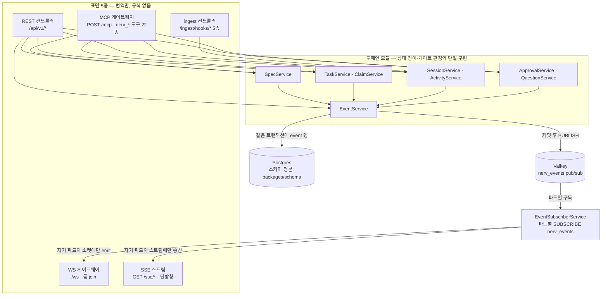

# 코드베이스와 배포

> **요약** — NERV MVP의 저장소 구조와 배포 산출물의 정본이다. **애플리케이션·패키지 코드 전체를 저장소 `codebase/` 하위에 두는** pnpm 모노레포(`apps/web` · `apps/api` · `apps/cli` · `packages/schema`)와 **저장소 루트의 배포 트리**(`deploy/compose` · `deploy/docker` · `deploy/k8s`)를 확정하고, REST·MCP·WebSocket·SSE·ingest 다섯 표면이 **같은 도메인 서비스를 DI로 주입받는** NestJS 모듈 맵(D-05의 실물)을 그린다. 실시간 팬아웃의 방송 버스는 **Valkey pub/sub**(`nerv_events`)다. 개발 환경은 docker-compose.yml 전문과 `.env` 변수 전표, 명령 순서로 "신규 장비에서 명령 몇 개로 로그인 화면까지" 도달하게 하고, 운영 배포는 Dockerfile 2종·kustomize base/overlays 트리·Deployment/Job/Ingress 스켈레톤(WebSocket 업그레이드·타임아웃, SSE 버퍼링 해제, 워커 replica 1, 마이그레이션 Job)으로 확정한다. 임포터 CLI(`apps/cli`)는 **컨테이너가 아니라 배포되는 클라이언트**다 — 원본 체크아웃이 있는 장비에서 돌며 서버에는 API로만 붙는다(§1.3). 행동 요구는 REQ-CB-001~021로 번호를 부여했다.
>
> 문서 버전 v1.26 · 2026-09-06 · HTML 파생본: [codebase.html](../html/codebase.html)
>
> v1.26 변경(2026-09-06 — 유령 설정을 배선하고 게이트를 세운다, 사람 결정): **`NERV_LOG_LEVEL` 배선 · CI 게이트 아홉 → 열.** §5.2 전표가 이 변수의 소비자를 "api · worker" 라 적어 두고 **읽는 코드가 0건**이었다 — 운영자가 값을 바꿔도 아무 일이 없었고, 장애 때 로그를 늘릴 손잡이가 실은 재배포뿐이었다. 두 진입점이 `common/log-level.ts` 한 함수로 읽는다(고른 수준과 **그보다 심각한 것**을 켠다 · `info`·`warning`·`trace`·`critical` 은 별칭 — compose·k8s 가 이미 `info` 를 넘긴다 · 모르는 값은 기본으로 떨어지되 한 줄 남긴다). 그리고 **같은 부류가 다시 생기지 않게 검사를 세웠다**(`scripts/check-env-table.mjs`) — 코드가 읽는 변수가 전표에 있는가 · `.env.example` 의 키가 전표에 있는가 · 한 변수가 두 행에 나오지 않는가 · **전표가 소비자를 `api`·`worker`·`web` 이라 적은 변수를 그 코드가 실제로 읽는가**. 마지막 하나가 유령 설정을 잡는 축이다.
>
> v1.25 변경(2026-09-06 — 반쪽 가드를 기록한다, 정합성 대조 → 사람 지시): §4.5 lint 규칙 목록에 **REQ-CB-003 가드가 반쪽이라는 사실**을 적는다. 실제로 막는 것은 `drizzle-orm` 뿐이고, 함께 적힌 `@nerv/schema/tables` 는 그 패키지의 `exports` 에 없어 애초에 import 할 수 없다 — 테이블 심볼은 본 배럴이 재수출하므로 그 길로 오면 규칙이 아무 말도 하지 않는다. 위반은 현재 0건이지만 **막힌다고 적어 두면 다음 사람은 규칙이 지켜 준다고 믿는다.** 곁들여 CI `check` 잡이 **아홉**이 됐다(md ↔ html 정합 신설 — 관리 규약 1 을 기계가 본다).
>
> v1.24 변경(2026-09-06 — 전수라 적은 표가 전수가 아니었다 둘, 정합성 대조 → 사람 지시): ① §2.3 "29종 **전수** 배정" 이 전수가 아니었다 — `attachment`·`finding_comment`·`invitation`·`activity_summary` 의 소유 모듈이 어디서도 정해지지 않았다. 넷을 배정하고(각각 Spec·Review·Auth·Session), **모듈이 소유하지 않는 넷**(`idempotency_key` 는 횡단 인프라, `spec_chunk_embedding` 은 파생 인덱스, 인증 3종은 better-auth 소유)이 왜 표 밖인지 적었다. ② §3.2 상수 전표가 **13개만 싣고 18개가 빠져 있었다** — `MAX_REQUEST_BODY_BYTES` 는 정작 §5.4 주석이 그 이름을 인용하는 상수다. `constants.ts` 의 export 전수로 채웠다. 곁들여 `EP-IMP-01~05` → `01~06`.
>
> v1.23 변경(2026-09-06 — 남은 전문 둘과 전표 넷, 정합성 대조 → 사람 지시): **REQ-CB-029 신설 · 게이트 일곱 → 여덟.** ① **백로그 현황 정합 게이트**를 CI 와 `preflight` 에 더한다(`scripts/check-backlog-status.mjs`) — [4.8](backlog.md) §1.4 의 표가 실제 스토리와 어긋나면 막는다. "모든 스토리는 현재 `backlog`다" 가 **74개 중 73개에 대해 거짓**인 채로 2주를 보냈고(2026-08-22 → 09-06), 백로그는 첫 임포트 대상이라 그 상태가 그대로 Task 의 초기 상태가 된다. 사람 쪽 규율은 `AGENTS.md` 문서 작업 규약 6 이 맡는다. ② **§5.3 compose · §6.2 kustomization 전문을 실물 전량으로 교체**한다 — compose 는 v1.6 이 "이제 바이트 단위로 일치한다" 고 선언한 뒤 6줄이 갈렸고(`NERV_S3_PUBLIC_ENDPOINT`·`NERV_GITHUB_WEBHOOK_SECRET`), kustomization "전문" 에는 **backup 리소스와 `configMapGenerator` 가 통째로 없었다**(CI 가 강제하는 사본 쌍의 근거가 정본에 없던 셈이다). ③ **§1.1 트리**에 실재하는 것을 싣는다 — `scripts/` 여섯(같은 문서가 세 곳에서 인용한다) · `tsconfig.json`(솔루션) · 루트 `README.md`·`.claude-plugin/`·`.github/` · `deploy/scripts/` · `docker-compose.e2e.yml`. ④ **§5.1 스크립트 표**가 여덟을 빠뜨렸다 — `preflight`·`hooks:install`·`typecheck`·`format`·`format:check`·`pack:plugin`·`e2e:logs`·`e2e:env`. 규약 7 이 커밋 전 필수로 지정한 명령이 정본 표에 없었다. ⑤ **§5.2 전표**: `NERV_S3_ENDPOINT` 행이 **둘이었고 "필수" 열이 서로 달랐다**(하나를 걷었다), `NERV_LOG_LEVEL` 은 소비자를 "api · worker" 라 적는데 **읽는 코드가 한 곳도 없다**(배선하거나 행을 걷는 것은 열린 자리다), `NERV_SEED_PASSWORD`·`NERV_SHOT_DIR`·`NERV_SHOT_SCHEME` 은 코드가 읽는데 전표에 없었다. ⑥ **§2.3 합계 검산**이 "P0 8 + P1 8 = 16종, 카탈로그 18종" 이었다 — 실측 24종(P0 8 · P1 14 · P2 2). ※ 남은 것: §2.3 의 테이블 배정이 여전히 전수가 아니다(`attachment`·`finding_comment`·`invitation`·`idempotency_key` 의 소유 모듈이 정해지지 않았다) — **모듈 경계 결정이 필요해 열어 둔다.**
>
> v1.22 변경(2026-09-06 — "전문"이라 선언한 블록이 실물과 달랐다, 정합성 대조 → 사람 지시): **§4.5 CI 전문 교체 · §5.4·§6.1·§6.3 의 `/plugin` 3연쇄 복원.** 이 문서의 산문과 변경 기록은 실물을 정확히 서술하는데 **그 산문이 가리키는 코드 블록만 옛 상태로 남아 있었다** — v1.14(플러그인 아카이브·앞문 둘)와 v1.11/v1.15(CI 복구)가 각각 산문만 고치고 전문을 두고 간 자리다. ① **§4.5 CI 전문**: `on:` 에 `merge_group`·`schedule` 이 없어 e2e 의 `if:` 가 push(main) 에서만 참이 됐다 — §4.3 이 규정한 "머지 전·야간" 이 그 스켈레톤으로는 성립하지 않는다. check 잡에 **플러그인 버전 게이트**가 빠져 여섯만 셀 수 있었고(규약 7·§4.3 은 일곱이라 적는다), integration 잡에 **valkey 서비스**가 없어 REQ-CB-004 를 보는 L2 가 매달리며(CI 가 21회 연속 실패했던 원인과 같은 부류다), e2e 잡은 **개발 compose 스택**을 띄우고 브라우저 설치 단계가 없었다 — §4.3 이 실측 근거와 함께 전용 스택으로 갈라 둔 것과 정면으로 어긋난다. ② **§5.4 nginx**: `upstream` 블록 + 고정 이름 `proxy_pass` 였다. 실물은 `resolver … valid=10s` + 변수 `proxy_pass` 이고(컨테이너 재기동 뒤 전 요청 502 를 실측하고 고친 자리다), **`location /plugin/` 이 통째로 없었다.** ③ **§6.1 `Dockerfile.server`**: 플러그인 아카이브 3줄(`pack-plugin.mjs` · `COPY /plugin-dist` · `ENV NERV_PLUGIN_DIST`)이 없었다. ④ **§6.3 Ingress**: `path: /plugin` 이 없었다. ②~④ 는 한 뿌리다 — **전문대로 복원하면 마켓플레이스가 SPA 의 index.html 을 200 인 채로 받는다.** 새 요구사항은 없다: 실물이 옳고 전문이 낡은 자리라 **전문을 실물에서 그대로 가져왔다**(§5.4·§6.1 은 파일 전량, §6.3 은 빠진 경로 한 줄).
>
> v1.21 변경(2026-09-06 — CI 가 다섯 번 같은 자리에서 빨갰다, 사람 지적): **`pnpm preflight` 신설 · md 왕복 레인 분리.** 실패는 전부 하나였다 — `roundtrip-spike.spec.ts` 의 **30초 타임아웃**(9/5 네 건 + 9/6 한 건). 로컬 10.7초 / CI 3.9배라 여유가 남지 않았고, 그 검사는 `docs/**/*.md` **전수를 두 번** 왕복해 **문서가 늘면 그만큼 느려진다** — 이번 주에 문서 21편에 변경 기록을 더하고 사전을 신설하면서 여유를 더 깎았다. **상한만 올리면 다시 온다**: 비용이 자라는 검사에 고정 상한을 둔 것이 원인이다. 레인을 갈라 머지 전 레인만 전수를 보고 푸시 레인은 표본 6편을 본다(상한은 표본 수에 비례). 곁들여 `slice(0, 30)` 을 걷었다 — 문서가 31편이 되면 새 문서가 **조용히** 검사 밖으로 나가던 자리다. 그리고 **로컬 검사가 CI 의 부분집합이었다**: 규약 7 의 네 명령 밖에 게이트 셋이 더 있어, 넷만 돌린 사람은 그 셋을 한 번도 돌리지 않고 push 했다 — `preflight` 가 일곱을 같은 순서로 돈다.
>
> v1.20 변경(2026-09-05 — 용어 사전 반영, 사람 지시): [용어 사전](../glossary.md)의 채택어로 이 문서의 낱말을 옮긴다 — 기준선(← 베이스라인) · 워크플로우(← 워크플로) · 권한/소속/작업 범위(← 스코프) · 버전(← 판) · 고정 ID(← 안정 ID·키). **뜻은 바뀌지 않는다** — 코드·API 식별자는 그대로다.
>
> v1.19 변경(2026-09-05 — 카탈로그에 말투 규칙이 없었다, 용어 검토 → 사람 결정): §3.4 에 **말투 규칙**을 넣는다(화면은 합쇼체, 에이전트·CLI·생성 문서는 해라체). 카탈로그는 규칙 셋(키 짓기·자리표시자·식별자 비번역)을 적어 두었는데 **말투만 빠져 있었고**, 그래서 문서를 쓰던 손이 화면 문구 아홉에 그대로 이어졌다. 정본은 [용어 사전](../glossary.md) §3 이고 이 문서와 카탈로그 주석이 인용한다.
> v1.18 변경(2026-09-05 — 만들 수 없는 값 둘에 길을 낸다, 정합성 감사 → 사람 결정): 아키텍처 그림의 도구 수를 22종으로(4.1 v0.19).
> v1.17 변경(2026-09-05 — 파생본이 원본과 다른 말을 하고 있었다, 정합성 감사): html 파생본의 CI 워크플로우 전문에서 **배포 산출물 정합 단계와 postgresql-client-17 설치·빌드 단계가 빠져 있었는데, 바로 아래 산문은 그 단계들을 설명하고 있었다** — 설명은 있고 실물은 없는 상태였다. 환경변수 전표의 `NERV_S3_REGION`·`NERV_EXPORT_DIR` 두 행도 없었다.
> v1.16 변경(2026-09-05 — Phase 표기를 현황으로, 정합성 감사 → 사람 결정): ① `ReviewModule` 행의 `(P2)` 둘을 실물로 고친다 — 도구 2종·REST 7종이 있다. ② 플러그인 트리에서 `.mcp.json` 을 걷는다(4.6 v0.38 이 패키지에서 뺐고 이 트리만 남아 있었다). 훅은 두 변형, 스킬은 6종이다. ③ 아키텍처 그림의 도구 수를 21종으로.
> v1.15 변경(2026-09-04 — 돌지 않던 검사, 사람 지시): **REQ-CB-028 신설.** CI 의 check 잡이 `pnpm lint`·`tsc -b` 만 부르고 **`pnpm format:check` 는 부르지 않았다** — 그 스크립트는 처음부터 있었는데, 그래서 7개 파일이 서식 실패인 채로 이틀을 지나며 그 사이의 커밋들을 받았다(2026-09-02 → 09-04). 아무도 몰라서가 아니라 **아무도 돌리지 않아서**다. 같은 뿌리의 앞선 사례가 이 문서에 이미 적혀 있다 — 게이트가 `pnpm test` 뒤에 있어 21회 연속 skipped 됐던 일. 검사는 **돌 때만** 검사다. 사람이 지키는 쪽은 `AGENTS.md` 구현 규약 7 이 맡는다.
> v1.14 변경(2026-09-04 — 플러그인 아카이브가 빌드 산출물이 된다): `scripts/pack-plugin.mjs` 가 `plugin/` 을 `plugin-dist/<이름>-<버전>.zip` 으로 묶고(`pnpm pack:plugin`), 이미지 빌드가 같은 명령을 돌려 `/app/plugin-dist` 에 심는다(`NERV_PLUGIN_DIST`). 서버가 그것을 `GET /plugin/...` 로 서빙한다(4.4 §2.11 · 4.6 §3.5). 앞문 둘(nginx `location /plugin/` · Ingress `path: /plugin`)에 경로를 열었다 — 열지 않으면 마켓플레이스가 SPA 의 index.html 을 **200 인 채로** 받는다.
> v1.13 변경(2026-09-02 — 라이선스): 저장소를 **Apache License 2.0** 으로 공개한다. §1 트리에 루트의 `LICENSE`·`NOTICE` 를 넣었다 — `LICENSE` 는 원문 그대로 두고(부록의 자리표시자를 채우면 자동 판별기가 Apache-2.0 으로 읽지 못한다) 저작권 표기는 `NOTICE` 가 진다. 파일마다 라이선스 헤더는 붙이지 않는다(사람 결정).
> v1.12 변경(2026-09-02 — 계약의 실물화): §3.2 상수 전표에 세 줄을 더한다(`IDEMPOTENCY_TTL_HOURS`·`MAX_PROJECT_ROOMS`·`MAX_SSE_PER_USER`). 룸 상한 `8` 은 웹의 `ws.ts` 와 API 의 `fanout.service.ts` 에 각각 박혀 있었고 SSE 상한이 세 번째 사본이 될 참이었다 — REQ-CB-006 이 금지하는 바로 그 모양이다.
> v1.11 변경(2026-09-02 — CI 복구): §4.5 를 실물에 맞춘다. **게이트를 테스트 앞으로** 옮겼다 — CI 가 도입 이래 21회 연속 실패하는 동안 배포 산출물 정합·schema drift 는 매번 skipped 됐고, 그래서 REQ-CB-007·018·010 은 한 번도 실행된 적이 없었다. integration 에 pg17 클라이언트, e2e 에 `pnpm build`, `concurrency` 는 PR 에서만 취소.
> v1.10 변경(2026-09-02 — 정합 점검): §2.2 잡 목록에 **`partition.job.ts`** 를 더한다 — 4.3 §2.14 가 워커 잡으로 약속한 월 파티션 선생성이고, 없는 동안 서버는 마이그레이션 두 달 뒤에 멈추는 상태였다(REQ-DB-021).
> v1.9 변경(2026-08-29 — 기동 로그의 대부분이 경고였다, 사람 보고): §4.3 에 라우트 생성 제외 규칙. 화면 테스트를 `src/routes/` 안에 두는 관례를 TanStack Router 플러그인이 "Route 를 export 하지 않는 라우트 파일"로 읽어 파일마다 12줄씩 경고했다(실측 7개 파일 84줄). `routeFileIgnorePattern` 으로 제외한다 — `routeTree.gen.ts` 는 바이트 단위로 동일하다.
>
> v1.8 변경(2026-08-28 — 임베딩 주기를 일감이 정한다, 사람 결정): §5.2b 에 적응형 주기(REQ-CB-027) + `.env` 전표 2키(`NERV_EMBED_EVERY_MS`·`NERV_WORKER_TICK_MS`). 한 버전 상한(20초)을 두자 이번엔 **고정 5분 주기**가 병목이 됐다 — 가동률 6.7% 라 140편을 채우는 데 몇 시간이다. 그렇다고 1초 고정은 다 채운 뒤에도 초당 142 질의로 "바뀐 것 없음"만 확인한다. 그래서 **이 잡만 주기가 변한다**: 일했으면 1초, 아무것도 안 했거나 오류면 5분. 틱 해상도도 1초로 내렸다(락은 한 번 잡으면 계속 보유하므로 틱은 싸다).
>
> v1.7 변경(2026-08-28 — 임베딩이 멈춰 있었다, 사람 보고): §5.2b 신설(REQ-CB-025·026) + `.env` 전표 3키. 로컬 프로필에서 색인이 **approved 114편 중 1편 11청크**에서 멈춘 채 매 틱 `AbortError` 만 찍고 있었다 — 원인은 제공자가 아니라 **요청 크기**였다(실측: 지연은 입력 개수가 아니라 총 문자 수를 따라간다 — 4,000자 5.5초 · 16,000자 39.8초인데, 한 문서의 청크를 통째로 보내고 상한은 10초였다). 요청을 **문자 예산으로 쪼개고**(`NERV_EMBED_BATCH_CHARS`), 상한을 느린 프로필 기준으로 올리고(`NERV_EMBED_TIMEOUT_MS`), **한 판에 시간 상한**을 둔다(`NERV_EMBED_PASS_MS` — 비싼 잡이 리스 회수·stale 을 굶기지 않게). 배치마다 적재해 **부분 진행을 지킨다.**
>
> v1.6 변경(2026-08-27 — 절차와 전문의 어긋난 자리 셋, 실행 중 발견): ① §5.1 의 **개발 루프 블록에 `pnpm build` 가 없었다**. `db:migrate`·`db:seed` 는 빌드 산출물(`apps/api/dist/*.js`)을 실행하는데 `dist/` 는 git 에 없고 설치 훅도 없다 — 새로 클론한 장비에서 블록대로 따라가면 `db:migrate` 가 파일을 찾지 못한다. 엔트리를 산출물로 두는 것 자체는 의도이므로(compose·k8s 가 이미지 안에서 같은 파일을 돌린다 — REQ-CB-008) 절차에 한 줄을 넣었다. **REQ-CB-009(명령 6개)는 영향이 없다**: 그 6개는 compose 경로이고 빠진 것은 로컬 프로세스로 도는 개발 루프 쪽뿐이다. ② **§5.2 전표와 §5.3 compose 전문에 TEI 시절 값이 남아 있었다** — `NERV_EMBED_URL` 의 compose 기본이 `http://embed:80/v1`, 모델이 `BAAI/bge-m3` 였는데 실물은 v1.1 의 ollama 교체 이후 `http://embed:11434/v1` · `bge-m3` 다(같은 문서 §5.2a 프로필 표는 이미 그렇게 적고 있었다). 실물 `deploy/compose/docker-compose.yml` 과 줄 단위로 대조해 4줄을 맞췄고, **이제 §5.3 전문이 실물과 바이트 단위로 일치한다.** ③ html 파생본의 `pnpm e2e:up` 행이 세션별 포트 할당(§4.3) 이전의 고정 포트를 적고 있던 것을 md 에 맞췄다.
>
> v1.1 변경(2026-08-23): ① **문구 카탈로그와 로케일 §3.4 신설** — 웹·API·CLI 가 `@nerv/schema` 의 한 벌을 쓴다(ko 기본 · en). §1.2 의 "런타임 로직 없음"에 번역기 예외를 마이그레이터와 같은 등급으로 기록. 신설 요구 REQ-CB-022~024. ② **로컬 임베딩 프로필 이미지 교체**(§5.2a — TEI → ollama). TEI 가 arm64 이미지를 내지 않아 Apple Silicon 에서 기동되지 않는다(실측·점화 기록 §5.2a). 계약·모델·차원·외부 전송 0 은 그대로이고 바뀐 것은 개발자 기계에서 도는가뿐이다. 다른 결정·요구는 불변.
>
> v0.9 변경(2026-08-22 — 구현 중 확인 태스크 착지): **운영 Postgres 위치를 클러스터 외부로 확정**(§6.0 신설 — E06-S05). 근거는 NFR-01의 compose 자가호스팅과 운영 k8s가 같은 접속 모델을 써야 한다는 것이다. §6.5 백업 절차의 "관리형이면 ①을 스냅샷+PITR로 대체" 조건이 이 판정으로 확정됐다.
>
> v1.0 변경(2026-08-23 — 실행 중 발견): **L3 E2E 전용 compose 스택 분리**(§4.3 · §5.1 — `deploy/compose/docker-compose.e2e.yml`). 개발 스택을 공유하니 테스트가 개발 DB를 고치고(계정 15건 축적 실측) 실행 간 상태가 쌓였다. 다른 프로젝트 이름·다른 포트·tmpfs·시드 자동 적재로 분리하고, 개발 스택을 향해 돌면 거부하는 가드를 양쪽(웹·API)에 뒀다.
>
> v0.9 변경(2026-08-22 — 구현 착수 중 발견): **플러그인 패키지 배치 확정**(§1.1·§1.2 — `codebase/plugin/`). [4.6 플러그인과 온보딩](plugin.md) §1.1이 `nerv-plugin/` 트리를 정의하면서도 저장소 어느 구역에 두는지는 어느 문서도 말하지 않아 구현이 막혔다. REQ-CB-015의 2구역 규칙(코드 = `codebase/`, 배포 산출물 = `deploy/`)에서 플러그인은 **코드 구역**이다 — 에이전트 호스트에서 실행되는 규약·스크립트이지 이 시스템의 배포 산출물이 아니다. pnpm 워크스페이스로 등록하되 빌드는 없고, 문서 전문 대조 테스트(REQ-PLG-001)를 `pnpm test`에 태우는 것이 워크스페이스로 두는 유일한 이유다. 다른 결정·요구는 불변.
>
> v0.8 변경(2026-08-22 — **배포 산출물 위치 개정, REQ-CB-015 변경**): 배포 트리를 `codebase/deploy/`에서 **저장소 루트 `deploy/`**로 옮긴다. 근거: 배포 산출물은 pnpm 워크스페이스가 아니고(`pnpm-workspace.yaml` glob 밖) 저장소 전체의 운영 자산이라 "모노레포 루트 = `codebase/`"라는 한 가지 뜻과 섞이지 않는 편이 낫다. ① REQ-CB-015를 2구역 규칙으로 개정(코드 = `codebase/`, 배포 산출물 = `deploy/`) ② 경로 표기 기준 분리 — `apps/*`·`packages/*`는 `codebase/` 기준, `deploy/*`는 저장소 루트 기준(§1.1) ③ **이미지 빌드 컨텍스트를 저장소 루트로 통일**(§5.3 `context: ../..`) — 웹 이미지가 `codebase/` 소스와 `deploy/docker/nginx/` 템플릿을 함께 봐야 하기 때문. Dockerfile `COPY`에 `codebase/` 접두, 저장소 루트 `.dockerignore` 신설(§6.1) ④ compose 실행은 `codebase/`에서 `-f ../deploy/compose/...`(§5.1·§4.5), kustomize는 저장소 루트에서(§6.3). 다른 결정·요구는 불변.
>
> v0.7 변경(2026-08-22 — 임베딩 제공자 추상화, [4.1](scope.md) v0.7과 짝): 임베딩 호출을 **OpenAI 호환 `/v1/embeddings` 단일 계약**으로 전환 — 환경 프로필 §5.2a 신설(로컬 TEI / 스테이징 LM Studio / 운영 OpenAI), `NERV_EMBED_API_KEY` 추가, compose `embed`는 **로컬 프로필 전용**(profiles로 선택 기동), k8s `base/embed/`는 외부 제공자 오버레이에서 제외. REQ-CB-020 개정("자가호스팅만" 폐기 → 단일 계약 + env 결정), REQ-CB-021(1024차원 강제) 추가.
>
> v0.6 변경(2026-08-22 — 하이브리드 검색 MVP 확정, [4.1](scope.md) §2.1): ① 인프라 서비스 4종 — **`embed`(TEI + BGE-m3, 자가호스팅 임베딩 서빙)** 추가, postgres 이미지를 pgvector 동봉판(`pgvector/pgvector:pg17`)으로 교체 ② 워커 잡 `embedding.job.ts` 추가(§2.2) ③ `.env`에 `NERV_EMBED_URL`·`NERV_EMBED_MODEL`(§5.2) ④ k8s `base/embed/`(§6.2) ⑤ REQ-CB-020. **REQ-CB-017(빌드 이미지 3종)과 충돌 없음** — embed는 빌드 산출물이 아니라 postgres·valkey와 같은 기성 인프라 이미지다.
>
> v0.5 변경(2026-08-22): ① 테스트 러너 확정 반영(§4.3 — Vitest + Playwright, 결정 정본은 [4.1](scope.md) §2.1) ② **CI 파이프라인 전문 신설**(§4.5 — REQ-CB-007 스키마 드리프트 검사의 실행 실물, REQ-CB-018) ③ **백업·복구 절차 신설**(§6.5 — NFR-01·성공 기준 1-9의 실행 실물, REQ-CB-019) ④ 쿼터 상수 3종 추가(§3.2 — [4.4 API 명세](api.md) §1.8과 짝).
>
> v0.4 변경(2026-08-22): **`apps/cli`(`@nerv/cli`) 워크스페이스 신설**(§1.1·§1.3)과 `apps/api`의 `ImportModule`(§2.2·§2.3) — 임포터 실행 모델이 DB 직결에서 API 클라이언트로 확정된 데 따른 배치 확정([4.7 스펙 임포터](importer.md) §3.2). REQ-CB-016~018 추가.

---

## 1. 모노레포 구조

### 1.1 확정 트리 전문

언어·저장소 구조는 TypeScript + pnpm workspace로 확정됐다([3.2 시스템 아키텍처](../03-proposal/architecture.md) §4.1, 스택 확정 전문은 [4.1 MVP 범위와 스택 확정](scope.md)). Turborepo는 빌드 시간이 아플 때 도입한다 — 트리거만 기록하고 지금은 넣지 않는다.

**애플리케이션·패키지 코드는 저장소 루트가 아니라 `codebase/` 하위에 쓰고, 배포 산출물은 저장소 루트의 `deploy/`에 쓴다**(REQ-CB-015 — 2026-08-22 개정). 저장소 루트는 문서(`docs/`)·에이전트 규약(`AGENTS.md`·`CLAUDE.md`)·구현(`codebase/`)·배포(`deploy/`)의 네 구역으로 나뉘고, 모노레포 루트는 `codebase/`다. 배포 조건은 루트의 `LICENSE`(Apache-2.0 원문)·`NOTICE`(저작권 표기)가 진다 — 파일마다 라이선스 헤더를 붙이지 않는 것이 이 저장소의 선택이다(2026-09-02 · 사람 결정).

경로 표기의 기준이 구역마다 다르다 — 이 문서를 포함한 전 문서에서 **`apps/*`·`packages/*`는 `codebase/` 기준 상대 경로**이고 **`deploy/*`는 저장소 루트 기준 상대 경로**다. `pnpm` 명령은 `codebase/`에서 실행하고(§5.1), `docker compose`는 `pnpm compose:*` 래퍼가 `-f ../deploy/compose/docker-compose.yml`로 가리키므로 역시 `codebase/`에서 실행한다. `kustomize`·`kubectl` 명령만 저장소 루트에서 실행한다(§6.3).

```text
nerv/                           # 저장소 루트 — 애플리케이션 코드 없음
  LICENSE                       # Apache License 2.0 전문 — **원문 그대로** 둔다(자동 판별기가 읽는다)
  NOTICE                        # 저작권 표기 — LICENSE 부록의 자리표시자는 건드리지 않고 여기가 진다
  README.md                     # 저장소 첫 화면 — 구역·워크스페이스·빠른 시작·자주 쓰는 명령
  AGENTS.md                     # 에이전트 공통 작업 규약 (Codex·Claude Code 공용)
  .claude-plugin/               # 마켓플레이스 카탈로그 — Claude Code 가 **저장소 루트에서만** 찾는다
                                #   (REQ-CB-015 의 "저장소 메타 파일" — 배치 원칙의 예외가 아니라 그 정의 안이다)
  .github/workflows/ci.yml      # §4.5 전문 — 같은 이유로 저장소 루트다
  .dockerignore                 # 이미지 빌드 컨텍스트(= 저장소 루트) 제외 목록 (§5.3·§6.1)
  CLAUDE.md                     # Claude Code 진입점 — @AGENTS.md import만 한다
  docs/                         # 이 제안서 원문 — NERV 가동 후 첫 임포트 대상 (4.7 스펙 임포터 §5)
  codebase/                     # ★ 구현 코드 전체 = 모노레포 루트 (REQ-CB-015)
    package.json                # 워크스페이스 스크립트 허브 (§5.1 명령 표)
    pnpm-workspace.yaml         # packages: ["plugin", "apps/*", "packages/*"]
    pnpm-lock.yaml
    .nvmrc                      # Node LTS 핀 — 로컬·CI·이미지가 같은 값을 쓴다 (REQ-CB-002)
    tsconfig.base.json          # strict 공통 옵션 (§4.1)
    eslint.config.js            # lint + import 경계 규칙 (§4.2)
    .prettierrc
    .env.example                # §5.2 전표의 실물 — 값 없는 키 목록 + 주석
    tsconfig.json               # 솔루션 파일 — CI·preflight 의 `tsc -b` 진입점
    scripts/                    # 저장소 운영 스크립트 (§5.1 명령 표가 부른다)
      preflight.mjs             #   CI check 잡 여덟 단계를 같은 순서로 (AGENTS.md 규약 7)
      check-plugin-version.mjs  #   배달되는 파일이 바뀌면 version 도 올랐는가 (REQ-PLG-017)
      check-backlog-status.mjs  #   4.8 §1.4 현황 표가 스토리와 맞는가 (REQ-CB-029)
      pack-plugin.mjs           #   플러그인 zip — 이미지 빌드가 /plugin-dist 에 심는다 (§6.1)
      dev.mjs · e2e-stack.mjs   #   개발 루프 · E2E 전용 스택(세션별 포트)
      install-hooks.mjs         #   pre-push 훅 설치 (옵트인 — 게이트가 아니다)
    apps/
      web/                      # @nerv/web — Vite + React SPA (화면 명세는 4.5)
        index.html
        vite.config.ts          # dev proxy: /api·/mcp·/ingest·/ws·/sse → :8080 (§5.1) · 라우트 생성 제외 규칙(§4.3)
        src/
          routes/               # TanStack Router 파일 라우트
          features/             # 화면 단위 모듈 (spec-editor · task-board · session-monitor …)
          components/           # 공용 UI — Tailwind + shadcn/ui 파생
          lib/                  # API 클라이언트 · WS 클라이언트 · 이벤트→쿼리 무효화 매핑
      api/                      # @nerv/api — NestJS(Fastify). REST·MCP·WS·SSE·ingest + 워커 엔트리 (§2)
        src/                    # 상세 트리는 §2.2
      cli/                      # @nerv/cli — 임포터 CLI. 원본 체크아웃이 있는 장비에서 실행 (§1.3)
        src/
          index.ts              # 서브커맨드 엔트리 — 실제로 도는 형태는 `nerv spec …` 이다
                                #   (4.7 §3.1 과 스킬은 `nerv import spec …` 을 적는다 — 어긋난 자리로 열려 있다)
          profiles/             # 내장 프로파일 — clemvion.yaml · nerv-docs.yaml (4.7 §1.4)
          parse/                # 스캔 · frontmatter · 요구사항 추출 · 링크 해소 (4.7 §2)
          report/               # report.md · report.jsonl · 매니페스트 (4.7 §3.3·§4.1)
          client/               # EP-IMP-01~06 HTTP 클라이언트 — PAT · Idempotency-Key 재시도
    packages/
      schema/                   # @nerv/schema — drizzle 테이블 · zod · 상수 · 이벤트 이름 · 에러 코드 (§3)
                                #   임포트 배치 · 프로파일 zod 스키마도 여기가 정본 (apps/api ↔ apps/cli 공유 계약)
    plugin/                     # @nerv/plugin — Claude Code 플러그인 패키지 (4.6 §1.1 전문의 실물)
      .claude-plugin/           #   plugin.json · marketplace.json
      hooks/                    #   hooks.json(기본 · command) · hooks.http.json (4.6 §3.1)
      skills/                   #   next · spec · impl · question · import · review (4.6 §2)
      agents/                   #   nerv-spec-writer — 코드 쓰기 도구 미보유
      bin/                      #   nerv-hook-forward(토큰 주입 폴백) · nerv-outbox(오프라인 큐)
      statusline/               #   nerv-statusline.sh — 네트워크 왕복 없음 (4.6 §3.2)
      plugin-package.spec.ts    #   문서 전문 대조 테스트 (REQ-PLG-001·003·006·008)
  deploy/                         # ★ 배포 산출물 — 저장소 루트 (REQ-CB-015, 2026-08-22 개정)
    compose/
      docker-compose.yml        # §5.3 전문 — 로컬·소규모 자가호스팅 정본
      docker-compose.e2e.yml    # L3 전용 스택 — .env 를 요구하지 않고 저장소는 tmpfs (§4.3)
    docker/
      Dockerfile.server         # nerv-api · nerv-worker 이미지 (§6.1)
      Dockerfile.web            # nerv-web 이미지 (§6.1)
      nginx/
        default.conf.template   # §5.4 전문 — reverse-proxy · WebSocket 업그레이드 · SSE 버퍼링 해제 · /mcp Origin 1차 검증
    k8s/
      base/                     # §6.2 트리 — Deployment · Service · Job · Ingress · backup/
      overlays/
        dev/
        prod/
    scripts/                    # nerv-backup.sh · nerv-restore.sh — k8s CronJob 이 사본을 갖고
                                #   CI 가 그 둘의 diff 로 갈라짐을 막는다 (§4.5 · §6.5)
```

> **`deploy/`가 `codebase/` 밖인 이유**(2026-08-22 결정 — v0.1~v0.7의 `codebase/deploy/` 배치를 개정). 배포 산출물은 pnpm 워크스페이스가 아니다(`pnpm-workspace.yaml`의 glob `apps/*`·`packages/*` 밖). `codebase/`는 "모노레포 루트 = 노드 패키지들의 루트"라는 한 가지 뜻을 갖고, 저장소 전체를 어떻게 굴리느냐(compose·이미지·k8s)는 그 옆의 `deploy/`가 갖는다. 이미지 빌드 컨텍스트는 **저장소 루트**다(§5.3 `context: ../..`) — 세 이미지 모두 `codebase/`(소스)와 `deploy/docker/nginx/`(웹 이미지의 nginx 템플릿) 양쪽을 필요로 하므로 둘의 공통 조상이 유일한 일관 규칙이다. 그래서 Dockerfile 의 `COPY` 경로는 `codebase/` 접두를 갖고(§6.1), 컨텍스트 비대화는 저장소 루트 `.dockerignore` 가 막는다(`docs/`·`.git/`·`node_modules`·빌드 산출물 제외). 이 개정은 REQ-CB-015 한 줄과 경로 표기 기준·빌드 컨텍스트를 바꾸며, 다른 결정·요구는 건드리지 않는다.

### 1.2 패키지 책임

| 워크스페이스 | 패키지 이름 | 책임 | 하지 않는 일 |
| --- | --- | --- | --- |
| `apps/web` | `@nerv/web` | S1~S5·S7·S8 + 로그인 화면 렌더링, TipTap 에디터, WebSocket 구독 → TanStack Query 무효화 | 비즈니스 규칙 판정(전부 API에 위임 — [3.2](../03-proposal/architecture.md) §1.3) |
| `apps/api` | `@nerv/api` | REST + MCP + WebSocket + ingest 네 표면과 도메인 서비스, 워커 잡(같은 코드베이스, 엔트리 분리) | 스키마·타입 선언(`@nerv/schema`에서만 import) |
| `apps/cli` | `@nerv/cli` | 임포터 — 스캔·파싱·규칙 판정·리포트·매니페스트, EP-IMP-01~06 호출([4.7 스펙 임포터](importer.md) §3) | DB 접속(`DATABASE_URL` 미사용·DB 드라이버 미의존), 도메인 판정 |
| `packages/schema` | `@nerv/schema` | drizzle 테이블 선언, zod 스키마(임포트 배치·프로파일 포함), 도메인 상수·이벤트 이름·에러 코드, **문구 카탈로그와 번역기**(§3.4), 마이그레이션 파일 | 런타임 로직(순수 선언 + 마이그레이터 + 번역기만 — §3.4가 근거) |
| `plugin` | `@nerv/plugin` | 에이전트 호스트에 **배포되는 파일 묶음** — 스킬 6종·훅·MCP 설정·statusline·서브에이전트([4.6 플러그인과 온보딩](plugin.md) §1~§3 전문의 실물) | 빌드 산출물·런타임 코드(JS 번들 없음). 워크스페이스인 이유는 문서 대조 테스트를 `pnpm test`에 태우기 위해서다 |
| `deploy/*`(저장소 루트) | — | compose·Dockerfile·kustomize 산출물. 이 문서가 정본 | 애플리케이션 코드 |

의존 방향은 한쪽뿐이다: `apps/* → packages/schema`. `apps/web ↔ apps/api ↔ apps/cli` 간 직접 import는 금지하며 공유 계약(zod 스키마·타입·상수)은 전부 `@nerv/schema`를 거친다. `apps/cli`가 `apps/api`의 서비스를 import하지 않는다는 것이 REQ-CB-001의 적용례다 — CLI는 API의 클라이언트일 뿐 같은 프로세스가 아니다.

| ID | 요구(EARS) |
| --- | --- |
| **REQ-CB-001** | WHEN `apps/*`의 코드가 다른 워크스페이스를 import할 때, THE SYSTEM SHALL `packages/*`만 허용하고 `apps/*` 간 import는 lint 에러로 차단한다(`eslint.config.js`의 `no-restricted-imports`). |
| **REQ-CB-002** | WHEN 로컬·CI·컨테이너 이미지가 Node/pnpm을 결정할 때, THE SYSTEM SHALL `.nvmrc`(Node LTS)와 루트 `package.json`의 `packageManager` 필드를 단일 정본으로 사용한다 — 버전이 세 곳에서 달라지는 순간이 결함이다. |
| **REQ-CB-015** | (2026-08-22 개정) WHEN 애플리케이션·패키지 코드와 그 스크립트가 저장소에 추가될 때, THE SYSTEM SHALL 저장소 루트의 `codebase/` 하위에만 배치한다. WHEN 배포 산출물(compose·Dockerfile·nginx 템플릿·kustomize)이 추가될 때, THE SYSTEM SHALL 저장소 루트의 `deploy/` 하위에 배치한다 — `docs/`에는 문서와 그 파생물(html)만, 저장소 루트에는 이 두 구역과 에이전트 규약 파일(`AGENTS.md`·`CLAUDE.md`)·저장소 메타 파일만 둔다. |

`pnpm-workspace.yaml` 전문:

```yaml
packages:
  - "apps/*"
  - "packages/*"
```

### 1.3 `apps/cli` — 컨테이너가 아니라 배포되는 클라이언트

임포터는 서버 옆이 아니라 **원본 파일 옆**에서 돈다. 운영 환경의 서버는 임포트 대상 저장소의 체크아웃에 접근할 수 없으므로(근거·전문은 [4.7 스펙 임포터](importer.md) §3.2), CLI는 이미지·Job이 아니라 실행 장비에 설치되는 산출물이다.

| 항목 | 확정 |
| --- | --- |
| 배포 형태 | `pnpm --filter @nerv/cli build` 산출물을 사내 npm 레지스트리에 게시(`npm i -g @nerv/cli`) 또는 tarball 직접 설치. 컨테이너 이미지·k8s Job으로 만들지 않는다 |
| 실행 위치 | 원본 체크아웃이 있는 장비 — 이관 담당자 워크스테이션·CI 러너 |
| 서버 접속 | `--server` + `import:write` 권한 PAT(`--token`/env `NERV_TOKEN`). `DATABASE_URL`은 쓰지 않는다 |
| 원본 접근 | READ-ONLY. 임포터는 대상 저장소에 어떤 쓰기도 하지 않는다 |
| dry-run | 서버·네트워크 없이 완주(REQ-IMP-011) — CI에서 스펙 저장소 PR 검사로도 쓸 수 있다 |

| ID | 요구(EARS) |
| --- | --- |
| **REQ-CB-016** | WHEN `apps/cli`가 빌드될 때, THE SYSTEM SHALL DB 드라이버(`pg`·drizzle 런타임)와 `apps/api` 코드를 의존성에서 제외하고 `@nerv/schema`의 타입·zod 스키마만 참조한다 — 임포터가 DB에 직접 붙는 경로를 컴파일 단계에서 없앤다. |
| **REQ-CB-017** | WHEN 운영 배포 산출물을 만들 때, THE SYSTEM SHALL 컨테이너 이미지를 `nerv-api`·`nerv-worker`·`nerv-web` 3종으로 유지하고 임포터용 이미지·k8s Job을 만들지 않는다. |

---

## 2. `apps/api` — 표면 5종이 같은 도메인 서비스를 공유한다 (D-05)

### 2.1 원칙 — 게이트 판정이 표면마다 갈라지는 것이 최악의 실패

REST·MCP·WebSocket·SSE가 **같은 도메인 서비스를 DI로 공유**한다(D-05, [3.4 에이전트 연동 설계](../03-proposal/agent-integration.md) §1). NestJS를 택한 이유가 이 구조의 강제였다([3.2](../03-proposal/architecture.md) §4.2). 표면(컨트롤러·게이트웨이)은 **번역만** 한다 — 인증 컨텍스트 추출, 입력의 zod 검증, 도메인 서비스 호출, 응답 포맷 변환. 상태 전이 규칙·게이트 판정·겹침 검사는 도메인 서비스 한 곳에만 있다.



팬아웃 경로가 곧 무상태 수평 확장의 근거다: **모든 emit의 원천이 Valkey `nerv_events` 방송**이므로(MQ — 확정 스택, [4.1 MVP 범위와 스택 확정](scope.md) §2) 파드마다 `SUBSCRIBE`를 걸면 크로스파드 socket.io 어댑터 없이 각 파드가 자기에게 붙은 WS 소켓·SSE 스트림에 밀어줄 수 있고, socket.io는 websocket 전송만 활성화해(폴링 폴백 off) k8s 스티키 세션이 필요 없다. 재연결 시 클라이언트는 화면 데이터를 재조회한다 — 이벤트 유실은 허용하고 진실은 DB다(D-14). 방송 채널 이름(`nerv_events`)과 페이로드 규약의 정본은 [4.3 데이터베이스 스키마](database.md) §3이다.

### 2.2 `apps/api/src` 트리 전문

```text
apps/api/src/
  main.ts                        # HTTP 엔트리 — Nest(Fastify) 부트스트랩: REST + MCP + WS + SSE + ingest
  worker.ts                      # 워커 엔트리 — 같은 AppModule 조립에서 HTTP 표면 제외, 잡 러너만 (REQ-CB-005)
  migrate.ts                     # drizzle 마이그레이션 적용 후 종료 — compose 기동·k8s Job 공용 엔트리 (§5.3·§6.3)
  app.module.ts
  common/                        # 횡단 관심사 — 가드 · 인터셉터 · 필터
    auth.guard.ts                # 세션 쿠키(better-auth) / PAT Bearer 2경로 판별
    project-scope.interceptor.ts # 요청 컨텍스트의 project_id 자동 주입 — 권한 없는 질의 컴파일 불가 원칙
    mcp-origin.guard.ts          # /mcp Origin 검증의 최종 강제 지점 (REQ-CB-013)
    nerv-exception.filter.ts     # NERV_* 에러 코드 ↔ HTTP 상태 매핑 (코드 정본: @nerv/schema, §3.2)
  modules/
    auth/                        # AuthModule
      auth.module.ts
      auth.service.ts            # better-auth(organization·api-key 플러그인) 래핑, 멤버십·역할 조회
      auth.controller.ts         # REST — 조직 · 프로젝트 · 멤버 · 토큰(S8)
    spec/                        # SpecModule
      spec.module.ts
      spec.service.ts            # 초안 upsert · base_hash 비교-교환 · 편집 리스 · 전이 · 사전 검토
      spec-comment.service.ts
      baseline.service.ts        # 기준선 동결·조회 · as-of/baseline manifest (spec-workflow §3.6, REQ-API-015)
      spec.controller.ts         # REST — tree · get · 버전 · draft · check · submit · 코멘트 · baselines · manifest
      spec.tools.ts              # MCP — nerv_spec_* 7종 (§2.3 표)
    task/                        # TaskModule
      task.module.ts
      task.service.ts            # 상태 전이 · 위임 명세 · 증적(evidence)
      claim.service.ts           # 원자적 클레임 · scope 겹침 검사 · 리스 연장 (D-04)
      task.controller.ts
      task.tools.ts              # MCP — nerv_task_* 5종
    session/                     # SessionModule
      session.module.ts
      session.service.ts         # AgentSession 수명주기 (pending→active→…)
      activity.service.ts        # Activity 적재
      session.controller.ts      # REST — 보드 · 상세 · activity
      session.tools.ts           # MCP — nerv_bootstrap · nerv_session_event
      ingest.controller.ts       # POST /ingest/hooks/{session,tool,subagent,stop,session-end}
    approval/                    # ApprovalModule
      approval.module.ts
      approval.service.ts        # 받은 요청 — 결정 · 지시자≠승인자 검사
      question.service.ts        # 질문 생성 · 폴링 · awaiting_input 전이
      approval.controller.ts
      question.tools.ts          # MCP — nerv_question_create
    import/                      # ImportModule — EP-IMP-01~06 (4.4 §2.10). 소급 적재 전용 경로
      import.module.ts
      import.service.ts          # 자연 키 대조 · 배치 upsert · 전이 검사 우회(이 모듈에서만) · import.applied 이벤트
      import.controller.ts       # REST — preflight · specs · tasks · links · map
    review/                      # ReviewModule — 도구 2종·REST 7종 구현됨(2026-08-23~ · Phase 2 로 계획했던 것)
      review.module.ts
      review.service.ts
    event/                       # EventModule
      event.module.ts
      event.service.ts           # event 행 삽입(도메인 트랜잭션 안) + 커밋 후 Valkey PUBLISH (REQ-CB-004)
      notification.service.ts
      event.controller.ts        # REST — 이벤트 피드 · 알림
      ws.gateway.ts              # @WebSocketGateway(socket.io) — project:{id} · user:{id} 룸, join 시 멤버십 검사
      sse.controller.ts          # GET /sse/projects/{p} · /sse/me — text/event-stream 단방향 (4.4 §3.5)
      valkey.service.ts          # Valkey 클라이언트 provider — PUBLISH·SUBSCRIBE 공용 커넥션 관리
      event-subscriber.service.ts # 파드별 SUBSCRIBE nerv_events → 자기 소켓·SSE 스트림 emit
  mcp/
    mcp.controller.ts            # POST /mcp — Streamable HTTP, 신·구 리비전 병행 협상
    tool-registry.ts             # modules/**/*.tools.ts 수집 · zod 입력 검증 · idempotency_key 공통 처리
  worker/
    worker.module.ts
    advisory-lock.ts             # pg_advisory_lock — 잡 루프 단일 실행 보장 (REQ-CB-011)
    jobs/
      lease-reaper.job.ts        # 만료 리스 회수 — claimed → ready
      session-stale.job.ts       # 무활동 30분(STALE) 세션 전이 + 클레임 회수 (D-13)
      notification.job.ts        # event → notification 라우팅 (인앱, Slack·메일은 P2)
      export.job.ts              # md 미러 (P1 후반) · read-only git export 는 P2 — M2 컷오버 (scope.md §5)
      partition.job.ts           # event·activity 월 파티션 선생성 — 하루 1회 (4.3 §2.14, REQ-DB-021)
      retention.job.ts           # blob TTL 30일 · Activity 보존 정책 집행
      embedding.job.ts           # 검색 인덱스 — 헤딩 청크 임베딩 upsert·구판 정리 (4.3 §2.15, REQ-DB-017)
                                 #   **주기가 변하는 유일한 잡** — 일감 있으면 1초, 없으면 5분 (§5.2b · REQ-CB-027)
```

**ingest는 별도 프로세스가 아니라 컨트롤러다.** [3.2](../03-proposal/architecture.md) §4.4의 compose 그림은 `nerv-ingest`를 별도 서비스로 뒀지만, MVP 배포 단위는 이미지 3종(`nerv-api`·`nerv-worker`·`nerv-web`)으로 확정한다([4.1 MVP 범위와 스택 확정](scope.md)). ingest는 `SessionModule`의 컨트롤러로 `nerv-api`에 실리되 모듈 경계가 분리돼 있으므로, 훅 볼륨이 API 지연에 영향을 주는 시점(재검토 트리거)에 같은 이미지의 별도 Deployment로 뗀다 — 코드 변경 없이 라우팅만 바뀐다.

### 2.3 모듈 ↔ 테이블 ↔ 도구 ↔ 표면 대응표

테이블 이름의 의미 정본은 [3.3 데이터 모델](../03-proposal/data-model.md), DDL 정본은 [4.3 데이터베이스 스키마](database.md), 도구 정의 정본은 [3.4 에이전트 연동 설계](../03-proposal/agent-integration.md) §2, REST 경로 정본은 [4.4 API 명세](api.md)다. 이 표는 배치만 확정한다.

| Nest 모듈 | 소유 테이블 (도메인 33종 전수 배정 · 2026-09-06 실측) | MCP 도구 (Phase) | REST 프리픽스 |
| --- | --- | --- | --- |
| `AuthModule` | `organization` `user` `project` `membership` `api_token` **`invitation`** | — | `/api/v1/auth` · `/api/v1/orgs` · `/api/v1/projects` |
| `SpecModule` | `spec` `spec_version` `requirement` `requirement_version` `spec_relation` `spec_comment` `change_request` `spec_baseline` `spec_baseline_item` **`attachment`** | `nerv_spec_tree` `nerv_spec_search` `nerv_spec_get`(P0) · `nerv_spec_draft_upsert` `nerv_spec_submit_review` `nerv_spec_check` `nerv_spec_comment_resolve`(P1) | `…/projects/{p}/specs` · `…/projects/{p}/baselines` |
| `TaskModule` | `task` `task_dependency` `claim` `evidence` | `nerv_task_next` `nerv_task_claim` `nerv_task_heartbeat` `nerv_task_release`(P0) · `nerv_task_update`(P1) | `…/projects/{p}/tasks` |
| `SessionModule` | `agent_session` `activity` **`activity_summary`** | `nerv_bootstrap`(P0) · `nerv_session_event`(P1) | `…/projects/{p}/sessions` + `/ingest/hooks/*` |
| `ApprovalModule` | `approval` `question` | `nerv_question_create`(P1) | `…/projects/{p}/approvals` · `…/questions` |
| `ReviewModule` | `review_session` `reviewer_report` `finding` `finding_occurrence` `resolution` **`finding_comment`** | `nerv_review_submit` `nerv_finding_resolve` | `…/projects/{p}/reviews` 계열 7종 |
| `EventModule` | `event` `notification` | — | `…/projects/{p}/events` + WebSocket · SSE(`/sse/*`) |
| `ImportModule` | (소유 테이블 없음 — Spec·Task 계열에 소급 적재) | — (도구 없음 — [4.7 스펙 임포터](importer.md) §3.6) | `…/projects/{p}/import/*` |

`ImportModule`은 테이블을 소유하지 않고 `SpecModule`·`TaskModule`의 저장 계층에 소급 적재만 한다 — 그래서 배정은 변하지 않는다.

**모듈이 소유하지 않는 넷**(2026-09-06 명시 — 예전에는 "29종 전수 배정" 이라 적고 실제로는 넷이 어느 모듈에도 없었다). `idempotency_key` 는 **횡단 인프라**라 `common/idempotency.*` 가 소유하고 모듈에 붙지 않는다(멱등은 표면의 성질이지 도메인의 성질이 아니다). `spec_chunk_embedding` 은 **파생 인덱스**라 소유자가 아니라 워커 잡(`embedding.job.ts`)이 갱신한다. 인증 인프라 3종(`auth_session`·`auth_account`·`auth_verification`)은 better-auth 가 소유한다 — 우리 모듈이 읽지도 쓰지도 않는다. **넷은 도메인 33종 밖이고, 그래서 위 표의 검산 대상이 아니다.** 워크플로우 전이 검사 우회가 이 모듈에서만 열린다는 것이 그 대가이며, admin + `import:write` 권한이 그 문을 지킨다([4.4 API 명세](api.md) §2.10).

합계 검산(2026-09-06 실측): **카탈로그 24종** = P0 8 · P1 14 · P2 2 — 정본은 [3.4](../03-proposal/agent-integration.md) §2.3 이고 MVP 범위(22종)는 [4.1](scope.md) §4.2 다. 예전에는 "P0 8 + P1 8 = 16종, 카탈로그 18종" 이라 적혀 있었다. 기준선은 새 도구 없이 기존 도구의 입력 확장(`nerv_spec_get`의 `baseline`)과 REST(EP-SPEC-11~14)로 노출된다. 테이블 5+9+4+2+2+5+2 = **29종**.

### 2.4 표면별 규약

| 표면 | 진입점 | 인증 | 비고 |
| --- | --- | --- | --- |
| REST | `/api/v1/*` | better-auth 세션 쿠키(웹) 또는 PAT Bearer | 계약 전표는 [4.4 API 명세](api.md) |
| MCP | `POST /mcp` | PAT Bearer(MVP) — OAuth 2.1은 Phase 2 | Streamable HTTP, 2026-07-28 리비전 + 구 리비전 병행([3.2](../03-proposal/architecture.md) §4.3). Origin 검증은 `mcp-origin.guard.ts`가 최종 강제(REQ-CB-013) — 전단 nginx는 1차 차단일 뿐이다 |
| WebSocket | `/ws` | 핸드셰이크에서 세션 쿠키 검증 | socket.io 어댑터를 `path: "/ws"`로 설정한다(계약 정본 [4.4 API 명세](api.md) §3.1 — 어댑터 기본 경로 `/socket.io`를 쓰지 않는다). websocket 전송만. 룸 `project:{id}`·`user:{id}`, join 시 멤버십 검사. 웹 SPA 전용 |
| SSE | `GET /sse/projects/{p}` · `GET /sse/me` | 세션 쿠키 또는 PAT Bearer | 단방향 `text/event-stream` — 브라우저 밖 소비자(CLI·외부 도구)용 구독 채널. replay 없음(D-14), 계약 정본은 [4.4 API 명세](api.md) §3.5 |
| ingest | `POST /ingest/hooks/*` | PAT Bearer(`Authorization` 헤더) — 토큰 없는 이벤트는 버린다 | 202 즉시 응답 후 적재. `Stop` 훅만 동기 판정 경로([3.2](../03-proposal/architecture.md) §1.3) |

| ID | 요구(EARS) |
| --- | --- |
| **REQ-CB-003** | WHEN 같은 상태 전이(예: draft 저장, 클레임, done 시도)가 REST와 MCP 어느 표면에서 호출되든, THE SYSTEM SHALL 동일한 도메인 서비스 메서드 하나를 실행한다 — 표면 코드에 조건 분기·게이트 규칙이 들어가면 결함이다. |
| **REQ-CB-004** | WHEN 도메인 서비스가 상태 전이 트랜잭션을 커밋할 때, THE SYSTEM SHALL 같은 트랜잭션 안에서 `event` 행을 삽입하고 커밋 후에 Valkey `nerv_events` 채널로 PUBLISH한다(채널·페이로드 정본: [4.3](database.md) §3). |
| **REQ-CB-005** | WHEN `worker.ts` 엔트리로 기동되면, THE SYSTEM SHALL HTTP 리스너를 열지 않고 잡 러너만 구동한다 — 워커가 트래픽을 받는 순간 replica 1 규칙(§6.3)이 무의미해진다. |

---

## 3. `packages/schema` — 타입·상수의 단일 정본

### 3.1 구조

```text
packages/schema/
  package.json                   # @nerv/schema — sideEffects: false
  drizzle.config.ts              # drizzle-kit 설정 — out: ./drizzle
  drizzle/                       # 생성된 SQL 마이그레이션 (0000_init 스냅샷부터, 정본: 4.3 §1)
  src/
    index.ts
    enums.ts                     # pgEnum 선언 — 문서 상태 · Task 상태 · 세션 상태 · severity … (정본: 3.3)
    tables/                      # 29개 테이블 drizzle 선언 — §2.3 모듈 소유와 같은 분할
      tenancy.ts                 #   organization · user · project · membership · api_token
      spec.ts                    #   spec · spec_version · requirement · requirement_version · spec_relation · spec_comment · change_request · spec_baseline · spec_baseline_item
      task.ts                    #   task · task_dependency · claim · evidence
      session.ts                 #   agent_session · activity
      review.ts                  #   review_session · reviewer_report · finding · finding_occurrence · resolution
      approval.ts                #   approval · question
      event.ts                   #   event · notification
    zod/                         # 요청·응답·도구 입력 zod 스키마 — REST(4.4)와 MCP가 같은 것을 쓴다
    constants.ts                 # §3.2 상수 전표
    events.ts                    # 이벤트 이름 리터럴 유니온 — `<리소스>.<동사>` (정본: 3.5 §6)
    errors.ts                    # NERV_* 에러 코드 리터럴 유니온 (정본: 3.4 §2.7)
    i18n/                        # §3.4 문구 카탈로그 — 웹·API·CLI 공용
      ko.ts                      #   원본(키 집합의 정본) · en.ts 는 같은 키를 타입으로 강제받는다
      translator.ts              #   자리표시자 치환 + 타입 (순수 함수)
      locale.ts                  #   Accept-Language 협상
      domain.ts                  #   이벤트·상태값 → 문구 키 파생
    migrate.ts                   # drizzle 마이그레이터 — apps/api/src/migrate.ts 가 호출
    migrate-entry.ts             # `@nerv/schema/migrate` 서브패스 — 배럴에서 분리한 이유는 아래
```

**배럴(`@nerv/schema`)은 브라우저에서 평가된다** — `apps/web` 이 상수·에러 코드·이벤트 이름·문구를 거기서 가져오기 때문이다. 그래서 마이그레이터·시드는 배럴에서 내보내지 않고 `@nerv/schema/migrate` 서브패스로 뺀다(2026-08-23). 그 둘은 `pg` 드라이버를 import 하고, 배럴이 재수출하면 **브라우저가 Postgres 드라이버를 평가한다** — 웹 dev 서버가 `Buffer is not defined` 로 아무것도 렌더하지 못했다(실측). 프로덕션 번들은 tree-shaking 이 지워 줘서 증상이 안 보였고, **빌드가 살려 주는 실수는 개발 루프에서만 터진다** — 그래서 경계를 패키지 표면(`exports` 맵)에 박는다.

파생 타입 공유 규칙: 테이블 행 타입은 drizzle 선언에서(`InferSelectModel`), API·도구 입출력 타입은 zod 스키마에서(`z.infer`) 파생한다. **손으로 쓴 중복 인터페이스는 금지**다 — 웹 폼(react-hook-form + zod)·REST 컨트롤러·MCP 도구 레지스트리가 전부 `@nerv/schema`의 같은 zod 객체를 import하므로, 검증 규칙이 표면마다 갈라질 수 없다.

### 3.2 상수 전표 (`constants.ts`)

수치의 정본은 각 열의 문서다. 코드에서는 이 파일 외의 하드코딩을 금지한다. **이 표는 `constants.ts` 의 export 전수다**(2026-09-06 — 예전에는 13개만 싣고 18개가 빠져 있었다: 근거 정본이 표에서 추적되지 않는 상수가 그만큼 있었다는 뜻이다).

| 상수 | 값 | 근거 정본 |
| --- | --- | --- |
| `LEASE_TTL_SECONDS` | `1800` (30분) | Task 클레임·초안 편집 리스 동일 상수 — [3.4](../03-proposal/agent-integration.md) §2.7 |
| `HEARTBEAT_INTERVAL_SECONDS` | `60` | [3.4](../03-proposal/agent-integration.md) §2.3 `nerv_task_heartbeat` |
| `SESSION_STALE_SECONDS` | `1800` (30분) | 리스 TTL과 같은 값으로 묶는 이유는 [3.4](../03-proposal/agent-integration.md) §5.2 |
| `REVIEW_PROMPT_BLOB_TTL_DAYS` | `30` | [3.2](../03-proposal/architecture.md) §2.5 |
| `EVENTS_CHANNEL` | `'nerv_events'` | Valkey pub/sub 방송 채널 — [4.3 데이터베이스 스키마](database.md) §3 |
| `WORKER_ADVISORY_LOCK_KEY` | 프로젝트 전역 단일 키(bigint 리터럴 1개) | §6.3 — 워커 단일 실행 |
| `RATE_LIMIT_PAT_PER_MIN` | `300` | [4.4 API 명세](api.md) §1.8 — PAT 토큰당, `/api/v1` + `/mcp` 공용 풀 |
| `RATE_LIMIT_WEB_PER_MIN` | `600` | 같은 곳 — 웹 세션 사용자당 |
| `RATE_LIMIT_INGEST_PER_MIN` | `120` | 같은 곳 — 세션당 `/ingest/hooks/*`. 셋 다 시작값 — 파일럿 실측(정상 트래픽 429)이 재검토 트리거 |
| `IDEMPOTENCY_TTL_HOURS` | `24` | [4.4 API 명세](api.md) §1.5 — 멱등 키 보존. 그보다 오래 남은 키의 재생은 재시도가 아니라 사고다 |
| `MAX_PROJECT_ROOMS` | `8` | 같은 문서 §3.2 — 연결당 join 가능한 project 룸. **웹과 API 에 각각 박혀 있던 것을 모았다**(2026-09-02): 사본이 어긋나면 클라이언트는 시도하고 서버는 거절하는데 그 거절이 버그처럼 보인다 |
| `MAX_SSE_PER_USER` | `8` | 같은 문서 §3.5 — 사용자당 동시 SSE 연결. 세는 단위는 파드다(열린 소켓이 파드의 자원이라) |
| `MAX_REQUEST_BODY_BYTES` | `16 * 1024 * 1024` (16 MiB) | 앞문(nginx `client_max_body_size`·Ingress `proxy-body-size`)이 이 값과 같아야 한다 — §5.4 주석이 이 이름을 인용한다. 앞문이 좁으면 서버의 상한은 선언일 뿐이다 |
| `ATTACHMENT_MAX_BYTES` | `10 * 1024 * 1024` | 스펙 첨부 한 건의 상한 — [4.4 API 명세](api.md) EP-SPEC-21 |
| `ATTACHMENT_READ_MAX_BYTES` | `32 * 1024` | `nerv_spec_attachment_read` 의 텍스트 상한. 자르면 잘랐다고 말한다(`truncated`) |
| `LEASE_HEARTBEAT_GRACE_SECONDS` | `HEARTBEAT_INTERVAL_SECONDS * 3` (180초) | 하트비트를 몇 번 놓쳐야 죽은 것으로 보는가 — 상수에서 파생시켜 둘이 따로 움직이지 않게 한다 |
| `PLAN_APPROVAL_SIBLINGS` | `4` | 플랜 승인 게이트 G2 의 형제 수 임계 — [4.4 API 명세](api.md) §2.7 |
| `PARTITION_MONTHS_AHEAD` | `3` | `event`·`activity` 월 파티션 선생성 창 — [4.3](database.md) §2.14 · REQ-DB-021. 이 창이 비면 INSERT 가 실패한다 |
| `TASK_DONE_WINDOW_DAYS` | `7` | 보관 보기 토글의 기준 — `done_at` 이 이보다 오래된 done 은 기본 목록에서 빠진다([4.5](screens.md) §2.5) |
| `INVITATION_TTL_DAYS` | `7` | 조직 초대 링크 수명 — [4.4 API 명세](api.md) §2.1b |
| `PAGE_LIMIT_DEFAULT` · `PAGE_LIMIT_MAX` | `30` · `100` | 페이지 상한 전역 규칙 — [4.4 API 명세](api.md) §1.6 |
| `FINDING_PAGE_LIMIT_DEFAULT` · `_MAX` | `50` · `200` | 발견 큐의 **예외**(실측 18,650건). 전역 규칙과 다른 값이므로 상수로 올려 화면이 서버가 자르는 수를 알 수 있게 했다(2026-09-05) |
| `GATE_BRANCH_LIMIT_DEFAULT` · `_MAX` | `20` · `200` | 게이트 표의 브랜치 — 같은 예외(실측 441개) |
| `RATE_LIMIT_AUTH_PER_MIN` · `_SIGN_IN_PER_MIN` | `30` · `10` | 인증 경로의 별도 한도 — [4.4 API 명세](api.md) §1.8 |
| `WS_ERROR_EVENT` | `'nerv:error'` | WebSocket 오류 프레임 이름 — 웹과 게이트웨이가 같은 리터럴을 봐야 한다 |
| `DISPLAY_KEY_PATTERN` | 정규식 리터럴 | 본문에서 Task·Spec 키를 알아보는 패턴 — 화면의 자동 링크와 서버의 참조 추출이 같은 것을 쓴다 |
| `SEED_ORG_SLUG` | `'default'` | 개발 시드의 조직 slug — **재적재 안전장치가 이 값으로 자기 시드를 알아본다**([4.3](database.md) §4) |

| ID | 요구(EARS) |
| --- | --- |
| **REQ-CB-006** | WHEN 도메인 상수·이벤트 이름·에러 코드·검증 스키마가 코드에서 필요할 때, THE SYSTEM SHALL `@nerv/schema`의 선언만 import한다 — `apps/*` 안에서의 재선언·하드코딩은 lint로 차단한다. |
| **REQ-CB-007** | WHEN `src/tables/*` 선언이 변경된 PR이 열리면, THE SYSTEM SHALL 같은 PR에 `drizzle-kit generate` 산출물(`drizzle/*.sql`)을 포함하며, CI가 "스키마 변경 있음 + 마이그레이션 없음"을 실패로 판정한다. |

### 3.4 문구 카탈로그와 로케일 (2026-08-23 신설)

**표면 셋이 한 벌의 카탈로그를 쓴다.** 웹·API·CLI 가 각자 문구를 들고 있으면 같은 사건이
표면마다 다르게 불리고(에러 봉투의 `message` 와 화면의 토스트가 다른 말을 한다), 번역도 세 번
해야 한다. 그래서 카탈로그는 `packages/schema/src/i18n/` 에 있다.

§1.2 가 이 패키지에 "런타임 로직 없음"을 못박았는데, 번역기는 그 예외다 — 마이그레이터와 같은
등급으로 기록한다. 근거: 자리표시자 치환뿐인 순수 함수이고(I/O·상태 없음), 카탈로그 자체는
순수 선언이며, **그 둘이 붙어 있어야 키가 실재하는지 타입이 검사할 수 있다**.

| 지원 로케일 | 기본값 | 비고 |
| --- | --- | --- |
| `ko` · `en` | `ko` | `ko` 가 문구의 원본이자 키 집합의 정본. `en` 은 `Catalog<typeof ko>` 로 같은 키를 강제받는다 |

**로케일은 표면마다 다르게 정해진다.** 셋 다 같은 협상 함수(`negotiateLocale`)를 쓴다.

| 표면 | 어디서 오나 |
| --- | --- |
| 웹 | 사용자가 고른 값(`localStorage`) → `navigator.languages` → 기본값. 고른 값이 브라우저 언어를 이긴다 |
| API · MCP | 요청의 `Accept-Language`(q 값 존중, `ko-KR` → `ko`). 없거나 모르는 언어면 기본값 |
| CLI | `NERV_LANG` → `LC_ALL` → `LC_MESSAGES` → `LANG`. 서버 없이도 도는 명령이라 헤더가 없다 |

**번역하지 않는 것 셋.** ① 식별자(`spec.approved`·`ready`·`NERV_FORBIDDEN`) — 데이터이고 로그이고
API 값이라 로케일마다 달라지면 화면과 기록이 갈라진다. 번역되는 것은 그 옆의 라벨이다.
② 운영자용 로그·설정 오류 — 저장소 언어(한국어)로 고정한다. ③ DB 에 저장되는 콘텐츠 —
쓰는 시점의 로케일이 데이터에 굳는다.

**말투는 읽는 쪽이 정한다.** 사람이 보는 화면은 합쇼체(`…합니다`), 에이전트·CLI 가 받는 것과
생성 문서(`mcp.*`·`agent.*`·`cli.*`·`import.*`·`export.*`)는 해라체(`…한다`)다. 용어와 함께
[용어 사전](../glossary.md) §3 이 정본이고, 카탈로그 머리 주석이 그것을 규칙 ④ 로 싣는다.
**규정이 없던 동안 설명·근거를 적는 문장이 문서의 말투를 끌고 들어왔다** — 카탈로그를 만든
커밋 자신이 합쇼체 176 · 해라체 7 을 함께 넣었고, 같은 diff 뷰의 나란한 두 줄이 "요구사항은
그대로다" / "본문이 같습니다." 로 갈렸다(2026-09-05 · 화면 아홉 정정).

**로케일을 모르는 자리는 키를 들고 있는다.** 도메인 서비스가 에러를 던지는 순간에는 요청
로케일을 모른다. 알아야 한다면 판정과 표현이 한 서비스에 섞이고, 그것이 D-05 가 금지하는
것이다. 그래서 `NervError` 는 문장이 아니라 `Message`(키 + 값)를 들고, 문장은 로케일을 아는
표면(HTTP 예외 필터·화면)이 마지막에 만든다. 같은 이유로 MCP 도구 정의는 `summaryKey` 를,
zod 스키마의 검증 메시지는 키를 담는다.

| ID | 요구(EARS) |
| --- | --- |
| **REQ-CB-022** | WHEN 사용자·에이전트에게 보이는 문구가 코드에서 필요할 때, THE SYSTEM SHALL `@nerv/schema` 카탈로그의 키로만 참조한다 — 표면 코드의 문장 하드코딩을 금지한다(예외: 운영자용 로그·설정 오류). **lint 로 강제한다**(2026-08-23 — §4.2a). |
| **REQ-CB-023** | WHEN 카탈로그에 키가 추가되면, THE SYSTEM SHALL 모든 로케일이 같은 키 집합과 같은 자리표시자를 갖도록 강제한다 — 키 집합은 타입으로, 자리표시자는 테스트로 검사한다. |
| **REQ-CB-024** | WHEN 요청이 `Accept-Language` 를 실어 오면, THE SYSTEM SHALL 응답 봉투의 `message` 와 MCP 도구 설명을 그 로케일로 만든다. 협상에 실패하면 기본 로케일로 떨어지며, 그 실패가 오류가 되지 않는다. |

---

## 4. 컨벤션

### 4.1 TypeScript

`tsconfig.base.json`은 전 워크스페이스가 extends한다. 핵심 옵션: `"strict": true`, `"noUncheckedIndexedAccess": true`, `"exactOptionalPropertyTypes": true`, `"verbatimModuleSyntax": true`. 완화는 파일 단위 주석이 아니라 워크스페이스 tsconfig에서만, 사유 주석과 함께 한다.

### 4.2 lint · format

- ESLint(flat config) + Prettier. 규칙 조정은 루트 한 곳에서만.
- 경계 규칙 2종을 lint로 강제한다: ① `apps/*` 간 import 금지(REQ-CB-001) ② `apps/*` 안에서 도메인 상수·이벤트 이름 리터럴 하드코딩 금지(REQ-CB-006 — `no-restricted-syntax`로 `NERV_`·이벤트 이름 패턴 검사).
- 표면 파일(`*.controller.ts`·`*.tools.ts`·`*.gateway.ts`)에서 drizzle 객체 직접 import 금지 — 표면은 서비스만 호출한다(REQ-CB-003의 lint 표현). **이 가드는 반쪽이다**(2026-09-06 기록): 실제로 막는 것은 `drizzle-orm` 이고, 함께 적힌 `@nerv/schema/tables` 는 그 패키지의 `exports` 에 없어 애초에 import 할 수 없다 — 테이블 심볼은 본 배럴이 재수출하므로 그 길로 오면 규칙이 아무 말도 하지 않는다. 위반은 현재 0건이고 쿼리를 짜려면 `drizzle-orm` 이 필요해 실질적인 문은 좁지만, **막힌다고 적어 두면 다음 사람은 규칙이 지켜 준다고 믿는다.**


### 4.2a 문구 하드코딩 금지의 강제 (2026-08-23 신설)

REQ-CB-022 는 관례로만 지켜지고 있었고, 그 사이에 실제로 새어 나갔다 — 표면 코드에서 카탈로그를 거치지 않은 문구 50건을 찾았다(작업 보드 레인 라벨이 i18n **키 원문**으로 찍히던 것도 같은 뿌리다).

**한글 문자열 리터럴**을 신호로 쓴다. 완벽하지 않다(영어 문장은 못 잡는다) — 이 저장소의 기본 로케일이 한국어라 새는 문구가 거의 전부 한글이라는 실측에 기댄다. AST 규칙이라 주석·JSX 텍스트는 애초에 걸리지 않는다.

| 선택 | 왜 |
| --- | --- |
| 템플릿 리터럴은 **보지 않는다** | `sql` 태그 안의 한글 **주석**이 걸려 오탐이 신호를 덮었다(1218건 중 대부분). 오탐이 섞인 규칙은 결국 통째로 꺼진다 — 잡는 범위를 좁히고 남는 경고를 전부 진짜로 만든다. 대가는 보간이 섞인 문구를 못 잡는 것이다 |
| 테스트는 **제외** | 테스트의 한글은 검사 대상이지 사용자에게 보이는 문구가 아니다(실측 1013건) |
| 예외는 **줄마다 사유와 함께** | `// eslint-disable-next-line no-restricted-syntax -- 운영자용 로그(REQ-CB-022)`. 운영자용 로그·설정 오류·내부 불변식·개발자 오류가 여기 해당한다 — 그 자리는 화면이 아니라 터미널이고, 카탈로그를 거치면 원인이 흐려진다 |

**MCP 인자 설명도 로케일을 탄다**(REQ-CB-024). 도구 설명만 번역하고 인자를 한국어로 두면 영어 클라이언트가 반쪽짜리 스키마를 받는다 — `tools/list` 가 스키마를 훑어 `description` 을 카탈로그 키로 보고 번역한다. 키가 아닌 값은 그대로 두므로(번역기가 모르는 키를 키 그대로 돌려준다) 새 인자에 설명을 적는 사람이 키를 잊어도 스키마가 비지 않는다.

**본문에 박히는 문구**(`skipped_reason`·md 미러 본문)는 `text()` 로 기본 로케일 렌더한다. `msg()` 는 로케일을 모르는 기술자를 내고 표면이 렌더하지만, 값 자체가 문자열인 자리에는 기술자를 실을 수 없다. REQ-CB-024 가 로케일을 요구하는 범위는 봉투의 `message` 와 MCP 도구 설명이고 본문 필드는 그 밖이다 — 여기서 지키는 것은 문구가 카탈로그 한 곳에 있다는 것이다.

### 4.3 테스트 3계층

#### L3은 전용 스택에서 돈다 (2026-08-23 분리)

E2E는 개발 스택과 **완전히 분리된 compose 파일**(`deploy/compose/docker-compose.e2e.yml`)에서 실행한다. 처음에는 개발 스택을 그대로 썼는데 두 가지가 깨졌다 — 실측이다.

| 증상 | 원인 |
| --- | --- |
| 개발 DB에 테스트 계정 15건이 쌓였다 | E2E가 실제로 가입·로그인·수정을 한다. 대상이 개발 스택이면 사람이 쓰던 데이터가 조용히 바뀐다 |
| 실행 간에 결과가 달라졌다 | 앞 실행이 만든 계정·소비한 인증 쿼터(§1.8)가 다음 실행의 전제를 바꾼다 |

분리의 실물은 넷이다.

1. **다른 프로젝트 이름**(`nerv-e2e-<세션>`) — 컨테이너·네트워크·볼륨이 갈린다. 개발 스택과 **동시에** 떠 있어도 서로를 모른다.
2. **다른 포트** — E2E 전용 대역 `19000~19999`(전부 127.0.0.1 한정). 개발 스택의 고정 포트(5432·6379·8080·8090·9000·9001)와 겹치지 않는다.
3. **tmpfs 저장소** — 영속이 없다. `pnpm e2e:down`이 곧 초기화이고, `up`은 언제나 빈 DB에서 시작한다. `fsync=off`도 함께 켠다(테스트 DB는 크래시 복구가 필요 없다).
4. **시드까지가 기동이다** — `migrate → seed → api` 순서를 compose가 강제하고 `--wait`가 완료를 기다린다. 테스트가 스스로 픽스처를 만들면 실행 순서에 따라 결과가 달라진다.

#### 이름과 포트는 세션마다 다르다 (2026-08-23)

한 기계에서 **여러 세션이 동시에** E2E를 돌린다(에이전트 다중 세션·worktree 병렬 작업). 프로젝트 이름과 포트가 고정이면 둘째 세션이 첫째의 컨테이너를 재사용하거나(같은 이름) 기동에 실패한다(같은 포트) — 둘 다 남의 테스트를 조용히 깨뜨린다. 앞의 8090 충돌(개발 `embed` ↔ E2E 웹)도 같은 뿌리다.

할당은 `codebase/scripts/e2e-stack.mjs`가 한다. 규칙 넷:

- **슬롯 단위 할당** — 대역 `19000~19999`를 10씩 끊어 한 세션이 연속 3포트(웹·PG·Valkey)를 쓴다. 100세션까지 자리가 있다.
- **같은 작업 트리는 같은 포트** — 슬롯의 시작점을 트리 경로 해시로 정한다. 재기동마다 주소가 바뀌면 열어 둔 브라우저 탭과 로그가 낡는다. `NERV_E2E_ID`로 명시 지정할 수 있다.
- **잡기 전에 비었는지 본다** — 해시 자리가 이미 차 있으면 다음 빈 슬롯으로 넘어간다. 대역이 꽉 차면 조용히 겹치지 않고 실패한다.
- **할당값은 파일에 남는다**(`codebase/.e2e/<id>.json`, git 무시). `up`·`test:e2e`·`logs`·`down`이 같은 파일을 읽으므로 명령이 나뉘어도 같은 스택을 가리킨다. 포트를 사람이 옮겨 적는 자리를 만들지 않는다.

| 명령 | 하는 일 |
| --- | --- |
| `pnpm e2e:up` | 슬롯 할당 → 기동 → 마이그레이션·시드까지 기다린 뒤 배정된 주소를 출력한다 |
| `pnpm test:e2e` | 할당된 환경(`NERV_E2E_BASE_URL`·`DATABASE_URL`)을 실어 러너를 돌린다 |
| `pnpm e2e:env` | `eval $(pnpm -s e2e:env)` — 사람이 직접 `curl`·`psql` 할 때 |
| `pnpm e2e:down` | 컨테이너·볼륨·할당 파일 제거 |

**개발 스택을 향해 돌지 않도록 양쪽에 가드가 있다.** 웹은 baseURL 포트가 `8080`이면, API는 `DATABASE_URL` 포트가 `5432`면 거부하고 `pnpm e2e:up`을 안내한다. 의도적으로 개발 스택을 쓰려면 `NERV_E2E_ALLOW_DEV_STACK=1`을 명시해야 한다 — 사고는 대개 "그럴 의도가 없었는데" 일어난다.

자격증명이 compose 파일에 박혀 있는 것은 의도다: 이 스택은 127.0.0.1에만 열리고 매 실행 폐기된다. `.env`를 요구하면 "테스트를 돌리려면 개발 환경 설정을 먼저 맞춰라"가 되고, 그 순간 CI와 로컬이 다른 것을 돌리기 시작한다. 임베딩 제공자도 띄우지 않는다 — 검색은 렉시컬 degrade 경로(REQ-API-026)로 검증하며, 모델 가중치 수 GB를 CI가 내려받을 이유가 없다.

러너는 **Vitest**(L1·L2·L3 API)와 **Playwright**(L3 웹)로 확정한다(2026-08-22 — 스택 표 정본은 [4.1 MVP 범위와 스택 확정](scope.md) §2.1).

| 계층 | 러너 | 위치 | 대상 | 실행 |
| --- | --- | --- | --- | --- |
| L1 단위 | Vitest | 소스 옆 `*.spec.ts` | 순수 로직 — zod 스키마, 델타 계산, fingerprint | `pnpm test` (매 PR) |
| L2 통합 | Vitest | `apps/api/test/integration/` | 도메인 서비스 + 실제 Postgres(compose의 `postgres` 사용) — **클레임 원자성 동시 호출, scope 겹침, base_hash 비교-교환, 리스 만료**. 임베딩은 결정적 **OpenAI 호환 스텁 서버**(테스트 픽스처 — 단일 계약(REQ-CB-020)이라 스텁도 같은 표면이다)로 검증하고 실모델 품질은 E06-S06·스테이징 소관 | `pnpm test:integration` (매 PR) |
| L3 계약/E2E | Vitest(API·MCP·WS) + Playwright(웹) | `apps/api/test/e2e/` + `apps/web/test/e2e/` | **E2E 전용 compose 스택**(`deploy/compose/docker-compose.e2e.yml`) 기동 후 REST·MCP·WS·브라우저 시나리오 — [4.8 백로그](backlog.md) §5의 E2E 수용 시나리오가 케이스 정본 | `pnpm e2e:up && pnpm test:e2e` (머지 전·야간) |

**로컬에서는 `pnpm preflight` 하나로 CI 의 `check` 잡을 그대로 돌린다**(2026-09-06 신설 · `scripts/preflight.mjs`). 규약이 오래 적어 온 네 명령은 CI 가 보는 여덟의 **일부**였다 — 플러그인 버전 게이트·배포 산출물 정합·백로그 현황 정합·schema drift 가 로컬에서 빠져 있었다. 순서도 CI 와 같다(게이트가 테스트 앞). `--l2` 로 L2 까지, `pnpm hooks:install` 로 push 때 자동 실행(옵트인 · `--no-verify` 로 우회되므로 **게이트가 아니다**).

**다만 로컬 초록이 CI 초록은 아니다.** md 왕복 스파이크가 로컬 10.7초였는데 CI 는 같은 스위트를 3.9배로 돌아 고정 상한 30초를 넘겼고, **다섯 번 같은 자리에서** main 을 빨갛게 만들었다(2026-09-05~06). 비용이 문서 수와 함께 자라는 검사에 고정 상한을 둔 것이 원인이라 **레인을 갈랐다** — 머지 전 레인(`pull_request`·`merge_group`·야간)만 전수를 보고, main 푸시 레인은 등간격 표본 6편만 본다. 상한도 표본 수에 비례한다. 표본을 앞에서 자르지 않고 **등간격으로 솎는** 이유는 앞 N 편이 1부만 보기 때문이고, 옛 `slice(0, 30)` 은 문서가 31편이 되는 순간 새 문서를 **조용히** 표본 밖으로 내보내던 자리라 함께 걷었다.

L2가 이 코드베이스의 무게중심이다. NERV의 핵심 리스크(동시 클레임·게이트 판정)는 mock으로 검증되지 않는다 — 트랜잭션·행 잠금·부분 인덱스가 실제로 동작하는 DB를 상대로만 의미가 있다.

**소스 옆에 둔다는 규칙에는 웹의 라우트 폴더도 포함된다** — 화면 테스트는 그 화면 파일 옆(`src/routes/**/*.spec.tsx`)에 산다. 대신 라우트 생성기가 그것을 **라우트로 오해한다**: TanStack Router 플러그인은 `src/routes/` 안의 모든 파일에서 `Route` export 를 찾고, 없으면 파일마다 12줄짜리 경고를 찍는다(2026-08-29 실측 — 7개 파일 84줄이 기동 로그의 대부분이었다). 경고가 소음이 되면 **진짜 경고가 그 속에 묻힌다.** `vite.config.ts` 의 `routeFileIgnorePattern: '\\.spec\\.tsx?$'` 로 테스트를 생성 대상에서 뺀다 — 생성된 `routeTree.gen.ts` 는 바이트 단위로 동일하다(빠지는 라우트가 없다는 뜻이다).

### 4.4 커밋·브랜치

- 커밋: Conventional Commits — `feat|fix|docs|refactor|test|chore(scope)` , scope는 워크스페이스 이름(`api`·`web`·`schema`·`deploy`). 현행 저장소 관례(`docs: …`)와 연속.
- 브랜치: `feat/…`·`fix/…`·`docs/…`. `main` 직접 push 금지, PR 필수.
- PR 본문에 관련 Task ID(`TSK-…`)와 스펙 고정 ID(`SPC-…`·`REQ-…`)를 남긴다 — NERV 가동 후 evidence 연결의 원료다(FR-13).

---

### 4.5 CI 파이프라인 — `.github/workflows/ci.yml`

REQ-CB-007(스키마 변경 ↔ 마이그레이션 산출물 동반)과 §4.3 계층 실행의 실물이다. 워크플로우 파일은 GitHub Actions 규약상 **저장소 루트** `.github/workflows/`에 둔다 — REQ-CB-015의 "저장소 메타 파일"에 해당하며 `codebase/` 배치 원칙의 예외가 아니라 그 정의 안이다(이 문단이 그 판정의 기록이다).

```yaml
# .github/workflows/ci.yml — 요지 스켈레톤 (defaults.run.working-directory: codebase)
name: ci
on:
  pull_request:
  push: { branches: [main] }
  merge_group:                 # 머지 전 레인 — e2e 와 md 전수 왕복이 여기서 돈다
  schedule: [{ cron: '0 18 * * *' }]   # 야간(KST 03:00)
defaults: { run: { working-directory: codebase } }
concurrency:                   # PR 만 취소한다 — main·야간이 서로를 죽이면 "검증된 적 없는 커밋"이 생긴다
  group: ${{ github.workflow }}-${{ github.event_name }}-${{ github.ref }}
  cancel-in-progress: ${{ github.event_name == 'pull_request' }}
jobs:
  check:                       # 매 PR — **여덟 단계**. `pnpm preflight` 가 이것을 같은 순서로 비춘다
    runs-on: ubuntu-latest
    steps:
      - uses: actions/checkout@v4
        with: { fetch-depth: 0 }        # 버전 게이트가 base 와 견준다 — 얕은 클론으로는 부족하다
      - uses: actions/setup-node@v4
        with: { node-version-file: codebase/.nvmrc }   # Node 버전 정본은 .nvmrc (REQ-CB-002)
      - run: corepack enable && pnpm install --frozen-lockfile
      - run: pnpm lint
      - run: pnpm exec tsc -b
      - run: pnpm format:check   # 돌지 않는 검사는 없는 검사다 — 2026-09-02~09-04 에 7개 파일이 실패한 채 커밋을 받았다
      # 게이트 셋이 **테스트보다 앞이다** — 뒤에 두면 테스트가 깨진 동안 skipped 된다(아래 문단)
      - name: 플러그인 버전 게이트   # 배달되는 파일이 바뀌었는데 version 이 그대로면 실패(REQ-PLG-017)
        run: node scripts/check-plugin-version.mjs "${{ github.event.pull_request.base.sha || github.event.before }}"
      - name: 배포 산출물 정합   # 백업 스크립트 사본 diff · kustomize 오버레이 2종 빌드
        working-directory: .
        run: |
          diff deploy/scripts/nerv-backup.sh deploy/k8s/base/backup/nerv-backup.sh
          kubectl kustomize deploy/k8s/overlays/dev > /dev/null
          kubectl kustomize deploy/k8s/overlays/prod > /dev/null
      - name: 백로그 현황 정합   # 4.8 §1.4 의 표가 실제 스토리와 맞는가(REQ-CB-029)
        run: node scripts/check-backlog-status.mjs
      - name: schema drift     # REQ-CB-007 · REQ-CB-018 — 선언과 마이그레이션 산출물의 동반 강제
        run: pnpm db:generate && git diff --exit-code -- packages/schema/drizzle
      - run: pnpm test         # md 왕복은 레인이 둘이다 — 머지 전 레인만 전수를 본다
        env:
          NERV_ROUNDTRIP_FULL: ${{ (github.event_name == 'push' && '0') || '1' }}
  integration:                 # 매 PR — L2 (무게중심)
    runs-on: ubuntu-latest
    services:
      postgres:
        image: pgvector/pgvector:pg17   # compose와 동일 이미지 (§5.3) — vector 확장이 마이그레이션에 필요
        env: { POSTGRES_PASSWORD: ci }
        ports: ["5432:5432"]
      valkey:                  # **L2 는 방송 규약도 본다**(REQ-CB-004) — 커밋 후 PUBLISH 순서는 mock 으로 확인되지 않는다
        image: valkey/valkey:8-alpine
        ports: ["6379:6379"]
    steps:
      - uses: actions/checkout@v4
      - uses: actions/setup-node@v4
        with: { node-version-file: codebase/.nvmrc }
      - run: corepack enable && pnpm install --frozen-lockfile
      # 서버(pg17)와 **짝이 맞는** 클라이언트. 러너 기본은 pg16 이라 pg_dump 가 즉시 죽는다
      - run: sudo apt-get install -y postgresql-client-17   # (pgdg 저장소 추가는 실물 참조)
      - run: pnpm build      # migrate 는 dist/migrate.js 를 쓴다 — compose·k8s 와 같은 경로
      - run: pnpm db:migrate && pnpm test:integration
        env:
          DATABASE_URL: "postgres://postgres:ci@localhost:5432/postgres"
          NERV_VALKEY_URL: "redis://localhost:6379"
  e2e:                         # merge_group + 야간 — L3
    if: github.event_name != 'pull_request'
    runs-on: ubuntu-latest
    steps:
      - uses: actions/checkout@v4
      - uses: actions/setup-node@v4
        with: { node-version-file: codebase/.nvmrc }
      - run: corepack enable && pnpm install --frozen-lockfile
      # **호스트 빌드가 필요하다** — L3 스위트가 `@nerv/schema` 의 dist/ 진입점을 import 한다.
      # 컨테이너 빌드는 호스트 dist 를 만들지 않으므로, 없으면 첫 import 에서 죽는다.
      - run: pnpm build
      # **개발 스택이 아니라 E2E 전용 스택이다**(`docker-compose.e2e.yml` · §4.3).
      # `.env` 를 요구하지 않고, 저장소는 tmpfs 라 매 실행이 빈 DB 에서 시작하며,
      # `--wait` 가 마이그레이션·시드 완료까지 기다린다. local-embed 프로필은 아예 없다 —
      # 검색은 렉시컬 degrade 경로로 검증한다(REQ-API-026).
      - run: pnpm e2e:up
      # L3 웹은 실제 브라우저다 — 없으면 시나리오 D 의 절반이 조용히 건너뛰어진다
      - run: pnpm --filter @nerv/web exec playwright install --with-deps chromium
      - run: pnpm test:e2e
      - if: failure()
        run: pnpm e2e:logs
      - if: always()
        run: pnpm e2e:down
```

**게이트는 테스트보다 앞이다**(2026-09-02 — 실측 정정). 예전 순서는 `pnpm test` → 배포 산출물 정합 → schema drift 였다. 그런데 L1 두 스위트가 Valkey 없이는 영원히 매달려(§2.1 구독) CI 는 도입일부터 **21회 연속 실패**했고, 그동안 뒤의 두 단계는 `if:` 가 없어 매번 skipped 됐다 — 이 문서가 "CI 가 강제한다"고 적은 REQ-CB-007·018·010 이 **한 번도 실행된 적이 없었다**는 뜻이다. 순서를 뒤집으면 테스트가 깨져도 드리프트는 잡힌다. (2026-09-02 이 트리에서 세 검사를 손으로 돌려 통과를 확인했다.)

같은 실패의 나머지 둘도 여기 적는다. **integration** 은 러너 기본 클라이언트(pg16)로 pg17 서비스를 덤프하려 해 백업 왕복(REQ-CB-019)이 매번 죽었다 — 짝이 맞는 클라이언트를 설치한다. **e2e** 는 빌드 단계가 없어 L3 가 첫 import 에서 죽었고, 그래서 시나리오 A~E 는 CI 에서 한 번도 판정된 적이 없다. `concurrency` 도 고쳤다: PR 은 최신 푸시만 의미가 있으니 취소하되, main 푸시·야간 스케줄이 서로를 취소하면 "그 커밋은 검증된 적 없음" 이 된다.

| ID | 요구(EARS) |
| --- | --- |
| **REQ-CB-018** | WHEN PR의 변경에 `packages/schema/src/tables/**`가 포함되고 `pnpm db:generate` 재실행이 `packages/schema/drizzle/`에 diff를 만들면, THE SYSTEM SHALL CI를 실패시킨다 — 선언만 바꾸고 마이그레이션을 빠뜨린 PR은 머지되지 않는다(REQ-CB-007의 실행 실물). |

배포 파이프라인(이미지 빌드·태깅·kustomize 적용)은 §6.4의 CI 치환 지점을 따르며, MVP에서는 수동 트리거(`workflow_dispatch`)로 시작한다 — 자동 배포는 운영 안정 후.

## 5. 개발 환경

### 5.1 부트스트랩 절차 — 신규 장비에서 로그인 화면까지

```bash
git clone <forge>/nerv && cd nerv/codebase   # 모노레포 루트는 codebase/ (REQ-CB-015)
corepack enable                 # .nvmrc 의 Node LTS + package.json 의 pnpm 버전 사용
cp .env.example .env            # §5.2 전표 — 필수 3개(POSTGRES_PASSWORD·MINIO_ROOT_PASSWORD·NERV_AUTH_SECRET)만 채우면 기동된다
pnpm install
pnpm compose:up                 # postgres·minio·valkey(+embed는 local-embed 프로필 시 병렬) → migrate → api·worker → web (§5.3)
open http://localhost:8080      # 로그인 화면 — 첫 조직·프로젝트 생성은 4.6 온보딩 절차
```

개발 루프(HMR)가 필요하면 인프라만 compose로 띄우고 앱은 로컬 프로세스로 돈다:

```bash
pnpm compose:infra              # postgres · minio · valkey · embed 만 기동
pnpm build                      # 첫 실행에서만 — db:migrate·db:seed 는 빌드 산출물을 실행한다(아래)
pnpm db:migrate                 # drizzle 마이그레이션 적용
pnpm db:seed                    # 개발 시드 — 로그인 자격증명도 함께 심는다(아래 명령 표)
pnpm dev                        # 빌드 감시 + @nerv/api(:8080) + @nerv/web(vite :5173) — 워커까지면 pnpm dev:all
```

**`pnpm build` 가 왜 여기 있나**(2026-08-27 — 실행 중 발견). `db:migrate`·`db:seed` 는 `apps/api/dist/{migrate,seed}.js` 를 실행한다. 그 엔트리를 소스가 아니라 산출물로 두는 것은 의도다 — compose 의 `migrate` 서비스와 k8s 의 `nerv-migrate` Job 이 이미지 안에서 **같은 파일**을 돌리기 때문이고, 그래서 마이그레이션 경로가 개발·로컬·운영에서 갈라지지 않는다(REQ-CB-008). 대신 `dist/` 는 git 에 없고 `pnpm install` 에 빌드 훅도 없어서, **새로 클론한 장비의 첫 실행에서는 그 파일이 아직 없다.** `pnpm dev` 는 스스로 빌드 감시를 띄우므로 이 줄이 필요 없지만, 그 앞의 두 명령은 자기 힘으로 산출물을 만들지 않는다. 두 번째 실행부터는 건너뛰어도 된다.

**compose 경로(위 블록 6개)는 이 줄이 필요 없다** — 이미지 빌드가 `dist` 를 만들고 `migrate` 서비스가 그것을 실행한다. REQ-CB-009 의 수용 기준은 그대로다.

**`pnpm dev` 는 `codebase/scripts/dev.mjs` 가 세 프로세스를 묶어 띄운다**(2026-08-23). 워크스페이스별 `dev` 스크립트를 `--parallel -r` 로 늘어놓는 방식은 두 군데서 조용히 어긋났다 — 둘 다 실측이다.

| 증상 | 원인 |
| --- | --- |
| `DATABASE_URL 이 없습니다` 로 API 가 즉시 죽는다 | compose 는 env 를 넣어 주지만 로컬 프로세스에는 넣어 주는 사람이 없다. `.env` 를 읽는 책임이 프로세스 자신에게 있어야 한다(`node --env-file-if-exists`) |
| **소스를 고쳐도 반영되지 않는다** | `tsc -b --watch` 는 의존을 따라 올라가지 소비자를 따라 내려가지 않는다. `packages/schema` 감시로는 `apps/api` 가 다시 빌드되지 않아 `dist` 가 그대로고, `node --watch` 는 아무것도 못 본다 |

**구성요소를 따로 띄울 때도 `dev.mjs` 를 거친다(2026-08-23 신설).** 워크스페이스의 `dev` 를 직접 부르면(`pnpm --filter @nerv/api dev`) 빌드 감시가 없어 `dist` 만 보므로 **소스를 고쳐도 아무 일이 일어나지 않는다** — 위 두 함정 중 첫째에 그대로 걸린다. 그래서 `dev:api`·`dev:worker` 는 별칭이 아니라 `--only` 선택이고, 빌드 감시를 함께 띄운다. `dev:web` 만 빌드 감시가 없는데 Vite 가 소스를 직접 읽기 때문이며, 같은 이유로 **`.env` 도 요구하지 않는다**(웹만 보려는 사람을 설정으로 막지 않는다).

`dev:worker` 는 예전에 "전부 + 워커"였다(2026-08-23 이전). 구성요소 이름과 뜻이 어긋나 있어 **"워커만"으로 바꾸고**, 예전 뜻은 `dev:all` 이 받는다.


런처가 하는 일 넷: ① `.env` 가 없으면 **먼저 멈추고 안내한다**(없는 것과 안 읽은 것은 다른 문제인데 에러 메시지가 같아진다) ② 저장소 루트에서 `tsc -b --watch` 를 돌려 참조 전체(schema → api → cli)를 빌드한다 ③ `dist/main.js` 가 **생긴 뒤에** API 를 띄운다(빈 체크아웃의 첫 실행이 실패하지 않게) ④ 하나가 죽으면 전부 내린다 — 반쯤 살아 있는 루프가 가장 헷갈린다.

루트 `package.json` 스크립트 표:

| 명령 | 내용 |
| --- | --- |
| `pnpm dev` | 개발 루프 — 빌드 감시 + api(:8080) + web(:5173). `.env` 를 스스로 읽는다(§5.1) |
| `pnpm dev:all` | 위 + 워커(잡 루프 — 임베딩·알림·리스 회수) |
| `pnpm dev:api` | **API 만** — 빌드 감시 + api(:8080) |
| `pnpm dev:web` | **웹 만** — Vite(:5173). API 는 프록시 건너편에 있으면 된다(컨테이너든 다른 터미널이든) |
| `pnpm dev:worker` | **워커 만** — 빌드 감시 + 워커 |
| **`pnpm preflight`** | **push 전에 이것 하나** — CI `check` 잡 여덟 단계를 같은 순서로. `--l2` 로 L2 까지(`.env` 를 스스로 읽는다), `--fast` 는 게이트 넷을 건너뛴다(push 전에는 쓰지 않는다) |
| `pnpm hooks:install` | 위를 pre-push 훅으로 (옵트인 · 해제 `-u`). **훅은 게이트가 아니다** — `--no-verify` 로 우회된다 |
| `pnpm build` | 전 워크스페이스 일괄 + **`pnpm pack:plugin`**(플러그인 zip — 이미지가 `/plugin-dist` 에 심는다) |
| `pnpm test` / `pnpm lint` / `pnpm typecheck` | L1 전량 / eslint / `tsc -b`(솔루션 파일) |
| `pnpm format` / `pnpm format:check` | prettier 쓰기 / 검사(CI 가 부른다 — REQ-CB-028) |
| `pnpm pack:plugin` | `plugin-dist/<이름>-<버전>.zip` + `plugin.json` 생성 |
| `pnpm db:generate` | `@nerv/schema`에서 `drizzle-kit generate` — 마이그레이션 SQL 생성 |
| `pnpm db:migrate` | 마이그레이션 적용(`migrate.ts`) — compose·k8s와 같은 코드 경로. **빌드 산출물(`apps/api/dist/migrate.js`)을 실행한다** — 첫 실행 전 `pnpm build`(§5.1) |
| `pnpm e2e:up` | **E2E 전용 스택** 기동 — 세션별 포트를 잡고(대역 19000~19999 · §4.3) 마이그레이션·시드까지 끝난 뒤 배정된 주소를 출력한다 |
| `pnpm e2e:down` | 같은 파일에 `down -v` — tmpfs라 흔적이 남지 않는다 |
| `pnpm e2e:reset` | `e2e:down && e2e:up` — 실행 간 상태를 비운다 |
| `pnpm e2e:logs` / `pnpm e2e:env` | 스택 로그 / `eval $(pnpm -s e2e:env)` — 사람이 직접 `curl`·`psql` 할 때 |
| `pnpm test:e2e` | L3 전량(API 시나리오 A~E + 브라우저). 대상 주소를 E2E 스택으로 고정해서 넘긴다 |
| `pnpm db:seed` | 개발 시드 적재(빌드 산출물 `apps/api/dist/seed.js` — `db:migrate` 와 같은 전제) — TRUNCATE 후 재삽입이라 재실행 멱등([4.3 데이터베이스 스키마](database.md) §4, REQ-DB-002). **로그인 자격증명도 함께 심는다**: 시드 사용자 5명(`jimin`·`seoyeon`·`dohyun`·`yuna`·`hana`@example.com)의 비밀번호는 `nerv-dev-1234`이고 `NERV_SEED_PASSWORD`로 바꾼다. 도메인 행만 심으면 로그인 화면까지 가고도 들어갈 수 없다 — 자격증명은 인증 스택(better-auth)의 것이라 `apps/api`의 시드 엔트리가 심고 `@nerv/schema`는 도메인만 심는다 |
| `pnpm compose:up` | `docker compose -f ../deploy/compose/docker-compose.yml --env-file .env --profile local-embed up -d --build` — 외부 임베딩 제공자 사용 시 `--profile local-embed` 생략(§5.2a) |
| `pnpm compose:infra` | 위 명령 + `postgres minio valkey embed` 서비스만(`embed`는 local-embed 프로필일 때) |
| `pnpm compose:down` | 스택 정지(볼륨 유지) |
| `pnpm --filter @nerv/cli build` | 임포터 CLI 빌드 — 산출물은 이미지가 아니라 설치형 패키지(§1.3) |
| `nerv import …` | 임포터 실행. **`codebase/`가 아니라 원본 체크아웃에서 실행한다**([4.7 스펙 임포터](importer.md) §3.1) |

| ID | 요구(EARS) |
| --- | --- |
| **REQ-CB-008** | WHEN compose 스택이 기동될 때, THE SYSTEM SHALL `migrate` 서비스가 성공 종료(`service_completed_successfully`)하기 전에는 `api`·`worker`를 시작하지 않는다. |
| **REQ-CB-009** | WHEN 신규 장비에서 §5.1의 명령 6개만 순서대로 실행하면, THE SYSTEM SHALL 추가 질문·수동 설정 없이 로그인 화면 응답(HTTP 200)과 `nerv_bootstrap` 도구 호출 성공까지 도달한다 — 이 문서의 1차 수용 기준이다. |

### 5.2 `.env` 변수 전표

`.env.example`이 이 표의 실물이다. 필수 3개 외에는 전부 기본값으로 동작한다.

| 변수 | 필수 | 기본값(개발) | 소비자 | 설명 |
| --- | --- | --- | --- | --- |
| `POSTGRES_USER` | | `nerv` | compose `postgres` · `DATABASE_URL` 조립 | |
| `POSTGRES_PASSWORD` | **필수** | — | compose `postgres` · `DATABASE_URL` 조립 | |
| `POSTGRES_DB` | | `nerv` | compose `postgres` | |
| `POSTGRES_PORT` | | `5432` | compose 포트 노출(127.0.0.1 한정) | 개발 루프(`pnpm dev`)의 DB 접근 |
| `DATABASE_URL` | dev 루프 시 | `postgres://nerv:<pw>@localhost:5432/nerv` | api · worker · migrate · drizzle-kit | compose 내부에서는 `postgres` 호스트로 자동 조립 |
| `NERV_API_PORT` | | `8080` | api | |
| `NERV_PUBLIC_URL` | | `http://localhost:8080` | api(세션 쿠키·CORS 기준 · **플러그인 카탈로그의 주소** 4.4 §2.11) · web(`/mcp` Origin 1차 검증) | 경로 없는 오리진만 |
| `NERV_PLUGIN_DIST` | | (실행 파일 기준 `plugin-dist/`) | api(플러그인 아카이브를 읽는 자리) | 이미지가 `ENV` 로 준다 — 경로를 실행 위치로 추측하지 않는다 |
| `NERV_TRUSTED_ORIGINS` | | (비움) | api(better-auth) | baseURL 밖에서 화면을 띄울 때만 추가(쉼표 구분) — CSRF 방어선이라 기본은 비운다. 개발 루프는 화면이 Vite(:5173)·API 가 :8080 이라 오리진이 달라 `http://localhost:5173` 이 필요하다. compose 는 둘이 같아 불요 |
| `NERV_AUTH_SECRET` | **필수** | — | api(better-auth 서명) | `openssl rand -base64 32` |
| `VALKEY_PORT` | | `6379` | compose 포트 노출(127.0.0.1 한정) | 개발 루프(`pnpm dev`)의 Valkey 접근 |
| `NERV_VALKEY_URL` | dev 루프 시 | `redis://localhost:6379` | api · worker | 실시간 방송 MQ(§2.1). compose 내부에서는 `redis://valkey:6379`로 자동 조립(Valkey는 RESP 프로토콜 — `redis://` 스킴) |
| `NERV_EMBED_URL` | dev 루프 시 | `http://localhost:8090/v1` | api(질의 임베딩) · worker(`embedding.job`) | **OpenAI 호환 base URL(`/v1`까지)** — 프로필 §5.2a. compose 내부 기본은 `http://embed:11434/v1`. 무응답 시 검색은 렉시컬 degrade(REQ-API-026) |
| `NERV_EMBED_MODEL` | | `BAAI/bge-m3` | `/v1/embeddings`의 `model` 인자 · 재임베딩 관리(`spec_chunk_embedding.model` — 4.3 §2.15) | 제공자·모델 교체 시 전량 재임베딩 후 구 모델 행 드랍 |
| `NERV_EMBED_API_KEY` | 외부 제공자 시 | — | `Authorization: Bearer` 헤더 | **secret** — 로컬 TEI는 불요. k8s는 `nerv-secrets`(§6.2) |
| `NERV_EMBED_PORT` | | `8090` | compose 포트 노출(127.0.0.1 한정) | 로컬 프로필 전용 |
| `NERV_EMBED_TIMEOUT_MS` | | `30000` | 제공자 한 요청의 상한 | **가장 느린 프로필이 기준이다** — 아래 §5.2b |
| `NERV_EMBED_BATCH_CHARS` | | `6000` | 한 요청에 싣는 문자 예산 | 빠른 제공자(OpenAI)는 올려서 왕복을 줄인다 |
| `NERV_EMBED_PASS_MS` | | `20000` | 임베딩 한 판의 시간 상한 | 비싼 잡이 급한 잡(리스 회수·stale)을 굶기지 않게 — §5.2b |
| `NERV_EMBED_EVERY_MS` | | `1000` | **일감이 있을 때**의 임베딩 주기 | 없을 때는 5분으로 물러난다(코드 상수 — §5.2b) |
| `NERV_WORKER_TICK_MS` | | `1000` | 잡 루프의 틱 해상도 | 잡이 1초 주기를 원해도 틱이 그보다 성기면 그 간격으로 발화한다 |
| `MINIO_ROOT_USER` | | `nerv` | compose `minio` · S3 자격증명 | |
| `MINIO_ROOT_PASSWORD` | **필수** | — | compose `minio` · S3 자격증명 | |
| `MINIO_PORT` | | `9000` | compose 포트 노출(127.0.0.1 한정) | 개발 루프(`pnpm dev`)의 S3 접근 |
| `MINIO_CONSOLE_PORT` | | `9001` | compose 포트 노출(127.0.0.1 한정) | minio 웹 콘솔 |
| `NERV_S3_ENDPOINT` | 첨부 쓸 때 | — | api · worker | 서버가 S3 에 붙는 주소. compose 는 `http://minio:9000` |
| `NERV_S3_ACCESS_KEY` · `NERV_S3_SECRET_KEY` | 첨부 쓸 때 | — | api · worker | **앱이 읽는 자격증명은 이 둘이다.** `MINIO_ROOT_*` 는 compose 가 MinIO 에 주는 값이라 로컬 프로세스(`pnpm dev`)에는 조립해 주는 주체가 없었다 — 문서대로 따라간 개발자는 첨부가 꺼진 API 를 띄웠다(2026-09-02) |
| `NERV_SEED_PASSWORD` | | `nerv-dev-1234` | seed | 개발 시드 사용자의 비밀번호(§5.1 `db:seed`) — `.env.example` 에는 없다 |
| `NERV_SHOT_DIR` · `NERV_SHOT_SCHEME` | | — | web(E2E) | 브라우저 스크린샷 산출 위치·스킴. 코드가 읽는데 전표에도 `.env.example` 에도 없던 자리다(2026-09-06 보완) |
| `NERV_S3_PUBLIC_ENDPOINT` | | (없으면 `NERV_S3_ENDPOINT`) | api | 에이전트가 받는 presigned PUT 주소의 호스트. 내부 주소로 서명하면 개발자 장비에서 해소되지 않아 **에이전트 업로드가 모든 배치에서 불통**이었다 |
| `NERV_S3_REGION` | | `us-east-1` | api | S3 호환 서명용 |
| `NERV_GITHUB_WEBHOOK_SECRET` | 웹훅 쓸 때 | — | api | 비면 EP-WHK-01 이 모든 배송을 401 로 거절한다 |
| `NERV_EXPORT_DIR` | | — | worker | md 미러 산출 위치. 없으면 미러를 만들지 않는다 |
| `NERV_S3_BUCKET` | | `nerv-blobs` | api · worker | api가 기동 시 없으면 생성한다(2026-09-02 — 전표는 그렇게 적었는데 코드가 없었다) |
| `NERV_S3_FORCE_PATH_STYLE` | | `true` | api · worker | minio 호환 |
| `NERV_HTTP_PORT` | | `8080` | compose `web` 공개 포트 | |
| `NERV_TAG` | | `dev` | compose 이미지 태그 | 운영 태깅은 §6.4 |
| `NERV_LOG_LEVEL` | | `log`(=`info`) | api · worker | 두 진입점이 `common/log-level.ts` 한 함수로 읽는다(2026-09-06 배선). 고른 수준과 **그보다 심각한 것**을 켠다 — `verbose` · `debug` · `log` · `warn` · `error` · `fatal`. `info`·`warning`·`trace`·`critical` 은 별칭으로 받는다(compose·k8s 가 이미 `info` 를 넘긴다). 모르는 값은 기본으로 떨어지되 **한 줄 남긴다** — 오타로 로그가 꺼지면 그 사실을 알려 줄 로그도 없다 |

**에이전트 장비 쪽 변수는 이 전표가 아니다.** `NERV_TOKEN`(PAT)·`NERV_PROJECT`·`NERV_HOSTNAME`은 세션이 도는 개발자 장비의 환경이며, 정본은 [3.4 에이전트 연동 설계](../03-proposal/agent-integration.md) §3.3·§4.1, 발급·설치 절차는 [4.6 플러그인과 온보딩](plugin.md)이다.

### 5.2a 임베딩 제공자 프로필 — OpenAI 호환 단일 계약

NERV 코드는 임베딩 제공자를 모른다 — **OpenAI 호환 `POST {NERV_EMBED_URL}/embeddings`**(`model`·`input[]`, 선택 `dimensions`) 하나만 호출하고(REQ-CB-020), 제공자는 env 3키로 결정된다. 제공자별 분기 코드·전용 SDK는 두지 않는다.

| 환경 | 제공자 | `NERV_EMBED_URL` | `NERV_EMBED_MODEL` | 비고 |
| --- | --- | --- | --- | --- |
| **로컬**(기본값) | ollama — compose `embed` 서비스(CPU) | `http://embed:11434/v1` | `bge-m3` | 네이티브 1024차원(F16). API 키 불요. 외부 전송 0. **amd64·arm64 모두 기동**(2026-08-23 개정 — 아래 점화 기록) |
| **스테이징** | LM Studio(OpenAI 호환 서버) | `http://<lmstudio-host>:1234/v1` | bge-m3 계열(GGUF) | 1024차원 확인 후 사용. `embed` 서비스 미기동 |
| **운영** | OpenAI | `https://api.openai.com/v1` | `text-embedding-3-small` | **`dimensions: 1024` 필수**(Matryoshka 절단 — 스키마 vector(1024) 고정, REQ-CB-021). `NERV_EMBED_API_KEY` 필수 |

- **차원은 전 프로필 1024 고정**이다 — `spec_chunk_embedding.embedding vector(1024)`(4.3 §2.15)와 HNSW 인덱스가 차원에 묶이므로, 1024를 내지 못하는 제공자·모델은 프로필로 쓸 수 없다(REQ-CB-021이 적재 시 검증).
- **환경 간 벡터는 호환되지 않는다** — 모델이 다르면 벡터 공간이 다르다. 각 환경의 인덱스는 자기 `model` 값에 묶이고(4.3 §2.15 규칙 3), 프로필 전환은 전량 재임베딩이다. DB를 환경 간 복사하는 경우(스테이징 복제 등)에도 임베딩 행은 버리고 재생성한다.
- **로컬 프로필의 첫 기동은 모델을 받는다**(~1.2GB). ollama 는 요청 시 자동으로 받지 않으므로(실측: `model not found, try pulling it first`) `embed` 서비스가 기동 직후 한 번 `pull` 하고, **모델이 실제로 응답할 때만 healthy** 로 표시한다 — 서버만 떠 있는 상태를 준비됐다고 부르면 그 사이의 임베딩이 전부 조용히 실패한다.

#### 점화 기록 — 로컬 프로필의 이미지 교체 (2026-08-23)

로컬 프로필은 원래 TEI(`ghcr.io/huggingface/text-embeddings-inference:cpu-latest`)였다. **Apple Silicon 에서 기동되지 않는다**는 것이 실측으로 드러나 교체했다.

| 확인한 것 | 결과 |
| --- | --- |
| TEI 이미지의 arm64 매니페스트 | **없음** — `cpu-latest` 는 `linux/amd64` 단독. 전 태그(6페이지)에 `arm`·`apple`·`metal` 태그 0건 |
| amd64 에뮬레이션(Rosetta) | 기동은 하지만 모델 워밍업에서 **OOM 종료**(`OOMKilled=true` · exit 137, Docker VM 7.7GiB) |
| ollama 이미지 | `linux/amd64` + `linux/arm64` 둘 다 발행 |
| ollama 의 계약 적합성 | `POST /v1/embeddings` 가 `data[].index` + **1024차원** 반환(단건·배치 모두). 모델은 같은 bge-m3(566.7M · F16 · context 8192) |
| 성능(M 계열 · 배치 32) | 약 34ms/청크 — 개발 루프에 충분 |

**교체가 결정을 바꾸지 않는 이유**: 계약(OpenAI 호환 `/v1/embeddings`)·모델(bge-m3)·차원(1024)·외부 전송 0이 모두 그대로다. 코드는 제공자를 모르고 env 3키만 보므로(REQ-CB-020) 소스 변경은 기본값 문자열뿐이다. 바뀐 것은 **로컬 개발자의 기계에서 실제로 도는가**이고, 그것이 이 프로필의 존재 이유다.

- **외부 제공자 = 스펙 본문 외부 전송**이다. 이는 운영 주체가 env로 명시 선택하는 사항이며(2026-08-22 — v0.6 "자가호스팅만"의 번복), 기밀 등급이 높은 프로젝트는 자가호스팅 프로필이 운영 권고다([4.1](scope.md) §5).

### 5.2b 임베딩 요청 예산 — 세 값은 실측에서 나왔다 (2026-08-28 신설)

로컬 프로필(ollama · CPU)에서 **색인이 멈춰 있었다.** 로그에는 `AbortError: This operation was aborted` 두 줄뿐이었고, 실제로는 approved 114편 중 **1편 11청크**에서 더 나가지 못한 채 매 틱 같은 자리에서 죽고 있었다 — 그동안 의미 검색은 조용히 렉시컬로 degrade 되어 있었다(REQ-API-026).

원인은 제공자가 아니라 **요청 크기**였다. 지연은 입력 개수가 아니라 **총 문자 수**를 따라간다:

| 요청 | 걸린 시간 |
| --- | --- |
| 1개 · 200자 | 0.4초 |
| 1개 · 4,000자 | 5.5초 |
| 8개 · 16,000자 | **39.8초** |

대략 문자당 2ms이고 제공자는 배치를 병렬로 처리하지 않는다. 그런데 코드는 **한 문서의 바뀐 청크를 통째로 한 요청**에 실었고 클라이언트 상한은 **10초**였다 — 조금이라도 긴 문서는 반드시 끊긴다.

그래서 셋을 둔다.

1. **요청 문자 예산**(`NERV_EMBED_BATCH_CHARS`, 기본 6,000) — 예산이 차면 끊어 여러 요청으로 보낸다. 청크 하나가 예산을 넘으면 그대로 보낸다(더 쪼갤 수 없다).
2. **요청 상한**(`NERV_EMBED_TIMEOUT_MS`, 기본 30초) — 가장 느린 프로필이 기준이다. 빠른 제공자에서 30초는 안 쓰이는 상한이지만, 느린 제공자에서 10초는 **색인이 한 걸음도 못 나가는** 값이다.
3. **한 판의 시간 상한**(`NERV_EMBED_PASS_MS`, 기본 20초) — 잡 루프는 잡을 차례로 돌리고 앞 틱이 안 끝나면 다음 틱을 건너뛴다(§2.2). 임베딩이 한 판에 다 끝내려 들면 그동안 리스 회수도 stale 판정도 서지 않는다. 상한에서 멈추고 다음 틱이 이어간다 — 청크 해시로 변경분만 보므로 이어가기는 공짜다.

**부분 진행을 지킨다**: 배치마다 받아서 그 자리에서 적재한다. 통째로 받아 끝에서 한 번에 쓰면 타임아웃 한 번에 그 문서의 진행이 전부 버려지고, 다음 틱도 같은 자리에서 같은 이유로 죽는다.

경고 문구도 고쳤다. `AbortError` 세 글자로는 아무도 원인을 모른다 — 무엇을 얼마나 보냈고(입력 수·문자 수) 어디서 끊겼으며 **어느 손잡이를 돌리면 되는지**까지 한 줄에 담고, 서비스와 잡이 각자 찍던 같은 사건을 한 줄로 합쳤다.

#### 주기는 일감이 정한다 (2026-08-28 — 사람 결정)

상한을 20초로 두자 이번엔 **주기**가 병목이 됐다. 임베딩은 하트비트의 5배(5분) 고정이었으므로 가동률이 **6.7%**(5분에 20초)였고, 문서 140편을 채우는 데 몇 시간이 걸린다 — 색인이 비어 있는 동안 의미 검색은 계속 렉시컬로 degrade 되어 있다.

그렇다고 1초 고정으로 두면 반대쪽이 상한다. 한 판은 **할 일이 없어도** 대상 버전을 전부 훑으며 버전마다 기존 청크 해시를 읽는다(140편이면 한 버전에 약 142개 질의). 다 채운 뒤에도 초당 142 질의로 "바뀐 것 없음"만 확인하게 된다.

그래서 **이 잡만 주기가 변한다.** 이번 버전의 결과가 다음 주기를 정한다.

| 이번 버전 | 다음 주기 | 왜 |
| --- | --- | --- |
| 적재·삭제가 있었다 | `NERV_EMBED_EVERY_MS`(1초) | 밀린 일이 남아 있다 — 붙어서 돈다 |
| 시간 상한에서 끊겼다 | 1초 | 끊겼다는 것이 곧 "남았다"는 뜻이다 |
| 아무것도 안 했다 | 5분 | 다 채웠다 — 물러난다 |
| 오류로 끝났다 | 5분 | 죽은 제공자를 1초마다 두드려도 같은 실패이고, 그 사이 다른 잡의 자리만 좁힌다 |

틱 해상도도 함께 내렸다(`NERV_WORKER_TICK_MS` 10초 → **1초**). 잡이 1초를 원해도 틱이 10초면 10초마다 발화하기 때문이다. **촘촘한 틱이 싼 이유**는 락에 있다: advisory lock 은 한 번 잡으면 계속 보유하므로(§2.2) 틱마다 DB 를 왕복하지 않고, 주기가 안 된 잡은 비교 한 번으로 건너뛴다. 앞 틱이 아직 돌고 있으면 그 틱은 통째로 건너뛴다 — **겹쳐 도는 일은 세 겹으로 막혀 있다**(프로세스 안의 `ticking` 플래그 · 틱 안의 순차 `await` · 프로세스 간 advisory lock).

| ID | 요구(EARS) |
| --- | --- |
| **REQ-CB-025** | WHEN 임베딩 잡이 한 문서의 청크를 색인하면, THE SYSTEM SHALL 요청 문자 예산 단위로 나눠 보내고 **각 요청의 결과를 받는 즉시 적재**하여, 한 요청이 실패해도 앞선 진행이 남게 한다. |
| **REQ-CB-026** | WHILE 임베딩 한 판이 시간 상한을 넘기면, THE SYSTEM SHALL 그 판을 멈추고 진행 상황을 보고하며 다음 틱에서 남은 문서부터 이어간다 — 다른 잡의 주기를 굶기지 않는다. |
| **REQ-CB-028** | WHEN PR 의 check 잡이 돌면 THE SYSTEM SHALL `pnpm format:check` 를 실행하고, 서식이 어긋난 파일이 하나라도 있으면 **실패한다** — 돌지 않는 검사는 없는 검사다: 이 스크립트는 처음부터 있었는데 CI 가 부르지 않아 7개 파일이 이틀간(2026-09-02 → 09-04) 실패한 채로 그 사이 커밋들을 받았다 | 서식이 어긋난 파일 1개를 넣은 PR 이 check 에서 실패 |
| **REQ-CB-029** | WHEN check 잡이 돌면 THE SYSTEM SHALL [4.8 백로그](backlog.md) §1.4 의 현황 표가 **실제 스토리와 맞는지** 검사하고 어긋나면 실패한다 — 에픽별 `done + 부분` 이 그 에픽의 스토리 수와 같은가, 합계가 에픽별 합과 같은가, **부분으로 센 수만큼 "남은 것" 이 적혀 있는가**, 그리고 html 파생본이 같은 수를 말하는가. 백로그는 첫 임포트 대상이라 거기 적힌 상태가 그대로 Task 의 초기 상태가 된다 — "모든 스토리는 현재 `backlog`다" 가 74개 중 73개에 대해 거짓인 채로 2주를 보냈다(2026-08-22 → 09-06) | 합계를 한 칸 틀리게 바꾼 PR 이 check 에서 실패 |
| **REQ-CB-027** | WHEN 임베딩 한 판이 끝나면, THE SYSTEM SHALL 그 판이 무언가를 했거나 시간 상한에서 끊겼으면 다음 판을 `NERV_EMBED_EVERY_MS` 뒤에, 아무것도 하지 않았거나 오류로 끝났으면 5분 뒤에 실행한다. |

---

### 5.3 `docker-compose.yml` 전문

```yaml
# deploy/compose/docker-compose.yml   ← 저장소 루트 기준 (REQ-CB-015, 2026-08-22 개정)
# NERV 로컬 개발 · 소규모 자가호스팅 정본 (NFR-01).
# 실행: 모노레포 루트(codebase/)에서 — .env 가 거기 있고 pnpm 래퍼도 거기서 돈다
#   docker compose -f ../deploy/compose/docker-compose.yml --env-file .env up -d --build
# (래퍼: pnpm compose:up — docs/04-mvp/codebase.md §5.1)
# 빌드 컨텍스트는 저장소 루트다 — 이 파일 기준 ../.. (codebase/ 소스와 deploy/docker/nginx/
# 템플릿을 한 컨텍스트에서 본다). 제외는 저장소 루트 .dockerignore.
# 운영 k8s 는 deploy/k8s (§6). 같은 이미지 3종(nerv-api·nerv-worker·nerv-web)을 두 타깃이 공유한다.
name: nerv

services:
  postgres:
    image: pgvector/pgvector:pg17    # postgres:17 + pgvector 동봉 (4.3 §2.1 확장 — 4.1 §2.1 검색 스택)
    restart: unless-stopped
    environment:
      POSTGRES_DB: ${POSTGRES_DB:-nerv}
      POSTGRES_USER: ${POSTGRES_USER:-nerv}
      POSTGRES_PASSWORD: ${POSTGRES_PASSWORD:?set POSTGRES_PASSWORD in .env}
    volumes:
      - pgdata:/var/lib/postgresql/data
    ports:
      - "127.0.0.1:${POSTGRES_PORT:-5432}:5432"   # 개발 루프용 — 운영 배포에서는 제거
    healthcheck:
      test: ["CMD-SHELL", "pg_isready -U $${POSTGRES_USER:-nerv} -d $${POSTGRES_DB:-nerv}"]
      interval: 5s
      timeout: 3s
      retries: 12

  valkey:                            # 실시간 방송 MQ — nerv_events pub/sub (§2.1, 4.3 §3)
    image: valkey/valkey:8-alpine
    restart: unless-stopped
    command: ["valkey-server", "--save", "", "--appendonly", "no"]   # pub/sub 전용 — 무영속(유실 허용, 진실은 DB — D-14)
    ports:
      - "127.0.0.1:${VALKEY_PORT:-6379}:6379"    # 개발 루프용 — 운영 배포에서는 제거
    healthcheck:
      test: ["CMD", "valkey-cli", "ping"]
      interval: 5s
      timeout: 3s
      retries: 6

  embed:                             # 로컬 프로필 전용 임베딩 서빙(OpenAI 호환 /v1/embeddings 노출).
    profiles: ["local-embed"]        #   외부 제공자(LM Studio·OpenAI) 프로필에서는 기동하지 않는다 (§5.2a)
    # 이미지가 ollama 인 이유는 **개발자의 기계에서 도는 것**이 이 프로필의 존재 이유이기
    # 때문이다. TEI(ghcr.io/huggingface/text-embeddings-inference)는 arm64 이미지를 내지
    # 않아 Apple Silicon 에서 `no matching manifest` 로 멈춘다(실측 2026-08-23 — 전 태그 확인).
    # amd64 에뮬레이션은 기동은 하지만 워밍업에서 OOM 으로 죽는다(exit 137).
    # ollama 는 amd64·arm64 둘 다 내고, 같은 bge-m3(F16 · 1024차원)를 같은 계약으로 노출한다.
    image: ollama/ollama:latest      # 버전 태그 고정 권장
    restart: unless-stopped
    # ollama 는 요청 시 모델을 자동으로 받지 않는다(실측: `model not found, try pulling it first`).
    # 서버를 띄운 뒤 한 번 받아 두지 않으면 첫 검색이 조용히 렉시컬로 degrade 한다.
    entrypoint: ["/bin/sh", "-c"]
    command:
      - |
        ollama serve &
        until ollama list >/dev/null 2>&1; do sleep 1; done
        ollama pull "${NERV_EMBED_MODEL:-bge-m3}"
        wait
    volumes:
      - embedmodels:/root/.ollama    # 모델 가중치 캐시 — 첫 기동만 다운로드
    ports:
      - "127.0.0.1:${NERV_EMBED_PORT:-8090}:11434"   # 개발 루프용 — 운영 배포에서는 제거
    healthcheck:
      # **모델이 실제로 응답할 때만** healthy 다 — 서버만 떠 있는 상태를 준비됐다고 부르면
      # 그 사이의 임베딩이 전부 조용히 실패한다
      test:
        - CMD-SHELL
        - >
          ollama list 2>/dev/null | grep -q "${NERV_EMBED_MODEL:-bge-m3}"
      interval: 10s
      timeout: 5s
      retries: 60                    # 첫 기동은 모델(~1.2GB) 다운로드를 기다린다
    # api·worker 는 embed 를 기다리지 않는다 — 무응답이면 렉시컬 degrade (REQ-API-026)

  minio:
    image: minio/minio:latest        # 운영은 RELEASE 태그·다이제스트로 고정할 것
    restart: unless-stopped
    command: ["server", "/data", "--console-address", ":9001"]
    environment:
      MINIO_ROOT_USER: ${MINIO_ROOT_USER:-nerv}
      MINIO_ROOT_PASSWORD: ${MINIO_ROOT_PASSWORD:?set MINIO_ROOT_PASSWORD in .env}
    volumes:
      - miniodata:/data
    ports:
      - "127.0.0.1:${MINIO_PORT:-9000}:9000"      # 개발 루프용 S3 엔드포인트
      - "127.0.0.1:${MINIO_CONSOLE_PORT:-9001}:9001"
    healthcheck:
      test: ["CMD", "mc", "ready", "local"]
      interval: 10s
      timeout: 5s
      retries: 6

  migrate:                           # 기동 시 마이그레이션 — k8s 의 nerv-migrate Job 과 같은 엔트리 (§6.3)
    image: nerv-api:${NERV_TAG:-dev}
    build:
      context: ../..
      dockerfile: deploy/docker/Dockerfile.server
      target: api
    command: ["node", "dist/migrate.js"]
    restart: "no"
    environment:
      DATABASE_URL: postgres://${POSTGRES_USER:-nerv}:${POSTGRES_PASSWORD}@postgres:5432/${POSTGRES_DB:-nerv}
    depends_on:
      postgres:
        condition: service_healthy

  api:                               # nerv-api — REST + MCP + WebSocket + SSE + ingest (§2)
    image: nerv-api:${NERV_TAG:-dev}
    build:
      context: ../..
      dockerfile: deploy/docker/Dockerfile.server
      target: api
    restart: unless-stopped
    environment:
      NODE_ENV: production
      NERV_API_PORT: "8080"
      NERV_PUBLIC_URL: ${NERV_PUBLIC_URL:-http://localhost:8080}
      NERV_AUTH_SECRET: ${NERV_AUTH_SECRET:?set NERV_AUTH_SECRET in .env}
      NERV_LOG_LEVEL: ${NERV_LOG_LEVEL:-info}
      DATABASE_URL: postgres://${POSTGRES_USER:-nerv}:${POSTGRES_PASSWORD}@postgres:5432/${POSTGRES_DB:-nerv}
      NERV_VALKEY_URL: redis://valkey:6379
      NERV_EMBED_URL: ${NERV_EMBED_URL:-http://embed:11434/v1}   # 프로필 §5.2a — 외부 제공자 시 .env 로 교체
      NERV_EMBED_MODEL: ${NERV_EMBED_MODEL:-bge-m3}
      NERV_EMBED_API_KEY: ${NERV_EMBED_API_KEY:-}
      NERV_S3_ENDPOINT: http://minio:9000
      # 에이전트가 받는 서명 주소는 밖에서 열려야 한다 — 없으면 내부 주소로 서명된다
      NERV_S3_PUBLIC_ENDPOINT: ${NERV_S3_PUBLIC_ENDPOINT:-}
      NERV_GITHUB_WEBHOOK_SECRET: ${NERV_GITHUB_WEBHOOK_SECRET:-}
      NERV_S3_ACCESS_KEY: ${MINIO_ROOT_USER:-nerv}
      NERV_S3_SECRET_KEY: ${MINIO_ROOT_PASSWORD}
      NERV_S3_BUCKET: ${NERV_S3_BUCKET:-nerv-blobs}
      NERV_S3_FORCE_PATH_STYLE: "true"
    depends_on:
      migrate:
        condition: service_completed_successfully
      minio:
        condition: service_healthy
      valkey:
        condition: service_healthy
    healthcheck:
      test: ["CMD", "node", "-e", "fetch('http://127.0.0.1:8080/healthz').then(r=>process.exit(r.ok?0:1),()=>process.exit(1))"]
      interval: 10s
      timeout: 5s
      retries: 6

  worker:                            # nerv-worker — 같은 코드베이스, 엔트리 분리. replica 1 고정 (§6.3)
    image: nerv-worker:${NERV_TAG:-dev}
    build:
      context: ../..
      dockerfile: deploy/docker/Dockerfile.server
      target: worker
    restart: unless-stopped
    environment:
      NODE_ENV: production
      NERV_LOG_LEVEL: ${NERV_LOG_LEVEL:-info}
      DATABASE_URL: postgres://${POSTGRES_USER:-nerv}:${POSTGRES_PASSWORD}@postgres:5432/${POSTGRES_DB:-nerv}
      NERV_VALKEY_URL: redis://valkey:6379
      NERV_EMBED_URL: ${NERV_EMBED_URL:-http://embed:11434/v1}   # 프로필 §5.2a — 외부 제공자 시 .env 로 교체
      NERV_EMBED_MODEL: ${NERV_EMBED_MODEL:-bge-m3}
      NERV_EMBED_API_KEY: ${NERV_EMBED_API_KEY:-}
      NERV_S3_ENDPOINT: http://minio:9000
      # 에이전트가 받는 서명 주소는 밖에서 열려야 한다 — 없으면 내부 주소로 서명된다
      NERV_S3_PUBLIC_ENDPOINT: ${NERV_S3_PUBLIC_ENDPOINT:-}
      NERV_GITHUB_WEBHOOK_SECRET: ${NERV_GITHUB_WEBHOOK_SECRET:-}
      NERV_S3_ACCESS_KEY: ${MINIO_ROOT_USER:-nerv}
      NERV_S3_SECRET_KEY: ${MINIO_ROOT_PASSWORD}
      NERV_S3_BUCKET: ${NERV_S3_BUCKET:-nerv-blobs}
      NERV_S3_FORCE_PATH_STYLE: "true"
    depends_on:
      migrate:
        condition: service_completed_successfully
      minio:
        condition: service_healthy
      valkey:
        condition: service_healthy

  web:                               # nerv-web — Vite 산출물 + nginx reverse-proxy (§5.4)
    image: nerv-web:${NERV_TAG:-dev}
    build:
      context: ../..
      dockerfile: deploy/docker/Dockerfile.web
    restart: unless-stopped
    environment:
      NERV_API_UPSTREAM: api:8080
      NERV_PUBLIC_ORIGIN: ${NERV_PUBLIC_URL:-http://localhost:8080}
    ports:
      - "${NERV_HTTP_PORT:-8080}:80"   # TLS 는 호스트 앞단(조직 LB·프록시)에서 종료
    depends_on:
      - api

volumes:
  pgdata:
  miniodata:
  embedmodels:
```

otel-collector(조직 정량 관측)는 선택 사항이라 MVP compose 정본에서 뺐다 — 필요 조직은 [3.2](../03-proposal/architecture.md) §4.4 구성을 별도 오버레이 파일(`docker-compose.otel.yml`)로 얹는다.

### 5.4 nginx 템플릿 전문 (`deploy/docker/nginx/default.conf.template`)

nginx 공식 이미지의 envsubst 템플릿 기능을 쓴다 — 기동 시 `${NERV_API_UPSTREAM}`·`${NERV_PUBLIC_ORIGIN}`이 치환된 뒤 로드되므로, compose(`api:8080`)와 k8s(`nerv-api:8080`)가 같은 이미지를 쓴다.

```nginx
# deploy/docker/nginx/default.conf.template
# 정본: docs/04-mvp/codebase.md §5.4
#
# nginx 공식 이미지의 envsubst 템플릿 기능을 쓴다 — 기동 시 ${NERV_API_UPSTREAM}·
# ${NERV_PUBLIC_ORIGIN} 이 치환된 뒤 로드되므로, compose(api:8080)와 k8s(nerv-api:8080)가
# 같은 이미지를 쓴다.
map $http_upgrade $connection_upgrade {
  default upgrade;
  ""      close;
}

# /mcp Origin 1차 검증 — 비브라우저 클라이언트(Origin 없음)와 자기 오리진만 허용.
# 최종 강제는 앱의 mcp-origin.guard.ts (REQ-CB-013).
map $http_origin $nerv_mcp_origin_ok {
  default                 0;
  ""                      1;
  "${NERV_PUBLIC_ORIGIN}" 1;
}

# 업스트림 DNS 를 **재해소**한다. upstream 블록은 기동 시 한 번만 이름을 풀어 IP 를 고정하는데,
# 컨테이너가 재시작하면 IP 가 바뀌어 nginx 가 죽은 주소로 계속 붙는다(실측: api 재기동 후
# 전 요청 502). 변수로 proxy_pass 하면 요청마다 resolver 를 거친다.
#   127.0.0.11 = Docker 내장 DNS. k8s 에서는 클러스터 DNS 가 같은 자리를 대신한다.
resolver 127.0.0.11 ipv6=off valid=10s;

server {
  listen 80;
  server_name _;
  root /usr/share/nginx/html;

  # SPA — 정적 자산, 나머지 경로는 index.html
  location / {
    try_files $uri /index.html;
  }
  location /assets/ {
    add_header Cache-Control "public, max-age=31536000, immutable";
  }

  location /api/ {
    # **API 는 서버가 선언한 상한을 그대로 통과시켜야 한다** — `MAX_REQUEST_BODY_BYTES`
    # (16 MiB, packages/schema/src/constants.ts). 여기에 값이 없으면 nginx 기본값 1 MiB 가
    # 걸리는데, 임포터의 문서 기본 배치(50건)는 clemvion 실측 1.39 MB 라 그 자리에서 413 이다
    # (실측 2026-08-23). 앞문이 서버보다 좁으면 서버의 상한은 선언일 뿐이다.
    client_max_body_size 16m;
    set $nerv_api ${NERV_API_UPSTREAM};
    proxy_pass http://$nerv_api;
    proxy_set_header Host $host;
    proxy_set_header X-Forwarded-For $proxy_add_x_forwarded_for;
    proxy_set_header X-Forwarded-Proto $scheme;
  }

  location /mcp {
    # MCP 도 스펙 본문을 실어 나른다(`nerv_spec_draft_upsert`) — 같은 상한이다.
    client_max_body_size 16m;
    if ($nerv_mcp_origin_ok = 0) { return 403; }
    set $nerv_api ${NERV_API_UPSTREAM};
    proxy_pass http://$nerv_api;
    proxy_http_version 1.1;
    proxy_buffering off;               # Streamable HTTP 응답 스트림
    proxy_read_timeout 300s;
    proxy_set_header Host $host;
    proxy_set_header X-Forwarded-For $proxy_add_x_forwarded_for;
    proxy_set_header X-Forwarded-Proto $scheme;
  }

  location /ingest/ {
    client_max_body_size 5m;           # 훅 페이로드 상한
    set $nerv_api ${NERV_API_UPSTREAM};
    proxy_pass http://$nerv_api;
    proxy_set_header Host $host;
    proxy_set_header X-Forwarded-For $proxy_add_x_forwarded_for;
    proxy_set_header X-Forwarded-Proto $scheme;
  }

  # 플러그인 배포 — 무인증 카탈로그와 zip (api.md §2.11 · 4.6 §3.5)
  # `/plugin marketplace add https://<이 호스트>/plugin/marketplace.json` 이 닿는 자리다.
  # 앞문이 여기를 web 으로 보내면 마켓플레이스가 SPA 의 index.html 을 받는다 — 200 인 채로.
  location /plugin/ {
    set $nerv_api ${NERV_API_UPSTREAM};
    proxy_pass http://$nerv_api;
    proxy_set_header Host $host;
    proxy_set_header X-Forwarded-For $proxy_add_x_forwarded_for;
    proxy_set_header X-Forwarded-Proto $scheme;
  }

  # SSE — 단방향 이벤트 스트림, 버퍼링 금지 (REQ-CB-014)
  location /sse/ {
    set $nerv_api ${NERV_API_UPSTREAM};
    proxy_pass http://$nerv_api;
    proxy_http_version 1.1;
    proxy_set_header Connection "";
    proxy_buffering off;
    proxy_cache off;
    proxy_read_timeout 3600s;
    proxy_set_header Host $host;
    proxy_set_header X-Forwarded-For $proxy_add_x_forwarded_for;
    proxy_set_header X-Forwarded-Proto $scheme;
  }

  # WebSocket — socket.io 어댑터의 path 설정값(/ws · 4.4 §3.1), websocket 전송만(폴링 폴백 off)
  location /ws/ {
    set $nerv_api ${NERV_API_UPSTREAM};
    proxy_pass http://$nerv_api;
    proxy_http_version 1.1;
    proxy_set_header Upgrade $http_upgrade;
    proxy_set_header Connection $connection_upgrade;
    proxy_read_timeout 3600s;
    proxy_send_timeout 3600s;
    proxy_set_header Host $host;
    proxy_set_header X-Forwarded-For $proxy_add_x_forwarded_for;
    proxy_set_header X-Forwarded-Proto $scheme;
  }

  location = /healthz {
    set $nerv_api ${NERV_API_UPSTREAM};
    proxy_pass http://$nerv_api;
  }
}
```

**앞문이 서버보다 좁으면 서버의 상한은 선언일 뿐이다(2026-08-23 정정).** `location /api/` 에 `client_max_body_size` 가 없어 nginx **기본값 1 MiB** 가 걸려 있었다 — API 는 `MAX_REQUEST_BODY_BYTES`(16 MiB)를 선언하는데도 임포트의 문서 기본 배치(50건 = clemvion 실측 1.39 MB)가 그 자리에서 413 이었다. API 로 직접 보내면 통과하고 프록시를 거치면 막히니, 개발 중에는 보이지 않는다. `/ingest/` 의 5m 은 훅 페이로드용으로 **일부러 좁힌 값**이라 그대로 둔다.


`/healthz`는 인프라 전용(무인증 liveness)이며 [4.4 API 명세](api.md)의 계약 전표 밖이다.

---

## 6. 운영 배포 — k8s (kustomize base/overlays)

운영 표준은 조직 관례대로 k8s + kustomize다(clemvion이 이미 `clemvion:k8s/` base+overlays 관례를 쓴다 — [3.2](../03-proposal/architecture.md) §4.2).

### 6.0 운영 Postgres 위치 — 클러스터 외부 (2026-08-22 확정)

E06-S05 확인 태스크의 결과다. 세 기준으로 비교했다.

| 기준 | 클러스터 외부(관리형/전용 인스턴스) | CloudNativePG(클러스터 내부) |
| --- | --- | --- |
| 백업·복구(NFR-01) | 관리형 스냅샷 + PITR을 그대로 쓴다. §6.5 절차 ①이 스냅샷 복원으로 대체되고 나머지는 불변 | 백업 CR·오브젝트 스토리지 연동을 직접 운영. 복구 리허설도 직접 |
| 운영 부담 | DB 운영이 클러스터 밖에 있어 앱 배포와 분리된다. 파일럿 규모(NFR-04)에서 추가 인력 0 | operator 버전·PG 메이저 업그레이드·스토리지 클래스까지 팀이 진다 |
| k8s 의존성 | 없음 — compose 단일 노드 자가호스팅(NFR-01)과 같은 접속 모델이라 두 타깃이 갈라지지 않는다 | 클러스터가 곧 DB의 가용성 경계가 된다. 단일 노드 자가호스팅에서는 쓸 수 없다 |

**판정: 클러스터 외부.** 결정적인 것은 세 번째다 — NFR-01이 요구하는 compose 자가호스팅과
운영 k8s가 **같은 접속 모델**(`DATABASE_URL` 하나)을 쓰려면 DB가 클러스터 안에 있으면 안 된다.
CloudNativePG를 쓰면 자가호스팅 경로와 운영 경로가 다른 물건이 되고, §6.5 백업 절차도 둘로 갈린다.

- `base/`에 Postgres 리소스를 두지 않는다(현행 트리 그대로 — §6.2에 postgres가 없는 이유다).
- 접속 정보는 `nerv-secrets`의 `DATABASE_URL` 하나다.
- **재검토 트리거**: 관리형 Postgres를 쓸 수 없는 설치 환경(폐쇄망 등) 요구가 실제로 들어오거나,
  외부 DB의 네트워크 지연이 L2 실측 임계를 넘을 때. 그때 CloudNativePG를 다시 본다.

### 6.1 Dockerfile 2종 요지

**`deploy/docker/Dockerfile.server`** — 멀티스테이지 하나에서 `api`·`worker` 두 타깃을 뽑는다(이미지 3종 중 2종).

```dockerfile
# deploy/docker/Dockerfile.server — nerv-api · nerv-worker 공용 정의
# 정본: docs/04-mvp/codebase.md §6.1
#
# 빌드 컨텍스트는 저장소 루트라 소스 경로에 codebase/ 접두가 붙는다 (REQ-CB-015, §5.3).
# 이미지 3종은 같은 git SHA 태그를 공유하고 태그를 재사용하지 않는다 (REQ-CB-012).
# 주의: Dockerfile 은 인라인 주석을 허용하지 않는다 — 주석은 항상 줄머리에 둔다.

# .nvmrc 의 Node LTS 와 동일 메이저 (REQ-CB-002)
FROM node:24-bookworm-slim AS build
WORKDIR /app
RUN corepack enable
COPY codebase/pnpm-lock.yaml codebase/pnpm-workspace.yaml codebase/package.json ./
COPY codebase/apps/api/package.json apps/api/
COPY codebase/packages/schema/package.json packages/schema/
RUN pnpm fetch
COPY codebase/ .
# deploy --prod 가 실행 파일 + prod 의존성만 /out 으로 추출한다.
# --legacy: pnpm v10 부터 deploy 는 inject-workspace-packages=true 를 요구하는데, 주입을 켜면
# 워크스페이스 의존이 심링크가 아니라 복사본이 되어 개발 루프(schema 수정 → api 즉시 반영)가
# 깨진다. 배포 산출물 추출은 이미지 빌드에서만 필요하므로 여기서만 legacy 경로를 쓴다.
# 플러그인 아카이브도 여기서 만든다 — `deploy --prod` 는 apps/api 만 뽑아 오므로
# plugin/ 디렉터리가 런타임 이미지에 남지 않는다. zip 과 매니페스트만 옮긴다.
RUN pnpm install --frozen-lockfile --offline \
 && pnpm --filter @nerv/api build \
 && node scripts/pack-plugin.mjs /plugin-dist \
 && pnpm --filter @nerv/api deploy --legacy --prod /out

FROM node:24-bookworm-slim AS runtime
ENV NODE_ENV=production
USER node
WORKDIR /app
COPY --from=build --chown=node:node /out .
COPY --from=build --chown=node:node /plugin-dist ./plugin-dist
# 서버가 아카이브를 찾는 자리 — 경로를 실행 위치로 추측하지 않게 배포가 말한다.
ENV NERV_PLUGIN_DIST=/app/plugin-dist

# → nerv-api  (migrate.js 도 이 이미지에 포함)
FROM runtime AS api
EXPOSE 8080
CMD ["node", "dist/main.js"]

# → nerv-worker
FROM runtime AS worker
CMD ["node", "dist/worker.js"]
```

**`deploy/docker/Dockerfile.web`** — Vite 빌드 산출물 + nginx(§5.4 템플릿).

```dockerfile
# deploy/docker/Dockerfile.web — nerv-web
# 빌드 컨텍스트는 저장소 루트 — 소스는 codebase/, nginx 템플릿은 deploy/docker/nginx/ 다.
FROM node:24-bookworm-slim AS build
WORKDIR /app
RUN corepack enable
COPY codebase/pnpm-lock.yaml codebase/pnpm-workspace.yaml codebase/package.json ./
COPY codebase/apps/web/package.json apps/web/
COPY codebase/packages/schema/package.json packages/schema/
RUN pnpm fetch
COPY codebase/ .
# schema 를 먼저 빌드한다 — @nerv/schema 는 dist/index.js 를 노출하므로 vite 가 소스를
# 해소하지 못한다. api 이미지는 tsc -b 의 프로젝트 참조가 이 순서를 대신 지켜준다.
RUN pnpm install --frozen-lockfile --offline \
 && pnpm --filter @nerv/schema build \
 && pnpm --filter @nerv/web build

FROM nginx:1.27-alpine
COPY deploy/docker/nginx/default.conf.template /etc/nginx/templates/
COPY --from=build /app/apps/web/dist /usr/share/nginx/html
ENV NERV_API_UPSTREAM=api:8080 \
    NERV_PUBLIC_ORIGIN=http://localhost:8080
```

### 6.2 kustomize 트리

```text
deploy/k8s/
  base/
    kustomization.yaml
    namespace.yaml               # Namespace nerv
    configmap.yaml               # 비밀 아닌 설정 — NERV_PUBLIC_URL · NERV_S3_BUCKET · NERV_VALKEY_URL(redis://nerv-valkey:6379) …
    api/
      deployment.yaml            # §6.3 전문
      service.yaml               # nerv-api :8080 (name: http)
    worker/
      deployment.yaml            # §6.3 전문 — replicas 1 · Recreate
    valkey/
      deployment.yaml            # §6.3 전문 — replicas 1 · 무영속 pub/sub 전용
      service.yaml               # nerv-valkey :6379 (name: redis)
    embed/                       # ★ 로컬(자가호스팅) 프로필 전용 — 외부 제공자(LM Studio·OpenAI) 오버레이는
      deployment.yaml            #   이 리소스를 제외하고 configmap NERV_EMBED_URL만 외부로 바꾼다 (§5.2a)
      service.yaml               # nerv-embed :80 (name: http) — 자가호스팅 시 NERV_EMBED_URL=http://nerv-embed/v1
    web/
      deployment.yaml            # nginx · NERV_API_UPSTREAM=nerv-api:8080
      service.yaml               # nerv-web :80 (name: http)
    migrate/
      job.yaml                   # §6.3 전문
    ingress.yaml                 # §6.3 전문 — WS 업그레이드 · 타임아웃
  overlays/
    dev/
      kustomization.yaml         # 이미지 태그 · host(dev) · replica 1 패치
      ingress-host.yaml
    prod/
      kustomization.yaml         # §6.4 — images: 로 git SHA 고정
      ingress-host.yaml
      api-replicas.yaml
      resources.yaml
```

`base/kustomization.yaml` 전문:

```yaml
# NERV 운영 배포 base — 정본: docs/04-mvp/codebase.md §6.2
#
# Secret(nerv-secrets: DATABASE_URL · NERV_AUTH_SECRET · NERV_S3_ACCESS_KEY · NERV_S3_SECRET_KEY
#        · NERV_EMBED_API_KEY)은 base 가 만들지 않는다 — 조직 표준 경로(SOPS·sealed-secrets 등)로
# 주입하고 이름만 계약한다.
#
# embed/ 는 로컬(자가호스팅) 프로필 전용이라 base resources 에 넣지 않는다 —
# 자가호스팅 오버레이만 추가하고, 외부 제공자 프로필은 configmap 의 NERV_EMBED_URL 만 바꾼다(§5.2a).
apiVersion: kustomize.config.k8s.io/v1beta1
kind: Kustomization
namespace: nerv
resources:
  - namespace.yaml
  - configmap.yaml
  - api/deployment.yaml
  - api/service.yaml
  - worker/deployment.yaml
  - valkey/deployment.yaml
  - valkey/service.yaml
  - web/deployment.yaml
  - web/service.yaml
  - migrate/job.yaml
  - backup/cronjob.yaml
  - ingress.yaml
labels:
  - pairs:
      app.kubernetes.io/part-of: nerv

# 백업 스크립트는 이미지에 굽지 않고 configMap 으로 넣는다 — 절차가 바뀌어도 이미지를
# 다시 빌드하지 않기 위해서다(백업은 앱 배포 주기에 묶이면 안 된다).
#
# backup/nerv-backup.sh 는 deploy/scripts/nerv-backup.sh 의 **바이트 사본**이다 —
# kustomize 의 file source 가 kustomization.yaml 상위로 나갈 수 없어 어쩔 수 없이 둘이고,
# CI 가 `diff` 로 동일성을 강제한다(갈라지면 운영 절차와 문서가 달라진다).
configMapGenerator:
  - name: nerv-backup-scripts
    files:
      - backup/nerv-backup.sh
    options:
      disableNameSuffixHash: true
```

Secret(`nerv-secrets`: `DATABASE_URL`·`NERV_AUTH_SECRET`·`NERV_S3_ACCESS_KEY`·`NERV_S3_SECRET_KEY`)은 base가 만들지 않는다 — 조직 표준 경로(SOPS·sealed-secrets 등)로 주입하고 이름만 계약한다.

### 6.3 Deployment · Job · Ingress 스켈레톤

`base/api/deployment.yaml`:

```yaml
apiVersion: apps/v1
kind: Deployment
metadata:
  name: nerv-api
  labels: { app: nerv-api }
spec:
  replicas: 2                      # 무상태 — 팬아웃은 파드별 Valkey SUBSCRIBE(§2.1)라 스티키 불필요
  selector:
    matchLabels: { app: nerv-api }
  template:
    metadata:
      labels: { app: nerv-api }
    spec:
      containers:
        - name: api
          image: nerv-api          # 태그는 overlay images: 로 고정 (§6.4)
          ports:
            - { containerPort: 8080, name: http }
          envFrom:
            - configMapRef: { name: nerv-config }
            - secretRef: { name: nerv-secrets }
          readinessProbe:
            httpGet: { path: /healthz, port: http }
            initialDelaySeconds: 5
            periodSeconds: 10
          livenessProbe:
            httpGet: { path: /healthz, port: http }
            initialDelaySeconds: 15
            periodSeconds: 20
          resources:
            requests: { cpu: 250m, memory: 512Mi }
            limits: { memory: 1Gi }
```

`base/worker/deployment.yaml`:

```yaml
apiVersion: apps/v1
kind: Deployment
metadata:
  name: nerv-worker
  labels: { app: nerv-worker }
spec:
  replicas: 1                      # 고정 — HPA 대상 제외 (REQ-CB-011)
  strategy:
    type: Recreate                 # 롤링 중 2개 동시 실행 창 제거
  selector:
    matchLabels: { app: nerv-worker }
  template:
    metadata:
      labels: { app: nerv-worker }
    spec:
      containers:
        - name: worker
          image: nerv-worker
          envFrom:
            - configMapRef: { name: nerv-config }
            - secretRef: { name: nerv-secrets }
          resources:
            requests: { cpu: 100m, memory: 256Mi }
            limits: { memory: 512Mi }
      # HTTP 포트·프로브 없음 — 잡 루프 실패는 프로세스 종료 → 재시작으로 처리
```

`base/valkey/deployment.yaml` — 방송 MQ는 pub/sub 전용이라 무영속·단일 replica로 시작한다. 재기동 구간의 이벤트 유실은 허용된다(D-14 — 클라이언트 재조회·워커 폴링 폴백). HA(센티널·관리형 서비스)는 유실 재조회 비용이 실측 임계를 넘을 때의 재검토 항목이다([4.1 MVP 범위와 스택 확정](scope.md) §2.2).

```yaml
apiVersion: apps/v1
kind: Deployment
metadata:
  name: nerv-valkey
  labels: { app: nerv-valkey }
spec:
  replicas: 1                      # pub/sub 전용 — 무영속, 재기동 시 유실 허용(D-14)
  strategy:
    type: Recreate
  selector:
    matchLabels: { app: nerv-valkey }
  template:
    metadata:
      labels: { app: nerv-valkey }
    spec:
      containers:
        - name: valkey
          image: valkey/valkey:8-alpine
          args: ["valkey-server", "--save", "", "--appendonly", "no"]
          ports:
            - { containerPort: 6379, name: redis }
          readinessProbe:
            exec: { command: ["valkey-cli", "ping"] }
            initialDelaySeconds: 2
            periodSeconds: 5
          resources:
            requests: { cpu: 50m, memory: 64Mi }
            limits: { memory: 256Mi }
```

`base/valkey/service.yaml`은 `nerv-valkey` 이름으로 6379(name: redis)를 노출한다 — configmap의 `NERV_VALKEY_URL=redis://nerv-valkey:6379`가 이 이름을 계약한다.

`base/migrate/job.yaml`:

```yaml
apiVersion: batch/v1
kind: Job
metadata:
  name: nerv-migrate
spec:
  backoffLimit: 2
  ttlSecondsAfterFinished: 3600
  template:
    spec:
      restartPolicy: Never
      containers:
        - name: migrate
          image: nerv-api                      # 같은 이미지 — compose migrate 서비스와 동일 엔트리
          command: ["node", "dist/migrate.js"]
          envFrom:
            - secretRef: { name: nerv-secrets }
```

`base/ingress.yaml`:

```yaml
apiVersion: networking.k8s.io/v1
kind: Ingress
metadata:
  name: nerv
  annotations:
    nginx.ingress.kubernetes.io/proxy-read-timeout: "3600"   # WebSocket · SSE 유휴 연결 유지
    nginx.ingress.kubernetes.io/proxy-send-timeout: "3600"
    nginx.ingress.kubernetes.io/proxy-buffering: "off"       # SSE 스트림 버퍼링 금지 (REQ-CB-014)
    nginx.ingress.kubernetes.io/proxy-body-size: "16m"       # 서버 선언과 같은 값(§5.4 주의 참조)
spec:
  ingressClassName: nginx
  tls:
    - hosts: [nerv.example.com]
      secretName: nerv-tls
  rules:
    - host: nerv.example.com
      http:
        paths:
          - { path: /api,       pathType: Prefix, backend: { service: { name: nerv-api, port: { name: http } } } }
          - { path: /mcp,       pathType: Prefix, backend: { service: { name: nerv-api, port: { name: http } } } }
          - { path: /ingest,    pathType: Prefix, backend: { service: { name: nerv-api, port: { name: http } } } }
          - { path: /ws,        pathType: Prefix, backend: { service: { name: nerv-api, port: { name: http } } } }
          - { path: /sse,       pathType: Prefix, backend: { service: { name: nerv-api, port: { name: http } } } }
          # 플러그인 배포 — 무인증 카탈로그와 zip. 여기가 없으면 `/plugin/marketplace.json`
          # 이 web 으로 가 SPA 의 index.html 을 **200 인 채로** 받는다(§5.4 와 같은 앞문 규칙)
          - { path: /plugin,    pathType: Prefix, backend: { service: { name: nerv-api, port: { name: http } } } }
          - { path: /,          pathType: Prefix, backend: { service: { name: nerv-web, port: { name: http } } } }
```

k8s 경로에서 `/mcp` Origin 검증의 최종 강제는 앱 가드(`mcp-origin.guard.ts`)다 — Ingress 컨트롤러의 스니펫 주입은 조직 보안 정책상 비활성인 클러스터가 많아 **의존하지 않는다**(REQ-CB-013).

배포 절차(마이그레이션 Job 선행 — Job은 불변 리소스라 재적용 전 삭제). **저장소 루트에서 실행한다** — `deploy/k8s`가 저장소 루트 기준이기 때문이다(REQ-CB-015, §1.1):

```bash
kubectl -n nerv delete job nerv-migrate --ignore-not-found                        # (1) Job 은 불변 리소스 — 재적용 전 삭제
kustomize build deploy/k8s/overlays/prod | kubectl apply -f -                     # (2) 적용 — migrate Job 이 함께 생성된다
kubectl -n nerv wait --for=condition=complete --timeout=300s job/nerv-migrate     # (3) 마이그레이션 완료 대기
kubectl -n nerv rollout status deploy/nerv-api && \
kubectl -n nerv rollout status deploy/nerv-worker && \
kubectl -n nerv rollout status deploy/nerv-web                                    # (4) 롤아웃 확인
```

마이그레이션은 **expand-contract**(하위호환 additive 우선)를 원칙으로 한다 — (2)~(3) 사이 구버전 파드가 새 스키마 위에서 잠시 돌 수 있어야 한다. 파괴적 변경(컬럼 삭제·rename)은 2회 릴리스로 나눈다. 규칙 상세는 [4.3 데이터베이스 스키마](database.md) §1.

| ID | 요구(EARS) |
| --- | --- |
| **REQ-CB-010** | WHEN 새 이미지가 k8s에 배포될 때, THE SYSTEM SHALL `nerv-migrate` Job의 성공 완료를 확인한 뒤에만 Deployment 롤아웃을 완료 판정한다(위 절차 (3)→(4) 순서 고정). |
| **REQ-CB-011** | WHEN `nerv-worker` 인스턴스가 어떤 이유로든 2개 이상 동시에 떠 있을 때, THE SYSTEM SHALL `pg_advisory_lock(WORKER_ADVISORY_LOCK_KEY)`을 보유한 1개만 잡 루프를 실행한다 — replica 1은 배포 규칙이고, lock이 최종 방어선이다. |
| **REQ-CB-012** | WHEN 이미지가 빌드되면, THE SYSTEM SHALL `nerv-api`·`nerv-worker`·`nerv-web` 3종에 같은 git SHA 태그를 붙이고 그 태그를 재사용(overwrite)하지 않는다. |
| **REQ-CB-013** | WHEN `POST /mcp` 요청의 `Origin` 헤더가 존재하고 `NERV_PUBLIC_URL`의 오리진과 다를 때, THE SYSTEM SHALL 앱 가드에서 403을 반환한다 — 전단(nginx·Ingress)의 차단 여부와 무관하게. |
| **REQ-CB-014** | WHEN 웹 클라이언트가 WebSocket을 연결할 때, THE SYSTEM SHALL websocket 전송만 협상하며(폴링 폴백 없음), 모든 프록시 계층(§5.4·§6.3)은 업그레이드 헤더와 read/send 타임아웃 3600초를 유지한다. WHEN 클라이언트가 `/sse/*` 스트림을 연결할 때, THE SYSTEM SHALL 모든 프록시 계층에서 응답 버퍼링을 끄고 read 타임아웃 3600초를 유지한다. |

### 6.4 이미지 태깅과 overlay

- 태그 체계: `nerv-api:<git-sha>`(불변, CI가 매 머지 빌드) + 릴리스에 `vX.Y.Z` 별칭. `latest`·`dev`는 로컬 compose 전용이다(REQ-CB-012).
- overlay가 배포 버전을 고정한다. `overlays/prod/kustomization.yaml` 전문:

```yaml
apiVersion: kustomize.config.k8s.io/v1beta1
kind: Kustomization
resources:
  - ../../base
images:
  - name: nerv-api
    newName: registry.example.com/nerv/nerv-api
    newTag: "<git-sha>"        # CI 가 배포 시점에 치환 — 3종 동일 SHA (REQ-CB-012)
  - name: nerv-worker
    newName: registry.example.com/nerv/nerv-worker
    newTag: "<git-sha>"
  - name: nerv-web
    newName: registry.example.com/nerv/nerv-web
    newTag: "<git-sha>"
patches:
  - path: ingress-host.yaml
  - path: api-replicas.yaml
  - path: resources.yaml
```

### 6.5 백업·복구 — NFR-01의 실행 절차

성공 기준 1-9(백업본 복원 왕복 1회 이상, 데이터 손실 0 — 로드맵 §3.4)와 [4.8 백로그](backlog.md) E14-S02가 검증하는 절차의 정본이다. **운영 Postgres 위치(E06-S05)가 관리형으로 확정되면 ①은 관리형 스냅샷 + PITR로 대체**되고 ②~⑤는 그대로다.

| 대상 | 방법 | 주기(시작값) | 근거 |
| --- | --- | --- | --- |
| **Postgres** | `pg_dump -Fc`(custom format) → 오브젝트 스토리지 업로드. cron Job(`nerv-backup`) | 일 1회 · 보존 14일 | 유일한 SoT — 스펙·Task·이벤트 전부. RPO = 24h 시작값(파일럿 규모 NFR-04에서 수용, 실측 후 조정) |
| **MinIO** | 버킷 미러(`mc mirror`) | 선택 — 주 1회 | 내용물이 리뷰 프롬프트 blob(TTL 30일·재생성 가능 — D-07)뿐이라 유실 허용. 절차만 두고 기본 off |
| **Valkey** | 백업하지 않는다 | — | 무영속 방송 버스 — 유실 시 클라이언트 재조회로 복구(D-14, [4.4](api.md) §3.4) |
| **embed 모델 캐시**(로컬 프로필 시) | 백업하지 않는다 | — | 모델 가중치는 재다운로드, `spec_chunk_embedding`은 재임베딩으로 재생성(4.3 §2.15). 외부 제공자 프로필은 해당 없음 |

절차의 실물은 `deploy/scripts/nerv-backup.sh`(①)·`deploy/scripts/nerv-restore.sh`(①+⑤ 검증)이고, k8s 에서는 `base/backup/cronjob.yaml`(CronJob `nerv-backup` — 일 1회)이 같은 스크립트를 configMap 으로 마운트해 돈다. **검증이 절차의 일부다**: 복원 스크립트는 복원 후 원본과의 **실제 행 수**를 대조하고(통계 뷰 `n_live_tup` 이 아니다 — 복원 직후에는 통계가 비어 있어 "손실 0"과 "아직 세지 않았다"를 구분할 수 없다), 불일치면 비영 종료한다. 왕복 자체는 L2 테스트(`restore-roundtrip.spec.ts`)가 매 PR 에 재현한다.

복구 순서(왕복 검증도 같은 순서로 실행한다):

```bash
# ① 신규 Postgres에 복원 — 스키마 포함 custom format
pg_restore -d "$DATABASE_URL" --clean --if-exists nerv-<date>.dump
# ② 마이그레이션 정합 — 백업 이후 릴리스가 있었으면 여기서 따라잡는다 (멱등)
kubectl -n nerv delete job nerv-migrate --ignore-not-found && kustomize build deploy/k8s/overlays/prod | kubectl apply -f -
kubectl -n nerv wait --for=condition=complete --timeout=300s job/nerv-migrate
# ③ (선택) MinIO 버킷 복원 — mc mirror 역방향
# ④ api·worker 롤아웃 재시작 — Valkey는 빈 채로 시작해도 무방
kubectl -n nerv rollout restart deploy/nerv-api deploy/nerv-worker
# ⑤ 정합 검증 — 테이블별 행 수 대조 + 최신 event.occurred_at이 백업 시각 이내인지 확인
```

| ID | 요구(EARS) |
| --- | --- |
| **REQ-CB-019** | WHEN 백업본으로 §6.5 절차 ①~⑤를 실행하면, THE SYSTEM SHALL 추가 수동 개입 없이 로그인·스펙 조회·클레임이 동작하는 인스턴스에 도달하고, 백업 시각 이전 커밋 데이터의 손실 0을 행 수 대조로 검증 가능하게 한다(성공 기준 1-9). `spec_chunk_embedding`은 복원 대상이 아니어도 무방하다 — 재임베딩으로 재생성한다(4.3 §2.15). |
| **REQ-CB-020** | WHEN 임베딩(질의·인덱싱)이 수행될 때, THE SYSTEM SHALL `NERV_EMBED_URL`에 대한 **OpenAI 호환 `/v1/embeddings` 단일 클라이언트**만 사용하고 제공자별 분기·전용 SDK를 두지 않는다 — 제공자(자가호스팅/LM Studio/OpenAI)는 env 3키로만 결정되며 코드 기본값은 자가호스팅이다(§5.2a — 2026-08-22 개정: "자가호스팅만" 조항은 같은 날 폐기, 외부 전송은 운영 주체의 env 명시 선택). |
| **REQ-CB-021** | WHEN 임베딩 응답의 벡터 차원이 1024가 아니면, THE SYSTEM SHALL 해당 배치를 적재하지 않고 오류로 기록한다 — OpenAI 프로필은 요청에 `dimensions: 1024`를 항상 포함한다(§5.2a). |

---

## 참고 자료

### 이 문서가 따르는 결정·정본

- D-05(REST·MCP·WS·SSE의 도메인 서비스 공유) · D-13(하트비트·stale) · D-14(fail-open, 진실은 서버 산출물) — [3.4 에이전트 연동 설계](../03-proposal/agent-integration.md)
- 확정 스택 전문과 결정일·재검토 트리거 — [3.2 시스템 아키텍처](../03-proposal/architecture.md) §4, [4.1 MVP 범위와 스택 확정](scope.md). 실시간 채널(WebSocket + SSE)·방송 MQ(Valkey) 확정은 2026-08-21
- 상수 정본 — 리스 TTL 30분 · 하트비트 60초 · 세션 stale 30분 · blob TTL 30일([3.4](../03-proposal/agent-integration.md) §2.7·§5.2, [3.2](../03-proposal/architecture.md) §2.5)
- 테이블 29종의 의미 — [3.3 데이터 모델](../03-proposal/data-model.md) §1.3 / DDL·이벤트 방송 규약 — [4.3 데이터베이스 스키마](database.md)
- ingest 엔드포인트 5종(`/ingest/hooks/session`·`tool`·`subagent`·`stop`·`session-end`)과 클라이언트 환경변수 — [3.4](../03-proposal/agent-integration.md) §3.3
- clemvion 관례 — `clemvion:k8s/` base+overlays kustomize 구조([3.2](../03-proposal/architecture.md) §4.2 배포 행)

### 외부 출처 (기존 제안서에서 이미 인용된 URL만 재인용)

- [MCP Streamable HTTP transport (2026-07-28)](https://modelcontextprotocol.io/specification/2026-07-28/basic/transports/streamable-http) — (2026-08-13 확인) `/mcp` 프록시가 스트리밍 응답을 버퍼링하지 않아야 하는 근거와 Origin 검증 요구(§5.4·REQ-CB-013).
- [Hooks reference — Claude Code Docs](https://code.claude.com/docs/en/hooks) — (2026-08-13 확인) `type:"http"` 훅이 POST하는 ingest 경로·헤더 규약의 클라이언트 측 정본(§2.4).

### 이 문서와 연결되는 제안서 문서

- [4.1 MVP 범위와 스택 확정](scope.md) — 이 문서가 전제하는 스택·범위의 확정본
- [4.3 데이터베이스 스키마](database.md) — `packages/schema`가 선언하는 DDL·NOTIFY 규약의 정본
- [4.4 API 명세](api.md) — §2 표면들이 노출하는 REST·WS 계약의 전표
- [4.6 플러그인과 온보딩](plugin.md) — 에이전트 장비 쪽 설치·환경변수 절차
- [4.8 백로그](backlog.md) — E01 저장소 부트스트랩 에픽과 운영 Postgres 위치 확인 태스크
- [3.2 시스템 아키텍처](../03-proposal/architecture.md) — 컴포넌트 책임·배포 원형(§4.4)
- [3.4 에이전트 연동 설계](../03-proposal/agent-integration.md) — MCP 도구 카탈로그·훅·ingest의 정본
- [3.3 데이터 모델](../03-proposal/data-model.md) — 엔티티 29종 필드 의미의 정본
