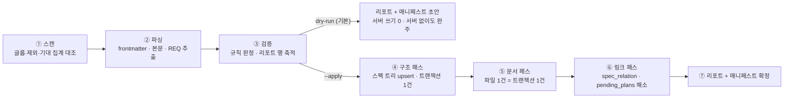

# 스펙 임포터

> **요약** — 이 문서는 기존 markdown 스펙 저장소를 Spec/SpecVersion/Requirement/Task로 옮기는 **프로파일 기반 임포터**를 구현 착수 가능한 수준으로 확정한다. 임포터는 특정 저장소 전용이 아니다 — 스캔 글롭·제외 규칙·frontmatter 매핑·트리 규칙·기대 집계를 선언한 **프로파일**(§1.4)이 대상별 차이를 흡수하고, 엔진은 프로파일만 해석한다. 내장 프로파일은 `clemvion`(FR-17의 대상 — 순수 스펙 135 md + plan 450 md)과 `nerv-docs`(도그푸딩 — §5) 2종이며, 다른 저장소는 프로파일 파일을 얹어 같은 엔진을 재사용한다. 실행 모델은 **읽기는 클라이언트, 쓰기는 API**다(2026-08-22 확정 — §3.2): 원본 체크아웃이 있는 장비에서 `nerv import` CLI가 스캔·파싱·검증·리포트·매니페스트를 만들고(dry-run은 서버 없이 완결), `--apply`만 PAT로 임포트 REST 표면(EP-IMP-01~05)에 배치를 올린다. **서버가 원본 파일에 접근할 수 있다는 전제를 두지 않는 것**이 이 구조의 이유다. 매핑의 의미 정본은 [3.3 데이터 모델](../03-proposal/data-model.md) §3이고 단계 배정의 정본은 [3.7 로드맵](../03-proposal/roadmap.md) §7이다 — spec은 Phase 0, plan은 Phase 1, `review/` 소급은 Phase 2로 이 문서 범위 밖이다. 수용 기준은 REQ-IMP-001~017 — 프로파일 기대 집계에 대한 전수 계정, 원문 바이트 보존(정보 손실 0), 연속 2회 실행 시 신규 생성 0. 마지막 절은 도그푸딩이다: `docs/04-mvp/*.md` 이 문서 세트 자체가 NERV에 임포트될 첫 스펙이고, 그래서 공통 frontmatter 규격을 갖는다.
>
> 문서 버전 v0.21 · 2026-09-06 · HTML 파생본: [importer.html](../html/importer.html)
>
> v0.21 변경(2026-09-06 — §3.3 이 계획이었다, 사람 결정): **매니페스트 구현 · `map-conflict` 점화 · 리포트 계약 · 유령 플래그 폐기.** ① §3.3 전체가 **계획이었다** — `--map` 은 파싱만 됐고 매니페스트를 읽거나 쓰는 코드가 0곳이었으며, `rebuild-map` 은 분기가 없어 **spec 임포트로 떨어졌다**("다시 짓는다" 는 이름의 명령이 적재를 했다). 실물로 만들었고(`apps/cli/src/manifest.ts`), 그래서 **`map-conflict` 를 켰다** — 이 게이트는 매니페스트가 있어야 성립한다. L3 시나리오 E 가 전체 경로를 돈다(중단 → `rebuild-map` → 적재). ② **리포트 계약**(§4.1): `rule` 슬러그와 `hint` 를 싣고 **`warn` 등급**을 더했다 — 그 등급이 없어 `research-doc`·`dist-mismatch` 가 `skipped` 로 섞여 **정상 실행이 종료 코드 1** 을 냈다. ③ **유령 플래그 둘 폐기**(`--rewrite-links`·`--split-checkboxes`) — 읽는 코드가 없어 주면 조용히 버려졌다. 없는 손잡이를 전표에 두지 않는다. ④ frontmatter 가 없는 문서에 `frontmatter-missing`(warn)을 남긴다 — 도그푸딩 대상 13편이 아무 말 없이 기본값으로 들어가고 있었다.
>
> v0.20 변경(2026-09-06 — 4부 frontmatter 를 approved 로, 사람 결정): **REQ-IMP-010 개정.** 4부 8편의 frontmatter 가 전부 `status: draft` 였다 — 이 문서 세트는 가동 후 **첫 임포트 대상**이라(§5), 그대로 돌리면 플랫폼의 첫 화면이 **자기 명세를 미승인이라고 말한다.** `status` 는 문서 축이고, 4부는 AGENTS.md 가 "확정 스택은 재논의하지 않는다" 고 못 박고 `docs/README.md` 가 "구현에 바로 착수하려면 4부만 읽어도 되도록 쓰였다" 고 선언하는 문서다 — 그것이 `approved` 의 뜻이다. **프로파일이 덮어쓰는 길은 택하지 않았다**: 원본이 적은 값을 임포터가 갈아 끼우면 §2.4 의 원문 보존 제1규칙과 부딪힌다. 구현 축은 별개다 — `status_map` 이 `approved: {doc:"approved", impl:"unimplemented"}` 이므로 요구사항은 여전히 미구현으로 적재되고, 그 축을 답하는 것은 [4.8](backlog.md) §1.4 다.
>
> v0.19 변경(2026-09-06 — 규칙이 코드에 없었다, 정합성 대조 → 사람 지시): **§2.5 규칙 1·4·7 과 §3.4 를 실물에 맞춘다.** ① 규칙 1(정의는 표의 행)이 코드에 없어 **본문 산문의 참조가 전부 요구사항으로 승격**되고 있었다 — 파서가 표만 읽게 고쳤고, 정의 파일이 따로 있는 프로파일은 `tree.area_body_file` 로 그것을 말한다. ② 규칙 4 의 "미표기는 NULL" 은 **열이 `NOT NULL` 이라 적을 자리가 없었다**(전건 `must` 적재 — 규칙이 금지한 추정을 규칙을 어겨서가 아니라 자리가 없어서 하고 있었다). 마이그레이션 `0020` 이 제약을 풀었고 `req-priority-missing` 이 이제 실제로 발생한다. ③ 규칙 2 의 `acceptance_md` 와 규칙 7 의 `requirement_version` 이 계약·서버에 없었다 — 둘 다 배선했다(`ordinal` 은 "표 내" 가 아니라 **문서 내** 정의 순서다: 표가 여럿인 문서에서 겹치기 때문). ④ §3.4 — `content_hash` 축이 파일 전문 vs 본문으로 어긋나 `unchanged` 가 영원히 나오지 않았고, 자연 키도 같은 모양으로 어긋났으며, preflight **응답은 받아서 버려지고 있었다**. 셋을 고쳤다. `map-conflict` 는 매니페스트가 있어야 옳아서 아직 켜지 않는다 — 남았다고 적었다.
>
> v0.18 변경(2026-09-06 — 래퍼 스킬을 걷었다, 사람 결정): §3.6 을 **운영자 절차**로 고쳐 쓴다. 절차 자체(프로파일 → dry-run → 리포트 → 판단 → `--apply` → 멱등 검증)는 그대로이고 **실행하는 것이 스킬이 아니라 사람**이다. 그 절차를 지키는 것은 프롬프트가 아니라 도구라는 것도 적었다 — dry-run 기본값·종료 코드 셋·`manual` 큐가 이미 강제한다. **REQ-IMP-017**("스킬이 실행되면 사람 승인 없이 적재하지 않는다")은 **폐기**한다: 대상이 사라졌고, 그 요구가 지키려던 것은 REQ-IMP-013 이 도구로 지킨다. 번호는 재사용하지 않는다. 근거 전문은 [4.6](plugin.md) §2.5.
>
> v0.17 변경(2026-09-06 — 소급 결재자를 어떻게 적을지 정한다, 사람 판단): §2.3 이 "결재 메타를 위조하지 않는다: `approved_by_user_id` = NULL" 이라 적었고 구현은 처음부터 **적재에 쓴 PAT 소유자**를 적고 있었다. 둘 중 **실행자를 택한다** — 원본에 그 정보가 없으면 되찾을 방법이 없고, NULL 은 "승인 절차를 거쳤는데 누구인지 모른다" 로도 읽혀 오히려 사실을 덜 말한다. 소급이라는 사실은 `import.applied` 이벤트(`actor_user_id`·`profile`·`root_commit`)가 따로 남긴다. **남는 한계도 적었다**: `spec_version` 행에는 임포트 표시가 없어 이벤트를 보지 않고 결재 이력만 세는 질의는 소급분을 정상 승인으로 센다.
>
> v0.16 변경(2026-09-06 — 유령 플래그와 어긋난 기대치, 정합성 대조 → 사람 지시): **옵션 셋 · 기대 집계 · EP 범위.** ① `--rewrite-links`·`--split-checkboxes` 는 기본값까지 적혀 있는데 **`parseArgs` 가 그 이름을 읽지 않는다** — 주면 조용히 버려지고 사람은 링크 재작성본이 얹혔다고 믿는다. ○ 미구현으로 표기했다. ② `--owner-map` 은 "사용자 **이메일** 수동 매핑(**yaml**)" 이라 적었는데 실물은 **JSON · 사용자 UUID** 다 — 문서대로 yaml 을 넘기면 파싱 예외로 즉사하고, 이메일을 적으면 FK 위반으로 전건 실패한다. ③ 기대 집계가 abort 의 기준인데 **배포된 프로파일은 더 나중 실측을 들고 있다**(2026-08-23 · spec 136 · implemented 93 · plan 485). 어느 쪽이 틀린 것이 아니라 **측정 시점이 다르다** — 판정은 프로파일 값이 한다는 것을 명시했다. ④ `EP-IMP-01~05` 가 여섯 자리에 남아 있었다 — 리뷰 패스(`EP-IMP-06`)가 2026-08-24 에 더해졌고, REQ-IMP-012 는 그대로 두면 구현을 위반으로 만든다. ※ 남은 것(코드 쪽 결정이 필요해 열어 둔다): **`nerv import` 서브커맨드 부재**(실제로 도는 형태는 `nerv spec …` 인데 §3.1·스킬·CLI 자신의 usage 문구가 `nerv import` 를 말한다) · 매니페스트·`rebuild-map` 미구현 · preflight 응답 미사용 · `approved_by_user_id` 에 PAT 소유자를 적는 것 · 리포트의 `rule`/`hint`/`warn` 부재 · `nerv-docs` 프로파일의 §5.1 규칙 넷.
>
> v0.15 변경(2026-09-05 — 용어 사전 반영, 사람 지시): [용어 사전](../glossary.md)의 채택어로 이 문서의 낱말을 옮긴다 — 기준선(← 베이스라인) · 워크플로우(← 워크플로) · 권한/소속/작업 범위(← 스코프) · 버전(← 판) · 고정 ID(← 안정 ID·키). **뜻은 바뀌지 않는다** — 코드·API 식별자는 그대로다.
>
> v0.14 변경(2026-09-05 — 파생본이 원본과 다른 말을 하고 있었다, 정합성 감사): html 파생본에 **§2.6e 가 통째로 없었다**(2026-08-24 신설 — 기준 스펙과 요구사항을 잇는 절). `source_spec_key` 도 실측 수치도 파생본에는 한 번도 나오지 않았다.
> v0.13 변경(2026-09-05 — Phase 표기를 현황으로, 정합성 감사 → 사람 결정): §1 의 범위 표와 경계 절이 `review/` 소급 임포트를 "P2 — 범위 밖" 이라 적고 있었는데, **같은 문서 §2.7 이 그 절차와 CLI 명령을 명세한다**(v0.9 · 2026-08-24 구현). 문서가 자기와 모순돼 있었다.
> v0.12 변경(2026-08-30 — 스펙 키 유일성 확인): 서버가 `(project_id, key)` 를 유니크로 강제하게 되면서([4.4](api.md) §1.4i) 임포터 경로를 점검했다. **동작은 바뀌지 않는다** — 임포터는 `draftUpsert` 를 타지 않고 키가 이미 있으면 `skipped` 로 이어 쓰며, CLI 가 배치 안의 중복 키를 먼저 걸러 리포트에 `aborted` 로 남긴다. 그 사실이 테스트로 고정돼 있지 않아 L2 2건·CLI 1건을 더했고, REQ-IMP-020 의 문형을 두 축(스펙 `key`·Task 표시 ID)으로 명시했다.
> v0.11 변경(2026-08-24 — 링크를 이어 붙인다): **§2.6e 신설**. plan frontmatter 의 `spec_impact`·`spec_area`·`spec` 경로를 스펙 키로 바꿔 **기준 SpecVersion** 을 잡고(365/447 건이 이 정보를 갖는다), 본문이 요구사항을 **하나만** 언급할 때 그것을 `pending` 링크로 보낸다 — 여럿이면 무엇을 구현한 것인지 문서가 말하지 않으므로 링크하지 않고 리포트에 올린다. 실측: 기준 스펙 273건 · 요구사항 링크 49건.
>
> v0.10 변경(2026-08-24 — 완료 시각 정정): **§2.6d 신설**. `done_at` 을 적재 시각으로 채우고 있어 완료 419건이 전부 "오늘"이 됐고 보관 창이 무의미해졌다(보관 보기 토글이 아무것도 드러내지 못한 원인). git 에서 되찾는다 — 함정은 **rename 감지가 pathspec 에 따라 달라진다**는 것이었다.
>
> v0.9 변경(2026-08-24 — **review 패스 구현**, §2.7 전면 개정): 리뷰 수집(FR-09)의 서버·화면이 들어오면서 소급 적재도 함께 구현했다. ① **커밋 SHA 는 NULL 이 아니라 git 에서 되찾는다** — 옛 계획("`meta.json` 에 없으므로 NULL + `provenance_incomplete`")을 정정한다. 리뷰 산출물 자체가 커밋돼 있으므로 "이 리뷰를 담은 커밋"과 그 부모를 git 이 안다(실측: 1,984건 전부 되찾음·건너뜀 0) ② **kind 마다 `meta.json` 모양이 다르다** — `code` 는 `files[]`·`agents[]`, `consistency` 는 `target_path`·`checkers[]`. 놓치면 consistency 922건이 461건으로 뭉친다(정확히 반) ③ **표의 열 이름도 kind 마다 다르고**, 원본은 코드 스팬 안의 `|` 를 이스케이프하지 않는다 — 그대로 쪼개면 백틱 한 글자가 제목이 되어 배치가 멈춘다 ④ 옮기는 것은 결론뿐이다: 역할별 md 13,777개·`_prompts/` 는 읽지 않는다(D-01·D-07).
>
> v0.4 변경(2026-08-23): **§3.5a 출력 언어 신설** — CLI 는 서버가 없어 `Accept-Language` 가 없으므로 `NERV_LANG`/`LANG` 환경변수로 로케일을 정한다. stdout 과 리포트 본문이 같은 로케일을 따른다. 신설 요구 REQ-IMP-018.
>
> v0.3 변경(2026-08-22 — 구현 중 확정): **§2.6a 신설** — 임포트한 Task 의 위임 명세 4요소 처리. DDL 의 `task_delegation_spec_ck`([4.3](database.md) §2.5)가 `backlog`·`blocked` 밖 전 상태에 4요소를 요구하는데 임포트 Task 에는 근거가 없어 `complete/` 387건이 전부 CHECK 위반으로 실패한다(실측). 지어내지 않고 출처를 적는 것으로 해소했고 CHECK 는 완화하지 않는다.
>
> **v0.2 변경(2026-08-22 — 결정일 명기)**: ① 실행 모델을 DB 직결에서 **API 클라이언트 CLI**로 확정(§3.2) — 운영 환경에서 서버가 원본 체크아웃에 접근할 수 없다는 사실이 근거다. v0.1의 "api 컨테이너 안 / k8s 일회성 Job 실행" 서술은 폐기된다 ② 임포트 REST 표면 **EP-IMP-01~05** 신설([4.4 API 명세](api.md) §2.10) ③ **프로파일을 1급 개념으로 승격**해 clemvion 전용 도구에서 범용 임포터로 확장(§1.4) ④ 래퍼 스킬 **`/nerv:import`를 MVP에 포함**(§3.6 · [4.6 플러그인과 온보딩](plugin.md) §2.5 — 스킬 4종 → 5종) ⑤ 수용 기준 REQ-IMP-011~017 추가.

---

## 1. 대상과 목표

### 1.1 무엇을, 언제 옮기나

임포터의 엔진은 범용이고(§1.4), 대상별 차이는 프로파일이 흡수한다. 아래 표는 **`clemvion` 프로파일**의 대상과 Phase 배정이다 — FR-17이 요구하는 이관이 그대로 이 프로파일의 적용이다.

FR-17의 수용 기준은 한 문장이다 — "`spec/` 384 md와 `plan/` 450 md를 Spec/SpecVersion/Requirement·Task로 변환하는 임포터가 멱등적으로 재실행되고, 변환 실패·수동 확인 필요 항목이 목록으로 보고된다"([1.2 문제 정의](../01-problem/pain-points.md) FR-17). Phase 배정은 [로드맵](../03-proposal/roadmap.md) §3 표의 "spec P0 → plan P1 → review P2"를 그대로 따른다.

| 대상 | 규모(실측 2026-08-13) | 변환 결과 | Phase | 이 문서에서 |
| --- | --- | --- | --- | --- |
| `clemvion:spec/` | 384 md · 9.3MB — 기계생성 API 카탈로그 249 md·4.6MB 제외 시 **순수 135 md · 49,383줄** | Spec / SpecVersion / Requirement / SpecRelation / Evidence | **P0** | §2.1~2.5 |
| `clemvion:plan/` | 450 md · 5.2MB (in-progress 62 = 최상위 34 + 클러스터 28 / complete 387 / research 1) | Task / TaskDependency / Evidence | **P1** | §2.6 |
| `clemvion:review/` | 13,777 md · 131MB (code 9,070 + consistency 4,697 + spec-coverage 10) | ReviewSession / Finding / Resolution | **구현됨**(2026-08-24 · v0.9) | §2.7 |
| `docs/`(NERV 제안서 자체) | md 13편 + 4부 8편 | Spec / SpecVersion / Requirement (+ backlog 스토리 → Task) | P1(도그푸딩) | §5 |

순수 135 md의 frontmatter `status` 분포는 **implemented 117 / partial 17 / backlog 1**(`spec-only`·`archived` 0)이다. 이 수치는 [1.1 clemvion 하네스 분석](../01-problem/clemvion-analysis.md) §3.1이 2026-08-14에 재검증한 정본이며, 세는 방법 자체가 함정이라는 점이 §2.1의 파싱 규칙으로 이어진다.

### 1.2 임포트는 복제다 — 컷오버와 구분

이 임포터는 D-12(clemvion 점진 이관)의 실행 도구다. 로드맵 §7.2의 구분을 그대로 계승한다.

- **임포트(복제)** — NERV가 git의 사본을 읽어 들이는 것. **SoT(단일 진실)는 여전히 git**이다. Phase 0(spec)·Phase 1(plan)에서 수행하며, 이 문서가 다루는 전부다.
- **컷오버(쓰기 경로 전환)** — SoT가 NERV로 넘어가는 것(M1~M4). 사전 조건·검증·롤백은 로드맵 §7.4~7.6이 정본이며, 그 사전 조건 중 두 가지 — "임포터가 멱등 재실행 검증을 통과했다(신규 생성 0)", "정합 검사 — 원본 파일 수 ↔ 레코드 수, 샘플 30건의 본문 해시 일치" — 를 이 임포터가 공급한다.

임포트 기간에 NERV는 미러이므로, 원본이 갱신되면 임포터를 재실행해 따라잡는다(§3.4 변경분만 규칙). 양방향 동기화는 만들지 않는다 — 그것은 M4(Phase 3+)의 착수 조건부 항목이다.

### 1.3 목표와 비목표

**목표** (수용 기준은 §4.2 REQ-IMP-*):

1. **전수 계정(accounting)** — 스캔한 384 md 전부가 "적재 / 제외(카탈로그) / 실패 / 수동 확인" 중 정확히 하나로 분류되어 리포트에 남는다. 조용히 사라지는 파일이 0이다.
2. **정보 손실 0** — 본문은 바이트 그대로 보존한다. frontmatter는 필드로 흡수하되 원문 해시를 매니페스트에 남긴다.
3. **멱등 재실행** — 같은 입력으로 몇 번을 돌려도 결과가 같다(로드맵 Phase 0 종료 조건 0-7).
4. **추정 금지** — 자동으로 알 수 없는 것(owner의 신원, 요구사항 단위 구현 상태, 우선순위 미표기)은 추정해 채우지 않고 수동 확인 큐로 보낸다.

**비목표**:

- `review/` 소급 임포트 — **구현됨**(2026-08-24 · §2.7 이 절차와 CLI 명령을 명세한다).
- 과거 실행 이력의 위조 — Claim·AgentSession은 실행의 기록이므로 임포터가 소급 생성하지 않는다(§2.6).
- 위임 명세 4요소의 소급 생성 — "옛 Task를 다시 착수할 때 명세를 채워야 `ready`로 전이한다"(로드맵 §7.3(2), FR-05).
- git 이력(과거 커밋)의 버전 이력 재구성 — 임포트 시점 스냅샷 1개 버전만 만든다. 과거 이력은 git이 계속 보관한다(D-01의 역할 분담).

### 1.4 프로파일 — 임포터의 범용성 축

**임포터는 clemvion 전용 도구가 아니다.** 엔진(스캔 → 파싱 → 검증 → 적재 → 리포트)은 저장소 이름을 모르고, 저장소마다 다른 것은 전부 **프로파일** 한 파일에 선언된다. clemvion은 그 프로파일 중 하나이며, FR-17은 "`clemvion` 프로파일이 존재하고 그 기대 집계를 통과한다"로 충족된다.

| 프로파일 | 종류 | 용도 |
| --- | --- | --- |
| `clemvion` | 내장(CLI 동봉) | FR-17의 이관 대상 — §2가 이 프로파일의 규칙 전문 |
| `nerv-docs` | 내장(CLI 동봉) | 도그푸딩 — `docs/` 문서 세트 적재(§5) |
| 사용자 정의 | `--profile-file <path.yaml>` | 다른 md 스펙 저장소. 엔진·리포트 규칙·멱등 규칙은 그대로 재사용된다 |

프로파일 스키마(요지 — 전 필드는 `@nerv/schema`의 zod 스키마가 정본이 된다):

```yaml
profile: clemvion            # 이름 — 매니페스트·리포트·감사 이벤트에 그대로 기록된다
version: 1
scan:
  spec:    ["spec/**/*.md"]
  plan:    ["plan/{in-progress,complete,research}/**/*.md"]
  exclude: ["spec/**/<기계생성 카탈로그 글롭>"]     # 재생성 가능한 산출물은 옮기지 않는다(D-07)
expect:                      # 기대 집계 — 선언한 경우에만 대조한다(REQ-IMP-016)
  spec_total: 135            # 불일치 시 abort
  status_distribution: { implemented: 117, partial: 17, backlog: 1 }   # 불일치 시 warn
tree:                        # 디렉터리 → 스펙 트리 (§2.2)
  area_from_directory: true
  area_body_file: "_product-overview.md"
  leaf_type: feature
  overrides: { "conventions/**": convention }
frontmatter:                 # 원본 필드 → NERV 필드 (§2.3)
  id: spec.key
  status_map:                # 문서 축 × 구현 축 2축 분해 — 값 목록도 프로파일이 선언한다
    implemented: { doc: approved,   impl: implemented }
    partial:     { doc: approved,   impl: in_progress }
    backlog:     { doc: draft,      impl: unimplemented }
    spec-only:   { doc: approved,   impl: unimplemented }
    archived:    { doc: deprecated, impl: unimplemented }
  code: evidence.code_path
  pending_plans: requirement.pending_task_links
requirement:
  id_pattern: "[A-Z]+-[A-Z]+-\d+"        # §2.5 휴리스틱
task:                        # plan 프로파일(P1) — §2.6
  status_map: { "complete/**": done, "research/**": reference }
  unstarted_sentinel: "(unstarted)"
```

세 가지가 프로파일의 경계다:

1. **프로파일은 클라이언트 것이다.** 서버는 프로파일을 해석하지 않고 이름만 기록한다 — 서버가 원본 파일도 파싱 규칙도 알 필요가 없다는 것이 §3.2 구조의 전제다.
2. **기대 집계는 선택이다.** clemvion처럼 실측 정본이 있는 대상은 `expect`를 선언해 측정 방법이 흔들리는 수치(P4)를 방어하고(§2.1), 그런 정본이 없는 신규 대상은 선언 없이 스캔 결과를 리포트에 계정만 한다(REQ-IMP-016).
3. **매핑 의미는 프로파일이 바꾸지 못한다.** 어떤 프로파일이든 도착지는 [3.3 데이터 모델](../03-proposal/data-model.md) §3의 같은 엔티티·같은 제약이다. 프로파일이 정하는 것은 "원본의 무엇이 그 필드에 대응하는가"뿐이다.

---

## 2. 파싱 규칙

### 2.1 스캔 대상·제외·집계 대조 — clemvion 프로파일

임포터는 **소스 프로파일(profile)** 단위로 스캔 글롭·제외 글롭·매핑 규칙·기대 집계를 고정한다. `clemvion` 프로파일:

| 항목 | 값 |
| --- | --- |
| 스캔 루트 | `--root`로 받은 clemvion 체크아웃(READ-ONLY — 임포터는 원본에 어떤 쓰기도 하지 않는다) |
| spec 스캔 | `spec/**/*.md` — 384 md |
| spec 제외 | 기계생성 API 카탈로그 249 md(제외 글롭은 프로파일에 명시 고정) — 커밋 해시로 재생성 가능한 기계 산출물은 옮기지 않는다. `_prompts/`를 git에서 뺀 clemvion 자신의 판단, 그리고 "결론 영구·입력 휘발"(D-07)과 같은 원칙 |
| plan 스캔 | `plan/{in-progress,complete,research}/**/*.md` — 450 md |
| 기대 집계 | 적재 대상 총수 **135** — 불일치 시 **중단(abort)**. status 분포 **117/17/1** — 불일치 시 경고(warn). ※ **배포된 프로파일은 더 나중 실측을 들고 있다**(`profiles/clemvion.ts` — clemvion `04fe5962f` · 2026-08-23: spec 136 · implemented 93 / partial 17 / backlog 1 · plan 485 · review 1,984). abort 가 견주는 것은 **그 값**이고, 여기 수치는 [1.1](../01-problem/clemvion-analysis.md)의 2026-08-13 실측이다 — 원본이 움직인 만큼 다르다 |

> **파싱 규칙 · frontmatter는 문서 선두 블록만 센다.** 단순 `grep '^status:'` 라인 집계는 **118/18/1/1(합 138)** 로 부풀려진다 — 규약 문서 `clemvion:spec/conventions/spec-impl-evidence.md`(5회)와 `clemvion:spec/conventions/swagger.md`(2회)가 **본문에 예시 frontmatter를 담고 있기 때문**이다. 임포터의 파서는 파일 첫 줄이 `---`일 때 그 블록 하나만 frontmatter로 취급하고, 본문 중간의 코드펜스·인용 예시는 절대 세지 않는다. 올바르게 파싱하면 117/17/1이고 합이 정확히 135로 맞는다([1.1 분석](../01-problem/clemvion-analysis.md) §3.1). 기대 집계를 프로파일에 선언해 두는 이유가 이것이다 — **측정 방법이 흔들리는 수치(P4)를 임포터가 재생산하면 안 된다.**

### 2.2 디렉터리 계층 → 스펙 트리

[로드맵](../03-proposal/roadmap.md) §7.3(1)의 매핑을 규칙으로 확정한다. clemvion `spec/`의 실측 계층은 루트 진입 문서 3건 + 영역 폴더 7개(2-navigation 18 · 3-workflow-editor 7 · 4-nodes 44(하위 7 카테고리) · 5-system 18 · 7-channel-web-chat 7 · conventions 22+카탈로그 249 · data-flow 16)다.

| 원본 | Spec 노드 | `spec.type` | 규칙 |
| --- | --- | --- | --- |
| 영역 디렉터리(예: `spec/2-navigation/`) | 트리 중간 노드 | `area` | 디렉터리당 노드 1개. 자체 `_product-overview.md`가 있으면 그 본문이 이 노드의 SpecVersion. 없으면 본문 없는 노드로 만들고 리포트에 표기(Spec은 트리 노드일 뿐 본문을 갖지 않는다 — 데이터 모델 §2.2) |
| `N-name.md` 개별 문서 | 리프 노드 | `feature` | 부모 = 소속 디렉터리의 area 노드 |
| `conventions/**`(카탈로그 제외) | 리프 노드 | `convention` | |
| 루트 진입 문서 3건 | 리프 노드 | 프로파일 예외 표로 고정: `0-overview.md` → `vision`, `1-data-model.md`·`6-brand.md` → `design` | 자동 판정하지 않는다 |
| `## Rationale`만으로 결정을 담은 문서 | 리프 노드 | `adr` **후보** — 자동 전환하지 않고 수동 확인 큐 | 로드맵 §7.3(1) "Rationale 단독 결정→`adr` 후보" |

필드 채움 규칙:

- **`tree.overrides` 의 경로는 스캔 뿌리 기준 상대**다(2026-08-23 명시). `spec/**/*.md` 의 뿌리는 `spec` 이므로 `conventions/**` 는 `spec/conventions/x.md` 를 가리킨다. 저장소 기준 절대 경로로 대조하면 이 패턴이 아무것도 잡지 못한다 — clemvion 의 convention 22편이 전부 `feature` 로 들어가 있었다(실측).
- **frontmatter `id` 가 없으면 키는 경로에서 만든다**(뿌리 기준 상대 경로의 `/` → `-`, 2026-08-23 명시). 파일명만 쓰면 디렉터리가 다른 동명 파일이 한 키를 두고 다투고, 그 다툼은 upsert 가 조용히 덮어쓰는 것으로 끝난다 — `_product-overview.md` 7건·`0-common.md` 7건이 그랬다(실측: 136건이 127노드가 되고 9건이 사라졌는데 리포트는 "실패 0"이었다). `area_body_file` 이 area 노드가 될 때는 **디렉터리 키**를 쓴다(`4-nodes-_product-overview` 는 사람이 부를 이름이 아니다) — 단, 그 문서가 `id` 를 선언했다면 그 고정 ID 를 승계한다(FR-01).
- `spec.key` ← frontmatter `id`(kebab-case). 옛 id는 이렇게 **별칭으로 보존**되어 기존 인용이 살아남는다(로드맵 §7.3(1)). 같은 프로젝트에서 key가 충돌하면 **중단** — clemvion은 "basename 충돌 시 영역 prefix" 관행으로 id 유일성을 유지해 왔으므로 충돌은 원본 결함이고, 임포터가 임의로 개명하지 않는다. 구현은 충돌한 항목을 **적재에서 빼고 파일 이름을 리포트에 남긴다**(2026-08-23) — 지우는 것보다 나쁜 것은 아무도 말해 주지 않는 것이다. clemvion 현재 상태에서는 `id: common` 을 6편이 공유해 여기 걸린다.
- `spec.sort_key` ← 파일·디렉터리명의 정수 접두(`0-`/`1-`/`5-` …). "정수 접두 규약을 데이터로 흡수"하는 자리가 정확히 이 필드다(데이터 모델 §2.2). **폭을 고정해 0 으로 채운다**(2026-08-23 구현 시 명시) — 접두를 문자열로 그대로 두면 텍스트 정렬에서 `10` 이 `9` 앞에 온다. 값은 `0` + 6자리 zero-pad, 접두가 없는 이름은 `1` 하나다: 앞 한 글자가 "숫자 접두 유무"의 순위라 콜레이션이 달라져도 접두 없는 이름이 항상 뒤로 간다(`ls` 와 같은 순서). 같은 순위 안의 동률은 트리 질의의 `ORDER BY sort_key, key` 가 푼다.
  - 이 값을 만드는 것은 **CLI 다**(경계 1 — importer.md §1.4). 무엇이 순서를 뜻하는지는 프로파일을 아는 쪽만 알고, 서버는 계약 필드(`sort_key`)를 판정 없이 적재한다. 계약에 필드가 없으면 이 규칙은 임포트를 넘지 못한다 — clemvion 130편이 `2-navigation` 아래에서 `0-dashboard` 를 세 번째에, `10-auth-flow` 를 첫 번째에 놓고 있었다(실측: 키가 frontmatter `id` 라 접두가 남지 않았다).
  - **기존 노드에는 다시 쓰지 않는다.** 노드 메타는 최초 적재에서만 정해지고 이후 변경은 EP-SPEC-15 소관이다([api.md](api.md) §2.2) — 사람이 트리에서 옮긴 순서를 재임포트가 되돌리면 "재실행해도 같은 상태"가 아니라 "재실행하면 남의 편집이 사라진다"가 된다. 그래서 계약 필드가 생기기 전에 적재된 프로젝트는 값이 빈 채로 남는다(키 알파벳 순으로 정렬된다). 이미 적재된 데이터에 순서를 입히는 일회성 백필은 별도 결정이 필요하다 — **미결(2026-08-23)**.
- `spec.title` ← 본문 첫 `# ` 헤딩. 없으면 파일명(리포트 warn).
- `spec.archived_at` ← `status: archived`일 때 임포트 실행 시각(현재 실측 0건).
- `spec.current_version_id` ← 이번 실행이 만든 SpecVersion.

### 2.3 spec frontmatter → 필드 매핑

의미 정본인 [데이터 모델](../03-proposal/data-model.md) §3.1을 실행 규칙으로 옮긴 표다. 컬럼명·값은 전부 그 문서와 1:1이다.

| clemvion 필드 | NERV 대응 | 임포터 규칙 |
| --- | --- | --- |
| `id:` (kebab-case, basename 기반) | `spec.key` + `spec.id`(서버 발급 UUID) | §2.2. UUID가 정본, 옛 id는 별칭 |
| `status:` 5값 | **2축 분해** — 문서 축 `spec_version.status` + 구현 축 `requirement.impl_status` | 아래 분해 표 |
| `code:` glob 목록 | `evidence(kind='code_path', locator=glob)` 다중 행 | glob당 1행. `source='human'`(실행자 위임), `stale=false`로 적재 후 **경로 실존 검사**를 돌려 미매치 glob은 `stale=true` + 수동 확인 큐 — "stale glob은 본 가드만으로 검출 불가"(R-1)라던 자기 인정 약점을 임포트 직후 값으로 드러낸다 |
| `pending_plans:` | `task(source_requirement_id=…, status≠done)` 링크 | P0 시점에는 Task가 없으므로 경로를 매니페스트의 미해소 목록에 적어 두고, **P1 plan 임포트가 해소**한다. 요구사항 단위 지정이 불가능한 항목은 Task의 `source_spec_version_id`만 세팅하고 수동 확인 큐로 |
| `user_guide:` | `evidence(kind='user_guide')` | 가드 미적용(R-10)이던 필드가 다른 증적과 같은 검증 경로에 올라온다 |
| 요구사항 표(`NAV-WF-01` 등) | `requirement` 행 | §2.5 |
| 요구사항 표 ✅ 마크 | **폐기** | 커버리지는 관계에서 계산한다(D-03). 131개 대 0개로 이미 갈라진 수동 표기를 데이터로 승격하지 않는다 |
| `## Overview` / 본문 / `## Rationale` | `spec_version.body_md` 안에 그대로 | §2.4 — 3섹션 규약은 본문 규약으로 유지, 위치 불변 |
| `> 관련 문서:` 상대링크 | `spec_relation` 행 | §2.4 — 관계 종류는 전부 `references`(종류 추정 금지) |

**status 분해 표** — 로드맵 §7.3(1)이 열어 둔 선택지("문서 `draft` 또는 `approved`")를 다음처럼 확정한다.

| clemvion `status` | 실측 | 문서 축 `spec_version.status` | 구현 축 `requirement.impl_status` 초기값 | 근거 |
| --- | --- | --- | --- | --- |
| `backlog` | 1 | `draft` | `unimplemented` | clemvion 라이프사이클에서 backlog는 "id가 `0-overview.md` 본문에 등장 의무"만 있는 약속 전 단계 — 문서 합의가 없다 |
| `spec-only` | 0 | `approved` | `unimplemented` | 스펙 본문은 완성·합의됐고 구현만 없는 상태. TTL 90일 빌드 실패 규약은 "approved + 파생 Task 0건" 워커 스캔으로 대체(데이터 모델 §3.1) |
| `partial` | 17 | `approved` | `in_progress` | 로드맵 "partial→approved + Requirement 일부 in_progress" |
| `implemented` | 117 | `approved` | `implemented` | |
| `archived` | 0 | `deprecated` | 유지(변경 없음) | + `spec.archived_at` 세팅 |

> **손실 주의 — 구현 축 초기값은 문서 status의 복사본이다.** 문서 단위 값 하나를 요구사항 단위로 자동 분해할 수는 없다(로드맵 §7.3(1) 손실 주의). 1,750줄 문서에 status 값이 하나뿐이어서 `CCH-SE-02`("spec이 `필수`로 약속한 update dedup이 통째로 미구현")가 통과한 것이 D-02의 기원 사고다. 그래서 `partial` 문서에서 나온 모든 Requirement 행은 **수동 확인 큐**(리포트의 manual 분류, §4.1)에 올라가고, 사람이 요구사항 단위로 확정한다. 임포터는 이 확정을 대신하지 않는다.

approved 버전의 결재 메타는 **적재 시점의 사실만** 적는다: `spec_version.approved_at` = 임포트 실행 시각(플랫폼 관점의 적재 시점), **`approved_by_user_id` = 적재에 사용한 PAT 의 소유자**, `author_user_id` = 같은 사람(§3.2 — CLI 가 실행자를 자칭하지 않는다), `author_session_id` = NULL.

> **왜 NULL 이 아닌가**(2026-09-06 결정 — 사람 판단). 예전에는 "결재 메타를 위조하지 않는다: `approved_by_user_id` = NULL(소급 결재자 없음)" 이라 적었고 구현은 처음부터 실행자를 적고 있었다. 둘 중 실행자를 택한다 — **원본에 그 정보가 없으면 되찾을 방법이 없고**, NULL 은 "승인 절차를 거쳤는데 누구인지 모른다" 로도 읽혀 오히려 사실을 덜 말한다. 적재는 실제로 그 PAT 소유자의 권한으로 일어난 일이므로 그 사람을 적는 편이 감사에 가깝다. **소급이라는 사실은 별도로 남는다** — 같은 트랜잭션이 `import.applied` 이벤트에 `actor_user_id`·`profile`·`root_commit`·건수를 적재하므로(§3.5), "이 승인이 게이트를 거친 것인가 임포트가 채운 것인가" 는 그 이벤트로 판별한다. **남는 한계도 적어 둔다**: `spec_version` 행 자체에는 임포트 표시가 없어, 이벤트를 보지 않고 결재 이력만 세는 질의는 소급 적재분을 정상 승인으로 센다. 그 구별이 필요해지면 열을 더하는 것이 다음 결정이다. 이후의 편집은 임포트가 아니라 정상 워크플로우(draft → in_review → approved, [3.5 스펙 워크플로우](../03-proposal/spec-workflow.md) 정본)를 탄다.

### 2.4 본문 처리 — 원문 보존이 제1규칙

1. **바이트 보존** — `spec_version.body_md`는 frontmatter 블록(선두 `---` … `---`)을 제외한 본문과 바이트 동일하다. `content_hash = sha256(body_md)`(데이터 모델 §2.2의 정의 그대로)가 대조 키다. 요구사항 추출(§2.5)·링크 해소는 **파생 데이터를 만들 뿐 본문을 수정하지 않는다**.
2. **`## Rationale` 유지** — 3섹션 규약(`## Overview` → 본문 → `## Rationale`, Rationale 실측 105개 문서)은 본문 안에 그대로 남는다. "폐기된 대안 보존은 문화로 유지, 위치는 그대로"(데이터 모델 §3.1). Rationale만으로 구성된 결정 문서는 `adr` 후보로 수동 확인 큐에 올린다(§2.2).
3. **상호참조 링크 → `spec_relation`** — 본문의 in-repo 상대링크(스펙→스펙)를 해소해 `spec_relation(kind='references')` 행을 만든다. 해소 실패 링크는 행을 만들지 않고 리포트로 남긴다(로드맵 §7.3(1) "변환 실패 링크는 리포트로"). 본문 자체의 링크 재작성은 기본 **off**다 — 켜려면 `--rewrite-links`(§3.1)를 쓰며, 이때도 원문 버전(v1)을 남기고 재작성본을 후속 버전(v2)으로 얹어 정보 손실 0을 유지한다.

### 2.5 요구사항 추출 — `[A-Z]+-[A-Z]+-\d+` 휴리스틱

clemvion의 요구사항 ID는 `NAV-WF-01` · `ED-CV-01` · `ND-AG-24` · `CCH-SE-02` 형식(영역-화면-순번)으로 `_product-overview.md`의 표 안에서 정의되고, 커밋 메시지가 이 ID로 대화한다([1.1 분석](../01-problem/clemvion-analysis.md) §3.1). 추출 규칙:

| # | 규칙 |
| --- | --- |
| 1 | **정의 위치** — `_product-overview.md` 본문 표의 행 중 정규식 `[A-Z]+-[A-Z]+-\d+`에 매칭되는 ID 토큰을 가진 행만 정의로 취급한다. 본문 다른 곳의 등장은 참조일 뿐이며 행을 만들지 않는다. **정의를 가진 파일을 프로파일이 `tree.area_body_file` 로 선언하면 그 파일에서만 읽고**, 선언이 없는 프로파일(nerv-docs)은 모든 파일의 표를 읽는다 — 정의 파일이 따로 없다는 뜻이기 때문이다 |
| 2 | **필드** — `requirement.ref` ← ID 원문(임포트 원본 어휘 계승 — 데이터 모델 §5.1 "요구사항 ref: `REQ-<영역>-<번호>` 또는 임포트 원본(`NAV-WF-01`)"). `statement_md` ← 행의 설명 셀 원문. `acceptance_md` ← 수용 기준 셀이 있으면 그 원문 — **EARS 정규화는 자동으로 하지 않는다**(사람 확인, 로드맵 §7.3(1)) |
| 3 | **소속** — `requirement.spec_id` = 그 `_product-overview.md`를 본문으로 갖는 area 노드. feature 단위 재배치가 필요해 보이는 행은 수동 확인 큐로 |
| 4 | **우선순위** — 필수→`must`, 권장→`should`, 선택→`could`(데이터 모델 §2.2의 매핑). 미표기는 NULL로 두고 추정하지 않는다 — plan `priority` 미선언을 null로 두는 로드맵 §7.3(2)와 같은 원칙. 열 이름(`우선순위`/`priority`)이 있으면 그 셀만 보고, 없으면 어휘가 통째로 든 셀을 찾는다 |
| 5 | **구현 상태** — `impl_status` 초기값은 소속 문서의 status 복사(§2.3 분해 표), `partial` 유래는 전건 수동 확인 큐 |
| 6 | **중복 ref** — `UNIQUE (project_id, ref)` 위반이 되는 두 번째 정의 행은 건너뛰고(첫 행 적재) 수동 확인 큐로 |
| 7 | **버전 델타** — `requirement.introduced_in_version_id` = `current_version_id` = 이번 임포트 버전. `requirement_version` 행은 `change_kind='added'`(재실행에서 기존 ref 를 다시 만나면 `modified`), `ordinal` = **문서 내 정의 순서**(표가 여럿이면 이어서 센다 — 표마다 0부터 세면 한 문서 안에서 순서가 겹쳐 정렬이 답을 못 낸다), `statement_md` = 시점 스냅샷 |

> **`priority` 열은 2026-09-06 까지 `NOT NULL` 이었다.** 규칙 4 가 "미표기는 NULL" 을 요구하는데 저장이 그것을 받지 못했고, 임포터는 전건 `must` 를 넣고 있었다 — 원본에 우선순위가 적힌 적 없는 요구사항이 저장에서 "필수" 가 됐다는 뜻이다. 규칙이 금지한 추정을 **규칙을 어겨서가 아니라 적을 자리가 없어서** 하고 있었고, 그래서 `req-priority-missing`(class manual)도 한 번도 발생할 수 없었다. 마이그레이션 `0020` 이 제약을 풀었다.

✅ 마크는 읽지 않는다(§2.3 — 폐기). 상태 컬럼이 아예 없는 영역(`3-workflow-editor`·`7-channel-web-chat`)과 131개가 칠해진 영역(`2-navigation`)이 공존하는 표기를 신뢰할 수 없기 때문이며, 커버리지는 이후 관계에서 계산된다(D-03, FR-13).

### 2.6a 임포트한 Task 의 위임 명세 — 출처를 적는다 (2026-08-22 구현 중 확정)

DDL 의 `task_delegation_spec_ck`([4.3](database.md) §2.5)는 `backlog`·`blocked` **밖의 모든 상태**에 위임 명세
4요소를 요구한다. 그런데 임포트한 Task 에는 그 근거가 없다 — 원본 `plan/` 에는 위임 명세라는
개념 자체가 없고, `complete/` 387건은 `done` 으로 적재된다(§2.6). 그대로 두면 387건이 전부
CHECK 위반으로 실패한다(구현 중 실측).

**해법: 지어내지 않고 출처를 적는다.** 4요소 자리에 고정 문자열
`(임포트 — 원본에 위임 명세 없음)` 을 넣는다.

- 목표·산출물을 그럴듯하게 지어내면 그 Task 는 "근거가 있는 것처럼" 보인다 — provenance 추적
  (P5)이 무너지는 지점이다. 사실을 적으면 그 자리가 비어 있었다는 것 자체가 데이터로 남는다.
- 고정 문자열이라 전수 식별·일괄 보정이 가능하다(`goal_md = '(임포트 …)'` 한 번의 질의).
- 판정에 쓰이지 않는다 — `ready` 승격은 임포트 경로로 오지 않으므로(REQ-IMP-009) 이 값이
  게이트를 통과시키는 일은 없다.
- CHECK 를 완화하지 않는다. 살아 있는 워크플로우에서 4요소는 여전히 강제다(spec-workflow §4.1).

### 2.6 plan frontmatter → Task 매핑 (P1)

의미 정본은 [데이터 모델](../03-proposal/data-model.md) §3.2, 규칙 정본은 [로드맵](../03-proposal/roadmap.md) §7.3(2)다. plan 필수 3필드는 `worktree:`(미착수 sentinel `(unstarted)`) · `started:`(ISO 날짜) · `owner:`다.

| clemvion | NERV | 임포터 규칙 |
| --- | --- | --- |
| md 파일 1건 | `task` 1행 | `plan/research/`(1건)는 Task를 만들지 않고 리포트에 "참고 문서" 분류만 남긴다(로드맵 §7.3(2)). 클러스터(하위 디렉터리 28건)의 묶음 정보는 매니페스트에 기록하되 Task 간 관계는 만들지 않는다 — 관계 추정 금지 |
| 디렉터리 + `worktree:` | `task.status` | `complete/` → `done`(+`done_at`=임포트 시각), `in-progress/` + `worktree: (unstarted)`(13/34) → `backlog`, `in-progress/` + worktree 값 있음 → `in_progress`. **`ready`로는 절대 적재하지 않는다** — 위임 명세 4요소를 소급 생성하지 않으므로(FR-05) `backlog → ready` 전이 조건을 만족할 수 없다 |
| `started:` | `task.created_at` | 데이터 모델 §3.2의 매핑. 값 없음·placeholder면 파일의 git 최초 커밋 시각이 아니라 **NULL 계열로 두지 않고** 임포트 시각 + 리포트 warn(시각 추정 금지) |
| `owner:`(자유 텍스트) | `task.assignee_user_id` | **owner는 신원이 아니다** — 최상위 34건의 실측 분포: `developer` 17 / `project-planner` 8 / `planner` 5 / `developer (TBD)` 2 / `사용자 본인 / planner` 1 / `developer (다음 진입자)` 1. CLI `--owner-map`(라벨→이메일 수동 매핑 테이블)으로만 배정하고, **매핑 불가 항목은 assignee NULL(unassigned)로 적재 후 사람이 배정한다**(로드맵 §7.3(2)) |
| `priority:`(P1~P3, 15/34만 선언) | `task.priority` | 선언된 것만. "미선언은 null로 두고 추정하지 않는다"(로드맵 §7.3(2)) |
| `spec_impact:`(Gate C — 완료 plan) | `task.spec_impact` jsonb | 스펙 경로 목록 → 매니페스트로 스펙 UUID 변환, sentinel(`none`/`없음`/`n/a`/`na` — Gate C 어휘 4종) → `{"none": true}`(데이터 모델 §2.4). 경로 해소 실패는 수동 확인 큐 |
| plan 본문 체크박스 | Task 체크리스트(본문 유지) | 하위 Task 분해는 임포트 옵션(`--split-checkboxes`, 기본 off — 로드맵 "분해 기준은 임포트 옵션"). 기본값에서 본문은 `task.body_md`에 바이트 보존 |
| 본문 | `task.title` · `task.body_md` | title ← 첫 `# ` 헤딩(없으면 파일명), body ← frontmatter 제외 본문 원문 |

**소급 위조 금지** — 임포터는 `claim`·`agent_session` 행을 만들지 않는다. 둘은 실행의 기록이지 문서의 번역이 아니다. `worktree:` 값(살아있는 worktree 디렉토리명)은 매니페스트에 보존만 하고, 그 디렉터리가 현재 실존하지 않으면 리포트 warn으로 남긴다 — "머지된 값을 두면 가드가 '연결된 plan 없음'으로 오판해 무장 해제된다"던 스칼라 필드의 한계([1.1 분석](../01-problem/clemvion-analysis.md) §3.3)는 NERV에서 claim 테이블이 대체하며, 그 claim은 재착수 시점에 실제 세션이 만든다.

### 2.6b 표시 ID 의 폭 — 짧은 해시는 문서를 먹는다 (2026-08-23 정정)

임포트한 Task 의 표시 ID 는 **원본 경로의 해시**다(`TSK-<hex>`) — 재실행이 같은 키를 내야 멱등이 성립하기 때문이다(§3.4). 문제는 폭이었다.

16진 **4자**는 키 공간이 65,536이다. clemvion plan 481건에서 충돌 기댓값은 `481²/(2·65536) ≈ 1.76`이고, 실제로 **1건을 잃었다**(실측 2026-08-23 — `plan/complete/swagger-double-wrap-fix.md` 와 `plan/in-progress/spec-draft-eia-notification-payload-contract.md` 가 함께 `TSK-25b4` 를 받았다). 상태가 서로 다른 두 티켓이 하나가 됐는데, 그 덮어쓰기는 서버에서 **정상 upsert** 라 오류가 나지 않는다 — 리포트는 "변환 481 · 실패 0"이었다. §2.2 의 spec 키 충돌과 같은 실패 방식이다.

- **폭을 12자(2^48)로 넓힌다.** 같은 규모에서 충돌 기댓값이 4e-10 이다.
- **알고리즘은 계약 패키지가 소유한다**(`importDisplayKey` — `@nerv/schema`). 서버는 이 키로 upsert 를 판정하고 CLI 는 보내기 전에 충돌을 걸러야 하므로, 두 곳이 같은 답을 내야 한다. 따로 적으면 그 순간 조용히 갈라진다(REQ-CB-006 의 정신).
- **CLI 가 먼저 거른다.** spec 과 같은 규율로, 같은 키를 받는 파일들은 적재에서 빼고 리포트에 `aborted` 로 남긴다 — 사라지되 이름은 남는다(전수 계정 — REQ-IMP-016).

**형식도 정본에 맞췄다(2026-08-23 — 미결 해소).** 표시 키는 [데이터 모델](../03-proposal/data-model.md) §5.1 의 `<project.key>-<타입>-<base32 6자>`(예: `CLV-T-1KTDCK`)다. 재보니 파급이 작았다 — 형식에 의존하는 프로덕션 코드는 **없고**(웹 라우트는 `task.key` 를 그대로 넘긴다) 나머지는 전부 예시 문자열이었다.

- **생성기가 둘이었다.** 임포트 경로만 보고 있었는데 일반 Task 생성(`TaskService.create`)도 `TSK-` + 16진 4자였다. 이쪽은 `task_key_uq` 가 있어 조용히 먹지는 않지만 대신 원인 모를 오류가 난다 — Task 484건 시점에서 다음 생성의 충돌 확률이 0.74% 였다. 둘을 한 함수(`displayKey`)로 합쳤다.
- **알파벳은 혼동 문자를 뺀 base32**(Crockford — `I`·`L`·`O`·`U` 없음)다. 사람이 옮겨 적는 것이 용도라 `0/O`·`1/I/L` 을 가르는 부담을 지우지 않는다. 32^6 ≈ 10.7억.
- **씨앗은 용도가 정한다.** 일반 생성은 Task 의 UUID, 임포트는 원본 경로다 — 재실행이 같은 키를 내야 멱등이 성립한다(§3.4). 형식은 하나다.
- [3.6 화면 설계](../03-proposal/ui-wireframes.md)의 ASCII 목업은 옛 표기(`TSK-xxxx`)로 남겼다. 12자 키가 8자를 상정해 그린 열에 들어가지 않아 상자를 전부 다시 그려야 하는데, 거기서 키 문자열은 배치 연구의 장식이다 — 그 문서 머리에 주의를 달았다.

### 2.6d 완료 시각은 적재 시각이 아니다 (2026-08-24 정정)

`done` Task 의 `done_at` 을 서버가 `now()` 로 채우고 있었다. 그 결과 clemvion 완료 419건이 전부 "오늘 끝난 것"이 되고, **완료 창(`TASK_DONE_WINDOW_DAYS` = 7일)이 무의미해졌다** — 보관 보기 토글이 아무것도 드러내지 못한 이유가 그것이다(실측: 창 밖 0건).

원본 frontmatter 에는 `started` 는 있어도 **완료일이 없다**. 그런데 완료된 계획은 `plan/in-progress/` 에서 `plan/complete/` 로 **옮겨져 커밋**되므로, 그 경로에 처음 나타난 커밋이 곧 완료한 날이다 — 리뷰의 `head_sha` 를 되찾은 것(§2.7)과 같은 방법이다. 임포터가 git 이력 한 번 훑기로 경로 → 시각 지도를 만들고 계약의 `done_at` 으로 보낸다. 되찾지 못하면 서버가 적재 시각으로 떨어뜨리고, 그 사실은 **리포트에 `manual` 로 올라간다**(조용히 넘기지 않는다).

> **rename 감지를 끈다(`--no-renames`).** pathspec 이 `plan/` 이면 in-progress → complete 이동이 git 에게는 **rename** 이라 `--diff-filter=A` 에서 통째로 빠진다 — 완료 경로가 이력에 나타나지 않는다(실측 2026-08-24: 409건 중 267건이 그렇게 사라졌고, 파일 하나만 pathspec 으로 주면 같은 파일이 정상적으로 잡혔다. **rename 감지가 pathspec 에 따라 달라진다**는 것이 함정이다). 우리가 묻는 것은 "내용이 어디서 왔나"가 아니라 "이 경로가 언제 생겼나"이므로 이동을 delete + add 로 보는 편이 맞다.

---

### 2.6c 배치 상한은 계약이 정한다 (2026-08-23 정정)

한 요청의 항목 상한은 200이다(`IMPORT_BATCH_MAX` — EP-IMP-02·03 계약). spec 패스는 나눠 보내는데 **plan 패스만 이 처리가 빠져 있어** clemvion 481건이 한 요청으로 나갔고 서버가 스키마 위반으로 거절했다(실측). 벽은 본문 크기가 아니라 항목 수다.

보증은 **보내는 자리 한 곳**(`chunked`)에 둔다. `--batch-size` 는 사람에게서 오고 보내는 자리는 넷(structure·document·links·tasks)이라, 각자 지키게 하면 한 곳이 빠졌을 때 드러나지 않는다 — 실제로 tasks 가 그랬다. 사람이 상한보다 큰 값을 줘도 조용히 400 을 받지 않고 깎인다.

### 2.6e 기준 스펙과 요구사항 링크 (2026-08-24 신설)

계약의 `pending`(요구사항 ↔ Task)은 **있었고 아무도 채우지 않았다** — CLI 가 늘 빈 배열을 보냈고 서버에는 그 절이 아예 없었다. 그래서 커버리지의 "요구사항 → 작업" 축이 언제나 0 이었다: 화면은 정직하게 0 을 그렸지만 그 0 은 사실이 아니라 **묻지 않은 것**이었다.

| 무엇 | 어디서 | 규칙 |
| --- | --- | --- |
| 기준 SpecVersion(`source_spec_key`) | plan frontmatter `spec_impact` · `spec_area` · `spec` | 세 자리에 흩어져 있다 — 합쳐 중복을 걷고 **우리가 아는 첫 번째**를 쓴다(FK 가 단수이고, 원본의 나열 순서가 곧 주된 대상이다). 실측 447건 중 365건이 이 정보를 갖고, 273건이 해소된다 |
| 요구사항(`pending`) | plan **본문**의 `[A-Z]+-[A-Z]+-\d+` | **하나만 언급했을 때만** 링크한다. 여럿이면 그중 무엇을 구현한 것인지 문서가 말하지 않으므로 고르는 순간 없는 판정을 지어내는 것이 된다 — 링크하지 않고 리포트에 올린다. 실측: 정확히 1건 47 · 2건 이상 38 · 0건 362 |

> **스펙 키는 spec 패스와 같은 규칙으로 다시 계산한다.** plan 패스는 spec 패스와 따로 도는데 계획은 **경로**로 적혀 있고 서버가 아는 것은 **키**다. 규칙이 갈라지면 링크가 조용히 빗나간다 — 실제로 한 번 그랬다: 프로파일의 `frontmatter.id: 'spec.key'` 를 **원본 필드 이름**으로 읽어 `key` 를 찾았더니 365건 중 31건만 맞았다. 그 값은 "원본의 `id` 가 우리 `spec.key` 가 된다"는 **매핑 방향**이지 필드 이름이 아니다.

> **이미 적재된 행의 빈 링크는 재실행이 채운다**(§3.4 의 예외). 임포터가 나중에 새 축을 채우게 되면 이미 들어간 행은 영영 그 값을 못 받고, 채우는 유일한 길이 "지우고 다시 넣기"가 된다 — 그건 임포트를 다시 위험한 작업으로 만든다. 규칙은 좁다: **NULL 인 자리만 채우고 값이 있는 자리는 건드리지 않는다.** 사람이 화면에서 고친 것을 임포트가 되돌리지 않는다는 뜻이다.

---

### 2.7 review 소급 — **Phase 2, 2026-08-24 구현** (`nerv import review`)

`review/` 13,777 md의 소급은 Phase 2다(로드맵 §3 "review P2"). 리뷰 수집(FR-09)의 서버·화면이 들어오면서([4.1 범위](scope.md) §5 착수 기록) 이 패스도 함께 구현했다. 원본 한 세션은 `review/<kind>/YYYY/MM/DD/HH_MM_SS/` 디렉터리다.

| 원본 | NERV | 규칙 |
| --- | --- | --- |
| 디렉터리 1개 | `review_session` 1개 | `kind`는 첫 세그먼트(`code`·`consistency`·`spec-coverage`) |
| `SUMMARY.md` 발견 표 | `finding` × N | 절 제목이 severity(`Critical` / `경고(WARNING)` / `참고(INFO)`) |
| `SUMMARY.md` 역할별 위험도 표 | `reviewer_report` × N | 없으면 `meta.json`의 역할 명단으로 커버리지만 |
| `meta.json.timestamp` | `started_at`·`completed_at`·`finding.created_at` | **지금이 아니다** — 임포트 시각으로 뭉치면 이력이 사라진다 |
| `meta.json.files[]` (code) · `target_path` (consistency) | `changeset` | kind마다 다른 자리다(아래 콜아웃) |
| `_retry_state.json`의 worktree 경로 | `branch` | `.claude/worktrees/<이름>/` → `<이름>`, 아니면 `main` |
| git 이력 | `head_sha`·`base_sha` | 리뷰가 **추가된 커밋**과 그 첫 부모 |

**옮기지 않는 것**: 역할별 md 본문(13,777개·131MB) · `_prompts/` · `_retry_state.json`의 나머지. 옮기는 것은 결론이지 재생성 가능한 입력이 아니다(D-01·D-07) — 통째로 넣으면 clemvion이 겪은 자기증식을 DB 안에서 재현하는 것이 된다.

> **커밋 SHA는 NULL이 아니라 git에서 되찾는다**(2026-08-24 — v0.8까지의 계획 정정). 옛 규칙은 "`meta.json`에 필드 자체가 없으므로 NULL + `provenance_incomplete` 플래그"였는데, 스키마가 `head_sha`·`base_sha`를 **NOT NULL로 확정**했고([4.3](database.md) §2.7) 그것이 이 스키마에서 가장 값싼 개선이라는 판단이 정본이다. 그리고 되찾을 수 있다: 리뷰 산출물 자체가 커밋돼 있으므로 "이 리뷰를 담은 커밋"과 그 부모를 git이 안다. 되찾지 못한 세션(커밋되지 않은 작업 트리 산출물)은 **건너뛴다** — 무엇을 봤는지 답할 수 없는 리뷰는 게이트의 근거가 되지 못한다. 실측(2026-08-24): 1,984건 전부 되찾았고 건너뛴 것은 0건이다.

> **kind마다 `meta.json`의 모양이 다르다**(실측 2026-08-24). `code`는 `files[].file_path`와 `agents[]`를, `consistency`는 `target_path`와 `checkers[]`를 갖는다 — `files` 자체가 없다. 이 갈래를 놓치면 consistency의 changeset이 전부 비고, **같은 커밋에 들어온 두 검사가 한 세션으로 합쳐진다**(922건 → 461건, 정확히 반). 라운드 병합은 "같은 것을 다시 본 것"에만 일어나야 한다.

> **표의 열 이름도 kind마다 다르다.** code는 `| # | 카테고리 | 발견사항 | 위치 | 제안 |`, consistency는 `| # | Checker | 위배 | target 위치 | 충돌 대상 | 제안 |`(WARNING)과 `| # | Checker | 항목 | 위치 | 제안 |`(INFO)이다. 그래서 파서는 **열 위치를 고정하지 않고 머리글에서 찾는다**. 그리고 원본은 코드 스팬 안의 `|`를 이스케이프하지 않는다(``​`as string | undefined`​`` · ``​`||`​``) — 그대로 쪼개면 열이 밀려 백틱 한 글자가 제목이 되고 배치 전체가 계약 위반으로 멈춘다(실측).

**멱등**은 새 장치를 만들지 않고 `review_session`의 `changeset_hash`가 만든다 — 같은 커밋·같은 대상이면 같은 세션에 합쳐지고 라운드가 늘지 않는다([4.4](api.md) §2.6a 계약 2). 재실행이 세션도 발견도 늘리지 않는다.

**산문 SUMMARY 271건**(1,984 중)은 표가 아니라 문단이다(원본에서 요약 sub-agent가 실패해 사람이 직접 쓴 것). 세션은 적재하되 발견 0건으로 두고 **리포트에 `manual`로 올린다** — 조용히 0건으로 넘기면 "리뷰가 있었는데 지적이 없었다"와 구별되지 않는다.

---

## 3. 실행 모델

### 3.1 CLI — `nerv import`

임포터는 **원본 체크아웃이 있는 장비에서 실행하는 CLI**(`@nerv/cli` — 배치는 [4.2 코드베이스와 배포](codebase.md) §1.1)다. **dry-run이 기본**이고, 서버에 쓰려면 `--apply`를 명시해야 한다.

```text
nerv import spec  --profile clemvion --root <체크아웃 경로> --project <프로젝트 slug>
                  [--server <base URL>] [--token <PAT>]        # --apply 시 필수, env NERV_SERVER/NERV_TOKEN 가능
                  [--apply] [--map <매니페스트 경로>] [--report-dir <디렉터리>]
                  [--batch-size <n>]

nerv import plan  --profile clemvion --root <경로> --project <slug>
                  [--apply] [--map …] [--report-dir …] [--owner-map <owners.json>]

nerv import review --profile clemvion --root <경로> --project <slug>              # §2.7 (Phase 2)
                  [--apply] [--report-dir …] [--batch-size <n>]

nerv import docs  --profile nerv-docs --root docs/ --project <slug> [--apply] …   # §5 도그푸딩

nerv import spec  --profile-file ./my-repo.profile.yaml --root <경로> --project <slug> …   # 사용자 정의(§1.4)

nerv import rebuild-map --profile <p> --root <경로> --project <slug> --map <출력 경로>
```

| 옵션 | 의미 | 기본값 |
| --- | --- | --- |
| `--apply` | 실제 적재. 없으면 dry-run — 서버 쓰기 0, 리포트·매니페스트 초안만 산출 | off |
| `--server` | NERV API base URL. `--apply` 시 필수, dry-run에서는 있으면 preflight(§3.5)까지 수행 | env `NERV_SERVER` |
| `--token` | `import:write` 권한 PAT. 적재 레코드의 작성자는 이 토큰의 소유자다 | env `NERV_TOKEN` |
| `--profile-file` | 사용자 정의 프로파일 yaml(§1.4). `--profile`(내장 이름)과 배타 | 없음 |
| `--map` | 멱등 매니페스트 파일(§3.3) | `./nerv-import.map.json` |
| `--report-dir` | 리포트 출력 위치(§4.1 — `report.md` + `report.jsonl`) | `./nerv-import-report/` |
| `--owner-map` | plan `owner:` 라벨 → **사용자 UUID** 수동 매핑(**JSON** — `{ "developer": "<user-uuid>" }`). 없으면 전건 unassigned. (2026-09-06 정정: 예전에는 "이메일(yaml)" 이라 적었고 그대로 넘기면 파싱 예외 또는 FK 위반으로 전건 실패한다) | 없음 |
| ~~`--rewrite-links`~~ | **폐기**(2026-09-06) — 읽는 코드가 없어 주면 조용히 버려졌다. 유령 인자를 전표에 두는 것은 없는 손잡이를 있다고 적는 일이다. 링크 재작성이 필요해지면 그때 새로 정한다 | — |
| ~~`--split-checkboxes`~~ | **폐기**(2026-09-06) — 위와 같다 | — |
| `--batch-size` | EP-IMP-02/03 한 배치의 파일 수(§3.5) | 50 |

종료 코드: `0` = 실패 0건 완료 · `1` = 완료했으나 실패·수동 확인 항목 존재(리포트 확인) · `2` = 중단(abort — §4.1).

`--as-user`는 두지 않는다. 실행자는 PAT 소유자로 서버가 판정하며, CLI가 다른 사람을 자칭할 수 있는 경로를 만들지 않는다(§2.3의 결재 메타 규칙과 짝).

### 3.2 실행 컨텍스트 — 읽기는 클라이언트, 쓰기는 API (2026-08-22 확정)

**전제**: 운영 환경의 NERV 서버는 임포트 대상 저장소의 체크아웃에 접근할 수 없다. 대상은 다른 네트워크·다른 조직의 사설 저장소일 수 있고, 클러스터에 마운트되지도 clone되지도 않는다. 그러므로 **파일을 읽는 쪽은 파일이 있는 장비**여야 하고, 서버는 파일이 아니라 이미 파싱된 결과를 받는다. 임포터가 `DATABASE_URL`을 직접 쥐는 v0.1 모델은 이 전제에서 성립하지 않으므로 폐기한다(개발 장비에 DB 자격증명을 내보내는 것 자체가 "DB는 api·worker만 만진다"는 배포 모델과 PAT 권한 모델(D-08)의 우회이기도 하다).

| | 어디서 도는가 | 무엇을 하는가 | 무엇을 하지 않는가 |
| --- | --- | --- | --- |
| **`@nerv/cli`** (`nerv import`) | 체크아웃이 있는 장비 — 개발자 노트북·이관 담당자 워크스테이션·CI 러너 | 스캔·파싱·규칙 판정·리포트(§4.1)·매니페스트(§3.3)·배치 조립·전송 | DB 접속(`DATABASE_URL` 미사용), 도메인 판정(`ready` 승격·게이트 판정은 전부 서버) |
| **`ImportModule`** (`apps/api`) | 서버 | EP-IMP-01~**06** 수신(리뷰 패스가 2026-08-24 에 더해졌다) → 도메인 서비스·저장 계층으로 upsert, 자연 키 조회, 트랜잭션·제약 강제, 감사 이벤트 | 원본 파일 접근, 프로파일 해석, 리포트 생성 |

인증·권한은 기존 체계를 그대로 쓴다 — PAT Bearer + **`import:write` 권한**, 역할은 admin([4.4 API 명세](api.md) §1.3·§2.10). 토큰 소유자가 곧 적재 레코드의 작성자다.

서버 쪽 두 성질은 v0.1과 동일하게 유지된다:

1. **워크플로우 전이 검사는 우회한다.** 소급 적재는 상태 전이가 아니라 초기 적재다 — `approved` 버전을 승인 절차 없이 만들고, `done` Task를 게이트 판정 없이 만든다. "모든 상태 전이는 Event를 남긴다"(데이터 모델 §5.5-6)와 충돌하지 않는다: 전이가 없으므로 전이 이벤트도 없다. 다만 우회가 **임포트 경로에서만** 열린다는 점이 v0.1과 다르다 — 일반 REST·MCP 표면에는 이 경로가 없고, EP-IMP-*는 admin + `import:write`로만 열린다. 임포트 이후의 첫 편집부터는 정상 워크플로우와 이벤트가 흐른다.
2. **무결성 제약은 그대로 받는다.** approved 본문 불변 트리거, `UNIQUE (project_id, ref)`, partial unique 등 스키마 제약([4.3 데이터베이스 스키마](database.md))은 임포터에게도 예외가 없다 — API 경유이므로 오히려 우회 불가능하다. 제약 위반은 그 파일 트랜잭션의 실패로 응답에 담기고 리포트에 남는다.

**감사**: 적재 배치마다 `event` 행 1건(`type='import.applied'`, `is_agent=false`, actor = PAT 소유자, payload에 프로파일 이름·`root_commit`·건수)을 남긴다. 전이 이벤트는 만들지 않는다(위 1). 이 이벤트는 `project:{id}` 룸으로 방송되지만 알림은 만들지 않는다([4.4 API 명세](api.md) §3.3).

**로컬 개발도 같은 경로다.** compose로 띄운 서버에 `--server http://localhost:8080`으로 붙는다 — 쓰기 경로를 로컬용/운영용으로 이원화하지 않는다(이원화하면 검증해야 할 불변식이 두 벌이 된다).

### 3.3 멱등 키와 매니페스트

멱등의 단위는 **(프로파일, 소스 경로, frontmatter id)** 다. 실행 결과는 매니페스트(JSON)에 기록되고, 재실행은 매니페스트를 먼저 읽는다.

| 매니페스트 필드 | 내용 |
| --- | --- |
| `profile` · `project` · `root_commit` | 프로파일, 대상 프로젝트, 스캔 시점 원본의 git HEAD SHA |
| `items[]` | 항목별: `source_path`, `kind`(spec/plan), 원본 frontmatter `id`, 생성된 `spec.id`/`task.id`(UUID), 최신 `spec_version.id`, `content_hash`, 추출된 `requirement.ref` → UUID 맵 |
| `unresolved` | 미해소 `pending_plans` 경로 목록(P1에서 해소), 해소 실패 링크 |
| `aliases` | 원본 경로·id → NERV UUID 별칭 표 — 이후 링크 재작성·plan `spec_impact` 경로 변환이 이 표를 쓴다 |

**서버가 진실이고 매니페스트는 캐시다.** 매니페스트를 잃어버려도 중복 적재로 이어지지 않는다 — `--apply` 시 임포터는 자연 키(`(project, spec.key)`, `(project_id, requirement.ref)`)를 **EP-IMP-01 preflight**로 서버에 먼저 대조하고, 매니페스트 없이 동일 키가 이미 존재하면 **중단**하며 `nerv import rebuild-map`을 안내한다. `rebuild-map`은 **EP-IMP-05**(자연 키 → UUID 대조표)로 매니페스트를 서버에서 재구성한다(Task는 자연 키가 없어 제목 매칭으로 후보를 제시하고, 모호 항목은 수동 확인 큐로).

> **매니페스트가 실물이 됐다**(2026-09-06 · `apps/cli/src/manifest.ts`). 2026-09-06 까지 이 절 전체가 계획이었다 — `--map` 은 파싱만 됐고 매니페스트를 읽거나 쓰는 코드가 **0곳**이었으며, `rebuild-map` 은 분기가 없어 **spec 임포트로 떨어졌다**("다시 짓는다" 는 이름의 명령이 적재를 했다). 이제 `--apply` 가 끝나면 적재한 항목을 적고, 다음 실행이 그것을 먼저 읽는다.
>
> **그래서 `map-conflict` 를 켰다.** 이 게이트는 매니페스트가 있어야 성립한다 — 서버에 이미 있는 키가 *우리가 넣은 것*인지 *남이 넣은 것*인지 가릴 수 있어야 하기 때문이다. L3 시나리오 E 가 그 전체 경로를 돈다: 사람이 에디터로 만든 스펙 위에서 임포트가 **중단**하고 → `rebuild-map` 이 서버에서 매니페스트를 되짓고 → 다시 밀면 적재된다. **되짓기는 적재가 아니다**(그 실행의 `import.applied` 이벤트는 0건이다).
> **`content_hash` 의 축은 본문이다**(2026-09-06 정정). 서버가 견주는 값은 `sha256(body_md)` — frontmatter 를 뺀 본문 해시다(REQ-IMP-002). CLI 는 2026-09-06 까지 **파일 전문 해시**를 보내고 있었고, 두 값은 같아질 수가 없어 `unchanged` 판정이 한 번도 나오지 않았다. 자연 키도 같은 모양으로 어긋나 있었다 — 적재는 `keyFromPath(…)` 로 만든 키를 쓰고 preflight 는 파일 경로를 물어, frontmatter `id` 가 없는 파일은 이미 적재돼 있어도 언제나 `new` 로 돌아왔다. 게다가 CLI 는 preflight **응답을 받아서 버렸다** — 서버가 계산한 세 판정이 아무 일도 하지 않는 값이었다. 셋을 고쳐 이제 무변경 본문은 다시 보내지 않고, 그 수가 리포트 머리에 선다.
>
> **`map-conflict` 는 2026-09-06 에 켜졌다** — 매니페스트가 실물이 되면서다(§3.3). 정상 재실행이 조용히 지나가는 이유가 그 캐시다: 우리가 넣은 키는 매니페스트에 있으므로 중단 대상이 아니다.

### 3.4 재실행 규칙 — 변경분만

| 재실행 시점의 원본 상태 | 동작 |
| --- | --- |
| `content_hash` 동일(무변경) | **건드리지 않는다** — 신규 레코드 0(로드맵 0-7의 정의 그대로) |
| 본문 변경 | 그 스펙에 새 SpecVersion을 추가하고 `current_version_id` 갱신. 요구사항 표 델타는 `requirement_version.change_kind`(`added`/`modified`/`removed`/`unchanged`)로 기록 |
| 파일 이동(경로 변경, id 동일) | 매니페스트의 id 매칭으로 같은 Spec으로 인식, `source_path`만 갱신(트리 위치 변경은 수동 확인 큐 — 부모 추정 금지) |
| 파일 삭제 | Spec을 삭제하지 않는다 — 리포트에 "원본 소멸" 표기만. 아카이브 여부는 사람이 결정 |
| plan `in-progress/` → `complete/` 이동 | 같은 Task의 `status`를 `done`으로 갱신(basename 동일 + 매니페스트 매칭) |

### 3.5 트랜잭션 단위와 실행 패스



①~③은 클라이언트 단독이다 — **dry-run은 서버 없이 완주한다**(REQ-IMP-011). ④부터가 API 호출이며, 패스와 엔드포인트는 1:1로 대응한다([4.4 API 명세](api.md) §2.10):

| 패스 | 엔드포인트 | 서버 측 트랜잭션 단위 |
| --- | --- | --- |
| ③ 검증의 서버 대조(자연 키 충돌·기존 버전 해시) | **EP-IMP-01** `POST …/import/preflight` | 없음(읽기 전용) |
| ④ 구조 패스 — 스펙 트리 노드 upsert | **EP-IMP-02** `POST …/import/specs`(`kind=structure`) | 배치 1건 |
| ⑤ 문서 패스 — SpecVersion·Requirement·Evidence | **EP-IMP-02** `POST …/import/specs`(`kind=document`) | **파일 1건** |
| ⑤′ plan 패스(P1) — Task·TaskDependency | **EP-IMP-03** `POST …/import/tasks` | Task 1건 |
| ⑥ 링크 패스 — `spec_relation`·`pending_plans` 해소 | **EP-IMP-04** `POST …/import/links` | 배치 1건 |
| — 매니페스트 재구성 | **EP-IMP-05** `GET …/import/map` | 없음(읽기 전용) |

- **문서 패스의 트랜잭션 단위는 파일 1건**이다 — 한 spec 파일이 만드는 `spec_version` + `requirement` + `requirement_version` + `evidence` 행 전부가 한 트랜잭션이고, 실패하면 그 파일만 롤백하고 다음 파일을 계속한다(리포트 skip). 배치(기본 50파일)는 전송 단위일 뿐 트랜잭션 단위가 아니며, 응답은 항목별 결과 배열이다.
- 구조 패스(트리 노드 upsert)와 링크 패스는 각각 트랜잭션 1건이다. 링크 해소 실패는 트랜잭션을 깨지 않고 행 생성만 건너뛴다.
- 중단(abort) 발생 시 이미 커밋된 파일 트랜잭션은 남는다 — 멱등 재실행이 이어서 처리하는 것이 복구 절차다.
- **전송 실패는 중복 적재를 만들지 않는다.** 배치마다 `Idempotency-Key`(매니페스트 항목 해시 기반)를 붙이므로 타임아웃 후 재전송은 최초 응답의 재생이다([4.4 API 명세](api.md) §1.5, REQ-IMP-013).

### 3.5a 출력 언어 (2026-08-23 신설)

CLI 는 **서버 없이도 돈다**(dry-run 은 `--server` 없이 완주한다 — REQ-IMP-011). 그래서 로케일을 실어 올 `Accept-Language` 가 없고, 환경변수를 본다: `NERV_LANG` → `LC_ALL` → `LC_MESSAGES` → `LANG`. 모르는 값이면 기본값 `ko`다. 문구 카탈로그의 정본은 [4.2 코드베이스와 배포](codebase.md) §3.4이며, stdout 한 줄과 **리포트 본문**(`report.md` 의 제목·표 머리·판정·사유)이 같은 로케일을 따른다.

`NERV_LANG` 이 POSIX 변수를 이기는 이유는 하나다 — 시스템 전체는 한국어로 쓰면서 이 도구의 리포트만 영어로 받고 싶을 수 있다.

| ID | 수용 기준(EARS) |
| --- | --- |
| REQ-IMP-018 | WHEN CLI 가 출력·리포트를 만들 때 THE SYSTEM SHALL 환경변수로 정한 로케일의 문구를 쓰고, 미지원 값이면 기본 로케일로 떨어진다 |
| REQ-IMP-019 | WHEN 원본 파일·디렉터리 이름이 정수 접두를 가지면 THE SYSTEM SHALL 폭을 고정한 `sort_key` 를 계약에 실어 형제 순서를 원본과 같게 만든다(§2.2) |
| REQ-IMP-020 | WHEN 서로 다른 원본 파일이 같은 키를 받으면(스펙 `key`·Task 표시 ID **두 축 모두**) THE SYSTEM SHALL 그 항목들을 적재에서 빼고 리포트에 `aborted` 로 남긴다 — 덮어쓰지 않는다(§2.6b). 2026-08-30 부터 스펙 키는 서버에서도 유일하다([4.4 API 명세](api.md) §1.4i) — CLI 의 이 걸러내기가 그 제약을 만나기 **전에** 사람이 읽을 수 있는 리포트를 만든다 |
| REQ-IMP-021 | WHEN 배치 항목 수가 계약 상한을 넘으면 THE SYSTEM SHALL 상한 이하로 나눠 보낸다 — 요청받은 크기가 더 커도 그렇다(§2.6c) |
| REQ-IMP-022 | WHEN 서버가 표시 키를 발급하면 THE SYSTEM SHALL 데이터 모델 §5.1 형식(`<project.key>-<타입>-<base32 6자>`)을 쓴다 — 생성 경로가 달라도 같다(§2.6b) |

### 3.6 실행 주체 — 운영자 절차 (2026-09-06 개정 · 래퍼 스킬을 걷었다)

CLI 가 엔진이고, 그 위에 **사람이 읽는 절차**가 있다. 예전에는 그 절차를 플러그인 스킬(`/nerv:import`)이 배달했는데 **2026-09-06 에 걷어냈다** — 스킬이 지시하는 `nerv` 를 설치한 쪽이 손에 넣을 길이 없었고(패키지가 `private` 이며 플러그인 zip 에 없다), 제3의 저장소가 쓸 프로파일이 0개라 스킬의 1단계가 곧 종착점이었다. 근거 전문은 [4.6 플러그인과 온보딩](plugin.md) §2.5.

**절차는 그대로다** — 실행하는 것이 스킬이 아니라 사람일 뿐이다: **① 프로파일 선택 → ② dry-run 실행 → ③ 리포트 확인(abort/skip/manual/warn 건수와 상위 사유) → ④ 판단 → ⑤ `--apply` → ⑥ 재실행으로 멱등 검증(신규 0)**.

**그 절차를 지키는 것은 프롬프트가 아니라 도구다.** `--apply` 없이는 dry-run 이 기본이고(§3.1), 종료 코드가 셋이며(`0`/`1`/`2`), `manual` 큐가 사람이 결정할 것을 따로 모은다(§4.1). **결정적 ETL 을 LLM 이 대신 수행하지 않는다**는 원칙은 스킬이 아니라 이 설계가 지킨다.

MCP 도구도 추가하지 않는다 — 임포트를 도구 호출 단위로 쪼개면 전수 계정·멱등 검증이 재현되지 않기 때문이다([4.1 MVP 범위와 스택 확정](scope.md) §4.2·§5).

---

## 4. 실패 리포트와 수용 기준

### 4.1 리포트 형식

리포트는 두 버전으로 나온다 — 사람용 `report.md`(분류별 표)와 기계용 `report.jsonl`(행 단위 JSON). 행 스키마:

```json
{"file": "spec/…​.md", "line": 12, "rule": "req-id-duplicate",
 "class": "manual", "detail": "…", "hint": "…"}
```

| 필드 | 의미 |
| --- | --- |
| `file` · `line` | 원본 파일 경로(루트 상대)와 줄 번호(파일 단위 문제는 line null) |
| `rule` | 규칙 슬러그(아래 표) |
| `class` | **`abort`(중단)** / **`skip`(건너뜀)** / **`manual`(수동 확인)** / **`warn`(경고)** 4분류(2026-09-06 구현 — 그 전에는 `warn` 이 없어 `research-doc`·`dist-mismatch` 가 `skipped` 로 섞여 **정상 실행이 종료 코드 1** 을 냈다). abort는 실행 전체를 멈추고, skip은 그 항목만 제외하고 계속하며, manual은 적재는 하되 사람 확정이 필요한 큐, warn은 정보성이다 |
| `detail` · `hint` | 사유와 권장 조치 |

규칙 전표:

| 규칙 슬러그 | class | 조건 |
| --- | --- | --- |
| `profile-invalid` | abort | 프로파일 파일이 스키마 검증에 실패(§1.4) |
| `count-mismatch` | abort | 적재 대상 총수 ≠ 프로파일 `expect.spec_total`(clemvion은 135 — §2.1). 미선언 프로파일에서는 발생하지 않는다 |
| `map-conflict` | abort | 매니페스트 없이 서버에 동일 자연 키 실존 — EP-IMP-01 preflight 판정(§3.3) |
| `server-unauthorized` | abort | 토큰 없음·만료 또는 `import:write` 권한 부족(401/403 — §3.2). 권한 확대를 시도하지 않는다 |
| `server-rejected` | skip | 서버가 그 항목을 제약 위반으로 거부(응답의 `NERV_*` 코드와 함께 기록 — §3.2(2)). 배치의 나머지 항목은 계속된다 |
| `id-collision` | abort | 같은 프로젝트에서 frontmatter `id` 충돌(§2.2) |
| `dist-mismatch` | warn | status 분포 ≠ 117/17/1 |
| `frontmatter-missing` / `frontmatter-unparsable` | skip | 제외 글롭 밖 파일에 선두 frontmatter 블록이 없거나 YAML 파싱 실패 |
| `status-unknown` | skip | 5값(`backlog`/`spec-only`/`partial`/`implemented`/`archived`) 외의 값 |
| `impl-status-doc-copied` | manual | `partial` 문서 유래 Requirement 전건 — 문서 status 복사값의 요구사항 단위 확정 필요(§2.3) |
| `req-id-duplicate` | manual | `UNIQUE (project_id, ref)` 충돌 — 첫 정의만 적재(§2.5) |
| `req-priority-missing` | manual | 우선순위 미표기 — NULL 적재(§2.5) |
| `req-ears-nonconforming` | manual | EARS 정규화 후보 — 자동 변환 금지(§2.5) |
| `adr-candidate` | manual | Rationale 단독 결정 문서(§2.2) |
| `link-unresolved` | manual | 상대링크 해소 실패(§2.4) |
| `code-glob-no-match` | manual | `code:` glob 실존 검사 미매치 — `evidence.stale=true`(§2.3) |
| `pending-plan-unresolved` | manual | `pending_plans` 경로가 아직 Task로 해소되지 않음(P0에서는 전건 발생, P1에서 해소) |
| `owner-unmapped` | manual | `--owner-map`에 없는 owner 라벨 — assignee NULL 적재(§2.6) |
| `blocked-reason-unknown` | manual | 원본의 막힘 사유가 어휘 4종(`BLOCKED_REASONS`) 밖 — NULL 적재. 임포터·MCP·웹이 각자 다른 문자열을 넣으면 화면의 막힘 필터가 사실을 못 센다(4.4 REQ-API-117) |
| `worktree-dead` | warn | plan `worktree:` 디렉터리가 현재 실존하지 않음(§2.6) |
| `source-deleted` | warn | 재실행 시 원본 파일 소멸(§3.4) |
| `research-doc` | warn | `plan/research/` — Task 미생성, 참고 문서 분류(§2.6) |
| `title-missing` | warn | 첫 `# ` 헤딩 없음 — 파일명으로 대체(§2.2) |

이 슬러그들은 임포터 리포트 어휘이며, REST의 `NERV_*` 에러 코드 체계([4.4 API 명세](api.md) 정본)와는 다른 층이다 — 리포트는 실행 산출물이지 API 응답이 아니다.

### 4.2 수용 기준 (REQ-IMP-*)

행동 요구는 EARS로 쓴다. 검증 방법이 명시되지 않은 항목은 통합 테스트가 clemvion 체크아웃 사본(또는 §5의 docs/ 트리)을 입력으로 실행해 확인한다.

| ID | 수용 기준 (EARS) |
| --- | --- |
| **REQ-IMP-001** | WHEN clemvion 프로파일의 spec 임포트가 완료되면, THE SYSTEM SHALL 스캔한 384 md 각각을 적재·제외(카탈로그 249)·실패·수동 확인 중 정확히 하나로 분류해 리포트에 남기고, 적재+실패+수동 확인의 합을 135로 계정한다 |
| **REQ-IMP-002** | WHEN spec md 1건이 적재되면, THE SYSTEM SHALL frontmatter 블록을 제외한 본문을 바이트 동일하게 `spec_version.body_md`에 저장하고 `content_hash = sha256(body_md)`를 만족시킨다 |
| **REQ-IMP-003** | WHEN 파서가 spec 스캔을 마치면, THE SYSTEM SHALL 문서 선두 frontmatter 블록만 집계해 프로파일이 선언한 기대 총수(clemvion은 135)와 대조하고, 불일치 시 적재를 중단(abort)한다. 분포(117/17/1) 불일치는 경고로 남긴다 |
| **REQ-IMP-004** | WHEN 동일 입력으로 임포터를 연속 2회 실행하면, THE SYSTEM SHALL 두 번째 실행에서 신규 레코드를 0건 생성한다(로드맵 Phase 0 종료 조건 0-7과 동일 문구) |
| **REQ-IMP-005** | WHEN 재실행 시점에 원본 파일의 content_hash가 매니페스트 기록과 다르면, THE SYSTEM SHALL 해당 스펙에만 새 SpecVersion을 추가하고 무변경 파일의 기존 레코드를 수정하지 않는다 |
| **REQ-IMP-006** | WHEN `--apply` 없이 실행되면, THE SYSTEM SHALL 서버 쓰기 0건으로 리포트와 매니페스트 초안만 산출한다 |
| **REQ-IMP-007** | WHEN 항목 1건이 자동 변환에 실패하면, THE SYSTEM SHALL 파일·줄·규칙·분류(abort/skip/manual/warn)를 리포트에 남기고, skip이면 다음 항목 처리를 계속한다 |
| **REQ-IMP-008** | WHEN plan의 `owner:` 라벨이 `--owner-map`에 없으면, THE SYSTEM SHALL `assignee_user_id`를 NULL로 적재하고 추정 배정하지 않는다 |
| **REQ-IMP-009** | WHEN 과거 plan을 Task로 적재하면, THE SYSTEM SHALL `claim`·`agent_session` 레코드를 생성하지 않고 `ready` 상태로 적재하지 않는다 |
| **REQ-IMP-010**(2026-09-06 개정) | WHEN nerv-docs 프로파일로 `docs/`를 임포트하면, THE SYSTEM SHALL 4부 8편을 **frontmatter 의 `status` 그대로**(현재 `approved`) SpecVersion으로 적재하고, 본문에 정의된 `REQ-*` ID를 requirement로 추출한다. **원본이 적은 값을 프로파일이 덮어쓰지 않는다** — 덮어쓰면 §2.4 의 원문 보존 제1규칙과 부딪힌다 |
| **REQ-IMP-011** | WHILE `--apply`가 지정되지 않은 동안, THE SYSTEM SHALL `--server` 없이도 스캔·파싱·검증·리포트·매니페스트 초안을 완주한다 — dry-run은 네트워크·서버·DB 어느 것에도 의존하지 않는다 |
| **REQ-IMP-012** | WHEN 임포터가 적재를 수행할 때, THE SYSTEM SHALL `DATABASE_URL`을 사용하지 않고 `import:write` 권한 PAT로 EP-IMP-01~**06**만 호출한다 — CLI는 DB 드라이버를 의존성으로 갖지 않는다 |
| **REQ-IMP-013** | WHEN 배치 전송이 타임아웃·네트워크 오류로 재시도되면, THE SYSTEM SHALL 같은 `Idempotency-Key`로 재전송해 중복 레코드를 0건 생성한다 |
| **REQ-IMP-014** | WHEN `import:write` 권한이 없는 토큰 또는 admin이 아닌 역할이 EP-IMP-*를 호출하면, THE SYSTEM SHALL 403 `NERV_FORBIDDEN`으로 거부하고 어떤 레코드도 만들지 않는다 |
| **REQ-IMP-015** | WHEN `--profile-file`로 사용자 정의 프로파일이 주어지면, THE SYSTEM SHALL 프로파일 스키마를 검증한 뒤 내장 프로파일과 동일한 엔진·리포트 규칙·멱등 규칙을 적용한다 — 대상 저장소별 분기 코드를 두지 않는다 |
| **REQ-IMP-016** | WHEN 프로파일이 `expect.spec_total`을 선언하지 않으면, THE SYSTEM SHALL `count-mismatch` 중단을 적용하지 않고 스캔 총수와 분류별 집계를 리포트에 계정한다(전수 계정 자체는 REQ-IMP-001과 동일하게 유지된다) |
| ~~**REQ-IMP-017**~~ | ~~WHEN `/nerv:import` 스킬이 실행되면 …~~ — **폐기**(2026-09-06 · 래퍼 스킬을 걷었다 · §3.6). 번호는 재사용하지 않는다. 이 요구가 지키려던 것(사람 승인 없이 적재하지 않는다)은 CLI 가 `--apply` 플래그와 dry-run 기본값으로 강제한다(REQ-IMP-013) |

### 4.3 Phase 0 종료 조건과의 관계

로드맵 §2.4의 종료 조건 두 개가 이 임포터를 직접 측정한다 — **0-6** "`spec/` frontmatter 추적 대상 135개 문서 변환 — ≥ 95% 자동 변환, 실패 항목 전건 목록화", **0-7** "임포터 2회 연속 실행 — 두 번째 실행의 신규 생성 레코드 0". 관계를 명확히 하면: Phase 0 게이트는 **자동 변환 ≥95%** 로 통과하고, 나머지(≤5%의 실패·수동 확인 항목)는 리포트 큐를 사람이 처리해 최종적으로 **135 전수 적재**(REQ-IMP-001의 계정 완결)에 도달한다. 즉 0-6은 착수 게이트, REQ-IMP-001은 완료 정의다 — 둘은 모순이 아니라 시점이 다르다.

---

## 5. 도그푸딩 — 이 문서 세트가 첫 임포트 대상이다

### 5.1 nerv-docs 프로파일

NERV의 제안서·MVP 문서(`docs/`)는 NERV가 가동되면 **첫 번째로 임포트될 스펙**이다. 그리고 이 프로파일이 §1.4 범용성의 증거다 — clemvion과 대상·계층·frontmatter 규격이 전부 다른데 엔진은 한 줄도 다르지 않고, 바뀐 것은 프로파일 선언뿐이다:

| 항목 | 규칙 |
| --- | --- |
| 스캔 | `docs/**/*.md`(html 파생본은 제외 — md가 관리 원본) |
| 트리 | 디렉터리 구조 그대로 — `01-problem/`·`02-research/`·`03-proposal/`·`04-mvp/` → `area` 노드 4개, `README.md` → `vision`, 각 문서 → `design` |
| frontmatter | 4부 공통 규격 `id`(`SPC-MVP-<SLUG>`) / `status` / `updated` — `id` → `spec.key`, `status` → `spec_version.status`(2026-09-06 현재 8편 모두 `approved`), `updated` → 매니페스트 보존(서버 시각을 위조하지 않는다) |
| frontmatter 없는 기존 13편 | `frontmatter-missing`을 skip이 아니라 **warn**으로 낮추고 문서 버전 줄(`문서 버전 v0.1 · …`)에서 메타를 읽는 보조 규칙 적용, `status`는 `approved`(합의 완료된 제안서) |
| 요구사항 | §2.5와 같은 휴리스틱 — `REQ-CB-###`·`REQ-DB-###`·`REQ-API-###`·`REQ-WEB-###`·`REQ-PLG-###`·`REQ-IMP-###`가 전부 `[A-Z]+-[A-Z]+-\d+`에 매칭된다. 이 문서의 REQ-IMP-001~010도 자기 자신에 의해 추출된다 |
| 상호 링크 | 상대링크 → `spec_relation(kind='references')` — 아직 없는 형제 문서 링크는 `link-unresolved`로 리포트에 남고, 문서 세트가 완성되면 재실행이 해소한다 |
| backlog | [4.8 백로그](backlog.md)의 스토리(`E01-S01` 형식)는 Task 적재 후보다 — 스토리 블록 파싱 규칙은 백로그 문서의 형식 정의를 따르고, P1 plan 임포터와 같은 경로로 적재한다 |

### 5.2 frontmatter가 이 규격인 이유

4부 문서 머리의 `id: SPC-MVP-<SLUG>` / `status` / `updated:` 세 필드는 장식이 아니라 **임포터 입력 규격**이다. clemvion frontmatter(`id`/`status`/`code`/`pending_plans`)가 그 하네스의 기계 강제 대상이었듯, 이 문서 세트의 frontmatter는 nerv-docs 프로파일의 파싱 대상이다. 문서를 쓰는 순간 임포트 가능성이 확보되고, 임포트 후에는 이 문서들의 개정이 NERV의 정상 워크플로우(draft → in_review → approved)를 타게 된다 — 스펙 플랫폼의 스펙이 스펙 플랫폼 안에서 관리되는 상태가 도그푸딩의 완성이다.

### 5.3 매니페스트 실물 예시 (nerv-docs)

```json
{
  "profile": "nerv-docs",
  "project": "nerv",
  "root_commit": "<git HEAD sha>",
  "items": [
    {
      "source_path": "docs/04-mvp/importer.md",
      "kind": "spec",
      "source_id": "SPC-MVP-IMPORTER",
      "spec_id": "<서버 발급 UUID>",
      "spec_version_id": "<UUID>",
      "content_hash": "sha256:<본문 해시>",
      "requirements": { "REQ-IMP-001": "<UUID>", "REQ-IMP-010": "<UUID>" }
    }
  ],
  "unresolved": { "links": [], "pending_plans": [] },
  "aliases": { "docs/04-mvp/importer.md": "<spec UUID>" }
}
```

---

## 참고 자료

이 문서는 clemvion 저장소를 직접 조사하지 않았다 — 모든 실측 수치·규약 인용은 [1.1 clemvion 하네스 분석](../01-problem/clemvion-analysis.md)의 2026-08-13 READ-ONLY 실측(135 분포는 2026-08-14 재검증)과 [3.7 로드맵](../03-proposal/roadmap.md) §7의 재인용이다. 외부 URL 인용은 없다.

### 정본 (이 문서가 인용만 하는 것)

- [3.3 데이터 모델](../03-proposal/data-model.md) §3 — clemvion frontmatter → NERV 필드 매핑의 의미 정본. §3.1 spec, §3.2 plan, §3.3 review. 엔티티 29종 필드 정의(§2)와 ID 전략(§5.1)
- [3.7 로드맵](../03-proposal/roadmap.md) §7 — 이관 대상 실측(§7.1), 임포트/컷오버 구분과 M1~M4(§7.2), 임포터 상세(§7.3), 병행 운영·컷오버 체크리스트(§7.4~7.5), Phase 0 종료 조건 0-6·0-7(§2.4)
- [1.2 문제 정의와 요구사항](../01-problem/pain-points.md) — FR-17(임포터), FR-03(Requirement 2축), FR-05(위임 명세 4요소와 ready), FR-13(관계 기반 커버리지)
- [3.5 스펙 워크플로우와 거버넌스](../03-proposal/spec-workflow.md) — 임포트 이후 문서가 타게 되는 상태 머신·게이트의 정본

### clemvion 실측 근거 (1.1 분석의 재인용)

- `clemvion:spec/` 384 md·9.3MB, 순수 스펙 135 md·49,383줄, status 분포 117/17/1, Rationale 105개, 최대 문서 1,750줄 × 2 — §1.1·§2.1
- `clemvion:spec/conventions/spec-impl-evidence.md` — frontmatter 스키마(`id`/`status`/`code`/`pending_plans`/`user_guide`), 5값 라이프사이클, 본문 예시 frontmatter가 grep 집계를 부풀리는 함정(5회), 자기 인정 약점 R-1·R-10 — §2.1·§2.3
- `clemvion:spec/conventions/swagger.md` — 본문 예시 frontmatter 2회(같은 함정) — §2.1
- `clemvion:spec/2-navigation/_product-overview.md` 외 — 요구사항 ID(`NAV-WF-01`·`ED-CV-01`·`ND-AG-24`·`CCH-SE-02`) 표기와 ✅ 마크 131개 vs 상태 컬럼 부재 — §2.5
- `clemvion:.claude/docs/plan-lifecycle.md` — plan 필수 3필드(`worktree`/`started`/`owner`), sentinel `(unstarted)`, Gate C `spec_impact`와 sentinel 어휘(`none`/`없음`/`n/a`/`na`), 종료값 4종 — §2.6
- `clemvion:plan/in-progress/` — owner 자유 텍스트 분포(최상위 34건: developer 17 / project-planner 8 / planner 5 / developer (TBD) 2 / 사용자 본인 / planner 1 / developer (다음 진입자) 1), 미착수 13/34, priority 15/34 — §2.6
- `clemvion:plan/in-progress/retry-turn-terminal-guard.md` — worktree 스칼라 필드의 무장 해제 사고 — §2.6
- `clemvion:review/**` — 13,777 md·131MB, `_prompts/` ~70%, `meta.json`의 커밋 필드 부재(표본 200개 중 47개만 산문 해시) — §2.7

### 4부 형제 문서

- [4.1 MVP 범위와 스택 확정](scope.md) — 이 임포터가 속한 MVP 범위(FR-17 P0·P1 배정)
- [4.2 코드베이스와 배포](codebase.md) — `apps/cli`(`@nerv/cli`)의 모노레포 배치·빌드·배포 형태와 `apps/api`의 `ImportModule`
- [4.3 데이터베이스 스키마](database.md) — 임포터가 그대로 받는 DDL 제약(트리거·유니크)과 개발 시드
- [4.4 API 명세](api.md) — 임포트 REST 표면 EP-IMP-01~06(§2.10)의 계약 정본, `import:write` 권한, `NERV_*` 에러 코드 체계(리포트 어휘와 다른 층임을 §4.1이 명시)
- [4.6 플러그인과 온보딩](plugin.md) — 래퍼 스킬을 걷어낸 근거(§2.5)
- [4.8 백로그](backlog.md) — 임포터 스토리 분해와 E2E 수용 시나리오(135 md 전수), 스토리 자체가 임포트 대상(§5.1)

